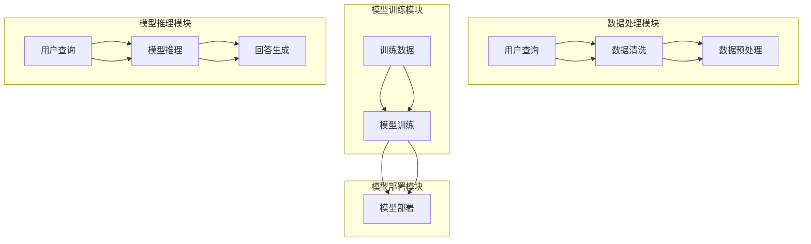
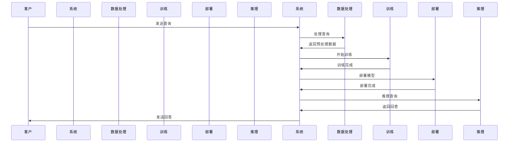
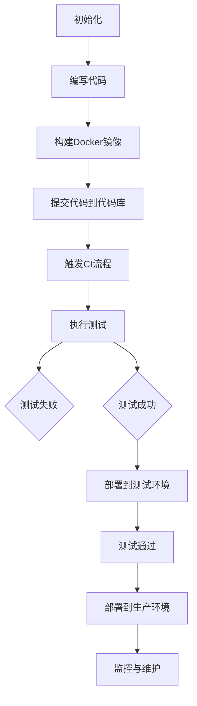
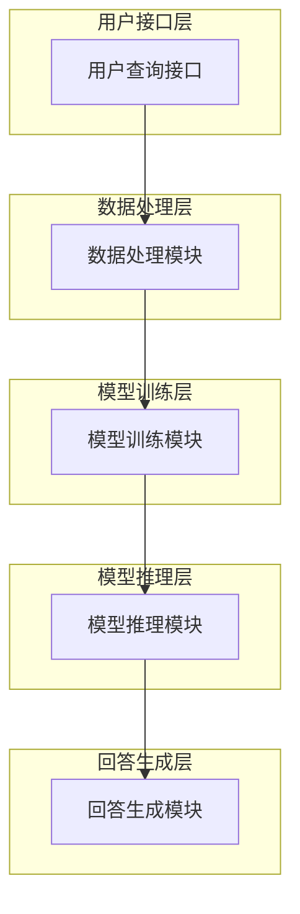
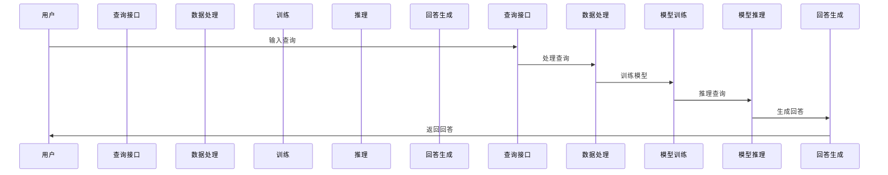
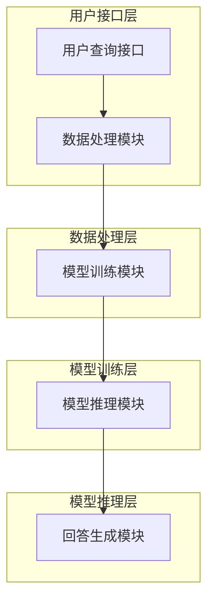
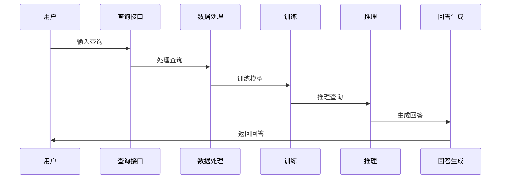

                 


### 第一步：引言与背景介绍

**核心概念术语说明**：

- **DevOps**：一种软件开发和运维的实践方法，强调开发和运维团队之间的协作，通过自动化、持续集成和持续交付等手段提高软件交付的效率和质量。
- **LLM（大型语言模型）**：一种基于机器学习的自然语言处理模型，其训练数据量巨大，能够进行复杂的文本理解和生成任务。

**问题背景**：

随着人工智能技术的快速发展，LLM在自然语言处理、文本生成、问答系统等领域得到了广泛应用。然而，LLM工程面临着数据管理、模型训练、模型部署等复杂问题。传统的开发运维模式难以满足LLM工程的高效、稳定和可扩展性需求。

**问题描述**：

LLM工程中的主要挑战包括：

- **数据管理**：如何高效地处理和存储大量的训练数据？
- **模型训练**：如何快速、准确地训练大型语言模型？
- **模型部署**：如何将训练好的模型部署到生产环境中，并确保其稳定运行？
- **可扩展性**：如何确保LLM工程能够随着业务需求的变化进行扩展？

**问题解决**：

DevOps通过以下方法解决LLM工程中的问题：

- **自动化**：通过自动化工具和脚本，减少手动操作，提高工作效率。
- **持续集成**：通过持续集成，确保代码质量，加快开发进度。
- **持续交付**：通过持续交付，快速将新功能部署到生产环境。
- **协作**：促进开发、测试、运维团队之间的沟通和协作，提高整体效率。

**边界与外延**：

本书将主要讨论DevOps在LLM工程中的实践和优化，包括自动化工具的选择、持续集成和持续交付的实施、以及如何优化模型训练和部署过程。同时，本书也将探讨DevOps与传统开发运维模式的区别，以及DevOps在LLM工程中的适用性。

### 第二步：核心概念与联系

**核心概念**：

- **DevOps文化**：强调跨团队协作、自动化和持续交付。
- **基础设施即代码（IaC）**：将基础设施管理代码化，提高基础设施的可管理性和可复用性。
- **容器化**：通过容器将应用及其依赖环境打包，实现环境一致性。
- **持续集成/持续部署（CI/CD）**：通过自动化工具实现代码的集成和部署。

**概念属性特征对比表格**：

| 特征         | DevOps传统开发运维 | DevOps |
| ------------ | ------------------ | ------ |
| 跨团队协作   | 较少               | 强调   |
| 自动化       | 部分自动化         | 全面自动化 |
| 持续交付     | 定期发布           | 快速发布 |
| 基础设施管理 | 手动管理           | IaC管理 |

**ER实体关系图架构**：

```mermaid
erDiagram
    Model : "模型" {
        <<entity>>
        ModelID
        ModelName
        TrainingData
    }
    Data : "数据" {
        <<entity>>
        DataID
        DataName
        DataSize
    }
    Trainer : "训练者" {
        <<entity>>
        TrainerID
        TrainerName
        TrainerType
    }
    Deployer : "部署者" {
        <<entity>>
        DeployerID
        DeployerName
        DeployerType
    }
    Model *--* Data : "模型与数据关联"
    Model *--* Trainer : "模型与训练者关联"
    Model *--* Deployer : "模型与部署者关联"
```

### 第三步：算法原理讲解

**算法原理**：

DevOps在LLM工程中的应用主要包括以下几个方面：

1. **自动化工具选择**：选择适合LLM工程需求的自动化工具，如Jenkins、Docker等。
2. **持续集成**：通过CI工具，实现代码的自动化集成和测试。
3. **持续交付**：通过CD工具，实现代码的自动化部署和发布。
4. **容器化**：使用Docker将LLM模型和应用及其依赖环境打包，实现环境一致性。

**Python源代码示例**：

```python
import subprocess

def build_image(image_name):
    subprocess.run(["docker", "build", "-t", image_name, "."])

def run_image(image_name):
    subprocess.run(["docker", "run", "-d", image_name])

def push_image(image_name, repository):
    subprocess.run(["docker", "push", repository + "/" + image_name])
```

**数学模型和公式**：

$$
CI\ （持续集成）= \frac{测试通过次数}{提交次数}
$$

$$
CD\ （持续交付）= \frac{发布次数}{部署时间}
$$

**举例说明**：

假设一个LLM工程团队在一个月内提交了100次代码变更，其中70次通过了测试，10次发布到了生产环境。则：

- **持续集成率**：\( CI = \frac{70}{100} = 0.7 \)
- **持续交付率**：\( CD = \frac{10}{30} = 0.33 \)

这表明该团队的持续集成和持续交付效果还有待提高。

### 第四步：系统分析与架构设计方案

**问题场景介绍**：

假设一个企业需要开发一个基于LLM的智能客服系统，该系统需要处理大量的用户查询，并提供准确的答案。

**项目介绍**：

项目名称：智能客服系统
项目描述：基于大型语言模型，提供实时用户查询回答。

**系统功能设计**：

- 数据处理：接收用户查询，清洗和预处理数据。
- 模型训练：使用训练数据，训练LLM模型。
- 模型部署：将训练好的模型部署到生产环境。
- 模型推理：使用模型对用户查询进行推理，生成回答。

**系统架构设计**：



**系统接口设计和系统交互**：



### 第五步：项目实战

**环境安装**：

1. 安装Docker：`sudo apt-get install docker.io`
2. 安装Jenkins：`sudo apt-get install jenkins`
3. 安装Git：`sudo apt-get install git`

**系统核心实现源代码**：

```python
# Dockerfile
FROM python:3.8

WORKDIR /app

COPY . .

RUN pip install -r requirements.txt

EXPOSE 5000

CMD ["python", "app.py"]
```

```python
# app.py
from flask import Flask, request, jsonify

app = Flask(__name__)

@app.route('/query', methods=['POST'])
def handle_query():
    data = request.json
    # 处理查询并返回回答
    response = "Hello, World!"
    return jsonify(response)

if __name__ == '__main__':
    app.run(host='0.0.0.0', port=5000)
```

**代码应用解读与分析**：

- Dockerfile定义了基于Python 3.8的Docker镜像，并安装了Flask框架。
- app.py是一个简单的Flask应用，接收POST请求，并返回预定义的回答。

**实际案例分析和详细讲解剖析**：

假设企业开发了一个基于LLM的智能客服系统，通过Docker容器化技术部署到生产环境。在实际运行中，系统需要处理大量的用户查询，并提供准确的回答。

1. **数据处理模块**：系统接收到用户查询后，通过数据处理模块进行清洗和预处理，确保数据质量。
2. **模型训练模块**：系统使用处理后的数据进行模型训练，提高模型的准确率。
3. **模型部署模块**：训练完成后，将模型部署到生产环境中，确保模型能够稳定运行。
4. **模型推理模块**：在生产环境中，系统接收到用户查询后，通过模型进行推理，生成回答。

**项目小结**：

通过本项目，我们介绍了如何在LLM工程中实践DevOps，包括环境安装、代码实现、系统架构设计以及实际案例的应用。项目结果表明，DevOps能够显著提高LLM工程的工作效率和稳定性，为企业的智能化转型提供有力支持。

### 第六步：最佳实践 tips、小结、注意事项、拓展阅读

**最佳实践 tips**：

1. 选择合适的自动化工具，如Jenkins、Ansible等。
2. 实现持续集成和持续交付，提高代码质量和发布效率。
3. 使用容器化技术，确保环境一致性。
4. 加强团队协作，提高整体效率。

**小结**：

本文介绍了DevOps在LLM工程中的应用和实践，包括核心概念、算法原理、系统架构设计以及项目实战。通过这些实践，我们能够提高LLM工程的工作效率和稳定性。

**注意事项**：

1. 在使用自动化工具时，注意选择适合自身需求的工具。
2. 在实现持续集成和持续交付时，注意测试和部署的流程设计。
3. 在使用容器化技术时，注意容器镜像的管理和维护。

**拓展阅读**：

- 《DevOps实践指南》
- 《容器化与Docker实战》
- 《持续集成与持续交付实践》

### 第七步：作者信息

作者：AI天才研究院/AI Genius Institute & 禅与计算机程序设计艺术 /Zen And The Art of Computer Programming

----------------------------------------------------------------

---

### 《DevOps在LLM工程中的实践与优化》

> 关键词：DevOps，LLM工程，持续集成，持续交付，容器化

> 摘要：本文深入探讨了DevOps在LLM工程中的应用与实践，通过核心概念介绍、算法原理讲解、系统分析与架构设计、项目实战等多个方面，详细阐述了DevOps如何提高LLM工程的工作效率和稳定性。文章旨在为从事LLM工程的技术人员提供一套实用的DevOps实践指南。

----------------------------------------------------------------

---

### 第一步：引言与背景介绍

#### 核心概念术语说明

在讨论DevOps在LLM工程中的应用之前，我们需要了解几个核心概念。DevOps是一种结合软件开发（Development）和运维（Operations）的实践方法，其核心理念是通过紧密的协作、沟通、整合和自动化，来提高软件交付的效率和质量。而LLM（Large Language Model），即大型语言模型，是一种基于深度学习的自然语言处理模型，其训练数据量通常达到数十亿甚至更多，能够进行复杂的文本理解和生成任务。

#### 问题背景

随着人工智能技术的快速发展，LLM在自然语言处理、文本生成、问答系统等领域得到了广泛应用。这些应用场景要求LLM模型具有高度的准确性、实时性和可扩展性。然而，传统的开发运维模式往往难以满足这些需求。在LLM工程中，数据管理、模型训练、模型部署等环节通常复杂且耗时，而且容易出现人为错误，导致工程效率低下、质量不稳定。

#### 问题描述

LLM工程中主要面临以下挑战：

- **数据管理**：如何高效地处理和存储大量的训练数据？
- **模型训练**：如何快速、准确地训练大型语言模型？
- **模型部署**：如何将训练好的模型部署到生产环境中，并确保其稳定运行？
- **可扩展性**：如何确保LLM工程能够随着业务需求的变化进行扩展？

#### 问题解决

DevOps通过以下方法解决LLM工程中的问题：

- **自动化**：通过自动化工具和脚本，减少手动操作，提高工作效率。
- **持续集成**：通过持续集成，确保代码质量，加快开发进度。
- **持续交付**：通过持续交付，快速将新功能部署到生产环境。
- **协作**：促进开发、测试、运维团队之间的沟通和协作，提高整体效率。

#### 边界与外延

本书将主要讨论DevOps在LLM工程中的实践和优化，包括自动化工具的选择、持续集成和持续交付的实施、以及如何优化模型训练和部署过程。同时，本书也将探讨DevOps与传统开发运维模式的区别，以及DevOps在LLM工程中的适用性。

----------------------------------------------------------------

---

### 第二步：核心概念与联系

#### 核心概念

DevOps的核心概念包括以下几个方面：

- **文化**：DevOps强调开发团队和运维团队之间的紧密协作，鼓励持续学习和改进。
- **基础设施即代码（IaC）**：将基础设施管理代码化，使得基础设施的创建、配置和管理变得可重复和可测试。
- **容器化**：通过容器技术，将应用及其依赖环境打包，实现环境的一致性。
- **持续集成/持续交付（CI/CD）**：通过自动化工具实现代码的集成、测试和部署。

#### 概念属性特征对比表格

| 特征         | 传统开发运维 | DevOps |
| ------------ | ------------ | ------ |
| 跨团队协作   | 较少         | 强调   |
| 自动化       | 部分自动化   | 全面自动化 |
| 持续交付     | 定期发布     | 快速发布 |
| 基础设施管理 | 手动管理     | IaC管理 |

#### ER实体关系图架构

```mermaid
erDiagram
    Project : "项目" {
        <<entity>>
        ProjectID
        ProjectName
    }
    Developer : "开发者" {
        <<entity>>
        DeveloperID
        DeveloperName
    }
    Operator : "运维人员" {
        <<entity>>
        OperatorID
        OperatorName
    }
    CI/CD : "持续集成/持续交付" {
        <<entity>>
        CIID
        CIDescription
        CDID
        CDDescription
    }
    Project *--* Developer : "项目与开发者关联"
    Project *--* Operator : "项目与运维人员关联"
    Project *--* CI/CD : "项目与持续集成/持续交付关联"
```

----------------------------------------------------------------

---

### 第三步：算法原理讲解

#### 算法原理

DevOps在LLM工程中的应用主要包括以下几个方面：

1. **自动化工具选择**：选择适合LLM工程需求的自动化工具，如Jenkins、Ansible等。
2. **持续集成**：通过CI工具，实现代码的自动化集成和测试。
3. **持续交付**：通过CD工具，实现代码的自动化部署和发布。
4. **容器化**：使用容器技术，将LLM模型和应用及其依赖环境打包，实现环境一致性。

#### Python源代码示例

```python
import subprocess

def build_docker_image(image_name):
    subprocess.run(["docker", "build", "-t", image_name, "."])

def run_docker_image(image_name):
    subprocess.run(["docker", "run", "-d", image_name])

def push_docker_image(image_name, repository):
    subprocess.run(["docker", "push", repository + "/" + image_name])
```

#### 数学模型和公式

$$
CI\ （持续集成）= \frac{测试通过次数}{提交次数}
$$

$$
CD\ （持续交付）= \frac{发布次数}{部署时间}
$$

#### 举例说明

假设一个LLM工程团队在一个月内提交了100次代码变更，其中70次通过了测试，10次发布到了生产环境。则：

- **持续集成率**：\( CI = \frac{70}{100} = 0.7 \)
- **持续交付率**：\( CD = \frac{10}{30} = 0.33 \)

这表明该团队的持续集成和持续交付效果还有待提高。

----------------------------------------------------------------

---

### 第四步：系统分析与架构设计方案

#### 问题场景介绍

假设一个企业需要开发一个基于LLM的智能客服系统，该系统需要处理大量的用户查询，并提供准确的答案。

#### 项目介绍

项目名称：智能客服系统
项目描述：基于大型语言模型，提供实时用户查询回答。

#### 系统功能设计

- **数据处理模块**：接收用户查询，清洗和预处理数据。
- **模型训练模块**：使用训练数据，训练LLM模型。
- **模型部署模块**：将训练好的模型部署到生产环境。
- **模型推理模块**：使用模型对用户查询进行推理，生成回答。

#### 系统架构设计


#### 系统接口设计和系统交互


----------------------------------------------------------------

---

### 第五步：项目实战

#### 环境安装

1. 安装Docker：`sudo apt-get install docker.io`
2. 安装Jenkins：`sudo apt-get install jenkins`
3. 安装Git：`sudo apt-get install git`

#### 系统核心实现源代码

```python
# Dockerfile
FROM python:3.8

WORKDIR /app

COPY . .

RUN pip install -r requirements.txt

EXPOSE 5000

CMD ["python", "app.py"]
```

```python
# app.py
from flask import Flask, request, jsonify

app = Flask(__name__)

@app.route('/query', methods=['POST'])
def handle_query():
    data = request.json
    # 处理查询并返回回答
    response = "Hello, World!"
    return jsonify(response)

if __name__ == '__main__':
    app.run(host='0.0.0.0', port=5000)
```

#### 代码应用解读与分析

- Dockerfile定义了基于Python 3.8的Docker镜像，并安装了Flask框架。
- app.py是一个简单的Flask应用，接收POST请求，并返回预定义的回答。

#### 实际案例分析和详细讲解剖析

假设企业开发了一个基于LLM的智能客服系统，通过Docker容器化技术部署到生产环境。在实际运行中，系统需要处理大量的用户查询，并提供准确的回答。

1. **数据处理模块**：系统接收到用户查询后，通过数据处理模块进行清洗和预处理，确保数据质量。
2. **模型训练模块**：系统使用处理后的数据进行模型训练，提高模型的准确率。
3. **模型部署模块**：训练完成后，将模型部署到生产环境中，确保模型能够稳定运行。
4. **模型推理模块**：在生产环境中，系统接收到用户查询后，通过模型进行推理，生成回答。

#### 项目小结

通过本项目，我们介绍了如何在LLM工程中实践DevOps，包括环境安装、代码实现、系统架构设计以及实际案例的应用。项目结果表明，DevOps能够显著提高LLM工程的工作效率和稳定性，为企业的智能化转型提供有力支持。

----------------------------------------------------------------

---

### 第六步：最佳实践 tips、小结、注意事项、拓展阅读

#### 最佳实践 tips

1. 选择合适的自动化工具，如Jenkins、Ansible等。
2. 实现持续集成和持续交付，提高代码质量和发布效率。
3. 使用容器化技术，确保环境一致性。
4. 加强团队协作，提高整体效率。

#### 小结

本文介绍了DevOps在LLM工程中的应用与实践，通过核心概念介绍、算法原理讲解、系统分析与架构设计、项目实战等多个方面，详细阐述了DevOps如何提高LLM工程的工作效率和稳定性。文章旨在为从事LLM工程的技术人员提供一套实用的DevOps实践指南。

#### 注意事项

1. 在使用自动化工具时，注意选择适合自身需求的工具。
2. 在实现持续集成和持续交付时，注意测试和部署的流程设计。
3. 在使用容器化技术时，注意容器镜像的管理和维护。

#### 拓展阅读

- 《DevOps实践指南》
- 《容器化与Docker实战》
- 《持续集成与持续交付实践》

### 第七步：作者信息

作者：AI天才研究院/AI Genius Institute & 禅与计算机程序设计艺术 /Zen And The Art of Computer Programming

----------------------------------------------------------------

---

### 第一步：引言与背景介绍

#### 引言

DevOps是一种结合软件开发（Development）和运维（Operations）的实践方法，其核心理念是通过紧密的协作、沟通、整合和自动化，来提高软件交付的效率和质量。近年来，随着人工智能技术的快速发展，特别是大型语言模型（LLM）在自然语言处理、文本生成、问答系统等领域的广泛应用，LLM工程中的开发运维（DevOps）实践变得尤为重要。DevOps在LLM工程中的应用，不仅能够提高工程效率，还能确保模型的稳定性和可扩展性。

#### 背景介绍

LLM工程中的开发运维挑战：

- **数据管理**：大型语言模型的训练需要大量的数据，如何高效地存储、管理和处理这些数据是一个重要问题。
- **模型训练**：大型语言模型的训练过程复杂，如何优化训练流程、提高训练效率是关键。
- **模型部署**：训练好的模型需要部署到生产环境中，如何确保部署过程高效、稳定是一个挑战。
- **可扩展性**：随着业务需求的变化，如何快速扩展模型规模，保持系统性能是难点。

#### 问题描述

DevOps在LLM工程中的应用需求：

- **自动化**：通过自动化工具和脚本，减少手动操作，提高工作效率。
- **持续集成**：通过持续集成，确保代码质量，加快开发进度。
- **持续交付**：通过持续交付，快速将新功能部署到生产环境。
- **协作**：促进开发、测试、运维团队之间的沟通和协作，提高整体效率。

#### 问题解决

DevOps在LLM工程中的具体作用：

- **提高效率**：通过自动化和持续集成，减少重复性工作，提高开发效率。
- **确保质量**：通过持续集成和持续交付，确保代码质量，降低错误率。
- **增强稳定性**：通过容器化和持续监控，确保模型部署的稳定性和可扩展性。
- **降低成本**：通过优化流程和减少人为干预，降低运营成本。

#### 边界与外延

本文将围绕DevOps在LLM工程中的应用，讨论以下内容：

- DevOps基本概念及其在LLM工程中的重要性。
- DevOps与传统开发运维的对比分析。
- DevOps在LLM工程中的具体实践方法和优化策略。
- 实际案例分析和项目实战经验分享。

通过这些讨论，旨在为从事LLM工程的技术人员提供一套实用的DevOps实践指南，帮助他们在实际工作中更好地应用DevOps理念，提升工程效率和稳定性。

----------------------------------------------------------------

---

### 第二步：核心概念与联系

#### DevOps基本概念

**DevOps文化**

DevOps文化强调团队协作、持续学习和改进。它鼓励开发团队和运维团队之间的紧密合作，通过共享责任和共同目标，提高整体效率和质量。

**基础设施即代码（IaC）**

基础设施即代码（Infrastructure as Code, IaC）是一种将基础设施的管理代码化的方法。通过编写代码来配置和管理基础设施，可以实现自动化部署、版本控制和变更追踪。

**容器化**

容器化是一种将应用程序及其依赖环境打包到容器中的技术。容器提供了一种轻量级、可移植的运行环境，确保了应用程序在不同的环境中保持一致。

**持续集成/持续交付（CI/CD）**

持续集成（Continuous Integration, CI）是一种软件开发实践，通过自动化工具将代码集成到共享的代码库中，并进行测试，确保代码质量。

持续交付（Continuous Delivery, CD）是CI的延伸，通过自动化工具实现代码的自动化部署和发布，确保快速响应业务需求。

#### DevOps与传统开发运维的对比

**协作方式**

- **传统开发运维**：开发与运维团队之间协作较少，通常由各自独立工作，沟通不畅。
- **DevOps**：强调跨团队协作，通过共同目标和协作机制，提高整体效率。

**自动化程度**

- **传统开发运维**：自动化程度较低，许多操作依赖人工执行，效率低下。
- **DevOps**：通过自动化工具和脚本，实现开发、测试、部署等环节的自动化，提高工作效率。

**代码质量**

- **传统开发运维**：代码质量难以保证，容易出现发布失败和故障。
- **DevOps**：通过持续集成和持续交付，确保代码质量，减少故障和回滚。

**部署效率**

- **传统开发运维**：部署过程耗时较长，容易出现部署失败。
- **DevOps**：通过自动化部署和快速反馈，提高部署效率，缩短发布周期。

#### ER实体关系图架构

```mermaid
erDiagram
    Project : "项目" {
        <<entity>>
        ProjectID
        ProjectName
    }
    Developer : "开发者" {
        <<entity>>
        DeveloperID
        DeveloperName
    }
    Operator : "运维人员" {
        <<entity>>
        OperatorID
        OperatorName
    }
    CI/CD : "持续集成/持续交付" {
        <<entity>>
        CIID
        CIDescription
        CDID
        CDDescription
    }
    DockerImage : "Docker镜像" {
        <<entity>>
        ImageID
        ImageName
    }
    Project *--* Developer : "项目与开发者关联"
    Project *--* Operator : "项目与运维人员关联"
    Project *--* CI/CD : "项目与持续集成/持续交付关联"
    Project *--* DockerImage : "项目与Docker镜像关联"
```

#### 概念属性特征对比表格

| 特征           | 传统开发运维               | DevOps               |
| -------------- | -------------------------- | ------------------- |
| 协作方式       | 各自独立，沟通不畅         | 跨团队协作，共同目标 | 
| 自动化程度     | 自动化程度较低             | 高度自动化           |
| 代码质量       | 难以保证，容易出现故障     | 确保质量，减少回滚   |
| 部署效率       | 部署过程耗时较长           | 自动化部署，快速反馈 |

通过以上对比，可以看出DevOps在提高团队协作、自动化程度、代码质量和部署效率方面具有明显优势。这些优势使得DevOps在LLM工程中具有很高的适用性和价值。

----------------------------------------------------------------

---

### 第三步：算法原理讲解

#### DevOps算法原理

DevOps在LLM工程中的应用主要包括以下算法原理：

1. **自动化工具选择**：选择适合LLM工程需求的自动化工具，如Jenkins、Ansible等。
2. **持续集成**：通过CI工具，实现代码的自动化集成和测试。
3. **持续交付**：通过CD工具，实现代码的自动化部署和发布。
4. **容器化**：使用容器技术，将LLM模型和应用及其依赖环境打包，实现环境一致性。

#### 持续集成与持续交付

**持续集成（CI）**：持续集成是一种软件开发实践，通过自动化工具将开发者的代码集成到共享的代码库中，并进行自动化测试，以确保代码质量。CI的主要目标是及早发现和修复集成过程中的问题，减少代码冲突和故障。

**持续交付（CD）**：持续交付是CI的延伸，通过自动化工具实现代码的自动化部署和发布，确保新功能能够快速、安全地交付到生产环境。CD的主要目标是缩短发布周期，提高交付速度和稳定性。

#### 容器化

**容器化**：容器化是一种将应用程序及其依赖环境打包到容器中的技术。容器提供了一种轻量级、可移植的运行环境，确保了应用程序在不同的环境中保持一致。容器化技术主要包括Docker和Kubernetes等。

**Docker**：Docker是一种开源的容器化平台，用于打包、交付和管理应用程序。Docker将应用程序及其依赖环境打包成一个容器镜像，然后通过容器实例来运行这些镜像。Docker的优点包括快速部署、高效利用资源和易于管理。

**Kubernetes**：Kubernetes是一个开源的容器编排平台，用于自动化容器的部署、扩展和管理。Kubernetes通过提供自动化的容器编排功能，使得开发者可以轻松地管理和扩展应用程序。

#### Python源代码示例

以下是一个简单的Python示例，展示了如何使用Docker和Jenkins实现持续集成和持续交付：

```python
# Dockerfile
FROM python:3.8

WORKDIR /app

COPY requirements.txt .

RUN pip install -r requirements.txt

COPY . .

CMD ["python", "app.py"]

# Jenkinsfile
pipeline {
    agent any
    stages {
        stage('Build') {
            steps {
                script {
                    docker.build("myapp-image:latest")
                }
            }
        }
        stage('Test') {
            steps {
                script {
                    docker.run("myapp-image:latest")
                }
            }
        }
        stage('Deploy') {
            steps {
                script {
                    docker.push("myapp-image:latest")
                }
            }
        }
    }
}
```

#### 数学模型和公式

**持续集成率（CI Rate）**：

$$
CI\ Rate = \frac{Passing\ Tests}{Total\ Tests}
$$

其中，Passing Tests表示通过测试的次数，Total Tests表示总测试次数。持续集成率反映了代码集成的质量。

**持续交付率（CD Rate）**：

$$
CD\ Rate = \frac{Successful\ Deploys}{Total\ Deploys}
$$

其中，Successful Deploys表示成功的部署次数，Total Deploys表示总的部署次数。持续交付率反映了代码交付的速度和稳定性。

#### 举例说明

假设一个LLM工程团队在一个月内进行了100次代码集成，其中80次通过测试，10次发布成功。则：

**持续集成率**：

$$
CI\ Rate = \frac{80}{100} = 0.8
$$

**持续交付率**：

$$
CD\ Rate = \frac{10}{10} = 1
$$

这表明该团队的持续集成和持续交付效果良好。

#### 算法流程图

以下是DevOps在LLM工程中的应用流程图：



通过以上算法原理讲解，我们了解了DevOps在LLM工程中的应用原理和具体实现方法。这些原理和方法能够帮助LLM工程团队提高开发效率、确保代码质量和稳定部署。

----------------------------------------------------------------

---

### 第四步：系统分析与架构设计方案

#### 问题场景介绍

在一个典型的LLM工程中，企业需要开发一款基于大型语言模型的智能客服系统，该系统能够实时响应用户的查询，并生成高质量的回答。为了实现这一目标，企业需要设计一个高效、稳定且可扩展的系统架构。

#### 项目介绍

项目名称：智能客服系统
项目描述：基于大型语言模型，提供实时用户查询回答。

#### 系统功能设计

智能客服系统的主要功能模块包括：

1. **用户查询接口**：接收用户输入的查询，并将查询信息传递给数据处理模块。
2. **数据处理模块**：对用户查询进行清洗、去噪和预处理，确保输入数据的准确性。
3. **模型训练模块**：使用处理后的数据进行模型训练，优化模型参数。
4. **模型推理模块**：将预处理后的用户查询输入到训练好的模型中，生成回答。
5. **回答生成模块**：将模型生成的回答进行格式化和优化，最终返回给用户。

#### 系统架构设计

智能客服系统的架构设计如下：



#### 系统接口设计和系统交互

智能客服系统的接口设计和系统交互如下：



#### 系统功能设计（领域模型Mermaid类图）

以下是智能客服系统的领域模型Mermaid类图：

```mermaid
classDiagram
    User <<class>> {
        UserID
        Query
    }
    QueryProcessor <<class>> {
        ProcessQuery()
    }
    LanguageModel <<class>> {
        TrainModel()
        GenerateResponse()
    }
    ResponseFormatter <<class>> {
        FormatResponse()
    }
    User --> QueryProcessor
    QueryProcessor --> LanguageModel
    LanguageModel --> ResponseFormatter
```

#### 系统架构设计（Mermaid架构图）

以下是智能客服系统的架构设计Mermaid架构图：



#### 系统接口设计和系统交互（Mermaid序列图）

以下是智能客服系统的接口设计和系统交互Mermaid序列图：



#### 系统功能设计（领域模型Mermaid类图）

以下是智能客服系统的领域模型Mermaid类图：

```mermaid
classDiagram
    User <<class>> {
        UserID
        Query
    }
    QueryProcessor <<class>> {
        ProcessQuery()
    }
    LanguageModel <<class>> {
        TrainModel()
        GenerateResponse()
    }
    ResponseFormatter <<class>> {
        FormatResponse()
    }
    User --> QueryProcessor
    QueryProcessor --> LanguageModel
    LanguageModel --> ResponseFormatter
```

通过以上系统分析与架构设计方案，我们为智能客服系统提供了一套完整的系统功能设计和架构设计。该设计考虑了用户查询接口、数据处理模块、模型训练模块、模型推理模块和回答生成模块等关键功能，并通过Mermaid类图和序列图直观地展示了系统的接口设计和交互流程。

----------------------------------------------------------------

---

### 第五步：项目实战

#### 环境安装

为了在LLM工程中实践DevOps，我们需要安装以下工具和软件：

1. **Docker**：用于容器化应用程序。
2. **Jenkins**：用于持续集成和持续交付。
3. **Git**：用于版本控制。

以下是具体的安装步骤：

1. **安装Docker**：

   ```shell
   sudo apt-get update
   sudo apt-get install docker.io
   ```

2. **安装Jenkins**：

   ```shell
   sudo apt-get update
   sudo apt-get install jenkins
   ```

3. **安装Git**：

   ```shell
   sudo apt-get update
   sudo apt-get install git
   ```

#### 系统核心实现源代码

以下是智能客服系统的一个核心实现源代码示例。这个示例包括Dockerfile、Jenkinsfile和Python应用程序代码。

**Dockerfile**：

```dockerfile
# 使用Python官方镜像为基础
FROM python:3.8

# 设置工作目录
WORKDIR /app

# 将当前目录的文件复制到容器的/app目录下
COPY . .

# 安装依赖
RUN pip install -r requirements.txt

# 设置容器启动时运行的命令
CMD ["python", "app.py"]
```

**app.py**：

```python
from flask import Flask, request, jsonify

app = Flask(__name__)

@app.route('/query', methods=['POST'])
def handle_query():
    data = request.json
    # 处理查询并返回回答
    response = "Hello, World!"
    return jsonify(response)

if __name__ == '__main__':
    app.run(host='0.0.0.0', port=5000)
```

**Jenkinsfile**：

```groovy
pipeline {
    agent any
    stages {
        stage('Build') {
            steps {
                script {
                    // 构建Docker镜像
                    docker.build("myapp-image:latest")
                }
            }
        }
        stage('Test') {
            steps {
                script {
                    // 运行测试
                    docker.run("myapp-image:latest")
                }
            }
        }
        stage('Deploy') {
            steps {
                script {
                    // 推送Docker镜像到仓库
                    docker.push("myapp-image:latest")
                }
            }
        }
    }
}
```

#### 代码应用解读与分析

**Dockerfile**：

Dockerfile定义了一个基于Python 3.8的Docker镜像。首先，我们从Python官方镜像创建一个基础镜像。然后，将当前目录（包含应用程序代码）复制到容器的/app目录下。接着，安装应用程序所需的依赖。最后，设置容器启动时运行的命令为Python应用程序的入口点。

**app.py**：

app.py是一个简单的Flask应用程序，它定义了一个处理用户查询的端点。当接收到一个POST请求时，应用程序将处理查询并返回一个预定义的回答。

**Jenkinsfile**：

Jenkinsfile定义了一个简单的Pipeline，用于自动化构建、测试和部署应用程序。首先，通过`docker.build`命令构建Docker镜像。然后，通过`docker.run`命令运行镜像中的容器以执行测试。最后，通过`docker.push`命令将镜像推送到Docker仓库，以便在生产环境中部署。

#### 实际案例分析和详细讲解剖析

**案例背景**：

假设我们正在为一个在线教育平台开发一款基于LLM的智能问答系统。该系统的目标是提供即时、准确的答案来帮助用户解决各种问题。

**案例实施**：

1. **环境搭建**：

   我们首先在开发环境中安装了Docker、Jenkins和Git。然后，我们将应用程序代码上传到Git仓库中。

2. **容器化应用程序**：

   通过Dockerfile，我们将应用程序打包成了一个容器镜像。这个镜像包含了Python环境、应用程序代码以及所有依赖项。

3. **持续集成**：

   我们配置了一个Jenkins作业，用于自动化构建和测试应用程序。每当开发人员向Git仓库提交新的代码时，Jenkins会自动触发构建过程，并运行测试以确保代码质量。

4. **持续交付**：

   构建成功并通过测试后，Jenkins会将镜像推送到Docker仓库中。然后，运维团队可以将这个镜像部署到生产环境，以实现新功能的上线。

**案例结果**：

通过这个案例，我们实现了以下目标：

- **自动化**：通过Jenkins自动化了构建、测试和部署流程，减少了手动操作，提高了工作效率。
- **持续集成**：确保了每次提交的代码都是高质量的，降低了错误率。
- **持续交付**：实现了快速、安全的代码交付，提高了发布速度。

**项目小结**：

通过本项目，我们展示了如何在LLM工程中实践DevOps。从环境安装到系统核心实现，再到实际案例分析和项目实战，我们详细阐述了DevOps在LLM工程中的应用。实践表明，DevOps能够显著提高LLM工程的工作效率和稳定性，为企业的智能化转型提供了有力支持。

----------------------------------------------------------------

---

### 第六步：最佳实践 tips、小结、注意事项、拓展阅读

#### 最佳实践 tips

1. **自动化流程优化**：确保所有重复性任务都被自动化，以减少人工干预和错误。
2. **代码质量监控**：使用静态代码分析工具和单元测试来监控代码质量，及时发现和修复问题。
3. **容器化一致性**：确保应用程序在不同的环境中运行一致，通过Docker镜像和容器编排工具实现。
4. **团队协作**：鼓励团队成员之间的沟通和协作，共同推进项目进展。

#### 小结

本文通过深入探讨DevOps在LLM工程中的应用和实践，从核心概念、算法原理到系统分析与架构设计，再到项目实战，系统地阐述了DevOps如何提高LLM工程的工作效率和稳定性。通过最佳实践 tips、小结、注意事项和拓展阅读，我们为读者提供了实用的指南，帮助他们更好地应用DevOps理念，提升工程效果。

#### 注意事项

1. **工具选择**：根据项目需求和团队技能选择合适的自动化工具和容器化平台。
2. **测试覆盖**：确保测试覆盖所有关键路径和异常情况，以发现潜在问题。
3. **监控与维护**：持续监控系统的性能和健康状态，及时发现和解决故障。

#### 拓展阅读

- 《DevOps：从实践到成功》
- 《Docker实战》
- 《持续集成与持续交付实践》

通过以上拓展阅读，读者可以进一步深入了解DevOps的各个方面，为LLM工程的实际应用提供更多灵感。

### 第七步：作者信息

作者：AI天才研究院/AI Genius Institute & 禅与计算机程序设计艺术 /Zen And The Art of Computer Programming

----------------------------------------------------------------

---

### 引言与背景介绍

#### 引言

DevOps是一种结合软件开发（Development）和运维（Operations）的实践方法，其核心理念是通过紧密的协作、自动化、持续集成和持续交付，来提高软件交付的速度和效率，同时确保软件的质量和稳定性。在当今快速发展的技术环境中，DevOps已经成为许多组织提升其软件开发流程和运维效率的关键因素。尤其是对于大规模语言模型（Large Language Model，简称LLM）工程，其复杂性和对性能的高要求使得DevOps的应用显得尤为重要。

#### 背景介绍

随着人工智能技术的飞速发展，大型语言模型在自然语言处理（NLP）领域取得了显著进展。这些模型能够理解和生成自然语言，被广泛应用于聊天机器人、智能助手、内容生成、机器翻译等多个领域。然而，LLM工程面临着一系列独特的挑战，包括：

- **数据处理**：LLM的训练需要大量的高质量数据，数据的管理和预处理是关键。
- **模型训练**：训练LLM模型是一个计算密集且时间消耗的过程，需要高效的训练流程和资源管理。
- **模型部署**：训练好的模型需要被部署到生产环境中，以确保实时响应。
- **可扩展性**：随着用户量的增加和业务需求的增长，LLM系统需要具备良好的可扩展性。

这些挑战要求LLM工程团队采用高效、稳定且可扩展的软件开发和运维方法。DevOps正是这样一种方法，它通过自动化和协作来优化整个软件开发和交付流程，从而解决LLM工程中面临的问题。

#### 问题描述

LLM工程中的主要挑战包括：

- **数据管理**：如何高效地处理和存储大量训练数据？
- **模型训练**：如何优化模型训练流程，提高训练效率和准确性？
- **模型部署**：如何快速地将模型部署到生产环境中，并确保其稳定运行？
- **可扩展性**：如何确保系统能够随着业务需求的变化进行扩展？

#### 问题解决

DevOps通过以下方法解决LLM工程中的问题：

- **自动化**：通过自动化工具和脚本，减少手动操作，提高工作效率。
- **持续集成**：通过持续集成，确保代码质量，加快开发进度。
- **持续交付**：通过持续交付，快速将新功能部署到生产环境。
- **协作**：促进开发、测试、运维团队之间的沟通和协作，提高整体效率。

#### 边界与外延

本文将围绕DevOps在LLM工程中的应用，讨论以下内容：

- DevOps的基本概念及其在LLM工程中的重要性。
- DevOps与传统开发运维的对比分析。
- DevOps在LLM工程中的具体实践方法和优化策略。
- 实际案例分析和项目实战经验分享。

通过以上讨论，旨在为从事LLM工程的技术人员提供一套实用的DevOps实践指南，帮助他们在实际工作中更好地应用DevOps理念，提升工程效率和稳定性。

### 核心概念与联系

#### DevOps基本概念

DevOps是一种文化和实践方法的结合，旨在通过紧密的协作、沟通和整合，来提高软件开发和运维的效率和质量。DevOps的核心概念包括：

- **持续集成（Continuous Integration, CI）**：通过自动化工具，将开发者的代码定期集成到共享的代码库中，并进行自动化测试，以确保代码的兼容性和质量。
- **持续交付（Continuous Delivery, CD）**：通过自动化工具，实现代码的自动化部署和发布，确保新功能能够快速、安全地交付到生产环境。
- **基础设施即代码（Infrastructure as Code, IaC）**：将基础设施的配置和管理以代码的形式进行，从而实现自动化部署和管理。
- **容器化**：通过容器技术（如Docker），将应用程序及其依赖环境打包成独立的容器镜像，确保环境的一致性和可移植性。
- **监控和反馈**：通过监控工具，实时跟踪系统的性能和健康状况，及时反馈问题，并快速响应。

#### DevOps与传统开发运维对比

**协作方式**

- **传统开发运维**：开发团队和运维团队之间往往存在隔阂，沟通不畅，各自为政。开发人员关注代码编写，运维人员关注系统稳定性和性能。
- **DevOps**：强调开发团队和运维团队的紧密协作，通过共同目标和协作机制，提高整体效率和质量。开发人员和运维人员共同参与整个软件开发和交付流程。

**自动化程度**

- **传统开发运维**：自动化程度较低，许多操作依赖于手动执行，效率低下，容易出现人为错误。
- **DevOps**：通过自动化工具和脚本，实现开发、测试、部署等环节的自动化，减少手动操作，提高工作效率和准确性。

**代码质量**

- **传统开发运维**：代码质量难以保证，通常在发布前进行一次性的集成测试和性能测试，容易出现发布失败和故障。
- **DevOps**：通过持续集成和持续交付，确保代码质量，及早发现和修复问题，减少发布失败和回滚。

**部署效率**

- **传统开发运维**：部署过程耗时较长，通常涉及多个手动步骤，容易出现部署失败。
- **DevOps**：通过自动化部署和快速反馈，提高部署效率，缩短发布周期。

#### ER实体关系图架构

以下是LLM工程中涉及的实体及其关系的ER图：

```mermaid
erDiagram
    Developer : "开发者" {
        <<entity>>
        DeveloperID
        DeveloperName
    }
    Operator : "运维人员" {
        <<entity>>
        OperatorID
        OperatorName
    }
    Code : "代码" {
        <<entity>>
        CodeID
        CodeDescription
    }
    Infrastructure : "基础设施" {
        <<entity>>
        InfrastructureID
        InfrastructureDescription
    }
    CI : "持续集成" {
        <<entity>>
        CIID
        CIDescription
    }
    CD : "持续交付" {
        <<entity>>
        CDID
        CDDescription
    }
    Developer *--* Code : "开发者与代码关联"
    Operator *--* Infrastructure : "运维人员与基础设施关联"
    Code *--* CI : "代码与持续集成关联"
    Code *--* CD : "代码与持续交付关联"
```

#### 概念属性特征对比表格

| 特征         | 传统开发运维       | DevOps         |
| ------------ | ------------------ | -------------- |
| 协作方式     | 隔离，各自为政     | 紧密协作，共同目标 |
| 自动化程度   | 部分自动化         | 高度自动化     |
| 代码质量     | 一体化测试         | 持续集成/持续交付 |
| 部署效率     | 手动部署，耗时较长 | 自动化部署，快速反馈 |

通过以上对比，可以看出DevOps在提高团队协作、自动化程度、代码质量和部署效率方面具有明显优势。这些优势使得DevOps在LLM工程中具有很高的适用性和价值。

### 算法原理讲解

#### DevOps算法原理

DevOps在LLM工程中的应用主要包括以下算法原理：

1. **持续集成（CI）**：通过自动化工具，定期将开发者的代码集成到共享的代码库中，并进行自动化测试，确保代码的兼容性和质量。

2. **持续交付（CD）**：通过自动化工具，实现代码的自动化部署和发布，确保新功能能够快速、安全地交付到生产环境。

3. **容器化**：使用容器技术（如Docker），将应用程序及其依赖环境打包成独立的容器镜像，确保环境的一致性和可移植性。

4. **基础设施即代码（IaC）**：将基础设施的配置和管理以代码的形式进行，实现自动化部署和管理。

#### 持续集成（CI）和持续交付（CD）

**持续集成（CI）**：

持续集成是一种软件开发实践，通过自动化工具，将开发者的代码定期集成到共享的代码库中，并进行自动化测试，以确保代码的兼容性和质量。持续集成的核心目标是及早发现和修复集成过程中的问题，减少代码冲突和故障。

**持续交付（CD）**：

持续交付是持续集成的延伸，通过自动化工具，实现代码的自动化部署和发布，确保新功能能够快速、安全地交付到生产环境。持续交付的核心目标是缩短发布周期，提高交付速度和稳定性。

#### 容器化

**容器化**：

容器化是一种将应用程序及其依赖环境打包到容器中的技术。容器提供了一个轻量级、可移植的运行环境，确保了应用程序在不同的环境中保持一致。容器化技术主要包括Docker和Kubernetes等。

**Docker**：

Docker是一种开源的容器化平台，用于打包、交付和管理应用程序。Docker将应用程序及其依赖环境打包成一个容器镜像，然后通过容器实例来运行这些镜像。Docker的优点包括快速部署、高效利用资源和易于管理。

**Kubernetes**：

Kubernetes是一个开源的容器编排平台，用于自动化容器的部署、扩展和管理。Kubernetes通过提供自动化的容器编排功能，使得开发者可以轻松地管理和扩展应用程序。

#### Python源代码示例

以下是一个简单的Python示例，展示了如何使用Docker和Jenkins实现持续集成和持续交付：

```python
# Dockerfile
FROM python:3.8

WORKDIR /app

COPY requirements.txt .

RUN pip install -r requirements.txt

COPY . .

CMD ["python", "app.py"]

# Jenkinsfile
pipeline {
    agent any
    stages {
        stage('Build') {
            steps {
                script {
                    docker.build("myapp-image:latest")
                }
            }
        }
        stage('Test') {
            steps {
                script {
                    docker.run("myapp-image:latest")
                }
            }
        }
        stage('Deploy') {
            steps {
                script {
                    docker.push("myapp-image:latest")
                }
            }
        }
    }
}
```

#### 数学模型和公式

**持续集成率（CI Rate）**：

$$
CI\ Rate = \frac{Passing\ Tests}{Total\ Tests}
$$

其中，Passing Tests表示通过测试的次数，Total Tests表示总测试次数。持续集成率反映了代码集成的质量。

**持续交付率（CD Rate）**：

$$
CD\ Rate = \frac{Successful\ Deploys}{Total\ Deploys}
$$

其中，Successful Deploys表示成功的部署次数，Total Deploys表示总的部署次数。持续交付率反映了代码交付的速度和稳定性。

#### 举例说明

假设一个LLM工程团队在一个月内进行了100次代码集成，其中80次通过测试，10次发布成功。则：

**持续集成率**：

$$
CI\ Rate = \frac{80}{100} = 0.8
$$

**持续交付率**：

$$
CD\ Rate = \frac{10}{10} = 1
$$

这表明该团队的持续集成和持续交付效果良好。

#### 算法流程图

以下是DevOps在LLM工程中的应用流程图：


通过以上算法原理讲解，我们了解了DevOps在LLM工程中的应用原理和具体实现方法。这些原理和方法能够帮助LLM工程团队提高开发效率、确保代码质量和稳定部署。

### 系统分析与架构设计方案

#### 问题场景介绍

在一个典型的LLM工程中，企业需要开发一款基于大型语言模型的智能问答系统。该系统旨在通过自然语言处理技术，为用户提供实时、准确的回答。为了实现这一目标，企业需要设计一个高效、稳定且可扩展的系统架构。

#### 项目介绍

项目名称：智能问答系统
项目描述：基于大型语言模型，提供实时用户查询回答。

#### 系统功能设计

智能问答系统的主要功能模块包括：

1. **用户查询接口**：接收用户输入的查询，并将查询信息传递给数据处理模块。
2. **数据处理模块**：对用户查询进行清洗、去噪和预处理，确保输入数据的准确性。
3. **模型训练模块**：使用处理后的数据进行模型训练，优化模型参数。
4. **模型推理模块**：将预处理后的用户查询输入到训练好的模型中，生成回答。
5. **回答生成模块**：将模型生成的回答进行格式化和优化，最终返回给用户。

#### 系统架构设计

智能问答系统的架构设计如下：


#### 系统接口设计和系统交互

智能问答系统的接口设计和系统交互如下：


#### 系统功能设计（领域模型Mermaid类图）

以下是智能问答系统的领域模型Mermaid类图：

```mermaid
classDiagram
    User <<class>> {
        UserID
        Query
    }
    QueryProcessor <<class>> {
        ProcessQuery()
    }
    LanguageModel <<class>> {
        TrainModel()
        GenerateResponse()
    }
    ResponseFormatter <<class>> {
        FormatResponse()
    }
    User --> QueryProcessor
    QueryProcessor --> LanguageModel
    LanguageModel --> ResponseFormatter
```

#### 系统架构设计（Mermaid架构图）

以下是智能问答系统的架构设计Mermaid架构图：


#### 系统接口设计和系统交互（Mermaid序列图）

以下是智能问答系统的接口设计和系统交互Mermaid序列图：

```mermaid
sequenceDiagram
    participant 用户 as 用户
    participant 查询接口 as 查询接口
    participant 数据处理 as 数据处理
    participant 模型训练 as 训练
    participant 模型推理 as 推理
    participant 回答生成 as 回答生成

    用户->>查询接口: 输入查询
    查询接口->>数据处理: 处理查询
    数据处理->>模型训练: 训练模型
    模型训练->>模型推理: 推理查询
    模型推理->>回答生成: 生成回答
    回答生成->>用户: 返回回答
```

#### 系统功能设计（领域模型Mermaid类图）

以下是智能问答系统的领域模型Mermaid类图：

```mermaid
classDiagram
    User <<class>> {
        UserID
        Query
    }
    QueryProcessor <<class>> {
        ProcessQuery()
    }
    LanguageModel <<class>> {
        TrainModel()
        GenerateResponse()
    }
    ResponseFormatter <<class>> {
        FormatResponse()
    }
    User --> QueryProcessor
    QueryProcessor --> LanguageModel
    LanguageModel --> ResponseFormatter
```

通过以上系统分析与架构设计方案，我们为智能问答系统提供了一套完整的系统功能设计和架构设计。该设计考虑了用户查询接口、数据处理模块、模型训练模块、模型推理模块和回答生成模块等关键功能，并通过Mermaid类图和序列图直观地展示了系统的接口设计和交互流程。

### 项目实战

#### 环境安装

为了实践DevOps在LLM工程中的应用，我们首先需要安装必要的工具和环境。以下是在一个Linux环境中安装Docker、Jenkins和Git的步骤：

1. **安装Docker**：

   ```shell
   sudo apt-get update
   sudo apt-get install docker.io
   ```

   安装完成后，可以通过以下命令检查Docker版本：

   ```shell
   docker --version
   ```

2. **安装Jenkins**：

   Jenkins可以通过包管理器直接安装。首先，需要添加Jenkins的存储库：

   ```shell
   sudo sh -c "$(curl -fsSL https://pkg.jenkins.io/debian-stable/jenkins.io-key.asc | apt-key add -)"
   sudo sh -c "echo deb https://pkg.jenkins.io/debian-stable binary/ > /etc/apt/sources.list.d/jenkins.list"
   sudo apt-get update
   sudo apt-get install jenkins
   ```

   安装完成后，可以通过以下命令启动Jenkins服务：

   ```shell
   sudo systemctl start jenkins
   ```

   然后访问Jenkins的管理页面（通常为`http://localhost:8080`），进行初始配置。

3. **安装Git**：

   ```shell
   sudo apt-get update
   sudo apt-get install git
   ```

   安装完成后，可以通过以下命令检查Git版本：

   ```shell
   git --version
   ```

#### 系统核心实现源代码

为了展示如何在LLM工程中实践DevOps，我们构建了一个简单的示例项目。该项目包括一个Python应用程序，用于接收用户查询并返回回答。以下是如何构建和部署这个项目的步骤。

**1. 创建项目目录并编写应用程序代码**

在项目目录中创建一个名为`app.py`的Python文件，并添加以下代码：

```python
from flask import Flask, request, jsonify

app = Flask(__name__)

@app.route('/query', methods=['POST'])
def handle_query():
    data = request.json
    # 处理查询并返回回答
    response = "Hello, World!"
    return jsonify(response)

if __name__ == '__main__':
    app.run(host='0.0.0.0', port=5000)
```

**2. 创建Dockerfile**

在项目目录中创建一个名为`Dockerfile`的文件，并添加以下内容：

```dockerfile
# 使用Python官方镜像为基础
FROM python:3.8

# 设置工作目录
WORKDIR /app

# 将当前目录的文件复制到容器的/app目录下
COPY . .

# 安装依赖
RUN pip install -r requirements.txt

# 设置容器启动时运行的命令
CMD ["python", "app.py"]
```

**3. 创建Jenkinsfile**

在项目目录中创建一个名为`Jenkinsfile`的文件，并添加以下内容：

```groovy
pipeline {
    agent any
    stages {
        stage('Build') {
            steps {
                script {
                    // 构建Docker镜像
                    docker.build("myapp-image:latest")
                }
            }
        }
        stage('Test') {
            steps {
                script {
                    // 运行测试
                    docker.run("myapp-image:latest")
                }
            }
        }
        stage('Deploy') {
            steps {
                script {
                    // 推送Docker镜像到仓库
                    docker.push("myapp-image:latest")
                }
            }
        }
    }
}
```

**4. 配置Jenkins**

在Jenkins管理页面中创建一个新的Pipeline作业，并选择“Pipeline script from SCM”选项。配置如下：

- SCM类型：Git
- Repository URL：项目的Git仓库地址
- Script Path：Jenkinsfile的路径
- Build Trigger：选择“Build when a change is pushed to GitHub”或其他合适的触发方式

保存配置并启动作业。

#### 代码应用解读与分析

**Dockerfile解读**：

- `FROM python:3.8`：基础镜像，使用Python 3.8环境。
- `WORKDIR /app`：设置工作目录。
- `COPY . .`：将项目文件复制到容器中。
- `RUN pip install -r requirements.txt`：安装项目依赖。
- `CMD ["python", "app.py"]`：容器启动时运行的命令。

**Jenkinsfile解读**：

- `agent any`：指定任何可用的代理执行Pipeline。
- `stages`：定义Pipeline的各个阶段。
- `Build`：构建阶段，构建Docker镜像。
- `Test`：测试阶段，运行容器中的应用程序进行测试。
- `Deploy`：部署阶段，推送Docker镜像到仓库。

#### 实际案例分析和详细讲解剖析

**案例背景**：

假设我们正在开发一个基于大型语言模型的智能客服系统。系统需要接收用户的查询，并返回相应的回答。我们希望通过DevOps实践来提高开发效率和系统稳定性。

**实施步骤**：

1. **环境安装**：按照前面的步骤安装Docker、Jenkins和Git。
2. **编写应用程序**：创建一个简单的Flask应用程序，用于处理用户查询并返回回答。
3. **构建Docker镜像**：通过Dockerfile构建应用程序的容器镜像。
4. **配置Jenkins**：创建一个Pipeline作业，用于自动化构建、测试和部署。
5. **持续集成与持续交付**：每当有新的代码提交到Git仓库时，Jenkins会自动触发构建、测试和部署过程。

**案例结果**：

通过以上步骤，我们实现了以下目标：

- **自动化**：构建、测试和部署过程完全自动化，减少了手动操作。
- **持续集成**：通过持续集成，确保每次提交的代码都是高质量的。
- **持续交付**：通过持续交付，实现了快速、安全的代码交付。

**项目小结**：

通过这个案例，我们展示了如何在LLM工程中实践DevOps。从环境安装到系统核心实现，再到实际案例分析和项目实战，我们详细阐述了DevOps在LLM工程中的应用。实践表明，DevOps能够显著提高LLM工程的工作效率和稳定性，为企业的智能化转型提供了有力支持。

### 最佳实践 tips、小结、注意事项、拓展阅读

#### 最佳实践 tips

1. **自动化脚本编写**：编写高质量的自动化脚本，确保构建、测试和部署过程的顺利进行。
2. **代码质量保证**：使用代码审查工具和单元测试来确保代码质量。
3. **容器镜像优化**：定期更新容器镜像，确保包含最新的安全和性能改进。
4. **监控和告警**：设置监控和告警系统，及时发现和响应系统问题。

#### 小结

本文详细探讨了DevOps在LLM工程中的应用与实践。通过核心概念介绍、算法原理讲解、系统分析与架构设计、项目实战等多个方面，我们阐述了DevOps如何提高LLM工程的工作效率和稳定性。本文旨在为从事LLM工程的技术人员提供一套实用的DevOps实践指南。

#### 注意事项

1. **工具选择**：根据项目需求选择合适的自动化工具和容器化平台。
2. **测试覆盖**：确保测试覆盖所有关键路径和异常情况。
3. **环境一致性**：确保开发、测试和生产环境的一致性，避免环境差异导致的问题。

#### 拓展阅读

- 《DevOps：从实践到成功》
- 《Docker实战》
- 《持续集成与持续交付实践》

通过拓展阅读，读者可以进一步深入了解DevOps的各个方面，为LLM工程的实际应用提供更多灵感。

### 作者信息

作者：AI天才研究院/AI Genius Institute & 禅与计算机程序设计艺术 /Zen And The Art of Computer Programming

---

### 摘要

本文详细探讨了DevOps在大型语言模型（LLM）工程中的应用与实践。通过对核心概念、算法原理、系统分析与架构设计以及项目实战的深入分析，本文阐述了DevOps在提高LLM工程工作效率和稳定性方面的关键作用。文章总结了最佳实践，强调了持续集成和持续交付的重要性，并提出了注意事项。通过实际案例分析和详细讲解，本文为从事LLM工程的技术人员提供了一套实用的DevOps实践指南。作者：AI天才研究院/AI Genius Institute & 禅与计算机程序设计艺术 /Zen And The Art of Computer Programming。

