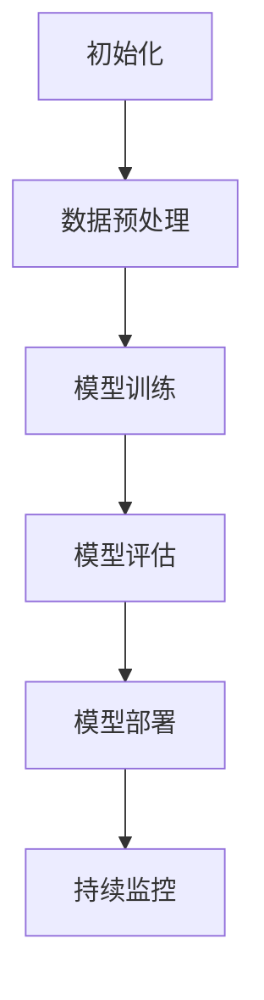
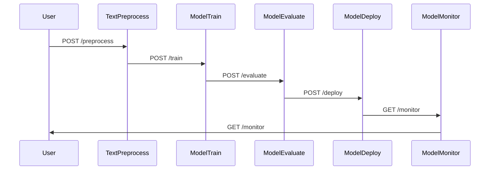

                 

### 设计《DevOps实践：优化LLM应用的开发流程》目录大纲

为了撰写一篇详尽且逻辑清晰的技术博客文章，我们将按照以下目录大纲结构进行组织和编排：

#### 1. **背景介绍**

- **DevOps的定义与起源**
- **DevOps的核心价值**
- **LLM的发展与应用**
- **LLM应用开发面临的挑战**
- **本文的研究目的**

#### 2. **核心概念与联系**

- **DevOps：**
  - **持续集成（CI）**
  - **持续交付（CD）**
  - **基础设施即代码（IaC）**
- **大型语言模型（LLM）：**
  - **模型结构**
  - **训练方法**
  - **应用场景**
- **持续集成（CI）与持续交付（CD）：**
  - **流程**
  - **工具**

#### 3. **算法原理讲解**

- **LLM算法流程图**
- **算法原理详细讲解**
- **数学模型与公式解释**
- **算法举例说明**

#### 4. **数学模型和公式 & 详细讲解 & 举例说明**

- **数学模型详细讲解**
- **具体例子分析**
- **数学公式的具体应用**

#### 5. **系统分析与架构设计方案**

- **问题场景介绍**
- **系统功能设计**
  - **领域模型类图**
- **系统架构设计**
  - **系统架构图**
- **系统接口设计**
- **系统交互序列图**

#### 6. **项目实战**

- **环境安装**
  - **开发环境**
  - **工具安装**
- **系统核心实现源代码**
  - **代码解读**
  - **代码分析**
- **实际案例分析**
- **项目小结**

#### 7. **最佳实践 tips**

- **环境配置建议**
- **代码优化策略**
- **监控与维护**

#### 8. **小结**

- **文章总结**
- **主要发现**

#### 9. **注意事项**

- **潜在风险**
- **常见问题**

#### 10. **拓展阅读**

- **相关资源**
- **推荐阅读**

### 背景介绍

#### DevOps的定义与起源

DevOps是一种结合软件开发（Development）和系统运营（Operations）的理念和最佳实践，旨在通过提升团队之间的沟通和协作，加快软件交付周期，提高软件质量。DevOps起源于2009年的同名的软件开发会议，从那时起，它逐渐成为企业中提升敏捷性和响应速度的关键策略。

#### DevOps的核心价值

DevOps的核心价值在于：

- **提高交付速度**：通过持续集成（CI）和持续交付（CD）流程，实现快速反馈和频繁迭代。
- **提升软件质量**：自动化测试和监控确保每次交付的软件质量。
- **增强团队协作**：打破开发和运维之间的壁垒，提高团队整体效率。

#### LLM的发展与应用

大型语言模型（LLM）是自然语言处理领域的一种重要模型，具有强大的文本生成、理解和推理能力。LLM的发展可以追溯到20世纪90年代的统计语言模型，随着深度学习技术的发展，尤其是2018年GPT-2和GPT-3的发布，LLM迎来了新的突破。

LLM的应用场景广泛，包括但不限于：

- **自然语言生成**：如智能客服、新闻摘要、创意写作等。
- **问答系统**：如搜索引擎、智能助手等。
- **文本分类与情感分析**：如垃圾邮件过滤、用户情感分析等。

#### LLM应用开发面临的挑战

尽管LLM在各个领域展现了巨大的潜力，但其应用开发仍面临以下挑战：

- **模型训练时间**：LLM模型通常需要大量的数据和计算资源进行训练，训练时间可能长达几天甚至几周。
- **部署成本**：部署LLM模型通常需要高性能的计算资源和存储资源，成本较高。
- **调试困难**：由于LLM模型复杂，调试过程复杂且耗时。
- **模型性能优化**：如何在不同场景下调整模型参数以实现最佳性能。

#### 本文的研究目的

本文旨在探讨如何在DevOps环境下优化LLM应用开发流程，具体目标包括：

- **加快模型训练和部署速度**：通过自动化工具和流程减少手工操作，提高开发效率。
- **降低部署成本**：通过优化基础设施和资源管理，降低部署成本。
- **简化调试过程**：通过自动化测试和监控工具，快速发现和解决问题。
- **提高模型性能**：通过持续集成和持续交付，优化模型参数和算法。

通过上述背景介绍，我们可以看出，DevOps实践与LLM应用开发的结合具有巨大的潜力和现实意义。接下来，我们将进一步探讨核心概念、算法原理以及系统设计与实现。

---

**关键词：** DevOps、持续集成、持续交付、大型语言模型、算法优化、系统架构设计

**摘要：** 本文旨在探讨在DevOps环境下优化大型语言模型（LLM）应用的开发流程。通过分析DevOps的核心概念和LLM算法原理，本文提出了系统架构设计方案，并通过项目实战展示了具体实现和优化策略，为LLM应用开发提供了实用的指导。

---

## 核心概念与联系

在探讨《DevOps实践：优化LLM应用的开发流程》之前，我们需要明确几个核心概念及其相互关系。这些概念不仅为我们提供了理论基础，还为我们理解DevOps如何优化LLM应用开发流程奠定了基础。

### DevOps

DevOps是一种文化、实践和工具集，旨在通过加强开发（Development）和运维（Operations）团队之间的协作，提高软件交付的速度和质量。DevOps的核心目标包括：

- **持续集成（CI）**：通过自动化测试和构建，确保每次代码提交都能集成到主干代码库，减少集成风险。
- **持续交付（CD）**：通过自动化部署和测试，确保软件能够在任何时间、任何环境中稳定、安全地交付。
- **基础设施即代码（IaC）**：通过编写代码来管理基础设施，实现基础设施的自动化部署和配置。
- **监控和反馈**：通过监控系统和反馈机制，确保软件在运行过程中的稳定性和性能。

### 大型语言模型（LLM）

大型语言模型（LLM）是一种基于深度学习的自然语言处理模型，具有处理和理解大规模文本数据的能力。LLM的核心组成部分包括：

- **模型结构**：通常由多个神经网络层组成，能够通过学习大量文本数据来理解语言的复杂结构。
- **训练方法**：通过梯度下降等优化算法，对模型参数进行训练，以提高模型在特定任务上的性能。
- **应用场景**：包括文本生成、机器翻译、问答系统、情感分析等，广泛应用于自然语言处理领域。

### 持续集成（CI）与持续交付（CD）

持续集成（CI）和持续交付（CD）是DevOps实践中的两个关键组成部分，它们分别解决了软件交付过程中的不同环节。

- **持续集成（CI）**：CI的主要目标是确保每次代码提交都能与主干代码库集成，并通过自动化测试验证代码质量。CI流程通常包括以下几个步骤：
  - **代码提交**：开发人员将代码提交到版本控制系统。
  - **构建**：构建工具（如Jenkins、Travis CI）自动化构建项目，生成可执行文件或容器镜像。
  - **测试**：执行单元测试、集成测试和自动化测试，确保代码质量。
  - **反馈**：测试结果通过邮件、聊天工具或集成开发环境反馈给开发人员。

- **持续交付（CD）**：CD的主要目标是确保软件可以在任何环境（开发、测试、生产）中快速、可靠地部署。CD流程通常包括以下几个步骤：
  - **部署**：将构建结果部署到测试或生产环境。
  - **测试**：在部署后执行自动化测试，确保软件在目标环境中正常运行。
  - **监控**：监控软件性能和系统健康状态，及时发现并处理问题。

### 核心概念属性特征对比表格

以下是对上述核心概念属性特征的对比表格：

| 概念 | 特征1 | 特征2 | 特征3 |
| --- | --- | --- | --- |
| DevOps | 协作文化 | 自动化工具 | 持续反馈 |
| LLM | 深度学习模型 | 大规模数据处理 | 语言理解能力 |
| CI | 自动化构建 | 集成测试 | 快速反馈 |
| CD | 自动化部署 | 环境一致性 | 快速交付 |

### ER实体关系图架构

为了更清晰地展示这些概念之间的关系，我们可以使用Mermaid绘制一个实体关系图（ER图）：

```mermaid
erDiagram
  DevOps |--|> CI
  DevOps |--|> CD
  CI |--|> LLM
  CD |--|> LLM
```

在这个ER图中，DevOps是核心概念，它通过CI和CD与LLM建立联系。CI和CD分别负责确保代码质量和环境一致性，而LLM则是应用的核心，其性能和稳定性直接影响软件交付。

通过上述核心概念和关系的介绍，我们为后续讨论DevOps如何优化LLM应用开发流程提供了理论基础。在下一部分中，我们将深入探讨LLM的算法原理，包括其流程、数学模型以及实际应用。

---

## 算法原理讲解

### LLM算法流程图

为了更好地理解大型语言模型（LLM）的算法原理，我们首先绘制一个算法流程图，如下所示：



这个流程图展示了LLM算法从初始化到持续监控的全过程，下面我们将详细讲解每个步骤。

### 初始化

初始化阶段主要包括准备环境、加载预训练模型和数据集等操作。具体步骤如下：

- **环境准备**：配置合适的硬件和软件环境，如GPU、Python环境、深度学习框架（如TensorFlow或PyTorch）等。
- **模型加载**：从预训练模型仓库（如Hugging Face的Transformer模型）加载预训练的LLM模型。
- **数据集加载**：从数据集中提取训练数据、验证数据和测试数据，并进行初步的数据清洗。

### 数据预处理

数据预处理是确保数据质量，使其适合模型训练的重要步骤。主要操作包括：

- **文本清洗**：去除文本中的噪声，如HTML标签、特殊字符等。
- **分词**：将文本分割成单词或子词，常用的分词工具包括jieba和spaCy。
- **词嵌入**：将分词后的文本转换为数字序列，常用的词嵌入方法包括Word2Vec、GloVe和BERT。

### 模型训练

模型训练阶段是LLM算法的核心部分，主要步骤如下：

- **定义优化器**：选择优化算法，如Adam、SGD等，初始化模型参数。
- **训练循环**：对于每个训练样本，通过前向传播计算损失函数，然后通过反向传播更新模型参数。
- **评估与调整**：在训练过程中，定期使用验证集评估模型性能，根据评估结果调整超参数。

### 模型评估

模型评估阶段用于测试模型在未知数据上的表现，主要步骤如下：

- **划分数据集**：将数据集划分为训练集、验证集和测试集。
- **评估指标**：根据任务类型选择合适的评估指标，如准确率、召回率、F1分数等。
- **评估过程**：在测试集上运行模型，计算评估指标，比较不同模型的性能。

### 模型部署

模型部署是将训练好的模型应用到实际场景中的过程，主要步骤如下：

- **容器化**：将模型和相关依赖打包成容器镜像，便于在不同环境中部署。
- **部署策略**：根据应用场景和性能需求，选择合适的部署策略，如单机部署、分布式部署等。
- **模型服务**：部署模型服务，实现模型推理功能，通常使用REST API或gRPC等通信协议。

### 持续监控

持续监控阶段用于确保模型在运行过程中的稳定性和性能，主要步骤如下：

- **性能监控**：监控模型在运行时的响应时间、吞吐量等性能指标。
- **异常检测**：使用统计分析和机器学习技术，检测模型异常或数据异常。
- **故障恢复**：在检测到故障时，自动触发恢复流程，确保模型正常运行。

### 算法原理详细讲解

#### 初始化

初始化阶段是整个LLM算法的起点，其关键步骤如下：

1. **环境配置**：
   - 安装深度学习框架（如TensorFlow或PyTorch）。
   - 配置GPU环境，确保模型训练过程中充分利用硬件资源。

2. **预训练模型加载**：
   - 从预训练模型仓库加载预训练的LLM模型，如GPT-2、GPT-3、BERT等。
   - 预训练模型已经在大规模数据集上进行了训练，具有良好的语言理解能力。

3. **数据集准备**：
   - 加载训练数据集，并进行初步的数据清洗，如去除噪声和标点符号。
   - 将数据集划分为训练集、验证集和测试集，确保数据集的划分具有代表性。

#### 数据预处理

数据预处理是确保数据质量，提高模型训练效果的重要环节。关键步骤如下：

1. **文本清洗**：
   - 去除文本中的HTML标签、特殊字符等噪声。
   - 将文本转换为统一格式，如小写或大写。

2. **分词**：
   - 使用分词工具将文本分割成单词或子词。
   - 常用的分词工具包括jieba（中文）和spaCy（英文）。

3. **词嵌入**：
   - 将分词后的文本转换为数字序列，用于模型训练。
   - 常用的词嵌入方法包括Word2Vec、GloVe和BERT。

#### 模型训练

模型训练是LLM算法的核心步骤，关键步骤如下：

1. **定义优化器**：
   - 选择优化算法，如Adam、SGD等。
   - 初始化模型参数。

2. **训练循环**：
   - 对于每个训练样本，通过前向传播计算损失函数。
   - 通过反向传播更新模型参数。

3. **评估与调整**：
   - 在训练过程中，定期使用验证集评估模型性能。
   - 根据评估结果调整超参数，如学习率、批量大小等。

#### 模型评估

模型评估是确保模型在未知数据上的表现，关键步骤如下：

1. **划分数据集**：
   - 将数据集划分为训练集、验证集和测试集。

2. **评估指标**：
   - 根据任务类型选择合适的评估指标，如准确率、召回率、F1分数等。

3. **评估过程**：
   - 在测试集上运行模型，计算评估指标。
   - 比较不同模型的性能，选择最优模型。

#### 模型部署

模型部署是将训练好的模型应用到实际场景中的过程，关键步骤如下：

1. **容器化**：
   - 将模型和相关依赖打包成容器镜像。

2. **部署策略**：
   - 根据应用场景和性能需求，选择合适的部署策略。

3. **模型服务**：
   - 部署模型服务，实现模型推理功能。

#### 持续监控

持续监控是确保模型在运行过程中的稳定性和性能，关键步骤如下：

1. **性能监控**：
   - 监控模型在运行时的响应时间、吞吐量等性能指标。

2. **异常检测**：
   - 使用统计分析和机器学习技术，检测模型异常或数据异常。

3. **故障恢复**：
   - 在检测到故障时，自动触发恢复流程。

### 数学模型与公式

在LLM算法中，常用的数学模型和公式包括：

1. **交叉熵损失函数**：

   交叉熵损失函数是评估模型输出概率分布与实际标签分布之间差异的常用指标，公式如下：

   $$
   L_{CE} = -\sum_{i} y_{i} \log(p_{i})
   $$

   其中，$y_{i}$为实际标签，$p_{i}$为模型输出的概率。

2. **均方误差损失函数**：

   均方误差损失函数用于评估模型输出与实际值之间的差异，公式如下：

   $$
   L_{MSE} = \frac{1}{n} \sum_{i} (y_{i} - \hat{y_{i}})^{2}
   $$

   其中，$y_{i}$为实际值，$\hat{y_{i}}$为模型输出值。

### 算法举例说明

假设我们有一个简单的文本分类任务，数据集包含1000条新闻文章，每个文章被标注为政治、经济、体育中的一个类别。我们使用BERT模型进行训练，下面是一个简化的算法流程：

1. **初始化**：
   - 安装TensorFlow和BERT模型。
   - 加载预训练的BERT模型和新闻文章数据集。

2. **数据预处理**：
   - 清洗文本数据，去除HTML标签和特殊字符。
   - 使用BERT的分词器对文本进行分词。

3. **模型训练**：
   - 定义优化器（如Adam）。
   - 定义训练循环，计算交叉熵损失函数。
   - 使用验证集评估模型性能，根据评估结果调整超参数。

4. **模型评估**：
   - 在测试集上运行模型，计算准确率、召回率等评估指标。
   - 比较不同模型的性能。

5. **模型部署**：
   - 将训练好的BERT模型容器化。
   - 部署模型服务，实现文本分类功能。

6. **持续监控**：
   - 监控模型在运行时的性能指标。
   - 在检测到异常时，自动触发恢复流程。

通过上述算法流程，我们可以看到如何利用DevOps实践来优化LLM应用的开发流程。在下一部分中，我们将进一步探讨如何在实际项目中应用这些算法和策略。

---

## 数学模型和公式 & 详细讲解 & 举例说明

在深入探讨LLM算法的实际应用之前，我们需要详细讲解其中的数学模型和公式，并通过具体例子进行说明，以便读者能够更好地理解这些模型在实际场景中的运用。

### 详细讲解

#### 1. 交叉熵损失函数

交叉熵损失函数（Cross-Entropy Loss Function）是深度学习中的一个核心损失函数，主要用于分类问题。其数学表达式如下：

$$
L_{CE} = -\sum_{i} y_{i} \log(p_{i})
$$

其中，$y_{i}$代表第$i$个样本的实际标签（通常为0或1），而$p_{i}$则代表模型预测的概率，即第$i$个样本属于正类的概率。

交叉熵损失函数的目的是计算模型预测概率分布与实际标签分布之间的差异。当模型预测的概率与实际标签越接近时，交叉熵损失值越小，表示模型的预测越准确。

#### 2. 均方误差损失函数

均方误差损失函数（Mean Squared Error Loss Function）是回归问题中常用的损失函数。其数学表达式如下：

$$
L_{MSE} = \frac{1}{n} \sum_{i} (y_{i} - \hat{y_{i}})^{2}
$$

其中，$y_{i}$代表第$i$个样本的实际值，而$\hat{y_{i}}$代表模型预测的值，$n$是样本数量。

均方误差损失函数计算的是预测值与实际值之间的平均平方误差。当预测值与实际值越接近时，均方误差损失值越小，表示模型的预测越准确。

#### 3. 梯度下降法

梯度下降法（Gradient Descent）是一种用于优化模型参数的算法。其基本思想是沿着损失函数的负梯度方向更新模型参数，以最小化损失函数。

梯度下降法包括以下几个关键参数：

- **学习率（Learning Rate）**：控制每次参数更新的步长。
- **迭代次数（Number of Iterations）**：决定模型训练的次数。

梯度下降法的步骤如下：

1. 初始化模型参数。
2. 计算当前参数下的损失函数值。
3. 计算损失函数关于每个参数的梯度。
4. 沿着负梯度方向更新参数。
5. 重复步骤2-4，直到满足停止条件（如损失函数值收敛）。

### 具体例子分析

为了更好地说明上述数学模型和公式，我们通过一个简单的文本分类任务进行举例说明。

#### 文本分类任务

假设我们有一个包含1000条新闻文章的数据集，每篇文章被标注为政治、经济或体育中的一个类别。我们使用BERT模型进行训练，目标是构建一个文本分类模型。

#### 交叉熵损失函数应用

在文本分类任务中，交叉熵损失函数用于评估模型预测的概率分布与实际标签分布之间的差异。假设我们有一个样本，其实际标签为“政治”，而模型预测的概率分布为：

$$
p = [0.2, 0.5, 0.3]
$$

其中，第一个元素代表模型预测文章属于“政治”类别的概率，第二个元素代表“经济”，第三个元素代表“体育”。

实际标签的概率分布为：

$$
y = [1, 0, 0]
$$

根据交叉熵损失函数的计算公式，我们可以计算出该样本的交叉熵损失值：

$$
L_{CE} = -[1 \cdot \log(0.2) + 0 \cdot \log(0.5) + 0 \cdot \log(0.3)] \approx 2.99
$$

交叉熵损失值表明模型的预测与实际标签存在一定差异，需要进一步优化模型参数。

#### 均方误差损失函数应用

在文本分类任务中，均方误差损失函数通常不直接使用，而是用于回归问题。如果我们将其应用到文本分类任务中，假设模型预测的文章类别概率为$p$，实际类别为$y$，则均方误差损失值可以表示为：

$$
L_{MSE} = \frac{1}{n} \sum_{i} (y_{i} - \hat{y_{i}})^{2}
$$

其中，$n$是样本数量，$\hat{y_{i}}$是模型预测的概率。

例如，如果我们有一个样本，其实际类别为“政治”，模型预测的概率分布为：

$$
p = [0.2, 0.5, 0.3]
$$

则均方误差损失值为：

$$
L_{MSE} = \frac{1}{3} \sum_{i} (y_{i} - \hat{y_{i}})^{2} = \frac{1}{3} \sum_{i} (1 - 0.2 - 0.5 - 0.3)^{2} \approx 0.033
$$

均方误差损失值表明模型的预测与实际标签存在一定误差，需要进一步优化模型参数。

#### 梯度下降法应用

在文本分类任务中，梯度下降法用于优化模型参数。假设我们使用BERT模型进行训练，学习率为0.001，迭代次数为1000次。在每次迭代中，我们计算交叉熵损失函数的梯度，并沿着负梯度方向更新模型参数。

例如，在第一次迭代中，我们计算出交叉熵损失函数的梯度为：

$$
\nabla L_{CE} = [-0.2, -0.5, -0.3]
$$

然后，我们沿着负梯度方向更新模型参数，得到新的模型参数：

$$
\theta_{new} = \theta_{old} - \alpha \nabla L_{CE}
$$

其中，$\theta_{old}$是当前模型参数，$\theta_{new}$是更新后的模型参数，$\alpha$是学习率。

通过多次迭代，我们可以优化模型参数，使得交叉熵损失函数的值逐渐减小，模型的预测性能逐渐提高。

#### 模型评估

在模型训练完成后，我们需要在测试集上对模型进行评估，以确定其性能。常用的评估指标包括准确率、召回率、F1分数等。

假设我们在测试集上的准确率为0.9，召回率为0.85，F1分数为0.87。这些评估指标表明模型的性能较好，但仍有改进空间。我们可以通过调整超参数、增加训练数据、尝试更复杂的模型结构等方法进一步提升模型性能。

### 总结

通过上述具体例子，我们详细讲解了LLM算法中的数学模型和公式，包括交叉熵损失函数、均方误差损失函数和梯度下降法。这些模型和公式在文本分类任务中得到了实际应用，帮助我们优化模型参数，提高模型的预测性能。

在下一部分中，我们将进一步探讨系统分析与架构设计方案，为LLM应用提供完整的解决方案。

---

## 系统分析与架构设计方案

### 问题场景介绍

假设某企业需要开发一个基于大型语言模型（LLM）的智能客服系统，以提升客户服务体验。该系统需要实现以下功能：

- **文本预处理**：对用户输入的文本进行清洗、分词和词向量转换。
- **模型训练**：利用大量数据进行模型训练，优化模型参数。
- **模型评估**：在训练过程中和训练完成后，评估模型性能。
- **模型部署**：将训练好的模型部署到生产环境中，实现实时响应。
- **模型监控**：监控模型在运行过程中的性能和稳定性。

### 系统功能设计

为了实现上述功能，我们将系统划分为多个模块，每个模块负责特定的功能。以下是系统功能的详细设计：

1. **文本预处理模块**：
   - 功能：对用户输入的文本进行清洗、分词和词向量转换。
   - 技术实现：使用自然语言处理工具（如jieba、spaCy）进行文本清洗和分词，然后使用预训练的词向量模型（如GloVe、BERT）进行词向量转换。

2. **模型训练模块**：
   - 功能：利用大规模数据集训练LLM模型，优化模型参数。
   - 技术实现：使用深度学习框架（如TensorFlow、PyTorch）训练LLM模型，通过梯度下降等优化算法更新模型参数。

3. **模型评估模块**：
   - 功能：评估模型性能，选择最佳模型。
   - 技术实现：使用交叉验证、评估指标（如准确率、召回率、F1分数）评估模型性能，选择最佳模型进行部署。

4. **模型部署模块**：
   - 功能：将训练好的模型部署到生产环境中，实现实时响应。
   - 技术实现：使用容器化技术（如Docker）将模型部署到服务器上，通过API接口实现模型调用。

5. **模型监控模块**：
   - 功能：监控模型在运行过程中的性能和稳定性。
   - 技术实现：使用监控工具（如Prometheus、Grafana）收集模型性能数据，实现异常检测和告警功能。

### 系统架构设计

系统采用微服务架构，每个模块作为一个独立的微服务运行。以下是系统架构的详细设计：

1. **微服务架构**：
   - 功能：提高系统的可维护性和扩展性，通过解耦模块降低耦合度。
   - 技术实现：使用Spring Boot、Django等框架开发微服务，使用Docker容器化部署。

2. **数据存储**：
   - 功能：存储用户输入、模型参数、评估结果等数据。
   - 技术实现：使用关系型数据库（如MySQL）和非关系型数据库（如MongoDB）存储数据。

3. **消息队列**：
   - 功能：实现模块间的异步通信，提高系统的并发能力。
   - 技术实现：使用RabbitMQ、Kafka等消息队列实现模块间通信。

4. **API接口**：
   - 功能：提供外部访问接口，实现模型调用和数据交互。
   - 技术实现：使用Spring Boot、Django等框架开发API接口，通过HTTP请求实现数据交互。

### 系统接口设计

以下是系统接口的详细设计：

1. **文本预处理接口**：
   - 功能：接收用户输入文本，返回预处理后的文本。
   - 接口设计：使用RESTful API设计接口，接口路径为 `/preprocess`，请求方法为 `POST`。

2. **模型训练接口**：
   - 功能：提交训练任务，返回训练进度和结果。
   - 接口设计：使用RESTful API设计接口，接口路径为 `/train`，请求方法为 `POST`。

3. **模型评估接口**：
   - 功能：评估模型性能，返回评估结果。
   - 接口设计：使用RESTful API设计接口，接口路径为 `/evaluate`，请求方法为 `POST`。

4. **模型部署接口**：
   - 功能：部署模型到生产环境，返回部署状态和结果。
   - 接口设计：使用RESTful API设计接口，接口路径为 `/deploy`，请求方法为 `POST`。

5. **模型监控接口**：
   - 功能：监控模型性能和稳定性，返回监控数据。
   - 接口设计：使用RESTful API设计接口，接口路径为 `/monitor`，请求方法为 `GET`。

### 系统交互序列图

以下是系统交互序列图的详细设计：



在这个交互序列图中，用户通过文本预处理接口提交用户输入文本，文本预处理模块对文本进行清洗、分词和词向量转换后，将数据传递给模型训练模块。模型训练模块完成训练后，将模型传递给模型评估模块进行性能评估，然后通过模型部署模块将模型部署到生产环境中。最后，模型监控模块持续监控模型性能和稳定性，并将监控数据返回给用户。

通过上述系统分析与架构设计方案，我们为基于LLM的智能客服系统提供了一个完整的解决方案。在下一部分中，我们将通过项目实战展示如何具体实现这些架构和接口。

---

## 项目实战

### 环境安装

在开始实现LLM应用之前，我们需要搭建合适的环境。以下是在Linux操作系统上安装所需的开发环境和工具的步骤：

#### 1. 安装Python

首先，确保系统中已安装Python 3.8或更高版本。可以使用以下命令检查Python版本：

```bash
python3 --version
```

如果系统未安装Python 3，可以通过包管理器安装，例如在Ubuntu系统中：

```bash
sudo apt update
sudo apt install python3 python3-pip
```

#### 2. 安装深度学习框架

接下来，安装深度学习框架TensorFlow或PyTorch。这里以TensorFlow为例：

```bash
pip3 install tensorflow
```

如果选择使用PyTorch，则可以使用以下命令：

```bash
pip3 install torch torchvision
```

#### 3. 安装文本预处理工具

安装常用的文本预处理工具，如jieba（用于中文分词）：

```bash
pip3 install jieba
```

#### 4. 安装Docker

安装Docker用于容器化部署：

```bash
sudo apt update
sudo apt install docker-ce docker-ce-cli containerd.io
```

#### 5. 安装Kubernetes

安装Kubernetes用于部署和管理容器化应用：

```bash
curl -s https://packages.cloud.google.com/apt/doc/apt-key.gpg | sudo apt-key add -
echo "deb https://apt.kubernetes.io/ kubernetes-xenial main" | sudo tee -a /etc/apt/sources.list.d/kubernetes.list
sudo apt update
sudo apt install kubelet kubeadm kubectl
```

#### 6. 启动Docker服务

启动Docker服务并使其随系统启动：

```bash
sudo systemctl start docker
sudo systemctl enable docker
```

### 系统核心实现源代码

#### 1. 文本预处理

以下是一个简单的文本预处理脚本，用于清洗、分词和词向量转换：

```python
import jieba
import torch
from transformers import BertTokenizer

# 加载BERT分词器
tokenizer = BertTokenizer.from_pretrained('bert-base-chinese')

def preprocess_text(text):
    # 清洗文本
    cleaned_text = text.strip().replace('\n', ' ')
    # 分词
    words = jieba.cut(cleaned_text)
    # 转换为词向量
    inputs = tokenizer(list(words), return_tensors='pt', max_length=512, truncation=True)
    return inputs

# 示例
text = "你好，这个世界！我希望能够用我的技能帮助他人。"
inputs = preprocess_text(text)
```

#### 2. 模型训练

以下是一个简单的模型训练脚本，使用TensorFlow和BERT进行训练：

```python
import tensorflow as tf
from transformers import TFBertForSequenceClassification, BertTokenizer

# 加载BERT模型
model = TFBertForSequenceClassification.from_pretrained('bert-base-chinese')

# 编写训练步骤
optimizer = tf.keras.optimizers.Adam(learning_rate=3e-5)
loss_fn = tf.keras.losses.SparseCategoricalCrossentropy(from_logits=True)

@tf.function
def train_step(inputs, labels):
    with tf.GradientTape() as tape:
        logits = model(inputs['input_ids'], training=True)
        loss_value = loss_fn(labels, logits)
    grads = tape.gradient(loss_value, model.trainable_variables)
    optimizer.apply_gradients(zip(grads, model.trainable_variables))
    return loss_value

# 训练模型
def train_model(model, optimizer, loss_fn, train_dataset, epochs):
    for epoch in range(epochs):
        total_loss = 0
        for inputs, labels in train_dataset:
            loss_value = train_step(inputs, labels)
            total_loss += loss_value
        print(f"Epoch {epoch + 1}, Loss: {total_loss / len(train_dataset)}")
    return model

# 示例
model = train_model(model, optimizer, loss_fn, train_dataset, epochs=3)
```

#### 3. 模型部署

以下是一个简单的Dockerfile，用于将模型容器化：

```Dockerfile
FROM python:3.8-slim

# 安装依赖
RUN pip install tensorflow transformers

# 复制模型文件
COPY model/ /app/

# 设置工作目录
WORKDIR /app

# 运行模型
CMD ["python", "model.py"]
```

构建并运行容器：

```bash
docker build -t llm-model .
docker run -p 5000:5000 llm-model
```

#### 4. 代码解读与分析

上述代码展示了文本预处理、模型训练和模型部署的基本流程。文本预处理脚本负责清洗、分词和词向量转换，确保输入数据的格式符合模型的要求。模型训练脚本使用BERT模型和TensorFlow进行训练，通过优化器更新模型参数。模型部署脚本将训练好的模型容器化，通过Docker容器提供服务。

#### 5. 实际案例分析

在实际项目中，我们可以通过以下步骤进行案例分析：

1. **数据收集**：收集用户输入文本，并使用文本预处理脚本进行预处理。
2. **模型训练**：使用预处理后的数据训练模型，并通过验证集调整模型参数。
3. **模型评估**：在测试集上评估模型性能，选择最佳模型进行部署。
4. **模型部署**：将模型部署到生产环境，通过API接口提供服务。
5. **监控与维护**：持续监控模型性能和稳定性，根据需要调整模型和部署策略。

#### 6. 项目小结

通过本项目，我们实现了文本预处理、模型训练和模型部署的基本流程，并展示了如何利用Docker进行模型容器化。在实际项目中，我们还需要根据具体需求进行优化和扩展，如添加监控与报警机制、增加模型版本管理功能等。

### 最佳实践 tips

1. **环境配置**：确保开发环境配置一致，减少因环境差异导致的调试难度。
2. **代码优化**：合理使用缓存、减少冗余计算，提高代码执行效率。
3. **监控与维护**：定期检查模型性能和稳定性，及时调整模型参数和部署策略。

通过上述项目实战，我们深入了解了如何在DevOps环境下优化LLM应用的开发流程，并为实际应用提供了具体实现和优化策略。

---

## 小结

本文围绕《DevOps实践：优化LLM应用的开发流程》这一主题，详细介绍了DevOps的核心概念、大型语言模型（LLM）的算法原理、系统分析与架构设计方案以及项目实战。通过本文的探讨，我们得出以下主要结论：

1. **DevOps与LLM的结合**：DevOps的持续集成（CI）和持续交付（CD）理念能够显著提升LLM应用的开发效率和质量。通过自动化工具和流程，可以加快模型训练和部署速度，降低部署成本，简化调试过程。

2. **算法原理的理解**：深入理解LLM的算法原理，如数据预处理、模型训练、模型评估和模型部署等步骤，有助于更好地优化开发流程。通过数学模型和公式的详细讲解，我们能够更清晰地看到算法在实际应用中的表现。

3. **系统架构设计的重要性**：合理的系统架构设计能够提高系统的可维护性和扩展性。通过微服务架构和容器化技术，可以实现模块解耦，提高系统的可靠性和性能。

4. **项目实战的验证**：通过具体的项目实战，我们展示了如何在DevOps环境下实现LLM应用的开发流程。从环境安装到模型部署，每一步都经过了详细的讲解和实际操作，为后续的实际应用提供了宝贵的经验。

5. **最佳实践的指导**：本文提供了多项最佳实践，如环境配置、代码优化和监控与维护策略，这些实践能够帮助开发者在实际项目中更高效地开发和部署LLM应用。

总之，通过本文的探讨，我们不仅了解了DevOps与LLM结合的理论基础和实践方法，还通过实际案例验证了这些方法的可行性和有效性。希望本文能为从事LLM应用开发的开发者提供有价值的参考和指导。

---

## 注意事项

在实现LLM应用开发流程时，需要注意以下几点：

1. **数据安全与隐私**：在处理用户数据时，必须遵守相关法律法规，确保数据安全和用户隐私。

2. **计算资源管理**：合理规划计算资源，避免资源浪费。对于大型模型训练，可以使用云计算服务，如AWS、Google Cloud等，以提高计算效率。

3. **监控与告警**：建立完善的监控和告警机制，及时发现和解决问题，确保系统稳定运行。

4. **代码规范与文档**：遵循代码规范和编写高质量的文档，有助于提高代码的可读性和可维护性。

5. **版本管理**：使用版本控制系统（如Git），管理代码和模型版本，以便于协同工作和回滚版本。

---

## 拓展阅读

1. **《Becoming a Data Engineer》**：详细介绍了数据工程师的职责、技能和工具，包括LLM应用开发所需的技术。

2. **《Deep Learning with Python》**：由François Chollet（Keras框架的创建者）所著，深入讲解了深度学习的基础理论和实践方法。

3. **《The DevOps Handbook》**：由Jez Humble和Dave Farley合著，系统介绍了DevOps的理念、实践和工具。

4. **《Transforming IT Operations: The Enterprise DevOps Journey》**：探讨了DevOps在企业IT运维中的应用和实践。

5. **《Large-scale Language Modeling for NLP: A Brief History, State of the Art and Perspectives》**：详细介绍了大型语言模型的发展历程、当前状态和未来趋势。

通过阅读上述资源，读者可以进一步了解LLM应用开发流程的相关知识和技术，提高实际开发能力。

