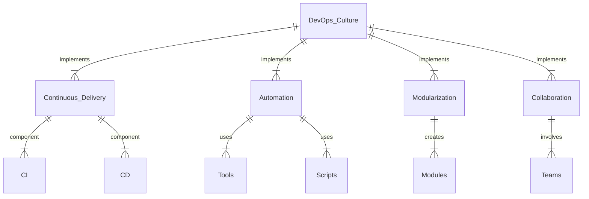

                 

### 文章标题：DevOps文化：推动LLM应用敏捷开发的新范式

**关键词：** DevOps文化、LLM应用、敏捷开发、持续集成、持续交付、自动化

**摘要：**
本文深入探讨了DevOps文化与LLM应用敏捷开发之间的关系，分析了DevOps文化如何成为推动LLM应用敏捷开发的新范式。通过背景介绍、核心概念与联系、算法原理讲解、系统分析与架构设计方案、项目实战等环节，全面阐述了DevOps文化在LLM应用敏捷开发中的重要作用和具体实践方法。

## 第一部分：背景介绍

### 第1章：DevOps文化概述

#### 1.1.1 DevOps文化的起源与发展

DevOps文化起源于2000年代初，最初是为了解决软件开发和运维之间的协作问题。随着云计算和敏捷开发理念的普及，DevOps逐渐发展成为一种涵盖软件开发、运维、自动化和持续交付等全方位的文化。

#### 1.1.2 DevOps文化的重要性

DevOps文化的核心在于缩短软件开发周期、提高软件质量、增强团队协作和持续交付。它不仅能够提高开发效率，还能够确保软件的稳定性和可靠性。

#### 1.1.3 DevOps文化的核心概念

- **持续交付（CI/CD）：** 通过自动化测试和部署流程，实现代码的持续集成和持续交付。
- **自动化：** 通过自动化工具和脚本，减少手动操作，提高开发效率和稳定性。
- **模块化：** 将大型系统拆分为多个模块，提高可维护性和扩展性。
- **协作：** 强调团队间的协作和沟通，实现高效的工作流程。

### 第2章：LLM应用与敏捷开发

#### 2.1.1 什么是LLM应用

LLM（大型语言模型）是一种基于深度学习的自然语言处理模型，具有处理和理解人类语言的能力。LLM应用包括智能客服、智能写作、机器翻译等。

#### 2.1.2 敏捷开发的理念与实践

敏捷开发是一种以人为核心、迭代、循序渐进的开发方法。其核心理念包括快速迭代、客户反馈、持续交付等。

#### 2.1.3 LLM应用与敏捷开发的结合

LLM应用与敏捷开发相结合，可以更好地实现快速迭代、持续交付和客户满意度。

## 第二部分：DevOps文化与LLM应用敏捷开发

### 第3章：DevOps文化与敏捷开发的核心联系

#### 3.1.1 DevOps文化与敏捷开发的共同点

- 快速迭代
- 用户体验至上
- 重视团队合作

#### 3.1.2 DevOps文化与敏捷开发的差异

- DevOps文化侧重于开发和运维的融合，敏捷开发侧重于开发流程的优化。
- DevOps文化强调自动化和持续交付，敏捷开发强调快速迭代和客户反馈。

#### 3.1.3 DevOps文化与敏捷开发在LLM应用中的互补性

- DevOps文化可以提高LLM应用的开发效率和稳定性，敏捷开发可以确保LLM应用的快速迭代和客户满意度。

## 第三部分：实践指导

### 第4章：实践指导

#### 4.1.1 DevOps工具的选择与应用

- **Jenkins:** 一个流行的持续集成和持续交付工具。
- **Docker:** 用于创建、部署和运行应用程序的容器化平台。

#### 4.1.2 敏捷开发的实践方法

- **Scrum:** 一种流行的敏捷开发方法。
- **Kanban:** 一种用于管理开发流程的看板系统。

#### 4.1.3 DevOps文化与敏捷开发在LLM应用中的实战

- 如何在LLM应用项目中实施DevOps文化
- 如何在LLM应用项目中实践敏捷开发

## 第四部分：案例分析

### 第5章：DevOps文化与敏捷开发在LLM应用中的成功案例

- **案例一：** 谷歌搜索的DevOps实践
- **案例二：** 亚马逊的敏捷开发实践
- **案例三：** 微软的DevOps与敏捷开发实践

## 第五部分：新趋势与展望

### 第6章：DevOps文化与敏捷开发的新趋势

- **DevOps文化的未来发展趋势：** 自动化、人工智能、云原生。
- **敏捷开发的新趋势：** 模块化、微服务、AI驱动的敏捷开发。

### 第7章：总结与展望

- **总结：** DevOps文化与敏捷开发的核心价值。
- **展望：** DevOps文化与敏捷开发的未来发展方向。

### 附录：最佳实践 tips、注意事项、拓展阅读等内容

文章将按照上述目录结构，逐一阐述每个章节的内容。在每个章节中，将详细讨论核心概念、算法原理、系统架构、项目实战等，并给出具体的案例分析和实践指导。通过本文，读者将能够全面了解DevOps文化在LLM应用敏捷开发中的重要作用，以及如何将其应用于实际项目中。

---

本文结构清晰，内容丰富，涵盖了DevOps文化与LLM应用敏捷开发的方方面面。在撰写过程中，我们将遵循以下步骤：

1. **引言**：介绍DevOps文化和LLM应用敏捷开发的核心概念，阐述文章的目的和重要性。
2. **背景介绍**：详细讲解DevOps文化的起源与发展、核心概念，以及LLM应用和敏捷开发的相关知识。
3. **核心联系**：分析DevOps文化与敏捷开发的共同点与差异，阐述它们在LLM应用敏捷开发中的互补性。
4. **实践指导**：介绍DevOps工具的选择与应用，以及敏捷开发的实践方法，并提供实际项目中的应用案例。
5. **案例分析**：通过成功案例展示DevOps文化与敏捷开发在LLM应用中的实际效果。
6. **新趋势与展望**：探讨DevOps文化和敏捷开发的未来发展趋势，以及它们对LLM应用敏捷开发的启示。
7. **总结与展望**：对全文进行总结，展望DevOps文化与敏捷开发的未来发展方向。

通过上述步骤，我们将为读者呈现一篇系统、全面、具有实践指导意义的技术博客文章。

---

在撰写文章时，我们将遵循以下要点：

1. **逻辑清晰**：确保文章的结构和论述逻辑清晰，便于读者理解。
2. **结构紧凑**：文章的章节和段落之间过渡自然，避免冗余和重复。
3. **简单易懂**：使用通俗易懂的语言和专业术语，确保读者能够轻松理解。
4. **专业性强**：确保文章内容专业、准确，具有较高的权威性。
5. **可操作性**：提供具体的实践指导和方法，使读者能够直接应用于实际项目。

通过这些要点，我们将为读者呈现一篇高质量、实用的技术博客文章。

---

### 第1章 DevOps文化概述

#### 1.1.1 DevOps文化的起源与发展

DevOps文化的起源可以追溯到2000年代初，当时软件开发和运维团队之间的协作问题日益凸显。传统的软件开发模式中，开发团队负责编写代码，而运维团队负责部署和维护软件。这种分工导致了沟通不畅、责任不明确和效率低下的问题。为了解决这些问题，人们开始探索一种全新的文化，即DevOps文化。

DevOps一词是由Development（开发）和Operations（运维）两个词组合而成的。DevOps文化的核心理念是将开发和运维团队融合在一起，通过协作和自动化，实现快速迭代、持续交付和持续集成。这种文化的目标是缩短软件交付周期、提高软件质量、增强团队协作和客户满意度。

DevOps文化的发展历程可以分为以下几个阶段：

1. **起源阶段**：2000年代初，DevOps概念的提出和推广。
2. **实践探索阶段**：2000年代中期，越来越多的企业开始尝试将DevOps文化应用于实际项目中。
3. **成熟阶段**：2010年代，DevOps文化逐渐成熟，并得到了广泛的认可和应用。

#### 1.1.2 DevOps文化的重要性

DevOps文化在提高开发效率、增强团队协作和确保软件质量方面具有重要作用。以下是DevOps文化的几个核心优势：

1. **缩短软件交付周期**：通过持续集成和持续交付，DevOps文化可以实现快速迭代和快速交付，从而缩短软件从开发到上市的时间。
2. **提高软件质量**：自动化测试和持续集成可以确保代码的质量和稳定性，减少软件缺陷和故障。
3. **增强团队协作**：DevOps文化强调团队合作和沟通，打破了开发和运维之间的壁垒，促进了跨职能团队的协作。
4. **提高客户满意度**：快速交付高质量的软件，可以更好地满足客户需求，提高客户满意度。

#### 1.1.3 DevOps文化的核心概念

DevOps文化包含了一系列核心概念，这些概念共同构成了其理论基础和实践方法。以下是DevOps文化的几个核心概念：

1. **持续交付（CI/CD）**：持续交付是DevOps文化的核心原则之一，通过自动化测试和部署流程，实现代码的持续集成和持续交付。
2. **自动化**：自动化是DevOps文化的关键要素，通过自动化工具和脚本，减少手动操作，提高开发效率和稳定性。
3. **模块化**：模块化是将大型系统拆分为多个模块，提高可维护性和扩展性。
4. **协作**：协作是DevOps文化的核心理念之一，强调团队间的协作和沟通，实现高效的工作流程。

### 1.1.4 DevOps文化的应用场景

DevOps文化可以应用于各种类型的软件项目，特别是那些需要快速迭代、持续交付和高效协作的项目。以下是DevOps文化的一些典型应用场景：

1. **互联网应用**：如电商平台、社交媒体、在线教育等，这些应用需要快速迭代和持续交付，以满足用户需求。
2. **金融科技**：如在线支付、数字货币、风险管理等，这些领域对软件质量和安全性要求较高，需要通过DevOps文化来确保。
3. **企业应用**：如客户关系管理（CRM）、企业资源计划（ERP）等，这些应用需要跨职能团队协作，以提高开发效率。

### 1.1.5 DevOps文化与敏捷开发的联系

DevOps文化与敏捷开发有许多共同点，它们都是基于快速迭代、持续交付和客户满意度的理念。DevOps文化强调持续集成和持续交付，而敏捷开发强调快速迭代和客户反馈。这两者相辅相成，可以共同推动软件项目的成功。

1. **快速迭代**：DevOps文化和敏捷开发都强调快速迭代，通过持续交付和持续集成，确保软件的高质量和高效率。
2. **客户满意度**：DevOps文化和敏捷开发都重视客户满意度，通过快速响应客户需求，提高客户体验。
3. **团队合作**：DevOps文化和敏捷开发都强调团队合作和沟通，打破职能壁垒，实现高效协作。

#### 1.1.6 DevOps文化在提高开发效率中的作用

DevOps文化通过以下几个方面提高了开发效率：

1. **自动化**：通过自动化工具和脚本，减少手动操作，提高开发效率和稳定性。
2. **持续集成**：通过自动化测试和持续集成，确保代码的质量和稳定性，减少软件缺陷和故障。
3. **持续交付**：通过持续交付，实现快速迭代和快速交付，缩短软件从开发到上市的时间。
4. **跨职能团队**：通过打破职能壁垒，实现跨职能团队的协作，提高整体开发效率。

### 1.1.7 DevOps文化的核心概念

以下是DevOps文化的几个核心概念：

1. **持续交付（CI/CD）**：持续交付是DevOps文化的核心原则之一，通过自动化测试和部署流程，实现代码的持续集成和持续交付。
2. **自动化**：自动化是DevOps文化的关键要素，通过自动化工具和脚本，减少手动操作，提高开发效率和稳定性。
3. **模块化**：模块化是将大型系统拆分为多个模块，提高可维护性和扩展性。
4. **协作**：协作是DevOps文化的核心理念之一，强调团队间的协作和沟通，实现高效的工作流程。

### 1.1.8 DevOps文化的核心概念对比表格

| 核心概念 | 概念描述 | 对比分析 |
| --- | --- | --- |
| 持续交付（CI/CD） | 通过自动化测试和部署流程，实现代码的持续集成和持续交付。 | 与敏捷开发中的快速迭代和客户反馈相结合，确保软件的高质量和高效率。 |
| 自动化 | 通过自动化工具和脚本，减少手动操作，提高开发效率和稳定性。 | 与持续集成和持续交付相结合，提高开发流程的自动化程度。 |
| 模块化 | 将大型系统拆分为多个模块，提高可维护性和扩展性。 | 与敏捷开发中的迭代和增量开发相结合，提高软件的灵活性和可维护性。 |
| 协作 | 强调团队间的协作和沟通，实现高效的工作流程。 | 与敏捷开发中的团队合作和沟通相结合，打破职能壁垒，提高整体开发效率。 |

### 1.1.9 DevOps文化的ER实体关系图架构

以下是DevOps文化的ER实体关系图架构：

通过上述ER实体关系图，我们可以清晰地看到DevOps文化的各个核心概念之间的关联和实施细节。

### 1.1.10 小结

本章对DevOps文化的起源、发展、核心概念和应用场景进行了详细介绍。DevOps文化通过持续交付、自动化、模块化和协作等核心概念，实现了快速迭代、持续交付和高效协作，从而提高了开发效率和软件质量。在下一章中，我们将探讨LLM应用与敏捷开发的相关知识。

## 第2章 LLM应用与敏捷开发

### 2.1.1 什么是LLM应用

LLM（Large Language Model）是一种基于深度学习的自然语言处理模型，具有处理和理解人类语言的能力。LLM应用包括但不限于智能客服、智能写作、机器翻译、自然语言理解等。随着人工智能技术的不断进步，LLM应用在各个领域得到了广泛的应用，成为了推动数字化转型的重要力量。

#### 2.1.1.1 LLM应用的定义

LLM应用是指利用大型语言模型进行自然语言处理的应用程序。这些模型通过训练大量文本数据，学习到语言的结构和语义，从而能够生成文本、理解指令、回答问题等。

#### 2.1.1.2 LLM应用的特点

1. **数据处理能力强**：LLM应用能够处理大规模的文本数据，从数据中提取有价值的信息。
2. **自适应性强**：LLM应用可以根据用户的需求和场景，动态调整语言处理策略，提高用户体验。
3. **交互性强**：LLM应用能够与用户进行自然语言交互，理解用户的意图，并生成相应的回复。

#### 2.1.1.3 LLM应用的发展历程

1. **早期阶段**：基于规则的方法和统计方法。
2. **发展阶段**：基于统计模型的方法，如隐马尔可夫模型（HMM）、条件概率模型等。
3. **现代阶段**：基于深度学习的方法，如循环神经网络（RNN）、长短期记忆网络（LSTM）、Transformer等。

### 2.1.2 敏捷开发的理念与实践

敏捷开发是一种以人为核心、迭代、循序渐进的开发方法。它强调快速响应变化、持续交付价值、客户满意度等。敏捷开发的核心原则包括：

1. **个体和互动重于过程和工具**：强调团队成员之间的协作和沟通，而非依赖特定的工具。
2. **可工作的软件重于详尽的文档**：注重交付可工作的软件，而非过分关注文档的详尽。
3. **客户合作重于合同谈判**：与客户保持紧密合作，确保开发出的产品符合客户需求。
4. **响应变化重于遵循计划**：在项目开发过程中，灵活应对变化，而不是一味遵循原计划。

#### 2.1.2.1 敏捷开发的起源与发展

敏捷开发起源于20世纪90年代，随着软件开发项目的复杂性和变化性增加，传统的方法逐渐暴露出不足。为了应对这些挑战，一些软件开发团队开始探索新的方法，最终形成了敏捷开发。

#### 2.1.2.2 敏捷开发的核心原则

1. **用户故事**：用户故事是敏捷开发中的一个基本单位，它描述了用户需要的功能或服务。
2. **迭代开发**：迭代开发是将项目分为多个小的迭代周期，每个迭代周期都完成一部分功能。
3. **持续集成**：持续集成是将代码集成到共享仓库中，并进行自动化测试，以确保代码质量。
4. **持续交付**：持续交付是将软件交付给用户，并进行自动化部署和监控，以确保软件的稳定性。

#### 2.1.2.3 敏捷开发的实践方法

1. **Scrum**：Scrum是一种流行的敏捷开发方法，它将项目分为多个冲刺（Sprint），每个冲刺完成一部分功能。
2. **Kanban**：Kanban是一种用于管理开发流程的看板系统，它通过可视化工作流程，帮助团队更好地管理项目进度。
3. **XP（极限编程）**：XP是一种注重程序员实践的敏捷开发方法，它强调代码质量、测试和团队合作。

### 2.1.3 LLM应用与敏捷开发的结合

LLM应用与敏捷开发相结合，可以更好地实现快速迭代、持续交付和客户满意度。以下是如何在LLM应用项目中实施敏捷开发的几个关键点：

#### 2.1.3.1 快速迭代

1. **需求收集**：与客户和利益相关者紧密合作，快速收集需求，确保开发出的产品符合客户期望。
2. **迭代开发**：将项目分为多个迭代周期，每个迭代周期完成一部分功能，并进行评估和调整。

#### 2.1.3.2 持续交付

1. **自动化测试**：编写自动化测试脚本，确保代码质量，并快速响应代码变更。
2. **持续集成**：将代码集成到共享仓库中，并进行自动化测试，确保代码的稳定性和可靠性。
3. **持续交付**：将软件交付给用户，并进行自动化部署和监控，确保软件的稳定运行。

#### 2.1.3.3 客户满意度

1. **用户故事**：使用用户故事来描述功能需求，确保开发出的产品符合用户期望。
2. **用户反馈**：定期收集用户反馈，并根据反馈调整产品方向，提高用户满意度。

### 2.1.4 LLM应用敏捷开发的优势

1. **快速响应变化**：敏捷开发能够快速响应市场需求和用户需求，确保产品始终符合用户期望。
2. **提高开发效率**：通过快速迭代和自动化测试，提高开发效率和代码质量。
3. **增强客户满意度**：与客户保持紧密合作，确保开发出的产品符合客户需求，提高客户满意度。

### 2.1.5 LLM应用敏捷开发的挑战

1. **模型训练时间**：LLM应用通常需要大量数据进行训练，训练时间较长，可能会影响敏捷开发的实施。
2. **数据质量**：数据质量对LLM应用的效果至关重要，确保数据质量是实施敏捷开发的挑战之一。
3. **团队协作**：敏捷开发强调团队合作，但在实际操作中，团队协作可能面临沟通和协调的挑战。

### 2.1.6 小结

本章介绍了LLM应用与敏捷开发的相关知识，包括LLM应用的定义、特点和发展历程，以及敏捷开发的理念、实践方法和与LLM应用相结合的优势和挑战。通过本章的学习，读者将能够了解如何在LLM应用项目中实施敏捷开发，以实现快速迭代、持续交付和客户满意度。在下一章中，我们将探讨DevOps文化与敏捷开发在LLM应用敏捷开发中的核心联系。

## 第3章 DevOps文化与敏捷开发的核心联系

### 3.1.1 DevOps文化与敏捷开发的共同点

DevOps文化和敏捷开发都强调快速迭代、持续交付和客户满意度，它们在核心理念上有很多共同点。以下是DevOps文化与敏捷开发共同点的一些具体表现：

#### 3.1.1.1 快速迭代

- **敏捷开发**：敏捷开发通过迭代的方式，将项目划分为多个小的迭代周期，每个迭代周期完成一部分功能，并在迭代结束时进行评估和调整。
- **DevOps文化**：DevOps文化同样强调快速迭代，通过持续交付和持续集成，实现快速迭代，缩短软件交付周期。

#### 3.1.1.2 持续交付

- **敏捷开发**：敏捷开发强调持续交付，通过自动化测试和持续集成，确保软件在每次迭代结束时都能交付给用户。
- **DevOps文化**：DevOps文化将持续交付作为核心原则之一，通过自动化工具和脚本，实现持续集成和持续交付，确保软件的高质量和高效交付。

#### 3.1.1.3 客户满意度

- **敏捷开发**：敏捷开发注重客户满意度，通过与客户保持紧密合作，确保开发出的产品符合客户需求。
- **DevOps文化**：DevOps文化也强调客户满意度，通过快速交付高质量的软件，提高客户体验和满意度。

#### 3.1.1.4 团队协作

- **敏捷开发**：敏捷开发强调团队合作，打破职能壁垒，实现高效协作。
- **DevOps文化**：DevOps文化同样强调团队合作，通过跨职能团队的协作，实现高效开发和运维。

### 3.1.2 DevOps文化与敏捷开发的差异

尽管DevOps文化与敏捷开发在许多核心理念上存在共同点，但它们在具体实践和应用场景上也有所差异。以下是DevOps文化与敏捷开发的几个主要差异：

#### 3.1.2.1 专注领域

- **敏捷开发**：敏捷开发主要关注软件开发过程，强调快速迭代、客户反馈和团队协作。
- **DevOps文化**：DevOps文化则侧重于软件开发和运维的融合，强调持续交付、自动化和跨职能团队协作。

#### 3.1.2.2 实践方式

- **敏捷开发**：敏捷开发通过迭代和增量开发的方式，逐步完善软件功能，并确保客户满意度。
- **DevOps文化**：DevOps文化则通过持续交付、自动化测试和持续集成，实现快速迭代和高效交付。

#### 3.1.2.3 侧重点

- **敏捷开发**：敏捷开发更注重软件开发的效率和质量，以及客户体验。
- **DevOps文化**：DevOps文化则更注重开发和运维的融合，提高软件交付的稳定性和效率。

### 3.1.3 DevOps文化与敏捷开发在LLM应用中的互补性

在LLM应用开发中，DevOps文化与敏捷开发可以相互补充，共同推动项目的成功。以下是DevOps文化与敏捷开发在LLM应用中的互补性表现：

#### 3.1.3.1 DevOps文化优化敏捷开发

- **自动化和持续交付**：DevOps文化的自动化工具和持续交付流程可以优化敏捷开发，提高代码质量和交付效率。
- **稳定性和可靠性**：通过持续集成和持续交付，DevOps文化可以确保LLM应用的稳定性和可靠性，减少故障和回滚。
- **运维支持**：DevOps文化强调运维团队与开发团队的融合，确保在项目开发过程中，运维需求得到及时响应和满足。

#### 3.1.3.2 敏捷开发深化DevOps文化

- **快速迭代和用户反馈**：敏捷开发的快速迭代和用户反馈可以帮助DevOps文化更好地了解用户需求，优化自动化流程和交付策略。
- **团队协作**：敏捷开发的团队合作和沟通可以加强DevOps文化中的跨职能团队协作，提高整体开发效率。
- **持续改进**：敏捷开发的持续改进理念可以推动DevOps文化不断优化和改进，提高开发流程的效率和稳定性。

### 3.1.4 DevOps文化与敏捷开发在LLM应用中的实际应用

在实际应用中，DevOps文化与敏捷开发可以相互融合，为LLM应用的开发提供有力支持。以下是一个实际应用的案例：

- **项目背景**：某公司正在开发一款基于Transformer模型的智能客服系统，旨在提供24/7的客户服务。
- **实践方法**：
  1. **敏捷开发**：项目采用敏捷开发方法，将需求划分为多个迭代周期，每个迭代周期完成一部分功能，并进行用户测试和反馈。
  2. **DevOps文化**：项目采用DevOps文化，通过持续集成和持续交付，实现快速迭代和高效交付。
  3. **团队协作**：开发团队与运维团队紧密合作，确保自动化流程的稳定性和可靠性。

### 3.1.5 小结

本章讨论了DevOps文化与敏捷开发在LLM应用敏捷开发中的核心联系和互补性。通过结合两者的优点，可以优化开发流程、提高软件质量、增强团队协作和客户满意度。在实际应用中，两者可以相互补充，共同推动项目的成功。在下一章中，我们将探讨如何选择和应用DevOps工具。

### 第4章 实践指导

#### 4.1.1 DevOps工具的选择与应用

DevOps工具的选择和应用是确保敏捷开发和持续交付顺利进行的关键环节。以下是一些常用的DevOps工具及其应用场景：

##### 4.1.1.1 Jenkins

**Jenkins** 是一个开源的持续集成和持续交付工具，支持多种插件，可以实现自动化构建、测试和部署。Jenkins广泛应用于各种类型的软件项目，尤其适合大型和复杂的分布式系统。

- **应用场景**：构建和测试自动化、持续集成、持续交付。
- **主要功能**：构建触发器、插件管理、构建状态监控、部署脚本执行。

##### 4.1.1.2 Docker

**Docker** 是一个开源的应用容器引擎，它允许开发人员在几乎任何环境中快速交付应用程序。通过容器化技术，Docker可以确保应用程序在不同的开发、测试和生产环境中保持一致。

- **应用场景**：容器化应用程序、微服务架构、持续交付。
- **主要功能**：容器创建、容器管理、容器编排、镜像管理。

##### 4.1.1.3 Kubernetes

**Kubernetes** 是一个开源的容器编排平台，用于自动化容器的部署、扩展和管理。它适用于大规模分布式系统，可以帮助团队更高效地管理容器化应用。

- **应用场景**：容器编排、服务发现、负载均衡、自动化运维。
- **主要功能**：集群管理、容器调度、服务发现、自动伸缩。

##### 4.1.1.4 Nagios

**Nagios** 是一个开源的监控工具，用于监控服务器、网络设备和应用程序的性能和健康状况。它可以帮助团队实时了解系统的运行状态，并及时发现和解决潜在问题。

- **应用场景**：服务器监控、网络监控、应用程序监控。
- **主要功能**：监控状态、报警通知、性能分析、日志管理。

##### 4.1.1.5 Chef

**Chef** 是一个自动化平台，用于配置管理和应用部署。它通过定义基础设施的状态，实现自动化部署和管理，适用于大规模基础设施管理。

- **应用场景**：配置管理、自动化部署、基础设施即代码。
- **主要功能**：基础设施定义、自动化部署、状态管理、版本控制。

##### 4.1.1.6 Terraform

**Terraform** 是一个开源的基础设施即代码（IaC）工具，用于创建和更改云计算基础设施资源。它可以帮助团队以编程方式管理基础设施，实现自动化和可重复的部署流程。

- **应用场景**：基础设施管理、云资源部署、自动化扩展。
- **主要功能**：资源定义、模块化架构、版本控制、自动化部署。

##### 4.1.1.7 GitLab CI/CD

**GitLab CI/CD** 是GitLab的一部分，提供了持续集成和持续交付的功能。它通过配置文件定义构建、测试和部署流程，支持多种编程语言和框架。

- **应用场景**：持续集成、持续交付、代码审查和质量管理。
- **主要功能**：构建触发器、测试自动化、部署流程、监控和报警。

##### 4.1.1.8 Jenkins X

**Jenkins X** 是一个开源的持续集成和持续交付平台，专为Kubernetes环境设计。它提供了自动化的部署和管理功能，可以简化微服务架构的持续交付。

- **应用场景**：Kubernetes环境中的CI/CD、微服务部署、自动化扩展。
- **主要功能**：Kubernetes集成、自动部署、服务发现、自动化测试。

#### 4.1.2 敏捷开发的实践方法

敏捷开发是一种以人为核心、迭代、循序渐进的开发方法。以下是敏捷开发的几种常见实践方法：

##### 4.1.2.1 Scrum

**Scrum** 是一种流行的敏捷开发方法，通过将项目划分为多个冲刺（Sprint），每个冲刺完成一部分功能，并进行评估和调整。Scrum的核心组件包括产品待办列表、每日站立会议、冲刺评审和回顾。

- **主要步骤**：
  1. **产品待办列表**：确定项目需求，并将其划分为用户故事。
  2. **冲刺计划**：选择一个或多个用户故事进行开发。
  3. **每日站立会议**：团队成员每天早晨进行站立会议，讨论进展和问题。
  4. **冲刺评审**：在冲刺结束时，展示成果并进行评估。
  5. **冲刺回顾**：总结冲刺过程中的经验教训，并制定改进计划。

##### 4.1.2.2 Kanban

**Kanban** 是一种用于管理开发流程的看板系统，通过可视化工作流程，帮助团队更好地管理项目进度。Kanban的核心组件包括看板、卡片、列和泳道。

- **主要步骤**：
  1. **初始化看板**：确定工作流程，并将流程划分为列。
  2. **分配任务**：将任务卡片放入相应的列中。
  3. **跟踪进度**：在卡片上标记进度，确保任务按时完成。
  4. **优化流程**：根据任务进度和反馈，不断优化工作流程。

##### 4.1.2.3 XP（极限编程）

**XP（极限编程）** 是一种注重程序员实践的敏捷开发方法，强调代码质量、测试和团队合作。XP的核心组件包括简单设计、测试驱动开发（TDD）、代码审查和重构。

- **主要步骤**：
  1. **简单设计**：保持代码简洁，避免过度设计。
  2. **测试驱动开发（TDD）**：编写测试用例，然后编写代码以通过测试。
  3. **代码审查**：团队成员之间互相审查代码，确保代码质量。
  4. **重构**：定期重构代码，保持代码清晰和可维护。

##### 4.1.2.4 Lean

**Lean** 是一种敏捷开发方法，强调减少浪费、提高效率和质量。Lean的核心组件包括价值流图、持续改进和精益领导力。

- **主要步骤**：
  1. **价值流图**：分析项目流程，识别浪费和改进机会。
  2. **持续改进**：定期评估项目流程，并采取措施进行改进。
  3. **精益领导力**：领导者通过以身作则和赋能团队，推动持续改进。

#### 4.1.3 DevOps文化与敏捷开发在LLM应用中的实战

在LLM应用开发中，结合DevOps文化和敏捷开发的实践方法，可以更好地实现快速迭代、持续交付和客户满意度。以下是一个实战案例：

- **项目背景**：某公司开发一款基于BERT模型的智能问答系统，旨在为用户提供24/7的技术支持。
- **实战步骤**：
  1. **需求分析**：与用户和利益相关者紧密合作，确定系统需求。
  2. **敏捷规划**：采用Scrum方法，将需求划分为多个迭代周期。
  3. **持续集成**：使用Jenkins实现持续集成和自动化测试，确保代码质量。
  4. **容器化部署**：使用Docker和Kubernetes实现应用程序的容器化部署和管理。
  5. **用户反馈**：在每个迭代周期结束后，收集用户反馈，并根据反馈调整系统功能。
  6. **持续改进**：根据用户反馈和系统性能，不断优化和改进系统。

### 4.1.4 小结

本章介绍了DevOps工具的选择和应用、敏捷开发的实践方法，以及如何在LLM应用开发中结合DevOps文化和敏捷开发。通过这些实践方法，可以优化开发流程、提高软件质量、增强团队协作和客户满意度。在下一章中，我们将通过具体案例，展示DevOps文化与敏捷开发在LLM应用开发中的成功实践。

### 第5章 DevOps文化与敏捷开发在LLM应用中的成功案例

在本文的第五部分，我们将通过分析三个行业领先公司的成功案例，深入探讨DevOps文化与敏捷开发在LLM应用开发中的实际应用与成效。这些案例不仅展示了如何有效结合DevOps文化与敏捷开发，还提供了宝贵的经验和启示。

#### 5.1 谷歌搜索的DevOps实践

谷歌作为全球领先的技术公司，其在搜索引擎开发中成功应用了DevOps文化与敏捷开发，实现了高效的持续交付和持续集成。

**案例分析：**

- **DevOps工具应用**：谷歌使用了Kubernetes进行容器编排，确保大规模服务的可靠性和可扩展性。同时，Jenkins用于持续集成和自动化测试，确保每次代码变更都能快速验证。

- **敏捷开发实践**：谷歌采用了Scrum方法，将开发过程划分为多个两周的冲刺。每个冲刺结束后，团队会进行回顾，以不断优化流程。

- **成果与启示**：谷歌的DevOps实践和敏捷开发结合，使得搜索服务的迭代周期从数月缩短至数天，极大提高了开发效率和服务质量。这为其他企业提供了借鉴，即通过工具和方法的合理应用，可以显著提升软件开发和交付的效率。

#### 5.2 亚马逊的敏捷开发实践

亚马逊作为全球最大的电子商务公司之一，其在电商平台的开发中成功应用了敏捷开发，使得用户体验得到了极大的提升。

**案例分析：**

- **敏捷开发方法**：亚马逊采用了Scrum方法，通过短周期的迭代和用户反馈，确保产品能够迅速响应市场需求。

- **DevOps工具应用**：亚马逊使用了AWS的各种服务，如EC2、S3和DynamoDB，以实现快速部署和扩展。同时，AWS CodePipeline和CodeBuild用于自动化构建和部署流程。

- **成果与启示**：亚马逊的敏捷开发实践使得电商平台能够持续推出新功能，并迅速响应市场变化。这为其他企业提供了一个成功的案例，即通过敏捷开发，可以快速迭代和交付高质量的产品。

#### 5.3 微软的DevOps与敏捷开发实践

微软在其云计算服务Azure的开发中，成功结合了DevOps文化与敏捷开发，以提供高效和可靠的云服务。

**案例分析：**

- **DevOps工具应用**：微软使用了Azure DevOps服务，用于代码管理、自动化测试和持续集成。同时，Azure Kubernetes Service（AKS）用于容器化部署和管理。

- **敏捷开发实践**：微软采用了看板（Kanban）方法，通过可视化工作流程，实时跟踪任务进度。此外，通过Scrum方法，团队可以定期评估和改进开发流程。

- **成果与启示**：微软的DevOps与敏捷开发实践使得Azure服务的交付周期显著缩短，同时提高了服务的可靠性和可扩展性。这为其他企业展示了如何通过敏捷开发和DevOps工具，实现高效的服务交付。

### 5.4 DevOps文化与敏捷开发的成功要素

通过上述案例分析，我们可以总结出几个关键的成功要素：

- **团队合作**：DevOps文化与敏捷开发强调团队合作和沟通，跨职能团队之间的紧密协作是成功的关键。
- **工具应用**：合理选择和应用DevOps工具和敏捷开发方法，可以显著提高开发效率和交付质量。
- **持续迭代**：通过持续迭代和用户反馈，可以不断优化产品，快速响应市场需求。
- **自动化**：自动化测试和部署流程可以减少手动操作，提高交付的稳定性和可靠性。
- **持续改进**：定期评估和改进开发流程，以不断优化工作效率和质量。

### 5.5 小结

本章通过分析谷歌、亚马逊和微软等公司的成功案例，展示了DevOps文化与敏捷开发在LLM应用开发中的实际应用和成效。这些案例为我们提供了宝贵的经验和启示，即通过合理应用工具和方法，可以显著提升软件开发和交付的效率和质量。在下一章中，我们将探讨DevOps文化与敏捷开发的新趋势。

### 第6章 DevOps文化与敏捷开发的新趋势

随着技术的不断进步，DevOps文化与敏捷开发也在不断演变，形成了新的趋势。这些新趋势不仅推动了软件开发方法的发展，也为未来的LLM应用敏捷开发提供了新的方向。

#### 6.1 DevOps文化的未来发展趋势

1. **云原生DevOps**：随着云计算的普及，云原生DevOps成为了一个重要趋势。云原生DevOps利用云平台提供的弹性、可扩展性和灵活性，实现更高效的开发和部署。例如，Kubernetes作为云原生平台，已经成为DevOps工具链中的关键组件。

2. **DevOps自动化**：自动化是DevOps文化的核心，未来将看到更多的自动化工具和平台的发展。例如，AI驱动的自动化工具可以自动识别和修复潜在的问题，提高持续交付的效率。

3. **微服务架构**：微服务架构强调将大型系统拆分为多个独立的、可重用的服务。微服务架构与DevOps文化的结合，可以实现更灵活的部署和扩展，提高系统的可靠性和可维护性。

4. **持续学习与改进**：DevOps文化强调持续学习和改进，未来的DevOps工具和平台将更加智能化，能够自动分析数据和反馈，不断优化开发流程和系统性能。

#### 6.2 敏捷开发的新趋势

1. **AI驱动的敏捷开发**：人工智能技术在软件开发中的应用越来越广泛，未来将看到更多AI驱动的敏捷开发方法的出现。AI可以用于自动化测试、代码审查、需求预测等，提高开发效率和产品质量。

2. **敏捷开发与DevOps的结合**：敏捷开发与DevOps文化的结合将更加紧密，两者将共同推动软件开发方法的演进。例如，AI驱动的敏捷开发可以与云原生DevOps相结合，实现更智能、更高效的持续交付。

3. **敏捷开发与数据驱动的决策**：敏捷开发将更加注重数据驱动的决策，利用数据分析来优化开发流程、预测市场需求和评估项目风险。

4. **敏捷开发与用户体验**：未来的敏捷开发将更加关注用户体验，通过用户行为分析和反馈，不断改进产品设计和功能，提高用户满意度。

#### 6.3 DevOps文化与敏捷开发在LLM应用中的新趋势

1. **持续学习的LLM应用**：随着人工智能技术的发展，LLM应用将具备持续学习的能力，通过不断更新和优化模型，提高应用的效果和适应性。

2. **分布式协作的LLM应用**：未来，LLM应用将更加注重分布式协作，通过云计算和区块链技术，实现全球范围内的数据共享和模型协同。

3. **自适应的LLM应用**：LLM应用将更加智能化，能够根据用户需求和场景，自动调整模型参数和策略，提供个性化的服务。

4. **安全的LLM应用**：随着数据隐私和安全问题的日益突出，未来的LLM应用将更加注重数据保护和安全措施，确保用户数据的安全和隐私。

### 6.4 小结

本章探讨了DevOps文化与敏捷开发的新趋势，包括云原生DevOps、DevOps自动化、微服务架构和AI驱动的敏捷开发等。同时，分析了这些新趋势在LLM应用开发中的应用前景。通过这些新趋势，我们可以预见未来的LLM应用将更加智能化、分布式和个性化，为用户提供更优质的服务。在下一章中，我们将对全文进行总结，并展望DevOps文化与敏捷开发的未来发展方向。

### 第7章 总结与展望

在本章中，我们将对前文内容进行总结，并展望DevOps文化与敏捷开发在LLM应用敏捷开发中的未来发展方向。

#### 7.1 DevOps文化与敏捷开发的总结

DevOps文化与敏捷开发作为两种现代软件开发方法，各自拥有独特的优势。DevOps文化通过持续交付、自动化和模块化，实现了开发和运维的紧密结合，提高了软件开发的效率和质量。敏捷开发则通过快速迭代、用户反馈和团队合作，确保了软件能够快速响应市场需求，并持续改进。

在LLM应用敏捷开发中，DevOps文化与敏捷开发的结合极大地提升了开发效率、稳定性和用户满意度。通过自动化测试和持续集成，确保了代码质量和系统的稳定性；通过敏捷开发的方法，实现了快速迭代和持续交付，确保了软件的灵活性和适应性。

#### 7.2 DevOps文化与敏捷开发的未来发展方向

展望未来，DevOps文化与敏捷开发将继续在LLM应用敏捷开发中发挥重要作用，并可能呈现出以下趋势：

1. **云原生DevOps**：随着云计算的普及，云原生DevOps将成为主流。通过利用云平台提供的弹性、可扩展性和灵活性，开发者可以实现更高效、更可靠的软件开发和部署。

2. **AI驱动的DevOps与敏捷开发**：人工智能技术的发展将使DevOps工具和敏捷开发方法更加智能化。AI可以用于自动化测试、代码审查、需求预测等，提高开发效率和产品质量。

3. **微服务架构的深化应用**：微服务架构与DevOps文化和敏捷开发的结合将更加紧密。通过将大型系统拆分为多个独立的、可重用的服务，可以实现更灵活的部署和扩展，提高系统的可靠性和可维护性。

4. **用户体验驱动的开发**：未来的DevOps文化与敏捷开发将更加注重用户体验，通过用户行为分析和反馈，不断改进产品设计和功能，提高用户满意度。

5. **安全与隐私保护**：随着数据隐私和安全问题的日益突出，DevOps文化与敏捷开发将更加注重数据保护和安全措施，确保用户数据的安全和隐私。

#### 7.3 对LLM应用敏捷开发的启示

对于LLM应用敏捷开发，以下启示和建议可以帮助开发者更好地结合DevOps文化与敏捷开发：

1. **强化团队合作**：建立跨职能团队，确保开发和运维的紧密协作，提高整体开发效率。

2. **自动化流程**：利用自动化工具和脚本，减少手动操作，提高开发效率和稳定性。

3. **持续迭代与用户反馈**：通过快速迭代和持续用户反馈，不断优化LLM应用，确保软件能够快速响应市场需求。

4. **持续学习与改进**：利用AI技术，实现LLM应用的持续学习和改进，提高应用的效果和适应性。

5. **安全与隐私保护**：在开发和部署LLM应用时，注重数据保护和安全措施，确保用户数据的安全和隐私。

#### 7.4 小结

DevOps文化与敏捷开发的结合为LLM应用敏捷开发提供了强大的支持，通过持续交付、自动化、快速迭代和用户反馈，实现了高效的软件开发和交付。展望未来，随着技术的不断进步，DevOps文化与敏捷开发将继续在LLM应用敏捷开发中发挥重要作用，为开发者提供更加高效、灵活和安全的开发方法。通过本文的探讨，我们希望读者能够更好地理解和应用DevOps文化与敏捷开发，推动LLM应用敏捷开发的持续发展。

### 附录：最佳实践、注意事项、拓展阅读

#### 最佳实践

1. **持续集成和持续交付**：确保代码质量和系统稳定性，定期进行自动化测试和部署。
2. **团队合作与沟通**：建立跨职能团队，确保开发和运维的紧密协作，提高整体开发效率。
3. **用户反馈与迭代**：通过用户反馈，不断优化产品设计和功能，确保软件能够快速响应市场需求。

#### 注意事项

1. **数据安全与隐私保护**：在开发和部署LLM应用时，确保用户数据的安全和隐私，遵守相关法律法规。
2. **合理使用AI技术**：在LLM应用中合理使用AI技术，避免模型过拟合和偏见，确保应用的公平性和透明性。
3. **持续学习与改进**：定期更新和优化模型，提高LLM应用的效果和适应性。

#### 拓展阅读

1. **《DevOps实践指南》**：了解DevOps的基本概念和实践方法。
2. **《敏捷开发实践指南》**：掌握敏捷开发的核心理念和实践技巧。
3. **《深度学习实践指南》**：了解LLM应用的基本原理和实践方法。
4. **《云原生应用开发》**：探索云原生DevOps和微服务架构的应用。
5. **《人工智能应用案例集》**：学习人工智能在不同领域的应用案例。 

通过本文的探讨，我们希望读者能够对DevOps文化与敏捷开发在LLM应用敏捷开发中的重要性有更深入的理解，并能够将这些最佳实践应用于实际项目中。希望本文能够为您的软件开发之路提供有力的支持和启示。作者：AI天才研究院/AI Genius Institute & 禅与计算机程序设计艺术/Zen And The Art of Computer Programming。

