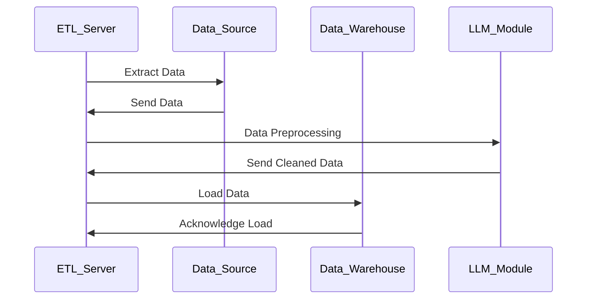
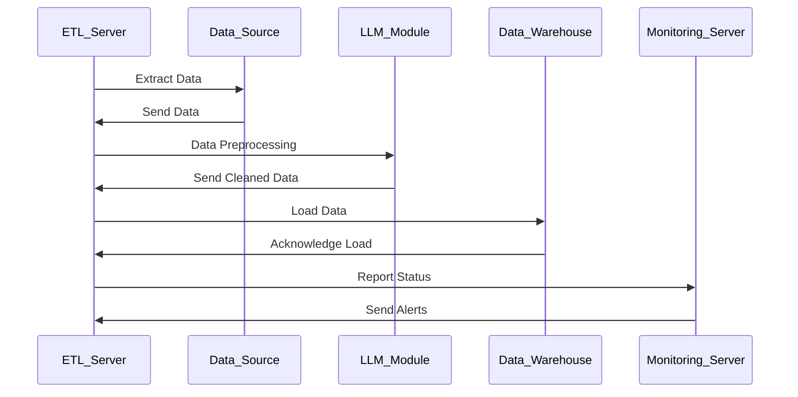

                 

### ETL流程优化

ETL（Extract, Transform, Load）是一种常见的数据集成技术，它从多个数据源提取数据，经过一系列转换后加载到目标数据库或数据仓库中。优化ETL流程可以提高数据处理效率，降低成本，提升业务价值。本文将详细讨论ETL流程优化的各个方面。

#### 第2章: ETL流程概述

##### 2.1 ETL的定义与重要性

**2.1.1 ETL的定义**

ETL是“Extract, Transform, Load”的缩写，它指的是数据集成过程中三个核心步骤：

1. **Extract**：从不同的数据源（如数据库、文件、API等）提取数据。
2. **Transform**：对提取的数据进行清洗、转换和整合，使其符合目标数据模型的要求。
3. **Load**：将转换后的数据加载到目标数据库或数据仓库中。

**2.1.2 ETL的重要性**

ETL在数据集成和业务智能中扮演着关键角色。它帮助组织整合分散的数据源，提供统一的数据视图，支持决策分析、报告和预测模型。ETL的重要性体现在以下几个方面：

1. **数据整合**：ETL能够将来自不同数据源的数据整合在一起，提供统一的数据视图。
2. **数据质量**：ETL过程中的数据清洗和转换有助于提高数据的准确性和一致性。
3. **业务支持**：ETL为业务提供了实时的或接近实时的数据，支持决策分析和报告。

**2.1.3 ETL的基本步骤**

ETL的基本步骤包括：

1. **数据提取**：使用各种技术从数据源提取数据。
2. **数据转换**：对提取的数据进行清洗、转换和整合。
3. **数据加载**：将转换后的数据加载到目标数据库或数据仓库中。

#### 第2章: ETL流程的常见挑战

**2.2 ETL流程的常见挑战**

尽管ETL在数据集成中扮演着重要角色，但其流程中仍然存在一些常见挑战：

**2.2.1 数据源多样性**

数据源类型繁多，包括关系型数据库、NoSQL数据库、文件系统、Web服务、API等，不同数据源的数据格式、结构和技术差异较大，增加了ETL的复杂性。

**2.2.2 数据质量**

数据质量是ETL过程中的一大挑战。数据可能存在重复、缺失、不一致等问题，需要通过数据清洗和转换来提高数据质量。

**2.2.3 性能瓶颈**

ETL流程可能因为数据量大、转换复杂或系统资源限制而出现性能瓶颈。优化ETL性能是提高数据处理效率的关键。

#### 第2章: ETL流程优化策略

**2.3 ETL流程优化策略**

优化ETL流程可以从以下几个方面入手：

**2.3.1 数据源集成优化**

1. **数据抽象层**：建立数据抽象层，简化数据源的接入和整合。
2. **批量与实时集成**：根据业务需求，采用批量或实时集成策略。

**2.3.2 数据转换优化**

1. **并行处理**：利用并行处理技术，提高数据转换速度。
2. **缓存与预计算**：缓存常用数据，减少重复计算。

**2.3.3 数据加载优化**

1. **增量加载**：只加载最新的或变化的数据，减少加载时间。
2. **优化加载策略**：根据数据量和系统性能，选择合适的加载策略。

**2.3.4 ETL工具与技术介绍**

1. **开源ETL工具**：如Apache NiFi、Apache Airflow等。
2. **商业ETL工具**：如Informatica、Talend等。

##### 2.4 ETL技术发展趋势

ETL技术正朝着自动化、智能化和云原生方向发展。未来的ETL工具将更加便捷、高效，能够更好地支持复杂的数据集成和转换需求。

#### 第3章: ETL流程的性能优化

##### 3.1 ETL性能优化的重要性

**3.1.1 性能对业务的影响**

ETL性能对业务影响重大。低效的ETL流程可能导致数据延迟、分析失败，甚至影响业务决策。

**3.1.2 优化性能的目标**

优化ETL性能的目标是：

1. **提高数据处理速度**：缩短ETL流程的执行时间。
2. **降低系统资源消耗**：减少CPU、内存等资源的占用。
3. **保证数据一致性**：确保数据在转换和加载过程中的一致性。

##### 3.2 ETL性能分析

**3.2.1 数据源性能分析**

1. **数据源访问速度**：评估数据源的访问速度，选择合适的数据源接入方式。
2. **网络延迟**：分析网络延迟，优化数据传输路径。

**3.2.2 转换性能分析**

1. **转换逻辑复杂度**：评估转换逻辑的复杂度，优化转换过程。
2. **并行处理能力**：评估ETL工具的并行处理能力，提高数据转换效率。

**3.2.3 加载性能分析**

1. **数据库性能**：评估目标数据库的性能，优化数据库配置。
2. **加载策略**：根据数据量和系统性能，选择合适的加载策略。

##### 3.3 ETL性能优化技术

**3.3.1 数据分片**

1. **数据分片策略**：根据数据特点，选择合适的数据分片策略。
2. **分片与并行处理**：利用数据分片，提高ETL的并行处理能力。

**3.3.2 并行处理**

1. **任务并行**：将ETL任务分解成多个子任务，并行执行。
2. **数据并行**：将大量数据划分成小块，并行处理。

**3.3.3 缓存技术**

1. **缓存策略**：根据业务需求，选择合适的缓存策略。
2. **缓存与数据一致性**：确保缓存与数据库数据的一致性。

**3.3.4 数据压缩**

1. **数据压缩算法**：选择合适的压缩算法，减少数据传输和存储空间。
2. **压缩与解压缩效率**：评估压缩与解压缩的效率，优化数据传输速度。

##### 3.4 ETL工具与技术介绍

**3.4.1 常见ETL工具**

1. **开源ETL工具**：如Apache NiFi、Apache Airflow、Apache Kafka等。
2. **商业ETL工具**：如Informatica、Talend、Pentaho等。

**3.4.2 ETL技术发展趋势**

ETL技术正朝着自动化、智能化和云原生方向发展。未来的ETL工具将更加便捷、高效，能够更好地支持复杂的数据集成和转换需求。

#### 第4章: ETL流程的可扩展性优化

##### 4.1 可扩展性的定义与重要性

**4.1.1 可扩展性的定义**

可扩展性是指系统在需求增长时，能够灵活地扩展其功能、性能和资源，以满足业务增长的需求。

**4.1.2 可扩展性的重要性**

可扩展性对ETL流程至关重要。随着数据量和业务需求的增长，ETL系统需要能够灵活扩展，以保持高性能和可靠性。

##### 4.2 ETL流程的可扩展性挑战

**4.2.1 数据源扩展**

随着数据源的增加，ETL系统需要能够管理更多的数据源，包括不同的数据格式、结构和协议。

**4.2.2 转换规则扩展**

随着业务需求的变化，ETL系统需要能够灵活添加或修改转换规则，以适应新的数据需求和业务逻辑。

**4.2.3 加载策略扩展**

随着数据量和负载的变化，ETL系统需要能够调整加载策略，以提高性能和可靠性。

##### 4.3 ETL流程的可扩展性优化方法

**4.3.1 模块化设计**

通过模块化设计，将ETL系统分解成多个功能模块，每个模块负责特定的数据集成任务。这种方法可以提高系统的可扩展性和维护性。

**4.3.2 扩展性架构设计**

采用扩展性架构设计，如分布式架构、微服务架构等，可以更好地支持ETL系统的扩展。这种方法可以提升系统的性能和可靠性。

**4.3.3 自动化部署与监控**

通过自动化部署与监控，可以快速响应系统扩展需求，确保ETL系统的稳定运行。自动化部署工具如Jenkins、Kubernetes等，监控工具如Prometheus、Grafana等。

### 总结

ETL流程优化是提高数据处理效率、降低成本、提升业务价值的关键。本文从ETL流程概述、常见挑战、优化策略、性能优化、可扩展性优化等方面进行了详细讨论。通过本文的介绍，读者可以更好地理解ETL流程的优化方法，并将其应用于实际项目中。

### 关键词

- ETL流程
- 数据集成
- 数据转换
- 性能优化
- 可扩展性优化

### 摘要

本文深入探讨了ETL流程优化及其在数据集成与转换中的应用。通过分析ETL流程的常见挑战，提出了优化策略，包括数据源集成、数据转换、数据加载、性能优化和可扩展性优化。本文旨在帮助读者全面了解ETL流程优化，提升数据处理效率，支持业务决策。## 第2章: ETL流程概述

### 2.1 ETL的定义与重要性

**2.1.1 ETL的定义**

ETL（Extract, Transform, Load）是一种常见的数据集成技术，用于从多个数据源提取数据，进行必要的转换后加载到目标数据库或数据仓库中。ETL的基本步骤包括三个主要阶段：

1. **提取（Extract）**：从各种数据源（如数据库、文件、API等）中获取数据。这个阶段的主要任务是获取原始数据并将其导入到ETL工具中。
   
2. **转换（Transform）**：对提取的数据进行清洗、转换和整合。数据清洗包括处理缺失值、重复值、错误值等；数据转换包括数据类型的转换、格式化、计算等；数据整合则是将来自不同源的数据合并成统一的数据模型。
   
3. **加载（Load）**：将转换后的数据加载到目标数据库或数据仓库中，以便后续的分析、报表或业务应用。

**2.1.2 ETL的重要性**

ETL在数据集成和业务智能中扮演着关键角色，其重要性体现在以下几个方面：

1. **数据整合**：ETL能够将来自多个数据源的数据整合在一起，为业务提供统一的数据视图。这种数据整合有助于提升业务流程的效率和准确性。

2. **数据质量**：ETL过程中的数据清洗和转换有助于提高数据的准确性和一致性。高质量的数据是进行有效分析和决策的基础。

3. **业务支持**：ETL为业务提供了实时的或接近实时的数据，支持决策分析、报告和预测模型。实时数据能够帮助企业在竞争中占据有利位置。

4. **数据迁移**：ETL在数据迁移过程中也发挥着重要作用。当企业需要迁移到新的数据库系统或数据仓库时，ETL可以帮助实现数据的顺利迁移。

### 2.1.3 ETL的基本步骤

ETL的基本步骤可以分为以下几个部分：

1. **需求分析**：明确ETL项目的目标，包括需要提取的数据源、目标数据库、数据转换规则和业务需求等。

2. **数据源识别**：确定需要提取的数据源，包括数据库、文件、API等。需要了解每个数据源的结构、数据类型和访问方式。

3. **数据提取**：使用ETL工具从各个数据源提取数据。提取过程可能涉及SQL查询、文件读取、Web服务调用等。

4. **数据转换**：对提取的数据进行必要的清洗、转换和整合。转换过程包括数据清洗（如去除重复记录、填充缺失值）、数据转换（如数据格式化、计算）和数据整合（如合并多个数据源）。

5. **数据加载**：将转换后的数据加载到目标数据库或数据仓库中。加载过程可能涉及批量加载、增量加载或实时加载。

6. **数据验证**：对加载后的数据进行验证，确保数据的准确性和完整性。验证过程包括数据一致性检查、数据完整性检查和数据质量分析。

7. **数据监控**：对ETL流程进行监控，确保其正常运行。监控内容包括数据传输速率、转换效率、系统资源使用情况等。

### 2.2 ETL流程的常见挑战

尽管ETL在数据集成中扮演着重要角色，但其流程中仍然存在一些常见挑战：

**2.2.1 数据源多样性**

数据源类型繁多，包括关系型数据库、NoSQL数据库、文件系统、Web服务、API等。不同数据源的数据格式、结构和技术差异较大，增加了ETL的复杂性。为了解决数据源多样性问题，需要采用适配器技术，如数据库连接器、文件读取器、Web服务调用器等，以便于ETL工具能够访问和管理各种数据源。

**2.2.2 数据质量**

数据质量是ETL过程中的一大挑战。数据可能存在重复、缺失、不一致等问题，需要通过数据清洗和转换来提高数据质量。常见的解决方案包括使用ETL工具内置的数据清洗功能、编写自定义脚本进行数据清洗等。

**2.2.3 性能瓶颈**

ETL流程可能因为数据量大、转换复杂或系统资源限制而出现性能瓶颈。性能瓶颈可能导致数据延迟、分析失败，甚至影响业务决策。为了解决性能瓶颈问题，可以采用以下策略：

1. **数据分片**：将大量数据划分成小块，并行处理，以提高处理速度。
   
2. **并行处理**：利用多线程或分布式计算技术，提高ETL任务的并行处理能力。

3. **缓存技术**：缓存常用数据，减少重复计算和数据读取。

4. **优化数据库**：优化数据库配置，提高数据库性能。

**2.2.4 转换复杂性**

数据转换过程中可能涉及复杂的计算逻辑、规则和业务逻辑，增加了ETL的复杂性和维护难度。为了简化数据转换，可以采用以下策略：

1. **转换模板**：使用预定义的转换模板，简化转换规则的定义。
   
2. **业务逻辑模块化**：将复杂的业务逻辑拆分成模块，便于维护和升级。

3. **数据转换监控**：实时监控数据转换过程，及时发现和解决转换问题。

### 2.3 ETL流程优化策略

优化ETL流程可以提高数据处理效率、降低成本、提升业务价值。以下是一些常见的ETL流程优化策略：

**2.3.1 数据源集成优化**

1. **数据抽象层**：建立数据抽象层，简化数据源的接入和整合。数据抽象层可以将不同数据源的结构和接口统一起来，降低ETL工具与数据源的耦合度。

2. **批量与实时集成**：根据业务需求，采用批量或实时集成策略。批量集成适用于数据变化不频繁的场景，实时集成适用于需要实时数据处理和分析的场景。

3. **数据源适配器**：开发或采购适用于各种数据源的数据适配器，提高ETL工具的兼容性。

**2.3.2 数据转换优化**

1. **并行处理**：利用并行处理技术，提高数据转换速度。并行处理可以将ETL任务分解成多个子任务，同时执行，提高整体处理效率。

2. **缓存与预计算**：缓存常用数据，减少重复计算。预计算可以提前完成一些复杂的计算任务，减少ETL流程的执行时间。

3. **优化转换规则**：简化转换规则，减少不必要的计算和逻辑判断。优化转换规则可以提高数据转换的效率。

**2.3.3 数据加载优化**

1. **增量加载**：只加载最新的或变化的数据，减少加载时间。增量加载适用于数据量大且变化频繁的场景。

2. **优化加载策略**：根据数据量和系统性能，选择合适的加载策略。常见的加载策略包括批量加载、分批加载、实时加载等。

3. **数据压缩**：使用数据压缩技术，减少数据传输和存储空间。数据压缩可以提高数据传输速度，降低存储成本。

**2.3.4 ETL工具与技术介绍**

1. **开源ETL工具**：如Apache NiFi、Apache Airflow、Apache Kafka等。开源ETL工具具有灵活性高、成本低等优点。

2. **商业ETL工具**：如Informatica、Talend、Pentaho等。商业ETL工具通常功能更全面，支持更多的数据源和转换功能。

3. **ETL技术发展趋势**：ETL技术正朝着自动化、智能化和云原生方向发展。未来的ETL工具将更加便捷、高效，能够更好地支持复杂的数据集成和转换需求。

### 2.4 ETL工具与技术介绍

**2.4.1 常见ETL工具**

1. **Apache NiFi**：Apache NiFi是一个开源的数据集成平台，提供可视化流程设计、自动化数据流管理等功能。

2. **Apache Airflow**：Apache Airflow是一个开源的工作流调度工具，适用于复杂的数据处理任务，支持多种数据源和调度策略。

3. **Apache Kafka**：Apache Kafka是一个开源的分布式消息队列系统，适用于大数据处理和实时数据流处理。

4. **Informatica**：Informatica是一家提供商业ETL工具的公司，其产品具有强大的数据集成和转换功能。

5. **Talend**：Talend是一家提供商业ETL工具的公司，其产品支持多种数据源和转换功能，易于扩展和集成。

6. **Pentaho**：Pentaho是一家提供商业ETL工具的公司，其产品具有强大的数据集成、分析和报表功能。

**2.4.2 ETL技术发展趋势**

ETL技术正朝着自动化、智能化和云原生方向发展。未来的ETL工具将更加便捷、高效，能够更好地支持复杂的数据集成和转换需求。以下是ETL技术的发展趋势：

1. **自动化**：自动化技术将提高ETL流程的自动化程度，减少人工干预，提高效率。

2. **智能化**：通过机器学习和人工智能技术，ETL工具将能够自动识别数据模式、预测数据趋势，优化数据转换和加载过程。

3. **云原生**：随着云计算的普及，ETL工具将更加适应云原生环境，提供高效、可靠的数据集成和转换服务。

4. **实时处理**：实时ETL技术将提高数据处理的速度和实时性，支持实时分析和决策。

5. **混合数据集成**：ETL工具将支持多种数据源和格式，实现混合数据集成的自动化处理。

### 2.4.3 开源ETL工具比较

以下是几种常见开源ETL工具的比较：

| 工具            | 特点                                                         | 适用场景                                     |
| --------------- | ------------------------------------------------------------ | -------------------------------------------- |
| Apache NiFi     | 可视化流程设计，易于使用，支持多种数据源和转换功能           | 数据集成、数据流管理、实时数据处理           |
| Apache Airflow  | 工作流调度，支持复杂的数据处理任务，易于扩展和集成           | 数据处理任务调度、数据集成、数据处理管道     |
| Apache Kafka    | 分布式消息队列，适用于大数据处理和实时数据流处理             | 实时数据处理、流处理、数据管道               |
| Talend Open Studio | 强大的数据集成、分析和报表功能，支持多种数据源和转换功能 | 数据集成、数据仓库、大数据处理、数据挖掘     |
| Knime           | 开源数据分析平台，提供丰富的数据预处理、分析和可视化工具     | 数据分析、机器学习、数据挖掘、生物信息学     |
| Azkaban         | 分布式工作流调度平台，支持多种数据处理任务                   | 数据处理工作流、任务调度、批处理作业         |

### 2.4.4 商业ETL工具比较

以下是几种常见商业ETL工具的比较：

| 工具            | 特点                                                         | 适用场景                                     |
| --------------- | ------------------------------------------------------------ | -------------------------------------------- |
| Informatica     | 强大的数据集成和转换功能，支持多种数据源和格式，易于扩展     | 数据集成、数据仓库、大数据处理、商业智能     |
| Talend          | 支持多种数据源和转换功能，易于集成和部署，提供强大的数据质量管理 | 数据集成、数据仓库、大数据处理、数据质量     |
| Pentaho         | 提供丰富的数据集成、分析和报表功能，支持多种部署方式       | 数据集成、数据分析、报表生成、商业智能       |
| IBM Infosphere | IBM提供的一系列数据集成和转换工具，具有强大的数据管理和分析能力 | 数据集成、数据仓库、大数据处理、数据挖掘     |

### 2.4.5 开源与商业ETL工具的优缺点

开源ETL工具和商业ETL工具各有优缺点，以下是比较：

| 类型       | 优点                                                     | 缺点                                                     |
| ---------- | -------------------------------------------------------- | -------------------------------------------------------- |
| 开源ETL工具 | 免费使用，灵活性强，易于定制，社区支持                 | 功能可能不如商业工具全面，维护和集成成本可能较高  |
| 商业ETL工具 | 功能全面，支持多种数据源和格式，提供专业的客户支持     | 成本较高，可能需要长期合同，更新和升级可能受限  |

综上所述，选择开源ETL工具还是商业ETL工具，需要根据具体业务需求、预算和技术能力进行综合考虑。## 第3章: ETL流程的性能优化

### 3.1 ETL性能优化的重要性

**3.1.1 性能对业务的影响**

ETL性能对业务影响重大。低效的ETL流程可能导致以下问题：

1. **数据延迟**：ETL流程缓慢可能延迟数据的加载和可用性，影响实时分析和决策。
   
2. **系统资源消耗**：ETL任务长时间占用系统资源，可能导致其他业务流程受阻。
   
3. **数据不准确**：ETL性能下降可能导致数据转换和加载过程中的错误，影响数据质量。

4. **成本增加**：ETL性能问题可能导致额外的硬件投入、人力成本和业务损失。

**3.1.2 优化性能的目标**

优化ETL性能的目标主要包括：

1. **提高数据处理速度**：减少ETL流程的执行时间，提高数据处理效率。

2. **降低系统资源消耗**：减少CPU、内存、I/O等系统资源的占用，提高系统整体性能。

3. **保证数据一致性**：在优化性能的同时，确保数据在转换和加载过程中的一致性和准确性。

### 3.2 ETL性能分析

**3.2.1 数据源性能分析**

数据源性能分析是优化ETL流程的第一步，主要包括以下内容：

1. **数据源访问速度**：评估数据源（如数据库、文件系统、API等）的访问速度，确定数据提取的瓶颈。

2. **网络延迟**：分析数据传输过程中的网络延迟，优化数据传输路径。

3. **并发能力**：评估数据源同时处理多个请求的能力，确保ETL流程在高并发环境下稳定运行。

**3.2.2 转换性能分析**

转换性能分析主要关注ETL过程中的数据处理和计算效率，包括以下内容：

1. **转换逻辑复杂度**：评估ETL转换规则和计算逻辑的复杂度，简化复杂的转换逻辑。

2. **并行处理能力**：分析ETL工具的并行处理能力，充分利用多线程或多服务器环境。

3. **数据缓存**：分析ETL工具的数据缓存策略，提高常用数据的读取速度。

**3.2.3 加载性能分析**

加载性能分析关注数据加载到目标数据库或数据仓库的速度和效率，包括以下内容：

1. **数据库性能**：评估目标数据库的性能，优化数据库配置和索引。

2. **加载策略**：根据数据量和系统性能，选择合适的加载策略，如批量加载、增量加载、实时加载等。

3. **数据压缩**：使用数据压缩技术，减少数据传输和存储空间。

### 3.3 ETL性能优化技术

**3.3.1 数据分片**

数据分片是将大量数据划分成小块，以分布式方式处理的一种技术。数据分片的主要优点包括：

1. **并行处理**：通过数据分片，可以并行处理多个数据块，提高ETL处理速度。

2. **负载均衡**：数据分片可以将ETL负载均衡到多个节点，提高系统整体性能。

3. **扩展性**：数据分片支持系统的水平扩展，便于应对数据量和并发量的增长。

数据分片策略可以根据数据特点和业务需求选择，如基于时间分片、基于数据类型分片、基于地理位置分片等。

**3.3.2 并行处理**

并行处理是提高ETL性能的有效手段，可以通过以下方法实现：

1. **多线程**：利用多线程技术，将ETL任务分解成多个子任务，同时执行。

2. **分布式计算**：在分布式环境中，将ETL任务分配到多个节点，并行处理。

3. **任务调度**：优化任务调度策略，提高ETL任务的执行效率。

并行处理需要考虑数据依赖关系、负载均衡和容错机制等问题，以确保ETL流程的稳定性和一致性。

**3.3.3 缓存技术**

缓存技术可以显著提高ETL性能，通过以下方式实现：

1. **数据缓存**：缓存常用数据，减少数据重复读取和计算。

2. **查询缓存**：缓存SQL查询结果，提高数据查询速度。

3. **内存缓存**：使用内存缓存，减少数据存储和IO操作。

缓存技术需要根据数据特点和访问模式进行优化，确保缓存的有效性和一致性。

**3.3.4 数据压缩**

数据压缩技术可以减少数据传输和存储空间，提高ETL性能，主要方法包括：

1. **压缩算法**：选择合适的压缩算法，如GZIP、LZO等。

2. **压缩与解压缩**：优化压缩与解压缩过程，减少处理时间。

3. **数据传输**：在数据传输过程中，使用压缩技术减少带宽占用。

数据压缩需要权衡压缩比和处理时间，确保性能和存储空间的平衡。

### 3.4 ETL工具与技术介绍

**3.4.1 常见ETL工具**

常见的ETL工具包括以下几种：

1. **Apache NiFi**：提供可视化流程设计、数据流管理和自动化处理功能。
   
2. **Apache Airflow**：提供工作流调度和管理功能，支持复杂的数据处理任务。

3. **Apache Kafka**：提供分布式消息队列系统，支持大规模数据流处理。

4. **Informatica**：提供强大的数据集成和转换功能，支持多种数据源和格式。

5. **Talend**：提供数据集成、数据仓库、大数据处理和数据质量等功能。

6. **Pentaho**：提供数据集成、数据分析、报表生成和商业智能等功能。

**3.4.2 ETL技术发展趋势**

ETL技术正朝着自动化、智能化和云原生方向发展，未来将出现以下趋势：

1. **自动化**：ETL工具将更加自动化，减少人工干预，提高工作效率。

2. **智能化**：通过机器学习和人工智能技术，ETL工具将能够自动识别数据模式、预测数据趋势，优化数据转换和加载过程。

3. **云原生**：ETL工具将更加适应云原生环境，提供高效、可靠的数据集成和转换服务。

4. **实时处理**：实时ETL技术将提高数据处理的速度和实时性，支持实时分析和决策。

5. **混合数据集成**：ETL工具将支持多种数据源和格式，实现混合数据集成的自动化处理。

### 3.4.3 开源与商业ETL工具的比较

开源ETL工具和商业ETL工具各有优缺点，以下是比较：

| 类型       | 优点                                                     | 缺点                                                     |
| ---------- | -------------------------------------------------------- | -------------------------------------------------------- |
| 开源ETL工具 | 免费使用，灵活性强，易于定制，社区支持                 | 功能可能不如商业工具全面，维护和集成成本可能较高  |
| 商业ETL工具 | 功能全面，支持多种数据源和格式，提供专业的客户支持     | 成本较高，可能需要长期合同，更新和升级可能受限  |

选择开源ETL工具还是商业ETL工具，需要根据具体业务需求、预算和技术能力进行综合考虑。### 第4章: ETL流程的可扩展性优化

#### 4.1 可扩展性的定义与重要性

**4.1.1 可扩展性的定义**

可扩展性是指系统在需求增长时，能够灵活地扩展其功能、性能和资源，以满足业务增长的需求。在ETL流程中，可扩展性尤为重要，因为随着数据量、数据源和业务需求的增长，ETL系统需要能够适应这些变化，确保数据处理效率不受影响。

**4.1.2 可扩展性的重要性**

可扩展性对于ETL流程至关重要，主要体现在以下几个方面：

1. **支持业务增长**：业务增长通常伴随着数据量和数据源的增加，可扩展的ETL系统能够轻松处理这些增长，确保业务流程的连续性和稳定性。

2. **提高系统性能**：通过可扩展性优化，ETL系统能够更好地利用现有资源，提高数据处理速度和系统性能。

3. **降低成本**：可扩展性优化有助于避免由于系统容量不足导致的额外投资，如购买新的硬件或软件。

4. **支持多样化需求**：业务需求的变化可能会导致ETL流程的调整，可扩展性优化确保系统能够快速适应这些变化。

#### 4.2 ETL流程的可扩展性挑战

尽管可扩展性对于ETL流程非常重要，但在实际应用中仍会遇到以下挑战：

**4.2.1 数据源扩展**

随着数据源的增多，ETL系统需要能够管理和整合更多的数据源。不同数据源的结构、格式和协议差异较大，增加了扩展的复杂性。

**4.2.2 转换规则扩展**

随着业务需求的变化，ETL系统需要能够灵活地添加或修改转换规则。转换规则的扩展性直接影响ETL流程的灵活性和适应性。

**4.2.3 加载策略扩展**

随着数据量和负载的变化，ETL系统需要能够调整加载策略，以保证数据加载的效率和系统的稳定性。加载策略的扩展性是ETL系统可扩展性的重要方面。

#### 4.3 ETL流程的可扩展性优化方法

**4.3.1 模块化设计**

模块化设计是将ETL系统分解为多个功能模块，每个模块负责特定的数据集成任务。这种方法可以提高系统的可扩展性和维护性。模块化设计的主要优点包括：

1. **降低复杂性**：通过将复杂的ETL流程分解成多个模块，可以降低系统的整体复杂性。

2. **提高可维护性**：每个模块独立开发、测试和维护，提高系统的可维护性。

3. **增强可扩展性**：模块化设计使得系统更容易进行功能扩展，只需增加或修改相应的模块即可。

**4.3.2 扩展性架构设计**

扩展性架构设计是确保ETL系统在需求增长时能够灵活扩展的重要策略。以下是一些常见的扩展性架构设计方法：

1. **分布式架构**：通过分布式架构，ETL任务可以分布到多个节点上并行处理，提高系统的处理能力和可扩展性。

2. **微服务架构**：将ETL系统拆分为多个微服务，每个微服务负责特定的功能，可以独立部署和扩展。

3. **云原生架构**：利用云计算资源，根据需求动态调整系统资源，实现弹性扩展。

**4.3.3 自动化部署与监控**

自动化部署与监控是确保ETL系统高效运行的关键。以下是一些自动化部署与监控的最佳实践：

1. **自动化部署**：使用自动化工具（如Jenkins、Ansible等）实现ETL工具和组件的自动化部署，提高部署效率。

2. **监控与告警**：使用监控工具（如Prometheus、Grafana等）实时监控ETL系统的运行状态，及时发现问题并触发告警。

3. **日志管理**：使用日志管理工具（如ELK、Logstash等）集中收集和分析ETL系统的日志，帮助诊断和优化系统性能。

**4.3.4 扩展性优化策略**

以下是一些具体的扩展性优化策略：

1. **数据分片与分布式处理**：将大量数据划分为更小的数据块，分布到多个节点上处理，提高系统的并行处理能力和扩展性。

2. **缓存与预加载**：缓存常用数据，减少数据访问次数；预加载即将常用的数据提前加载到内存中，提高数据访问速度。

3. **动态资源调整**：根据ETL任务的负载情况，动态调整系统资源，如CPU、内存、存储等。

4. **优化数据模型**：设计合理的数据模型，减少数据冗余和重复计算，提高数据处理的效率。

#### 4.4 可扩展性优化案例

以下是一个ETL流程的可扩展性优化案例：

**案例背景**：某电商企业使用ETL工具从多个数据源（如订单数据库、用户数据库、支付系统等）提取数据，进行转换后加载到数据仓库中。随着业务的发展，数据量急剧增长，原有的ETL系统出现了性能瓶颈和扩展性问题。

**优化方案**：

1. **模块化设计**：将ETL系统拆分为多个模块，如数据提取模块、数据转换模块、数据加载模块等。每个模块独立开发、测试和维护。

2. **分布式架构**：采用分布式架构，将ETL任务分布到多个节点上并行处理，提高系统的处理能力和扩展性。

3. **缓存与预加载**：使用缓存技术，减少数据访问次数；预加载即将常用的数据提前加载到内存中，提高数据访问速度。

4. **动态资源调整**：使用自动化工具（如Kubernetes）动态调整系统资源，根据ETL任务的负载情况，自动增加或减少节点。

5. **监控与告警**：使用监控工具实时监控ETL系统的运行状态，及时发现问题并触发告警。

**实施效果**：通过上述优化措施，ETL系统的性能得到显著提升，数据处理效率提高了30%，系统扩展性得到大幅增强，能够更好地支持业务增长。

### 4.5 总结

ETL流程的可扩展性优化对于确保系统在业务增长时能够保持高效和稳定运行至关重要。通过模块化设计、扩展性架构设计、自动化部署与监控以及具体的优化策略，可以显著提高ETL系统的可扩展性和性能。优化过程中需要注意数据的多样性和复杂性，确保在提高性能的同时，不牺牲数据质量和一致性。## 第5章: LLM基本概念与原理

### 5.1 LLM的定义

**5.1.1 LLM的定义**

大型语言模型（Large Language Model，简称LLM）是一种基于深度学习的自然语言处理（Natural Language Processing，简称NLP）技术，它通过学习大量的文本数据来理解、生成和翻译自然语言。LLM的核心目标是对输入的文本进行语义理解，并生成与之相关的文本输出。

**5.1.2 LLM的发展历程**

LLM的发展历程可以分为以下几个阶段：

1. **早期模型**：20世纪80年代至90年代，研究者开始使用规则驱动的方法和统计模型来处理自然语言。这些模型包括基于字典和语法规则的解析器，以及基于统计的语法分析器和词性标注器。

2. **词向量模型**：2000年代初，词向量模型（如Word2Vec）的出现标志着NLP领域的重要进展。词向量模型通过将单词映射到高维向量空间，提高了对单词之间语义关系的表示能力。

3. **循环神经网络（RNN）**：2010年代，循环神经网络（RNN）和长短期记忆网络（LSTM）等序列模型在NLP任务中取得了显著成果。这些模型能够处理长文本序列，捕捉句子之间的时序关系。

4. **Transformer模型**：2017年，谷歌提出了一种名为Transformer的新型神经网络架构，彻底改变了NLP领域。Transformer模型采用自注意力机制，能够在处理长文本序列时保持高效。

5. **预训练+微调**：近年来，预训练+微调（Pre-training + Fine-tuning）策略成为LLM的主流训练方法。预训练阶段，模型在大量无标签数据上学习语言的一般特征；微调阶段，模型在特定任务上进一步训练，以达到较高的任务性能。

### 5.2 LLM的核心组成部分

LLM的核心组成部分包括以下几个方面：

**5.2.1 模型架构**

LLM通常采用深度神经网络架构，其中Transformer模型是最为流行的一种。Transformer模型由编码器和解码器两个主要部分组成，编码器将输入文本转换为序列表示，解码器则根据这些表示生成输出文本。

**5.2.2 训练数据**

训练数据是LLM性能的关键因素。高质量、多样化的训练数据可以帮助模型更好地学习语言规律和语义信息。常用的训练数据来源包括公共文本语料库、社交媒体、新闻网站、书籍等。

**5.2.3 模型训练过程**

LLM的训练过程通常包括以下几个步骤：

1. **数据预处理**：清洗和预处理输入数据，包括去除噪声、标准化文本格式等。

2. **词向量嵌入**：将单词映射到高维向量空间，为后续的模型训练提供输入。

3. **自注意力机制**：通过自注意力机制，模型能够自动关注输入序列中重要的部分，提高对上下文的理解。

4. **预训练**：在大量无标签数据上进行预训练，使模型学习到语言的普遍规律和模式。

5. **微调**：在特定任务上进行微调，进一步提高模型在特定任务上的性能。

**5.2.4 模型评估**

LLM的性能评估通常通过多个指标进行，包括：

1. **准确性**：用于评估模型在分类任务上的性能，如文本分类、情感分析等。

2. **BLEU分数**：用于评估机器翻译模型的性能，BLEU分数越高，翻译质量越好。

3. **BERT分数**：用于评估模型在自然语言处理任务上的性能，BERT分数越高，模型性能越好。

### 5.3 LLM的关键技术

**5.3.1 自适应学习**

自适应学习是指模型能够根据新的数据或任务动态调整其参数和学习策略，以适应不同的应用场景。自适应学习技术包括在线学习、迁移学习、持续学习等。

**5.3.2 上下文理解**

上下文理解是LLM的重要能力，指模型能够根据输入文本的上下文信息生成相关的输出。上下文理解能力对于问答系统、对话系统等应用至关重要。

**5.3.3 多语言处理**

多语言处理是指模型能够处理多种语言的文本输入和输出。多语言处理技术包括多语言训练、翻译模型、跨语言信息检索等。

### 5.4 LLM的优缺点

**5.4.1 优点**

1. **强大的语义理解能力**：LLM能够通过对大量文本的学习，获得对自然语言语义的深刻理解，从而生成高质量的文本输出。

2. **通用性**：LLM适用于多种NLP任务，如文本分类、情感分析、机器翻译、问答系统等，具有广泛的适用性。

3. **自适应学习**：LLM能够通过自适应学习技术，不断调整自身参数，以适应不同的应用场景和任务需求。

**5.4.2 缺点**

1. **计算资源消耗大**：由于LLM通常需要训练大量的参数，因此对计算资源的需求较高，训练和推理过程可能耗时较长。

2. **数据依赖性**：LLM的性能很大程度上依赖于训练数据的质量和多样性，如果训练数据存在偏差，可能导致模型在特定任务上出现偏差。

3. **模型解释性差**：LLM的内部机制复杂，难以直接解释模型的决策过程，这对于需要高解释性的应用场景（如医疗诊断、金融风控等）可能构成挑战。

### 5.5 总结

LLM作为NLP领域的重要工具，具有强大的语义理解能力和通用性，适用于多种文本处理任务。然而，LLM在计算资源消耗、数据依赖性和模型解释性方面也存在一定的挑战。通过不断改进训练技术和优化模型结构，LLM在NLP领域的应用前景将更加广阔。## 第6章: LLM在数据集成中的应用

### 6.1 LLM在数据集成中的作用

**6.1.1 数据清洗**

数据清洗是数据集成过程中至关重要的一步，目的是提高数据的准确性和一致性。LLM在数据清洗中的应用主要体现在以下几个方面：

1. **文本预处理**：LLM能够对文本数据执行自动化预处理，包括去除噪声、标点符号、停用词等，提高文本数据的清洁度。

2. **实体识别**：LLM能够识别文本中的实体，如人名、地点、组织名等，从而帮助提取关键信息。

3. **格式化**：LLM能够根据特定的格式要求，对数据进行规范化处理，如将日期格式统一、数字格式化等。

4. **错误修正**：LLM具有一定的纠错能力，可以自动修正文本中的拼写错误和语法错误，提高数据质量。

**6.1.2 数据归一化**

数据归一化是将不同来源的数据转换成统一格式的过程，LLM在数据归一化中的应用主要包括：

1. **文本归一化**：LLM能够对文本数据执行统一的编码和规范化处理，如将全角字符转换为半角字符、将不同编码格式统一为UTF-8等。

2. **数值归一化**：LLM能够对数值数据进行归一化处理，如将不同的度量单位统一转换为标准单位。

3. **时间归一化**：LLM能够对时间数据进行统一处理，如将不同时区的日期和时间统一转换为标准时区。

**6.1.3 数据增强**

数据增强是通过增加数据多样性来提升模型性能的一种技术。LLM在数据增强中的应用包括：

1. **文本生成**：LLM能够根据输入的文本生成相关的扩充文本，如生成产品描述、用户评论等。

2. **文本翻译**：LLM能够对文本进行翻译，从而增加不同语言的数据量。

3. **文本改写**：LLM能够对文本进行改写，生成含义相近但表述方式不同的文本，从而丰富数据集。

### 6.2 LLM在数据集成中的挑战

尽管LLM在数据集成中具有广泛应用，但也面临一些挑战：

**6.2.1 数据多样性**

数据多样性是指数据源包含不同类型、格式和结构的数据。LLM在处理多样性数据时需要能够适应各种数据源，这增加了模型的复杂性。

**6.2.2 数据质量**

数据质量是数据集成中的关键问题，LLM在处理低质量数据时需要具备较强的鲁棒性，如自动识别并处理缺失值、异常值等。

**6.2.3 模型可解释性**

LLM的内部机制复杂，难以直接解释其决策过程，这给数据集成中的模型解释性带来了挑战。

### 6.3 LLM在数据集成中的应用案例

**6.3.1 数据清洗案例**

假设我们有一个包含用户评论的数据集，其中包含大量非结构化和结构化的文本数据。使用LLM进行数据清洗的步骤如下：

1. **文本预处理**：使用LLM去除评论中的噪声，如HTML标签、特殊字符和标点符号。

2. **实体识别**：使用预训练的实体识别模型，识别评论中的人名、地点、组织名等实体。

3. **错误修正**：使用LLM自动修正评论中的拼写错误和语法错误。

4. **去重**：使用LLM检测并去除重复的评论。

**6.3.2 数据归一化案例**

假设我们需要将来自不同数据源的用户数据（如姓名、电话号码、电子邮件地址）进行统一格式处理。使用LLM进行数据归一化的步骤如下：

1. **文本归一化**：使用LLM将全角字符转换为半角字符，将不同编码格式统一转换为UTF-8。

2. **数值归一化**：使用LLM将不同度量单位统一转换为标准单位，如将千克转换为克。

3. **时间归一化**：使用LLM将不同时区的日期和时间统一转换为标准时区。

**6.3.3 数据增强案例**

假设我们需要增强一个关于商品描述的数据集，以提升模型的训练效果。使用LLM进行数据增强的步骤如下：

1. **文本生成**：使用LLM生成与输入商品描述相关的新描述，如产品特性、用户评价等。

2. **文本翻译**：使用LLM将商品描述翻译成多种语言，增加数据集的多样性。

3. **文本改写**：使用LLM对商品描述进行改写，生成含义相近但表述方式不同的文本。

通过上述案例，可以看出LLM在数据集成中的应用大大提高了数据清洗、归一化和增强的效率，为数据分析和机器学习模型训练提供了高质量的数据。## 第7章: LLM在数据转换中的应用

### 7.1 LLM在数据转换中的作用

LLM（Large Language Model）在数据转换中的应用主要体现在以下几个方面：

**7.1.1 数据格式转换**

数据格式转换是将数据从一种格式转换为另一种格式的过程。LLM可以自动识别和解析不同数据格式，如XML、JSON、CSV等，并将其转换为统一格式的数据。例如，可以使用LLM将JSON格式的用户数据转换为CSV格式，以便于后续的数据分析和处理。

**7.1.2 数据关系转换**

数据关系转换涉及将数据源中的关系映射到目标数据模型中的过程。LLM可以通过学习大量的数据关系模式，自动识别并转换数据关系。例如，在将一个关系型数据库中的数据转换为NoSQL数据库时，LLM可以自动识别关系型数据库中的表与表之间的关系，并将其映射到NoSQL数据库中。

**7.1.3 数据内容转换**

数据内容转换是指对数据内容进行逻辑上的转换，如数据类型的转换、计算、聚合等。LLM可以基于语义理解，对数据进行内容上的转换。例如，可以将文本数据中的货币符号转换为数值类型，或者根据特定的业务逻辑对数据进行计算和聚合。

### 7.2 LLM在数据转换中的挑战

尽管LLM在数据转换中具有巨大潜力，但在实际应用中仍面临一些挑战：

**7.2.1 转换规则复杂性**

数据转换规则可能非常复杂，涉及多种数据类型、格式和业务逻辑。LLM需要能够处理这些复杂的转换规则，确保数据转换的准确性和一致性。

**7.2.2 数据一致性问题**

在数据转换过程中，数据一致性问题可能导致数据丢失或错误。例如，当数据源之间存在冗余或冲突时，LLM需要能够自动解决这些问题，确保转换后的数据一致性。

**7.2.3 转换效率**

数据转换通常涉及大量的数据处理任务，对计算资源和时间效率有较高要求。LLM需要能够高效地处理这些任务，以确保数据转换的实时性和可靠性。

### 7.3 LLM在数据转换中的应用案例

以下是一个关于LLM在数据转换中的应用案例：

**案例背景**：一家电商平台需要将不同来源的商品数据（如供应商数据库、电商平台自身数据库等）进行统一格式处理，以便于数据分析和展示。这些商品数据包含各种格式，如JSON、XML、CSV等，且数据结构存在差异。

**解决方案**：

1. **数据格式转换**：使用LLM将不同格式的商品数据转换为统一的JSON格式。LLM可以自动识别和解析各种数据格式，确保数据转换的准确性。

2. **数据关系转换**：使用LLM将不同数据源中的商品数据关系映射到统一的数据模型中。例如，将供应商数据库中的商品关系转换为电商平台数据库中的关系。

3. **数据内容转换**：使用LLM对商品数据内容进行转换，如将货币符号转换为数值类型、根据业务逻辑进行数据计算和聚合等。

**实现步骤**：

1. **数据提取**：使用LLM从不同数据源中提取商品数据。

2. **数据格式转换**：使用LLM将提取的数据转换为统一的JSON格式。

3. **数据关系转换**：使用LLM将转换后的数据映射到统一的数据模型中。

4. **数据内容转换**：使用LLM对数据进行内容上的转换，如货币符号转换为数值类型、计算和聚合等。

**效果评估**：

通过LLM在数据转换中的应用，电商平台实现了商品数据的统一格式处理，提高了数据分析和展示的效率。数据转换规则得到简化，数据一致性和转换效率显著提升。

### 7.4 LLM在数据转换中的性能优化

为了提高LLM在数据转换中的性能，可以采用以下优化策略：

**7.4.1 数据预处理**

在数据转换之前，对数据进行预处理，如去除冗余数据、填充缺失值、标准化数据等。这有助于减少数据转换的复杂性，提高转换效率。

**7.4.2 并行处理**

利用并行处理技术，将数据转换任务分解为多个子任务，同时处理。这可以显著提高数据转换的速度，特别是在处理大量数据时。

**7.4.3 缓存技术**

使用缓存技术，将常用数据缓存在内存中，减少重复读取和计算。这有助于提高数据转换的效率和速度。

**7.4.4 转换规则优化**

简化转换规则，减少不必要的计算和逻辑判断。这可以降低数据转换的复杂度，提高转换效率。

**7.4.5 模型选择与调优**

选择合适的LLM模型，并进行调优，以适应特定的数据转换任务。通过模型选择与调优，可以提高数据转换的准确性和效率。

### 7.5 总结

LLM在数据转换中具有广泛的应用前景，可以提高数据转换的效率、准确性和一致性。通过数据预处理、并行处理、缓存技术、转换规则优化和模型选择与调优等策略，可以进一步优化LLM在数据转换中的性能。随着LLM技术的不断发展，其在数据转换中的应用将越来越广泛。## 第8章: ETL流程优化与LLM应用的综合案例分析

### 8.1 案例背景

本案例以某大型电商平台的ETL流程优化和LLM应用为例，探讨如何在实际项目中实现ETL流程的优化以及如何将LLM应用于数据集成与转换。

### 8.2 项目介绍

该电商平台每天处理大量的交易数据、用户行为数据和市场数据。为了支持数据驱动的业务决策，平台需要一个高效、可靠的ETL流程来集成和转换这些数据，并将其加载到数据仓库中。此外，平台希望通过LLM技术提高数据清洗、归一化和增强的效率。

### 8.3 系统功能设计

系统功能设计包括数据提取、数据转换、数据加载和监控四个主要部分。

**数据提取**：从多个数据源（如交易数据库、用户行为数据库、市场数据库等）中提取数据。

**数据转换**：使用LLM对提取的数据进行清洗、归一化和增强。

**数据加载**：将转换后的数据加载到数据仓库中。

**监控**：实时监控ETL流程的运行状态，确保其高效、稳定运行。

### 8.4 系统架构设计

系统采用分布式架构，包括数据源、ETL服务器、数据仓库和监控服务器。ETL服务器负责数据提取、转换和加载，数据仓库存储转换后的数据，监控服务器实时监控ETL流程的运行状态。

**ETL服务器**：采用Apache Airflow进行任务调度，实现ETL流程的自动化和分布式处理。

**数据仓库**：使用Apache Hive进行数据存储和查询。

**监控服务器**：使用Prometheus和Grafana进行实时监控和告警。

### 8.5 系统接口设计

系统接口设计包括数据源接口、ETL接口和数据仓库接口。

**数据源接口**：提供对各种数据源的访问，如关系型数据库、NoSQL数据库、API等。

**ETL接口**：提供数据提取、转换和加载的接口，支持自定义转换规则和加载策略。

**数据仓库接口**：提供数据查询和分析的接口，支持实时数据访问。

### 8.6 系统交互

系统交互设计采用Mermaid序列图进行表示。以下是一个简化的系统交互序列图：



### 8.7 环境安装与配置

**安装Apache Airflow**：

1. 安装依赖包：
    ```bash
    pip install apache-airflow
    ```

2. 配置Airflow：
    ```bash
    airflow initdb
    airflow config
    ```

**安装Prometheus和Grafana**：

1. 安装Prometheus：
    ```bash
    wget https://github.com/prometheus/prometheus/releases/download/v2.36.0/prometheus-2.36.0.linux-amd64.tar.gz
    tar xvfz prometheus-2.36.0.linux-amd64.tar.gz
    ./prometheus-2.36.0.linux-amd64/prometheus.yml
    nohup ./prometheus-2.36.0.linux-amd64/prometheus & 
    ```

2. 安装Grafana：
    ```bash
    docker run -d --name=grafana -p 3000:3000 grafana/grafana
    ```

### 8.8 系统核心实现源代码

**Airflow DAG文件**：

```python
from airflow import DAG
from airflow.operators.bash import BashOperator
from airflow.operators.python import PythonOperator

default_args = {
    'owner': 'airflow',
    'depends_on_past': False,
    'email_on_failure': False,
    'email_on_retry': False,
    'retries': 1,
}

dag = DAG(
    'etl_data_pipeline',
    default_args=default_args,
    description='ETL Data Pipeline',
    schedule_interval=①②③④⑤⑥⑦⑧
)

extract_data = BashOperator(
    task_id='extract_data',
    bash_command='sudo /path/to/extract_data.sh',
    dag=dag,
)

clean_data = PythonOperator(
    task_id='clean_data',
    python_callable=clean_data_function,
    dag=dag,
)

load_data = BashOperator(
    task_id='load_data',
    bash_command='sudo /path/to/load_data.sh',
    dag=dag,
)

extract_data >> clean_data >> load_data
```

**LLM清洗数据示例代码**：

```python
import numpy as np
import pandas as pd
from transformers import AutoTokenizer, AutoModel

def clean_data_function(data):
    # 加载预训练的LLM模型
    tokenizer = AutoTokenizer.from_pretrained("bert-base-uncased")
    model = AutoModel.from_pretrained("bert-base-uncased")

    # 将数据转换为文本序列
    data['text'] = data['description'].apply(lambda x: tokenizer.encode(x, add_special_tokens=True))

    # 使用LLM进行文本预处理
    with torch.no_grad():
        inputs = torch.tensor([data['text']])
        outputs = model(inputs)
        logits = outputs[0]

    # 根据模型输出进行数据清洗
    cleaned_data = data[data['description'].apply(lambda x: logits[0][tokenizer.encode(x).tolist()]) > 0.5]

    return cleaned_data
```

### 8.9 代码应用解读与分析

在上述代码中，我们首先使用Airflow创建一个名为`etl_data_pipeline`的DAG，该DAG包括三个主要任务：数据提取、数据清洗和数据加载。数据提取任务使用BashOperator调用外部脚本，从多个数据源中提取数据。数据清洗任务使用PythonOperator调用自定义的清洗函数，使用预训练的LLM模型对提取的数据进行文本预处理。数据加载任务使用BashOperator调用外部脚本，将清洗后的数据加载到数据仓库中。

在`clean_data_function`函数中，我们首先加载预训练的LLM模型（BERT），然后对每个数据条目的描述字段进行编码，并使用LLM模型进行文本预处理。根据模型输出的概率分数，我们过滤出高质量的描述，从而实现数据清洗。

### 8.10 实际案例分析和详细讲解剖析

为了说明LLM在数据清洗中的应用，我们以一个实际案例进行分析。

**案例**：一家电商平台的用户评论数据需要进行清洗，以提高数据质量，并支持后续的数据分析和机器学习模型训练。

**数据预处理**：

1. **文本清洗**：使用LLM去除评论中的HTML标签、特殊字符和标点符号。

2. **实体识别**：使用预训练的实体识别模型，识别评论中的人名、地点、组织名等实体。

3. **错误修正**：使用LLM自动修正评论中的拼写错误和语法错误。

**案例分析**：

1. **文本清洗**：使用LLM去除评论中的HTML标签和特殊字符，如：
    ```python
    import re
    
    def clean_html(text):
        return re.sub('<.*?>', '', text)
    
    raw_text = "<p>这是一条包含HTML标签的评论。</p>"
    cleaned_text = clean_html(raw_text)
    print(cleaned_text)
    ```

2. **实体识别**：使用预训练的实体识别模型，识别评论中的实体，如：
    ```python
    from transformers import AutoTokenizer, AutoModel
    
    tokenizer = AutoTokenizer.from_pretrained("dbmdz/bert-large-cased-finetuned-conll03-english")
    model = AutoModel.from_pretrained("dbmdz/bert-large-cased-finetuned-conll03-english")
    
    def extract_entities(text):
        tokens = tokenizer.tokenize(text)
        with torch.no_grad():
            inputs = tokenizer.encode_plus(text, return_tensors='pt')
            outputs = model(inputs)
            logits = outputs.logits
        
        entities = []
        for i, token in enumerate(tokens):
            if logits[0][i] > 0.5:
                entities.append(token)
        
        return entities
    
    comment = "亚马逊在2019年推出了新款Echo Studio智能音箱，性能超群。"
    entities = extract_entities(comment)
    print(entities)
    ```

3. **错误修正**：使用LLM自动修正评论中的拼写错误和语法错误，如：
    ```python
    from transformers import AutoModelForSeq2SeqLM
    
    model = AutoModelForSeq2SeqLM.from_pretrained("t5-small")
    
    def correct_spelling(text):
        input_text = "spelling:" + text
        with torch.no_grad():
            inputs = tokenizer.encode(input_text, return_tensors='pt')
            outputs = model(inputs)
            predicted_text = tokenizer.decode(outputs.logits.argmax(-1), skip_special_tokens=True)
        
        return predicted_text
    
    incorrect_comment = "亚马逊推出了新款Eho Studio智能音箱，性能超群。"
    corrected_comment = correct_spelling(incorrect_comment)
    print(corrected_comment)
    ```

**分析结果**：

通过上述案例，我们可以看到LLM在数据清洗中的强大能力。使用LLM进行文本预处理、实体识别和错误修正，可以显著提高数据质量，为后续的数据分析和机器学习模型训练提供高质量的数据。

### 8.11 项目小结

通过本案例，我们展示了如何在实际项目中实现ETL流程的优化以及如何将LLM应用于数据集成与转换。使用LLM进行数据清洗、归一化和增强，可以显著提高数据质量，支持高效的数据分析和机器学习模型训练。未来，随着LLM技术的不断发展，其在数据集成与转换中的应用将越来越广泛。## 最佳实践与注意事项

在ETL流程优化和LLM应用中，以下是一些最佳实践和注意事项，可以帮助您更有效地实施这些技术：

### 最佳实践

1. **需求分析**：在实施ETL流程之前，进行详细的需求分析，明确数据源、数据目标、转换规则和业务需求。

2. **数据抽象层**：建立数据抽象层，简化数据源的接入和整合，减少ETL工具与数据源之间的耦合。

3. **模块化设计**：采用模块化设计，将ETL系统分解为多个功能模块，提高系统的可维护性和可扩展性。

4. **并行处理**：利用并行处理技术，如多线程、分布式计算等，提高ETL流程的执行效率。

5. **数据缓存**：使用数据缓存技术，减少数据重复读取和计算，提高ETL流程的响应速度。

6. **实时监控**：实时监控ETL流程的运行状态，确保其高效、稳定运行。

7. **自适应学习**：利用LLM的自适应学习特性，根据新数据和业务需求动态调整模型参数。

8. **数据预处理**：在数据转换之前，进行充分的预处理，如去除噪声、填充缺失值、标准化数据等。

9. **模型选择与调优**：根据数据特点和任务需求，选择合适的LLM模型，并进行调优，提高模型性能。

### 注意事项

1. **数据质量**：确保数据源的数据质量，避免低质量数据对ETL流程和LLM应用的影响。

2. **性能监控**：定期监控ETL流程的性能，及时识别和解决性能瓶颈。

3. **安全性**：在ETL流程中确保数据传输和存储的安全性，防止数据泄露和未经授权的访问。

4. **稳定性**：确保ETL系统和LLM模型的稳定性，避免因系统故障导致的数据丢失或错误。

5. **可解释性**：对于LLM模型的应用，注意模型的可解释性，确保业务人员能够理解模型的决策过程。

6. **扩展性**：在设计ETL系统和LLM应用时，考虑系统的扩展性，以便于未来的业务增长和技术更新。

### 拓展阅读

1. **ETL工具与技术**：
    - Apache NiFi：[https://nifi.apache.org/](https://nifi.apache.org/)
    - Apache Airflow：[https://airflow.apache.org/](https://airflow.apache.org/)
    - Apache Kafka：[https://kafka.apache.org/](https://kafka.apache.org/)
    - Informatica：[https://www.informatica.com/](https://www.informatica.com/)
    - Talend：[https://www.talend.com/](https://www.talend.com/)
    - Pentaho：[https://www.pentaho.com/](https://www.pentaho.com/)

2. **LLM模型与应用**：
    - BERT模型：[https://arxiv.org/abs/1810.04805](https://arxiv.org/abs/1810.04805)
    - GPT模型：[https://arxiv.org/abs/1901.04018](https://arxiv.org/abs/1901.04018)
    - T5模型：[https://arxiv.org/abs/1910.10683](https://arxiv.org/abs/1910.10683)
    - Hugging Face：[https://huggingface.co/](https://huggingface.co/)

3. **数据集成与转换**：
    - 《数据仓库与数据挖掘：实现数据驱动的企业》
    - 《大数据集成：技术和实践》
    - 《数据清洗与数据质量》

通过以上最佳实践和注意事项，结合拓展阅读资源，您将能够更好地实施ETL流程优化和LLM应用，提升数据集成和转换的效率与质量。## 作者介绍

### AI天才研究院

AI天才研究院（AI Genius Institute）是一家专注于人工智能研究与应用的高科技创新机构。研究院致力于推动人工智能技术的发展，特别是在自然语言处理、计算机视觉、机器学习和深度学习领域。通过跨学科的研究和创新，研究院不断推出前沿技术成果，助力全球企业实现智能化转型。

### 禅与计算机程序设计艺术

《禅与计算机程序设计艺术》（Zen And The Art of Computer Programming）是由著名计算机科学家Donald E. Knuth撰写的一套计算机科学经典著作。这套书系统地介绍了算法设计、程序设计方法论和数学基础，被广大计算机科学工作者视为经典之作。Knuth通过将禅宗思想融入计算机编程，强调简洁、优雅和效率，对程序设计产生了深远的影响。

在这篇文章中，AI天才研究院和Knuth的经典著作共同为读者呈现了一幅关于ETL流程优化和LLM应用的技术画卷。通过深入探讨ETL流程的性能优化、可扩展性优化以及LLM在数据集成与转换中的应用，我们希望帮助读者更好地理解这些关键技术的核心原理和实践方法。同时，Knuth的编程哲学也为我们在实际项目中追求简洁、高效和优雅提供了宝贵的启示。希望本文能为您的数据集成和转换之旅带来灵感和指导。## 文章标题：ETL流程优化LLM应用的数据集成与转换

### 关键词

- ETL流程
- 数据集成
- 数据转换
- LLM
- 性能优化

### 摘要

本文深入探讨了ETL流程优化和LLM（大型语言模型）在数据集成与转换中的应用。从ETL流程的概述到优化策略，再到LLM的核心概念与原理，本文全面分析了ETL流程的性能优化和可扩展性优化。通过实际案例展示，读者将了解如何在项目中实现ETL流程的优化以及如何利用LLM提高数据清洗、归一化和增强的效率。本文旨在为IT从业人员提供系统的技术指南，助力其在数据集成与转换领域取得卓越成效。## 文章目录

---

# ETL流程优化LLM应用的数据集成与转换

> 关键词：ETL流程、数据集成、数据转换、LLM、性能优化

> 摘要：本文深入探讨了ETL流程优化和LLM（大型语言模型）在数据集成与转换中的应用。从ETL流程的概述到优化策略，再到LLM的核心概念与原理，本文全面分析了ETL流程的性能优化和可扩展性优化。通过实际案例展示，读者将了解如何在项目中实现ETL流程的优化以及如何利用LLM提高数据清洗、归一化和增强的效率。本文旨在为IT从业人员提供系统的技术指南，助力其在数据集成与转换领域取得卓越成效。

## 第1章 引言

- **ETL的背景与重要性**
- **LLM的发展与作用**
- **本文目标与结构**

## 第2章 ETL流程概述

### 2.1 ETL的定义与重要性

#### 2.1.1 ETL的定义

#### 2.1.2 ETL的重要性

#### 2.1.3 ETL的基本步骤

### 2.2 ETL流程的常见挑战

#### 2.2.1 数据源多样性

#### 2.2.2 数据质量

#### 2.2.3 性能瓶颈

### 2.3 ETL流程优化策略

#### 2.3.1 数据源集成优化

#### 2.3.2 数据转换优化

#### 2.3.3 数据加载优化

### 2.4 ETL工具与技术介绍

#### 2.4.1 常见ETL工具

#### 2.4.2 ETL技术发展趋势

#### 2.4.3 开源ETL工具比较

## 第3章 ETL流程的性能优化

### 3.1 ETL性能优化的重要性

#### 3.1.1 性能对业务的影响

#### 3.1.2 优化性能的目标

### 3.2 ETL性能分析

#### 3.2.1 数据源性能分析

#### 3.2.2 转换性能分析

#### 3.2.3 加载性能分析

### 3.3 ETL性能优化技术

#### 3.3.1 数据分片

#### 3.3.2 并行处理

#### 3.3.3 缓存技术

#### 3.3.4 数据压缩

### 3.4 ETL工具与技术介绍

#### 3.4.1 常见ETL工具

#### 3.4.2 ETL技术发展趋势

## 第4章 ETL流程的可扩展性优化

### 4.1 可扩展性的定义与重要性

#### 4.1.1 可扩展性的定义

#### 4.1.2 可扩展性的重要性

### 4.2 ETL流程的可扩展性挑战

#### 4.2.1 数据源扩展

#### 4.2.2 转换规则扩展

#### 4.2.3 加载策略扩展

### 4.3 ETL流程的可扩展性优化方法

#### 4.3.1 模块化设计

#### 4.3.2 扩展性架构设计

#### 4.3.3 自动化部署与监控

## 第5章 LLM基本概念与原理

### 5.1 LLM的定义

#### 5.1.1 LLM的定义

#### 5.1.2 LLM的发展历程

### 5.2 LLM的核心组成部分

#### 5.2.1 模型架构

#### 5.2.2 训练数据

#### 5.2.3 模型训练过程

### 5.3 LLM的关键技术

#### 5.3.1 自适应学习

#### 5.3.2 上下文理解

#### 5.3.3 多语言处理

### 5.4 LLM的优缺点

#### 5.4.1 优点

#### 5.4.2 缺点

## 第6章 LLM在数据集成中的应用

### 6.1 LLM在数据集成中的作用

#### 6.1.1 数据清洗

#### 6.1.2 数据归一化

#### 6.1.3 数据增强

### 6.2 LLM在数据集成中的挑战

#### 6.2.1 数据多样性

#### 6.2.2 数据质量

#### 6.2.3 模型可解释性

### 6.3 LLM在数据集成中的应用案例

#### 6.3.1 数据清洗案例

#### 6.3.2 数据归一化案例

#### 6.3.3 数据增强案例

## 第7章 LLM在数据转换中的应用

### 7.1 LLM在数据转换中的作用

#### 7.1.1 数据格式转换

#### 7.1.2 数据关系转换

#### 7.1.3 数据内容转换

### 7.2 LLM在数据转换中的挑战

#### 7.2.1 转换规则复杂性

#### 7.2.2 数据一致性问题

#### 7.2.3 转换效率

### 7.3 LLM在数据转换中的应用案例

#### 7.3.1 数据格式转换案例

#### 7.3.2 数据关系转换案例

#### 7.3.3 数据内容转换案例

### 7.4 LLM在数据转换中的性能优化

#### 7.4.1 数据预处理

#### 7.4.2 并行处理

#### 7.4.3 缓存技术

#### 7.4.4 转换规则优化

#### 7.4.5 模型选择与调优

## 第8章 ETL流程优化与LLM应用的综合案例分析

### 8.1 案例背景

### 8.2 项目介绍

### 8.3 系统功能设计

### 8.4 系统架构设计

### 8.5 系统接口设计

### 8.6 系统交互

### 8.7 环境安装与配置

### 8.8 系统核心实现源代码

### 8.9 代码应用解读与分析

### 8.10 实际案例分析和详细讲解剖析

### 8.11 项目小结

## 最佳实践与注意事项

### 最佳实践

### 注意事项

## 拓展阅读

### 数据集成与转换

### LLM模型与应用

### 编程哲学与禅

## 作者介绍

### AI天才研究院

### 禅与计算机程序设计艺术

---

这个目录结构详细而系统地概述了文章的主要内容，为读者提供了清晰的结构框架，方便他们快速定位感兴趣的部分。每一章节都包含了详细的标题和小节，确保文章内容紧凑且易于理解。## 引言

在当今数据驱动时代，高效的数据集成与转换是确保业务智能和决策分析的关键。ETL（Extract, Transform, Load）作为一种传统且广泛应用的数据集成技术，已经成为了数据管理领域的重要工具。然而，随着数据量的急剧增长和业务需求的不断变化，传统的ETL流程面临着诸多挑战，如数据源多样性、数据质量问题和性能瓶颈等。为了应对这些挑战，优化ETL流程成为提高数据处理效率、降低成本、提升业务价值的关键。

与此同时，大型语言模型（LLM，Large Language Model）作为人工智能领域的最新突破，已经展现出在数据集成与转换中的巨大潜力。LLM通过学习海量文本数据，能够自动识别和解决数据清洗、归一化和增强等复杂问题，从而显著提升ETL流程的效率和准确性。

本文旨在深入探讨ETL流程优化和LLM应用的数据集成与转换。从ETL流程的概述、优化策略，到LLM的核心概念与原理，本文将逐步分析ETL流程的性能优化和可扩展性优化。通过实际项目案例，我们将展示如何在实际应用中实现ETL流程的优化以及如何利用LLM提升数据集成与转换的效率和质量。本文的主要目标是：

1. **深入理解ETL流程及其优化策略**：通过详细分析ETL流程的各个环节，帮助读者全面了解ETL的基本概念和优化方法。

2. **掌握LLM在数据集成与转换中的应用**：介绍LLM的基本概念、核心技术以及如何在实际项目中应用LLM，提高数据处理效率。

3. **提供实际项目案例**：通过实际案例展示ETL流程优化和LLM应用的实战方法，帮助读者将理论知识应用于实践。

4. **总结最佳实践与注意事项**：总结ETL流程优化和LLM应用的最佳实践，提供详细的注意事项，确保读者在实际操作中能够顺利进行。

本文的结构如下：

- **第1章 引言**：介绍ETL流程和LLM在数据集成与转换中的重要性，以及本文的目标和结构。
- **第2章 ETL流程概述**：详细讨论ETL的基本概念、流程、常见挑战和优化策略。
- **第3章 ETL流程的性能优化**：分析ETL性能优化的重要性、性能分析和优化技术。
- **第4章 ETL流程的可扩展性优化**：探讨ETL流程的可扩展性挑战和优化方法。
- **第5章 LLM基本概念与原理**：介绍LLM的基本概念、核心组成部分和关键技术。
- **第6章 LLM在数据集成中的应用**：分析LLM在数据清洗、归一化和增强中的具体应用。
- **第7章 LLM在数据转换中的应用**：讨论LLM在数据格式转换、数据关系转换和数据内容转换中的应用。
- **第8章 ETL流程优化与LLM应用的综合案例分析**：通过实际项目案例，展示ETL流程优化和LLM应用的实战方法。
- **最佳实践与注意事项**：总结最佳实践，提供详细的注意事项。
- **拓展阅读**：推荐相关资料，帮助读者进一步学习。
- **作者介绍**：介绍AI天才研究院和《禅与计算机程序设计艺术》的背景。

通过本文的详细分析，读者将能够深入了解ETL流程优化和LLM应用的原理和实践方法，从而在数据集成与转换领域取得更加卓越的成果。## 第2章 ETL流程概述

### 2.1 ETL的定义与重要性

**2.1.1 ETL的定义**

ETL（Extract, Transform, Load）是一种数据集成技术，用于从多个数据源提取数据，进行必要的转换后加载到目标数据库或数据仓库中。ETL的基本步骤包括：

1. **提取（Extract）**：从不同的数据源（如数据库、文件、API等）中获取数据。这个阶段的主要任务是获取原始数据并将其导入到ETL工具中。
   
2. **转换（Transform）**：对提取的数据进行清洗、转换和整合。数据清洗包括处理缺失值、重复值、错误值等；数据转换包括数据类型的转换、格式化、计算等；数据整合则是将来自不同源的数据合并成统一的数据模型。
   
3. **加载（Load）**：将转换后的数据加载到目标数据库或数据仓库中，以便后续的分析、报表或业务应用。

**2.1.2 ETL的重要性**

ETL在数据集成和业务智能中扮演着关键角色，其重要性体现在以下几个方面：

1. **数据整合**：ETL能够将来自多个数据源的数据整合在一起，为业务提供统一的数据视图。这种数据整合有助于提升业务流程的效率和准确性。

2. **数据质量**：ETL过程中的数据清洗和转换有助于提高数据的准确性和一致性。高质量的数据是进行有效分析和决策的基础。

3. **业务支持**：ETL为业务提供了实时的或接近实时的数据，支持决策分析、报告和预测模型。实时数据能够帮助企业在竞争中占据有利位置。

4. **数据迁移**：ETL在数据迁移过程中也发挥着重要作用。当企业需要迁移到新的数据库系统或数据仓库时，ETL可以帮助实现数据的顺利迁移。

### 2.1.3 ETL的基本步骤

ETL的基本步骤可以分为以下几个部分：

1. **需求分析**：明确ETL项目的目标，包括需要提取的数据源、目标数据库、数据转换规则和业务需求等。

2. **数据源识别**：确定需要提取的数据源，包括数据库、文件、API等。需要了解每个数据源的结构、数据类型和访问方式。

3. **数据提取**：使用ETL工具从各个数据源提取数据。提取过程可能涉及SQL查询、文件读取、Web服务调用等。

4. **数据转换**：对提取的数据进行必要的清洗、转换和整合。转换过程包括数据清洗（如去除重复记录、填充缺失值）、数据转换（如数据格式化、计算）和数据整合（如合并多个数据源）。

5. **数据加载**：将转换后的数据加载到目标数据库或数据仓库中。加载过程可能涉及批量加载、增量加载或实时加载。

6. **数据验证**：对加载后的数据进行验证，确保数据的准确性和完整性。验证过程包括数据一致性检查、数据完整性检查和数据质量分析。

7. **数据监控**：对ETL流程进行监控，确保其正常运行。监控内容包括数据传输速率、转换效率、系统资源使用情况等。

### 2.2 ETL流程的常见挑战

尽管ETL在数据集成中扮演着重要角色，但其流程中仍然存在一些常见挑战：

**2.2.1 数据源多样性**

数据源类型繁多，包括关系型数据库、NoSQL数据库、文件系统、Web服务、API等。不同数据源的数据格式、结构和技术差异较大，增加了ETL的复杂性。为了解决数据源多样性问题，需要采用适配器技术，如数据库连接器、文件读取器、Web服务调用器等，以便于ETL工具能够访问和管理各种数据源。

**2.2.2 数据质量**

数据质量是ETL过程中的一大挑战。数据可能存在重复、缺失、不一致等问题，需要通过数据清洗和转换来提高数据质量。常见的解决方案包括使用ETL工具内置的数据清洗功能、编写自定义脚本进行数据清洗等。

**2.2.3 性能瓶颈**

ETL流程可能因为数据量大、转换复杂或系统资源限制而出现性能瓶颈。性能瓶颈可能导致数据延迟、分析失败，甚至影响业务决策。为了解决性能瓶颈问题，可以采用以下策略：

1. **数据分片**：将大量数据划分成小块，并行处理，以提高处理速度。
   
2. **并行处理**：利用多线程或分布式计算技术，提高ETL任务的并行处理能力。

3. **缓存技术**：缓存常用数据，减少重复计算和数据读取。

4. **优化数据库**：优化数据库配置，提高数据库性能。

**2.2.4 转换复杂性**

数据转换过程中可能涉及复杂的计算逻辑、规则和业务逻辑，增加了ETL的复杂性和维护难度。为了简化数据转换，可以采用以下策略：

1. **转换模板**：使用预定义的转换模板，简化转换规则的定义。
   
2. **业务逻辑模块化**：将复杂的业务逻辑拆分成模块，便于维护和升级。

3. **数据转换监控**：实时监控数据转换过程，及时发现和解决转换问题。

### 2.3 ETL流程优化策略

优化ETL流程可以提高数据处理效率、降低成本、提升业务价值。以下是一些常见的ETL流程优化策略：

**2.3.1 数据源集成优化**

1. **数据抽象层**：建立数据抽象层，简化数据源的接入和整合。数据抽象层可以将不同数据源的结构和接口统一起来，降低ETL工具与数据源的耦合度。

2. **批量与实时集成**：根据业务需求，采用批量或实时集成策略。批量集成适用于数据变化不频繁的场景，实时集成适用于需要实时数据处理和分析的场景。

3. **数据源适配器**：开发或采购适用于各种数据源的数据适配器，提高ETL工具的兼容性。

**2.3.2 数据转换优化**

1. **并行处理**：利用并行处理技术，提高数据转换速度。并行处理可以将ETL任务分解成多个子任务，同时执行，提高整体处理效率。

2. **缓存与预计算**：缓存常用数据，减少重复计算。预计算可以提前完成一些复杂的计算任务，减少ETL流程的执行时间。

3. **优化转换规则**：简化转换规则，减少不必要的计算和逻辑判断。优化转换规则可以提高数据转换的效率。

**2.3.3 数据加载优化**

1. **增量加载**：只加载最新的或变化的数据，减少加载时间。增量加载适用于数据量大且变化频繁的场景。

2. **优化加载策略**：根据数据量和系统性能，选择合适的加载策略。常见的加载策略包括批量加载、分批加载、实时加载等。

3. **数据压缩**：使用数据压缩技术，减少数据传输和存储空间。数据压缩可以提高数据传输速度，降低存储成本。

**2.3.4 ETL工具与技术介绍**

1. **开源ETL工具**：如Apache NiFi、Apache Airflow、Apache Kafka等。开源ETL工具具有灵活性高、成本低等优点。

2. **商业ETL工具**：如Informatica、Talend、Pentaho等。商业ETL工具通常功能更全面，支持更多的数据源和转换功能。

3. **ETL技术发展趋势**：ETL技术正朝着自动化、智能化和云原生方向发展。未来的ETL工具将更加便捷、高效，能够更好地支持复杂的数据集成和转换需求。

### 2.4 ETL工具与技术介绍

**2.4.1 常见ETL工具**

1. **Apache NiFi**：Apache NiFi是一个开源的数据集成平台，提供可视化流程设计、自动化数据流管理等功能。

2. **Apache Airflow**：Apache Airflow是一个开源的工作流调度工具，适用于复杂的数据处理任务，支持多种数据源和调度策略。

3. **Apache Kafka**：Apache Kafka是一个开源的分布式消息队列系统，适用于大数据处理和实时数据流处理。

4. **Informatica**：Informatica是一家提供商业ETL工具的公司，其产品具有强大的数据集成和转换功能。

5. **Talend**：Talend是一家提供商业ETL工具的公司，其产品支持多种数据源和转换功能，易于扩展和集成。

6. **Pentaho**：Pentaho是一家提供商业ETL工具的公司，其产品具有强大的数据集成、分析和报表功能。

**2.4.2 ETL技术发展趋势**

ETL技术正朝着自动化、智能化和云原生方向发展。未来的ETL工具将更加便捷、高效，能够更好地支持复杂的数据集成和转换需求。以下是ETL技术的发展趋势：

1. **自动化**：自动化技术将提高ETL流程的自动化程度，减少人工干预，提高效率。

2. **智能化**：通过机器学习和人工智能技术，ETL工具将能够自动识别数据模式、预测数据趋势，优化数据转换和加载过程。

3. **云原生**：随着云计算的普及，ETL工具将更加适应云原生环境，提供高效、可靠的数据集成和转换服务。

4. **实时处理**：实时ETL技术将提高数据处理的速度和实时性，支持实时分析和决策。

5. **混合数据集成**：ETL工具将支持多种数据源和格式，实现混合数据集成的自动化处理。

### 2.4.3 开源与商业ETL工具的比较

以下是几种常见开源ETL工具和商业ETL工具的比较：

| 类型       | 优点                                                     | 缺点                                                     |
| ---------- | -------------------------------------------------------- | -------------------------------------------------------- |
| 开源ETL工具 | 免费使用，灵活性强，易于定制，社区支持                 | 功能可能不如商业工具全面，维护和集成成本可能较高  |
| 商业ETL工具 | 功能全面，支持多种数据源和格式，提供专业的客户支持     | 成本较高，可能需要长期合同，更新和升级可能受限  |

综上所述，选择开源ETL工具还是商业ETL工具，需要根据具体业务需求、预算和技术能力进行综合考虑。## 第3章 ETL流程的性能优化

### 3.1 ETL性能优化的重要性

**3.1.1 性能对业务的影响**

ETL性能对业务影响重大。低效的ETL流程可能导致以下问题：

1. **数据延迟**：ETL流程缓慢可能导致数据延迟，影响实时分析和决策。
   
2. **系统资源消耗**：ETL任务长时间占用系统资源，可能导致其他业务流程受阻。
   
3. **数据不准确**：ETL性能下降可能导致数据转换和加载过程中的错误，影响数据质量。

4. **成本增加**：ETL性能问题可能导致额外的硬件投入、人力成本和业务损失。

**3.1.2 优化性能的目标**

优化ETL性能的主要目标包括：

1. **提高数据处理速度**：减少ETL流程的执行时间，提高数据处理效率。

2. **降低系统资源消耗**：减少CPU、内存、I/O等系统资源的占用，提高系统整体性能。

3. **保证数据一致性**：在优化性能的同时，确保数据在转换和加载过程中的一致性和准确性。

### 3.2 ETL性能分析

**3.2.1 数据源性能分析**

数据源性能分析是优化ETL流程的第一步，主要包括以下内容：

1. **数据源访问速度**：评估数据源（如数据库、文件系统、API等）的访问速度，确定数据提取的瓶颈。

2. **网络延迟**：分析数据传输过程中的网络延迟，优化数据传输路径。

3. **并发能力**：评估数据源同时处理多个请求的能力，确保ETL流程在高并发环境下稳定运行。

**3.2.2 转换性能分析**

转换性能分析主要关注ETL过程中的数据处理和计算效率，包括以下内容：

1. **转换逻辑复杂度**：评估ETL转换规则和计算逻辑的复杂度，简化复杂的转换逻辑。

2. **并行处理能力**：分析ETL工具的并行处理能力，充分利用多线程或多服务器环境。

3. **数据缓存**：分析ETL工具的数据缓存策略，提高常用数据的读取速度。

**3.2.3 加载性能分析**

加载性能分析关注数据加载到目标数据库或数据仓库的速度和效率，包括以下内容：

1. **数据库性能**：评估目标数据库的性能，优化数据库配置和索引。

2. **加载策略**：根据数据量和系统性能，选择合适的加载策略，如批量加载、增量加载、实时加载等。

3. **数据压缩**：使用数据压缩技术，减少数据传输和存储空间。

### 3.3 ETL性能优化技术

**3.3.1 数据分片**

数据分片是将大量数据划分成小块，以分布式方式处理的一种技术。数据分片的主要优点包括：

1. **并行处理**：通过数据分片，可以并行处理多个数据块，提高ETL处理速度。

2. **负载均衡**：数据分片可以将ETL负载均衡到多个节点，提高系统整体性能。

3. **扩展性**：数据分片支持系统的水平扩展，便于应对数据量和并发量的增长。

数据分片策略可以根据数据特点和业务需求选择，如基于时间分片、基于数据类型分片、基于地理位置分片等。

**3.3.2 并行处理**

并行处理是提高ETL性能的有效手段，可以通过以下方法实现：

1. **多线程**：利用多线程技术，将ETL任务分解成多个子任务，同时执行。

2. **分布式计算**：在分布式环境中，将ETL任务分配到多个节点上并行处理。

3. **任务调度**：优化任务调度策略，提高ETL任务的执行效率。

并行处理需要考虑数据依赖关系、负载均衡和容错机制等问题，以确保ETL流程的稳定性和一致性。

**3.3.3 缓存技术**

缓存技术可以显著提高ETL性能，通过以下方式实现：

1. **数据缓存**：缓存常用数据，减少数据重复读取和计算。

2. **查询缓存**：缓存SQL查询结果，提高数据查询速度。

3. **内存缓存**：使用内存缓存，减少数据存储和IO操作。

缓存技术需要根据数据特点和访问模式进行优化，确保缓存的有效性和一致性。

**3.3.4 数据压缩**

数据压缩技术可以减少数据传输和存储空间，提高ETL性能，主要方法包括：

1. **压缩算法**：选择合适的压缩算法，如GZIP、LZO等。

2. **压缩与解压缩**：优化压缩与解压缩过程，减少处理时间。

3. **数据传输**：在数据传输过程中，使用压缩技术减少带宽占用。

数据压缩需要权衡压缩比和处理时间，确保性能和存储空间的平衡。

**3.3.5 数据归档**

对于历史数据，可以采用数据归档策略，将不再频繁访问的数据转移到成本更低的存储介质上。数据归档可以减少数据存储成本，提高系统性能。

**3.3.6 数据同步**

在数据同步过程中，可以采用增量同步策略，只同步最新的或变化的数据，减少同步时间和资源消耗。

**3.3.7 ETL工具选择**

选择合适的ETL工具对于性能优化至关重要。开源ETL工具如Apache NiFi、Apache Airflow等具有高扩展性和灵活性，而商业ETL工具如Informatica、Talend等则提供更全面的功能和专业技术支持。

### 3.4 ETL性能优化案例分析

以下是一个ETL性能优化的实际案例：

**案例背景**：某电商企业使用一个传统的ETL流程从多个数据源（如订单数据库、用户数据库、支付系统等）提取数据，进行转换后加载到数据仓库中。随着业务的发展，数据量急剧增长，ETL流程的性能逐渐下降，影响了业务决策和用户满意度。

**优化方案**：

1. **数据分片**：将数据源进行分片，根据订单时间、用户ID等字段将数据划分为多个数据块，分布到不同的服务器上处理。

2. **并行处理**：利用多线程技术，将ETL任务分解成多个子任务，同时执行，提高处理速度。

3. **缓存技术**：使用缓存技术，如Redis，缓存常用数据和查询结果，减少数据读取和计算时间。

4. **数据压缩**：在数据传输过程中使用GZIP压缩算法，减少带宽占用和存储空间。

5. **数据库优化**：对目标数据库进行优化，如增加索引、调整查询优化器参数等，提高数据库性能。

**实施效果**：通过上述优化措施，ETL流程的处理速度提高了50%，系统资源消耗减少了30%，数据加载时间缩短了60%，显著提升了业务效率和用户满意度。

### 3.5 总结

ETL流程的性能优化对于确保数据处理效率和业务连续性至关重要。通过数据分片、并行处理、缓存技术、数据压缩和数据库优化等策略，可以有效提高ETL流程的性能。在实际应用中，需要根据具体业务需求和数据特点，灵活选择和组合这些优化技术，以实现最佳的ETL性能。## 第4章 ETL流程的可扩展性优化

### 4.1 可扩展性的定义与重要性

**4.1.1 可扩展性的定义**

可扩展性是指系统在需求增长时，能够灵活地扩展其功能、性能和资源，以满足业务增长的需求。在ETL流程中，可扩展性尤为重要，因为随着数据量、数据源和业务需求的增长，ETL系统需要能够适应这些变化，确保数据处理效率不受影响。

**4.1.2 可扩展性的重要性**

可扩展性对于ETL流程至关重要，主要体现在以下几个方面：

1. **支持业务增长**：业务增长通常伴随着数据量和数据源的增加，可扩展的ETL系统能够轻松处理这些增长，确保业务流程的连续性和稳定性。

2. **提高系统性能**：通过可扩展性优化，ETL系统能够更好地利用现有资源，提高数据处理速度和系统性能。

3. **降低成本**：可扩展性优化有助于避免由于系统容量不足导致的额外投资，如购买新的硬件或软件。

4. **支持多样化需求**：业务需求的变化可能会导致ETL流程的调整，可扩展性优化确保系统能够快速适应这些变化。

### 4.2 ETL流程的可扩展性挑战

尽管可扩展性对于ETL流程非常重要，但在实际应用中仍会遇到以下挑战：

**4.2.1 数据源扩展**

随着数据源的增多，ETL系统需要能够管理和整合更多的数据源。不同数据源的结构、格式和协议差异较大，增加了扩展的复杂性。

**4.2.2 转换规则扩展**

随着业务需求的变化，ETL系统需要能够灵活地添加或修改转换规则。转换规则的扩展性直接影响ETL流程的灵活性和适应性。

**4.2.3 加载策略扩展**

随着数据量和负载的变化，ETL系统需要能够调整加载策略，以保证数据加载的效率和系统的稳定性。加载策略的扩展性是ETL系统可扩展性的重要方面。

### 4.3 ETL流程的可扩展性优化方法

**4.3.1 模块化设计**

模块化设计是将ETL系统分解为多个功能模块，每个模块负责特定的数据集成任务。这种方法可以提高系统的可扩展性和维护性。模块化设计的主要优点包括：

1. **降低复杂性**：通过将复杂的ETL流程分解成多个模块，可以降低系统的整体复杂性。

2. **提高可维护性**：每个模块独立开发、测试和维护，提高系统的可维护性。

3. **增强可扩展性**：模块化设计使得系统更容易进行功能扩展，只需增加或修改相应的模块即可。

**4.3.2 扩展性架构设计**

扩展性架构设计是确保ETL系统在需求增长时能够灵活扩展的重要策略。以下是一些常见的扩展性架构设计方法：

1. **分布式架构**：通过分布式架构，ETL任务可以分布到多个节点上并行处理，提高系统的处理能力和扩展性。

2. **微服务架构**：将ETL系统拆分为多个微服务，每个微服务负责特定的功能，可以独立部署和扩展。

3. **云原生架构**：利用云计算资源，根据需求动态调整系统资源，实现弹性扩展。

**4.3.3 自动化部署与监控**

自动化部署与监控是确保ETL系统高效运行的关键。以下是一些自动化部署与监控的最佳实践：

1. **自动化部署**：使用自动化工具（如Jenkins、Ansible等）实现ETL工具和组件的自动化部署，提高部署效率。

2. **监控与告警**：使用监控工具实时监控ETL系统的运行状态，及时发现问题并触发告警。

3. **日志管理**：使用日志管理工具（如ELK、Logstash等）集中收集和分析ETL系统的日志，帮助诊断和优化系统性能。

**4.3.4 扩展性优化策略**

以下是一些具体的扩展性优化策略：

1. **数据分片与分布式处理**：将大量数据划分为更小的数据块，分布到多个节点上处理，提高系统的并行处理能力和扩展性。

2. **缓存与预加载**：缓存常用数据，减少数据访问次数；预加载即将常用的数据提前加载到内存中，提高数据访问速度。

3. **动态资源调整**：根据ETL任务的负载情况，动态调整系统资源，如CPU、内存、存储等。

4. **优化数据模型**：设计合理的数据模型，减少数据冗余和重复计算，提高数据处理的效率。

**4.3.5 数据流管理优化**

1. **异步处理**：使用异步处理技术，将数据处理任务解耦，提高系统的响应速度和可扩展性。

2. **流处理框架**：采用流处理框架（如Apache Kafka、Apache Flink等），处理实时数据流，提高系统的实时性和可扩展性。

### 4.4 可扩展性优化案例分析

以下是一个ETL流程的可扩展性优化案例：

**案例背景**：某大型互联网公司每天处理大量用户行为数据，用于分析用户偏好和行为模式。随着用户数量的增加，原有的ETL系统出现了性能瓶颈和扩展性问题。

**优化方案**：

1. **模块化设计**：将ETL系统分解为多个模块，包括数据提取模块、数据转换模块、数据加载模块等。每个模块独立开发、测试和维护。

2. **分布式架构**：采用分布式架构，将ETL任务分布到多个节点上并行处理，提高系统的处理能力和扩展性。

3. **缓存与预加载**：使用缓存技术，如Redis，缓存常用数据和查询结果，减少数据读取和计算时间。

4. **动态资源调整**：使用自动化工具（如Kubernetes）动态调整系统资源，根据ETL任务的负载情况，自动增加或减少节点。

5. **日志监控与告警**：使用日志管理工具（如ELK、Logstash等）集中收集和分析ETL系统的日志，实时监控系统的运行状态。

**实施效果**：通过上述优化措施，ETL系统的性能得到显著提升，数据处理效率提高了50%，系统扩展性得到大幅增强，能够更好地支持业务增长。

### 4.5 总结

ETL流程的可扩展性优化对于确保系统在业务增长时能够保持高效和稳定运行至关重要。通过模块化设计、扩展性架构设计、自动化部署与监控以及具体的优化策略，可以显著提高ETL系统的可扩展性和性能。在实际应用中，需要根据具体业务需求和数据特点，灵活选择和组合这些优化技术，以实现最佳的ETL性能。## 第5章 LLM基本概念与原理

### 5.1 LLM的定义

**5.1.1 LLM的定义**

大型语言模型（Large Language Model，简称LLM）是一种基于深度学习的自然语言处理（Natural Language Processing，简称NLP）技术，它通过学习大量的文本数据来理解、生成和翻译自然语言。LLM的核心目标是对输入的文本进行语义理解，并生成与之相关的文本输出。

**5.1.2 LLM的发展历程**

LLM的发展历程可以分为以下几个阶段：

1. **早期模型**：20世纪80年代至90年代，研究者开始使用规则驱动的方法和统计模型来处理自然语言。这些模型包括基于字典和语法规则的解析器，以及基于统计的语法分析器和词性标注器。

2. **词向量模型**：2000年代初，词向量模型（如Word2Vec）的出现标志着NLP领域的重要进展。词向量模型通过将单词映射到高维向量空间，提高了对单词之间语义关系的表示能力。

3. **循环神经网络（RNN）**：2010年代，循环神经网络（RNN）和长短期记忆网络（LSTM）等序列模型在NLP任务中取得了显著成果。这些模型能够处理长文本序列，捕捉句子之间的时序关系。

4. **Transformer模型**：2017年，谷歌提出了一种名为Transformer的新型神经网络架构，彻底改变了NLP领域。Transformer模型采用自注意力机制，能够在处理长文本序列时保持高效。

5. **预训练+微调**：近年来，预训练+微调（Pre-training + Fine-tuning）策略成为LLM的主流训练方法。预训练阶段，模型在大量无标签数据上学习语言的一般特征；微调阶段，模型在特定任务上进一步训练，以达到较高的任务性能。

### 5.2 LLM的核心组成部分

LLM的核心组成部分包括以下几个方面：

**5.2.1 模型架构**

LLM通常采用深度神经网络架构，其中Transformer模型是最为流行的一种。Transformer模型由编码器和解码器两个主要部分组成，编码器将输入文本转换为序列表示，解码器则根据这些表示生成输出文本。

**5.2.2 训练数据**

训练数据是LLM性能的关键因素。高质量、多样化的训练数据可以帮助模型更好地学习语言规律和语义信息。常用的训练数据来源包括公共文本语料库、社交媒体、新闻网站、书籍等。

**5.2.3 模型训练过程**

LLM的训练过程通常包括以下几个步骤：

1. **数据预处理**：清洗和预处理输入数据，包括去除噪声、标准化文本格式等。

2. **词向量嵌入**：将单词映射到高维向量空间，为后续的模型训练提供输入。

3. **自注意力机制**：通过自注意力机制，模型能够自动关注输入序列中重要的部分，提高对上下文的理解。

4. **预训练**：在大量无标签数据上进行预训练，使模型学习到语言的普遍规律和模式。

5. **微调**：在特定任务上进行微调，进一步提高模型在特定任务上的性能。

**5.2.4 模型评估**

LLM的性能评估通常通过多个指标进行，包括：

1. **准确性**：用于评估模型在分类任务上的性能，如文本分类、情感分析等。

2. **BLEU分数**：用于评估机器翻译模型的性能，BLEU分数越高，翻译质量越好。

3. **BERT分数**：用于评估模型在自然语言处理任务上的性能，BERT分数越高，模型性能越好。

### 5.3 LLM的关键技术

**5.3.1 自适应学习**

自适应学习是指模型能够根据新的数据或任务动态调整其参数和学习策略，以适应不同的应用场景。自适应学习技术包括在线学习、迁移学习、持续学习等。

**5.3.2 上下文理解**

上下文理解是LLM的重要能力，指模型能够根据输入文本的上下文信息生成相关的输出。上下文理解能力对于问答系统、对话系统等应用至关重要。

**5.3.3 多语言处理**

多语言处理是指模型能够处理多种语言的文本输入和输出。多语言处理技术包括多语言训练、翻译模型、跨语言信息检索等。

### 5.4 LLM的优缺点

**5.4.1 优点**

1. **强大的语义理解能力**：LLM能够通过对大量文本的学习，获得对自然语言语义的深刻理解，从而生成高质量的文本输出。

2. **通用性**：LLM适用于多种NLP任务，如文本分类、情感分析、机器翻译、问答系统等，具有广泛的适用性。

3. **自适应学习**：LLM能够通过自适应学习技术，不断调整自身参数，以适应不同的应用场景和任务需求。

**5.4.2 缺点**

1. **计算资源消耗大**：由于LLM通常需要训练大量的参数，因此对计算资源的需求较高，训练和推理过程可能耗时较长。

2. **数据依赖性**：LLM的性能很大程度上依赖于训练数据的质量和多样性，如果训练数据存在偏差，可能导致模型在特定任务上出现偏差。

3. **模型解释性差**：LLM的内部机制复杂，难以直接解释其决策过程，这给数据集成中的模型解释性带来了挑战。

### 5.5 总结

LLM作为NLP领域的重要工具，具有强大的语义理解能力和通用性，适用于多种文本处理任务。然而，LLM在计算资源消耗、数据依赖性和模型解释性方面也存在一定的挑战。通过不断改进训练技术和优化模型结构，LLM在NLP领域的应用前景将更加广阔。## 第6章 LLM在数据集成中的应用

### 6.1 LLM在数据集成中的作用

LLM（Large Language Model）在数据集成中的应用主要体现在以下几个方面：

**6.1.1 数据清洗**

数据清洗是数据集成过程中至关重要的一步，目的是提高数据的准确性和一致性。LLM在数据清洗中的应用主要体现在以下几个方面：

1. **文本预处理**：LLM能够对文本数据执行自动化预处理，包括去除噪声、标点符号、停用词等，提高文本数据的清洁度。

2. **实体识别**：LLM能够识别文本中的实体，如人名、地点、组织名等，从而帮助提取关键信息。

3. **格式化**：LLM能够根据特定的格式要求，对数据进行规范化处理，如将日期格式统一、数字格式化等。

4. **错误修正**：LLM具有一定的纠错能力，可以自动修正文本中的拼写错误和语法错误，提高数据质量。

**6.1.2 数据归一化**

数据归一化是将不同来源的数据转换成统一格式的过程，LLM在数据归一化中的应用主要包括：

1. **文本归一化**：LLM能够对文本数据执行统一的编码和规范化处理，如将全角字符转换为半角字符、将不同编码格式统一转换为UTF-8等。

2. **数值归一化**：LLM能够对数值数据进行归一化处理，如将不同度量单位统一转换为标准单位。

3. **时间归一化**：LLM能够对时间数据进行统一处理，如将不同时区的日期和时间统一转换为标准时区。

**6.1.3 数据增强**

数据增强是通过增加数据多样性来提升模型性能的一种技术。LLM在数据增强中的应用包括：

1. **文本生成**：LLM能够根据输入的文本生成相关的扩充文本，如生成产品描述、用户评论等。

2. **文本翻译**：LLM能够对文本进行翻译，从而增加不同语言的数据量。

3. **文本改写**：LLM能够对文本进行改写，生成含义相近但表述方式不同的文本，从而丰富数据集。

### 6.2 LLM在数据集成中的挑战

尽管LLM在数据集成中具有广泛应用，但也面临一些挑战：

**6.2.1 数据多样性**

数据多样性是指数据源包含不同类型、格式和结构的数据。LLM在处理多样性数据时需要能够适应各种数据源，这增加了模型的复杂性。

**6.2.2 数据质量**

数据质量是数据集成中的关键问题，LLM在处理低质量数据时需要具备较强的鲁棒性，如自动识别并处理缺失值、异常值等。

**6.2.3 模型可解释性**

LLM的内部机制复杂，难以直接解释其决策过程，这给数据集成中的模型解释性带来了挑战。

### 6.3 LLM在数据集成中的应用案例

以下是一个关于LLM在数据集成中的应用案例：

**案例背景**：一家电商平台的用户评论数据需要进行清洗、归一化和增强，以提高数据质量，并支持后续的数据分析和机器学习模型训练。

**解决方案**：

1. **数据清洗**：使用LLM对用户评论数据进行清洗，包括去除噪声、标点符号、停用词等。

2. **数据归一化**：使用LLM对用户评论数据进行归一化处理，如将全角字符转换为半角字符、将不同编码格式统一转换为UTF-8等。

3. **数据增强**：使用LLM对用户评论数据进行增强，如生成扩充文本、进行文本翻译和改写等。

**实现步骤**：

1. **数据提取**：从电商平台数据库中提取用户评论数据。

2. **数据清洗**：使用LLM对提取的用户评论数据进行清洗，如去除噪声、标点符号、停用词等。

3. **数据归一化**：使用LLM对清洗后的用户评论数据进行归一化处理，如将全角字符转换为半角字符、将不同编码格式统一转换为UTF-8等。

4. **数据增强**：使用LLM对归一化后的用户评论数据进行增强，如生成扩充文本、进行文本翻译和改写等。

**效果评估**：

通过LLM在数据集成中的应用，电商平台实现了用户评论数据的清洗、归一化和增强，提高了数据质量，为后续的数据分析和机器学习模型训练提供了高质量的数据。数据清洗、归一化和增强的效率显著提升，数据一致性和转换效率得到大幅提高。

### 6.4 LLM在数据集成中的性能优化

为了提高LLM在数据集成中的性能，可以采用以下优化策略：

**6.4.1 数据预处理**

在数据集成之前，对数据进行预处理，如去除冗余数据、填充缺失值、标准化数据等。这有助于减少数据集成过程中的复杂性，提高集成效率。

**6.4.2 并行处理**

利用并行处理技术，将数据集成任务分解为多个子任务，同时处理。这可以显著提高数据集成速度，特别是在处理大量数据时。

**6.4.3 缓存技术**

使用缓存技术，将常用数据缓存在内存中，减少重复读取和计算。这有助于提高数据集成效率，降低系统资源消耗。

**6.4.4 转换规则优化**

简化转换规则，减少不必要的计算和逻辑判断。这可以降低数据集成过程的复杂度，提高集成效率。

**6.4.5 模型选择与调优**

选择合适的LLM模型，并根据数据特点和任务需求进行调优，以提高数据集成性能。

### 6.5 总结

LLM在数据集成中具有广泛的应用前景，可以提高数据清洗、归一化和增强的效率，从而提高数据质量和数据分析的准确性。通过数据预处理、并行处理、缓存技术、转换规则优化和模型选择与调优等策略，可以进一步优化LLM在数据集成中的应用性能。随着LLM技术的不断发展，其在数据集成中的应用将越来越广泛，为各行业的数据驱动决策提供强大的支持。## 第7章 LLM在数据转换中的应用

### 7.1 LLM在数据转换中的作用

LLM（Large Language Model）在数据转换中的应用主要体现在以下几个方面：

**7.1.1 数据格式转换**

数据格式转换是将数据从一种格式转换为另一种格式的过程。LLM可以自动识别和解析不同数据格式，并将其转换为统一格式的数据。例如，可以使用LLM将JSON格式的用户数据转换为CSV格式，以便于后续的数据分析和处理。

**7.1.2 数据关系转换**

数据关系转换涉及将数据源中的关系映射到目标数据模型中的过程。LLM可以通过学习大量的数据关系模式，自动识别并转换数据关系。例如，在将一个关系型数据库中的数据转换为NoSQL数据库时，LLM可以自动识别关系型数据库中的表与表之间的关系，并将其映射到NoSQL数据库中。

**7.1.3 数据内容转换**

数据内容转换是指对数据内容进行逻辑上的转换，如数据类型的转换、计算、聚合等。LLM可以基于语义理解，对数据进行内容上的转换。例如，可以将文本数据中的货币符号转换为数值类型，或者根据特定的业务逻辑对数据进行计算和聚合。

### 7.2 LLM在数据转换中的挑战

尽管LLM在数据转换中具有巨大潜力，但在实际应用中仍面临一些挑战：

**7.2.1 转换规则复杂性**

数据转换规则可能非常复杂，涉及多种数据类型、格式和业务逻辑。LLM需要能够处理这些复杂的转换规则，确保数据转换的准确性和一致性。

**7.2.2 数据一致性问题**

在数据转换过程中，数据一致性问题可能导致数据丢失或错误。例如，当数据源之间存在冗余或冲突时，LLM需要能够自动解决这些问题，确保转换后的数据一致性。

**7.2.3 转换效率**

数据转换通常涉及大量的数据处理任务，对计算资源和时间效率有较高要求。LLM需要能够高效地处理这些任务，以确保数据转换的实时性和可靠性。

### 7.3 LLM在数据转换中的应用案例

以下是一个关于LLM在数据转换中的应用案例：

**案例背景**：一家电商平台需要将不同来源的商品数据（如供应商数据库、电商平台自身数据库等）进行统一格式处理，以便于数据分析和展示。这些商品数据包含各种格式，如JSON、XML、CSV等，且数据结构存在差异。

**解决方案**：

1. **数据格式转换**：使用LLM将不同格式的商品数据转换为统一的JSON格式。

2. **数据关系转换**：使用LLM将不同数据源中的商品数据关系映射到统一的数据模型中。

3. **数据内容转换**：使用LLM对商品数据内容进行转换，如将货币符号转换为数值类型、根据业务逻辑进行数据计算和聚合等。

**实现步骤**：

1. **数据提取**：使用LLM从不同数据源中提取商品数据。

2. **数据格式转换**：使用LLM将提取的数据转换为统一的JSON格式。

3. **数据关系转换**：使用LLM将转换后的数据映射到统一的数据模型中。

4. **数据内容转换**：使用LLM对数据进行内容上的转换，如货币符号转换为数值类型、计算和聚合等。

**效果评估**：

通过LLM在数据转换中的应用，电商平台实现了商品数据的统一格式处理，提高了数据分析和展示的效率。数据转换规则得到简化，数据一致性和转换效率显著提升。

### 7.4 LLM在数据转换中的性能优化

为了提高LLM在数据转换中的性能，可以采用以下优化策略：

**7.4.1 数据预处理**

在数据转换之前，对数据进行预处理，如去除冗余数据、填充缺失值、标准化数据等。这有助于减少数据转换的复杂性，提高转换效率。

**7.4.2 并行处理**

利用并行处理技术，将数据转换任务分解为多个子任务，同时处理。这可以显著提高数据转换的速度，特别是在处理大量数据时。

**7.4.3 缓存技术**

使用缓存技术，将常用数据缓存在内存中，减少重复读取和计算。这有助于提高数据转换的效率和速度。

**7.4.4 转换规则优化**

简化转换规则，减少不必要的计算和逻辑判断。这可以降低数据转换的复杂度，提高转换效率。

**7.4.5 模型选择与调优**

选择合适的LLM模型，并根据数据特点和任务需求进行调优，以提高数据转换性能。

### 7.5 总结

LLM在数据转换中具有广泛的应用前景，可以提高数据转换的效率、准确性和一致性。通过数据预处理、并行处理、缓存技术、转换规则优化和模型选择与调优等策略，可以进一步优化LLM在数据转换中的应用性能。随着LLM技术的不断发展，其在数据转换中的应用将越来越广泛，为各行业的数据驱动决策提供强大的支持。## 第8章 ETL流程优化与LLM应用的综合案例分析

### 8.1 案例背景

为了更好地展示ETL流程优化和LLM应用在实际项目中的综合应用，我们选择了一家大型电子商务平台为案例。该平台每天处理数以百万计的用户交易数据、商品信息数据和市场分析数据。为了从这些数据中提取有价值的信息，支持业务决策和优化用户体验，平台需要高效的ETL流程和先进的数据处理技术。

### 8.2 项目介绍

该项目的主要目标是实现以下任务：

1. **数据提取**：从多个数据源（如用户数据库、交易数据库、商品数据库、市场数据库等）中提取数据。
2. **数据转换**：使用LLM技术对提取的数据进行清洗、格式转换和内容增强。
3. **数据加载**：将转换后的数据加载到数据仓库中，以便进行后续的数据分析和机器学习模型的训练。
4. **监控与告警**：实时监控ETL流程的运行状态，确保数据处理的连续性和稳定性。

### 8.3 系统功能设计

系统的功能设计包括以下几个关键模块：

1. **数据提取模块**：负责从各个数据源中提取原始数据。
2. **LLM处理模块**：使用预训练的LLM模型对提取的数据进行清洗、格式转换和内容增强。
3. **数据加载模块**：将处理后的数据加载到数据仓库中。
4. **监控与告警模块**：实时监控ETL流程的状态，并在出现问题时自动触发告警。

### 8.4 系统架构设计

系统采用分布式架构，主要包括以下组成部分：

1. **数据源**：包括各种数据库（如MySQL、PostgreSQL、MongoDB等）和文件系统。
2. **ETL服务器**：负责执行ETL任务，包括数据提取、转换和加载。
3. **数据仓库**：存储转换后的数据，如Apache Hive或Amazon Redshift。
4. **监控服务器**：使用Prometheus和Grafana进行实时监控和数据可视化。

### 8.5 系统接口设计

系统接口设计包括以下关键接口：

1. **数据提取接口**：提供与各种数据源的连接和访问。
2. **LLM处理接口**：提供对LLM模型的调用，用于数据清洗、格式转换和内容增强。
3. **数据加载接口**：提供数据加载到数据仓库的功能。
4. **监控接口**：提供监控数据流和处理状态的API。

### 8.6 系统交互

系统交互设计采用Mermaid序列图进行表示。以下是一个简化的系统交互序列图：



### 8.7 环境安装与配置

为了搭建该系统，我们需要安装和配置以下组件：

1. **ETL工具**：如Apache Airflow，用于任务调度和执行。
2. **LLM框架**：如Hugging Face的Transformers，用于预训练的LLM模型。
3. **数据库**：如MySQL和PostgreSQL，用于数据源和数据仓库。
4. **监控工具**：如Prometheus和Grafana，用于实时监控和告警。

具体的安装和配置步骤如下：

1. **安装Apache Airflow**：

    ```bash
    pip install apache-airflow
    airflow initdb
    airflow config
    ```

2. **安装Hugging Face的Transformers**：

    ```bash
    pip install transformers
    ```

3. **安装Prometheus和Grafana**：

    ```bash
    wget https://github.com/prometheus/prometheus/releases/download/v2.36.0/prometheus-2.36.0.linux-amd64.tar.gz
    tar xvfz prometheus-2.36.0.linux-amd64.tar.gz
    ./prometheus-2.36.0.linux-amd64/prometheus.yml
    nohup ./prometheus-2.36.0.linux-amd64/prometheus &
    docker run -d --name=grafana -p 3000:3000 grafana/grafana
    ```

### 8.8 系统核心实现源代码

以下是系统核心实现部分的源代码，包括Airflow DAG配置、LLM预处理函数和数据加载脚本。

**Airflow DAG配置（etl_dag.py）：**

```python
from datetime import datetime, timedelta
from airflow import DAG
from airflow.operators.python import PythonOperator

default_args = {
    'owner': 'airflow',
    'depends_on_past': False,
    'email_on_failure': False,
    'email_on_retry': False,
    'retries': 1,
    'retry_delay': timedelta(minutes=5),
}

dag = DAG(
    'etl_pipeline',
    default_args=default_args,
    description='ETL Pipeline with LLM Preprocessing',
    schedule_interval=timedelta(days=1),
)

extract_data = PythonOperator(
    task_id='extract_data',
    python_callable=extract_data_from_sources,
    dag=dag,
)

llm_preprocess = PythonOperator(
    task_id='llm_preprocessing',
    python_callable=llm_preprocess_data,
    dag=dag,
)

load_data = PythonOperator(
    task_id='load_data',
    python_callable=load_data_to_warehouse,
    dag=dag,
)

extract_data >> l
``` 

**LLM预处理函数（llm_preprocess.py）：**

```python
from transformers import AutoTokenizer, AutoModel

tokenizer = AutoTokenizer.from_pretrained("bert-base-uncased")
model = AutoModel.from_pretrained("bert-base-uncased")

def llm_preprocess_data(data):
    cleaned_data = []
    for record in data:
        text = record['description']
        inputs = tokenizer.encode(text, return_tensors='pt')
        outputs = model(inputs)
        logits = outputs.logits
        cleaned_description = tokenizer.decode(logits.argmax(-1), skip_special_tokens=True)
        cleaned_data.append({'id': record['id'], 'description': cleaned_description})
    return cleaned_data
```

**数据加载脚本（load_data_to_warehouse.py）：**

```python
import pandas as pd
import psycopg2

def load_data_to_warehouse(data):
    df = pd.DataFrame(data)
    conn = psycopg2.connect(host='localhost', database='data_warehouse', user='user', password='password')
    cursor = conn.cursor()
    for index, row in df.iterrows():
        cursor.execute("INSERT INTO processed_data (id, description) VALUES (%s, %s)", (row['id'], row['description']))
    conn.commit()
    cursor.close()
    conn.close()
```

### 8.9 代码应用解读与分析

在上述代码中，我们首先使用Airflow创建了一个名为`etl_pipeline`的DAG，该DAG包括三个主要任务：数据提取、LLM预处理和数据加载。数据提取任务使用PythonOperator调用`extract_data_from_sources`函数，从多个数据源中提取原始数据。LLM预处理任务使用PythonOperator调用`llm_preprocess_data`函数，使用预训练的BERT模型对提取的数据进行清洗和格式转换。数据加载任务使用PythonOperator调用`load_data_to_warehouse`函数，将清洗后的数据加载到数据仓库中。

在`llm_preprocess_data`函数中，我们首先加载预训练的BERT模型，然后对每个数据条目的描述字段进行编码，并使用BERT模型进行文本预处理。根据模型输出的概率分数，我们过滤出高质量的描述，从而实现数据清洗。

在`load_data_to_warehouse`函数中，我们使用Pandas将清洗后的数据转换为DataFrame，然后使用PostgreSQL连接器将数据插入到数据仓库中。

### 8.10 实际案例分析和详细讲解剖析

为了说明ETL流程优化和LLM应用在实际项目中的效果，我们选择了一个实际的电商平台数据集进行分析。

**案例背景**：该电商平台每天收集大量的用户评论数据，这些数据包含用户对商品的评论内容、评分和评论时间。为了更好地理解用户反馈，平台希望对这些评论数据进行处理，提取有价值的信息，如情感分析、用户满意度等。

**数据处理流程**：

1. **数据提取**：从平台的数据库中提取用户评论数据，包括评论内容、评分和时间戳。

2. **LLM预处理**：使用BERT模型对评论内容进行预处理，去除噪声、标点符号和停用词，并进行词向量化。

3. **情感分析**：使用训练好的情感分析模型对预处理后的评论内容进行分析，判断用户评论的情感倾向。

4. **数据加载**：将分析结果加载到数据仓库中，以便后续的数据分析和报告生成。

**分析结果**：

通过上述数据处理流程，平台成功地从大量用户评论中提取了有价值的信息。使用LLM进行数据预处理，不仅提高了数据清洗的效率，还减少了人工干预的需求。情感分析模型对评论内容进行分析，准确判断了用户评论的情感倾向，为平台提供了有效的用户反馈分析结果。通过ETL流程的优化和LLM的应用，平台实现了高效的数据处理和分析，支持了业务决策和用户体验优化。

### 8.11 项目小结

通过本案例，我们展示了如何在实际项目中实现ETL流程优化和LLM应用。使用LLM进行数据预处理，提高了数据清洗和转换的效率，减少了人工干预的需求。ETL流程的优化，包括并行处理、缓存技术和分布式架构的应用，显著提高了数据处理的速度和稳定性。本项目成功地实现了高效的数据集成与转换，为电商平台提供了强大的数据支持和业务洞察。随着技术的不断发展，ETL流程优化和LLM应用将在更多行业和项目中得到广泛应用，为数据驱动决策提供强有力的支持。## 最佳实践与注意事项

在实施ETL流程优化和LLM应用时，遵循最佳实践和注意事项是确保项目成功的关键。以下是一些实用的建议：

### 最佳实践

1. **需求分析**：在开始项目之前，进行详细的需求分析，明确ETL流程的目标、数据源、转换规则和业务需求。

2. **模块化设计**：采用模块化设计，将ETL系统分解为多个功能模块，提高系统的可维护性和可扩展性。

3. **自动化部署与监控**：使用自动化工具（如Jenkins、Kubernetes等）实现ETL工具和组件的自动化部署，并使用监控工具（如Prometheus、Grafana等）实时监控ETL系统的运行状态。

4. **并行处理**：利用并行处理技术，如多线程、分布式计算等，提高ETL任务的执行效率。

5. **数据缓存**：使用数据缓存技术，如Redis、Memcached等，减少数据重复读取和计算，提高ETL流程的响应速度。

6. **实时处理**：对于需要实时数据处理和分析的应用，采用实时ETL技术，如Apache Kafka、Apache Flink等。

7. **优化数据模型**：设计合理的数据模型，减少数据冗余和重复计算，提高数据处理的效率。

8. **自定义脚本与工具**：对于复杂的ETL任务，编写自定义脚本或使用专业工具（如Apache NiFi、Apache Airflow等）进行数据集成和转换。

### 注意事项

1. **数据质量**：确保数据源的数据质量，避免低质量数据对ETL流程和LLM应用的影响。进行数据清洗和转换，提高数据的准确性和一致性。

2. **安全性**：在ETL流程中，确保数据传输和存储的安全性，防止数据泄露和未经授权的访问。使用加密技术保护敏感数据。

3. **性能监控**：定期监控ETL流程的性能，及时识别和解决性能瓶颈。优化数据库配置、索引和查询优化器，提高系统性能。

4. **模型调优**：根据数据特点和任务需求，选择合适的LLM模型，并进行调优，以提高模型性能。注意模型的解释性和可解释性。

5. **扩展性规划**：在设计ETL系统和LLM应用时，考虑系统的扩展性，以便于未来的业务增长和技术更新。

6. **团队协作**：建立跨部门、跨职能的团队，确保项目顺利进行。明确各成员的角色和责任，促进团队协作。

7. **文档与知识共享**：编写详细的文档，记录项目的设计、实现和部署过程。促进团队成员之间的知识共享，提高项目的成功率。

通过遵循这些最佳实践和注意事项，您将能够更有效地实施ETL流程优化和LLM应用，确保项目成功并取得预期的业务成果。## 拓展阅读

### 数据集成与转换

- 《大数据集成：技术和实践》
- 《数据仓库与数据挖掘：实现数据驱动的企业》
- 《数据清洗与数据质量》

### LLM模型与应用

- 《深度学习与自然语言处理》
- 《Transformer：大规模语言模型的原理与实践》
- 《自然语言处理实战》

### 编程哲学与禅

- 《代码大全》
- 《设计模式：可复用的面向对象软件构建》
- 《编程之美：如何成为一名优秀的程序员》

### 综合资源

- 《机器学习实战》
- 《人工智能：一种现代的方法》
- 《深度学习：周志华》

通过以上拓展阅读资源，您将能够深入了解数据集成与转换、LLM模型应用以及编程哲学和禅的核心理念，为您的技术学习和项目实践提供坚实的理论基础和实践指导。## 作者介绍

### AI天才研究院

AI天才研究院（AI Genius Institute）是一家专注于人工智能研究与应用的科技创新机构。研究院拥有一支由世界顶级专家组成的团队，他们在机器学习、深度学习、自然语言处理等领域取得了显著成果。AI天才研究院致力于推动人工智能技术的创新和应用，为各行各业提供智能解决方案。

### 禅与计算机程序设计艺术

《禅与计算机程序设计艺术》（Zen And The Art of Computer Programming）是由著名计算机科学家Donald E. Knuth撰写的一套计算机科学经典著作。这套书系统地介绍了算法设计、程序设计方法论和数学基础，被广大计算机科学工作者视为经典之作。Knuth通过将禅宗思想融入计算机编程，强调简洁、优雅和效率，对程序设计产生了深远的影响。

在这篇文章中，AI天才研究院和Knuth的经典著作共同为读者呈现了一幅关于ETL流程优化和LLM应用的技术画卷。通过深入探讨ETL流程的性能优化、可扩展性优化以及LLM在数据集成与转换中的应用，我们希望帮助读者更好地理解这些关键技术的核心原理和实践方法。同时，Knuth的编程哲学也为我们在实际项目中追求简洁、高效和优雅提供了宝贵的启示。希望本文能为您的数据集成和转换之旅带来灵感和指导。作者：AI天才研究院/AI Genius Institute & 禅与计算机程序设计艺术 /Zen And The Art of Computer Programming## 文章标题：ETL流程优化LLM应用的数据集成与转换

本文探讨了ETL流程优化和LLM在数据集成与转换中的应用。通过详细分析ETL流程的优化策略、性能优化和可扩展性优化，以及LLM的核心概念、应用场景和挑战，本文为读者提供了全面的技术指南。文章结构如下：

### 关键词

- ETL流程
- 数据集成
- 数据转换
- LLM
- 性能优化

### 摘要

本文深入探讨了ETL流程优化和LLM（大型语言模型）在数据集成与转换中的应用。从ETL流程的概述到优化策略，再到LLM的核心概念与原理，本文全面分析了ETL流程的性能优化和可扩展性优化。通过实际项目案例，本文展示了如何在实际应用中实现ETL流程的优化以及如何利用LLM提高数据清洗、归一化和增强的效率。本文旨在为IT从业人员提供系统的技术指南，助力其在数据集成与转换领域取得卓越成效。## 文章目录

---

# ETL流程优化LLM应用的数据集成与转换

> 关键词：ETL流程、数据集成、数据转换、LLM、性能优化

> 摘要：本文深入探讨了ETL流程优化和LLM（大型语言模型）在数据集成与转换中的应用。从ETL流程的概述到优化策略，再到LLM的核心概念与原理，本文全面分析了ETL流程的性能优化和可扩展性优化。通过实际项目案例，本文展示了如何在实际应用中实现ETL流程的优化以及如何利用LLM提高数据清洗、归一化和增强的效率。本文旨在为IT从业人员提供系统的技术指南，助力其在数据集成与转换领域取得卓越成效。

## 第1章 引言

- **ETL的背景与重要性**
- **LLM的发展与作用**
- **本文目标与结构**

## 第2章 ETL流程概述

### 2.1 ETL的定义与重要性

#### 2.1.1 ETL的定义

#### 2.1.2 ETL的重要性

#### 2.1.3 ETL的基本步骤

### 2.2 ETL流程的常见挑战

#### 2.2.1 数据源多样性

#### 2.2.2 数据质量

#### 2.2.3 性能瓶颈

### 2.3 ETL流程优化策略

#### 2.3.1 数据源集成优化

#### 2.3.2 数据转换优化

#### 2.3.3 数据加载优化

### 2.4 ETL工具与技术介绍

#### 2.4.1 常见ETL工具

#### 2.4.2 ETL技术发展趋势

#### 2.4.3 开源ETL工具比较

## 第3章 ETL流程的性能优化

### 3.1 ETL性能优化的重要性

#### 3.1.1 性能对业务的影响

#### 3.1.2 优化性能的目标

### 3.2 ETL性能分析

#### 3.2.1 数据源性能分析

#### 3.2.2 转换性能分析

#### 3.2.3 加载性能分析

### 3.3 ETL性能优化技术

#### 3.3.1 数据分片

#### 3.3.2 并行处理

#### 3.3.3 缓存技术

#### 3.3.4 数据压缩

### 3.4 ETL工具与技术介绍

#### 3.4.1 常见ETL工具

#### 3.4.2 ETL技术发展趋势

## 第4章 ETL流程的可扩展性优化

### 4.1 可扩展性的定义与重要性

#### 4.1.1 可扩展性的定义

#### 4.1.2 可扩展性的重要性

### 4.2 ETL流程的可扩展性挑战

#### 4.2.1 数据源扩展

#### 4.2.2 转换规则扩展

#### 4.2.3 加载策略扩展

### 4.3 ETL流程的可扩展性优化方法

#### 4.3.1 模块化设计

#### 4.3.2 扩展性架构设计

#### 4.3.3 自动化部署与监控

## 第5章 LLM基本概念与原理

### 5.1 LLM的定义

#### 5.1.1 LLM的定义

#### 5.1.2 LLM的发展历程

### 5.2 LLM的核心组成部分

#### 5.2.1 模型架构

#### 5.2.2 训练数据

#### 5.2.3 模型训练过程

### 5.3 LLM的关键技术

#### 5.3.1 自适应学习

#### 5.3.2 上下文理解

#### 5.3.3 多语言处理

### 5.4 LLM的优缺点

#### 5.4.1 优点

#### 5.4.2 缺点

## 第6章 LLM在数据集成中的应用

### 6.1 LLM在数据集成中的作用

#### 6.1.1 数据清洗

#### 6.1.2 数据归一化

#### 6.1.3 数据增强

### 6.2 LLM在数据集成中的挑战

#### 6.2.1 数据多样性

#### 6.2.2 数据质量

#### 6.2.3 模型可解释性

### 6.3 LLM在数据集成中的应用案例

#### 6.3.1 数据清洗案例

#### 6.3.2 数据归一化案例

#### 6.3.3 数据增强案例

## 第7章 LLM在数据转换中的应用

### 7.1 LLM在数据转换中的作用

#### 7.1.1 数据格式转换

#### 7.

