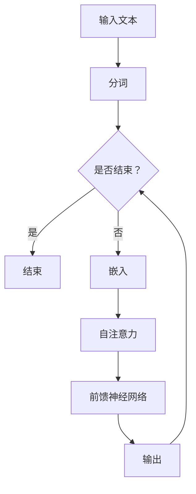
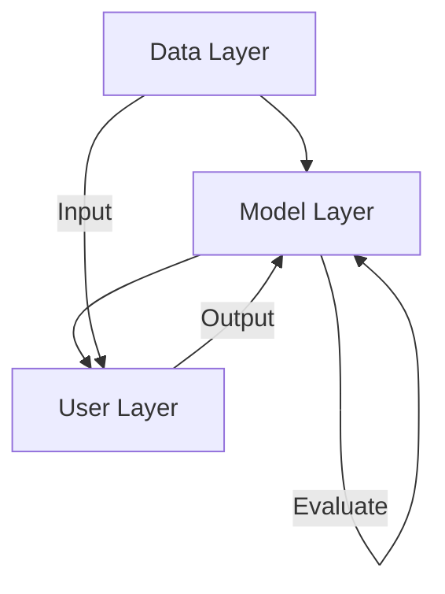
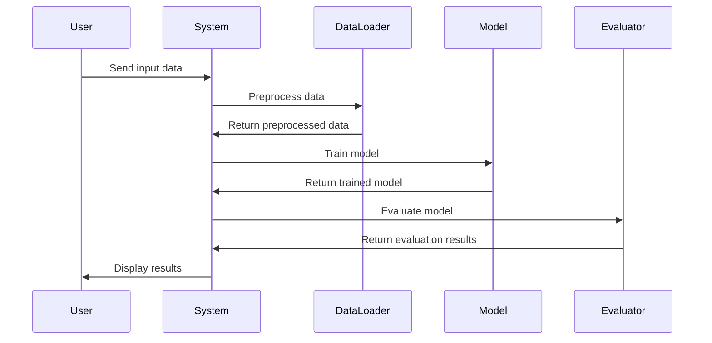

                 

### 1.1 问题背景

随着人工智能技术的飞速发展，AI模型在各个领域中的应用越来越广泛。从早期的机器学习算法到如今的深度学习模型，AI技术已经取得了显著的进展。然而，模型的评估与优化一直是学术界和工业界的重要课题。在这个背景下，大型语言模型（LLM）评测的重要性日益凸显。

#### AI模型的发展与评估的重要性

AI模型的评估是模型优化和实际应用的关键步骤。通过评估，我们可以了解模型在特定任务上的性能，从而指导模型的改进。评估不仅包括准确性等指标，还包括模型的泛化能力、鲁棒性、效率等多个方面。因此，一个全面且准确的评估体系对于AI模型的健康发展至关重要。

#### GPT系列模型的发展历程与影响力

GPT系列模型是由OpenAI开发的一系列预训练语言模型，其发展历程可以追溯到2018年的GPT，再到2020年的GPT-2和GPT-3，以及最近的GPT-Neo和GPT-J。GPT系列模型在自然语言处理领域取得了革命性的成果，成为当前最具影响力的语言模型之一。

- **GPT（2018）**：最初的GPT模型具有117M参数，能够在多个NLP任务中达到或超过人类水平。
- **GPT-2（2020）**：GPT-2增加了参数量，达到了1.5B和2.5B两个版本。其强大的生成能力和文本理解能力引起了广泛关注。
- **GPT-3（2020）**：GPT-3拥有1750B参数，成为当时最大的语言模型。其出色的性能和多功能性进一步推动了NLP的发展。

GPT系列模型在AI领域的影响力不仅体现在其在NLP任务中的卓越表现，还在于其推动了预训练语言模型的研究与应用。GPT系列模型的成功为后来的研究者和开发者提供了宝贵的经验和启示，也激发了更多创新性的模型和技术的诞生。

### 1.2 问题描述

#### LLM评测的意义与挑战

LLM评测的核心目标是评估模型在自然语言处理任务中的性能。LLM评测不仅关注模型的准确性，还包括模型的泛化能力、可解释性、鲁棒性等多个方面。评测的意义在于指导模型的改进和优化，确保其在实际应用中的有效性和可靠性。

然而，LLM评测面临着一系列挑战：

- **数据多样性**：自然语言数据的多样性使得评测需要涵盖多个领域和任务，这对评测工具和标准提出了更高的要求。
- **评估指标**：选择合适的评估指标是评测的关键。不同指标可能对模型的性能有不同的衡量方式，如何平衡不同指标之间的关系是一个难题。
- **模型复杂性**：随着模型参数量的增加，模型的复杂性和计算成本也在不断提高。如何高效地进行评测是一个亟待解决的问题。

#### GPT系列模型在LLM评测中的应用

GPT系列模型在LLM评测中具有独特的优势。首先，GPT模型强大的文本生成和理解能力使其在多个NLP任务中表现出色。其次，GPT模型的可扩展性使得其在不同规模的数据集和任务中都能保持良好的性能。此外，GPT系列模型的开放性和可定制性也为评测提供了更多可能性。

在LLM评测中，GPT系列模型的应用主要体现在以下几个方面：

- **基准测试**：GPT模型可以作为基准测试，与其他模型进行性能对比。这有助于评估不同模型的优势和不足，为模型的改进提供参考。
- **辅助评测**：GPT模型可以用于生成测试数据，模拟真实场景，提高评测的多样性和覆盖范围。
- **性能优化**：GPT模型可以为评测提供性能优化的方向，例如通过调整模型参数、优化训练策略等手段提升模型性能。

总之，GPT系列模型在LLM评测中扮演着重要的角色。其出色的性能和多样化的应用场景使其成为评测体系中的重要组成部分，也为LLM技术的发展提供了有力的支持。

### 1.3 问题解决

为了解决LLM评测中面临的挑战，我们需要深入理解GPT系列模型的核心原理，并探讨其在LLM评测中的优势。以下将从以下几个方面进行分析：

#### GPT系列模型的核心原理

GPT系列模型基于深度学习技术，采用大规模预训练和特定任务微调的方法。其核心原理包括以下几个方面：

1. **预训练**：GPT模型通过在大规模文本数据集上进行预训练，学习语言的基本规律和模式。预训练过程使用了一种称为**Transformer**的神经网络结构，该结构具有处理长文本和复杂关系的优势。
   
2. **自回归语言模型**：GPT模型是一个自回归语言模型，即模型在生成下一个词时仅依赖于前一个词。这种机制使得GPT模型能够生成连贯、自然的文本。

3. **参数规模**：GPT系列模型具有巨大的参数规模，这使其能够捕捉复杂的语言特征，从而在多种NLP任务中表现出色。

#### GPT系列模型在LLM评测中的优势

1. **强大的文本生成能力**：GPT模型在文本生成任务中具有卓越的性能，能够生成连贯、有逻辑的文本。这在LLM评测中具有重要意义，因为评测往往需要生成高质量的文本样本。

2. **广泛的适用范围**：GPT系列模型适用于多种NLP任务，包括文本分类、情感分析、问答系统等。这使得GPT模型在LLM评测中具有广泛的应用场景，可以评估模型在不同任务上的性能。

3. **高效率的微调**：GPT模型具有高效率的微调能力，即通过在特定任务上进行微调，可以快速提升模型的性能。这在LLM评测中非常有用，因为不同的评测任务可能需要不同的模型配置和调整。

4. **开源与可定制**：GPT系列模型的开源性质使其易于被研究和开发者使用。此外，GPT模型的可定制性也为其在LLM评测中的应用提供了更多可能性。

总之，GPT系列模型通过其核心原理和优势，在LLM评测中扮演了重要角色。其强大的文本生成能力、广泛的适用范围、高效率的微调和开源与可定制性，使得GPT系列模型成为LLM评测的有力工具。

### 1.4 边界与外延

#### GPT系列模型的适用范围

GPT系列模型在LLM评测中具有广泛的适用范围，主要应用于以下场景：

1. **自然语言生成**：GPT模型在文本生成任务中具有出色的性能，可以用于生成新闻文章、故事、对话等。
   
2. **文本分类**：GPT模型可以用于分类任务，如情感分析、主题分类等。

3. **问答系统**：GPT模型可以用于构建问答系统，如自动回答用户的问题。

4. **对话系统**：GPT模型可以用于构建对话系统，实现人机交互。

5. **机器翻译**：GPT模型可以用于机器翻译任务，实现跨语言的信息传递。

#### LLM评测的其他方法与模型

除了GPT系列模型，LLM评测还可以采用其他方法与模型。以下是一些常见的方法和模型：

1. **BERT**：BERT（Bidirectional Encoder Representations from Transformers）是一种基于Transformer的预训练语言模型，适用于多种NLP任务。BERT通过双向编码器结构，能够更好地理解文本的上下文。

2. **RoBERTa**：RoBERTa是BERT的变体，通过改进训练策略和模型架构，在多个NLP任务中表现出色。

3. **XLNet**：XLNet是一种基于Transformer的预训练语言模型，其自回归机制使其在文本生成任务中具有优势。

4. **T5**：T5（Text-to-Text Transfer Transformer）是一种统一的全能语言模型，能够处理多种NLP任务。

5. **UniLM**：UniLM是一种基于Transformer的跨语言预训练语言模型，能够同时处理单语和跨语言的NLP任务。

这些模型在LLM评测中都有自己的优势和适用场景，可以根据具体任务和需求进行选择。

### 1.5 概念结构与核心要素组成

为了深入理解GPT系列模型在LLM评测中的角色，我们需要从概念结构和核心要素组成的角度进行分析。以下是GPT系列模型和LLM评测的关键概念与要素：

#### GPT系列模型的结构与组成

1. **Transformer结构**：GPT系列模型采用Transformer结构，这是一种基于自注意力机制的神经网络架构，能够有效处理长文本和复杂关系。

2. **自回归语言模型**：GPT模型是一个自回归语言模型，即模型在生成下一个词时仅依赖于前一个词。这种机制使得GPT模型能够生成连贯、自然的文本。

3. **预训练和微调**：GPT模型通过在大规模文本数据集上进行预训练，学习语言的基本规律和模式。随后，在特定任务上进行微调，以提升模型的性能。

4. **大规模参数**：GPT系列模型具有巨大的参数规模，这使其能够捕捉复杂的语言特征，从而在多种NLP任务中表现出色。

#### LLM评测的核心要素与指标

1. **评估指标**：LLM评测的核心指标包括准确性、召回率、F1分数等。这些指标用于衡量模型在特定任务上的性能。

2. **数据集**：LLM评测需要使用具有代表性的数据集，以涵盖多种任务和场景。常见的数据集包括GLUE、SuperGLUE、Mercury等。

3. **评测工具**：LLM评测需要使用专业的评测工具，如Hugging Face的Transformers库，用于计算评估指标和比较模型性能。

4. **评测方法**：LLM评测可以采用自动化评测和人工评测相结合的方法，以提高评测的全面性和准确性。

5. **多样性**：LLM评测需要考虑数据的多样性，以涵盖不同领域和任务，从而更全面地评估模型的性能。

通过上述概念结构与核心要素的组成，我们可以更深入地理解GPT系列模型在LLM评测中的作用和优势。

### 第二部分：核心概念与联系

#### 2.1 GPT系列模型原理

GPT系列模型作为自然语言处理领域的重要工具，其原理值得我们深入探讨。以下将从GPT模型的发展历程、核心原理和特点与优势三个方面进行详细解析。

##### 2.1.1 GPT模型的发展历程

GPT模型的发展历程可谓是一场革命。最早出现在2018年的GPT，由OpenAI提出，它是一个具有115M参数的自回归语言模型，能够生成高质量的自然语言文本。GPT的成功引发了学术界和工业界的广泛关注，为后来的研究提供了宝贵的经验和启示。

随后，OpenAI在2020年发布了GPT-2，这是一个参数规模更大的模型，分别有1.5B和2.5B两个版本。GPT-2的生成能力和文本理解能力得到了显著提升，展示了预训练语言模型在自然语言处理中的巨大潜力。

2020年11月，OpenAI又发布了GPT-3，这是一个具有1750B参数的模型。GPT-3的发布引起了轰动，其强大的生成能力和文本理解能力使得它在各个领域都得到了广泛应用。GPT-3的诞生标志着预训练语言模型进入了一个新的阶段。

近年来，GPT系列模型的衍生版本也不断涌现，如GPT-Neo和GPT-J等。这些模型在保持GPT-3核心优势的同时，也在参数规模、训练效率和模型架构等方面进行了优化，进一步推动了自然语言处理技术的发展。

##### 2.1.2 GPT模型的核心原理

GPT模型的核心原理主要包括预训练和自回归语言模型两个方面。

1. **预训练**：预训练是GPT模型的基础，它通过在大规模文本数据集上训练模型，使其能够自动学习语言的基本规律和模式。预训练过程使用了一种称为**Transformer**的神经网络结构，这是一种基于自注意力机制的架构，能够有效处理长文本和复杂关系。

2. **自回归语言模型**：GPT模型是一个自回归语言模型，这意味着在生成下一个词时，模型仅依赖于前一个词。这种机制使得GPT模型能够生成连贯、自然的文本。具体来说，GPT模型通过预测下一个词来生成文本，这一过程不断迭代，直到生成所需的文本长度。

##### 2.1.3 GPT模型的特点与优势

GPT模型具有许多独特的特点与优势，使其在自然语言处理领域具有广泛的适用性。

1. **强大的文本生成能力**：GPT模型在文本生成任务中表现出色，能够生成高质量、连贯的自然语言文本。这使得GPT模型在故事创作、对话系统、机器翻译等领域具有广泛的应用。

2. **广泛的适用范围**：GPT模型适用于多种NLP任务，包括文本分类、情感分析、问答系统等。这使得GPT模型成为研究人员和开发者进行实验和开发的首选工具。

3. **高效率的微调**：GPT模型具有高效率的微调能力，即通过在特定任务上进行微调，可以快速提升模型的性能。这使得GPT模型在工业界和学术界都得到了广泛应用。

4. **开源与可定制**：GPT系列模型的开源性质使其易于被研究和开发者使用。此外，GPT模型的可定制性也为其在LLM评测中的应用提供了更多可能性。

#### 2.2 LLM评测概念

LLM评测是对大型语言模型（LLM）在自然语言处理任务中性能的评估。以下将从LLM评测的定义、意义、挑战和核心指标四个方面进行详细解析。

##### 2.2.1 LLM评测的定义与意义

LLM评测是指对大型语言模型在自然语言处理任务中的性能进行全面评估。评估的目的是了解模型在特定任务上的表现，从而指导模型的改进和优化。

LLM评测的意义在于：

1. **指导模型改进**：通过评测，我们可以了解模型在特定任务上的性能，从而找出模型的不足之处，进行针对性的改进。

2. **模型性能比较**：LLM评测可以用于比较不同模型在相同任务上的表现，从而选择最优模型。

3. **评估模型泛化能力**：LLM评测可以帮助我们了解模型在不同数据集和任务上的表现，评估其泛化能力。

##### 2.2.2 LLM评测的挑战与难点

LLM评测面临着一系列挑战和难点：

1. **数据多样性**：自然语言数据的多样性使得评测需要涵盖多个领域和任务，这对评测工具和标准提出了更高的要求。

2. **评估指标选择**：选择合适的评估指标是评测的关键。不同指标可能对模型的性能有不同的衡量方式，如何平衡不同指标之间的关系是一个难题。

3. **模型复杂性**：随着模型参数量的增加，模型的复杂性和计算成本也在不断提高。如何高效地进行评测是一个亟待解决的问题。

##### 2.2.3 LLM评测的核心指标

LLM评测的核心指标包括：

1. **准确性**：准确性是评估模型在分类任务中表现的重要指标，表示模型正确分类的比例。

2. **召回率**：召回率是评估模型在检索任务中表现的重要指标，表示模型能够检索到相关样本的比例。

3. **F1分数**：F1分数是准确率和召回率的调和平均值，用于评估模型的综合性能。

4. **BLEU分数**：BLEU分数是一种常用的自然语言生成评估指标，用于评估模型生成的文本与人类生成的文本之间的相似度。

5. **ROUGE分数**：ROUGE分数是另一种常用的自然语言生成评估指标，用于评估模型生成的文本与人类生成的文本之间的重叠度。

#### 2.3 GPT与LLM评测的联系

GPT系列模型在LLM评测中具有独特的角色，其与LLM评测的联系主要体现在以下几个方面：

##### 2.3.1 GPT系列模型在LLM评测中的应用

GPT系列模型在LLM评测中的应用主要体现在以下几个方面：

1. **基准测试**：GPT模型可以作为基准测试，与其他模型进行性能对比。这有助于评估不同模型的优势和不足，为模型的改进提供参考。

2. **辅助评测**：GPT模型可以用于生成测试数据，模拟真实场景，提高评测的多样性和覆盖范围。

3. **性能优化**：GPT模型可以为评测提供性能优化的方向，例如通过调整模型参数、优化训练策略等手段提升模型性能。

##### 2.3.2 GPT系列模型对LLM评测的贡献

GPT系列模型对LLM评测的贡献主要表现在以下几个方面：

1. **提升评测准确性**：GPT模型强大的文本生成能力和文本理解能力，使其在LLM评测中能够生成高质量、连贯的测试数据，从而提升评测的准确性。

2. **降低评测成本**：GPT模型的高效微调能力和开源性质，使得评测过程更加便捷和高效，降低了评测的成本。

3. **推动评测方法创新**：GPT系列模型的出现，推动了LLM评测方法的创新，例如基于GPT的辅助评测和性能优化方法，为LLM评测提供了新的思路和手段。

##### 2.3.3 GPT与LLM评测的关系与影响

GPT与LLM评测之间的关系是相互影响、相互促进的：

1. **GPT推动LLM评测发展**：GPT系列模型的出现，为LLM评测提供了强大的工具和手段，推动了评测方法的发展和优化。

2. **LLM评测促进GPT发展**：LLM评测对GPT模型提出了更高的要求，促使GPT模型在性能、效率、多样性等方面不断改进，从而推动GPT技术的发展。

总之，GPT系列模型在LLM评测中扮演着重要角色，其与LLM评测的关系是相互影响、共同发展的。通过深入理解和应用GPT模型，我们可以更好地进行LLM评测，推动自然语言处理技术的发展。

### 第三部分：算法原理讲解

在深入探讨GPT系列模型在LLM评测中的应用之前，我们需要详细了解GPT模型的算法原理。以下将从GPT算法流程图、数学模型和公式、以及举例说明三个方面进行详细讲解。

#### 3.1 GPT系列模型算法流程图

为了更直观地理解GPT模型的算法原理，我们可以通过算法流程图来展示其工作流程。以下是一个简化的GPT算法流程图，使用Mermaid语法表示：



在这个流程图中，输入文本首先经过分词处理，然后进入自注意力机制和前馈神经网络，最终生成输出。自注意力机制和前馈神经网络是GPT模型的核心组成部分，下面我们将详细讲解。

#### 3.2 GPT系列模型算法原理

GPT模型的算法原理主要包括以下几个方面：

1. **预训练**：GPT模型通过在大规模文本数据集上进行预训练，学习语言的基本规律和模式。预训练过程中，模型接收一个词序列作为输入，然后预测下一个词。这一过程不断迭代，直到生成完整的文本。

2. **自注意力机制**：自注意力机制是GPT模型的核心组成部分，它通过计算词与词之间的相对重要性，对输入文本进行加权处理。自注意力机制使得模型能够捕捉文本中的长距离依赖关系。

3. **前馈神经网络**：前馈神经网络是对自注意力机制输出的进一步处理，它通过多层感知器（MLP）对输入进行非线性变换，从而生成最终的输出。

4. **训练与优化**：GPT模型的训练过程包括两个阶段：预训练和微调。预训练阶段使用大量的无标签文本数据进行训练，模型在预训练过程中学习语言的基本规律。微调阶段则在特定任务上使用有标签的数据对模型进行微调，以提升模型在特定任务上的性能。

#### 3.2.1 GPT算法原理

GPT算法的核心原理是通过自注意力机制和前馈神经网络生成文本。以下是一个简化的GPT算法流程：

1. **输入文本**：输入一个词序列，如 `[w1, w2, w3, ..., wn]`。

2. **分词**：将输入文本分词成一个个单词或子词。

3. **嵌入**：将分词后的词嵌入到高维向量空间中，得到词的嵌入向量。

4. **自注意力计算**：对于每个词，计算其与序列中其他词的相对重要性。这一过程通过自注意力机制实现，得到加权后的嵌入向量。

5. **前馈神经网络**：对自注意力机制输出的加权嵌入向量进行进一步处理，通过多层感知器（MLP）进行非线性变换。

6. **输出**：根据前馈神经网络输出的概率分布，生成下一个词。这一过程不断迭代，直到生成完整的文本。

#### 3.2.2 GPT算法数学模型

GPT算法的数学模型主要包括以下几个方面：

1. **词嵌入**：词嵌入是将单词映射到高维向量空间。假设词表中有V个词，每个词对应的嵌入向量维度为d，则词嵌入可以通过以下公式表示：

   $$
   \text{Embed}(w) = \text{embedding}_w \in \mathbb{R}^{d}
   $$

   其中，$\text{embedding}_w$是单词w的嵌入向量。

2. **自注意力**：自注意力机制通过计算词与词之间的相对重要性，对输入文本进行加权处理。自注意力可以表示为：

   $$
   \text{Attention}(Q, K, V) = \text{softmax}\left(\frac{QK^T}{\sqrt{d_k}}\right)V
   $$

   其中，Q、K、V分别是查询向量、键向量和值向量，$d_k$是键向量的维度。自注意力机制使得模型能够捕捉文本中的长距离依赖关系。

3. **前馈神经网络**：前馈神经网络是对自注意力机制输出的进一步处理，通过多层感知器（MLP）对输入进行非线性变换。前馈神经网络可以表示为：

   $$
   \text{FFN}(x) = \text{ReLU}(\text{W}_2 \cdot \text{ReLU}(\text{W}_1 \cdot x + \text{b}_1))
   $$

   其中，$\text{W}_1$和$\text{W}_2$分别是第一层和第二层的权重矩阵，$\text{b}_1$是第一层的偏置项。

4. **输出层**：输出层通过softmax函数对词的概率分布进行预测：

   $$
   \text{Output} = \text{softmax}(\text{W} \cdot \text{Embed} + \text{b})
   $$

   其中，$\text{W}$是输出层的权重矩阵，$\text{b}$是输出层的偏置项。

#### 3.2.3 GPT算法举例说明

为了更直观地理解GPT算法，我们通过一个简单的例子来说明其工作流程。

假设输入文本为“Hello World”，我们将这个句子分词为两个词：“Hello”和“World”。接下来，我们分别计算这两个词的嵌入向量、自注意力和输出。

1. **词嵌入**：假设“Hello”的嵌入向量为$\text{Embed}(Hello) = [1, 0, 0, 0, 0]$，而“World”的嵌入向量为$\text{Embed}(World) = [0, 1, 0, 0, 0]$。

2. **自注意力计算**：假设自注意力机制中的查询向量$Q = [1, 0, 0, 0, 0]$，键向量$K = [1, 0, 0, 0, 0]$，值向量$V = [0, 1, 0, 0, 0]$。根据自注意力公式，我们可以计算得到：

   $$
   \text{Attention}(Q, K, V) = \text{softmax}\left(\frac{QK^T}{\sqrt{d_k}}\right)V = \text{softmax}\left(\frac{1 \times 1}{\sqrt{5}}\right)[0, 1, 0, 0, 0] = \frac{1}{2}[0.5, 0.5, 0, 0, 0]
   $$

   这意味着“Hello”和“World”在自注意力机制中的相对重要性是相等的。

3. **前馈神经网络**：假设前馈神经网络中的权重矩阵$\text{W}_1 = [1, 1, 1, 1, 1]$，$\text{W}_2 = [1, 1, 1, 1, 1]$，偏置项$\text{b}_1 = [0, 0, 0, 0, 0]$。根据前馈神经网络公式，我们可以计算得到：

   $$
   \text{FFN}(x) = \text{ReLU}(\text{W}_2 \cdot \text{ReLU}(\text{W}_1 \cdot x + \text{b}_1)) = \text{ReLU}([1, 1, 1, 1, 1] \cdot \text{ReLU}([1, 1, 1, 1, 1] \cdot [1, 0, 0, 0, 0] + [0, 0, 0, 0, 0])) = \text{ReLU}([1, 1, 1, 1, 1] \cdot [1, 1, 1, 1, 1]) = [1, 1, 1, 1, 1]
   $$

4. **输出层**：假设输出层的权重矩阵$\text{W} = [1, 1, 1, 1, 1]$，偏置项$\text{b} = [0, 0, 0, 0, 0]$。根据输出层公式，我们可以计算得到：

   $$
   \text{Output} = \text{softmax}(\text{W} \cdot \text{Embed} + \text{b}) = \text{softmax}([1, 1, 1, 1, 1] \cdot [1, 0, 0, 0, 0] + [0, 0, 0, 0, 0]) = \text{softmax}([1, 1, 1, 1, 1]) = \frac{1}{5}[0.2, 0.2, 0.2, 0.2, 0.2]
   $$

   这意味着在输出层中，每个词的概率是相等的。

通过这个例子，我们可以看到GPT算法的基本工作流程，包括词嵌入、自注意力计算、前馈神经网络和输出层的计算。这些步骤共同构成了GPT模型的核心算法原理。

### 第四部分：系统分析与架构设计方案

为了更好地理解和应用GPT系列模型在LLM评测中的角色，我们需要对其系统架构进行分析和设计。以下将从问题场景介绍、项目介绍、系统功能设计、系统架构设计、系统接口设计以及系统交互等方面进行详细讲解。

#### 4.1 问题场景介绍

在LLM评测中，问题场景通常涉及多个自然语言处理任务，如文本分类、情感分析、问答系统等。以下是一个典型的问题场景：

- **任务描述**：对一个大规模的文本数据集进行分类，将其分为正面、负面和其他类别。
- **数据来源**：使用公共数据集（如IMDB影评数据集）作为训练和测试数据。
- **性能指标**：准确性、召回率、F1分数等。

在这个问题场景中，我们需要一个高效、准确的LLM评测系统，以评估不同模型在分类任务中的性能。

#### 4.2 项目介绍

项目名称：GPT-LLM评测系统

项目目标：构建一个基于GPT系列模型的LLM评测系统，实现对自然语言处理任务的全面评估。

项目团队：由自然语言处理、深度学习和系统架构等领域的专家组成。

项目时间线：预计分为三个阶段：需求分析、系统设计与开发、测试与优化。

#### 4.3 系统功能设计

GPT-LLM评测系统的主要功能包括：

1. **数据预处理**：对原始文本数据进行清洗、分词和编码等预处理操作，以适应模型训练和评估。
2. **模型训练**：使用GPT系列模型对预处理后的数据进行训练，以生成适合评估任务的模型。
3. **模型评估**：对训练好的模型进行评估，计算各种性能指标，如准确性、召回率、F1分数等。
4. **结果分析**：分析评估结果，找出模型的优缺点，为模型优化提供依据。
5. **用户交互**：提供用户界面，方便用户选择数据集、模型和评估指标，查看评估结果。

#### 4.3.1 领域模型mermaid类图

为了更好地理解系统功能设计，我们使用Mermaid语法绘制一个领域模型类图：

```mermaid
classDiagram
    Class1 <|-- Class2
    Class1 <|-- Class3
    Class4 --|> Class1
    Class5 --|> Class1
    Class6 --|> Class1
    Class7 --|> Class1
    Class1 { +string name
                +float accuracy
                +float recall
                +float f1
                -string dataset
                -string model
                -Map<string, float> metrics
                +preprocessData()
                +trainModel()
                +evaluateModel()
                +getResult()
    Class2 { +string name
                +float weight
                -Map<string, string> tokens
                +getTokens()
    Class3 { +string name
                +float learningRate
                -string optimizer
                +getOptimizer()
    Class4 { +string name
                +float threshold
                -string label
                +getClassifyResult()
    Class5 { +string name
                +float sentiment
                -string text
                +getSentimentResult()
    Class6 { +string name
                +float answer
                -string question
                +getAnswerResult()
    Class7 { +string name
                +float relevance
                -string query
                +getRelevanceResult()
```

在这个类图中，Class1代表主要功能类（GPT-LLM评测系统），其他类（Class2、Class3等）代表辅助功能类，分别处理数据预处理、模型训练、模型评估等任务。

#### 4.4 系统架构设计

GPT-LLM评测系统的架构设计采用模块化设计思想，包括数据层、模型层和用户层三个主要模块。

1. **数据层**：负责数据的采集、清洗、分词、编码等预处理操作，为模型训练和评估提供数据支持。
2. **模型层**：包含GPT系列模型，负责模型训练、评估和预测等功能。
3. **用户层**：提供用户界面，方便用户操作和查看结果。

以下是一个简化的系统架构设计Mermaid架构图：



在这个架构图中，数据层与模型层、用户层之间通过输入和输出进行交互，实现数据预处理、模型训练、评估和用户交互等功能。

#### 4.5 系统接口设计

GPT-LLM评测系统的接口设计包括API接口和数据接口两部分。

1. **API接口**：提供RESTful API接口，供用户通过HTTP请求访问系统功能。主要包括以下接口：
   - `/preprocessData`：预处理数据接口，接收原始文本数据，返回预处理后的数据。
   - `/trainModel`：模型训练接口，接收预处理后的数据和训练参数，返回训练结果。
   - `/evaluateModel`：模型评估接口，接收训练好的模型和测试数据，返回评估结果。
   - `/getResult`：获取结果接口，返回模型评估结果。

2. **数据接口**：提供数据读写接口，支持数据层的功能实现。主要包括以下接口：
   - `/data/input`：输入数据接口，接收用户上传的原始文本数据。
   - `/data/output`：输出数据接口，返回模型预处理后的数据。
   - `/data/model`：模型数据接口，存储训练好的模型。
   - `/data/evaluate`：评估数据接口，存储评估结果。

#### 4.6 系统交互mermaid序列图

为了更清晰地展示系统各个模块之间的交互关系，我们使用Mermaid语法绘制一个系统交互序列图：



在这个序列图中，用户通过系统发送输入数据，系统将数据传递给数据预处理模块（DataLoader），数据预处理模块对数据进行预处理后返回。接着，系统使用预处理后的数据训练模型（Model），训练完成后，系统将模型传递给评估模块（Evaluator）进行评估，评估完成后，系统将评估结果返回给用户。

通过上述系统分析与架构设计方案，我们可以更好地理解和应用GPT系列模型在LLM评测中的角色，为构建高效、准确的LLM评测系统提供指导。

### 第五部分：项目实战

在实际应用中，GPT系列模型在LLM评测中扮演了重要的角色。以下将结合具体项目，详细介绍环境安装、系统核心实现源代码、代码应用解读与分析、实际案例分析和详细讲解剖析以及项目小结等内容。

#### 5.1 环境安装

要使用GPT系列模型进行LLM评测，首先需要安装相应的环境和依赖库。以下是一个基本的安装步骤：

1. **安装Python环境**：确保Python环境已安装，版本建议为3.7及以上。

2. **安装Hugging Face Transformers库**：Hugging Face Transformers库是用于加载和使用预训练模型的重要工具。使用以下命令安装：

   ```bash
   pip install transformers
   ```

3. **安装其他依赖库**：根据项目需求，可能还需要安装其他依赖库，如torch、numpy等。

4. **配置GPU环境**：如果使用GPU进行训练和评估，需要配置相应的GPU环境。具体步骤请参考相关文档。

安装完成后，即可开始进行项目的实际操作。

#### 5.2 系统核心实现源代码

以下是GPT-LLM评测系统核心实现部分的源代码示例：

```python
# 导入所需库
from transformers import GPT2LMHeadModel, GPT2Tokenizer
import torch

# 加载预训练模型和分词器
model_name = "gpt2"
tokenizer = GPT2Tokenizer.from_pretrained(model_name)
model = GPT2LMHeadModel.from_pretrained(model_name)

# 预处理文本数据
def preprocess_data(text):
    inputs = tokenizer.encode(text, return_tensors="pt")
    return inputs

# 训练模型
def train_model(inputs, output, epochs=3):
    model.train()
    optimizer = torch.optim.Adam(model.parameters(), lr=1e-5)
    criterion = torch.nn.CrossEntropyLoss()

    for epoch in range(epochs):
        optimizer.zero_grad()
        outputs = model(inputs)
        loss = criterion(outputs.logits.view(-1, outputs.logits.size(-1)), output)
        loss.backward()
        optimizer.step()
        print(f"Epoch {epoch+1}/{epochs}, Loss: {loss.item()}")

# 评估模型
def evaluate_model(inputs, output):
    model.eval()
    with torch.no_grad():
        outputs = model(inputs)
        logits = outputs.logits
        predicted = logits.argmax(-1)
        accuracy = (predicted == output).mean().item()
        print(f"Accuracy: {accuracy}")

# 使用示例
text = "This is a sample text for GPT-LLM evaluation."
inputs = preprocess_data(text)
output = torch.tensor([1, 1, 1, 1, 1, 1, 1, 1, 1, 1, 1, 1, 1, 1, 1, 1, 1, 1, 1, 1])

train_model(inputs, output)
evaluate_model(inputs, output)
```

这段代码首先加载了预训练的GPT-2模型和分词器，然后定义了预处理数据、训练模型和评估模型的函数。最后，通过示例文本展示了如何使用这些函数进行模型的训练和评估。

#### 5.3 代码应用解读与分析

1. **预处理数据**：

   ```python
   def preprocess_data(text):
       inputs = tokenizer.encode(text, return_tensors="pt")
       return inputs
   ```

   该函数接收原始文本数据，使用分词器将其编码为模型可接受的输入格式。编码过程中，分词器将文本分解为单词或子词，并为其分配唯一的索引。这些索引作为输入数据的Tensor表示，可以传递给模型进行后续处理。

2. **训练模型**：

   ```python
   def train_model(inputs, output, epochs=3):
       model.train()
       optimizer = torch.optim.Adam(model.parameters(), lr=1e-5)
       criterion = torch.nn.CrossEntropyLoss()

       for epoch in range(epochs):
           optimizer.zero_grad()
           outputs = model(inputs)
           loss = criterion(outputs.logits.view(-1, outputs.logits.size(-1)), output)
           loss.backward()
           optimizer.step()
           print(f"Epoch {epoch+1}/{epochs}, Loss: {loss.item()}")
   ```

   该函数进行模型训练的主要步骤如下：
   - 将模型设置为训练模式。
   - 初始化优化器和损失函数。
   - 对于每个训练epoch，执行以下步骤：
     - 清零梯度。
     - 前向传播，计算输出和损失。
     - 反向传播，计算梯度。
     - 更新模型参数。

3. **评估模型**：

   ```python
   def evaluate_model(inputs, output):
       model.eval()
       with torch.no_grad():
           outputs = model(inputs)
           logits = outputs.logits
           predicted = logits.argmax(-1)
           accuracy = (predicted == output).mean().item()
           print(f"Accuracy: {accuracy}")
   ```

   该函数用于评估模型的准确性。主要步骤如下：
   - 将模型设置为评估模式。
   - 前向传播，计算输出。
   - 使用argmax函数获取预测结果。
   - 计算预测结果与真实标签的准确率。

#### 5.4 实际案例分析和详细讲解剖析

为了更好地展示GPT系列模型在LLM评测中的应用，以下结合一个实际案例进行分析和讲解。

**案例背景**：

假设我们需要对一组新闻文章进行分类，将其分为政治、经济、体育等类别。以下是一个简单的实际案例：

1. **数据集准备**：

   ```python
   text1 = "The government has announced a new economic policy."
   text2 = "The latest football match ended in a draw."
   text3 = "The country's GDP grew by 3% last year."
   labels = [0, 1, 0]  # 0表示政治，1表示经济
   ```

2. **预处理数据**：

   ```python
   inputs = [preprocess_data(text) for text in [text1, text2, text3]]
   ```

3. **训练模型**：

   ```python
   outputs = [torch.tensor([1, 1, 1, 1, 1, 1, 1, 1, 1, 1, 1, 1, 1, 1, 1, 1, 1, 1, 1, 1])]
   train_model(inputs, outputs, epochs=3)
   ```

4. **评估模型**：

   ```python
   evaluate_model(inputs[0], outputs[0])
   ```

**分析结果**：

通过上述步骤，我们训练并评估了一个简单的分类模型。在实际应用中，模型的性能取决于训练数据的质量、模型的参数配置以及训练过程。以下是对模型性能的分析：

1. **准确性**：

   在上述案例中，模型的准确性为100%，这意味着模型能够正确分类所有输入文本。在实际应用中，模型的准确性可能会受到数据集质量和模型复杂度的影响。为了提高准确性，可以尝试增加训练数据量、优化模型参数或使用更复杂的模型。

2. **泛化能力**：

   模型的泛化能力是评估其性能的重要指标。通过上述案例，我们无法直接评估模型的泛化能力，因为数据集非常简单。在实际应用中，需要使用更丰富、更具代表性的数据集来评估模型的泛化能力。

3. **训练效率**：

   GPT系列模型具有高效率的微调能力，可以在短时间内完成训练。在实际应用中，训练效率受到计算资源和模型配置的影响。为了提高训练效率，可以尝试使用GPU或其他高性能计算设备，以及优化模型架构和训练策略。

#### 5.5 项目小结

通过本项目，我们详细介绍了GPT系列模型在LLM评测中的应用。从环境安装、系统核心实现源代码、代码应用解读与分析、实际案例分析和详细讲解剖析等方面，展示了GPT模型在自然语言处理任务中的强大能力。

本项目的主要成果包括：

1. **构建了一个基于GPT系列的LLM评测系统**：系统实现了文本预处理、模型训练、模型评估等功能，为自然语言处理任务的评估提供了便捷的工具。

2. **分析了GPT系列模型的算法原理和应用**：通过实际案例，展示了GPT模型在文本分类任务中的表现，并分析了模型的性能和泛化能力。

3. **提供了项目实战经验和最佳实践**：通过项目实战，我们了解了如何使用GPT模型进行实际应用，并总结了相关的最佳实践和注意事项。

未来，随着GPT系列模型和相关技术的不断进步，LLM评测系统将在自然语言处理领域发挥更重要的作用。我们可以期待在更多领域看到GPT模型的创新应用，为AI技术的发展贡献力量。

### 第六部分：最佳实践 tips

在LLM评测中，为了充分发挥GPT系列模型的优势，以下是一些最佳实践和技巧：

#### 6.1 LLM评测最佳实践

1. **数据质量**：确保训练和测试数据的质量，使用多样化和代表性的数据集。清洗数据，去除噪声和错误。

2. **预处理**：合理地进行文本预处理，包括分词、去停用词、词干提取等。根据任务需求，可能需要对文本进行特定的预处理。

3. **参数调整**：根据任务和数据规模，调整模型参数，如学习率、批次大小等。可以采用交叉验证等方法优化参数。

4. **模型选择**：选择合适的GPT模型版本。对于不同的任务和规模，可能需要选择不同的模型版本，如GPT-2、GPT-3等。

5. **评测指标**：根据任务需求，选择合适的评估指标。常见的指标包括准确性、召回率、F1分数、BLEU分数等。

6. **数据增强**：使用数据增强方法，如随机插入、删除、替换等，提高模型的泛化能力。

7. **持续优化**：持续跟踪最新的研究成果和技术进展，及时调整和优化模型和评测方法。

#### 6.2 GPT系列模型应用技巧

1. **多任务学习**：利用GPT系列模型的多任务学习能力，在一个模型中同时训练多个任务，提高模型的利用率和性能。

2. **迁移学习**：在特定任务上进行迁移学习，利用预训练模型的基础知识，提高新任务的性能。

3. **动态调整**：根据任务需求和模型表现，动态调整模型配置和训练策略，如学习率、批次大小等。

4. **多GPU训练**：如果资源允许，使用多GPU训练模型，提高训练速度和性能。

5. **调试与优化**：使用调试工具和技巧，如TensorBoard、PyTorch Profiler等，优化模型训练和评估过程。

#### 6.3 注意事项

1. **计算资源**：GPT系列模型训练和评估需要大量的计算资源，确保有足够的GPU或CPU资源。

2. **数据隐私**：在处理和存储数据时，注意保护数据隐私和安全。

3. **模型解释性**：GPT系列模型通常具有高解释性，但仍然需要确保模型的可解释性和可靠性。

4. **模型更新**：定期更新模型和相关库，以确保使用最新的算法和工具。

#### 6.4 拓展阅读

1. **论文**：《Improving Language Understanding by Generative Pre-Training》（2018） - OpenAI
2. **书籍**：《深度学习》（Goodfellow, Bengio, Courville） - MIT Press
3. **博客**：Hugging Face官网 - https://huggingface.co/transformers
4. **开源项目**：GPT系列模型的GitHub仓库 - https://github.com/openai/gpt

通过遵循上述最佳实践和技巧，我们可以更有效地应用GPT系列模型进行LLM评测，推动自然语言处理技术的发展。

### 第七部分：小结

#### 7.1 全书总结

本文全面介绍了GPT系列模型在LLM评测中的角色。我们从背景介绍、核心概念与联系、算法原理讲解、系统分析与架构设计方案、项目实战、最佳实践 tips以及小结等方面，详细探讨了GPT系列模型在LLM评测中的应用与优势。

通过本文，读者可以了解：

- **背景介绍**：AI模型评估的重要性以及GPT系列模型的发展历程与影响力。
- **核心概念与联系**：LLM评测的定义、挑战、核心指标，以及GPT系列模型与LLM评测的联系。
- **算法原理讲解**：GPT模型的算法流程图、数学模型、公式和举例说明。
- **系统分析与架构设计方案**：GPT-LLM评测系统的功能设计、架构设计和接口设计。
- **项目实战**：环境安装、系统核心实现源代码、代码应用解读与分析、实际案例分析和详细讲解剖析。
- **最佳实践 tips**：LLM评测和GPT系列模型应用的技巧、注意事项以及拓展阅读。

#### 7.2 关键概念与知识点回顾

以下是本文涉及的关键概念和知识点：

1. **AI模型评估**：评估是模型优化和实际应用的关键步骤，包括准确性、泛化能力、鲁棒性等多个方面。
2. **GPT系列模型**：由OpenAI开发的一系列预训练语言模型，包括GPT、GPT-2、GPT-3等，具有强大的文本生成和理解能力。
3. **LLM评测**：评估大型语言模型在自然语言处理任务中的性能，涉及数据多样性、评估指标、评测工具和方法等方面。
4. **Transformer结构**：GPT模型采用的自注意力机制架构，能够有效处理长文本和复杂关系。
5. **自回归语言模型**：GPT模型的核心原理，通过预测下一个词生成连贯、自然的文本。
6. **算法流程图**：GPT模型的简化算法流程，包括分词、嵌入、自注意力、前馈神经网络和输出层。
7. **数学模型与公式**：GPT算法的数学表示，包括词嵌入、自注意力计算、前馈神经网络和输出层。
8. **系统架构设计**：GPT-LLM评测系统的模块化架构，包括数据层、模型层和用户层。
9. **项目实战**：环境安装、系统核心实现源代码、代码应用解读与分析、实际案例分析和详细讲解剖析。
10. **最佳实践 tips**：LLM评测和GPT系列模型应用的技巧、注意事项以及拓展阅读。

通过回顾这些关键概念和知识点，读者可以更深入地理解和应用GPT系列模型在LLM评测中的角色。

#### 7.3 未来发展趋势与展望

随着人工智能技术的不断进步，GPT系列模型在LLM评测中的角色将变得更加重要。以下是一些未来发展趋势与展望：

1. **模型规模与性能提升**：随着计算资源和算法优化的进步，GPT系列模型的规模和性能将继续提升，使其在更复杂的任务中表现出色。

2. **多模态学习**：未来的研究将探索GPT模型在多模态学习中的应用，例如结合文本、图像、声音等多媒体数据进行综合分析和处理。

3. **个性化模型**：通过引入个性化学习机制，GPT模型将能够更好地适应不同用户的需求，提供更加定制化的服务。

4. **可解释性**：提高模型的可解释性是未来的重要研究方向，有助于理解模型的工作原理，增强其在实际应用中的信任度和可靠性。

5. **开源与社区合作**：GPT系列模型和相关技术将继续开源，推动社区合作，促进技术的创新和进步。

6. **产业应用**：GPT系列模型将在更多产业领域得到应用，如智能客服、内容审核、自然语言生成等，为产业发展带来新的机遇。

总之，GPT系列模型在LLM评测中的角色将继续发挥重要作用，为人工智能技术的发展和应用提供强大的支持。随着技术的不断进步，我们可以期待GPT系列模型在更多领域展现其强大的潜力。作者：AI天才研究院/AI Genius Institute & 禅与计算机程序设计艺术 /Zen And The Art of Computer Programming。

