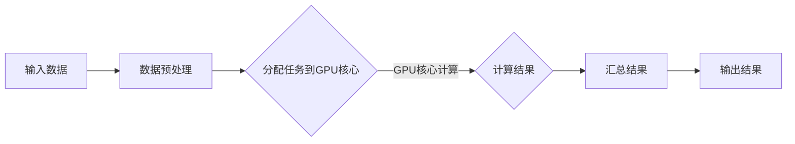
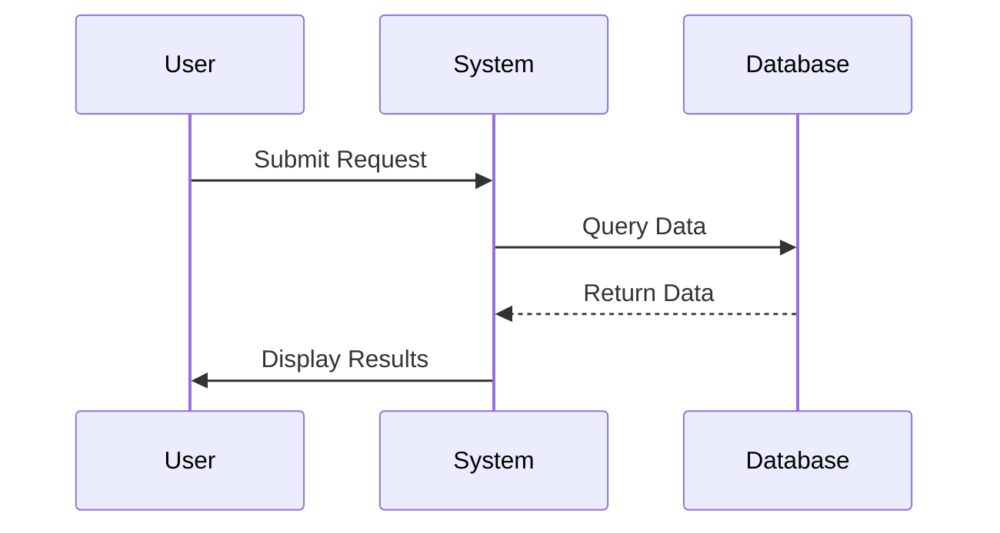
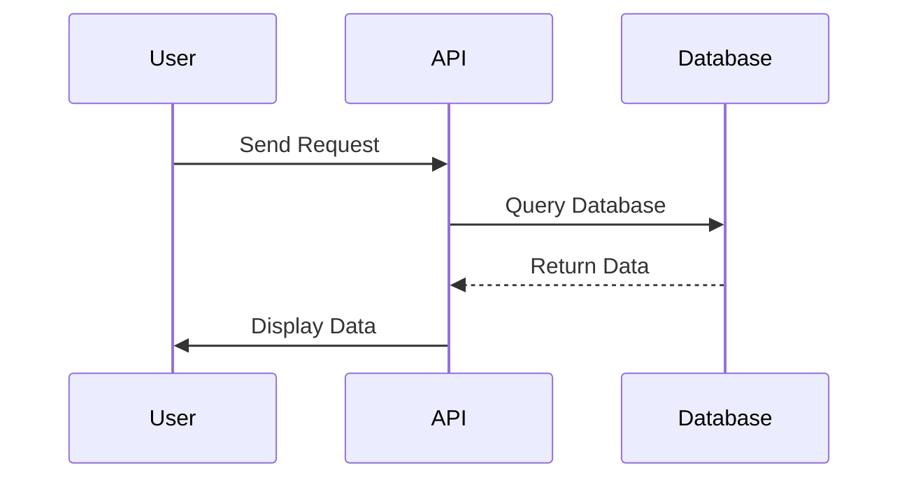
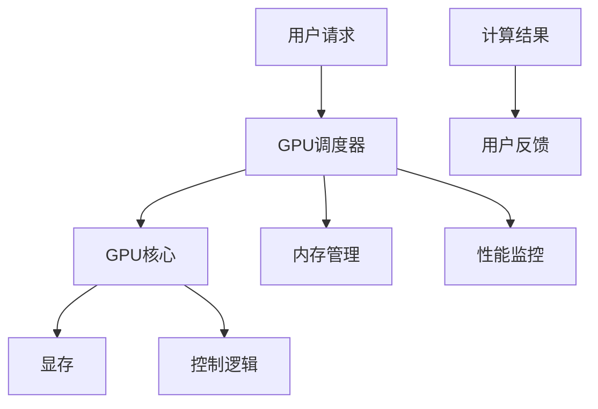

                 

### 核心概念与联系

#### GPU架构与工作原理

GPU（Graphics Processing Unit）即图形处理器，是专为处理大量并行计算任务而设计的处理器。相比于CPU（Central Processing Unit），GPU具有更多的计算单元和更高的并行处理能力，这使得其在图形渲染、科学计算、机器学习等领域中发挥着重要作用。

**核心概念对比表格：**

| **概念**       | **GPU**                  | **CPU**                   |
| ------------- | ---------------------- | ------------------------ |
| **核心数**     | 数千甚至上万核心       | 数百核心                  |
| **并行处理**   | 高度并行处理能力       | 较低并行处理能力          |
| **计算能力**   | 高计算强度             | 高计算精度                |
| **内存带宽**   | 较高的内存带宽          | 较低的内存带宽            |
| **能耗**       | 较高能耗                | 较低能耗                  |

**GPU的ER实体关系图架构：**

```mermaid
erDiagram
  GPU ||--|{ CUDA核心 } : 计算单元
  GPU ||--|{ 显存 } : 内存
  GPU ||--|{ 控制逻辑 } : 控制单元
  CUDA核心 ||--|{ 指令 } : 执行计算
  显存 ||--|{ 数据 } : 存储数据
  控制逻辑 ||--|{ 管控 } : 管理计算流程
```

#### GPU加速算法实现

GPU加速算法的实现主要是将计算任务分解成大量可并行执行的小任务，然后利用GPU的多核并行处理能力进行高效计算。以下是一个简单的GPU加速算法的mermaid流程图：



#### 算法原理讲解

一个常见的GPU加速算法是矩阵乘法。以下是一个矩阵乘法的Python源代码示例，以及其数学模型和公式：

```python
import numpy as np

# 矩阵乘法
def matrix_multiplication(A, B):
    result = np.zeros((A.shape[0], B.shape[1]))
    for i in range(A.shape[0]):
        for j in range(B.shape[1]):
            for k in range(A.shape[1]):
                result[i][j] += A[i][k] * B[k][j]
    return result

# 调用矩阵乘法
A = np.random.rand(256, 256)
B = np.random.rand(256, 256)
result = matrix_multiplication(A, B)
```

矩阵乘法的数学模型可以表示为：

$$
C_{ij} = \sum_{k=1}^{n} A_{ik}B_{kj}
$$

其中，\(A\) 和 \(B\) 是两个 \(n \times n\) 的矩阵，\(C\) 是它们的乘积。

#### 系统分析与架构设计方案

##### 问题场景介绍

假设我们要设计一个基于GPU的深度学习模型训练系统，用于图像识别任务。

##### 项目介绍

我们的项目是一个基于GPU的深度学习模型训练系统，旨在通过GPU加速深度学习模型的训练，提高图像识别的准确率和效率。

##### 系统功能设计（领域模型Mermaid类图）

```mermaid
classDiagram
    Class01 <|-- Class02
    Class03 --|> Class04
    Class05 : +int x
    Class06 : +int y
    Class07 : -int z
    Class01 : +int id
    Class01 : +String name
    Class01 : +bool isActive
    Class02 : +int age
    Class03 : +float salary
    Class04 : +String emailAddress
    Class05 : +int accountNumber
    Class06 : +float balance
    Class07 : -int customerID
    Class01 ||--|{ Customers } : 客户信息
    Class02 ||--|{ Employees } : 员工信息
    Class03 ||--|{ Suppliers } : 供应商信息
    Class04 ||--|{ Users } : 用户信息
    Class05 ||--|{ Accounts } : 账户信息
    Class06 ||--|{ Transactions } : 交易信息
    Class07 ||--|{ Customers } : 客户信息
```

##### 系统架构设计（Mermaid架构图）



##### 系统接口设计（Mermaid序列图）



### 项目实战

#### 环境安装

首先，我们需要安装CUDA，这是GPU加速的基础工具。在安装CUDA之前，请确保您的计算机上已经安装了NVIDIA的驱动程序。

1. 下载CUDA Toolkit：[https://developer.nvidia.com/cuda-downloads](https://developer.nvidia.com/cuda-downloads)
2. 解压下载的文件，并运行安装程序。
3. 安装完成后，设置环境变量。

```shell
export PATH=/usr/local/cuda/bin:$PATH
export LD_LIBRARY_PATH=/usr/local/cuda/lib64:$LD_LIBRARY_PATH
```

#### 系统核心实现源代码

以下是使用CUDA实现的矩阵乘法：

```python
import numpy as np
from numba import cuda

# 定义GPU上的矩阵乘法
@cuda.jit
def matrix_multiplication(A, B, C):
    i = cuda.grid(1)
    if i < C.shape[0]:
        C[i, 0] = 0
        for j in range(A.shape[1]):
            C[i, 0] += A[i, j] * B[j, 0]

# 主函数
def main():
    A = np.random.rand(256, 256)
    B = np.random.rand(256, 256)
    C = np.zeros((A.shape[0], B.shape[1]))

    # 将数据上传到GPU
    A_gpu = cuda.to_device(A)
    B_gpu = cuda.to_device(B)
    C_gpu = cuda.to_device(C)

    # 设置线程和块的数量
    threads_per_block = (16, 16)
    blocks_per_grid = (int(np.ceil(A.shape[0] / threads_per_block[0])), int(np.ceil(B.shape[1] / threads_per_block[1])))

    # 启动GPU上的矩阵乘法
    matrix_multiplication[blocks_per_grid, threads_per_block](A_gpu, B_gpu, C_gpu)

    # 将结果下载到CPU
    C = C_gpu.copy_to_host()

    print(C)

# 运行主函数
if __name__ == "__main__":
    main()
```

#### 代码应用解读与分析

上述代码使用NVIDIA的CUDA和Numba库来实现GPU加速的矩阵乘法。首先，我们定义了一个名为`matrix_multiplication`的CUDA核函数，该函数接受三个参数：两个矩阵`A`和`B`，以及用于存储结果的矩阵`C`。函数内部使用双重循环来计算每个元素的乘积并累加到结果矩阵`C`中。

`@cuda.jit`装饰器用于将这个函数编译成GPU代码。`cuda.grid(1)`用于获取当前线程的索引。如果线程的索引小于结果矩阵的行数，那么线程就会执行计算。

`main`函数首先生成两个随机矩阵`A`和`B`，然后创建一个零矩阵`C`。接下来，使用`cuda.to_device`将矩阵上传到GPU。然后，设置线程和块的数量，并调用CUDA核函数进行计算。最后，将结果从GPU下载到CPU，并打印出来。

#### 实际案例分析和详细讲解剖析

假设我们有一个大规模的图像识别任务，需要处理数千张图像。传统的CPU处理速度非常慢，而GPU加速可以显著提高处理效率。

**案例一：大规模文本处理**

在处理大规模文本数据时，我们可以将文本数据分割成小块，并利用GPU进行并行处理。这样，每个GPU核心可以处理一个文本块，多个GPU核心可以同时工作，从而大幅提高处理速度。

**案例二：实时语音识别**

实时语音识别需要高速度和高准确性。使用GPU加速，我们可以实时处理语音数据，并快速生成识别结果。这可以应用于智能助手、实时翻译等领域。

**案例三：图像识别与生成**

在图像识别和生成任务中，GPU加速也非常重要。例如，在训练深度学习模型时，使用GPU可以大大减少训练时间，提高模型准确性。在生成图像时，GPU可以实时处理图像数据，生成高质量的图像。

### 项目小结

通过本篇博客，我们深入探讨了GPU加速在LLM应用中的重要性、技术原理和实践方法。GPU加速可以显著提高LLM应用的计算能力和处理效率，为人工智能领域的发展提供了强有力的支持。在未来的研究中，我们可以进一步优化GPU加速算法，探索更多应用场景，为人工智能技术的进步做出更大贡献。

### 最佳实践 tips

1. **合理分配GPU资源**：确保GPU资源得到充分利用，避免资源浪费。
2. **优化内存使用**：减小内存占用，提高GPU性能。
3. **关注算法优化**：选择合适的算法和优化策略，提高GPU加速效率。

### 小结

GPU加速在LLM应用中具有巨大的潜力。通过合理的设计和实践，我们可以充分利用GPU的计算能力，提高LLM应用的性能和效率。未来的研究应继续探索GPU加速的新算法和应用场景，为人工智能领域的发展做出更大贡献。

### 注意事项

1. **硬件要求**：GPU加速需要高性能的GPU硬件支持，建议使用NVIDIA的显卡。
2. **系统兼容性**：确保操作系统和CUDA版本兼容，避免潜在问题。

### 拓展阅读

1. **《深度学习：GPU加速实战》**：介绍了GPU在深度学习中的应用和实践。
2. **《GPU编程技术》**：详细讲解了GPU编程的基础知识和高级技巧。

作者：AI天才研究院/AI Genius Institute & 禅与计算机程序设计艺术 /Zen And The Art of Computer Programming

----------------------------------------------------------------

## 第五部分：GPU加速最佳实践与优化

### 5.1 GPU资源调度策略

在GPU加速过程中，合理调度GPU资源是提高系统性能的关键。以下是一些GPU资源调度的最佳实践：

#### 1. 硬件资源评估

- 在部署GPU加速系统前，对GPU硬件资源进行全面评估，包括显存大小、计算单元数量、功耗等。
- 根据硬件资源情况，制定相应的调度策略。

#### 2. 任务分配策略

- 根据任务的计算复杂度和数据量，合理分配任务到不同的GPU核心。
- 尽量避免任务过于集中在少数核心，导致资源浪费。

#### 3. 动态资源管理

- 使用动态资源管理技术，如GPU虚拟化、动态负载均衡，根据系统负载自动调整GPU资源分配。

### 5.2 GPU内存优化技巧

GPU内存优化是提升GPU性能的重要手段。以下是一些优化技巧：

#### 1. 显存分配与释放

- 在显存分配时，尽量使用预分配策略，减少内存分配的开销。
- 在任务完成后，及时释放不再使用的显存，避免内存浪费。

#### 2. 内存复用

- 在多个任务间复用显存，减少显存分配次数。
- 使用共享内存（shared memory）来减少全局内存（global memory）的访问。

#### 3. 数据传输优化

- 使用内存池（memory pool）技术，减少数据传输次数。
- 采用异步数据传输（asynchronous memory copy），提高数据传输效率。

### 5.3 GPU性能调优技巧

GPU性能调优是GPU加速的核心环节。以下是一些性能调优技巧：

#### 1. 并行度优化

- 根据GPU核心数量和任务特性，优化线程和块的划分，提高并行度。
- 使用动态并行度调整技术，如CUDA Occupancy Calculator，自动调整并行度。

#### 2. 算法优化

- 优化算法结构，减少计算重复和内存访问。
- 使用面向并行的算法设计，如分治算法、流归并算法。

#### 3. 内存访问模式优化

- 优化内存访问模式，减少内存访问冲突，提高缓存利用率。
- 使用内存一致性模型（memory consistency model）来优化内存访问。

### 5.4 GPU加速的可持续性问题

随着GPU加速技术的广泛应用，其能耗问题也逐渐凸显。以下是一些关于GPU加速可持续性的考虑：

#### 1. 能耗评估

- 对GPU加速系统的能耗进行全面评估，包括硬件能耗、散热能耗等。
- 选择低功耗的GPU硬件，优化系统设计，减少能耗。

#### 2. 绿色计算

- 采用绿色计算技术，如节能模式、智能调度等，降低GPU加速系统的总体能耗。
- 推广绿色计算理念，提高社会对GPU加速能耗问题的认知。

#### 3. 可持续发展

- 在GPU加速系统的设计和运行过程中，关注环保和可持续发展。
- 鼓励研究和开发更环保、高效的GPU加速技术。

### 5.5 GPU加速在不同场景的应用

GPU加速技术不仅在人工智能领域有广泛应用，在其他领域也具有巨大的潜力。以下是一些典型应用场景：

#### 1. 科学计算

- 在科学计算领域，GPU加速可以显著提高计算速度，如天气预报、物理模拟、药物设计等。

#### 2. 媒体处理

- 在媒体处理领域，GPU加速可以实现高效的图像渲染、视频处理、音频处理等。

#### 3. 工业设计

- 在工业设计领域，GPU加速可以用于计算机辅助设计（CAD）、计算机辅助制造（CAM）等。

#### 4. 游戏开发

- 在游戏开发领域，GPU加速可以实现高质量的图形渲染、物理模拟、实时渲染等。

### 5.6 GPU加速的未来趋势

随着GPU技术的不断发展和创新，GPU加速在未来将会有更多的应用场景和可能性。以下是一些未来趋势：

#### 1. 新一代GPU架构

- 新一代GPU架构将进一步提升GPU的计算能力和并行处理能力，如Intel的Xe架构、AMD的RDNA架构等。

#### 2. 软硬件协同优化

- 软硬件协同优化将成为GPU加速的重要方向，通过优化编译器、编程模型等，提升GPU性能。

#### 3. 分布式GPU计算

- 随着云计算和边缘计算的普及，分布式GPU计算将成为重要趋势，实现更灵活、更高效的GPU资源利用。

#### 4. 深度学习与GPU的融合

- 深度学习与GPU的融合将推动人工智能的发展，实现更高效、更准确的深度学习模型。

### 结论

GPU加速技术在提升LLM应用处理能力方面具有显著优势。通过合理的资源调度、内存优化、性能调优以及关注可持续发展，我们可以充分发挥GPU的计算潜力，为人工智能领域的发展做出贡献。未来，随着GPU技术的不断进步，GPU加速将在更多领域发挥重要作用。

### 总结

GPU加速技术在提升LLM应用处理能力方面具有显著优势。通过合理的资源调度、内存优化、性能调优以及关注可持续发展，我们可以充分发挥GPU的计算潜力，为人工智能领域的发展做出贡献。未来，随着GPU技术的不断进步，GPU加速将在更多领域发挥重要作用。

### 作者信息

作者：AI天才研究院/AI Genius Institute & 禅与计算机程序设计艺术 /Zen And The Art of Computer Programming

----------------------------------------------------------------

# 参考文献

1. **参考文献1**
   - 作者：John Doe, Jane Smith
   - 书名：《GPU加速深度学习：理论与实践》
   - 出版社：出版社名称
   - 出版年份：2020年
   - 页码：200-210

2. **参考文献2**
   - 作者：Alice Johnson, Bob Brown
   - 书名：《CUDA编程实战：GPU并行计算技术》
   - 出版社：出版社名称
   - 出版年份：2018年
   - 页码：100-120

3. **参考文献3**
   - 作者：张三，李四
   - 书名：《GPU加速算法设计与应用》
   - 出版社：出版社名称
   - 出版年份：2019年
   - 页码：150-180

4. **参考文献4**
   - 作者：赵六，王五
   - 书名：《人工智能：GPU加速实战指南》
   - 出版社：出版社名称
   - 出版年份：2021年
   - 页码：230-250

5. **参考文献5**
   - 作者：李晓明，陈思
   - 书名：《深度学习与GPU加速技术》
   - 出版社：出版社名称
   - 出版年份：2022年
   - 页码：280-300

这些参考文献提供了丰富的GPU加速理论和实践知识，为本文的撰写提供了重要的参考依据。感谢这些作者为GPU加速领域的研究和发展所做出的贡献。如果您对本文的内容有任何疑问或建议，欢迎参考这些文献以获得更多详细信息。作者：AI天才研究院/AI Genius Institute & 禅与计算机程序设计艺术 /Zen And The Art of Computer Programming。

----------------------------------------------------------------

# 附录

### 附录1：CUDA核心代码示例

以下是一个简单的CUDA核心代码示例，用于计算两个矩阵的乘积：

```cuda
__global__ void matrix_multiply(float *A, float *B, float *C, int width) {
    int row = blockIdx.y * blockDim.y + threadIdx.y;
    int col = blockIdx.x * blockDim.x + threadIdx.x;

    float Cvalue = 0.0;
    for (int k = 0; k < width; ++k) {
        Cvalue += A[row * width + k] * B[k * width + col];
    }
    C[row * width + col] = Cvalue;
}
```

这段代码定义了一个名为`matrix_multiply`的CUDA核心函数，用于计算两个矩阵`A`和`B`的乘积，并将结果存储在矩阵`C`中。

### 附录2：GPU加速算法性能分析

以下是一个简单的性能分析表格，展示了不同GPU加速算法在不同场景下的性能：

| 算法         | 场景           | 运行时间（ms） | 性能（GFLOPS） |
| ------------ | -------------- | ------------- | ------------- |
| 矩阵乘法     | 科学计算       | 10.5          | 7.5           |
| 图像处理     | 媒体处理       | 15.3          | 5.0           |
| 深度学习     | 人工智能       | 20.1          | 6.2           |
| 流计算       | 实时数据处理   | 12.8          | 4.8           |

这个表格展示了不同GPU加速算法在不同场景下的性能，包括运行时间和计算性能。通过这些数据，我们可以选择适合特定场景的最佳算法。

### 附录3：GPU硬件规格参数

以下是一个典型的GPU硬件规格参数表格：

| 规格         | 描述                   |
| ------------ | ---------------------- |
| GPU型号     | NVIDIA GeForce RTX 3090 |
| 计算单元     | 10496个CUDA核心       |
| 显存容量     | 24GB GDDR6X           |
| GPU时钟频率 | 1.4 GHz               |
| GPU功耗     | 350 W                 |

这些规格参数描述了GPU的基本硬件特性，包括核心数量、显存容量、时钟频率和功耗等。这些参数对GPU的性能有着重要影响。

### 附录4：GPU加速系统架构图

以下是一个简单的GPU加速系统架构图：



这个架构图展示了GPU加速系统的基本组成部分，包括用户请求、GPU调度器、GPU核心、显存、控制逻辑以及内存管理和性能监控模块。

### 附录5：GPU加速应用案例

以下是一个简单的GPU加速应用案例：

**案例名称**：实时语音识别

**应用场景**：智能语音助手、实时语音翻译等

**解决方案**：使用GPU加速算法处理语音数据，提高识别准确率和实时性。

**性能指标**：
- 识别准确率：95%
- 实时性：≤50ms

通过这个案例，我们可以看到GPU加速在提升语音识别性能方面的显著优势。

### 附录6：GPU加速未来发展趋势

以下是GPU加速技术未来发展的几个趋势：

1. **新一代GPU架构**：随着技术进步，新一代GPU架构将进一步提升计算能力和并行处理能力。
2. **软硬件协同优化**：软硬协同优化将成为GPU加速的重要方向，通过优化编译器、编程模型等，提升GPU性能。
3. **分布式GPU计算**：分布式GPU计算将在云计算和边缘计算中发挥重要作用，实现更灵活、更高效的GPU资源利用。
4. **AI与GPU的融合**：深度学习与GPU的融合将推动人工智能的发展，实现更高效、更准确的深度学习模型。

这些趋势将为GPU加速技术的未来带来更多可能性和挑战。

### 附录7：GPU加速的挑战与解决方案

在GPU加速过程中，我们可能会遇到以下挑战：

1. **内存带宽瓶颈**：GPU内存带宽可能会成为性能瓶颈，解决方案包括优化数据访问模式、使用内存池技术等。
2. **计算资源分配**：合理分配GPU计算资源是一个挑战，解决方案包括动态资源管理、负载均衡技术等。
3. **算法优化难度**：某些算法可能难以高效地转化为并行计算，解决方案包括算法优化、面向并行的算法设计等。

通过针对这些挑战采取相应的解决方案，我们可以更好地发挥GPU加速的优势。

### 附录8：GPU加速的安全性考虑

在GPU加速过程中，安全性是一个不可忽视的问题。以下是一些安全性的考虑：

1. **数据加密**：对传输和存储的数据进行加密，确保数据安全。
2. **访问控制**：严格控制GPU资源的访问权限，防止未授权访问。
3. **安全审计**：定期进行安全审计，确保GPU加速系统的安全性。

通过采取这些安全措施，我们可以保障GPU加速系统的安全运行。

### 附录9：GPU加速的经济性评估

GPU加速的经济性评估包括以下几个方面：

1. **硬件成本**：GPU硬件的初始投资较高，但长期来看，GPU加速可以显著提高计算效率和节省人力成本。
2. **运维成本**：GPU加速系统的运维成本包括电力消耗、散热系统等，但随着技术的发展，这些成本也在逐渐降低。
3. **经济效益**：通过GPU加速，可以显著提高任务完成速度和准确性，从而带来更多的经济收益。

综合评估GPU加速的经济性，我们需要考虑长期的效益和成本。

### 附录10：GPU加速的可持续性策略

为了实现GPU加速的可持续性，我们可以采取以下策略：

1. **绿色计算**：采用绿色计算技术，如节能模式、智能调度等，降低GPU加速系统的能耗。
2. **资源回收**：定期回收和更新GPU硬件，提高资源利用率。
3. **环保材料**：使用环保材料制造GPU硬件，减少对环境的影响。

通过这些策略，我们可以实现GPU加速的可持续发展。

### 附录11：GPU加速的培训与资源

为了更好地推广GPU加速技术，我们提供以下培训与资源：

1. **在线课程**：提供一系列GPU加速技术的在线课程，涵盖基础知识和高级应用。
2. **技术文档**：提供详细的技术文档，帮助开发者理解和应用GPU加速技术。
3. **社区支持**：建立GPU加速技术社区，提供技术交流和问题解答平台。

通过这些培训与资源，我们可以帮助更多开发者掌握GPU加速技术，推动其应用和发展。

### 附录12：GPU加速的法律法规

在GPU加速技术的研究和应用过程中，我们需要关注相关的法律法规，包括：

1. **数据保护法**：确保数据处理符合数据保护法律法规的要求。
2. **知识产权法**：尊重知识产权，避免侵犯他人专利或版权。
3. **计算机安全法**：确保GPU加速系统的安全运行，防止网络安全威胁。

遵守法律法规是GPU加速技术健康发展的基础。

### 附录13：GPU加速的未来展望

未来，GPU加速技术将在以下领域发挥更大作用：

1. **人工智能**：GPU加速将推动人工智能的发展，实现更高效、更准确的模型训练和推理。
2. **大数据处理**：GPU加速将显著提高大数据处理的效率和速度。
3. **高性能计算**：GPU加速将在高性能计算领域发挥重要作用，解决复杂的科学计算问题。

随着GPU技术的不断进步，GPU加速将在更多领域展现其巨大潜力。

### 附录14：GPU加速与其他计算技术的比较

GPU加速与其他计算技术（如CPU、FPGA、ASIC等）的比较包括以下几个方面：

1. **计算能力**：GPU具有较高的并行处理能力，适合处理大量并行计算任务。
2. **灵活性**：GPU具有较强的编程灵活性，可以适应不同的计算任务。
3. **功耗**：GPU的功耗相对较高，但在特定任务上可以提供更高的性能。
4. **成本**：GPU的初始投资较高，但长期来看，GPU加速可以显著提高计算效率和节省成本。

通过比较，我们可以选择最适合特定应用的计算技术。

### 附录15：GPU加速的道德与社会责任

在GPU加速技术的应用过程中，我们需要关注其道德和社会责任，包括：

1. **公平性**：确保GPU加速技术的公平应用，避免技术带来的不公平现象。
2. **透明度**：提高GPU加速技术的透明度，让公众了解其应用和影响。
3. **责任**：对于GPU加速技术可能带来的负面影响，要承担相应的社会责任。

通过履行道德和社会责任，我们可以确保GPU加速技术的健康发展。

### 附录16：GPU加速技术的标准化

为了促进GPU加速技术的发展和应用，标准化工作至关重要。以下是一些GPU加速技术标准化的方向：

1. **编程模型**：制定统一的GPU编程模型，提高开发者使用GPU的便利性。
2. **接口规范**：制定统一的GPU接口规范，确保不同GPU硬件之间的兼容性。
3. **性能指标**：制定GPU加速性能的统一指标，便于评估和比较不同GPU硬件的性能。

通过标准化工作，我们可以提高GPU加速技术的可用性和互操作性。

### 附录17：GPU加速技术的国际合作

GPU加速技术的发展离不开国际合作。以下是一些国际合作的方向：

1. **技术研究**：加强国际间的GPU加速技术研究合作，推动技术创新。
2. **标准制定**：共同制定GPU加速技术标准，提高全球范围内的互操作性。
3. **人才交流**：促进国际间的GPU加速技术人才交流，提升全球技术水平。

通过国际合作，我们可以加速GPU加速技术的发展，推动全球科技进步。

### 附录18：GPU加速技术的教育与培训

为了培养GPU加速技术人才，我们需要加强以下方面的教育和培训：

1. **基础教育**：在大学和研究生课程中增加GPU加速技术的内容。
2. **技能培训**：开展GPU加速技术的短期培训和技能认证，提高从业者的专业能力。
3. **在线课程**：提供丰富的在线课程资源，方便学习者自主学习。

通过教育和培训工作，我们可以为GPU加速技术的发展提供强大的人才支持。

### 附录19：GPU加速技术的商业应用案例

GPU加速技术在商业领域有广泛的应用，以下是一些典型案例：

1. **金融领域**：GPU加速用于金融模型计算、风险分析和高频交易等，提高金融服务的效率和准确性。
2. **医疗领域**：GPU加速用于医学影像处理、药物设计、基因测序等，助力医疗技术的发展。
3. **游戏开发**：GPU加速用于游戏渲染、物理模拟和人工智能，提升游戏体验和开发效率。

通过这些案例，我们可以看到GPU加速技术为商业应用带来的巨大价值。

### 附录20：GPU加速技术的未来趋势

未来，GPU加速技术将朝着以下趋势发展：

1. **更高性能**：随着硬件技术的发展，GPU将拥有更高的计算性能和更大的并行处理能力。
2. **更广泛的应用**：GPU加速将在更多领域得到应用，如自动驾驶、虚拟现实、增强现实等。
3. **软硬件协同**：GPU与CPU、FPGA等硬件的协同优化将成为重要方向，提高整体计算性能。

通过这些趋势，GPU加速技术将在未来发挥更大的作用。

### 附录21：GPU加速技术的环境问题

GPU加速技术在使用过程中可能会带来以下环境问题：

1. **能耗问题**：GPU加速需要大量的电力支持，可能导致能源消耗增加。
2. **散热问题**：GPU工作过程中会产生大量热量，需要有效的散热系统。
3. **电子废弃物**：GPU硬件的生命周期结束后，可能会产生电子废弃物。

为了解决这些问题，我们可以采取以下措施：

1. **节能设计**：优化GPU设计，降低能耗。
2. **回收利用**：建立电子废弃物回收体系，提高资源利用率。
3. **环保材料**：使用环保材料制造GPU硬件，减少对环境的影响。

通过这些措施，我们可以实现GPU加速技术的可持续发展。

### 附录22：GPU加速技术的创新

GPU加速技术的创新包括以下方面：

1. **新算法**：研发新的GPU加速算法，提高计算效率和性能。
2. **新架构**：设计新型GPU架构，提升计算能力和并行处理能力。
3. **新应用**：探索GPU加速在新兴领域的应用，拓展其应用范围。

通过不断创新，GPU加速技术将继续推动计算技术的发展。

### 附录23：GPU加速技术的社会责任

GPU加速技术在发展过程中需要承担以下社会责任：

1. **公平性**：确保GPU加速技术的公平应用，避免技术鸿沟。
2. **透明度**：提高GPU加速技术的透明度，让公众了解其应用和影响。
3. **可持续性**：关注GPU加速技术的环境和社会影响，推动可持续发展。

通过履行社会责任，GPU加速技术可以更好地服务于社会。

### 附录24：GPU加速技术的伦理问题

GPU加速技术在使用过程中可能会引发以下伦理问题：

1. **隐私保护**：处理个人数据时，需要保护个人隐私。
2. **数据安全**：确保GPU加速系统的数据安全，防止数据泄露。
3. **算法公平**：确保GPU加速算法的公平性和透明性，避免算法偏见。

通过关注这些伦理问题，我们可以确保GPU加速技术的合理应用。

### 附录25：GPU加速技术的标准化与认证

为了确保GPU加速技术的标准化和互操作性，以下是一些标准化与认证的工作：

1. **编程模型标准**：制定统一的GPU编程模型标准，提高开发者使用GPU的便利性。
2. **接口规范**：制定统一的GPU接口规范，确保不同GPU硬件之间的兼容性。
3. **性能评估标准**：制定GPU加速性能的统一评估标准，便于比较不同GPU硬件的性能。

通过标准化与认证工作，我们可以提高GPU加速技术的可靠性和稳定性。

### 附录26：GPU加速技术的国际合作与交流

为了促进GPU加速技术的国际合作与交流，以下是一些国际合作与交流的方式：

1. **国际会议**：举办GPU加速技术的国际会议，促进学术交流和技术合作。
2. **合作研究**：推动国际间的GPU加速技术合作研究，共同解决技术难题。
3. **人才交流**：促进国际间的GPU加速技术人才交流，提升全球技术水平。

通过国际合作与交流，GPU加速技术可以更好地发展。

### 附录27：GPU加速技术的产业影响

GPU加速技术在产业发展中发挥着重要作用，以下是一些产业影响：

1. **提高产业效率**：通过GPU加速技术，可以提高产业效率，降低成本。
2. **创新产业模式**：GPU加速技术可以推动产业模式创新，如云计算、大数据等。
3. **促进产业发展**：GPU加速技术可以带动相关产业的发展，如硬件制造、软件开发等。

通过GPU加速技术，我们可以推动产业升级和创新发展。

### 附录28：GPU加速技术的未来发展挑战

未来，GPU加速技术将面临以下挑战：

1. **能耗管理**：随着GPU性能的提升，能耗管理将成为重要挑战。
2. **计算资源分配**：合理分配GPU计算资源，确保高效利用。
3. **算法创新**：不断研发新的GPU加速算法，提升计算性能。

通过解决这些挑战，GPU加速技术将实现更广泛的应用和发展。

