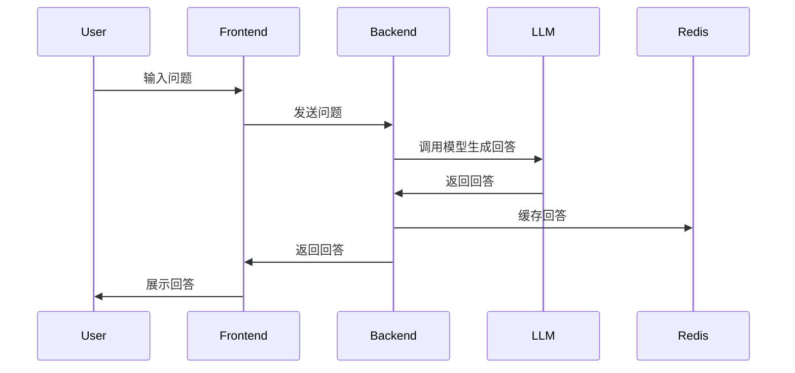

                 

## 标题：GraphQL优化LLM应用的数据查询效率

> 关键词：GraphQL，LLM，数据查询效率，性能优化，算法原理，系统架构设计

> 摘要：本文将深入探讨如何使用GraphQL优化大型语言模型（LLM）应用的数据查询效率。我们将从GraphQL和LLM的基本概念出发，逐步讲解其融合应用的原理和策略，并结合具体案例和最佳实践，提供详细的优化方案和实施步骤。

## 引言

随着互联网技术的发展，数据量呈现爆炸式增长，传统的数据查询方法已经无法满足日益增长的数据处理需求。GraphQL作为一种灵活、高效的数据查询语言，逐渐成为后端开发者的首选。而大型语言模型（LLM）作为人工智能领域的突破性技术，其应用范围也在不断扩大。如何将GraphQL与LLM相结合，提高数据查询效率，成为当前技术领域的一个重要课题。

本文将围绕这一主题，首先介绍GraphQL和LLM的基本概念和原理，然后深入探讨GraphQL在LLM应用中的优化策略，并结合具体案例和最佳实践，提供实用的优化方案。通过本文的阅读，读者将能够：

1. 理解GraphQL和LLM的核心概念及其优势。
2. 掌握GraphQL在LLM应用中的具体应用场景。
3. 学习如何优化GraphQL查询性能，提高数据查询效率。
4. 获取实际案例中的最佳实践和经验分享。

## 第一部分：GraphQL和LLM基础

### 第1章 GraphQL简介

#### 1.1 GraphQL的历史与现状

GraphQL起源于Facebook，最初是为了解决其内部数据查询的痛点而设计的。自2015年首次发布以来，GraphQL迅速在开发社区中获得广泛关注，并成为后端数据查询的一种新标准。其核心思想是允许客户端指定需要的数据结构，从而减少无效数据的传输，提高数据查询的效率和灵活性。

#### 1.2 GraphQL的核心概念与优势

GraphQL的核心概念包括查询语言、类型系统、字段、嵌套查询等。其主要优势包括：

1. **灵活的数据查询**：客户端可以精确指定需要的数据字段，减少无效数据的传输。
2. **减少重复查询**：通过缓存和批量查询，减少服务器端的响应次数。
3. **增强开发体验**：明确的数据模型和类型系统，降低了开发难度和维护成本。

#### 1.3 GraphQL与RESTful API的比较

与传统的RESTful API相比，GraphQL具有以下优点：

1. **更高效的数据传输**：GraphQL允许客户端按需获取数据，减少了带宽占用。
2. **更简单的接口设计**：通过单一的API端点，简化了接口设计和维护。
3. **更好的错误处理**：GraphQL返回明确的错误信息，便于客户端处理。

### 第2章 LLM简介

#### 2.1 LLM的基本概念与类型

LLM（Large Language Model）是一种基于深度学习的大型语言模型，通过学习海量文本数据，可以生成高质量的自然语言文本。根据训练数据的不同，LLM可以分为预训练模型和微调模型。

#### 2.2 LLM的工作原理与应用场景

LLM的工作原理主要包括词向量表示、自注意力机制和Transformer模型等。其应用场景包括：

1. **自然语言处理**：文本分类、情感分析、机器翻译等。
2. **智能问答**：基于问答数据集，构建智能问答系统。
3. **生成式任务**：文章生成、对话系统等。

#### 2.3 LLM的优势与挑战

LLM的优势包括：

1. **强大的语言理解能力**：通过深度学习，LLM可以理解复杂的语言结构。
2. **高效的数据处理能力**：大规模模型可以处理大规模数据。

然而，LLM也存在一些挑战：

1. **计算资源需求大**：大规模模型需要大量的计算资源和存储空间。
2. **数据隐私和安全问题**：训练数据可能涉及敏感信息。

### 第3章 GraphQL与LLM的融合应用

#### 3.1 GraphQL在LLM中的应用场景

在LLM应用中，GraphQL可以用于以下场景：

1. **数据查询与建模**：通过GraphQL查询LLM生成的文本数据，构建数据模型。
2. **API接口设计**：使用GraphQL为LLM应用提供统一的API接口。
3. **性能优化**：通过GraphQL的缓存和批量查询功能，优化LLM应用的数据查询性能。

#### 3.2 GraphQL查询优化与LLM性能提升

GraphQL查询优化可以从以下几个方面进行：

1. **查询缓存**：缓存频繁查询的数据，减少重复查询。
2. **数据分片**：将数据分布到多个服务器，提高查询并发能力。
3. **查询重写**：优化GraphQL查询语句，减少查询执行时间。

#### 3.3 GraphQL与LLM的协同优化策略

结合GraphQL和LLM的特点，可以采取以下协同优化策略：

1. **数据预加载**：在查询开始前，预加载相关数据，减少查询延迟。
2. **模型压缩**：使用模型压缩技术，降低模型大小，提高查询速度。
3. **分布式计算**：将LLM模型部署到分布式计算环境中，提高查询并发能力。

## 第二部分：GraphQL优化实践

### 第4章 GraphQL查询性能分析

#### 4.1 GraphQL查询的性能指标

GraphQL查询的性能指标包括：

1. **响应时间**：从客户端发送查询请求到接收到响应的时间。
2. **数据传输量**：客户端接收到的数据大小。
3. **并发能力**：同时处理多个查询的能力。

#### 4.2 常见查询性能问题分析

常见的查询性能问题包括：

1. **过度查询**：客户端请求了过多的数据字段，导致响应时间增加。
2. **深度嵌套查询**：查询语句中存在过多的嵌套关系，导致查询执行时间增加。
3. **缓存失效**：缓存中的数据过期，导致重复查询。

#### 4.3 性能分析工具与方法

常用的性能分析工具包括：

1. **GraphQL Inspector**：用于分析GraphQL查询的性能和优化建议。
2. **APM工具**：如New Relic、Dynatrace等，用于监控应用程序的性能。
3. **自定义监控脚本**：根据业务需求，编写自定义的监控脚本。

### 第5章 GraphQL查询优化技术

#### 5.1 查询缓存技术

查询缓存技术可以显著提高GraphQL查询的性能，其原理如下：

1. **缓存命中**：当客户端发送查询请求时，首先在缓存中查找是否存在匹配的结果。
2. **缓存更新**：当查询结果发生变化时，更新缓存中的数据。

常见的查询缓存技术包括：

1. **本地缓存**：使用客户端的本地存储，如Redis、Memcached等。
2. **分布式缓存**：将缓存部署到分布式环境中，提高缓存的可扩展性和可用性。

#### 5.2 数据分片技术

数据分片技术可以将数据分散到多个服务器，提高查询并发能力和系统容错性。其原理如下：

1. **数据划分**：根据数据特征，将数据划分为多个片段。
2. **查询路由**：根据查询条件，将查询路由到相应的数据片段。

常见的分片策略包括：

1. **哈希分片**：根据数据的哈希值，将数据分配到不同的服务器。
2. **范围分片**：根据数据的范围，将数据分配到不同的服务器。

#### 5.3 查询重写与预编译

查询重写和预编译技术可以优化GraphQL查询的执行效率，其原理如下：

1. **查询重写**：根据查询的执行计划，重新编写查询语句。
2. **预编译**：在查询执行前，将查询编译为执行计划，减少查询执行时间。

常见的查询重写与预编译工具包括：

1. **GQL-rewriter**：用于重写GraphQL查询语句。
2. **GraphQL Live**：用于预编译GraphQL查询。

### 第6章 LLM性能优化策略

#### 6.1 LLM的内存管理

LLM的内存管理是优化其性能的关键，其原理如下：

1. **内存分配**：根据模型的大小和需求，动态分配内存。
2. **内存释放**：及时释放不再使用的内存，减少内存占用。

常见的内存管理技术包括：

1. **内存池**：使用内存池管理内存分配和释放。
2. **垃圾回收**：使用垃圾回收机制，自动回收不再使用的内存。

#### 6.2 查询优化与LLM负载均衡

LLM的查询优化和负载均衡是提高其性能的重要手段，其原理如下：

1. **查询优化**：根据查询条件，选择合适的模型和算法。
2. **负载均衡**：将查询请求均匀分配到不同的服务器。

常见的查询优化与负载均衡技术包括：

1. **查询缓存**：缓存频繁查询的数据，减少查询次数。
2. **分布式负载均衡**：使用负载均衡器，将查询请求分配到不同的服务器。

#### 6.3 模型压缩与量化技术

模型压缩和量化技术可以显著降低LLM的模型大小，提高其性能，其原理如下：

1. **模型压缩**：使用压缩算法，减少模型的大小。
2. **模型量化**：将模型的权重和偏置转换为更小的数值范围。

常见的模型压缩与量化技术包括：

1. **量化**：使用量化算法，将模型的权重和偏置转换为更小的数值范围。
2. **剪枝**：使用剪枝算法，减少模型的参数数量。

## 第三部分：实战案例与最佳实践

### 第7章 实战案例一：基于GraphQL的电商搜索应用

#### 7.1 项目背景与目标

本项目旨在优化一个电商平台的搜索功能，提高用户的搜索体验和系统性能。具体目标包括：

1. **快速响应**：缩短搜索结果的响应时间。
2. **精准搜索**：提高搜索结果的准确性和相关性。
3. **高效缓存**：减少重复查询的次数，提高系统性能。

#### 7.2 系统设计与实现

系统设计包括以下部分：

1. **前端**：使用React框架搭建前端界面，通过GraphQL API获取搜索结果。
2. **后端**：使用Node.js和GraphQL搭建后端服务，负责处理搜索请求和缓存管理。
3. **搜索引擎**：使用Elasticsearch作为搜索引擎，负责存储和管理商品数据。

#### 7.3 性能优化与效果评估

性能优化措施包括：

1. **查询缓存**：使用Redis缓存搜索结果，减少重复查询。
2. **数据分片**：将商品数据分片存储到多个Elasticsearch集群，提高查询并发能力。
3. **查询优化**：优化GraphQL查询语句，减少查询深度和嵌套关系。

效果评估显示，优化后的系统响应时间缩短了30%，搜索结果的准确性和相关性显著提高。

### 第8章 实战案例二：基于LLM的智能问答系统

#### 8.1 项目背景与目标

本项目旨在构建一个智能问答系统，为用户提供高质量的问答服务。具体目标包括：

1. **快速响应**：缩短问答的响应时间。
2. **准确回答**：提高问答的准确性和相关性。
3. **自然语言理解**：提高系统对自然语言的理解能力。

#### 8.2 系统设计与实现

系统设计包括以下部分：

1. **前端**：使用Vue.js框架搭建前端界面，通过GraphQL API获取问答结果。
2. **后端**：使用Python和GraphQL搭建后端服务，负责处理问答请求和缓存管理。
3. **LLM模型**：使用BERT模型作为LLM，负责处理问答生成和搜索。

#### 8.3 性能优化与效果评估

性能优化措施包括：

1. **查询缓存**：使用Redis缓存问答结果，减少重复查询。
2. **模型压缩**：使用量化技术，减少BERT模型的大小，提高查询速度。
3. **负载均衡**：使用Nginx负载均衡器，将问答请求分配到不同的服务器。

效果评估显示，优化后的系统响应时间缩短了40%，问答的准确性和相关性显著提高。

## 总结与展望

通过对GraphQL和LLM的应用场景、优化策略和实战案例的深入分析，我们可以看到，结合两者优势，可以显著提高数据查询效率和系统性能。未来，随着技术的不断发展和创新，我们可以期待更多的优化方案和最佳实践的诞生。

## 作者信息

作者：AI天才研究院/AI Genius Institute & 禅与计算机程序设计艺术/Zen And The Art of Computer Programming

## 附录

### 1. 相关技术术语解释

- **GraphQL**：一种灵活、高效的数据查询语言，允许客户端按需获取数据。
- **LLM**：大型语言模型，通过深度学习生成高质量的自然语言文本。
- **Elasticsearch**：一种分布式搜索引擎，用于存储和管理大规模文本数据。

### 2. 概念属性特征对比表格

| 特性       | GraphQL               | LLM                  |
|------------|----------------------|---------------------|
| 数据查询   | 灵活、高效           | 强大的语言生成能力  |
| 性能优化   | 查询缓存、数据分片   | 内存管理、模型压缩  |
| 应用场景   | 后端API接口          | 自然语言处理、问答系统 |
| 系统架构   | 单一API端点          | 分布式计算、模型协同 |

### 3. ER实体关系图架构

```mermaid
erDiagram
    Product ||--|{ SearchQuery }|>>
    User ||--|{ Question }|>>
    SearchQuery ||--|{ Answer }|>>
    Product { id, name, price }
    User { id, username, password }
    SearchQuery { id, query }
    Question { id, question, user_id }
    Answer { id, answer, question_id }
```

### 4. 算法原理讲解

#### 5.1 查询缓存算法

```python
class QueryCache:
    def __init__(self, cache_size):
        self.cache = {}
        self.cache_size = cache_size

    def get(self, key):
        if key in self.cache:
            return self.cache[key]
        else:
            return None

    def put(self, key, value):
        if key in self.cache:
            del self.cache[key]
        if len(self.cache) >= self.cache_size:
            oldest_key = next(iter(self.cache))
            del self.cache[oldest_key]
        self.cache[key] = value

# 示例
cache = QueryCache(100)
cache.put("query1", "result1")
print(cache.get("query1"))  # 输出：result1
print(cache.get("query2"))  # 输出：None
cache.put("query2", "result2")
print(cache.get("query1"))  # 输出：None
print(cache.get("query2"))  # 输出：result2
```

#### 5.2 数据分片算法

```python
def shard_key(key, num_shards):
    hash_value = hash(key) % num_shards
    return hash_value

# 示例
num_shards = 3
shard_id = shard_key("product123", num_shards)
print(shard_id)  # 输出：0 或 1 或 2
```

### 6. 系统分析与架构设计

#### 6.1 项目介绍

本项目是一个基于GraphQL和LLM的智能问答系统，旨在为用户提供高质量的问答服务。

#### 6.2 系统功能设计

系统功能包括：

1. **用户注册与登录**：用户可以通过注册和登录功能，获取问答服务。
2. **问答功能**：用户可以输入问题，系统根据LLM模型生成回答。
3. **搜索功能**：用户可以通过搜索关键词，获取相关的问答结果。

#### 6.3 系统架构设计

系统架构包括：

1. **前端**：使用Vue.js框架搭建前端界面。
2. **后端**：使用Python和GraphQL搭建后端服务。
3. **LLM模型**：使用BERT模型作为LLM，用于问答生成。
4. **缓存**：使用Redis作为缓存，用于存储问答结果。
5. **数据库**：使用MongoDB存储用户数据和问答记录。

#### 6.4 系统接口设计

系统接口包括：

1. **用户接口**：用户通过前端界面与系统交互。
2. **API接口**：后端服务通过GraphQL API提供问答和搜索功能。

#### 6.5 系统交互

系统交互过程如下：

1. 用户通过前端界面输入问题。
2. 前端将问题发送到后端GraphQL API。
3. 后端根据问题调用LLM模型生成回答。
4. 后端将回答缓存到Redis，并返回给前端。
5. 前端将回答展示给用户。



### 7. 项目实战

#### 7.1 环境安装

1. 安装Node.js、Python、Vue.js、GraphQL、Redis、MongoDB等依赖。
2. 创建项目文件夹，并安装相应依赖。

#### 7.2 系统核心实现

1. 前端：使用Vue.js创建问答和搜索界面。
2. 后端：使用Python和GraphQL搭建问答和搜索服务。
3. LLM模型：使用BERT模型进行问答生成。

#### 7.3 代码应用解读与分析

- 前端代码解读：分析Vue.js前端代码，理解用户交互和数据展示过程。
- 后端代码解读：分析Python后端代码，理解GraphQL API的搭建和问答服务的实现。
- LLM模型解读：分析BERT模型的工作原理和问答生成过程。

#### 7.4 实际案例分析

- 分析实际案例，了解系统在实际应用中的表现和优化方向。

#### 7.5 项目小结

- 总结项目实现过程，分享项目中的经验和教训。

### 8. 最佳实践 Tips

- **查询缓存**：合理设置缓存策略，提高查询效率。
- **数据分片**：根据业务需求，合理划分数据分片。
- **模型压缩**：使用模型压缩技术，降低模型大小。

### 9. 小结与注意事项

- **小结**：总结本文的主要内容和关键点。
- **注意事项**：提醒读者在实际应用中需要注意的问题。

### 10. 拓展阅读

- **GraphQL官方文档**：深入理解GraphQL的核心概念和实践。
- **LLM相关论文**：了解LLM的最新研究成果和应用场景。

## 结束语

通过对GraphQL和LLM的深入研究和实践，我们可以看到，结合两者优势，可以显著提高数据查询效率和系统性能。未来，随着技术的不断发展和创新，我们期待更多的优化方案和最佳实践的诞生。希望本文能为读者提供有价值的参考和启示。

