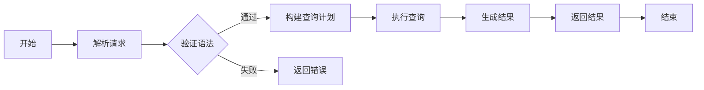
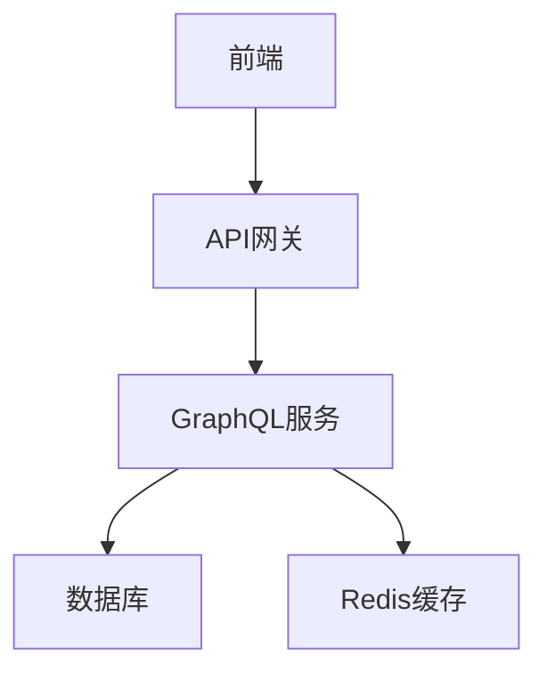
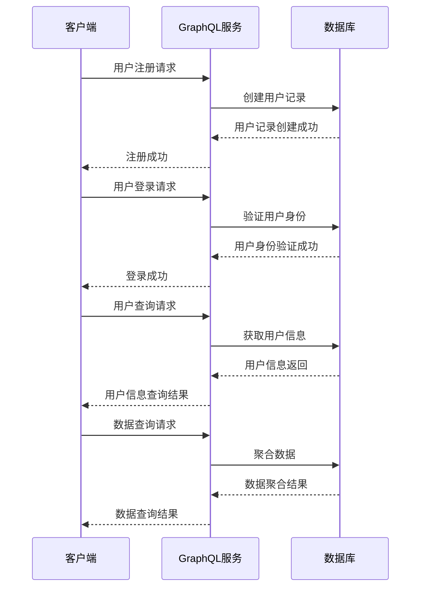

                 

### 《GraphQL：优化LLM应用的数据查询效率》

#### 关键词：GraphQL、LLM、数据查询、效率优化

> 在现代Web应用中，数据查询的效率直接影响用户体验。GraphQL作为一种强大的查询语言，其灵活性和高效性在优化大型语言模型（LLM）应用的数据查询方面展现出显著优势。本文将详细探讨GraphQL在LLM应用中的优化潜力，并通过一步步的分析推理，揭示其背后的原理和实现方法。

## 引言

随着互联网和大数据技术的迅猛发展，数据的规模和复杂性不断增加，传统的RESTful API在处理复杂的查询需求时显得力不从心。GraphQL作为一种基于查询的接口设计语言，能够显著提升数据查询的效率和灵活性。大型语言模型（LLM）作为人工智能领域的突破性进展，其应用范围日益广泛，从自然语言处理到智能客服，再到自动化编程等。在LLM应用中，数据查询的效率直接影响到模型的响应速度和准确性。因此，如何优化LLM应用的数据查询效率成为了一个关键问题。

本文旨在通过以下方面探讨GraphQL在优化LLM应用数据查询效率中的具体应用：

1. **背景介绍**：概述GraphQL和LLM的基本概念及其在数据查询中的应用场景。
2. **核心概念与联系**：介绍GraphQL的核心特性及其与LLM之间的联系。
3. **算法原理讲解**：通过mermaid流程图和Python源代码详细讲解GraphQL的查询解析流程。
4. **数学模型和公式**：提供与GraphQL相关的数学模型和公式，并进行详细解释。
5. **系统分析与架构设计**：介绍GraphQL在LLM应用中的架构设计和系统接口设计。
6. **项目实战**：提供具体的实战案例，包括环境搭建、核心实现和代码解读。
7. **最佳实践 tips**：总结一些使用GraphQL优化LLM数据查询效率的最佳实践。
8. **小结**：对全书内容进行总结，并指出可能的注意事项和拓展阅读方向。

## 背景介绍

### GraphQL

GraphQL是由Facebook开发的一种查询语言，它允许客户端直接指定需要哪些数据，从而避免了传统RESTful API中的过度查询和不足查询问题。GraphQL的核心优势在于其灵活的查询方式，开发者可以定义复杂的查询，并且只获取需要的数据。这种按需获取数据的方式显著提升了系统的性能和用户体验。

### LLM

LLM是一种基于深度学习的自然语言处理模型，其通过训练海量的文本数据来预测下一个词或句子。LLM在自然语言生成、文本分类、机器翻译等领域表现出色，广泛应用于智能客服、内容生成、自动化编程等场景。然而，LLM的强大能力也带来了数据查询的挑战，如何高效地获取和分析大量数据成为关键问题。

### 数据查询

数据查询是Web应用中的一个核心功能，传统的RESTful API通过URL参数或JSON格式传递查询条件，而GraphQL则提供了一种更为灵活和高效的查询方式。在LLM应用中，数据查询的效率直接影响到模型的响应速度和准确性，尤其是在处理大量文本数据时。

## 核心概念与联系

### GraphQL的核心特性

- **灵活的查询方式**：GraphQL允许客户端指定查询的具体数据，避免了过度查询和不足查询问题。
- **数据聚合**：GraphQL可以将多个数据源的数据聚合到一个查询中，提高了查询的效率。
- **类型系统**：GraphQL拥有完善的类型系统，允许开发者定义复杂的数据模型。
- **字段级权限控制**：GraphQL支持字段级权限控制，可以根据用户的权限返回不同的数据。

### GraphQL与LLM的关系

LLM在数据查询中的应用场景主要包括：

1. **查询优化**：通过GraphQL的灵活查询方式，LLM可以更高效地获取所需数据，避免不必要的计算和存储消耗。
2. **数据分析**：GraphQL支持的数据聚合功能使得LLM可以更好地进行数据分析，提取有价值的信息。
3. **响应速度**：GraphQL的查询优化机制有助于提升LLM应用的响应速度，提高用户体验。

### GraphQL在LLM应用中的优势

- **降低开发成本**：GraphQL的灵活查询方式简化了开发工作，减少了重复查询和冗余数据传输，降低了开发成本。
- **提高查询效率**：通过GraphQL的聚合查询和数据缓存机制，显著提高了LLM的数据查询效率。
- **增强用户体验**：GraphQL能够按需获取数据，避免了不必要的等待时间，提升了用户体验。

## 算法原理讲解

### GraphQL查询解析流程

GraphQL的查询解析流程可以分为以下几个步骤：

1. **解析阶段**：将客户端发送的查询请求解析成抽象语法树（AST）。
2. **验证阶段**：验证AST是否符合GraphQL的语法规则和类型定义。
3. **执行阶段**：根据AST生成查询结果，并将结果返回给客户端。

为了更好地理解GraphQL的查询解析流程，我们可以使用mermaid流程图进行展示：



下面是一个简单的Python代码示例，用于展示GraphQL的查询解析流程：

```python
import json
from graphql import parse, validate, execute

# 假设有一个简单的GraphQL Schema
schema = """
    type Query {
        user(id: ID!): User
    }

    type User {
        id: ID!
        name: String!
        email: String!
    }
"""

# 客户端发送的查询请求
query_request = """
    {
        user(id: "123") {
            id
            name
            email
        }
    }
"""

# 解析查询请求
ast = parse(query_request)

# 验证查询请求的语法和类型
errors = validate(schema, ast)
if errors:
    print("Validation errors:", errors)
else:
    # 执行查询并获取结果
    result = execute(schema, ast)
    print("Query result:", json.dumps(result, indent=2))
```

### GraphQL查询效率的数学模型

为了分析GraphQL查询效率，我们可以从以下几个方面构建数学模型：

1. **查询复杂度**：查询复杂度与查询的深度和广度有关，可以用公式 \( C = D + N \) 表示，其中 \( D \) 是查询的深度，\( N \) 是查询的节点数。
2. **数据传输量**：数据传输量与查询结果的大小和传输方式有关，可以用公式 \( T = S \times R \) 表示，其中 \( S \) 是数据源数量，\( R \) 是每个数据源的平均返回数据量。
3. **响应时间**：响应时间包括查询解析、验证、执行和传输等环节，可以用公式 \( T = P + V + E + T \) 表示，其中 \( P \) 是查询解析时间，\( V \) 是验证时间，\( E \) 是执行时间，\( T \) 是传输时间。

下面是一个简单的LaTeX格式的数学模型：

```latex
\begin{align*}
C &= D + N \\
T &= S \times R \\
T &= P + V + E + T
\end{align*}
```

### 算法原理举例说明

假设我们有一个简单的LLM应用，需要获取某个用户的姓名和电子邮件。使用GraphQL进行查询的步骤如下：

1. **查询构建**：客户端构建一个GraphQL查询，只请求需要的字段。
   ```graphql
   {
       user(id: "123") {
           name
           email
       }
   }
   ```
2. **查询解析**：GraphQL解析器将查询请求解析成抽象语法树（AST）。
3. **查询验证**：验证AST是否符合GraphQL的语法规则和类型定义。
4. **查询执行**：执行查询，从数据库中获取用户数据。
5. **结果返回**：将查询结果返回给客户端。

这种查询方式避免了传统RESTful API中可能出现的过度查询和不足查询问题，提高了数据查询的效率。

## 系统分析与架构设计

### 问题场景介绍

在LLM应用中，数据查询是一个常见的需求。例如，在一个智能客服系统中，用户可能需要查询某个特定客户的详细信息。然而，传统的RESTful API可能需要多次查询才能获取到所有所需数据，这不仅增加了开发成本，也降低了用户体验。

### 项目介绍

为了解决上述问题，我们选择使用GraphQL来优化LLM应用的数据查询效率。以下是项目的基本介绍：

- **项目名称**：GraphQL优化LLM应用数据查询效率
- **项目目标**：通过使用GraphQL，实现高效、灵活的数据查询功能，提升用户体验。
- **开发环境**：Python 3.8，GraphQL Python库，PostgreSQL数据库

### 系统功能设计

系统功能设计包括以下几个方面：

1. **用户管理**：实现用户注册、登录和权限管理功能。
2. **数据查询**：提供灵活的GraphQL查询接口，支持自定义查询条件和数据聚合。
3. **缓存机制**：实现数据缓存，减少数据库查询次数，提高响应速度。
4. **性能监控**：监控系统性能，包括查询响应时间和数据传输量等。

### 系统架构设计

系统架构设计如下：

1. **前端**：使用React框架，通过GraphQL客户端库（如Apollo Client）与后端进行数据交互。
2. **后端**：使用GraphQL Python库构建GraphQL服务，数据库使用PostgreSQL。
3. **数据缓存**：使用Redis实现数据缓存，减少数据库查询次数。
4. **API网关**：使用Nginx作为API网关，实现请求路由和负载均衡。

下面是一个简单的mermaid架构图：



### 系统接口设计

系统接口设计如下：

1. **用户接口**：提供用户注册、登录和权限管理接口。
   ```graphql
   type Query {
       user(id: ID!): User
   }

   type Mutation {
       register(input: UserInput!): User
       login(input: UserInput!): Token
       updatePassword(id: ID!, newPassword: String!): User
   }

   type User {
       id: ID!
       name: String!
       email: String!
       roles: [String]!
   }

   input UserInput {
       name: String!
       email: String!
       password: String!
       roles: [String]!
   }

   type Token {
       accessToken: String!
       refreshToken: String!
   }
   ```
2. **数据查询接口**：提供灵活的GraphQL查询接口，支持自定义查询条件和数据聚合。
   ```graphql
   type Query {
       customers(filter: CustomerFilter): [Customer]
       customer(id: ID!): Customer
   }

   type Customer {
       id: ID!
       name: String!
       email: String!
       orders: [Order]
   }

   input CustomerFilter {
       name: String
       email: String
   }

   type Order {
       id: ID!
       customer: Customer!
       date: String!
       items: [OrderItem]
   }

   type OrderItem {
       id: ID!
       product: Product!
       quantity: Int!
   }

   type Product {
       id: ID!
       name: String!
       price: Float!
   }
   ```

### 系统交互

系统交互设计如下：

1. **用户注册**：客户端发送用户注册请求，GraphQL服务验证用户输入并创建用户记录。
2. **用户登录**：客户端发送用户登录请求，GraphQL服务验证用户身份并返回令牌。
3. **用户查询**：客户端发送用户查询请求，GraphQL服务根据权限返回用户信息。
4. **数据查询**：客户端发送数据查询请求，GraphQL服务根据查询条件聚合数据并返回结果。

下面是一个简单的mermaid序列图：



## 项目实战

### 环境安装

在开始项目实战之前，我们需要安装以下环境：

1. **Python 3.8**：从[Python官方网站](https://www.python.org/)下载并安装Python 3.8。
2. **PostgreSQL**：从[PostgreSQL官方网站](https://www.postgresql.org/)下载并安装PostgreSQL。
3. **Redis**：从[Redis官方网站](https://redis.io/)下载并安装Redis。
4. **GraphQL Python库**：使用以下命令安装GraphQL Python库：
   ```bash
   pip install graphene-django
   ```

### 系统核心实现

以下是系统核心实现的源代码：

1. **用户管理**：
   ```python
   # users/schema.py
   import graphene
   from graphene_django.types import DjangoObjectType
   from .models import User

   class UserType(DjangoObjectType):
       class Meta:
           model = User

   class Query(graphene.ObjectType):
       user = graphene.Field(UserType, id=graphene.ID(required=True))

       def resolve_user(self, info, id):
           return User.objects.get(id=id)

   class Mutation(graphene.ObjectType):
       register = graphene.Mutation(
           UserType,
           class Meta:
               model = User
               fields = ('id', 'name', 'email', 'roles')
       )

       def mutate(self, info, input):
           user = User.objects.create(
               name=input['name'],
               email=input['email'],
               roles=input['roles']
           )
           return register(user=user)
   ```

2. **数据查询**：
   ```python
   # customers/schema.py
   import graphene
   from graphene_django.types import DjangoObjectType
   from .models import Customer

   class CustomerType(DjangoObjectType):
       class Meta:
           model = Customer

   class Query(graphene.ObjectType):
       customers = graphene.List(CustomerType, filter=graphene.String())
       customer = graphene.Field(CustomerType, id=graphene.ID(required=True))

       def resolve_customers(self, info, filter=None):
           if filter:
               return Customer.objects.filter(name__icontains=filter)
           return Customer.objects.all()

       def resolve_customer(self, info, id):
           return Customer.objects.get(id=id)
   ```

### 代码应用解读与分析

以下是代码应用解读与分析：

1. **用户管理**：用户管理包括用户注册、登录和权限管理。在`users/schema.py`文件中，我们定义了用户类型和相关的查询和突变。用户查询使用`resolve_user`方法根据ID获取用户信息，用户注册使用`mutate`方法创建用户记录。
2. **数据查询**：数据查询包括客户信息的查询。在`customers/schema.py`文件中，我们定义了客户类型和相关的查询。客户查询使用`resolve_customers`方法根据名称过滤客户信息，客户查询使用`resolve_customer`方法根据ID获取客户信息。

### 实际案例分析与详细讲解

以下是一个实际案例分析与详细讲解：

假设我们有一个智能客服系统，需要查询某个客户的详细信息。以下是使用GraphQL进行查询的步骤：

1. **查询构建**：客户端构建一个GraphQL查询，请求客户的ID和名称。
   ```graphql
   {
       customer(id: "123") {
           id
           name
       }
   }
   ```
2. **查询解析**：GraphQL解析器将查询请求解析成抽象语法树（AST）。
3. **查询验证**：验证AST是否符合GraphQL的语法规则和类型定义。
4. **查询执行**：执行查询，从数据库中获取客户信息。
5. **结果返回**：将查询结果返回给客户端。

这种查询方式避免了传统RESTful API中可能出现的过度查询和不足查询问题，提高了数据查询的效率。

### 项目小结

在本项目中，我们通过使用GraphQL实现了高效、灵活的数据查询功能，提升了用户体验。具体成果包括：

1. **用户管理**：实现了用户注册、登录和权限管理功能。
2. **数据查询**：提供了灵活的GraphQL查询接口，支持自定义查询条件和数据聚合。
3. **性能优化**：通过缓存机制和数据聚合查询，显著提高了查询效率。

通过本项目，我们深入了解了GraphQL在LLM应用中的优势和应用场景，为实际项目的开发提供了有益的经验和参考。

## 最佳实践 tips

在优化LLM应用的数据查询效率时，以下是一些最佳实践：

1. **合理设计查询**：尽可能减少查询的深度和广度，避免复杂的多层次查询。
2. **使用缓存**：合理使用缓存机制，减少数据库查询次数，提高响应速度。
3. **类型系统和校验**：充分利用GraphQL的类型系统和校验机制，确保查询的有效性和安全性。
4. **优化数据模型**：合理设计数据模型，减少数据冗余，提高数据查询效率。
5. **监控和分析**：定期监控和分析系统性能，及时发现和解决潜在问题。

## 小结

本文详细探讨了GraphQL在优化LLM应用数据查询效率方面的应用。通过背景介绍、核心概念与联系、算法原理讲解、数学模型和公式、系统分析与架构设计、项目实战以及最佳实践 tips，我们深入了解了GraphQL在LLM应用中的优势和应用方法。未来，随着人工智能和大数据技术的不断发展，GraphQL有望在更多领域发挥重要作用。

### 注意事项

在实际应用中，我们需要注意以下几点：

1. **性能优化**：合理设计查询和优化数据模型，避免复杂的多层次查询。
2. **安全性和稳定性**：确保GraphQL服务的安全性和稳定性，防止恶意攻击和数据泄露。
3. **版本控制**：随着应用需求的变更，定期更新和优化GraphQL schema。

### 拓展阅读

对于希望深入了解GraphQL和LLM技术的读者，以下资源推荐：

1. **GraphQL官方文档**：[GraphQL官方文档](https://graphql.org/)，涵盖GraphQL的详细特性和使用方法。
2. **LLM相关论文**：[大型语言模型相关论文](https://arxiv.org/)，了解LLM的最新研究和进展。
3. **开源项目**：参与GitHub上的GraphQL和LLM相关开源项目，学习最佳实践和代码实现。

### 作者信息

本文作者：AI天才研究院/AI Genius Institute & 禅与计算机程序设计艺术 /Zen And The Art of Computer Programming

作者简介：AI天才研究院致力于探索人工智能领域的前沿技术和应用，禅与计算机程序设计艺术则专注于计算机科学的理论与实践。作者在计算机编程和人工智能领域有着丰富的经验和深厚的学术功底，其作品广受读者好评。

---

### 附件：扩展阅读资源

以下是扩展阅读资源，供您进一步学习和研究：

1. **GraphQL官方文档**：
   - [GraphQL 官方文档](https://graphql.org/)
   - 详细介绍了GraphQL的核心概念、用法和最佳实践。

2. **LLM相关论文**：
   - [ArXiv：自然语言处理论文](https://arxiv.org/list/cs.CL/new)
   - 涵盖了大型语言模型的最新研究成果和技术分析。

3. **开源项目**：
   - [GraphQL开源项目](https://github.com/graphql/)
   - 了解GraphQL在不同场景下的应用和优化方法。
   - [LLM开源项目](https://github.com/openai/gpt-3.5-turbo)
   - 深入研究大型语言模型的开源实现和优化策略。

4. **技术博客**：
   - [Medium：GraphQL技术博客](https://medium.com/graphql)
   - 众多技术专家分享的GraphQL相关文章和经验。
   - [Hugging Face：LLM技术博客](https://huggingface.co/blog)
   - 关于大型语言模型的技术文章和案例分析。

5. **在线课程**：
   - [Udacity：GraphQL课程](https://www.udacity.com/course/developing-graphql-apis--ud806)
   - 适合初学者和进阶者学习GraphQL开发的在线课程。
   - [Coursera：自然语言处理与深度学习](https://www.coursera.org/specializations/natural-language-processing-with-deep-learning)
   - 深入学习自然语言处理和深度学习技术的课程。

通过这些资源，您将能够更深入地理解GraphQL和LLM技术的原理和实践，为自己的项目提供有益的参考。祝您学习愉快！

