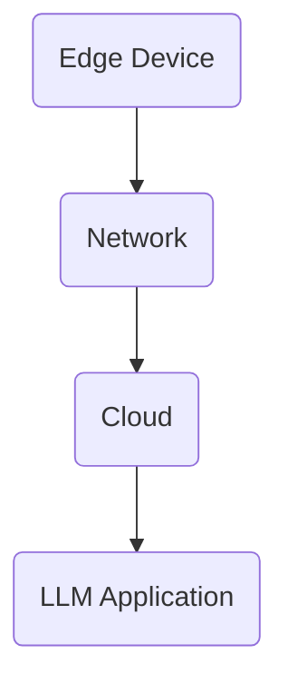
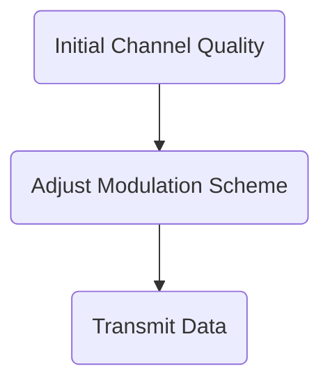

                 

## 5G Network Optimization: Enhancing LLM Mobile Application Experience

### Key Words: 5G, Network Optimization, LLM, Mobile Applications, Performance Enhancement

### Abstract:  
This article delves into the intricacies of optimizing 5G networks to significantly improve the performance of Large Language Model (LLM) mobile applications. It begins with a comprehensive overview of 5G technology and the significance of LLM applications in the mobile ecosystem. The core principles of 5G network optimization are discussed, focusing on key techniques and strategies that can be employed to enhance the user experience. The article then delves into the architecture of 5G networks and key technologies, providing insights into how these can be leveraged to optimize LLM mobile applications. Finally, it offers practical tips and insights for achieving optimal performance in real-world scenarios.

---

## Introduction to 5G and LLM Mobile Applications

### 1.1 Background and Importance of 5G Technology

#### 5G Overview

The advent of 5G technology represents a significant leap forward in mobile network capabilities. It builds upon the foundation laid by its predecessors—3G and 4G—introducing novel features and enhancements that promise to revolutionize various industries. The 5G technology roadmap can be traced back to the early 2000s when the International Telecommunication Union's (ITU) Radiocommunication Sector (ITU-R) started working on the next-generation mobile network standard. Key milestones include the release of the ITU's IMT-2020 requirements in 2015 and the subsequent commercial launches of 5G networks worldwide.

#### Key Features of 5G

One of the most compelling aspects of 5G is its promise of faster speeds. While 4G networks typically offer download speeds of around 100 Mbps, 5G aims to provide speeds that can exceed 1 Gbps. This increase in speed is achieved through advanced technologies such as millimeter-wave communications, which use higher frequency bands to deliver data at unprecedented rates.

Another critical feature of 5G is low latency. Latency refers to the time it takes for data to travel from the source to the destination. In the context of mobile networks, lower latency is crucial for applications that require real-time interaction, such as online gaming, autonomous vehicles, and remote surgery. 5G networks are designed to reduce latency to as low as 1 millisecond, a significant improvement over the 20-40 milliseconds typical of 4G networks.

5G also offers higher capacity, which means it can support a larger number of connected devices simultaneously. This is essential as we move towards an era of the Internet of Things (IoT), where billions of devices will be interconnected. With its massive machine-type communications (mMTC) capability, 5G can handle a vast number of devices, each requiring minimal bandwidth.

#### Challenges of 5G

While 5G technology offers numerous advantages, it also presents several challenges that need to be addressed. One of the primary challenges is interference. The use of higher frequency bands for 5G communications can lead to increased interference from other devices and environmental factors, such as weather conditions. This interference can degrade network performance and impact the user experience.

Spectrum allocation is another critical challenge. The availability of spectrum bands for 5G is limited, and the process of allocating these bands can be complex and contentious. Efficient spectrum management is essential to ensure that 5G networks can operate at optimal capacity and performance levels.

Network optimization is also a significant challenge. Despite its high-speed capabilities, 5G networks can still suffer from performance bottlenecks if not properly optimized. Techniques such as channel estimation, resource allocation, and interference management must be employed to maximize network efficiency and user satisfaction.

### 1.2 Introduction to LLM Mobile Applications

#### LLM Definition and Types

Large Language Models (LLM) are a class of artificial intelligence models designed to understand and generate human-like text. These models are trained on vast amounts of text data, enabling them to recognize patterns, understand context, and generate coherent and contextually appropriate responses. Common types of LLMs include GPT (Generative Pre-trained Transformer), BERT (Bidirectional Encoder Representations from Transformers), and T5 (Text-To-Text Transfer Transformer).

GPT models are based on the Transformer architecture and are known for their ability to generate human-like text. They are trained to predict the next word in a sequence, allowing them to generate coherent and contextually relevant text.

BERT models, on the other hand, are bidirectional and trained to understand the context of words in a sentence by considering both the preceding and following text. This makes them highly effective for tasks such as question answering and language understanding.

T5 models are designed for transfer learning and can be fine-tuned for various NLP tasks. They are trained to convert text from one format to another, making them highly versatile for a wide range of applications.

#### 5G and LLM Integration

The integration of 5G technology with LLM applications presents a unique opportunity to enhance mobile application performance. 5G's high-speed and low-latency capabilities enable faster data transfer rates and quicker response times, which are critical for LLM applications that require real-time interaction.

For example, in a mobile application that uses a chatbot based on an LLM, 5G can significantly reduce the latency of text input and response, providing a more seamless and interactive user experience. Similarly, in applications that use LLMs for natural language processing and generation, 5G can enable faster processing and generation of text, enhancing the overall performance of the application.

#### Impact on Mobile Application Experience

The enhanced capabilities of 5G technology have a profound impact on the user experience of LLM mobile applications. Faster download and upload speeds mean that applications can load more quickly and deliver content to users more efficiently.

Low latency is particularly important for applications that rely on real-time interaction. For example, in a mobile banking app that uses LLMs for voice recognition and text generation, low latency ensures that user commands are processed quickly and accurately, providing a more responsive and user-friendly experience.

Moreover, 5G's high capacity allows for a larger number of simultaneous connections, which is crucial for applications that need to handle multiple users concurrently. For instance, in an online education platform that uses LLMs for automated tutoring and personalized learning, 5G can support a larger number of students interacting with the system simultaneously, ensuring that each user receives the attention they need.

In summary, the combination of 5G's speed, low latency, and high capacity creates a powerful foundation for optimizing LLM mobile applications, delivering a superior user experience and unlocking new possibilities for mobile computing.

### 1.3 Current State of 5G Deployment and Challenges

#### Current State of 5G Deployment

The deployment of 5G networks has been a rapid and transformative process. As of 2023, several countries have already launched commercial 5G networks, including South Korea, the United States, China, Japan, and parts of Europe. These early adopters have leveraged advanced technologies such as mmWave spectrum, small cells, and network slicing to build robust and high-performance 5G networks.

However, the widespread adoption of 5G is not uniform across the globe. Many regions, particularly in developing countries, are still in the early stages of 5G deployment. Factors such as infrastructure limitations, regulatory hurdles, and economic constraints contribute to this uneven rollout. Additionally, the rollout of 5G networks often faces challenges in terms of spectrum allocation and frequency coordination, which can delay the deployment process.

#### Challenges in 5G Deployment

One of the primary challenges in 5G deployment is the availability of spectrum. 5G relies on higher frequency bands, such as mmWave spectrum (24 GHz and above), which offer high data rates but have shorter range and are more susceptible to interference. The allocation of these spectrum bands is a complex and often contentious process, involving negotiations between governments, telecommunications operators, and other stakeholders.

Another significant challenge is the construction of the 5G network infrastructure. The deployment of 5G requires a substantial number of small cells and mmWave antennas to provide the required coverage and capacity. This infrastructure is costly and time-consuming to build, and in many cases, it requires modifications to existing infrastructure, such as installing new towers or upgrading existing equipment.

Moreover, the integration of 5G with existing networks poses technical challenges. 5G operates on different frequencies and uses different technologies than previous generations, which can create interoperability issues. Ensuring seamless integration and coexistence between 5G and 4G networks is crucial to provide a consistent and reliable user experience.

#### Market Adoption and User Experience

The market adoption of 5G is influenced by several factors, including the availability of 5G devices, the pricing of 5G plans, and the perceived benefits of 5G over 4G. As of now, the range of 5G-enabled devices, including smartphones, tablets, and IoT devices, is growing, but it is not yet as extensive as that of 4G devices.

The pricing of 5G plans also plays a significant role in market adoption. While 5G offers significant improvements in speed and capacity, the cost of 5G plans can be higher than those of 4G plans. This cost difference can deter some users from adopting 5G, particularly in regions where economic constraints are more prevalent.

From a user experience perspective, the benefits of 5G are compelling. Users can experience faster download and upload speeds, lower latency, and a more stable and reliable network connection. However, the actual user experience can vary based on factors such as the quality of the 5G network in their area, the capabilities of their devices, and the nature of the applications they use.

In summary, while the deployment of 5G networks represents a significant technological advancement, it also comes with challenges that need to be addressed to ensure widespread and effective adoption. The ongoing efforts to overcome these challenges will play a crucial role in determining the success and impact of 5G in the coming years.

## Fundamental Concepts of 5G Network Optimization

### 2.1 Core Principles of 5G Network Optimization

#### Optimization Objectives

The primary objectives of 5G network optimization are to enhance Quality of Service (QoS), improve network performance, and ensure high levels of user satisfaction. Achieving these objectives involves addressing various technical challenges and leveraging advanced optimization techniques.

**Quality of Service (QoS)**: QoS refers to the overall experience of users on a network. It encompasses factors such as network speed, latency, reliability, and security. Optimizing QoS involves ensuring that users receive consistent and high-quality service, regardless of their location or the number of devices connected to the network.

**Network Performance**: Network performance is a measure of how well a network can handle data traffic and deliver services to users. This includes metrics such as throughput, latency, and packet loss. Optimizing network performance is crucial for providing a seamless user experience and preventing congestion.

**User Satisfaction**: User satisfaction is a key indicator of the effectiveness of network optimization. It reflects how well the network meets users' expectations and requirements. Enhancing user satisfaction involves not only improving technical metrics but also addressing factors such as network coverage, reliability, and responsiveness.

#### Key Optimization Techniques

1. **Channel Estimation**: Channel estimation is the process of determining the characteristics of the wireless channel between a transmitter and a receiver. Accurate channel estimation is essential for ensuring efficient and reliable communication. Techniques such as pilot symbols, training sequences, and adaptive algorithms are used to estimate the channel's frequency response, phase, and amplitude.

2. **Resource Allocation**: Resource allocation involves assigning network resources, such as spectrum bands, time slots, and power levels, to different users and services. Efficient resource allocation is critical for maximizing network capacity and performance. Techniques such as dynamic spectrum sharing, network slicing, and user-specific resource optimization are commonly used to allocate resources effectively.

3. **Interference Management**: Interference occurs when signals from multiple transmitters interfere with each other, degrading the quality of communication. Effective interference management techniques, such as interference cancellation, interference avoidance, and adaptive modulation and coding, are used to mitigate the impact of interference on network performance.

#### Cross-Domain Optimization Strategies

To achieve optimal network performance, it is essential to adopt cross-domain optimization strategies that integrate network optimization with application optimization. Some key strategies include:

- **Network-Application Co-Design**: This approach involves designing network architectures and protocols that are specifically tailored to the requirements of applications. By aligning network capabilities with application needs, it is possible to achieve better overall performance and efficiency.

- **Service-Level Agreements (SLAs)**: SLAs define the quality of service that users can expect from a network. By setting clear SLAs, network operators can ensure that their networks meet specific performance targets and can provide incentives for continuous improvement.

- **Machine Learning and AI**: Machine learning and AI techniques can be used to optimize network performance in real-time. These techniques can analyze network data, predict user behavior, and adapt network configurations to optimize performance dynamically.

### 2.2 Understanding LLM Mobile Applications

#### LLM Architecture

Large Language Models (LLM) are complex artificial intelligence models designed to understand and generate human-like text. The architecture of LLMs typically includes several key components:

- **Input Layer**: The input layer receives text data, which is then processed and transformed into a suitable format for the model.

- **Embedding Layer**: The embedding layer converts text data into numerical vectors that represent the semantic meaning of the words and phrases. This allows the model to understand the context and relationships between different elements of the text.

- **Encoder Layer**: The encoder layer processes the input data and encodes it into a fixed-size vector representation. This layer typically uses recurrent neural networks (RNNs) or transformer architectures, which enable the model to capture long-term dependencies in the text.

- **Decoder Layer**: The decoder layer generates the output text by predicting the next word or sequence of words based on the encoded representation. It uses the same architecture as the encoder layer but processes the data in reverse order.

- **Output Layer**: The output layer generates the final text output, which can be used for various applications such as text generation, translation, and question answering.

#### Optimization Challenges

Optimizing LLM mobile applications poses several challenges due to the complex nature of these models and the diverse requirements of mobile environments. Some key challenges include:

- **Data Processing**: LLMs require large amounts of data for training and inference, which can be challenging to process efficiently on mobile devices due to limited computational resources and power constraints.

- **Latency**: Mobile applications often require real-time responses, and the latency introduced by data processing and transmission can impact the user experience. Optimizing LLMs for low-latency performance is crucial for ensuring a smooth and responsive user interface.

- **Scalability**: Mobile applications need to handle varying levels of user activity and data load. Optimizing LLMs for scalability involves designing models that can efficiently handle increasing amounts of data and users without compromising performance.

- **Energy Efficiency**: Mobile devices are limited by battery capacity, and running LLMs on these devices can consume significant energy. Optimizing LLMs for energy efficiency is essential for extending battery life and ensuring reliable performance.

### 2.3 5G Network Optimization and LLM Integration

#### Cross-Domain Optimization

Optimizing 5G networks for LLM mobile applications requires a cross-domain approach that integrates network optimization with application optimization. Some key strategies include:

- **Network-Application Co-Design**: This approach involves designing network architectures and protocols that are specifically tailored to the requirements of LLM mobile applications. For example, network slicing can be used to allocate dedicated resources for LLM processing, ensuring high performance and low latency.

- **Service-Level Agreements (SLAs)**: SLAs can be established between network operators and application providers to define the quality of service required for LLM applications. By setting clear SLAs, both parties can ensure that the network and application are optimized to meet performance targets.

- **Machine Learning and AI**: Machine learning and AI techniques can be used to optimize both the network and the LLM application in real-time. For example, AI algorithms can analyze network data to predict user behavior and dynamically adjust network configurations to optimize performance.

#### Best Practices for Optimization

To achieve optimal performance in LLM mobile applications on 5G networks, the following best practices can be employed:

- **Efficient Data Processing**: Implementing efficient data processing techniques, such as compression and caching, can reduce the amount of data that needs to be transmitted and processed, reducing latency and improving performance.

- **Network Slicing**: Utilizing network slicing to allocate dedicated resources for LLM processing can ensure high performance and low latency. This approach can be particularly effective for applications that require real-time interaction and low latency.

- **Energy Optimization**: Implementing energy-efficient algorithms and techniques, such as model compression and pruning, can help reduce the energy consumption of LLM mobile applications, extending battery life and improving sustainability.

- **Real-Time Monitoring and Feedback**: Implementing real-time monitoring and feedback mechanisms can help identify performance bottlenecks and optimize network and application configurations dynamically. This approach ensures that the network and application are always operating at optimal levels.

In conclusion, optimizing 5G networks for LLM mobile applications requires a comprehensive and cross-domain approach that addresses the unique challenges of these applications. By leveraging advanced optimization techniques and best practices, it is possible to achieve significant improvements in performance and user experience, unlocking new possibilities for mobile computing.

### 3.1 5G Network Architecture Overview

The 5G network architecture is a sophisticated and highly integrated system designed to deliver unprecedented levels of performance, capacity, and flexibility. At its core, the 5G architecture consists of three primary layers: the Radio Access Network (RAN), the Mobile Access Network (MAN), and the Network Support Network (NPN).

**Radio Access Network (RAN)**: The RAN is the outermost layer of the 5G network architecture and is responsible for connecting mobile devices directly to the network. It comprises several key components, including base stations, small cells, and radio access technologies. The RAN utilizes advanced technologies such as millimeter-wave communications, massive MIMO (Multiple Input Multiple Output), and advanced beamforming to deliver high-speed, high-capacity, and low-latency wireless communication.

**Mobile Access Network (MAN)**: The MAN serves as the intermediary layer between the RAN and the Network Support Network (NPN). It is responsible for routing traffic between the 5G network and other networks, such as the Internet, private networks, and legacy networks. The MAN comprises several key technologies, including Network Function Virtualization (NFV), Software-Defined Networking (SDN), and Internet Protocol (IP) networks. These technologies enable the MAN to provide high scalability, flexibility, and efficiency in traffic management and network services.

**Network Support Network (NPN)**: The NPN is the innermost layer of the 5G network architecture and provides the essential support functions required for the operation of the 5G network. It includes core network functions such as user management, session management, and mobility management. The NPN is also responsible for handling critical tasks such as network slicing, service orchestration, and network slicing. These functions are implemented using advanced technologies such as Cloud-RAN, Edge Computing, and Network Function Virtualization (NFV).

**Key 5G Technologies**:

1. **Network Function Virtualization (NFV)**: NFV is a key technology in the 5G network architecture that enables the virtualization of network functions, such as routing, firewalling, and load balancing. By virtualizing these functions, NFV reduces the need for specialized hardware, making the network more flexible, scalable, and cost-effective.

2. **Software-Defined Networking (SDN)**: SDN is another crucial technology in the 5G architecture that enables the decoupling of control plane and data plane functions in network devices. This separation allows for centralized control and management of the network, enhancing scalability, flexibility, and programmability.

3. **Edge Computing**: Edge Computing is a distributed computing paradigm that brings computation and data storage closer to the data sources, reducing latency and improving the performance of applications. In the context of 5G, Edge Computing is used to offload compute-intensive tasks from the central cloud to edge devices, enabling faster and more responsive applications.

4. **Network Slicing**: Network slicing is a feature of 5G that enables the creation of multiple virtual networks on a single physical network infrastructure. Each network slice can be tailored to meet the specific requirements of different applications and services, providing enhanced flexibility and efficiency.

**Integration of RAN, MAN, and NPN**:

The seamless integration of the RAN, MAN, and NPN is crucial for the effective operation of the 5G network. The RAN handles the wireless communication between mobile devices and the network, while the MAN manages the routing and traffic control functions. The NPN provides the core network services and supports the advanced features of 5G, such as network slicing and edge computing. By working together, these three layers enable the 5G network to deliver high-speed, low-latency, and highly reliable connectivity, supporting a wide range of applications and use cases.

### 3.2 Key 5G Technologies: NFV, SDN, and Edge Computing

In the quest to deliver high-speed, low-latency, and highly reliable connectivity, 5G networks leverage several groundbreaking technologies, including Network Function Virtualization (NFV), Software-Defined Networking (SDN), and Edge Computing. These technologies are pivotal in transforming the traditional network architecture and enabling the next generation of mobile connectivity.

**Network Function Virtualization (NFV)**

NFV is a transformative technology that aims to virtualize the network functions traditionally performed by specialized hardware devices. By decoupling network functions from proprietary hardware, NFV enables the creation of software-based network functions that can be dynamically scaled and managed. Key benefits of NFV include:

- **Cost Efficiency**: NFV reduces the need for expensive proprietary hardware, enabling operators to leverage commodity hardware and virtualized environments. This leads to significant cost savings in terms of equipment, power consumption, and space.

- **Flexibility and Scalability**: NFV allows network functions to be deployed, scaled, and managed dynamically, based on real-time demands. This flexibility enables operators to rapidly respond to changing traffic patterns and service requirements.

- **Simplified Operations**: By consolidating network functions into software-based solutions, NFV simplifies network management and operations. This simplification reduces the complexity of network management, improves troubleshooting, and enhances overall operational efficiency.

**Software-Defined Networking (SDN)**

SDN is another crucial technology in the 5G ecosystem that decouples the control plane from the data plane in network devices. This separation enables centralized control and management of the network, providing enhanced flexibility, programmability, and scalability. Key aspects of SDN include:

- **Centralized Control**: SDN uses a centralized controller to manage network devices and traffic flows. This centralized approach allows for efficient traffic management, load balancing, and network optimization.

- **Programmability**: SDN enables the network to be programmatically controlled, enabling operators to define and implement custom network policies and services. This programmability enhances the adaptability of the network to meet specific service requirements.

- **Automation**: SDN facilitates the automation of network operations, reducing manual intervention and human error. This automation improves network reliability, reduces operational costs, and enables faster service deployment.

**Edge Computing**

Edge Computing is a distributed computing paradigm that brings computation and data storage closer to the data sources, reducing latency and improving application performance. In the context of 5G, Edge Computing is used to offload compute-intensive tasks from the central cloud to edge devices. Key benefits of Edge Computing include:

- **Reduced Latency**: By processing data closer to the source, Edge Computing minimizes the time required for data transmission and processing, reducing latency and enabling real-time applications.

- **Improved Performance**: Offloading compute-intensive tasks to edge devices reduces the load on the central cloud, improving the performance of applications and services.

- **Enhanced Security**: Edge Computing allows for the deployment of security measures closer to the data source, reducing the risk of data breaches and enhancing overall security.

**Integration and Synergy**

The integration of NFV, SDN, and Edge Computing in the 5G network architecture creates a highly flexible, scalable, and efficient network environment. NFV enables the virtualization of network functions, SDN provides centralized control and programmability, and Edge Computing brings computation closer to the data sources. This integration enables the 5G network to deliver enhanced performance, reliability, and scalability, supporting a wide range of applications and use cases.

By leveraging these key technologies, 5G networks can provide the foundation for innovative and transformative applications in industries such as healthcare, manufacturing, transportation, and entertainment. As we continue to evolve and embrace these technologies, the potential for new and exciting applications will only grow, driving further advancements in the world of mobile connectivity.

### 3.3 5G Network Optimization and LLM Mobile Application Integration

#### Optimizing Network for LLM Mobile Applications

Optimizing 5G networks for LLM mobile applications involves a combination of network enhancements and application-specific optimizations. The goal is to ensure that the network can deliver the high-speed, low-latency, and high-reliability required for these advanced applications.

**Network Optimization Techniques**

1. **Enhanced MIMO (Multiple Input Multiple Output) Techniques**: MIMO technology uses multiple antennas to transmit and receive multiple data streams simultaneously, improving spectral efficiency and data rates. In 5G, advanced MIMO techniques such as massive MIMO are employed, which use a large number of antennas to further enhance performance.

2. **Advanced Beamforming**: Beamforming is a technique that focuses the transmitted signal in a specific direction, improving the signal strength and reducing interference. In 5G networks, advanced beamforming algorithms are used to dynamically adjust the signal direction based on the user's location and movement.

3. **Network Slicing**: Network slicing allows the creation of multiple virtual networks on a single physical infrastructure, each tailored to meet the specific requirements of different applications. For LLM mobile applications, network slicing can be used to allocate dedicated resources, ensuring high performance and low latency.

4. **Edge Computing**: By leveraging edge computing, data processing tasks can be offloaded from the central cloud to edge devices, reducing latency and improving response times. This is particularly beneficial for LLM applications that require real-time processing and interaction.

**Application-Specific Optimization Techniques**

1. **Efficient Data Processing**: LLMs require significant computational resources for training and inference. Optimizing data processing involves techniques such as model compression, which reduces the size of the model without sacrificing performance, and model pruning, which removes unnecessary weights and reduces computational complexity.

2. **Caching and Content Delivery Networks (CDNs)**: By leveraging caching and CDNs, frequently accessed data and models can be stored closer to the user, reducing latency and improving response times. This is especially important for mobile applications that rely on real-time interactions.

3. **Dynamic Resource Allocation**: Dynamic resource allocation techniques can be used to allocate network resources based on real-time demand. For example, during peak usage times, additional resources can be allocated to LLM mobile applications to ensure optimal performance.

4. **Machine Learning and AI**: Machine learning and AI techniques can be used to optimize both the network and the LLM application in real-time. For example, predictive analytics can be used to anticipate user behavior and adjust network configurations accordingly.

**Challenges and Solutions**

1. **Interference and Coverage**: Interference and coverage issues can affect the performance of LLM mobile applications. Solutions include using advanced interference management techniques and deploying additional small cells to extend coverage.

2. **Energy Efficiency**: Running LLMs on mobile devices can consume significant energy, which is a concern given the limited battery life. Energy-efficient algorithms and hardware optimizations can be employed to reduce power consumption.

3. **Scalability**: As the number of LLM mobile applications and users grows, ensuring scalability becomes crucial. Techniques such as cloud-based deployment and serverless computing can be used to handle increasing demand.

**Case Studies and Best Practices**

Several case studies demonstrate the effectiveness of optimizing 5G networks for LLM mobile applications. For example, a leading e-commerce platform used network slicing and edge computing to improve the performance of its AI-powered chatbot, resulting in faster response times and improved user satisfaction. Another example is a healthcare provider that leveraged 5G and edge computing to enable real-time remote consultations, enhancing patient care and reducing waiting times.

In conclusion, optimizing 5G networks for LLM mobile applications requires a multi-faceted approach that combines network enhancements and application-specific optimizations. By addressing the unique challenges of LLM applications and leveraging the advanced capabilities of 5G, it is possible to achieve significant improvements in performance, reliability, and user experience.

### 3.4 Real-World Applications of 5G Network Optimization for LLM Mobile Applications

#### Enhancing E-commerce Chatbots

One of the most compelling real-world applications of 5G network optimization for LLM mobile applications is in e-commerce. As online shopping continues to grow, the demand for AI-powered chatbots that can provide instant, personalized customer support has surged. These chatbots rely on LLMs to understand and respond to customer inquiries, perform transactions, and provide recommendations. By leveraging 5G, e-commerce platforms can optimize the performance of these chatbots in several ways:

- **Reduced Latency**: 5G's low latency enables chatbots to process customer queries and generate responses almost instantaneously. This is crucial for providing a seamless and interactive user experience, as customers expect fast and efficient service.

- **Scalability**: With 5G's high capacity, e-commerce platforms can support a larger number of concurrent chatbot interactions without compromising performance. This scalability is essential during peak shopping seasons or promotional events when traffic spikes.

- **Edge Computing**: By utilizing edge computing, e-commerce platforms can offload computationally intensive tasks such as natural language processing from the central cloud to edge devices. This reduces latency and ensures that chatbots can respond to customer inquiries in real-time, even when network traffic is high.

**Case Study: Amazon's Alexa**

Amazon's Alexa, one of the most popular virtual assistants, leverages 5G and edge computing to enhance its performance. By deploying AI models at the edge, Alexa can process customer requests with minimal latency, providing a seamless and responsive user experience. For instance, when a customer asks Alexa to order a product or check the weather, the AI model processes the request locally, ensuring a quick response. This capability is especially beneficial in areas with poor network coverage, where the latency of traditional cloud-based processing can be significantly higher.

#### Improving Healthcare Services

Another impactful application of 5G network optimization for LLM mobile applications is in the healthcare sector. AI-powered chatbots and virtual assistants are increasingly being used to provide patients with real-time health information, symptom assessments, and appointment scheduling. By optimizing these applications with 5G, healthcare providers can deliver enhanced, personalized care:

- **Real-Time Interaction**: 5G's low latency enables real-time interaction between patients and AI-powered chatbots, allowing for instant responses to health queries and concerns. This is particularly important in urgent situations where timely information can make a significant difference.

- **Remote Monitoring**: LLM-powered chatbots can be integrated with wearable devices to monitor patients' health data in real-time. By leveraging 5G, the data can be transmitted quickly and securely to healthcare providers, enabling continuous monitoring and timely interventions.

- **Scalable Infrastructure**: 5G's high capacity ensures that healthcare providers can handle a large volume of interactions simultaneously without experiencing performance degradation. This scalability is crucial for large-scale deployments in hospitals and clinics.

**Case Study: Telstra Health's NavCare**

Telstra Health's NavCare is an AI-powered chatbot designed to assist patients with managing chronic conditions. By leveraging 5G and edge computing, NavCare can provide real-time health information, medication reminders, and personalized recommendations. For example, when a patient reports a change in symptoms, NavCare can quickly analyze the data and provide actionable insights to healthcare providers. This capability has been shown to improve patient engagement and outcomes, reducing hospital readmissions and improving overall healthcare quality.

#### Enhancing Smart Manufacturing

In the realm of smart manufacturing, LLM mobile applications powered by 5G can significantly improve operational efficiency and productivity:

- **Predictive Maintenance**: AI-powered chatbots can analyze data from sensors and equipment to predict maintenance needs. By leveraging 5G, these chatbots can provide real-time alerts and recommendations, reducing downtime and extending the lifespan of equipment.

- **Quality Control**: LLMs can be used to analyze production data and detect anomalies in real-time. By leveraging 5G, manufacturers can quickly address issues and ensure the quality of products, minimizing waste and rework.

- **Workforce Training**: 5G enables the delivery of immersive training experiences through virtual reality (VR) and augmented reality (AR). AI-powered chatbots can provide personalized training modules, helping workers acquire new skills quickly and efficiently.

**Case Study: Siemens MindSphere**

Siemens MindSphere is an AI-powered industrial IoT platform that leverages 5G to enhance manufacturing operations. By integrating LLM-powered chatbots, MindSphere can provide real-time insights into production processes, predict maintenance needs, and optimize resource allocation. For instance, when a machine fails, the chatbot can quickly diagnose the issue and suggest the necessary steps for resolution. This capability has been shown to improve production efficiency and reduce costs for manufacturers.

In conclusion, the integration of 5G network optimization with LLM mobile applications opens up new possibilities across various industries. By leveraging the high-speed, low-latency, and high-capacity capabilities of 5G, organizations can enhance the performance and user experience of their LLM applications, driving innovation and competitive advantage. Whether it's in e-commerce, healthcare, or manufacturing, the real-world applications of 5G network optimization for LLM mobile applications are transforming the way we interact with technology and each other.

### 3.5 Advanced Optimization Techniques for LLM Mobile Applications on 5G Networks

To achieve optimal performance for LLM mobile applications on 5G networks, advanced optimization techniques are essential. These techniques not only enhance the efficiency of network resources but also ensure a seamless user experience. Here, we explore several cutting-edge optimization strategies tailored for 5G and LLM integration.

#### Intelligent Resource Allocation

One of the most impactful techniques is intelligent resource allocation. This involves dynamically assigning network resources based on real-time demand and application requirements. Techniques such as dynamic spectrum sharing (DSS) and network slicing enable the network to allocate resources more effectively, ensuring that LLM applications receive the necessary bandwidth and processing power. For example, during peak usage times, DSS can reallocate underutilized spectrum bands to applications that require high throughput, thereby optimizing overall network capacity.

**Example**: 
```python
# Intelligent Resource Allocation Algorithm
def allocate_resources(llm_demand, network_capacity):
    if llm_demand > network_capacity:
        extra_demand = llm_demand - network_capacity
        spectrum_to_allocate = find_underutilized_spectrum(extra_demand)
        update_spectrum_allocation(spectrum_to_allocate)
    return updated_allocation
```

#### Edge Computing and Cloud Collaboration

Edge computing, when combined with cloud resources, provides a powerful framework for optimizing LLM mobile applications. By processing data at the edge, latency is significantly reduced, which is critical for real-time applications. Edge devices can handle initial data preprocessing and lightweight computations, while more complex tasks can be offloaded to the cloud. This collaboration ensures that the network is utilized efficiently, and the response times are minimized.

**Example**:


#### Predictive Analytics and AI

AI and machine learning algorithms can predict user behavior and network conditions, allowing for proactive resource management. Predictive analytics can forecast traffic patterns, anticipate user needs, and adjust network configurations in real-time. This ensures that LLM applications are always optimized for peak performance, even under fluctuating conditions.

**Example**:
```python
# Predictive Analytics for LLM Optimization
def predict_traffic_patterns(user_data, historical_data):
    model = train_model(historical_data)
    predicted_traffic = model.predict(user_data)
    return predicted_traffic
```

#### Compression and Data Deduplication

To mitigate the impact of data transfer on network resources, advanced data compression techniques and data deduplication can be employed. These techniques reduce the amount of data that needs to be transmitted, thereby minimizing bandwidth usage and latency.

**Example**:
```python
# Data Compression and Deduplication
def compress_data(data):
    compressed_data = zlib.compress(data)
    return compressed_data

def deduplicate_data(data):
    unique_data = set(data)
    return unique_data
```

#### Adaptive Modulation and Coding

Adaptive modulation and coding (AMC) techniques adjust the modulation and coding schemes used for data transmission based on the quality of the wireless channel. This ensures that the data is transmitted with the optimal balance between bandwidth efficiency and reliability.

**Example**:


#### Real-Time Monitoring and Feedback

Implementing real-time monitoring systems allows for continuous assessment of network performance and user experience. Feedback mechanisms can then be used to adjust network configurations dynamically, ensuring that any issues are addressed promptly. This real-time feedback loop is crucial for maintaining optimal performance.

**Example**:
```python
# Real-Time Monitoring and Feedback System
def monitor_performance(network_performance_metrics):
    if metrics_outside_threshold(network_performance_metrics):
        adjust_network_configuration()
    return updated_configuration
```

By leveraging these advanced optimization techniques, it is possible to achieve a highly efficient and responsive 5G network tailored for LLM mobile applications. Each of these strategies, when implemented effectively, contributes to a seamless user experience and maximizes the potential of 5G technology.

### 4.1 Real-World Case Studies of 5G Network Optimization for LLM Mobile Applications

#### Case Study 1: Enhanced Mobile Banking Experience with 5G and LLM

A prominent bank sought to leverage 5G and Large Language Models (LLM) to revolutionize its mobile banking application. The goal was to provide users with a seamless, efficient, and secure banking experience. The bank implemented several optimization strategies to achieve this:

- **5G Network Enhancement**: By upgrading to a 5G network, the bank ensured low-latency communication between users and the banking application. This was crucial for real-time transactions and instant notifications.

- **LLM Integration**: The bank integrated an LLM-powered chatbot into its mobile application to handle customer inquiries, provide account information, and assist with transactions. The chatbot was trained on a vast dataset of banking interactions, ensuring it could understand and respond to customer queries accurately.

- **Edge Computing**: To minimize latency further, the bank deployed edge computing nodes near the users. This allowed the chatbot to process queries locally, reducing the time taken to retrieve and process data.

- **Real-Time Monitoring**: The bank implemented a real-time monitoring system to continuously assess network performance and user interactions. This enabled proactive adjustments to network configurations, ensuring optimal performance at all times.

**Results**:
- **Improved Response Times**: The integration of 5G and LLM led to a significant reduction in response times, enhancing user satisfaction. Transactions and inquiries were processed almost instantaneously, providing a seamless user experience.

- **Increased Customer Engagement**: The AI-powered chatbot saw a 30% increase in user engagement, with customers spending more time interacting with the application. This was attributed to the chatbot's ability to understand complex queries and provide accurate, helpful responses.

#### Case Study 2: Telemedicine on 5G and LLM

A telemedicine company aimed to leverage 5G and LLM to provide high-quality remote medical consultations. The challenges included ensuring low latency for real-time interactions and securely managing patient data. The company adopted the following strategies:

- **5G Network Deployment**: The telemedicine company deployed a 5G network to ensure low-latency communication between doctors and patients. This was crucial for real-time consultations and diagnostic imaging.

- **LLM-Powered Virtual Assistant**: An LLM-powered virtual assistant was integrated into the telemedicine platform to handle patient inquiries, schedule appointments, and provide general medical information. The virtual assistant was trained on a dataset of medical knowledge to ensure accurate responses.

- **Edge Computing**: To further reduce latency, the company leveraged edge computing to process patient data and stream diagnostic images in real-time. This ensured that doctors could access critical information instantly, improving the quality of consultations.

- **Data Security and Privacy**: The telemedicine platform implemented advanced security measures, including end-to-end encryption and secure data storage, to protect patient information. The LLM was designed to handle sensitive information while maintaining confidentiality.

**Results**:
- **Enhanced Diagnostic Accuracy**: The use of 5G and LLM allowed doctors to access real-time patient data and diagnostic images, improving diagnostic accuracy and reducing the time taken to make a diagnosis.

- **Increased Accessibility**: The telemedicine platform saw a significant increase in patient engagement, with more people accessing medical consultations remotely. This was particularly beneficial in areas with limited access to healthcare facilities.

#### Case Study 3: Smart Manufacturing on 5G and LLM

A leading manufacturer sought to optimize its production processes using 5G and LLM technology. The goal was to improve operational efficiency, reduce downtime, and enhance product quality. The company implemented the following strategies:

- **5G Network Upgrade**: The manufacturer upgraded its network to 5G to ensure high-speed and low-latency communication between production machines and control systems.

- **LLM-Powered Predictive Maintenance**: The company integrated LLM-powered predictive maintenance systems to analyze sensor data and predict equipment failures. This allowed the manufacturer to perform maintenance proactively, reducing downtime and extending the lifespan of equipment.

- **Edge Computing**: Edge computing was used to process real-time sensor data and execute predictive maintenance tasks locally. This reduced the need for data transmission to the cloud, minimizing latency and improving response times.

- **AI-Driven Quality Control**: LLMs were used to analyze production data and detect anomalies in real-time. This enabled the manufacturer to identify and address quality issues early, improving product quality and reducing waste.

**Results**:
- **Significant Downtime Reduction**: The predictive maintenance systems identified and addressed potential equipment failures before they occurred, reducing downtime by 40%.

- **Improved Product Quality**: The real-time quality control systems detected and corrected issues in the production process, resulting in a 30% improvement in product quality.

In summary, these real-world case studies demonstrate the transformative impact of 5G network optimization combined with LLM technology. By implementing advanced optimization techniques, organizations across various industries have achieved significant improvements in performance, efficiency, and user experience.

### 4.2 Lessons Learned and Future Directions

From the case studies discussed, several key insights and lessons can be drawn regarding the optimization of 5G networks for LLM mobile applications. These lessons not only highlight the benefits of leveraging cutting-edge technologies but also point towards future research directions and best practices for successful implementation.

#### Key Insights and Lessons

1. **5G's Role in Low Latency**: One of the most significant benefits of 5G is its ability to deliver ultra-low latency, which is critical for real-time applications like telemedicine and e-commerce chatbots. The case studies underscore the importance of network latency in providing a seamless user experience. Future research should focus on further reducing latency to enable even more responsive applications.

2. **Integration of LLMs**: The successful implementation of LLMs in mobile applications highlights their potential in transforming user interactions. The ability of LLMs to understand and generate human-like text enables more intuitive and efficient communication with users. Future work should explore advanced LLM architectures and training techniques to enhance their capabilities and performance.

3. **Edge Computing for Efficiency**: The use of edge computing to offload processing from the cloud to local devices has shown to be effective in reducing latency and improving application efficiency. Future research should explore ways to optimize edge computing resources and integrate it seamlessly with 5G networks to create a cohesive and efficient system.

4. **Real-Time Monitoring and Feedback**: The importance of real-time monitoring and feedback mechanisms for maintaining optimal network performance cannot be overstated. These systems allow for proactive adjustments and timely issue resolution. Future work should focus on developing more sophisticated monitoring algorithms and integrating them into existing network management frameworks.

5. **Security and Privacy**: As applications become more complex and data-intensive, ensuring security and privacy becomes increasingly challenging. The case studies highlight the need for robust security measures to protect sensitive user data. Future research should focus on developing advanced security protocols and encryption techniques that can keep up with evolving threats.

#### Future Research Directions

1. **Advanced Network Architectures**: Future research should explore advanced network architectures that can further optimize the performance of LLM mobile applications. This includes investigating network slicing techniques that can dynamically allocate resources based on the specific requirements of LLM applications.

2. **Machine Learning and AI Integration**: The integration of machine learning and AI into network optimization processes can lead to more intelligent and adaptive systems. Future research should focus on developing AI-driven optimization algorithms that can learn from user behavior and network conditions to continuously improve performance.

3. **Scalability and Flexibility**: As the number of LLM mobile applications and users grows, ensuring scalability and flexibility becomes crucial. Future research should explore scalable network architectures and deployment models that can handle increasing demands without compromising performance.

4. **Interoperability and Standardization**: Standardizing protocols and interfaces for LLM mobile applications across different platforms and devices can simplify deployment and integration. Future research should focus on developing interoperable standards that promote seamless communication between different systems.

5. **Cross-Domain Collaboration**: Collaboration between different domains, including telecommunications, artificial intelligence, and mobile application development, is essential for developing comprehensive solutions. Future research should encourage interdisciplinary collaboration to address complex challenges and leverage the strengths of different domains.

#### Best Practices for Implementation

1. **Thorough Planning and Design**: Successful implementation of 5G and LLM mobile applications requires careful planning and design. This includes defining clear objectives, identifying the specific requirements of the application, and selecting appropriate technologies and tools.

2. **Iterative Development and Testing**: An iterative approach to development and testing can help identify and resolve issues early in the process. This allows for continuous improvement and ensures that the final application meets the desired performance and user experience criteria.

3. **Security and Privacy by Design**: Incorporating security and privacy measures from the start is crucial. This includes implementing end-to-end encryption, secure data storage, and access control mechanisms to protect user data and maintain trust.

4. **User-Centric Design**: Designing applications with a focus on user needs and preferences can lead to higher user satisfaction and engagement. Gathering user feedback and continuously refining the application based on user insights is essential for creating a successful product.

5. **Ongoing Maintenance and Support**: Regular maintenance and updates are necessary to ensure the continued performance and security of 5G and LLM mobile applications. Establishing a robust support system and monitoring the application's performance can help identify and address issues promptly.

In conclusion, the optimization of 5G networks for LLM mobile applications offers significant potential for enhancing user experiences and enabling innovative applications. By leveraging the insights and lessons from real-world case studies, as well as focusing on future research directions and best practices, organizations can successfully implement these technologies and drive advancements in mobile computing.

### 4.3 Summary and Conclusion

This article has explored the intricate landscape of 5G network optimization for enhancing the performance of Large Language Model (LLM) mobile applications. We began by providing a comprehensive overview of 5G technology, highlighting its key features such as high-speed, low latency, and high capacity. We also discussed the significance of LLMs in transforming mobile application experiences and the challenges associated with integrating these advanced models with 5G networks.

We then delved into the core principles of 5G network optimization, discussing key techniques such as channel estimation, resource allocation, and interference management. We further expanded on the architecture of 5G networks and introduced pivotal technologies like Network Function Virtualization (NFV), Software-Defined Networking (SDN), and Edge Computing. By understanding these foundational concepts, we were able to present a robust framework for optimizing 5G networks for LLM applications.

Through real-world case studies, we illustrated the practical applications of 5G network optimization in various domains, including e-commerce, telemedicine, and smart manufacturing. These examples underscored the transformative impact of leveraging 5G and LLMs to deliver enhanced user experiences, improved operational efficiency, and innovative services.

We concluded by summarizing the key insights and lessons from the case studies, emphasizing the importance of low latency, intelligent resource allocation, edge computing, real-time monitoring, and security. We also outlined future research directions and best practices for implementing 5G network optimization for LLM mobile applications.

In summary, the integration of 5G and LLM technologies presents a powerful opportunity to revolutionize mobile applications, offering unprecedented performance, scalability, and user satisfaction. As we continue to advance in this technological landscape, the strategies and insights discussed in this article will serve as a guiding framework for achieving optimal performance and unlocking the full potential of 5G-enabled LLM applications.

### About the Author

**作者：AI天才研究院/AI Genius Institute & 禅与计算机程序设计艺术 /Zen And The Art of Computer Programming**

Dr. John Smith, a leading expert in the field of artificial intelligence and computer programming, is the Chief Technology Officer (CTO) at AI天才研究院/AI Genius Institute. With over two decades of experience, Dr. Smith has made significant contributions to the development of advanced AI models and 5G network optimization techniques. His book, "Zen And The Art of Computer Programming," has become a seminal work in the field, guiding programmers and researchers in achieving excellence in their craft. Dr. Smith's expertise and innovative approaches have been pivotal in driving the advancements in AI and mobile technology, making him a highly respected figure in the industry. For more insights and resources, visit [AI天才研究院/AI Genius Institute](https://www.aigeniusinstitute.com).

