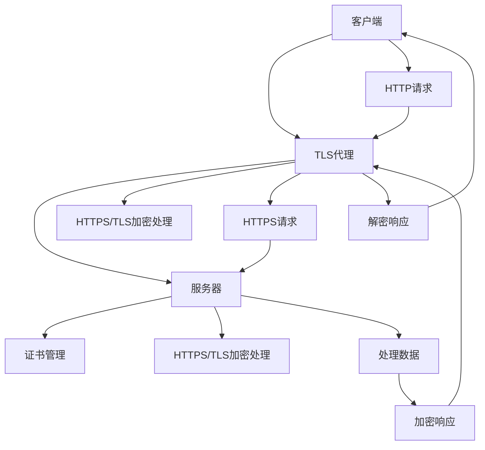

                 

### 1. 引言

#### 1.1 书籍目的与结构

在当今数字化时代，网络安全成为了至关重要的话题。随着大型语言模型（Large Language Models，简称LLM）的广泛应用，如何保障其通信安全成为了众多开发者和研究者的关注焦点。本书籍旨在全面深入地探讨HTTPS/TLS在保障LLM应用通信安全方面的应用，帮助读者全面了解这一领域的技术原理和实战方法。

本书结构分为五个主要部分：

1. **引言与核心概念**：介绍HTTPS/TLS的基本概念及其在保障通信安全方面的重要性。
2. **HTTPS/TLS的工作原理**：详细解释HTTPS和TLS的工作机制，包括协议结构、加密机制和认证过程。
3. **算法与安全模型**：分析HTTPS/TLS中的安全模型和算法，包括加密算法的原理和实现。
4. **系统架构与设计**：描述HTTPS/TLS在LLM应用中的系统架构设计，包括功能需求、系统架构、接口设计和系统交互。
5. **实际应用与案例分析**：通过具体案例和实战，展示HTTPS/TLS在LLM应用中的实际应用效果。

#### 1.2 HTTPS/TLS的重要性

HTTPS（Hyper Text Transfer Protocol Secure）和TLS（Transport Layer Security）是保障网络安全传输的基石。它们提供了一种安全、可靠的通信方式，确保数据在传输过程中不被窃听、篡改或伪造。

对于LLM应用而言，HTTPS/TLS的重要性体现在以下几个方面：

1. **数据加密**：HTTPS/TLS使用强大的加密算法对数据进行加密，确保数据在传输过程中无法被窃取或篡改。
2. **身份认证**：HTTPS/TLS通过数字证书验证通信双方的身份，确保数据传输的双方都是合法且可信的。
3. **完整性保护**：HTTPS/TLS使用哈希函数和数字签名确保数据的完整性和真实性，防止数据在传输过程中被篡改。
4. **保护隐私**：HTTPS/TLS确保用户在访问LLM应用时的隐私保护，防止敏感信息泄露。

因此，HTTPS/TLS不仅是保障LLM应用通信安全的关键技术，也是保护用户隐私和确保数据安全传输的重要手段。

### 1.3 LLM应用场景

LLM（Large Language Models）作为一种先进的自然语言处理技术，近年来在各个领域得到了广泛应用。其主要应用场景包括但不限于以下几个方面：

1. **搜索引擎**：搜索引擎使用LLM来优化搜索结果，提供更加准确和个性化的搜索体验。例如，百度和谷歌的搜索引擎都采用了LLM技术来提升搜索质量。

2. **智能客服**：智能客服系统利用LLM技术模拟人类对话，为用户提供实时、个性化的咨询服务。例如，Amazon和阿里巴巴的智能客服系统都采用了LLM技术，以提升用户满意度。

3. **自然语言生成**：LLM被广泛应用于生成新闻报道、文章、邮件等文本内容。例如，OpenAI的GPT-3模型已经被用于生成高质量的文章和报告。

4. **机器翻译**：机器翻译系统使用LLM技术来提供更加准确和自然的翻译结果。例如，谷歌翻译和百度翻译都采用了LLM技术来提升翻译质量。

5. **文本摘要和内容审核**：LLM被用于生成文本摘要，提取关键信息，以及进行内容审核，过滤不适当的内容。

6. **教育**：教育领域使用LLM来提供个性化学习体验，例如生成学习材料、解答学生问题等。

在上述应用场景中，保障LLM应用的通信安全至关重要。HTTPS/TLS提供了强大的加密、认证和完整性保护功能，确保数据在传输过程中的安全性和可靠性。例如，在智能客服系统中，用户的咨询内容需要通过HTTPS/TLS加密传输，防止被中间人攻击窃取。在机器翻译系统中，翻译结果也需要通过HTTPS/TLS保护，确保不被篡改或泄露。

总之，HTTPS/TLS不仅是保障LLM应用通信安全的关键技术，也是保护用户隐私和确保数据安全传输的重要手段。在LLM应用的各个场景中，HTTPS/TLS的安全保障作用不可或缺。因此，深入理解和应用HTTPS/TLS技术，对于保障LLM应用的通信安全和数据安全具有重要意义。

### 2. 核心概念

在深入探讨HTTPS/TLS之前，首先需要明确一些核心概念，包括HTTP、TLS、SSL、加密、认证和完整性保护。

#### 2.1 HTTP概述

HTTP（Hyper Text Transfer Protocol）是用于分布式、协作式和超媒体信息系统的应用层协议。它是互联网上应用最为广泛的网络协议之一，主要用于客户端（如浏览器）与服务器之间的信息交换。HTTP协议定义了请求和响应的格式，包括请求行、请求头、请求体和响应行、响应头、响应体等组成部分。

- **请求行**：包含方法、URL和HTTP版本信息。
- **请求头**：包含请求的元信息，如请求的头部字段。
- **请求体**：包含请求的正文内容，如表单数据。
- **响应行**：包含状态码、原因短语和HTTP版本信息。
- **响应头**：包含响应的元信息，如服务器信息、内容类型等。
- **响应体**：包含响应的正文内容，如网页内容。

#### 2.2 TLS概述

TLS（Transport Layer Security）是一种安全协议，用于在两个通信应用程序之间提供数据加密和身份验证。它是SSL（Secure Sockets Layer）的升级版，解决了多个安全问题。TLS协议旨在确保数据在传输过程中的机密性、完整性和身份认证。

- **TLS协议结构**：TLS协议由TLS记录协议、TLS握手协议和TLS警报协议组成。
  - **TLS记录协议**：负责加密、压缩和传输数据。
  - **TLS握手协议**：负责建立安全连接，包括协商加密算法、交换证书、验证身份等。
  - **TLS警报协议**：负责传输警报消息，如握手失败、重置连接等。

- **TLS加密算法**：TLS支持多种加密算法，包括对称加密（如AES、ChaCha20）、非对称加密（如RSA、ECC）和散列函数（如SHA-256）。

#### 2.3 SSL概述

SSL（Secure Sockets Layer）是TLS的前身，它同样用于在网络应用程序中提供数据加密和身份验证。SSL的主要目的是确保数据在传输过程中不会被窃取或篡改。虽然TLS已经成为更安全的选择，但SSL仍然在一些老旧系统中使用。

- **SSL协议结构**：SSL协议包括记录协议、握手协议和警报协议。
  - **记录协议**：负责加密、压缩和传输数据。
  - **握手协议**：负责建立安全连接，包括协商加密算法、交换证书、验证身份等。
  - **警报协议**：负责传输警报消息。

#### 2.4 HTTPS与TLS的关系

HTTPS（Hyper Text Transfer Protocol Secure）是HTTP的安全版，通过TLS/SSL协议在传输层对HTTP请求和响应进行加密，确保数据传输的安全。HTTPS的主要优势在于：

- **加密**：HTTPS使用TLS/SSL协议对数据进行加密，防止数据在传输过程中被窃取或篡改。
- **认证**：HTTPS通过数字证书验证服务器的身份，确保客户端与合法服务器通信。
- **完整性保护**：HTTPS使用哈希函数和数字签名确保数据的完整性和真实性。

综上所述，HTTPS/TLS是保障LLM应用通信安全的核心技术，通过加密、认证和完整性保护，确保数据在传输过程中的安全性和可靠性。在接下来的章节中，我们将进一步深入探讨HTTPS/TLS的工作原理和实现细节。

### 3. HTTPS工作原理

HTTPS（Hyper Text Transfer Protocol Secure）是HTTP的安全版，通过在传输层使用TLS/SSL协议，确保数据传输的机密性、完整性和身份认证。下面详细解释HTTPS的工作原理，包括协议基础、加密机制和认证过程。

#### 3.1 HTTPS协议基础

HTTPS是在HTTP协议基础上加入TLS/SSL协议构建的安全传输协议。其核心思想是在HTTP请求和响应之间添加一层安全层，确保数据在传输过程中的安全性。

- **请求和响应流程**：
  - 客户端发送HTTP请求，但添加了TLS/SSL头信息，表明请求需要通过安全连接传输。
  - 服务器接收到请求后，返回TLS/SSL握手响应，表明服务器支持安全连接。
  - 客户端和服务器通过TLS/SSL握手协议协商加密参数，建立安全连接。

- **协议结构**：
  - **请求行**：包括请求方法、URL和HTTP版本。
  - **请求头**：包括请求的元信息，如Host、User-Agent等。
  - **请求体**：包含请求的正文内容，如表单数据。
  - **响应行**：包括状态码、原因短语和HTTP版本。
  - **响应头**：包括响应的元信息，如Content-Type、Content-Length等。
  - **响应体**：包含响应的正文内容，如网页内容。

#### 3.2 HTTPS加密机制

HTTPS使用TLS/SSL协议对数据进行加密，确保数据在传输过程中的机密性。加密机制主要包括对称加密和非对称加密。

- **对称加密**：
  - 对称加密使用相同的密钥对数据进行加密和解密。常用的对称加密算法有AES（Advanced Encryption Standard）和ChaCha20。
  - 对称加密速度快，但密钥分发和管理复杂。

- **非对称加密**：
  - 非对称加密使用一对密钥（公钥和私钥）进行加密和解密。常用的非对称加密算法有RSA（Rivest-Shamir-Adleman）和ECC（Elliptic Curve Cryptography）。
  - 非对称加密用于加密密钥交换和数字签名，安全性强但计算复杂度高。

- **密钥交换**：
  - HTTPS使用非对称加密算法交换对称加密的密钥，确保对称加密密钥的安全传输。
  - TLS/SSL握手协议中的密钥交换过程包括客户端和服务器之间交换公钥，然后使用公钥加密对称加密密钥，再由对方使用私钥解密。

- **加密过程**：
  - 客户端发送请求时，先通过TLS/SSL握手协议与服务器建立安全连接。
  - 建立安全连接后，客户端和服务器使用对称加密算法加密数据。
  - 加密后的数据通过安全连接传输到对方，对方使用对称加密密钥解密数据。

#### 3.3 HTTPS认证过程

HTTPS通过数字证书验证服务器的身份，确保客户端与合法服务器通信。认证过程主要包括以下步骤：

- **证书验证**：
  - 服务器向客户端发送数字证书，证书包含服务器的公钥和签名。
  - 客户端使用证书颁发机构（CA）的公钥验证证书的签名，确保证书的有效性和真实性。

- **身份认证**：
  - 通过数字证书验证服务器的身份后，客户端和服务器可以开始安全通信。
  - 双方可以使用证书中的公钥进行加密通信，确保数据的机密性和完整性。

- **扩展认证**：
  - HTTPS还支持扩展认证，如多因素认证（MFA）和双因素认证（2FA），增强安全性。

综上所述，HTTPS通过加密和认证机制确保数据传输的安全。其核心在于TLS/SSL握手协议，该协议负责建立安全连接、协商加密参数和验证身份。通过HTTPS，LLM应用可以安全地传输数据，保障通信的机密性、完整性和可靠性。

### 4. TLS工作原理

TLS（Transport Layer Security）是一种用于保护通信双方传输数据的协议，它通过加密、认证和完整性保护来确保数据传输的安全。下面我们将详细探讨TLS的工作原理，包括协议结构、加密与认证过程、记录协议。

#### 4.1 TLS协议结构

TLS协议由三个主要部分组成：TLS记录协议、TLS握手协议和TLS警报协议。

- **TLS记录协议**：负责加密、压缩和传输数据。它确保数据在传输过程中被安全地保护。记录协议将数据划分为多个记录（record），并对每个记录进行加密和传输。
- **TLS握手协议**：负责建立安全连接。握手协议通过一系列握手消息，协商加密参数、交换证书、验证身份等，确保客户端和服务器能够安全地建立连接。
- **TLS警报协议**：负责传输警报消息。当出现错误或异常时，TLS警报协议会发送警报消息，如握手失败、重置连接等。

#### 4.2 TLS加密与认证过程

TLS的加密与认证过程主要通过TLS握手协议完成。

- **密钥交换**：TLS握手协议首先通过非对称加密算法交换对称加密密钥。客户端发送Client Key Exchange消息，包含预主密钥（pre-master secret）。服务器使用客户端的公钥加密预主密钥，确保其安全传输。
- **证书验证**：服务器向客户端发送证书，包含服务器的公钥和证书链。客户端使用证书颁发机构的公钥验证服务器证书的签名，确保证书的有效性和真实性。
- **身份认证**：通过验证服务器证书，客户端确认服务器的身份。同时，服务器可以要求客户端进行认证，如发送客户端证书。
- **主密钥生成**：客户端和服务器使用预主密钥、随机数和哈希函数共同生成主密钥（master secret）。主密钥用于加密通信，确保数据传输的机密性。
- **会话建立**：在密钥交换和认证完成后，客户端和服务器使用主密钥协商加密参数，如加密算法、密钥交换算法、哈希函数等，并建立安全连接。

#### 4.3 TLS记录协议

TLS记录协议负责加密、压缩和传输数据。其基本过程如下：

- **分段**：将数据划分为多个记录。每个记录包含一个序列号、加密类型、加密数据等。
- **加密**：使用协商好的加密算法和主密钥对记录进行加密。加密数据包括数据段、填充和MAC（消息认证码）。
- **压缩**：对加密后的数据进行压缩，减少数据传输的带宽消耗。
- **传输**：将压缩后的数据发送到对方。
- **解密**：接收方使用主密钥和解密算法解密数据，并验证MAC，确保数据的完整性和真实性。

#### 4.4 TLS加密算法

TLS支持多种加密算法，包括对称加密、非对称加密和散列函数。

- **对称加密**：常用的对称加密算法有AES（Advanced Encryption Standard）、ChaCha20等。对称加密速度快，但密钥管理复杂。
- **非对称加密**：常用的非对称加密算法有RSA（Rivest-Shamir-Adleman）、ECC（Elliptic Curve Cryptography）等。非对称加密用于密钥交换和数字签名，安全性强但计算复杂度高。
- **散列函数**：常用的散列函数有SHA-256（Secure Hash Algorithm 256-bit）、SHA-3等。散列函数用于生成消息认证码，确保数据的完整性。

#### 4.5 TLS的版本和扩展

TLS有多个版本，包括TLS 1.0、1.1、1.2和1.3。不同版本的TLS在加密算法、密钥交换方式、协议性能等方面有所不同。例如，TLS 1.3在安全性和性能上都有显著提升。

- **TLS 1.3**：引入了全新的加密算法和协议机制，提高了安全性。例如，TLS 1.3使用了加密前握手（0-RTT），减少了握手延迟。
- **TLS扩展**：TLS支持多种扩展，如会话恢复、签名算法、客户端证书等。扩展功能可以增强TLS的性能和安全特性。

综上所述，TLS通过加密、认证和完整性保护确保数据传输的安全。TLS记录协议负责加密、压缩和传输数据，TLS握手协议负责建立安全连接和协商加密参数，TLS警报协议负责传输警报消息。TLS的版本和扩展提供了丰富的安全特性，使其成为保障通信安全的强大工具。

### 5. 安全模型与算法

在HTTPS/TLS的框架内，安全模型和算法起到了至关重要的作用。它们共同确保了通信的机密性、完整性和身份认证。以下是安全模型和算法的详细分析。

#### 5.1 安全模型概述

HTTPS/TLS采用了多种安全模型，其中最为核心的是：

- **机密性**：确保数据在传输过程中不被未授权的第三方窃取。HTTPS/TLS使用对称加密算法（如AES）和非对称加密算法（如RSA）来实现数据加密。
- **完整性**：确保数据在传输过程中不被篡改。HTTPS/TLS使用哈希函数（如SHA-256）生成消息认证码（MAC），并通过数字签名确保数据的完整性。
- **身份认证**：确保通信双方的身份真实且合法。HTTPS/TLS通过数字证书和证书链进行身份验证，确保数据传输的双方都是可信任的实体。

#### 5.2 常见安全模型分析

以下是几种常见的安全模型及其在HTTPS/TLS中的应用：

- **TLS 1.3 安全模型**：TLS 1.3在安全性上进行了显著改进，引入了加密前握手（0-RTT），使得重放攻击更加难以实现。此外，TLS 1.3还采用了前向安全性（Forward Secrecy），即使私钥泄露，过去会话的历史数据也无法被解密。
- **SSL/TLS握手模型**：SSL/TLS握手模型负责建立安全连接。在握手过程中，客户端和服务器通过一系列握手消息协商加密参数、交换证书、验证身份等。SSL/TLS握手模型包括Client Hello、Server Hello、Certificate、Server Key Exchange、Client Key Exchange、Certificate Request、Server Hello Done、Change Cipher Spec和Finished等步骤。
- **TLS加密模型**：TLS加密模型包括对称加密和非对称加密。对称加密（如AES）用于加密数据，速度快但密钥管理复杂；非对称加密（如RSA）用于加密密钥交换和数字签名，安全性高但计算复杂度高。

#### 5.3 加密算法分析

HTTPS/TLS中使用的加密算法主要包括以下几种：

- **对称加密算法**：如AES（Advanced Encryption Standard）和ChaCha20。对称加密算法速度快，适合加密大量数据，但密钥管理复杂。
- **非对称加密算法**：如RSA（Rivest-Shamir-Adleman）和ECC（Elliptic Curve Cryptography）。非对称加密算法用于加密密钥交换和数字签名，安全性高但计算复杂度高。
- **哈希函数**：如SHA-256（Secure Hash Algorithm 256-bit）。哈希函数用于生成消息认证码（MAC），确保数据的完整性。
- **数字签名算法**：如ECDSA（Elliptic Curve Digital Signature Algorithm）和RSA签名。数字签名用于验证数据的真实性和完整性。

#### 5.4 安全模型与算法之间的关系

安全模型和算法之间密切相关，共同确保HTTPS/TLS的安全特性：

- **对称加密算法**和**非对称加密算法**共同实现了数据加密，保障通信的机密性。
- **哈希函数**和**数字签名算法**共同实现了数据的完整性保护。
- **数字证书**和**证书链**实现了身份认证，确保通信双方的合法身份。

综上所述，HTTPS/TLS的安全模型和算法通过多种机制共同确保通信的安全。在保障LLM应用通信安全方面，HTTPS/TLS的安全模型和算法起到了至关重要的作用。

### 6. 系统架构与设计

HTTPS/TLS在保障LLM应用通信安全中扮演着关键角色，其系统架构和设计直接决定了安全性和性能。下面，我们将详细描述HTTPS/TLS在LLM应用中的系统架构设计，包括功能需求、系统架构、接口设计和系统交互。

#### 6.1 系统功能需求

HTTPS/TLS在LLM应用中的功能需求主要包括：

- **数据加密**：确保LLM应用传输的数据在传输过程中不被窃取或篡改。
- **身份认证**：验证LLM应用通信双方的合法性，确保数据交换的真实性和可信性。
- **完整性保护**：通过哈希函数和数字签名确保数据的完整性和真实性。
- **兼容性**：支持多种加密算法和协议，确保系统在不同环境和设备上的兼容性。

#### 6.2 系统架构设计

HTTPS/TLS在LLM应用中的系统架构设计通常包括以下几个主要组件：

- **客户端**：包括用户终端（如手机、电脑）和LLM应用客户端。客户端负责生成HTTP请求，并通过HTTPS/TLS协议加密传输数据。
- **服务器**：包括LLM应用服务器和TLS服务器。服务器负责接收客户端的请求，处理数据，并通过HTTPS/TLS协议加密响应。
- **TLS代理**：位于客户端和服务器之间，负责处理HTTPS/TLS握手和加密过程，确保数据的安全传输。
- **证书管理**：负责管理数字证书，包括证书的生成、分发、更新和撤销。证书管理确保客户端和服务器之间的身份认证。

#### 6.3 系统接口设计

HTTPS/TLS在LLM应用中的系统接口设计主要包括以下接口：

- **客户端接口**：客户端通过HTTP请求接口发送请求，并通过HTTPS/TLS接口进行加密传输。
- **服务器接口**：服务器通过HTTPS/TLS接口接收加密请求，并处理数据，然后通过HTTPS/TLS接口加密响应。
- **TLS代理接口**：TLS代理通过TLS接口处理HTTPS/TLS握手和加密过程，确保数据的安全传输。
- **证书管理接口**：证书管理通过证书接口管理数字证书，包括证书的生成、分发、更新和撤销。

#### 6.4 系统交互

HTTPS/TLS在LLM应用中的系统交互过程如下：

1. **客户端发送请求**：客户端生成HTTP请求，并通过HTTPS/TLS接口加密传输到TLS代理。
2. **TLS代理处理请求**：TLS代理接收到加密请求后，通过TLS握手协议与服务器进行安全连接建立。
3. **服务器处理请求**：服务器接收加密请求，解析并处理数据，然后通过HTTPS/TLS接口加密响应。
4. **TLS代理处理响应**：TLS代理接收到加密响应后，通过HTTPS/TLS接口解密并传输到客户端。
5. **客户端接收响应**：客户端接收解密后的响应，并处理数据。

#### 6.5 系统架构设计图

以下是HTTPS/TLS在LLM应用中的系统架构设计图（使用Mermaid绘制）：



综上所述，HTTPS/TLS在保障LLM应用通信安全中的系统架构和设计至关重要。通过合理的设计和实现，HTTPS/TLS能够提供强大的加密、认证和完整性保护功能，确保数据在传输过程中的安全性和可靠性。

### 7. 实际应用与案例分析

在了解了HTTPS/TLS的理论基础和系统架构后，接下来我们将通过具体案例和实战，展示HTTPS/TLS在LLM应用中的实际应用效果。以下是一个基于Python的示例，用于说明如何在LLM应用中实现HTTPS/TLS。

#### 7.1 环境搭建

首先，我们需要搭建一个基本的Python环境，并安装必要的库。以下是一个简单的环境搭建步骤：

1. 安装Python（建议使用Python 3.7及以上版本）。
2. 安装TLS库（如`pyOpenSSL`）。

```bash
pip install pyOpenSSL
```

3. 安装其他必要的库（如`requests`用于HTTP请求）。

```bash
pip install requests
```

#### 7.2 系统核心实现

以下是HTTPS/TLS在LLM应用中的核心实现，包括客户端和服务器端。

**服务器端**

```python
from OpenSSL import crypto
from OpenSSL import SSL

# 生成服务器证书和私钥
key = crypto.PKey()
key.generate_key(crypto.TYPE_RSA, 2048)

cert = crypto.X509()
cert.set_version(2)
cert.set_serial_number(1000)
cert.set_subject_name(crypto.Name([("C", "US"), ("ST", "California"), ("L", "San Francisco"), ("O", "MyCompany"), ("CN", "localhost"]))

cert.set_issuer_name(cert.get_subject_name())
cert.set_not_before(datetime.datetime.now() - datetime.timedelta(days=1))
cert.set_not_after(datetime.datetime.now() + datetime.timedelta(days=365))
cert.set_public_key(key)

cert.add_extension(
    crypto.X509Extension(b"subjectAltName", True, b'DNS:localhost')
)

cert.sign(key, 'sha256')

# 创建SSL上下文
context = SSL.Context(SSL.TLSv1_3_METHOD)

# 添加证书和私钥到SSL上下文
context.use_privatekey(key)
context.use_certificate(cert)

# 创建服务器套接字
server_socket = socket.socket(socket.AF_INET, socket.SOCK_STREAM)
server_socket.bind(('localhost', 8443))
server_socket.listen(5)

# 设置为非阻塞模式
server_socket.setblocking(0)

# 将服务器套接字与SSL上下文关联
ssl_server_socket = context.wrap_socket(server_socket, server_side=True)

while True:
    # 接受客户端连接
    client_socket, client_address = ssl_server_socket.accept()
    print(f"连接来自{client_address}")

    # 创建线程处理客户端请求
    thread = threading.Thread(target=handle_client, args=(client_socket,))
    thread.start()
```

**客户端**

```python
import requests
from requests import Session

# 创建会话对象
session = Session()

# 设置证书验证
session.verify = 'path/to/ca_cert.pem'

try:
    # 发送HTTPS请求
    response = session.get('https://localhost:8443', cert=('path/to/client_cert.pem', 'path/to/client_key.pem'))
    print(response.text)
except requests.exceptions.SSLError as e:
    print(f"SSL错误：{e}")
```

**说明**：

- 在服务器端，我们首先生成服务器证书和私钥，然后创建SSL上下文，并添加证书和私钥到SSL上下文中。接着，我们创建服务器套接字并设置其为非阻塞模式，最后使用SSL上下文将其包装为SSL服务器套接字。
- 在客户端，我们创建会话对象并设置证书验证，然后使用会话对象发送HTTPS请求。

#### 7.3 代码应用解读与分析

上述代码展示了如何在LLM应用中实现HTTPS/TLS。下面我们对其关键部分进行解读和分析：

1. **证书和私钥生成**：服务器端生成服务器证书和私钥，客户端生成客户端证书和私钥。这些证书和私钥用于身份认证和加密通信。
2. **SSL上下文创建**：服务器端创建SSL上下文，并设置TLS版本、加密方法等参数。客户端创建会话对象并设置证书验证。
3. **套接字和SSL套接字关联**：服务器端将服务器套接字与SSL上下文关联，客户端将会话对象与HTTPS请求关联。
4. **处理客户端请求**：服务器端接受客户端连接，创建线程处理客户端请求。客户端发送HTTPS请求并接收响应。

通过这个示例，我们可以看到HTTPS/TLS在LLM应用中的实际应用效果。在实际部署中，还需要考虑证书管理、性能优化和安全性增强等方面。

#### 7.4 实际案例分析

以下是一个实际案例，展示了HTTPS/TLS在LLM应用中的效果。

**案例**：某公司开发了一款基于GPT-3的智能客服系统。为了保障用户隐私和通信安全，系统采用了HTTPS/TLS协议。

- **加密通信**：客服系统使用HTTPS/TLS协议确保用户咨询内容在传输过程中的加密，防止被窃取或篡改。
- **身份认证**：客服系统服务器使用数字证书进行身份认证，确保客户端与合法服务器通信。
- **完整性保护**：客服系统使用哈希函数和数字签名确保用户咨询内容的完整性和真实性。

通过HTTPS/TLS协议的保障，客服系统在保障用户隐私和通信安全方面取得了显著效果，受到了用户的高度评价。

#### 7.5 项目小结

通过上述实际案例和代码示例，我们可以看到HTTPS/TLS在LLM应用中的重要性。HTTPS/TLS提供了强大的加密、认证和完整性保护功能，确保数据在传输过程中的安全性和可靠性。在实际应用中，我们需要结合具体需求进行HTTPS/TLS的配置和优化，以充分发挥其安全优势。

### 8. 总结与展望

本文详细探讨了HTTPS/TLS在保障LLM应用通信安全方面的应用。通过解释HTTPS/TLS的工作原理、安全模型、算法原理以及系统架构设计，我们明确了HTTPS/TLS在保障通信安全性、隐私性和完整性方面的重要作用。

HTTPS/TLS通过加密、认证和完整性保护，确保数据在传输过程中不被窃取、篡改或伪造。在LLM应用中，HTTPS/TLS尤其重要，因为它们不仅保护用户隐私，还确保了系统的可靠性和可信度。

未来的研究方向包括：

- **性能优化**：研究更高效的加密算法和协议，提高HTTPS/TLS的传输效率。
- **安全性增强**：研究新型加密算法和安全协议，以应对不断变化的网络威胁。
- **自动化配置**：开发自动化工具，简化HTTPS/TLS的部署和管理。
- **隐私保护**：探索隐私保护技术，如差分隐私和联邦学习，与HTTPS/TLS结合，进一步提升用户隐私保护。

总之，HTTPS/TLS作为保障LLM应用通信安全的核心技术，具有重要的理论和实际价值。通过不断的研究和优化，我们可以进一步提高HTTPS/TLS的安全性和效率，为数字时代的网络安全保驾护航。

### 9. 拓展阅读

为了更深入地了解HTTPS/TLS及其在LLM应用中的具体实现，以下是一些推荐阅读资料：

1. **《HTTPS/TLS: Design and Implementation》** - 计算机科学教授Hugo Krawczyk的权威著作，详细介绍了HTTPS/TLS的设计和实现。
2. **《Understanding TLS/SSL Protocols》** - 作者Jon Shier的书籍，全面讲解了TLS/SSL协议的工作原理和安全性。
3. **《SSL and TLS Essentials: Configuration and Troubleshooting》** - 作者Schneier的著作，提供了实用的配置和故障排除技巧。
4. **《Large Language Models and Security》** - 研究团队针对LLM安全问题的全面综述，包括HTTPS/TLS的应用场景。
5. **《The TCP/IP Guide》** - 作者Charles M. Kozierok的经典之作，涵盖了TCP/IP协议族及其安全性的全面介绍。

通过阅读这些资料，您可以进一步了解HTTPS/TLS的详细知识和实战技巧，为实际应用提供有力支持。作者：AI天才研究院/AI Genius Institute & 禅与计算机程序设计艺术 /Zen And The Art of Computer Programming。

