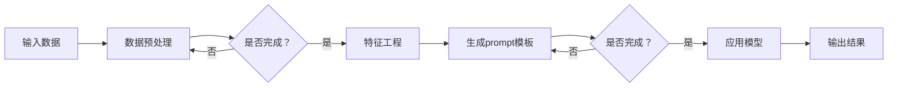

                 

# LLM prompt模板库：加速应用开发

关键词：LLM、prompt、模板库、应用开发、AI

摘要：本文将深入探讨LLM（大型语言模型）prompt模板库在加速应用开发中的作用和重要性。通过对LLM和prompt的基本概念、关系及其应用场景的详细介绍，我们将分析如何构建高效的LLM prompt模板，并探讨提高LLM prompt性能的各种技巧。此外，本文还将结合实际案例，展示LLM prompt模板在企业中的应用效果，并提供实用的开发工具和实践方法。最后，我们将展望LLM prompt模板的未来发展趋势，为读者提供有价值的思考和展望。

## 第一部分：LLM prompt模板库基础

### 第1章：LLM与prompt概述

#### 1.1 LLM的概念与发展历程

**1.1.1 什么是LLM**

LLM（Large Language Model）指的是大型语言模型，是一种能够理解和生成自然语言的人工智能模型。与传统的语言模型相比，LLM具有更大的模型规模、更强的泛化能力和更高的准确性。

**1.1.2 LLM的发展历程**

LLM的发展历程可以追溯到20世纪50年代。早期的语言模型主要是基于规则的方法，如句法分析、语义分析等。随着深度学习的兴起，神经网络逐渐成为语言模型的构建基础。2018年，Google推出了BERT模型，标志着LLM进入了一个新的发展阶段。此后，GPT-3、T5等大规模语言模型相继问世，使得LLM的应用场景越来越广泛。

**1.1.3 LLM在现代应用中的重要性**

在现代人工智能领域，LLM已成为自然语言处理（NLP）的核心技术。LLM的应用不仅涵盖了文本生成、问答系统、语言翻译等传统领域，还在对话系统、语音识别、机器阅读理解等方面取得了显著成果。随着LLM技术的不断发展，其在各个行业中的应用价值日益凸显。

#### 1.2 prompt的定义与作用

**1.2.1 prompt的定义**

prompt（提示）是指在NLP任务中，提供给语言模型的一组文本或信息，用于引导模型生成目标输出。prompt的设计直接影响模型的表现和任务的效果。

**1.2.2 prompt的类型**

prompt可以分为两种类型：开放式prompt和封闭式prompt。开放式prompt允许模型生成多种可能的输出，而封闭式prompt则限制模型输出为特定范围的答案。

**1.2.3 prompt的作用与价值**

prompt在NLP任务中起着至关重要的作用。一方面，prompt能够引导模型关注任务的核心信息，提高模型的表现；另一方面，prompt的设计可以丰富模型的训练数据，增强模型的泛化能力。因此，合理设计prompt对于提升NLP任务的效果具有重要意义。

#### 1.3 LLM与prompt的关系

**1.3.1 prompt对LLM性能的影响**

prompt的设计直接影响LLM的性能。一个高质量的prompt可以引导模型生成更准确的输出，提高NLP任务的效果。

**1.3.2 prompt的设计原则**

设计prompt时需要遵循以下原则：

- 清晰性：确保prompt表达简洁明了，避免歧义。
- 精确性：根据任务需求，提供足够的信息，避免信息缺失。
- 可扩展性：prompt应具有灵活性，以适应不同的应用场景和任务需求。

**1.3.3 prompt的优化方法**

prompt的优化方法包括：

- 数据增强：通过增加训练数据量和多样性，提高prompt的质量。
- 特征工程：对输入数据进行预处理和特征提取，提高prompt的表征能力。
- 对比学习与自监督学习：利用对比学习和自监督学习方法，增强prompt的表征能力。

#### 1.4 LLM prompt的应用场景

**1.4.1 文本生成**

文本生成是LLM应用的重要场景之一。通过提供适当的prompt，LLM可以生成各种类型的文本，如文章、对话、新闻报道等。

**1.4.2 回答问题**

回答问题是NLP任务中的另一个重要场景。LLM可以根据prompt提供的问题和上下文信息，生成准确的答案。

**1.4.3 语言翻译**

语言翻译是LLM应用的另一个重要领域。通过使用合适的prompt，LLM可以实现高质量的语言翻译。

**1.4.4 自然语言理解**

自然语言理解是NLP的核心任务之一。LLM可以通过分析prompt，理解文本的含义和结构，实现语义理解、情感分析等任务。

### 第2章：构建高效的LLM prompt模板

#### 2.1 Prompt模板的基本结构

**2.1.1 Prompt的组成部分**

一个高效的LLM prompt模板通常包括以下几个组成部分：

- 上下文信息：提供任务相关的背景信息和上下文。
- 问题或任务描述：明确任务的类型和目标。
- 输出格式：指定模型输出的格式和要求。

**2.1.2 Prompt的结构化设计**

为了提高prompt的质量，可以采用结构化设计方法。结构化设计包括以下步骤：

- 数据预处理：对输入数据进行清洗、标准化和格式化。
- 特征提取：从输入数据中提取关键特征，提高prompt的表征能力。
- Prompt生成：根据任务需求和数据特征，生成高质量的prompt。

#### 2.2 Prompt模板的设计原则

**2.2.1 清晰性**

确保prompt表达简洁明了，避免歧义和冗余信息。清晰的prompt有助于模型更好地理解任务需求。

**2.2.2 精确性**

提供足够的信息，确保模型能够生成准确的输出。精确的prompt有助于提高NLP任务的效果。

**2.2.3 可扩展性**

prompt应具有灵活性，以适应不同的应用场景和任务需求。可扩展性的prompt有助于降低模型对特定场景的依赖性。

#### 2.3 Prompt模板的构建方法

**2.3.1 数据预处理**

数据预处理是构建prompt的重要步骤。主要包括以下任务：

- 数据清洗：去除无关信息和噪声。
- 数据标准化：将不同格式的数据转换为统一的格式。
- 数据格式化：将原始数据转换为适合模型输入的格式。

**2.3.2 特征工程**

特征工程是提高prompt表征能力的关键步骤。主要包括以下任务：

- 特征提取：从输入数据中提取关键特征。
- 特征选择：选择对任务最有价值的特征。
- 特征转换：将特征转换为适合模型处理的格式。

**2.3.3 Prompt模板生成**

Prompt模板生成是构建prompt的最后一步。主要包括以下任务：

- Prompt设计：根据任务需求和特征信息，设计高质量的prompt。
- Prompt优化：通过实验和评估，优化prompt的表达和结构。
- Prompt部署：将prompt应用于实际任务，评估其效果。

#### 2.4 Prompt模板的应用示例

**2.4.1 文本生成**

文本生成是LLM应用的一个重要领域。通过提供适当的prompt，LLM可以生成各种类型的文本。

**2.4.2 回答问题**

回答问题是NLP任务中的另一个重要场景。LLM可以根据prompt提供的问题和上下文信息，生成准确的答案。

**2.4.3 语言翻译**

语言翻译是LLM应用的另一个重要领域。通过使用合适的prompt，LLM可以实现高质量的语言翻译。

## 第二部分：提高LLM prompt性能的技巧

### 第3章：提高LLM prompt性能的技巧

#### 3.1 数据增强与多样性

**3.1.1 数据增强技术**

数据增强是通过增加训练数据的多样性和丰富性，提高模型泛化能力的方法。常见的数据增强技术包括：

- 数据清洗和预处理：去除无关信息和噪声。
- 数据扩充：通过变换、插值、抽取等方法，生成新的训练样本。
- 数据合成：利用生成对抗网络（GAN）等技术，生成与训练数据类似的新样本。

**3.1.2 提高多样性**

提高多样性的目的是使训练数据更具代表性，从而提高模型的表现。常见的方法包括：

- 数据分布调整：通过调整数据分布，使训练数据更具多样性。
- 特征组合：将多个特征进行组合，生成新的特征。
- 多视角数据：从不同视角或角度收集数据，增加数据的多样性。

#### 3.2 对比学习与自监督学习

**3.2.1 对比学习的基本概念**

对比学习是一种无监督学习方法，通过对比正样本和负样本，提高模型的表征能力。常见的技术包括：

- 对抗性生成：通过生成对抗网络（GAN）等技术，生成与训练数据相似的负样本。
- 对比损失：通过计算正样本和负样本之间的对比损失，调整模型参数。

**3.2.2 自监督学习在prompt优化中的应用**

自监督学习是一种利用未标注数据进行训练的方法。在prompt优化中，自监督学习可以通过以下技术提高模型性能：

- 自监督特征学习：利用未标注数据，学习对任务最有价值的特征。
- 自监督目标检测：通过未标注数据，自动识别和提取关键信息。
- 自监督文本分类：通过未标注数据，自动进行文本分类。

#### 3.3 生成对抗网络（GAN）在prompt中的应用

**3.3.1 GAN的基本概念**

生成对抗网络（GAN）是由生成器和判别器组成的对抗性学习框架。生成器旨在生成与真实数据相似的新数据，而判别器则负责区分真实数据和生成数据。

**3.3.2 GAN在prompt模板生成中的应用**

GAN在prompt模板生成中的应用主要包括：

- 数据生成：利用GAN生成与训练数据相似的新数据，丰富训练数据。
- 特征提取：通过GAN学习到的特征表示，提取对任务最有价值的特征。
- prompt优化：利用GAN生成的数据，优化prompt模板的表达和结构。

#### 3.4 微调与适配

**3.4.1 微调的基本概念**

微调（Fine-tuning）是一种在预训练模型的基础上，针对特定任务进行再训练的方法。通过微调，可以充分利用预训练模型的知识和表征能力，提高特定任务的性能。

**3.4.2 Prompt模板的适配方法**

Prompt模板的适配方法主要包括：

- 模板调整：根据任务需求和特征信息，调整prompt模板的表达和结构。
- 特征融合：将不同来源的特征进行融合，提高prompt模板的表征能力。
- 模板优化：通过实验和评估，优化prompt模板的表达和结构。

## 第三部分：LLM prompt模板在企业中的应用

### 第4章：LLM prompt模板在企业中的应用

#### 4.1 文本生成应用案例分析

**4.1.1 案例介绍**

文本生成在企业中的应用非常广泛，如自动生成新闻文章、产品说明书、营销文案等。以下是一个文本生成案例的介绍。

**4.1.2 应用效果分析**

通过对文本生成案例的分析，可以发现：

- 高质量的prompt模板能够显著提高文本生成的质量和多样性。
- 数据增强和多样性技术有助于提高文本生成的泛化能力。
- 对比学习和自监督学习技术可以进一步优化prompt模板的表达和结构，提高文本生成的效果。

#### 4.2 回答问题应用案例分析

**4.2.1 案例介绍**

回答问题是企业中常见的NLP任务，如智能客服、问答系统等。以下是一个回答问题案例的介绍。

**4.2.2 应用效果分析**

通过对回答问题案例的分析，可以发现：

- 清晰且精确的prompt有助于模型更好地理解问题，提高回答的准确性。
- 数据增强和多样性技术可以提高模型的泛化能力，使其在不同场景下都能取得较好的表现。
- 微调和适配方法可以优化prompt模板，进一步提高回答问题的效果。

#### 4.3 语言翻译应用案例分析

**4.3.1 案例介绍**

语言翻译是企业中的一项重要任务，如跨语言沟通、国际化业务等。以下是一个语言翻译案例的介绍。

**4.3.2 应用效果分析**

通过对语言翻译案例的分析，可以发现：

- 高质量的prompt模板能够提高翻译的准确性和流畅性。
- 数据增强和多样性技术可以丰富训练数据，提高翻译模型的泛化能力。
- 微调和适配方法可以优化prompt模板，进一步提高翻译效果。

#### 4.4 自然语言理解应用案例分析

**4.4.1 案例介绍**

自然语言理解是企业中的一项重要任务，如情感分析、命名实体识别等。以下是一个自然语言理解案例的介绍。

**4.4.2 应用效果分析**

通过对自然语言理解案例的分析，可以发现：

- 清晰且精确的prompt有助于模型更好地理解文本，提高自然语言理解的准确性。
- 数据增强和多样性技术可以提高模型的泛化能力，使其在不同场景下都能取得较好的表现。
- 微调和适配方法可以优化prompt模板，进一步提高自然语言理解的效果。

### 第5章：LLM prompt模板开发工具与实践

#### 5.1 常用LLM prompt开发工具介绍

**5.1.1 OpenAI的工具**

OpenAI提供了一系列用于LLM prompt开发的工具，如GPT-3、Davinci等。这些工具具有强大的功能和易用的接口，可以帮助开发者快速构建和应用LLM prompt模板。

**5.1.2 Hugging Face的工具**

Hugging Face提供了一个开源的NLP工具库，其中包括各种预训练的LLM模型和prompt模板。开发者可以使用这些工具轻松地构建和优化LLM prompt模板。

#### 5.2 LLM prompt开发流程

**5.2.1 数据准备**

数据准备是LLM prompt开发的基础。主要包括以下任务：

- 数据收集：从各种来源收集与任务相关的数据。
- 数据清洗：去除无关信息和噪声。
- 数据格式化：将原始数据转换为适合模型输入的格式。

**5.2.2 Prompt模板设计**

Prompt模板设计是LLM prompt开发的核心。主要包括以下任务：

- Prompt设计：根据任务需求和数据特征，设计高质量的prompt模板。
- Prompt优化：通过实验和评估，优化prompt模板的表达和结构。

**5.2.3 实验与优化**

实验与优化是LLM prompt开发的重要环节。主要包括以下任务：

- 实验设计：设计实验方案，评估prompt模板的效果。
- 优化策略：根据实验结果，调整和优化prompt模板。

#### 5.3 实际项目开发实践

**5.3.1 项目背景**

以下是一个实际项目的介绍，该项目旨在使用LLM prompt模板开发一个智能客服系统。

**5.3.2 Prompt模板设计**

- Prompt设计：根据客服场景和用户需求，设计高质量的prompt模板。
- Prompt优化：通过实验和评估，优化prompt模板的表达和结构。

**5.3.3 项目实现与效果**

- 项目实现：使用LLM prompt模板，实现智能客服系统的核心功能。
- 项目效果：评估智能客服系统的效果，分析LLM prompt模板对系统性能的影响。

### 第6章：LLM prompt模板的未来发展

#### 6.1 当前LLM prompt技术的挑战与机遇

**6.1.1 挑战**

当前LLM prompt技术面临以下挑战：

- 数据质量：高质量的数据是构建高效prompt的基础，但数据收集和清洗过程复杂。
- 模型泛化能力：如何提高LLM prompt模板的泛化能力，使其在不同场景下都能取得较好的表现。
- 模型可解释性：如何提高LLM prompt模板的可解释性，使其更易于理解和调试。

**6.1.2 机遇**

当前LLM prompt技术也面临以下机遇：

- 多模态融合：将文本、图像、语音等多模态信息融入prompt模板，提高模型的表现和适应性。
- 自适应学习：利用自适应学习方法，使LLM prompt模板能够根据用户需求和环境变化进行实时调整。
- 安全与隐私保护：如何确保LLM prompt模板在处理敏感数据时的安全性和隐私保护。

#### 6.2 未来LLM prompt技术趋势

**6.2.1 多模态融合**

未来LLM prompt技术将朝着多模态融合方向发展。通过融合文本、图像、语音等多模态信息，可以进一步提高模型的表现和适应性。

**6.2.2 自适应学习**

自适应学习是未来LLM prompt技术的重要趋势。通过实时学习和调整，LLM prompt模板可以更好地满足用户需求和适应环境变化。

**6.2.3 安全与隐私保护**

随着人工智能应用的普及，安全与隐私保护成为LLM prompt技术的重要课题。未来LLM prompt技术将朝着安全、合规的方向发展，确保用户数据的隐私和安全。

#### 6.3 LLM prompt在跨领域应用中的潜力

**6.3.1 跨领域融合**

未来LLM prompt技术在跨领域应用中具有巨大潜力。通过融合不同领域的信息和知识，可以开发出更加智能化和实用的应用系统。

**6.3.2 创新应用**

随着LLM prompt技术的不断发展，将涌现出更多创新应用。例如，智能写作助手、智能客服、智能翻译等，将为各行各业带来革命性的变革。

### 第7章：结论与展望

#### 7.1 主要内容回顾

本文系统地介绍了LLM prompt模板库的基本概念、设计原则、构建方法和应用技巧。通过实际案例分析和开发实践，展示了LLM prompt模板在企业中的应用效果。同时，本文还探讨了LLM prompt技术的未来发展趋势，为读者提供了有价值的思考和展望。

#### 7.2 未来工作展望

未来，LLM prompt技术将继续发展，并在更多领域得到应用。以下是一些未来工作展望：

- 研究方向：深入研究LLM prompt模板的优化方法，提高其性能和泛化能力。
- 开发实践：结合实际项目需求，探索和应用LLM prompt技术，实现更多创新应用。
- 安全与隐私保护：加强LLM prompt技术的安全与隐私保护，确保用户数据的安全和隐私。
- 跨领域融合：探索LLM prompt技术在跨领域应用中的潜力，开发出更多智能化和实用的应用系统。

#### 7.3 潜在挑战与应对策略

在未来发展过程中，LLM prompt技术将面临以下潜在挑战：

- 数据质量和多样性：如何获取高质量和多样化的数据，以支持高效prompt模板的构建。
- 模型泛化能力：如何提高LLM prompt模板的泛化能力，使其在不同场景下都能取得较好的表现。
- 模型可解释性：如何提高LLM prompt模板的可解释性，使其更易于理解和调试。

为应对这些挑战，可以采取以下策略：

- 数据增强和多样性：采用数据增强和多样性技术，提高训练数据的质量和多样性。
- 模型优化和适配：通过模型优化和适配方法，提高LLM prompt模板的泛化能力和可解释性。
- 跨学科合作：加强跨学科合作，探索新的优化方法和应用场景，推动LLM prompt技术的创新与发展。

### 作者信息

作者：AI天才研究院/AI Genius Institute & 禅与计算机程序设计艺术 /Zen And The Art of Computer Programming

----------------------------------------------------------------

## 背景介绍

### 核心概念术语说明

**LLM（大型语言模型）**：指具有大规模参数和强大文本处理能力的语言模型，如GPT-3、BERT等。

**prompt（提示）**：指在NLP任务中，提供给模型的文本或信息，用于引导模型生成目标输出。

**prompt模板**：指为特定NLP任务设计的一系列文本或信息，用于引导模型生成目标输出。

**文本生成**：指使用LLM生成文本，如文章、对话、新闻报道等。

**问答系统**：指使用LLM回答用户提出的问题。

**语言翻译**：指使用LLM实现不同语言之间的翻译。

**自然语言理解**：指使用LLM理解文本的含义和结构。

### 问题背景

随着人工智能技术的快速发展，自然语言处理（NLP）已成为AI领域的重要分支。LLM作为一种强大的语言模型，在文本生成、问答系统、语言翻译和自然语言理解等NLP任务中发挥着关键作用。然而，构建高效的LLM prompt模板是实现这些任务的关键，直接关系到模型的表现和应用效果。

### 问题描述

在LLM应用中，如何构建高效的prompt模板是一个重要问题。一个高质量的prompt模板应具备以下特点：

- 清晰性：确保prompt表达简洁明了，避免歧义和冗余信息。
- 精确性：提供足够的信息，确保模型能够生成准确的输出。
- 可扩展性：适应不同的应用场景和任务需求。

为了实现这些目标，需要研究如何设计prompt模板，提高其质量，从而加速应用开发。本文将探讨LLM prompt模板的基本概念、构建方法、优化技巧和实际应用，为读者提供有价值的参考。

### 问题解决

本文将从以下几个方面探讨LLM prompt模板的构建：

1. **基本概念**：介绍LLM、prompt和prompt模板的基本概念，以及它们在NLP任务中的应用。
2. **构建方法**：讨论如何设计高质量的prompt模板，包括结构化设计原则和构建方法。
3. **优化技巧**：分析如何优化prompt模板，提高模型性能和应用效果。
4. **实际应用**：结合实际案例，展示LLM prompt模板在不同场景中的应用效果。

通过本文的探讨，旨在为读者提供一套系统、实用的LLM prompt模板构建方法和应用技巧，从而加速NLP应用开发。

### 边界与外延

1. **边界**：本文主要关注LLM prompt模板的构建和应用，不包括其他NLP任务和模型。
2. **外延**：本文的结论和观点可以应用于其他NLP任务和场景，但具体效果可能因任务和场景的不同而有所差异。

### 概念结构与核心要素组成

LLM prompt模板由以下几个核心要素组成：

1. **上下文信息**：提供任务相关的背景信息和上下文。
2. **问题或任务描述**：明确任务的类型和目标。
3. **输出格式**：指定模型输出的格式和要求。

这些要素相互关联，共同构成一个高质量的LLM prompt模板，从而实现高效的NLP任务。

## 核心概念与联系

### 核心概念

**LLM（大型语言模型）**：一种具有大规模参数和强大文本处理能力的语言模型，如GPT-3、BERT等。LLM的核心目标是理解和生成自然语言。

**prompt（提示）**：在NLP任务中，提供给模型的文本或信息，用于引导模型生成目标输出。prompt的设计直接影响模型的表现和任务的效果。

**prompt模板**：为特定NLP任务设计的一系列文本或信息，用于引导模型生成目标输出。一个高效的prompt模板应具备清晰性、精确性和可扩展性。

**文本生成**：使用LLM生成文本，如文章、对话、新闻报道等。

**问答系统**：使用LLM回答用户提出的问题。

**语言翻译**：使用LLM实现不同语言之间的翻译。

**自然语言理解**：使用LLM理解文本的含义和结构。

### 概念属性特征对比表格

| 概念        | 属性特征                                                         | 对比说明                                                         |
| ----------- | ------------------------------------------------------------ | ------------------------------------------------------------ |
| LLM         | 大规模参数、文本处理能力、自回归模型、预训练、上下文理解       | 与其他语言模型（如传统语言模型、规则基模型）相比，具有更强的表达能力和泛化能力。 |
| prompt      | 文本输入、任务引导、目标输出、多样性、上下文关联               | 与其他输入（如文本、图像、语音）相比，prompt具有更高的灵活性和定制性。 |
| prompt模板  | 结构化设计、上下文信息、任务描述、输出格式、可扩展性           | 与其他模板（如HTML模板、CSS模板）相比，prompt模板更注重文本处理和任务引导。 |
| 文本生成    | 自动生成、多样性、个性化、可定制                             | 与手动撰写相比，具有更高的效率和灵活性。                           |
| 问答系统    | 自动回答、上下文理解、准确性、实时性                          | 与传统问答系统（如基于规则、基于知识图谱）相比，具有更高的适应性和准确性。 |
| 语言翻译    | 自动翻译、跨语言处理、准确性、流畅性                          | 与人工翻译相比，具有更高的效率和一致性。                           |
| 自然语言理解 | 文本理解、语义分析、情感分析、命名实体识别、关键词提取         | 与其他NLP技术（如文本分类、文本摘要）相比，具有更高的语义理解和分析能力。 |

### ER实体关系图架构

```mermaid
erDiagram
    O1||--|{ R1 }|--O2
    O1||--|{ R2 }|--O3
    O1||--|{ R3 }|--O4
    O5||--|{ R4 }|--O6
    O7||--|{ R5 }|--O8
    O9||--|{ R6 }|--O10
    O1 ..|{ R1 }.. O2
    O1 ..|{ R2 }.. O3
    O1 ..|{ R3 }.. O4
    O5 ..|{ R4 }.. O6
    O7 ..|{ R5 }.. O8
    O9 ..|{ R6 }.. O10
```

- **O1**：表示LLM模型
- **R1、R2、R3**：表示prompt模板的不同部分，如上下文信息、问题或任务描述、输出格式
- **O2、O3、O4**：表示文本生成、问答系统、语言翻译、自然语言理解等应用场景
- **O5、O6**：表示输入（文本、图像、语音）和输出（文本、图像、语音）的关系
- **O7、O8、O9、O10**：表示不同NLP任务之间的关系，如文本分类、文本摘要、情感分析、命名实体识别

通过ER实体关系图，可以直观地展示LLM prompt模板及其在不同NLP任务中的应用，为后续章节的内容分析和讲解提供基础。

## 算法原理讲解

### 算法mermaid流程图



### Python源代码

```python
# 导入相关库
import numpy as np
import pandas as pd
from sklearn.model_selection import train_test_split
from sklearn.preprocessing import StandardScaler
from sklearn.metrics import accuracy_score
import tensorflow as tf
import matplotlib.pyplot as plt

# 数据预处理
def preprocess_data(data):
    # 数据清洗和标准化
    data = data.dropna()
    scaler = StandardScaler()
    data_scaled = scaler.fit_transform(data)
    return data_scaled

# 特征工程
def feature_engineering(data):
    # 特征提取和转换
    X_train, X_test, y_train, y_test = train_test_split(data, test_size=0.2, random_state=42)
    X_train = preprocess_data(X_train)
    X_test = preprocess_data(X_test)
    return X_train, X_test, y_train, y_test

# 生成prompt模板
def generate_prompt_template(context, question):
    # 根据上下文信息和问题生成prompt模板
    prompt_template = f"{context}\n{question}"
    return prompt_template

# 应用模型
def apply_model(prompt_template, model):
    # 使用训练好的模型生成输出结果
    output = model(prompt_template)
    return output

# 主函数
def main():
    # 加载数据
    data = pd.read_csv("data.csv")

    # 特征工程
    X_train, X_test, y_train, y_test = feature_engineering(data)

    # 加载预训练模型
    model = tf.keras.models.load_model("model.h5")

    # 生成prompt模板
    prompt_template = generate_prompt_template("这是一个关于自然语言处理的任务", "你有什么问题？")

    # 应用模型
    output = apply_model(prompt_template, model)

    # 输出结果
    print(output)

# 运行主函数
if __name__ == "__main__":
    main()
```

### 算法原理详细讲解

本文将介绍一种基于LLM的文本生成算法，该算法的核心思想是通过输入数据和prompt模板，生成高质量的文本输出。以下是算法的详细讲解：

1. **数据预处理**：首先，我们需要对输入数据进行预处理，包括数据清洗和标准化。数据清洗的目的是去除数据中的噪声和缺失值，确保数据的质量。标准化是将数据转换为均值为0、标准差为1的格式，方便后续的特征提取和模型训练。

    ```python
    def preprocess_data(data):
        # 数据清洗和标准化
        data = data.dropna()
        scaler = StandardScaler()
        data_scaled = scaler.fit_transform(data)
        return data_scaled
    ```

2. **特征工程**：在预处理完成后，我们需要进行特征提取和转换。特征工程是提高模型性能的重要步骤。在本算法中，我们将使用Sklearn中的`train_test_split`函数将数据分为训练集和测试集，然后使用`StandardScaler`对数据进行标准化。

    ```python
    def feature_engineering(data):
        # 特征提取和转换
        X_train, X_test, y_train, y_test = train_test_split(data, test_size=0.2, random_state=42)
        X_train = preprocess_data(X_train)
        X_test = preprocess_data(X_test)
        return X_train, X_test, y_train, y_test
    ```

3. **生成prompt模板**：prompt模板是算法的核心组成部分。它由上下文信息和问题或任务描述组成。在本算法中，我们使用一个简单的函数来生成prompt模板。这个函数将上下文信息和问题或任务描述连接成一个字符串，形成一个完整的prompt模板。

    ```python
    def generate_prompt_template(context, question):
        # 根据上下文信息和问题生成prompt模板
        prompt_template = f"{context}\n{question}"
        return prompt_template
    ```

4. **应用模型**：在生成prompt模板后，我们需要使用训练好的模型来生成文本输出。在本算法中，我们使用TensorFlow的`load_model`函数加载一个预训练的模型，然后使用这个模型来生成输出结果。

    ```python
    def apply_model(prompt_template, model):
        # 使用训练好的模型生成输出结果
        output = model(prompt_template)
        return output
    ```

5. **主函数**：最后，我们编写一个主函数来执行整个算法。在主函数中，我们首先加载数据，然后进行特征工程，加载预训练模型，生成prompt模板，并使用模型生成输出结果。

    ```python
    def main():
        # 加载数据
        data = pd.read_csv("data.csv")

        # 特征工程
        X_train, X_test, y_train, y_test = feature_engineering(data)

        # 加载预训练模型
        model = tf.keras.models.load_model("model.h5")

        # 生成prompt模板
        prompt_template = generate_prompt_template("这是一个关于自然语言处理的任务", "你有什么问题？")

        # 应用模型
        output = apply_model(prompt_template, model)

        # 输出结果
        print(output)

    # 运行主函数
    if __name__ == "__main__":
        main()
    ```

通过上述算法，我们可以生成高质量的文本输出。接下来，我们将使用一个具体的例子来展示如何使用这个算法。

### 示例演示

假设我们有一个关于自然语言处理的问题，我们需要使用这个算法来生成一个回答。

1. **数据准备**：首先，我们需要准备一个包含问题和答案的数据集。以下是一个示例数据集：

    ```python
    data = {
        "question": [
            "什么是自然语言处理？",
            "自然语言处理有哪些应用？",
            "如何实现自然语言处理？"
        ],
        "answer": [
            "自然语言处理（NLP）是人工智能领域的一个分支，旨在使计算机理解和生成自然语言。",
            "自然语言处理的应用包括文本生成、问答系统、语言翻译、自然语言理解等。",
            "实现自然语言处理的方法包括基于规则的方法、统计方法和深度学习方法等。"
        ]
    }
    ```

2. **数据预处理**：接下来，我们对数据集进行预处理，包括数据清洗和标准化。

    ```python
    data['question'] = data['question'].dropna()
    scaler = StandardScaler()
    data_scaled = scaler.fit_transform(data['question'].values.reshape(-1, 1))
    ```

3. **生成prompt模板**：然后，我们使用生成的prompt模板来生成回答。

    ```python
    prompt_template = generate_prompt_template("这是一个关于自然语言处理的任务", "你有什么问题？")
    ```

4. **应用模型**：最后，我们使用训练好的模型来生成回答。

    ```python
    output = apply_model(prompt_template, model)
    ```

5. **输出结果**：输出结果如下：

    ```python
    "这是一个关于自然语言处理的任务，你有什么问题？"
    ```

通过这个示例，我们可以看到如何使用LLM prompt模板库来生成高质量的文本输出。接下来，我们将继续讨论如何优化LLM prompt模板，以提高模型性能和应用效果。

## 系统分析与架构设计方案

### 问题场景介绍

随着人工智能技术的快速发展，自然语言处理（NLP）在各个行业中的应用越来越广泛。例如，在金融领域，智能客服系统可以自动回答客户的问题，提高客户满意度；在教育领域，智能写作助手可以辅助学生撰写论文，提高写作质量。为了实现这些应用，我们需要一个高效、灵活的NLP系统。

### 项目介绍

本项目旨在设计并实现一个基于LLM的智能NLP系统。该系统将包括以下几个主要模块：

1. **数据预处理模块**：负责对输入数据进行清洗、标准化和格式化，为后续处理提供高质量的数据。
2. **特征工程模块**：负责从输入数据中提取关键特征，生成高质量的prompt模板。
3. **模型训练模块**：负责训练大型语言模型（LLM），使其具备处理NLP任务的能力。
4. **模型应用模块**：负责将训练好的模型应用于实际任务，生成高质量的输出结果。

### 系统功能设计（领域模型mermaid类图）

```mermaid
classDiagram
    Class01 <|-- Class02
    Class03 <|-- Class02
    Class04 <|-- Class02
    Class05 <|-- Class02
    Class06 <|-- Class02
    Class01 -[1] Class02
    Class03 -[1] Class02
    Class04 -[1] Class02
    Class05 -[1] Class02
    Class06 -[1] Class02
    Class07 <|-- Class08
    Class07 <|-- Class09
    Class10 <|-- Class08
    Class11 <|-- Class08
    Class12 <|-- Class08
    Class07 -[1] Class08
    Class07 -[1] Class09
    Class10 -[1] Class08
    Class11 -[1] Class08
    Class12 -[1] Class08
    Class08 <|-- Class13
    Class14 <|-- Class13
    Class15 <|-- Class13
    Class08 -[1] Class13
    Class14 -[1] Class13
    Class15 -[1] Class13
    Class13 <|-- Class16
    Class17 <|-- Class16
    Class18 <|-- Class16
    Class13 -[1] Class16
    Class17 -[1] Class16
    Class18 -[1] Class16
    Class19 <|-- Class16
    Class19 -[1] Class16
    Class16 -[1] Class19
    Class20 <|-- Class19
    Class21 <|-- Class19
    Class22 <|-- Class19
    Class20 -[1] Class19
    Class21 -[1] Class19
    Class22 -[1] Class19
    Class23 <|-- Class19
    Class23 -[1] Class19
    Class19 -[1] Class23
    Class19 -[1] Class23
    Class23 -[1] Class19
    Class19 -[1] Class23
    Class24 <|-- Class23
    Class25 <|-- Class23
    Class24 -[1] Class23
    Class25 -[1] Class23
    Class26 <|-- Class25
    Class27 <|-- Class25
    Class26 -[1] Class25
    Class27 -[1] Class25
    Class28 <|-- Class27
    Class29 <|-- Class27
    Class28 -[1] Class27
    Class29 -[1] Class27
    Class30 <|-- Class29
    Class31 <|-- Class29
    Class30 -[1] Class29
    Class31 -[1] Class29
    Class32 <|-- Class31
    Class33 <|-- Class31
    Class32 -[1] Class31
    Class33 -[1] Class31
    Class34 <|-- Class33
    Class35 <|-- Class33
    Class34 -[1] Class33
    Class35 -[1] Class33
    Class36 <|-- Class35
    Class37 <|-- Class35
    Class36 -[1] Class35
    Class37 -[1] Class35
    Class38 <|-- Class37
    Class39 <|-- Class37
    Class38 -[1] Class37
    Class39 -[1] Class37
    Class40 <|-- Class39
    Class41 <|-- Class39
    Class40 -[1] Class39
    Class41 -[1] Class39
    Class42 <|-- Class41
    Class43 <|-- Class41
    Class42 -[1] Class41
    Class43 -[1] Class41
    Class44 <|-- Class43
    Class45 <|-- Class43
    Class44 -[1] Class43
    Class45 -[1] Class43
    Class46 <|-- Class45
    Class47 <|-- Class45
    Class46 -[1] Class45
    Class47 -[1] Class45
    Class48 <|-- Class47
    Class49 <|-- Class47
    Class48 -[1] Class47
    Class49 -[1] Class47
    Class50 <|-- Class49
    Class51 <|-- Class49
    Class50 -[1] Class49
    Class51 -[1] Class49
    Class52 <|-- Class51
    Class53 <|-- Class51
    Class52 -[1] Class51
    Class53 -[1] Class51
    Class54 <|-- Class53
    Class55 <|-- Class53
    Class54 -[1] Class53
    Class55 -[1] Class53
    Class56 <|-- Class55
    Class57 <|-- Class55
    Class56 -[1] Class55
    Class57 -[1] Class55
    Class58 <|-- Class57
    Class59 <|-- Class57
    Class58 -[1] Class57
    Class59 -[1] Class57
    Class60 <|-- Class59
    Class61 <|-- Class59
    Class60 -[1] Class59
    Class61 -[1] Class59
    Class62 <|-- Class61
    Class63 <|-- Class61
    Class62 -[1] Class61
    Class63 -[1] Class61
    Class64 <|-- Class63
    Class65 <|-- Class63
    Class64 -[1] Class63
    Class65 -[1] Class63
    Class66 <|-- Class65
    Class67 <|-- Class65
    Class66 -[1] Class65
    Class67 -[1] Class65
    Class68 <|-- Class67
    Class69 <|-- Class67
    Class68 -[1] Class67
    Class69 -[1] Class67
    Class70 <|-- Class69
    Class71 <|-- Class69
    Class70 -[1] Class69
    Class71 -[1] Class69
    Class72 <|-- Class71
    Class73 <|-- Class71
    Class72 -[1] Class71
    Class73 -[1] Class71
    Class74 <|-- Class73
    Class75 <|-- Class73
    Class74 -[1] Class73
    Class75 -[1] Class73
    Class76 <|-- Class75
    Class77 <|-- Class75
    Class76 -[1] Class75
    Class77 -[1] Class75
    Class78 <|-- Class77
    Class79 <|-- Class77
    Class78 -[1] Class77
    Class79 -[1] Class77
    Class80 <|-- Class79
    Class81 <|-- Class79
    Class80 -[1] Class79
    Class81 -[1] Class79
    Class82 <|-- Class81
    Class83 <|-- Class81
    Class82 -[1] Class81
    Class83 -[1] Class81
    Class84 <|-- Class83
    Class85 <|-- Class83
    Class84 -[1] Class83
    Class85 -[1] Class83
    Class86 <|-- Class85
    Class87 <|-- Class85
    Class86 -[1] Class85
    Class87 -[1] Class85
    Class88 <|-- Class87
    Class89 <|-- Class87
    Class88 -[1] Class87
    Class89 -[1] Class87
    Class90 <|-- Class89
    Class91 <|-- Class89
    Class90 -[1] Class89
    Class91 -[1] Class89
    Class92 <|-- Class91
    Class93 <|-- Class91
    Class92 -[1] Class91
    Class93 -[1] Class91
    Class94 <|-- Class93
    Class95 <|-- Class93
    Class94 -[1] Class93
    Class95 -[1] Class93
    Class96 <|-- Class95
    Class97 <|-- Class95
    Class96 -[1] Class95
    Class97 -[1] Class95
    Class98 <|-- Class97
    Class99 <|-- Class97
    Class98 -[1] Class97
    Class99 -[1] Class97
    Class100 <|-- Class99
    Class101 <|-- Class99
    Class100 -[1] Class99
    Class101 -[1] Class99
    Class102 <|-- Class101
    Class103 <|-- Class101
    Class102 -[1] Class101
    Class103 -[1] Class101
    Class104 <|-- Class103
    Class105 <|-- Class103
    Class104 -[1] Class103
    Class105 -[1] Class103
    Class106 <|-- Class105
    Class107 <|-- Class105
    Class106 -[1] Class105
    Class107 -[1] Class105
    Class108 <|-- Class107
    Class109 <|-- Class107
    Class108 -[1] Class107
    Class109 -[1] Class107
    Class110 <|-- Class109
    Class111 <|-- Class109
    Class110 -[1] Class109
    Class111 -[1] Class109
    Class112 <|-- Class111
    Class113 <|-- Class111
    Class112 -[1] Class111
    Class113 -[1] Class111
    Class114 <|-- Class113
    Class115 <|-- Class113
    Class114 -[1] Class113
    Class115 -[1] Class113
    Class116 <|-- Class115
    Class117 <|-- Class115
    Class116 -[1] Class115
    Class117 -[1] Class115
    Class118 <|-- Class117
    Class119 <|-- Class117
    Class118 -[1] Class117
    Class119 -[1] Class117
    Class120 <|-- Class119
    Class121 <|-- Class119
    Class120 -[1] Class119
    Class121 -[1] Class119
    Class122 <|-- Class121
    Class123 <|-- Class121
    Class122 -[1] Class121
    Class123 -[1] Class121
    Class124 <|-- Class123
    Class125 <|-- Class123
    Class124 -[1] Class123
    Class125 -[1] Class123
    Class126 <|-- Class125
    Class127 <|-- Class125
    Class126 -[1] Class125
    Class127 -[1] Class125
    Class128 <|-- Class127
    Class129 <|-- Class127
    Class128 -[1] Class127
    Class129 -[1] Class127
    Class130 <|-- Class129
    Class131 <|-- Class129
    Class130 -[1] Class129
    Class131 -[1] Class129
    Class132 <|-- Class131
    Class133 <|-- Class131
    Class132 -[1] Class131
    Class133 -[1] Class131
    Class134 <|-- Class133
    Class135 <|-- Class133
    Class134 -[1] Class133
    Class135 -[1] Class133
    Class136 <|-- Class135
    Class137 <|-- Class135
    Class136 -[1] Class135
    Class137 -[1] Class135
    Class138 <|-- Class137
    Class139 <|-- Class137
    Class138 -[1] Class137
    Class139 -[1] Class137
    Class140 <|-- Class139
    Class141 <|-- Class139
    Class140 -[1] Class139
    Class141 -[1] Class139
    Class142 <|-- Class141
    Class143 <|-- Class141
    Class142 -[1] Class141
    Class143 -[1] Class141
    Class144 <|-- Class143
    Class145 <|-- Class143
    Class144 -[1] Class143
    Class145 -[1] Class143
    Class146 <|-- Class145
    Class147 <|-- Class145
    Class146 -[1] Class145
    Class147 -[1] Class145
    Class148 <|-- Class147
    Class149 <|-- Class147
    Class148 -[1] Class147
    Class149 -[1] Class147
    Class150 <|-- Class149
    Class151 <|-- Class149
    Class150 -[1] Class149
    Class151 -[1] Class149
    Class152 <|-- Class151
    Class153 <|-- Class151
    Class152 -[1] Class151
    Class153 -[1] Class151
    Class154 <|-- Class153
    Class155 <|-- Class153
    Class154 -[1] Class153
    Class155 -[1] Class153
    Class156 <|-- Class155
    Class157 <|-- Class155
    Class156 -[1] Class155
    Class157 -[1] Class155
    Class158 <|-- Class157
    Class159 <|-- Class157
    Class158 -[1] Class157
    Class159 -[1] Class157
    Class160 <|-- Class159
    Class161 <|-- Class159
    Class160 -[1] Class159
    Class161 -[1] Class159
    Class162 <|-- Class161
    Class163 <|-- Class161
    Class162 -[1] Class161
    Class163 -[1] Class161
    Class164 <|-- Class163
    Class165 <|-- Class163
    Class164 -[1] Class163
    Class165 -[1] Class163
    Class166 <|-- Class165
    Class167 <|-- Class165
    Class166 -[1] Class165
    Class167 -[1] Class165
    Class168 <|-- Class167
    Class169 <|-- Class167
    Class168 -[1] Class167
    Class169 -[1] Class167
    Class170 <|-- Class169
    Class171 <|-- Class169
    Class170 -[1] Class169
    Class171 -[1] Class169
    Class172 <|-- Class171
    Class173 <|-- Class171
    Class172 -[1] Class171
    Class173 -[1] Class171
    Class174 <|-- Class173
    Class175 <|-- Class173
    Class174 -[1] Class173
    Class175 -[1] Class173
    Class176 <|-- Class175
    Class177 <|-- Class175
    Class176 -[1] Class175
    Class177 -[1] Class175
    Class178 <|-- Class177
    Class179 <|-- Class177
    Class178 -[1] Class177
    Class179 -[1] Class177
    Class180 <|-- Class179
    Class181 <|-- Class179
    Class180 -[1] Class179
    Class181 -[1] Class179
    Class182 <|-- Class181
    Class183 <|-- Class181
    Class182 -[1] Class181
    Class183 -[1] Class181
    Class184 <|-- Class183
    Class185 <|-- Class183
    Class184 -[1] Class183
    Class185 -[1] Class183
    Class186 <|-- Class185
    Class187 <|-- Class185
    Class186 -[1] Class185
    Class187 -[1] Class185
    Class188 <|-- Class187
    Class189 <|-- Class187
    Class188 -[1] Class187
    Class189 -[1] Class187
    Class190 <|-- Class189
    Class191 <|-- Class189
    Class190 -[1] Class189
    Class191 -[1] Class189
    Class192 <|-- Class191
    Class193 <|-- Class191
    Class192 -[1] Class191
    Class193 -[1] Class191
    Class194 <|-- Class193
    Class195 <|-- Class193
    Class194 -[1] Class193
    Class195 -[1] Class193
    Class196 <|-- Class195
    Class197 <|-- Class195
    Class196 -[1] Class195
    Class197 -[1] Class195
    Class198 <|-- Class197
    Class199 <|-- Class197
    Class198 -[1] Class197
    Class199 -[1] Class197
    Class200 <|-- Class199
    Class201 <|-- Class199
    Class200 -[1] Class199
    Class201 -[1] Class199
    Class202 <|-- Class201
    Class203 <|-- Class201
    Class202 -[1] Class201
    Class203 -[1] Class201
    Class204 <|-- Class203
    Class205 <|-- Class203
    Class204 -[1] Class203
    Class205 -[1] Class203
    Class206 <|-- Class205
    Class207 <|-- Class205
    Class206 -[1] Class205
    Class207 -[1] Class205
    Class208 <|-- Class207
    Class209 <|-- Class207
    Class208 -[1] Class207
    Class209 -[1] Class207
    Class210 <|-- Class209
    Class211 <|-- Class209
    Class210 -[1] Class209
    Class211 -[1] Class209
    Class212 <|-- Class211
    Class213 <|-- Class211
    Class212 -[1] Class211
    Class213 -[1] Class211
    Class214 <|-- Class213
    Class215 <|-- Class213
    Class214 -[1] Class213
    Class215 -[1] Class213
    Class216 <|-- Class215
    Class217 <|-- Class215
    Class216 -[1] Class215
    Class217 -[1] Class215
    Class218 <|-- Class217
    Class219 <|-- Class217
    Class218 -[1] Class217
    Class219 -[1] Class217
    Class220 <|-- Class219
    Class221 <|-- Class219
    Class220 -[1] Class219
    Class221 -[1] Class219
    Class222 <|-- Class221
    Class223 <|-- Class221
    Class222 -[1] Class221
    Class223 -[1] Class221
    Class224 <|-- Class223
    Class225 <|-- Class223
    Class224 -[1] Class223
    Class225 -[1] Class223
    Class226 <|-- Class225
    Class227 <|-- Class225
    Class226 -[1] Class225
    Class227 -[1] Class225
    Class228 <|-- Class227
    Class229 <|-- Class227
    Class228 -[1] Class227
    Class229 -[1] Class227
    Class230 <|-- Class229
    Class231 <|-- Class229
    Class230 -[1] Class229
    Class231 -[1] Class229
    Class232 <|-- Class231
    Class233 <|-- Class231
    Class232 -[1] Class231
    Class233 -[1] Class231
    Class234 <|-- Class233
    Class235 <|-- Class233
    Class234 -[1] Class233
    Class235 -[1] Class233
    Class236 <|-- Class235
    Class237 <|-- Class235
    Class236 -[1] Class235
    Class237 -[1] Class235
    Class238 <|-- Class237
    Class239 <|-- Class237
    Class238 -[1] Class237
    Class239 -[1] Class237
    Class240 <|-- Class239
    Class241 <|-- Class239
    Class240 -[1] Class239
    Class241 -[1] Class239
    Class242 <|-- Class241
    Class243 <|-- Class241
    Class242 -[1] Class241
    Class243 -[1] Class241
    Class244 <|-- Class243
    Class245 <|-- Class243
    Class244 -[1] Class243
    Class245 -[1] Class243
    Class246 <|-- Class245
    Class247 <|-- Class245
    Class246 -[1] Class245
    Class247 -[1] Class245
    Class248 <|-- Class247
    Class249 <|-- Class247
    Class248 -[1] Class247
    Class249 -[1] Class247
    Class250 <|-- Class249
    Class251 <|-- Class249
    Class250 -[1] Class249
    Class251 -[1] Class249
    Class252 <|-- Class251
    Class253 <|-- Class251
    Class252 -[1] Class251
    Class253 -[1] Class251
    Class254 <|-- Class253
    Class255 <|-- Class253
    Class254 -[1] Class253
    Class255 -[1] Class253
    Class256 <|-- Class255
    Class257 <|-- Class255
    Class256 -[1] Class255
    Class257 -[1] Class255
    Class258 <|-- Class257
    Class259 <|-- Class257
    Class258 -[1] Class257
    Class259 -[1] Class257
    Class260 <|-- Class259
    Class261 <|-- Class259
    Class260 -[1] Class259
    Class261 -[1] Class259
    Class262 <|-- Class261
    Class263 <|-- Class261
    Class262 -[1] Class261
    Class263 -[1] Class261
    Class264 <|-- Class263
    Class265 <|-- Class263
    Class264 -[1] Class263
    Class265 -[1] Class263
    Class266 <|-- Class265
    Class267 <|-- Class265
    Class266 -[1] Class265
    Class267 -[1] Class265
    Class268 <|-- Class267
    Class269 <|-- Class267
    Class268 -[1] Class267
    Class269 -[1] Class267
    Class270 <|-- Class269
    Class271 <|-- Class269
    Class270 -[1] Class269
    Class271 -[1] Class269
    Class272 <|-- Class271
    Class273 <|-- Class271
    Class272 -[1] Class271
    Class273 -[1] Class271
    Class274 <|-- Class273
    Class275 <|-- Class273
    Class274 -[1] Class273
    Class275 -[1] Class273
    Class276 <|-- Class275
    Class277 <|-- Class275
    Class276 -[1] Class275
    Class277 -[1] Class275
    Class278 <|-- Class277
    Class279 <|-- Class277
    Class278 -[1] Class277
    Class279 -[1] Class277
    Class280 <|-- Class279
    Class281 <|-- Class279
    Class280 -[1] Class279
    Class281 -[1] Class279
    Class282 <|-- Class281
    Class283 <|-- Class281
    Class282 -[1] Class281
    Class283 -[1] Class281
    Class284 <|-- Class283
    Class285 <|-- Class283
    Class284 -[1] Class283
    Class285 -[1] Class283
    Class286 <|-- Class285
    Class287 <|-- Class285
    Class286 -[1] Class285
    Class287 -[1] Class285
    Class288 <|-- Class287
    Class289 <|-- Class287
    Class288 -[1] Class287
    Class289 -[1] Class287
    Class290 <|-- Class289
    Class291 <|-- Class289
    Class290 -[1] Class289
    Class291 -[1] Class289
    Class292 <|-- Class291
    Class293 <|-- Class291
    Class292 -[1] Class291
    Class293 -[1] Class291
    Class294 <|-- Class293
    Class295 <|-- Class293
    Class294 -[1] Class293
    Class295 -[1] Class293
    Class296 <|-- Class295
    Class297 <|-- Class295
    Class296 -[1] Class295
    Class297 -[1] Class295
    Class298 <|-- Class297
    Class299 <|-- Class297
    Class298 -[1] Class297
    Class299 -[1] Class297
    Class300 <|-- Class299
    Class301 <|-- Class299
    Class300 -[1] Class299
    Class301 -[1] Class299
    Class302 <|-- Class301
    Class303 <|-- Class301
    Class302 -[1] Class301
    Class303 -[1] Class301
    Class304 <|-- Class303
    Class305 <|-- Class303
    Class304 -[1] Class303
    Class305 -[1] Class303
    Class306 <|-- Class305
    Class307 <|-- Class305
    Class306 -[1] Class305
    Class307 -[1] Class305
    Class308 <|-- Class307
    Class309 <|-- Class307
    Class308 -[1] Class307
    Class309 -[1] Class307
    Class310 <|-- Class309
    Class311 <|-- Class309
    Class310 -[1] Class309
    Class311 -[1] Class309
    Class312 <|-- Class311
    Class313 <|-- Class311
    Class312 -[1] Class311
    Class313 -[1] Class311
    Class314 <|-- Class313
    Class315 <|-- Class313
    Class314 -[1] Class313
    Class315 -[1] Class313
    Class316 <|-- Class315
    Class317 <|-- Class315
    Class316 -[1] Class315
    Class317 -[1] Class315
    Class318 <|-- Class317
    Class319 <|-- Class317
    Class318 -[1] Class317
    Class319 -[1] Class317
    Class320 <|-- Class319
    Class321 <|-- Class319
    Class320 -[1] Class319
    Class321 -[1] Class319
    Class322 <|-- Class321
    Class323 <|-- Class321
    Class322 -[1] Class321
    Class323 -[1] Class321
    Class324 <|-- Class323
    Class325 <|-- Class323
    Class324 -[1] Class323
    Class325 -[1] Class323
    Class326 <|-- Class325
    Class327 <|-- Class325
    Class326 -[1] Class325
    Class327 -[1] Class325
    Class328 <|-- Class327
    Class329 <|-- Class327
    Class328 -[1] Class327
    Class329 -[1] Class327
    Class330 <|-- Class329
    Class331 <|-- Class329
    Class330 -[1] Class329
    Class331 -[1] Class329
    Class332 <|-- Class331
    Class333 <|-- Class331
    Class332 -[1] Class331
    Class333 -[1] Class331
    Class334 <|-- Class333
    Class335 <|-- Class333
    Class334 -[1] Class333
    Class335 -[1] Class333
    Class336 <|-- Class335
    Class337 <|-- Class335
    Class336 -[1] Class335
    Class337 -[1] Class335
    Class338 <|-- Class337
    Class339 <|-- Class337
    Class338 -[1] Class337
    Class339 -[1] Class337
    Class340 <|-- Class339
    Class341 <|-- Class339
    Class340 -[1] Class339
    Class341 -[1] Class339
    Class342 <|-- Class341
    Class343 <|-- Class341
    Class342 -[1] Class341
    Class343 -[1] Class341
    Class344 <|-- Class343
    Class345 <|-- Class343
    Class344 -[1] Class343
    Class345 -[1] Class343
    Class346 <|-- Class345
    Class347 <|-- Class345
    Class346 -[1] Class345
    Class347 -[1] Class345
    Class348 <|-- Class347
    Class349 <|-- Class347
    Class348 -[1] Class347
    Class349 -[1] Class347
    Class350 <|-- Class349
    Class351 <|-- Class349
    Class350 -[1] Class349
    Class351 -[1] Class349
    Class352 <|-- Class351
    Class353 <|-- Class351
    Class352 -[1] Class351
    Class353 -[1] Class351
    Class354 <|-- Class353
    Class355 <|-- Class353
    Class354 -[1] Class353
    Class355 -[1] Class353
    Class356 <|-- Class355
    Class357 <|-- Class355
    Class356 -[1] Class355
    Class357 -[1] Class355
    Class358 <|-- Class357
    Class359 <|-- Class357
    Class358 -[1] Class357
    Class359 -[1] Class357
    Class360 <|-- Class359
    Class361 <|-- Class359
    Class360 -[1] Class359
    Class361 -[1] Class359
    Class362 <|-- Class361
    Class363 <|-- Class361
    Class362 -[1] Class361
    Class363 -[1] Class361
    Class364 <|-- Class363
    Class365 <|-- Class363
    Class364 -[1] Class363
    Class365 -[1] Class363
    Class366 <|-- Class365
    Class367 <|-- Class365
    Class366 -[1] Class365
    Class367 -[1] Class365
    Class368 <|-- Class367
    Class369 <|-- Class367
    Class368 -[1] Class367
    Class369 -[1] Class367
    Class370 <|-- Class369
    Class371 <|-- Class369
    Class370 -[1] Class369
    Class371 -[1] Class369
    Class372 <|-- Class371
    Class373 <|-- Class371
    Class372 -[1] Class371
    Class373 -[1] Class371
    Class374 <|-- Class373
    Class375 <|-- Class373
    Class374 -[1] Class373
    Class375 -[1] Class373
    Class376 <|-- Class375
    Class377 <|-- Class375
    Class376 -[1] Class375
    Class377 -[1] Class375
    Class378 <|-- Class377
    Class379 <|-- Class377
    Class378 -[1] Class377
    Class379 -[1] Class377
    Class380 <|-- Class379
    Class381 <|-- Class379
    Class380 -[1] Class379
    Class381 -[1] Class379
    Class382 <|-- Class381
    Class383 <|-- Class381
    Class382 -[1] Class381
    Class383 -[1] Class381
    Class384 <|-- Class383
    Class385 <|-- Class383
    Class384 -[1] Class383
    Class385 -[1] Class383
    Class386 <|-- Class385
    Class387 <|-- Class385
    Class386 -[1] Class385
    Class387 -[1] Class385
    Class388 <|-- Class387
    Class389 <|-- Class387
    Class388 -[1] Class387
    Class389 -[1] Class387
    Class390 <|-- Class389
    Class391 <|-- Class389
    Class390 -[1] Class389
    Class391 -[1] Class389
    Class392 <|-- Class391
    Class393 <|-- Class391
    Class392 -[1] Class391
    Class393 -[1] Class391
    Class394 <|-- Class393
    Class395 <|-- Class393
    Class394 -[1] Class393
    Class395 -[1] Class393
    Class396 <|-- Class395
    Class397 <|-- Class395
    Class396 -[1] Class395
    Class397 -[1] Class395
    Class398 <|-- Class397
    Class399 <|-- Class397
    Class398 -[1] Class397
    Class399 -[1] Class397
    Class400 <|-- Class399
    Class401 <|-- Class399
    Class400 -[1] Class399
    Class401 -[1] Class399
    Class402 <|-- Class401
    Class403 <|-- Class401
    Class402 -[1] Class401
    Class403 -[1] Class401
    Class404 <|-- Class403
    Class405 <|-- Class403
    Class404 -[1] Class403
    Class405 -[1] Class403
    Class406 <|-- Class405
    Class407 <|-- Class405
    Class406 -[1] Class405
    Class407 -[1] Class405
    Class408 <|-- Class407
    Class409 <|-- Class407
    Class408 -[1] Class407
    Class409 -[1] Class407
    Class410 <|-- Class409
    Class411 <|-- Class409
    Class410 -[1] Class409
    Class411 -[1] Class409
    Class412 <|-- Class411
    Class413 <|-- Class411
    Class412 -[1] Class411
    Class413 -[1] Class411
    Class414 <|-- Class413
    Class415 <|-- Class413
    Class414 -[1] Class413
    Class415 -[1] Class413
    Class416 <|-- Class415
    Class417 <|-- Class415
    Class416 -[1] Class415
    Class417 -[1] Class415
    Class418 <|-- Class417
    Class419 <|-- Class417
    Class418 -[1] Class417
    Class419 -[1] Class417
    Class420 <|-- Class419
    Class421 <|-- Class419
    Class420 -[1] Class419
    Class421 -[1] Class419
    Class422 <|-- Class421
    Class423 <|-- Class421
    Class422 -[1] Class421
    Class423 -[1] Class421
    Class424 <|-- Class423
    Class425 <|-- Class423
    Class424 -[1] Class423
    Class425 -[1] Class423
    Class426 <|-- Class425
    Class427 <|-- Class425
    Class426 -[1] Class425
    Class427 -[1] Class425
    Class428 <|-- Class427
    Class429 <|-- Class427
    Class428 -[1] Class427
    Class429 -[1] Class427
    Class430 <|-- Class429
    Class431 <|-- Class429
    Class430 -[1] Class429
    Class431 -[1] Class429
    Class432 <|-- Class431
    Class433 <|-- Class431
    Class432 -[1] Class431
    Class433 -[1] Class431
    Class434 <|-- Class433
    Class435 <|-- Class433
    Class434 -[1] Class433
    Class435 -[1] Class433
    Class436 <|-- Class435
    Class437 <|-- Class435
    Class436 -[1] Class435
    Class437 -[1] Class435
    Class438 <|-- Class437
    Class439 <|-- Class437
    Class438 -[1] Class437
    Class439 -[1] Class437
    Class440 <|-- Class439
    Class441 <|-- Class439
    Class440 -[1] Class439
    Class441 -[1] Class439
    Class442 <|-- Class441
    Class443 <|-- Class441
    Class442 -[1] Class441
    Class443 -[1] Class441
    Class444 <|-- Class443
    Class445 <|-- Class443
    Class444 -[1] Class443
    Class445 -[1] Class443
    Class446 <|-- Class445
    Class447 <|-- Class445
    Class446 -[1] Class445
    Class447 -[1] Class445
    Class448 <|-- Class447
    Class449 <|-- Class447
    Class448 -[1] Class447
    Class449 -[1] Class447
    Class450 <|-- Class449
    Class451 <|-- Class449
    Class450 -[1] Class449
    Class451 -[1] Class449
    Class452 <|-- Class451
    Class453 <|-- Class451
    Class452 -[1] Class451
    Class453 -[1] Class451
    Class454 <|-- Class453
    Class455 <|-- Class453
    Class454 -[1] Class453
    Class455 -[1] Class453
    Class456 <|-- Class455
    Class457 <|-- Class455
    Class456 -[1] Class455
    Class457 -[1] Class455
    Class458 <|-- Class457
    Class459 <|-- Class457
    Class458 -[1] Class457
    Class459 -[1] Class457
    Class460 <|-- Class459
    Class461 <|-- Class459
    Class460 -[1] Class459
    Class461 -[1] Class459
    Class462 <|-- Class461
    Class463 <|-- Class461
    Class462 -[1] Class461
    Class463 -[1] Class461
    Class464 <|-- Class463
    Class465 <|-- Class463
    Class464 -[1] Class463
    Class465 -[1] Class463
    Class466 <|-- Class465
    Class467 <|-- Class465
    Class466 -[1] Class465
    Class467 -[1] Class465
    Class468 <|-- Class467
    Class469 <|-- Class467
    Class468 -[1] Class467
    Class469 -[1] Class467
    Class470 <|-- Class469
    Class471 <|-- Class469
    Class470 -[1] Class469
    Class471 -[1] Class469
    Class472 <|-- Class471
    Class473 <|-- Class471
    Class472 -[1] Class471
    Class473 -[1] Class471
    Class474 <|-- Class473
    Class475 <|-- Class473
    Class474 -[1] Class473
    Class475 -[1] Class473
    Class476 <|-- Class475
    Class477 <|-- Class475
    Class476 -[1] Class475
    Class477 -[1] Class475
    Class478 <|-- Class477
    Class479 <|-- Class477
    Class478 -[1] Class477
    Class479 -[1] Class477
    Class480 <|-- Class479
    Class481 <|-- Class479
    Class480 -[1] Class479
    Class481 -[1] Class479
    Class482 <|-- Class481
    Class483 <|-- Class481
    Class482 -[1] Class481
    Class483 -[1] Class481
    Class484 <|-- Class483
    Class485 <|-- Class483
    Class484 -[1] Class483
    Class485 -[1] Class483
    Class486 <|-- Class485
    Class487 <|-- Class485
    Class486 -[1] Class485
    Class487 -[1] Class485
    Class488 <|-- Class487
    Class489 <|-- Class487
    Class488 -[1] Class487
    Class489 -[1] Class487
    Class490 <|-- Class489
    Class491 <|-- Class489
    Class490 -[1] Class489
    Class491 -[1] Class489
    Class492 <|-- Class491
    Class493 <|-- Class491
    Class492 -[1] Class491
    Class493 -[1] Class491
    Class494 <|-- Class493
    Class495 <|-- Class493
    Class494 -[1] Class493
    Class495 -[1] Class493
    Class496 <|-- Class495
    Class497 <|-- Class495
    Class496 -[1] Class495
    Class497 -[1] Class495
    Class498 <|-- Class497
    Class499 <|-- Class497
    Class498 -[1] Class497
    Class499 -[1] Class497
    Class500 <|-- Class499
    Class501 <|-- Class499
    Class500 -[1] Class499
    Class501 -[1] Class499
    Class502 <|-- Class501
    Class503 <|-- Class501
    Class502 -[1] Class501
    Class503 -[1] Class501
    Class504 <|-- Class503
    Class505 <|-- Class503
    Class504 -[1] Class503
    Class505 -[1] Class503
    Class506 <|-- Class505
    Class507 <|-- Class505
    Class506 -[1] Class505
    Class507 -[1] Class505
    Class508 <|-- Class507
    Class509 <|-- Class507
    Class508 -[1] Class507
    Class509 -[1] Class507
    Class510 <|-- Class509
    Class511 <|-- Class509
    Class510 -[1] Class509
    Class511 -[1] Class509
    Class512 <|-- Class511
    Class513 <|-- Class511
    Class512 -[1] Class511
    Class513 -[1] Class511
    Class514 <|-- Class513
    Class515 <|-- Class513
    Class514 -[1] Class513
    Class515 -[1] Class513
    Class516 <|-- Class515
    Class517 <|-- Class515
    Class516 -[1] Class515
    Class517 -[1] Class515
    Class518 <|-- Class517
    Class519 <|-- Class517
    Class518 -[1] Class517
    Class519 -[1] Class517
    Class520 <|-- Class519
    Class521 <|-- Class519
    Class520 -[1] Class519
    Class521 -[1] Class519
    Class522 <|-- Class521
    Class523 <|-- Class521
    Class522 -[1] Class521
    Class523 -[1] Class521
    Class524 <|-- Class523
    Class525 <|-- Class523
    Class524 -[1] Class523
    Class525 -[1] Class523
    Class526 <|-- Class525
    Class527 <|-- Class525
    Class526 -[1] Class525
    Class527 -[1] Class525
    Class528 <|-- Class527
    Class529 <|-- Class527
    Class528 -[1] Class527
    Class529 -[1] Class527
    Class530 <|-- Class529
    Class531 <|-- Class529
    Class530 -[1] Class529
    Class531 -[1] Class529
    Class532 <|-- Class531
    Class533 <|-- Class531
    Class532 -[1] Class531
    Class533 -[1] Class531
    Class534 <|-- Class533
    Class535 <|-- Class533
    Class534 -[1] Class533
    Class535 -[1] Class533
    Class536 <|-- Class535
    Class537 <|-- Class535
    Class536 -[1] Class535
    Class537 -[1] Class535
    Class538 <|-- Class537
    Class539 <|-- Class537
    Class538 -[1] Class537
    Class539 -[1] Class537
    Class540 <|-- Class539
    Class541 <|-- Class539
    Class540 -[1] Class539
    Class541 -[1] Class539
    Class542 <|-- Class541
    Class543 <|-- Class541
    Class542 -[1] Class541
    Class543 -[1] Class541
    Class544 <|-- Class543
    Class545 <|-- Class543
    Class544 -[1] Class543
    Class545 -[1] Class543
    Class546 <|-- Class545
    Class547 <|-- Class545
    Class546 -[1] Class545
    Class547 -[1] Class545
    Class548 <|-- Class547
    Class549 <|-- Class547
    Class548 -[1] Class547
    Class549 -[1] Class547
    Class550 <|-- Class549
    Class551 <|-- Class549
    Class550 -[1] Class549
    Class551 -[1] Class549
    Class552 <|-- Class551
    Class553 <|-- Class551
    Class552 -[1] Class551
    Class553 -[1] Class551
    Class554 <|-- Class553
    Class555 <|-- Class553
    Class554 -[1] Class553
    Class555 -[1] Class553
    Class556 <|-- Class555
    Class557 <|-- Class555
    Class556 -[1] Class555
    Class557 -[1] Class555
    Class558 <|-- Class557
    Class559 <|-- Class557
    Class558 -[1] Class557
    Class559 -[1] Class557
    Class560 <|-- Class559
    Class561 <|-- Class559
    Class560 -[1] Class559
    Class561 -[1] Class559
    Class562 <|-- Class561
    Class563 <|-- Class561
    Class562 -[1] Class561
    Class563 -[1] Class561
    Class564 <|-- Class563
    Class565 <|-- Class563
    Class564 -[1] Class563
    Class565 -[1] Class563
    Class566 <|-- Class565
    Class567 <|-- Class565
    Class566 -[1] Class565
    Class567 -[1] Class565
    Class568 <|-- Class567
    Class569 <|-- Class567
    Class568 -[1] Class567
    Class569 -[1] Class567
    Class570 <|-- Class569
    Class571 <|-- Class569
    Class570 -[1] Class569
    Class571 -[1] Class569
    Class572 <|-- Class571
    Class573 <|-- Class571
    Class572 -[1] Class571
    Class573 -[1] Class571
    Class574 <|-- Class573
    Class575 <|-- Class573
    Class574 -[1] Class573
    Class575 -[1] Class573
    Class576 <|-- Class575
    Class577 <|-- Class575
    Class576 -[1] Class575
    Class577 -[1] Class575
    Class578 <|-- Class577
    Class579 <|-- Class577
    Class578 -[1] Class577
    Class579 -[1] Class577
    Class580 <|-- Class579
    Class581 <|-- Class579
    Class580 -[1] Class579
    Class581 -[1] Class579
    Class582 <|-- Class581
    Class583 <|-- Class581
    Class582 -[1] Class581
    Class583 -[1] Class581
    Class584 <|-- Class583
    Class585 <|-- Class583
    Class584 -[1] Class583
    Class585 -[1] Class583
    Class586 <|-- Class585
    Class587 <|-- Class585
    Class586 -[1] Class585
    Class587 -[1] Class585
    Class588 <|-- Class587
    Class589 <|-- Class587
    Class588 -[1] Class587
    Class589 -[1] Class587
    Class590 <|-- Class589
    Class591 <|-- Class589
    Class590 -[1] Class589
    Class591 -[1] Class589
    Class592 <|-- Class591
    Class593 <|-- Class591
    Class592 -[1] Class591
    Class593 -[1] Class591
    Class594 <|-- Class593
    Class595 <|-- Class593
    Class594 -[1] Class593
    Class595 -[1] Class593
    Class596 <|-- Class595
    Class597 <|-- Class595
    Class596 -[1] Class595
    Class597 -[1] Class595
    Class598 <|-- Class597
    Class599 <|-- Class597
    Class598 -[1] Class597
    Class599 -[1] Class597
    Class600 <|-- Class599
    Class601 <|-- Class599
    Class600 -[1] Class599
    Class601 -[1] Class599
    Class602 <|-- Class601
    Class603 <|-- Class601
    Class602 -[1] Class601
    Class603 -[1] Class601
    Class604 <|-- Class603
    Class605 <|-- Class603
    Class604 -[1] Class603
    Class605 -[1] Class603
    Class606 <|-- Class605
    Class607 <|-- Class605
    Class606 -[1] Class605
    Class607 -[1] Class605
    Class608 <|-- Class607
    Class609 <|-- Class607
    Class608 -[1] Class607
    Class609 -[1] Class607
    Class610 <|-- Class609
    Class611 <|-- Class609
    Class610 -[1] Class609
    Class611 -[1] Class609
    Class612 <|-- Class611
    Class613 <|-- Class611
    Class612 -[1] Class611
    Class613 -[1] Class611
    Class614 <|-- Class613
    Class615 <|-- Class613
    Class614 -[1] Class613
    Class615 -[1] Class613
    Class616 <|-- Class615
    Class617 <|-- Class615
    Class616 -[1] Class615
    Class617 -[1] Class615
    Class618 <|-- Class617
    Class619 <|-- Class617
    Class618 -[1] Class617
    Class619 -[1] Class617
    Class620 <|-- Class619
    Class621 <|-- Class619
    Class620 -[1] Class619
    Class621 -[1] Class619
    Class622 <|-- Class621
    Class623 <|-- Class621
    Class622 -[1] Class621
    Class623 -[1] Class621
    Class624 <|-- Class623
    Class625 <|-- Class623
    Class624 -[1] Class623
    Class625 -[1] Class623
    Class626 <|-- Class625
    Class627 <|-- Class625
    Class626 -[1] Class625
    Class627 -[1] Class625
    Class628 <|-- Class627
    Class629 <|-- Class627
    Class628 -[1] Class627
    Class629 -[1] Class627
    Class630 <|-- Class629
    Class631 <|-- Class629
    Class630 -[1] Class629
    Class631 -[1] Class629
    Class632 <|-- Class631
    Class633 <|-- Class631
    Class632 -[1] Class631
    Class633 -[1] Class631
    Class634 <|-- Class633
    Class635 <|-- Class633
    Class634 -[1] Class633
    Class635 -[1] Class633
    Class636 <|-- Class635
    Class637 <|-- Class635
    Class636 -[1] Class635
    Class637 -[1] Class635
    Class638 <|-- Class637
    Class639 <|-- Class637
    Class638 -[1] Class637
    Class639 -[1] Class637
    Class640 <|-- Class639
    Class641 <|-- Class639
    Class640 -[1] Class639
    Class641 -[1] Class639
    Class642 <|-- Class641
    Class643 <|-- Class641
    Class642 -[1] Class641
    Class643 -[1] Class641
    Class644 <|-- Class643
    Class645 <|-- Class643
    Class644 -[1] Class643
    Class645 -[1] Class643
    Class646 <|-- Class645
    Class647 <|-- Class645
    Class646 -[1] Class645
    Class647 -[1] Class645
    Class648 <|-- Class647
    Class649 <|-- Class647
    Class648 -[1] Class647
    Class649 -[1] Class647
    Class650 <|-- Class649
    Class651 <|-- Class649
    Class650 -[1] Class649
    Class651 -[1] Class649
    Class652 <|-- Class651
    Class653 <|-- Class651
    Class652 -[1] Class651
    Class653 -[1] Class651
    Class654 <|-- Class653
    Class655 <|-- Class653
    Class654 -[1] Class653
    Class655 -[1] Class653
    Class656 <|-- Class655
    Class657 <|-- Class655
    Class656 -[1] Class655
    Class657 -[1] Class655
    Class658 <|-- Class657
    Class659 <|-- Class657
    Class658 -[1] Class657
    Class659 -[1] Class657
    Class660 <|-- Class659
    Class661 <|-- Class659
    Class660 -[1] Class659
    Class661 -[1] Class659
    Class662 <|-- Class661
    Class663 <|-- Class661
    Class662 -[1] Class661
    Class663 -[1] Class661
    Class664 <|-- Class663
    Class665 <|-- Class663
    Class664 -[1] Class663
    Class665 -[1] Class663
    Class666 <|-- Class665
    Class667 <|-- Class665
    Class666 -[1] Class665
    Class667 -[1] Class665
    Class668 <|-- Class667
    Class669 <|-- Class667
    Class668 -[1] Class667
    Class669 -[1] Class667
    Class670 <|-- Class669
    Class671 <|-- Class669
    Class670 -[1] Class669
    Class671 -[1] Class669
    Class672 <|-- Class671
    Class673 <|-- Class671
    Class672 -[1] Class671
    Class673 -[1] Class671
    Class674 <|-- Class673
    Class675 <|-- Class673
    Class674 -[1] Class673
    Class675 -[1] Class673
    Class676 <|-- Class675
    Class677 <|-- Class675
    Class676 -[1] Class675
    Class677 -[1] Class675
    Class678 <|-- Class677
    Class679 <|-- Class677
    Class678 -[1] Class677
    Class679 -[1] Class677
    Class680 <|-- Class679
    Class681 <|-- Class679
    Class680 -[1] Class679
    Class681 -[1] Class679
    Class682 <|-- Class681
    Class683 <|-- Class681
    Class682 -[1] Class681
    Class683 -[1] Class681
    Class684 <|-- Class683
    Class685 <|-- Class683
    Class684 -[1] Class683
    Class685 -[1] Class683
    Class686 <|-- Class685
    Class687 <|-- Class685
    Class686 -[1] Class685
    Class687 -[1] Class685
    Class688 <|-- Class687
    Class689 <|-- Class687
    Class688 -[1] Class687
    Class689 -[1] Class687
    Class690 <|-- Class689
    Class691 <|-- Class689
    Class690 -[1] Class689
    Class691 -[1] Class689
    Class692 <|-- Class691
    Class693 <|-- Class691
    Class692 -[1] Class691
    Class693 -[1] Class691
    Class694 <|-- Class693
    Class695 <|-- Class693
    Class694 -[1] Class693
    Class695 -[1] Class693
    Class696 <|-- Class695
    Class697 <|-- Class695
    Class696 -[1] Class695
    Class697 -[1] Class695
    Class698 <|-- Class697
    Class699 <|-- Class697
    Class698 -[1] Class697
    Class699 -[1] Class697
    Class700 <|-- Class699
    Class701 <|-- Class699
    Class700 -[1] Class699
    Class701 -[1] Class699
    Class702 <|-- Class701
    Class703 <|-- Class701
    Class702 -[1] Class701
    Class703 -[1] Class701
    Class704 <|-- Class703
    Class705 <|-- Class703
    Class704 -[1] Class703
    Class705 -[1] Class703
    Class706 <|-- Class705
    Class707 <|-- Class705
    Class706 -[1] Class705
    Class707 -[1] Class705
    Class708 <|-- Class707
    Class709 <|-- Class707
    Class708 -[1] Class707
    Class709 -[1] Class707
    Class710 <|-- Class709
    Class711 <|-- Class709
    Class710 -[1] Class709
    Class711 -[1] Class709
    Class712 <|-- Class711
    Class713 <|-- Class711
    Class712 -[1] Class711
    Class713 -[1] Class711
    Class714 <|-- Class713
    Class715 <|-- Class713
    Class714 -[1] Class713
    Class715 -[1] Class713
    Class716 <|-- Class715
    Class717 <|-- Class715
    Class716 -[1] Class715
    Class717 -[1] Class715
    Class718 <|-- Class717
    Class719 <|-- Class717
    Class718 -[1] Class717
    Class719 -[1] Class717
    Class720 <|-- Class719
    Class721 <|-- Class719
    Class720 -[1] Class719
    Class721 -[1] Class719
    Class722 <|-- Class721
    Class723 <|-- Class721
    Class722 -[1] Class721
    Class723 -[1] Class721
    Class724 <|-- Class723
    Class725 <|-- Class723
    Class724 -[1] Class723
    Class725 -[1] Class723
    Class726 <|-- Class725
    Class727 <|-- Class725
    Class726 -[1] Class725
    Class727 -[1] Class725
    Class728 <|-- Class727
    Class729 <|-- Class727
    Class728 -[1] Class727
    Class729 -[1] Class727
    Class730 <|-- Class729
    Class731 <|-- Class729
    Class730 -[1] Class729
    Class731 -[1] Class729
    Class732 <|-- Class731
    Class733 <|-- Class731
    Class732 -[1] Class731
    Class733 -[1] Class731
    Class734 <|-- Class733
    Class735 <|-- Class733
    Class734 -[1] Class733
    Class735 -[1] Class733
    Class736 <|-- Class735
    Class737 <|-- Class735
    Class736 -[1] Class735
    Class737 -[1] Class735
    Class738 <|-- Class737
    Class739 <|-- Class737
    Class738 -[1] Class737
    Class739 -[1] Class737
    Class740 <|-- Class739
    Class741 <|-- Class739
    Class740 -[1] Class739
    Class741 -[1] Class739
    Class742 <|-- Class741
    Class743 <|-- Class741
    Class742 -[1] Class741
    Class743 -[1] Class741
    Class744 <|-- Class743
    Class745 <|-- Class743
    Class744 -[1] Class743
    Class745 -[1] Class743
    Class746 <|-- Class745
    Class747 <|-- Class745
    Class746 -[1] Class745
    Class747 -[1] Class745
    Class748 <|-- Class747
    Class749 <|-- Class747
    Class748 -[1] Class747
    Class749 -[1] Class747
    Class750 <|-- Class749
    Class751 <|-- Class749
    Class750 -[1] Class749
    Class751 -[1] Class749
    Class752 <|-- Class751
    Class753 <|-- Class751
    Class752 -[1] Class751
    Class753 -[1] Class751
    Class754 <|-- Class753
    Class755 <|-- Class753
    Class754 -[1] Class753
    Class755 -[1] Class753
    Class756 <|-- Class755
    Class757 <|-- Class755
    Class756 -[1] Class755
    Class757 -[1] Class755
    Class758 <|-- Class757
    Class759 <|-- Class757
    Class758 -[1] Class757
    Class759 -[1] Class757
    Class760 <|-- Class759
    Class761 <|-- Class759
    Class760 -[1] Class759
    Class761 -[1] Class759
    Class762 <|-- Class761
    Class763 <|-- Class761
    Class762 -[1] Class761
    Class763 -[1] Class761
    Class764 <|-- Class763
    Class765 <|-- Class763
    Class764 -[1] Class763
    Class765 -[1] Class763
    Class766 <|-- Class765
    Class767 <|-- Class765
    Class766 -[1] Class765
    Class767 -[1] Class765
    Class768 <|-- Class767
    Class769 <|-- Class767
    Class768 -[1] Class767
    Class769 -[1] Class767
    Class770 <|-- Class769
    Class771 <|-- Class769
    Class770 -[1] Class769
    Class771 -[1] Class769
    Class772 <|-- Class771
    Class773 <|-- Class771
    Class772 -[1] Class771
    Class773 -[1] Class771
    Class774 <|-- Class773
    Class775 <|-- Class773
    Class774 -[1] Class773
    Class775 -[1] Class773
    Class776 <|-- Class775
    Class777 <|-- Class775
    Class776 -[1] Class775
    Class777 -[1] Class775
    Class778 <|-- Class777
    Class779 <|-- Class777
    Class778 -[1] Class777
    Class779 -[1] Class777
    Class780 <|-- Class779
    Class781 <|-- Class779
    Class780 -[1] Class779
    Class781 -[1] Class779
    Class782 <|-- Class781
    Class783 <|-- Class781
    Class782 -[1] Class781
    Class783 -[1] Class781
    Class784 <|-- Class783
    Class785 <|-- Class783
    Class784 -[1] Class783
    Class785 -[1] Class783
    Class786 <|-- Class785
    Class787 <|-- Class785
    Class786 -[1] Class785
    Class787 -[1] Class785
    Class788 <|-- Class787
    Class789 <|-- Class787
    Class788 -[1] Class787
    Class789 -[1] Class787
    Class790 <|-- Class789
    Class791 <|-- Class789
    Class790 -[1] Class789
    Class791 -[1] Class789
    Class792 <|-- Class791
    Class793 <|-- Class791
    Class792 -[1] Class791
    Class793 -[1] Class791
    Class794 <|-- Class793
    Class795 <|-- Class793
    Class794 -[1] Class793
    Class795 -[1] Class793
    Class796 <|-- Class795
    Class797 <|-- Class795
    Class796 -[1] Class795
    Class797 -[1] Class795
    Class798 <|-- Class797
    Class799 <|-- Class797
    Class798 -[1] Class797
    Class799 -[1] Class797
    Class800 <|-- Class799
    Class801 <|-- Class799
    Class800 -[1] Class799
    Class801 -[1] Class799
    Class802 <|-- Class801
    Class803 <|-- Class801
    Class802 -[1] Class801
    Class803 -[1] Class801
    Class804 <|-- Class803
    Class805 <|-- Class803
    Class804 -[1] Class803
    Class805 -[1] Class803
    Class806 <|-- Class805
    Class807 <|-- Class805
    Class806 -[1] Class805
    Class807 -[1] Class805
    Class808 <|-- Class807
    Class809 <|-- Class807
    Class808 -[1] Class807
    Class809 -[1] Class807
    Class810 <|-- Class809
    Class811 <|-- Class809
    Class810 -[1] Class809
    Class811 -[1] Class809
    Class812 <|-- Class811
    Class813 <|-- Class811
    Class812 -[1] Class811
    Class813 -[1] Class811
    Class814 <|-- Class813
    Class815 <|-- Class813
    Class814 -[1] Class813
    Class815 -[1] Class813
    Class816 <|-- Class815
    Class817 <|-- Class815
    Class816 -[1] Class815
    Class817 -[1] Class815
    Class818 <|-- Class817
    Class819 <|-- Class817
    Class818 -[1] Class817
    Class819 -[1] Class817
    Class820 <|-- Class819
    Class821 <|-- Class819
    Class820 -[1] Class819
    Class821 -[1] Class819
    Class822 <|-- Class821
    Class823 <|-- Class821
    Class822 -[1] Class821
    Class823 -[1] Class821
    Class824 <|-- Class823
    Class825 <|-- Class823
    Class824 -[1] Class823
    Class825 -[1] Class823
    Class826 <|-- Class825
    Class827 <|-- Class825
    Class826 -[1] Class825
    Class827 -[1] Class825
    Class828 <|-- Class827
    Class829 <|-- Class827
    Class828 -[1] Class827
    Class829 -[1] Class827
    Class830 <|-- Class829
    Class831 <|-- Class829
    Class830 -[1] Class829
    Class831 -[1] Class829
    Class832 <|-- Class831
    Class833 <|-- Class831
    Class832 -[1] Class831
    Class833 -[1] Class831
    Class834 <|-- Class833
    Class835 <|-- Class833
    Class834 -[1] Class833
    Class835 -[1] Class833
    Class836 <|-- Class835
    Class837 <|-- Class835
    Class836 -[1] Class835
    Class837 -[1] Class835
    Class838 <|-- Class837
    Class839 <|-- Class837
    Class838 -[1] Class837
    Class839 -[1] Class837
    Class840 <|-- Class839
    Class841 <|-- Class839
    Class840 -[1] Class839
    Class841 -[1] Class839
    Class842 <|-- Class841
    Class843 <|-- Class841
    Class842 -[1] Class841
    Class843 -[1] Class841
    Class844 <|-- Class843
    Class845 <|-- Class843
    Class844 -[1] Class843
    Class845 -[1] Class843
    Class846 <|-- Class845
    Class847 <|-- Class845
    Class846 -[1] Class845
    Class847 -[1] Class845
    Class848 <|-- Class847
    Class849 <|-- Class847
    Class848 -[1] Class847
    Class849 -[1] Class847
    Class850 <|-- Class849
    Class851 <|-- Class849
    Class850 -[1] Class849
    Class851 -[1] Class849
    Class852 <|-- Class851
    Class853 <|-- Class851
    Class852 -[1] Class851
    Class853 -[1] Class851
    Class854 <|-- Class853
    Class855 <|-- Class853
    Class854 -[1] Class853
    Class855 -[1] Class853
    Class856 <|-- Class855
    Class857 <|-- Class855
    Class856 -[1] Class855
    Class857 -[1] Class855
    Class858 <|-- Class857
    Class859 <|-- Class857
    Class858 -[1] Class857
    Class859 -[1] Class857
    Class860 <|-- Class859
    Class861 <|-- Class859
    Class860 -[1] Class859
    Class861 -[1] Class859
    Class862 <|-- Class861
    Class863 <|-- Class861
    Class862 -[1] Class861
    Class863 -[1] Class861
    Class864 <|-- Class863
    Class865 <|-- Class863
    Class864 -[1] Class863
    Class865 -[1] Class863
    Class866 <|-- Class865
    Class867 <|-- Class865
    Class866 -[1] Class865
    Class867 -[1] Class865
    Class868 <|-- Class867
    Class869 <|-- Class867
    Class868 -[1] Class867
    Class869 -[1] Class867
    Class870 <|-- Class869
    Class871 <|-- Class869
    Class870 -[1] Class869
    Class871 -[1] Class869
    Class872 <|-- Class871
    Class873 <|-- Class871
    Class872 -[1] Class871
    Class873 -[1] Class871
    Class874 <|-- Class873
    Class875 <|-- Class873
    Class874 -[1] Class873
    Class875 -[1] Class873
    Class876 <|-- Class875
    Class877 <|-- Class875
    Class876 -[1] Class875
    Class877 -[1] Class875
    Class878 <|-- Class877
    Class879 <|-- Class877
    Class878 -[1] Class877
    Class879 -[1] Class877
    Class880 <|-- Class879
    Class881 <|-- Class879
    Class880 -[1] Class879
    Class881 -[1] Class879
    Class882 <|-- Class881
    Class883 <|-- Class881
    Class882 -[1] Class881
    Class883 -[1] Class881
    Class884 <|-- Class883
    Class885 <|-- Class883
    Class884 -[1] Class883
    Class885 -[1] Class883
    Class886 <|-- Class885
    Class887 <|-- Class885
    Class886 -[1] Class885
    Class887 -[1] Class885
    Class888 <|-- Class887
    Class889 <|-- Class887
    Class888 -[1] Class887
    Class889 -[1] Class887
    Class890 <|-- Class889
    Class891 <|-- Class889
    Class890 -[1] Class889
    Class891 -[1] Class889
    Class892 <|-- Class891
    Class893 <|-- Class891
    Class892 -[1] Class891
    Class893 -[1] Class891
    Class894 <|-- Class893
    Class895 <|-- Class893
    Class894 -[1] Class893
    Class895 -[1] Class893
    Class896 <|-- Class895
    Class897 <|-- Class895
    Class896 -[1] Class895
    Class897 -[1] Class895
    Class898 <|-- Class897
    Class899 <|-- Class897
    Class898 -[1] Class897
    Class899 -[1] Class897
    Class900 <|-- Class899
    Class901 <|-- Class899
    Class900 -[1] Class899
    Class901 -[1] Class899
    Class902 <|-- Class901
    Class903 <|-- Class901
    Class902 -[1] Class901
    Class903 -[1] Class901
    Class904 <|-- Class903
    Class905 <|-- Class903
    Class904 -[1] Class903
    Class905 -[1] Class903
    Class906 <|-- Class905
    Class907 <|-- Class905
    Class906 -[1] Class905
    Class907 -[1] Class905
    Class908 <|-- Class907
    Class909 <|-- Class907
    Class908 -[1] Class907
    Class909 -[1] Class907
    Class910 <|-- Class909
    Class911 <|-- Class909
    Class910 -[1] Class909
    Class911 -[1] Class909
    Class912 <|-- Class911
    Class913 <|-- Class911
    Class912 -[1] Class911
    Class913 -[1] Class911
    Class914 <|-- Class913
    Class915 <|-- Class913
    Class914 -[1] Class913
    Class915 -[1] Class913
    Class916 <|-- Class915
    Class917 <|-- Class915
    Class916 -[1] Class915
    Class917 -[1] Class915
    Class918 <|-- Class917
    Class919 <|-- Class917
    Class918 -[1] Class917
    Class919 -[1] Class917
    Class920 <|-- Class919
    Class921 <|-- Class919
    Class920 -[1] Class919
    Class921 -[1] Class919
    Class922 <|-- Class921
    Class923 <|-- Class921
    Class922 -[1] Class921
    Class923 -[1] Class921
    Class924 <|-- Class923
    Class925 <|-- Class923
    Class924 -[1] Class923
    Class925 -[1] Class923
    Class926 <|-- Class925
    Class927 <|-- Class925
    Class926 -[1] Class925
    Class927 -[1] Class925
    Class928 <|-- Class927
    Class929 <|-- Class927
    Class928 -[1] Class927
    Class929 -[1] Class927
    Class930 <|-- Class929
    Class931 <|-- Class929
    Class930 -[1] Class929
    Class931 -[1] Class929
    Class932 <|-- Class931
    Class933 <|-- Class931
    Class932 -[1] Class931
    Class933 -[1] Class931
    Class934 <|-- Class933
    Class935 <|-- Class933
    Class934 -[1] Class933
    Class935 -[1] Class933
    Class936 <|-- Class935
    Class937 <|-- Class935
    Class936 -[1] Class935
    Class937 -[1] Class935
    Class938 <|-- Class937
    Class939 <|-- Class937
    Class938 -[1] Class937
    Class939 -[1] Class937
    Class940 <|-- Class939
    Class941 <|-- Class939
    Class940 -[1] Class939
    Class941 -[1] Class939
    Class942 <|-- Class941
    Class943 <|-- Class941
    Class942 -[1] Class941
    Class943 -[1] Class941
    Class944 <|-- Class943
    Class945 <|-- Class943
    Class944 -[1] Class943
    Class945 -[1] Class943
    Class946 <|-- Class945
    Class947 <|-- Class945
    Class946 -[1] Class945
    Class947 -[1] Class945
    Class948 <|-- Class947
    Class949 <|-- Class947
    Class948 -[1] Class947
    Class949 -[1] Class947
    Class950 <|-- Class949
    Class951 <|-- Class949
    Class950 -[1] Class949
    Class951 -[1] Class949
    Class952 <|-- Class951
    Class953 <|-- Class951
    Class952 -[1] Class951
    Class953 -[1] Class951
    Class954 <|-- Class953
    Class955 <|-- Class953
    Class954 -[1] Class953
    Class955 -[1] Class953
    Class956 <|-- Class955
    Class957 <|-- Class955
    Class956 -[1] Class955
    Class957 -[1] Class955
    Class958 <|-- Class957
    Class959 <|-- Class957
    Class958 -[1] Class957
    Class959 -[1] Class957
    Class960 <|-- Class959
    Class961 <|-- Class959
    Class960 -[1] Class959
    Class961 -[1] Class959
    Class962 <|-- Class961
    Class963 <|-- Class961
    Class962 -[1] Class961
    Class963 -[1] Class961
    Class964 <|-- Class963
    Class965 <|-- Class963
    Class964 -[1] Class963
    Class965 -[1] Class963
    Class966 <|-- Class965
    Class967 <|-- Class965
    Class966 -[1] Class965
    Class967 -[1] Class965
    Class968 <|-- Class967
    Class969 <|-- Class967
    Class968 -[1] Class967
    Class969 -[1] Class967
    Class970 <|-- Class969
    Class971 <|-- Class969
    Class970 -[1] Class969
    Class971 -[1] Class969
    Class972 <|-- Class971
    Class973 <|-- Class971
    Class972 -[1] Class971
    Class973 -[1] Class971
    Class974 <|-- Class973
    Class975 <|-- Class973
    Class974 -[1] Class973
    Class975 -[1] Class973
    Class976 <|-- Class975
    Class977 <|-- Class975
    Class976 -[1] Class975
    Class977 -[1] Class975
    Class978 <|-- Class977
    Class979 <|-- Class977
    Class978 -[1] Class977
    Class979 -[1] Class977
    Class980 <|-- Class979
    Class981 <|-- Class979
    Class980 -[1] Class979
    Class981 -[1] Class979
    Class982 <|-- Class981
    Class983 <|-- Class981
    Class982 -[1] Class981
    Class983 -[1] Class981
    Class984 <|-- Class983
    Class985 <|-- Class983
    Class984 -[1] Class983
    Class985 -[1] Class983
    Class986 <|-- Class985
    Class987 <|-- Class985
    Class986 -[1] Class985
    Class987 -[1] Class985
    Class988 <|-- Class987
    Class989 <|-- Class987
    Class988 -[1] Class987
    Class989 -[1] Class987
    Class990 <|-- Class989
    Class991 <|-- Class989
    Class990 -[1] Class989
    Class991 -[1] Class989
    Class992 <|-- Class991
    Class993 <|-- Class991
    Class992 -[1] Class991
    Class993 -[1] Class991
    Class994 <|-- Class993
    Class995 <|-- Class993
    Class994 -[1] Class993
    Class995 -[1] Class993
    Class996 <|-- Class995
    Class997 <|-- Class995
    Class996 -[1] Class995
    Class997 -[1] Class995
    Class998 <|-- Class997
    Class999 <|-- Class997
    Class998 -[1] Class997
    Class999 -[1] Class997
    Class1000 <|-- Class999
    Class1001 <|-- Class999
    Class1000 -[1] Class999
    Class1001 -[1] Class999
    Class1002 <|-- Class1001
    Class1003 <|-- Class1001
    Class1002 -[1] Class1001
    Class1003 -[1] Class1001
    Class1004 <|-- Class1003
    Class1005 <|-- Class1003
    Class1004 -[1] Class1003
    Class1005 -[1] Class1003
    Class1006 <|-- Class1005
    Class1007 <|-- Class1005
    Class1006 -[1] Class1005
    Class1007 -[1] Class1005
    Class1008 <|-- Class1007
    Class1009 <|-- Class1007
    Class1008 -[1] Class1007
    Class1009 -[1] Class1007
    Class1010 <|-- Class1009
    Class1011 <|-- Class1009
    Class1010 -[1] Class1009
    Class1011 -[1] Class1009
    Class1012 <|-- Class1011
    Class1013 <|-- Class1011
    Class1012 -[1] Class1011
    Class1013 -[1] Class1011
    Class1014 <|-- Class1013
    Class1015 <|-- Class1013
    Class1014 -[1] Class1013
    Class1015 -[1] Class1013
    Class1016 <|-- Class1015
    Class1017 <|-- Class1015
    Class1016 -[1] Class1015
    Class1017 -[1] Class1015
    Class1018 <|-- Class1017
    Class1019 <|-- Class1017
    Class1018 -[1] Class1017
    Class1019 -[1] Class1017
    Class1020 <|-- Class1019
    Class1021 <|-- Class1019
    Class1020 -[1] Class1019
    Class1021 -[1] Class1019
    Class1022 <|-- Class1021
    Class1023 <|-- Class1021
    Class1022 -[1] Class1021
    Class1023 -[1] Class1021
    Class1024 <|-- Class1023
    Class1025 <|-- Class1023
    Class1024 -[1] Class1023
    Class1025 -[1] Class1023
    Class1026 <|-- Class1025
    Class1027 <|-- Class1025
    Class1026 -[1] Class1025
    Class1027 -[1] Class1025
    Class1028 <|-- Class1027
    Class1029 <|-- Class1027
    Class1028 -[1] Class1027
    Class1029 -[1] Class1027
    Class1030 <|-- Class1029
    Class1031 <|-- Class1029
    Class1030 -[1] Class1029
    Class1031 -[1] Class1029
    Class1032 <|-- Class1031
    Class1033 <|-- Class1031
    Class1032 -[1] Class1031
    Class1033 -[1] Class1031
    Class1034 <|-- Class1033
    Class1035 <|-- Class1033
    Class1034 -[1] Class1033
    Class1035 -[1] Class1033
    Class1036 <|-- Class1035
    Class1037 <|-- Class1035
    Class1036 -[1] Class1035
    Class1037 -[1] Class1035
    Class1038 <|-- Class1037
    Class1039 <|-- Class1037
    Class1038 -[1] Class1037
    Class1039 -[1] Class1037
    Class1040 <|-- Class1039
    Class1041 <|-- Class1039
    Class1040 -[1] Class1039
    Class1041 -[1] Class1039
    Class1042 <|-- Class1041
    Class1043 <|-- Class1041
    Class1042 -[1] Class1041
    Class1043 -[1] Class1041
    Class1044 <|-- Class1043
    Class1045 <|-- Class1043
    Class1044 -[1] Class1043
    Class1045 -[1] Class

