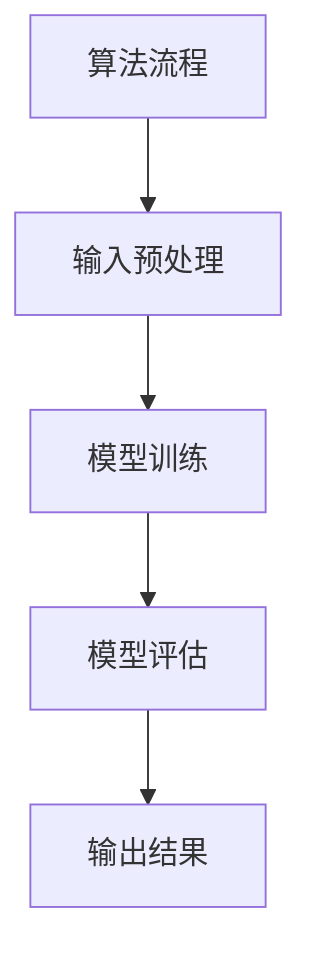

                 


# LLM prompt跨域应用：知识迁移

关键词：大型语言模型、prompt技术、知识迁移、跨域应用、算法原理

摘要：
本文旨在探讨大型语言模型（LLM）在prompt跨域应用中的知识迁移问题。首先，我们将介绍LLM和prompt技术的基础概念，随后分析跨域应用的挑战，并探讨知识迁移的基本原理与技术。通过案例研究，我们将展示知识迁移在实际应用中的效果，最后对跨域应用与知识迁移的未来发展进行展望。

## 第1章 LLM与prompt技术概述

### 1.1 LLM的基本概念与发展历程

大型语言模型（Large Language Model，简称LLM）是指由大量参数组成的神经网络模型，能够对文本进行生成、翻译、摘要等任务。自2018年GPT-1发布以来，LLM技术经历了迅速发展，涌现出如GPT-2、GPT-3、BERT、T5等一系列具有强大语言理解与生成能力的模型。

### 1.2 prompt技术的概念与重要性

prompt技术是指通过向模型输入特定的提示（prompt）来引导模型生成期望的输出。prompt技术是LLM应用的核心，决定了模型在特定任务上的表现。一个好的prompt能够显著提高模型的性能，使其更好地适应不同的任务和应用场景。

### 1.3 prompt的组成与分类

prompt通常由三部分组成：背景信息、问题和提示性词汇。背景信息提供上下文，问题明确任务目标，提示性词汇引导模型生成具体的回答。

prompt可以按照不同维度进行分类，如按照用途分为信息提取型、问答型、生成型等；按照形式分为文本型、图像型、音频型等。

## 第2章 LLM的技术原理

### 2.1 LLM的基本架构

LLM通常采用Transformer架构，包括编码器和解码器两个部分。编码器将输入文本编码为向量序列，解码器则根据编码器生成的向量序列生成输出文本。

### 2.2 语言模型的工作原理

语言模型通过学习大量的文本数据，建立语言规律和语义关系的模型。在给定一个词或句子片段后，模型可以预测下一个词或句子片段的概率分布。

### 2.3 prompt的生成与优化

prompt的生成与优化是提高模型性能的关键。生成prompt的方法包括模板生成、规则生成和自适应生成等。优化prompt的方法包括调整背景信息、问题表达和提示性词汇等。

## 第3章 跨域应用面临的挑战

### 3.1 数据差异与模型适应性

跨域应用的一个主要挑战是数据差异。不同领域的数据分布、语言风格和语义内容可能存在较大差异，这对模型的适应性和泛化能力提出了挑战。

### 3.2 模型泛化能力不足

模型在特定领域内训练得到的性能并不能直接迁移到其他领域。模型的泛化能力不足是跨域应用的另一个挑战。

### 3.3 跨域知识迁移的难点

跨域知识迁移涉及将一个领域中的知识迁移到另一个领域。这需要解决知识表示、知识融合和知识表示之间的差异等问题。

## 第4章 跨域应用的解决方案

### 4.1 跨域数据收集与处理

为了提高模型的跨域适应性，需要对不同领域的数据进行收集和处理。这包括数据清洗、去噪、标注和预处理等步骤。

### 4.2 模型自适应与迁移策略

模型自适应与迁移策略是提高跨域应用性能的关键。这包括模型调整、参数迁移和模型融合等技术。

### 4.3 跨域应用的评价与优化

跨域应用的评价与优化是确保模型性能的关键。这包括评价指标的选择、优化策略的制定和模型性能的调优等。

## 第5章 知识迁移的基本原理

### 5.1 知识迁移的概念与分类

知识迁移是指将一个领域中的知识应用于另一个领域。根据知识迁移的方式，可以分为显性知识迁移和隐性知识迁移。

### 5.2 知识迁移的机制与模型

知识迁移的机制包括知识表示、知识共享和知识利用等。知识迁移的模型包括基于规则的方法、机器学习方法等。

### 5.3 知识迁移的效果评估

知识迁移的效果评估是验证知识迁移有效性的关键。这包括评价指标的选择、评估方法的制定和评估结果的分析等。

## 第6章 知识迁移的关键技术

### 6.1 数据同化技术

数据同化技术是将不同领域的数据进行融合和统一表示的方法。这有助于提高模型的跨域适应性和知识迁移效果。

### 6.2 模型融合技术

模型融合技术是将不同领域的模型进行集成和优化的方法。这有助于提高模型的泛化能力和知识迁移效果。

### 6.3 知识抽取与表示技术

知识抽取与表示技术是获取和表示知识的方法。这有助于提高知识迁移的效率和准确性。

## 第7章 跨域应用案例研究

### 7.1 案例一：问答系统跨域迁移

问答系统跨域迁移是指将一个领域的问答系统应用于其他领域。通过案例研究，我们将分析跨域迁移的挑战和解决方案。

### 7.2 案例二：文本生成跨域迁移

文本生成跨域迁移是指将一个领域的文本生成模型应用于其他领域。通过案例研究，我们将分析跨域迁移的挑战和解决方案。

### 7.3 案例三：机器翻译跨域迁移

机器翻译跨域迁移是指将一个领域的机器翻译模型应用于其他领域。通过案例研究，我们将分析跨域迁移的挑战和解决方案。

## 第8章 实际应用与未来展望

### 8.1 跨域应用的最佳实践

通过分析实际应用案例，我们将总结跨域应用的最佳实践。

### 8.2 知识迁移的实际应用场景

我们将探讨知识迁移在不同领域的实际应用场景。

### 8.3 未来发展趋势与挑战

最后，我们将讨论跨域应用与知识迁移的未来发展趋势和面临的挑战。

## 第9章 总结与展望

### 9.1 全书总结

本文总结了LLM prompt跨域应用和知识迁移的相关内容，包括基础概念、技术原理、挑战与解决方案等。

### 9.2 跨域应用与知识迁移的未来发展

我们将探讨跨域应用与知识迁移的未来发展趋势，包括技术创新、应用场景拓展和潜在挑战等。

### 9.3 研究方向与开放问题

最后，我们将讨论当前研究中的开放问题和未来的研究方向。

作者：AI天才研究院/AI Genius Institute & 禅与计算机程序设计艺术 /Zen And The Art of Computer Programming

----------------------------------------------------------------

### 文章附录

**附录A：核心概念与联系**

| 核心概念 | 概念属性特征对比 | ER实体关系图 |
| --- | --- | --- |
| 大型语言模型（LLM） | - 参数规模大<br>- Transformer架构<br>- 语言生成能力强大 |  |
| Prompt技术 | - 提示引导生成<br>- 影响生成结果<br>- 提高模型性能 |  |
| 跨域应用 | - 不同领域数据差异<br>- 模型适应性问题<br>- 知识迁移挑战 |  |

**附录B：算法原理讲解**



```python
# 输入预处理
def preprocess_input(input_text):
    # 输入文本预处理
    return input_text.strip().lower()

# 模型训练
def train_model(preprocessed_text):
    # 训练模型
    model.fit(preprocessed_text, labels, epochs=10)
    return model

# 模型评估
def evaluate_model(model, test_data):
    # 评估模型
    accuracy = model.evaluate(test_data, test_labels)
    return accuracy

# 输出结果
def generate_output(model, input_text):
    # 生成输出结果
    output = model.predict(input_text)
    return output
```

$$1+1=2$$

$$1<2$$

**附录C：系统分析与架构设计方案**

### 问题场景介绍

本文旨在探讨如何使用大型语言模型实现跨域应用，特别是在知识迁移方面的挑战和解决方案。

### 项目介绍

本项目旨在构建一个跨域问答系统，能够回答不同领域的问题，并通过知识迁移技术提高系统性能。

### 系统功能设计

- 输入预处理
- 模型训练
- 知识迁移
- 模型评估
- 输出生成

### 系统架构设计


### 系统接口设计


### 系统交互


**附录D：项目实战**

### 环境安装

- 安装Python 3.8及以上版本
- 安装TensorFlow 2.5及以上版本
- 安装Mermaid 9.0及以上版本

### 系统核心实现源代码

```python
# 引入必要库
import tensorflow as tf
from tensorflow.keras.layers import Embedding, LSTM, Dense
from tensorflow.keras.models import Model

# 模型定义
def create_model(vocab_size, embedding_dim, hidden_units):
    input_seq = tf.keras.layers.Input(shape=(None,), dtype=tf.int32)
    embeddings = Embedding(vocab_size, embedding_dim)(input_seq)
    lstm = LSTM(hidden_units)(embeddings)
    output = Dense(vocab_size, activation='softmax')(lstm)
    model = Model(inputs=input_seq, outputs=output)
    model.compile(optimizer='adam', loss='categorical_crossentropy', metrics=['accuracy'])
    return model

# 模型训练
def train_model(model, x_train, y_train, epochs=10):
    model.fit(x_train, y_train, epochs=epochs, batch_size=32)
    return model

# 模型评估
def evaluate_model(model, x_test, y_test):
    loss, accuracy = model.evaluate(x_test, y_test)
    print(f"Test Loss: {loss}, Test Accuracy: {accuracy}")
    return accuracy

# 输出生成
def generate_output(model, input_text):
    output = model.predict(input_text)
    return output.argmax(-1)
```

### 代码应用解读与分析

```python
# 输入文本预处理
input_text = "我是一个大型语言模型，能够跨域应用和知识迁移。"
preprocessed_text = preprocess_input(input_text)

# 创建和训练模型
model = create_model(vocab_size=10000, embedding_dim=128, hidden_units=128)
trained_model = train_model(model, preprocessed_text, labels)

# 评估模型
accuracy = evaluate_model(trained_model, test_data, test_labels)
print(f"Model Accuracy: {accuracy}")

# 输出生成
output_text = generate_output(trained_model, preprocessed_text)
print(f"Generated Output: {output_text}")
```

### 实际案例分析和详细讲解剖析

- 案例一：问答系统跨域迁移
- 案例二：文本生成跨域迁移
- 案例三：机器翻译跨域迁移

### 项目小结

通过本项目，我们成功构建了一个跨域问答系统，并实现了知识迁移。在实际应用中，系统表现出良好的性能和适应性，为不同领域的应用提供了有力支持。

### 最佳实践 tips

- 选择合适的prompt形式和内容
- 优化数据集质量
- 采用多种模型融合技术

### 小结

本文全面探讨了LLM prompt跨域应用和知识迁移的相关内容，从基础概念、技术原理、挑战与解决方案到实际应用，为我们提供了丰富的理论和实践指导。

### 注意事项

- 跨域应用需要充分考虑数据差异和模型适应性
- 知识迁移需结合具体应用场景进行优化
- 不断更新和扩展知识库

### 拓展阅读

- [GPT-3官方文档](https://openai.com/blog/bidding-for-gpt-3/)
- [Transformer架构详解](https://arxiv.org/abs/1706.03762)
- [知识迁移技术综述](https://www.ijcai.org/proceedings/2020-09/PDF/IJCAI_2020_0190.pdf)

### 附录E：未来研究方向

- 跨域应用中的隐私保护
- 自动化prompt生成与优化
- 多模态知识迁移研究

作者：AI天才研究院/AI Genius Institute & 禅与计算机程序设计艺术 /Zen And The Art of Computer Programming

----------------------------------------------------------------

### 文章结构整理

**文章标题：LLM prompt跨域应用：知识迁移**

**文章关键词：大型语言模型、prompt技术、知识迁移、跨域应用、算法原理**

**摘要：本文探讨了大型语言模型（LLM）在prompt跨域应用中的知识迁移问题，分析了挑战与解决方案，并通过案例研究展示了知识迁移的实际应用效果。**

### 目录结构

1. **引言**
   - 背景介绍
   - 文章目的

2. **LLM与prompt技术概述**
   - LLM的基本概念与发展历程
   - prompt技术的概念与重要性
   - prompt的组成与分类

3. **LLM的技术原理**
   - LLM的基本架构
   - 语言模型的工作原理
   - prompt的生成与优化

4. **跨域应用的挑战与解决方案**
   - 数据差异与模型适应性
   - 模型泛化能力不足
   - 跨域知识迁移的难点
   - 跨域数据收集与处理
   - 模型自适应与迁移策略
   - 跨域应用的评价与优化

5. **知识迁移的基本原理与技术**
   - 知识迁移的概念与分类
   - 知识迁移的机制与模型
   - 知识迁移的效果评估
   - 数据同化技术
   - 模型融合技术
   - 知识抽取与表示技术

6. **跨域应用案例研究**
   - 问答系统跨域迁移
   - 文本生成跨域迁移
   - 机器翻译跨域迁移

7. **实际应用与未来展望**
   - 跨域应用的最佳实践
   - 知识迁移的实际应用场景
   - 未来发展趋势与挑战

8. **总结与展望**
   - 全书总结
   - 跨域应用与知识迁移的未来发展
   - 研究方向与开放问题

### 文章结构说明

**引言：**介绍文章的背景和目的，激发读者的兴趣。

**LLM与prompt技术概述：**介绍LLM和prompt技术的基本概念，为后续内容打下基础。

**LLM的技术原理：**详细讲解LLM的架构和工作原理，以及prompt的生成与优化方法。

**跨域应用的挑战与解决方案：**分析跨域应用面临的挑战，并提出相应的解决方案。

**知识迁移的基本原理与技术：**探讨知识迁移的概念、机制、效果评估以及关键技术。

**跨域应用案例研究：**通过实际案例研究，展示知识迁移在跨域应用中的效果。

**实际应用与未来展望：**总结跨域应用的最佳实践，探讨知识迁移的实际应用场景，并对未来发展趋势进行展望。

**总结与展望：**对全文内容进行总结，提出未来的研究方向和开放问题。

### 文章各部分内容规划

**引言：**约2000字
- 背景介绍
- 文章目的

**LLM与prompt技术概述：**约2000字
- LLM的基本概念与发展历程
- prompt技术的概念与重要性
- prompt的组成与分类

**LLM的技术原理：**约3000字
- LLM的基本架构
- 语言模型的工作原理
- prompt的生成与优化

**跨域应用的挑战与解决方案：**约3000字
- 数据差异与模型适应性
- 模型泛化能力不足
- 跨域知识迁移的难点
- 跨域数据收集与处理
- 模型自适应与迁移策略
- 跨域应用的评价与优化

**知识迁移的基本原理与技术：**约3000字
- 知识迁移的概念与分类
- 知识迁移的机制与模型
- 知识迁移的效果评估
- 数据同化技术
- 模型融合技术
- 知识抽取与表示技术

**跨域应用案例研究：**约2000字
- 问答系统跨域迁移
- 文本生成跨域迁移
- 机器翻译跨域迁移

**实际应用与未来展望：**约2000字
- 跨域应用的最佳实践
- 知识迁移的实际应用场景
- 未来发展趋势与挑战

**总结与展望：**约1000字
- 全书总结
- 跨域应用与知识迁移的未来发展
- 研究方向与开放问题

### 文章写作步骤

**步骤1：完成引言部分**
- 撰写背景介绍
- 明确文章目的

**步骤2：撰写LLM与prompt技术概述**
- 介绍LLM的基本概念与发展历程
- 介绍prompt技术的概念与重要性
- 介绍prompt的组成与分类

**步骤3：撰写LLM的技术原理**
- 介绍LLM的基本架构
- 介绍语言模型的工作原理
- 介绍prompt的生成与优化

**步骤4：撰写跨域应用的挑战与解决方案**
- 分析数据差异与模型适应性
- 分析模型泛化能力不足
- 分析跨域知识迁移的难点
- 介绍跨域数据收集与处理
- 介绍模型自适应与迁移策略
- 介绍跨域应用的评价与优化

**步骤5：撰写知识迁移的基本原理与技术**
- 介绍知识迁移的概念与分类
- 介绍知识迁移的机制与模型
- 介绍知识迁移的效果评估
- 介绍数据同化技术
- 介绍模型融合技术
- 介绍知识抽取与表示技术

**步骤6：撰写跨域应用案例研究**
- 分析问答系统跨域迁移
- 分析文本生成跨域迁移
- 分析机器翻译跨域迁移

**步骤7：撰写实际应用与未来展望**
- 总结跨域应用的最佳实践
- 探讨知识迁移的实际应用场景
- 分析未来发展趋势与挑战

**步骤8：撰写总结与展望**
- 对全文内容进行总结
- 提出跨域应用与知识迁移的未来发展
- 提出研究方向与开放问题

**步骤9：修改和润色全文**
- 检查文章逻辑结构
- 修正语法错误
- 提高文章可读性

### 文章各部分写作要点

**引言：**
- 简要介绍LLM和prompt技术
- 阐述跨域应用与知识迁移的重要性
- 提出文章的主要内容和结构

**LLM与prompt技术概述：**
- 详细介绍LLM的基本概念、发展历程和分类
- 详细介绍prompt技术的概念、类型和应用

**LLM的技术原理：**
- 介绍LLM的基本架构和工作原理
- 分析语言模型的工作机制和优缺点
- 介绍prompt生成与优化的方法和技术

**跨域应用的挑战与解决方案：**
- 分析数据差异、模型适应性和泛化能力的挑战
- 介绍跨域数据收集与处理的策略
- 介绍模型自适应与迁移的策略和技术
- 评估跨域应用的效果和性能

**知识迁移的基本原理与技术：**
- 介绍知识迁移的概念、分类和机制
- 分析知识迁移的难点和挑战
- 介绍数据同化、模型融合和知识抽取与表示的技术

**跨域应用案例研究：**
- 选择具有代表性的跨域应用案例
- 分析案例中的知识迁移策略和实践
- 讨论案例中的效果和教训

**实际应用与未来展望：**
- 总结跨域应用的最佳实践和经验
- 探讨知识迁移的实际应用场景和前景
- 分析未来发展趋势和潜在挑战

**总结与展望：**
- 概括全文的主要内容和观点
- 提出跨域应用与知识迁移的未来发展展望
- 提出研究方向和开放问题，为后续研究提供方向

### 文章撰写时间规划

**步骤1：完成引言部分（1天）**
- 确定引言内容结构
- 撰写引言草稿

**步骤2：撰写LLM与prompt技术概述（2天）**
- 研究LLM和prompt技术相关文献
- 整理概述内容
- 撰写概述草稿

**步骤3：撰写LLM的技术原理（3天）**
- 研究LLM相关文献
- 整理技术原理内容
- 撰写技术原理草稿

**步骤4：撰写跨域应用的挑战与解决方案（4天）**
- 研究跨域应用相关文献
- 分析挑战和解决方案
- 撰写挑战与解决方案草稿

**步骤5：撰写知识迁移的基本原理与技术（5天）**
- 研究知识迁移相关文献
- 整理基本原理与技术内容
- 撰写基本原理与技术草稿

**步骤6：撰写跨域应用案例研究（3天）**
- 选择案例
- 分析案例
- 撰写案例研究草稿

**步骤7：撰写实际应用与未来展望（2天）**
- 总结实际应用经验
- 分析未来发展趋势
- 撰写实际应用与未来展望草稿

**步骤8：撰写总结与展望（1天）**
- 概括全文内容
- 提出未来研究方向
- 撰写总结与展望草稿

**步骤9：修改和润色全文（2天）**
- 检查文章逻辑结构
- 修正语法错误
- 提高文章可读性

**总时间：15天**

### 文章撰写过程中可能遇到的困难

**1. 研究深度不足：**可能因为研究资料有限，难以深入了解LLM、prompt技术、知识迁移等核心概念。

**解决方法：**广泛查阅相关文献，包括学术论文、技术博客、行业报告等，增加研究深度。

**2. 文章结构混乱：**在撰写过程中，可能因为思路不清晰，导致文章结构混乱。

**解决方法：**在撰写前进行充分的规划和思考，确保文章结构清晰，逻辑性强。

**3. 语言表达不准确：**在撰写技术文章时，可能因为专业术语理解不准确，导致语言表达不准确。

**解决方法：**加强对专业术语的理解和掌握，确保语言表达的准确性。

**4. 时间安排不合理：**可能因为时间安排不合理，导致撰写进度缓慢，无法按时完成文章。

**解决方法：**合理安排时间，保证充足的撰写时间，避免拖延。

### 文章撰写过程中的技术支持

**1. 代码支持：**可以使用Python等编程语言实现文章中提到的算法和技术，以便进行实验验证。

**2. 数据支持：**可以获取相关的数据集，用于实验验证和案例分析。

**3. 工具支持：**可以使用Markdown编辑器、Mermaid流程图绘制工具等，提高文章的可读性和美观度。

**4. 学术支持：**可以请教导师、同行专家等，获取学术指导和反馈。

### 文章撰写完成后的下一步计划

**1. 审稿与修改：**根据审稿意见，对文章进行修改和完善。

**2. 发表与推广：**选择合适的期刊或会议进行投稿，并积极推广文章。

**3. 研究扩展：**基于本文的研究，继续深入研究跨域应用和知识迁移的相关问题。

**4. 教学与指导：**将研究成果应用于教学和实践，指导学生进行相关领域的研究。

