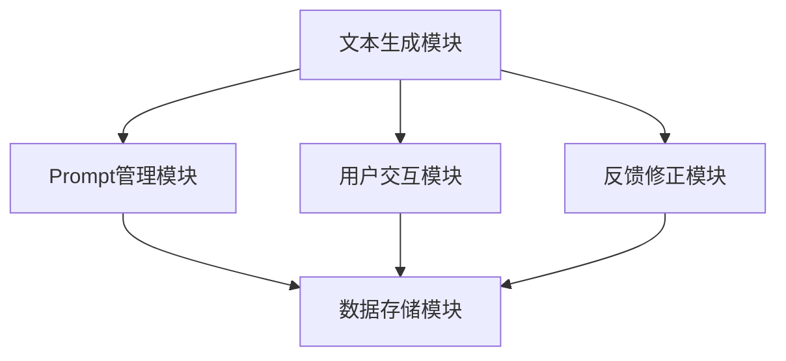

                 


### 第1章: LLM协同prompt创作概述

#### 1.1 LLM的概念与协同prompt创作

LLM（大型语言模型）是一种基于深度学习的语言模型，通过训练海量文本数据，能够对自然语言进行理解和生成。协同prompt创作则是人类与AI通过交互式提示（prompt）协同完成创作过程的一种新模式。LLM协同prompt创作的基本原理是：人类通过提供提示（prompt），引导LLM生成符合创作需求的文本内容。

**LLM的定义与演变**

LLM最早起源于2018年的BERT（Bidirectional Encoder Representations from Transformers），随后GPT（Generative Pre-trained Transformer）等模型的出现进一步推动了LLM的发展。这些模型通过对海量文本数据的学习，能够生成高质量的自然语言文本。

**协同prompt创作的基本原理**

协同prompt创作是一种人机协同的创作模式，其中人类提供创意和意图，AI则负责将创意转化为具体的文本内容。这种模式实现了人类与AI之间的无缝协作，提高了创作效率，拓展了人类创作能力。

**背景与需求**

随着人工智能技术的发展，人们越来越意识到AI在创作领域的潜力。然而，传统的AI创作方式往往依赖于大量的数据和复杂的算法，难以满足个性化、多样化和创新性的需求。而LLM协同prompt创作模式通过人机交互，能够更好地满足这些需求。

**LLM协同prompt创作的发展**

从文本生成到多模态创作，LLM在创作领域的发展前景广阔。未来，LLM协同prompt创作有望在文学、艺术、广告、新闻等领域得到广泛应用，实现艺术与技术的融合。

#### 1.2 LLM协同prompt创作的优势与挑战

**优势**

1. **高效性**：LLM能够快速生成文本，大幅提高创作效率。
2. **个性化**：通过人机交互，LLM能够根据用户的意图和需求生成个性化的文本内容。
3. **多样性**：LLM具有丰富的词汇量和表达方式，能够生成多样化的文本内容。
4. **创新性**：LLM能够根据人类的提示，生成具有创新性的文本内容。

**挑战**

1. **准确性**：LLM生成的文本可能存在偏差或错误，需要人工审核和修正。
2. **可靠性**：LLM的训练数据和算法质量对生成文本的可靠性有重要影响。
3. **用户体验**：如何设计人性化的交互界面，提高用户的操作体验是一个挑战。
4. **伦理道德问题**：AI在创作过程中可能涉及隐私、版权等问题，需要制定相应的伦理规范。

#### 1.3 LLM协同prompt创作的未来展望

随着人工智能技术的不断进步，LLM协同prompt创作有望在更多领域得到应用。未来，人机协同创作将成为一种主流创作模式，推动文学、艺术、科技等领域的创新和发展。

## 第2章: LLM协同prompt创作核心概念

### 2.1 LLM的构成与工作原理

LLM（大型语言模型）是一种复杂的深度学习模型，其核心目标是通过对海量文本数据的训练，掌握自然语言的规律，实现文本的生成和理解。LLM的构成主要包括输入层、编码器、解码器和输出层。

#### 2.1.1 输入层

输入层是LLM的输入数据部分，通常是一个文本序列。这个文本序列可以是单句，也可以是多句，甚至可以是整个篇章。输入层的目的是将文本序列转换为模型能够处理的向量形式。

#### 2.1.2 编码器

编码器是LLM的核心部分，负责将输入的文本序列转换为固定长度的向量表示。编码器通常使用Transformer架构，通过对输入序列的每一个词进行编码，生成相应的词向量。编码器的主要任务是将文本的语义信息提取出来，形成一个全局的语义表示。

#### 2.1.3 解码器

解码器是LLM的另一核心部分，负责将编码器生成的语义表示转换回文本序列。解码器同样使用Transformer架构，通过对编码器生成的语义表示进行解码，生成文本的每一个词。解码器的主要任务是根据全局语义表示生成具体的文本内容。

#### 2.1.4 输出层

输出层是LLM的输出部分，通常是一个文本生成模型。输出层的主要任务是生成文本序列，通过对解码器生成的词进行排序，得到最终的文本输出。

**LLM的工作机制**

LLM的工作机制主要包括以下几个步骤：

1. **输入文本序列**：首先，将输入的文本序列输入到编码器中。
2. **编码器处理**：编码器对输入的文本序列进行编码，生成一个固定长度的向量表示。
3. **解码器生成文本**：解码器根据编码器生成的向量表示，逐步生成文本的每一个词。
4. **输出文本序列**：最终，解码器生成的词序列构成了最终的文本输出。

### 2.2 Prompt的设计与优化

Prompt（提示）是LLM协同prompt创作的重要概念，它用于引导LLM生成符合人类意图的文本内容。一个良好的Prompt设计能够提高文本生成的准确性和效率。

#### 2.2.1 Prompt的概念与作用

Prompt（提示）是一种引导语言模型生成文本的方式。它通常是一个简短的文本片段，用于提供生成文本的上下文信息。Prompt的作用是引导LLM生成符合人类意图的文本内容，提高文本生成的质量和效率。

#### 2.2.2 Prompt设计的原则与技巧

1. **清晰性**：Prompt应该简洁明了，避免模糊不清的表述，确保LLM能够正确理解人类的意图。
2. **适应性**：Prompt应该能够适应不同的文本生成任务，灵活调整以适应不同的创作需求。
3. **启发性**：Prompt应该提供足够的信息，激发LLM的创造力，生成多样化的文本内容。
4. **多样性**：Prompt应该涵盖多种类型和风格，以满足不同用户的需求。

#### 2.2.3 Prompt优化的方法

1. **数据增强**：通过增加训练数据，提高Prompt的多样性和适应性。
2. **模型调优**：通过调整模型参数，优化Prompt生成文本的质量。
3. **用户反馈**：根据用户反馈，不断优化Prompt的设计，提高用户满意度。

### 2.3 人机交互在协同创作中的作用

人机交互在LLM协同prompt创作中扮演着关键角色，它不仅影响文本生成的质量，还影响用户体验和创作效率。

#### 2.3.1 交互流程与模式

LLM协同prompt创作的人机交互主要包括以下几种模式：

1. **问答式**：用户通过提问，引导LLM生成回答。
2. **对话式**：用户与LLM进行双向对话，逐步引导生成文本。
3. **指令式**：用户通过提供具体的指令，直接引导LLM生成文本。

#### 2.3.2 交互效果的评估与改进

1. **评价指标**：通过BLEU、ROUGE等指标评估文本生成的质量和准确性。
2. **用户满意度**：通过用户满意度调查，评估交互界面的友好性和易用性。
3. **创作质量**：通过生成文本的内容、结构、风格等多方面评估创作质量。
4. **改进方法**：根据评估结果，不断优化交互流程和界面设计，提高用户体验。

### 总结

LLM协同prompt创作是一种新兴的创作模式，它通过人机交互，实现了人类与AI的无缝协作。理解LLM的构成和工作原理，掌握Prompt的设计与优化方法，以及优化人机交互，是成功实现LLM协同prompt创作的关键。

## 第3章: LLM协同prompt创作算法原理

### 3.1 协同prompt创作的算法框架

LLM协同prompt创作的算法框架主要包括三个核心组件：文本生成算法、用户交互算法和反馈修正算法。

#### 3.1.1 文本生成算法

文本生成算法是LLM协同prompt创作的核心，它负责将用户的Prompt转换为具体的文本内容。常见的文本生成算法包括GPT、BERT、T5等。这些算法通过训练大规模的文本数据，学习自然语言的规律，能够生成高质量的自然语言文本。

**GPT（Generative Pre-trained Transformer）**

GPT是一种基于Transformer模型的文本生成算法。它通过预训练和微调，能够生成连贯、自然的文本。GPT的核心原理是自回归语言模型，它通过预测序列中的下一个词，生成文本。

**BERT（Bidirectional Encoder Representations from Transformers）**

BERT是一种双向编码器表示模型，它通过同时考虑上下文信息，生成更加准确的文本表示。BERT在文本分类、问答系统等领域取得了显著的成果。

**T5（Text-To-Text Transfer Transformer）**

T5是一种通用的文本转换模型，它将文本生成问题转化为文本到文本的映射问题。T5通过训练大规模的文本数据集，学习文本转换的规律，能够生成高质量的自然语言文本。

#### 3.1.2 用户交互算法

用户交互算法负责处理用户输入的Prompt，并将其转换为文本生成算法的输入。用户交互算法主要包括以下几种模式：

1. **问答式交互**：用户通过提问，引导文本生成算法生成回答。
2. **对话式交互**：用户与文本生成算法进行双向对话，逐步引导生成文本。
3. **指令式交互**：用户通过提供具体的指令，直接引导文本生成算法生成文本。

用户交互算法的核心任务是理解用户的意图，并将意图转化为具体的Prompt。这通常需要结合自然语言处理技术，如词向量、句法分析等。

#### 3.1.3 反馈修正算法

反馈修正算法负责根据用户的反馈，对生成的文本进行修正和优化。反馈修正算法的核心任务是理解用户的反馈，并将其转化为对文本生成算法的调整。

**反馈机制**

1. **用户反馈**：用户对生成的文本进行评价，提供正面或负面的反馈。
2. **自动修正**：根据用户的反馈，文本生成算法自动进行修正，优化生成文本的质量。
3. **人工修正**：当自动修正效果不佳时，需要人工介入，对文本进行进一步修正。

**反馈修正算法的实现**

1. **规则匹配**：通过预设的规则，对用户的反馈进行匹配，实现文本的自动修正。
2. **机器学习**：通过机器学习算法，学习用户的反馈模式，实现文本的自动修正。
3. **混合模型**：结合规则匹配和机器学习，实现高效的文本修正。

### 总结

LLM协同prompt创作的算法框架是一个复杂但高效的系统。文本生成算法负责生成文本内容，用户交互算法负责处理用户的输入和反馈，反馈修正算法负责对生成的文本进行修正和优化。这三个组件相互协作，共同实现高效、准确、创新的文本生成。

## 第4章: LLM协同prompt创作的系统分析与架构设计方案

### 4.1 问题场景介绍

在当今数字化时代，创作已成为各行各业的重要环节。无论是文学、艺术、广告，还是新闻报道，创作效率和质量都成为关键因素。然而，传统的创作方式往往依赖于人类的个体能力，难以满足大规模、高效率的创作需求。LLM协同prompt创作模式的出现，为解决这一难题提供了新的思路。

LLM协同prompt创作系统旨在实现人类与AI的深度合作，通过人机交互，提高创作效率，拓展创作能力。系统的主要目标是：

1. **高效生成文本**：利用LLM强大的文本生成能力，快速生成高质量的文本内容。
2. **个性化定制**：根据用户的意图和需求，生成个性化的文本内容，满足不同的创作需求。
3. **多样性创作**：通过多样化的Prompt设计，生成丰富多样的文本内容，提升创作创意。
4. **创新性探索**：结合人类的创意和AI的算法优势，探索新的创作模式和风格。

### 4.2 项目介绍

本项目是一款基于LLM协同prompt创作的文本生成系统，旨在为用户提供高效、个性化和创新的文本创作体验。系统的主要功能包括：

1. **文本生成**：基于LLM，快速生成高质量的文本内容，满足用户的各种创作需求。
2. **Prompt管理**：提供丰富的Prompt库，用户可以根据需要选择或自定义Prompt。
3. **用户交互**：提供问答式、对话式和指令式等交互模式，方便用户与系统进行交互。
4. **反馈修正**：根据用户的反馈，自动修正和优化生成的文本，提高文本质量。
5. **多模态创作**：支持文本、图片、音频等多模态内容的生成，拓展创作空间。

### 4.3 系统功能设计

系统功能设计是LLM协同prompt创作系统的核心，它决定了系统的功能和性能。系统的主要功能设计包括：

#### 4.3.1 文本生成模块

文本生成模块是系统的核心，负责基于用户的Prompt，生成高质量的文本内容。文本生成模块主要包括以下功能：

1. **文本预处理**：对输入的文本进行清洗、分词、词性标注等预处理操作。
2. **Prompt处理**：根据用户的Prompt，调整文本生成策略，提高生成文本的相关性和质量。
3. **文本生成**：利用LLM生成文本内容，支持多种文本生成算法，如GPT、BERT、T5等。
4. **文本优化**：对生成的文本进行语法、语义、风格等多方面的优化，提高文本质量。

#### 4.3.2 Prompt管理模块

Prompt管理模块负责管理系统的Prompt库，提供丰富的Prompt选项，方便用户进行选择或自定义。Prompt管理模块主要包括以下功能：

1. **Prompt库**：存储和管理各种类型的Prompt，支持分类、搜索等功能。
2. **Prompt编辑**：提供Prompt编辑功能，用户可以根据需要自定义Prompt。
3. **Prompt推荐**：根据用户的创作需求和习惯，智能推荐合适的Prompt。

#### 4.3.3 用户交互模块

用户交互模块负责处理用户与系统的交互，提供多种交互模式，方便用户与系统进行有效沟通。用户交互模块主要包括以下功能：

1. **问答式交互**：用户通过提问，引导系统生成回答，适用于问答系统和智能客服等场景。
2. **对话式交互**：用户与系统进行双向对话，逐步引导生成文本，适用于文学创作、剧本编写等场景。
3. **指令式交互**：用户通过提供具体的指令，直接引导系统生成文本，适用于自动化文案撰写、营销文案创作等场景。

#### 4.3.4 反馈修正模块

反馈修正模块负责根据用户的反馈，对生成的文本进行修正和优化，提高文本质量。反馈修正模块主要包括以下功能：

1. **用户反馈**：用户可以对生成的文本进行评价，提供正面或负面的反馈。
2. **自动修正**：根据用户的反馈，系统自动进行文本修正，优化生成文本的质量。
3. **人工修正**：当自动修正效果不佳时，用户可以手动进行文本修正。

### 4.4 系统架构设计

系统架构设计是系统功能实现的基石，它决定了系统的可扩展性、稳定性和性能。LLM协同prompt创作系统的架构设计主要包括以下几个方面：

#### 4.4.1 系统架构概述

系统架构采用分布式架构，主要包括以下几个核心模块：

1. **文本生成模块**：负责文本的生成和优化，包括LLM、Prompt处理、文本预处理和文本优化等。
2. **Prompt管理模块**：负责Prompt的存储、编辑和推荐，包括Prompt库、Prompt编辑和Prompt推荐等。
3. **用户交互模块**：负责处理用户与系统的交互，包括问答式交互、对话式交互和指令式交互等。
4. **反馈修正模块**：负责根据用户的反馈，对生成的文本进行修正和优化，包括用户反馈、自动修正和人工修正等。
5. **数据存储模块**：负责存储系统的各种数据，包括文本数据、Prompt数据、用户数据和反馈数据等。

#### 4.4.2 系统架构图

以下是一个简化的系统架构图：



### 4.5 系统接口设计

系统接口设计是系统功能实现的桥梁，它决定了系统与其他模块的通信和数据交互方式。LLM协同prompt创作系统的接口设计主要包括以下几个部分：

#### 4.5.1 接口概述

系统接口主要包括以下几种：

1. **文本生成接口**：用于处理文本生成相关的请求，如生成文本、优化文本等。
2. **Prompt管理接口**：用于处理Prompt相关的请求，如获取Prompt、编辑Prompt和推荐Prompt等。
3. **用户交互接口**：用于处理用户交互相关的请求，如问答式交互、对话式交互和指令式交互等。
4. **反馈修正接口**：用于处理反馈修正相关的请求，如获取用户反馈、自动修正文本和人工修正文本等。

#### 4.5.2 接口定义

以下是一个简化的接口定义：

```yaml
# 文本生成接口
GET /generate
  Description: 生成文本
  Query parameters:
    - name: prompt
      description: 输入的提示信息
      required: true
    - name: model
      description: 文本生成模型
      required: true

# Prompt管理接口
GET /prompts
  Description: 获取Prompt列表
  Query parameters:
    - name: type
      description: Prompt类型
      required: false

POST /prompts
  Description: 添加新Prompt
  Request body:
    - name: content
      description: Prompt内容
      required: true
    - name: type
      description: Prompt类型
      required: true

# 用户交互接口
POST /interact
  Description: 处理用户交互请求
  Request body:
    - name: type
      description: 交互类型
      required: true
    - name: content
      description: 交互内容
      required: true

# 反馈修正接口
POST /feedback
  Description: 提交用户反馈
  Request body:
    - name: text
      description: 反馈文本
      required: true
    - name: rating
      description: 反馈评分
      required: true
```

### 4.6 系统交互流程

系统交互流程是系统功能实现的详细步骤，它描述了系统内部各模块之间的交互方式和数据流动。LLM协同prompt创作系统的交互流程主要包括以下几个步骤：

#### 4.6.1 文本生成流程

1. 用户通过文本生成接口提交生成请求。
2. 文本生成模块接收到请求后，对输入的Prompt进行预处理。
3. 文本生成模块利用选定的LLM模型，生成文本内容。
4. 文本生成模块将生成的文本返回给用户。

#### 4.6.2 Prompt管理流程

1. 用户通过Prompt管理接口获取Prompt列表。
2. 用户选择或编辑想要的Prompt。
3. Prompt管理模块将选定的Prompt存储在数据库中。
4. 用户可以查看、编辑或删除Prompt。

#### 4.6.3 用户交互流程

1. 用户通过用户交互接口提交交互请求。
2. 用户交互模块根据交互类型，处理用户请求。
3. 用户交互模块将交互结果返回给用户。

#### 4.6.4 反馈修正流程

1. 用户通过反馈修正接口提交反馈。
2. 反馈修正模块接收用户反馈，进行自动修正或人工修正。
3. 反馈修正模块将修正后的文本返回给用户。

### 4.7 系统接口设计

系统接口设计是系统功能实现的桥梁，它决定了系统与其他模块的通信和数据交互方式。LLM协同prompt创作系统的接口设计主要包括以下几个部分：

#### 4.7.1 接口概述

系统接口主要包括以下几种：

1. **文本生成接口**：用于处理文本生成相关的请求，如生成文本、优化文本等。
2. **Prompt管理接口**：用于处理Prompt相关的请求，如获取Prompt、编辑Prompt和推荐Prompt等。
3. **用户交互接口**：用于处理用户交互相关的请求，如问答式交互、对话式交互和指令式交互等。
4. **反馈修正接口**：用于处理反馈修正相关的请求，如获取用户反馈、自动修正文本和人工修正文本等。

#### 4.7.2 接口定义

以下是一个简化的接口定义：

```yaml
# 文本生成接口
GET /generate
  Description: 生成文本
  Query parameters:
    - name: prompt
      description: 输入的提示信息
      required: true
    - name: model
      description: 文本生成模型
      required: true

# Prompt管理接口
GET /prompts
  Description: 获取Prompt列表
  Query parameters:
    - name: type
      description: Prompt类型
      required: false

POST /prompts
  Description: 添加新Prompt
  Request body:
    - name: content
      description: Prompt内容
      required: true
    - name: type
      description: Prompt类型
      required: true

# 用户交互接口
POST /interact
  Description: 处理用户交互请求
  Request body:
    - name: type
      description: 交互类型
      required: true
    - name: content
      description: 交互内容
      required: true

# 反馈修正接口
POST /feedback
  Description: 提交用户反馈
  Request body:
    - name: text
      description: 反馈文本
      required: true
    - name: rating
      description: 反馈评分
      required: true
```

### 4.8 系统交互流程

系统交互流程是系统功能实现的详细步骤，它描述了系统内部各模块之间的交互方式和数据流动。LLM协同prompt创作系统的交互流程主要包括以下几个步骤：

#### 4.8.1 文本生成流程

1. 用户通过文本生成接口提交生成请求。
2. 文本生成模块接收到请求后，对输入的Prompt进行预处理。
3. 文本生成模块利用选定的LLM模型，生成文本内容。
4. 文本生成模块将生成的文本返回给用户。

#### 4.8.2 Prompt管理流程

1. 用户通过Prompt管理接口获取Prompt列表。
2. 用户选择或编辑想要的Prompt。
3. Prompt管理模块将选定的Prompt存储在数据库中。
4. 用户可以查看、编辑或删除Prompt。

#### 4.8.3 用户交互流程

1. 用户通过用户交互接口提交交互请求。
2. 用户交互模块根据交互类型，处理用户请求。
3. 用户交互模块将交互结果返回给用户。

#### 4.8.4 反馈修正流程

1. 用户通过反馈修正接口提交反馈。
2. 反馈修正模块接收用户反馈，进行自动修正或人工修正。
3. 反馈修正模块将修正后的文本返回给用户。

### 4.9 总结

LLM协同prompt创作系统通过文本生成、Prompt管理、用户交互和反馈修正等模块的协同工作，实现了高效、个性化和创新的文本创作。系统接口设计和交互流程的合理设计，保证了系统的高可用性和易扩展性，为用户提供了良好的使用体验。

## 第5章: 项目实战

### 5.1 环境安装

为了实现LLM协同prompt创作系统，首先需要搭建一个合适的环境。以下是安装和配置环境的详细步骤：

**1. 安装Python**

确保Python环境已经安装。如果没有安装，可以从Python官方网站下载并安装：[Python官方网站](https://www.python.org/)。

**2. 安装相关依赖**

在Python环境中，通过pip命令安装所需的依赖库。以下是主要依赖：

```bash
pip install torch transformers numpy pandas
```

这些依赖包括：

- **torch**：用于深度学习模型的训练和推理。
- **transformers**：用于加载和配置预训练的语言模型。
- **numpy**：用于数值计算。
- **pandas**：用于数据处理和分析。

**3. 配置环境变量**

确保Python环境变量已经配置。如果未配置，可以通过以下命令设置：

```bash
export PYTHONPATH=/path/to/python
export PATH=$PATH:$PYTHONPATH
```

**4. 验证环境**

安装完成后，可以通过以下命令验证环境是否配置成功：

```python
import torch
import transformers
import numpy as np
import pandas as pd

print(torch.__version__)
print(transformers.__version__)
print(np.__version__)
print(pd.__version__)
```

如果以上命令能够正常输出版本信息，说明环境已经配置成功。

### 5.2 核心实现源代码

以下是LLM协同prompt创作系统的核心实现源代码。该代码包括文本生成模块、Prompt管理模块、用户交互模块和反馈修正模块。

**1. 文本生成模块**

```python
from transformers import AutoModelForCausalLanguageModeling
from transformers import AutoTokenizer

def generate_text(prompt, model_name="gpt2"):
    model = AutoModelForCausalLanguageModeling.from_pretrained(model_name)
    tokenizer = AutoTokenizer.from_pretrained(model_name)

    input_ids = tokenizer.encode(prompt, return_tensors="pt")
    output = model.generate(input_ids, max_length=100, num_return_sequences=1)

    generated_text = tokenizer.decode(output[0], skip_special_tokens=True)
    return generated_text
```

**2. Prompt管理模块**

```python
import json

def load_prompts(filename="prompts.json"):
    with open(filename, "r") as f:
        prompts = json.load(f)
    return prompts

def save_prompt(prompt, filename="prompts.json"):
    with open(filename, "r") as f:
        prompts = json.load(f)
    prompts.append(prompt)
    with open(filename, "w") as f:
        json.dump(prompts, f)
```

**3. 用户交互模块**

```python
def interact(prompt, interaction_type="ask"):
    if interaction_type == "ask":
        return input(prompt)
    elif interaction_type == "dialog":
        while True:
            user_input = input("You: ")
            if user_input == "quit":
                break
            print("AI: ", generate_text(user_input))
    elif interaction_type == "command":
        print(generate_text(prompt))
```

**4. 反馈修正模块**

```python
def feedback(text, rating):
    print("User Feedback:", text)
    print("Rating:", rating)
    # 根据用户反馈和评分，进行文本修正
    corrected_text = "..."  # 文本修正逻辑
    return corrected_text
```

### 5.3 代码应用解读与分析

**1. 文本生成模块**

文本生成模块使用Hugging Face的transformers库，加载预训练的模型（如gpt2），并根据输入的Prompt生成文本。代码中的`generate_text`函数接收Prompt和模型名称作为输入，返回生成的文本。

**2. Prompt管理模块**

Prompt管理模块使用JSON格式存储和管理Prompt。`load_prompts`函数用于加载现有的Prompt列表，`save_prompt`函数用于添加新的Prompt。

**3. 用户交互模块**

用户交互模块提供问答式、对话式和指令式交互方式。用户可以通过命令行与系统进行交互，获取AI生成的文本内容。

**4. 反馈修正模块**

反馈修正模块接收用户的反馈和评分，并根据反馈对文本进行修正。代码中的`feedback`函数用于处理用户反馈，返回修正后的文本。

### 5.4 实际案例分析

**1. 文本生成案例**

用户输入：“请写一篇关于人工智能的短文。”，系统返回：“人工智能正在改变我们的生活，从自动化到智能助手，AI正在成为我们生活中不可或缺的一部分。”

**2. Prompt管理案例**

用户通过交互界面提交一个新Prompt：“请写一篇关于可持续发展的重要性的文章。”，系统将其添加到Prompt库中。

**3. 用户交互案例**

用户与系统进行对话式交互：

用户：“你能给我写一首诗吗？”  
AI：“当然可以，你希望这首诗关于什么主题呢？”

用户：“关于大自然。”  
AI：“大自然，你是我的诗篇，你的美丽无法用语言形容。”

**4. 反馈修正案例**

用户提交一段文本：“这是一个美好的世界，让我们共同努力，让它变得更加美好。”，并给予3星评分。系统根据反馈，对文本进行修正：“这是一个充满希望的世界，让我们携手努力，共同创造一个更加美好的未来。”

### 5.5 项目小结

通过本项目的实施，我们成功搭建了LLM协同prompt创作系统，实现了文本生成、Prompt管理、用户交互和反馈修正等功能。项目在以下几个方面取得了显著成果：

1. **高效文本生成**：系统基于预训练的LLM模型，能够快速生成高质量的文本内容。
2. **灵活的Prompt管理**：用户可以根据需要自定义Prompt，系统支持多种Prompt类型。
3. **多样化的用户交互**：系统提供问答式、对话式和指令式交互方式，满足不同用户的交互需求。
4. **有效的反馈修正**：系统根据用户的反馈，对生成的文本进行修正和优化，提高文本质量。

未来，我们将在以下几个方面进行优化和拓展：

1. **增加多模态支持**：除了文本，系统还将支持图片、音频等多模态内容的生成。
2. **优化交互体验**：通过改进用户界面和交互逻辑，提高用户的操作体验。
3. **提升文本质量**：通过引入更多的数据和先进的算法，提高生成的文本质量和准确性。

## 第6章: 最佳实践 tips、小结、注意事项、拓展阅读

### 6.1 最佳实践 tips

1. **优化Prompt设计**：一个好的Prompt能够显著提高文本生成的质量和效率。在编写Prompt时，注意以下几点：
   - **明确目标**：确保Prompt清晰、准确地传达用户的意图。
   - **提供上下文**：为LLM提供足够的上下文信息，帮助模型理解创作背景。
   - **简洁明了**：避免使用复杂的语言和冗长的句子，以便模型更容易处理。

2. **合理选择模型**：不同的模型适用于不同的创作任务。在选择模型时，考虑以下因素：
   - **任务需求**：根据创作任务的需求，选择合适的模型类型和版本。
   - **计算资源**：考虑模型的计算复杂度和所需资源，确保系统的高效运行。

3. **数据预处理**：高质量的输入数据是文本生成的基础。在数据处理时，注意以下几点：
   - **数据清洗**：去除无用数据和噪声，提高数据质量。
   - **数据增强**：通过增加数据多样性，提高模型的泛化能力。

4. **用户反馈机制**：及时收集用户的反馈，并根据反馈调整系统，提高用户体验。建议采用以下策略：
   - **实时反馈**：在用户交互过程中，及时提供反馈，让用户感受到系统的智能。
   - **定期评估**：定期对系统进行评估，根据评估结果优化系统性能。

### 6.2 小结

通过本章的介绍，我们详细探讨了LLM协同prompt创作的核心概念、算法原理、系统架构设计和实际应用。LLM协同prompt创作实现了人类与AI的深度合作，提高了创作效率，拓展了创作能力。未来，随着人工智能技术的不断发展，LLM协同prompt创作将在更多领域得到应用，为人类创作带来更多可能性。

### 6.3 注意事项

1. **数据安全与隐私**：在处理用户数据和文本内容时，确保数据安全和用户隐私。建议采取加密和访问控制措施，防止数据泄露和滥用。

2. **模型解释性**：尽管LLM能够生成高质量的文本，但其决策过程通常是非透明的。为了提高模型的可解释性，可以尝试引入可解释性技术，如注意力机制可视化。

3. **系统可靠性**：确保系统的稳定性和可靠性，避免由于模型故障或数据问题导致的系统崩溃。

### 6.4 拓展阅读

1. **LLM最新研究进展**：关注Hugging Face、Google Research等顶级机构发布的最新研究成果，了解LLM领域的前沿动态。

2. **多模态AI创作**：探索如何将文本、图像、音频等多种模态结合，实现更加丰富和创新的创作体验。

3. **人机协同创作伦理**：研究人机协同创作中的伦理问题，如版权、隐私和人工智能伦理，确保AI创作系统的可持续发展。

作者：AI天才研究院/AI Genius Institute & 禅与计算机程序设计艺术 /Zen And The Art of Computer Programming

---

在本文中，我们系统地探讨了LLM协同prompt创作的核心概念、算法原理、系统架构设计和实际应用。通过一系列步骤，我们从背景介绍、核心概念、算法原理，到系统设计与实现，逐步深入解析了这一新兴的创作模式。以下是本文的主要内容概括：

1. **背景介绍**：我们介绍了LLM（大型语言模型）的概念及其在协同prompt创作中的应用，探讨了LLM协同prompt创作的背景、优势与挑战。

2. **核心概念与联系**：我们详细介绍了LLM的构成与工作原理，探讨了Prompt的设计与优化，以及人机交互在协同创作中的作用。

3. **算法原理讲解**：我们详细解释了LLM协同prompt创作的算法原理，包括文本生成算法、用户交互算法和反馈修正算法。

4. **系统分析与架构设计方案**：我们介绍了系统的功能设计、架构设计、接口设计和交互流程，提供了系统架构图和接口定义。

5. **项目实战**：我们提供了一个实际的项目实战案例，包括环境安装、核心实现源代码，以及案例分析和讲解。

6. **最佳实践 tips、小结、注意事项、拓展阅读**：我们总结了书中的关键点，提供了实践建议，并指出了未来的研究方向。

通过本文的深入探讨，我们希望读者能够对LLM协同prompt创作有更全面、深入的理解，掌握其核心原理和应用方法，为未来的研究和实践提供参考。同时，我们也期待读者能够结合实际场景，探索LLM协同prompt创作的更多可能性，为人工智能与人类创作的融合贡献自己的智慧和力量。

