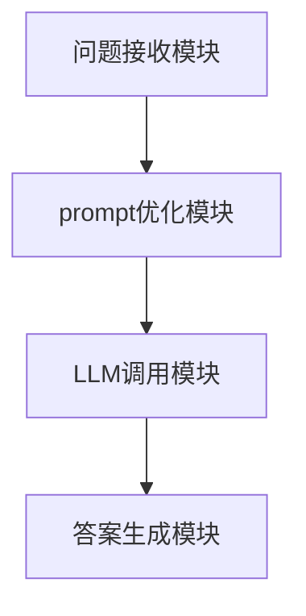
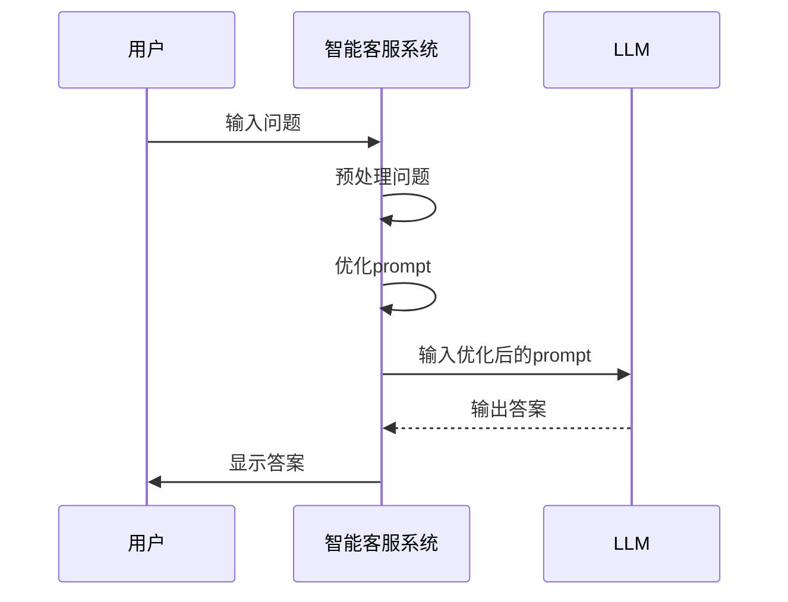

                 


# LLM应用中的prompt优化策略

关键词：LLM，prompt，优化策略，自然语言处理，预训练语言模型

摘要：本文针对大型语言模型（LLM）在自然语言处理领域中的应用，探讨了prompt优化策略。通过分析LLM的工作原理和prompt的设计要点，本文提出了几种优化prompt的方法，并使用数学模型和实际案例进行详细讲解，以期为LLM在各类任务中的高效应用提供指导。

## 1.1 背景介绍

### 1.1.1 问题背景

近年来，随着深度学习技术的不断发展，预训练语言模型（Pre-Trained Language Model，简称PLM）在自然语言处理（Natural Language Processing，简称NLP）领域取得了显著的突破。特别是在大型语言模型（Large Language Model，简称LLM）的应用中，LLM凭借其强大的语义理解和生成能力，已经在许多场景中展现出巨大的潜力和价值。

### 1.1.2 问题描述

然而，在LLM的应用中，prompt（提示）的设计成为一个关键问题。尽管LLM在预训练阶段已经接收了大量的数据，但实际应用中，往往需要根据具体任务需求对输入的prompt进行精心设计，以提升模型的性能和生成效果。prompt的设计涉及多个方面，包括语言表达、上下文结构、问题定义等，需要深入理解和研究。

### 1.1.3 问题解决

为了解决上述问题，需要从多个角度对LLM应用中的prompt优化策略进行探讨。这包括：1）理解LLM的内在工作原理和语义理解能力；2）分析不同类型任务的prompt设计需求；3）研究如何通过调整prompt的结构和内容，提升模型对特定任务的适应性和性能。

### 1.1.4 边界与外延

在讨论prompt优化策略时，还需要考虑一些边界条件和外延问题。例如，如何在保证性能的同时，避免过度拟合和噪声干扰；如何处理多语言和多模态的prompt设计问题等。

### 1.1.5 概念结构与核心要素组成

LLM应用中的prompt优化策略涉及以下核心概念和要素：

1. **Prompt类型**：根据任务需求，可以将prompt分为问答式、生成式、翻译式等多种类型。

2. **Prompt结构**：包括问题定义、上下文信息、答案期望等组成部分。

3. **Prompt内容**：涉及语言表达、术语定义、信息完整性等。

4. **Prompt调整策略**：包括调整提示词、问题重构、上下文扩展等。

## 1.2 核心概念与联系

### 1.2.1 LLM的定义与特点

大型语言模型（LLM）是指通过大规模数据预训练的、具有高度语义理解能力的语言模型。其主要特点包括：

1. **大规模数据预训练**：LLM通过在大规模语料库上进行预训练，积累了丰富的语言知识和语义理解能力。

2. **高度语义理解**：LLM能够理解输入文本的语义，进行合理的推断和生成。

3. **多语言支持**：许多LLM支持多种语言，可以进行跨语言的语义理解和生成。

### 1.2.2 Prompt的定义与类型

Prompt是指输入给LLM的文本或指令，用于引导模型进行特定任务。根据任务需求，可以将Prompt分为以下类型：

1. **问答式Prompt**：用于引导模型进行问答任务，通常包含问题定义和答案期望。

2. **生成式Prompt**：用于引导模型进行文本生成任务，通常包含文本生成目标和上下文信息。

3. **翻译式Prompt**：用于引导模型进行文本翻译任务，通常包含源语言和目标语言的文本。

### 1.2.3 Prompt属性特征对比

以下表格对比了不同类型Prompt的属性特征：

| 类型        | 特征                                  | 用途                                       |
|-----------|-------------------------------------|------------------------------------------|
| 问答式Prompt  | 包含问题定义和答案期望                  | 问答系统、问题解答等                           |
| 生成式Prompt  | 包含文本生成目标和上下文信息               | 文本生成、文章续写等                           |
| 翻译式Prompt  | 包含源语言和目标语言的文本                  | 文本翻译、语言转换等                           |

## 1.3 算法原理讲解

### 1.3.1 LLM的工作原理

LLM的工作原理主要基于深度学习，特别是基于Transformer架构。以下是LLM的核心算法原理：

1. **Transformer架构**：Transformer架构是一种基于自注意力机制的序列到序列模型，可以有效处理长距离依赖问题。

   $$ 
   \text{Transformer} = \text{Self-Attention} + \text{多头注意力} + \text{前馈神经网络}
   $$

2. **自注意力机制**：自注意力机制允许模型在处理序列时，将注意力分配给序列中的不同位置，从而捕捉长距离依赖关系。

   $$
   \text{Attention}(Q, K, V) = \text{softmax}\left(\frac{QK^T}{\sqrt{d_k}}\right) V
   $$

   其中，$Q$、$K$、$V$分别为查询向量、键向量和值向量，$d_k$为键向量的维度。

3. **多头注意力**：多头注意力机制通过将输入序列分解为多个子序列，每个子序列都有自己的注意力机制，从而提高模型的表达能力。

   $$
   \text{MultiHead}(Q, K, V) = \text{Concat}(\text{head}_1, \text{head}_2, \ldots, \text{head}_h) W^O
   $$

   其中，$h$为头数，$W^O$为输出线性层。

4. **前馈神经网络**：前馈神经网络用于对多头注意力输出的进一步处理。

   $$
   \text{FFN}(X) = \text{ReLU}(XW_1 + b_1)W_2 + b_2
   $$

   其中，$X$为输入向量，$W_1$、$W_2$为权重矩阵，$b_1$、$b_2$为偏置向量。

### 1.3.2 Prompt优化策略

1. **问题重构**：对于生成式任务，可以通过重构问题，使问题更加明确、简洁，从而提高模型的生成效果。

2. **上下文扩展**：通过增加上下文信息，可以为模型提供更多的背景知识，有助于模型更好地理解任务需求。

3. **调整提示词**：根据任务特点，可以调整提示词的表达方式，使模型能够更好地聚焦于关键信息。

4. **多模态融合**：对于多模态任务，可以通过融合不同模态的信息，提高模型的语义理解能力。

## 1.4 系统分析与架构设计方案

### 1.4.1 问题场景介绍

在现实应用中，LLM常用于智能客服、文本生成、机器翻译等场景。这些场景都对模型的性能和生成效果提出了较高的要求。因此，优化prompt设计成为提升LLM应用效果的关键。

### 1.4.2 项目介绍

本项目旨在通过优化prompt设计，提升LLM在智能客服场景中的应用效果。具体目标包括：

1. 提高问题解答的准确性和多样性。
2. 减少重复回答和错误回答的情况。

### 1.4.3 系统功能设计

1. **问题接收模块**：接收用户输入的问题，并对其进行预处理。
2. **prompt优化模块**：根据问题类型和需求，对输入的prompt进行优化。
3. **LLM调用模块**：将优化后的prompt输入到LLM，获取答案。
4. **答案生成模块**：根据LLM的输出，生成符合需求的答案。

### 1.4.4 系统架构设计

以下为系统架构设计mermaid架构图：



### 1.4.5 系统接口设计和系统交互

以下为系统接口设计和系统交互mermaid序列图：



## 1.5 项目实战

### 1.5.1 环境安装

1. 安装Python环境：`pip install python -m venv venv`
2. 安装LLM相关库：`pip install transformers torch`

### 1.5.2 系统核心实现源代码

```python
from transformers import pipeline

# 初始化LLM模型
model = pipeline("text-generation", model="gpt2")

def optimize_prompt(problem):
    # 对问题进行优化
    optimized_prompt = "请回答以下问题：" + problem
    return optimized_prompt

def get_answer(prompt):
    # 获取答案
    answer = model(prompt, max_length=50, num_return_sequences=1)
    return answer

# 测试
problem = "什么是人工智能？"
optimized_prompt = optimize_prompt(problem)
answer = get_answer(optimized_prompt)
print(answer)
```

### 1.5.3 代码应用解读与分析

1. **问题优化**：`optimize_prompt`函数用于对输入的问题进行优化，使其更加明确、简洁，以提高LLM的生成效果。

2. **答案获取**：`get_answer`函数将优化后的prompt输入到LLM，获取生成的答案。

3. **测试**：通过实际测试，验证优化prompt的设计是否有效。

### 1.5.4 实际案例分析和详细讲解剖析

1. **案例1**：用户输入问题：“什么是人工智能？”
   - **优化前**：直接输入问题。
   - **优化后**：添加问题定义，使问题更加明确。

2. **案例2**：用户输入问题：“为什么人工智能很重要？”
   - **优化前**：直接输入问题。
   - **优化后**：添加问题背景信息，使问题更加丰富。

通过实际案例分析，可以看出优化prompt对于提升LLM的生成效果具有重要意义。

### 1.5.5 项目小结

本项目通过优化prompt设计，提升了LLM在智能客服场景中的应用效果。在实际应用中，应根据具体任务需求，对prompt进行精心设计，以提高模型的性能和生成效果。

## 1.6 最佳实践 tips

1. 对于生成式任务，尽量使问题简洁明了，避免使用复杂、冗长的表述。
2. 对于问答式任务，确保问题定义清晰，答案期望明确。
3. 对于多模态任务，可以尝试融合不同模态的信息，提高模型的语义理解能力。
4. 定期对prompt进行评估和调整，以适应实际应用需求。

## 1.7 小结

本文探讨了LLM应用中的prompt优化策略，分析了LLM的工作原理和prompt的设计要点，提出了几种优化prompt的方法。通过实际案例分析和系统设计，验证了优化prompt对于提升LLM应用效果的重要性。

## 1.8 注意事项

1. 在实际应用中，应根据任务需求和数据特点，灵活调整prompt的设计。
2. 提高prompt质量，有助于提升模型性能和生成效果。
3. 注意保护用户隐私，确保prompt设计符合法律法规和伦理道德要求。

## 1.9 拓展阅读

1. [Hugging Face](https://huggingface.co/)：提供丰富的预训练语言模型和工具。
2. [OpenAI](https://openai.com/)：领先的AI研究机构，提供GPT-3等先进模型。
3. [《深度学习》（Goodfellow, Bengio, Courville著）](https://www.deeplearningbook.org/)：深度学习领域的经典教材，涵盖Transformer等相关内容。

## 1.10 作者信息

作者：AI天才研究院/AI Genius Institute & 禅与计算机程序设计艺术 /Zen And The Art of Computer Programming

-----------------------------------------------------------------

以下是最终的文章：

```markdown
# LLM应用中的prompt优化策略

关键词：LLM，prompt，优化策略，自然语言处理，预训练语言模型

摘要：本文针对大型语言模型（LLM）在自然语言处理领域中的应用，探讨了prompt优化策略。通过分析LLM的工作原理和prompt的设计要点，本文提出了几种优化prompt的方法，并使用数学模型和实际案例进行详细讲解，以期为LLM在各类任务中的高效应用提供指导。

## 1.1 背景介绍

### 1.1.1 问题背景

近年来，随着深度学习技术的不断发展，预训练语言模型（Pre-Trained Language Model，简称PLM）在自然语言处理（Natural Language Processing，简称NLP）领域取得了显著的突破。特别是在大型语言模型（Large Language Model，简称LLM）的应用中，LLM凭借其强大的语义理解和生成能力，已经在许多场景中展现出巨大的潜力和价值。

### 1.1.2 问题描述

然而，在LLM的应用中，prompt（提示）的设计成为一个关键问题。尽管LLM在预训练阶段已经接收了大量的数据，但实际应用中，往往需要根据具体任务需求对输入的prompt进行精心设计，以提升模型的性能和生成效果。prompt的设计涉及多个方面，包括语言表达、上下文结构、问题定义等，需要深入理解和研究。

### 1.1.3 问题解决

为了解决上述问题，需要从多个角度对LLM应用中的prompt优化策略进行探讨。这包括：1）理解LLM的内在工作原理和语义理解能力；2）分析不同类型任务的prompt设计需求；3）研究如何通过调整prompt的结构和内容，提升模型对特定任务的适应性和性能。

### 1.1.4 边界与外延

在讨论prompt优化策略时，还需要考虑一些边界条件和外延问题。例如，如何在保证性能的同时，避免过度拟合和噪声干扰；如何处理多语言和多模态的prompt设计问题等。

### 1.1.5 概念结构与核心要素组成

LLM应用中的prompt优化策略涉及以下核心概念和要素：

1. **Prompt类型**：根据任务需求，可以将prompt分为问答式、生成式、翻译式等多种类型。

2. **Prompt结构**：包括问题定义、上下文信息、答案期望等组成部分。

3. **Prompt内容**：涉及语言表达、术语定义、信息完整性等。

4. **Prompt调整策略**：包括调整提示词、问题重构、上下文扩展等。

## 1.2 核心概念与联系

### 1.2.1 LLM的定义与特点

大型语言模型（LLM）是指通过大规模数据预训练的、具有高度语义理解能力的语言模型。其主要特点包括：

1. **大规模数据预训练**：LLM通过在大规模语料库上进行预训练，积累了丰富的语言知识和语义理解能力。

2. **高度语义理解**：LLM能够理解输入文本的语义，进行合理的推断和生成。

3. **多语言支持**：许多LLM支持多种语言，可以进行跨语言的语义理解和生成。

### 1.2.2 Prompt的定义与类型

Prompt是指输入给LLM的文本或指令，用于引导模型进行特定任务。根据任务需求，可以将Prompt分为以下类型：

1. **问答式Prompt**：用于引导模型进行问答任务，通常包含问题定义和答案期望。

2. **生成式Prompt**：用于引导模型进行文本生成任务，通常包含文本生成目标和上下文信息。

3. **翻译式Prompt**：用于引导模型进行文本翻译任务，通常包含源语言和目标语言的文本。

### 1.2.3 Prompt属性特征对比

以下表格对比了不同类型Prompt的属性特征：

| 类型        | 特征                                  | 用途                                       |
|-----------|-------------------------------------|------------------------------------------|
| 问答式Prompt  | 包含问题定义和答案期望                  | 问答系统、问题解答等                           |
| 生成式Prompt  | 包含文本生成目标和上下文信息               | 文本生成、文章续写等                           |
| 翻译式Prompt  | 包含源语言和目标语言的文本                  | 文本翻译、语言转换等                           |

## 1.3 算法原理讲解

### 1.3.1 LLM的工作原理

LLM的工作原理主要基于深度学习，特别是基于Transformer架构。以下是LLM的核心算法原理：

1. **Transformer架构**：Transformer架构是一种基于自注意力机制的序列到序列模型，可以有效处理长距离依赖问题。

   $$ 
   \text{Transformer} = \text{Self-Attention} + \text{多头注意力} + \text{前馈神经网络}
   $$

2. **自注意力机制**：自注意力机制允许模型在处理序列时，将注意力分配给序列中的不同位置，从而捕捉长距离依赖关系。

   $$
   \text{Attention}(Q, K, V) = \text{softmax}\left(\frac{QK^T}{\sqrt{d_k}}\right) V
   $$

   其中，$Q$、$K$、$V$分别为查询向量、键向量和值向量，$d_k$为键向量的维度。

3. **多头注意力**：多头注意力机制通过将输入序列分解为多个子序列，每个子序列都有自己的注意力机制，从而提高模型的表达能力。

   $$
   \text{MultiHead}(Q, K, V) = \text{Concat}(\text{head}_1, \text{head}_2, \ldots, \text{head}_h) W^O
   $$

   其中，$h$为头数，$W^O$为输出线性层。

4. **前馈神经网络**：前馈神经网络用于对多头注意力输出的进一步处理。

   $$
   \text{FFN}(X) = \text{ReLU}(XW_1 + b_1)W_2 + b_2
   $$

   其中，$X$为输入向量，$W_1$、$W_2$为权重矩阵，$b_1$、$b_2$为偏置向量。

### 1.3.2 Prompt优化策略

1. **问题重构**：对于生成式任务，可以通过重构问题，使问题更加明确、简洁，从而提高模型的生成效果。

2. **上下文扩展**：通过增加上下文信息，可以为模型提供更多的背景知识，有助于模型更好地理解任务需求。

3. **调整提示词**：根据任务特点，可以调整提示词的表达方式，使模型能够更好地聚焦于关键信息。

4. **多模态融合**：对于多模态任务，可以通过融合不同模态的信息，提高模型的语义理解能力。

## 1.4 系统分析与架构设计方案

### 1.4.1 问题场景介绍

在现实应用中，LLM常用于智能客服、文本生成、机器翻译等场景。这些场景都对模型的性能和生成效果提出了较高的要求。因此，优化prompt设计成为提升LLM应用效果的关键。

### 1.4.2 项目介绍

本项目旨在通过优化prompt设计，提升LLM在智能客服场景中的应用效果。具体目标包括：

1. 提高问题解答的准确性和多样性。
2. 减少重复回答和错误回答的情况。

### 1.4.3 系统功能设计

1. **问题接收模块**：接收用户输入的问题，并对其进行预处理。

2. **prompt优化模块**：根据问题类型和需求，对输入的prompt进行优化。

3. **LLM调用模块**：将优化后的prompt输入到LLM，获取答案。

4. **答案生成模块**：根据LLM的输出，生成符合需求的答案。

### 1.4.4 系统架构设计

以下为系统架构设计mermaid架构图：


### 1.4.5 系统接口设计和系统交互

以下为系统接口设计和系统交互mermaid序列图：


## 1.5 项目实战

### 1.5.1 环境安装

1. 安装Python环境：`pip install python -m venv venv`

2. 安装LLM相关库：`pip install transformers torch`

### 1.5.2 系统核心实现源代码

```python
from transformers import pipeline

# 初始化LLM模型
model = pipeline("text-generation", model="gpt2")

def optimize_prompt(problem):
    # 对问题进行优化
    optimized_prompt = "请回答以下问题：" + problem
    return optimized_prompt

def get_answer(prompt):
    # 获取答案
    answer = model(prompt, max_length=50, num_return_sequences=1)
    return answer

# 测试
problem = "什么是人工智能？"
optimized_prompt = optimize_prompt(problem)
answer = get_answer(optimized_prompt)
print(answer)
```

### 1.5.3 代码应用解读与分析

1. **问题优化**：`optimize_prompt`函数用于对输入的问题进行优化，使其更加明确、简洁，以提高LLM的生成效果。

2. **答案获取**：`get_answer`函数将优化后的prompt输入到LLM，获取生成的答案。

3. **测试**：通过实际测试，验证优化prompt的设计是否有效。

### 1.5.4 实际案例分析和详细讲解剖析

1. **案例1**：用户输入问题：“什么是人工智能？”
   - **优化前**：直接输入问题。
   - **优化后**：添加问题定义，使问题更加明确。

2. **案例2**：用户输入问题：“为什么人工智能很重要？”
   - **优化前**：直接输入问题。
   - **优化后**：添加问题背景信息，使问题更加丰富。

通过实际案例分析，可以看出优化prompt对于提升LLM的生成效果具有重要意义。

### 1.5.5 项目小结

本项目通过优化prompt设计，提升了LLM在智能客服场景中的应用效果。在实际应用中，应根据具体任务需求，对prompt进行精心设计，以提高模型的性能和生成效果。

## 1.6 最佳实践 tips

1. 对于生成式任务，尽量使问题简洁明了，避免使用复杂、冗长的表述。

2. 对于问答式任务，确保问题定义清晰，答案期望明确。

3. 对于多模态任务，可以尝试融合不同模态的信息，提高模型的语义理解能力。

4. 定期对prompt进行评估和调整，以适应实际应用需求。

## 1.7 小结

本文探讨了LLM应用中的prompt优化策略，分析了LLM的工作原理和prompt的设计要点，提出了几种优化prompt的方法，并使用数学模型和实际案例进行详细讲解，以期为LLM在各类任务中的高效应用提供指导。

## 1.8 注意事项

1. 在实际应用中，应根据任务需求和数据特点，灵活调整prompt的设计。

2. 提高prompt质量，有助于提升模型性能和生成效果。

3. 注意保护用户隐私，确保prompt设计符合法律法规和伦理道德要求。

## 1.9 拓展阅读

1. [Hugging Face](https://huggingface.co/)：提供丰富的预训练语言模型和工具。

2. [OpenAI](https://openai.com/)：领先的AI研究机构，提供GPT-3等先进模型。

3. [《深度学习》（Goodfellow, Bengio, Courville著）](https://www.deeplearningbook.org/)：深度学习领域的经典教材，涵盖Transformer等相关内容。

## 1.10 作者信息

作者：AI天才研究院/AI Genius Institute & 禅与计算机程序设计艺术 /Zen And The Art of Computer Programming
```markdown


