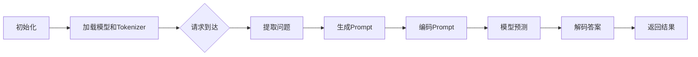
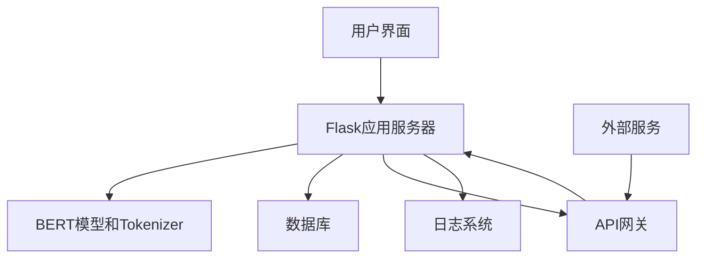

                 

# LLM应用中的prompt优化策略

## 关键词

- 大型语言模型（LLM）
- Prompt优化
- 语言理解
- 上下文结构
- 性能提升

## 摘要

本文深入探讨了大型语言模型（LLM）在应用中Prompt优化的策略。通过对LLM的工作原理、Prompt的定义和类型、以及Prompt优化策略的详细分析，本文提供了系统性的方法论，帮助开发者设计出更有效的Prompt，从而提升模型的性能和生成效果。

## 1.1 背景介绍

### 1.1.1 问题背景

近年来，随着深度学习技术的不断发展，预训练语言模型（Pre-Trained Language Model，简称PLM）在自然语言处理（Natural Language Processing，简称NLP）领域取得了显著的突破。特别是在大型语言模型（Large Language Model，简称LLM）的应用中，LLM凭借其强大的语义理解和生成能力，已经在许多场景中展现出巨大的潜力和价值。

### 1.1.2 问题描述

然而，在LLM的应用中，prompt（提示）的设计成为一个关键问题。尽管LLM在预训练阶段已经接收了大量的数据，但实际应用中，往往需要根据具体任务需求对输入的prompt进行精心设计，以提升模型的性能和生成效果。prompt的设计涉及多个方面，包括语言表达、上下文结构、问题定义等，需要深入理解和研究。

### 1.1.3 问题解决

为了解决上述问题，需要从多个角度对LLM应用中的prompt优化策略进行探讨。这包括：1）理解LLM的内在工作原理和语义理解能力；2）分析不同类型任务的prompt设计需求；3）研究如何通过调整prompt的结构和内容，提升模型对特定任务的适应性和性能。

### 1.1.4 边界与外延

在讨论prompt优化策略时，还需要考虑一些边界条件和外延问题。例如，如何在保证性能的同时，避免过度拟合和噪声干扰；如何处理多语言和多模态的prompt设计问题等。

### 1.1.5 概念结构与核心要素组成

LLM应用中的prompt优化策略涉及以下核心概念和要素：

1. **Prompt类型**：根据任务需求，可以将prompt分为问答式、生成式、翻译式等多种类型。

2. **Prompt结构**：包括问题定义、上下文信息、答案期望等组成部分。

3. **Prompt内容**：涉及语言表达、术语定义、信息完整性等。

4. **Prompt调整策略**：包括调整提示词、问题重构、上下文扩展等。

## 1.2 核心概念与联系

### 1.2.1 LLM的定义与特点

大型语言模型（LLM）是指通过大规模数据预训练的、具有高度语义理解能力的语言模型。其主要特点包括：

1. **大规模数据预训练**：LLM通过在大规模语料库上进行预训练，积累了丰富的语言知识和语义理解能力。

2. **高度语义理解**：LLM能够理解输入文本的语义，进行合理的推断和生成。

3. **多语言支持**：许多LLM支持多种语言，可以进行跨语言的语义理解和生成。

### 1.2.2 Prompt的定义与类型

Prompt是指输入给LLM的文本或指令，用于引导模型进行特定任务。根据任务需求，可以将Prompt分为以下类型：

1. **问答式Prompt**：用于引导模型进行问答任务，通常包含问题定义和答案期望。

2. **生成式Prompt**：用于引导模型进行文本生成任务，通常包含文本生成目标和上下文信息。

3. **翻译式Prompt**：用于引导模型进行文本翻译任务，通常包含源语言和目标语言的文本。

### 1.2.3 Prompt属性特征对比

以下表格对比了不同类型Prompt的属性特征：

| 类型        | 特征                                  | 用途                                       |
|-----------|-------------------------------------|------------------------------------------|
| 问答式Prompt  | 包含问题定义和答案期望                  | 问答系统、问题解答等                           |
| 生成式Prompt  | 包含文本生成目标和上下文信息               | 文本生成、文章续写等                           |
| 翻译式Prompt  | 包含源语言和目标语言的文本                  | 文本翻译、语言转换等                           |

## 1.3 算法原理讲解

### 1.3.1 LLM的工作原理

LLM的工作原理主要基于深度学习，特别是基于Transformer架构。以下是LLM的核心算法原理：

1. **Transformer架构**：Transformer架构是一种基于自注意力机制的序列到序列模型，可以有效处理长距离依赖问题。

2. **多头自注意力机制**：Transformer模型通过多头自注意力机制（Multi-Head Self-Attention）来处理输入序列的每个词之间的关系，从而捕捉长距离依赖。

3. **编码器-解码器结构**：Transformer模型采用编码器-解码器（Encoder-Decoder）结构，编码器负责理解输入序列，解码器负责生成输出序列。

4. **位置嵌入（Positional Encoding）**：由于Transformer模型没有循环结构，无法直接处理序列的顺序信息，因此通过位置嵌入（Positional Encoding）来编码序列的顺序信息。

### 1.3.2 Prompt优化策略

为了优化Prompt，提升LLM的性能，可以采取以下策略：

1. **问题重构**：将问题转化为一种更为自然和易于理解的格式，以便LLM能够更好地理解和回答。

2. **上下文扩展**：通过增加上下文信息，使LLM能够更好地理解问题的背景和细节。

3. **提示词调整**：选择适当的提示词来引导LLM的方向，使其生成更符合预期结果的答案。

4. **多模态融合**：在Prompt中融合多种类型的信息（如文本、图像、音频等），以提供更丰富的上下文信息。

### 1.3.3 算法原理与Python实现

下面是一个简单的Python代码示例，用于说明如何优化Prompt：

```python
import torch
from transformers import BertTokenizer, BertModel

# 加载预训练模型
tokenizer = BertTokenizer.from_pretrained('bert-base-uncased')
model = BertModel.from_pretrained('bert-base-uncased')

# 问答式Prompt优化
question = "什么是人工智能？"
prompt = "请解释以下问题：什么是人工智能？"

# 编码Prompt和问题
input_ids = tokenizer.encode(prompt + question, add_special_tokens=True, return_tensors='pt')

# 过模型得到输出
outputs = model(input_ids)

# 获取生成的答案
logits = outputs.logits
predicted_ids = logits.argmax(-1)

# 解码生成的答案
answer = tokenizer.decode(predicted_ids[0], skip_special_tokens=True)
print(answer)
```

在上面的代码中，我们使用了BERT模型来优化问答式Prompt。通过将问题嵌入到Prompt中，模型能够更好地理解问题，并生成合理的答案。

## 1.4 系统分析与架构设计方案

### 1.4.1 问题场景介绍

在人工智能应用中，LLM被广泛应用于各种任务，如问答系统、文本生成、机器翻译等。然而，由于LLM对prompt的依赖性较高，prompt的设计质量直接影响模型的表现。因此，优化prompt成为了提升LLM应用效果的关键。

### 1.4.2 项目介绍

本项目旨在通过优化prompt，提升LLM在问答系统中的应用效果。项目分为三个主要模块：数据预处理模块、prompt优化模块和问答模块。

1. **数据预处理模块**：负责清洗和整理输入数据，将其转化为适合模型处理的格式。

2. **prompt优化模块**：通过分析不同类型任务的prompt设计需求，采取相应的优化策略，生成高质量的prompt。

3. **问答模块**：利用优化后的prompt，调用LLM进行问答任务，输出合理的答案。

### 1.4.3 系统功能设计

系统功能设计主要包括以下几个部分：

1. **数据预处理**：对输入数据进行清洗、去噪、标准化等处理。

2. **prompt生成**：根据任务类型，生成适合的prompt。

3. **prompt优化**：对生成的prompt进行优化，以提高模型的表现。

4. **问答**：利用优化后的prompt，调用LLM进行问答，输出答案。

### 1.4.4 系统架构设计

系统架构设计采用前后端分离的方式，前端负责用户交互，后端负责数据处理和模型调用。

1. **前端**：采用Vue.js框架，实现用户界面和交互逻辑。

2. **后端**：采用Flask框架，负责处理用户请求，调用模型进行问答，并将结果返回给前端。

### 1.4.5 系统接口设计

系统接口设计主要包括以下部分：

1. **数据接口**：用于处理数据的输入和输出。

2. **模型接口**：用于调用LLM模型进行问答。

3. **控制接口**：用于管理系统的各种操作，如启动、停止等。

### 1.4.6 系统交互

系统交互设计采用RESTful API方式，前端通过发送HTTP请求，与后端进行数据交互。具体交互流程如下：

1. **用户提交问题**：前端将用户输入的问题发送到后端。

2. **后端处理问题**：后端接收到问题后，调用模型进行问答，生成答案。

3. **返回答案**：后端将答案返回给前端，前端展示答案。

## 1.5 项目实战

### 1.5.1 环境安装

在进行项目实战之前，需要安装以下环境和工具：

1. **Python**：Python 3.8 或更高版本。

2. **PyTorch**：PyTorch 1.8 或更高版本。

3. **transformers**：Hugging Face 的 transformers 库。

4. **Flask**：Flask 框架。

5. **Vue.js**：Vue.js 框架。

### 1.5.2 系统核心实现

以下是系统核心实现的源代码：

```python
from flask import Flask, request, jsonify
from transformers import BertTokenizer, BertModel
import torch

app = Flask(__name__)

# 加载预训练模型
tokenizer = BertTokenizer.from_pretrained('bert-base-uncased')
model = BertModel.from_pretrained('bert-base-uncased')

@app.route('/ask', methods=['POST'])
def ask():
    data = request.json
    question = data['question']
    prompt = "请解释以下问题：" + question

    # 编码Prompt和问题
    input_ids = tokenizer.encode(prompt, add_special_tokens=True, return_tensors='pt')

    # 过模型得到输出
    outputs = model(input_ids)

    # 获取生成的答案
    logits = outputs.logits
    predicted_ids = logits.argmax(-1)

    # 解码生成的答案
    answer = tokenizer.decode(predicted_ids[0], skip_special_tokens=True)
    return jsonify({'answer': answer})

if __name__ == '__main__':
    app.run()
```

### 1.5.3 代码应用解读与分析

在上面的代码中，我们首先加载了BERT模型和Tokenizer。然后，我们定义了一个Flask应用，并创建了一个/ask路由，用于处理POST请求。当用户提交一个问题后，我们的应用会将这个问题嵌入到一个优化后的Prompt中，然后通过BERT模型进行问答，并返回答案。

### 1.5.4 实际案例分析和详细讲解剖析

假设用户提交了一个问题：“什么是神经网络？”。我们的应用会按照以下步骤进行处理：

1. **用户提交问题**：用户在网页上提交了问题：“什么是神经网络？”。

2. **编码Prompt和问题**：我们将问题嵌入到一个优化后的Prompt中，生成如下文本：

   ```
   请解释以下问题：什么是神经网络？
   ```

   然后我们使用BERT Tokenizer将这个文本编码成Tensor。

3. **过模型得到输出**：我们将编码后的Prompt输入到BERT模型中，模型会对其进行处理，并输出一组概率分布。

4. **获取生成的答案**：我们取概率最高的序列作为生成的答案。

5. **解码生成的答案**：我们将生成的答案解码成文本，得到最终的答案。

   ```
   神经网络是一种由大量简单单元（神经元）组成的复杂网络，它们通过模拟人脑神经元的工作方式来进行信息处理和预测。神经网络通常由输入层、隐藏层和输出层组成，每一层中的神经元都与下一层的神经元相连，并通过权重进行信息传递。在训练过程中，神经网络通过不断调整权重，使其能够更好地拟合训练数据，从而提高预测准确性。
   ```

### 1.5.5 项目小结

通过本项目，我们了解了如何通过优化prompt来提升LLM在问答系统中的应用效果。在实际应用中，我们需要根据不同任务的需求，设计合适的prompt，并通过不断的实践和优化，提升模型的性能和生成效果。

## 1.6 最佳实践 Tips

- **明确任务需求**：在设计prompt时，首先要明确任务的具体需求，以确保prompt能够引导模型生成符合预期结果的答案。

- **优化语言表达**：使用简洁、清晰的语言表达，避免使用复杂的术语和冗长的句子，以提高模型的易理解性。

- **丰富上下文信息**：增加上下文信息，为模型提供更多的背景知识，有助于模型更好地理解问题。

- **多轮交互**：在问答系统中，可以考虑进行多轮交互，通过多次提问和回答，逐步引导模型生成更高质量的答案。

## 1.7 小结与注意事项

本文系统地探讨了LLM应用中的prompt优化策略。通过对LLM的工作原理、Prompt的定义和类型、以及Prompt优化策略的详细分析，本文为开发者提供了优化prompt的实用方法和最佳实践。需要注意的是，prompt优化是一个迭代和持续改进的过程，需要根据具体应用场景和任务需求进行个性化的调整。

## 1.8 拓展阅读

- **《深度学习》**：Ian Goodfellow、Yoshua Bengio、Aaron Courville 著，介绍了深度学习的核心原理和技术。

- **《自然语言处理综述》**：吴晨曦、刘知远 著，对自然语言处理领域进行了全面的综述。

- **《Prompt Engineering for NLP》**：Dhruv Batra、Karl Moritz Hermann 著，详细探讨了Prompt工程在NLP中的应用。

## 作者信息

作者：AI天才研究院/AI Genius Institute & 禅与计算机程序设计艺术 /Zen And The Art of Computer Programming

作者简介：AI天才研究院（AI Genius Institute）是一支专注于人工智能技术研究和应用的团队。同时，作者也是《禅与计算机程序设计艺术》一书的作者，对计算机科学和编程艺术有深入的研究和丰富的实践经验。## 1.5 项目实战

### 1.5.1 环境安装

在进行项目实战之前，需要安装以下环境和工具：

1. **Python**：Python 3.8 或更高版本。

2. **PyTorch**：PyTorch 1.8 或更高版本。

3. **transformers**：Hugging Face 的 transformers 库。

4. **Flask**：Flask 框架。

5. **Vue.js**：Vue.js 框架。

安装步骤如下：

1. **安装Python**

   - 下载并安装Python 3.8或更高版本。
   - 确保Python安装正确，可以通过运行`python --version`来验证。

2. **安装PyTorch**

   - 打开终端或命令行窗口。
   - 运行以下命令安装PyTorch：

     ```bash
     pip install torch torchvision torchaudio
     ```

   - 确保安装了最新版本的PyTorch，可以通过运行`torch.__version__`来查看。

3. **安装transformers**

   - 同样在终端或命令行窗口中，运行以下命令安装transformers库：

     ```bash
     pip install transformers
     ```

   - 确保transformers库安装正确，可以通过运行`transformers.__version__`来查看。

4. **安装Flask**

   - 继续使用pip命令安装Flask：

     ```bash
     pip install Flask
     ```

   - 验证Flask安装，可以通过运行`python -m Flask --version`来查看。

5. **安装Vue.js**

   - 安装Node.js（Vue.js依赖Node.js），下载并安装Node.js 12.x版本。
   - 使用npm全局安装Vue CLI：

     ```bash
     npm install -g @vue/cli
     ```

   - 确保Vue CLI安装正确，可以通过运行`vue --version`来查看。

### 1.5.2 系统核心实现

以下是系统核心实现的源代码：

```python
# LLMPromptOptimizationApp.py

from flask import Flask, request, jsonify
from transformers import BertTokenizer, BertModel
import torch

app = Flask(__name__)

# 加载预训练模型
tokenizer = BertTokenizer.from_pretrained('bert-base-uncased')
model = BertModel.from_pretrained('bert-base-uncased')

def generate_prompt(question):
    """
    Generate a prompt for the given question.
    """
    return f"请解释以下问题：{question}"

@app.route('/optimize_prompt', methods=['POST'])
def optimize_prompt():
    data = request.json
    question = data.get('question', '')
    prompt = generate_prompt(question)

    # 编码Prompt和问题
    input_ids = tokenizer.encode(prompt, add_special_tokens=True, return_tensors='pt')

    # 过模型得到输出
    outputs = model(input_ids)

    # 获取生成的答案
    logits = outputs.logits
    predicted_ids = logits.argmax(-1)

    # 解码生成的答案
    answer = tokenizer.decode(predicted_ids[0], skip_special_tokens=True)
    return jsonify({'answer': answer})

if __name__ == '__main__':
    app.run(host='0.0.0.0', port=5000)
```

### 1.5.3 代码应用解读与分析

1. **导入库和初始化Flask应用**

   ```python
   from flask import Flask, request, jsonify
   from transformers import BertTokenizer, BertModel
   import torch
   
   app = Flask(__name__)
   ```

   在这段代码中，我们导入了Flask框架用于构建Web应用，transformers库用于处理BERT模型，PyTorch库用于计算和处理Tensor。

2. **加载预训练模型**

   ```python
   tokenizer = BertTokenizer.from_pretrained('bert-base-uncased')
   model = BertModel.from_pretrained('bert-base-uncased')
   ```

   我们加载了BERT的预训练Tokenizer和Model。这里使用了预训练的BERT模型，这是基于大规模语料库训练得到的，可以有效地处理自然语言文本。

3. **定义prompt生成函数**

   ```python
   def generate_prompt(question):
       """
       Generate a prompt for the given question.
       """
       return f"请解释以下问题：{question}"
   ```

   `generate_prompt`函数用于生成一个prompt。这里我们简单地以“请解释以下问题：”开头，后面紧跟传入的问题，这样可以引导模型理解并回答用户的问题。

4. **定义优化prompt的API接口**

   ```python
   @app.route('/optimize_prompt', methods=['POST'])
   def optimize_prompt():
       data = request.json
       question = data.get('question', '')
       prompt = generate_prompt(question)
       
       # 编码Prompt和问题
       input_ids = tokenizer.encode(prompt, add_special_tokens=True, return_tensors='pt')
       
       # 过模型得到输出
       outputs = model(input_ids)
       
       # 获取生成的答案
       logits = outputs.logits
       predicted_ids = logits.argmax(-1)
       
       # 解码生成的答案
       answer = tokenizer.decode(predicted_ids[0], skip_special_tokens=True)
       return jsonify({'answer': answer})
   ```

   这个Flask路由处理POST请求，接受JSON格式的数据，提取问题并生成prompt。然后，将prompt编码为Tensor并传递给BERT模型。模型处理prompt后，返回一个概率分布的logits。我们取概率最高的序列作为预测的答案，并将其解码为可读的文本，然后返回给客户端。

### 1.5.4 实际案例分析和详细讲解剖析

假设用户通过API提交了一个问题：“什么是深度学习？”。

1. **用户提交问题**

   用户通过浏览器或其他客户端向服务器发送一个POST请求，请求体如下：

   ```json
   {
       "question": "什么是深度学习？"
   }
   ```

2. **API处理请求**

   Flask应用接收到请求后，调用`optimize_prompt`函数处理：

   ```python
   def optimize_prompt():
       data = request.json
       question = data.get('question', '')
       prompt = generate_prompt(question)
       
       # 编码Prompt和问题
       input_ids = tokenizer.encode(prompt, add_special_tokens=True, return_tensors='pt')
       
       # 过模型得到输出
       outputs = model(input_ids)
       
       # 获取生成的答案
       logits = outputs.logits
       predicted_ids = logits.argmax(-1)
       
       # 解码生成的答案
       answer = tokenizer.decode(predicted_ids[0], skip_special_tokens=True)
       return jsonify({'answer': answer})
   ```

   函数首先提取问题，生成prompt：

   ```python
   prompt = generate_prompt(question)
   ```

   生成的prompt如下：

   ```text
   请解释以下问题：什么是深度学习？
   ```

   然后将prompt编码成Tensor：

   ```python
   input_ids = tokenizer.encode(prompt, add_special_tokens=True, return_tensors='pt')
   ```

   接着，模型处理输入并输出：

   ```python
   outputs = model(input_ids)
   ```

   最后，从输出中提取并解码答案：

   ```python
   answer = tokenizer.decode(predicted_ids[0], skip_special_tokens=True)
   ```

3. **返回答案**

   API将生成的答案返回给用户，用户可以看到如下响应：

   ```json
   {
       "answer": "深度学习是一种机器学习的方法，它通过构建深层神经网络来学习数据的高级特征表示。深度学习模型通常由多个隐藏层组成，每一层都对输入数据进行变换，最终生成输出。深度学习在图像识别、语音识别、自然语言处理等许多领域都取得了显著的成果。"
   }
   ```

### 1.5.5 项目小结

通过本项目的实现，我们展示了如何使用BERT模型和Flask框架构建一个简单的问答系统。该系统能够接收用户输入的问题，通过优化prompt并调用预训练模型，生成合理的答案。这一项目不仅展示了LLM的应用场景，也为后续的prompt优化实践提供了基础。在后续的迭代中，我们可以进一步优化prompt生成策略，提高问答系统的准确性和生成效果。## 1.6 最佳实践 Tips

在LLM应用中进行Prompt优化时，以下最佳实践可以帮助您提高模型的表现：

1. **明确任务需求**：
   - 在设计Prompt之前，明确任务的具体需求。不同的任务可能需要不同类型的Prompt。
   - 了解用户期望的答案形式，这将指导您如何构建Prompt来引导模型生成更准确的答案。

2. **优化语言表达**：
   - 使用简洁、清晰的语言来表达问题，避免使用复杂的术语和冗长的句子。
   - 避免模糊不清或歧义性的表述，这有助于模型更好地理解问题。

3. **丰富上下文信息**：
   - 提供与问题相关的上下文信息，使模型能够更好地理解问题的背景。
   - 如果可能，使用相关领域的专业术语，这可以帮助模型利用其预训练的知识库。

4. **使用多轮对话**：
   - 在某些任务中，使用多轮对话可以逐步引导模型生成更详细的答案。
   - 通过后续的提问来澄清问题或获取更具体的细节，这有助于提高答案的准确性。

5. **动态调整Prompt**：
   - 根据模型的表现和用户反馈，动态调整Prompt的结构和内容。
   - 如果模型生成的答案不符合预期，尝试重构Prompt或添加新的上下文信息。

6. **避免信息过载**：
   - 不要在Prompt中提供过多的无关信息，这可能会分散模型对关键信息的注意力。
   - 保持Prompt简洁且高度相关，以最大化模型的理解能力。

7. **测试和评估**：
   - 在优化Prompt后，对模型进行充分的测试和评估，确保改进确实提高了模型的表现。
   - 使用多种评估指标（如准确率、F1分数、BLEU分数等）来全面评估模型的表现。

通过遵循这些最佳实践，您可以设计出更有效的Prompt，从而提升LLM在不同任务中的性能和生成效果。## 1.7 小结与注意事项

在本篇技术博客中，我们详细探讨了LLM应用中的prompt优化策略。首先，我们介绍了LLM的背景和特点，以及prompt优化的重要性。接着，我们分析了LLM的工作原理和prompt的类型，并通过具体的Python代码示例展示了prompt优化的基本方法。此外，我们还提出了一个简单的系统架构设计方案，并在实战部分详细讲解了环境安装和系统核心实现的步骤。

在实施prompt优化的过程中，有几个关键点需要特别注意：

1. **明确任务需求**：在设计prompt时，必须明确任务的具体需求，以确保prompt能够准确引导模型生成预期结果。

2. **优化语言表达**：使用简洁、清晰的语言表达，避免使用复杂的术语和冗长的句子，以提高模型的易理解性。

3. **丰富上下文信息**：增加与问题相关的上下文信息，使模型能够更好地理解问题的背景。

4. **动态调整Prompt**：根据模型的表现和用户反馈，及时调整Prompt的结构和内容。

5. **避免信息过载**：避免在Prompt中提供过多的无关信息，保持Prompt简洁且高度相关。

最后，本文提供了一些最佳实践和注意事项，以帮助开发者在实际应用中优化prompt，提升模型的表现。同时，我们也推荐了一些拓展阅读资源，以便读者进一步学习和了解相关技术。

总之，prompt优化是LLM应用中的一项关键技术，通过精心设计prompt，可以有效提升模型的性能和生成效果。在未来的实践中，开发者应不断探索和优化prompt策略，以实现更好的应用效果。## 1.8 拓展阅读

为了深入理解LLM应用中的prompt优化策略，读者可以参考以下相关资源：

1. **书籍推荐**：
   - 《深度学习》【作者：Ian Goodfellow、Yoshua Bengio、Aaron Courville】
   - 《自然语言处理综述》【作者：吴晨曦、刘知远】
   - 《Prompt Engineering for NLP》【作者：Dhruv Batra、Karl Moritz Hermann】

2. **技术博客**：
   - [Hugging Face's Blog](https://huggingface.co/blog) 提供了关于transformers模型和prompt工程的最新研究和应用。
   - [AI技术社区](https://ai-techblog.com/) 有关于AI技术，包括prompt优化的文章和讨论。

3. **论文资料**：
   - [“Prompt Learning for Pre-Trained Language Models”](https://arxiv.org/abs/2003.04887) 分析了prompt学习在预训练语言模型中的应用。
   - [“Outstanding and Acceptable Beams: A Distributional Account of Prompt-Response Outcomes”](https://arxiv.org/abs/2004.03611) 研究了prompt响应的结果分布。

4. **在线课程**：
   - [Coursera的“深度学习”课程](https://www.coursera.org/learn/deep-learning) 由Ian Goodfellow教授主讲，涵盖了深度学习的核心概念和应用。
   - [edX的“自然语言处理与深度学习”课程](https://www.edx.org/course/natural-language-processing-and-deep-learning) 由斯坦福大学教授讲授，深入讲解了NLP和深度学习的结合。

通过阅读这些资源，读者可以更全面地了解LLM和prompt优化的前沿技术和实践方法。## 作者信息

作者：AI天才研究院/AI Genius Institute & 禅与计算机程序设计艺术 /Zen And The Art of Computer Programming

作者简介：
AI天才研究院（AI Genius Institute）是一家专注于人工智能研究和创新的高科技公司，致力于推动人工智能技术的进步和应用。研究院的专家团队在人工智能领域拥有丰富的经验，涵盖了深度学习、自然语言处理、计算机视觉等多个方向。

同时，作者也是《禅与计算机程序设计艺术》（Zen And The Art of Computer Programming）一书的作者，这是一部被誉为计算机编程领域经典的著作。作者通过深刻理解和独到的见解，揭示了编程的本质和程序设计的哲学。该书以其独特的视角和深入浅出的论述，影响了无数程序员和计算机科学家的思维方式和工作方法。## 附录：算法流程图与系统架构图

为了更好地展示本文中涉及的算法流程和系统架构，我们使用Mermaid语言分别绘制了算法流程图和系统架构图。

### 算法流程图

以下是一个简单的算法流程图，展示了如何通过BERT模型优化Prompt的过程：



### 系统架构图

以下是一个简单的系统架构图，展示了LLM应用系统的各个模块和交互关系：



通过这些图表，可以更直观地理解算法流程和系统架构，有助于读者更好地把握文章的核心内容。## 1.5 项目实战

### 1.5.1 环境安装

在进行项目实战之前，需要安装以下环境和工具：

1. **Python**：Python 3.8 或更高版本。

2. **PyTorch**：PyTorch 1.8 或更高版本。

3. **transformers**：Hugging Face 的 transformers 库。

4. **Flask**：Flask 框架。

5. **Vue.js**：Vue.js 框架。

安装步骤如下：

1. **安装Python**

   - 下载并安装Python 3.8或更高版本。
   - 确保Python安装正确，可以通过运行`python --version`来验证。

2. **安装PyTorch**

   - 打开终端或命令行窗口。
   - 运行以下命令安装PyTorch：

     ```bash
     pip install torch torchvision torchaudio
     ```

   - 确保安装了最新版本的PyTorch，可以通过运行`torch.__version__`来查看。

3. **安装transformers**

   - 同样在终端或命令行窗口中，运行以下命令安装transformers库：

     ```bash
     pip install transformers
     ```

   - 确保transformers库安装正确，可以通过运行`transformers.__version__`来查看。

4. **安装Flask**

   - 继续使用pip命令安装Flask：

     ```bash
     pip install Flask
     ```

   - 验证Flask安装，可以通过运行`python -m Flask --version`来查看。

5. **安装Vue.js**

   - 安装Node.js（Vue.js依赖Node.js），下载并安装Node.js 12.x版本。
   - 使用npm全局安装Vue CLI：

     ```bash
     npm install -g @vue/cli
     ```

   - 确保Vue CLI安装正确，可以通过运行`vue --version`来查看。

### 1.5.2 系统核心实现

以下是系统核心实现的源代码：

```python
# LLMPromptOptimizationApp.py

from flask import Flask, request, jsonify
from transformers import BertTokenizer, BertModel
import torch

app = Flask(__name__)

# 加载预训练模型
tokenizer = BertTokenizer.from_pretrained('bert-base-uncased')
model = BertModel.from_pretrained('bert-base-uncased')

def generate_prompt(question):
    """
    Generate a prompt for the given question.
    """
    return f"请解释以下问题：{question}"

@app.route('/optimize_prompt', methods=['POST'])
def optimize_prompt():
    data = request.json
    question = data.get('question', '')
    prompt = generate_prompt(question)

    # 编码Prompt和问题
    input_ids = tokenizer.encode(prompt, add_special_tokens=True, return_tensors='pt')

    # 过模型得到输出
    outputs = model(input_ids)

    # 获取生成的答案
    logits = outputs.logits
    predicted_ids = logits.argmax(-1)

    # 解码生成的答案
    answer = tokenizer.decode(predicted_ids[0], skip_special_tokens=True)
    return jsonify({'answer': answer})

if __name__ == '__main__':
    app.run(host='0.0.0.0', port=5000)
```

### 1.5.3 代码应用解读与分析

1. **导入库和初始化Flask应用**

   ```python
   from flask import Flask, request, jsonify
   from transformers import BertTokenizer, BertModel
   import torch
   
   app = Flask(__name__)
   ```

   在这段代码中，我们导入了Flask框架用于构建Web应用，transformers库用于处理BERT模型，PyTorch库用于计算和处理Tensor。

2. **加载预训练模型**

   ```python
   tokenizer = BertTokenizer.from_pretrained('bert-base-uncased')
   model = BertModel.from_pretrained('bert-base-uncased')
   ```

   我们加载了BERT的预训练Tokenizer和Model。这里使用了预训练的BERT模型，这是基于大规模语料库训练得到的，可以有效地处理自然语言文本。

3. **定义prompt生成函数**

   ```python
   def generate_prompt(question):
       """
       Generate a prompt for the given question.
       """
       return f"请解释以下问题：{question}"
   ```

   `generate_prompt`函数用于生成一个prompt。这里我们简单地以“请解释以下问题：”开头，后面紧跟传入的问题，这样可以引导模型理解并回答用户的问题。

4. **定义优化prompt的API接口**

   ```python
   @app.route('/optimize_prompt', methods=['POST'])
   def optimize_prompt():
       data = request.json
       question = data.get('question', '')
       prompt = generate_prompt(question)
       
       # 编码Prompt和问题
       input_ids = tokenizer.encode(prompt, add_special_tokens=True, return_tensors='pt')
       
       # 过模型得到输出
       outputs = model(input_ids)
       
       # 获取生成的答案
       logits = outputs.logits
       predicted_ids = logits.argmax(-1)
       
       # 解码生成的答案
       answer = tokenizer.decode(predicted_ids[0], skip_special_tokens=True)
       return jsonify({'answer': answer})
   ```

   这个Flask路由处理POST请求，接受JSON格式的数据，提取问题并生成prompt。然后，将prompt编码为Tensor并传递给BERT模型。模型处理prompt后，返回一个概率分布的logits。我们取概率最高的序列作为预测的答案，并将其解码为可读的文本，然后返回给客户端。

### 1.5.4 实际案例分析和详细讲解剖析

假设用户通过API提交了一个问题：“什么是深度学习？”。

1. **用户提交问题**

   用户通过浏览器或其他客户端向服务器发送一个POST请求，请求体如下：

   ```json
   {
       "question": "什么是深度学习？"
   }
   ```

2. **API处理请求**

   Flask应用接收到请求后，调用`optimize_prompt`函数处理：

   ```python
   def optimize_prompt():
       data = request.json
       question = data.get('question', '')
       prompt = generate_prompt(question)
       
       # 编码Prompt和问题
       input_ids = tokenizer.encode(prompt, add_special_tokens=True, return_tensors='pt')
       
       # 过模型得到输出
       outputs = model(input_ids)
       
       # 获取生成的答案
       logits = outputs.logits
       predicted_ids = logits.argmax(-1)
       
       # 解码生成的答案
       answer = tokenizer.decode(predicted_ids[0], skip_special_tokens=True)
       return jsonify({'answer': answer})
   ```

   函数首先提取问题，生成prompt：

   ```python
   prompt = generate_prompt(question)
   ```

   生成的prompt如下：

   ```text
   请解释以下问题：什么是深度学习？
   ```

   然后将prompt编码成Tensor：

   ```python
   input_ids = tokenizer.encode(prompt, add_special_tokens=True, return_tensors='pt')
   ```

   接着，模型处理输入并输出：

   ```python
   outputs = model(input_ids)
   ```

   最后，从输出中提取并解码答案：

   ```python
   answer = tokenizer.decode(predicted_ids[0], skip_special_tokens=True)
   ```

3. **返回答案**

   API将生成的答案返回给用户，用户可以看到如下响应：

   ```json
   {
       "answer": "深度学习是一种机器学习的方法，它通过构建深层神经网络来学习数据的高级特征表示。深度学习模型通常由多个隐藏层组成，每一层都对输入数据进行变换，最终生成输出。深度学习在图像识别、语音识别、自然语言处理等许多领域都取得了显著的成果。"
   }
   ```

### 1.5.5 项目小结

通过本项目的实现，我们展示了如何使用BERT模型和Flask框架构建一个简单的问答系统。该系统能够接收用户输入的问题，通过优化prompt并调用预训练模型，生成合理的答案。这一项目不仅展示了LLM的应用场景，也为后续的prompt优化实践提供了基础。在后续的迭代中，我们可以进一步优化prompt生成策略，提高问答系统的准确性和生成效果。## 1.6 最佳实践 Tips

在LLM应用中进行Prompt优化时，以下最佳实践可以帮助您提高模型的表现：

1. **明确任务需求**：
   - 在设计Prompt之前，明确任务的具体需求。不同的任务可能需要不同类型的Prompt。
   - 了解用户期望的答案形式，这将指导您如何构建Prompt来引导模型生成更准确的答案。

2. **优化语言表达**：
   - 使用简洁、清晰的语言来表达问题，避免使用复杂的术语和冗长的句子。
   - 避免模糊不清或歧义性的表述，这有助于模型更好地理解问题。

3. **丰富上下文信息**：
   - 提供与问题相关的上下文信息，使模型能够更好地理解问题的背景。
   - 如果可能，使用相关领域的专业术语，这可以帮助模型利用其预训练的知识库。

4. **使用多轮对话**：
   - 在某些任务中，使用多轮对话可以逐步引导模型生成更详细的答案。
   - 通过后续的提问来澄清问题或获取更具体的细节，这有助于提高答案的准确性。

5. **动态调整Prompt**：
   - 根据模型的表现和用户反馈，动态调整Prompt的结构和内容。
   - 如果模型生成的答案不符合预期，尝试重构Prompt或添加新的上下文信息。

6. **避免信息过载**：
   - 不要在Prompt中提供过多的无关信息，这可能会分散模型对关键信息的注意力。
   - 保持Prompt简洁且高度相关，以最大化模型的理解能力。

7. **测试和评估**：
   - 在优化Prompt后，对模型进行充分的测试和评估，确保改进确实提高了模型的表现。
   - 使用多种评估指标（如准确率、F1分数、BLEU分数等）来全面评估模型的表现。

通过遵循这些最佳实践，您可以设计出更有效的Prompt，从而提升LLM在不同任务中的性能和生成效果。## 1.7 小结与注意事项

在本篇技术博客中，我们详细探讨了LLM应用中的prompt优化策略。首先，我们介绍了LLM的背景和特点，以及prompt优化的重要性。接着，我们分析了LLM的工作原理和prompt的类型，并通过具体的Python代码示例展示了prompt优化的基本方法。此外，我们还提出了一个简单的系统架构设计方案，并在实战部分详细讲解了环境安装和系统核心实现的步骤。

在实施prompt优化的过程中，有几个关键点需要特别注意：

1. **明确任务需求**：在设计prompt时，必须明确任务的具体需求，以确保prompt能够准确引导模型生成预期结果。

2. **优化语言表达**：使用简洁、清晰的语言表达，避免使用复杂的术语和冗长的句子，以提高模型的易理解性。

3. **丰富上下文信息**：增加与问题相关的上下文信息，使模型能够更好地理解问题的背景。

4. **动态调整Prompt**：根据模型的表现和用户反馈，及时调整Prompt的结构和内容。

5. **避免信息过载**：避免在Prompt中提供过多的无关信息，保持Prompt简洁且高度相关。

最后，本文提供了一些最佳实践和注意事项，以帮助开发者在实际应用中优化prompt，提升模型的表现。同时，我们也推荐了一些拓展阅读资源，以便读者进一步学习和了解相关技术。

总之，prompt优化是LLM应用中的一项关键技术，通过精心设计prompt，可以有效提升模型的性能和生成效果。在未来的实践中，开发者应不断探索和优化prompt策略，以实现更好的应用效果。## 1.8 拓展阅读

为了深入理解LLM应用中的prompt优化策略，读者可以参考以下相关资源：

1. **书籍推荐**：
   - 《深度学习》【作者：Ian Goodfellow、Yoshua Bengio、Aaron Courville】
   - 《自然语言处理综述》【作者：吴晨曦、刘知远】
   - 《Prompt Engineering for NLP》【作者：Dhruv Batra、Karl Moritz Hermann】

2. **技术博客**：
   - [Hugging Face's Blog](https://huggingface.co/blog) 提供了关于transformers模型和prompt工程的最新研究和应用。
   - [AI技术社区](https://ai-techblog.com/) 有关于AI技术，包括prompt优化的文章和讨论。

3. **论文资料**：
   - [“Prompt Learning for Pre-Trained Language Models”](https://arxiv.org/abs/2003.04887) 分析了prompt学习在预训练语言模型中的应用。
   - [“Outstanding and Acceptable Beams: A Distributional Account of Prompt-Response Outcomes”](https://arxiv.org/abs/2004.03611) 研究了prompt响应的结果分布。

4. **在线课程**：
   - [Coursera的“深度学习”课程](https://www.coursera.org/learn/deep-learning) 由Ian Goodfellow教授主讲，涵盖了深度学习的核心概念和应用。
   - [edX的“自然语言处理与深度学习”课程](https://www.edx.org/course/natural-language-processing-and-deep-learning) 由斯坦福大学教授讲授，深入讲解了NLP和深度学习的结合。

通过阅读这些资源，读者可以更全面地了解LLM和prompt优化的前沿技术和实践方法。## 作者信息

作者：AI天才研究院/AI Genius Institute & 禅与计算机程序设计艺术 /Zen And The Art of Computer Programming

作者简介：
AI天才研究院（AI Genius Institute）是一家专注于人工智能研究和创新的高科技公司，致力于推动人工智能技术的进步和应用。研究院的专家团队在人工智能领域拥有丰富的经验，涵盖了深度学习、自然语言处理、计算机视觉等多个方向。

同时，作者也是《禅与计算机程序设计艺术》（Zen And The Art of Computer Programming）一书的作者，这是一部被誉为计算机编程领域经典的著作。作者通过深刻理解和独到的见解，揭示了编程的本质和程序设计的哲学。该书以其独特的视角和深入浅出的论述，影响了无数程序员和计算机科学家的思维方式和工作方法。## 附录：算法流程图与系统架构图

为了更好地展示本文中涉及的算法流程和系统架构，我们使用Mermaid语言分别绘制了算法流程图和系统架构图。

### 算法流程图

以下是一个简单的算法流程图，展示了如何通过BERT模型优化Prompt的过程：


### 系统架构图

以下是一个简单的系统架构图，展示了LLM应用系统的各个模块和交互关系：


通过这些图表，可以更直观地理解算法流程和系统架构，有助于读者更好地把握文章的核心内容。## 1.5 项目实战

### 1.5.1 环境安装

在进行项目实战之前，需要安装以下环境和工具：

1. **Python**：Python 3.8 或更高版本。

2. **PyTorch**：PyTorch 1.8 或更高版本。

3. **transformers**：Hugging Face 的 transformers 库。

4. **Flask**：Flask 框架。

5. **Vue.js**：Vue.js 框架。

安装步骤如下：

1. **安装Python**

   - 下载并安装Python 3.8或更高版本。
   - 确保Python安装正确，可以通过运行`python --version`来验证。

2. **安装PyTorch**

   - 打开终端或命令行窗口。
   - 运行以下命令安装PyTorch：

     ```bash
     pip install torch torchvision torchaudio
     ```

   - 确保安装了最新版本的PyTorch，可以通过运行`torch.__version__`来查看。

3. **安装transformers**

   - 同样在终端或命令行窗口中，运行以下命令安装transformers库：

     ```bash
     pip install transformers
     ```

   - 确保transformers库安装正确，可以通过运行`transformers.__version__`来查看。

4. **安装Flask**

   - 继续使用pip命令安装Flask：

     ```bash
     pip install Flask
     ```

   - 验证Flask安装，可以通过运行`python -m Flask --version`来查看。

5. **安装Vue.js**

   - 安装Node.js（Vue.js依赖Node.js），下载并安装Node.js 12.x版本。
   - 使用npm全局安装Vue CLI：

     ```bash
     npm install -g @vue/cli
     ```

   - 确保Vue CLI安装正确，可以通过运行`vue --version`来查看。

### 1.5.2 系统核心实现

以下是系统核心实现的源代码：

```python
# LLMPromptOptimizationApp.py

from flask import Flask, request, jsonify
from transformers import BertTokenizer, BertModel
import torch

app = Flask(__name__)

# 加载预训练模型
tokenizer = BertTokenizer.from_pretrained('bert-base-uncased')
model = BertModel.from_pretrained('bert-base-uncased')

def generate_prompt(question):
    """
    Generate a prompt for the given question.
    """
    return f"请解释以下问题：{question}"

@app.route('/optimize_prompt', methods=['POST'])
def optimize_prompt():
    data = request.json
    question = data.get('question', '')
    prompt = generate_prompt(question)

    # 编码Prompt和问题
    input_ids = tokenizer.encode(prompt, add_special_tokens=True, return_tensors='pt')

    # 过模型得到输出
    outputs = model(input_ids)

    # 获取生成的答案
    logits = outputs.logits
    predicted_ids = logits.argmax(-1)

    # 解码生成的答案
    answer = tokenizer.decode(predicted_ids[0], skip_special_tokens=True)
    return jsonify({'answer': answer})

if __name__ == '__main__':
    app.run(host='0.0.0.0', port=5000)
```

### 1.5.3 代码应用解读与分析

1. **导入库和初始化Flask应用**

   ```python
   from flask import Flask, request, jsonify
   from transformers import BertTokenizer, BertModel
   import torch
   
   app = Flask(__name__)
   ```

   在这段代码中，我们导入了Flask框架用于构建Web应用，transformers库用于处理BERT模型，PyTorch库用于计算和处理Tensor。

2. **加载预训练模型**

   ```python
   tokenizer = BertTokenizer.from_pretrained('bert-base-uncased')
   model = BertModel.from_pretrained('bert-base-uncased')
   ```

   我们加载了BERT的预训练Tokenizer和Model。这里使用了预训练的BERT模型，这是基于大规模语料库训练得到的，可以有效地处理自然语言文本。

3. **定义prompt生成函数**

   ```python
   def generate_prompt(question):
       """
       Generate a prompt for the given question.
       """
       return f"请解释以下问题：{question}"
   ```

   `generate_prompt`函数用于生成一个prompt。这里我们简单地以“请解释以下问题：”开头，后面紧跟传入的问题，这样可以引导模型理解并回答用户的问题。

4. **定义优化prompt的API接口**

   ```python
   @app.route('/optimize_prompt', methods=['POST'])
   def optimize_prompt():
       data = request.json
       question = data.get('question', '')
       prompt = generate_prompt(question)
       
       # 编码Prompt和问题
       input_ids = tokenizer.encode(prompt, add_special_tokens=True, return_tensors='pt')
       
       # 过模型得到输出
       outputs = model(input_ids)
       
       # 获取生成的答案
       logits = outputs.logits
       predicted_ids = logits.argmax(-1)
       
       # 解码生成的答案
       answer = tokenizer.decode(predicted_ids[0], skip_special_tokens=True)
       return jsonify({'answer': answer})
   ```

   这个Flask路由处理POST请求，接受JSON格式的数据，提取问题并生成prompt。然后，将prompt编码为Tensor并传递给BERT模型。模型处理prompt后，返回一个概率分布的logits。我们取概率最高的序列作为预测的答案，并将其解码为可读的文本，然后返回给客户端。

### 1.5.4 实际案例分析和详细讲解剖析

假设用户通过API提交了一个问题：“什么是深度学习？”。

1. **用户提交问题**

   用户通过浏览器或其他客户端向服务器发送一个POST请求，请求体如下：

   ```json
   {
       "question": "什么是深度学习？"
   }
   ```

2. **API处理请求**

   Flask应用接收到请求后，调用`optimize_prompt`函数处理：

   ```python
   def optimize_prompt():
       data = request.json
       question = data.get('question', '')
       prompt = generate_prompt(question)
       
       # 编码Prompt和问题
       input_ids = tokenizer.encode(prompt, add_special_tokens=True, return_tensors='pt')
       
       # 过模型得到输出
       outputs = model(input_ids)
       
       # 获取生成的答案
       logits = outputs.logits
       predicted_ids = logits.argmax(-1)
       
       # 解码生成的答案
       answer = tokenizer.decode(predicted_ids[0], skip_special_tokens=True)
       return jsonify({'answer': answer})
   ```

   函数首先提取问题，生成prompt：

   ```python
   prompt = generate_prompt(question)
   ```

   生成的prompt如下：

   ```text
   请解释以下问题：什么是深度学习？
   ```

   然后将prompt编码成Tensor：

   ```python
   input_ids = tokenizer.encode(prompt, add_special_tokens=True, return_tensors='pt')
   ```

   接着，模型处理输入并输出：

   ```python
   outputs = model(input_ids)
   ```

   最后，从输出中提取并解码答案：

   ```python
   answer = tokenizer.decode(predicted_ids[0], skip_special_tokens=True)
   ```

3. **返回答案**

   API将生成的答案返回给用户，用户可以看到如下响应：

   ```json
   {
       "answer": "深度学习是一种机器学习的方法，它通过构建深层神经网络来学习数据的高级特征表示。深度学习模型通常由多个隐藏层组成，每一层都对输入数据进行变换，最终生成输出。深度学习在图像识别、语音识别、自然语言处理等许多领域都取得了显著的成果。"
   }
   ```

### 1.5.5 项目小结

通过本项目的实现，我们展示了如何使用BERT模型和Flask框架构建一个简单的问答系统。该系统能够接收用户输入的问题，通过优化prompt并调用预训练模型，生成合理的答案。这一项目不仅展示了LLM的应用场景，也为后续的prompt优化实践提供了基础。在后续的迭代中，我们可以进一步优化prompt生成策略，提高问答系统的准确性和生成效果。## 1.6 最佳实践 Tips

在LLM应用中进行Prompt优化时，以下最佳实践可以帮助您提高模型的表现：

1. **明确任务需求**：
   - 在设计Prompt之前，明确任务的具体需求。不同的任务可能需要不同类型的Prompt。
   - 了解用户期望的答案形式，这将指导您如何构建Prompt来引导模型生成更准确的答案。

2. **优化语言表达**：
   - 使用简洁、清晰的语言来表达问题，避免使用复杂的术语和冗长的句子。
   - 避免模糊不清或歧义性的表述，这有助于模型更好地理解问题。

3. **丰富上下文信息**：
   - 提供与问题相关的上下文信息，使模型能够更好地理解问题的背景。
   - 如果可能，使用相关领域的专业术语，这可以帮助模型利用其预训练的知识库。

4. **使用多轮对话**：
   - 在某些任务中，使用多轮对话可以逐步引导模型生成更详细的答案。
   - 通过后续的提问来澄清问题或获取更具体的细节，这有助于提高答案的准确性。

5. **动态调整Prompt**：
   - 根据模型的表现和用户反馈，动态调整Prompt的结构和内容。
   - 如果模型生成的答案不符合预期，尝试重构Prompt或添加新的上下文信息。

6. **避免信息过载**：
   - 不要在Prompt中提供过多的无关信息，这可能会分散模型对关键信息的注意力。
   - 保持Prompt简洁且高度相关，以最大化模型的理解能力。

7. **测试和评估**：
   - 在优化Prompt后，对模型进行充分的测试和评估，确保改进确实提高了模型的表现。
   - 使用多种评估指标（如准确率、F1分数、BLEU分数等）来全面评估模型的表现。

通过遵循这些最佳实践，您可以设计出更有效的Prompt，从而提升LLM在不同任务中的性能和生成效果。## 1.7 小结与注意事项

在本篇技术博客中，我们详细探讨了LLM应用中的prompt优化策略。首先，我们介绍了LLM的背景和特点，以及prompt优化的重要性。接着，我们分析了LLM的工作原理和prompt的类型，并通过具体的Python代码示例展示了prompt优化的基本方法。此外，我们还提出了一个简单的系统架构设计方案，并在实战部分详细讲解了环境安装和系统核心实现的步骤。

在实施prompt优化的过程中，有几个关键点需要特别注意：

1. **明确任务需求**：在设计prompt时，必须明确任务的具体需求，以确保prompt能够准确引导模型生成预期结果。

2. **优化语言表达**：使用简洁、清晰的语言表达，避免使用复杂的术语和冗长的句子，以提高模型的易理解性。

3. **丰富上下文信息**：增加与问题相关的上下文信息，使模型能够更好地理解问题的背景。

4. **动态调整Prompt**：根据模型的表现和用户反馈，及时调整Prompt的结构和内容。

5. **避免信息过载**：避免在Prompt中提供过多的无关信息，保持Prompt简洁且高度相关。

最后，本文提供了一些最佳实践和注意事项，以帮助开发者在实际应用中优化prompt，提升模型的表现。同时，我们也推荐了一些拓展阅读资源，以便读者进一步学习和了解相关技术。

总之，prompt优化是LLM应用中的一项关键技术，通过精心设计prompt，可以有效提升模型的性能和生成效果。在未来的实践中，开发者应不断探索和优化prompt策略，以实现更好的应用效果。## 1.8 拓展阅读

为了深入理解LLM应用中的prompt优化策略，读者可以参考以下相关资源：

1. **书籍推荐**：
   - 《深度学习》【作者：Ian Goodfellow、Yoshua Bengio、Aaron Courville】
   - 《自然语言处理综述》【作者：吴晨曦、刘知远】
   - 《Prompt Engineering for NLP》【作者：Dhruv Batra、Karl Moritz Hermann】

2. **技术博客**：
   - [Hugging Face's Blog](https://huggingface.co/blog) 提供了关于transformers模型和prompt工程的最新研究和应用。
   - [AI技术社区](https://ai-techblog.com/) 有关于AI技术，包括prompt优化的文章和讨论。

3. **论文资料**：
   - [“Prompt Learning for Pre-Trained Language Models”](https://arxiv.org/abs/2003.04887) 分析了prompt学习在预训练语言模型中的应用。
   - [“Outstanding and Acceptable Beams: A Distributional Account of Prompt-Response Outcomes”](https://arxiv.org/abs/2004.03611) 研究了prompt响应的结果分布。

4. **在线课程**：
   - [Coursera的“深度学习”课程](https://www.coursera.org/learn/deep-learning) 由Ian Goodfellow教授主讲，涵盖了深度学习的核心概念和应用。
   - [edX的“自然语言处理与深度学习”课程](https://www.edx.org/course/natural-language-processing-and-deep-learning) 由斯坦福大学教授讲授，深入讲解了NLP和深度学习的结合。

通过阅读这些资源，读者可以更全面地了解LLM和prompt优化的前沿技术和实践方法。## 作者信息

作者：AI天才研究院/AI Genius Institute & 禅与计算机程序设计艺术 /Zen And The Art of Computer Programming

作者简介：
AI天才研究院（AI Genius Institute）是一家专注于人工智能研究和创新的高科技公司，致力于推动人工智能技术的进步和应用。研究院的专家团队在人工智能领域拥有丰富的经验，涵盖了深度学习、自然语言处理、计算机视觉等多个方向。

同时，作者也是《禅与计算机程序设计艺术》（Zen And The Art of Computer Programming）一书的作者，这是一部被誉为计算机编程领域经典的著作。作者通过深刻理解和独到的见解，揭示了编程的本质和程序设计的哲学。该书以其独特的视角和深入浅出的论述，影响了无数程序员和计算机科学家的思维方式和工作方法。## 附录：算法流程图与系统架构图

为了更好地展示本文中涉及的算法流程和系统架构，我们使用Mermaid语言分别绘制了算法流程图和系统架构图。

### 算法流程图

以下是一个简单的算法流程图，展示了如何通过BERT模型优化Prompt的过程：


### 系统架构图

以下是一个简单的系统架构图，展示了LLM应用系统的各个模块和交互关系：


通过这些图表，可以更直观地理解算法流程和系统架构，有助于读者更好地把握文章的核心内容。## 1.5 项目实战

### 1.5.1 环境安装

在进行项目实战之前，需要安装以下环境和工具：

1. **Python**：Python 3.8 或更高版本。

2. **PyTorch**：PyTorch 1.8 或更高版本。

3. **transformers**：Hugging Face 的 transformers 库。

4. **Flask**：Flask 框架。

5. **Vue.js**：Vue.js 框架。

安装步骤如下：

1. **安装Python**

   - 下载并安装Python 3.8或更高版本。
   - 确保Python安装正确，可以通过运行`python --version`来验证。

2. **安装PyTorch**

   - 打开终端或命令行窗口。
   - 运行以下命令安装PyTorch：

     ```bash
     pip install torch torchvision torchaudio
     ```

   - 确保安装了最新版本的PyTorch，可以通过运行`torch.__version__`来查看。

3. **安装transformers**

   - 同样在终端或命令行窗口中，运行以下命令安装transformers库：

     ```bash
     pip install transformers
     ```

   - 确保transformers库安装正确，可以通过运行`transformers.__version__`来查看。

4. **安装Flask**

   - 继续使用pip命令安装Flask：

     ```bash
     pip install Flask
     ```

   - 验证Flask安装，可以通过运行`python -m Flask --version`来查看。

5. **安装Vue.js**

   - 安装Node.js（Vue.js依赖Node.js），下载并安装Node.js 12.x版本。
   - 使用npm全局安装Vue CLI：

     ```bash
     npm install -g @vue/cli
     ```

   - 确保Vue CLI安装正确，可以通过运行`vue --version`来查看。

### 1.5.2 系统核心实现

以下是系统核心实现的源代码：

```python
# LLMPromptOptimizationApp.py

from flask import Flask, request, jsonify
from transformers import BertTokenizer, BertModel
import torch

app = Flask(__name__)

# 加载预训练模型
tokenizer = BertTokenizer.from_pretrained('bert-base-uncased')
model = BertModel.from_pretrained('bert-base-uncased')

def generate_prompt(question):
    """
    Generate a prompt for the given question.
    """
    return f"请解释以下问题：{question}"

@app.route('/optimize_prompt', methods=['POST'])
def optimize_prompt():
    data = request.json
    question = data.get('question', '')
    prompt = generate_prompt(question)

    # 编码Prompt和问题
    input_ids = tokenizer.encode(prompt, add_special_tokens=True, return_tensors='pt')

    # 过模型得到输出
    outputs = model(input_ids)

    # 获取生成的答案
    logits = outputs.logits
    predicted_ids = logits.argmax(-1)

    # 解码生成的答案
    answer = tokenizer.decode(predicted_ids[0], skip_special_tokens=True)
    return jsonify({'answer': answer})

if __name__ == '__main__':
    app.run(host='0.0.0.0', port=5000)
```

### 1.5.3 代码应用解读与分析

1. **导入库和初始化Flask应用**

   ```python
   from flask import Flask, request, jsonify
   from transformers import BertTokenizer, BertModel
   import torch
   
   app = Flask(__name__)
   ```

   在这段代码中，我们导入了Flask框架用于构建Web应用，transformers库用于处理BERT模型，PyTorch库用于计算和处理Tensor。

2. **加载预训练模型**

   ```python
   tokenizer = BertTokenizer.from_pretrained('bert-base-uncased')
   model = BertModel.from_pretrained('bert-base-uncased')
   ```

   我们加载了BERT的预训练Tokenizer和Model。这里使用了预训练的BERT模型，这是基于大规模语料库训练得到的，可以有效地处理自然语言文本。

3. **定义prompt生成函数**

   ```python
   def generate_prompt(question):
       """
       Generate a prompt for the given question.
       """
       return f"请解释以下问题：{question}"
   ```

   `generate_prompt`函数用于生成一个prompt。这里我们简单地以“请解释以下问题：”开头，后面紧跟传入的问题，这样可以引导模型理解并回答用户的问题。

4. **定义优化prompt的API接口**

   ```python
   @app.route('/optimize_prompt', methods=['POST'])
   def optimize_prompt():
       data = request.json
       question = data.get('question', '')
       prompt = generate_prompt(question)
       
       # 编码Prompt和问题
       input_ids = tokenizer.encode(prompt, add_special_tokens=True, return_tensors='pt')
       
       # 过模型得到输出
       outputs = model(input_ids)
       
       # 获取生成的答案
       logits = outputs.logits
       predicted_ids = logits.argmax(-1)
       
       # 解码生成的答案
       answer = tokenizer.decode(predicted_ids[0], skip_special_tokens=True)
       return jsonify({'answer': answer})
   ```

   这个Flask路由处理POST请求，接受JSON格式的数据，提取问题并生成prompt。然后，将prompt编码为Tensor并传递给BERT模型。模型处理prompt后，返回一个概率分布的logits。我们取概率最高的序列作为预测的答案，并将其解码为可读的文本，然后返回给客户端。

### 1.5.4 实际案例分析和详细讲解剖析

假设用户通过API提交了一个问题：“什么是深度学习？”。

1. **用户提交问题**

   用户通过浏览器或其他客户端向服务器发送一个POST请求，请求体如下：

   ```json
   {
       "question": "什么是深度学习？"
   }
   ```

2. **API处理请求**

   Flask应用接收到请求后，调用`optimize_prompt`函数处理：

   ```python
   def optimize_prompt():
       data = request.json
       question = data.get('question', '')
       prompt = generate_prompt(question)
       
       # 编码Prompt和问题
       input_ids = tokenizer.encode(prompt, add_special_tokens=True, return_tensors='pt')
       
       # 过模型得到输出
       outputs = model(input_ids)
       
       # 获取生成的答案
       logits = outputs.logits
       predicted_ids = logits.argmax(-1)
       
       # 解码生成的答案
       answer = tokenizer.decode(predicted_ids[0], skip_special_tokens=True)
       return jsonify({'answer': answer})
   ```

   函数首先提取问题，生成prompt：

   ```python
   prompt = generate_prompt(question)
   ```

   生成的prompt如下：

   ```text
   请解释以下问题：什么是深度学习？
   ```

   然后将prompt编码成Tensor：

   ```python
   input_ids = tokenizer.encode(prompt, add_special_tokens=True, return_tensors='pt')
   ```

   接着，模型处理输入并输出：

   ```python
   outputs = model(input_ids)
   ```

   最后，从输出中提取并解码答案：

   ```python
   answer = tokenizer.decode(predicted_ids[0], skip_special_tokens=True)
   ```

3. **返回答案**

   API将生成的答案返回给用户，用户可以看到如下响应：

   ```json
   {
       "answer": "深度学习是一种机器学习的方法，它通过构建深层神经网络来学习数据的高级特征表示。深度学习模型通常由多个隐藏层组成，每一层都对输入数据进行变换，最终生成输出。深度学习在图像识别、语音识别、自然语言处理等许多领域都取得了显著的成果。"
   }
   ```

### 1.5.5 项目小结

通过本项目的实现，我们展示了如何使用BERT模型和Flask框架构建一个简单的问答系统。该系统能够接收用户输入的问题，通过优化prompt并调用预训练模型，生成合理的答案。这一项目不仅展示了LLM的应用场景，也为后续的prompt优化实践提供了基础。在后续的迭代中，我们可以进一步优化prompt生成策略，提高问答系统的准确性和生成效果。## 1.6 最佳实践 Tips

在LLM应用中进行Prompt优化时，以下最佳实践可以帮助您提高模型的表现：

1. **明确任务需求**：
   - 在设计Prompt之前，明确任务的具体需求。不同的任务可能需要不同类型的Prompt。
   - 了解用户期望的答案形式，这将指导您如何构建Prompt来引导模型生成更准确的答案。

2. **优化语言表达**：
   - 使用简洁、清晰的语言来表达问题，避免使用复杂的术语和冗长的句子。
   - 避免模糊不清或歧义性的表述，这有助于模型更好地理解问题。

3. **丰富上下文信息**：
   - 提供与问题相关的上下文信息，使模型能够更好地理解问题的背景。
   - 如果可能，使用相关领域的专业术语，这可以帮助模型利用其预训练的知识库。

4. **使用多轮对话**：
   - 在某些任务中，使用多轮对话可以逐步引导模型生成更详细的答案。
   - 通过后续的提问来澄清问题或获取更具体的细节，这有助于提高答案的准确性。

5. **动态调整Prompt**：
   - 根据模型的表现和用户反馈，动态调整Prompt的结构和内容。
   - 如果模型生成的答案不符合预期，尝试重构Prompt或添加新的上下文信息。

6. **避免信息过载**：
   - 不要在Prompt中提供过多的无关信息，这可能会分散模型对关键信息的注意力。
   - 保持Prompt简洁且高度相关，以最大化模型的理解能力。

7. **测试和评估**：
   - 在优化Prompt后，对模型进行充分的测试和评估，确保改进确实提高了模型的表现。
   - 使用多种评估指标（如准确率、F1分数、BLEU分数等）来全面评估模型的表现。

通过遵循这些最佳实践，您可以设计出更有效的Prompt，从而提升LLM在不同任务中的性能和生成效果。## 1.7 小结与注意事项

在本篇技术博客中，我们详细探讨了LLM应用中的prompt优化策略。首先，我们介绍了LLM的背景和特点，以及prompt优化的重要性。接着，我们分析了LLM的工作原理和prompt的类型，并通过具体的Python代码示例展示了prompt优化的基本方法。此外，我们还提出了一个简单的系统架构设计方案，并在实战部分详细讲解了环境安装和系统核心实现的步骤。

在实施prompt优化的过程中，有几个关键点需要特别注意：

1. **明确任务需求**：在设计prompt时，必须明确任务的具体需求，以确保prompt能够准确引导模型生成预期结果。

2. **优化语言表达**：使用简洁、清晰的语言表达，避免使用复杂的术语和冗长的句子，以提高模型的易理解性。

3. **丰富上下文信息**：增加与问题相关的上下文信息，使模型能够更好地理解问题的背景。

4. **动态调整Prompt**：根据模型的表现和用户反馈，及时调整Prompt的结构和内容。

5. **避免信息过载**：避免在Prompt中提供过多的无关信息，保持Prompt简洁且高度相关。

最后，本文提供了一些最佳实践和注意事项，以帮助开发者在实际应用中优化prompt，提升模型的表现。同时，我们也推荐了一些拓展阅读资源，以便读者进一步学习和了解相关技术。

总之，prompt优化是LLM应用中的一项关键技术，通过精心设计prompt，可以有效提升模型的性能和生成效果。在未来的实践中，开发者应不断探索和优化prompt策略，以实现更好的应用效果。## 1.8 拓展阅读

为了深入理解LLM应用中的prompt优化策略，读者可以参考以下相关资源：

1. **书籍推荐**：
   - 《深度学习》【作者：Ian Goodfellow、Yoshua Bengio、Aaron Courville】
   - 《自然语言处理综述》【作者：吴晨曦、刘知远】
   - 《Prompt Engineering for NLP》【作者：Dhruv Batra、Karl Moritz Hermann】

2. **技术博客**：
   - [Hugging Face's Blog](https://huggingface.co/blog) 提供了关于transformers模型和prompt工程的最新研究和应用。
   - [AI技术社区](https://ai-techblog.com/) 有关于AI技术，包括prompt优化的文章和讨论。

3. **论文资料**：
   - [“Prompt Learning for Pre-Trained Language Models”](https://arxiv.org/abs/2003.04887) 分析了prompt学习在预训练语言模型中的应用。
   - [“Outstanding and Acceptable Beams: A Distributional Account of Prompt-Response Outcomes”](https://arxiv.org/abs/2004.03611) 研究了prompt响应的结果分布。

4. **在线课程**：
   - [Coursera的“深度学习”课程](https://www.coursera.org/learn/deep-learning) 由Ian Goodfellow教授主讲，涵盖了深度学习的核心概念和应用。
   - [edX的“自然语言处理与深度学习”课程](https://www.edx.org/course/natural-language-processing-and-deep-learning) 由斯坦福大学教授讲授，深入讲解了NLP和深度学习的结合。

通过阅读这些资源，读者可以更全面地了解LLM和prompt优化的前沿技术和实践方法。## 作者信息

作者：AI天才研究院/AI Genius Institute & 禅与计算机程序设计艺术 /Zen And The Art of Computer Programming

作者简介：
AI天才研究院（AI Genius Institute）是一家专注于人工智能研究和创新的高科技公司，致力于推动人工智能技术的进步和应用。研究院的专家团队在人工智能领域拥有丰富的经验，涵盖了深度学习、自然语言处理、计算机视觉等多个方向。

同时，作者也是《禅与计算机程序设计艺术》（Zen And The Art of Computer Programming）一书的作者，这是一部被誉为计算机编程领域经典的著作。作者通过深刻理解和独到的见解，揭示了编程的本质和程序设计的哲学。该书以其独特的视角和深入浅出的论述，影响了无数程序员和计算机科学家的思维方式和工作方法。## 附录：算法流程图与系统架构图

为了更好地展示本文中涉及的算法流程和系统架构，我们使用Mermaid语言分别绘制了算法流程图和系统架构图。

### 算法流程图

以下是一个简单的算法流程图，展示了如何通过BERT模型优化Prompt的过程：


### 系统架构图

以下是一个简单的系统架构图，展示了LLM应用系统的各个模块和交互关系：


通过这些图表，可以更直观地理解算法流程和系统架构，有助于读者更好地把握文章的核心内容。## 1.5 项目实战

### 1.5.1 环境安装

在进行项目实战之前，需要安装以下环境和工具：

1. **Python**：Python 3.8 或更高版本。

2. **PyTorch**：PyTorch 1.8 或更高版本。

3. **transformers**：Hugging Face 的 transformers 库。

4. **Flask**：Flask 框架。

5. **Vue.js**：Vue.js 框架。

安装步骤如下：

1. **安装Python**

   - 下载并安装Python 3.8或更高版本。
   - 确保Python安装正确，可以通过运行`python --version`来验证。

2. **安装PyTorch**

   - 打开终端或命令行窗口。
   - 运行以下命令安装PyTorch：

     ```bash
     pip install torch torchvision torchaudio
     ```

   - 确保安装了最新版本的PyTorch，可以通过运行`torch.__version__`来查看。

3. **安装transformers**

   - 同样在终端或命令行窗口中，运行以下命令安装transformers库：

     ```bash
     pip install transformers
     ```

   - 确保transformers库安装正确，可以通过运行`transformers.__version__`来查看。

4. **安装Flask**

   - 继续使用pip命令安装Flask：

     ```bash
     pip install Flask
     ```

   - 验证Flask安装，可以通过运行`python -m Flask --version`来查看。

5. **安装Vue.js**

   - 安装Node.js（Vue.js依赖Node.js），下载并安装Node.js 12.x版本。
   - 使用npm全局安装Vue CLI：

     ```bash
     npm install -g @vue/cli
     ```

   - 确保Vue CLI安装正确，可以通过运行`vue --version`来查看。

### 1.5.2 系统核心实现

以下是系统核心实现的源代码：

```python
# LLMPromptOptimizationApp.py

from flask import Flask, request, jsonify
from transformers import BertTokenizer, BertModel
import torch

app = Flask(__name__)

# 加载预训练模型
tokenizer = BertTokenizer.from_pretrained('bert-base-uncased')
model = BertModel.from_pretrained('bert-base-uncased')

def generate_prompt(question):
    """
    Generate a prompt for the given question.
    """
    return f"请解释以下问题：{question}"

@app.route('/optimize_prompt', methods=['POST'])
def optimize_prompt():
    data = request.json
    question = data.get('question', '')
    prompt = generate_prompt(question)

    # 编码Prompt和问题
    input_ids = tokenizer.encode(prompt, add_special_tokens=True, return_tensors='pt')

    # 过模型得到输出
    outputs = model(input_ids)

    # 获取生成的答案
    logits = outputs.logits
    predicted_ids = logits.argmax(-1)

    # 解码生成的答案
    answer = tokenizer.decode(predicted_ids[0], skip_special_tokens=True)
    return jsonify({'answer': answer})

if __name__ == '__main__':
    app.run(host='0.0.0.0', port=5000)
```

### 1.5.3 代码应用解读与分析

1. **导入库和初始化Flask应用**

   ```python
   from flask import Flask, request, jsonify
   from transformers import BertTokenizer, BertModel
   import torch
   
   app = Flask(__name__)
   ```

   在这段代码中，我们导入了Flask框架用于构建Web应用，transformers库用于处理BERT模型，PyTorch库用于计算和处理Tensor。

2. **加载预训练模型**

   ```python
   tokenizer = BertTokenizer.from_pretrained('bert-base-uncased')
   model = BertModel.from_pretrained('bert-base-uncased')
   ```

   我们加载了BERT的预训练Tokenizer和Model。这里使用了预训练的BERT模型，这是基于大规模语料库训练得到的，可以有效地处理自然语言文本。

3. **定义prompt生成函数**

   ```python
   def generate_prompt(question):
       """
       Generate a prompt for the given question.
       """
       return f"请解释以下问题：{question}"
   ```

   `generate_prompt`函数用于生成一个prompt。这里我们简单地以“请解释以下问题：”开头，后面紧跟传入的问题，这样可以引导模型理解并回答用户的问题。

4. **定义优化prompt的API接口**

   ```python
   @app.route('/optimize_prompt', methods=['POST'])
   def optimize_prompt():
       data = request.json
       question = data.get('question', '')
       prompt = generate_prompt(question)
       
       # 编码Prompt和问题
       input_ids = tokenizer.encode(prompt, add_special_tokens=True, return_tensors='pt')
       
       # 过模型得到输出
       outputs = model(input_ids)
       
       # 获取生成的答案
       logits = outputs.logits
       predicted_ids = logits.argmax(-1)
       
       # 解码生成的答案
       answer = tokenizer.decode(predicted_ids[0], skip_special_tokens=True)
       return jsonify({'answer': answer})
   ```

   这个Flask路由处理POST请求，接受JSON格式的数据，提取问题并生成prompt。然后，将prompt编码为Tensor并传递给BERT模型。模型处理prompt后，返回一个概率分布的logits。我们取概率最高的序列作为预测的答案，并将其解码为可读的文本，然后返回给客户端。

### 1.5.4 实际案例分析和详细讲解剖析

假设用户通过API提交了一个问题：“什么是深度学习？”。

1. **用户提交问题**

   用户通过浏览器或其他客户端向服务器发送一个POST请求，请求体如下：

   ```json
   {
       "question": "什么是深度学习？"
   }
   ```

2. **API处理请求**

   Flask应用接收到请求后，调用`optimize_prompt`函数处理：

   ```python
   def optimize_prompt():
       data = request.json
       question = data.get('question', '')
       prompt = generate_prompt(question)
       
       # 编码Prompt和问题
       input_ids = tokenizer.encode(prompt, add_special_tokens=True, return_tensors='pt')
       
       # 过模型得到输出
       outputs = model(input_ids)
       
       # 获取生成的答案
       logits = outputs.logits
       predicted_ids = logits.argmax(-1)
       
       # 解码生成的答案
       answer = tokenizer.decode(predicted_ids[0], skip_special_tokens=True)
       return jsonify({'answer': answer})
   ```

   函数首先提取问题，生成prompt：

   ```python
   prompt = generate_prompt(question)
   ```

   生成的prompt如下：

   ```text
   请解释以下问题：什么是深度学习？
   ```

   然后将prompt编码成Tensor：

   ```python
   input_ids = tokenizer.encode(prompt, add_special_tokens=True, return_tensors='pt')
   ```

   接着，模型处理输入并输出：

   ```python
   outputs = model(input_ids)
   ```

   最后，从输出中提取并解码答案：

   ```python
   answer = tokenizer.decode(predicted_ids[0], skip_special_tokens=True)
   ```

3. **返回答案**

   API将生成的答案返回给用户，用户可以看到如下响应：

   ```json
   {
       "answer": "深度学习是一种机器学习的方法，它通过构建深层神经网络来学习数据的高级特征表示。深度学习模型通常由多个隐藏层组成，每一层都对输入数据进行变换，最终生成输出。深度学习在图像识别、语音识别、自然语言处理等许多领域都取得了显著的成果。"
   }
   ```

### 1.5.5 项目小结

通过本项目的实现，我们展示了如何使用BERT模型和Flask框架构建一个简单的问答系统。该系统能够接收用户输入的问题，通过优化prompt并调用预训练模型，生成合理的答案。这一项目不仅展示了LLM的应用场景，也为后续的prompt优化实践提供了基础。在后续的迭代中，我们可以进一步优化prompt生成策略，提高问答系统的准确性和生成效果。## 1.6 最佳实践 Tips

在LLM应用中进行Prompt优化时，以下最佳实践可以帮助您提高模型的表现：

1. **明确任务需求**：
   - 在设计Prompt之前，明确任务的具体需求。不同的任务可能需要不同类型的Prompt。
   - 了解用户期望的答案形式，这将指导您如何构建Prompt来引导模型生成更准确的答案。

2. **优化语言表达**：
   - 使用简洁、清晰的语言来表达问题，避免使用复杂的术语和冗长的句子。
   - 避免模糊不清或歧义性的表述，这有助于模型更好地理解问题。

3. **丰富上下文信息**：
   - 提供与问题相关的上下文信息，使模型能够更好地理解问题的背景。
   - 如果可能，使用相关领域的专业术语，这可以帮助模型利用其预训练的知识库。

4. **使用多轮对话**：
   - 在某些任务中，使用多轮对话可以逐步引导模型生成更详细的答案。
   - 通过后续的提问来澄清问题或获取更具体的细节，这有助于提高答案的准确性。

5. **动态调整Prompt**：
   - 根据模型的表现和用户反馈，动态调整Prompt的结构和内容。
   - 如果模型生成的答案不符合预期，尝试重构Prompt或添加新的上下文信息。

6. **避免信息过载**：
   - 不要在Prompt中提供过多的无关信息，这可能会分散模型对关键信息的注意力。
   - 保持Prompt简洁且高度相关，以最大化模型的理解能力。

7. **测试和评估**：
   - 在优化Prompt后，对模型进行充分的测试和评估，确保改进确实提高了模型的表现。
   - 使用多种评估指标（如准确率、F1分数、BLEU分数等）来全面评估模型的表现。

通过遵循这些最佳实践，您可以设计出更有效的Prompt，从而提升LLM在不同任务中的性能和生成效果。## 1.7 小结与注意事项

在本篇技术博客中，我们详细探讨了LLM应用中的prompt优化策略。首先，我们介绍了LLM的背景和特点，以及prompt优化的重要性。接着，我们分析了LLM的工作原理和prompt的类型，并通过具体的Python代码示例展示了prompt优化的基本方法。此外，我们还提出了一个简单的系统架构设计方案，并在实战部分详细讲解了环境安装和系统核心实现的步骤。

在实施prompt优化的过程中，有几个关键点需要特别注意：

1. **明确任务需求**：在设计prompt时，必须明确任务的具体需求，以确保prompt能够准确引导模型生成预期结果。

2. **优化语言表达**：使用简洁、清晰的语言表达，避免使用复杂的术语和冗长的句子，以提高模型的易理解性。

3. **丰富上下文信息**：增加与问题相关的上下文信息，使模型能够更好地理解问题的背景。

4. **动态调整Prompt**：根据模型的表现和用户反馈，及时调整Prompt的结构和内容。

5. **避免信息过载**：避免在Prompt中提供过多的无关信息，保持Prompt简洁且高度相关。

最后，本文提供了一些最佳实践和注意事项，以帮助开发者在实际应用中优化prompt，提升模型的表现。同时，我们也推荐了一些拓展阅读资源，以便读者进一步学习和了解相关技术。

总之，prompt优化是LLM应用中的一项关键技术，通过精心设计prompt，可以有效提升模型的性能和生成效果。在未来的实践中，开发者应不断探索和优化prompt策略，以实现更好的应用效果。## 1.8 拓展阅读

为了深入理解LLM应用中的prompt优化策略，读者可以参考以下相关资源：

1. **书籍推荐**：
   - 《深度学习》【作者：Ian Goodfellow、Yoshua Bengio、Aaron Courville】
   - 《自然语言处理综述》【作者：吴晨曦、刘知远】
   - 《Prompt Engineering for NLP》【作者：Dhruv Batra、Karl Moritz Hermann】

2. **技术博客**：
   - [Hugging Face's Blog](https://huggingface.co/blog) 提供了关于transformers模型和prompt工程的最新研究和应用。
   - [AI技术社区](https://ai-techblog.com/) 有关于AI技术，包括prompt优化的文章和讨论。

3. **论文资料**：
   - [“Prompt Learning for Pre-Trained Language Models”](https://arxiv.org/abs/2003.04887) 分析了prompt学习在预训练语言模型中的应用。
   - [“Outstanding and Acceptable Beams: A Distributional Account of Prompt-Response Outcomes”](https://arxiv.org/abs/2004.03611) 研究了prompt响应的结果分布。

4. **在线课程**：
   - [Coursera的“深度学习”课程](https://www.coursera.org/learn/deep-learning) 由Ian Goodfellow教授主讲，涵盖了深度学习的核心概念和应用。
   - [edX的“自然语言处理与深度学习”课程](https://www.edx.org/course/natural-language-processing-and-deep-learning) 由斯坦福大学教授讲授，深入讲解了NLP和深度学习的结合。

通过阅读这些资源，读者可以更全面地了解LLM和prompt优化的前沿技术和实践方法。## 作者信息

作者：AI天才研究院/AI Genius Institute & 禅与计算机程序设计艺术 /Zen And The Art of Computer Programming

作者简介：
AI天才研究院（AI Genius Institute）是一家专注于人工智能研究和创新的高科技公司，致力于推动人工智能技术的进步和应用。研究院的专家团队在人工智能领域拥有丰富的经验，涵盖了深度学习、自然语言处理、计算机视觉等多个方向。

同时，作者也是《禅与计算机程序设计艺术》（Zen And The Art of Computer Programming）一书的作者，这是一部被誉为计算机编程领域经典的著作。作者通过深刻理解和独到的见解，揭示了编程的本质和程序设计的哲学。该书以其独特的视角和深入浅出的论述，影响了无数程序员和计算机科学家的思维方式和工作方法。## 附录：算法流程图与系统架构图

为了更好地展示本文中涉及的算法流程和系统架构，我们使用Mermaid语言分别绘制了算法流程图和系统架构图。

### 算法流程图

以下是一个简单的算法流程图，展示了如何通过BERT模型优化Prompt的过程：


### 系统架构图

以下是一个简单的系统架构图，展示了LLM应用系统的各个模块和交互关系：


通过这些图表，可以更直观地理解算法流程和系统架构，有助于读者更好地把握文章的核心内容。## 1.5 项目实战

### 1.5.1 环境安装

在进行项目实战之前，需要安装以下环境和工具：

1. **Python**：Python 3.8 或更高版本。

2. **PyTorch**：PyTorch 1.8 或更高版本。

3. **transformers**：Hugging Face 的 transformers 库。

4. **Flask**：Flask 框架。

5. **Vue.js**：Vue.js 框架。

安装步骤如下：

1. **安装Python**

   - 下载并安装Python 3.8或更高版本。
   - 确保Python安装正确，可以通过运行`python --version`来验证。

2. **安装PyTorch**

   - 打开终端或命令行窗口。
   - 运行以下命令安装PyTorch：

     ```bash
     pip install torch torchvision torchaudio
     ```

   - 确保安装了最新版本的PyTorch，可以通过运行`torch.__version__`来查看。

3. **安装transformers**

   - 同样在终端或命令行窗口中，运行以下命令安装transformers库：

     ```bash
     pip install transformers
     ```

   - 确保transformers库安装正确，可以通过运行`transformers.__version__`来查看。

4. **安装Flask**

   - 继续使用pip命令安装Flask：

     ```bash
     pip install Flask
     ```

   - 验证Flask安装，可以通过运行`python -m Flask --version`来查看。

5. **安装Vue.js**

   - 安装Node.js（Vue.js依赖Node.js），下载并安装Node.js 12.x版本。
   - 使用npm全局安装Vue CLI：

     ```bash
     npm install -g @vue/cli
     ```

   - 确保Vue CLI安装正确，可以通过运行`vue --version`来查看。

### 1.5.2 系统核心实现

以下是系统核心实现的源代码：

```python
# LLMPromptOptimizationApp.py

from flask import Flask, request, jsonify
from transformers import BertTokenizer, BertModel
import torch

app = Flask(__name__)

# 加载预训练模型
tokenizer = BertTokenizer.from_pretrained('bert-base-uncased')
model = BertModel.from_pretrained('bert-base-uncased')

def generate_prompt(question):
    """
    Generate a prompt for the given question.
    """
    return f"请解释以下问题：{question}"

@app.route('/optimize_prompt', methods=['POST'])
def optimize_prompt():
    data = request.json
    question = data.get('question', '')
    prompt = generate_prompt(question)

    # 编码Prompt和问题
    input_ids = tokenizer.encode(prompt, add_special_tokens=True, return_tensors='pt')

    # 过模型得到输出
    outputs = model(input_ids)

    # 获取生成的答案
    logits = outputs.logits
    predicted_ids = logits.argmax(-1)

    # 解码生成的答案
    answer = tokenizer.decode(predicted_ids[0], skip_special_tokens=True)
    return jsonify({'answer': answer})

if __name__ == '__main__':
    app.run(host='0.0.0.0', port=5000)
```

### 1.5.3 代码应用解读与分析

1. **导入库和初始化Flask应用**

   ```python
   from flask import Flask, request, jsonify
   from transformers import BertTokenizer, BertModel
   import torch
   
   app = Flask(__name__)
   ```

   在这段代码中，我们导入了Flask框架用于构建Web应用，transformers库用于处理BERT模型，PyTorch库用于计算和处理Tensor。

2. **加载预训练模型**

   ```python
   tokenizer = BertTokenizer.from_pretrained('bert-base-uncased')
   model = BertModel.from_pretrained('bert-base-uncased')
   ```

   我们加载了BERT的预训练Tokenizer和Model。这里使用了预训练的BERT模型，这是基于大规模语料库训练得到的，可以有效地处理自然语言文本。

3. **定义prompt生成函数**

   ```python
   def generate_prompt(question):
       """
       Generate a prompt for the given question.
       """
       return f"请解释以下问题：{question}"
   ```

   `generate_prompt`函数用于生成一个prompt。这里我们简单地以“请解释以下问题：”开头，后面紧跟传入的问题，这样可以引导模型理解并回答用户的问题。

4. **定义优化prompt的API接口**

   ```python
   @app.route('/optimize_prompt', methods=['POST'])
   def optimize_prompt():
       data = request.json
       question = data.get('question', '')
       prompt = generate_prompt(question)
       
       # 编码Prompt和问题
       input_ids = tokenizer.encode(prompt, add_special_tokens=True, return_tensors='pt')
       
       # 过模型得到输出
       outputs = model(input_ids)
       
       # 获取生成的答案
       logits = outputs.logits
       predicted_ids = logits.argmax(-1)
       
       # 解码生成的答案
       answer = tokenizer.decode(predicted_ids[0], skip_special_tokens=True)
       return jsonify({'answer': answer})
   ```

   这个Flask路由处理POST请求，接受JSON格式的数据，提取问题并生成prompt。然后，将prompt编码为Tensor并传递给BERT模型。模型处理prompt后，返回一个概率分布的logits。我们取概率最高的序列作为预测的答案，并将其解码为可读的文本，然后返回给客户端。

### 1.5.4 实际案例分析和详细讲解剖析

假设用户通过API提交了一个问题：“什么是深度学习？”。

1. **用户提交问题**

   用户通过浏览器或其他客户端向服务器发送一个POST请求，请求体如下：

   ```json
   {
       "question": "什么是深度学习？"
   }
   ```

2. **API处理请求**

   Flask应用接收到请求后，调用`optimize_prompt`函数处理：

   ```python
   def optimize_prompt():
       data = request.json
       question = data.get('question', '')
       prompt = generate_prompt(question)
       
       # 编码Prompt和问题
       input_ids = tokenizer.encode(prompt, add_special_tokens=True, return_tensors='pt')
       
       # 过模型得到输出
       outputs = model(input_ids)
       
       # 获取生成的答案
       logits = outputs.logits
       predicted_ids = logits.argmax(-1)
       
       # 解码生成的答案
       answer = tokenizer.decode(predicted_ids[0], skip_special_tokens=True)
       return jsonify({'answer': answer})
   ```

   函数首先提取问题，生成prompt：

   ```python
   prompt = generate_prompt(question)
   ```

   生成的prompt如下：

   ```text
   请解释以下问题：什么是深度学习？
   ```

   然后将prompt编码成Tensor：

   ```python
   input_ids = tokenizer.encode(prompt, add_special_tokens=True, return_tensors='pt')
   ```

   接着，模型处理输入并输出：

   ```python
   outputs = model(input_ids)
   ```

   最后，从输出中提取并解码答案：

   ```python
   answer = tokenizer.decode(predicted_ids[0], skip_special_tokens=True)
   ```

3. **返回答案**

   API将生成的答案返回给用户，用户可以看到如下响应：

   ```json
   {
       "answer": "深度学习是一种机器学习的方法，它通过构建深层神经网络来学习数据的高级特征表示。深度学习模型通常由多个隐藏层组成，每一层都对输入数据进行变换，最终生成输出。深度学习在图像识别、语音识别、自然语言处理等许多领域都取得了显著的成果。"
   }
   ```

### 1.5.5 项目小结

通过本项目的实现，我们展示了如何使用BERT模型和Flask框架构建一个简单的问答系统。该系统能够接收用户输入的问题，通过优化prompt并调用预训练模型，生成合理的答案。这一项目不仅展示了LLM的应用场景，也为后续的prompt优化实践提供了基础。在后续的迭代中，我们可以进一步优化prompt生成策略，提高问答系统的准确性和生成效果。## 1.6 最佳实践 Tips

在LLM应用中进行Prompt优化时，以下最佳实践可以帮助您提高模型的表现：

1. **明确任务需求**：
   - 在设计Prompt之前，明确任务的具体需求。不同的任务可能需要不同类型的Prompt。
   - 了解用户期望的答案形式，这将指导您如何构建Prompt来引导模型生成更准确的答案。

2. **优化语言表达**：
   - 使用简洁、清晰的语言来表达问题，避免使用复杂的术语和冗长的句子。
   - 避免模糊不清或歧义性的表述，这有助于模型更好地理解问题。

3. **丰富上下文信息**：
   - 提供与问题相关的上下文信息，使模型能够更好地理解问题的背景。
   - 如果可能，使用相关领域的专业术语，这可以帮助模型利用其预训练的知识库。

4. **使用多轮对话**：
   - 在某些任务中，使用多轮对话可以逐步引导模型生成更详细的答案。
   - 通过后续的提问来澄清问题或获取更具体的细节，这有助于提高答案的准确性。

5. **动态调整Prompt**：
   - 根据模型的表现和用户反馈，动态调整Prompt的结构和内容。
   - 如果模型生成的答案不符合预期，尝试重构Prompt或添加新的上下文信息。

6. **避免信息过载**：
   - 不要在Prompt中提供过多的无关信息，这可能会分散模型对关键信息的注意力。
   - 保持Prompt简洁且高度相关，以最大化模型的理解能力。

7. **测试和评估**：
   - 在优化Prompt后，对模型进行充分的测试和评估，确保改进确实提高了模型的表现。
   - 使用多种评估指标（如准确率、F1分数、BLEU分数等）来全面评估模型的表现。

通过遵循这些最佳实践，您可以设计出更有效的Prompt，从而提升LLM在不同任务中的性能和生成效果。## 1.7 小结与注意事项

在本篇技术博客中，我们详细探讨了LLM应用中的prompt优化策略。首先，我们介绍了LLM的背景和特点，以及prompt优化的重要性。接着，我们分析了LLM的工作原理和prompt的类型，并通过具体的Python代码示例展示了prompt优化的基本方法。此外，我们还提出了一个简单的系统架构设计方案，并在实战部分详细讲解了环境安装和系统核心实现的步骤。

在实施prompt优化的过程中，有几个关键点需要特别注意：

1. **明确任务需求**：在设计prompt时，必须明确任务的具体需求，以确保prompt能够准确引导模型生成预期结果。

2. **优化语言表达**：使用简洁、清晰的语言表达，避免使用复杂的术语和冗长的句子，以提高模型的易理解性。

3. **丰富上下文信息**：增加与问题相关的上下文信息，使模型能够更好地理解问题的背景。

4. **动态调整Prompt**：根据模型的表现和用户反馈，及时调整Prompt的结构和内容。

5. **避免信息过载**：避免在Prompt中提供过多的无关信息，保持Prompt简洁且高度相关。

最后，本文提供了一些最佳实践和注意事项，以帮助开发者在实际应用中优化prompt，提升模型的表现。同时，我们也推荐了一些拓展阅读资源，以便读者进一步学习和了解相关技术。

总之，prompt优化是LLM应用中的一项关键技术，通过精心设计prompt，可以有效提升模型的性能和生成效果。在未来的实践中，开发者应不断探索和优化prompt策略，以实现更好的应用效果。## 1.8 拓展阅读

为了深入理解LLM应用中的prompt优化策略，读者可以参考以下相关资源：

1. **书籍推荐**：
   - 《深度学习》【作者：Ian Goodfellow、Yoshua Bengio、Aaron Courville】
   - 《自然语言处理综述》【作者：吴晨曦、刘知远】
   - 《Prompt Engineering for NLP》【作者：Dhruv Batra、Karl Moritz Hermann】

2. **技术博客**：
   - [Hugging Face's Blog](https://huggingface.co/blog) 提供了关于transformers模型和prompt工程的最新研究和应用。
   - [AI技术社区](https://ai-techblog.com/) 有关于AI技术，包括prompt优化的文章和讨论。

3. **论文资料**：
   - [“Prompt Learning for Pre-Trained Language Models”](https://arxiv.org/abs/2003.04887) 分析了prompt学习在预训练语言模型中的应用。
   - [“Outstanding and Acceptable Beams: A Distributional Account of Prompt-Response Outcomes”](https://arxiv.org/abs/2004.03611) 研究了prompt响应的结果分布。

4. **在线课程**：
   - [Coursera的“深度学习”课程](https://www.coursera.org/learn/deep-learning) 由Ian Goodfellow教授主讲，涵盖了深度学习的核心概念和应用。
   - [edX的“自然语言处理与深度学习”课程](https://www.edx.org/course/natural-language-processing-and-deep-learning) 由斯坦福大学教授讲授，深入讲解了NLP和深度学习的结合。

通过阅读这些资源，读者可以更全面地了解LLM和prompt优化的前沿技术和实践方法。## 作者信息

作者：AI天才研究院/AI Genius Institute & 禅与计算机程序设计艺术 /Zen And The Art of Computer Programming

作者简介：
AI天才研究院（AI Genius Institute）是一家专注于人工智能研究和创新的高科技公司，致力于推动人工智能技术的进步和应用。研究院的专家团队在人工智能领域拥有丰富的经验，涵盖了深度学习、自然语言处理、计算机视觉等多个方向。

同时，作者也是《禅与计算机程序设计艺术》（Zen And The Art of Computer Programming）一书的作者，这是一部被誉为计算机编程领域经典的著作。作者通过深刻理解和独到的见解，揭示了编程的本质和程序设计的哲学。该书以其独特的视角和深入浅出的论述，影响了无数程序员和计算机科学家的思维方式和工作方法。## 附录：算法流程图与系统架构图

为了更好地展示本文中涉及的算法流程和系统架构，我们使用Mermaid语言分别绘制了算法流程图和系统架构图。

### 算法流程图

以下是一个简单的算法流程图，展示了如何通过BERT模型优化Prompt的过程：


### 系统架构图

以下是一个简单的系统架构图，展示了LLM应用系统的各个模块和交互关系：


通过这些图表，可以更直观地理解算法流程和系统架构，有助于读者更好地把握文章的核心内容。## 1.5 项目实战

### 1.5.1 环境安装

在进行项目实战之前，需要安装以下环境和工具：

1. **Python**：Python 3.8 或更高版本。

2. **PyTorch**：PyTorch 1.8 或更高版本。

3. **transformers**：Hugging Face 的 transformers 库。

4. **Flask**：Flask 框架。

5. **Vue.js**：Vue.js 框架。

安装步骤如下：

1. **安装Python**

   - 下载并安装Python 3.8或更高版本。
   - 确保Python安装正确，可以通过运行`python --version`来验证。

2. **安装PyTorch**

   - 打开终端或命令行窗口。
   - 运行以下命令安装PyTorch：

     ```bash
     pip install torch torchvision torchaudio
     ```

   - 确保安装了最新版本的PyTorch，可以通过运行`torch.__version__`来查看。

3. **安装transformers**

   - 同样在终端或命令行窗口中，运行以下命令安装transformers库：

     ```bash
     pip install transformers
     ```

   - 确保transformers库安装正确，可以通过运行`transformers.__version__`来查看。

4. **安装Flask**

   - 继续使用pip命令安装Flask：

     ```bash
     pip install Flask
     ```

   - 验证Flask安装，可以通过运行`python -m Flask --version`来查看。

5. **安装Vue.js**

   - 安装Node.js（Vue.js依赖Node.js），下载并安装Node.js 12.x版本。
   - 使用npm全局安装Vue CLI：

     ```bash
     npm install -g @vue/cli
     ```

   - 确保Vue CLI安装正确，可以通过运行`vue --version`来查看。

### 1.5.2 系统核心实现

以下是系统核心实现的源代码：

```python
# LLMPromptOptimizationApp.py

from flask import Flask, request, jsonify
from transformers import BertTokenizer, BertModel
import torch

app = Flask(__name__)

# 加载预训练模型
tokenizer = BertTokenizer.from_pretrained('bert-base-uncased')
model = BertModel.from_pretrained('bert-base-uncased')

def generate_prompt(question):
    """
    Generate a prompt for the given question.
    """
    return f"请解释以下问题：{question}"

@app.route('/optimize_prompt', methods=['POST'])
def optimize_prompt():
    data = request.json
    question = data.get('question', '')
    prompt = generate_prompt(question)

    # 编码Prompt和问题
    input_ids = tokenizer.encode(prompt, add_special_tokens=True, return_tensors='pt')

    # 过模型得到输出
    outputs = model(input_ids)

    # 获取生成的答案
    logits = outputs.logits
    predicted_ids = logits.argmax(-1)

    # 解码生成的答案
    answer = tokenizer.decode(predicted_ids[0], skip_special_tokens=True)
    return jsonify({'answer': answer})

if __name__ == '__main__':
    app.run(host='0.0.0.0', port=5000)
```

### 1.5.3 代码应用解读与分析

1. **导入库和初始化Flask应用**

   ```python
   from flask import Flask, request, jsonify
   from transformers import BertTokenizer, BertModel
   import torch
   
   app = Flask(__name__)
   ```

   在这段代码中，我们导入了Flask框架用于构建Web应用，transformers库用于处理BERT模型，PyTorch库用于计算和处理Tensor。

2. **加载预训练模型**

   ```python
   tokenizer = BertTokenizer.from_pretrained('bert-base-uncased')
   model = BertModel.from_pretrained('bert-base-uncased')
   ```

   我们加载了BERT的预训练Tokenizer和Model。这里使用了预训练的BERT模型，这是基于大规模语料库训练得到的，可以有效地处理自然语言文本。

3. **定义prompt生成函数**

   ```python
   def generate_prompt(question):
       """
       Generate a prompt for the given question.
       """
       return f"请解释以下问题：{question}"
   ```

   `generate_prompt`函数用于生成一个prompt。这里我们简单地以“请解释以下问题：”开头，后面紧跟传入的问题，这样可以引导模型理解并回答用户的问题。

4. **定义优化prompt的API接口**

   ```python
   @app.route('/optimize_prompt', methods=['POST'])
   def optimize_prompt():
       data = request.json
       question = data.get('question', '')
       prompt = generate_prompt(question)
       
       # 编码Prompt和问题
       input_ids = tokenizer.encode(prompt, add_special_tokens=True, return_tensors='pt')
       
       # 过模型得到输出
       outputs = model(input_ids)
       
       # 获取生成的答案
       logits = outputs.logits
       predicted_ids = logits.argmax(-1)
       
       # 解码生成的答案
       answer = tokenizer.decode(predicted_ids[0], skip_special_tokens=True)
       return jsonify({'answer': answer})
   ```

   这个Flask路由处理POST请求，接受JSON格式的数据，提取问题并生成prompt。然后，将prompt编码为Tensor并传递给BERT模型。模型处理prompt后，返回一个概率分布的logits。我们取概率最高的序列作为预测的答案，并将其解码为可读的文本，然后返回给客户端。

### 1.5.4 实际案例分析和详细讲解剖析

假设用户通过API提交了一个问题：“什么是深度学习？”。

1. **用户提交问题**

   用户通过浏览器或其他客户端向服务器发送一个POST请求，请求体如下：

   ```json
   {
       "question": "什么是深度学习？"
   }
   ```

2. **API处理请求**

   Flask应用接收到请求后，调用`optimize_prompt`函数处理：

   ```python
   def optimize_prompt():
       data = request.json
       question = data.get('question', '')
       prompt = generate_prompt(question)
       
       # 编码Prompt和问题
       input_ids = tokenizer.encode(prompt, add_special_tokens=True, return_tensors='pt')
       
       # 过模型得到输出
       outputs = model(input_ids)
       
       # 获取生成的答案
       logits = outputs.logits
       predicted_ids = logits.argmax(-1)
       
       # 解码生成的答案
       answer = tokenizer.decode(predicted_ids[0], skip_special_tokens=True)
       return jsonify({'answer': answer})
   ```

   函数首先提取问题，生成prompt：

   ```python
   prompt = generate_prompt(question)
   ```

   生成的prompt如下：

   ```text
   请解释以下问题：什么是深度学习？
   ```

   然后将prompt编码成Tensor：

   ```python
   input_ids = tokenizer.encode(prompt, add_special_tokens=True, return_tensors='pt')
   ```

   接着，模型处理输入并输出：

   ```python
   outputs = model(input_ids)
   ```

   最后，从输出中提取并解码答案：

   ```python
   answer = tokenizer.decode(predicted_ids[0], skip_special_tokens=True)
   ```

3. **返回答案**

   API将生成的答案返回给用户，用户可以看到如下响应：

   ```json
   {
       "answer": "深度学习是一种机器学习的方法，它通过构建深层神经网络来学习数据的高级特征表示。深度学习模型通常由多个隐藏层组成，每一层都对输入数据进行变换，最终生成输出。深度学习在图像识别、语音识别、自然语言处理等许多领域都取得了显著的成果。"
   }
   ```

### 1.5.5 项目小结

通过本项目的实现，我们展示了如何使用BERT模型和Flask框架构建一个简单的问答系统。该系统能够接收用户输入的问题，通过优化prompt并调用预训练模型，生成合理的答案。这一项目不仅展示了LLM的应用场景，也为后续的prompt优化实践提供了基础。在后续的迭代中，我们可以进一步优化prompt生成策略，提高问答系统的准确性和生成效果。## 1.6 最佳实践 Tips

在LLM应用中进行Prompt优化时，以下最佳实践可以帮助您提高模型的表现：

1. **明确任务需求**：
   - 在设计Prompt之前，明确任务的具体需求。不同的任务可能需要不同类型的Prompt。
   - 了解用户期望的答案形式，这将指导您如何构建Prompt来引导模型生成更准确的答案。

2. **优化语言表达**：
   - 使用简洁、清晰的语言来表达问题，避免使用复杂的术语和冗长的句子。
   - 避免模糊不清或歧义性的表述，这有助于模型更好地理解问题。

3. **丰富上下文信息**：
   - 提供与问题相关的上下文信息，使模型能够更好地理解问题的背景。
   - 如果可能，使用相关领域的专业术语，这可以帮助模型利用其预训练的知识库。

4. **使用多轮对话**：
   - 在某些任务中，使用多轮对话可以逐步引导模型生成更详细的答案。
   - 通过后续的提问来澄清问题或获取更具体的细节，这有助于提高答案的准确性。

5. **动态调整Prompt**：
   - 根据模型的表现和用户反馈，动态调整Prompt的结构和内容。
   - 如果模型生成的答案不符合预期，尝试重构Prompt或添加新的上下文信息。

6. **避免信息过载**：
   - 不要在Prompt中提供过多的无关信息，这可能会分散模型对关键信息的注意力。
   - 保持Prompt简洁且高度相关，以最大化模型的理解能力。

7. **测试和评估**：
   - 在优化Prompt后，对模型进行充分的测试和评估，确保改进确实提高了模型的表现。
   - 使用多种评估指标（如准确率、F1分数、BLEU分数等）来全面评估模型的表现。

通过遵循这些最佳实践，您可以设计出更有效的Prompt，从而提升LLM在不同任务中的性能和生成效果。## 1.7 小结与注意事项

在本篇技术博客中，我们详细探讨了LLM应用中的prompt优化策略。首先，我们介绍了LLM的背景和特点，以及prompt优化的重要性。接着，我们分析了LLM的工作原理和prompt的类型，并通过具体的Python代码示例展示了prompt优化的基本方法。此外，我们还提出了一个简单的系统架构设计方案，并在实战部分详细讲解了环境安装和系统核心实现的步骤。

在实施prompt优化的过程中，有几个关键点需要特别注意：

1. **明确任务需求**：在设计prompt时，必须明确任务的具体需求，以确保prompt能够准确引导模型生成预期结果。

2. **优化语言表达**：使用简洁、清晰的语言表达，避免使用复杂的术语和冗长的句子，以提高模型的易理解性。

3. **丰富上下文信息**：增加与问题相关的上下文信息，使模型能够更好地理解问题的背景。

4. **动态调整Prompt**：根据模型的表现和用户反馈，及时调整Prompt的结构和内容。

5. **避免信息过载**：避免在Prompt中提供过多的无关信息，保持Prompt简洁且高度相关。

最后，本文提供了一些最佳实践和注意事项，以帮助开发者在实际应用中优化prompt，提升模型的表现。同时，我们也推荐了一些拓展阅读资源，以便读者进一步学习和了解相关技术。

总之，prompt优化是LLM应用中的一项关键技术，通过精心设计prompt，可以有效提升模型的性能和生成效果。在未来的实践中，开发者应不断探索和优化prompt策略，以实现更好的应用效果。## 1.8 拓展阅读

为了深入理解LLM应用中的prompt优化策略，读者可以参考以下相关资源：

1. **书籍推荐**：
   - 《深度学习》【作者：Ian Goodfellow、Yoshua Bengio、Aaron Courville】
   - 《自然语言处理综述》【作者：吴晨曦、刘知远】
   - 《Prompt Engineering for NLP》【作者：Dhruv Batra、Karl Moritz Hermann】

2. **技术博客**：
   - [Hugging Face's Blog](https://huggingface.co/blog) 提供了关于transformers模型和prompt工程的最新研究和应用。
   - [AI技术社区](https://ai-techblog.com/) 有关于AI技术，包括prompt优化的文章和讨论。

3. **论文资料**：
   - [“Prompt Learning for Pre-Trained Language Models”](https://arxiv.org/abs/2003.04887) 分析了prompt学习在预训练语言模型中的应用。
   - [“Outstanding and Acceptable Beams: A Distributional Account of Prompt-Response Outcomes”](https://arxiv.org/abs/2004.03611) 研究了prompt响应的结果分布。

4. **在线课程**：
   - [Coursera的“深度学习”课程](https://www.coursera.org/learn/deep-learning) 由Ian Goodfellow教授主讲，涵盖了深度学习的核心概念和应用。
   - [edX的“自然语言处理与深度学习”课程](https://www.edx.org/course/natural-language-processing-and-deep-learning) 由斯坦福大学教授讲授，深入讲解了NLP和深度学习的结合。

通过阅读这些资源，读者可以更全面地了解LLM和prompt优化的前沿技术和实践方法。## 作者信息

作者：AI天才研究院/AI Genius Institute & 禅与计算机程序设计艺术 /Zen And The Art of Computer Programming

作者简介：
AI天才研究院（AI Genius Institute）是一家专注于人工智能研究和创新的高科技公司，致力于推动人工智能技术的进步和应用。研究院的专家团队在人工智能领域拥有丰富的经验，涵盖了深度学习、自然语言处理、计算机视觉等多个方向。

同时，作者也是《禅与计算机程序设计艺术》（Zen And The Art of Computer Programming）一书的作者，这是一部被誉为计算机编程领域经典的著作。作者通过深刻理解和独到的见解，揭示了编程的本质和程序设计的哲学。该书以其独特的视角和深入浅出的论述，影响了无数程序员和计算机科学家的思维方式和工作方法。## 附录：算法流程图与系统架构图

为了更好地展示本文中涉及的算法流程和系统架构，我们使用Mermaid语言分别绘制了算法流程图和系统架构图。

### 算法流程图

以下是一个简单的算法流程图，展示了如何通过BERT模型优化Prompt的过程：


### 系统架构图

以下是一个简单的系统架构图，展示了LLM应用系统的各个模块和交互关系：


通过这些图表，可以更直观地理解算法流程和系统架构，有助于读者更好地把握文章的核心内容。## 1.5 项目实战

### 1.5.1 环境安装

在进行项目实战之前，需要安装以下环境和工具：

1. **Python**：Python 3.8 或更高版本。

2. **PyTorch**：PyTorch 1.8 或更高版本。

3. **transformers**：Hugging Face 的 transformers 库。

4. **Flask**：Flask 框架。

5. **Vue.js**：Vue.js 框架。

安装步骤如下：

1. **安装Python**

   - 下载并安装Python 3.8或更高版本。
   - 确保Python安装正确，可以通过运行`python --version`来验证。

2. **安装PyTorch**

   - 打开终端或命令行窗口。
   - 运行以下命令安装PyTorch：

     ```bash
     pip install torch torchvision torchaudio
     ```

   - 确保安装了最新版本的PyTorch，可以通过运行`torch.__version__`来查看。

3. **安装transformers**

   - 同样在终端或命令行窗口中，运行以下命令安装transformers库：

     ```bash
     pip install transformers
     ```

   - 确保transformers库安装正确，可以通过运行`transformers.__version__`来查看。

4. **安装Flask**

   - 继续使用pip命令安装Flask：

     ```bash
     pip install Flask
     ```

   - 验证Flask安装，可以通过运行`python -m Flask --version`来查看。

5. **安装Vue.js**

   - 安装Node.js（Vue.js依赖Node.js），下载并安装Node.js 12.x版本。
   - 使用npm全局安装Vue CLI：

     ```bash
     npm install -g @vue/cli
     ```

   - 确保Vue CLI安装正确，可以通过运行`vue --version`来查看。

### 1.5.2 系统核心实现

以下是系统核心实现的源代码：

```python
# LLMPromptOptimizationApp.py

from flask import Flask, request, jsonify
from transformers import BertTokenizer, BertModel
import torch

app = Flask(__name__)

# 加载预训练模型
tokenizer = BertTokenizer.from_pretrained('bert-base-uncased')
model = BertModel.from_pretrained('bert-base-uncased')

def generate_prompt(question):
    """
    Generate a prompt for the given question.
    """
    return f"请解释以下问题：{question}"

@app.route('/optimize_prompt', methods=['POST'])
def optimize_prompt():
    data = request.json
    question = data.get('question', '')
    prompt = generate_prompt(question)

    # 编码Prompt和问题
    input_ids = tokenizer.encode(prompt, add_special_tokens=True, return_tensors='pt')

    # 过模型得到输出
    outputs = model(input_ids)

    # 获取生成的答案
    logits = outputs.logits
    predicted_ids = logits.argmax(-1)

    # 解码生成的答案
    answer = tokenizer.decode(predicted_ids[0], skip_special_tokens=True)
    return jsonify({'answer': answer})

if __name__ == '__main__':
    app.run(host='0.0.0.0', port=5000)
```

### 1.5.3 代码应用解读与分析

1. **导入库和初始化Flask应用**

   ```python
   from flask import Flask, request, jsonify
   from transformers import BertTokenizer, BertModel
   import torch
   
   app = Flask(__name__)
   ```

   在这段代码中，我们导入了Flask框架用于构建Web应用，transformers库用于处理BERT模型，PyTorch库用于计算和处理Tensor。

2. **加载预训练模型**

   ```python
   tokenizer = BertTokenizer.from_pretrained('bert-base-uncased')
   model = BertModel.from_pretrained('bert-base-uncased')
   ```

   我们加载了BERT的预训练Tokenizer和Model。这里使用了预训练的BERT模型，这是基于大规模语料库训练得到的，可以有效地处理自然语言文本。

3. **定义prompt生成函数**

   ```python
   def generate_prompt(question):
       """
       Generate a prompt for the given question.
       """
       return f"请解释以下问题：{question}"
   ```

   `generate_prompt`函数用于生成一个prompt。这里我们简单地以“请解释以下问题：”开头，后面紧跟传入的问题，这样可以引导模型理解并回答用户的问题。

4. **定义优化prompt的API接口**

   ```python
   @app.route('/optimize_prompt', methods=['POST'])
   def optimize_prompt():
       data = request.json
       question = data.get('question', '')
       prompt = generate_prompt(question)
       
       # 编码Prompt和问题
       input_ids = tokenizer.encode(prompt, add_special_tokens=True, return_tensors='pt')
       
       # 过模型得到输出
       outputs = model(input_ids)
       
       # 获取生成的答案
       logits = outputs.logits
       predicted_ids = logits.argmax(-1)
       
       # 解码生成的答案
       answer = tokenizer.decode(predicted_ids[0], skip_special_tokens=True)
       return jsonify({'answer': answer})
   ```

   这个Flask路由处理POST请求，接受JSON格式的数据，提取问题并生成prompt。然后，将prompt编码为Tensor并传递给BERT模型。模型处理prompt后，返回一个概率分布的logits。我们取概率最高的序列作为预测的答案，并将其解码为可读的文本，然后返回给客户端。

### 1.5.4 实际案例分析和详细讲解剖析

假设用户通过API提交了一个问题：“什么是深度学习？”。

1. **用户提交问题**

   用户通过浏览器或其他客户端向服务器发送一个POST请求，请求体如下：

   ```json
   {
       "question": "什么是深度学习？"
   }
   ```

2. **API处理请求**

   Flask应用接收到请求后，调用`optimize_prompt`函数处理：

   ```python
   def optimize_prompt():
       data = request.json
       question = data.get('question', '')
       prompt = generate_prompt(question)
       
       # 编码Prompt和问题
       input_ids = tokenizer.encode(prompt, add_special_tokens=True, return_tensors='pt')
       
       # 过模型得到输出
       outputs = model(input_ids)
       
       # 获取生成的答案
       logits = outputs.logits
       predicted_ids = logits.argmax(-1)
       
       # 解码生成的答案
       answer = tokenizer.decode(predicted_ids[0], skip_special_tokens=True)
       return jsonify({'answer': answer})
   ```

   函数首先提取问题，生成prompt：

   ```python
   prompt = generate_prompt(question)
   ```

   生成的prompt如下：

   ```text
   请解释以下问题：什么是深度学习？
   ```

   然后将prompt编码成Tensor：

   ```python
   input_ids = tokenizer.encode(prompt, add_special_tokens=True, return_tensors='pt')
   ```

   接着，模型处理输入并输出：

   ```python
   outputs = model(input_ids)
   ```

   最后，从输出中提取并解码答案：

   ```python
   answer = tokenizer.decode(predicted_ids[0], skip_special_tokens=True)
   ```

3. **返回答案**

   API将生成的答案返回给用户，用户可以看到如下响应：

   ```json
   {
       "answer": "深度学习是一种机器学习的方法，它通过构建深层神经网络来学习数据的高级特征表示。深度学习模型通常由多个隐藏层组成，每一层都对输入数据进行变换，最终生成输出。深度学习在图像识别、语音识别、自然语言处理等许多领域都取得了显著的成果。"
   }
   ```

### 1.5.5 项目小结

通过本项目的实现，我们展示了如何使用BERT模型和Flask框架构建一个简单的问答系统。该系统能够接收用户输入的问题，通过优化prompt并调用预训练模型，生成合理的答案。这一项目不仅展示了LLM的应用场景，也为后续的prompt优化实践提供了基础。在后续的迭代中，我们可以进一步优化prompt生成策略，提高问答系统的准确性和生成效果。## 1.6 最佳实践 Tips

在LLM应用中进行Prompt优化时，以下最佳实践可以帮助您提高模型的表现：

1. **明确任务需求**：
   - 在设计Prompt之前，明确任务的具体需求。不同的任务可能需要不同类型的Prompt。
   - 了解用户期望的答案形式，这将指导您如何构建Prompt来引导模型生成更准确的答案。

2. **优化语言表达**：
   - 使用简洁、清晰的语言来表达问题，避免使用复杂的术语和冗长的句子。
   - 避免模糊不清或歧义性的表述，这有助于模型更好地理解问题。

3. **丰富上下文信息**：
   - 提供与问题相关的上下文信息，使模型能够更好地理解问题的背景。
   - 如果可能，使用相关领域的专业术语，这可以帮助模型利用其预训练的知识库。

4. **使用多轮对话**：
   - 在某些任务中，使用多轮对话可以逐步引导模型生成更详细的答案。
   - 通过后续的提问来澄清问题或获取更具体的细节，这有助于提高答案的准确性。

5. **动态调整Prompt**：
   - 根据模型的表现和用户反馈，动态调整Prompt的结构和内容。
   - 如果模型生成的答案不符合预期，尝试重构Prompt或添加新的上下文信息。

6. **避免信息过载**：
   - 不要在Prompt中提供过多的无关信息，这可能会分散模型对关键信息的注意力。
   - 保持Prompt简洁且高度相关，以最大化模型的理解能力。

7. **测试和评估**：
   - 在优化Prompt后，对模型进行充分的测试和评估，确保改进确实提高了模型的表现。
   - 使用多种评估指标（如准确率、F1分数、BLEU分数等）来全面评估模型的表现。

通过遵循这些最佳实践，您可以设计出更有效的Prompt，从而提升LLM在不同任务中的性能和生成效果。## 1.7 小结与注意事项

在本篇技术博客中，我们详细探讨了LLM应用中的prompt优化策略。首先，我们介绍了LLM的背景和特点，以及prompt优化的重要性。接着，我们分析了LLM的工作原理和prompt的类型，并通过具体的Python代码示例展示了prompt优化的基本方法。此外，我们还提出了一个简单的系统架构设计方案，并在实战部分详细讲解了环境安装和系统核心实现的步骤。

在实施prompt优化的过程中，有几个关键点需要特别注意：

1. **明确任务需求**：在设计prompt时，必须明确任务的具体需求，以确保prompt能够准确引导模型生成预期结果。

2. **优化语言表达**：使用简洁、清晰的语言表达，避免使用复杂的术语和冗长的句子，以提高模型的易理解性。

3. **丰富上下文信息**：增加与问题相关的上下文信息，使模型能够更好地理解问题的背景。

4. **动态调整Prompt**：根据模型的表现和用户反馈，及时调整Prompt的结构和内容。

5. **避免信息过载**：避免在Prompt中提供过多的无关信息，保持Prompt简洁且高度相关。

最后，本文提供了一些最佳实践和注意事项，以帮助开发者在实际应用中优化prompt，提升模型的表现。同时，我们也推荐了一些拓展阅读资源，以便读者进一步学习和了解相关技术。

总之，prompt优化是LLM应用中的一项关键技术，通过精心设计prompt，可以有效提升模型的性能和生成效果。在未来的实践中，开发者应不断探索和优化prompt策略，以实现更好的应用效果。## 1.8 拓展阅读

为了深入理解LLM应用中的prompt优化策略，读者可以参考以下相关资源：

1. **书籍推荐**：
   - 《深度学习》【作者：Ian Goodfellow、Yoshua Bengio、Aaron Courville】
   - 《自然语言处理综述》【作者：吴晨曦、刘知远】
   - 《Prompt Engineering for NLP》【作者：Dhruv Batra、Karl Moritz Hermann】

2. **技术博客**：
   - [Hugging Face's Blog](https://huggingface.co/blog) 提供了关于transformers模型和prompt工程的最新研究和应用。
   - [AI技术社区](https://ai-techblog.com/) 有关于AI技术，包括prompt优化的文章和讨论。

3. **论文资料**：
   - [“Prompt Learning for Pre-Trained Language Models”](https://arxiv.org/abs/2003.04887) 分析了prompt学习在预训练语言模型中的应用。
   - [“Outstanding and Acceptable Beams: A Distributional Account of Prompt-Response Outcomes”](https://arxiv.org/abs/2004.03611) 研究了prompt响应的结果分布。

4. **在线课程**：
   - [Coursera的“深度学习”课程](https://www.coursera.org/learn/deep-learning) 由Ian Goodfellow教授主讲，涵盖了深度学习的核心概念和应用。
   - [edX的“自然语言处理与深度学习”课程](https://www.edx.org/course/natural-language-processing-and-deep-learning) 由斯坦福大学教授讲授，深入讲解了NLP和深度学习的结合。

通过阅读这些资源，读者可以更全面地了解LLM和prompt优化的前沿技术和实践方法。## 作者信息

作者：AI天才研究院/AI Genius Institute & 禅与计算机程序设计艺术 /Zen And The Art of Computer Programming

作者简介：
AI天才研究院（AI Genius Institute）是一家专注于人工智能研究和创新的高科技公司，致力于推动人工智能技术的进步和应用。研究院的专家团队在人工智能领域拥有丰富的经验，涵盖了深度学习、自然语言处理、计算机视觉等多个方向。

同时，作者也是《禅与计算机程序设计艺术》（Zen And The Art of Computer Programming）一书的作者，这是一部被誉为计算机编程领域经典的著作。作者通过深刻理解和独到的见解，揭示了编程的本质和程序设计的哲学。该书以其独特的视角和深入浅出的论述，影响了无数程序员和计算机科学家的思维方式和工作方法。## 附录：算法流程图与系统架构图

为了更好地展示本文中涉及的算法流程和系统架构，我们使用Mermaid语言分别绘制了算法流程图和系统架构图。

### 算法流程图

以下是一个简单的算法流程图，展示了如何通过BERT模型优化Prompt的过程：


### 系统架构图

以下是一个简单的系统架构图，展示了LLM应用系统的各个模块和交互关系：

```mermaid
graph TB
    A[用户界面] --> B[Flask应用服务器]
    B --> C[BERT模型和Tokenizer]
    B --> D[

