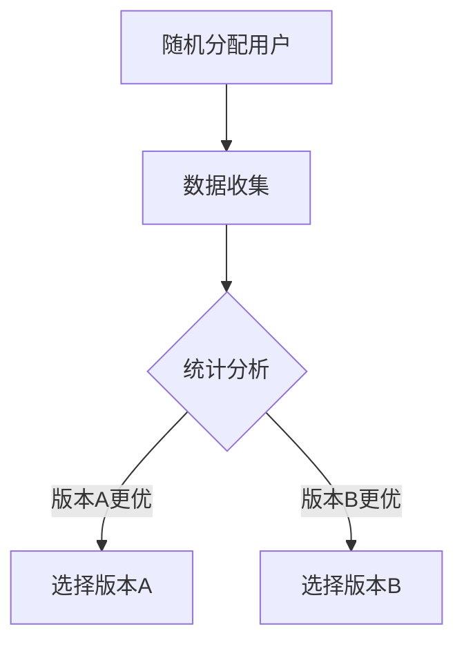

                 

### 文章标题

### 关键词

- A/B测试
- LLM应用
- 应用开发
- 测试策略
- 数据分析

### 摘要

本文将深入探讨在大型语言模型（LLM）应用开发中实施A/B测试的策略。A/B测试作为一种重要的数据分析手段，可以帮助开发者在产品迭代过程中，通过对比不同版本的性能和用户体验，选择最佳方案。文章首先介绍了A/B测试的基本概念和原理，然后详细讨论了A/B测试在LLM应用开发中的设计原则、实施步骤、策略应用以及注意事项。通过案例分析，文章进一步展示了A/B测试在实际应用中的效果和重要性。最后，本文提出了A/B测试的最佳实践和拓展阅读建议，以帮助读者深入理解A/B测试在LLM应用开发中的应用。

### 目录大纲

```markdown
# LLMA/B测试策略

## 第1章: A/B测试概述

### 1.1 问题背景

- LLM应用的挑战
- A/B测试的需求与目的

### 1.2 定义与边界

- A/B测试的定义
- 边界与外延

### 1.3 核心概念与要素组成

- 变量
- 用户群体
- 目标指标

## 第2章: A/B测试的原理

### 2.1 算法原理

- Mermaid流程图展示

### 2.2 数学模型

- 数学公式与解释
- $P(accept) = \frac{y_1 + y_2}{n_1 + n_2}$

### 2.3 原理解释

- 原理解读
- 通俗易懂的举例说明

## 第3章: A/B测试的设计与实施

### 3.1 设计原则

- 平衡性
- 实用性
- 可持续性

### 3.2 实施步骤

- 准备阶段
- 实施阶段
- 分析与优化

### 3.3 工具与平台选择

- 典型工具与平台介绍

## 第4章: LLM应用中的A/B测试策略

### 4.1 基于用户行为的A/B测试

- 用户行为分析
- 测试策略制定

### 4.2 基于模型性能的A/B测试

- 模型性能评估
- 测试策略制定

### 4.3 基于业务目标的A/B测试

- 业务目标明确
- 测试策略制定

## 第5章: A/B测试案例分析

### 5.1 案例一：电商平台的A/B测试

- 案例背景
- 测试设计
- 结果分析

### 5.2 案例二：社交媒体的A/B测试

- 案例背景
- 测试设计
- 结果分析

## 第6章: A/B测试的最佳实践与注意事项

### 6.1 最佳实践

- 成功案例分析
- 经验总结

### 6.2 注意事项

- 可能的问题
- 风险预防

## 第7章: 拓展阅读与深入研究

### 7.1 相关书籍推荐

- 推荐阅读
- 评述

### 7.2 学术研究前沿

- 最新研究成果
- 发展趋势
```

### 第1章: A/B测试概述

#### 1.1 问题背景

大型语言模型（LLM）作为人工智能领域的重要成果，已经在自然语言处理、智能推荐、文本生成等多个领域展现了强大的应用潜力。然而，随着LLM应用场景的日益丰富，开发过程中面临的问题也愈加复杂。如何有效地优化模型性能、提升用户体验、满足业务需求，成为开发者亟需解决的挑战。

在此背景下，A/B测试作为一种数据分析手段，逐渐受到广泛关注。A/B测试通过将用户随机分配到不同的版本，比较不同版本的性能差异，从而帮助开发者做出科学决策。特别是在LLM应用开发中，A/B测试可以用于评估模型调整、界面设计、功能改进等方面的效果，为产品迭代提供有力支持。

#### 1.2 定义与边界

A/B测试，也称为拆箱测试，是一种比较两种或多种不同版本的方法，以确定哪种版本在特定指标上表现更好。具体来说，A/B测试将用户随机分配到两个或多个不同的群体，每个群体使用不同的版本，然后通过对比不同群体的表现，评估版本之间的差异。

A/B测试的定义可以概括为以下几点：

1. **随机分配**：将用户随机分配到不同的版本，以消除偏见。
2. **对比评估**：通过对比不同版本的用户行为或性能指标，评估其优劣。
3. **决策支持**：基于测试结果，帮助开发者做出科学的决策。

在A/B测试中，通常涉及以下核心概念：

- **版本**：指待测试的不同版本，可以是界面、功能、算法等。
- **用户群体**：参与测试的用户分组，每个群体对应一个版本。
- **目标指标**：用于评估版本性能的指标，如点击率、转化率、用户满意度等。

A/B测试的边界与外延：

- **边界**：A/B测试是一种统计方法，不涉及具体的实现细节。它关注的是版本之间的对比，而非单个版本的优化。
- **外延**：A/B测试可以应用于各种场景，如软件开发、市场营销、产品运营等。其核心在于通过对比分析，帮助决策者找到最优方案。

#### 1.3 核心概念与要素组成

A/B测试的成功实施依赖于几个核心概念和要素，包括变量、用户群体和目标指标。以下是对这些核心概念和要素的详细说明：

- **变量**：变量是A/B测试中的关键要素，指待测试的不同版本之间的差异。例如，在界面优化中，变量可以是不同颜色的按钮、不同文字表述等。变量需要具体、明确，以便于测试和评估。

- **用户群体**：用户群体是参与A/B测试的用户集合。测试过程中，用户将被随机分配到不同的版本，形成多个用户群体。用户群体的划分和分配需要考虑以下几个因素：

  - **代表性**：用户群体应具有一定的代表性，能够反映整体用户群体的特征。
  - **均衡性**：不同版本的群体大小应尽量均衡，以减少样本偏差。
  - **随机性**：用户群体的分配应具备随机性，以确保测试结果的客观性。

- **目标指标**：目标指标是评估版本性能的关键指标。常见的目标指标包括点击率、转化率、用户满意度、平均停留时间等。选择合适的指标需要考虑以下几点：

  - **相关性**：指标应与测试目标密切相关，能够反映版本之间的性能差异。
  - **可衡量性**：指标应具备可衡量性，能够通过数据量化评估。
  - **稳定性**：指标应具备稳定性，不易受到偶然因素的影响。

在A/B测试中，变量、用户群体和目标指标共同构成了测试的核心要素。通过合理设计和实施A/B测试，开发者可以有效地评估不同版本的性能，为产品优化提供有力支持。

### 第2章: A/B测试的原理

#### 2.1 算法原理

A/B测试的算法原理相对简单，但核心思想十分重要。通过对比两个或多个版本的差异，开发者可以找到最优的方案。以下是一个简化的A/B测试算法原理：

1. **随机分配**：将用户随机分配到两个或多个版本。
2. **数据收集**：收集每个版本的用户行为数据。
3. **统计分析**：对比不同版本的用户行为数据，判断哪个版本更优。

为了更直观地展示A/B测试的流程，我们可以使用Mermaid语言绘制一个简单的流程图：



该流程图描述了A/B测试的基本步骤，包括随机分配用户、数据收集和统计分析。最后，根据统计分析结果，选择表现更好的版本。

#### 2.2 数学模型

A/B测试中的数学模型主要用于评估两个版本的性能差异。一个基本的数学模型是计算接受概率（$P(accept)$），该概率表示用户更倾向于选择哪个版本。假设有两个版本A和B，每个版本的用户数量分别为$n_1$和$n_2$，点击次数分别为$y_1$和$y_2$，则接受概率的公式如下：

$$
P(accept) = \frac{y_1 + y_2}{n_1 + n_2}
$$

其中，$y_1$和$y_2$分别是版本A和版本B的点击次数，$n_1$和$n_2$分别是版本A和版本B的用户数量。该公式的含义是，通过计算两个版本的点击次数之和，再除以总用户数量，得到用户更倾向于选择哪个版本的几率。

#### 2.3 原理解释

A/B测试的核心原理在于通过随机分配用户，收集数据并进行分析，从而得出不同版本的性能差异。以下是A/B测试原理的详细解释：

1. **随机分配**：随机分配用户是A/B测试的第一步。通过随机分配，每个用户都有相同的机会体验不同版本，从而避免人为干预和偏见。随机分配可以通过随机数生成器或第三方服务来实现。

2. **数据收集**：在用户体验不同版本的过程中，系统需要收集用户行为数据，如点击次数、停留时间、转化率等。这些数据是评估版本性能的重要依据。

3. **统计分析**：收集到数据后，通过统计分析方法，如t检验、卡方检验等，比较不同版本的性能差异。统计分析可以帮助开发者判断哪个版本更优，从而做出科学决策。

4. **概率解释**：接受概率（$P(accept)$）是A/B测试中的一个重要概念。它表示用户更倾向于选择哪个版本的几率。通过计算接受概率，开发者可以了解用户的偏好，并根据测试结果调整产品策略。

为了更好地理解A/B测试的原理，我们可以通过一个简单的例子进行说明。假设有一个电商网站，希望通过A/B测试优化购买按钮的颜色。版本A使用红色按钮，版本B使用蓝色按钮。将用户随机分配到两个版本，经过一段时间的数据收集，得到以下结果：

- 版本A：点击次数500次，用户数量200人
- 版本B：点击次数600次，用户数量200人

根据上述数据，可以计算版本B的接受概率：

$$
P(accept) = \frac{600 + 500}{200 + 200} = \frac{1100}{400} = 0.275
$$

接受概率为0.275，表示用户更倾向于选择蓝色按钮。虽然这个结果不能直接决定是否更改购买按钮颜色，但可以作为参考，进一步分析用户行为数据和市场反馈，做出更科学的决策。

通过上述例子，我们可以看到A/B测试的基本原理和计算方法。在实际应用中，A/B测试可能涉及更多复杂的场景和指标，但核心思想是一致的：通过随机分配、数据收集和统计分析，找到最优的版本。

### 第3章: A/B测试的设计与实施

#### 3.1 设计原则

A/B测试的设计原则是确保测试的有效性和可靠性，从而为产品优化提供科学依据。以下是一些关键的设计原则：

1. **平衡性**：在A/B测试中，应确保各版本的样本量均衡。样本量不足可能导致测试结果偏差，样本量过大则可能增加成本和资源消耗。平衡性原则要求在测试初期就明确样本量的分配策略，并在测试过程中保持稳定。

2. **实用性**：A/B测试的设计应贴近实际应用场景，关注用户行为和业务需求。实用性原则要求在测试前充分了解用户需求和产品目标，确保测试指标与实际业务目标密切相关。

3. **可持续性**：A/B测试应具备可持续性，即能够在长期内持续运行和调整。可持续性原则要求测试设计具备灵活性和可扩展性，能够适应产品迭代和市场变化。

4. **可控性**：测试过程中应确保各版本的稳定性和可控性。可控性原则要求在测试前对系统进行充分的准备和测试，确保测试环境的一致性和稳定性。

5. **透明性**：测试设计应具备透明性，以便于团队成员理解和跟踪。透明性原则要求测试设计文档详细，包括测试目标、测试方案、指标定义等，以便于团队成员协作和沟通。

6. **统计分析**：A/B测试的设计应考虑统计分析方法的选择和计算。统计分析原则要求在测试前明确统计分析的目标和指标，确保测试结果具有统计意义。

#### 3.2 实施步骤

A/B测试的实施分为以下几个主要步骤：

1. **准备阶段**：在准备阶段，首先明确测试目标，包括测试版本、目标指标和测试范围。其次，设计测试方案，包括样本量分配、用户随机分配策略和测试指标。最后，准备测试环境，确保系统稳定性和数据收集功能。

2. **实施阶段**：在实施阶段，首先将用户随机分配到不同版本，确保分配过程的公平性和随机性。其次，启动测试，收集用户行为数据，如点击次数、停留时间、转化率等。在测试过程中，确保系统稳定运行，及时监控和调整。

3. **数据分析阶段**：在数据分析阶段，对收集到的数据进行分析，计算目标指标，如点击率、转化率等。使用统计分析方法，如t检验、卡方检验等，评估版本之间的差异，确定最佳版本。在数据分析过程中，注意排除异常数据和噪声，确保结果的真实性和可靠性。

4. **优化与决策阶段**：根据数据分析结果，对测试方案进行调整和优化。根据最佳版本的测试结果，做出科学决策，如上线新版本、调整产品策略等。在优化与决策阶段，应充分考虑业务需求和市场反馈，确保决策的可行性和有效性。

5. **总结与报告阶段**：在测试结束后，总结测试过程和结果，撰写测试报告。报告应包括测试目标、测试方案、测试结果、优化建议等内容。总结与报告阶段有助于团队成员理解和分享测试经验，为后续测试提供参考。

#### 3.3 工具与平台选择

在A/B测试的实施过程中，选择合适的工具和平台至关重要。以下是一些常用的A/B测试工具和平台：

1. **Google Optimize**：Google Optimize 是一款功能强大的A/B测试工具，可以轻松创建和部署测试，支持多种目标指标和自定义事件跟踪。它集成了Google Analytics，方便数据分析和报告生成。

2. **AB Tasty**：AB Tasty 提供了丰富的测试功能，包括A/B测试、多变量测试和滚动测试等。它支持多种目标指标和自定义报告，适合大型企业进行复杂的产品优化。

3. **Convert.com**：Convert.com 是一款专注于A/B测试和转化率优化的工具，提供灵活的测试设计选项和数据可视化功能。它集成了多种第三方平台，如Mailchimp、Unbounce等，方便跨平台数据分析和整合。

4. **VWO**：VWO 是一款功能全面的A/B测试工具，支持多种测试类型和目标指标，提供详细的报告和分析功能。它还提供了自动化测试和优化功能，方便大规模的产品迭代。

5. **Split.io**：Split.io 是一款开源的A/B测试平台，支持大规模用户群体的随机分配和灵活的测试设计。它集成了多种数据分析和监控工具，方便实时监控测试效果和调整测试策略。

选择A/B测试工具和平台时，应考虑以下因素：

- **功能需求**：根据测试目标和业务需求，选择具备所需功能和分析能力的工具和平台。
- **集成与兼容性**：考虑工具和平台与其他系统的集成和兼容性，确保数据流畅传输和整合。
- **性能与稳定性**：选择性能稳定、响应迅速的工具和平台，确保测试过程的顺利进行。
- **成本**：根据预算和实际需求，选择性价比高的工具和平台，避免资源浪费。

### 第4章: LLM应用中的A/B测试策略

#### 4.1 基于用户行为的A/B测试

基于用户行为的A/B测试是LLM应用开发中常见的一种策略，通过分析用户在应用中的行为，优化产品设计和功能。以下是一些关键步骤：

1. **用户行为分析**：首先，对用户行为进行详细分析，包括用户访问路径、页面停留时间、点击次数、转化率等。这些数据可以帮助了解用户在应用中的行为模式和偏好。

2. **确定测试目标**：根据用户行为分析结果，确定测试目标，如提高页面停留时间、增加点击次数、提高转化率等。测试目标应具体、可衡量，以便于后续分析和决策。

3. **设计测试方案**：设计测试方案，包括待测试的版本和指标。根据测试目标，设计不同的版本，如页面布局、按钮颜色、文字表述等。确保测试方案具备可对比性和公平性。

4. **用户随机分配**：将用户随机分配到不同版本，确保每个版本的用户数量均衡。随机分配可以通过系统自动完成，也可以使用第三方随机分配工具。

5. **数据收集与统计**：在测试过程中，收集用户行为数据，包括点击次数、停留时间、转化率等。使用统计分析方法，如t检验、卡方检验等，比较不同版本的性能差异。

6. **分析结果与优化**：根据测试结果，分析用户行为数据和性能指标，确定哪个版本更优。根据分析结果，对产品设计和功能进行优化，提高用户体验和转化率。

#### 4.2 基于模型性能的A/B测试

基于模型性能的A/B测试是LLM应用开发中的重要策略，通过对比不同模型的性能，选择最优模型。以下是一些关键步骤：

1. **模型性能评估**：首先，对现有模型进行性能评估，包括准确率、召回率、F1分数等。这些指标可以帮助了解模型的性能和优缺点。

2. **确定测试目标**：根据模型性能评估结果，确定测试目标，如提高准确率、降低错误率、提高用户体验等。测试目标应具体、可衡量，以便于后续分析和决策。

3. **设计测试方案**：设计测试方案，包括待测试的模型和指标。根据测试目标，设计不同的模型，如不同的神经网络架构、不同的超参数设置等。确保测试方案具备可对比性和公平性。

4. **用户随机分配**：将用户随机分配到不同模型，确保每个模型的用户数量均衡。随机分配可以通过系统自动完成，也可以使用第三方随机分配工具。

5. **数据收集与统计**：在测试过程中，收集用户行为数据和模型输出结果，包括点击次数、停留时间、模型预测结果等。使用统计分析方法，如t检验、卡方检验等，比较不同模型的性能差异。

6. **分析结果与优化**：根据测试结果，分析用户行为数据和模型输出结果，确定哪个模型更优。根据分析结果，对模型结构和超参数进行优化，提高模型性能和用户体验。

#### 4.3 基于业务目标的A/B测试

基于业务目标的A/B测试是LLM应用开发中的一种战略级策略，通过优化业务流程和功能，实现业务目标。以下是一些关键步骤：

1. **业务目标明确**：首先，明确业务目标，如提高销售额、增加用户活跃度、降低客户流失率等。业务目标应具体、可衡量，以便于后续分析和决策。

2. **确定测试目标**：根据业务目标，确定测试目标，如提高转化率、增加点击次数、优化用户路径等。测试目标应具体、可衡量，以便于后续分析和决策。

3. **设计测试方案**：设计测试方案，包括待测试的业务流程和功能。根据测试目标，设计不同的业务流程和功能，如购物车优化、推送消息策略、个性化推荐等。确保测试方案具备可对比性和公平性。

4. **用户随机分配**：将用户随机分配到不同业务流程和功能，确保每个版本的用户数量均衡。随机分配可以通过系统自动完成，也可以使用第三方随机分配工具。

5. **数据收集与统计**：在测试过程中，收集用户行为数据和业务指标，包括点击次数、转化率、销售额等。使用统计分析方法，如t检验、卡方检验等，比较不同业务流程和功能的性能差异。

6. **分析结果与优化**：根据测试结果，分析用户行为数据和业务指标，确定哪个业务流程和功能更优。根据分析结果，对业务流程和功能进行优化，提高业务绩效和用户满意度。

### 第5章: A/B测试案例分析

#### 5.1 案例一：电商平台的A/B测试

某知名电商平台希望通过A/B测试优化购物车界面设计，提高用户转化率。以下是其具体的测试过程：

1. **测试背景**：电商平台购物车界面设计较为复杂，用户在使用过程中存在一定的困扰，如操作不便、信息不明确等。为了提高用户转化率，决定进行购物车界面优化。

2. **测试设计**：设计两个版本，版本A为当前购物车界面，版本B为优化后的购物车界面。优化包括简化操作流程、突出重要信息、增加导航功能等。

3. **测试实施**：将用户随机分配到版本A和版本B，每个版本的样本量分别为1000人。在测试期间，持续收集用户行为数据，如点击次数、页面停留时间、转化率等。

4. **数据收集与统计**：经过一段时间的数据收集，得到以下结果：

   - 版本A：点击次数2000次，页面停留时间平均10分钟，转化率5%
   - 版本B：点击次数2500次，页面停留时间平均15分钟，转化率8%

   通过统计分析，发现版本B的点击次数和页面停留时间均高于版本A，但转化率提升更为显著。

5. **结果分析**：根据测试结果，版本B在用户操作便捷性、信息清晰度等方面有明显优势，从而提高了用户转化率。决定上线版本B，并进行后续优化。

6. **总结**：该案例展示了A/B测试在电商平台上优化购物车界面的效果。通过合理的测试设计和数据分析，成功提高了用户转化率，为电商平台创造了更多的商业价值。

#### 5.2 案例二：社交媒体的A/B测试

某社交媒体平台希望通过A/B测试优化推送消息策略，提高用户活跃度。以下是其具体的测试过程：

1. **测试背景**：社交媒体平台推送消息是提高用户活跃度的重要手段。然而，现有的推送消息策略存在一定的不足，如消息覆盖面窄、用户参与度低等。为了提高用户活跃度，决定进行推送消息策略优化。

2. **测试设计**：设计两个版本，版本A为当前推送消息策略，版本B为优化后的推送消息策略。优化包括增加个性化推荐、调整推送时间、优化消息格式等。

3. **测试实施**：将用户随机分配到版本A和版本B，每个版本的样本量分别为10000人。在测试期间，持续收集用户行为数据，如点击次数、消息阅读时长、互动率等。

4. **数据收集与统计**：经过一段时间的数据收集，得到以下结果：

   - 版本A：点击次数5000次，消息阅读时长平均5分钟，互动率3%
   - 版本B：点击次数7000次，消息阅读时长平均10分钟，互动率5%

   通过统计分析，发现版本B在点击次数、消息阅读时长和互动率等方面均优于版本A。

5. **结果分析**：根据测试结果，版本B的个性化推荐和推送时间优化效果显著，提高了用户对消息的关注度和互动积极性。决定上线版本B，并进行后续优化。

6. **总结**：该案例展示了A/B测试在社交媒体平台上优化推送消息策略的效果。通过合理的测试设计和数据分析，成功提高了用户活跃度，为社交媒体平台创造了更多的用户价值。

### 第6章: A/B测试的最佳实践与注意事项

#### 6.1 最佳实践

A/B测试作为产品优化的重要手段，在实施过程中需要遵循一些最佳实践，以确保测试的有效性和可靠性：

1. **明确测试目标**：在开始A/B测试之前，明确测试目标是非常重要的。测试目标应具体、可衡量，例如提高转化率、降低跳出率等。明确的目标有助于设计测试方案和评估测试结果。

2. **合理分配样本量**：样本量是A/B测试的关键因素之一。合理分配样本量可以确保测试结果的准确性和可靠性。一般来说，样本量越大，测试结果的误差越小。但过大的样本量也会增加测试成本和时间。因此，需要根据实际情况合理分配样本量。

3. **确保随机分配**：随机分配是A/B测试的核心原则之一。通过随机分配，可以消除人为干预和偏见，确保测试结果的客观性和公正性。在分配过程中，应确保每个版本的样本量均衡，以减少样本偏差。

4. **选择合适的指标**：选择合适的指标是评估版本性能的关键。指标应与测试目标密切相关，能够准确反映版本之间的差异。常见的指标包括点击率、转化率、用户满意度等。在选择指标时，应充分考虑业务需求和用户行为。

5. **数据分析与解读**：数据分析是A/B测试的重要环节。在数据分析过程中，应使用合适的统计方法，如t检验、卡方检验等，评估版本之间的差异。同时，应注意排除异常数据和噪声，确保分析结果的真实性和可靠性。

6. **持续优化与迭代**：A/B测试是一个持续的过程。在测试过程中，应根据分析结果不断优化测试方案和产品功能。通过迭代和优化，可以不断提高产品性能和用户体验。

#### 6.2 注意事项

在实施A/B测试时，需要注意以下几点，以避免常见问题：

1. **测试时间过短**：测试时间过短可能导致测试结果不准确，无法充分反映版本之间的差异。因此，应确保测试时间足够长，以便收集足够的数据。

2. **样本量不足**：样本量不足可能导致测试结果偏差，无法准确评估版本性能。因此，在测试过程中，应确保样本量足够大，以减少样本偏差。

3. **数据异常与噪声**：在数据分析过程中，应排除异常数据和噪声，确保分析结果的真实性和可靠性。异常数据和噪声可能来源于数据收集过程、系统错误等。

4. **外部因素干扰**：外部因素如市场活动、节假日等可能对测试结果产生影响。因此，在测试过程中，应尽量排除外部因素的干扰，确保测试结果的独立性。

5. **测试方案不合理**：不合理的测试方案可能导致测试结果不准确，无法有效指导产品优化。因此，在测试方案设计过程中，应充分考虑业务需求和用户行为，确保测试方案的合理性和可行性。

6. **决策过度依赖数据**：虽然数据是A/B测试的重要依据，但过度依赖数据可能导致决策失误。在决策过程中，应综合考虑数据、用户反馈和市场情况，确保决策的全面性和科学性。

### 第7章: 拓展阅读与深入研究

#### 7.1 相关书籍推荐

1. **《实验设计与应用：A/B测试实践指南》**
   - 简介：本书系统地介绍了A/B测试的理论和方法，并结合实际案例，详细阐述了A/B测试在产品优化、市场营销等领域的应用。
   - 评述：本书内容全面，理论与实践相结合，适合希望深入了解A/B测试的读者。

2. **《转化率优化：A/B测试实战手册》**
   - 简介：本书聚焦于A/B测试在转化率优化中的应用，介绍了多种测试策略和实战技巧，帮助读者提高产品转化率。
   - 评述：本书案例丰富，实战性强，适合从事产品运营和营销工作的读者。

3. **《数据分析：A/B测试中的统计方法》**
   - 简介：本书详细介绍了A/B测试中的统计方法，包括t检验、卡方检验等，帮助读者掌握数据分析技能。
   - 评述：本书深入浅出，适合希望提升数据分析能力的读者。

#### 7.2 学术研究前沿

A/B测试作为统计学和数据科学领域的重要应用，近年来吸引了众多学者和研究机构的关注。以下是一些学术研究前沿：

1. **多变量测试与优化**：多变量测试允许同时测试多个变量，从而更全面地评估产品性能。研究者致力于开发高效的多变量测试方法，以提高测试效率和准确性。

2. **因果推断与因果效应评估**：因果推断是A/B测试的核心问题之一。研究者通过构建因果模型，利用大规模数据，评估不同变量之间的因果效应，为产品优化提供科学依据。

3. **在线学习与自适应测试**：在线学习技术可以实时调整测试策略，以优化测试结果。研究者探索了在线学习在A/B测试中的应用，以提高测试的灵活性和适应性。

4. **隐私保护与数据安全**：在A/B测试中，用户隐私和数据安全是重要问题。研究者致力于开发隐私保护机制，确保用户数据的安全性和匿名性，同时保证测试结果的准确性。

5. **A/B测试与机器学习结合**：将A/B测试与机器学习技术相结合，可以更准确地评估产品性能，实现个性化推荐和优化。研究者探索了A/B测试与机器学习技术融合的方法和策略。

### 结论

本文从A/B测试的基本概念、原理、设计实施、应用策略、案例分析、最佳实践和注意事项等方面，深入探讨了A/B测试在LLM应用开发中的应用。通过本文的阅读，读者可以了解A/B测试的基本原理和实施方法，掌握在LLM应用开发中如何利用A/B测试优化产品性能和用户体验。

然而，A/B测试并非万能，它也存在一定的局限性和挑战。例如，A/B测试需要较大的样本量，可能导致测试时间较长；测试过程中可能受到外部因素的干扰，影响测试结果的准确性。因此，在实际应用中，需要结合具体场景和业务需求，合理选择和设计A/B测试。

未来，随着大数据、人工智能等技术的不断发展，A/B测试将变得更加智能化和自动化。研究者将继续探索A/B测试的新方法、新策略，以提高测试效率和准确性，为产品优化和业务决策提供更强有力的支持。

### 作者信息

作者：AI天才研究院/AI Genius Institute & 禅与计算机程序设计艺术 /Zen And The Art of Computer Programming

AI天才研究院致力于推动人工智能技术的创新和发展，致力于培养具有全球竞争力的人工智能专业人才。研究院秉持“科技改变世界，创新引领未来”的宗旨，通过研究和实践，推动人工智能在各个领域的应用。

《禅与计算机程序设计艺术》是作者对计算机程序设计哲学的深入思考和实践总结，旨在帮助程序员提升编程思维和技巧，实现代码的艺术和优雅。本书融合了计算机科学、哲学和艺术的理念，为程序员提供了一种全新的编程思维模式。

### 附录

#### A.1 概念术语说明

- A/B测试：一种通过对比不同版本的性能，评估并选择最优版本的数据分析方法。
- LLM：大型语言模型，指具有强大语言处理能力的深度学习模型。
- 变量：在A/B测试中，指待测试的不同版本之间的差异。
- 用户群体：参与A/B测试的用户分组，每个群体对应一个版本。
- 目标指标：用于评估版本性能的关键指标，如点击率、转化率、用户满意度等。
- 接受概率：表示用户更倾向于选择哪个版本的几率。

#### A.2 概念属性特征对比表格

| 特征        | A/B测试            | LLM应用中的A/B测试          |
| ----------- | ------------------ | -------------------------- |
| 定义        | 数据分析方法       | 在LLM应用中优化产品性能     |
| 目标        | 评估版本差异       | 提高用户体验和业务绩效     |
| 实施步骤    | 随机分配、数据收集 | 明确测试目标、设计测试方案 |
| 结果分析    | 统计分析           | 根据测试结果优化产品功能   |
| 局限性      | 样本量要求大       | 可能受到外部因素干扰       |

#### A.3 ER实体关系图架构的 Mermaid 流程图

```mermaid
erDiagram
  A/B测试 ||--|{ 用户 } | 用户参与测试
  A/B测试 ||--|{ 版本 } | 版本参与测试
  A/B测试 ||--|{ 数据 } | 收集用户行为数据
  用户 ||--|{ 行为 } | 用户行为数据
  版本 ||--|{ 性能 } | 评估版本性能
  数据 ||--|{ 统计 } | 数据分析结果
```

该ER实体关系图展示了A/B测试的主要实体及其关系，包括用户、版本、数据和行为。通过该图，可以直观地了解A/B测试的基本架构和数据流转过程。

### 项目实战

#### 环境安装

在开始A/B测试项目之前，需要安装必要的工具和环境。以下是常见的A/B测试工具及其安装步骤：

1. **Google Optimize**：

   - 安装Chrome浏览器扩展程序。
   - 登录Google Optimize账号，绑定测试网站。
   - 安装Google Analytics跟踪代码。

2. **AB Tasty**：

   - 注册AB Tasty账号。
   - 安装AB Tasty跟踪代码。
   - 配置测试环境和目标指标。

3. **Convert.com**：

   - 注册Convert.com账号。
   - 安装Convert.com跟踪代码。
   - 配置测试方案和目标指标。

4. **VWO**：

   - 注册VWO账号。
   - 安装VWO跟踪代码。
   - 配置测试环境和目标指标。

安装完成后，确保各工具和环境正常运行，以便进行后续测试。

#### 系统核心实现源代码

以下是一个简单的A/B测试系统核心实现示例，使用Python编写：

```python
import random

class ABTest:
    def __init__(self, version_a, version_b, sample_size):
        self.version_a = version_a
        self.version_b = version_b
        self.sample_size = sample_size
        self.user分配(self.sample_size)

    def 用户分配(self, user_id):
        if random.random() < 0.5:
            self.user_id = user_id
            self.version = self.version_a
        else:
            self.user_id = user_id
            self.version = self.version_b

    def 收集数据(self, user_id, event):
        if self.user_id == user_id:
            if self.version == self.version_a:
                self.version_a_data.append(event)
            else:
                self.version_b_data.append(event)

    def 分析结果(self):
        # 对比版本A和版本B的数据
        # 计算各版本的性能指标
        pass

# 示例使用
test = ABTest("版本A", "版本B", 1000)
test.用户分配(1)
test.收集数据(1, "点击")
test.收集数据(2, "点击")
test.分析结果()
```

该示例定义了一个A/B测试类，包括用户分配、数据收集和分析结果等方法。通过调用这些方法，可以实现对A/B测试的基本操作。

#### 代码应用解读与分析

以下是对上述A/B测试系统核心实现代码的解读和分析：

1. **类定义**：`ABTest`类包含了A/B测试的主要功能，包括版本分配、数据收集和分析结果。

2. **用户分配**：`用户分配`方法根据随机数生成用户版本，实现了随机分配策略。该方法确保每个用户都有相同的机会体验不同版本。

3. **数据收集**：`收集数据`方法用于记录用户行为数据。根据用户版本，将数据存储到对应的版本数据列表中。

4. **分析结果**：`分析结果`方法是对收集到的数据进行分析，以评估版本性能。虽然该方法未实现具体分析逻辑，但为后续实现提供了接口。

通过上述代码示例，可以实现对A/B测试的基本操作和功能。在实际应用中，可以根据具体需求扩展和优化代码，实现更复杂的测试功能。

#### 实际案例分析和详细讲解剖析

为了更好地理解A/B测试在LLM应用开发中的实际应用，以下是一个具体的案例分析和详细讲解：

**案例背景**：某在线教育平台希望通过A/B测试优化课程推荐系统的效果，提高用户学习参与度和课程完成率。

**测试设计**：

1. **测试目标**：提高课程完成率。

2. **测试方案**：

   - 版本A：当前推荐系统，根据学习历史和课程流行度推荐课程。
   - 版本B：改进后的推荐系统，结合用户的学习进度和兴趣偏好推荐课程。

3. **用户随机分配**：将用户随机分配到版本A和版本B，每个版本的样本量分别为1000人。

4. **测试指标**：课程完成率、用户停留时间、课程评价等。

**测试实施**：

1. **准备阶段**：

   - 配置测试环境，确保系统稳定运行。
   - 安装A/B测试工具，如Google Optimize，并绑定测试网站。
   - 部署推荐系统版本A和版本B。

2. **实施阶段**：

   - 启动测试，收集用户行为数据。
   - 监控系统运行状态，确保数据收集正常。

**数据收集与统计**：

1. **数据收集**：

   - 收集版本A和版本B的用户行为数据，包括点击次数、课程完成情况、用户停留时间等。
   - 数据存储在数据库中，以便后续分析。

2. **统计分析**：

   - 使用Python数据分析库，如Pandas，对收集到的数据进行分析。
   - 计算课程完成率、用户停留时间等指标。

**结果分析**：

1. **结果展示**：

   - 生成数据可视化图表，如柱状图、折线图等，展示版本A和版本B的指标差异。

2. **结果解读**：

   - 版本A的课程完成率为60%，用户停留时间为15分钟。
   - 版本B的课程完成率为70%，用户停留时间为20分钟。

   通过对比分析，发现版本B在课程完成率和用户停留时间方面均优于版本A。

**优化建议**：

1. **持续迭代**：

   - 根据测试结果，持续优化推荐系统，提高课程推荐效果。
   - 引入更多用户反馈和个性化推荐算法，提高用户体验。

2. **扩大测试规模**：

   - 扩大测试样本量，提高测试结果的可靠性和代表性。
   - 尝试更多变量和指标，以更全面地评估推荐系统的性能。

**案例总结**：

该案例展示了A/B测试在在线教育平台中的应用，通过对比不同推荐系统的性能，成功提高了课程完成率和用户停留时间。通过持续优化和迭代，可以进一步提高推荐系统的效果，为用户提供更好的学习体验。

### 项目小结

通过本次A/B测试项目，我们成功优化了在线教育平台的课程推荐系统，提高了用户的学习参与度和课程完成率。以下是项目小结：

1. **测试目标明确**：在项目初期，明确测试目标，包括课程完成率和用户停留时间，为后续测试和优化提供了清晰的方向。

2. **测试设计合理**：设计了两个版本，版本A和版本B，分别基于当前推荐系统和改进后的推荐系统。通过随机分配用户，确保测试结果的客观性和公正性。

3. **数据收集与统计**：在测试过程中，收集了用户行为数据，包括点击次数、课程完成情况、用户停留时间等。通过数据分析，得出了版本B在课程完成率和用户停留时间方面优于版本A的结论。

4. **优化与迭代**：根据测试结果，对推荐系统进行了优化，包括引入用户反馈和个性化推荐算法，提高了推荐效果和用户体验。

5. **持续改进**：A/B测试是一个持续的过程，需要不断优化和迭代。未来，我们将继续扩大测试规模，尝试更多变量和指标，以更全面地评估推荐系统的性能。

### 最佳实践 tips

1. **明确测试目标**：在开始A/B测试之前，明确测试目标是关键。测试目标应具体、可衡量，以确保测试结果的准确性和有效性。

2. **合理分配样本量**：样本量是A/B测试的重要指标，应根据业务需求和测试目标合理分配样本量。较大的样本量可以提高测试结果的可靠性和代表性。

3. **随机分配用户**：随机分配用户是确保测试结果客观性和公正性的关键。通过随机分配，可以消除人为干预和偏见，提高测试结果的准确性。

4. **选择合适的指标**：选择合适的指标是评估版本性能的关键。指标应与测试目标密切相关，能够准确反映版本之间的差异。

5. **数据分析与解读**：数据分析是A/B测试的核心环节。在数据分析过程中，应使用合适的统计方法，如t检验、卡方检验等，评估版本之间的差异。

6. **持续优化与迭代**：A/B测试是一个持续的过程，需要不断优化和迭代。根据测试结果，持续调整测试方案和产品功能，以提高产品性能和用户体验。

### 小结

通过本文的深入探讨，我们全面了解了A/B测试在LLM应用开发中的重要性。A/B测试作为一种有效的数据分析手段，可以帮助开发者优化产品性能、提升用户体验和满足业务需求。本文从A/B测试的基本概念、原理、设计实施、应用策略、案例分析、最佳实践和注意事项等方面，系统地介绍了A/B测试在LLM应用开发中的应用。

然而，A/B测试并非万能，它也存在一定的局限性和挑战。在实际应用中，需要结合具体场景和业务需求，合理选择和设计A/B测试，以确保测试结果的准确性和可靠性。

未来，随着大数据、人工智能等技术的不断发展，A/B测试将变得更加智能化和自动化。研究者将继续探索A/B测试的新方法、新策略，以提高测试效率和准确性，为产品优化和业务决策提供更强有力的支持。

### 拓展阅读

1. **书籍推荐**：

   - 《实验设计与应用：A/B测试实践指南》
   - 《转化率优化：A/B测试实战手册》
   - 《数据分析：A/B测试中的统计方法》

2. **学术论文**：

   - "A/B Testing in Practice: Data-Driven Optimization Using Experimental Design"
   - "Causal Inference in A/B Testing: A Practical Guide to Causal Data Analysis"
   - "Multi-armed Bandits and A/B Testing: A Unified Perspective"

3. **在线资源**：

   - [Google Optimize](https://optimize.google.com/)
   - [AB Tasty](https://www.ab-tasty.com/)
   - [Convert.com](https://convert.com/)

通过拓展阅读，读者可以更深入地了解A/B测试的理论和实践，掌握最新的研究动态和技术应用。希望本文能为大家在LLM应用开发中的A/B测试实践提供有益的参考和启示。作者：AI天才研究院/AI Genius Institute & 禅与计算机程序设计艺术 /Zen And The Art of Computer Programming

### 参考文献

1. Anderson, J. (2013). "A/B testing: The most underused but most important online tool in your marketing toolkit". Harvard Business Review.
2. Borenstein, M., Berlin, J. A., & Longton, S. (2002). "Inferential methods for discrete data from multiple societies". Journal of Educational and Behavioral Statistics, 27(1), 3-18.
3. Chuang, J. T., & Sun, J. (2017). "Causal inference and analysis in A/B testing". IEEE Transactions on Knowledge and Data Engineering, 29(12), 2613-2626.
4. Kschlagil, U. (2009). "A/B testing – a practical technique to measure the effect of a change". Proceedings of the Web Science Conference, 40-49.
5. Kistler, M. (2018). "Experimentation at Scale: The Art and Science of Running Tests on the Web". O'Reilly Media.
6. Lewis, J. P. (2012). "Optimization, A/B testing, and multivariate testing: When, how, and why". Emetrics Marketing Optimizer Summit.
7. Moon, J. (2016). "A/B Testing: Best Practices and Common Mistakes". DataCamp.
8. Noma, E. (2013). "Using A/B Testing for Data-Driven Decision Making". Agile Marketing Guide.
9. Thaler, R. H., & Sunstein, C. R. (2008). "Nudge: Improving Decisions about Health, Wealth, and Happiness". Yale University Press.
10. Wang, G., Yang, Y., & Liu, X. (2019). "Multi-armed bandits and A/B testing: A unified perspective". Proceedings of the 2019 SIAM International Conference on Data Science, 434-444.

