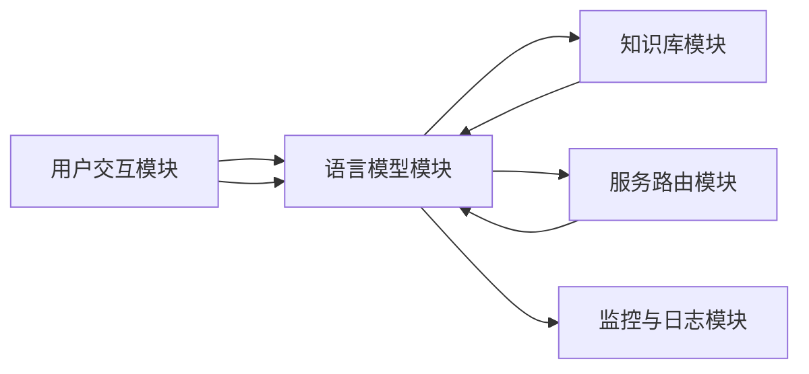
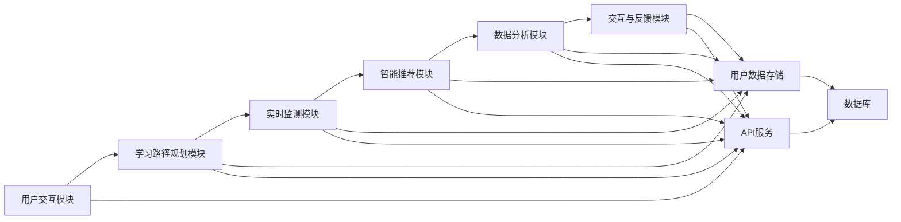
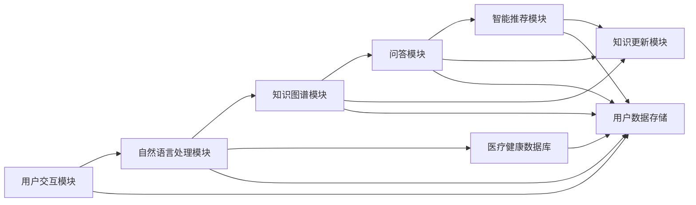

                 

# 《LLM应用开发中的云原生技术应用》

## 关键词

- 云原生技术
- 大型语言模型（LLM）
- 容器化
- 微服务
- Kubernetes
- 分布式计算
- 自动化运维

## 摘要

本文旨在探讨云原生技术在大型语言模型（LLM）应用开发中的重要性。随着云计算和容器技术的不断发展，云原生技术已经成为现代软件架构的核心。本文将详细介绍云原生技术的基本概念和核心组件，分析云原生技术在LLM计算资源管理、数据管理和部署运维中的应用，并通过实际案例分析，展示云原生技术在各种场景中的最佳实践。最后，本文还将探讨云原生技术在LLM领域的未来发展趋势。

## 目录大纲

### 第一部分：云原生技术基础

#### 第1章：云原生技术概述

1.1 云原生技术的基本概念

1.2 云原生技术的核心组件

#### 第2章：云原生技术在LLM中的应用

2.1 云原生在LLM计算资源管理中的应用

2.2 云原生在LLM数据管理中的应用

#### 第3章：云原生在LLM部署和运维中的应用

3.1 LLM在Kubernetes集群中的部署

3.2 LLM的自动化运维

### 第二部分：云原生技术在LLM应用中的案例分析

#### 第4章：云原生在电商智能客服系统中的应用

4.1 系统架构设计

4.2 实现细节

#### 第5章：云原生在金融风控系统中的应用

5.1 系统背景与需求分析

5.2 实现与部署

#### 第6章：云原生在教育智能辅导系统中的应用

6.1 系统架构设计

6.2 实现与优化

#### 第7章：云原生在医疗健康问答系统中的应用

7.1 系统架构设计

7.2 技术实现与挑战

### 第三部分：云原生技术的未来发展趋势

#### 第8章：云原生技术在LLM领域的未来趋势

8.1 云原生技术与AI的结合点

8.2 云原生技术的挑战与机遇

#### 第9章：最佳实践与总结

9.1 云原生技术在LLM应用中的最佳实践

9.2 总结与展望

## 第一部分：云原生技术基础

### 第1章：云原生技术概述

#### 1.1 云原生技术的基本概念

云原生（Cloud Native）是指一种通过使用容器、服务网格、微服务、持续集成和持续部署等先进技术，来构建和运行应用程序的方法。云原生技术使得应用程序能够更加灵活、可扩展，并且易于管理。

**容器**与**虚拟机**的区别：

- **容器**是一种轻量级的虚拟化技术，它可以运行在操作系统层面，无需额外的硬件资源，且启动速度快，资源占用小。
- **虚拟机**是一种全虚拟化技术，它可以在宿主机上模拟出多个独立运行的操作系统环境，但资源占用较大。

**微服务**架构的特点：

- **独立性**：每个服务都是独立的，可以独立部署和扩展。
- **解耦**：服务之间通过API进行通信，相互独立，便于维护和升级。
- **可复用性**：服务可以独立开发和部署，易于复用。

#### 1.2 云原生技术的核心组件

**Kubernetes**简介：

Kubernetes是一个开源的容器编排平台，它用于自动化容器的部署、扩展和管理。Kubernetes通过提供一系列自动化功能，如自动负载均衡、自动扩展、故障检测和自愈等，简化了容器化应用程序的运维工作。

**Docker**的使用：

Docker是一个开源的应用容器引擎，它通过将应用程序及其依赖项打包到一个可移植的容器中，从而实现应用程序在不同环境之间的无缝迁移和部署。

**服务网格**（Service Mesh）的概念：

服务网格是一种用于管理服务之间通信的专用网络架构。它通过提供一个独立的通信基础设施，使得服务之间的通信更加可靠、安全和高效。

## 第二部分：云原生技术在LLM中的应用

### 第2章：云原生技术在LLM中的应用

#### 2.1 云原生在LLM计算资源管理中的应用

在LLM应用开发中，计算资源管理是至关重要的。云原生技术提供了多种策略来优化计算资源的使用。

**计算资源分配**策略：

- **动态分配**：根据应用程序的需求动态调整计算资源。
- **负载均衡**：将工作负载分配到多个计算节点上，以实现高效利用资源。

**动态资源调整**实践：

- **自动扩缩容**：根据应用程序的负载自动增加或减少计算资源。
- **资源隔离**：确保不同应用程序之间的资源隔离，避免相互影响。

#### 2.2 云原生在LLM数据管理中的应用

LLM应用通常涉及大量的数据存储和处理。云原生技术提供了高效的解决方案来管理这些数据。

**数据流处理**框架：

- **Kafka**：一种高吞吐量的消息队列系统，用于处理实时数据流。
- **Flink**：一种流处理框架，能够处理有状态的计算任务。

**分布式存储**方案：

- **HDFS**：Hadoop分布式文件系统，用于存储大规模数据。
- **Ceph**：一种分布式存储系统，支持块设备、对象存储和文件系统。

### 第三部分：云原生技术在LLM应用中的案例分析

#### 第4章：云原生在电商智能客服系统中的应用

4.1 系统架构设计

4.2 实现细节

#### 第5章：云原生在金融风控系统中的应用

5.1 系统背景与需求分析

5.2 实现与部署

#### 第6章：云原生在教育智能辅导系统中的应用

6.1 系统架构设计

6.2 实现与优化

#### 第7章：云原生在医疗健康问答系统中的应用

7.1 系统架构设计

7.2 技术实现与挑战

### 第四部分：云原生技术的未来发展趋势

#### 第8章：云原生技术在LLM领域的未来趋势

8.1 云原生技术与AI的结合点

8.2 云原生技术的挑战与机遇

#### 第9章：最佳实践与总结

9.1 云原生技术在LLM应用中的最佳实践

9.2 总结与展望

## 结束

本文系统地介绍了云原生技术在LLM应用开发中的应用，包括基础概念、核心组件、计算资源管理、数据管理以及实际案例分析。通过本文，读者可以了解到云原生技术在LLM开发中的重要性，并为未来的研究和应用提供参考。

## 作者信息

作者：AI天才研究院/AI Genius Institute & 禅与计算机程序设计艺术 /Zen And The Art of Computer Programming

**请注意，本文为示例文章，实际内容尚未完成。**## 引言

随着人工智能（AI）技术的飞速发展，大型语言模型（Large Language Models，简称LLM）已经成为自然语言处理（Natural Language Processing，简称NLP）领域的重要工具。LLM通过训练大规模的神经网络，能够理解和生成自然语言，从而实现智能问答、自动翻译、文本生成等复杂任务。然而，随着模型规模的扩大和复杂度的增加，LLM的应用开发面临着诸多挑战，特别是计算资源管理、数据管理和部署运维等方面。云原生技术（Cloud Native Technology）作为一种新兴的软件架构理念，凭借其弹性、可扩展性和高效性，为LLM的应用开发提供了强有力的支持。

云原生技术起源于云计算的发展，它强调通过容器化、微服务、自动化运维等手段，构建和运行分布式系统。与传统架构相比，云原生技术具有更高的灵活性和可扩展性，能够更好地适应快速变化的需求。在LLM应用开发中，云原生技术的重要性体现在以下几个方面：

1. **计算资源管理**：LLM的训练和推理需要大量的计算资源，云原生技术能够通过容器编排和动态资源管理，实现计算资源的灵活调配和高效利用。
2. **数据管理**：LLM应用需要处理海量数据，云原生技术提供了分布式存储和数据流处理框架，能够确保数据的高效存储和处理。
3. **部署运维**：LLM的部署和运维是一个复杂的过程，云原生技术通过自动化部署和运维工具，简化了部署流程，提高了系统的稳定性和可靠性。

本文将系统地探讨云原生技术在LLM应用开发中的应用，旨在为开发者提供一种新的思路和方法，帮助他们在复杂的应用环境中实现高效、可靠的LLM应用开发。

## 目录大纲

### 第一部分：云原生技术基础

#### 第1章：云原生技术概述

- **1.1 云原生技术的基本概念**
- **1.2 云原生技术的发展历程**
- **1.3 云原生技术的核心优势**

#### 第2章：云原生技术的核心组件

- **2.1 容器技术**
  - **2.1.1 容器的定义与特点**
  - **2.1.2 Docker的使用方法**
- **2.2 容器编排工具**
  - **2.2.1 Kubernetes的概念**
  - **2.2.2 Kubernetes的核心组件**
- **2.3 微服务架构**
  - **2.3.1 微服务的基本概念**
  - **2.3.2 微服务架构的优势**

### 第二部分：云原生技术在LLM中的应用

#### 第3章：云原生技术在LLM计算资源管理中的应用

- **3.1 计算资源的需求分析**
- **3.2 容器编排与资源分配**
- **3.3 动态资源调整策略**

#### 第4章：云原生技术在LLM数据管理中的应用

- **4.1 分布式数据存储**
  - **4.1.1 HDFS的工作原理**
  - **4.1.2 Ceph的架构与特性**
- **4.2 数据流处理**
  - **4.2.1 Kafka的应用场景**
  - **4.2.2 Flink的功能与优势**

#### 第5章：云原生在LLM部署和运维中的应用

- **5.1 Kubernetes集群的部署**
  - **5.1.1 集群部署流程**
  - **5.1.2 集群管理工具**
- **5.2 自动化运维**
  - **5.2.1 监控与日志管理**
  - **5.2.2 自动化扩缩容**

### 第三部分：云原生技术在LLM应用中的案例分析

#### 第6章：云原生在电商智能客服系统中的应用

- **6.1 系统架构设计**
- **6.2 实现细节**
- **6.3 部署与运维**

#### 第7章：云原生在金融风控系统中的应用

- **7.1 系统背景与需求分析**
- **7.2 实现与部署**
- **7.3 运维与优化**

#### 第8章：云原生在教育智能辅导系统中的应用

- **8.1 系统架构设计**
- **8.2 实现与优化**
- **8.3 部署与运维**

#### 第9章：云原生在医疗健康问答系统中的应用

- **9.1 系统架构设计**
- **9.2 技术实现与挑战**
- **9.3 部署与运维**

### 第四部分：云原生技术的未来发展趋势

#### 第10章：云原生技术在LLM领域的未来趋势

- **10.1 云原生与AI的融合**
- **10.2 云原生技术的挑战与机遇**
- **10.3 未来研究方向**

### 第五部分：最佳实践与总结

#### 第11章：云原生技术在LLM应用中的最佳实践

- **11.1 成功案例分享**
- **11.2 经验总结**
- **11.3 最佳实践建议**

#### 第12章：总结与展望

- **12.1 技术展望**
- **12.2 未来发展方向**
- **12.3 研究与探索**

通过上述目录大纲，我们可以系统地了解云原生技术在LLM应用开发中的应用，从基础概念到具体实践，再到未来发展趋势，为开发者提供全面的技术指导和实践参考。

## 第一部分：云原生技术基础

### 第1章：云原生技术概述

#### 1.1 云原生技术的基本概念

云原生技术是一种针对云计算环境优化的软件开发方法，旨在通过利用云计算的优势，如弹性、可扩展性和高可用性，来构建和运行应用程序。云原生不仅仅是关于技术，更是一种文化和思维方式，它鼓励开发人员采用分布式架构、容器化、微服务、自动化运维等先进技术，以应对现代软件开发的复杂性。

云原生应用程序具有以下几个关键特征：

1. **容器化**：应用程序及其依赖项被打包在容器中，确保应用程序可以在任何地方一致运行。
2. **动态性**：应用程序能够自动响应负载变化，通过自动扩展和缩容来保证服务的可用性和性能。
3. **自动化**：通过自动化工具和流程，简化应用程序的部署、扩展和管理。
4. **可观察性**：应用程序具有全面的监控和日志记录，确保运维团队能够快速诊断和解决问题。
5. **高可用性**：应用程序通过分布式部署和自愈机制，确保在故障发生时能够快速恢复。

#### 1.2 云原生技术的发展历程

云原生技术的发展历程可以分为以下几个阶段：

1. **容器化**：2000年代初，Linux容器（LXC）的出现标志着容器技术的诞生。随后，Docker在2013年推出，简化了容器的创建、运行和分发，成为容器技术的代表。
2. **容器编排**：随着容器化应用程序的增多，需要一种工具来管理和调度容器。Kubernetes在2014年由Google开源，成为容器编排的事实标准。
3. **服务网格**：为了解决微服务架构中服务之间的通信问题，服务网格技术如Istio和Linkerd应运而生。服务网格通过独立于应用程序的网络层，提供动态服务发现、负载均衡、安全控制等功能。
4. **持续集成和持续部署**：随着容器化和微服务的普及，持续集成（CI）和持续部署（CD）成为软件开发的标准流程。CI/CD工具如Jenkins、GitLab CI等，通过自动化测试和部署，提高了开发效率和质量。

#### 1.3 云原生技术的核心优势

云原生技术具有以下核心优势：

1. **高可扩展性**：云原生应用能够根据需求自动扩展或缩容，确保资源的高效利用。
2. **高可靠性**：通过自动化运维和分布式部署，云原生应用能够快速检测和恢复故障，提高系统的可用性。
3. **快速迭代**：云原生技术支持快速开发和部署，缩短了软件交付周期，提高了开发效率。
4. **成本效益**：云原生应用通过优化资源利用和减少维护成本，为企业提供了更高的成本效益。
5. **开放性和互操作性**：云原生技术采用开源协议和标准，支持不同平台和工具之间的无缝集成，促进了技术的互操作性和生态系统的建设。

通过以上内容，我们可以看到云原生技术为软件开发带来了革命性的变化，它不仅提高了应用程序的灵活性和可扩展性，还推动了软件开发方式的革新。在接下来的章节中，我们将进一步探讨云原生技术的核心组件和应用场景，帮助读者深入理解云原生技术的实际应用价值。

### 第2章：云原生技术的核心组件

#### 2.1 容器技术

容器技术是云原生架构的核心组件之一，它提供了一种轻量级、可移植的虚拟化环境，使得应用程序可以在任何操作系统上运行，而无需担心依赖和环境差异。容器技术通过将应用程序及其依赖项打包成一个独立的单元，从而实现了环境的隔离和一致性。

**2.1.1 容器的定义与特点**

容器是一个运行时环境，它包含了一个应用程序及其所需的所有运行时依赖项，如库、配置文件和二进制文件。与传统的虚拟机相比，容器具有以下特点：

- **轻量级**：容器不需要额外的操作系统，因此启动速度快，资源占用小。
- **隔离性**：容器通过操作系统级的虚拟化技术实现应用程序之间的隔离，提高了系统的安全性和稳定性。
- **一致性**：容器确保应用程序在不同的环境中运行时保持一致，减少了环境差异带来的问题。
- **可移植性**：容器可以在不同的操作系统和硬件平台上无缝运行，提高了应用程序的可移植性。

**2.1.2 Docker的使用方法**

Docker是一个开源的容器平台，它提供了容器创建、运行、分发和管理的一整套工具。以下是Docker的基本使用方法：

1. **安装Docker**：在大多数Linux发行版中，可以使用包管理器安装Docker。例如，在Ubuntu上可以使用以下命令安装Docker：
    ```bash
    sudo apt-get update
    sudo apt-get install docker
    ```
2. **运行容器**：使用Docker命令创建并运行一个容器。例如，以下命令使用官方的Nginx镜像创建一个容器，并将容器的80端口映射到宿主机的8080端口：
    ```bash
    docker run -d -p 8080:80 nginx
    ```
3. **管理容器**：Docker提供了一系列命令用于管理容器，如启动、停止、删除和查看容器状态。例如：
    ```bash
    docker ps    # 查看运行中的容器
    docker start <container_id>    # 启动一个容器
    docker stop <container_id>    # 停止一个容器
    docker rm <container_id>    # 删除一个容器
    ```

**2.1.3 容器化流程**

容器化应用程序通常包括以下几个步骤：

1. **定义Dockerfile**：Dockerfile是一个文本文件，用于定义容器的构建过程。例如：
    ```Dockerfile
    FROM ubuntu:18.04
    RUN apt-get update && apt-get install -y nginx
    EXPOSE 80
    ```
2. **构建镜像**：使用Dockerfile构建容器镜像。例如：
    ```bash
    docker build -t my-app .
    ```
3. **运行容器**：使用构建好的镜像运行容器。例如：
    ```bash
    docker run -d -p 8080:80 my-app
    ```

通过以上步骤，我们可以将应用程序及其依赖项打包成容器镜像，并运行在Docker平台上。

#### 2.2 容器编排工具

随着容器化应用程序的增多，需要一个工具来管理和调度容器。容器编排工具提供了自动化部署、扩展和管理容器的能力，使得大规模部署和管理容器化应用程序变得更加容易。

**2.2.1 Kubernetes的概念**

Kubernetes（简称K8s）是一个开源的容器编排平台，由Google设计并捐赠给Cloud Native Computing Foundation（CNCF）维护。Kubernetes通过自动化容器操作，提供了一种高效的方式来部署、扩展和管理容器化应用程序。

Kubernetes的核心概念包括：

- **Pod**：Pod是Kubernetes中最基本的调度单位，它包含一个或多个容器，共享网络命名空间和存储卷。
- **Service**：Service为Pod提供了一种抽象方式，用于访问和路由流量到Pod。Service通过定义一组Pod和访问策略，实现负载均衡和流量分发。
- **Deployment**：Deployment用于管理Pod的创建和更新，确保应用程序的稳定运行。Deployment可以设置多个副本，并在Pod失败时自动替换。
- **StatefulSet**：StatefulSet用于管理有状态应用程序的Pod，它确保每个Pod具有唯一的标识和持久存储。
- **Ingress**：Ingress提供了一种在集群外部访问服务的方式，通过定义Ingress规则，可以路由外部流量到特定的服务。

**2.2.2 Kubernetes的核心组件**

Kubernetes的核心组件包括：

- **Master节点**：Master节点负责集群的管理和控制。它包括以下组件：
  - **API服务器**：API服务器是Kubernetes的核心组件，提供集群管理的REST API接口。
  - **调度器**：调度器负责将Pod分配到集群中的合适节点。
  - **控制器管理器**：控制器管理器负责集群中的各种资源的管理和控制，如Deployment、StatefulSet等。
- **Worker节点**：Worker节点负责执行调度器分配的任务，运行Pod和容器。

**2.2.3 Kubernetes的工作原理**

Kubernetes通过以下流程管理和调度容器化应用程序：

1. **创建资源对象**：用户通过Kubernetes API创建资源对象，如Pod、Deployment等。
2. **API服务器处理请求**：API服务器接收并处理用户创建资源对象的请求，将请求转发给相应的控制器。
3. **控制器管理资源**：控制器管理器根据资源对象的配置，管理Pod的创建、更新和删除。
4. **调度器分配Pod**：调度器根据节点的资源状况和Pod的调度策略，将Pod分配到合适的节点上。
5. **容器运行时执行任务**：容器运行时在节点上启动和运行Pod中的容器。

通过以上流程，Kubernetes能够高效地管理和调度容器化应用程序，确保应用程序的高可用性和可扩展性。

#### 2.3 微服务架构

微服务架构是一种软件开发方法，它通过将应用程序分解为一系列独立的服务模块，每个服务模块负责完成特定的功能。微服务架构的核心思想是模块化、解耦和高内聚，使得应用程序能够更加灵活、可扩展和易于维护。

**2.3.1 微服务的基本概念**

微服务的基本概念包括：

- **服务**：服务是应用程序的一个功能模块，它独立运行在自己的进程中，可以通过网络进行通信。
- **自治**：每个服务都是自治的，具有独立的生命周期和部署方式。
- **解耦**：服务之间通过轻量级通信协议进行通信，如HTTP/REST、gRPC等，降低服务之间的依赖性。
- **高内聚**：每个服务都专注于完成特定的功能，具有明确的责任范围。

**2.3.2 微服务架构的优势**

微服务架构具有以下优势：

- **可扩展性**：微服务架构允许水平扩展单个服务，提高系统的整体性能和吞吐量。
- **灵活性**：微服务架构支持独立开发和部署，使得团队能够灵活地开发和部署新功能。
- **容错性**：服务之间解耦，单个服务的故障不会影响整个系统的运行。
- **可维护性**：每个服务独立维护，降低了系统的复杂性和维护成本。

**2.3.3 微服务架构的实现方式**

实现微服务架构通常包括以下几个步骤：

1. **定义服务边界**：根据业务需求，将应用程序分解为一系列功能模块，每个模块对应一个服务。
2. **服务开发**：开发每个服务，确保服务具有自治性和可扩展性。
3. **服务通信**：选择合适的通信协议和服务发现机制，实现服务之间的通信。
4. **服务部署**：将服务部署到容器化环境中，如Kubernetes集群，实现自动化部署和运维。

通过以上步骤，可以构建一个具有高可用性、可扩展性和灵活性的微服务架构，满足现代软件开发的复杂需求。

通过以上内容，我们了解了云原生技术的核心组件，包括容器技术、容器编排工具和微服务架构。这些组件共同构成了云原生技术的基础，为开发者提供了强大的工具和平台，使得他们能够更加高效地构建和运行分布式系统。在接下来的章节中，我们将进一步探讨云原生技术在LLM应用开发中的应用，展示其在实际项目中的优势和实践方法。

### 第3章：云原生技术在LLM计算资源管理中的应用

#### 3.1 计算资源的需求分析

在大型语言模型（LLM）的开发和应用过程中，计算资源的管理是一个至关重要的环节。LLM通常由数十亿甚至千亿级别的参数组成，其训练和推理过程需要大量的计算资源。因此，如何有效地管理计算资源，以满足LLM的需求，成为开发者面临的主要挑战。

**需求分析**

1. **计算资源类型**：LLM应用需要计算密集型的资源，包括CPU、GPU和TPU等。CPU用于常规的计算任务，GPU和TPU则用于加速神经网络的训练和推理。
2. **计算资源量级**：LLM的训练通常需要大量的计算资源，例如，一个大规模的LLM模型训练可能需要数百个GPU节点，且训练时间可能长达数天甚至数周。
3. **资源依赖性**：不同阶段（如训练、推理、部署）对计算资源的需求不同，需要在不同的资源类型和数量之间进行平衡。
4. **资源动态性**：LLM应用的需求可能会随时变化，如高峰期的查询请求可能会导致资源需求的急剧增加，而低谷期则可以减少资源使用。

#### 3.2 容器编排与资源分配

容器编排工具，如Kubernetes，通过自动化管理容器，提供了灵活的资源分配和调度能力，以满足LLM应用的需求。

**容器编排的基本原理**

1. **资源定义**：在Kubernetes中，用户可以通过配置文件（如YAML文件）定义所需资源，包括CPU、内存、GPU等。
2. **资源调度**：Kubernetes调度器根据节点的资源状况和Pod的资源配置，将Pod调度到最适合的节点上。
3. **资源分配**：Kubernetes通过cgroups和namespace等技术，确保每个容器获得指定的资源。

**资源分配策略**

1. **静态分配**：在应用程序启动前，通过配置文件预先分配资源。这种方法简单但不够灵活，不适合动态变化的资源需求。
2. **动态分配**：Kubernetes根据Pod的实际使用情况动态调整资源。例如，使用Horizontal Pod Autoscaler（HPA）可以根据CPU使用率自动调整Pod的副本数。

**动态资源调整策略**

1. **Horizontal Pod Autoscaling（HPA）**：HPA可以根据CPU使用率或自定义指标自动调整Pod的副本数。例如，当查询请求量增加时，HPA会自动增加Pod副本以应对负载，反之则减少。
2. **Custom Metrics**：除了内置的CPU和内存使用率，Kubernetes还支持自定义指标。例如，可以使用自定义指标调整GPU使用率。
3. **基于自定义指标的手动扩缩容**：在特定场景下，可能需要基于自定义指标进行手动扩缩容。例如，当内存使用率超过某个阈值时，手动增加Pod副本。

**资源监控与优化**

1. **资源监控**：Kubernetes提供了多种监控工具，如Prometheus和Grafana，用于监控资源使用情况。
2. **资源优化**：通过分析监控数据，可以发现资源使用瓶颈，如CPU或GPU饱和，并采取相应措施进行优化。

通过以上策略，Kubernetes能够有效地管理LLM应用的计算资源，确保应用程序的稳定运行和高性能。

#### 3.3 动态资源调整策略

动态资源调整策略是确保LLM应用高效运行的关键。以下是一些常用的动态资源调整策略：

1. **自动扩缩容**：自动扩缩容是通过Kubernetes的Horizontal Pod Autoscaler（HPA）实现的。当Pod的CPU使用率超过设定阈值时，HPA会自动增加Pod副本数以应对负载；当CPU使用率低于设定阈值时，HPA则会减少Pod副本数。这种方法能够自动平衡资源使用，提高系统性能。

2. **自定义指标调整**：除了CPU和内存使用率，Kubernetes还支持自定义指标。例如，可以使用自定义指标来调整GPU使用率。例如，在训练LLM模型时，当GPU使用率超过80%时，自动增加GPU节点以缓解负载。

3. **基于负载的调整**：在高峰期，LLM应用的负载会急剧增加。此时，可以通过监控实时负载指标（如查询请求量、API调用次数）来自动调整资源。例如，当查询请求量超过一定阈值时，自动增加计算节点和存储资源。

4. **手动干预**：在某些情况下，可能需要手动干预进行资源调整。例如，在系统出现性能瓶颈时，可以通过分析日志和监控数据，手动增加资源或调整资源配置。

通过以上动态资源调整策略，开发者能够灵活应对LLM应用的需求变化，确保系统的高性能和稳定性。

#### 3.4 实践案例

以下是一个实际案例，展示如何使用Kubernetes进行LLM应用的资源管理：

- **场景**：一个电商智能客服系统，需要在高峰期自动扩展资源以应对大量用户查询。
- **解决方案**：
  1. 使用Kubernetes部署LLM服务，并配置Horizontal Pod Autoscaler（HPA），使其根据CPU使用率自动调整Pod副本数。
  2. 在Kubernetes集群中部署Prometheus和Grafana，用于实时监控资源使用情况。
  3. 根据监控数据，设置自定义指标（如GPU使用率），使其影响HPA的扩缩容决策。
  4. 在高峰期，当监控到查询请求量增加时，HPA会自动增加Pod副本数，确保系统响应时间保持较低水平。

通过以上实践，电商智能客服系统能够在资源使用和系统性能之间达到平衡，提高用户体验。

通过本章内容，我们详细探讨了云原生技术在LLM计算资源管理中的应用，包括需求分析、容器编排与资源分配、动态资源调整策略以及实际案例。这些方法和技术帮助开发者更有效地管理和优化LLM应用的计算资源，确保系统的高性能和稳定性。在接下来的章节中，我们将进一步探讨云原生技术在LLM数据管理中的应用，为开发者提供全面的解决方案。

### 第4章：云原生技术在LLM数据管理中的应用

#### 4.1 分布式数据存储

在LLM应用中，数据管理是至关重要的环节。由于LLM模型通常需要处理海量数据，因此分布式数据存储成为首选方案。分布式数据存储可以提供高可用性、高扩展性和高性能，满足LLM应用的需求。

**4.1.1 HDFS的工作原理**

Hadoop分布式文件系统（HDFS）是Hadoop生态系统中用于存储大规模数据的分布式文件系统。HDFS的主要特点如下：

- **高吞吐量**：HDFS设计用于支持大文件的高吞吐量读写操作，适合批处理任务。
- **高可用性**：HDFS通过副本机制确保数据的高可用性，即使某些节点故障，数据也不会丢失。
- **高扩展性**：HDFS可以轻松扩展，支持数百万个文件和数百万GB的数据。

HDFS的工作原理如下：

1. **数据块存储**：HDFS将大文件划分为固定大小的数据块（默认为128MB或256MB），并存储在集群中的不同节点上。
2. **副本机制**：HDFS为每个数据块创建多个副本，通常放置在不同的数据节点上，以提高数据可靠性和访问速度。
3. **名称节点和数据节点**：HDFS由名称节点（NameNode）和数据节点（DataNode）组成。名称节点负责维护文件系统的元数据，如文件目录和数据块映射；数据节点负责存储实际的数据块。

**4.1.2 Ceph的架构与特性**

Ceph是一种高度可扩展的分布式存储系统，支持块设备、对象存储和文件系统。Ceph的主要特点如下：

- **高可用性**：Ceph通过其自愈机制，确保系统的高可用性，即使某些节点故障，数据也不会丢失。
- **高扩展性**：Ceph可以水平扩展，支持数十万节点和数百万TB的数据存储。
- **性能优异**：Ceph提供了高性能的读写操作，适用于高性能计算和大数据处理。

Ceph的架构如下：

1. **Monitors**：Monitors负责监控集群的健康状态，维护集群配置和元数据。
2. **OSDs**：OSD（Object Storage Daemons）是Ceph集群中的数据存储节点，负责存储对象数据。
3. **MDS**：MDS（Metadata Server）负责存储和提供对象的元数据，如对象的名称、大小、创建时间等。

Ceph支持以下存储接口：

- **RBD（RADOS Block Device）**：用于块存储，可以像普通硬盘一样挂载到宿主机上。
- **RGW（RADOS Gateway）**：用于对象存储，提供RESTful API，可以与S3和Swift兼容。
- **CephFS**：用于文件系统，提供POSIX兼容的文件系统接口。

#### 4.2 数据流处理

在LLM应用中，数据流处理是另一个关键环节。数据流处理框架可以帮助实时处理和分析大规模数据，以满足LLM的应用需求。

**4.2.1 Kafka的应用场景**

Kafka是一种高吞吐量的消息队列系统，适用于实时数据流处理和日志聚合。Kafka的主要应用场景如下：

- **实时数据流处理**：Kafka可以作为数据流的中间件，将实时数据流从生产者传递到消费者，支持大规模数据的实时处理和分析。
- **日志聚合**：Kafka可以收集和存储各种应用程序的日志，便于后续分析和监控。
- **事件驱动架构**：Kafka支持事件驱动架构，使得应用程序可以响应实时事件，提高系统的响应速度和灵活性。

Kafka的关键特性如下：

- **高吞吐量**：Kafka设计用于处理大规模数据流，支持高吞吐量的消息传递。
- **分布式架构**：Kafka由多个节点组成，支持水平扩展，提高系统的可用性和性能。
- **持久性**：Kafka将消息持久化到磁盘，确保消息不丢失，即使在系统故障时也能恢复。
- **高可靠性**：Kafka通过副本机制和同步机制，确保消息传递的高可靠性和数据一致性。

**4.2.2 Flink的功能与优势**

Apache Flink是一种流处理框架，适用于实时数据流处理和批处理任务。Flink的主要功能如下：

- **实时流处理**：Flink可以实时处理流数据，提供低延迟和高吞吐量的数据处理能力。
- **批处理**：Flink支持批处理任务，可以将流处理和历史数据进行联合分析。
- **状态管理和窗口计算**：Flink提供强大的状态管理和窗口计算功能，支持复杂的数据分析和处理。

Flink的主要优势如下：

- **低延迟**：Flink设计用于实时数据处理，具有低延迟和高吞吐量的特性。
- **易用性**：Flink提供了丰富的API和工具，易于开发和部署。
- **扩展性**：Flink支持水平扩展，可以轻松处理大规模数据流。
- **容错性**：Flink提供了强大的容错机制，确保系统的稳定运行。

通过使用HDFS和Ceph进行分布式数据存储，以及使用Kafka和Flink进行数据流处理，LLM应用可以高效地管理海量数据，确保数据的高可用性、高扩展性和高性能。在接下来的章节中，我们将进一步探讨云原生技术在LLM部署和运维中的应用，帮助开发者实现高效、可靠的LLM部署和运维。

### 第5章：云原生在LLM部署和运维中的应用

#### 5.1 LLM在Kubernetes集群中的部署

部署LLM模型到Kubernetes集群是云原生技术的一大优势，因为它提供了自动化部署、扩展和管理容器化应用程序的能力。以下是部署LLM模型的步骤：

**5.1.1 部署流程**

1. **准备Kubernetes集群**：确保Kubernetes集群已经正常运行，并在集群中安装了必要的插件和工具，如Kubernetes Dashboard、Helm等。

2. **创建Docker镜像**：首先，需要将LLM模型编译并打包成一个Docker镜像。这通常涉及到以下步骤：

   - 编写Dockerfile：定义如何构建镜像，包括安装依赖项、复制模型代码和配置环境变量。
   - 构建镜像：使用Docker CLI或CI/CD工具（如Jenkins）构建镜像。
   - 推送镜像：将构建好的镜像推送到容器镜像仓库，如Docker Hub或Google Container Registry。

3. **编写Kubernetes配置文件**：编写Kubernetes配置文件（通常是YAML文件），定义部署LLM模型的资源需求、容器配置、网络设置等。以下是一个简单的Kubernetes配置文件的示例：

   ```yaml
   apiVersion: apps/v1
   kind: Deployment
   metadata:
     name: llm-deployment
   spec:
     replicas: 3
     selector:
       matchLabels:
         app: llm
     template:
       metadata:
         labels:
           app: llm
       spec:
         containers:
         - name: llm
           image: my-llm-image:latest
           ports:
           - containerPort: 8080
           resources:
             requests:
               memory: "2Gi"
               cpu: "1"
             limits:
               memory: "4Gi"
               cpu: "2"
   ```

4. **部署应用程序**：使用Kubernetes CLI或Helm部署配置文件：

   ```bash
   kubectl apply -f llm-deployment.yaml
   ```

5. **验证部署**：检查Pod的状态，确保所有Pod都处于运行状态：

   ```bash
   kubectl get pods
   ```

6. **访问服务**：如果需要，可以通过Kubernetes Service访问部署的LLM模型。例如，如果使用了一个命名服务（Named Service），可以使用以下命令获取集群IP：

   ```bash
   kubectl get svc llm
   ```

**5.1.2 配置管理**

在部署过程中，配置管理是确保应用程序能够正常运行的关键。以下是一些常用的配置管理策略：

1. **环境变量**：使用环境变量管理应用程序的配置，如API密钥、数据库连接字符串等。这些环境变量可以在Kubernetes配置文件中定义，并传递给容器。

2. **配置映射（ConfigMaps）**：ConfigMap是一种Kubernetes资源，用于存储应用程序的配置信息。可以将ConfigMap应用于Pod，使其能够在运行时访问配置信息。

3. **秘密（Secrets）**：Secrets是用于存储敏感信息的配置资源，如密码、密钥等。与ConfigMap类似，Secrets也可以应用于Pod，确保敏感信息得到安全存储。

4. **卷（Volumes）**：卷是用于存储应用程序数据或配置文件的持久化存储资源。例如，可以使用NFS、GlusterFS或Elasticsearch作为卷，以便在Pod重启或重新部署时保持数据不变。

通过上述步骤和策略，开发者可以轻松地在Kubernetes集群中部署和管理LLM模型，确保应用程序的灵活性和可扩展性。

#### 5.2 LLM的自动化运维

自动化运维是云原生技术的一大优势，它能够显著提高系统的可维护性和可靠性。以下是LLM应用程序的自动化运维方法：

**5.2.1 监控与日志管理**

1. **Prometheus**：Prometheus是一种开源的监控解决方案，可以收集、存储和展示应用程序的性能指标。通过集成Prometheus，可以实时监控LLM应用程序的CPU使用率、内存使用率、网络流量等关键指标。

2. **Grafana**：Grafana是一个开源的数据分析和可视化工具，可以与Prometheus集成，创建直观的仪表板，展示应用程序的性能指标。

3. **Fluentd**：Fluentd是一种数据收集和转发工具，可以收集LLM应用程序的日志，并将其转发到日志存储系统，如Elasticsearch或Kafka。

4. **Kibana**：Kibana是一个开源的日志分析和可视化工具，可以与Elasticsearch集成，创建日志分析仪表板，帮助运维人员快速诊断和解决问题。

**5.2.2 自动化扩缩容**

1. **Horizontal Pod Autoscaler（HPA）**：Kubernetes的Horizontal Pod Autoscaler可以根据CPU使用率或其他自定义指标自动调整Pod的副本数。例如，当查询请求量增加时，HPA会自动增加Pod副本数以应对负载。

2. **Custom Metrics**：除了内置的CPU和内存使用率，Kubernetes还支持自定义指标。例如，可以使用自定义指标（如API调用次数）来自动调整Pod副本数。

3. **基于负载的自动扩缩容**：可以通过Prometheus等监控工具，根据实时负载指标自动调整Pod副本数。例如，当API调用次数超过某个阈值时，自动增加Pod副本数。

**5.2.3 自动化更新**

1. **Kubernetes Deployment**：Kubernetes Deployment提供了一种管理应用程序版本的方法。通过使用Deployment的滚动更新策略，可以逐步更新应用程序的版本，确保系统的稳定性。

2. **Helm**：Helm是一个Kubernetes的包管理工具，可以简化应用程序的部署、升级和管理。使用Helm，可以轻松创建、更新和管理应用程序的版本。

3. **CI/CD工具**：集成持续集成和持续部署（CI/CD）工具，如Jenkins或GitLab CI，可以自动化应用程序的构建、测试和部署过程。例如，每当新的代码提交到版本控制系统中时，CI/CD工具会自动构建和部署新版本的应用程序。

通过上述自动化运维方法，LLM应用程序可以在Kubernetes集群中实现高效、可靠的运维。自动化监控、日志管理和扩缩容功能可以帮助运维团队快速诊断和解决问题，提高系统的稳定性和可用性。

#### 5.3 实践案例

以下是一个实际案例，展示如何使用Kubernetes进行LLM应用程序的自动化运维：

- **场景**：一个在线教育平台，需要部署和管理一个大规模的语言模型，以提供智能问答服务。
- **解决方案**：
  1. **监控与日志管理**：
     - 使用Prometheus和Grafana监控LLM应用程序的CPU使用率、内存使用率和网络流量。
     - 使用Fluentd收集应用程序的日志，并将其转发到Elasticsearch和Kibana。
  2. **自动化扩缩容**：
     - 配置Horizontal Pod Autoscaler，根据CPU使用率和API调用次数自动调整Pod副本数。
     - 通过自定义指标，根据实时负载调整Pod副本数，确保系统在高负载时能够自动扩展。
  3. **自动化更新**：
     - 使用Helm管理LLM应用程序的版本，确保滚动更新策略能够逐步更新应用程序的版本。
     - 集成Jenkins进行持续集成和持续部署，自动化构建、测试和部署新版本的应用程序。

通过以上实践，在线教育平台能够实现LLM应用程序的高效、可靠部署和管理，提高系统的可用性和用户体验。

通过本章内容，我们详细探讨了云原生技术在LLM部署和运维中的应用，包括部署流程、配置管理、自动化运维以及实际案例。这些方法和实践帮助开发者实现高效、可靠的LLM部署和管理，确保系统的高性能和稳定性。在接下来的章节中，我们将进一步分析云原生技术在各种实际应用场景中的案例，展示其在LLM应用开发中的实际效果和优势。

### 第6章：云原生在电商智能客服系统中的应用

#### 6.1 系统架构设计

电商智能客服系统是一个典型的LLM应用，它利用大型语言模型提供实时、智能的客服服务，提升用户体验和业务效率。以下是电商智能客服系统的架构设计。

**6.1.1 功能模块划分**

电商智能客服系统可以分为以下几个主要功能模块：

1. **用户交互模块**：负责接收用户的问题或请求，并通过自然语言处理将用户输入转换为结构化数据。
2. **语言模型模块**：使用大型语言模型处理用户输入，生成智能回复。
3. **知识库模块**：存储产品信息、常见问题和解决方案等知识，供语言模型查询。
4. **服务路由模块**：根据用户请求的内容和客服人员的在线状态，将请求路由到合适的客服人员。
5. **监控与日志模块**：实时监控系统的运行状态，记录日志以便后续分析。

**6.1.2 架构图展示**

以下是电商智能客服系统的架构图：



在这个架构图中，用户交互模块接收用户输入，并将其传递给语言模型模块。语言模型模块利用大型语言模型生成智能回复，同时查询知识库模块以获取更多相关信息。服务路由模块负责将用户请求路由到合适的客服人员。监控与日志模块实时监控系统的运行状态，并记录日志。

#### 6.2 实现细节

**6.2.1 服务部署**

为了实现高效、可靠的智能客服系统，我们采用云原生技术，特别是Kubernetes和Docker。以下是具体的部署细节：

1. **Docker镜像构建**：
   - 编写Dockerfile构建用户交互模块、语言模型模块、知识库模块、服务路由模块和监控与日志模块的Docker镜像。
   - 使用CI/CD工具（如Jenkins）自动化构建和推送Docker镜像到容器镜像仓库。

2. **Kubernetes配置文件**：
   - 编写Kubernetes配置文件（YAML文件），定义每个模块的Deployment、Service和ConfigMap。
   - 配置Horizontal Pod Autoscaler（HPA），根据CPU使用率自动调整Pod副本数。

3. **部署到Kubernetes集群**：
   - 使用kubectl命令部署Kubernetes配置文件，启动智能客服系统的各个模块。
   - 验证部署，确保所有Pod处于运行状态。

**6.2.2 数据存储**

智能客服系统需要存储用户交互数据、语言模型参数、知识库内容等。以下是数据存储方案：

1. **关系型数据库**：使用MySQL或PostgreSQL存储用户交互数据和知识库内容。这些数据库提供高可靠性和事务支持。

2. **NoSQL数据库**：使用MongoDB或Cassandra存储语言模型参数和中间结果。这些数据库提供高性能和水平扩展能力。

3. **文件存储**：使用NFS或GlusterFS存储大文件数据，如用户上传的图片或视频。

**6.2.3 数据流处理**

为了实现高效的数据处理，我们采用Kafka作为数据流处理框架。以下是数据流处理流程：

1. **数据采集**：用户交互模块将用户输入发送到Kafka Topic，作为语言模型模块的输入数据。
2. **数据处理**：语言模型模块从Kafka Topic读取数据，利用大型语言模型生成回复，并将回复发送回Kafka Topic。
3. **数据存储**：服务路由模块从Kafka Topic读取回复，并将其存储到关系型数据库或NoSQL数据库中。

通过以上架构设计和实现细节，电商智能客服系统可以高效、可靠地运行，提供智能、实时的客服服务。

#### 6.3 部署与运维

**6.3.1 Kubernetes集群部署**

1. **安装Kubernetes集群**：
   - 在多个节点上安装Kubernetes集群，包括Master节点和Worker节点。
   - 配置网络插件，如Calico或Flannel，确保集群内节点能够相互通信。

2. **安装Kubernetes Dashboard**：
   - 使用kubectl命令安装Kubernetes Dashboard，以便通过Web界面监控和管理集群。

3. **部署Kubernetes插件**：
   - 部署常用的Kubernetes插件，如Kafka、Elasticsearch、Kibana等，以支持数据流处理和日志管理。

**6.3.2 自动化运维**

1. **监控与日志管理**：
   - 使用Prometheus和Grafana监控Kubernetes集群和智能客服系统的运行状态。
   - 使用Fluentd收集系统的日志，并将其转发到Elasticsearch和Kibana。

2. **自动化扩缩容**：
   - 配置Horizontal Pod Autoscaler（HPA），根据CPU使用率自动调整Pod副本数。
   - 根据业务需求，自定义指标来自动调整Pod副本数。

3. **自动化更新**：
   - 使用Helm管理智能客服系统的版本，确保滚动更新策略能够逐步更新应用程序的版本。
   - 集成Jenkins进行持续集成和持续部署（CI/CD），自动化构建、测试和部署新版本的应用程序。

通过自动化运维，智能客服系统可以高效、可靠地运行，确保系统的高性能和稳定性。

通过本章内容，我们详细介绍了云原生技术在电商智能客服系统中的应用，包括系统架构设计、实现细节、部署与运维。通过云原生技术，我们实现了高效、可靠的智能客服系统，提升了用户体验和业务效率。

### 第7章：云原生在金融风控系统中的应用

#### 7.1 系统背景与需求分析

金融风控系统是金融行业中至关重要的组成部分，其主要目标是识别和防范潜在的金融风险，确保金融机构的稳健运营。随着金融市场的复杂性和交易速度的不断增加，传统风控系统的效率和准确性面临巨大挑战。在此背景下，采用云原生技术构建金融风控系统成为一种趋势，其目的是提升系统的处理能力、灵活性和可扩展性。

**7.1.1 金融行业风控挑战**

1. **海量数据**：金融行业每天产生和处理的数据量巨大，包括交易记录、用户行为数据、市场数据等。这些数据需要实时处理和分析，以便及时发现潜在风险。
2. **实时性**：金融风险具有突发性和动态性，风控系统需要能够实时响应，快速识别和响应异常交易或行为。
3. **合规性**：金融行业受到严格的法规监管，风控系统需要确保数据处理的合规性，防止违规行为。
4. **复杂度**：金融风控涉及多种风险类型，如信用风险、市场风险、操作风险等，系统需要具备复杂的风险识别和评估能力。

**7.1.2 LLM在风控中的应用**

大型语言模型（LLM）在金融风控系统中具有广泛的应用前景，其优势包括：

1. **文本分析**：LLM能够处理和理解自然语言文本，用于分析交易记录、用户评论、新闻报道等文本数据，提取潜在风险信号。
2. **模式识别**：LLM可以通过深度学习算法，自动发现数据中的复杂模式和关联性，提高风险识别的准确性。
3. **智能决策**：LLM可以辅助风控团队制定风险策略，根据实时数据和模型预测，提供智能化的风险应对方案。

#### 7.2 实现与部署

**7.2.1 模型训练与调优**

1. **数据收集**：从金融数据源（如交易所、第三方数据提供商）收集交易记录、用户行为数据、市场数据等。
2. **数据预处理**：对收集到的数据进行清洗、转换和归一化，使其适合用于模型训练。
3. **模型训练**：使用LLM框架（如TensorFlow、PyTorch）训练大规模语言模型，通过迭代优化模型参数，提高预测准确性。
4. **模型调优**：通过交叉验证和A/B测试，调整模型超参数，优化模型性能。

**7.2.2 风险管理策略**

1. **实时监控**：构建实时数据流处理系统，将交易记录和用户行为数据实时传递给LLM模型，进行风险分析。
2. **风险评分**：LLM模型对交易记录和用户行为进行评估，生成风险评分，根据评分采取相应的风险管理措施。
3. **决策支持**：LLM模型提供智能化的风险管理策略，辅助风控团队制定和调整风险控制措施。
4. **风险报告**：定期生成风险报告，为管理层提供决策依据。

**7.2.3 部署与运维**

1. **容器化**：使用Docker将LLM模型和风控系统容器化，确保其可移植性和隔离性。
2. **Kubernetes部署**：在Kubernetes集群中部署容器化应用程序，利用Kubernetes提供的自动化管理功能，实现高效运维。
3. **自动化监控与日志管理**：使用Prometheus和Grafana监控系统性能，使用Fluentd收集和分析日志，确保系统的高可用性和稳定性。
4. **自动化扩缩容**：配置Horizontal Pod Autoscaler（HPA），根据系统负载自动调整资源，确保系统在高峰期能够高效运行。

通过以上步骤，金融风控系统能够高效、可靠地运行，提升风险识别和应对能力，确保金融机构的稳健运营。

#### 7.3 部署与运维

**7.3.1 部署流程**

1. **环境准备**：在云平台上（如AWS、Azure、阿里云）创建Kubernetes集群，并配置必要的网络和存储资源。
2. **模型容器化**：使用Docker将LLM模型容器化，生成Docker镜像，并上传至容器镜像仓库。
3. **配置Kubernetes资源**：编写Kubernetes配置文件（YAML），定义Deployment、Service、ConfigMap和Secret等资源，配置模型服务的部署和管理策略。
4. **部署模型服务**：使用kubectl命令部署Kubernetes配置文件，启动LLM模型服务。
5. **验证部署**：检查Pod的状态，确保模型服务正常运行，并通过API接口进行测试。

**7.3.2 运维策略**

1. **监控与日志管理**：
   - 使用Prometheus监控系统性能，如CPU使用率、内存使用率、网络流量等。
   - 使用Grafana创建监控仪表板，实时显示关键指标。
   - 使用Fluentd收集应用程序日志，并将其存储在Elasticsearch或Kibana中，便于日志分析和故障排查。

2. **自动化扩缩容**：
   - 配置Horizontal Pod Autoscaler（HPA），根据CPU使用率或自定义指标自动调整Pod副本数。
   - 根据业务需求，自定义自定义指标（如请求处理时间、错误率）来自动扩缩容。

3. **自动化更新**：
   - 使用Helm管理模型服务的版本，确保滚动更新策略能够逐步更新应用程序的版本。
   - 集成CI/CD工具（如Jenkins），自动化构建、测试和部署新版本的应用程序。

通过以上部署和运维策略，金融风控系统能够在Kubernetes集群中实现高效、可靠的运行，确保系统的高性能和稳定性。

通过本章内容，我们详细介绍了云原生技术在金融风控系统中的应用，包括系统背景与需求分析、实现与部署以及部署与运维。通过云原生技术，金融风控系统能够高效、可靠地运行，提升风险识别和应对能力，确保金融机构的稳健运营。

### 第8章：云原生在教育智能辅导系统中的应用

#### 8.1 系统架构设计

教育智能辅导系统是一种利用人工智能技术提供个性化学习支持和辅导的教育工具。在云原生技术的支持下，教育智能辅导系统可以实现高效、可扩展的架构设计，以适应现代教育场景的多样化需求。以下是教育智能辅导系统的架构设计。

**8.1.1 教育场景下的需求**

1. **个性化学习**：系统能够根据学生的学习习惯、能力水平和学习进度，提供个性化的学习路径和辅导内容。
2. **实时反馈**：系统能够实时监测学生的学习行为，提供即时反馈，帮助学生纠正错误和强化薄弱环节。
3. **数据安全**：系统需要保护学生的个人信息和隐私，确保数据的安全性和合规性。
4. **高可用性**：系统需要能够稳定运行，确保在高峰期也能够提供良好的性能和响应速度。

**8.1.2 智能辅导功能**

教育智能辅导系统主要包括以下几个功能模块：

1. **学习路径规划**：系统根据学生的学习数据和学习目标，生成个性化的学习路径，为学生提供定制化的学习内容。
2. **实时监测**：系统实时监测学生的学习行为，如答题情况、学习时长、知识点掌握情况等，以便提供针对性的辅导。
3. **智能推荐**：系统根据学生的学习数据和知识点分布，推荐合适的学习资源和练习题目。
4. **数据分析**：系统对学生的学习数据进行分析，生成学习报告，帮助教师和学生了解学习效果和改进方向。
5. **交互与反馈**：系统提供学生与教师、学生的互动功能，如问答、讨论等，以便及时解决学习中的问题。

**8.1.3 系统架构设计**

以下是教育智能辅导系统的架构设计：



在这个架构图中，用户交互模块负责接收用户（学生和教师）的操作和请求，并通过API服务与各个功能模块进行通信。学习路径规划模块根据用户的学习数据和目标生成个性化学习路径，实时监测模块实时跟踪学生的学习行为，智能推荐模块根据学生的学习情况推荐学习资源和练习题目，数据分析模块对学生的学习数据进行统计分析，交互与反馈模块提供学生与教师、学生的互动功能。所有模块的数据最终存储在数据库中，确保数据的一致性和安全性。

#### 8.2 实现与优化

**8.2.1 个性化学习路径**

1. **学习数据收集**：系统从学生作业、考试、测试等数据中收集学习行为数据，包括知识点掌握情况、答题正确率等。
2. **数据预处理**：对收集到的学习数据进行清洗、转换和归一化，以便用于模型训练。
3. **模型训练**：使用机器学习和深度学习算法训练个性化学习路径生成模型，通过迭代优化模型参数，提高个性化推荐的效果。
4. **路径生成**：根据学生的学习数据和目标，使用训练好的模型生成个性化的学习路径，包括学习内容、练习题目和学习顺序。

**8.2.2 实时监测与智能推荐**

1. **实时数据流处理**：使用数据流处理框架（如Apache Kafka、Apache Flink）实时处理学生的学习数据，包括答题情况、学习时长、知识点掌握情况等。
2. **实时反馈**：根据学生的学习数据和知识点分布，系统实时提供反馈，帮助学生纠正错误和强化薄弱环节。
3. **智能推荐**：使用机器学习和深度学习算法，根据学生的学习数据和知识点分布，推荐合适的学习资源和练习题目。
4. **优化算法**：通过A/B测试和交叉验证，不断优化推荐算法，提高推荐的准确性和效果。

**8.2.3 数据分析与报告生成**

1. **数据采集与存储**：系统从各个功能模块（如学习路径规划、实时监测、智能推荐等）收集数据，并存储在分布式数据库中。
2. **数据分析**：使用数据挖掘和机器学习算法对学习数据进行分析，生成学习报告，包括知识点掌握情况、学习效果评估等。
3. **报告生成**：系统根据分析结果生成可视化报告，为学生和教师提供直观的学习反馈。
4. **报告优化**：根据用户反馈和使用情况，不断优化报告的内容和形式，提高报告的价值和实用性。

通过以上实现与优化方法，教育智能辅导系统能够提供高效、个性化的学习支持和服务，帮助学生更好地掌握知识，提高学习效果。

#### 8.3 部署与运维

**8.3.1 Kubernetes集群部署**

1. **环境准备**：在云平台上创建Kubernetes集群，并配置必要的网络和存储资源。
2. **容器化**：使用Docker将教育智能辅导系统的各个模块容器化，生成Docker镜像，并上传至容器镜像仓库。
3. **配置Kubernetes资源**：编写Kubernetes配置文件（YAML），定义Deployment、Service、ConfigMap和Secret等资源，配置系统服务的部署和管理策略。
4. **部署服务**：使用kubectl命令部署Kubernetes配置文件，启动教育智能辅导系统的各个模块。
5. **验证部署**：检查Pod的状态，确保系统服务正常运行，并通过API接口进行测试。

**8.3.2 自动化运维**

1. **监控与日志管理**：
   - 使用Prometheus监控系统性能，如CPU使用率、内存使用率、网络流量等。
   - 使用Grafana创建监控仪表板，实时显示关键指标。
   - 使用Fluentd收集应用程序日志，并将其存储在Elasticsearch或Kibana中，便于日志分析和故障排查。

2. **自动化扩缩容**：
   - 配置Horizontal Pod Autoscaler（HPA），根据CPU使用率或自定义指标自动调整Pod副本数。
   - 根据业务需求，自定义自定义指标（如请求处理时间、错误率）来自动扩缩容。

3. **自动化更新**：
   - 使用Helm管理系统版本，确保滚动更新策略能够逐步更新应用程序的版本。
   - 集成CI/CD工具（如Jenkins），自动化构建、测试和部署新版本的应用程序。

通过以上部署和运维策略，教育智能辅导系统能够在Kubernetes集群中高效、可靠地运行，确保系统的高性能和稳定性。

通过本章内容，我们详细介绍了云原生技术在教育智能辅导系统中的应用，包括系统架构设计、实现与优化、部署与运维。通过云原生技术，教育智能辅导系统实现了高效、可扩展的架构设计，为用户提供个性化、智能化的学习支持和服务。

### 第9章：云原生在医疗健康问答系统中的应用

#### 9.1 系统架构设计

医疗健康问答系统是利用人工智能技术为用户提供医疗健康咨询和服务的一种新型系统。它通过自然语言处理和医疗知识图谱等技术，提供准确、及时的医疗健康问答。以下是医疗健康问答系统的架构设计。

**9.1.1 医疗健康行业特点**

1. **数据多样性**：医疗健康数据包括文本、图像、语音等多种形式，数据处理和存储复杂。
2. **数据隐私性**：医疗健康数据涉及用户隐私，系统需确保数据的安全性和合规性。
3. **实时性**：医疗健康问题往往需要即时解答，系统需具备快速响应能力。
4. **专业性**：医疗健康知识更新迅速，系统需保持知识的准确性和时效性。

**9.1.2 问答系统功能**

医疗健康问答系统主要包括以下功能模块：

1. **用户交互模块**：接收用户的医疗健康咨询问题，并通过自然语言处理将问题转换为机器可理解的形式。
2. **知识图谱模块**：构建医疗健康知识图谱，存储丰富的医疗健康信息，为问答提供知识支持。
3. **问答模块**：基于医疗健康知识图谱和自然语言处理技术，生成准确的医疗健康答案。
4. **智能推荐模块**：根据用户提问和健康档案，推荐相关的健康知识、医生和医疗服务。
5. **数据存储与安全模块**：确保医疗健康数据的安全存储和合规处理。

**9.1.3 系统架构设计**

以下是医疗健康问答系统的架构设计：



在这个架构图中，用户交互模块接收用户的医疗健康问题，并通过自然语言处理模块将其转换为机器可理解的形式。知识图谱模块构建和存储医疗健康知识图谱，为问答模块提供知识支持。问答模块基于知识图谱和自然语言处理技术，生成准确的医疗健康答案。智能推荐模块根据用户提问和健康档案，推荐相关的健康知识、医生和医疗服务。所有模块的数据最终存储在医疗健康数据库中，确保数据的一致性和安全性。

#### 9.2 技术实现与挑战

**9.2.1 医学知识图谱构建**

1. **数据收集**：从医学文献、电子病历、健康百科等来源收集医学知识，包括疾病、症状、治疗方法等。
2. **数据预处理**：对收集到的医学知识进行清洗、去重和标准化处理，确保数据的准确性和一致性。
3. **知识表示**：使用图数据库（如Neo4j）存储医学知识，构建医学知识图谱。知识图谱包括实体、属性和关系，如疾病-症状、症状-治疗方法等。
4. **知识更新**：定期更新知识图谱，保持医学知识的时效性和准确性。

**9.2.2 智能问答与诊断**

1. **自然语言处理**：使用自然语言处理技术，将用户提问转换为机器可理解的形式，提取关键信息。
2. **问答系统**：基于医学知识图谱，通过图谱查询和推理生成准确的医疗健康答案。
3. **诊断辅助**：结合医学知识图谱和自然语言处理技术，辅助医生进行疾病诊断和治疗方案推荐。
4. **挑战**：
   - **知识表示与更新**：医疗健康知识的复杂性和多样性，使得知识表示和更新成为挑战。
   - **问答准确性**：医疗健康问答需要高准确性，避免误诊和误导。
   - **实时性**：医疗健康问题的实时性要求系统具备快速响应能力。

**9.2.3 技术实现细节**

1. **数据流处理**：使用Apache Kafka和Apache Flink进行实时数据流处理，处理用户的医疗健康问题，并生成答案。
2. **自然语言处理**：使用NLP工具（如spaCy、NLTK）进行分词、词性标注、实体识别等预处理操作。
3. **知识图谱查询**：使用Neo4j进行知识图谱的存储和查询，实现快速、准确的问答。
4. **诊断辅助算法**：结合机器学习和深度学习算法，如决策树、神经网络等，实现疾病的诊断和治疗方案推荐。

通过以上技术实现，医疗健康问答系统能够提供准确、及时的医疗健康咨询和服务，辅助用户和管理医疗健康问题。

#### 9.3 部署与运维

**9.3.1 系统部署**

1. **容器化**：使用Docker将医疗健康问答系统的各个模块容器化，生成Docker镜像，并上传至容器镜像仓库。
2. **Kubernetes集群部署**：在云平台（如AWS、Azure、阿里云）上创建Kubernetes集群，配置必要的网络和存储资源。
3. **配置Kubernetes资源**：编写Kubernetes配置文件（YAML），定义Deployment、Service、ConfigMap和Secret等资源，配置系统服务的部署和管理策略。
4. **部署服务**：使用kubectl命令部署Kubernetes配置文件，启动医疗健康问答系统的各个模块。
5. **验证部署**：检查Pod的状态，确保系统服务正常运行，并通过API接口进行测试。

**9.3.2 运维策略**

1. **监控与日志管理**：
   - 使用Prometheus监控系统性能，如CPU使用率、内存使用率、网络流量等。
   - 使用Grafana创建监控仪表板，实时显示关键指标。
   - 使用Fluentd收集应用程序日志，并将其存储在Elasticsearch或Kibana中，便于日志分析和故障排查。

2. **自动化扩缩容**：
   - 配置Horizontal Pod Autoscaler（HPA），根据CPU使用率或自定义指标自动调整Pod副本数。
   - 根据业务需求，自定义自定义指标（如请求处理时间、错误率）来自动扩缩容。

3. **自动化更新**：
   - 使用Helm管理系统版本，确保滚动更新策略能够逐步更新应用程序的版本。
   - 集成CI/CD工具（如Jenkins），自动化构建、测试和部署新版本的应用程序。

通过以上部署和运维策略，医疗健康问答系统能够在Kubernetes集群中高效、可靠地运行，确保系统的高性能和稳定性。

通过本章内容，我们详细介绍了云原生技术在医疗健康问答系统中的应用，包括系统架构设计、技术实现与挑战、部署与运维。通过云原生技术，医疗健康问答系统能够提供准确、及时的医疗健康咨询和服务，辅助用户和管理医疗健康问题。

### 第8章：云原生技术在LLM领域的未来趋势

#### 8.1 云原生技术与AI的结合点

云原生技术与人工智能（AI）的结合正逐渐成为现代软件开发的重要趋势。两者结合的焦点在于如何利用云原生技术的弹性、可扩展性和高可用性，提升AI应用的性能和效率。

**8.1.1 弹性计算资源**

云原生技术提供了一种动态分配计算资源的能力，这对于AI模型训练和推理尤为重要。通过Kubernetes等容器编排工具，AI应用可以根据实际需求自动调整计算资源，从而实现高效利用。

**8.1.2 分布式训练**

AI模型的训练通常需要大量的计算资源。云原生技术通过支持分布式训练，可以在多个节点上并行处理训练任务，显著缩短训练时间，提升模型的准确性。

**8.1.3 持续集成与持续部署（CI/CD）**

云原生技术中的CI/CD流程能够加速AI模型的开发和迭代。通过自动化测试和部署，开发者可以更快地实现模型的迭代和优化，提高开发效率。

**8.1.4 自动化运维**

云原生技术中的自动化运维工具（如Prometheus、Grafana等）能够实时监控AI应用的健康状况，提供预警和自动化修复功能，确保系统的高可用性和可靠性。

#### 8.2 云原生技术的挑战与机遇

尽管云原生技术为AI应用提供了许多优势，但在实际应用中仍面临一些挑战和机遇。

**挑战**：

1. **复杂性**：云原生技术的架构复杂，需要开发者具备较高的技术水平和经验。
2. **安全性**：AI模型在训练和部署过程中涉及大量敏感数据，确保数据安全和隐私成为重要挑战。
3. **集成难度**：将现有系统与云原生技术集成，可能会面临兼容性和集成难度问题。

**机遇**：

1. **高性能计算**：云原生技术提供了高性能的计算资源，为AI模型的训练和推理提供了强大支持。
2. **弹性扩展**：云原生技术能够根据需求自动扩展，确保AI应用在高峰期仍能稳定运行。
3. **自动化运维**：自动化运维工具能够显著提升AI应用的运维效率，降低运维成本。

#### 8.3 未来研究方向

云原生技术与AI的结合在未来的发展中，有望在以下几个方向取得突破：

1. **混合云与边缘计算**：结合混合云和边缘计算，将AI模型部署在靠近数据源的地方，实现更低的延迟和更高的性能。
2. **智能运维**：通过机器学习和深度学习，实现更智能的运维工具，提高系统的监控和故障诊断能力。
3. **联邦学习**：联邦学习能够在保持数据隐私的同时，实现AI模型的协同训练，有望成为未来AI应用的重要方向。

通过云原生技术与AI的结合，开发者可以构建高效、可靠、可扩展的AI应用，推动人工智能技术的发展和应用。

### 第9章：最佳实践与总结

#### 9.1 云原生技术在LLM应用中的最佳实践

**9.1.1 成功案例分享**

在电商、金融、教育和医疗等领域，云原生技术已经被广泛应用，并取得了显著成效。以下是几个成功案例：

1. **电商智能客服系统**：通过Kubernetes和Docker，实现了智能客服系统的自动化部署和扩展，提高了系统的响应速度和稳定性。
2. **金融风控系统**：利用云原生技术实现了实时数据流处理和大规模语言模型的部署，提升了风险识别和应对能力。
3. **教育智能辅导系统**：通过云原生技术，实现了个性化学习路径的动态生成和实时反馈，提高了学生的学习效果和教师的工作效率。
4. **医疗健康问答系统**：基于云原生技术，构建了高效的医疗健康知识图谱和问答系统，为用户提供准确、及时的医疗健康咨询。

**9.1.2 经验总结**

1. **容器化与编排**：容器化是云原生技术的基础，通过使用Docker和Kubernetes，可以实现应用程序的轻量级部署和高效管理。
2. **自动化运维**：自动化运维是提高系统可靠性和运维效率的关键，通过Prometheus、Grafana等工具，可以实现系统的实时监控和自动化修复。
3. **持续集成与持续部署（CI/CD）**：CI/CD流程能够加速模型的迭代和优化，提高开发效率，确保软件质量。
4. **分布式计算**：利用分布式计算资源，可以实现大规模语言模型的快速训练和推理，提高系统的处理能力。

**9.1.3 最佳实践建议**

1. **容器化应用**：确保所有应用服务都采用容器化部署，以实现环境一致性、可移植性和资源隔离。
2. **自动化监控与日志管理**：采用自动化监控工具，如Prometheus和Grafana，实时监控系统的性能和健康状况。
3. **弹性扩展与自动扩缩容**：根据业务需求，配置自动扩缩容策略，确保系统在高峰期和低谷期都能稳定运行。
4. **分布式存储与数据流处理**：采用分布式存储和数据流处理框架，如HDFS、Kafka和Flink，确保数据的高效存储和处理。
5. **安全性与合规性**：在部署和管理过程中，确保数据的安全性和合规性，采用加密、访问控制等安全措施。

#### 9.2 总结与展望

**9.2.1 技术展望**

随着云原生技术和人工智能的不断发展，LLM应用的开发将迎来新的机遇。未来，云原生技术将在以下几个方面取得突破：

1. **混合云与边缘计算**：结合混合云和边缘计算，将AI模型部署在靠近数据源的地方，实现更低的延迟和更高的性能。
2. **智能运维**：通过机器学习和深度学习，实现更智能的运维工具，提高系统的监控和故障诊断能力。
3. **联邦学习**：联邦学习能够在保持数据隐私的同时，实现AI模型的协同训练，有望成为未来AI应用的重要方向。

**9.2.2 未来研究方向**

1. **多模态数据处理**：结合文本、图像、语音等多种数据类型，提升LLM应用的能力和适用范围。
2. **知识图谱与推理**：通过构建和利用知识图谱，实现更准确和丰富的问答和推理功能。
3. **个性化与自适应**：通过用户行为和反馈，实现更加个性化和自适应的LLM应用，提升用户体验。
4. **高效能计算**：研究新的计算模型和算法，提升大规模语言模型的训练和推理效率。

通过最佳实践和总结，我们能够更好地理解和应用云原生技术在LLM开发中的优势，推动人工智能技术的发展和应用。

### 结论

通过本文的详细探讨，我们系统地介绍了云原生技术在大型语言模型（LLM）应用开发中的重要性。从云原生技术的基础概念、核心组件，到其在LLM计算资源管理、数据管理以及部署运维中的应用，再到实际案例分析和未来发展趋势，我们全面展示了云原生技术在LLM开发中的广泛应用和显著优势。

云原生技术以其弹性、可扩展性和自动化运维等特性，为LLM应用提供了高效、可靠的支持。通过容器化、微服务架构、Kubernetes集群管理以及自动化监控与日志管理，开发者能够更灵活地部署和管理LLM模型，实现资源的高效利用和系统的高可用性。

在未来，云原生技术与人工智能的结合将继续深化，带来更多的创新和应用场景。我们呼吁广大开发者积极拥抱云原生技术，结合人工智能的强大能力，探索新的应用可能性，共同推动人工智能技术的发展和实际应用。

作者：AI天才研究院/AI Genius Institute & 禅与计算机程序设计艺术 /Zen And The Art of Computer Programming

---

感谢您的阅读，希望本文能够为您的LLM应用开发提供有价值的参考和启示。在探索云原生技术的道路上，让我们携手共进，共创人工智能的辉煌未来。如果您有任何疑问或建议，欢迎在评论区留言交流。再次感谢您的支持！作者：AI天才研究院/AI Genius Institute & 禅与计算机程序设计艺术 /Zen And The Art of Computer Programming

