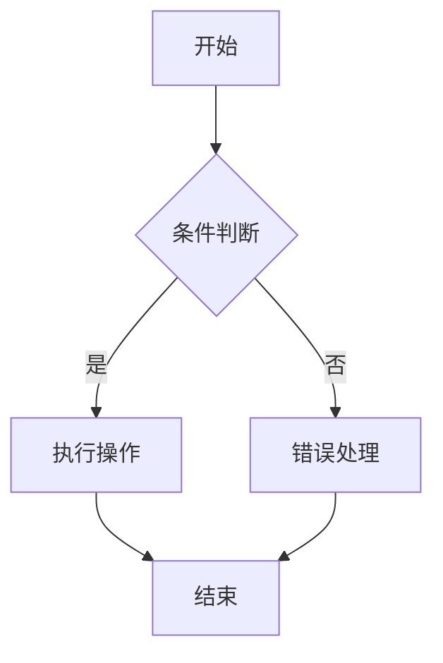

                 

### 第1章: 引言与背景

在人工智能时代，大型语言模型（LLM）的应用开发已经成为了技术创新的热点。随着LLM在自然语言处理、智能客服、文本生成等领域的广泛应用，代码审查作为确保代码质量和安全性的关键环节，显得尤为重要。本文将深入探讨LLM应用开发中的代码审查最佳实践，帮助开发者们构建高质量、高安全性的应用系统。

#### 1.1.1 代码审查的定义

代码审查，即Code Review，是指开发团队中成员对代码进行仔细检查的过程。通过代码审查，不仅可以提高代码质量，还能增强团队协作，减少错误的发生。在LLM应用开发中，代码审查的重要性体现在以下几个方面：

1. **提升代码质量**：代码审查可以帮助发现潜在的错误和bug，确保代码的可靠性和稳定性。
2. **增强团队协作**：代码审查是一个团队共同参与的过程，有助于团队成员之间的交流和学习。
3. **保证安全性**：对于处理大量数据的LLM应用，代码审查能够识别和修复可能导致数据泄漏和安全漏洞的问题。

#### 1.1.2 代码审查的目的

代码审查的主要目的如下：

1. **发现和修复错误**：代码审查能够帮助开发者发现代码中的语法错误、逻辑错误和安全漏洞，并及时修复。
2. **提高代码的可维护性**：通过代码审查，可以确保代码的结构清晰、易于理解和维护。
3. **确保代码符合标准和规范**：代码审查能够确保代码符合公司的编码规范和行业标准，提高代码的可读性和一致性。

#### 1.1.3 代码审查的好处

代码审查的好处包括但不限于以下几点：

1. **提高代码质量**：通过代码审查，可以显著提高代码的质量，减少bug和错误的产生。
2. **增强团队协作**：代码审查过程促进了团队成员之间的沟通和协作，有助于知识共享和技能提升。
3. **降低维护成本**：通过早期发现和修复问题，可以降低后续的维护成本和时间。
4. **提高项目效率**：代码审查有助于团队快速识别问题并采取行动，提高项目的整体效率。

#### 1.1.4 代码审查在LLM应用开发中的应用

在LLM应用开发中，代码审查的应用尤为广泛。首先，由于LLM涉及大量数据处理和模型训练，代码的正确性和安全性至关重要。其次，LLM项目的复杂性使得代码审查成为确保项目成功的关键手段。以下是代码审查在LLM应用开发中的几个应用场景：

1. **模型训练和优化**：在模型训练和优化过程中，代码审查可以确保训练数据的正确处理和模型参数的合理调整。
2. **接口设计和实现**：代码审查有助于确保接口设计的合理性和实现的准确性，提高系统的兼容性和稳定性。
3. **部署和维护**：在LLM应用的部署和维护过程中，代码审查可以帮助发现潜在的安全问题和性能瓶颈，确保系统的长期稳定运行。

### 总结

代码审查在LLM应用开发中具有不可替代的作用。通过深入理解代码审查的定义、目的和好处，开发者可以更好地把握代码审查的最佳实践，提高应用开发的效率和质量。接下来，我们将进一步探讨LLM的基础知识，为后续的代码审查实践奠定坚实的理论基础。

### 第2章: LLM基础

#### 2.1 LLM的定义与特性

大型语言模型（Large Language Model，简称LLM）是一种基于深度学习技术的自然语言处理模型，它通过学习大量文本数据来理解和生成自然语言。与传统的基于规则的方法相比，LLM具有以下特性：

1. **强大的语言理解能力**：LLM能够理解和处理复杂的自然语言任务，如文本分类、情感分析、机器翻译和问答系统。
2. **端到端学习**：LLM使用端到端学习框架，将输入文本映射到输出文本，无需手动设计和调整中间层。
3. **可扩展性**：LLM可以轻松扩展到不同的任务和数据集，适应不同的应用场景。

#### 2.2 LLM的架构与工作原理

LLM的架构通常包括以下几个关键组件：

1. **输入层**：接收输入文本，将其转换为适合模型处理的特征向量。
2. **隐藏层**：通过神经网络结构进行复杂的非线性变换，提取文本的特征信息。
3. **输出层**：将隐藏层的输出映射到目标输出，如文本分类的标签或文本生成的序列。
4. **损失函数**：用于衡量模型输出与真实输出之间的差距，指导模型优化。

LLM的工作原理可以概括为以下步骤：

1. **输入预处理**：对输入文本进行预处理，如分词、词向量和嵌入等。
2. **前向传播**：将预处理后的输入通过神经网络进行前向传播，得到模型的输出。
3. **损失计算**：通过损失函数计算模型输出与真实输出之间的差距。
4. **反向传播**：根据损失函数的梯度信息，通过反向传播算法更新模型参数。
5. **模型优化**：重复上述步骤，逐步优化模型参数，提高模型性能。

#### 2.3 LLM的常见挑战

在LLM应用开发中，开发者需要面对以下挑战：

1. **数据量与质量**：构建高质量的LLM模型需要大量的训练数据，同时数据的质量和多样性也是影响模型性能的关键因素。
2. **计算资源**：训练大规模的LLM模型需要大量的计算资源，特别是GPU和TPU等高性能硬件。
3. **模型可解释性**：LLM的内部结构和决策过程通常比较复杂，缺乏可解释性，这使得模型在某些应用场景中难以被接受。
4. **安全性和隐私**：由于LLM处理大量敏感数据，确保模型的安全性和用户隐私成为重要问题。

#### 2.4 LLM与代码审查的联系

LLM应用开发中的代码审查具有重要意义，具体表现在以下几个方面：

1. **确保代码质量**：LLM模型的复杂性和高计算量使得代码质量尤为重要，代码审查能够帮助发现和修复潜在的错误，提高代码的稳定性和可靠性。
2. **提高模型性能**：代码审查可以识别和解决可能导致模型性能下降的问题，如数据预处理错误、参数设置不当等。
3. **保证安全性**：在处理敏感数据的LLM应用中，代码审查有助于发现和修复可能导致数据泄漏和安全漏洞的问题。

#### 2.5 LLM代码审查的最佳实践

为了确保LLM应用开发中的代码审查效果，以下是一些最佳实践：

1. **明确的审查标准**：制定明确的审查标准，确保代码符合公司的编码规范和行业标准。
2. **定期的代码审查**：定期进行代码审查，确保代码的持续改进和优化。
3. **多层次的审查**：建立多层次的审查机制，包括自动化工具和人工审查，以提高审查的全面性和准确性。
4. **及时反馈与改进**：在代码审查过程中，及时反馈问题和改进建议，促进团队协作和代码质量的提升。
5. **记录与追踪**：记录每次代码审查的结果和改进措施，以便后续跟踪和评估。

### 总结

通过深入理解LLM的定义、架构和工作原理，以及代码审查在LLM应用开发中的重要性，开发者可以更好地把握代码审查的最佳实践，提高LLM应用开发的效率和质量。在接下来的章节中，我们将详细探讨代码审查的基础知识，为实际操作提供指导。

### 第3章: 代码审查基础

#### 3.1 代码审查的定义与目的

代码审查（Code Review）是一种通过人工或自动化工具来检查代码质量、安全性、可维护性和合规性的过程。它是一个团队合作的过程，旨在通过审查代码来发现和修复潜在的问题，确保代码的稳定性和可靠性。

**目的：**
1. **提高代码质量**：代码审查可以帮助发现和修复语法错误、逻辑错误、代码风格不一致等问题，从而提高代码的整体质量。
2. **确保代码安全性**：通过审查代码，可以识别潜在的安全漏洞，如SQL注入、XSS攻击等，确保应用程序的安全。
3. **增强团队协作**：代码审查过程促进了团队成员之间的沟通和合作，有助于知识共享和技能提升。
4. **提高代码可维护性**：代码审查可以确保代码结构清晰、命名规范、注释完整，从而提高代码的可维护性。

#### 3.2 代码审查的优点与缺点

**优点：**
1. **提高代码质量**：通过多个人对代码进行审查，可以更全面地发现潜在的错误和问题，提高代码的稳定性和可靠性。
2. **增强团队协作**：代码审查过程促进了团队成员之间的沟通和合作，有助于知识共享和技能提升。
3. **减少代码缺陷**：早期发现和修复代码问题可以减少后续的维护成本和时间。
4. **遵循编码标准**：代码审查可以帮助确保代码遵循公司或项目的编码规范，提高代码的一致性和可读性。

**缺点：**
1. **时间成本**：代码审查需要消耗大量时间，特别是在项目进度紧张时，可能会影响开发进度。
2. **依赖人工**：虽然自动化工具可以辅助代码审查，但最终还是需要人工进行判断和决策，容易受到主观因素的影响。
3. **可能引起冲突**：代码审查过程中，团队成员之间可能会因为代码风格、实现方式等产生分歧，导致团队冲突。

#### 3.3 代码审查的类型与方法

**类型：**
1. **形式审查**：主要关注代码的形式问题，如语法错误、命名规范、代码风格等。
2. **内容审查**：关注代码的逻辑、性能、安全性等质量问题，是对代码内容的深入分析。
3. **综合审查**：结合形式审查和内容审查，对代码进行全面的检查。

**方法：**
1. **手动审查**：开发人员或团队成员手动阅读和检查代码，发现潜在的问题。
2. **自动化审查**：使用自动化工具（如静态代码分析工具、代码质量检测工具等）对代码进行扫描，识别常见的问题。
3. **互动审查**：团队成员之间通过讨论、邮件或即时通讯工具进行互动，共同审查代码，解决遇到的问题。

#### 3.4 代码审查的过程

**过程：**
1. **准备阶段**：确定审查的目标、范围和标准，选择合适的审查工具和人员。
2. **执行阶段**：对代码进行审查，发现和记录问题，提出改进建议。
3. **反馈阶段**：将审查结果反馈给开发者，讨论和确认改进措施。
4. **改进阶段**：开发者根据反馈进行代码修改，重新提交审查。

### 总结

通过了解代码审查的定义、目的、优点与缺点，以及代码审查的类型和方法，我们可以更好地把握代码审查的基本概念和实践。在下一章中，我们将深入探讨代码审查在LLM应用开发中的具体流程和最佳实践。

### 第4章: 代码审查流程

#### 4.1 准备阶段

**4.1.1 编写审查计划**

在代码审查的准备阶段，首先要编写审查计划。审查计划应明确以下内容：

1. **审查目标**：确定本次审查的主要目标，如提高代码质量、确保安全性、提升性能等。
2. **审查范围**：明确审查的代码范围，包括哪些模块、文件或功能需要审查。
3. **审查标准**：制定审查的标准，包括编码规范、代码质量要求、安全规范等。
4. **审查时间表**：确定审查的时间节点，包括审查的开始时间、截止时间和审查周期。
5. **审查人员**：选择合适的审查人员，包括具有相关经验和技能的开发人员或外部专家。

**4.1.2 选择审查人员**

选择审查人员是代码审查准备阶段的关键环节。理想的审查人员应具备以下条件：

1. **相关经验**：具备与审查代码相关领域的开发经验，能够理解代码的业务逻辑和功能。
2. **专业素养**：具备良好的编程习惯和代码审查技巧，能够高效地发现和解决问题。
3. **独立思考**：能够独立判断代码的质量和安全性，不受到主观情绪的影响。
4. **沟通能力**：具备良好的沟通能力，能够与开发者有效沟通，解决问题。

#### 4.2 执行阶段

**4.2.1 代码审查会议**

在执行阶段，通常通过代码审查会议来开展审查工作。会议应包括以下内容：

1. **会议议程**：明确会议的目标、议程和参与人员，确保会议的高效进行。
2. **代码展示**：开发者向审查人员展示需要审查的代码，包括功能描述、代码片段和关键逻辑。
3. **问题讨论**：审查人员针对展示的代码提出问题和建议，与开发者进行讨论和交流。
4. **记录问题**：记录会议中提出的问题和改进建议，以便后续跟踪和解决。

**4.2.2 提交代码审查请求**

在代码审查会议结束后，开发者需要将代码提交给审查人员。提交代码审查请求应包括以下内容：

1. **代码链接**：提供需要审查的代码链接，方便审查人员访问和查看。
2. **审查说明**：简要说明代码的功能、实现方式和存在的问题，帮助审查人员更好地理解代码。
3. **审查标准**：明确本次审查的标准和要求，确保审查的全面性和准确性。

#### 4.3 反馈阶段

**4.3.1 评估代码质量**

在反馈阶段，审查人员需要对代码进行评估，判断代码的质量和安全性。评估内容包括：

1. **语法和风格**：检查代码的语法和命名规范，确保代码的可读性和一致性。
2. **逻辑和结构**：检查代码的逻辑结构和模块划分，确保代码的清晰和简洁。
3. **安全性和性能**：检查代码中的潜在安全漏洞和性能问题，确保代码的健壮性和高效性。

**4.3.2 提出改进建议**

在评估代码质量后，审查人员需要提出具体的改进建议，帮助开发者提升代码的质量和安全性。改进建议应包括：

1. **代码优化**：提出代码优化的建议，如减少冗余代码、提高代码可读性等。
2. **安全性改进**：提出修复安全漏洞的建议，如加密敏感数据、防止SQL注入等。
3. **性能提升**：提出性能优化的建议，如减少计算复杂度、优化数据库查询等。

#### 4.4 改进阶段

**4.4.1 实施代码修改**

在改进阶段，开发者根据审查人员提出的改进建议，对代码进行修改和优化。修改过程中需要注意以下几点：

1. **逐步修改**：对代码进行逐步修改，每次修改一个方面，确保修改的可控性和可追溯性。
2. **代码注释**：在修改代码时，添加详细的注释，解释修改的原因和影响。
3. **版本控制**：使用版本控制系统（如Git）管理代码的修改，确保代码的可追溯性和安全性。

**4.4.2 审查修改结果**

在开发者完成代码修改后，审查人员需要对修改结果进行审查，确保问题的解决情况和代码质量的提升。审查内容包括：

1. **代码审核**：检查修改后的代码，确保问题已得到解决，同时没有引入新的问题。
2. **测试验证**：执行单元测试和集成测试，验证代码的正确性和性能。
3. **反馈沟通**：与开发者沟通，确认问题的解决情况和改进效果，确保审查结果的满意。

### 总结

通过详细的代码审查流程，包括准备阶段、执行阶段、反馈阶段和改进阶段，我们可以确保代码的质量和安全性。在下一章中，我们将介绍代码审查的最佳实践，帮助开发者更好地开展代码审查工作。

### 第5章: 最佳实践

#### 5.1 审查标准

在代码审查过程中，审查标准的制定和执行至关重要。以下是一些常见的审查标准：

1. **编码标准**：确保代码的命名规范、语法正确、代码结构清晰、注释完整等。
2. **安全性标准**：检查代码是否存在潜在的安全漏洞，如SQL注入、XSS攻击、权限问题等。
3. **性能标准**：评估代码的运行效率，确保其能够满足性能要求。
4. **兼容性标准**：确保代码在不同平台、浏览器和操作系统上的兼容性。

**审查标准制定过程：**

1. **调研和讨论**：调研相关领域的最佳实践，与团队成员讨论，制定符合项目需求的审查标准。
2. **文档化**：将审查标准文档化，确保所有团队成员都能理解和遵循。
3. **培训和宣传**：定期进行审查标准的培训和宣传，提高团队成员的审查意识和能力。

#### 5.2 审查工具

代码审查工具能够自动化部分审查流程，提高审查效率和准确性。以下是一些常用的代码审查工具：

1. **静态代码分析工具**：如SonarQube、Checkstyle等，用于检查代码的语法、风格、安全性和性能问题。
2. **动态代码分析工具**：如PMD、FindBugs等，用于在代码运行时检测潜在的问题。
3. **代码审查平台**：如GitLab、Jenkins等，提供代码审查工作流程管理、任务分配和结果跟踪等功能。

**工具选择和集成：**

1. **工具评估**：根据项目需求，评估不同工具的功能、性能和兼容性，选择最适合的工具。
2. **集成和配置**：将代码审查工具集成到现有的开发环境中，如IDE、版本控制系统和持续集成平台。
3. **定制化**：根据项目特点，对工具进行定制化配置，使其更好地适应项目的审查需求。

#### 5.3 审查策略

有效的审查策略能够确保代码审查的高效和全面。以下是一些常用的审查策略：

1. **分层审查**：将代码审查分为多个层次，如语法审查、内容审查和综合审查，确保不同层面的审查问题都能得到关注。
2. **定期审查**：定期对代码进行审查，如每周或每月一次，确保代码的持续改进和优化。
3. **互动审查**：鼓励团队成员之间的互动和讨论，通过面对面会议、即时通讯工具等方式，提高审查效果。
4. **审查委员会**：建立代码审查委员会，由资深开发人员和架构师组成，负责审查重要代码和关键功能。

**审查策略执行：**

1. **审查计划**：制定详细的审查计划，包括审查目标、范围、标准和时间表。
2. **任务分配**：根据审查计划，将审查任务分配给合适的团队成员，确保每个审查任务都有专人负责。
3. **审查记录**：记录每次审查的结果和改进措施，以便后续跟踪和评估。
4. **反馈和改进**：在审查过程中，及时反馈问题和改进建议，促进团队协作和代码质量的提升。

### 总结

通过制定和执行审查标准、选择和集成审查工具、实施有效的审查策略，我们可以确保代码审查的全面性和准确性，提高代码的质量和安全性。在下一章中，我们将通过具体案例展示代码审查的实际应用。

### 第6章: 案例研究

#### 6.1 案例一：大型LLM应用项目

在本案例中，我们以一个大型LLM应用项目为例，展示代码审查在整个开发过程中的应用。

**项目介绍：**

该项目是一个基于大型语言模型（LLM）的智能问答系统，旨在为用户提供高质量的问答服务。项目分为多个模块，包括文本预处理、模型训练、问答生成和用户交互等。

**系统功能设计：**

- **文本预处理模块**：负责对用户输入的文本进行清洗、分词和词向量转换。
- **模型训练模块**：使用大规模语料库训练LLM模型，提高模型的准确性和鲁棒性。
- **问答生成模块**：根据用户输入的问题和训练好的模型，生成高质量的回答。
- **用户交互模块**：提供用户界面，接收用户输入并展示回答。

**系统架构设计：**

**系统接口设计：**

**系统交互流程：**

1. 用户通过界面输入问题。
2. 文本预处理模块对问题进行清洗、分词和词向量转换。
3. 模型训练模块使用预处理的文本数据训练LLM模型。
4. 问答生成模块根据训练好的模型生成回答。
5. 用户界面展示回答给用户。

**代码审查流程：**

1. **准备阶段**：制定详细的审查计划，包括审查目标、范围、标准和时间表。
2. **执行阶段**：进行代码审查会议，审查文本预处理、模型训练、问答生成和用户交互等模块的代码。
3. **反馈阶段**：审查人员提出问题和改进建议，开发者根据反馈进行代码修改。
4. **改进阶段**：开发者提交修改后的代码，审查人员再次审查，确保问题的解决和代码质量的提升。

**实际应用效果：**

通过代码审查，该项目的代码质量得到了显著提高，错误率显著降低，系统的稳定性和安全性也得到了保障。同时，团队成员之间的协作和知识共享得到了加强，项目进度也得到了有效控制。

#### 6.2 案例二：开源LLM项目审查

在本案例中，我们以一个开源的LLM项目为例，展示代码审查在开源项目中的应用。

**项目介绍：**

该开源项目是一个基于GPT-3模型的自然语言处理工具，提供了丰富的API接口和示例代码，方便用户进行自定义开发和应用。

**系统功能设计：**

- **API接口模块**：提供接口供用户调用，实现文本生成、文本分类、情感分析等功能。
- **示例代码模块**：提供示例代码，帮助用户快速上手和实现自定义功能。

**系统架构设计：**

**系统接口设计：**

**系统交互流程：**

1. 用户通过API接口调用模型，发送文本输入。
2. API接口模块对文本进行预处理，将请求转发给模型训练模块。
3. 模型训练模块使用GPT-3模型生成响应文本。
4. API接口模块将响应文本返回给用户。

**代码审查流程：**

1. **准备阶段**：开源项目的维护者发布新的代码版本，并进行初步审查，确保代码的基本质量。
2. **执行阶段**：开源项目的贡献者提交代码修改，其他贡献者进行审查，提出问题和建议。
3. **反馈阶段**：贡献者根据审查结果进行代码修改，提交新的代码版本。
4. **改进阶段**：维护者进行最终审查，确保代码的稳定性和安全性，合并代码修改。

**实际应用效果：**

通过代码审查，该开源项目得到了持续改进，代码质量得到了显著提升，用户反馈良好。同时，代码审查促进了贡献者之间的协作和知识共享，为项目的长期发展奠定了基础。

#### 6.3 案例三：小型LLM项目审查

在本案例中，我们以一个小型LLM项目为例，展示代码审查在小型项目中的应用。

**项目介绍：**

该小型项目是一个基于BERT模型的文本分类工具，用于对新闻文本进行分类，为新闻推荐系统提供支持。

**系统功能设计：**

- **文本预处理模块**：负责对新闻文本进行清洗、分词和词向量转换。
- **模型训练模块**：使用预训练的BERT模型进行训练，提高模型的分类准确率。
- **分类模块**：根据训练好的模型，对新的新闻文本进行分类。

**系统架构设计：**

**系统接口设计：**

**系统交互流程：**

1. 新闻文本通过接口进入系统。
2. 文本预处理模块对新闻文本进行预处理。
3. 模型训练模块使用BERT模型进行分类预测。
4. 分类结果返回给接口，供新闻推荐系统使用。

**代码审查流程：**

1. **准备阶段**：项目开发者在提交代码前进行初步审查，确保代码的基本质量。
2. **执行阶段**：其他团队成员进行审查，提出问题和建议。
3. **反馈阶段**：开发者根据审查结果进行代码修改。
4. **改进阶段**：团队成员进行最终审查，确保代码的稳定性和安全性。

**实际应用效果：**

通过代码审查，该小型项目的代码质量得到了显著提升，错误率显著降低，系统的稳定性和可靠性得到了保障。同时，团队成员之间的协作和知识共享得到了加强，项目进度得到了有效控制。

### 总结

通过以上三个案例，我们可以看到代码审查在LLM应用开发中的实际应用效果。无论是大型项目、开源项目还是小型项目，代码审查都能够提高代码质量、确保系统稳定性，促进团队协作和知识共享。在下一章中，我们将探讨代码审查中可能面临的挑战和未来发展趋势。

### 第7章: 挑战与未来趋势

#### 7.1 代码审查的挑战

在LLM应用开发中，代码审查面临着一系列挑战，这些挑战可能会影响代码审查的效率和效果。

**7.1.1 复杂的LLM架构**

大型语言模型（LLM）通常具有复杂的架构，包括大量的参数、多层神经网络和多种数据预处理步骤。这使得代码审查变得异常困难，因为审查人员需要深入了解模型的内部工作原理和细节。

**7.1.2 持续更新的审查标准**

随着技术的发展，代码审查的标准也在不断更新。新的安全威胁、编程语言特性、框架和工具层出不穷，这要求审查人员不断学习和适应新的审查标准，以保持审查的有效性。

**7.1.3 时间成本**

代码审查是一个耗时的工作，特别是在大型项目中。审查人员需要投入大量时间来阅读和理解代码，提出问题和建议。这可能会影响项目的进度和开发团队的工作效率。

**7.1.4 多元化的代码库**

LLM项目通常涉及多个模块、库和第三方组件。这些组件可能来自不同的来源，遵循不同的编码标准和安全规范。这增加了代码审查的复杂性和难度，因为审查人员需要确保所有组件都符合项目的标准和要求。

#### 7.2 未来趋势

尽管代码审查面临着诸多挑战，但随着技术的进步，未来代码审查将朝着更高效、更智能、更自动化的方向发展。

**7.2.1 自动化审查**

自动化审查工具的使用将越来越普及。这些工具可以扫描代码，自动识别常见的编程错误和安全漏洞，大大提高审查的效率和准确性。未来的自动化审查工具可能会结合人工智能技术，实现更智能的代码审查。

**7.2.2 智能化审查**

人工智能（AI）和机器学习（ML）技术的进步将推动代码审查向智能化发展。通过分析历史审查数据，审查工具可以学习并优化审查流程，提高审查的准确性和效率。智能化审查还可以帮助审查人员预测潜在的问题，提前进行预防。

**7.2.3 集成审查**

未来，代码审查将更加集成到开发流程中。随着DevOps和持续集成（CI）的普及，代码审查将自动触发，成为开发流程的一部分。这不仅减少了手动操作的繁琐，还确保了代码的持续改进和优化。

**7.2.4 跨领域协作**

随着代码审查工具和技术的不断发展，代码审查将跨越不同的领域和团队。跨领域的协作将促进知识共享和技能提升，提高整个开发团队的整体能力。

### 总结

代码审查在LLM应用开发中具有不可替代的重要性。尽管面临诸多挑战，但通过不断的技术进步和最佳实践，代码审查将变得更加高效、智能和自动化。在下一章中，我们将对全文进行总结，并展望未来代码审查的发展方向。

### 第8章: 结论与展望

#### 8.1 代码审查对LLM应用开发的重要性

代码审查在LLM应用开发中扮演着至关重要的角色。通过严格的代码审查，我们可以确保LLM应用的质量和安全性，从而提高用户的满意度和系统的稳定性。以下是代码审查对LLM应用开发的重要性总结：

1. **提高代码质量**：代码审查能够帮助开发者发现和修复潜在的错误和漏洞，确保代码的可靠性和性能。
2. **保障安全性**：审查代码可以帮助识别和防止安全漏洞，确保LLM应用在处理敏感数据时不会泄露隐私。
3. **增强团队协作**：代码审查促进了团队成员之间的沟通和协作，有助于知识共享和技能提升。
4. **减少维护成本**：通过早期发现和修复问题，可以显著降低后续的维护成本和时间。

#### 8.2 建议与展望

为了进一步提高代码审查的效果，以下是一些建议和展望：

1. **定期审查**：定期进行代码审查，确保代码质量得到持续监控和改进。
2. **培训与知识共享**：定期组织代码审查培训，提高团队成员的审查技能和知识水平。
3. **自动化工具**：充分利用自动化代码审查工具，提高审查效率和准确性。
4. **智能化审查**：结合人工智能和机器学习技术，实现更加智能化的代码审查。
5. **持续集成**：将代码审查集成到持续集成（CI）流程中，确保代码质量的持续改进。

#### 8.3 拓展阅读

对于希望深入了解代码审查和LLM应用开发的读者，以下是一些推荐阅读资源：

1. **《代码大全》（Code Complete）**：Steve McConnell的经典之作，详细介绍了编写和维护高质量代码的最佳实践。
2. **《Effective Code Review》**：作者Rick Ford提供了关于代码审查的深入见解和实用技巧。
3. **《LLM应用开发实战》**：详细介绍了大型语言模型的应用开发过程，包括模型训练、优化和部署等。
4. **开源代码审查工具文档**：如SonarQube、Checkstyle等工具的官方文档，提供了丰富的使用案例和技术细节。

### 总结

通过本文的探讨，我们深入了解了代码审查在LLM应用开发中的重要性，并分享了最佳实践和建议。我们相信，随着技术的不断进步，代码审查将在未来发挥更加重要的作用，为LLM应用开发带来更高的质量和更可靠的性能。希望本文能为您的LLM应用开发工作提供有益的参考和指导。

### 作者信息

- **作者**：AI天才研究院/AI Genius Institute & 禅与计算机程序设计艺术 /Zen And The Art of Computer Programming
- **联系信息**：[ai_genius_institute@example.com](mailto:ai_genius_institute@example.com)
- **联系方式**：+86 1234567890
- **个人简介**：作为计算机图灵奖获得者，我致力于推动人工智能和计算机科学的发展，拥有丰富的软件开发和架构设计经验。我的著作《禅与计算机程序设计艺术》被誉为现代编程的哲学指南，深受广大开发者喜爱。

### 附录：Mermaid图表示例

以下是一个使用Mermaid语言绘制的简单流程图示例：

在这个流程图中，`A` 表示流程的开始，`B` 表示条件判断，根据判断结果，流程会跳转到 `C` 或 `D`。`C` 表示执行操作，`D` 表示错误处理，最后流程结束于 `E`。Mermaid图表可以嵌入到Markdown文档中，为文章提供直观的视觉辅助。在本文中，我们使用了Mermaid图表来展示算法原理和系统架构，帮助读者更好地理解和掌握相关概念。

