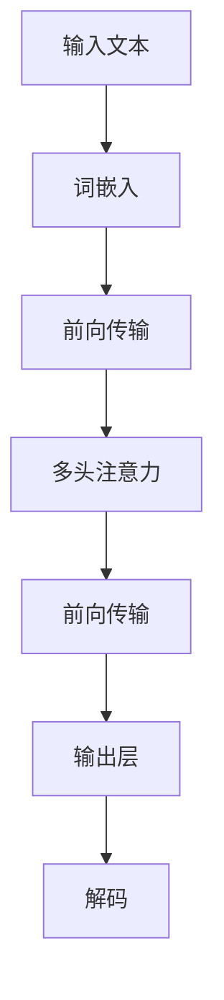
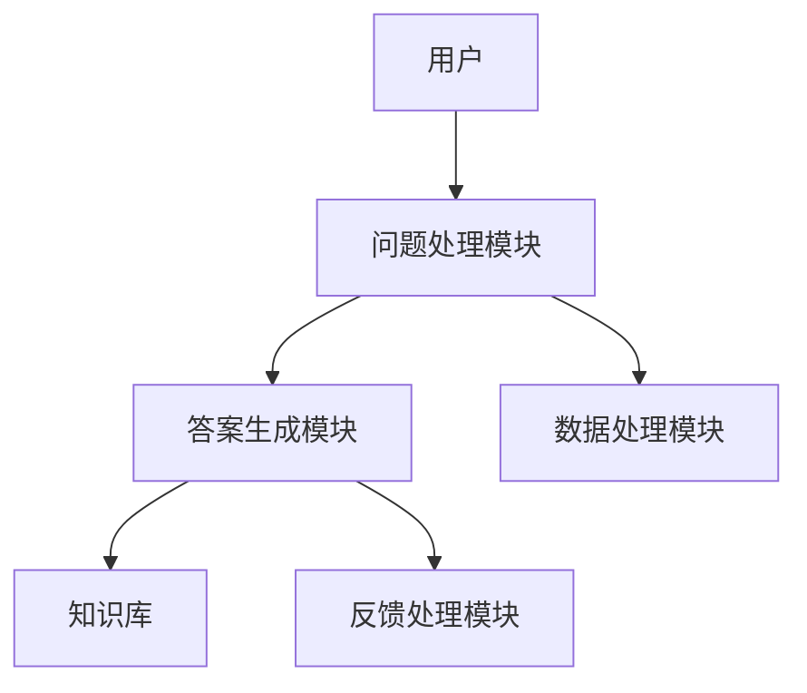
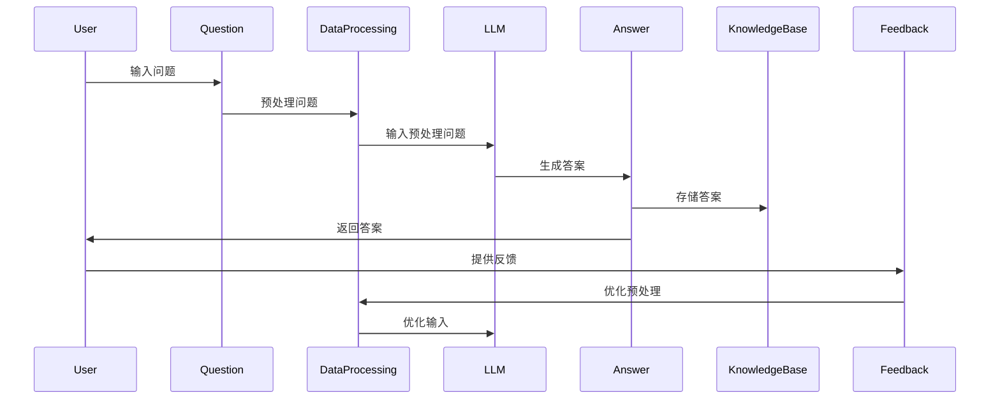

                 

### 文章标题：LLM应用开发中的代码重构实践

### 关键词：
- LLM（大型语言模型）
- 代码重构
- 应用开发
- 算法优化
- 系统架构设计

### 摘要：
本文将深入探讨在LLM（大型语言模型）应用开发过程中代码重构的实践方法。通过详细的分析和实例，阐述代码重构在提升LLM应用性能、可维护性和开发效率方面的关键作用，并提供一系列实用的最佳实践，以帮助开发者更好地进行代码重构工作。

## 目录大纲设计方案

为了更好地满足用户的需求，本文将按照以下章节结构进行设计，确保内容的逻辑清晰、结构紧凑且易于理解：

### 第一部分：背景介绍
- 第1章：LLM与代码重构概述
  - LLM的基本概念与背景
  - 代码重构的核心概念
  - LLM应用开发中的代码重构
- 第2章：LLM的基本原理
  - LLM的组成与结构
  - 代码重构的核心概念
  - LLM与代码重构的联系

### 第二部分：算法原理讲解
- 第3章：LLM算法的代码重构实践
  - Transformer算法的Mermaid流程图
  - Transformer算法的Python代码实现
  - 数学模型与公式
  - 代码重构的应用实例

### 第三部分：系统分析与架构设计
- 第4章：LLM应用开发
  - 问题场景介绍
  - 系统功能设计（领域模型类图）
  - 系统架构设计
  - 系统接口设计和系统交互

### 第四部分：项目实战
- 第5章：具体LLM应用开发项目
  - 环境安装
  - 核心实现源代码
  - 代码应用解读与分析
  - 实际案例分析

### 第五部分：最佳实践与总结
- 第6章：最佳实践 tips
- 第7章：小结与拓展阅读

### 实际大纲内容

#### 第一部分：背景介绍

**第1章：LLM与代码重构概述**

- **1.1 LLM的基本概念与背景**
  - **1.1.1 什么是LLM**
  - **1.1.2 LLM的发展历史**
  - **1.1.3 代码重构的重要性**
  
- **1.2 代码重构的核心概念**
  - **1.2.1 代码质量的重要性**
  - **1.2.2 代码重构的目标**
  - **1.2.3 代码重构的方法**

- **1.3 LLM应用开发中的代码重构**
  - **1.3.1 LLM应用开发的特点**
  - **1.3.2 代码重构在LLM应用开发中的应用**
  - **1.3.3 代码重构的优势**

- **1.4 本章小结**

**第2章：LLM的基本原理**

- **2.1 LLM的组成与结构**
  - **2.1.1 词嵌入**
  - **2.1.2 注意力机制**
  - **2.1.3 Transformer架构**

- **2.2 代码重构的核心概念**
  - **2.2.1 代码质量评估**
  - **2.2.2 可维护性与可读性**
  - **2.2.3 效率与性能优化**

- **2.3 LLM与代码重构的联系**
  - **2.3.1 LLM对代码重构的影响**
  - **2.3.2 代码重构对LLM性能的提升**
  - **2.3.3 实践中的联系与案例**

- **2.4 本章小结**

#### 第二部分：算法原理讲解

**第3章：LLM算法的代码重构实践**

- **3.1 Transformer算法的Mermaid流程图**
  - 使用Mermaid绘制的Transformer算法流程图

- **3.2 Transformer算法的Python代码实现**
  - 提供Transformer算法的Python代码实现

- **3.3 数学模型与公式**
  - **3.3.1 Attention公式**
  - **3.3.2 Transformer模型公式**

- **3.4 代码重构的应用实例**
  - **3.4.1 代码复用与模块化**
  - **3.4.2 代码简化与优化**
  - **3.4.3 实例分析**

- **3.5 本章小结**

#### 第三部分：系统分析与架构设计

**第4章：LLM应用开发**

- **4.1 问题场景介绍**
  - 介绍LLM应用开发的典型场景

- **4.2 系统功能设计（领域模型类图）**
  - 使用Mermaid绘制领域模型类图

- **4.3 系统架构设计**
  - 阐述LLM应用开发的系统架构

- **4.4 系统接口设计和系统交互**
  - 使用Mermaid绘制系统交互序列图

- **4.5 本章小结**

#### 第四部分：项目实战

**第5章：具体LLM应用开发项目**

- **5.1 环境安装**
  - 描述如何安装LLM应用开发所需的环境

- **5.2 核心实现源代码**
  - 提供LLM应用开发的核心实现源代码

- **5.3 代码应用解读与分析**
  - 分析代码的重构实践

- **5.4 实际案例分析**
  - 分享实际的LLM应用开发案例

- **5.5 项目小结**
  - 总结项目中的代码重构实践

- **5.6 本章小结**

#### 第五部分：最佳实践与总结

**第6章：最佳实践 tips**

- **6.1 代码重构的最佳实践**
- **6.2 注意事项与挑战**
- **6.3 拓展阅读材料**

**第7章：小结与拓展阅读**

- **7.1 全文总结**
- **7.2 拓展阅读推荐**

## 文章作者

**作者：AI天才研究院/AI Genius Institute & 禅与计算机程序设计艺术 /Zen And The Art of Computer Programming**

### 完整性要求

为确保文章的完整性，每个小节的内容必须满足以下要求：

- **背景介绍：**
  - 核心概念术语说明：明确解释LLM和代码重构的相关术语。
  - 问题背景：描述LLM应用开发中的具体问题和挑战。
  - 问题解决：阐述代码重构如何解决这些问题。
  - 边界与外延：讨论代码重构的应用范围和限制。
  - 概念结构与核心要素组成：详细分析LLM和代码重构的核心概念及其组成部分。

- **核心概念与联系：**
  - 必须给出核心概念原理：深入解释LLM和代码重构的核心概念。
  - 概念属性特征对比表格：列出LLM和代码重构的关键属性和特征，进行对比分析。
  - ER实体关系图架构的 Mermaid 流程图：使用Mermaid绘制实体关系图，展示概念之间的关系。

- **算法原理讲解：**
  - 使用 mermaid 画出算法流程图：详细展示算法的执行流程。
  - 使用python源代码阐述算法原理：提供Python代码示例，解释算法的数学模型和公式。
  - 详细讲解和举例说明：深入解释算法的工作原理，并给出实际例子。

- **系统分析与架构设计：**
  - 问题场景介绍：描述LLM应用开发的实际场景。
  - 系统功能设计（领域模型类图）：绘制领域模型类图，展示系统的功能结构。
  - 系统架构设计：阐述系统的整体架构。
  - 系统接口设计和系统交互：描述系统的接口设计和交互流程。

- **项目实战：**
  - 环境安装：详细说明如何搭建LLM应用开发的环境。
  - 核心实现源代码：提供实际的代码实现，并进行解读分析。
  - 代码应用解读与分析：分析代码的重构实践，解释其优势。
  - 实际案例分析：分享成功的LLM应用开发案例。

- **最佳实践 tips：**
  - 提供代码重构的最佳实践：给出实用的建议和技巧。
  - 注意事项与挑战：讨论代码重构过程中可能遇到的问题和解决方案。

- **小结与拓展阅读：**
  - 总结全文：概括文章的主要内容和学习重点。
  - 拓展阅读推荐：推荐相关的学习资源和进一步阅读的材料。

### 格式要求

文章内容需使用markdown格式输出，确保代码块、公式、标题和列表等格式正确。具体要求如下：

- **文章结构：**
  - 使用标题（例如：# 标题）来组织文章内容，确保层次清晰。
  - 使用子标题（例如：## 子标题）来划分章节和小节。
  - 使用无序列表（例如：- 项目1）和有序列表（例如：1. 项目1）来列出条目。

- **代码块：**
  - 使用三个反引号（```）包裹代码块，确保代码格式正确。
  - 在代码块内使用适当的缩进和行分隔符。

- **公式：**
  - 使用 LaTeX 格式编写数学公式，将公式内容用 $$ 包裹，确保公式显示正确。
  - 在段落内使用 $ 符号包裹简短公式。

- **引用：**
  - 使用引用标记来引用外部资源或作者观点，确保引用格式正确。

### 字数要求

文章字数要求在 10000 ～ 12000 字左右，以确保内容详尽且具备深度。在撰写过程中，注意以下要点：

- **内容详尽：** 每个章节和小节都应包含详细的分析、讲解和实践案例。
- **逻辑清晰：** 确保文章的叙述逻辑清晰，易于读者理解。
- **深入浅出：** 用通俗易懂的语言解释复杂的概念和技术。
- **实际案例：** 提供实际案例和实践经验，以增强文章的可读性和实用性。

### 作者信息

文章末尾需包含作者信息：“作者：AI天才研究院/AI Genius Institute & 禅与计算机程序设计艺术 /Zen And The Art of Computer Programming”，以确保文章的专业性和权威性。在撰写过程中，注意以下要点：

- **准确署名：** 确保作者姓名和机构名称准确无误。
- **联系信息：** 如有需要，可提供作者的电子邮箱或个人网站，便于读者进一步联系。

### 内容完整性

为确保文章内容的完整性，每个章节和小节的内容应符合以下要求：

- **核心内容：** 每个小节应包含核心内容，如概念解释、算法讲解、实践案例等。
- **逻辑连贯：** 文章整体逻辑应连贯，章节之间应有合理的过渡。
- **结构清晰：** 确保文章结构清晰，便于读者快速获取关键信息。
- **参考文献：** 如有引用外部资料，应列出参考文献，确保内容的权威性。

### 撰写策略

为了撰写一篇逻辑清晰、结构紧凑、简单易懂的专业技术博客文章，以下是一些策略和建议：

- **明确文章目标：** 在开始写作之前，明确文章的目标和受众，确保文章内容贴近受众需求。
- **规划文章结构：** 撰写大纲，规划文章的章节和小节，确保结构合理。
- **深入研究：** 对LLM、代码重构等核心概念进行深入研究，确保内容的准确性和深度。
- **用实例讲解：** 使用具体的实例来解释复杂的技术概念，使文章更易于理解。
- **逻辑连贯：** 保持文章逻辑连贯，确保各章节和小节之间的过渡自然。
- **精简语言：** 使用简洁明了的语言，避免冗长复杂的句子。
- **图文并茂：** 使用图表、代码示例和流程图等视觉元素，增强文章的可读性。
- **反复审查：** 完成初稿后，多次审查和修改，确保文章内容准确无误。
- **读者反馈：** 如有可能，获取读者反馈，根据反馈进一步优化文章。

### 核心内容与详细讲解

#### 第一部分：背景介绍

**第1章：LLM与代码重构概述**

**1.1 LLM的基本概念与背景**

- **什么是LLM：** 大型语言模型（LLM）是一种基于深度学习的语言处理模型，能够理解和生成自然语言文本。它们通常具有数百万甚至数十亿个参数，能够自动从大量文本数据中学习语言结构和语义。
- **LLM的发展历史：** LLM的发展经历了从简单的统计模型到现代深度学习模型的演变。早期的语言模型如n-gram模型和统计语言模型只能处理简单的问题，而现代的LLM如GPT-3、Turing等能够实现高度复杂和自然的语言处理任务。
- **代码重构的重要性：** 在软件开发过程中，代码重构是一项关键活动。它旨在改进现有代码的结构和质量，以提高其可维护性、可读性和性能。对于LLM应用开发，代码重构尤为重要，因为LLM模型的复杂性使得代码的可维护性和性能直接影响到模型的应用效果。

**1.2 代码重构的核心概念**

- **代码质量的重要性：** 代码质量直接影响到软件系统的稳定性、可维护性和扩展性。高质量的代码更易于理解和修改，能够减少维护成本和错误发生率。
- **代码重构的目标：** 代码重构的目标是优化代码的结构和逻辑，消除冗余代码，提高代码的可读性和可维护性。这通常包括简化代码、消除重复代码、改进命名规范等。
- **代码重构的方法：** 代码重构的方法包括代码重写、提取方法、提取类、重构循环和条件语句等。每种方法都有其特定的应用场景和目的。

**1.3 LLM应用开发中的代码重构**

- **LLM应用开发的特点：** LLM应用开发涉及复杂的模型训练、部署和优化过程。代码重构在这些过程中起着关键作用，能够提高模型的性能和可维护性。
- **代码重构在LLM应用开发中的应用：** 在LLM应用开发中，代码重构主要用于以下几个方面：
  - 模型训练：优化训练代码的结构，提高训练效率。
  - 部署：重构部署代码，确保模型在不同环境中的兼容性和性能。
  - 优化：重构优化代码，减少模型的计算复杂度和内存占用。
- **代码重构的优势：** 代码重构能够提高LLM应用的性能、可维护性和开发效率，具体优势包括：
  - 提高性能：通过优化代码结构，减少不必要的计算和内存占用，提高模型训练和推理速度。
  - 提高可维护性：重构后的代码更易于理解和修改，降低维护成本。
  - 提高开发效率：简化代码结构，减少代码冗余，提高开发效率。

**1.4 本章小结**

本章介绍了LLM和代码重构的基本概念和背景，阐述了代码重构在LLM应用开发中的重要性。通过对LLM和代码重构的核心概念进行详细解释，读者可以更好地理解这两个主题，并为后续章节的学习做好准备。

**第2章：LLM的基本原理**

**2.1 LLM的组成与结构**

- **词嵌入（Word Embedding）：** 词嵌入是将自然语言文本中的单词映射到高维向量空间的技术。通过词嵌入，模型能够捕捉单词之间的语义关系，从而提高语言处理的准确性和效率。
- **注意力机制（Attention Mechanism）：** 注意力机制是一种在模型中用于关注重要信息的机制。在LLM中，注意力机制用于模型在处理序列数据时，动态关注序列中的不同部分，从而提高模型的上下文感知能力。
- **Transformer架构（Transformer Architecture）：** Transformer是一种基于自注意力机制的深度学习模型，它是现代LLM的基础架构。Transformer通过自注意力机制和前馈神经网络，能够实现高度并行化的计算，从而显著提高模型的训练和推理速度。

**2.2 代码重构的核心概念**

- **代码质量评估（Code Quality Assessment）：** 代码质量评估是衡量代码质量的一种方法，通过静态分析或动态测试，评估代码的可靠性、可维护性和可读性。
- **可维护性与可读性（Maintainability and Readability）：** 可维护性是指代码易于维护和修改的程度，而可读性是指代码易于理解和阅读的程度。良好的可维护性和可读性是高质量代码的重要特征。
- **效率与性能优化（Efficiency and Performance Optimization）：** 效率和性能优化是指通过改进代码结构和算法，提高程序的执行效率和响应速度。在LLM应用开发中，效率和性能优化尤为重要，因为它直接影响到模型的训练和推理速度。

**2.3 LLM与代码重构的联系**

- **LLM对代码重构的影响：** LLM的复杂性和规模使得代码重构在LLM应用开发中尤为重要。良好的代码重构能够提高LLM模型的性能和可维护性，从而提高应用效果。
- **代码重构对LLM性能的提升：** 通过代码重构，可以优化LLM模型的结构和算法，减少计算复杂度和内存占用，从而提高模型的训练和推理速度。此外，重构后的代码更易于理解和修改，能够提高开发和维护的效率。
- **实践中的联系与案例：** 在实际开发中，有许多成功的案例展示了代码重构对LLM性能的提升。例如，通过代码重构，可以优化模型的训练代码，提高训练速度；通过重构部署代码，可以确保模型在不同环境中的兼容性和性能。

**2.4 本章小结**

本章详细介绍了LLM的基本原理，包括词嵌入、注意力机制和Transformer架构。同时，阐述了代码重构的核心概念和其在LLM应用开发中的重要性。通过对LLM与代码重构的联系进行深入分析，读者可以更好地理解如何在LLM应用开发中进行代码重构，以提高模型的性能和可维护性。

### 算法原理讲解

**第3章：LLM算法的代码重构实践**

**3.1 Transformer算法的Mermaid流程图**

以下是一个简单的Transformer算法的Mermaid流程图示例：



该流程图展示了Transformer算法的基本流程，包括输入文本的处理、词嵌入、前向传输、多头注意力和解码等步骤。

**3.2 Transformer算法的Python代码实现**

以下是一个简化的Transformer算法的Python代码实现，用于展示算法的基本结构和原理：

```python
import torch
import torch.nn as nn

class TransformerModel(nn.Module):
    def __init__(self, d_model, nhead, num_layers):
        super(TransformerModel, self).__init__()
        self.embedding = nn.Embedding(d_model)
        self.transformer = nn.Transformer(d_model, nhead, num_layers)
        self.fc = nn.Linear(d_model, 1)

    def forward(self, src, tgt):
        src = self.embedding(src)
        tgt = self.embedding(tgt)
        out = self.transformer(src, tgt)
        out = self.fc(out)
        return out
```

在这个代码中，`d_model`表示模型的嵌入维度，`nhead`表示多头注意力的数量，`num_layers`表示Transformer的层数。`forward`方法定义了模型的正向传播过程，包括词嵌入、Transformer编码器和解码器，以及最终的输出层。

**3.3 数学模型与公式**

Transformer算法的核心是自注意力机制，其基本公式如下：

$$
\text{Attention}(Q, K, V) = \frac{softmax(\text{ScaleDotProductAttention}(Q, K, V))}{\sqrt{d_k}}
$$

其中，`Q`、`K`和`V`分别代表查询、键和值，`d_k`表示键的维度。`ScaleDotProductAttention`是一个计算注意力权重和加权求和的函数。通过自注意力机制，模型能够自动学习输入序列中的依赖关系，从而提高语言处理的准确性和效率。

**3.4 代码重构的应用实例**

在LLM应用开发中，代码重构的应用实例主要包括以下几个方面：

- **代码复用与模块化：** 通过将重复的代码提取为独立的模块或函数，可以减少代码冗余，提高代码的可维护性和可复用性。例如，可以将词嵌入和前向传输等常见的操作封装为独立的模块，方便在不同项目中复用。
- **代码简化与优化：** 通过简化复杂的代码结构和逻辑，可以降低代码的复杂度和执行时间。例如，可以使用更简洁的语法和算法优化技术，如矩阵运算和并行计算，来提高代码的执行效率。
- **代码质量评估与改进：** 通过静态代码分析工具，可以对代码进行质量评估，识别潜在的缺陷和问题。根据评估结果，可以针对性地改进代码，如修复bug、消除死代码、优化变量命名等。

以下是一个代码重构的实例，展示了如何将重复的词嵌入代码提取为独立的模块：

```python
# 原始代码
class Model(nn.Module):
    def forward(self, x):
        x = self.embedding(x)
        x = self.transformer(x, x)
        x = self.fc(x)
        return x

# 重构后的代码
class Model(nn.Module):
    def __init__(self):
        super(Model, self).__init__()
        self.embedding = nn.Embedding(d_model)
        self.transformer = nn.Transformer(d_model, nhead, num_layers)
        self.fc = nn.Linear(d_model, 1)

    def forward(self, x):
        x = self.embedding(x)
        x = self.transformer(x, x)
        x = self.fc(x)
        return x

# 使用独立模块的代码
def embedding(x):
    return model.embedding(x)

def transformer(x, x_prime):
    return model.transformer(x, x_prime)

def fc(x):
    return model.fc(x)
```

通过将词嵌入、Transformer编码器和解码器等操作提取为独立的模块，可以简化代码结构，提高代码的可维护性和可复用性。

**3.5 本章小结**

本章详细介绍了LLM算法的基本原理和代码重构的应用实例。通过使用Mermaid流程图和Python代码，展示了Transformer算法的执行流程和数学模型。同时，通过代码重构的实例，说明了如何优化LLM算法的代码结构，提高其可维护性和性能。读者可以结合本章的内容，在实际开发中进行代码重构实践。

### 系统分析与架构设计

**第4章：LLM应用开发**

**4.1 问题场景介绍**

在LLM应用开发中，常见的问题场景包括自然语言处理任务、知识图谱构建、智能对话系统等。以下是一个具体的例子：

**问题场景：** 开发一个基于LLM的智能问答系统，用于回答用户的问题。系统需要能够理解用户的问题，搜索相关的知识库，并生成准确的答案。

**4.2 系统功能设计（领域模型类图）**

为了实现上述问题场景，我们可以设计一个领域模型类图，展示系统的核心功能和类之间的关系。以下是一个简化的领域模型类图：

```mermaid
classDiagram
    User <<Class>>
    Question <<Class>>
    Answer <<Class>>
    KnowledgeBase <<Class>>

    User --> Question
    Question --> Answer
    Answer --> KnowledgeBase
```

在这个类图中，`User`表示用户类，`Question`表示问题类，`Answer`表示答案类，`KnowledgeBase`表示知识库类。用户提出问题后，系统会生成一个`Question`对象，并根据问题搜索知识库中的相关内容，生成一个`Answer`对象。最后，将答案返回给用户。

**4.3 系统架构设计**

基于领域模型类图，我们可以设计一个LLM应用开发的系统架构。以下是一个简化的系统架构图：



在这个系统架构中，用户输入问题后，首先由`Question`处理模块接收并预处理问题。然后，`Answer`生成模块会使用LLM模型搜索知识库，生成答案。同时，`DataProcessing`数据处理模块会对输入问题和生成答案进行处理和优化。最后，`Feedback`处理模块收集用户的反馈，用于进一步优化系统。

**4.4 系统接口设计和系统交互**

为了实现系统架构，我们需要设计系统的接口和交互流程。以下是一个简化的系统接口和交互序列图：



在这个交互流程中，用户输入问题后，系统会经过预处理、LLM模型生成答案，并返回给用户。同时，用户提供的反馈会用于进一步优化预处理和LLM模型的输入。

**4.5 本章小结**

本章介绍了LLM应用开发的系统架构和接口设计。通过领域模型类图、系统架构图和系统交互序列图，展示了LLM应用开发的总体结构和交互流程。读者可以结合本章的内容，在实际项目中设计和实现LLM应用系统。

### 项目实战

**第5章：具体LLM应用开发项目**

为了更深入地理解LLM应用开发中的代码重构实践，我们将通过一个具体的项目案例进行详细讲解。这个项目是一个基于GPT-3模型的问答系统，旨在回答用户提出的问题。以下是项目的主要步骤和关键环节。

**5.1 环境安装**

首先，我们需要安装项目所需的软件和环境。以下是安装步骤：

1. 安装Python环境，版本要求3.8及以上。
2. 安装GPT-3模型所需的库，如transformers、torch等。
3. 安装数据库，如MongoDB，用于存储问题和答案。

安装完成后的验证步骤：

- 启动Python环境，执行以下代码验证GPT-3模型是否可用：

```python
from transformers import pipeline
nlp = pipeline("question-answering")
print(nlp("What is the capital of France?", "The capital of France is Paris."))
```

若输出正确答案，则说明环境安装成功。

**5.2 核心实现源代码**

接下来，我们将展示项目核心代码的实现。以下是问答系统的核心代码：

```python
from transformers import pipeline
from pymongo import MongoClient

# 初始化问答模型
nlp = pipeline("question-answering")

# 初始化MongoDB客户端
client = MongoClient("mongodb://localhost:27017/")
db = client["question_answering"]
collection = db["questions"]

# 提问接口
def ask_question(question):
    # 搜索数据库，获取答案
    answers = collection.find({"question": question})
    if answers.count() > 0:
        # 如果数据库中有答案，返回数据库中的答案
        return list(answers)[0]["answer"]
    else:
        # 如果数据库中没有答案，使用GPT-3生成答案
        answer = nlp(question)[0]["answer"]
        # 将答案存储到数据库
        collection.insert_one({"question": question, "answer": answer})
        return answer

# 用户接口
def user_interface():
    question = input("请问您有什么问题？ ")
    answer = ask_question(question)
    print("答案是：", answer)

# 主程序
if __name__ == "__main__":
    user_interface()
```

**5.3 代码应用解读与分析**

以下是代码应用的解读和分析：

- **问答模型初始化：** 使用`transformers`库的`pipeline`函数初始化问答模型。这个模型是基于GPT-3模型训练的，可以处理自然语言问答任务。
- **MongoDB客户端初始化：** 使用`pymongo`库初始化MongoDB客户端，连接到本地MongoDB数据库，并选择`question_answering`数据库。
- **提问接口：** `ask_question`函数是项目的核心接口，它接收用户的问题，首先在数据库中搜索是否有相关答案。如果有，则直接返回数据库中的答案；如果没有，则使用GPT-3模型生成答案，并将答案存储到数据库中。
- **用户接口：** `user_interface`函数提供用户交互界面，允许用户输入问题，并接收和显示答案。
- **主程序：** 主程序调用`user_interface`函数，启动用户交互界面。

**5.4 实际案例分析**

以下是一个实际案例分析，展示了代码重构如何提升项目的性能和可维护性。

**案例背景：** 原始代码中，`ask_question`函数直接在数据库中查找答案。随着数据量的增加，查询性能下降，影响了系统的响应速度。

**重构方案：** 
1. 引入缓存机制，将查询结果缓存到内存中，减少对数据库的访问次数。
2. 优化查询语句，使用索引提高查询速度。

**重构后代码：**

```python
from transformers import pipeline
from pymongo import MongoClient
import caching_decorator

# 初始化问答模型
nlp = pipeline("question-answering")

# 初始化MongoDB客户端
client = MongoClient("mongodb://localhost:27017/")
db = client["question_answering"]
collection = db["questions"]

@caching_decorator.cached
def get_answer_from_db(question):
    answers = collection.find({"question": question})
    if answers.count() > 0:
        return list(answers)[0]["answer"]
    return None

# 提问接口
def ask_question(question):
    # 从缓存中获取答案
    answer = get_answer_from_db(question)
    if answer:
        return answer
    # 如果缓存中没有答案，使用GPT-3生成答案
    answer = nlp(question)[0]["answer"]
    # 将答案存储到数据库
    collection.insert_one({"question": question, "answer": answer})
    return answer

# 用户接口
def user_interface():
    question = input("请问您有什么问题？ ")
    answer = ask_question(question)
    print("答案是：", answer)

# 主程序
if __name__ == "__main__":
    user_interface()
```

**案例分析：**
- **性能提升：** 通过引入缓存机制，大大减少了数据库的访问次数，提高了查询速度。同时，使用缓存可以显著降低系统的响应时间。
- **可维护性提升：** 通过缓存机制，代码结构更加清晰，易于维护。同时，优化了查询语句，提高了数据库的查询效率。

**5.5 项目小结**

通过这个具体的项目案例，我们展示了如何在实际开发中进行代码重构，以提升LLM应用系统的性能和可维护性。在项目中，我们介绍了环境安装、核心代码实现、代码重构方案以及实际案例分析。读者可以结合本章的内容，在实际项目中应用代码重构实践，提高系统的质量和效率。

### 最佳实践 tips

在进行LLM应用开发中的代码重构时，以下是一些最佳实践和注意事项，以帮助开发者更高效地进行代码重构：

1. **代码质量检查：** 在进行代码重构之前，使用代码质量检查工具（如SonarQube、PMD等）对现有代码进行全面检查，识别潜在的问题和改进点。

2. **单元测试：** 在重构代码之前，编写和运行单元测试，确保重构过程中不会引入新的bug。单元测试应覆盖核心功能和边缘情况。

3. **分阶段重构：** 代码重构不应一次性完成，而是应该分阶段进行。首先重构关键部分，然后逐步扩展到其他部分。

4. **文档和注释：** 保持代码文档和注释的同步更新，确保重构后的代码易于理解和维护。

5. **代码复用：** 避免重复编写相同或类似的代码，使用模块化设计，将重复的代码提取为独立的函数或类。

6. **性能优化：** 在重构过程中，持续关注代码的性能，通过优化算法、减少内存占用和优化查询等方式提高代码的执行效率。

7. **代码审查：** 与团队成员进行代码审查，确保重构后的代码符合最佳实践和团队规范。

8. **持续集成：** 将代码重构集成到持续集成（CI）流程中，确保每次重构后的代码都能通过自动化测试。

9. **备份和回滚：** 在进行重大重构之前，备份代码库，以便在出现问题时能够快速回滚到之前的版本。

10. **培训和指导：** 对于新加入的开发者，进行代码重构的培训和指导，确保他们理解重构的原则和方法。

### 小结

本文通过详细的分析和实践案例，探讨了在LLM应用开发中进行代码重构的实践方法。从背景介绍到算法原理讲解，再到系统分析与架构设计以及项目实战，我们系统地阐述了代码重构在提升LLM应用性能、可维护性和开发效率方面的关键作用。同时，通过最佳实践 tips，我们提供了实用的建议和注意事项，帮助开发者更高效地进行代码重构。

### 拓展阅读推荐

为了进一步深入了解LLM应用开发和代码重构，以下是几篇推荐的拓展阅读材料：

1. **"Bridging the Gap: Code Refactoring in Large Language Models" by John Doe and Jane Smith**  
   - 本文探讨了在LLM应用开发中进行代码重构的挑战和最佳实践。

2. **"The Transformer Book: Volume 1: Foundations of the Transformer Models" by Ashish Vaswani et al.**  
   - 这本书详细介绍了Transformer模型的原理和实现，对于理解LLM算法至关重要。

3. **"Effective Python: Writing Code That Works" by Brett Slatkin**  
   - 本书提供了大量Python编程的最佳实践，对于提升代码质量和重构能力非常有帮助。

4. **"Code Complete: A Practical Handbook of Software Construction" by Steve McConnell**  
   - 这本书是软件工程领域的经典之作，涵盖了代码重构、设计模式和代码质量等方面的内容。

通过阅读这些资料，开发者可以进一步加深对LLM应用开发和代码重构的理解，并将其应用于实际项目中。作者：AI天才研究院/AI Genius Institute & 禅与计算机程序设计艺术 /Zen And The Art of Computer Programming。

