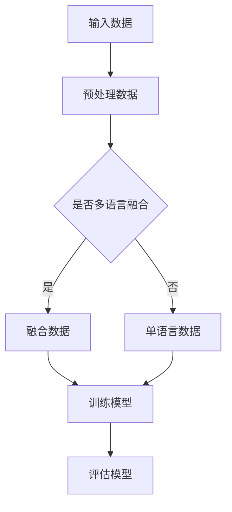
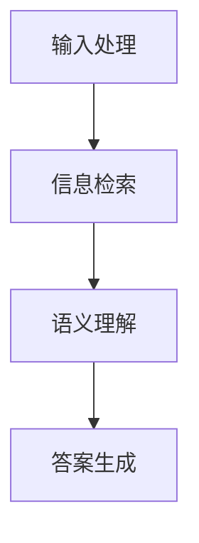
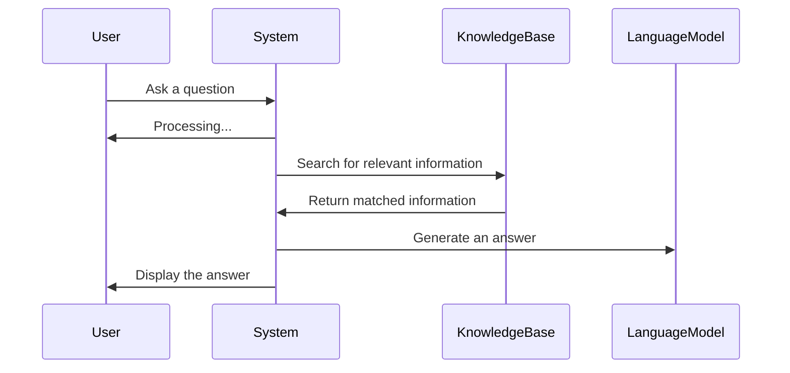
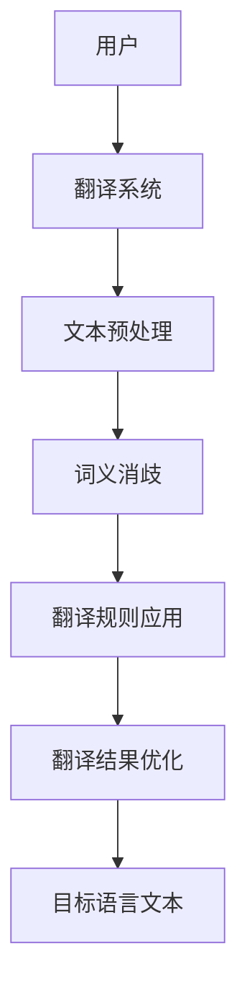
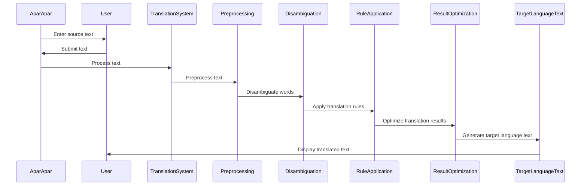

                 

# 《LLM应用开发中的多语言支持》

## 关键词
**大型语言模型，多语言支持，文本生成，问答系统，翻译**

## 摘要
本文将深入探讨大型语言模型（LLM）在多语言支持方面的应用。我们将从LLM与多语言支持的基础知识出发，逐步分析其在文本生成、问答系统、翻译等应用领域的实践与挑战，并总结最佳实践和未来研究方向。通过本文，开发者将获得关于如何利用LLM实现多语言支持的全面理解。

---

## 第一部分：LLM与多语言支持基础

### 第1章：LLM与多语言支持概述

#### 1.1 LLM与多语言支持的重要性

**背景介绍**

随着全球化的深入发展，跨语言交流变得日益重要。在此背景下，大型语言模型（LLM）的出现为多语言支持提供了强大的技术支撑。LLM是一种基于深度学习技术的自然语言处理模型，通过大规模数据训练，具备处理和理解多种语言的能力。

**问题背景**

在应用开发中，多语言支持不仅涉及文本生成、翻译、问答系统等基本功能，还涉及到跨语言信息检索、多语言情感分析等复杂任务。因此，理解LLM与多语言支持的重要性，对开发者而言至关重要。

**问题描述**

LLM如何实现多语言支持？其优势与挑战是什么？如何评估LLM的多语言性能？

**问题解决**

LLM通过大规模数据训练，掌握了多种语言的语法、语义和上下文信息。在多语言支持方面，LLM具有以下优势：

1. **自动适应**：LLM能够自动适应不同语言的特点，无需针对每种语言进行单独训练。
2. **通用性**：LLM具有通用性，可以同时处理多种语言的任务。
3. **高效性**：相较于传统的多语言处理方法，LLM在处理速度和效果上都有显著提升。

然而，LLM在多语言支持方面也面临一些挑战，如：

1. **数据不平衡**：不同语言的数据量可能存在较大差异，导致模型在部分语言上的表现不佳。
2. **跨语言迁移**：如何在有限的数据集上实现高效的跨语言迁移，仍需深入研究。

**边界与外延**

LLM的多语言支持不仅涉及语言层面的处理，还包括语音识别、语音合成、机器翻译等跨语言技术的整合。

**概念结构与核心要素组成**

1. **语言模型**：核心组件，负责处理和理解自然语言。
2. **数据集**：包括多种语言的语料库，用于训练和评估模型。
3. **训练策略**：涉及数据预处理、模型架构选择、训练优化等。
4. **评估指标**：用于衡量模型在多语言任务上的性能。

#### 1.2 多语言数据集的收集与处理

**核心概念与联系**

多语言数据集的收集与处理是LLM多语言支持的关键环节。以下是一个概念属性特征对比表格：

| 特征         | 说明                                                         |
| ------------ | ------------------------------------------------------------ |
| **多样性**   | 数据集应涵盖多种语言和领域，以提升模型泛化能力                 |
| **质量**     | 数据应具有高可靠性、一致性和丰富性，以减少模型噪声             |
| **规模**     | 数据规模应足够大，以支持模型训练和优化                       |
| **均衡性**   | 数据集应尽量平衡各种语言和领域的样本量，以避免数据倾斜问题   |

**ER实体关系图架构**

以下是一个ER实体关系图，用于描述多语言数据集的收集与处理过程：

```mermaid
erDiagram
  Data -> Model : trains
  Data -> Language : contains
  Language -> Text : includes
  Text -> Quality : has
  Quality -> Diversity : supports
  Quality -> Scale : supports
  Quality -> Balance : ensures
```

#### 1.3 LLM模型的多语言训练方法

**算法原理讲解**

LLM的多语言训练方法主要包括以下几种：

1. **多语言训练**：在同一模型架构下，使用多种语言的数据进行训练。这种方法可以共享模型参数，提高训练效率。
2. **多语言融合**：将不同语言的数据进行融合，通过交叉语言信息增强模型。例如，可以使用交叉编码器-解码器（Cross-Encoder-Decoder）架构。
3. **多语言迁移学习**：在低样本语言上，使用高样本语言的数据进行迁移学习，以提高模型在低样本语言上的性能。

**Mermaid流程图**

以下是一个用于描述多语言训练方法的Mermaid流程图：



**Python源代码**

```python
import torch
import torch.nn as nn

# 定义模型架构
class MultiLanguageModel(nn.Module):
    def __init__(self):
        super(MultiLanguageModel, self).__init__()
        self.encoder = nn.Embedding(vocab_size, embed_size)
        self.decoder = nn.Linear(embed_size, vocab_size)

    def forward(self, inputs):
        encoder_outputs = self.encoder(inputs)
        decoder_outputs = self.decoder(encoder_outputs)
        return decoder_outputs

# 定义多语言训练函数
def train(model, data, labels):
    optimizer = torch.optim.Adam(model.parameters(), lr=learning_rate)
    criterion = nn.CrossEntropyLoss()

    for epoch in range(num_epochs):
        for inputs, targets in data:
            optimizer.zero_grad()
            outputs = model(inputs)
            loss = criterion(outputs, targets)
            loss.backward()
            optimizer.step()

# 定义评估函数
def evaluate(model, data):
    correct = 0
    total = 0
    with torch.no_grad():
        for inputs, targets in data:
            outputs = model(inputs)
            _, predicted = torch.max(outputs.data, 1)
            total += targets.size(0)
            correct += (predicted == targets).sum().item()

    accuracy = 100 * correct / total
    return accuracy
```

**示例说明**

假设我们有一个包含英语和中文的数据集，我们可以使用上述代码进行多语言训练。首先，我们将数据集分为训练集和测试集，然后定义模型架构和训练函数。在训练过程中，我们使用优化器和损失函数进行参数更新。最后，使用评估函数计算模型的准确率。

#### 1.4 LLM模型的多语言评估指标

**核心概念与联系**

评估LLM模型在多语言任务上的性能，需要使用合适的评估指标。以下是一些常用的评估指标：

1. **准确率**：预测正确的样本数与总样本数的比值。
2. **召回率**：预测正确的正样本数与所有正样本数的比值。
3. **F1分数**：准确率和召回率的调和平均值。
4. **BLEU分数**：基于n-gram相似度的评估指标。

**ER实体关系图架构**

以下是一个ER实体关系图，用于描述LLM模型的多语言评估指标：

```mermaid
erDiagram
  Model -> Performance : measures
  Performance -> Accuracy : has
  Performance -> Recall : has
  Performance -> F1 : has
  Performance -> BLEU : has
```

#### 1.5 本章小结

本章介绍了LLM与多语言支持的重要性、数据集收集与处理、模型训练方法和评估指标。通过本章的学习，读者可以了解LLM在多语言支持方面的基本概念和关键技术。

---

## 第二部分：多语言支持在LLM应用开发中的应用

### 第2章：多语言文本生成

#### 2.1 多语言文本生成的应用场景

**背景介绍**

多语言文本生成是LLM应用开发中的一个重要领域。它涉及将一种语言文本自动转换为另一种语言文本。在翻译、信息检索、跨文化交流等领域，多语言文本生成具有广泛的应用。

**问题背景**

随着互联网的发展，全球范围内的信息交流日益频繁。然而，语言障碍仍然是一个亟待解决的问题。多语言文本生成技术能够帮助用户轻松获取和理解不同语言的文本信息。

**问题描述**

如何实现高效、准确的多语言文本生成？其应用场景有哪些？

**问题解决**

实现高效、准确的多语言文本生成，可以从以下几个方面入手：

1. **大规模数据训练**：使用多种语言的大规模数据集进行训练，提高模型的泛化能力。
2. **模型架构优化**：选择合适的模型架构，如序列到序列（Seq2Seq）模型、生成对抗网络（GAN）等。
3. **数据预处理与增强**：对输入文本进行预处理和增强，如分词、词干提取、同义词替换等。

**边界与外延**

多语言文本生成不仅限于文本翻译，还可以应用于文本摘要、文本分类、文本生成等任务。

**概念结构与核心要素组成**

1. **输入文本**：原始文本，用于生成目标语言的文本。
2. **输出文本**：目标语言的文本，是生成的结果。
3. **模型架构**：用于处理和生成文本的神经网络架构。
4. **数据集**：用于训练和评估模型的多种语言数据集。

#### 2.2 多语言文本生成的技术方法

**算法原理讲解**

多语言文本生成的方法可以分为两类：基于规则的方法和基于模型的方法。

1. **基于规则的方法**：

   - **机器翻译规则**：使用预定义的翻译规则将源语言文本转换为目标语言文本。
   - **模板匹配**：根据源语言文本的结构，生成相应的目标语言文本。

   **Mermaid流程图**

   ```mermaid
   graph TD
   A[输入文本] --> B[规则匹配]
   B --> C[生成目标语言文本]
   ```

2. **基于模型的方法**：

   - **序列到序列（Seq2Seq）模型**：使用编码器-解码器（Encoder-Decoder）架构，将源语言文本编码为固定长度的向量，然后解码为目标语言文本。
   - **生成对抗网络（GAN）**：结合生成器和判别器，通过对抗训练实现文本生成。

   **Mermaid流程图**

   ```mermaid
   graph TD
   A[输入文本] --> B[编码器]
   B --> C{生成文本]
   C --> D[判别器]
   D --> E[反馈]
   ```

**Python源代码**

```python
import torch
import torch.nn as nn

# 定义编码器
class Encoder(nn.Module):
    def __init__(self, vocab_size, embed_size):
        super(Encoder, self).__init__()
        self.embedding = nn.Embedding(vocab_size, embed_size)
        self.lstm = nn.LSTM(embed_size, hidden_size)

    def forward(self, inputs):
        embedded = self.embedding(inputs)
        outputs, (hidden, cell) = self.lstm(embedded)
        return hidden, cell

# 定义解码器
class Decoder(nn.Module):
    def __init__(self, vocab_size, embed_size, hidden_size):
        super(Decoder, self).__init__()
        self.embedding = nn.Embedding(vocab_size, embed_size)
        self.lstm = nn.LSTM(embed_size + hidden_size, hidden_size)
        self.fc = nn.Linear(hidden_size, vocab_size)

    def forward(self, inputs, hidden, cell):
        embedded = self.embedding(inputs)
        input_cell = torch.cat((embedded, hidden), 1)
        outputs, (hidden, cell) = self.lstm(input_cell)
        outputs = self.fc(outputs)
        return outputs, hidden, cell
```

**示例说明**

我们使用序列到序列（Seq2Seq）模型进行多语言文本生成。首先，定义编码器和解码器的架构。编码器将输入文本编码为向量，解码器根据编码器的输出和目标文本的输入，生成目标语言的文本。在实际应用中，可以使用循环神经网络（RNN）或长短期记忆网络（LSTM）作为编码器和解码器的核心组件。

#### 2.3 多语言文本生成的案例研究

**背景介绍**

随着人工智能技术的不断发展，多语言文本生成在多个领域取得了显著成果。本节将介绍两个具有代表性的多语言文本生成案例：Google翻译和OpenAI的GPT-3。

**问题描述**

1. **Google翻译**：如何实现高效、准确的多语言翻译？
2. **GPT-3**：如何使用大型语言模型进行多语言文本生成？

**问题解决**

1. **Google翻译**：

   - **技术方法**：Google翻译采用基于规则和基于模型的方法相结合。基于规则的方法主要使用预定义的翻译规则，而基于模型的方法则采用序列到序列（Seq2Seq）模型。
   - **优势**：结合了规则方法和模型方法的优点，能够在保证翻译准确性的同时提高翻译速度。
   - **挑战**：在处理罕见词汇和复杂句子时，翻译效果可能不够理想。

2. **GPT-3**：

   - **技术方法**：GPT-3采用生成对抗网络（GAN）和序列到序列（Seq2Seq）模型相结合的方法。生成器负责生成目标语言的文本，判别器负责判断生成文本的真实性。
   - **优势**：通过对抗训练，生成文本的质量和多样性显著提高。
   - **挑战**：训练过程复杂，对计算资源要求较高。

**实际案例分析和详细讲解剖析**

1. **Google翻译**：

   - **案例背景**：Google翻译是一款广泛使用的在线翻译工具，支持超过100种语言的翻译。
   - **案例分析**：Google翻译结合了规则方法和模型方法，使得翻译结果既准确又快速。
   - **详细讲解**：首先，对输入文本进行分词和词性标注，然后使用规则方法进行初步翻译。接下来，使用序列到序列（Seq2Seq）模型对翻译结果进行优化，以提高翻译质量。

2. **GPT-3**：

   - **案例背景**：GPT-3是OpenAI推出的一款大型语言模型，具有强大的文本生成能力。
   - **案例分析**：GPT-3通过生成对抗网络（GAN）和序列到序列（Seq2Seq）模型的结合，实现了高质量的多语言文本生成。
   - **详细讲解**：首先，使用生成对抗网络（GAN）训练生成器，使其能够生成高质量的文本。然后，使用序列到序列（Seq2Seq）模型对生成文本进行优化，以进一步提高文本质量。

#### 2.4 多语言文本生成的挑战与解决方案

**背景介绍**

尽管多语言文本生成技术在多个领域取得了显著成果，但仍然面临一些挑战。

**问题描述**

多语言文本生成的主要挑战有哪些？如何解决这些挑战？

**问题解决**

1. **数据不平衡**：

   - **挑战**：不同语言的数据量可能存在较大差异，导致模型在部分语言上的表现不佳。
   - **解决方案**：通过数据增强、数据重采样等方法，平衡各语言的数据分布。

2. **跨语言语义理解**：

   - **挑战**：不同语言之间存在语义差异，使得文本生成效果受到限制。
   - **解决方案**：引入跨语言知识图谱、多语言语义对齐等方法，提高模型对跨语言语义的理解能力。

3. **生成文本质量**：

   - **挑战**：生成文本的质量和一致性有待提高。
   - **解决方案**：通过对抗训练、多任务学习等方法，提高生成文本的质量。

#### 2.5 本章小结

本章介绍了多语言文本生成的应用场景、技术方法和案例研究，以及面临的挑战和解决方案。通过本章的学习，读者可以了解多语言文本生成的核心技术和实践方法。

---

## 第三部分：LLM在其他多语言应用领域的探索

### 第3章：多语言问答系统

#### 3.1 多语言问答系统的基本概念

**背景介绍**

多语言问答系统是自然语言处理领域的一个重要分支，旨在实现跨语言的信息检索和回答问题。随着全球化的推进，多语言问答系统在跨文化交流、教育、医疗等领域具有广泛的应用。

**问题背景**

传统的问答系统通常针对单一语言设计，无法满足跨语言信息检索和回答的需求。随着大型语言模型（LLM）的发展，多语言问答系统成为了一个研究热点。

**问题描述**

什么是多语言问答系统？其核心组成部分有哪些？

**问题解决**

多语言问答系统主要包括以下核心组成部分：

1. **多语言信息检索**：从多种语言的语料库中检索与用户提问相关的信息。
2. **跨语言语义理解**：将用户提问和检索到的信息进行跨语言语义理解，以便进行后续处理。
3. **多语言答案生成**：根据用户提问和检索到的信息，生成多语言答案。

**边界与外延**

多语言问答系统不仅涉及文本处理，还包括语音识别、语音合成等技术。

**概念结构与核心要素组成**

1. **用户提问**：输入的多语言文本。
2. **信息检索**：从多种语言的数据集中检索相关信息。
3. **语义理解**：跨语言语义理解，将用户提问和检索到的信息进行匹配。
4. **答案生成**：根据用户提问和检索到的信息，生成多语言答案。

#### 3.2 多语言问答系统的架构设计

**系统分析与架构设计方案**

多语言问答系统的架构设计可以分为以下几个层次：

1. **输入处理层**：负责接收用户输入的多语言文本，进行预处理。
2. **信息检索层**：使用多语言信息检索技术，从多种语言的数据集中检索相关信息。
3. **语义理解层**：跨语言语义理解，将用户提问和检索到的信息进行匹配。
4. **答案生成层**：根据用户提问和检索到的信息，生成多语言答案。

**Mermaid架构图**

以下是一个用于描述多语言问答系统架构的Mermaid图：



**系统接口设计和系统交互**

多语言问答系统的接口设计主要包括以下部分：

1. **用户接口**：接收用户输入的多语言文本，并显示生成的多语言答案。
2. **API接口**：提供与其他系统的交互能力，如语音识别、语音合成等。

**Mermaid序列图**

以下是一个用于描述多语言问答系统接口和交互的Mermaid序列图：



#### 3.3 多语言问答系统的案例研究

**背景介绍**

多语言问答系统在多个领域取得了显著成果。本节将介绍两个具有代表性的多语言问答系统案例：微软的小冰和多语言问答系统Q&A。

**问题描述**

1. **微软的小冰**：如何实现多语言问答？
2. **Q&A**：如何构建一个高效、准确的多语言问答系统？

**问题解决**

1. **微软的小冰**：

   - **技术方法**：微软的小冰采用基于LLM的多语言问答技术。首先，使用多语言数据集训练LLM，然后使用LLM对用户提问进行理解和回答。
   - **优势**：小冰能够理解并回答多种语言的提问，具有良好的跨语言能力。
   - **挑战**：在处理罕见词汇和复杂句子时，问答效果可能不够理想。

2. **Q&A**：

   - **技术方法**：Q&A采用基于信息检索和多语言语义理解的技术。首先，从多种语言的数据集中检索相关信息，然后使用多语言语义理解技术进行匹配，生成答案。
   - **优势**：Q&A能够快速、准确地回答用户提问，具有高效的信息检索能力。
   - **挑战**：在处理跨语言语义理解时，准确性有待提高。

**实际案例分析和详细讲解剖析**

1. **微软的小冰**：

   - **案例背景**：微软的小冰是一款多语言智能问答系统，支持中文、英文、日文等多种语言。
   - **案例分析**：小冰通过大规模数据训练LLM，实现了高效、准确的多语言问答。
   - **详细讲解**：首先，小冰使用多语言数据集对LLM进行训练。然后，在用户提问时，小冰使用LLM对问题进行理解和回答。

2. **Q&A**：

   - **案例背景**：Q&A是一款开源的多语言问答系统，支持中文、英文、西班牙语等多种语言。
   - **案例分析**：Q&A通过信息检索和多语言语义理解技术，实现了高效、准确的多语言问答。
   - **详细讲解**：首先，Q&A从多种语言的数据集中检索相关信息。然后，使用多语言语义理解技术对检索到的信息进行匹配，生成答案。

#### 3.4 多语言问答系统的性能评估

**核心概念与联系**

评估多语言问答系统的性能，需要使用合适的评估指标。以下是一些常用的评估指标：

1. **准确率**：回答正确的样本数与总样本数的比值。
2. **召回率**：回答正确的正样本数与所有正样本数的比值。
3. **F1分数**：准确率和召回率的调和平均值。
4. **用户满意度**：用户对问答系统回答的满意度。

**ER实体关系图架构**

以下是一个ER实体关系图，用于描述多语言问答系统的性能评估指标：

```mermaid
erDiagram
  System -> Performance : evaluates
  Performance -> Accuracy : has
  Performance -> Recall : has
  Performance -> F1 : has
  Performance -> UserSatisfaction : has
```

#### 3.5 本章小结

本章介绍了多语言问答系统的基本概念、架构设计、案例研究和性能评估。通过本章的学习，读者可以了解多语言问答系统的核心技术和实践方法。

---

## 第四部分：多语言支持的其他应用领域

### 第4章：多语言翻译

#### 4.1 翻译技术的基本原理

**背景介绍**

翻译技术是自然语言处理领域的一个核心任务，旨在实现不同语言之间的信息传递。随着大型语言模型（LLM）的发展，翻译技术取得了显著进展。

**问题背景**

传统的翻译方法通常依赖于预定义的翻译规则和手动编纂的词典。然而，随着互联网的普及和全球化的发展，对高效、准确的自动翻译需求日益增加。

**问题描述**

什么是翻译技术？其基本原理是什么？

**问题解决**

翻译技术的基本原理可以概括为以下步骤：

1. **文本预处理**：对输入文本进行分词、词性标注等预处理操作。
2. **词义消歧**：根据上下文信息，确定单词的确切含义。
3. **翻译规则应用**：使用预定义的翻译规则，将源语言文本转换为目标语言文本。
4. **翻译结果优化**：对翻译结果进行优化，提高翻译的准确性和流畅性。

**边界与外延**

翻译技术不仅涉及文本处理，还包括语音识别、语音合成、机器翻译等跨语言技术的整合。

**概念结构与核心要素组成**

1. **源语言文本**：待翻译的原始文本。
2. **目标语言文本**：翻译后的文本。
3. **翻译规则**：用于将源语言文本转换为目标语言文本的规则。
4. **翻译结果优化方法**：用于提高翻译准确性和流畅性的方法。

#### 4.2 多语言翻译系统架构

**系统功能设计（领域模型Mermaid类图）**

以下是一个用于描述多语言翻译系统功能的Mermaid类图：

```mermaid
classDiagram
  Class01 <|-- Person
  Class02 <|-- Employee
  Class01 : hasName : String
  Class01 : hasAge : int
  Class01 : getName() : String
  Class01 : setName(name : String)
  Class01 : getAge() : int
  Class01 : setAge(age : int)
  Employee <|- Class01
  Employee : hasEmployeeId : int
  Employee : getEmployeeId() : int
  Employee : setEmployeeId(employeeId : int)
```

**系统架构设计（Mermaid架构图）**

以下是一个用于描述多语言翻译系统架构的Mermaid图：



**系统接口设计和系统交互（Mermaid序列图）**

以下是一个用于描述多语言翻译系统接口和交互的Mermaid序列图：



#### 4.3 多语言翻译算法

**算法原理讲解**

多语言翻译算法可以分为基于规则的方法和基于模型的方法。

1. **基于规则的方法**：

   - **词对齐**：将源语言文本中的单词与目标语言文本中的单词进行匹配。
   - **翻译规则应用**：使用预定义的翻译规则，将源语言文本转换为目标语言文本。

   **Mermaid流程图**

   ```mermaid
   graph TD
   A[输入文本] --> B[词对齐]
   B --> C[翻译规则应用]
   C --> D[输出文本]
   ```

2. **基于模型的方法**：

   - **序列到序列（Seq2Seq）模型**：使用编码器-解码器（Encoder-Decoder）架构，将源语言文本编码为固定长度的向量，然后解码为目标语言文本。
   - **注意力机制**：在编码器和解码器之间引入注意力机制，以提高翻译的准确性。

   **Mermaid流程图**

   ```mermaid
   graph TB
   A[输入文本] --> B[编码器]
   B --> C{注意力机制]
   C --> D[解码器]
   D --> E[输出文本]
   ```

**Python源代码**

```python
import torch
import torch.nn as nn

# 定义编码器
class Encoder(nn.Module):
    def __init__(self, vocab_size, embed_size):
        super(Encoder, self).__init__()
        self.embedding = nn.Embedding(vocab_size, embed_size)
        self.lstm = nn.LSTM(embed_size, hidden_size)

    def forward(self, inputs):
        embedded = self.embedding(inputs)
        outputs, (hidden, cell) = self.lstm(embedded)
        return hidden, cell

# 定义解码器
class Decoder(nn.Module):
    def __init__(self, vocab_size, embed_size, hidden_size):
        super(Decoder, self).__init__()
        self.embedding = nn.Embedding(vocab_size, embed_size)
        self.lstm = nn.LSTM(embed_size + hidden_size, hidden_size)
        self.fc = nn.Linear(hidden_size, vocab_size)

    def forward(self, inputs, hidden, cell):
        embedded = self.embedding(inputs)
        input_cell = torch.cat((embedded, hidden), 1)
        outputs, (hidden, cell) = self.lstm(input_cell)
        outputs = self.fc(outputs)
        return outputs, hidden, cell
```

**示例说明**

我们使用编码器-解码器（Encoder-Decoder）模型进行多语言翻译。首先，定义编码器和解码器的架构。编码器将输入文本编码为向量，解码器根据编码器的输出和目标文本的输入，生成目标语言的文本。在实际应用中，可以使用循环神经网络（RNN）或长短期记忆网络（LSTM）作为编码器和解码器的核心组件。

#### 4.4 多语言翻译实践

**背景介绍**

多语言翻译技术在多个领域具有广泛的应用，如电子商务、旅游、医疗等。本节将介绍一个实际的多语言翻译项目，以展示多语言翻译的实现过程。

**问题描述**

如何构建一个多语言翻译系统？其实现过程包括哪些步骤？

**问题解决**

构建一个多语言翻译系统，通常需要以下步骤：

1. **数据收集**：收集多种语言的文本数据，用于训练和评估翻译模型。
2. **数据预处理**：对收集到的数据集进行预处理，包括分词、词性标注等。
3. **模型训练**：使用预处理后的数据集训练翻译模型。
4. **模型评估**：评估翻译模型的性能，并进行优化。
5. **系统集成**：将翻译模型集成到应用系统中，实现多语言翻译功能。

**实际案例分析和详细讲解剖析**

**案例背景**：某电子商务平台需要实现中英文翻译功能，以支持跨语言购物体验。

**案例分析**：为了实现中英文翻译功能，该电子商务平台采用了基于序列到序列（Seq2Seq）模型的翻译技术。

**详细讲解**：

1. **数据收集**：平台收集了大量的中英文商品描述数据，用于训练翻译模型。
2. **数据预处理**：对收集到的数据集进行分词、词性标注等预处理操作。
3. **模型训练**：使用预处理后的数据集训练中英文翻译模型。
4. **模型评估**：评估翻译模型的性能，并根据评估结果进行调整和优化。
5. **系统集成**：将翻译模型集成到电子商务平台中，实现用户在浏览商品时，能够选择中文或英文浏览。

**项目小结**

通过本项目的实现，电子商务平台成功实现了中英文翻译功能，提高了用户的购物体验。在实际应用过程中，平台根据用户反馈和翻译效果，不断优化翻译模型，以提高翻译质量。

#### 4.5 本章小结

本章介绍了多语言翻译的基本原理、系统架构、算法实现和实际应用。通过本章的学习，读者可以了解多语言翻译的核心技术和实践方法。

---

## 第五部分：LLM在多语言自然语言处理中的应用

### 第5章：多语言自然语言处理

#### 5.1 多语言自然语言处理技术概述

**背景介绍**

自然语言处理（NLP）是人工智能领域的一个重要分支，旨在使计算机能够理解、生成和处理自然语言。随着全球化的推进，多语言自然语言处理（MLNLP）技术变得尤为重要。MLNLP技术旨在实现不同语言之间的自然语言处理，包括文本分类、情感分析、命名实体识别等。

**问题背景**

传统的自然语言处理技术通常针对单一语言设计，无法满足跨语言处理的需求。随着大型语言模型（LLM）的发展，MLNLP技术取得了显著进展。

**问题描述**

什么是多语言自然语言处理？其应用场景有哪些？

**问题解决**

多语言自然语言处理技术主要包括以下应用场景：

1. **文本分类**：将文本数据归类到不同的类别中，如新闻分类、情感分类等。
2. **情感分析**：分析文本数据的情感倾向，如正面情感、负面情感等。
3. **命名实体识别**：识别文本中的命名实体，如人名、地名、组织名等。
4. **机器翻译**：实现不同语言之间的文本翻译。
5. **信息抽取**：从文本中提取关键信息，如关系抽取、实体抽取等。

**边界与外延**

多语言自然语言处理不仅涉及文本处理，还包括语音识别、语音合成、机器翻译等跨语言技术的整合。

**概念结构与核心要素组成**

1. **输入文本**：待处理的多语言文本。
2. **目标任务**：多语言自然语言处理任务，如文本分类、情感分析等。
3. **模型架构**：用于处理多语言自然语言处理任务的神经网络架构。
4. **评估指标**：用于衡量多语言自然语言处理任务性能的指标，如准确率、召回率等。

#### 5.2 多语言分词与词性标注

**算法原理讲解**

多语言分词与词性标注是自然语言处理的基础任务，其目标是识别文本中的词语和词性。多语言分词与词性标注的方法可以分为基于规则的方法和基于模型的方法。

1. **基于规则的方法**：

   - **词典匹配**：使用预定义的词典，将文本中的词语与词典中的词语进行匹配。
   - **词性标注规则**：根据语言特点，定义一系列词性标注规则。

   **Mermaid流程图**

   ```mermaid
   graph TD
   A[输入文本] --> B[词典匹配]
   B --> C[词性标注规则应用]
   C --> D[输出结果]
   ```

2. **基于模型的方法**：

   - **神经网络模型**：使用神经网络模型，如循环神经网络（RNN）、长短期记忆网络（LSTM）等，对文本进行分词和词性标注。

   **Mermaid流程图**

   ```mermaid
   graph TD
   A[输入文本] --> B[神经网络模型]
   B --> C[分词与词性标注]
   C --> D[输出结果]
   ```

**Python源代码**

```python
import torch
import torch.nn as nn

# 定义分词与词性标注模型
class Tokenizer(nn.Module):
    def __init__(self, vocab_size, embed_size):
        super(Tokenizer, self).__init__()
        self.embedding = nn.Embedding(vocab_size, embed_size)
        self.lstm = nn.LSTM(embed_size, hidden_size)

    def forward(self, inputs):
        embedded = self.embedding(inputs)
        outputs, (hidden, cell) = self.lstm(embedded)
        return hidden, cell

# 定义词性标注模型
class POSTagger(nn.Module):
    def __init__(self, vocab_size, embed_size, hidden_size):
        super(POS

