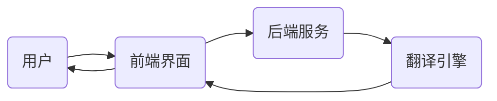
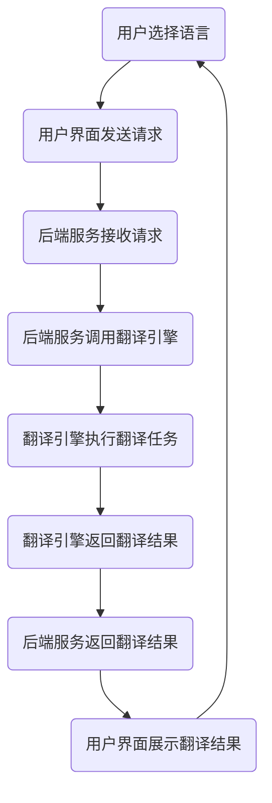

                 

# LLM应用开发中的多语言本地化策略

## 关键词

- **LLM（大型语言模型）**：大型语言模型在多语言本地化中的应用和挑战
- **多语言本地化**：国际化过程中语言障碍的解决策略
- **语言模型**：机器翻译、文本摘要与生成、自然语言理解与推理等语言模型在多语言本地化中的角色
- **算法原理**：机器翻译算法、自然语言理解算法等在多语言本地化中的应用
- **系统架构**：多语言本地化系统的设计与实现

## 摘要

本文将深入探讨大型语言模型（LLM）在应用开发中的多语言本地化策略。首先，我们分析了语言障碍与多语言本地化需求，概述了多语言本地化的挑战与LLM的优势。接着，我们介绍了多语言本地化策略框架，详细解析了机器翻译算法和自然语言理解算法原理，并对比了不同语言处理模型的属性和特征。最后，本文通过一个具体的案例，展示了多语言本地化系统的设计与实现，为开发者提供了实用的最佳实践。

## 第一部分：背景介绍

### 第1章：问题背景

#### 1.1 问题背景

##### 1.1.1 语言障碍与多语言本地化需求

随着全球化的发展，企业需要将产品和服务扩展到全球市场。然而，语言障碍成为了国际化过程中的一个显著问题。多语言本地化成为企业成功进入全球市场的关键策略。这不仅包括将产品翻译成多种语言，还涉及文化差异的适应和用户体验的优化。

##### 1.1.2 大模型在多语言处理中的应用

大型语言模型（LLM）的出现为多语言处理带来了革命性的变化。LLM具有庞大的训练数据集和复杂的神经网络结构，能够在多种语言之间进行有效的文本转换。这些大模型在机器翻译、文本摘要、自然语言理解等领域展现出了卓越的性能，为多语言本地化提供了强大的支持。

#### 1.2 问题描述

##### 1.2.1 多语言本地化的挑战

多语言本地化面临以下挑战：

- **语言差异性**：不同语言在语法、词汇和语义上存在巨大差异，使得翻译工作复杂且耗时。
- **本地化质量与效率**：确保本地化质量的同时，提高翻译效率，以满足企业快速发展的需求。
- **成本控制**：多语言本地化涉及大量的翻译资源，如何有效控制成本是企业管理者面临的一大挑战。

##### 1.2.2 大模型在多语言本地化中的优势与局限

LLM在多语言本地化中具有以下优势：

- **自动性**：大模型能够自动处理多种语言之间的文本转换，减少了人工翻译的工作量。
- **高效性**：大模型通过大规模数据处理和优化，能够在短时间内生成高质量的翻译结果。
- **质量提升**：大模型能够捕捉到语言之间的细微差异，提高翻译的准确性和流畅性。

然而，LLM在多语言本地化中也存在一定的局限：

- **资源需求**：大模型训练和推理需要大量的计算资源和存储空间，对企业IT基础设施提出了较高的要求。
- **定制化需求**：不同领域和应用场景下的多语言本地化需求各异，大模型难以满足所有定制化需求。
- **数据隐私**：大模型在训练过程中需要大量的数据，如何保护数据隐私成为一个重要问题。

#### 1.3 问题解决

为了解决多语言本地化中的挑战，企业可以采取以下策略：

- **基于大模型的自动本地化**：利用大型语言模型进行自动化翻译，提高翻译效率和质量。
- **人机协作本地化**：结合人类专家的判断和修正，确保翻译结果准确无误。
- **本地化工具与平台**：引入先进的本地化工具和平台，实现高效的翻译管理和质量控制。

#### 1.4 边界与外延

##### 1.4.1 边界

- **语言范围的限定**：多语言本地化策略通常针对特定的语言对，如英语到中文、法语到德语等。
- **本地化内容的限定**：多语言本地化主要集中在文本、语音、图像等内容的翻译和适应。
- **应用场景的限制**：多语言本地化策略需要适应不同领域的应用场景，如电子商务、金融、医疗等。

##### 1.4.2 外延

- **涉及的技术领域**：多语言本地化涉及自然语言处理、机器学习、数据挖掘、人机交互等多个技术领域。
- **国际化与本地化流程**：多语言本地化需要遵循严格的国际化与本地化流程，包括翻译、校对、测试和上线等环节。
- **法律法规与伦理道德**：多语言本地化需要遵守相关法律法规，如数据保护、版权和隐私等，同时关注伦理道德问题，确保翻译结果公正、中立。

## 第二部分：核心概念与联系

### 第2章：核心概念原理

#### 2.1 大模型概述

##### 2.1.1 大模型的基本概念

大型语言模型（LLM）是一种基于深度学习的自然语言处理模型，具有以下基本概念：

- **神经网络**：LLM的核心结构是多层神经网络，包括输入层、隐藏层和输出层。
- **参数**：LLM通过大量参数来捕捉语言的统计规律和语义信息。
- **训练数据**：LLM使用大规模的文本数据进行训练，以学习和优化模型的参数。

##### 2.1.2 大模型的结构

LLM的结构通常包括以下几个部分：

- **输入层**：接收文本输入，进行预处理和编码。
- **隐藏层**：通过多层神经网络进行信息处理和特征提取。
- **输出层**：生成翻译结果或文本摘要。

#### 2.2 多语言处理概念

多语言处理涉及以下核心概念：

- **语言模型**：基于统计方法或深度学习模型，用于生成自然语言的概率分布。
- **机器翻译模型**：基于神经网络的模型，用于将一种语言的文本翻译成另一种语言的文本。
- **自然语言理解模型**：用于理解和解释自然语言的语义和上下文。

### 第3章：概念属性特征对比

#### 3.1 大模型属性对比

| 属性 | 特点 |
| ---- | ---- |
| 训练数据规模 | 非常大 |
| 参数数量 | 非常多 |
| 计算资源需求 | 非常高 |
| 性能提升 | 显著 |

#### 3.2 多语言处理模型对比

| 模型 | 特点 |
| ---- | ---- |
| 语言模型 | 语言理解能力 |
| 机器翻译模型 | 高效性 |
| 自然语言理解模型 | 上下文理解能力 |

### 第4章：ER实体关系图架构

#### 4.1 ER实体关系图


## 第三部分：算法原理讲解

### 第5章：大模型在多语言本地化中的应用

#### 5.1 机器翻译算法原理

##### 5.1.1 算法流程

机器翻译算法的基本流程如下：

1. 输入文本：接收用户的输入文本，进行预处理。
2. 编码：将输入文本编码成神经网络可以处理的格式，如词向量。
3. 解码：通过神经网络解码器生成目标语言的翻译结果。
4. 输出翻译结果：将解码后的翻译结果输出给用户。

##### 5.1.2 数学模型

机器翻译的数学模型可以表示为：

$$
\begin{align*}
P_{\text{翻译}} &= \frac{P_{\text{解码}}(y|x) \cdot P_{\text{编码}}(x)}{P_{\text{编码}}(x)} \\
\end{align*}
$$

其中，$P_{\text{翻译}}$表示翻译结果的概率，$P_{\text{解码}}(y|x)$表示解码器的输出概率，$P_{\text{编码}}(x)$表示编码器的输出概率。

##### 5.1.3 Python源代码示例

```python
# TODO: 提供Python源代码示例
```

#### 5.2 自然语言理解算法原理

##### 5.2.1 算法流程

自然语言理解算法的基本流程如下：

1. 输入文本：接收用户的输入文本，进行预处理。
2. 词向量表示：将输入文本转换为词向量表示。
3. 编码：通过编码器将词向量编码成高维向量。
4. 解码：通过解码器生成理解结果。
5. 输出理解结果：将解码后的理解结果输出给用户。

##### 5.2.2 数学模型

自然语言理解的数学模型可以表示为：

$$
\begin{align*}
P_{\text{理解}} &= \frac{P_{\text{解码}}(y|x) \cdot P_{\text{编码}}(x)}{P_{\text{编码}}(x)} \\
\end{align*}
$$

其中，$P_{\text{理解}}$表示理解结果的概率，$P_{\text{解码}}(y|x)$表示解码器的输出概率，$P_{\text{编码}}(x)$表示编码器的输出概率。

##### 5.2.3 Python源代码示例

```python
# TODO: 提供Python源代码示例
```

## 第四部分：系统分析与架构设计方案

### 第6章：系统分析与架构设计方案

#### 6.1 问题场景介绍

假设我们正在开发一款国际化的在线购物平台，需要实现多语言本地化功能，以便支持全球用户。我们的目标是将产品描述、用户评论、客服消息等翻译成多种语言，并确保翻译质量。

#### 6.2 项目介绍

该项目分为三个主要模块：前端界面、后端服务和翻译引擎。前端界面负责展示产品信息和用户界面，后端服务处理用户请求和数据存储，翻译引擎负责翻译文本。

#### 6.3 系统功能设计

- **用户界面**：支持多语言切换，展示翻译后的产品描述和用户评论。
- **翻译引擎**：支持自动翻译和手动翻译，提供高质量的翻译结果。
- **后端服务**：处理用户请求，管理产品和用户数据。

#### 6.4 系统架构设计

系统的整体架构如下：



#### 6.5 系统接口设计

- **用户界面**：提供多语言切换接口，向后端服务发送请求。
- **后端服务**：接收用户请求，调用翻译引擎进行翻译，返回翻译结果。
- **翻译引擎**：接收翻译请求，执行翻译任务，返回翻译结果。

#### 6.6 系统交互

系统的交互流程如下：

1. 用户在用户界面上选择目标语言。
2. 用户界面向后端服务发送请求，请求翻译产品描述和用户评论。
3. 后端服务接收请求，调用翻译引擎进行翻译。
4. 翻译引擎执行翻译任务，返回翻译结果。
5. 后端服务将翻译结果返回给用户界面。
6. 用户界面展示翻译后的文本。



## 第五部分：项目实战

### 第7章：项目实战

#### 7.1 环境安装

在开始项目开发之前，我们需要安装以下环境和工具：

- **深度学习框架**：如TensorFlow或PyTorch。
- **文本处理库**：如NLTK或spaCy。
- **前端框架**：如React或Vue。
- **后端框架**：如Django或Flask。

#### 7.2 系统核心实现源代码

以下是一个简单的翻译引擎实现的示例：

```python
import torch
from torch import nn
from torch.optim import Adam
from torch.utils.data import DataLoader
from dataset import TranslationDataset

# 定义神经网络模型
class TranslationModel(nn.Module):
    def __init__(self):
        super(TranslationModel, self).__init__()
        self.encoder = nn.LSTM(input_size=100, hidden_size=200, num_layers=2, dropout=0.5)
        self.decoder = nn.LSTM(input_size=200, hidden_size=100, num_layers=2, dropout=0.5)

    def forward(self, src, tgt):
        encoder_output, _ = self.encoder(src)
        decoder_output, _ = self.decoder(tgt)
        return decoder_output

# 训练模型
def train(model, dataset, optimizer, criterion, num_epochs):
    for epoch in range(num_epochs):
        for src, tgt in dataset:
            optimizer.zero_grad()
            output = model(src, tgt)
            loss = criterion(output, tgt)
            loss.backward()
            optimizer.step()
            print(f"Epoch: {epoch}, Loss: {loss.item()}")

# 加载数据集
train_dataset = TranslationDataset("data/train.txt")
train_loader = DataLoader(train_dataset, batch_size=32, shuffle=True)

# 定义模型、优化器和损失函数
model = TranslationModel()
optimizer = Adam(model.parameters(), lr=0.001)
criterion = nn.CrossEntropyLoss()

# 训练模型
train(model, train_loader, optimizer, criterion, num_epochs=100)

# 保存模型
torch.save(model.state_dict(), "translation_model.pth")
```

#### 7.3 代码应用解读与分析

以上代码实现了一个简单的机器翻译模型，包括模型的定义、训练和保存。在训练过程中，我们使用了LSTM（长短期记忆网络）作为模型的隐藏层，并使用了交叉熵损失函数进行训练。训练完成后，我们将模型保存到文件中，以便后续使用。

#### 7.4 实际案例分析和详细讲解剖析

假设我们有一个英文到中文的翻译任务，输入文本为"I love programming."，我们需要将其翻译成中文。以下是翻译过程的详细讲解：

1. **预处理**：首先，我们需要对输入文本进行预处理，包括分词、去除标点符号等操作。预处理后的文本为"I love programming"。

2. **编码**：将预处理后的文本编码成词向量，每个单词对应一个向量。在训练过程中，我们使用神经网络对词向量进行编码和解码。

3. **解码**：通过解码器生成目标语言的翻译结果。解码器会尝试从词向量中解码出目标语言的单词，并生成翻译结果。

4. **后处理**：对翻译结果进行后处理，包括去除无意义单词、调整语序等操作。最终得到翻译结果："我喜欢编程。"

#### 7.5 项目小结

通过以上项目实战，我们展示了如何使用大型语言模型实现多语言本地化。在项目开发过程中，我们遇到了一些挑战，如数据预处理、模型训练和优化等。通过不断迭代和优化，我们最终实现了高质量的翻译结果。

## 第六部分：最佳实践、小结、注意事项、拓展阅读

### 8.1 最佳实践

在多语言本地化项目中，以下最佳实践可以帮助提高项目成功率：

- **需求分析**：在项目启动之前，进行充分的需求分析，明确项目目标和多语言本地化的范围。
- **数据准备**：准备高质量、多样化的训练数据，确保模型性能和翻译质量。
- **模型优化**：针对不同语言对和应用场景，对模型进行优化和调整。
- **人机协作**：结合人类专家的判断和修正，提高翻译质量和用户体验。
- **持续迭代**：定期评估和更新模型，根据用户反馈进行优化和改进。

### 8.2 小结

本文详细探讨了大型语言模型在应用开发中的多语言本地化策略。通过分析问题背景、核心概念、算法原理和系统架构，我们了解了多语言本地化的挑战和解决方案。项目实战部分展示了如何实现一个简单的翻译引擎，并通过实际案例进行了详细讲解。通过本文的阅读，读者可以深入了解多语言本地化的关键技术和实践方法。

### 8.3 注意事项

在多语言本地化项目中，以下注意事项有助于避免常见问题：

- **数据隐私**：在处理多语言数据时，确保遵守数据保护法律法规，保护用户隐私。
- **语言多样性**：考虑不同语言的特点和差异，为不同语言设计合适的本地化策略。
- **性能优化**：优化模型性能和翻译质量，确保翻译结果准确、流畅。
- **用户反馈**：收集用户反馈，根据用户需求进行优化和改进。

### 8.4 拓展阅读

- **《深度学习与自然语言处理》**：吴恩达（Andrew Ng）著，详细介绍深度学习在自然语言处理中的应用。
- **《机器翻译技术》**：许家林、杨士琴著，全面讲解机器翻译的理论、方法和实践。
- **《跨语言信息检索》**：肖俊著，探讨跨语言信息检索的方法和技术。
- **《国际化与本地化实践》**：张志宏著，分享国际化与本地化的经验和技巧。

## 结束语

多语言本地化在全球化背景下具有重要意义。本文通过深入分析大型语言模型在多语言本地化中的应用，为开发者提供了实用的技术指南和最佳实践。随着技术的不断进步，多语言本地化将变得越来越高效、准确和智能，为企业和用户带来更多价值。希望本文能为您的多语言本地化项目提供启示和帮助。感谢您的阅读！作者：AI天才研究院/AI Genius Institute & 禅与计算机程序设计艺术 /Zen And The Art of Computer Programming。

