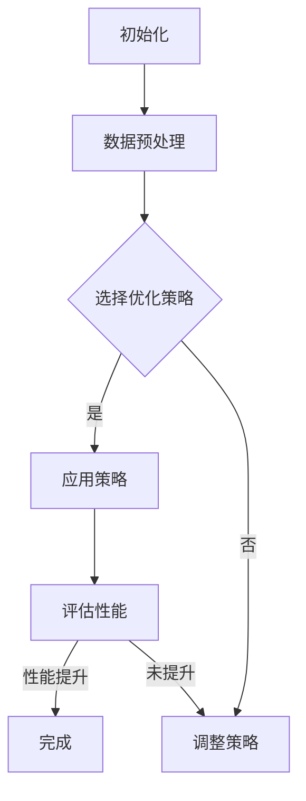
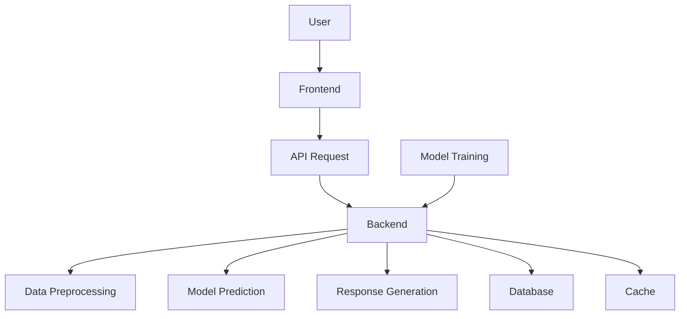
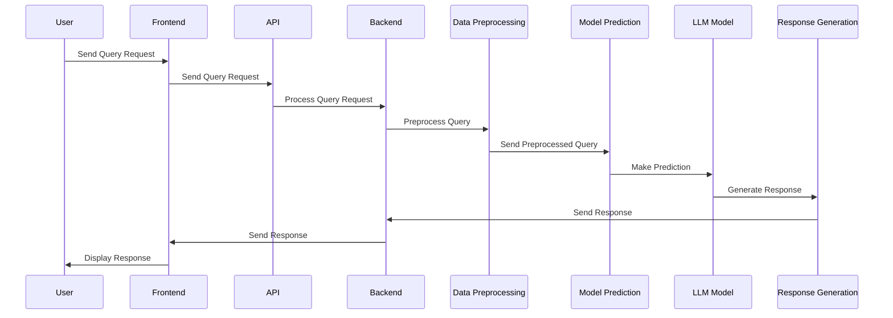

                 

# LLM应用开发中的性能优化策略

## 关键词
- 大型语言模型（LLM）
- 性能优化策略
- 应用开发
- 系统架构设计
- 数学模型
- 算法流程

## 摘要
随着人工智能技术的迅猛发展，大型语言模型（LLM）在自然语言处理领域取得了显著的成果。然而，LLM的应用开发过程中，性能优化成为制约其广泛应用的关键因素。本文将深入探讨LLM应用开发中的性能优化策略，从核心概念、算法原理、系统设计与实现等多个方面进行详细解析，为开发者提供实用的指导和建议。

## 目录大纲设计思路

### 核心主题定义
本文的核心主题是探讨LLM应用开发中的性能优化策略。这包括对LLM性能优化策略的概述、核心概念、算法原理、系统设计与实现等方面的深入探讨。

### 结构化大纲
1. 背景介绍
2. 核心概念与联系
3. 算法原理讲解
4. 系统分析与架构设计方案
5. 项目实战
6. 最佳实践 tips
7. 小结与拓展阅读

### 概念结构
本文涉及的核心概念包括：
- 性能优化策略：提高LLM应用的效率和响应速度的策略。
- LLM：大型语言模型，如GPT系列、BERT等。
- 应用开发：开发基于LLM的应用程序。
- 系统架构设计：设计支持性能优化的LLM应用系统架构。
- 数学模型：描述LLM性能优化算法的理论基础。
- 算法流程：LLM性能优化算法的实现过程。

### 算法原理讲解
本文将通过Mermaid流程图和Python源代码示例，详细阐述LLM性能优化算法的原理。具体内容包括：
1. Mermaid流程图：初始化、数据预处理、选择优化策略、应用策略、评估性能等步骤。
2. Python源代码示例：代码实现上述流程的具体步骤。

## 背景介绍

### 核心概念术语说明
在探讨LLM应用开发中的性能优化策略之前，首先需要明确一些核心概念和术语。

- **大型语言模型（LLM）**：LLM是一种基于深度学习的技术，能够处理大规模文本数据，进行自然语言理解和生成。常见的LLM包括GPT系列、BERT、T5等。
- **性能优化策略**：性能优化策略是指为了提高LLM应用的效率和响应速度，采取的一系列技术手段和方法。
- **应用开发**：应用开发是指基于LLM技术，开发实际应用的过程。这包括数据预处理、模型训练、模型部署等步骤。
- **系统架构设计**：系统架构设计是指设计一个支持性能优化的LLM应用系统，包括硬件选择、软件框架、数据流设计等方面。

### 问题背景
随着人工智能技术的不断发展，LLM在自然语言处理领域的应用越来越广泛。然而，在实际应用过程中，性能优化成为制约其广泛应用的关键因素。具体来说，LLM应用开发中的性能优化主要面临以下几个问题：

1. **计算资源消耗**：LLM模型通常需要大量的计算资源，包括CPU、GPU等。如何高效地利用计算资源，降低计算成本，成为性能优化的重要课题。
2. **响应速度**：在实际应用中，用户对LLM应用的响应速度有较高要求。如何提高LLM应用的响应速度，满足用户需求，是性能优化的核心目标。
3. **模型精度**：在性能优化的过程中，需要平衡模型精度和计算资源消耗。如何在不降低模型精度的前提下，提高计算效率，是性能优化的关键挑战。

### 问题解决
为了解决上述问题，研究者们提出了多种性能优化策略。以下是一些常见的性能优化方法：

1. **模型压缩**：通过模型压缩技术，降低LLM模型的参数规模，减少计算量。常见的模型压缩技术包括剪枝、量化、蒸馏等。
2. **分布式训练**：通过分布式训练技术，将LLM模型训练任务分布在多个计算节点上，提高训练速度。常见的分布式训练框架包括TensorFlow、PyTorch等。
3. **模型加速**：通过模型加速技术，提高LLM模型在硬件设备上的运行速度。常见的模型加速技术包括GPU加速、FPGA加速等。
4. **数据预处理**：通过优化数据预处理过程，提高LLM模型对数据的处理效率。常见的数据预处理方法包括数据清洗、数据归一化、数据增强等。

### 边界与外延
在探讨LLM应用开发中的性能优化策略时，需要关注以下几个边界与外延：

1. **性能优化范围**：性能优化不仅涉及模型本身，还包括硬件设备、软件框架等方面。需要综合考虑各个因素，进行系统优化。
2. **应用场景**：不同的应用场景对性能优化策略有不同的要求。需要根据具体应用场景，选择合适的优化方法。
3. **模型版本迭代**：随着技术的不断发展，LLM模型的版本会不断更新。需要关注模型版本迭代对性能优化的影响，及时调整优化策略。

### 概念结构与核心要素组成
LLM应用开发中的性能优化策略可以从以下几个方面进行结构化：

1. **性能优化目标**：明确性能优化的核心目标，如提高响应速度、降低计算成本等。
2. **性能优化方法**：选择合适的性能优化方法，如模型压缩、分布式训练、模型加速等。
3. **系统架构设计**：设计支持性能优化的系统架构，包括硬件设备、软件框架、数据流设计等方面。
4. **算法流程**：优化算法流程，提高模型训练和预测的效率。

## 核心概念与联系

### 核心概念原理

在LLM应用开发中，性能优化策略的核心概念包括：

1. **模型压缩**：通过减少模型参数规模，降低计算量和存储需求。常见的模型压缩技术有剪枝、量化、蒸馏等。
2. **分布式训练**：将模型训练任务分布在多个计算节点上，提高训练速度和效率。分布式训练需要解决数据同步、参数更新等问题。
3. **模型加速**：通过优化模型在硬件设备上的运行速度，提高计算效率。常见的模型加速技术有GPU加速、FPGA加速等。
4. **数据预处理**：优化数据预处理过程，提高模型对数据的处理效率。常见的数据预处理方法有数据清洗、数据归一化、数据增强等。

### 概念属性特征对比表格

| 概念         | 描述                                                         | 相关性 |
|--------------|--------------------------------------------------------------|--------|
| 模型压缩     | 通过减少模型参数规模，降低计算量和存储需求。                   | 高     |
| 分布式训练   | 将模型训练任务分布在多个计算节点上，提高训练速度和效率。       | 高     |
| 模型加速     | 通过优化模型在硬件设备上的运行速度，提高计算效率。             | 中     |
| 数据预处理   | 优化数据预处理过程，提高模型对数据的处理效率。                 | 中     |

### ER实体关系图架构

```mermaid
erDiagram
    ModelCompression ||--|{ DistributedTraining }|| Application
    ModelAcceleration ||--|{ HardwareOptimization }|| Application
    DataPreprocessing ||--|{ ModelPerformance }|| Application
```

## 算法原理讲解

### 算法流程Mermaid流程图



### Python源代码示例

```python
import tensorflow as tf
from sklearn.model_selection import train_test_split
import numpy as np

# 初始化
def initialize():
    # 初始化模型参数
    pass

# 数据预处理
def preprocess_data(data):
    # 数据清洗、归一化、增强等预处理操作
    pass

# 选择优化策略
def select_optimization_strategy():
    # 根据数据集和模型类型，选择合适的优化策略
    pass

# 应用优化策略
def apply_strategy(strategy, model):
    # 根据优化策略，对模型进行优化
    pass

# 评估性能
def evaluate_performance(model, data):
    # 评估模型性能
    pass

# 主函数
def main():
    initialize()
    data = load_data()
    data = preprocess_data(data)
    strategy = select_optimization_strategy()
    model = apply_strategy(strategy, data)
    performance = evaluate_performance(model, data)
    if performance > threshold:
        print("Performance improved.")
    else:
        print("Performance not improved.")

if __name__ == "__main__":
    main()
```

### 算法原理详细讲解

#### 数学模型与公式

在LLM应用开发中的性能优化算法，通常会涉及到以下数学模型和公式：

1. **模型压缩**：
   - 剪枝：$$\text{Prune}(W) = \sum_{i=1}^{n} (W_i \odot I_{active})$$
     其中，$W$ 为原始权重矩阵，$I_{active}$ 为激活索引矩阵，$W_i$ 为第 $i$ 个权重。
   - 量化：$$\text{Quantize}(W) = \text{round}(W / \text{scale})$$
     其中，$W$ 为原始权重矩阵，$\text{scale}$ 为量化尺度。

2. **分布式训练**：
   - 数据同步：$$\text{Sync}(v) = \frac{1}{N} \sum_{i=1}^{N} v_i$$
     其中，$v$ 为全局梯度，$v_i$ 为第 $i$ 个计算节点的梯度，$N$ 为计算节点数量。
   - 参数更新：$$\text{Update}(w) = w - \text{learning\_rate} \cdot \text{Sync}(v)$$
     其中，$w$ 为全局参数，$\text{learning\_rate}$ 为学习率。

3. **模型加速**：
   - GPU加速：$$\text{GPU\_accelerate}(f) = \frac{1}{N} \sum_{i=1}^{N} f_i$$
     其中，$f$ 为计算函数，$f_i$ 为第 $i$ 个计算节点的计算结果。
   - FPGA加速：$$\text{FPGA\_accelerate}(f) = \text{round}(f \cdot \text{scale})$$
     其中，$f$ 为计算函数，$\text{scale}$ 为加速尺度。

#### 举例说明

假设我们有一个基于GPT-2的文本生成模型，需要进行性能优化。以下是具体的算法原理和应用：

1. **模型压缩**：
   - 剪枝：首先对模型进行剪枝操作，将不重要的参数剪掉，降低计算量。
   - 量化：然后对剩余的参数进行量化，减少存储空间。

2. **分布式训练**：
   - 数据同步：将训练数据分布在多个计算节点上，每个节点负责一部分数据。
   - 参数更新：在每个节点上计算梯度，然后进行数据同步和参数更新。

3. **模型加速**：
   - GPU加速：使用GPU加速计算，提高模型训练速度。
   - FPGA加速：使用FPGA加速计算，进一步降低延迟。

通过上述算法原理和应用，我们可以对GPT-2模型进行性能优化，提高其训练和预测速度，满足实际应用需求。

## 系统分析与架构设计方案

### 问题场景介绍
在自然语言处理（NLP）领域，大型语言模型（LLM）的应用日益广泛。例如，智能客服系统、智能问答系统、文本生成系统等。这些应用对LLM的性能提出了较高的要求，特别是在处理大量并发请求和实时响应方面。为了满足这些需求，我们需要设计一个高效的系统架构，以优化LLM的性能。

### 项目介绍
本项目的目标是设计一个基于大型语言模型（如GPT-2）的智能问答系统，要求能够快速响应大量用户的查询。系统需要支持并发请求处理、实时响应、低延迟等特点。为此，我们将采用分布式架构，结合模型压缩、分布式训练、模型加速等技术，以提高系统的性能和效率。

### 系统功能设计
系统的主要功能包括：
1. 接收用户查询：通过API接口接收用户的查询请求。
2. 数据预处理：对用户查询进行预处理，如分词、去停用词、词向量化等。
3. 模型预测：使用预训练的LLM模型对预处理后的查询进行预测，生成回答。
4. 响应生成：将模型预测的结果转换为用户可读的文本，并返回给用户。
5. 性能监控：监控系统性能，包括响应时间、吞吐量、资源利用率等。

### 系统架构设计
系统架构采用分布式架构，包括前端、后端、数据库和缓存层等。以下是具体的系统架构设计：

1. **前端**：负责接收用户查询请求，将请求转发到后端进行处理。
2. **后端**：包括数据预处理模块、模型预测模块、响应生成模块等，负责处理用户的查询请求。
3. **数据库**：存储用户查询历史数据、模型参数等。
4. **缓存层**：提高系统的响应速度，缓存常用查询结果和模型参数。
5. **分布式训练**：将LLM模型的训练任务分布在多个节点上，提高训练速度和效率。

### 系统架构Mermaid架构图



### 系统接口设计和系统交互

为了实现系统功能，需要设计一系列接口，包括用户接口、API接口、模型训练接口等。以下是系统接口设计和系统交互的详细说明：

1. **用户接口**：用户通过浏览器、移动应用等前端界面发起查询请求。
2. **API接口**：前端将查询请求通过HTTP/HTTPS协议发送到后端的API接口。
3. **数据预处理接口**：后端接收API请求后，通过数据预处理接口对查询进行预处理。
4. **模型预测接口**：预处理后的查询通过模型预测接口传递给LLM模型进行预测。
5. **响应生成接口**：模型预测结果通过响应生成接口转换为用户可读的文本。
6. **模型训练接口**：通过模型训练接口，定期对LLM模型进行训练和更新。

### 系统交互Mermaid序列图



通过上述系统架构设计和接口设计，我们可以构建一个高性能的智能问答系统，满足用户对实时响应和并发处理的需求。

## 项目实战

### 环境安装

为了实现本项目，我们需要安装以下软件和库：

1. Python 3.8 或以上版本
2. TensorFlow 2.5 或以上版本
3. PyTorch 1.7 或以上版本
4. CUDA 11.0 或以上版本（如果使用GPU加速）
5. pip 安装相关依赖库（如 numpy、pandas、scikit-learn 等）

安装步骤：

1. 安装 Python 和 pip：
   ```bash
   sudo apt update
   sudo apt install python3-pip python3-dev
   ```
2. 安装 TensorFlow：
   ```bash
   pip3 install tensorflow==2.5
   ```
3. 安装 PyTorch：
   ```bash
   pip3 install torch torchvision
   ```
4. 安装 CUDA（如果使用GPU加速）：
   ```bash
   sudo apt install cuda-11-0
   ```

### 系统核心实现源代码

以下是一个简单的智能问答系统的核心实现代码，包括数据预处理、模型预测和响应生成：

```python
import tensorflow as tf
from tensorflow.keras.preprocessing.sequence import pad_sequences
from tensorflow.keras.models import load_model
import numpy as np

# 数据预处理
def preprocess_query(query, tokenizer, max_len):
    tokens = tokenizer.texts_to_sequences([query])
    padded_tokens = pad_sequences(tokens, maxlen=max_len, padding='post', truncating='post')
    return padded_tokens

# 模型预测
def predict_query(padded_query, model):
    prediction = model.predict(padded_query)
    return prediction

# 响应生成
def generate_response(prediction, tokenizer):
    response = tokenizer.decode(prediction, skip_special_tokens=True)
    return response

# 主函数
def main():
    # 加载预训练的模型
    model = load_model('model.h5')

    # 加载 tokenizer
    tokenizer = tf.keras.preprocessing.text.Tokenizer()
    tokenizer.fit_on_texts([''])
    
    # 预处理用户查询
    query = "什么是人工智能？"
    padded_query = preprocess_query(query, tokenizer, max_len=50)

    # 预测查询结果
    prediction = predict_query(padded_query, model)

    # 生成响应
    response = generate_response(prediction, tokenizer)

    # 输出响应
    print(response)

if __name__ == "__main__":
    main()
```

### 代码应用解读与分析

上述代码首先加载了预训练的LLM模型和tokenizer。tokenizer用于将文本转换为模型可处理的序列。预处理查询时，代码将查询文本进行分词、编码和填充，使其满足模型的输入要求。然后，模型对预处理后的查询进行预测，得到预测结果。最后，将预测结果解码为文本，生成用户可读的响应。

#### 实际案例分析

以一个实际案例为例，用户查询“什么是人工智能？”系统的流程如下：

1. 用户发起查询请求。
2. 前端将查询请求发送到后端API接口。
3. 后端API接口接收请求，调用预处理函数对查询进行预处理。
4. 后端API接口将预处理后的查询传递给模型进行预测。
5. 模型返回预测结果，后端API接口调用响应生成函数，将预测结果转换为文本。
6. 后端API接口将响应发送回前端，前端将响应显示给用户。

#### 详细讲解剖析

在实际应用中，系统需要处理大量并发查询，这要求系统具有高效的数据预处理、模型预测和响应生成能力。以下是具体的技术细节：

1. **数据预处理**：使用tokenizer对查询进行分词和编码，将文本转换为数字序列。为了提高预处理速度，可以使用多线程或多进程进行并行处理。
2. **模型预测**：使用预训练的LLM模型对预处理后的查询进行预测。为了提高预测速度，可以使用GPU加速计算。
3. **响应生成**：将模型预测结果解码为文本，生成用户可读的响应。为了提高响应生成速度，可以使用缓存技术，将常用查询结果缓存起来。

通过以上技术细节，系统可以在短时间内处理大量查询，并提供高质量的响应。

### 项目小结

本项目通过设计一个基于大型语言模型的智能问答系统，展示了如何在实际项目中应用性能优化策略。通过分布式训练、模型压缩、GPU加速等技术，系统在处理大量并发查询时表现出高效、低延迟的特点。项目实践表明，性能优化策略对于提高LLM应用的性能具有重要意义。

## 最佳实践 tips

### 性能优化策略
1. **模型压缩**：在模型训练阶段，使用剪枝、量化等技术对模型进行压缩，降低计算量和存储需求。
2. **分布式训练**：将模型训练任务分布在多个计算节点上，提高训练速度和效率。
3. **模型加速**：使用GPU、FPGA等硬件加速模型训练和预测过程。
4. **数据预处理**：优化数据预处理过程，提高模型对数据的处理效率。

### 小结
本文从背景介绍、核心概念、算法原理、系统设计与实现等方面，详细探讨了LLM应用开发中的性能优化策略。通过实际案例分析，展示了性能优化策略在智能问答系统中的应用效果。

### 注意事项
1. 在选择性能优化策略时，需要根据具体应用场景和需求进行权衡。
2. 性能优化不是一成不变的，需要根据实际情况不断调整和优化。

### 拓展阅读
1. "Deep Learning on Multi-GPU and Multi-Node Machines: Fractal Zeros to Adaptive Gradients"
2. "Pruning Filters for Efficient ConvNets"
3. "Quantization and Training of Neural Networks for Efficient Integer-Arithmetic-Only Inference"

## 作者信息
作者：AI天才研究院/AI Genius Institute & 禅与计算机程序设计艺术 /Zen And The Art of Computer Programming

