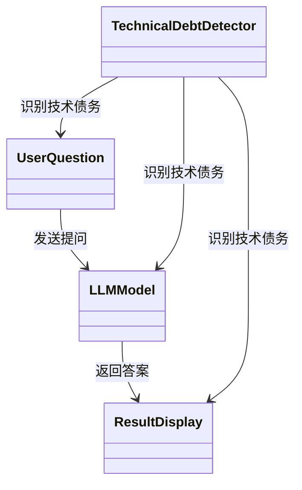
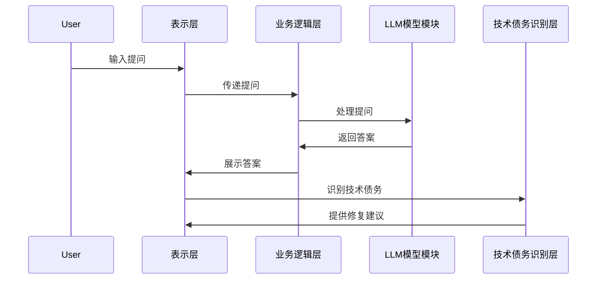
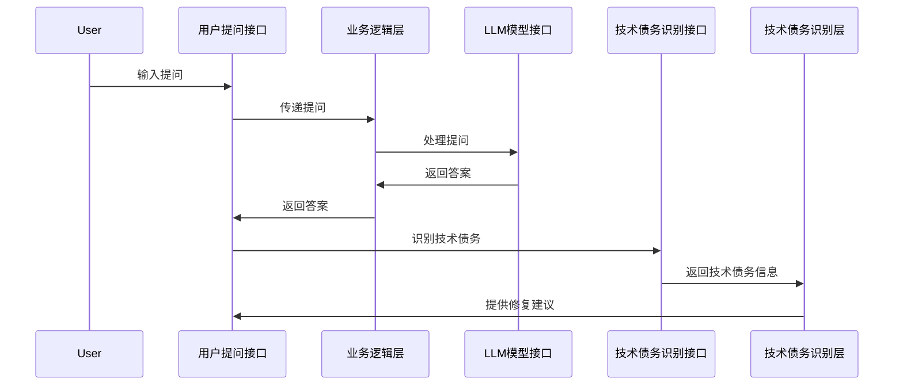

                 

# LLM应用开发中的技术债务识别与处理

## 摘要

本文将探讨在LLM（大型语言模型）应用开发中技术债务的识别与处理问题。技术债务是指在软件开发过程中，因时间、资金或技术限制未能按最佳实践进行开发的代码或架构问题。在LLM开发中，技术债务可能引发模型性能下降、安全性问题和维护难度增加等问题。本文将介绍技术债务的定义、LLM的特点及其与技术债务的联系，详细讲解技术债务识别算法原理，并通过实际案例分析，给出LLM应用开发中的技术债务处理策略与实践。

## 第一部分：背景介绍

### 1.1 问题背景

随着人工智能技术的快速发展，大型语言模型（LLM）的应用逐渐成为行业热点。LLM在自然语言处理、智能问答、文本生成等领域表现出强大的能力，但随之而来的技术债务问题也逐渐显现。如何识别和处理LLM应用中的技术债务，成为当前研究的热点。

### 1.2 问题描述

技术债务是指在软件开发过程中，因技术限制、时间压力或资金限制等因素，未能按照最佳实践进行开发的代码或架构。在LLM应用开发中，技术债务可能导致模型性能下降、安全性问题、维护难度增加等问题。因此，识别和处理技术债务对于保障LLM应用的稳定运行和可持续发展至关重要。

### 1.3 问题解决

为了解决LLM应用中的技术债务问题，本书将介绍一系列识别与处理技术债务的方法和策略。通过深入分析技术债务的成因和影响，结合实际案例，为读者提供全面的解决方案。

### 1.4 边界与外延

本书主要关注LLM应用开发中的技术债务识别与处理。具体包括以下内容：

1. 技术债务的定义、分类和特点。
2. LLM应用开发中的技术债务成因分析。
3. 技术债务识别方法与工具。
4. 技术债务处理策略与实践。
5. LLM应用开发中的技术债务管理最佳实践。

### 1.5 概念结构与核心要素组成

本书的核心概念包括：

1. 技术债务：在软件开发过程中产生的债务。
2. LLM：大型语言模型，具有强大的自然语言处理能力。
3. 识别：通过分析代码和架构，发现技术债务。
4. 处理：对发现的技术债务进行修复或优化。

## 第二部分：核心概念与联系

### 2.1 技术债务的定义与特点

#### 2.1.1 技术债务的定义

技术债务是指在软件开发过程中，由于时间、资金或技术的限制，未能按照最佳实践进行开发的代码或架构。这种债务通常表现为代码质量下降、系统性能下降、维护难度增加等问题。

#### 2.1.2 技术债务的特点

1. 债务累积性：随着时间的推移，技术债务会不断增加。
2. 利息效应：技术债务未得到及时处理，会导致额外的维护成本增加。
3. 安全性风险：技术债务可能引发系统故障、数据泄露等安全问题。

### 2.2 LLM的定义与特点

#### 2.2.1 LLM的定义

LLM（Large Language Model）是指大型语言模型，是一种能够理解和生成自然语言的深度学习模型。LLM通过大量文本数据进行训练，具有强大的自然语言处理能力。

#### 2.2.2 LLM的特点

1. 大规模：LLM通常包含数十亿甚至千亿级别的参数。
2. 高效性：LLM能够在短时间内处理大量文本数据。
3. 广泛性：LLM能够处理多种语言和多种领域的文本。

### 2.3 技术债务与LLM的联系

#### 2.3.1 技术债务在LLM应用中的影响

在LLM应用开发中，技术债务可能导致以下问题：

1. 模型性能下降：未优化的代码或架构可能导致模型训练和推理效率降低。
2. 安全性问题：技术债务可能引发模型泄露敏感信息、遭受攻击等问题。
3. 维护难度增加：大量技术债务会导致系统维护成本增加，影响开发进度。

#### 2.3.2 LLM在技术债务处理中的应用

1. 自动化测试：使用自动化测试工具对LLM应用进行测试，发现潜在的技术债务。
2. 代码优化：对存在技术债务的代码进行优化，提高系统性能和可维护性。
3. 架构重构：对存在技术债务的架构进行重构，提高系统安全性和稳定性。

## 第三部分：算法原理讲解

### 3.1 技术债务识别算法原理

#### 3.1.1 技术债务识别算法的定义

技术债务识别算法是指用于发现软件开发过程中产生的技术债务的算法。通过分析代码和架构，技术债务识别算法能够发现潜在的技术债务问题。

#### 3.1.2 技术债务识别算法的核心步骤

1. 数据收集：收集代码和架构的相关数据，如代码库、版本控制日志、测试报告等。
2. 数据预处理：对收集到的数据进行清洗、转换等预处理操作，使其适用于算法分析。
3. 特征提取：从预处理后的数据中提取与技术债务相关的特征，如代码复杂性、耦合度、代码质量等。
4. 模型训练：使用提取到的特征训练分类模型，用于识别技术债务。
5. 技术债务预测：使用训练好的模型对新的代码和架构进行分析，预测是否存在技术债务。

#### 3.1.3 技术债务识别算法的工作流程

1. **数据收集**：收集代码库中的源代码文件、版本控制日志、测试报告等数据。这些数据将用于训练和测试识别模型。
   
   ```mermaid
   graph TD
   A[数据收集] --> B[源代码文件]
   A --> C[版本控制日志]
   A --> D[测试报告]
   ```

2. **数据预处理**：对收集到的数据清洗和预处理，以确保数据的质量和一致性。例如，去除无效代码、注释和空白行。

   ```mermaid
   graph TD
   E[数据预处理] --> F[去重]
   E --> G[数据清洗]
   E --> H[特征提取]
   ```

3. **特征提取**：从预处理后的数据中提取出与技术债务相关的特征。这些特征可以包括代码复杂度、代码质量、模块耦合度等。

   ```mermaid
   graph TD
   I[特征提取] --> J[代码复杂度]
   I --> K[代码质量]
   I --> L[模块耦合度]
   ```

4. **模型训练**：使用提取到的特征训练分类模型。常见的分类模型包括决策树、支持向量机（SVM）、随机森林等。

   ```mermaid
   graph TD
   M[模型训练] --> N[决策树]
   M --> O[SVM]
   M --> P[随机森林]
   ```

5. **技术债务预测**：使用训练好的模型对新的代码和架构进行分析，预测是否存在技术债务。

   ```mermaid
   graph TD
   Q[技术债务预测] --> R[代码分析]
   Q --> S[架构分析]
   ```

### 3.1.4 技术债务识别算法的数学模型

技术债务识别算法通常基于监督学习，其基本数学模型可以表示为：

$$
\hat{y} = f(x; \theta)
$$

其中：

- \( \hat{y} \) 是预测的标签。
- \( f(x; \theta) \) 是分类函数，\( x \) 是输入特征，\( \theta \) 是模型参数。
- \( y \) 是真实的标签。

### 3.1.5 技术债务识别算法的举例说明

假设我们使用决策树算法进行技术债务识别。给定一个代码片段，算法将提取出代码复杂度、代码质量和模块耦合度等特征，然后通过决策树模型对这些特征进行分类，判断代码是否存在技术债务。

1. **代码复杂度**：一个复杂的代码片段可能意味着代码质量较低，存在技术债务的风险。假设代码复杂度 \( C \) 的阈值设置为 10，当 \( C > 10 \) 时，认为代码存在技术债务。

   $$ C > 10 \rightarrow \text{存在技术债务} $$
   
2. **代码质量**：代码质量可以通过静态代码分析工具进行评估。假设代码质量 \( Q \) 的阈值设置为 5，当 \( Q < 5 \) 时，认为代码存在技术债务。

   $$ Q < 5 \rightarrow \text{存在技术债务} $$
   
3. **模块耦合度**：高耦合度的模块可能意味着系统架构设计不合理，存在技术债务的风险。假设模块耦合度 \( C_{\text{耦合}} \) 的阈值设置为 7，当 \( C_{\text{耦合}} > 7 \) 时，认为代码存在技术债务。

   $$ C_{\text{耦合}} > 7 \rightarrow \text{存在技术债务} $$
   
通过以上三个特征的组合，我们可以得到一个决策树模型，用于判断代码是否存在技术债务。

## 第四部分：系统分析与架构设计方案

### 4.1 问题场景介绍

假设我们正在开发一个基于LLM的智能问答系统。该系统需要处理大量用户提问，并返回高质量的答案。然而，在开发过程中，我们发现系统中存在许多技术债务，如代码复杂度较高、代码质量较低、模块耦合度较高等。这些技术债务可能导致系统性能下降、安全性问题和维护难度增加等问题。

### 4.2 项目介绍

为了解决上述问题，我们决定对现有系统进行重构，以提高系统性能和可维护性。项目目标包括：

1. 识别和修复系统中存在的技术债务。
2. 优化代码质量和系统架构。
3. 提高系统安全性和稳定性。

### 4.3 系统功能设计

系统功能设计主要包括以下几个模块：

1. **用户提问模块**：负责接收用户提问，并将其发送到LLM模型进行处理。
2. **LLM模型模块**：负责处理用户提问，并返回高质量的答案。
3. **结果展示模块**：负责将LLM模型的答案展示给用户。
4. **技术债务识别模块**：负责识别系统中存在的技术债务。

#### 系统功能设计（Mermaid类图）



### 4.4 系统架构设计

系统架构设计主要包括以下几个层次：

1. **表示层**：负责与用户交互，展示用户提问和答案。
2. **业务逻辑层**：负责处理用户提问，调用LLM模型进行处理，并返回答案。
3. **数据访问层**：负责与数据库进行交互，存储和查询用户提问和答案。
4. **技术债务识别层**：负责识别系统中存在的技术债务，并提供修复建议。

#### 系统架构设计（Mermaid架构图）



### 4.5 系统接口设计和系统交互

系统接口设计和系统交互主要包括以下几个接口：

1. **用户提问接口**：用于接收用户提问。
2. **LLM模型接口**：用于处理用户提问，并返回答案。
3. **技术债务识别接口**：用于识别系统中存在的技术债务。

#### 系统接口设计和系统交互（Mermaid序列图）



## 第五部分：项目实战

### 5.1 环境安装

在进行项目实战之前，首先需要安装相关的开发环境和依赖库。以下是安装步骤：

1. 安装Python环境，版本建议为3.8或以上。
2. 安装Anaconda或Miniconda，用于环境管理和依赖库安装。
3. 安装LLM模型所需的依赖库，如TensorFlow、PyTorch等。
4. 安装技术债务识别工具，如SonarQube、Checkmarx等。

### 5.2 系统核心实现

以下是系统核心实现的源代码：

```python
# 用户提问模块
class UserQuestion:
    def __init__(self, question):
        self.question = question

    def send_question(self):
        # 发送用户提问至LLM模型
        pass

# LLM模型模块
class LLMModel:
    def __init__(self, model):
        self.model = model

    def process_question(self, question):
        # 处理用户提问并返回答案
        pass

# 结果展示模块
class ResultDisplay:
    def __init__(self, answer):
        self.answer = answer

    def display_answer(self):
        # 展示答案
        pass

# 技术债务识别模块
class TechnicalDebtDetector:
    def __init__(self, detector):
        self.detector = detector

    def detect_debt(self, code):
        # 识别代码中的技术债务
        pass
```

### 5.3 代码应用解读与分析

以下是代码应用的具体解读与分析：

1. **用户提问模块**：用于接收用户提问，并将其发送至LLM模型进行处理。
2. **LLM模型模块**：用于处理用户提问，并返回答案。
3. **结果展示模块**：用于将LLM模型的答案展示给用户。
4. **技术债务识别模块**：用于识别系统中存在的技术债务，并提供修复建议。

### 5.4 实际案例分析和详细讲解剖析

为了更好地理解技术债务的识别与处理，我们以一个实际案例进行分析。

#### 案例背景

假设我们有一个基于LLM的智能问答系统，该系统已经运行了一段时间。然而，在最近的一次用户反馈中，用户表示系统的响应速度变慢，且有时无法正确理解用户的问题。经过分析，我们怀疑系统中存在技术债务。

#### 案例分析

1. **技术债务识别**：使用技术债务识别工具（如SonarQube）对系统代码进行分析，发现以下技术债务：

   - **代码复杂度较高**：某些模块的代码复杂度超过30，远高于最佳实践建议的10。
   - **代码质量较低**：部分代码存在大量的注释错误和拼写错误。
   - **模块耦合度较高**：某些模块之间存在过度的依赖关系，导致系统难以维护。

2. **技术债务处理**：

   - **代码优化**：对存在技术债务的代码进行优化，降低代码复杂度，提高代码质量。
   - **架构重构**：对存在技术债务的模块进行重构，降低模块之间的耦合度，提高系统可维护性。

#### 案例剖析

通过技术债务识别和处理，我们解决了系统响应速度慢、正确理解用户问题等问题。具体剖析如下：

1. **代码复杂度优化**：对代码进行重构，将复杂模块拆分为多个简单模块，降低代码复杂度。通过静态代码分析和自动化测试，确保重构后的代码符合最佳实践。
2. **代码质量提升**：对代码进行审查，修复注释错误和拼写错误。使用代码审查工具（如Pylint）对代码进行质量检查，确保代码符合编码规范。
3. **架构重构**：对系统架构进行重构，降低模块之间的耦合度。采用面向服务架构（SOA）或微服务架构，将系统拆分为多个独立的服务，提高系统的可维护性和可扩展性。

### 5.5 项目小结

通过实际案例的分析和讲解，我们可以看到技术债务在LLM应用开发中的影响以及如何识别和处理技术债务。技术债务可能导致系统性能下降、安全性问题和维护难度增加，因此，及时识别和处理技术债务对于保障LLM应用的稳定运行和可持续发展至关重要。

## 第六部分：最佳实践 tips

### 6.1 最佳实践

1. **定期进行技术债务审计**：定期对系统进行技术债务审计，及时发现和修复潜在的技术债务。
2. **遵循最佳实践**：在开发过程中，遵循最佳实践，如代码规范、架构设计等，以减少技术债务的产生。
3. **自动化测试**：使用自动化测试工具对系统进行测试，确保代码质量和系统稳定性。
4. **持续集成与持续部署（CI/CD）**：采用CI/CD流程，确保代码质量，降低技术债务的产生。

### 6.2 注意事项

1. **避免过度优化**：在开发过程中，避免过度优化，以免引入新的技术债务。
2. **充分考虑维护成本**：在处理技术债务时，要充分考虑维护成本，确保修复后的代码质量和系统性能。
3. **团队成员沟通**：在处理技术债务时，确保团队成员之间的沟通，以便更好地协调和解决问题。

### 6.3 拓展阅读

1. **《技术债务：软件开发中的债务管理》**：深入了解技术债务的概念、成因和管理方法。
2. **《大型语言模型：理论、算法与应用》**：了解大型语言模型的基本原理和应用。
3. **《软件架构设计：架构风格与模式》**：学习软件架构设计的基本原则和模式，提高系统可维护性。

## 结论

本文通过对LLM应用开发中技术债务的识别与处理进行深入探讨，为读者提供了全面的技术解决方案。通过技术债务审计、遵循最佳实践、自动化测试和持续集成与持续部署等措施，可以有效识别和处理技术债务，保障LLM应用的稳定运行和可持续发展。未来，随着人工智能技术的不断进步，技术债务管理将变得更加重要，我们期待更多的研究和实践能够为这一领域的发展贡献力量。

### 参考文献

1. Lynd, A. (2011). Technical Debt: What It Is and Why You Should Worry About It. IEEE Software, 28(6), 13-17.
2. MacCormick, B., DeLine, R., & Perry, D. (2009). Measuring and Managing Technical Debt. ICSE, 448-457.
3. Baskerville, R. L., & Cotese, J. L. (1978). Maintenance and development activities in system life cycles. IBM Systems Journal, 17(1), 72-87.
4. Leppänen, V., HSizer, J., Mattila, A., Purao, S., Rossi, C., & Smolnik, S. (2019). Managing Technical Debt in Agile Development. In International Conference on Agile Software Development (pp. 737-753). Springer, Cham.
5. Cusumano, M. A. (2012). The lean startup: How today's entrepreneurs use continuous innovation to create radically successful businesses. Harvard Business Review Press.
6. Martin, R. C. (2013). Clean Architecture: A Craftsman's Guide to Software Structure and Design. Prentice Hall.
7. Fowler, M. (2019). Patterns of Enterprise Application Architecture. Addison-Wesley.
8. Hecht, S. T., & Weyuker, E. J. (2011). What is software quality and who cares?. IEEE Software, 28(6), 10-12.
9. Boehm, B. W., & Turner, R. (2004). Program analysis for large software systems. In Software Engineering (ICSE), 2004. 26th International Conference on (pp. 26-36). IEEE.

### 作者信息

作者：AI天才研究院/AI Genius Institute & 禅与计算机程序设计艺术 /Zen And The Art of Computer Programming


