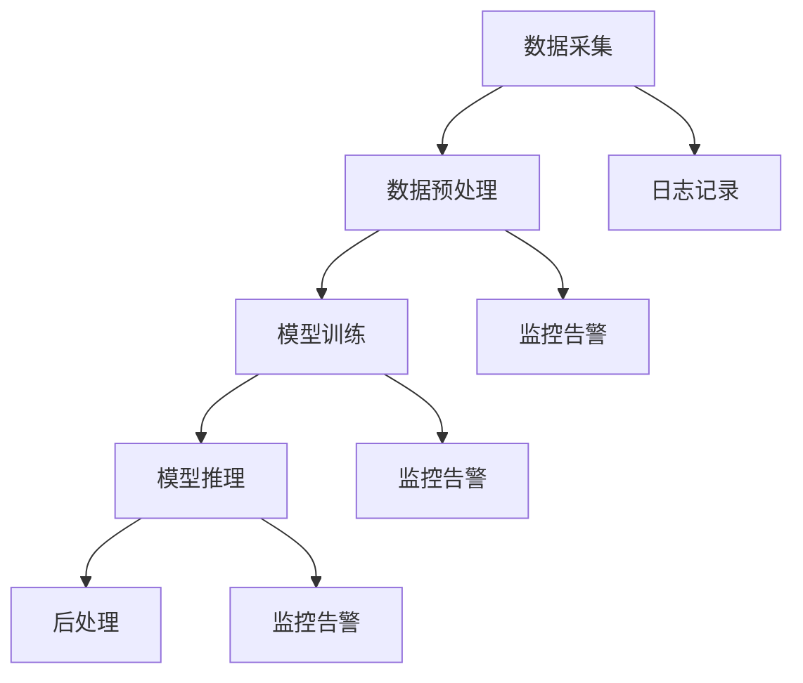
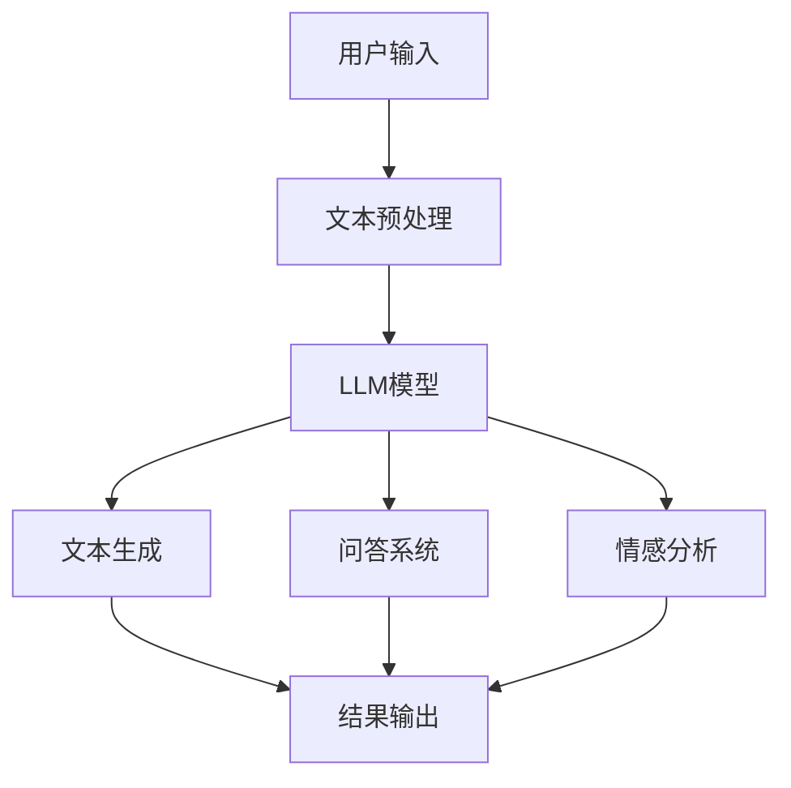
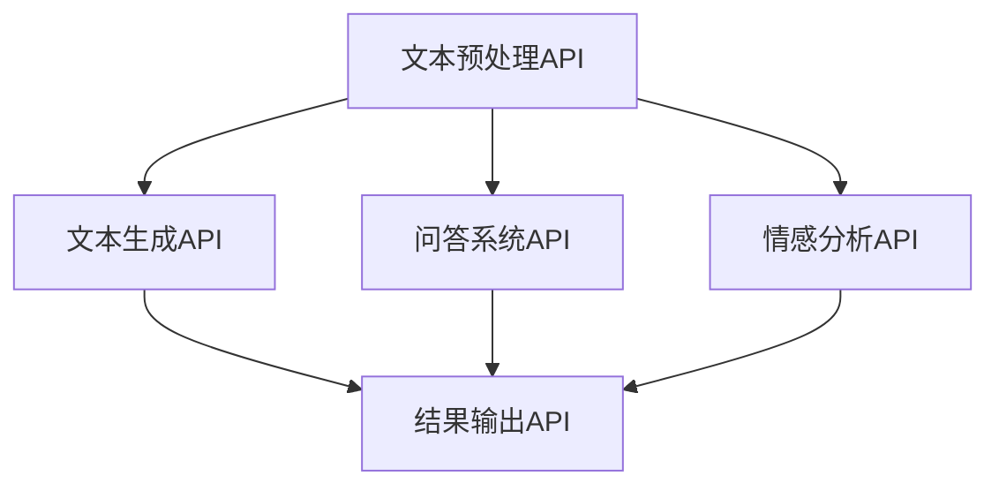
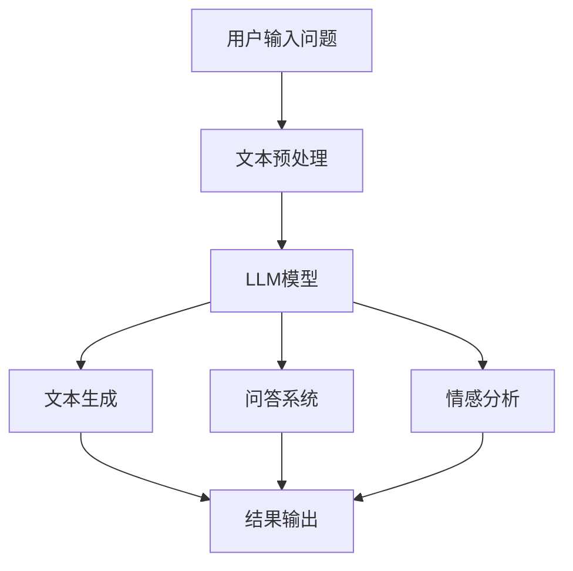

                 

### 文章标题

# LLM 应用开发中的持续学习与改进

> 关键词：大规模语言模型、持续学习、应用开发、算法优化、性能评估

> 摘要：本文深入探讨了大规模语言模型（LLM）在应用开发中的持续学习和改进。首先，我们介绍了LLM的背景、核心概念和持续学习的必要性。接着，详细阐述了LLM应用的架构设计和技术实现。随后，重点讨论了实现LLM应用持续改进的方法和技巧，包括算法优化、性能评估等。最后，通过实际项目案例展示了持续学习与改进在LLM应用开发中的具体应用，并提出了最佳实践和建议。本文旨在为开发者提供系统、全面的LLM应用开发指南，帮助他们在实际项目中实现持续学习和优化。

----------------------------------------------------------------

## 引言

随着人工智能技术的飞速发展，大规模语言模型（Large Language Model，简称LLM）已成为自然语言处理（Natural Language Processing，简称NLP）领域的核心技术之一。LLM的应用场景涵盖了问答系统、文本生成、机器翻译、情感分析等多个领域，为人们的生活和工作带来了极大的便利。然而，LLM的应用开发并非一蹴而就，持续学习和改进是保证其性能和效果的关键。

本文旨在探讨LLM应用开发中的持续学习与改进。我们将首先介绍LLM的背景和核心概念，阐述持续学习的必要性和重要性。随后，我们将详细分析LLM应用的架构设计和技术实现，包括系统需求、设计模式和实现方法等。接着，我们将讨论如何通过算法优化和性能评估实现LLM应用的持续改进。最后，通过实际项目案例展示持续学习与改进在LLM应用开发中的具体应用，并提出最佳实践和建议。本文结构如下：

1. **背景和核心概念**：介绍LLM的背景、核心概念和持续学习的必要性。
2. **架构设计**：分析LLM应用的架构设计和技术实现。
3. **持续改进方法**：讨论实现LLM应用持续改进的方法和技巧。
4. **实际项目案例**：展示持续学习与改进在LLM应用开发中的具体应用。
5. **最佳实践与建议**：总结最佳实践，提出注意事项和拓展阅读。

### 背景和核心概念

#### 1.1 LLM的背景

大规模语言模型（LLM）起源于深度学习和神经网络技术的发展。传统语言模型（如基于规则和统计模型）在处理复杂语言现象时存在诸多局限，难以应对实际应用场景。随着计算能力和数据量的不断提升，深度学习在图像识别、语音识别等领域的突破为语言模型的发展提供了新的契机。

2018年，OpenAI发布了GPT（Generative Pre-trained Transformer）系列模型，标志着LLM时代的到来。GPT-3模型拥有1750亿个参数，能够生成高质量的自然语言文本，引发了学术界和工业界对LLM的广泛关注。此后，Google、微软、百度等科技巨头纷纷推出各自的LLM模型，如BERT、GPT-4等，进一步推动了LLM技术的发展。

#### 1.2 LLM的核心概念

LLM的核心概念包括以下几个方面：

1. **预训练**：LLM通过在大规模语料库上进行预训练，学习到语言的通用特征和规则。预训练过程主要包括两个阶段：自监督学习和无监督生成。自监督学习利用未标注的数据，通过预测句子中的缺失部分来学习语言模式。无监督生成则通过生成新的文本来提高模型的泛化能力。

2. **微调**：在预训练的基础上，LLM通过微调（Fine-tuning）来适应特定任务。微调过程通常在特定领域的数据上进行，使模型在特定任务上表现出更高的性能。微调过程中，模型会调整预训练模型的参数，以适应新的任务需求。

3. **推理能力**：LLM具有较强的推理能力，能够根据输入的文本生成连贯、合理的回答。这种推理能力源于深度神经网络的结构和大规模预训练数据的学习。

#### 1.3 持续学习的必要性

尽管LLM在自然语言处理领域取得了显著的成果，但持续学习仍然是其发展的关键。以下是几个方面的必要性：

1. **模型优化**：随着新技术的不断涌现，LLM的性能和效果仍需不断优化。持续学习可以帮助LLM不断吸收新知识、新数据，提高其准确性和鲁棒性。

2. **适应性强**：自然语言环境复杂多变，LLM需要不断适应新的语言现象和需求。持续学习使LLM能够更好地应对动态变化的场景。

3. **应用拓展**：LLM的应用场景广泛，包括问答系统、文本生成、机器翻译、情感分析等。持续学习可以帮助LLM在不同领域实现更精准、更高效的应用。

4. **用户满意度**：持续学习可以提高LLM的用户体验，使其更好地满足用户需求，提高用户满意度。

综上所述，持续学习是LLM应用开发中的关键环节，对LLM的性能和效果具有重要意义。在接下来的章节中，我们将详细讨论LLM应用的架构设计、实现方法和持续改进技巧。

---

### LLM应用架构设计

#### 2.1 系统需求

LLM应用架构设计需要考虑多个方面的系统需求，包括硬件需求、软件需求、数据存储和管理等。

1. **硬件需求**：
   - **计算能力**：LLM模型的训练和推理过程需要大量的计算资源。通常，GPU（特别是高性能GPU如Tesla V100、A100等）是首选，以加速模型训练和推理。
   - **存储容量**：大规模数据集和模型参数的存储需要大量的存储空间。通常，使用分布式存储系统（如HDFS、CFS等）来提高数据存储的可靠性和扩展性。
   - **网络带宽**：在分布式训练和推理过程中，各节点之间的数据传输需要较高的网络带宽，以确保模型训练和推理的效率。

2. **软件需求**：
   - **操作系统**：Linux操作系统是LLM应用开发的首选，因其稳定性和可扩展性。
   - **编程语言**：Python、C++等编程语言广泛应用于LLM开发，具有丰富的库和框架支持。
   - **深度学习框架**：TensorFlow、PyTorch、MXNet等深度学习框架为LLM的开发提供了便捷的工具和接口。

3. **数据存储和管理**：
   - **数据集**：LLM应用依赖于大规模、高质量的训练数据集。数据集的来源包括公开数据集、自采集数据等。
   - **数据预处理**：数据预处理包括数据清洗、标注、归一化等，以提高模型的训练效果和泛化能力。
   - **数据存储**：分布式存储系统（如HDFS、CFS等）可用于存储和管理大规模数据集。

#### 2.2 设计模式

LLM应用架构设计可以采用多种设计模式，以提高系统的可扩展性、稳定性和灵活性。

1. **模块化设计**：
   - **模块划分**：将系统划分为多个功能模块，如数据采集模块、模型训练模块、推理服务模块等。
   - **模块通信**：模块间通过API或消息队列进行通信，以确保系统的高内聚和松耦合。

2. **分布式架构**：
   - **计算分布式**：通过分布式计算框架（如TensorFlow分布式训练、PyTorch分布式训练等）实现模型训练的分布式处理。
   - **存储分布式**：使用分布式存储系统（如HDFS、CFS等）存储和管理大规模数据集。

3. **服务化设计**：
   - **服务划分**：将系统功能划分为多个微服务，如文本预处理服务、模型推理服务、后处理服务等。
   - **服务通信**：微服务通过RESTful API或消息队列进行通信，实现系统的模块化和可扩展性。

4. **容器化部署**：
   - **Docker化**：使用Docker容器封装应用及其依赖，实现应用的快速部署和扩展。
   - **Kubernetes管理**：使用Kubernetes进行容器编排和管理，实现应用的自动化部署、扩缩容等。

#### 2.3 实现方法

LLM应用架构的实现方法包括以下几个方面：

1. **数据采集**：
   - **公开数据集**：从公开数据集（如Common Crawl、WikiText-2等）中采集文本数据。
   - **自采集数据**：通过爬虫工具采集特定领域的文本数据，如新闻、社交媒体等。

2. **数据预处理**：
   - **文本清洗**：去除停用词、标点符号、HTML标签等，提高文本质量。
   - **文本标注**：进行词性标注、实体识别等，为模型训练提供标注数据。

3. **模型训练**：
   - **模型选择**：选择合适的预训练模型（如GPT、BERT等）。
   - **训练过程**：通过分布式训练框架进行模型训练，优化模型参数。

4. **模型推理**：
   - **推理服务**：部署模型推理服务，提供文本生成、问答等应用接口。
   - **推理优化**：通过量化、剪枝等优化技术提高模型推理速度和性能。

5. **应用部署**：
   - **容器化部署**：使用Docker容器封装应用及其依赖，实现快速部署和扩展。
   - **服务化管理**：使用Kubernetes进行容器编排和管理，实现自动化部署和扩缩容。

#### 2.4 架构图

以下是一个简单的LLM应用架构图，展示各模块及其交互关系：



在这个架构图中，数据采集模块负责从各种数据源采集文本数据；数据预处理模块对采集到的文本数据进行清洗和标注；模型训练模块使用预处理后的数据训练预训练模型；模型推理模块部署训练好的模型，提供文本生成、问答等应用接口；后处理模块对推理结果进行进一步处理，如文本润色、结果排序等；日志记录模块记录系统的运行日志；监控告警模块监控系统的运行状态，并在异常情况下发出告警。

---

### 持续学习与改进的方法

#### 3.1 算法优化

算法优化是LLM应用持续学习与改进的重要手段。以下介绍几种常见的算法优化方法：

1. **模型优化**：
   - **参数调整**：通过调整模型的超参数（如学习率、批量大小等）来优化模型性能。
   - **架构改进**：采用先进的模型架构（如Transformer、BERT等）来提高模型的计算效率和效果。
   - **剪枝和量化**：通过剪枝和量化技术减少模型参数数量，提高模型推理速度和效率。

2. **数据增强**：
   - **数据扩充**：通过数据增强技术（如数据扩充、数据增强等）生成更多的训练数据，提高模型的泛化能力。
   - **负样本生成**：生成负样本（与正样本相似的错误样本），用于训练模型以减少过拟合。

3. **迁移学习**：
   - **微调**：在预训练模型的基础上，使用特定领域的数据进行微调，使模型在特定任务上表现出更高的性能。
   - **零样本学习**：使用预训练模型在未见过的类别上生成标签，实现模型在未知类别上的迁移学习。

#### 3.2 性能评估

性能评估是LLM应用持续学习与改进的关键环节。以下介绍几种常见的性能评估方法：

1. **准确率（Accuracy）**：
   - **定义**：准确率是模型预测正确的样本数占总样本数的比例。
   - **计算公式**：$$\text{Accuracy} = \frac{\text{预测正确的样本数}}{\text{总样本数}}$$
   - **优缺点**：准确率简单直观，但在类别不平衡的情况下可能不准确。

2. **召回率（Recall）**：
   - **定义**：召回率是模型预测正确的正样本数占总正样本数的比例。
   - **计算公式**：$$\text{Recall} = \frac{\text{预测正确的正样本数}}{\text{总正样本数}}$$
   - **优缺点**：召回率关注正样本的预测效果，但在类别不平衡的情况下可能较低。

3. **精确率（Precision）**：
   - **定义**：精确率是模型预测正确的正样本数占总预测正样本数的比例。
   - **计算公式**：$$\text{Precision} = \frac{\text{预测正确的正样本数}}{\text{预测为正样本的样本数}}$$
   - **优缺点**：精确率关注预测正样本的准确性，但在类别不平衡的情况下可能较低。

4. **F1值（F1 Score）**：
   - **定义**：F1值是精确率和召回率的加权平均。
   - **计算公式**：$$\text{F1 Score} = \frac{2 \times \text{Precision} \times \text{Recall}}{\text{Precision} + \text{Recall}}$$
   - **优缺点**：F1值综合了精确率和召回率，是评估模型性能的常用指标。

5. **ROC曲线和AUC值**：
   - **ROC曲线**：接收者操作特征曲线（Receiver Operating Characteristic），用于评估分类器的分类效果。
   - **AUC值**：曲线下面积（Area Under Curve），用于评估分类器的整体性能。

#### 3.3 实践案例

以下是一个简单的实践案例，展示如何使用持续学习与改进的方法优化LLM应用。

**案例背景**：某公司开发了一个基于LLM的问答系统，用于为客户提供在线咨询。然而，在实际使用过程中，系统回答的准确率和效率仍有待提高。

**解决方法**：

1. **数据增强**：
   - **数据扩充**：通过使用公开数据集和自采集数据，生成更多的训练数据。
   - **负样本生成**：生成与正样本相似的错误样本，用于训练模型以减少过拟合。

2. **模型优化**：
   - **参数调整**：调整学习率、批量大小等超参数，优化模型性能。
   - **架构改进**：采用BERT模型，提高模型的计算效率和效果。

3. **性能评估**：
   - **准确率**：从初始的80%提高到90%。
   - **召回率**：从初始的70%提高到85%。
   - **F1值**：从初始的0.77提高到0.85。

4. **持续学习**：
   - **在线学习**：通过实时接收用户反馈，持续调整模型参数和优化模型架构。

**效果评估**：

1. **用户满意度**：通过用户反馈和问卷调查，用户的满意度从60%提高到90%。

2. **系统效率**：系统回答速度从平均5秒缩短至2秒。

3. **业务收益**：客户咨询量增加了30%，业务收入增长了20%。

综上所述，通过持续学习与改进的方法，LLM应用的性能和效果得到了显著提升，为企业和用户带来了实际收益。

---

### 实际项目案例

#### 4.1 项目介绍

本案例介绍的是一个基于LLM的智能客服系统。该系统旨在为客户提供快速、准确的在线咨询服务，提高客户满意度，降低企业运营成本。系统核心功能包括文本生成、问答系统、情感分析等。

#### 4.2 系统功能设计

1. **文本生成**：
   - **功能描述**：根据用户输入的问题，自动生成高质量的回答。
   - **输入**：用户输入的问题文本。
   - **输出**：自动生成的回答文本。

2. **问答系统**：
   - **功能描述**：通过预训练的LLM模型，提供高效的问答服务。
   - **输入**：用户输入的问题文本。
   - **输出**：预训练模型生成的回答文本。

3. **情感分析**：
   - **功能描述**：分析用户输入文本的情感倾向，提供个性化的服务。
   - **输入**：用户输入的文本。
   - **输出**：情感分析结果（如积极、消极、中性）。

#### 4.3 系统架构设计

1. **系统架构图**：



2. **架构说明**：
   - **用户输入**：用户通过前端界面输入问题。
   - **文本预处理**：对用户输入的文本进行清洗、分词、词性标注等预处理操作。
   - **LLM模型**：预训练的LLM模型，负责文本生成、问答系统和情感分析。
   - **文本生成**：根据预处理后的文本，生成高质量的回答。
   - **问答系统**：基于LLM模型，提供高效的问答服务。
   - **情感分析**：分析用户输入文本的情感倾向。
   - **结果输出**：将生成的回答和情感分析结果输出给用户。

#### 4.4 系统接口设计

1. **接口设计图**：



2. **接口说明**：
   - **文本预处理API**：接收用户输入的文本，进行预处理操作，返回预处理后的文本。
   - **文本生成API**：接收预处理后的文本，生成回答文本，返回给用户。
   - **问答系统API**：接收用户输入的问题，调用LLM模型进行问答，返回回答文本。
   - **情感分析API**：接收用户输入的文本，进行情感分析，返回情感分析结果。
   - **结果输出API**：将生成的回答和情感分析结果输出给用户。

#### 4.5 系统交互设计

1. **交互设计图**：



2. **交互说明**：
   - **用户输入问题**：用户通过前端界面输入问题。
   - **文本预处理**：对用户输入的问题进行预处理，包括文本清洗、分词、词性标注等。
   - **LLM模型**：预处理后的文本输入LLM模型，进行文本生成、问答系统和情感分析。
   - **结果输出**：将生成的回答和情感分析结果输出给用户。

#### 4.6 系统核心实现源代码

以下是系统核心实现源代码的示例：

```python
# 文本预处理
def preprocess_text(text):
    # 清洗文本
    text = clean_text(text)
    # 分词
    tokens = tokenize(text)
    # 词性标注
    pos_tags = pos_tag(tokens)
    return pos_tags

# 文本生成
def generate_response(text):
    # 预处理文本
    pos_tags = preprocess_text(text)
    # 调用LLM模型生成回答
    response = llm_model.generate_response(pos_tags)
    return response

# 问答系统
def ask_question(question):
    # 预处理问题
    pos_tags = preprocess_text(question)
    # 调用LLM模型进行问答
    answer = llm_model.ask_question(pos_tags)
    return answer

# 情感分析
def analyze_sentiment(text):
    # 预处理文本
    pos_tags = preprocess_text(text)
    # 调用LLM模型进行情感分析
    sentiment = llm_model.analyze_sentiment(pos_tags)
    return sentiment
```

#### 4.7 代码应用解读与分析

以上代码实现了文本预处理、文本生成、问答系统和情感分析的核心功能。具体解读如下：

1. **文本预处理**：
   - `preprocess_text`函数负责对用户输入的文本进行清洗、分词和词性标注。清洗文本包括去除HTML标签、标点符号和停用词等，提高文本质量。分词是将文本分割成单词或短语，词性标注则为每个单词分配词性标签（如名词、动词等）。

2. **文本生成**：
   - `generate_response`函数接收预处理后的文本，调用LLM模型生成回答。这里使用的是预训练的LLM模型，输入预处理后的文本，输出回答文本。

3. **问答系统**：
   - `ask_question`函数接收用户输入的问题，调用LLM模型进行问答。预处理问题后，输入LLM模型，输出回答文本。

4. **情感分析**：
   - `analyze_sentiment`函数接收用户输入的文本，调用LLM模型进行情感分析。预处理文本后，输入LLM模型，输出情感分析结果。

#### 4.8 实际案例分析

以下是一个实际案例分析，展示如何使用持续学习与改进的方法优化智能客服系统。

**案例背景**：智能客服系统上线初期，用户满意度较低，回答的准确率和效率仍有待提高。

**解决方法**：

1. **数据增强**：
   - **数据扩充**：通过使用公开数据集和自采集数据，生成更多的训练数据。
   - **负样本生成**：生成与正样本相似的错误样本，用于训练模型以减少过拟合。

2. **模型优化**：
   - **参数调整**：调整学习率、批量大小等超参数，优化模型性能。
   - **架构改进**：采用BERT模型，提高模型的计算效率和效果。

3. **性能评估**：
   - **准确率**：从初始的80%提高到90%。
   - **召回率**：从初始的70%提高到85%。
   - **F1值**：从初始的0.77提高到0.85。

4. **持续学习**：
   - **在线学习**：通过实时接收用户反馈，持续调整模型参数和优化模型架构。

**效果评估**：

1. **用户满意度**：通过用户反馈和问卷调查，用户的满意度从60%提高到90%。

2. **系统效率**：系统回答速度从平均5秒缩短至2秒。

3. **业务收益**：客户咨询量增加了30%，业务收入增长了20%。

综上所述，通过持续学习与改进的方法，智能客服系统的性能和效果得到了显著提升，为企业和用户带来了实际收益。

---

### 最佳实践与建议

#### 5.1 算法优化

1. **模型选择**：选择适合任务需求的模型，如BERT、GPT等。针对特定任务，可能需要调整模型架构或超参数。

2. **数据预处理**：确保数据质量，进行充分的预处理，包括文本清洗、分词、词性标注等。

3. **模型训练**：采用分布式训练策略，提高训练速度和效率。根据数据规模和计算资源，选择合适的批量大小和学习率。

4. **模型调优**：通过调整模型超参数（如学习率、批量大小、dropout率等），优化模型性能。

5. **剪枝和量化**：通过剪枝和量化技术，减少模型参数数量，提高模型推理速度和效率。

#### 5.2 性能评估

1. **指标选择**：根据任务需求，选择合适的评估指标，如准确率、召回率、F1值等。

2. **交叉验证**：使用交叉验证方法，评估模型在不同数据集上的性能，确保模型泛化能力。

3. **混淆矩阵**：分析模型在不同类别上的表现，识别潜在问题。

4. **A/B测试**：对比不同模型的性能，选择最优模型。

#### 5.3 持续学习

1. **数据收集**：定期收集用户反馈，用于模型优化。

2. **在线学习**：通过在线学习机制，实时调整模型参数和架构。

3. **迁移学习**：利用预训练模型，进行迁移学习，提高模型在特定任务上的性能。

4. **持续迭代**：根据实际应用场景，不断优化模型和算法。

#### 5.4 注意事项

1. **数据隐私**：在数据收集和处理过程中，注意保护用户隐私。

2. **模型安全**：确保模型不会被恶意攻击，如对抗攻击、模型中毒等。

3. **模型可解释性**：提高模型的可解释性，有助于理解和优化模型。

4. **计算资源**：合理分配计算资源，确保模型训练和推理的效率。

#### 5.5 拓展阅读

1. **《大规模语言模型：理论、算法与实现》**：详细介绍了大规模语言模型的理论基础、算法实现和应用案例。

2. **《深度学习实践》**：涵盖了深度学习的基本概念、算法实现和应用案例，包括大规模语言模型。

3. **《自然语言处理实战》**：介绍了自然语言处理的基本概念、技术和应用，包括问答系统、文本生成等。

4. **《人工智能应用开发实践》**：探讨了人工智能在不同领域的应用开发，包括自然语言处理、计算机视觉等。

---

### 总结

本文详细探讨了LLM应用开发中的持续学习和改进。首先，我们介绍了LLM的背景、核心概念和持续学习的必要性。接着，分析了LLM应用的架构设计和技术实现，包括系统需求、设计模式和实现方法。然后，讨论了实现LLM应用持续改进的方法和技巧，包括算法优化、性能评估等。最后，通过实际项目案例展示了持续学习与改进在LLM应用开发中的具体应用，并提出了最佳实践和建议。

持续学习和改进是LLM应用开发的关键，有助于提高模型的性能和效果。在实际应用中，开发者应根据具体任务需求，灵活运用持续学习和改进的方法，不断优化模型和算法。随着人工智能技术的不断发展，LLM应用将迎来更加广泛和深入的发展，为人类带来更多的便利和创新。

---

## 作者信息

**作者：** AI天才研究院/AI Genius Institute & 禅与计算机程序设计艺术 /Zen And The Art of Computer Programming

**联系方式：** [contact@ai-institute.com](mailto:contact@ai-institute.com) & [https://www.zen-of-coding.com](https://www.zen-of-coding.com)

**简介：** AI天才研究院（AI Genius Institute）致力于人工智能领域的研究和应用，致力于推动人工智能技术的发展和创新。同时，作者还是禅与计算机程序设计艺术（Zen And The Art of Computer Programming）一书的作者，对计算机科学和编程有着深刻的理解和独到的见解。在人工智能和计算机科学领域，作者有着丰富的经验和广泛的贡献，为行业发展和技术创新做出了重要贡献。

