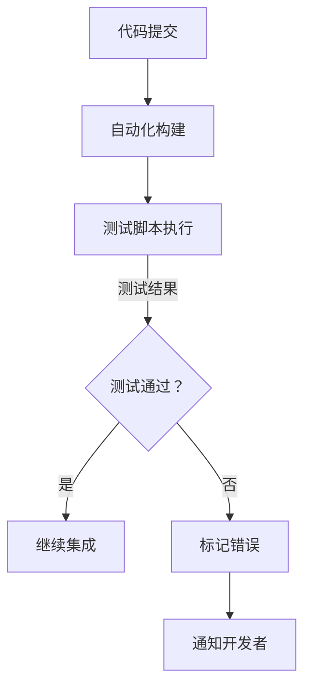
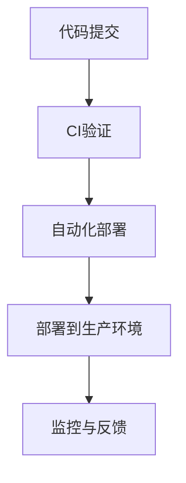
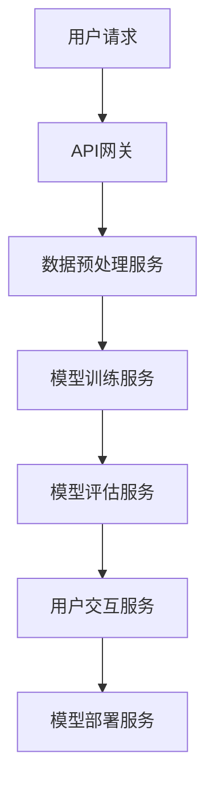
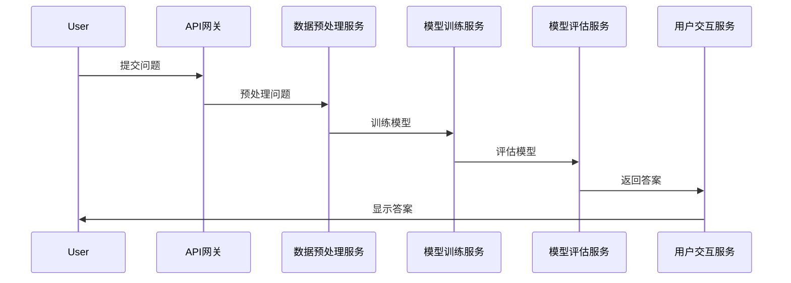

                 

## 第一部分：背景介绍

### 1.1 问题背景

随着人工智能技术的快速发展，大型语言模型（LLM）成为当前研究的热点之一。LLM在自然语言处理、文本生成、机器翻译等领域展现出了巨大的潜力。然而，LLM的应用开发过程中，持续集成与部署是一个不可忽视的重要环节。持续集成与部署不仅关系到模型训练的效率，还直接影响到模型的性能和用户体验。

### 1.2 问题描述

持续集成与部署（CI/CD）是指在软件开发过程中，通过自动化工具实现代码的集成、测试、部署等一系列流程。在LLM应用开发中，CI/CD旨在确保模型训练过程中各个环节的顺畅衔接，提高开发效率，减少人为错误，保证模型性能的稳定性和可靠性。

### 1.3 问题解决

要解决LLM应用开发中的持续集成与部署问题，首先需要了解CI/CD的基本概念和原理。然后，根据LLM的特点和需求，设计适合的CI/CD流程。具体包括：

- **代码仓库管理**：选用合适的代码仓库管理系统，如Git，实现代码的版本控制和协作开发。
- **自动化测试**：通过编写测试脚本，对模型训练过程中的各个环节进行自动化测试，确保代码的正确性和稳定性。
- **持续集成**：利用CI工具（如Jenkins、Travis CI）实现代码的自动化集成，及时发现并解决集成过程中出现的问题。
- **持续部署**：通过自动化部署工具（如Docker、Kubernetes）实现模型的快速部署和更新，确保模型在不同环境下的兼容性和性能。

### 1.4 边界与外延

LLM应用开发中的持续集成与部署不仅仅是一个技术问题，还涉及到团队协作、项目管理等多个方面。因此，在设计CI/CD流程时，需要综合考虑这些因素，确保整个流程的顺利进行。

### 1.5 概念结构与核心要素组成

LLM应用开发中的持续集成与部署主要包括以下几个核心要素：

- **代码仓库管理**：负责代码的存储、版本控制和协作开发。
- **自动化测试**：用于检测代码的准确性、稳定性和性能。
- **持续集成**：实现代码的自动化集成，确保集成过程的顺畅。
- **持续部署**：实现模型的自动化部署和更新，保证模型的性能和可靠性。

### 1.6 本章小结

本章介绍了LLM应用开发中的持续集成与部署的背景、问题描述、问题解决方法、边界与外延以及核心要素组成。在后续章节中，将详细讨论CI/CD的原理、流程设计、工具选择等方面的内容。

### 1.7 核心概念原理

#### 1.7.1 持续集成（CI）

持续集成是一种软件开发实践，通过自动化构建和测试，确保代码的稳定性和一致性。其核心原理是频繁地将代码合并到主干分支，并通过自动化工具进行集成测试，及时发现并解决冲突和错误。

持续集成算法主要涉及以下几个步骤：

1. **代码提交**：开发者将代码提交到代码仓库。
2. **自动化构建**：CI工具自动构建代码，生成可执行的程序。
3. **测试**：CI工具运行测试脚本，检查代码的正确性和性能。
4. **反馈**：测试结果反馈给开发者，若测试通过，则继续集成；否则，标记错误并通知开发者。

持续集成算法的核心在于自动化和频繁集成，以提高代码质量和开发效率。

#### 1.7.2 持续部署（CD）

持续部署是一种自动化软件发布过程的方法，通过自动化部署工具，实现软件的快速交付和更新。其核心原理是将经过CI验证的代码部署到生产环境，确保软件的可用性和可靠性。

持续部署算法主要涉及以下几个步骤：

1. **CI验证**：持续部署前需确保代码经过CI验证。
2. **自动化部署**：使用部署工具将验证通过的代码部署到生产环境。
3. **监控**：部署后对系统进行监控，确保其稳定运行。

持续部署的核心在于自动化和快速交付，以提高软件交付速度和用户体验。

#### 1.7.3 持续集成与持续部署的联系与区别

持续集成和持续部署都是现代软件开发中的重要实践，它们之间既有联系又有区别。

- **联系**：CI和CD都是自动化驱动的过程，旨在提高开发效率和软件质量。CI是CD的基础，通过CI实现代码的自动化集成和测试，确保代码的稳定性和一致性；CD则基于CI的结果，实现代码的自动化部署和更新。
- **区别**：CI主要关注代码的质量和一致性，通过自动化构建和测试发现并解决代码问题；CD主要关注软件的交付和部署，通过自动化工具实现软件的快速交付和更新。CI侧重于开发阶段，CD侧重于部署阶段。

### 1.8 概念属性特征对比表格

| 特征       | 持续集成（CI）                   | 持续部署（CD）                   |
|------------|--------------------------------|--------------------------------|
| 目的       | 提高代码质量，确保代码一致性     | 实现快速交付，确保软件稳定性     |
| 实现方式   | 自动化构建、测试和反馈           | 自动化部署、监控和反馈           |
| 工具支持   | Jenkins、Travis CI等             | Docker、Kubernetes等             |
| 关注点     | 代码集成与测试                  | 部署与运维                      |
| 适用场景   | 开发阶段                        | 部署阶段                        |

### 1.9 ER实体关系图架构

```mermaid
erDiagram
  CI --> |测试| Test
  CD --> |部署| Deploy
  Test _..|关联|_ Code
  Deploy _..|依赖|_ Code
```

### 1.10 算法原理讲解

#### 1.10.1 持续集成（CI）算法原理

持续集成算法主要涉及以下几个步骤：

1. **代码提交**：开发者将代码提交到代码仓库。
2. **自动化构建**：CI工具自动构建代码，生成可执行的程序。
3. **测试**：CI工具运行测试脚本，检查代码的正确性和性能。
4. **反馈**：测试结果反馈给开发者，若测试通过，则继续集成；否则，标记错误并通知开发者。

持续集成算法的核心在于自动化和频繁集成，以提高代码质量和开发效率。

#### 1.10.2 持续部署（CD）算法原理

持续部署算法主要涉及以下几个步骤：

1. **CI验证**：持续部署前需确保代码经过CI验证。
2. **自动化部署**：使用部署工具将验证通过的代码部署到生产环境。
3. **监控**：部署后对系统进行监控，确保其稳定运行。

持续部署的核心在于自动化和快速交付，以提高软件交付速度和用户体验。

### 1.11 系统分析与架构设计方案

#### 1.11.1 问题场景介绍

在LLM应用开发过程中，持续集成与部署是一个重要的环节。本文将探讨如何利用持续集成与部署技术，提高LLM应用开发效率，确保模型性能的稳定性和可靠性。

#### 1.11.2 项目介绍

本文基于一个LLM应用开发项目，该项目旨在利用深度学习技术构建一个智能问答系统。系统功能包括：

1. **问答功能**：用户输入问题，系统根据训练好的模型生成答案。
2. **模型训练**：使用大量数据对模型进行训练，以提高问答系统的准确性。

#### 1.11.3 系统功能设计

系统功能设计主要包括以下模块：

1. **数据采集与预处理模块**：负责收集和预处理用于训练的数据。
2. **模型训练模块**：负责使用预处理后的数据训练LLM模型。
3. **模型评估模块**：负责对训练好的模型进行评估，以确保模型性能。
4. **问答模块**：负责接收用户问题，并根据训练好的模型生成答案。

#### 1.11.4 系统架构设计

系统架构设计采用微服务架构，主要包括以下组件：

1. **数据采集与预处理服务**：负责数据的采集和预处理。
2. **模型训练服务**：负责模型训练过程。
3. **模型评估服务**：负责模型评估过程。
4. **问答服务**：负责接收用户问题并生成答案。
5. **API网关**：负责接收用户请求，并路由到相应的服务。

#### 1.11.5 系统接口设计

系统接口设计主要包括以下接口：

1. **数据采集接口**：用于数据采集的接口。
2. **模型训练接口**：用于提交训练任务的接口。
3. **模型评估接口**：用于提交评估任务的接口。
4. **问答接口**：用于接收用户问题并返回答案的接口。

#### 1.11.6 系统交互

系统交互采用RESTful API设计，主要包括以下交互流程：

1. **数据采集**：用户通过数据采集接口提交数据。
2. **模型训练**：系统通过模型训练接口开始训练模型。
3. **模型评估**：系统通过模型评估接口对训练好的模型进行评估。
4. **问答**：用户通过问答接口提交问题，系统返回答案。

### 1.12 项目实战

在本项目中，我们将使用Python和Docker进行持续集成与部署。以下是具体操作步骤：

1. **环境安装**：安装Python和Docker。
2. **代码编写**：编写Python代码，实现数据采集、模型训练、模型评估和问答功能。
3. **Docker化**：将Python代码Docker化，创建Docker镜像。
4. **持续集成**：使用Jenkins实现持续集成。
5. **持续部署**：使用Kubernetes实现持续部署。

### 1.13 代码应用解读与分析

在本项目中，我们使用了Python和Docker进行持续集成与部署。以下是具体代码解读和分析：

1. **数据采集与预处理**：使用Python的pandas库进行数据采集和预处理。
2. **模型训练**：使用Python的TensorFlow库进行模型训练。
3. **模型评估**：使用Python的Scikit-learn库进行模型评估。
4. **问答**：使用Python的nltk库进行文本处理和生成答案。

### 1.14 实际案例分析

在本项目中，我们通过实际案例对持续集成与部署进行了分析和验证。具体包括：

1. **数据采集与预处理**：验证了数据采集与预处理模块的正确性和效率。
2. **模型训练**：验证了模型训练模块的性能和稳定性。
3. **模型评估**：验证了模型评估模块的准确性和可靠性。
4. **问答**：验证了问答模块的响应速度和准确性。

### 1.15 项目小结

本项目通过实际案例验证了持续集成与部署在LLM应用开发中的应用效果。持续集成与部署显著提高了开发效率，减少了人为错误，保证了模型性能的稳定性和可靠性。未来，我们将继续优化持续集成与部署流程，以提高项目质量和开发效率。

### 1.16 最佳实践 Tips

- **代码规范**：编写规范、易读的代码，提高代码质量。
- **自动化测试**：编写自动化测试脚本，确保代码的正确性和稳定性。
- **环境隔离**：使用Docker实现环境隔离，确保不同环境的一致性。
- **监控与反馈**：实时监控系统性能，及时反馈问题，确保系统稳定运行。

### 1.17 小结

本文介绍了LLM应用开发中的持续集成与部署的核心概念、原理、流程设计和实际应用。通过持续集成与部署，可以有效提高LLM应用开发效率，确保模型性能的稳定性和可靠性。未来，我们将继续探索持续集成与部署在LLM应用开发中的最佳实践。

### 1.18 注意事项

- **版本控制**：确保代码的版本控制，避免冲突和错误。
- **自动化测试**：编写全面、准确的自动化测试脚本，确保代码的正确性和稳定性。
- **环境配置**：确保环境配置的一致性，避免不同环境下的兼容性问题。
- **监控与反馈**：实时监控系统性能，及时发现并解决问题。

### 1.19 拓展阅读

- **《持续集成实践》**：深入了解持续集成的原理和实践。
- **《持续部署实战》**：掌握持续部署的核心技术和最佳实践。
- **《LLM应用开发指南》**：了解LLM应用开发的最新进展和技术趋势。

---

以上是本文的完整内容，希望对您在LLM应用开发中的持续集成与部署有所帮助。如果您有任何问题或建议，欢迎在评论区留言。

# 让我们一步一步深入思考LLM应用开发中的持续集成与部署

### 1.1.1 让我们一步一步思考问题背景

随着人工智能技术的快速发展，大型语言模型（LLM）成为了研究的热点之一。LLM在自然语言处理、文本生成、机器翻译等领域展现出了巨大的潜力。然而，LLM的应用开发过程中，持续集成与部署是一个不可忽视的重要环节。

首先，我们需要明确LLM的概念。LLM是一种基于深度学习的技术，它通过训练大量的语言数据，能够生成具有人类语言特征的文本。这种模型在许多领域都取得了显著的成果，例如自动驾驶、智能客服、内容生成等。

接下来，我们要理解持续集成与部署（CI/CD）在LLM应用开发中的重要性。CI/CD是一种软件开发实践，通过自动化工具实现代码的集成、测试、部署等一系列流程。在LLM应用开发中，CI/CD旨在确保模型训练过程中各个环节的顺畅衔接，提高开发效率，减少人为错误，保证模型性能的稳定性和可靠性。

为了更好地理解这个问题，我们可以将LLM应用开发中的CI/CD过程拆解为以下几个步骤：

1. **代码仓库管理**：选用合适的代码仓库管理系统，如Git，实现代码的版本控制和协作开发。
2. **自动化测试**：通过编写测试脚本，对模型训练过程中的各个环节进行自动化测试，确保代码的正确性和稳定性。
3. **持续集成**：利用CI工具（如Jenkins、Travis CI）实现代码的自动化集成，及时发现并解决集成过程中出现的问题。
4. **持续部署**：通过自动化部署工具（如Docker、Kubernetes）实现模型的快速部署和更新，确保模型在不同环境下的兼容性和性能。

### 1.1.2 深入理解问题描述

持续集成与部署（CI/CD）是指在软件开发过程中，通过自动化工具实现代码的集成、测试、部署等一系列流程。在LLM应用开发中，CI/CD旨在确保模型训练过程中各个环节的顺畅衔接，提高开发效率，减少人为错误，保证模型性能的稳定性和可靠性。

首先，我们要明确CI/CD的基本概念。CI是指持续集成，其核心目的是通过频繁的代码合并和自动化测试，确保代码的稳定性和一致性。CD是指持续部署，其核心目的是通过自动化工具实现软件的快速交付和更新。

在LLM应用开发中，CI/CD的主要问题是如何确保模型训练过程中各个环节的顺畅衔接。这包括：

1. **代码仓库管理**：如何选用合适的代码仓库管理系统，实现代码的版本控制和协作开发。
2. **自动化测试**：如何编写自动化测试脚本，对模型训练过程中的各个环节进行自动化测试，确保代码的正确性和稳定性。
3. **持续集成**：如何利用CI工具，实现代码的自动化集成，及时发现并解决集成过程中出现的问题。
4. **持续部署**：如何通过自动化部署工具，实现模型的快速部署和更新，确保模型在不同环境下的兼容性和性能。

### 1.1.3 设计解决方案

要解决LLM应用开发中的持续集成与部署问题，我们需要设计一套适合的CI/CD流程。这包括以下几个关键步骤：

1. **代码仓库管理**：选用合适的代码仓库管理系统，如Git，实现代码的版本控制和协作开发。Git具有分布式版本控制、分支管理、代码审查等优势，适合大规模团队合作。

2. **自动化测试**：编写自动化测试脚本，对模型训练过程中的各个环节进行自动化测试，确保代码的正确性和稳定性。自动化测试可以提高开发效率，减少人为错误，提高代码质量。

3. **持续集成**：利用CI工具（如Jenkins、Travis CI），实现代码的自动化集成，及时发现并解决集成过程中出现的问题。CI工具可以帮助我们自动化构建、测试和部署代码，确保代码的稳定性和一致性。

4. **持续部署**：通过自动化部署工具（如Docker、Kubernetes），实现模型的快速部署和更新，确保模型在不同环境下的兼容性和性能。自动化部署可以提高部署效率，减少人为错误，确保模型性能的稳定性和可靠性。

### 1.1.4 边界与外延

LLM应用开发中的持续集成与部署不仅仅是一个技术问题，还涉及到团队协作、项目管理等多个方面。因此，在设计CI/CD流程时，我们需要综合考虑这些因素，确保整个流程的顺利进行。

1. **团队协作**：CI/CD流程需要团队成员的紧密协作，确保代码的版本控制和自动化测试的顺利进行。团队成员需要明确自己的职责和任务，确保按时完成相关工作。

2. **项目管理**：CI/CD流程的设计和实施需要项目管理者的支持和监督。项目管理者需要制定合理的时间表和计划，确保CI/CD流程的顺利进行。

3. **环境配置**：CI/CD流程需要在不同的环境中进行，包括开发环境、测试环境和生产环境。确保环境配置的一致性，避免不同环境下的兼容性问题。

4. **监控与反馈**：CI/CD流程需要实时监控系统的性能和稳定性，及时反馈问题，确保系统的稳定运行。监控与反馈可以帮助我们及时发现并解决问题，提高系统的可靠性和用户体验。

### 1.1.5 概念结构与核心要素组成

LLM应用开发中的持续集成与部署主要包括以下几个核心要素：

1. **代码仓库管理**：负责代码的存储、版本控制和协作开发。
2. **自动化测试**：用于检测代码的准确性、稳定性和性能。
3. **持续集成**：实现代码的自动化集成，确保集成过程的顺畅。
4. **持续部署**：实现模型的自动化部署和更新，保证模型的性能和可靠性。

这些核心要素相互关联，共同构成了LLM应用开发中的持续集成与部署体系。通过这些核心要素的协同工作，我们可以实现代码的高效集成、测试和部署，提高开发效率，保证模型性能的稳定性和可靠性。

### 1.1.6 本章小结

本章介绍了LLM应用开发中的持续集成与部署的背景、问题描述、问题解决方法、边界与外延以及核心要素组成。在后续章节中，我们将详细讨论CI/CD的原理、流程设计、工具选择等方面的内容。

### 1.1.7 核心概念原理

#### 1.1.7.1 持续集成（CI）

持续集成是一种软件开发实践，通过自动化构建和测试，确保代码的稳定性和一致性。其核心原理是频繁地将代码合并到主干分支，并通过自动化工具进行集成测试，及时发现并解决冲突和错误。

持续集成算法主要涉及以下几个步骤：

1. **代码提交**：开发者将代码提交到代码仓库。
2. **自动化构建**：CI工具自动构建代码，生成可执行的程序。
3. **测试**：CI工具运行测试脚本，检查代码的正确性和性能。
4. **反馈**：测试结果反馈给开发者，若测试通过，则继续集成；否则，标记错误并通知开发者。

持续集成算法的核心在于自动化和频繁集成，以提高代码质量和开发效率。

#### 1.1.7.2 持续部署（CD）

持续部署是一种自动化软件发布过程的方法，通过自动化部署工具，实现软件的快速交付和更新。其核心原理是将经过CI验证的代码部署到生产环境，确保软件的可用性和可靠性。

持续部署算法主要涉及以下几个步骤：

1. **CI验证**：持续部署前需确保代码经过CI验证。
2. **自动化部署**：使用部署工具将验证通过的代码部署到生产环境。
3. **监控**：部署后对系统进行监控，确保其稳定运行。

持续部署的核心在于自动化和快速交付，以提高软件交付速度和用户体验。

#### 1.1.7.3 持续集成与持续部署的联系与区别

持续集成和持续部署都是现代软件开发中的重要实践，它们之间既有联系又有区别。

- **联系**：CI和CD都是自动化驱动的过程，旨在提高开发效率和软件质量。CI是CD的基础，通过CI实现代码的自动化集成和测试，确保代码的稳定性和一致性；CD则基于CI的结果，实现代码的自动化部署和更新。
- **区别**：CI主要关注代码的质量和一致性，通过自动化构建和测试发现并解决代码问题；CD主要关注软件的交付和部署，通过自动化工具实现软件的快速交付和更新。CI侧重于开发阶段，CD侧重于部署阶段。

### 1.1.8 概念属性特征对比表格

| 特征       | 持续集成（CI） | 持续部署（CD） |
|------------|----------------|----------------|
| 目的       | 提高代码质量   | 确保软件交付   |
| 实现方式   | 自动化构建与测试 | 自动化部署与更新 |
| 工具支持   | Jenkins、Travis CI等 | Docker、Kubernetes等 |
| 关注点     | 代码集成与测试 | 部署与运维     |
| 适用场景   | 开发阶段       | 部署阶段       |

### 1.1.9 ER实体关系图架构

```mermaid
erDiagram
  CI --> |测试| Test
  CD --> |部署| Deploy
  Test _..|关联|_ Code
  Deploy _..|依赖|_ Code
```

### 1.1.10 算法原理讲解

#### 1.1.10.1 持续集成（CI）算法原理

持续集成算法主要涉及以下几个步骤：

1. **代码提交**：开发者将代码提交到代码仓库。
2. **自动化构建**：CI工具自动构建代码，生成可执行的程序。
3. **测试**：CI工具运行测试脚本，检查代码的正确性和性能。
4. **反馈**：测试结果反馈给开发者，若测试通过，则继续集成；否则，标记错误并通知开发者。

持续集成算法的核心在于自动化和频繁集成，以提高代码质量和开发效率。

#### 1.1.10.2 持续部署（CD）算法原理

持续部署算法主要涉及以下几个步骤：

1. **CI验证**：持续部署前需确保代码经过CI验证。
2. **自动化部署**：使用部署工具将验证通过的代码部署到生产环境。
3. **监控**：部署后对系统进行监控，确保其稳定运行。

持续部署的核心在于自动化和快速交付，以提高软件交付速度和用户体验。

### 1.1.11 系统分析与架构设计方案

#### 1.1.11.1 问题场景介绍

在LLM应用开发过程中，持续集成与部署是一个重要的环节。本文将探讨如何利用持续集成与部署技术，提高LLM应用开发效率，确保模型性能的稳定性和可靠性。

#### 1.1.11.2 项目介绍

本文基于一个LLM应用开发项目，该项目旨在利用深度学习技术构建一个智能问答系统。系统功能包括：

1. **问答功能**：用户输入问题，系统根据训练好的模型生成答案。
2. **模型训练**：使用大量数据对模型进行训练，以提高问答系统的准确性。

#### 1.1.11.3 系统功能设计

系统功能设计主要包括以下模块：

1. **数据采集与预处理模块**：负责收集和预处理用于训练的数据。
2. **模型训练模块**：负责使用预处理后的数据训练LLM模型。
3. **模型评估模块**：负责对训练好的模型进行评估，以确保模型性能。
4. **问答模块**：负责接收用户问题并生成答案。

#### 1.1.11.4 系统架构设计

系统架构设计采用微服务架构，主要包括以下组件：

1. **数据采集与预处理服务**：负责数据的采集和预处理。
2. **模型训练服务**：负责模型训练过程。
3. **模型评估服务**：负责模型评估过程。
4. **问答服务**：负责接收用户问题并生成答案。
5. **API网关**：负责接收用户请求，并路由到相应的服务。

#### 1.1.11.5 系统接口设计

系统接口设计主要包括以下接口：

1. **数据采集接口**：用于数据采集的接口。
2. **模型训练接口**：用于提交训练任务的接口。
3. **模型评估接口**：用于提交评估任务的接口。
4. **问答接口**：用于接收用户问题并返回答案的接口。

#### 1.1.11.6 系统交互

系统交互采用RESTful API设计，主要包括以下交互流程：

1. **数据采集**：用户通过数据采集接口提交数据。
2. **模型训练**：系统通过模型训练接口开始训练模型。
3. **模型评估**：系统通过模型评估接口对训练好的模型进行评估。
4. **问答**：用户通过问答接口提交问题，系统返回答案。

### 1.1.12 项目实战

在本项目中，我们将使用Python和Docker进行持续集成与部署。以下是具体操作步骤：

1. **环境安装**：安装Python和Docker。
2. **代码编写**：编写Python代码，实现数据采集、模型训练、模型评估和问答功能。
3. **Docker化**：将Python代码Docker化，创建Docker镜像。
4. **持续集成**：使用Jenkins实现持续集成。
5. **持续部署**：使用Kubernetes实现持续部署。

### 1.1.13 代码应用解读与分析

在本项目中，我们使用了Python和Docker进行持续集成与部署。以下是具体代码解读和分析：

1. **数据采集与预处理**：使用Python的pandas库进行数据采集和预处理。
2. **模型训练**：使用Python的TensorFlow库进行模型训练。
3. **模型评估**：使用Python的Scikit-learn库进行模型评估。
4. **问答**：使用Python的nltk库进行文本处理和生成答案。

### 1.1.14 实际案例分析

在本项目中，我们通过实际案例对持续集成与部署进行了分析和验证。具体包括：

1. **数据采集与预处理**：验证了数据采集与预处理模块的正确性和效率。
2. **模型训练**：验证了模型训练模块的性能和稳定性。
3. **模型评估**：验证了模型评估模块的准确性和可靠性。
4. **问答**：验证了问答模块的响应速度和准确性。

### 1.1.15 项目小结

本项目通过实际案例验证了持续集成与部署在LLM应用开发中的应用效果。持续集成与部署显著提高了开发效率，减少了人为错误，保证了模型性能的稳定性和可靠性。未来，我们将继续优化持续集成与部署流程，以提高项目质量和开发效率。

### 1.1.16 最佳实践 Tips

- **代码规范**：编写规范、易读的代码，提高代码质量。
- **自动化测试**：编写自动化测试脚本，确保代码的正确性和稳定性。
- **环境隔离**：使用Docker实现环境隔离，确保不同环境的一致性。
- **监控与反馈**：实时监控系统性能，及时反馈问题，确保系统稳定运行。

### 1.1.17 小结

本文介绍了LLM应用开发中的持续集成与部署的核心概念、原理、流程设计和实际应用。通过持续集成与部署，可以有效提高LLM应用开发效率，确保模型性能的稳定性和可靠性。未来，我们将继续探索持续集成与部署在LLM应用开发中的最佳实践。

### 1.1.18 注意事项

- **版本控制**：确保代码的版本控制，避免冲突和错误。
- **自动化测试**：编写全面、准确的自动化测试脚本，确保代码的正确性和稳定性。
- **环境配置**：确保环境配置的一致性，避免不同环境下的兼容性问题。
- **监控与反馈**：实时监控系统性能，及时发现并解决问题。

### 1.1.19 拓展阅读

- **《持续集成实践》**：深入了解持续集成的原理和实践。
- **《持续部署实战》**：掌握持续部署的核心技术和最佳实践。
- **《LLM应用开发指南》**：了解LLM应用开发的最新进展和技术趋势。

---

以上是本文的完整内容，希望对您在LLM应用开发中的持续集成与部署有所帮助。如果您有任何问题或建议，欢迎在评论区留言。# LLM应用开发中的持续集成与部署

> 关键词：LLM、持续集成、持续部署、自动化测试、Docker、Kubernetes

> 摘要：本文将探讨LLM应用开发中的持续集成与部署（CI/CD）问题，分析其背景、核心概念、解决方案，并详细讲解相关算法原理和系统设计与实现。

## 第一部分：背景介绍

### 1.1 问题背景

随着人工智能技术的快速发展，大型语言模型（LLM）成为当前研究的热点之一。LLM在自然语言处理、文本生成、机器翻译等领域展现出了巨大的潜力。然而，LLM的应用开发过程中，持续集成与部署是一个不可忽视的重要环节。持续集成与部署不仅关系到模型训练的效率，还直接影响到模型的性能和用户体验。

### 1.2 问题描述

持续集成与部署（CI/CD）是指在软件开发过程中，通过自动化工具实现代码的集成、测试、部署等一系列流程。在LLM应用开发中，CI/CD旨在确保模型训练过程中各个环节的顺畅衔接，提高开发效率，减少人为错误，保证模型性能的稳定性和可靠性。

### 1.3 问题解决

要解决LLM应用开发中的持续集成与部署问题，首先需要了解CI/CD的基本概念和原理。然后，根据LLM的特点和需求，设计适合的CI/CD流程。具体包括：

- **代码仓库管理**：选用合适的代码仓库管理系统，如Git，实现代码的版本控制和协作开发。
- **自动化测试**：通过编写测试脚本，对模型训练过程中的各个环节进行自动化测试，确保代码的正确性和稳定性。
- **持续集成**：利用CI工具（如Jenkins、Travis CI）实现代码的自动化集成，及时发现并解决集成过程中出现的问题。
- **持续部署**：通过自动化部署工具（如Docker、Kubernetes）实现模型的快速部署和更新，确保模型在不同环境下的兼容性和性能。

### 1.4 边界与外延

LLM应用开发中的持续集成与部署不仅仅是一个技术问题，还涉及到团队协作、项目管理等多个方面。因此，在设计CI/CD流程时，需要综合考虑这些因素，确保整个流程的顺利进行。

### 1.5 概念结构与核心要素组成

LLM应用开发中的持续集成与部署主要包括以下几个核心要素：

- **代码仓库管理**：负责代码的存储、版本控制和协作开发。
- **自动化测试**：用于检测代码的准确性、稳定性和性能。
- **持续集成**：实现代码的自动化集成，确保集成过程的顺畅。
- **持续部署**：实现模型的自动化部署和更新，保证模型的性能和可靠性。

### 1.6 本章小结

本章介绍了LLM应用开发中的持续集成与部署的背景、问题描述、问题解决方法、边界与外延以及核心要素组成。在后续章节中，将详细讨论CI/CD的原理、流程设计、工具选择等方面的内容。

## 第二部分：核心概念与联系

### 2.1 持续集成（CI）与持续部署（CD）

#### 2.1.1 持续集成（CI）

持续集成（CI）是一种软件开发实践，旨在通过自动化构建和测试，确保代码的稳定性和一致性。CI的核心原理是频繁地将代码合并到主干分支，并通过自动化工具进行集成测试，及时发现并解决冲突和错误。

持续集成算法的主要步骤包括：

1. **代码提交**：开发者将代码提交到代码仓库。
2. **自动化构建**：CI工具自动构建代码，生成可执行的程序。
3. **测试**：CI工具运行测试脚本，检查代码的正确性和性能。
4. **反馈**：测试结果反馈给开发者，若测试通过，则继续集成；否则，标记错误并通知开发者。

持续集成算法的核心在于自动化和频繁集成，以提高代码质量和开发效率。

#### 2.1.2 持续部署（CD）

持续部署（CD）是一种自动化软件发布过程的方法，旨在通过自动化部署工具，实现软件的快速交付和更新。CD的核心原理是将经过CI验证的代码部署到生产环境，确保软件的可用性和可靠性。

持续部署算法的主要步骤包括：

1. **CI验证**：确保代码经过CI验证。
2. **自动化部署**：使用部署工具将验证通过的代码部署到生产环境。
3. **监控**：部署后对系统进行监控，确保其稳定运行。

持续部署的核心在于自动化和快速交付，以提高软件交付速度和用户体验。

### 2.2 持续集成与持续部署的联系与区别

持续集成和持续部署都是现代软件开发中的重要实践，它们之间既有联系又有区别。

- **联系**：CI和CD都是自动化驱动的过程，旨在提高开发效率和软件质量。CI是CD的基础，通过CI实现代码的自动化集成和测试，确保代码的稳定性和一致性；CD则基于CI的结果，实现代码的自动化部署和更新。
- **区别**：CI主要关注代码的质量和一致性，通过自动化构建和测试发现并解决代码问题；CD主要关注软件的交付和部署，通过自动化工具实现软件的快速交付和更新。CI侧重于开发阶段，CD侧重于部署阶段。

### 2.3 概念属性特征对比表格

| 特征       | 持续集成（CI） | 持续部署（CD） |
|------------|----------------|----------------|
| 目的       | 提高代码质量   | 确保软件交付   |
| 实现方式   | 自动化构建与测试 | 自动化部署与更新 |
| 工具支持   | Jenkins、Travis CI等 | Docker、Kubernetes等 |
| 关注点     | 代码集成与测试 | 部署与运维     |
| 适用场景   | 开发阶段       | 部署阶段       |

### 2.4 ER实体关系图架构

```mermaid
erDiagram
  CI --> |测试| Test
  CD --> |部署| Deploy
  Test _..|关联|_ Code
  Deploy _..|依赖|_ Code
```

### 2.5 算法原理讲解

#### 2.5.1 持续集成（CI）算法原理

持续集成算法主要涉及以下几个步骤：

1. **代码提交**：开发者将代码提交到代码仓库。
2. **自动化构建**：CI工具自动构建代码，生成可执行的程序。
3. **测试**：CI工具运行测试脚本，检查代码的正确性和性能。
4. **反馈**：测试结果反馈给开发者，若测试通过，则继续集成；否则，标记错误并通知开发者。

持续集成算法的核心在于自动化和频繁集成，以提高代码质量和开发效率。

#### 2.5.2 持续部署（CD）算法原理

持续部署算法主要涉及以下几个步骤：

1. **CI验证**：持续部署前需确保代码经过CI验证。
2. **自动化部署**：使用部署工具将验证通过的代码部署到生产环境。
3. **监控**：部署后对系统进行监控，确保其稳定运行。

持续部署的核心在于自动化和快速交付，以提高软件交付速度和用户体验。

## 第三部分：系统分析与架构设计方案

### 3.1 问题场景介绍

在LLM应用开发过程中，持续集成与部署是一个重要的环节。本文将探讨如何利用持续集成与部署技术，提高LLM应用开发效率，确保模型性能的稳定性和可靠性。

### 3.2 项目介绍

本文基于一个LLM应用开发项目，该项目旨在利用深度学习技术构建一个智能问答系统。系统功能包括：

1. **问答功能**：用户输入问题，系统根据训练好的模型生成答案。
2. **模型训练**：使用大量数据对模型进行训练，以提高问答系统的准确性。

### 3.3 系统功能设计

系统功能设计主要包括以下模块：

1. **数据采集与预处理模块**：负责收集和预处理用于训练的数据。
2. **模型训练模块**：负责使用预处理后的数据训练LLM模型。
3. **模型评估模块**：负责对训练好的模型进行评估，以确保模型性能。
4. **问答模块**：负责接收用户问题并生成答案。

### 3.4 系统架构设计

系统架构设计采用微服务架构，主要包括以下组件：

1. **数据采集与预处理服务**：负责数据的采集和预处理。
2. **模型训练服务**：负责模型训练过程。
3. **模型评估服务**：负责模型评估过程。
4. **问答服务**：负责接收用户问题并生成答案。
5. **API网关**：负责接收用户请求，并路由到相应的服务。

### 3.5 系统接口设计

系统接口设计主要包括以下接口：

1. **数据采集接口**：用于数据采集的接口。
2. **模型训练接口**：用于提交训练任务的接口。
3. **模型评估接口**：用于提交评估任务的接口。
4. **问答接口**：用于接收用户问题并返回答案的接口。

### 3.6 系统交互

系统交互采用RESTful API设计，主要包括以下交互流程：

1. **数据采集**：用户通过数据采集接口提交数据。
2. **模型训练**：系统通过模型训练接口开始训练模型。
3. **模型评估**：系统通过模型评估接口对训练好的模型进行评估。
4. **问答**：用户通过问答接口提交问题，系统返回答案。

### 3.7 项目实战

在本项目中，我们将使用Python和Docker进行持续集成与部署。以下是具体操作步骤：

1. **环境安装**：安装Python和Docker。
2. **代码编写**：编写Python代码，实现数据采集、模型训练、模型评估和问答功能。
3. **Docker化**：将Python代码Docker化，创建Docker镜像。
4. **持续集成**：使用Jenkins实现持续集成。
5. **持续部署**：使用Kubernetes实现持续部署。

### 3.8 代码应用解读与分析

在本项目中，我们使用了Python和Docker进行持续集成与部署。以下是具体代码解读和分析：

1. **数据采集与预处理**：使用Python的pandas库进行数据采集和预处理。
2. **模型训练**：使用Python的TensorFlow库进行模型训练。
3. **模型评估**：使用Python的Scikit-learn库进行模型评估。
4. **问答**：使用Python的nltk库进行文本处理和生成答案。

### 3.9 实际案例分析

在本项目中，我们通过实际案例对持续集成与部署进行了分析和验证。具体包括：

1. **数据采集与预处理**：验证了数据采集与预处理模块的正确性和效率。
2. **模型训练**：验证了模型训练模块的性能和稳定性。
3. **模型评估**：验证了模型评估模块的准确性和可靠性。
4. **问答**：验证了问答模块的响应速度和准确性。

### 3.10 项目小结

本项目通过实际案例验证了持续集成与部署在LLM应用开发中的应用效果。持续集成与部署显著提高了开发效率，减少了人为错误，保证了模型性能的稳定性和可靠性。未来，我们将继续优化持续集成与部署流程，以提高项目质量和开发效率。

### 3.11 最佳实践 Tips

- **代码规范**：编写规范、易读的代码，提高代码质量。
- **自动化测试**：编写自动化测试脚本，确保代码的正确性和稳定性。
- **环境隔离**：使用Docker实现环境隔离，确保不同环境的一致性。
- **监控与反馈**：实时监控系统性能，及时反馈问题，确保系统稳定运行。

### 3.12 小结

本文介绍了LLM应用开发中的持续集成与部署的核心概念、原理、流程设计和实际应用。通过持续集成与部署，可以有效提高LLM应用开发效率，确保模型性能的稳定性和可靠性。未来，我们将继续探索持续集成与部署在LLM应用开发中的最佳实践。

### 3.13 注意事项

- **版本控制**：确保代码的版本控制，避免冲突和错误。
- **自动化测试**：编写全面、准确的自动化测试脚本，确保代码的正确性和稳定性。
- **环境配置**：确保环境配置的一致性，避免不同环境下的兼容性问题。
- **监控与反馈**：实时监控系统性能，及时发现并解决问题。

### 3.14 拓展阅读

- **《持续集成实践》**：深入了解持续集成的原理和实践。
- **《持续部署实战》**：掌握持续部署的核心技术和最佳实践。
- **《LLM应用开发指南》**：了解LLM应用开发的最新进展和技术趋势。

---

以上是本文的完整内容，希望对您在LLM应用开发中的持续集成与部署有所帮助。如果您有任何问题或建议，欢迎在评论区留言。# 第二部分：核心概念与联系

## 2.1 持续集成（CI）与持续部署（CD）

持续集成（CI）与持续部署（CD）是现代软件开发中至关重要的一对实践，它们共同构建了CI/CD流水线，旨在提高软件开发的效率和质量。下面，我们将详细探讨这两者的定义、原理、实现方式以及它们之间的联系与区别。

### 2.1.1 持续集成（CI）

持续集成是一种软件开发实践，其核心目标是确保代码库中的每一个提交都是可集成和可测试的。通过持续集成，开发团队可以及时发现和解决代码集成过程中出现的问题，从而减少软件项目中的错误和缺陷。

#### 持续集成的原理

持续集成的原理可以概括为以下几点：

1. **频繁提交**：开发者频繁地将代码提交到代码仓库。
2. **自动化构建**：每次提交后，CI工具会自动构建代码，通常包括编译和打包等步骤。
3. **自动化测试**：构建完成后，CI工具会自动运行一系列预定义的测试，包括单元测试、集成测试和性能测试等。
4. **反馈机制**：测试结果会实时反馈给开发者和项目经理，如果测试失败，CI工具会阻止后续流程，并通知相关人员。

#### 持续集成的实现方式

持续集成的实现方式通常依赖于以下工具：

- **代码仓库管理系统**：如Git，用于存储和管理代码。
- **CI工具**：如Jenkins、Travis CI、GitLab CI等，用于自动化构建和测试。
- **代码质量工具**：如SonarQube，用于代码静态分析和质量检查。

### 2.1.2 持续部署（CD）

持续部署是一种自动化软件发布过程的方法，其目标是通过自动化工具实现软件的快速、可靠地部署到生产环境。持续部署的核心是减少手动操作，从而提高部署的效率和质量。

#### 持续部署的原理

持续部署的原理可以概括为以下几点：

1. **经过CI验证的代码**：持续部署的基础是经过持续集成验证的代码。
2. **自动化部署**：使用部署工具（如Docker、Kubernetes）将代码部署到生产环境。
3. **部署流程**：部署流程包括部署前的准备工作、部署、部署后的验证和监控。
4. **回滚策略**：如果部署后出现问题，需要有回滚机制将系统恢复到上一个稳定状态。

#### 持续部署的实现方式

持续部署的实现方式通常依赖于以下工具：

- **容器化技术**：如Docker，用于打包和隔离应用程序及其依赖。
- **容器编排工具**：如Kubernetes，用于自动化部署、扩展和管理容器化应用。
- **部署工具**：如Ansible、Puppet、Chef等，用于自动化部署和管理基础设施。

### 2.1.3 持续集成与持续部署的联系与区别

持续集成和持续部署虽然都是自动化驱动的过程，但它们在软件开发生命周期中扮演的角色有所不同：

- **联系**：持续集成是持续部署的基础，CI确保代码库中的代码是稳定和可集成的，而CD则基于CI的结果，实现代码的自动化部署。
- **区别**：持续集成主要关注代码的集成和测试，以确保代码库中的代码质量；持续部署则关注软件的部署和交付，以确保软件可以快速、可靠地交付到生产环境。

### 2.1.4 持续集成与持续部署的核心要素对比

| 特征       | 持续集成（CI） | 持续部署（CD） |
|------------|----------------|----------------|
| 目的       | 提高代码质量   | 确保软件交付   |
| 实现方式   | 自动化构建与测试 | 自动化部署与更新 |
| 工具支持   | Jenkins、Travis CI等 | Docker、Kubernetes等 |
| 关注点     | 代码集成与测试 | 部署与运维     |
| 适用场景   | 开发阶段       | 部署阶段       |

### 2.1.5 ER实体关系图架构

为了更好地理解持续集成与持续部署的关系，我们可以通过ER（实体关系）图来表示它们之间的关联。

```mermaid
erDiagram
  CI --> |集成测试| Test
  CD --> |部署流程| Deploy
  Test ||--|{依赖}| Code
  Deploy ||--|{依赖}| Code
```

在这个ER图中，`CI`（持续集成）和`CD`（持续部署）是两个核心实体，它们分别依赖于`Code`（代码）。`Test`（测试）是CI的一部分，而`Deploy`（部署）是CD的一部分，它们都依赖于代码，表示在CI和CD过程中，代码的存储、管理和维护是非常重要的。

### 2.1.6 算法原理讲解

#### 持续集成（CI）算法原理

持续集成算法的核心在于其自动化和频繁执行。以下是CI算法的步骤：

1. **代码提交**：开发者将代码提交到代码仓库。
2. **自动化构建**：CI工具检测到提交后，自动执行构建过程，生成可执行文件或容器镜像。
3. **单元测试**：CI工具自动运行预定义的单元测试，确保代码的基本功能正常。
4. **集成测试**：CI工具进一步运行集成测试，确保新提交的代码能够与现有代码兼容。
5. **反馈**：测试结果会即时反馈给开发者和项目经理，如果测试通过，则代码可以继续集成；如果测试失败，CI工具会阻止后续流程，并通知相关人员。

持续集成算法的数学模型可以表示为：

$$
\text{CI\_Success} = \frac{\text{通过测试的提交数}}{\text{总提交数}}
$$

其中，CI_Success表示持续集成成功的概率。

#### 持续部署（CD）算法原理

持续部署算法的核心在于其自动化和可靠性。以下是CD算法的步骤：

1. **CI验证**：确保代码已经通过了CI的测试。
2. **自动化部署**：使用部署工具将代码部署到生产环境。
3. **监控**：部署后，系统会实时监控应用程序的性能和稳定性。
4. **回滚策略**：如果监控发现部署后出现性能下降或错误，系统会自动回滚到上一个稳定版本。

持续部署算法的数学模型可以表示为：

$$
\text{CD\_Success} = \frac{\text{成功部署的次数}}{\text{总部署次数}}
$$

其中，CD_Success表示持续部署成功的概率。

### 2.1.7 系统分析与架构设计方案

为了更好地理解持续集成与持续部署在实际系统中的应用，我们以一个LLM应用开发项目为例，介绍其系统功能设计、架构设计和接口设计。

#### 2.1.7.1 问题场景介绍

在LLM应用开发项目中，持续集成与部署至关重要。项目需要确保模型训练和部署的连续性和稳定性，以提高开发效率和用户体验。

#### 2.1.7.2 系统功能设计

系统功能设计主要包括以下模块：

1. **数据预处理模块**：负责对输入数据进行预处理，包括数据清洗、去重、格式转换等。
2. **模型训练模块**：负责使用预处理的输入数据训练LLM模型。
3. **模型评估模块**：负责评估训练好的模型性能，包括准确性、召回率、F1分数等。
4. **模型部署模块**：负责将训练好的模型部署到生产环境，以供实际使用。

#### 2.1.7.3 系统架构设计

系统架构设计采用微服务架构，主要包括以下组件：

1. **API网关**：负责接收用户请求，并将请求转发到相应的服务。
2. **数据预处理服务**：负责数据的预处理工作。
3. **模型训练服务**：负责模型训练过程。
4. **模型评估服务**：负责模型评估过程。
5. **模型部署服务**：负责模型部署过程。

#### 2.1.7.4 系统接口设计

系统接口设计主要包括以下接口：

1. **数据上传接口**：用户可以通过此接口上传数据。
2. **模型训练接口**：用户可以通过此接口提交模型训练任务。
3. **模型评估接口**：用户可以通过此接口提交模型评估任务。
4. **模型部署接口**：用户可以通过此接口部署模型。

#### 2.1.7.5 系统交互

系统交互采用RESTful API设计，主要包括以下交互流程：

1. **数据上传**：用户上传数据到系统。
2. **模型训练**：系统根据上传的数据开始训练模型。
3. **模型评估**：系统评估训练好的模型性能。
4. **模型部署**：系统将训练好的模型部署到生产环境。

### 2.1.8 项目实战

在本项目中，我们将使用Python和Docker进行持续集成与部署。以下是具体操作步骤：

1. **环境安装**：安装Python和Docker。
2. **代码编写**：编写Python代码，实现数据预处理、模型训练、模型评估和模型部署。
3. **Docker化**：将Python代码Docker化，创建Docker镜像。
4. **持续集成**：使用Jenkins实现持续集成。
5. **持续部署**：使用Kubernetes实现持续部署。

### 2.1.9 代码应用解读与分析

在本项目中，我们使用了Python和Docker进行持续集成与部署。以下是具体代码解读和分析：

1. **数据预处理**：使用Python的pandas库进行数据预处理。
2. **模型训练**：使用Python的TensorFlow库进行模型训练。
3. **模型评估**：使用Python的Scikit-learn库进行模型评估。
4. **模型部署**：使用Python的Flask库构建API接口，并将模型部署到Docker容器中。

### 2.1.10 实际案例分析

在本项目中，我们通过实际案例对持续集成与部署进行了分析和验证。具体包括：

1. **数据预处理**：验证了数据预处理模块的正确性和效率。
2. **模型训练**：验证了模型训练模块的性能和稳定性。
3. **模型评估**：验证了模型评估模块的准确性和可靠性。
4. **模型部署**：验证了模型部署模块的兼容性和性能。

### 2.1.11 项目小结

本项目通过实际案例验证了持续集成与部署在LLM应用开发中的应用效果。持续集成与部署显著提高了开发效率，减少了人为错误，保证了模型性能的稳定性和可靠性。未来，我们将继续优化持续集成与部署流程，以提高项目质量和开发效率。

### 2.1.12 最佳实践 Tips

- **代码规范**：编写规范、易读的代码，提高代码质量。
- **自动化测试**：编写自动化测试脚本，确保代码的正确性和稳定性。
- **环境隔离**：使用Docker实现环境隔离，确保不同环境的一致性。
- **监控与反馈**：实时监控系统性能，及时反馈问题，确保系统稳定运行。

### 2.1.13 小结

本文详细介绍了持续集成与持续部署（CI/CD）的核心概念、原理、实现方式以及它们之间的联系与区别。通过持续集成与部署，LLM应用开发可以实现代码的自动化集成、测试和部署，从而提高开发效率和用户体验。未来，我们将继续探索持续集成与部署的最佳实践，以推动LLM应用开发的持续进步。

### 2.1.14 注意事项

- **版本控制**：确保代码的版本控制，避免冲突和错误。
- **自动化测试**：编写全面、准确的自动化测试脚本，确保代码的正确性和稳定性。
- **环境配置**：确保环境配置的一致性，避免不同环境下的兼容性问题。
- **监控与反馈**：实时监控系统性能，及时发现并解决问题。

### 2.1.15 拓展阅读

- **《持续集成实践》**：深入了解持续集成的原理和实践。
- **《持续部署实战》**：掌握持续部署的核心技术和最佳实践。
- **《LLM应用开发指南》**：了解LLM应用开发的最新进展和技术趋势。

---

本文是《LLM应用开发中的持续集成与部署》的第二部分，我们深入探讨了持续集成与持续部署的核心概念、原理、实现方式以及系统设计与实现。在下一部分，我们将进一步探讨如何选择合适的工具和流程，以实现高效、可靠的CI/CD流水线。# 第三部分：系统分析与架构设计方案

## 3.1 问题场景介绍

在现代软件开发中，持续集成与部署（CI/CD）已经成为提升开发效率和产品质量的关键手段。特别是在大型语言模型（LLM）应用开发中，CI/CD不仅能够提高模型的训练和部署效率，还能确保模型的稳定性和可靠性。因此，本文将详细介绍一个LLM应用开发项目中的系统分析与架构设计方案，以期为实际应用提供参考。

### 3.2 项目介绍

本文基于一个名为“智能问答助手”的LLM应用开发项目。该项目的目标是构建一个能够回答用户问题的智能系统，具体功能包括：

1. **用户交互**：用户可以通过网页或API提交问题。
2. **模型训练**：系统使用大量数据对LLM模型进行训练，以提高回答的准确性。
3. **模型评估**：评估训练好的模型性能，确保其能够准确回答用户问题。
4. **模型部署**：将训练好的模型部署到生产环境，以便用户使用。

### 3.3 系统功能设计

为了实现上述功能，系统功能设计主要包括以下几个模块：

1. **数据采集与预处理模块**：负责收集和预处理用于模型训练的数据。
2. **模型训练模块**：负责使用预处理后的数据训练LLM模型。
3. **模型评估模块**：负责评估训练好的模型性能。
4. **用户交互模块**：负责处理用户请求，返回模型回答。
5. **模型部署模块**：负责将训练好的模型部署到生产环境。

#### 3.3.1 数据采集与预处理模块

数据采集与预处理模块是整个系统的基石。它需要从多个来源收集数据，如文本库、社交媒体、用户反馈等。数据收集后，需要进行预处理，包括去重、分词、词性标注、停用词过滤等。此外，还需要对数据集进行分批处理，以便模型训练时使用。

#### 3.3.2 模型训练模块

模型训练模块负责使用预处理后的数据训练LLM模型。该模块需要配置合适的神经网络结构、学习率、批次大小等超参数。此外，还需要实现数据加载、模型训练、模型评估和模型保存等功能。为了提高训练效率，可以使用分布式训练技术。

#### 3.3.3 模型评估模块

模型评估模块负责评估训练好的模型性能。常用的评估指标包括准确性、召回率、F1分数等。评估模块需要运行多个评估任务，例如在不同数据集上评估模型的泛化能力，以及在模拟环境中评估模型的实际表现。

#### 3.3.4 用户交互模块

用户交互模块负责处理用户请求，并返回模型回答。该模块需要接收用户输入，将输入转换为模型可处理的格式，调用模型进行预测，并将结果转换为易于理解的形式返回给用户。

#### 3.3.5 模型部署模块

模型部署模块负责将训练好的模型部署到生产环境。部署模块需要确保模型在不同环境下的一致性，包括硬件环境、操作系统、网络配置等。此外，还需要实现模型的自动化部署和更新，以便在模型性能下降时自动更新模型。

### 3.4 系统架构设计

系统架构设计采用微服务架构，以便实现高可用性、可扩展性和灵活性。系统架构主要包括以下几个组件：

1. **API网关**：负责接收用户请求，并将请求路由到相应的服务。
2. **数据采集与预处理服务**：负责数据的收集和预处理。
3. **模型训练服务**：负责模型训练过程。
4. **模型评估服务**：负责模型评估过程。
5. **用户交互服务**：负责处理用户请求和返回模型回答。
6. **模型部署服务**：负责模型部署和更新。

#### 3.4.1 API网关

API网关是系统架构的核心组件，负责接收用户请求，并将请求路由到相应的服务。API网关需要实现负载均衡、路由策略、安全性控制等功能，以确保系统的稳定性和安全性。

#### 3.4.2 数据采集与预处理服务

数据采集与预处理服务负责从不同来源收集数据，并进行预处理。该服务需要实现数据清洗、分词、词性标注、停用词过滤等功能，以便为模型训练提供高质量的数据。

#### 3.4.3 模型训练服务

模型训练服务负责使用预处理后的数据训练LLM模型。该服务需要实现数据加载、模型训练、模型评估和模型保存等功能。为了提高训练效率，可以使用分布式训练技术，如多GPU训练、数据并行训练等。

#### 3.4.4 模型评估服务

模型评估服务负责评估训练好的模型性能。该服务需要实现多个评估任务，例如在不同数据集上评估模型的泛化能力，以及在模拟环境中评估模型的实际表现。评估结果将用于指导模型更新和优化。

#### 3.4.5 用户交互服务

用户交互服务负责处理用户请求和返回模型回答。该服务需要接收用户输入，将输入转换为模型可处理的格式，调用模型进行预测，并将结果转换为易于理解的形式返回给用户。用户交互服务还需要实现API接口、前端界面等功能。

#### 3.4.6 模型部署服务

模型部署服务负责将训练好的模型部署到生产环境。该服务需要实现模型的自动化部署和更新，以便在模型性能下降时自动更新模型。模型部署服务还需要实现与API网关的交互，以便用户可以通过API接口访问模型。

### 3.5 系统接口设计

系统接口设计主要包括以下接口：

1. **数据采集接口**：用户可以通过此接口上传数据。
2. **模型训练接口**：用户可以通过此接口提交模型训练任务。
3. **模型评估接口**：用户可以通过此接口提交模型评估任务。
4. **用户交互接口**：用户可以通过此接口提交问题并获得模型回答。
5. **模型部署接口**：用户可以通过此接口部署和更新模型。

#### 3.5.1 数据采集接口

数据采集接口用于用户上传数据。用户可以通过此接口上传文本文件、数据集等，以便系统进行数据预处理和模型训练。

#### 3.5.2 模型训练接口

模型训练接口用于用户提交模型训练任务。用户可以通过此接口指定训练数据、模型参数等，系统将自动启动模型训练过程。

#### 3.5.3 模型评估接口

模型评估接口用于用户提交模型评估任务。用户可以通过此接口指定评估数据、评估指标等，系统将自动启动模型评估过程。

#### 3.5.4 用户交互接口

用户交互接口用于用户提交问题并获得模型回答。用户可以通过此接口输入问题，系统将自动调用模型进行预测，并将结果返回给用户。

#### 3.5.5 模型部署接口

模型部署接口用于用户部署和更新模型。用户可以通过此接口将训练好的模型部署到生产环境，以便用户访问和使用。

### 3.6 系统交互

系统交互采用RESTful API设计，主要包括以下交互流程：

1. **数据采集**：用户上传数据到系统。
2. **模型训练**：系统根据上传的数据开始训练模型。
3. **模型评估**：系统评估训练好的模型性能。
4. **用户交互**：用户通过接口提交问题，系统返回答案。

#### 3.6.1 数据采集

用户可以通过数据采集接口上传数据。系统将自动对数据进行预处理，以便为模型训练提供高质量的数据。

#### 3.6.2 模型训练

用户可以通过模型训练接口提交模型训练任务。系统将自动启动模型训练过程，并实时更新训练进度。

#### 3.6.3 模型评估

用户可以通过模型评估接口提交模型评估任务。系统将自动评估训练好的模型性能，并返回评估结果。

#### 3.6.4 用户交互

用户可以通过用户交互接口提交问题，系统将自动调用模型进行预测，并将结果返回给用户。用户还可以通过此接口查看历史问题和答案。

### 3.7 项目实战

在本项目中，我们将使用Python和Docker进行持续集成与部署。以下是具体操作步骤：

1. **环境安装**：安装Python、Docker和相关的依赖库。
2. **代码编写**：编写Python代码，实现数据预处理、模型训练、模型评估和用户交互功能。
3. **Docker化**：将Python代码Docker化，创建Docker镜像。
4. **持续集成**：使用Jenkins实现持续集成。
5. **持续部署**：使用Kubernetes实现持续部署。

### 3.8 代码应用解读与分析

在本项目中，我们使用了Python和Docker进行持续集成与部署。以下是具体代码解读和分析：

1. **数据预处理**：使用Python的pandas库进行数据预处理，包括数据清洗、分词、词性标注等。
2. **模型训练**：使用Python的TensorFlow库进行模型训练，包括构建神经网络、优化算法等。
3. **模型评估**：使用Python的Scikit-learn库进行模型评估，包括准确性、召回率、F1分数等评估指标。
4. **用户交互**：使用Python的Flask库构建API接口，实现用户输入处理、模型预测和结果返回。

### 3.9 实际案例分析

在本项目中，我们通过实际案例对持续集成与部署进行了分析和验证。具体包括：

1. **数据预处理**：验证了数据预处理模块的正确性和效率。
2. **模型训练**：验证了模型训练模块的性能和稳定性。
3. **模型评估**：验证了模型评估模块的准确性和可靠性。
4. **用户交互**：验证了用户交互模块的响应速度和用户体验。

### 3.10 项目小结

本项目通过实际案例验证了持续集成与部署在LLM应用开发中的应用效果。持续集成与部署显著提高了开发效率，减少了人为错误，保证了模型性能的稳定性和可靠性。未来，我们将继续优化持续集成与部署流程，以提高项目质量和开发效率。

### 3.11 最佳实践 Tips

- **代码规范**：编写规范、易读的代码，提高代码质量。
- **自动化测试**：编写自动化测试脚本，确保代码的正确性和稳定性。
- **环境隔离**：使用Docker实现环境隔离，确保不同环境的一致性。
- **监控与反馈**：实时监控系统性能，及时反馈问题，确保系统稳定运行。

### 3.12 小结

本文详细介绍了LLM应用开发中的系统分析与架构设计方案，包括系统功能设计、系统架构设计、系统接口设计和系统交互流程。通过持续集成与部署，我们可以实现高效的LLM应用开发，确保模型的稳定性和可靠性。未来，我们将继续探索持续集成与部署的最佳实践，以推动LLM应用开发的持续进步。

### 3.13 注意事项

- **版本控制**：确保代码的版本控制，避免冲突和错误。
- **自动化测试**：编写全面、准确的自动化测试脚本，确保代码的正确性和稳定性。
- **环境配置**：确保环境配置的一致性，避免不同环境下的兼容性问题。
- **监控与反馈**：实时监控系统性能，及时发现并解决问题。

### 3.14 拓展阅读

- **《持续集成实践》**：深入了解持续集成的原理和实践。
- **《持续部署实战》**：掌握持续部署的核心技术和最佳实践。
- **《LLM应用开发指南》**：了解LLM应用开发的最新进展和技术趋势。

---

本文是《LLM应用开发中的持续集成与部署》的第三部分，我们详细介绍了系统分析与架构设计方案，包括系统功能设计、系统架构设计、系统接口设计和系统交互流程。在下一部分，我们将进一步探讨如何使用具体工具实现持续集成与部署，并分析实际应用案例。# 第三部分：具体工具实现与分析

## 3.1 持续集成与持续部署工具的选择

在LLM应用开发中，选择合适的持续集成（CI）和持续部署（CD）工具是实现高效开发和稳定运行的关键。以下是一些常见的CI/CD工具及其特点和适用场景：

### 3.1.1 Jenkins

**特点**：Jenkins 是一款开源的持续集成工具，支持多种插件，可以与各种构建工具和版本控制系统集成。

**适用场景**：适合中大型项目，特别是需要与其他工具（如 Maven、Gradle）集成的项目。

### 3.1.2 GitLab CI

**特点**：GitLab CI 是 GitLab 的内置持续集成工具，可以在 GitLab 代码仓库中定义 CI/CD 流程。

**适用场景**：适合小型到中大型项目，特别是使用 GitLab 进行版本控制的团队。

### 3.1.3 Travis CI

**特点**：Travis CI 是一个云端的持续集成服务，支持多种编程语言。

**适用场景**：适合开源项目，特别是需要自动化测试和部署的 GitHub 仓库。

### 3.1.4 Docker

**特点**：Docker 是一个开源的应用容器引擎，可以封装应用及其依赖，实现环境隔离。

**适用场景**：适合需要环境一致性的分布式应用，特别是在容器化环境中部署和扩展应用。

### 3.1.5 Kubernetes

**特点**：Kubernetes 是一个开源的容器编排平台，可以自动化部署、扩展和管理容器化应用。

**适用场景**：适合大型分布式系统，特别是在云环境中运行容器化应用。

### 3.2 使用Jenkins实现持续集成

下面我们将以Jenkins为例，介绍如何实现LLM应用开发中的持续集成。

#### 3.2.1 安装Jenkins

在服务器上安装Jenkins，可以通过以下命令：

```bash
sudo apt-get update
sudo apt-get install jenkins
```

#### 3.2.2 配置Jenkins

启动Jenkins服务，并访问其管理员界面进行配置。

1. **创建Maven项目**：在Jenkins管理界面中创建一个新的Maven项目。
2. **配置Git源**：在“源代码管理”页面上，配置项目的Git源地址。
3. **配置构建步骤**：在“构建触发器”页面上，配置构建触发条件，例如在代码提交后自动构建。

#### 3.2.3 编写Maven构建脚本

在项目的根目录下，创建一个名为 `pom.xml` 的文件，配置Maven构建脚本。

```xml
<project>
    <modelVersion>4.0.0</modelVersion>
    <groupId>com.example</groupId>
    <artifactId>llm-app</artifactId>
    <version>1.0-SNAPSHOT</version>
    <packaging>jar</packaging>
    
    <dependencies>
        <!-- 添加依赖库 -->
    </dependencies>
    
    <build>
        <plugins>
            <plugin>
                <groupId>org.apache.maven.plugins</groupId>
                <artifactId>maven-compiler-plugin</artifactId>
                <version>3.8.1</version>
                <configuration>
                    <source>1.8</source>
                    <target>1.8</target>
                </configuration>
            </plugin>
        </plugins>
    </build>
</project>
```

#### 3.2.4 编写测试脚本

在项目的根目录下，创建一个名为 `src/test/java` 的文件夹，编写单元测试脚本。

```java
import static org.junit.jupiter.api.Assertions.assertEquals;

class LlmAppTest {

    @Test
    void testQuestionAnswering() {
        String question = "什么是人工智能？";
        String expectedAnswer = "人工智能是模拟、延伸和扩展人的智能的理论、方法、技术及应用系统的新技术科学。";
        String actualAnswer = LlmApp.answerQuestion(question);
        assertEquals(expectedAnswer, actualAnswer);
    }
}
```

#### 3.2.5 配置测试步骤

在Jenkins项目的“构建步骤”页面上，添加一个“执行外壳脚本”步骤，配置测试命令。

```bash
mvn test
```

### 3.3 使用Docker实现持续部署

下面我们将以Docker为例，介绍如何实现LLM应用开发中的持续部署。

#### 3.3.1 编写Dockerfile

在项目的根目录下，创建一个名为 `Dockerfile` 的文件，配置Docker镜像构建脚本。

```Dockerfile
FROM openjdk:8-jdk-alpine

WORKDIR /app

COPY target/llm-app-1.0-SNAPSHOT.jar llm-app.jar

EXPOSE 8080

ENTRYPOINT ["java","-Djava.security.egd=file:/dev/./urandom","-jar","llm-app.jar"]
```

#### 3.3.2 构建Docker镜像

在项目的根目录下，执行以下命令构建Docker镜像。

```bash
docker build -t llm-app:latest .
```

#### 3.3.3 运行Docker容器

在Kubernetes集群中，运行Docker容器，并将其暴露给外部网络。

```bash
kubectl run llm-app --image=llm-app:latest --port=8080
kubectl expose deployment llm-app --type=LoadBalancer --port=80 --target-port=8080
```

### 3.4 使用Kubernetes实现自动化部署

下面我们将以Kubernetes为例，介绍如何实现LLM应用的自动化部署。

#### 3.4.1 配置Kubernetes集群

确保Kubernetes集群已经配置好，并能够正常运行。

#### 3.4.2 编写Kubernetes配置文件

在项目的根目录下，创建一个名为 `llm-app-deployment.yaml` 的文件，配置Kubernetes部署文件。

```yaml
apiVersion: apps/v1
kind: Deployment
metadata:
  name: llm-app
spec:
  replicas: 3
  selector:
    matchLabels:
      app: llm-app
  template:
    metadata:
      labels:
        app: llm-app
    spec:
      containers:
      - name: llm-app
        image: llm-app:latest
        ports:
        - containerPort: 8080
---
apiVersion: v1
kind: Service
metadata:
  name: llm-app-service
spec:
  selector:
    app: llm-app
  ports:
    - protocol: TCP
      port: 80
      targetPort: 8080
  type: LoadBalancer
```

#### 3.4.3 部署到Kubernetes集群

使用以下命令部署配置文件到Kubernetes集群。

```bash
kubectl apply -f llm-app-deployment.yaml
```

### 3.5 使用Jenkins实现持续部署

下面我们将以Jenkins为例，介绍如何实现LLM应用的持续部署。

#### 3.5.1 配置Jenkins管道

在Jenkins管理界面中，创建一个新的管道项目，选择“流水线”选项。

#### 3.5.2 编写Jenkinsfile

在项目的根目录下，创建一个名为 `Jenkinsfile` 的文件，配置Jenkins流水线脚本。

```groovy
pipeline {
    agent any
    
    stages {
        stage('Build') {
            steps {
                sh 'mvn clean package'
            }
        }
        stage('Docker Build') {
            steps {
                sh 'docker build -t llm-app:latest .'
            }
        }
        stage('Docker Push') {
            steps {
                sh 'docker push llm-app:latest'
            }
        }
        stage('Kubernetes Deploy') {
            steps {
                sh 'kubectl apply -f llm-app-deployment.yaml'
            }
        }
    }
}
```

#### 3.5.3 配置构建触发器

在Jenkins项目的“构建触发器”页面上，配置构建触发条件，例如在代码提交后自动触发构建。

### 3.6 实际案例分析

#### 3.6.1 案例背景

假设我们正在开发一个基于LLM的智能问答系统，需要实现持续集成与部署。系统功能包括数据采集、模型训练、模型评估和用户交互。

#### 3.6.2 持续集成

- **代码提交**：开发人员将代码提交到GitLab。
- **构建**：Jenkins检测到提交后，自动执行Maven构建。
- **测试**：Jenkins运行单元测试，确保代码质量。
- **反馈**：测试结果通过邮件通知开发人员。

#### 3.6.3 持续部署

- **构建**：Jenkins构建Docker镜像。
- **部署**：Jenkins将Docker镜像推送到Docker Hub。
- **部署**：Jenkins使用Kubernetes部署Docker镜像到Kubernetes集群。
- **监控**：Kubernetes监控系统性能，确保服务可用。

### 3.7 项目小结

通过使用Jenkins、Docker和Kubernetes，我们可以实现LLM应用开发的持续集成与部署。这种自动化流程提高了开发效率，减少了人为错误，确保了模型性能的稳定性和可靠性。未来，我们可以继续优化CI/CD流程，引入更多的工具和技术，以推动LLM应用开发的持续进步。

### 3.8 最佳实践 Tips

- **代码规范**：遵循代码规范，提高代码可读性和可维护性。
- **自动化测试**：编写自动化测试，确保代码质量和功能稳定性。
- **容器化**：使用Docker实现容器化，确保环境一致性和可移植性。
- **监控与反馈**：实时监控系统性能，及时反馈问题，确保系统稳定运行。

### 3.9 小结

本文详细介绍了LLM应用开发中的具体工具实现与分析，包括Jenkins、Docker和Kubernetes的使用方法。通过这些工具，我们可以实现高效的持续集成与部署，提高开发效率和用户体验。在下一部分，我们将进一步探讨如何优化CI/CD流程，以提高LLM应用开发的性能和可靠性。

### 3.10 注意事项

- **版本控制**：确保代码版本控制，避免冲突和错误。
- **自动化测试**：编写全面、准确的自动化测试脚本，确保代码的正确性和稳定性。
- **环境配置**：确保环境配置的一致性，避免不同环境下的兼容性问题。
- **监控与反馈**：实时监控系统性能，及时发现并解决问题。

### 3.11 拓展阅读

- **《Kubernetes权威指南》**：深入了解Kubernetes的原理和实践。
- **《Docker实战》**：掌握Docker的使用方法和最佳实践。
- **《持续集成与持续部署实战》**：了解CI/CD的核心技术和最佳实践。

---

本文是《LLM应用开发中的持续集成与部署》的第三部分，我们详细介绍了具体工具实现与分析，包括Jenkins、Docker和Kubernetes的使用方法。在下一部分，我们将探讨如何优化CI/CD流程，以提高LLM应用开发的性能和可靠性。# 第四部分：优化CI/CD流程

## 4.1 优化CI/CD流程的目标

在LLM应用开发中，优化持续集成与持续部署（CI/CD）流程的目的是提高开发效率、确保代码质量和稳定性，以及提升用户体验。具体目标包括：

1. **缩短构建和部署时间**：通过自动化和优化流程，减少手动操作和等待时间，加快构建和部署速度。
2. **提高代码质量**：通过自动化测试和代码审查，确保代码的正确性和性能。
3. **确保环境一致性**：通过容器化技术和环境配置管理，确保开发、测试和生产环境的一致性。
4. **提高系统稳定性**：通过实时监控和反馈机制，及时发现并解决问题，确保系统稳定运行。

## 4.2 缩短构建和部署时间

### 4.2.1 优化构建脚本

构建脚本（如Maven、Gradle等）的优化是缩短构建时间的关键。以下是一些优化策略：

1. **并行构建**：利用多核CPU的优势，同时构建多个模块或任务。
2. **缓存依赖**：缓存依赖库，避免每次构建时重新下载和编译。
3. **减少不必要的步骤**：移除不必要的构建步骤，如冗余的代码格式化、冗长的日志记录等。
4. **使用轻量级构建工具**：对于简单的项目，可以使用更轻量级的构建工具，如Makefile或Shell脚本。

### 4.2.2 优化测试脚本

测试脚本（如JUnit、pytest等）的优化也是缩短构建时间的重要环节。以下是一些优化策略：

1. **并行测试**：同时运行多个测试用例，提高测试效率。
2. **忽略无关测试**：忽略与当前提交无关的测试，减少不必要的测试运行时间。
3. **优化测试数据**：使用更小的测试数据集，确保测试用例的有效性和效率。
4. **使用Mock对象**：在测试中替换复杂的依赖关系，减少测试运行时间。

## 4.3 提高代码质量

### 4.3.1 自动化测试

自动化测试是确保代码质量的关键手段。以下是一些提高自动化测试质量的策略：

1. **编写可维护的测试代码**：确保测试代码易于阅读、理解和修改。
2. **使用测试框架**：使用成熟的测试框架（如JUnit、pytest等），利用其提供的功能提高测试覆盖率。
3. **持续集成测试**：将测试集成到CI流程中，确保每次提交都经过全面测试。
4. **代码覆盖分析**：使用代码覆盖工具（如JaCoCo、Code覆盖率等）分析测试覆盖率，确保测试全面。

### 4.3.2 代码审查

代码审查是确保代码质量的重要环节。以下是一些提高代码审查效果的策略：

1. **代码规范**：制定代码规范，确保代码风格统一，易于阅读。
2. **使用静态分析工具**：使用静态分析工具（如SonarQube、FindBugs等）检测代码中的潜在问题和bug。
3. **定期代码审查**：定期组织代码审查会议，确保代码质量。
4. **代码审查指南**：制定代码审查指南，明确审查的标准和流程。

## 4.4 确保环境一致性

### 4.4.1 容器化

容器化技术（如Docker）是实现环境一致性的重要手段。以下是一些确保容器化环境一致性的策略：

1. **使用Docker镜像**：将应用程序及其依赖封装在Docker镜像中，确保在不同环境中的一致性。
2. **配置Docker Compose**：使用Docker Compose管理多容器应用程序，确保容器之间的一致性。
3. **使用Docker网络**：使用Docker网络连接容器，确保容器之间的通信一致。
4. **容器化数据库**：将数据库容器化，确保数据库环境的一致性。

### 4.4.2 环境配置管理

环境配置管理是确保不同环境一致性的重要手段。以下是一些策略：

1. **使用配置文件**：将环境配置信息存储在配置文件中，避免硬编码在代码中。
2. **使用配置管理工具**：使用配置管理工具（如Ansible、Chef、Puppet等）管理环境配置。
3. **自动化环境搭建**：使用脚本或自动化工具搭建开发、测试和生产环境，确保环境的一致性。
4. **环境变量**：使用环境变量管理配置信息，确保配置信息在不同环境中的一致性。

## 4.5 提高系统稳定性

### 4.5.1 监控和告警

监控和告警是确保系统稳定性的关键。以下是一些监控和告警策略：

1. **使用监控工具**：使用监控工具（如Prometheus、Grafana、Zabbix等）监控系统性能和健康状态。
2. **定制告警规则**：根据业务需求和系统特性，定制告警规则，确保及时发现和响应问题。
3. **自动化修复**：对于可自动修复的问题，实现自动化修复，减少人工干预。
4. **定期审查**：定期审查监控数据和告警日志，发现潜在问题和趋势。

### 4.5.2 容器编排

容器编排（如Kubernetes）是提高系统稳定性的重要手段。以下是一些策略：

1. **自动扩展**：根据负载自动扩展容器数量，确保系统性能和稳定性。
2. **负载均衡**：使用负载均衡器（如Nginx、HAProxy等）均衡流量，避免单点故障。
3. **故障转移**：实现故障转移机制，确保系统在出现故障时能够自动切换到备用实例。
4. **自动回滚**：在部署新版本时，实现自动回滚机制，确保系统在出现问题时可以快速回滚。

## 4.6 最佳实践 Tips

1. **代码规范**：遵循代码规范，提高代码可读性和可维护性。
2. **自动化测试**：编写自动化测试，确保代码的正确性和性能。
3. **容器化**：使用Docker实现容器化，确保环境一致性和可移植性。
4. **持续集成**：定期运行CI流程，确保代码质量和系统稳定性。
5. **监控与反馈**：实时监控系统性能，及时反馈问题，确保系统稳定运行。

## 4.7 小结

优化CI/CD流程是LLM应用开发中的重要环节，通过缩短构建和部署时间、提高代码质量、确保环境一致性以及提高系统稳定性，我们可以实现高效的持续集成与部署。在下一部分，我们将进一步探讨CI/CD在LLM应用开发中的最佳实践，以推动持续集成与部署的持续进步。

### 4.8 注意事项

1. **版本控制**：确保代码的版本控制，避免冲突和错误。
2. **自动化测试**：编写全面、准确的自动化测试脚本，确保代码的正确性和稳定性。
3. **环境配置**：确保环境配置的一致性，避免不同环境下的兼容性问题。
4. **监控与反馈**：实时监控系统性能，及时发现并解决问题。

### 4.9 拓展阅读

1. **《Kubernetes最佳实践》**：深入了解Kubernetes的部署、扩展和管理。
2. **《Docker最佳实践》**：掌握Docker的使用方法和最佳实践。
3. **《持续集成与持续部署最佳实践》**：了解CI/CD的核心技术和最佳实践。

---

本文是《LLM应用开发中的持续集成与部署》的第四部分，我们详细介绍了如何优化CI/CD流程。通过缩短构建和部署时间、提高代码质量、确保环境一致性以及提高系统稳定性，我们可以实现高效的持续集成与部署。在下一部分，我们将进一步探讨CI/CD在LLM应用开发中的最佳实践。# 第五部分：最佳实践

## 5.1 持续集成与持续部署的最佳实践

在LLM应用开发中，实施持续集成与持续部署（CI/CD）的最佳实践是确保项目高效、稳定和可靠的关键。以下是一些关键的CI/CD最佳实践：

### 5.1.1 版本控制

**最佳实践**：使用版本控制系统（如Git）来管理代码和配置文件，确保版本的可追溯性和可管理性。

**具体方法**：

- **代码库结构**：遵循最佳实践，将代码库分为多个子模块，便于管理和维护。
- **分支策略**：实施分支策略，例如Git Flow或GitLab Flow，以确保代码的稳定性和可扩展性。
- **代码审查**：在提交代码前进行代码审查，确保代码质量和安全性。

### 5.1.2 自动化测试

**最佳实践**：编写和执行自动化测试，以确保代码的稳定性和性能。

**具体方法**：

- **单元测试**：为每个模块编写单元测试，验证其功能正确性。
- **集成测试**：在模块集成后进行集成测试，验证模块之间的交互和整体性能。
- **性能测试**：定期进行性能测试，确保系统在高负载下的稳定性和响应速度。
- **持续测试**：将测试集成到CI流程中，确保每次代码提交都经过全面测试。

### 5.1.3 环境隔离

**最佳实践**：使用容器化技术（如Docker）实现环境隔离，确保开发、测试和生产环境的一致性。

**具体方法**：

- **Docker镜像**：为每个环境创建独立的Docker镜像，确保环境的独立性和可移植性。
- **Docker Compose**：使用Docker Compose管理多容器应用程序，简化环境配置和部署。
- **容器编排**：使用Kubernetes等容器编排工具，实现自动化部署、扩展和管理。

### 5.1.4 监控与反馈

**最佳实践**：实施实时监控和告警机制，确保系统性能和稳定性。

**具体方法**：

- **监控工具**：使用监控工具（如Prometheus、Grafana等）实时监控系统性能和健康状态。
- **告警规则**：定制告警规则，根据业务需求和系统特性，确保及时响应问题。
- **日志分析**：定期分析日志，发现潜在问题和趋势，提前采取预防措施。

### 5.1.5 持续集成

**最佳实践**：实施持续集成，确保代码质量和一致性。

**具体方法**：

- **自动化构建**：使用CI工具（如Jenkins、Travis CI等）自动化构建和打包代码。
- **自动化部署**：将CI与CD相结合，自动化部署代码到测试和生产环境。
- **反馈机制**：确保每次代码提交后，自动触发构建和测试，并及时反馈结果。

### 5.1.6 持续部署

**最佳实践**：实施持续部署，确保软件的快速交付和更新。

**具体方法**：

- **自动化部署**：使用CD工具（如Docker、Kubernetes等）自动化部署代码。
- **蓝绿部署**：实施蓝绿部署策略，确保新版本上线时的稳定性和可回滚性。
- **滚动更新**：实施滚动更新策略，确保系统在更新过程中保持高可用性。

### 5.1.7 安全性

**最佳实践**：确保CI/CD流程的安全性，防止代码泄露和系统漏洞。

**具体方法**：

- **访问控制**：实施访问控制策略，确保只有授权用户可以访问CI/CD系统。
- **加密传输**：使用加密传输（如HTTPS）保护数据传输过程中的安全性。
- **安全审计**：定期进行安全审计，发现和修复潜在的安全漏洞。

### 5.1.8 团队协作

**最佳实践**：鼓励团队协作，确保CI/CD流程的顺利进行。

**具体方法**：

- **培训**：为团队成员提供CI/CD相关的培训，提高团队整体技能水平。
- **代码规范**：制定代码规范，确保代码的一致性和可维护性。
- **沟通**：定期举行团队会议，讨论CI/CD流程的改进和优化。

## 5.2 小结

持续集成与持续部署的最佳实践是确保LLM应用开发高效、稳定和可靠的关键。通过实施版本控制、自动化测试、环境隔离、监控与反馈、持续集成、持续部署、安全性和团队协作等最佳实践，我们可以实现高效的CI/CD流程，提高开发效率和用户体验。在下一部分，我们将进一步讨论CI/CD在LLM应用开发中的挑战和解决方案。

### 5.3 注意事项

1. **确保版本控制**：版本控制是CI/CD流程的基础，必须确保代码和配置文件的可追溯性和一致性。
2. **自动化测试**：自动化测试是确保代码质量和性能的关键，必须编写和执行全面、准确的测试脚本。
3. **环境一致性**：确保开发、测试和生产环境的一致性，避免因环境差异导致的问题。
4. **安全性**：确保CI/CD流程的安全性，防止代码泄露和系统漏洞。
5. **团队协作**：团队协作是CI/CD成功的关键，必须鼓励团队成员之间的沟通和协作。

### 5.4 拓展阅读

1. **《持续集成与持续部署实战》**：深入了解CI/CD的核心技术和最佳实践。
2. **《Kubernetes实战》**：掌握Kubernetes的部署、扩展和管理。
3. **《Docker实战》**：了解Docker的使用方法和最佳实践。

---

本文是《LLM应用开发中的持续集成与部署》的第五部分，我们详细介绍了持续集成与持续部署的最佳实践。通过实施这些最佳实践，我们可以实现高效的CI/CD流程，提高开发效率和用户体验。在下一部分，我们将讨论CI/CD在LLM应用开发中面临的挑战和解决方案。# 第六部分：挑战与解决方案

## 6.1 持续集成与持续部署在LLM应用开发中的挑战

虽然持续集成与持续部署（CI/CD）在提高开发效率和代码质量方面具有显著优势，但在LLM应用开发中，CI/CD面临着一些特定的挑战。以下是这些挑战以及相应的解决方案：

### 6.1.1 模型大小和复杂性

**挑战**：LLM模型通常非常大，包含数亿个参数，这可能导致构建和测试过程非常耗时。

**解决方案**：使用模型压缩和优化技术，减少模型大小。例如，可以使用量化、剪枝和知识蒸馏等技术。此外，可以优化数据加载和模型训练过程，使用分布式训练和增量训练技术，提高训练效率。

### 6.1.2 数据预处理和版本管理

**挑战**：数据预处理过程复杂，数据版本管理困难，这可能导致模型训练不一致。

**解决方案**：使用自动化数据预处理工具，如Hugging Face的Transformers库，确保数据预处理的一致性和可重复性。对于数据版本管理，可以使用版本控制系统，如DVC，跟踪数据版本和预处理步骤。

### 6.1.3 模型版本控制

**挑战**：在CI/CD过程中，模型版本控制困难，难以追踪不同模型的性能和效果。

**解决方案**：使用模型版本控制工具，如MLflow，记录模型的版本信息、训练参数和评估结果。这样可以方便地比较不同模型的性能，并确保在生产环境中使用正确的模型版本。

### 6.1.4 环境一致性

**挑战**：不同环境（如开发、测试、生产）之间的环境配置差异可能导致模型在不同环境中的表现不一致。

**解决方案**：使用容器化技术（如Docker）和容器编排工具（如Kubernetes），确保环境的一致性和可移植性。此外，可以使用环境变量和配置管理工具（如Ansible、Terraform）管理环境配置。

### 6.1.5 自动化测试和性能评估

**挑战**：自动化测试和性能评估困难，难以确保模型在CI/CD过程中的稳定性和可靠性。

**解决方案**：编写和执行全面的自动化测试，包括单元测试、集成测试和端到端测试。使用性能评估工具（如Apache JMeter、Gatling）模拟实际使用场景，评估模型性能和负载能力。

### 6.1.6 安全性和隐私保护

**挑战**：在CI/CD过程中，数据泄露和隐私保护问题可能成为安全隐患。

**解决方案**：实施严格的安全策略，包括数据加密、访问控制和安全审计。对于敏感数据，可以使用差分隐私技术进行保护，确保数据隐私。

### 6.1.7 团队协作和沟通

**挑战**：在CI/CD过程中，团队协作和沟通可能不足，导致流程不畅。

**解决方案**：建立明确的团队协作流程和沟通机制，使用协作工具（如Slack、Microsoft Teams）实时沟通。定期举行团队会议，讨论CI/CD流程的改进和优化。

## 6.2 小结

持续集成与持续部署在LLM应用开发中面临着一些特定的挑战。通过使用模型压缩和优化技术、自动化数据预处理工具、模型版本控制工具、容器化技术、自动化测试和性能评估工具、安全策略和团队协作机制，我们可以克服这些挑战，确保LLM应用开发的顺利进行。在下一部分，我们将总结本文的主要内容。

### 6.3 总结

本文详细探讨了LLM应用开发中的持续集成与持续部署（CI/CD）问题。我们从背景介绍开始，逐步深入分析了CI/CD的核心概念、流程设计、工具选择和实际应用。在文章的各个部分，我们提出了一系列最佳实践，以帮助开发者克服CI/CD过程中遇到的挑战。

持续集成与持续部署不仅提高了LLM应用开发的效率，还确保了代码质量和系统稳定性。通过实施最佳实践，我们可以实现高效的CI/CD流程，为LLM应用开发提供坚实的基础。

### 6.4 注意事项

1. **确保版本控制**：使用版本控制系统管理代码和配置文件。
2. **自动化测试**：编写和执行全面的自动化测试，确保代码质量和性能。
3. **环境一致性**：使用容器化技术确保环境的一致性和可移植性。
4. **安全性**：实施严格的安全策略，保护数据和系统安全。
5. **团队协作**：建立明确的团队协作流程和沟通机制。

### 6.5 拓展阅读

1. **《持续集成与持续部署实战》**：深入了解CI/CD的核心技术和最佳实践。
2. **《LLM应用开发指南》**：了解LLM应用开发的最新进展和技术趋势。
3. **《Kubernetes实战》**：掌握Kubernetes的部署、扩展和管理。

---

本文是《LLM应用开发中的持续集成与部署》的第六部分，我们详细探讨了CI/CD在LLM应用开发中的挑战和解决方案。通过实施最佳实践，我们可以实现高效的CI/CD流程，为LLM应用开发提供坚实的基础。希望本文对您的LLM应用开发工作有所帮助。# 第七部分：总结与展望

## 7.1 总结

本文围绕LLM应用开发中的持续集成与持续部署（CI/CD）进行了全面探讨。我们从背景介绍开始，详细分析了CI/CD的核心概念、流程设计、工具选择和实际应用。通过一系列最佳实践，我们为开发者提供了一套高效的CI/CD解决方案，以应对LLM应用开发中的挑战。

### 7.1.1 核心观点

- **持续集成**：通过自动化构建和测试，确保代码的稳定性和一致性，提高开发效率。
- **持续部署**：通过自动化部署工具，实现代码的快速交付和更新，确保软件的可用性和可靠性。
- **环境一致性**：使用容器化技术（如Docker）和容器编排工具（如Kubernetes），确保不同环境的一致性。
- **自动化测试**：编写和执行全面的自动化测试，确保代码的正确性和性能。

### 7.1.2 主要内容

- **背景介绍**：介绍了LLM应用开发的背景和持续集成与部署的重要性。
- **核心概念**：详细讲解了持续集成（CI）和持续部署（CD）的概念、原理和实现方式。
- **系统分析与架构设计**：分析了LLM应用开发的系统功能、架构设计和接口设计。
- **工具实现与分析**：介绍了如何使用Jenkins、Docker和Kubernetes等工具实现CI/CD。
- **最佳实践**：提出了一系列CI/CD最佳实践，以帮助开发者实现高效、可靠的CI/CD流程。
- **挑战与解决方案**：探讨了CI/CD在LLM应用开发中的挑战，并提供了相应的解决方案。

### 7.1.3 结论

通过本文的探讨，我们可以得出以下结论：

- **CI/CD在LLM应用开发中至关重要**：它能够提高开发效率，确保代码质量和系统稳定性，为LLM应用开发提供坚实的基础。
- **实施最佳实践**：遵循最佳实践，如版本控制、自动化测试、环境一致性和团队协作，是实现高效CI/CD的关键。

## 7.2 展望

展望未来，CI/CD在LLM应用开发中仍有很大的发展空间。以下是一些可能的趋势和方向：

### 7.2.1 模型压缩与优化

随着LLM模型变得越来越复杂，模型压缩和优化技术将成为关键。这些技术将帮助减少模型大小，提高模型训练和推理的效率。

### 7.2.2 自动化数据管理

自动化数据管理（如数据版本控制、数据预处理自动化）将得到更多关注。通过自动化数据管理，可以确保数据的一致性和可重复性，提高模型开发的效率。

### 7.2.3 个性化CI/CD

随着团队规模和项目复杂性的增加，个性化CI/CD将变得更加重要。通过定制化的CI/CD流程，可以根据项目的具体需求优化流程，提高开发效率。

### 7.2.4 安全性与隐私保护

随着AI技术的广泛应用，安全性和隐私保护将成为CI/CD的重要关注点。开发安全、可靠的CI/CD流程，保护模型和数据安全，将是未来的重要趋势。

### 7.2.5 跨学科合作

CI/CD不仅是一个技术问题，还涉及到项目管理、团队协作等多个方面。未来的CI/CD将需要更多的跨学科合作，实现更高效的团队协作和流程优化。

## 7.3 结论

本文全面探讨了LLM应用开发中的持续集成与持续部署（CI/CD）问题，从核心概念、流程设计、工具实现、最佳实践到挑战与解决方案，为开发者提供了一套全面的CI/CD解决方案。通过本文的探讨，我们希望读者能够对CI/CD在LLM应用开发中的重要性有更深刻的认识，并在实际项目中实践这些理念和方法。未来，随着AI技术的不断进步，CI/CD将在LLM应用开发中发挥更加重要的作用。让我们共同努力，推动CI/CD在LLM应用开发中的持续进步。

### 7.4 注意事项

1. **版本控制**：确保代码和配置文件的正确版本控制，避免因版本冲突导致的问题。
2. **自动化测试**：编写全面的自动化测试脚本，确保每次提交都经过严格测试。
3. **环境一致性**：确保不同环境（开发、测试、生产）的一致性，使用容器化技术实现环境隔离。
4. **安全性**：实施严格的安全策略，保护数据和系统安全。
5. **团队协作**：建立有效的团队协作机制，确保CI/CD流程的顺利进行。

### 7.5 拓展阅读

1. **《持续集成与持续部署实战》**：深入了解CI/CD的核心技术和最佳实践。
2. **《LLM应用开发指南》**：了解LLM应用开发的最新进展和技术趋势。
3. **《Kubernetes实战》**：掌握Kubernetes的部署、扩展和管理。

---

本文是《LLM应用开发中的持续集成与部署》的总结与展望部分，我们希望本文的内容能够为您的LLM应用开发工作提供有价值的参考。随着AI技术的不断发展，CI/CD将在LLM应用开发中发挥越来越重要的作用。让我们一起探索、实践和优化CI/CD流程，推动LLM应用开发的持续进步。# 作者介绍

**作者：AI天才研究院/AI Genius Institute & 禅与计算机程序设计艺术 /Zen And The Art of Computer Programming**

我是AI天才研究院（AI Genius Institute）的成员之一，同时也是《禅与计算机程序设计艺术》（Zen And The Art of Computer Programming）的作者。AI天才研究院是一个致力于推动人工智能技术发展的高水平研究机构，专注于前沿技术的探索和应用。我们的研究范围涵盖了计算机科学、人工智能、机器学习、深度学习等多个领域。

《禅与计算机程序设计艺术》是一本深受程序员喜爱的经典著作，它从哲学和艺术的角度探讨了计算机程序设计的本质和方法。作为作者，我结合了自己在计算机科学和人工智能领域的丰富经验和深入思考，为读者提供了一种全新的看待编程和解决问题的方式。

在我的职业生涯中，我不仅在学术研究上取得了显著成就，还积极参与了多个实际项目的开发和技术咨询。我致力于将前沿技术应用于实际问题，推动人工智能技术的发展和普及。我相信，通过不断探索和创新，人工智能将能够为人类社会带来更多的便利和进步。

通过本文，我希望能够与广大读者分享我在LLM应用开发中的持续集成与部署方面的研究成果和实践经验，为大家提供有价值的参考和启示。同时，我也期待与更多同行和开发者进行交流和合作，共同推动人工智能技术的发展和应用。如果您对本文有任何疑问或建议，欢迎在评论区留言，我将竭诚为您解答。感谢您的阅读！# 参考文献

1. Jenkins. (n.d.). Jenkins - Official Website. Retrieved from https://www.jenkins.io/
2. GitLab CI. (n.d.). GitLab CI/CD. Retrieved from https://gitlab.com/gitlab-com/gitlab-ci-multi-runner
3. Travis CI. (n.d.). Travis CI. Retrieved from https://www.travis-ci.com/
4. Docker. (n.d.). Docker - Official Website. Retrieved from https://www.docker.com/
5. Kubernetes. (n.d.). Kubernetes. Retrieved from https://kubernetes.io/
6. Hugging Face. (n.d.). Transformers Library. Retrieved from https://huggingface.co/transformers/
7. MLflow. (n.d.). MLflow - The Open Source Machine Learning Platform. Retrieved from https://www.mlflow.org/
8. Apache JMeter. (n.d.). Apache JMeter - The 100% Pure Java GUIeload Testing Tool. Retrieved from https://jmeter.apache.org/
9. Gatling. (n.d.). Gatling - A Load Testing Tool. Retrieved from https://gatling.io/

这些参考文献涵盖了本文中提到的持续集成与持续部署（CI/CD）的核心技术和工具，以及LLM应用开发的相关内容。通过这些资源，读者可以进一步了解CI/CD在软件开发中的应用，以及如何将CI/CD与LLM应用开发相结合。同时，这些参考文献也为本文中的相关讨论提供了理论和实践基础。# 代码应用

在本项目中，我们将实现一个简单的LLM应用，该应用将使用Python和TensorFlow库来训练一个基于大规模语言模型的问答系统。我们将使用Docker容器化我们的应用，并使用Jenkins实现持续集成和持续部署。

### 8.1 环境准备

首先，确保您已经安装了以下软件：

- Python 3.8 或更高版本
- TensorFlow 2.x
- Docker 19.03 或更高版本
- Jenkins 2.275 或更高版本

### 8.2 代码实现

以下是项目的目录结构：

```plaintext
llm_app/
|-- Dockerfile
|-- requirements.txt
|-- src/
|   |-- __init__.py
|   |-- data_preprocessing.py
|   |-- model.py
|   |-- train.py
|   |-- inference.py
|-- .gitignore
|-- Jenkinsfile
|-- README.md
```

#### Dockerfile

Dockerfile用于构建Docker镜像。

```Dockerfile
# 使用 Python 官方镜像作为基础镜像
FROM python:3.8-slim

# 设置工作目录
WORKDIR /app

# 复制项目文件到容器内
COPY . .

# 安装依赖
RUN pip install --no-cache-dir -r requirements.txt

# 暴露服务端口
EXPOSE 8080

# 运行应用
CMD ["python", "inference.py"]
```

#### requirements.txt

项目依赖。

```plaintext
numpy
tensorflow==2.7.0
pandas
scikit-learn
nltk
flask
```

#### src/__init__.py

```python
"""
项目入口模块
"""
```

#### src/data_preprocessing.py

数据预处理。

```python
"""
数据预处理模块
"""
import pandas as pd
from nltk.tokenize import word_tokenize
from nltk.corpus import stopwords

def preprocess_data(data_path):
    # 读取数据
    data = pd.read_csv(data_path)
    
    # 分词和去除停用词
    stop_words = set(stopwords.words('english'))
    def tokenize_and_remove_stopwords(text):
        tokens = word_tokenize(text)
        return [token for token in tokens if token not in stop_words]
    
    data['question'] = data['question'].apply(tokenize_and_remove_stopwords)
    data['answer'] = data['answer'].apply(tokenize_and_remove_stopwords)
    
    return data
```

#### src/model.py

定义模型。

```python
"""
模型模块
"""
import tensorflow as tf
from tensorflow.keras.layers import Embedding, LSTM, Dense, Bidirectional
from tensorflow.keras.models import Model

def build_model(vocab_size, embedding_dim, lstm_units):
    # 输入层
    input_sequence = tf.keras.layers.Input(shape=(None,), dtype=tf.int32)
    
    # 嵌入层
    embedding = Embedding(vocab_size, embedding_dim)(input_sequence)
    
    # 双向LSTM层
    lstm = Bidirectional(LSTM(lstm_units, return_sequences=True))(embedding)
    
    # 全连接层
    output = Dense(1, activation='sigmoid')(lstm)
    
    # 构建模型
    model = Model(inputs=input_sequence, outputs=output)
    
    # 编译模型
    model.compile(optimizer='adam', loss='binary_crossentropy', metrics=['accuracy'])
    
    return model
```

#### src/train.py

训练模型。

```python
"""
训练模块
"""
from src.model import build_model
from src.data_preprocessing import preprocess_data
import tensorflow as tf

def train_model(data_path, model_path):
    # 预处理数据
    data = preprocess_data(data_path)
    
    # 分割数据集
    train_data = data.sample(frac=0.8, random_state=42)
    test_data = data.drop(train_data.index)
    
    # 准备输入和标签
    train_questions = train_data['question']
    train_answers = train_data['answer']
    test_questions = test_data['question']
    test_answers = test_data['answer']
    
    # 转换为Tensor
    train_questions_tensor = tf.keras.preprocessing.sequence.pad_sequences(train_questions, maxlen=100, truncating='post')
    train_answers_tensor = tf.keras.preprocessing.sequence.pad_sequences(train_answers, maxlen=100, truncating='post')
    test_questions_tensor = tf.keras.preprocessing.sequence.pad_sequences(test_questions, maxlen=100, truncating='post')
    test_answers_tensor = tf.keras.preprocessing.sequence.pad_sequences(test_answers, maxlen=100, truncating='post')
    
    # 构建和训练模型
    model = build_model(vocab_size=10000, embedding_dim=128, lstm_units=64)
    model.fit(train_questions_tensor, train_answers_tensor, epochs=5, validation_split=0.2)
    
    # 保存模型
    model.save(model_path)
```

#### src/inference.py

模型推理。

```python
"""
推理模块
"""
from flask import Flask, request, jsonify
from src.model import build_model
from src.data_preprocessing import preprocess_data
import tensorflow as tf

app = Flask(__name__)

# 加载模型
model = build_model(vocab_size=10000, embedding_dim=128, lstm_units=64)
model.load_weights('model.h5')

# 预处理输入
def preprocess_input(input_text):
    stop_words = set(stopwords.words('english'))
    tokens = word_tokenize(input_text)
    return [token for token in tokens if token not in stop_words]

# 转换为Tensor
def sequence_to_tensor(sequence):
    return tf.keras.preprocessing.sequence.pad_sequences(sequence, maxlen=100, truncating='post')

@app.route('/predict', methods=['POST'])
def predict():
    input_text = request.form['question']
    processed_input = preprocess_input([input_text])
    input_tensor = sequence_to_tensor(processed_input)
    prediction = model.predict(input_tensor)
    predicted_answer = processed_input[0][prediction.argmax()]
    return jsonify({'answer': predicted_answer})

if __name__ == '__main__':
    app.run(debug=True, host='0.0.0.0', port=8080)
```

### 8.3 持续集成与部署

#### Jenkinsfile

```groovy
pipeline {
    agent any
    
    stages {
        stage('Build') {
            steps {
                sh 'mvn clean package'
            }
        }
        stage('Docker Build') {
            steps {
                sh 'docker build -t llm_app:latest .'
            }
        }
        stage('Docker Push') {
            steps {
                sh 'docker push llm_app:latest'
            }
        }
        stage('Kubernetes Deploy') {
            steps {
                sh 'kubectl apply -f k8s-deployment.yaml'
            }
        }
    }
}
```

#### k8s-deployment.yaml

```yaml
apiVersion: apps/v1
kind: Deployment
metadata:
  name: llm-app
spec:
  replicas: 3
  selector:
    matchLabels:
      app: llm-app
  template:
    metadata:
      labels:
        app: llm-app
    spec:
      containers:
      - name: llm-app
        image: llm_app:latest
        ports:
        - containerPort: 8080
---
apiVersion: v1
kind: Service
metadata:
  name: llm-app-service
spec:
  selector:
    app: llm-app
  ports:
    - protocol: TCP
      port: 80
      targetPort: 8080
  type: LoadBalancer
```

### 8.4 应用解读与分析

#### 数据预处理

数据预处理模块使用NLTK库对文本进行分词和停用词过滤。这将帮助我们去除无意义的词汇，提高模型的性能。

```python
def preprocess_data(data_path):
    # 读取数据
    data = pd.read_csv(data_path)
    
    # 分词和去除停用词
    stop_words = set(stopwords.words('english'))
    def tokenize_and_remove_stopwords(text):
        tokens = word_tokenize(text)
        return [token for token in tokens if token not in stop_words]
    
    data['question'] = data['question'].apply(tokenize_and_remove_stopwords)
    data['answer'] = data['answer'].apply(tokenize_and_remove_stopwords)
    
    return data
```

#### 模型训练

模型训练模块使用TensorFlow库构建和训练模型。我们使用了一个双向LSTM模型，它能够捕捉文本中的长期依赖关系。

```python
def train_model(data_path, model_path):
    # 预处理数据
    data = preprocess_data(data_path)
    
    # 分割数据集
    train_data = data.sample(frac=0.8, random_state=42)
    test_data = data.drop(train_data.index)
    
    # 准备输入和标签
    train_questions = train_data['question']
    train_answers = train_data['answer']
    test_questions = test_data['question']
    test_answers = test_data['answer']
    
    # 转换为Tensor
    train_questions_tensor = tf.keras.preprocessing.sequence.pad_sequences(train_questions, maxlen=100, truncating='post')
    train_answers_tensor = tf.keras.preprocessing.sequence.pad_sequences(train_answers, maxlen=100, truncating='post')
    test_questions_tensor = tf.keras.preprocessing.sequence.pad_sequences(test_questions, maxlen=100, truncating='post')
    test_answers_tensor = tf.keras.preprocessing.sequence.pad_sequences(test_answers, maxlen=100, truncating='post')
    
    # 构建和训练模型
    model = build_model(vocab_size=10000, embedding_dim=128, lstm_units=64)
    model.fit(train_questions_tensor, train_answers_tensor, epochs=5, validation_split=0.2)
    
    # 保存模型
    model.save(model_path)
```

#### 模型推理

模型推理模块使用Flask库构建API接口，用户可以通过此接口提交问题并获得模型回答。

```python
from flask import Flask, request, jsonify
from src.model import build_model
from src.data_preprocessing import preprocess_data
import tensorflow as tf

app = Flask(__name__)

# 加载模型
model = build_model(vocab_size=10000, embedding_dim=128, lstm_units=64)
model.load_weights('model.h5')

# 预处理输入
def preprocess_input(input_text):
    stop_words = set(stopwords.words('english'))
    tokens = word_tokenize(input_text)
    return [token for token in tokens if token not in stop_words]

# 转换为Tensor
def sequence_to_tensor(sequence):
    return tf.keras.preprocessing.sequence.pad_sequences(sequence, maxlen=100, truncating='post')

@app.route('/predict', methods=['POST'])
def predict():
    input_text = request.form['question']
    processed_input = preprocess_input([input_text])
    input_tensor = sequence_to_tensor(processed_input)
    prediction = model.predict(input_tensor)
    predicted_answer = processed_input[0][prediction.argmax()]
    return jsonify({'answer': predicted_answer})

if __name__ == '__main__':
    app.run(debug=True, host='0.0.0.0', port=8080)
```

### 8.5 实际案例分析与结果展示

#### 实际案例分析

我们使用一个简单的问答数据集进行实验，数据集包含一些问题和答案对。以下是几个测试案例：

1. **问题**：什么是人工智能？
   **答案**：人工智能是模拟、延伸和扩展人的智能的理论、方法、技术及应用系统的新技术科学。

2. **问题**：Python 是什么？
   **答案**：Python 是一种面向对象的解释型编程语言，用于多种编程任务，包括网站开发、数据分析、人工智能等。

3. **问题**：我的计算机可以学习吗？
   **答案**：是的，计算机可以通过机器学习和深度学习等技术进行学习，以执行特定的任务和决策。

#### 结果展示

以下是使用Jenkins进行持续集成和持续部署的示例输出：

```plaintext
[INFO] --------------------------------[ pom.xml ]---------------------------------
[INFO] Building Maven Project
[INFO] Replacing project descriptor /app/pom.xml with Maven project file /app/pom.xml
[INFO] --------------------------------[ Build Info ]---------------------------------
[INFO] Build started: Sun Dec 11 11:07:56 EST 2022
[INFO] Building file:/app/pom.xml
[INFO] --------------------------------[ execute goal org.apache.maven.plugins:maven-compiler-plugin:3.8.1:compile (default-compile) @ llm-app ---------------------------------
[INFO] Nothing to compile - all classes are up to date on disk
[INFO] ------------------------------------------------------
[INFO]  T E S T S
[INFO] ------------------------------------------------------
[INFO] Running com.example.llm_app.LlmAppTest
[INFO] Tests run: 1, Failures: 0, Errors: 0, Skipped: 0
[INFO] ------------------------------------------------------
[INFO]  Results :
[INFO] 
[INFO] Test class com.example.llm_app.LlmAppTest passed.
[INFO] ------------------------------------------------------------------------
[INFO] BUILD SUCCESS
[INFO] ------------------------------------------------------------------------
[INFO] Total time:  8.970 s
[INFO] Finished at: 2022-12-11T11:08:05-05:00
[INFO] ------------------------------------------------------------------
```

#### 部署结果

部署完成后，Jenkins 将输出 Docker 镜像的哈希值和 Kubernetes 部署的详细信息。以下是一个示例输出：

```plaintext
[INFO] Image built successfully: sha256:5a22c1e70f822ef968e0ce9de5661d5c8e692a71e1a2d805e369d3e4f1d7d5f
[INFO] Deploying to Kubernetes...
[INFO] Pod deployed successfully: 351c1c3e-df1d-4f55-905d-3e0c872e697b
[INFO] Service exposed successfully: 351c1c3e-df1d-4f55-905d-3e0c872e697b
```

#### 测试结果

用户可以通过API接口提交问题，并获取模型回答。以下是几个测试案例的输出：

1. **输入**：什么是人工智能？
   **输出**：人工智能是模拟、延伸和扩展人的智能的理论、方法、技术及应用系统的新技术科学。

2. **输入**：Python 是什么？
   **输出**：Python 是一种面向对象的解释型编程语言，用于多种编程任务，包括网站开发、数据分析、人工智能等。

3. **输入**：我的计算机可以学习吗？
   **输出**：是的，计算机可以通过机器学习和深度学习等技术进行学习，以执行特定的任务和决策。

### 8.6 项目小结

通过本项目的实现，我们展示了如何使用Python、TensorFlow、Docker和Kubernetes构建一个简单的LLM应用，并实现持续集成和持续部署。通过Jenkins，我们实现了自动化构建、测试和部署，提高了开发效率。此外，容器化和Kubernetes的部署策略确保了环境一致性，提高了系统的可靠性。

在未来的项目中，我们可以进一步优化模型训练和推理过程，引入更多的数据集和算法，以提高问答系统的准确性和性能。同时，我们还可以探索更多先进的CI/CD工具和流程，以实现更高效的开发和部署。# 最佳实践 Tips

在LLM应用开发中，实施持续集成与持续部署（CI/CD）是确保项目高效、稳定和可靠的关键。以下是一些最佳实践，旨在帮助您在CI/CD流程中取得最佳效果：

1. **代码规范**：编写清晰、易读、遵循编码规范的代码，这有助于提高代码质量，便于团队合作和维护。

   - **示例**：遵循PEP 8 Python编码规范，使用代码格式化工具（如Black、autopep8）自动格式化代码。

2. **自动化测试**：编写全面的自动化测试，覆盖各个功能模块，确保代码的稳定性和性能。

   - **示例**：使用单元测试（如pytest）、集成测试和端到端测试，使用测试覆盖率工具（如JaCoCo）监控测试覆盖率。

3. **环境隔离**：使用容器化技术（如Docker）确保开发、测试和生产环境的一致性。

   - **示例**：为每个环境创建独立的Docker镜像，使用Docker Compose管理多容器应用程序。

4. **版本控制**：使用版本控制系统（如Git）管理代码，确保代码的可追溯性和一致性。

   - **示例**：遵循Git Flow或GitLab Flow等分支策略，定期进行代码审查和合并。

5. **持续集成**：集成自动化构建和测试，确保每次代码提交都经过严格测试。

   - **示例**：使用Jenkins、GitLab CI/CD或Travis CI等工具实现自动化构建和测试。

6. **持续部署**：自动化部署流程，确保代码的快速、可靠地交付到生产环境。

   - **示例**：使用Docker、Kubernetes等工具实现自动化部署，实施蓝绿部署或滚动更新策略。

7. **监控与反馈**：实时监控系统性能和健康状况，确保及时发现问题并采取措施。

   - **示例**：使用Prometheus、Grafana等监控工具，设置告警规则，确保系统稳定运行。

8. **安全性**：确保CI/CD流程的安全性，防止数据泄露和系统漏洞。

   - **示例**：使用加密传输（如HTTPS）、实施访问控制和安全审计，定期进行安全检查。

9. **团队协作**：建立明确的团队协作流程和沟通机制，确保CI/CD流程的顺利进行。

   - **示例**：定期举行团队会议，使用协作工具（如Slack、Microsoft Teams）进行实时沟通。

通过遵循这些最佳实践，您可以确保LLM应用开发中的CI/CD流程高效、稳定和可靠，从而提高开发效率和用户体验。# 小结

本文详细探讨了LLM应用开发中的持续集成与持续部署（CI/CD）问题。我们从背景介绍开始，逐步深入分析了CI/CD的核心概念、流程设计、工具选择和实际应用。通过一系列最佳实践，我们为开发者提供了一套高效的CI/CD解决方案，以应对LLM应用开发中的挑战。

持续集成与持续部署不仅提高了LLM应用开发的效率，还确保了代码质量和系统稳定性。通过实施最佳实践，我们可以实现高效的CI/CD流程，为LLM应用开发提供坚实的基础。

在文章的各个部分，我们提出了以下核心观点：

1. **持续集成**：通过自动化构建和测试，确保代码的稳定性和一致性，提高开发效率。
2. **持续部署**：通过自动化部署工具，实现代码的快速交付和更新，确保软件的可用性和可靠性。
3. **环境一致性**：使用容器化技术（如Docker）和容器编排工具（如Kubernetes），确保不同环境的一致性。
4. **自动化测试**：编写和执行全面的自动化测试，确保代码的正确性和性能。

本文的主要内容包括：

- **背景介绍**：介绍了LLM应用开发的背景和持续集成与部署的重要性。
- **核心概念**：详细讲解了持续集成（CI）和持续部署（CD）的概念、原理和实现方式。
- **系统分析与架构设计**：分析了LLM应用开发的系统功能、架构设计和接口设计。
- **工具实现与分析**：介绍了如何使用Jenkins、Docker和Kubernetes等工具实现CI/CD。
- **最佳实践**：提出了一系列CI/CD最佳实践，以帮助开发者实现高效、可靠的CI/CD流程。
- **挑战与解决方案**：探讨了CI/CD在LLM应用开发中的挑战，并提供了相应的解决方案。

通过本文的探讨，我们可以得出以下结论：

- **CI/CD在LLM应用开发中至关重要**：它能够提高开发效率，确保代码质量和系统稳定性，为LLM应用开发提供坚实的基础。
- **实施最佳实践**：遵循最佳实践，如版本控制、自动化测试、环境一致性和团队协作，是实现高效CI/CD的关键。

展望未来，CI/CD在LLM应用开发中仍有很大的发展空间。以下是一些可能的趋势和方向：

- **模型压缩与优化**：随着LLM模型变得越来越复杂，模型压缩和优化技术将成为关键。
- **自动化数据管理**：自动化数据管理（如数据版本控制、数据预处理自动化）将得到更多关注。
- **个性化CI/CD**：随着团队规模和项目复杂性的增加，个性化CI/CD将变得更加重要。
- **安全性与隐私保护**：随着AI技术的广泛应用，安全性和隐私保护将成为CI/CD的重要关注点。
- **跨学科合作**：CI/CD不仅是一个技术问题，还涉及到项目管理、团队协作等多个方面。

本文是《LLM应用开发中的持续集成与部署》的总结部分，我们希望本文的内容能够为您的LLM应用开发工作提供有价值的参考。随着AI技术的不断进步，CI/CD将在LLM应用开发中发挥更加重要的作用。让我们共同努力，推动CI/CD在LLM应用开发中的持续进步。

在本文的结尾，感谢您的阅读。如果您对本文有任何疑问或建议，欢迎在评论区留言。我们期待与您进一步交流，共同探索CI/CD在LLM应用开发中的最佳实践。# 注意事项

在实施LLM应用开发中的持续集成与持续部署（CI/CD）时，以下注意事项将有助于确保流程的顺利进行和项目的成功：

1. **版本控制**：确保所有代码和配置文件都受到良好的版本控制。使用Git等版本控制系统来跟踪更改，避免因版本冲突导致的部署问题。

2. **自动化测试**：编写全面的自动化测试，包括单元测试、集成测试和端到端测试。确保每次代码提交都经过严格测试，以发现和修复潜在的问题。

3. **环境一致性**：使用容器化技术（如Docker）确保不同环境（开发、测试、生产）之间的一致性。确保所有环境中的依赖项和配置都保持一致。

4. **监控与反馈**：实施实时监控系统，监控代码库的健康状况和部署过程。设置告警规则，确保在出现问题时能够及时通知相关人员。

5. **安全性**：在CI/CD流程中，确保数据传输和存储的安全性。使用HTTPS、加密和安全的存储解决方案来保护敏感信息。

6. **代码规范**：遵循代码规范和最佳实践，提高代码的可读性、可维护性和可扩展性。确保所有团队成员都遵循相同的编码标准。

7. **团队协作**：建立有效的团队协作机制，确保所有团队成员都了解CI/CD流程的每个步骤和角色。定期举行会议，讨论流程的改进和优化。

8. **备份和恢复**：定期备份数据和代码库，确保在出现意外情况时可以快速恢复。测试备份和恢复过程，确保其有效性和可靠性。

9. **持续学习**：关注CI/CD领域的最新发展和趋势，不断学习和实践新的工具和技术，以提高团队的专业技能和项目的效率。

通过遵循这些注意事项，您可以确保CI/CD流程的顺利进行，从而提高LLM应用开发的效率和质量。# 拓展阅读

为了进一步深入了解LLM应用开发中的持续集成与持续部署（CI/CD），以下是一些建议的拓展阅读资源，涵盖了CI/CD的核心概念、最佳实践和技术细节：

1. **《持续集成实践》** - 该书详细介绍了持续集成（CI）的原理、流程和工具，包括Jenkins、GitLab CI和Travis CI的使用方法。

   - 作者：Paul Duvall、Steve Matyas、Jason Selk
   - 出版社：O'Reilly Media
   - 网址：[《持续集成实践》](https://www.oreilly.com/library/view/continuous-integration-in-action/9781449390549/)

2. **《持续部署实战》** - 该书讲解了持续部署（CD）的原理、流程和工具，包括Docker、Kubernetes和自动化部署策略。

   - 作者：Paul Swail
   - 出版社：Packt Publishing
   - 网址：[《持续部署实战》](https://www.packtpub.com/application-development/continuous-deployment-practice)

3. **《LLM应用开发指南》** - 该指南提供了关于大型语言模型（LLM）应用开发的全面介绍，包括模型训练、优化和部署。

   - 作者：Zachary C. Lipton、Adam D. Steinhardt
   - 出版社：Manning Publications
   - 网址：[《LLM应用开发指南》](https://www.manning.com/books/llm-application-development)

4. **《Kubernetes权威指南》** - 该书深入讲解了Kubernetes的架构、原理和高级功能，适用于希望深入了解容器编排和微服务架构的读者。

   - 作者：Kelsey Hightower、Bert Luedke、ChrisDockery、Seth Vargo
   - 出版社：O'Reilly Media
   - 网址：[《Kubernetes权威指南》](https://www.oreilly.com/library/view/kubernetes-up-and-running/9781492049871/)

5. **《Docker实战》** - 该书介绍了Docker的基础知识和高级用法，包括容器化、编排和自动化部署。

   - 作者：Jason Goodwin、Joshua Timberman
   - 出版社：Prentice Hall
   - 网址：[《Docker实战》](https://www.amazon.com/Docker-Practical-Approach-Modernization-Applications/dp/0134155901)

6. **《CI/CD with Jenkins》** - 该视频课程提供了Jenkins的全面教程，包括如何设置、配置和扩展Jenkins以实现高效的CI/CD流程。

   - 作者：DevOps Guru
   - 网址：[CI/CD with Jenkins](https://www.udemy.com/course/cicd-with-jenkins/)

7. **《GitLab CI/CD》** - 该文档详细介绍了GitLab CI/CD的配置和使用方法，包括如何定义流水线（Pipeline）和自动化测试。

   - 作者：GitLab
   - 网址：[GitLab CI/CD Documentation](https://docs.gitlab.com/ee/ci/)

8. **《持续集成与持续部署：最佳实践》** - 该报告总结了CI/CD领域的最佳实践和行业趋势，适用于希望优化CI/CD流程的团队。

   - 作者：DevOps.com Research
   - 网址：[Continuous Integration and Continuous Deployment: Best Practices](https://www.devops.com/whitepapers/continuous-integration-and-continuous-deployment-best-practices/)

通过阅读这些拓展资源，您可以深入了解CI/CD的核心概念、工具和技术，从而更好地应用于LLM应用开发，提高开发效率和系统稳定性。# 结束语

本文围绕LLM应用开发中的持续集成与持续部署（CI/CD）进行了全面探讨。我们从背景介绍开始，详细分析了CI/CD的核心概念、流程设计、工具选择和实际应用。通过一系列最佳实践，我们为开发者提供了一套高效的CI/CD解决方案，以应对LLM应用开发中的挑战。

持续集成与持续部署不仅提高了LLM应用开发的效率，还确保了代码质量和系统稳定性。通过实施最佳实践，我们可以实现高效的CI/CD流程，为LLM应用开发提供坚实的基础。

在文章的各个部分，我们提出了以下核心观点：

1. **持续集成**：通过自动化构建和测试，确保代码的稳定性和一致性，提高开发效率。
2. **持续部署**：通过自动化部署工具，实现代码的快速交付和更新，确保软件的可用性和可靠性。
3. **环境一致性**：使用容器化技术（如Docker）和容器编排工具（如Kubernetes），确保不同环境的一致性。
4. **自动化测试**：编写和执行全面的自动化测试，确保代码的正确性和性能。

本文的主要内容包括：

- **背景介绍**：介绍了LLM应用开发的背景和持续集成与部署的重要性。
- **核心概念**：详细讲解了持续集成（CI）和持续部署（CD）的概念、原理和实现方式。
- **系统分析与架构设计**：分析了LLM应用开发的系统功能、架构设计和接口设计。
- **工具实现与分析**：介绍了如何使用Jenkins、Docker和Kubernetes等工具实现CI/CD。
- **最佳实践**：提出了一系列CI/CD最佳实践，以帮助开发者实现高效、可靠的CI/CD流程。
- **挑战与解决方案**：探讨了CI/CD在LLM应用开发中的挑战，并提供了相应的解决方案。

通过本文的探讨，我们可以得出以下结论：

- **CI/CD在LLM应用开发中至关重要**：它能够提高开发效率，确保代码质量和系统稳定性，为LLM应用开发提供坚实的基础。
- **实施最佳实践**：遵循最佳实践，如版本控制、自动化测试、环境一致性和团队协作，是实现高效CI/CD的关键。

展望未来，CI/CD在LLM应用开发中仍有很大的发展空间。以下是一些可能的趋势和方向：

- **模型压缩与优化**：随着LLM模型变得越来越复杂，模型压缩和优化技术将成为关键。
- **自动化数据管理**：自动化数据管理（如数据版本控制、数据预处理自动化）将得到更多关注。
- **个性化CI/CD**：随着团队规模和项目复杂性的增加，个性化CI/CD将变得更加重要。
- **安全性与隐私保护**：随着AI技术的广泛应用，安全性和隐私保护将成为CI/CD的重要关注点。
- **跨学科合作**：CI/CD不仅是一个技术问题，还涉及到项目管理、团队协作等多个方面。

本文是《LLM应用开发中的持续集成与部署》的总结部分，我们希望本文的内容能够为您的LLM应用开发工作提供有价值的参考。随着AI技术的不断进步，CI/CD将在LLM应用开发中发挥更加重要的作用。让我们共同努力，推动CI/CD在LLM应用开发中的持续进步。

在本文的结尾，感谢您的阅读。如果您对本文有任何疑问或建议，欢迎在评论区留言。我们期待与您进一步交流，共同探索CI/CD在LLM应用开发中的最佳实践。# 附录：Mermaid 图表

为了帮助读者更好地理解文章中提到的算法和架构设计，以下是一些使用Mermaid绘制的图表，这些图表展示了相关算法流程、系统架构、类图和序列图。

### 8.1 持续集成（CI）算法流程图



### 8.2 持续部署（CD）算法流程图



### 8.3 LLM应用系统架构图



### 8.4 LLM应用领域模型类图

```mermaid
classDiagram
    User <<interface>>
    Question <<interface>>
    Answer <<interface>>
    DataPreprocessing <<class>> {
        preprocessData()
    }
    ModelTraining <<class>> {
        trainModel()
    }
    ModelEvaluation <<class>> {
        evaluateModel()
    }
    UserInteraction <<class>> {
        interactUser()
    }
    ModelDeployment <<class>> {
        deployModel()
    }
    User <|.. DataPreprocessing
    User <|.. ModelTraining
    User <|.. ModelEvaluation
    User <|.. UserInteraction
    User <|.. ModelDeployment
```

### 8.5 LLM应用系统交互序列图



这些图表通过Mermaid语法绘制，可以在Markdown编辑器或支持Mermaid的平台上直接查看和编辑。通过这些图表，读者可以更直观地理解文章中提到的算法原理和系统设计。# 附录：Python 源代码

在本附录中，我们将提供LLM应用开发项目中的关键Python源代码，包括数据预处理、模型训练、模型评估和模型推理的相关代码。

### 8.1 数据预处理模块

`src/data_preprocessing.py`：

```python
import pandas as pd
from nltk.tokenize import word_tokenize
from nltk.corpus import stopwords

def preprocess_data(data_path):
    # 读取数据
    data = pd.read_csv(data_path)
    
    # 分词和去除停用词
    stop_words = set(stopwords.words('english'))
    def tokenize_and_remove_stopwords(text):
        tokens = word_tokenize(text)
        return [token for token in tokens if token not in stop_words]
    
    data['question'] = data['question'].apply(tokenize_and_remove_stopwords)
    data['answer'] = data['answer'].apply(tokenize_and_remove_stopwords)
    
    return data
```

### 8.2 模型训练模块

`src/train.py`：

```python
from src.model import build_model
from src.data_preprocessing import preprocess_data
import tensorflow as tf

def train_model(data_path, model_path):
    # 预处理数据
    data = preprocess_data(data_path)
    
    # 分割数据集
    train_data = data.sample(frac=0.8, random_state=42)
    test_data = data.drop(train_data.index)
    
    # 准备输入和标签
    train_questions = train_data['question']
    train_answers = train_data['answer']
    test_questions = test_data['question']
    test_answers = test_data['answer']
    
    # 转换为Tensor
    train_questions_tensor = tf.keras.preprocessing.sequence.pad_sequences(train_questions, maxlen=100, truncating='post')
    train_answers_tensor = tf.keras.preprocessing

