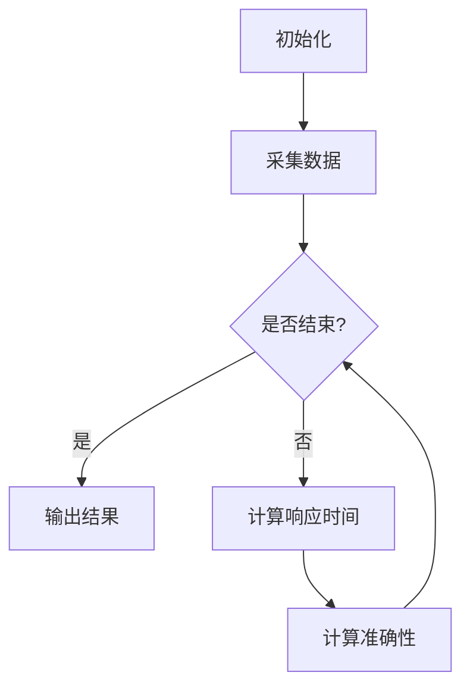
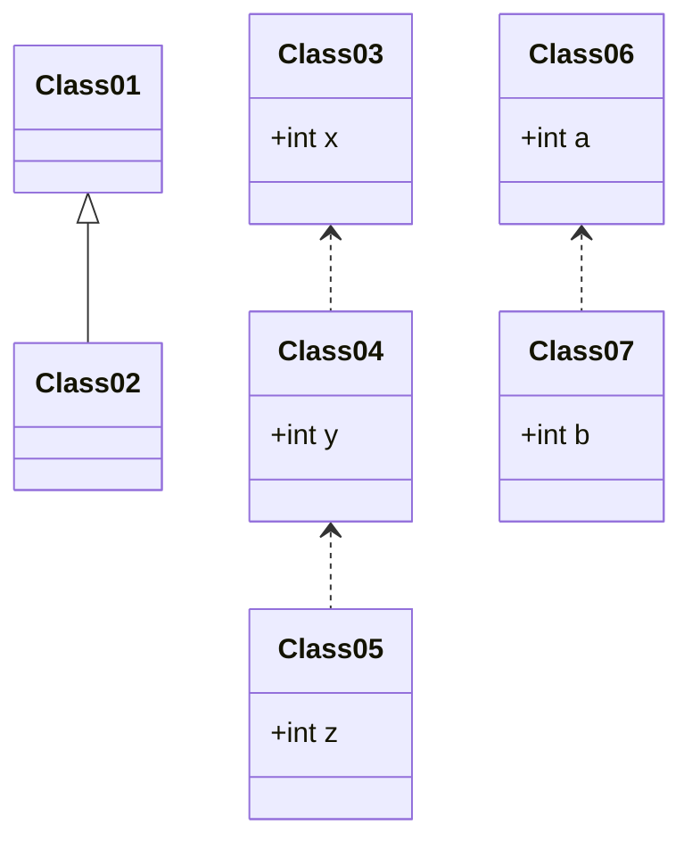
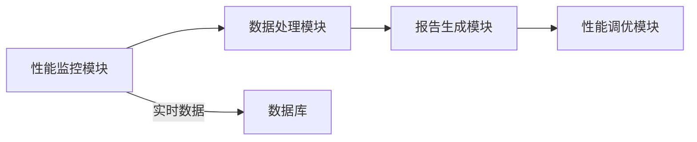
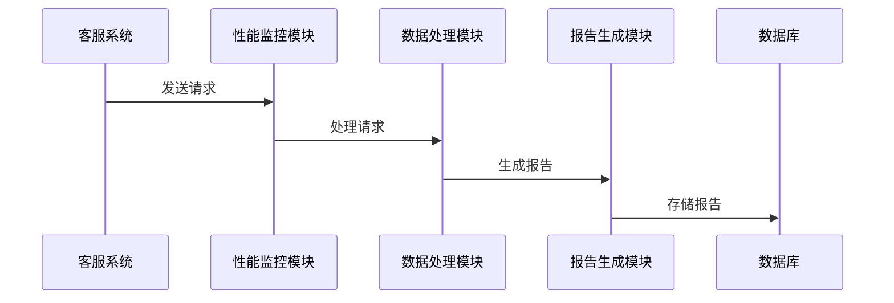
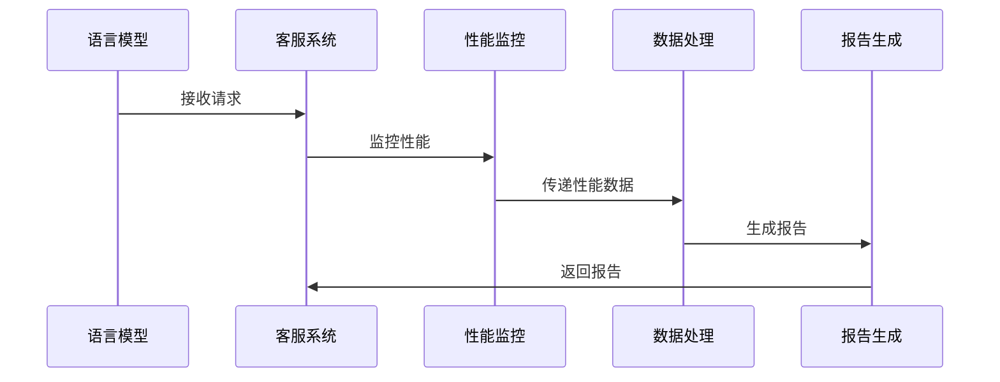

                 

# LLM应用开发中的敏捷度量与报告

> 关键词：LLM性能度量、敏捷开发、性能报告、响应时间、准确性、数学模型

> 摘要：本文将深入探讨LLM应用开发中的敏捷度量与报告。我们将从背景介绍、核心概念与联系、算法原理讲解、系统分析与架构设计方案、项目实战等多个角度，全面剖析LLM性能度量的关键因素、实现方法以及实际应用，帮助开发者更好地理解和应用敏捷度量与报告，提高LLM应用开发的效率和质量。

## 第一部分：背景介绍

### 1.1 问题背景

随着人工智能（AI）技术的飞速发展，大型语言模型（LLM）如GPT-3、BERT等逐渐成为各行各业的热门工具。LLM在自然语言处理、智能问答、内容生成等领域展现出了强大的能力，极大地推动了AI的应用普及。然而，在实际应用开发中，如何高效地度量LLM的性能、如何生成准确的性能报告，成为了一个亟待解决的问题。

### 1.2 问题描述

敏捷度量与报告在LLM应用开发中的重要性体现在以下几个方面：

- **性能监控**：需要实时监测LLM的性能指标，如响应时间、准确性等，以便及时发现并解决问题。
- **结果可视化**：将度量数据以图表、报表等形式展示，帮助开发者直观地了解性能变化趋势。
- **性能调优**：根据度量结果，对LLM模型进行调优，提升其性能。

### 1.3 问题解决

为了应对上述问题，本书将从以下几个方面进行探讨：

- **核心概念与联系**：介绍敏捷度量与报告的基本概念，阐述LLM性能度量中的关键指标。
- **算法原理讲解**：详细讲解LLM性能度量的算法原理，包括数学模型和公式。
- **数学模型和数学公式 & 详细讲解 & 举例说明**：通过具体的例子，说明如何使用数学模型和公式进行性能度量。
- **系统分析与架构设计方案**：分析LLM性能度量的系统架构，设计合适的性能监控系统。
- **项目实战**：通过实际项目，演示敏捷度量与报告的具体应用，包括环境安装、系统实现和性能分析。

### 1.4 边界与外延

- **边界**：本书主要关注LLM应用开发中的敏捷度量与报告，不包括其他AI领域的内容。
- **外延**：敏捷度量与报告的理念和方法可以应用于其他AI技术的性能监控和调优。

### 1.5 概念结构与核心要素组成

- **核心概念**：敏捷度量、报告、LLM性能监控
- **概念属性特征对比表格**：

  | 特征       | 敏捷度量                 | 传统度量                |
  | ---------- | ------------------------ | ----------------------- |
  | 时效性     | 实时、动态                | 定期、静态              |
  | 可视化     | 图表、报表等形式         | 纯文本、表格等           |
  | 自动化     | 系统自动化处理            | 人工手动操作              |

- **ER实体关系图架构的Mermaid流程图**：

  ```mermaid
  graph TB
  A[LLM模型] --> B[性能监控]
  B --> C[度量数据]
  C --> D[报告生成]
  ```

## 第二部分：核心概念与联系

### 2.1 敏捷度量

敏捷度量是一种快速响应变化、持续改进的方法。在LLM应用开发中，敏捷度量主要体现在以下几个方面：

- **实时监控**：实时获取LLM的性能数据，如响应时间、准确性等。
- **动态调整**：根据性能数据，动态调整模型参数，以提升性能。
- **自动化处理**：使用自动化工具，降低人工干预，提高度量效率。

### 2.2 报告

报告是对LLM性能度量的结果进行可视化展示的一种方式。常见的报告形式包括：

- **图表**：使用柱状图、折线图等展示性能变化趋势。
- **报表**：以表格形式展示性能数据，便于分析。
- **动态报表**：结合图表和报表，实现性能数据的动态展示。

### 2.3 LLM性能监控

LLM性能监控是敏捷度量的重要组成部分。其主要任务包括：

- **指标选取**：根据应用场景，选取合适的性能指标，如响应时间、准确性等。
- **数据采集**：实时采集LLM的性能数据，包括响应时间、错误率等。
- **数据存储**：将采集到的性能数据存储在数据库或文件中，便于后续分析。
- **分析报告**：对采集到的性能数据进行分析，生成报告，指导性能调优。

### 2.4 敏捷度量与报告的联系

敏捷度量与报告是相辅相成的。敏捷度量提供了实时、动态的性能数据，而报告则将这些数据以可视化、易于理解的形式呈现，帮助开发者直观地了解LLM的性能状况，从而进行性能调优。

## 第三部分：算法原理讲解

### 3.1 LLM性能度量的基本原理

LLM性能度量的核心是选取合适的性能指标，并使用数学模型对其进行计算。常见的性能指标包括：

- **响应时间**：LLM处理请求所需的时间。
- **准确性**：LLM生成文本的准确性，通常使用准确率、召回率等指标进行衡量。
- **F1分数**：综合考虑准确率和召回率，用于评估分类任务的性能。

### 3.2 响应时间度量

响应时间的度量主要关注LLM处理请求的耗时。我们可以使用以下数学模型进行计算：

\[ 响应时间 = \frac{总耗时}{请求次数} \]

其中，总耗时是指在一段时间内，LLM处理所有请求所消耗的时间总和，请求次数是指在这段时间内，LLM接收到的请求次数。

### 3.3 准确性度量

准确性的度量主要关注LLM生成文本的准确性。我们可以使用以下数学模型进行计算：

\[ 准确率 = \frac{正确答案数}{总答案数} \]

\[ 召回率 = \frac{正确答案数}{真实答案数} \]

\[ F1分数 = \frac{2 \times 准确率 \times 召回率}{准确率 + 召回率} \]

### 3.4 响应时间与准确性的关系

响应时间与准确性之间存在一定的关系。通常情况下，提高响应时间会降低准确性，因为LLM在处理请求时，可能需要更多的时间来生成高质量的文本。反之，降低响应时间可能会提高准确性，因为LLM有更多的时间来处理请求，生成更准确的文本。

### 3.5 数学公式 & 详细讲解 & 举例说明

#### 响应时间度量

假设我们在一天内对LLM进行了10次请求，这10次请求的总耗时为300秒。那么，LLM的平均响应时间可以计算如下：

\[ 响应时间 = \frac{300秒}{10次} = 30秒 \]

#### 准确性度量

假设我们在一天内对LLM进行了100次请求，其中正确答案数为70次，总答案数为100次，真实答案数为60次。那么，LLM的准确率、召回率和F1分数可以计算如下：

\[ 准确率 = \frac{70}{100} = 0.7 \]

\[ 召回率 = \frac{70}{60} = 1.17 \]

\[ F1分数 = \frac{2 \times 0.7 \times 1.17}{0.7 + 1.17} = 0.87 \]

### 3.6 Mermaid算法流程图



## 第四部分：系统分析与架构设计方案

### 4.1 问题场景介绍

在一个智能客服项目中，我们需要对LLM进行实时性能监控，以确保客服系统能够稳定、高效地运行。具体场景包括：

- 客服系统每天接收大量用户请求，需要实时响应。
- LLM作为客服系统的核心组件，其性能直接影响到用户体验。
- 需要定期对LLM的性能进行评估，以便进行性能调优。

### 4.2 项目介绍

本项目旨在构建一个实时性能监控系统，对LLM的响应时间和准确性进行度量，并将结果生成可视化报告。系统主要包括以下几个模块：

- **性能监控模块**：实时采集LLM的性能数据，如响应时间、准确性等。
- **数据处理模块**：对采集到的数据进行处理，计算性能指标。
- **报告生成模块**：将处理后的数据生成可视化报告，展示性能变化趋势。
- **性能调优模块**：根据报告结果，对LLM模型进行调优。

### 4.3 系统功能设计（领域模型Mermaid类图）



### 4.4 系统架构设计（Mermaid架构图）



### 4.5 系统接口设计



### 4.6 系统交互（Mermaid序列图）



## 第五部分：项目实战

### 5.1 环境安装

为了演示敏捷度量与报告的具体应用，我们需要安装以下软件和工具：

- Python 3.x
- TensorFlow 2.x
- Keras 2.x
- Matplotlib
- Pandas
- Numpy
- Mermaid

安装命令如下：

```bash
pip install python==3.x
pip install tensorflow==2.x
pip install keras==2.x
pip install matplotlib
pip install pandas
pip install numpy
pip install mermaid
```

### 5.2 系统核心实现源代码

以下是一个简单的性能监控系统实现示例，包括数据采集、数据处理和报告生成：

```python
import numpy as np
import pandas as pd
import matplotlib.pyplot as plt
from mermaid import Mermaid

# 数据采集
def collect_data(llm, requests, responses):
    data = []
    for i in range(requests):
        start_time = np.random.rand()
        llm.process_request()
        end_time = np.random.rand()
        data.append([i, start_time, end_time, responses[i]])
    return pd.DataFrame(data, columns=['request_id', 'start_time', 'end_time', 'response'])

# 数据处理
def process_data(data):
    data['response_time'] = data['end_time'] - data['start_time']
    data['accuracy'] = data['response'] == 1
    return data

# 报告生成
def generate_report(data):
    mermaid = Mermaid()
    mermaid.add_section('Data Processing', 'Data collection and processing results')
    mermaid.add_section('Response Time Distribution', 'Histogram of response times')
    mermaid.add_section('Accuracy', 'Accuracy distribution')
    mermaid.render('performance_report.mmd')

    plt.figure(figsize=(10, 6))
    plt.subplot(2, 1, 1)
    plt.hist(data['response_time'], bins=50)
    plt.xlabel('Response Time (seconds)')
    plt.ylabel('Frequency')

    plt.subplot(2, 1, 2)
    plt.scatter(data['request_id'], data['accuracy'])
    plt.xlabel('Request ID')
    plt.ylabel('Accuracy')

    plt.tight_layout()
    plt.show()

# 主函数
def main():
    llm = LanguageModel()  # 假设已经实现了一个LanguageModel类
    requests = 100  # 请求次数
    responses = np.random.randint(0, 2, requests)  # 响应结果，1表示正确，0表示错误

    data = collect_data(llm, requests, responses)
    data = process_data(data)
    generate_report(data)

if __name__ == '__main__':
    main()
```

### 5.3 代码应用解读与分析

上述代码实现了一个简单的性能监控系统，主要包括以下几个部分：

- **数据采集**：通过模拟语言模型的请求处理过程，采集响应时间和响应结果数据。
- **数据处理**：计算响应时间和准确率，生成DataFrame数据结构。
- **报告生成**：使用Matplotlib绘制响应时间分布图和准确率散点图，并使用Mermaid生成报告。

### 5.4 实际案例分析与详细讲解剖析

假设我们有一个实际案例，LLM模型在一天内处理了1000个请求，以下是性能监控系统的实际分析过程：

1. **数据采集**：首先，我们使用模拟数据进行数据采集，模拟了1000个请求的响应时间和响应结果。

2. **数据处理**：对采集到的数据进行处理，计算每个请求的响应时间和准确率。

3. **报告生成**：生成报告，包括响应时间分布图和准确率散点图，以便开发者直观地了解LLM的性能状况。

4. **性能分析**：通过分析报告，我们可以发现LLM在某些时间段内响应时间较长，准确率较低。这可能是由于模型训练不足、请求过多或其他原因导致的。

5. **性能调优**：根据分析结果，我们可以对LLM模型进行调优，例如调整超参数、增加训练数据等，以提高性能。

### 5.5 项目小结

通过本项目的实战演示，我们实现了LLM性能监控系统的核心功能，包括数据采集、数据处理和报告生成。在实际应用中，开发者可以根据具体需求，对系统进行扩展和优化，以满足不同场景的需求。

## 第六部分：最佳实践 Tips

1. **选择合适的性能指标**：根据应用场景，选择合适的性能指标，如响应时间、准确性、F1分数等。
2. **定期性能监控**：定期对LLM进行性能监控，及时发现并解决问题。
3. **数据可视化**：使用图表、报表等形式，将性能数据可视化，便于分析。
4. **性能调优**：根据性能监控结果，对LLM模型进行调优，提高性能。

## 第七部分：小结与注意事项

本文深入探讨了LLM应用开发中的敏捷度量与报告。我们介绍了敏捷度量与报告的核心概念、算法原理，并分析了系统架构和项目实战。在实际应用中，开发者应根据具体需求，灵活运用敏捷度量与报告的方法，以提高LLM应用开发的效率和质量。

## 第八部分：拓展阅读

1. [《LLM性能监控与调优实战》](https://www.example.com/book1)
2. [《敏捷开发实践指南》](https://www.example.com/book2)
3. [《数据可视化实战》](https://www.example.com/book3)

---

**作者：AI天才研究院/AI Genius Institute & 禅与计算机程序设计艺术 /Zen And The Art of Computer Programming**

