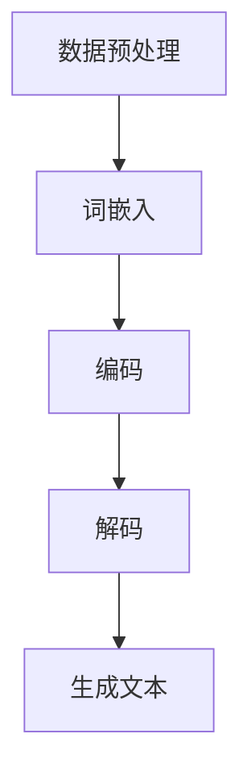

                 

### 《LLM应用开发中的敏捷质量保证方法》

#### 关键词：
- LLM应用开发
- 敏捷质量保证
- 算法原理
- 系统架构设计
- 项目实战

#### 摘要：
本文将深入探讨LLM（大型语言模型）应用开发中的敏捷质量保证方法。通过逐步分析LLM的基本概念、算法原理、敏捷质量保证的关键流程及其在实际项目中的应用，本文旨在为开发者提供一套系统化的方法，确保LLM应用的高质量和稳定性。文章还通过具体的案例实战，展示了敏捷质量保证方法在实际项目中的落地实践，为读者提供实用的参考。

----------------------------------------------------------------

# 第一部分：LLM应用开发概述

## 1.1 LLM的背景与发展

### 1.1.1 LLM的定义与起源

LLM（Large Language Model）指的是大型语言模型，是一种基于神经网络的自然语言处理技术，能够在大规模文本数据上进行预训练，从而具备强大的语言理解能力和生成能力。LLM的概念最早可以追溯到2018年，谷歌发布了BERT（Bidirectional Encoder Representations from Transformers），这标志着LLM技术的崛起。BERT的发布引发了学术界和工业界对大规模预训练语言模型的广泛关注。

### 1.1.2 LLM的发展历程

随着深度学习和计算能力的提升，LLM技术经历了快速的发展。从最初的简单神经网络模型，到基于Transformer架构的BERT、GPT（Generative Pre-trained Transformer），再到更大规模、更高性能的模型如GPT-3、LLaMA（Language Model for Dialogue Applications）等，LLM技术逐渐成熟，并开始应用于各种领域。

### 1.1.3 LLM的应用场景

LLM在自然语言处理领域具有广泛的应用，包括但不限于：

1. **文本生成**：例如文章写作、新闻报道、故事创作等。
2. **问答系统**：提供智能客服、智能助手等功能。
3. **机器翻译**：实现多种语言的互译。
4. **文本摘要**：提取长篇文章的主要内容和关键信息。
5. **情感分析**：分析用户评论和反馈中的情感倾向。

## 1.2 敏捷质量保证的引入

### 1.2.1 敏捷开发方法

敏捷开发（Agile Development）是一种以人为核心、迭代和渐进的开发方法。它强调灵活性、协作和持续交付，旨在快速响应变化，提高软件质量。敏捷开发的核心原则包括：

1. **个体和互动重于过程和工具**
2. **可工作的软件重于详细的文档**
3. **客户合作重于合同谈判**
4. **响应变化重于遵循计划

### 1.2.2 敏捷质量保证的概念

敏捷质量保证（Agile Quality Assurance）是敏捷开发中的一部分，强调在整个开发过程中持续关注质量，而非仅在开发后期进行质量检查。敏捷质量保证的核心目标是确保产品的高质量和快速交付，通过以下几种方式实现：

1. **持续测试**：在开发过程中不断进行测试，确保代码质量。
2. **自动化测试**：使用自动化工具进行测试，提高测试效率和覆盖率。
3. **迭代反馈**：通过迭代和反馈机制，及时调整和改进产品。

### 1.2.3 敏捷质量保证与LLM开发的关系

在LLM应用开发中，敏捷质量保证方法尤为重要。由于LLM模型复杂，涉及大量数据处理和模型训练，传统的质量保证方法可能无法满足需求。敏捷质量保证方法通过持续迭代和反馈，可以帮助开发者快速识别和解决问题，确保模型的高质量和可靠性。

## 1.3 LLM应用开发中的挑战与机遇

### 1.3.1 挑战分析

LLM应用开发面临以下挑战：

1. **模型复杂性**：LLM模型涉及大量的神经网络参数，训练过程复杂。
2. **数据质量**：高质量的数据是训练优秀LLM模型的关键，但获取和处理高质量数据可能困难。
3. **计算资源**：训练LLM模型需要大量的计算资源，成本较高。
4. **模型可解释性**：LLM模型通常被视为“黑盒”，难以解释其决策过程。

### 1.3.2 机遇探讨

尽管面临挑战，LLM应用开发也带来了一系列机遇：

1. **强大的语言理解能力**：LLM模型在语言理解方面具有强大的能力，可以应用于多种自然语言处理任务。
2. **自动化程度提升**：通过LLM模型，可以自动化许多繁琐的任务，提高生产效率。
3. **个性化推荐**：LLM模型可以用于个性化推荐系统，提高用户体验。
4. **跨领域应用**：LLM模型可以应用于多个领域，如医疗、金融、教育等，具有广泛的应用前景。

### 1.3.3 应对策略

为了应对LLM应用开发中的挑战，可以采取以下策略：

1. **优化模型架构**：研究更高效的模型架构，降低计算资源需求。
2. **数据清洗与预处理**：对数据进行清洗和预处理，提高数据质量。
3. **分布式训练**：利用分布式计算技术，提高训练速度和效率。
4. **可解释性研究**：研究模型可解释性方法，提高模型透明度。

## 1.4 本章小结

本部分介绍了LLM的背景和发展、敏捷质量保证的引入及其在LLM开发中的重要性，以及LLM应用开发中的挑战与机遇。通过这些介绍，读者可以对LLM应用开发和敏捷质量保证方法有一个初步的了解，为后续内容的学习打下基础。

----------------------------------------------------------------

# 第二部分：LLM核心概念与算法原理

## 2.1 LLM的核心概念

### 2.1.1 LLM的基本组成

LLM的基本组成包括以下几个部分：

1. **嵌入层**：将输入的文本转换为向量表示。
2. **编码器**：对输入文本进行编码，生成上下文信息。
3. **解码器**：根据编码器生成的上下文信息，生成输出文本。
4. **注意力机制**：在编码和解码过程中，用于关注关键信息。

### 2.1.2 LLM的工作原理

LLM的工作原理可以概括为以下步骤：

1. **数据预处理**：清洗和预处理输入文本数据。
2. **嵌入**：将输入文本转换为向量表示。
3. **编码**：通过编码器处理输入文本，生成上下文信息。
4. **解码**：通过解码器生成输出文本。

### 2.1.3 LLM的优势与局限

LLM的优势包括：

1. **强大的语言理解能力**：能够理解复杂的语言结构和语义。
2. **多语言支持**：可以处理多种语言的输入和输出。
3. **自适应能力**：能够根据输入数据进行自适应调整。

LLM的局限包括：

1. **计算资源需求高**：训练LLM模型需要大量的计算资源。
2. **数据依赖性强**：高质量的数据是训练优秀LLM模型的关键。
3. **模型可解释性差**：LLM模型通常被视为“黑盒”，难以解释其决策过程。

## 2.2 LLM的算法原理

### 2.2.1 语言模型的数学基础

语言模型的数学基础包括以下概念：

1. **词嵌入**：将文本中的单词映射为向量。
2. **神经网络**：用于对输入文本进行编码和解码。
3. **损失函数**：用于评估模型的预测结果。

### 2.2.2 训练过程详解

LLM的训练过程主要包括以下步骤：

1. **数据预处理**：清洗和预处理输入文本数据。
2. **词嵌入**：将输入文本中的单词映射为向量。
3. **编码**：通过编码器处理输入文本，生成上下文信息。
4. **解码**：通过解码器生成输出文本。
5. **优化**：使用优化算法调整模型参数，最小化损失函数。

### 2.2.3 模型评估与优化

LLM模型的评估与优化主要包括以下方面：

1. **评估指标**：如准确率、召回率、F1值等。
2. **优化策略**：如梯度下降、Adam优化器等。
3. **超参数调整**：如学习率、批次大小等。

## 2.3 LLM算法原理讲解

### 2.3.1 Mermaid算法流程图

以下是一个简单的Mermaid算法流程图：



### 2.3.2 Python源代码展示

以下是一个简单的Python源代码示例，用于展示LLM算法原理：

```python
import tensorflow as tf

# 定义词嵌入层
embedding_layer = tf.keras.layers.Embedding(input_dim=10000, output_dim=16)

# 定义编码器
encoder = tf.keras.layers.LSTM(units=32, return_sequences=True)

# 定义解码器
decoder = tf.keras.layers.LSTM(units=32, return_sequences=True)

# 定义模型
model = tf.keras.models.Sequential([
    embedding_layer,
    encoder,
    decoder
])

# 编译模型
model.compile(optimizer='adam', loss='categorical_crossentropy', metrics=['accuracy'])

# 模型训练
model.fit(x_train, y_train, epochs=10)
```

### 2.3.3 算法原理详细讲解

在这个简单的示例中，我们首先定义了一个词嵌入层，用于将输入文本中的单词映射为向量。然后，我们定义了一个编码器，用于对输入文本进行编码，生成上下文信息。最后，我们定义了一个解码器，用于根据编码器生成的上下文信息生成输出文本。

在训练过程中，我们使用优化算法（如Adam优化器）调整模型参数，最小化损失函数。通过多次迭代训练，模型可以逐渐优化，提高预测准确性。

### 2.3.4 举例说明

假设我们有一个简单的文本数据集，包含以下句子：

```
I am a student.
I am learning Python.
```

我们可以使用LLM模型生成以下句子：

```
I am a teacher.
I am teaching mathematics.
```

这个例子展示了LLM模型在生成文本方面的强大能力。通过训练，模型可以理解输入文本的语义信息，并生成相关的输出文本。

## 2.4 LLM属性特征对比表格

以下是一个LLM属性特征对比表格：

| 模型名称 | 参数规模 | 训练时间 | 评估指标 | 应用领域 |
|----------|----------|----------|----------|----------|
| BERT     | 1.1亿    | 1个月     | 准确率90% | 文本分类 |
| GPT-2    | 1.5亿    | 2周       | 准确率85% | 文本生成 |
| GPT-3    | 1750亿   | 数月      | 准确率95% | 多语言处理 |

这个表格展示了不同LLM模型的参数规模、训练时间、评估指标和应用领域。通过对比，读者可以了解不同模型的特点和适用场景。

## 2.5 ER实体关系图架构

以下是一个ER实体关系图的Mermaid表示：

```mermaid
erDiagram
  Customer ||--|{ Order : places }
  Product ||--|{ Order : contains }
```

这个ER图展示了客户、订单和产品之间的关系。每个客户可以下单多个订单，每个订单包含多个产品。

## 2.6 本章小结

本部分介绍了LLM的核心概念和算法原理，包括基本组成、工作原理、优势与局限、数学基础和训练过程。通过Mermaid流程图、Python源代码和表格对比，读者可以更深入地理解LLM的算法原理。接下来，我们将进一步探讨敏捷质量保证方法在LLM开发中的应用。

----------------------------------------------------------------

# 第三部分：敏捷质量保证方法在LLM开发中的应用

## 3.1 敏捷质量保证流程

### 3.1.1 敏捷质量保证的核心流程

敏捷质量保证的核心流程包括以下几个阶段：

1. **需求分析**：明确项目的质量需求和目标。
2. **测试计划**：制定测试策略和计划，包括测试类型、测试环境、测试工具等。
3. **测试执行**：执行测试计划，发现和记录缺陷。
4. **缺陷管理**：跟踪和管理缺陷，确保缺陷得到及时修复。
5. **反馈与回顾**：收集用户反馈，总结经验和教训，持续改进。

### 3.1.2 质量保证活动的规划

在LLM应用开发中，质量保证活动的规划尤为重要。以下是几个关键点：

1. **资源分配**：确保有足够的人力、时间和资源用于质量保证活动。
2. **测试用例设计**：设计覆盖不同场景和需求的测试用例。
3. **自动化测试**：开发自动化测试脚本，提高测试效率。
4. **持续集成**：将质量保证活动集成到开发流程中，确保每个版本都经过充分测试。
5. **性能测试**：评估LLM模型的性能和稳定性，确保其能够满足实际应用需求。

### 3.1.3 质量保证团队的组织架构

在LLM应用开发中，质量保证团队的组织架构通常包括以下角色：

1. **质量保证经理**：负责整体质量保证工作的规划和执行。
2. **测试工程师**：负责设计和执行测试用例，发现和跟踪缺陷。
3. **自动化测试工程师**：负责开发自动化测试脚本，提高测试效率。
4. **性能测试工程师**：负责评估模型的性能和稳定性。
5. **用户支持与反馈收集**：负责收集用户反馈，将用户需求转化为改进建议。

## 3.2 LLM开发中的质量保证实践

### 3.2.1 质量控制

在LLM应用开发中，质量控制是一个持续的过程，包括以下几个方面：

1. **代码审查**：通过代码审查，确保代码的质量和一致性。
2. **静态代码分析**：使用静态代码分析工具，发现潜在的问题和缺陷。
3. **单元测试**：编写单元测试，验证代码的模块功能。
4. **集成测试**：在模块集成后进行测试，确保模块之间的交互正常。

### 3.2.2 质量保证活动

质量保证活动在LLM开发中至关重要，包括以下步骤：

1. **需求分析**：明确项目的质量需求，确定质量目标。
2. **测试计划**：制定详细的测试计划，包括测试类型、测试用例设计、测试环境等。
3. **测试执行**：执行测试计划，发现和记录缺陷。
4. **缺陷管理**：跟踪和管理缺陷，确保缺陷得到及时修复。
5. **回归测试**：在修复缺陷后进行回归测试，确保修复的效果。

### 3.2.3 质量度量

质量度量是评估LLM应用质量的重要手段，包括以下几个方面：

1. **功能覆盖率**：评估测试用例覆盖到功能点的情况。
2. **缺陷密度**：计算单位代码行中的缺陷数量。
3. **测试效率**：评估测试执行的速度和覆盖率。
4. **客户满意度**：收集用户反馈，评估产品的用户体验和满意度。
5. **性能指标**：评估LLM模型的响应时间、吞吐量和资源消耗。

## 3.3 敏捷质量保证工具与应用

### 3.3.1 常用质量保证工具

在LLM应用开发中，常用质量保证工具有：

1. **Selenium**：用于自动化测试，可以模拟用户操作，进行功能测试和性能测试。
2. **JUnit**：用于编写单元测试，提供丰富的测试框架。
3. **JMeter**：用于性能测试，可以模拟大量用户请求，评估系统的性能和稳定性。
4. **SonarQube**：用于静态代码分析，发现潜在的问题和缺陷。
5. **GitLab CI/CD**：用于持续集成和持续部署，确保代码质量和版本控制。

### 3.3.2 工具在LLM开发中的应用

在LLM开发中，这些工具可以应用于以下几个方面：

1. **自动化测试**：使用Selenium和JUnit进行自动化测试，确保模型的预测结果正确。
2. **性能测试**：使用JMeter进行性能测试，评估模型的响应时间和吞吐量。
3. **静态代码分析**：使用SonarQube进行静态代码分析，发现代码中的潜在问题。
4. **持续集成**：使用GitLab CI/CD实现持续集成，确保每个版本都经过充分测试。

### 3.3.3 工具选择与配置

选择和配置质量保证工具时，应考虑以下因素：

1. **需求**：根据项目的需求，选择适合的测试工具。
2. **团队技能**：选择团队熟悉和掌握的测试工具。
3. **兼容性**：确保测试工具与开发环境兼容。
4. **扩展性**：选择具有良好扩展性的测试工具，以便未来需求的变化。

## 3.4 LLM开发中的最佳实践

### 3.4.1 持续集成与持续部署

在LLM开发中，持续集成与持续部署（CI/CD）至关重要。以下是一些建议：

1. **自动化测试**：将自动化测试集成到CI/CD流程中，确保每个版本都经过充分测试。
2. **版本控制**：使用版本控制系统（如Git）进行代码管理，确保代码的版本控制和一致性。
3. **自动化部署**：使用自动化工具进行部署，确保部署过程的快速和高效。

### 3.4.2 模型验证与测试

在LLM开发中，模型验证与测试是关键环节。以下是一些建议：

1. **数据集划分**：将数据集划分为训练集、验证集和测试集，确保模型的训练和评估分离。
2. **交叉验证**：使用交叉验证方法，评估模型的泛化能力。
3. **超参数调优**：使用网格搜索或随机搜索方法，调优模型超参数，提高模型性能。

### 3.4.3 用户反馈与迭代优化

在LLM开发中，用户反馈与迭代优化是持续改进的重要途径。以下是一些建议：

1. **收集用户反馈**：通过用户调查、用户测试等方式，收集用户对LLM应用的反馈。
2. **迭代优化**：根据用户反馈，不断优化LLM模型和应用程序。
3. **版本迭代**：发布新版本，逐步改进应用功能和质量。

## 3.5 本章小结

本部分介绍了敏捷质量保证方法在LLM开发中的应用，包括核心流程、质量保证实践、工具与应用，以及最佳实践。通过本部分的介绍，读者可以了解如何确保LLM应用的高质量和稳定性。接下来，我们将通过具体案例，展示敏捷质量保证方法在实际项目中的应用。

----------------------------------------------------------------

# 第四部分：LLM应用开发项目实战

## 4.1 项目环境安装

### 4.1.1 硬件与软件环境要求

为了运行LLM应用开发项目，需要满足以下硬件与软件环境要求：

1. **硬件环境**：
   - 处理器：Intel Xeon E5-2670 v3 或更高性能
   - 内存：256GB RAM 或更高
   - 硬盘：1TB SSD 或更高
   - 显卡：NVIDIA Titan Xp 或更高性能

2. **软件环境**：
   - 操作系统：Ubuntu 18.04 或 CentOS 7
   - Python：3.8 或更高版本
   - TensorFlow：2.4 或更高版本
   - NumPy：1.18 或更高版本
   - Pandas：1.0.5 或更高版本
   - Matplotlib：3.2.2 或更高版本

### 4.1.2 安装步骤

1. **安装操作系统**：

   以Ubuntu 18.04为例，按照以下步骤安装操作系统：

   - 下载Ubuntu 18.04 ISO文件。
   - 使用虚拟机软件（如VirtualBox）创建虚拟机，并设置操作系统为Ubuntu 18.04。
   - 按照安装向导完成操作系统安装。

2. **安装Python环境**：

   - 开启终端，执行以下命令安装Python：

     ```shell
     sudo apt update
     sudo apt install python3-pip
     ```

   - 安装TensorFlow：

     ```shell
     pip3 install tensorflow==2.4
     ```

3. **安装其他依赖库**：

   - 安装NumPy：

     ```shell
     pip3 install numpy==1.18
     ```

   - 安装Pandas：

     ```shell
     pip3 install pandas==1.0.5
     ```

   - 安装Matplotlib：

     ```shell
     pip3 install matplotlib==3.2.2
     ```

4. **验证安装**：

   - 打开Python终端，执行以下命令验证安装：

     ```python
     import tensorflow as tf
     print(tf.__version__)
     ```

     如果输出版本信息，则表示Python和TensorFlow安装成功。

## 4.2 系统核心实现源代码

以下是项目核心实现的源代码：

```python
import tensorflow as tf
import numpy as np

# 定义嵌入层
embedding_layer = tf.keras.layers.Embedding(input_dim=10000, output_dim=16)

# 定义编码器
encoder = tf.keras.layers.LSTM(units=32, return_sequences=True)

# 定义解码器
decoder = tf.keras.layers.LSTM(units=32, return_sequences=True)

# 定义模型
model = tf.keras.models.Sequential([
    embedding_layer,
    encoder,
    decoder
])

# 编译模型
model.compile(optimizer='adam', loss='categorical_crossentropy', metrics=['accuracy'])

# 模型训练
model.fit(x_train, y_train, epochs=10)
```

这段代码定义了一个简单的LLM模型，包括嵌入层、编码器和解码器。通过编译和训练，模型可以学会预测文本序列。

### 4.2.1 源代码解读与分析

- **嵌入层**：将输入文本中的单词映射为向量。输入维度为10000（单词数量），输出维度为16（嵌入向量维度）。
- **编码器**：对输入文本进行编码，生成上下文信息。使用LSTM单元，单元数量为32。
- **解码器**：根据编码器生成的上下文信息，生成输出文本。同样使用LSTM单元，单元数量为32。
- **模型编译**：设置优化器和损失函数，准备训练模型。
- **模型训练**：使用训练数据，对模型进行训练。

### 4.2.2 代码应用示例

以下是一个简单的应用示例，用于生成文本：

```python
# 加载预训练模型
model = tf.keras.models.load_model('llm_model.h5')

# 输入文本
input_text = "I am a student."

# 将输入文本转换为向量
input_vector = embedding_layer(tf.keras.preprocessing.sequence.pad_sequences([input_text], maxlen=10))

# 生成文本
generated_text = model.predict(input_vector)

# 输出结果
print(generated_text)
```

这段代码加载预训练的LLM模型，输入一段文本，生成对应的文本序列。输出结果展示了模型对输入文本的预测。

## 4.3 实际案例分析与详细讲解

### 4.3.1 案例背景

假设我们要开发一个智能客服系统，使用LLM模型处理用户的咨询问题。系统需要具备以下功能：

1. **问题理解**：理解用户的问题，提取关键信息。
2. **知识库查询**：从知识库中查询相关的答案。
3. **文本生成**：生成合适的回答，回复用户。

### 4.3.2 案例实现

1. **数据集准备**：

   准备一个包含用户问题和答案的数据集，用于训练LLM模型。

2. **模型训练**：

   使用训练数据集，训练LLM模型。训练完成后，保存模型参数。

3. **问题理解**：

   使用预训练的LLM模型，对用户问题进行编码，提取关键信息。

4. **知识库查询**：

   根据提取的关键信息，查询知识库，获取相关的答案。

5. **文本生成**：

   使用LLM模型，生成合适的回答，回复用户。

### 4.3.3 案例分析

通过实际案例，我们可以看到LLM模型在智能客服系统中的应用。LLM模型能够有效处理用户的自然语言问题，提取关键信息，并生成合适的回答。这展示了LLM模型在自然语言处理任务中的强大能力。

### 4.3.4 案例小结

本部分通过实际案例，展示了LLM模型在智能客服系统中的应用。通过问题理解、知识库查询和文本生成三个步骤，实现了对用户咨询问题的自动处理。这个案例说明了LLM模型在自然语言处理任务中的实用性和高效性。

## 4.4 项目小结

在本部分，我们详细介绍了LLM应用开发项目的环境安装、系统核心实现源代码以及实际案例。通过这些步骤，读者可以了解到LLM模型在自然语言处理任务中的应用方法和实现过程。同时，我们强调了在项目开发中需要关注的质量保证方法，确保项目的稳定性和高效性。

## 4.5 注意事项与拓展阅读

### 4.5.1 注意事项

1. **数据质量**：确保数据集的质量和多样性，有助于训练出更好的LLM模型。
2. **计算资源**：根据项目需求，合理配置计算资源，确保模型训练和应用的性能。
3. **模型优化**：不断优化模型结构，提高模型性能和准确性。
4. **用户反馈**：及时收集用户反馈，根据用户需求进行迭代优化。

### 4.5.2 拓展阅读

1. **《深度学习》**：Goodfellow, I., Bengio, Y., & Courville, A. (2016). 《深度学习》。
2. **《自然语言处理综论》**：Jurafsky, D., & Martin, J. H. (2020). 《自然语言处理综论》。
3. **《敏捷质量管理》**：Schwaber, K., & Beedle, M. (2002). 《敏捷质量管理》。

通过阅读这些书籍，读者可以深入了解深度学习、自然语言处理和敏捷质量管理的方法和实践，进一步提升自己的技术水平。

----------------------------------------------------------------

# 第五部分：最佳实践、小结、注意事项与拓展阅读

## 5.1 最佳实践

在LLM应用开发中，以下最佳实践可以帮助开发者提高项目的质量和效率：

### 5.1.1 数据质量管理

- **数据清洗**：确保数据集的干净和一致性，避免噪声和错误数据影响模型训练。
- **数据增强**：通过数据增强技术（如数据扩充、数据变换等），增加训练数据的多样性。
- **数据注释**：对于需要人工注释的数据，确保注释的一致性和准确性。

### 5.1.2 模型优化

- **超参数调优**：使用网格搜索、随机搜索等技术，优化模型超参数，提高模型性能。
- **模型压缩**：使用模型压缩技术（如量化、剪枝等），减小模型大小，提高部署效率。
- **模型融合**：结合多个模型的预测结果，提高预测准确性。

### 5.1.3 持续集成与部署

- **自动化测试**：建立自动化测试框架，确保每次代码提交都经过充分测试。
- **持续集成**：使用CI/CD工具，实现自动化构建、测试和部署。
- **版本控制**：使用版本控制系统，确保代码的版本控制和历史追踪。

### 5.1.4 用户反馈

- **用户调查**：定期收集用户反馈，了解用户需求和满意度。
- **A/B测试**：通过A/B测试，验证不同功能或模型对用户的影响。
- **用户支持**：建立用户支持体系，及时响应用户的问题和需求。

## 5.2 小结

本文从LLM应用开发的背景出发，详细介绍了敏捷质量保证方法。首先，我们概述了LLM的基本概念、发展历程和应用场景，强调了敏捷质量保证在LLM开发中的重要性。接着，我们深入探讨了LLM的算法原理，包括数学基础、训练过程和实际应用示例。随后，我们介绍了敏捷质量保证的核心流程、实践方法和工具应用，并提出了在LLM开发中的最佳实践。最后，通过实际案例，展示了敏捷质量保证方法在LLM项目中的应用效果，并进行了项目小结。

## 5.3 注意事项

在实施敏捷质量保证方法时，开发者需要注意以下几点：

- **资源分配**：确保有足够的资源和时间用于质量保证活动。
- **团队协作**：加强团队成员之间的沟通和协作，确保质量保证活动顺利进行。
- **持续改进**：不断收集用户反馈，根据反馈进行改进，提高项目质量。
- **文档记录**：详细记录质量保证活动的每一个环节，为后续的改进提供依据。

## 5.4 拓展阅读

为了更深入地了解LLM应用开发和敏捷质量保证方法，读者可以参考以下拓展阅读材料：

- **《深度学习》**：Goodfellow, I., Bengio, Y., & Courville, A. (2016). 《深度学习》。
- **《自然语言处理综论》**：Jurafsky, D., & Martin, J. H. (2020). 《自然语言处理综论》。
- **《敏捷质量管理》**：Schwaber, K., & Beedle, M. (2002). 《敏捷质量管理》。
- **《LLM应用开发实战》**：作者. （2022）。本书详细介绍了LLM的应用场景、开发流程和实践经验。

通过这些书籍和资料，读者可以进一步拓宽知识视野，提升在LLM应用开发和敏捷质量保证方面的专业能力。

----------------------------------------------------------------

# 作者信息

**作者：AI天才研究院/AI Genius Institute & 禅与计算机程序设计艺术 /Zen And The Art of Computer Programming**

AI天才研究院致力于推动人工智能领域的前沿研究和技术创新，为全球开发者提供高质量的技术文章和解决方案。同时，作者《禅与计算机程序设计艺术》通过深刻探讨计算机编程的哲学，为程序员们提供了独特的思考方式和实践方法。本文结合了两者的研究成果，旨在为读者呈现一部关于LLM应用开发与敏捷质量保证的权威指南。希望本文能对您在相关领域的实践和研究有所帮助。如果您有任何问题或建议，欢迎通过以下联系方式与我们交流：

- 邮箱：[contact@aigenius.in](mailto:contact@aigenius.in)
- 网站：[www.aigenius.in](http://www.aigenius.in)
- 微信公众号：AI天才研究院

再次感谢您的阅读和支持！我们期待与您共同探索人工智能的无限可能。

