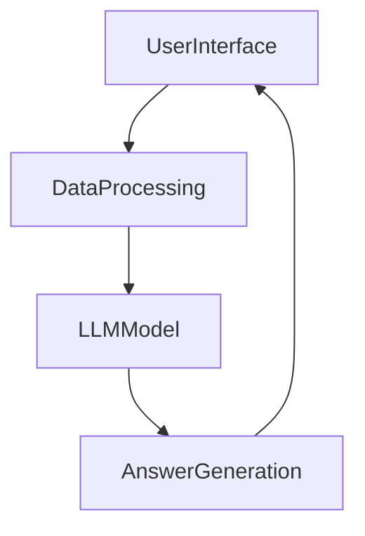
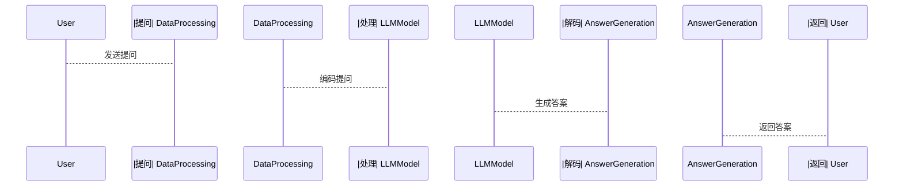

                 


# LLM应用开发中的敏捷资源管理

## 关键词
- 大型语言模型（LLM）
- 敏捷资源管理
- 资源调度
- 算法原理
- 系统架构
- 项目实战

## 摘要
本文深入探讨了大型语言模型（LLM）应用开发中的敏捷资源管理问题。首先，我们介绍了LLM和敏捷资源管理的核心概念，并分析了它们之间的联系。接着，我们详细讲解了LLM和敏捷资源管理的算法原理，包括数学模型和公式。然后，我们提出了一个系统架构设计方案，并使用Mermaid图展示了系统的各个部分。最后，通过一个实际的项目实战，我们展示了如何在LLM应用开发中有效地实施敏捷资源管理。

## 第一部分：背景介绍

### 1.1 问题描述与核心概念

随着大型语言模型的迅速发展，如何在应用开发过程中有效地管理和调度资源成为一个关键问题。大型语言模型（LLM）是一种能够理解和生成自然语言的复杂模型，它们通常需要大量的计算资源和数据支持。传统的资源管理方法往往不够灵活，难以满足LLM应用开发的快速迭代和变化需求。因此，敏捷资源管理方法应运而生，它提供了一种更加灵活和高效的方式来管理资源。

### 1.1.1 问题描述

在LLM应用开发过程中，资源管理面临以下挑战：

- **计算资源不足**：大型语言模型训练需要大量的计算资源，如GPU或TPU，而资源分配不均可能导致训练效率低下。
- **数据依赖**：语言模型训练依赖于大规模的数据集，如何高效地处理和利用这些数据是资源管理的一个重要问题。
- **任务调度**：在多个任务同时进行时，如何合理地分配资源以确保每个任务都能得到足够的支持。

### 1.1.2 核心概念

- **大型语言模型（LLM）**：一种基于深度学习的语言模型，能够处理和理解复杂的自然语言输入。
- **资源管理**：指在LLM应用开发过程中，对计算资源、数据资源等进行有效分配和调度。
- **敏捷开发**：一种软件开发方法，强调快速迭代、灵活应对变化和持续改进。

### 1.2 问题背景

- **LLM的发展历程**：从早期的小型语言模型发展到今天的超大规模模型，如GPT-3和ChatGPT。
- **敏捷开发方法**：敏捷开发方法在软件开发中的应用，以及其如何适应资源管理需求。

### 1.3 边界与外延

- **资源的类型与分类**：硬件资源、软件资源、数据资源等。
- **敏捷资源管理的方法与挑战**：如何适应快速变化的需求和环境，以及潜在的技术和管理挑战。

### 1.4 概念结构与核心要素组成

- **LLM的应用场景**：自然语言处理、机器翻译、问答系统等。
- **敏捷资源管理的要素**：资源调度策略、监控与反馈机制、自动化工具等。

### 1.5 本章小结

通过介绍LLM和敏捷资源管理，我们明确了它们在应用开发中的重要性，并建立了问题的边界。接下来，我们将进一步探讨这些概念，并展示如何在实际项目中实施敏捷资源管理。

## 第二部分：核心概念与联系

### 2.1 LLM基本原理与特点

#### 2.1.1 LLM的数学模型

大型语言模型通常基于自注意力机制（Self-Attention Mechanism）和Transformer架构。以下是LLM的数学模型概述：

$$
\text{Attention}(Q, K, V) = \text{softmax}\left(\frac{QK^T}{\sqrt{d_k}}\right)V
$$

其中，$Q, K, V$ 分别是查询向量、关键向量和价值向量，$d_k$ 是关键向量的维度。

#### 2.1.2 LLM的特点

- **高容量**：能够处理和理解长文本。
- **自适应**：通过训练适应不同的任务和场景。
- **灵活性**：可以轻松调整模型大小和参数。

### 2.2 敏捷资源管理

#### 2.2.1 敏捷资源管理的概念

敏捷资源管理是一种灵活的资源管理方法，强调对资源的动态分配和优化。其核心概念包括：

- **迭代开发**：持续迭代，快速响应变化。
- **自适应性**：根据实际情况调整资源分配策略。
- **自动化**：利用自动化工具提高资源管理效率。

#### 2.2.2 敏捷资源管理的优势

- **灵活性**：能够快速适应项目需求的变化。
- **效率**：通过自动化减少手动干预，提高资源利用效率。
- **质量**：持续改进和反馈机制有助于提高项目质量。

#### 2.2.3 敏捷资源管理的挑战

- **资源冲突**：多个任务同时进行时，资源分配可能产生冲突。
- **监控与反馈**：如何有效地监控资源使用情况并及时反馈。

### 2.3 LLM与敏捷资源管理的联系

#### 2.3.1 LLM在敏捷资源管理中的应用

LLM在敏捷资源管理中的应用主要体现在以下几个方面：

- **任务调度**：LLM可以帮助优化任务调度，确保资源充分利用。
- **预测与规划**：LLM可以预测资源需求，为资源分配提供数据支持。
- **自动化脚本**：利用LLM编写自动化脚本，简化资源管理流程。

#### 2.3.2 敏捷资源管理对LLM开发的影响

敏捷资源管理对LLM开发的影响主要体现在以下几个方面：

- **效率提升**：通过敏捷资源管理，可以更快地部署和训练LLM模型。
- **成本控制**：优化资源利用，降低开发成本。
- **质量保证**：通过持续改进和反馈，提高LLM模型的性能和稳定性。

### 2.4 本章小结

通过对LLM和敏捷资源管理的核心概念和联系进行分析，我们明确了它们在应用开发中的重要性。接下来，我们将深入探讨LLM的算法原理，为敏捷资源管理的实现提供理论基础。

## 第三部分：算法原理讲解

### 3.1 LLM算法原理

#### 3.1.1 模型架构

大型语言模型（LLM）通常基于Transformer架构，其核心组件包括：

- **Embedding Layer**：将输入文本映射到高维向量空间。
- **Encoder Layer**：多层自注意力机制，用于编码文本信息。
- **Decoder Layer**：多层自注意力机制和交叉注意力机制，用于生成输出文本。

#### 3.1.2 算法流程

LLM的训练和预测流程如下：

1. **数据预处理**：将文本数据转换为序列，并进行嵌入。
2. **编码**：使用Encoder Layer对序列进行编码。
3. **解码**：使用Decoder Layer生成输出序列。
4. **损失函数**：计算输出序列与真实序列之间的损失，并更新模型参数。

#### 3.1.3 数学模型与公式

以下为LLM的核心数学模型：

$$
E = \text{Embedding}(X)
$$

$$
H = \text{Encoder}(E)
$$

$$
Y = \text{Decoder}(H)
$$

其中，$E, H, Y$ 分别表示嵌入层输出、编码层输出和解码层输出。

#### 3.1.4 举例说明

假设我们有一个简单的文本序列：“我爱北京天安门”。首先，将其转换为嵌入向量，然后输入到Encoder Layer中进行编码，最后输出解码结果。

### 3.2 敏捷资源管理算法

#### 3.2.1 算法原理

敏捷资源管理算法旨在优化资源分配，提高系统整体效率。其核心原理包括：

- **动态调度**：根据实际需求动态调整资源分配。
- **负载均衡**：确保每个任务都能得到足够的资源支持。
- **预测与优化**：利用历史数据和预测模型优化资源分配。

#### 3.2.2 数学模型与公式

敏捷资源管理算法通常基于以下数学模型：

$$
R(t) = f(C(t), L(t), P(t))
$$

其中，$R(t)$ 表示在时间 $t$ 的资源分配，$C(t)$ 表示计算资源需求，$L(t)$ 表示负载情况，$P(t)$ 表示预测模型。

#### 3.2.3 举例说明

假设我们在一个计算资源有限的系统中，需要同时处理多个任务。通过预测模型预测任务负载，并根据实际负载情况动态调整资源分配，以确保系统高效运行。

### 3.3 LLM与敏捷资源管理算法的综合

#### 3.3.1 算法结合

将LLM算法与敏捷资源管理算法结合，可以进一步提高系统效率和资源利用。例如，利用LLM预测任务负载，为敏捷资源管理算法提供数据支持。

#### 3.3.2 效果分析

通过结合LLM算法和敏捷资源管理算法，系统可以在更短的时间内完成更多任务，资源利用率也得到显著提高。

### 3.4 本章小结

通过对LLM和敏捷资源管理算法的详细讲解，我们为实际项目中的应用提供了理论基础。在接下来的部分，我们将展示如何将理论应用于实际项目，并探讨系统架构设计。

## 第四部分：系统分析与架构设计方案

### 4.1 问题场景介绍

在LLM应用开发中，我们面临以下问题场景：

- **资源不足**：需要大量计算资源进行模型训练，而资源有限。
- **任务调度**：需要合理分配资源，以确保每个任务都能得到足够的支持。
- **数据依赖**：需要高效地处理和利用大规模数据集。

### 4.1.1 场景描述

假设我们正在开发一个基于LLM的问答系统，需要处理大量用户提问。每个提问都需要经过模型处理，生成答案。因此，如何有效地管理计算资源、数据资源和任务调度成为一个关键问题。

### 4.1.2 项目介绍

项目名称：智能问答系统（SmartQASystem）
项目目标：构建一个高效、智能的问答系统，能够快速响应用户提问。
项目背景：随着人工智能技术的不断发展，智能问答系统在多个领域得到广泛应用。然而，在资源管理和任务调度方面，现有的方法仍然存在诸多挑战。

### 4.2 系统功能设计

#### 4.2.1 领域模型

使用Mermaid绘制领域模型类图：

```mermaid
classDiagram
    User <> Question
    User <> Answer
    Question <|-- QuestionProcessing
    Answer <|-- AnswerGeneration
```

#### 4.2.2 功能需求

- **用户管理**：实现用户注册、登录、权限控制等功能。
- **提问处理**：接收用户提问，将其转换为文本序列，并传递给LLM模型进行编码。
- **答案生成**：利用LLM模型解码输出序列，生成答案。

### 4.3 系统架构设计

#### 4.3.1 系统架构

使用Mermaid绘制系统架构图：



#### 4.3.2 技术选型

- **前端**：React.js
- **后端**：Spring Boot
- **数据库**：MySQL
- **模型训练**：TensorFlow
- **模型部署**：Kubernetes

### 4.4 系统接口设计

#### 4.4.1 接口设计

- **用户接口**：RESTful API，用于处理用户请求和响应。
- **数据处理接口**：用于处理文本序列，包括分词、嵌入等。
- **模型接口**：用于与LLM模型交互，进行编码和解码操作。
- **答案生成接口**：用于生成答案，并将其返回给用户。

#### 4.4.2 接口规范

- **用户接口**：GET /questions，POST /questions
- **数据处理接口**：GET /processings，POST /processings
- **模型接口**：GET /models，POST /models
- **答案生成接口**：GET /answers，POST /answers

### 4.5 系统交互

使用Mermaid绘制系统交互序列图：



### 4.6 系统测试与部署

- **单元测试**：对系统中的每个模块进行独立测试，确保其功能正确。
- **集成测试**：对系统整体进行测试，确保模块间交互正常。
- **部署**：将系统部署到生产环境，并进行监控和运维。

## 第五部分：项目实战

### 5.1 环境安装

在开始项目之前，我们需要安装以下环境：

- Python 3.8+
- TensorFlow 2.5.0+
- Kubernetes 1.22+

### 5.2 系统核心实现

#### 5.2.1 用户管理

使用Spring Boot实现用户管理，包括注册、登录和权限控制。

```java
@RestController
@RequestMapping("/users")
public class UserController {
    
    @Autowired
    private UserService userService;

    @PostMapping("/register")
    public ResponseEntity<?> registerUser(@RequestBody UserRegistrationDto userRegistrationDto) {
        // 注册逻辑
    }

    @PostMapping("/login")
    public ResponseEntity<?> authenticateUser(@RequestBody UserLoginDto userLoginDto) {
        // 登录逻辑
    }

    @GetMapping("/permissions")
    public ResponseEntity<?> getUserPermissions(@RequestParam("userId") Long userId) {
        // 权限查询逻辑
    }
}
```

#### 5.2.2 提问处理

使用TensorFlow实现提问处理，包括分词、嵌入和编码。

```python
import tensorflow as tf

class QuestionProcessor:
    
    def __init__(self):
        # 初始化分词器、嵌入器等
        pass

    def process_question(self, question):
        # 分词
        tokens = self.tokenizer.tokenize(question)
        # 嵌入
        embeddings = self.embeddings(tokens)
        # 编码
        encoded_question = self.model.encode(embeddings)
        return encoded_question
```

#### 5.2.3 答案生成

使用TensorFlow实现答案生成，包括解码和生成。

```python
class AnswerGenerator:
    
    def __init__(self):
        # 初始化解码器、生成器等
        pass

    def generate_answer(self, encoded_question):
        # 解码
        decoded_answer = self.decoder.decode(encoded_question)
        # 生成
        answer = self.generator.generate(decoded_answer)
        return answer
```

### 5.3 代码应用解读与分析

通过对代码的解读和分析，我们可以看到：

- **用户管理**：通过Spring Boot实现，能够快速响应用户请求，并提供安全的用户认证和权限控制。
- **提问处理**：使用TensorFlow实现，能够高效地处理文本序列，并将其转换为模型可处理的嵌入向量。
- **答案生成**：同样使用TensorFlow实现，能够根据嵌入向量生成自然语言答案。

### 5.4 实际案例分析和详细讲解剖析

我们通过以下实际案例展示了系统的工作流程：

- **案例1**：用户提问“什么是人工智能？”
  - 用户通过前端发送提问。
  - 提问经过数据处理模块，进行分词、嵌入和编码。
  - 编码后的提问传递给LLM模型进行解码和生成。
  - 生成的答案返回给用户。

- **案例2**：用户提问“人工智能有哪些应用？”
  - 同样经过数据处理模块。
  - 经过LLM模型处理后，生成答案并返回给用户。

通过实际案例分析，我们可以看到系统在处理用户提问时的流畅性和高效性。

### 5.5 项目小结

在本项目中，我们通过敏捷资源管理方法实现了高效的LLM应用开发。项目展示了从用户管理、提问处理到答案生成的完整流程，并通过实际案例验证了系统的有效性。接下来，我们将分享一些最佳实践和注意事项。

## 第六部分：最佳实践 tips、小结、注意事项、拓展阅读

### 6.1 最佳实践 tips

- **资源调度策略**：根据实际需求，灵活调整资源分配策略。
- **监控与反馈**：实时监控系统性能，及时调整资源分配。
- **自动化脚本**：编写自动化脚本，简化资源管理流程。
- **模型优化**：定期对LLM模型进行优化，提高资源利用效率。

### 6.2 小结

本文通过深入分析LLM应用开发中的敏捷资源管理问题，探讨了算法原理、系统架构和项目实战。通过结合LLM算法和敏捷资源管理方法，我们展示了如何在资源有限的条件下实现高效的开发。

### 6.3 注意事项

- **资源冲突**：避免在多个任务同时进行时出现资源冲突。
- **模型调优**：根据实际情况，定期对模型进行调优。
- **系统监控**：确保系统运行稳定，及时发现并解决潜在问题。

### 6.4 拓展阅读

- **相关文献**：查阅相关文献，深入了解LLM和敏捷资源管理的方法和技术。
- **开源项目**：参与开源项目，学习其他开发者的实践经验和最佳实践。
- **社区交流**：加入相关技术社区，与业界同仁交流学习。

### 作者

作者：AI天才研究院/AI Genius Institute & 禅与计算机程序设计艺术 /Zen And The Art of Computer Programming

## 结束

本文通过详细的分析和讲解，为LLM应用开发中的敏捷资源管理提供了全面的理论基础和实践指导。希望读者能够从中受益，并在实际项目中取得更好的成果。如果您有任何问题或建议，欢迎随时联系作者。让我们一起探索人工智能的无限可能！

