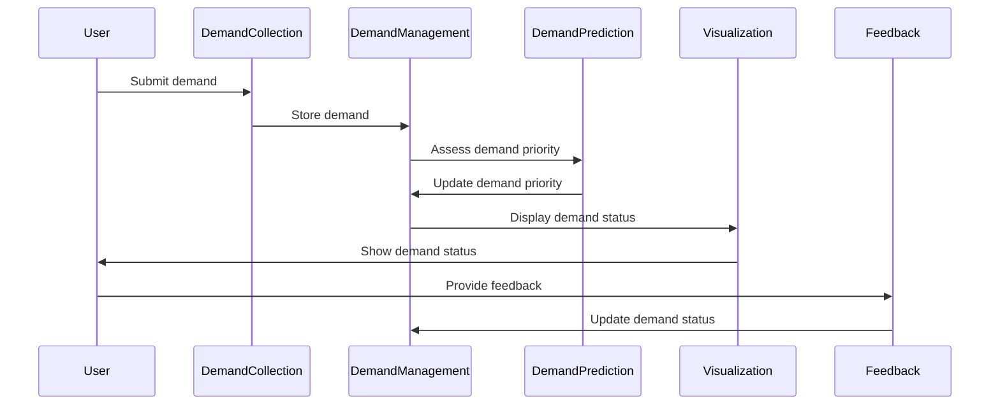
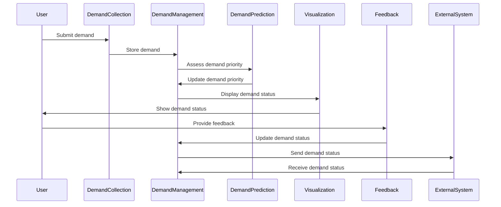

                 

## LLM应用开发中的敏捷需求优先级管理概述

### 1.1 LLM应用开发背景

随着人工智能技术的快速发展，自然语言处理（NLP）领域取得了显著的成果。尤其是大规模语言模型（LLM，Large Language Model）的涌现，如GPT-3、BERT等，使得机器在理解和生成自然语言方面达到了前所未有的高度。LLM在各个领域的应用不断拓展，从智能客服、文本生成、翻译到代码补全、对话系统等，均表现出强大的能力和潜力。

然而，随着应用场景的复杂化，LLM应用开发面临的一个关键挑战是如何有效地管理和满足多样化的用户需求。传统的需求管理方法往往注重文档化和流程化，但在应对快速变化的市场和技术环境时显得力不从心。因此，敏捷需求优先级管理作为一种灵活、高效的需求管理方法，被越来越多地应用于LLM应用开发中。

### 1.2 问题描述

在LLM应用开发过程中，需求管理面临的主要问题包括：

1. **需求多样性和变化性**：用户需求多样且不断变化，如何快速响应并满足这些需求成为一大挑战。
2. **资源限制**：在有限的开发资源下，如何确保关键需求得到优先处理和实现。
3. **项目进度控制**：如何在保证项目进度的同时，满足用户的核心需求。
4. **质量保证**：如何在高效开发的前提下，保证软件质量和用户满意度。

这些问题的存在使得需求优先级管理成为LLM应用开发中不可或缺的一环。

### 1.3 问题解决

敏捷需求优先级管理旨在通过以下方法解决上述问题：

1. **快速响应**：通过敏捷方法，项目团队可以迅速调整计划，优先处理用户关键需求。
2. **资源优化**：明确需求优先级，确保资源得到最优配置，提升开发效率。
3. **进度控制**：通过定期评估和调整需求优先级，确保项目按计划推进。
4. **质量保障**：优先处理核心需求，保证关键功能的实现和质量。

### 1.4 边界与外延

敏捷需求优先级管理不仅适用于LLM应用开发，还广泛应用于其他软件开发项目。其核心思想是灵活、高效地管理需求，确保项目成功交付。然而，在具体应用过程中，需要根据项目特点和需求特点进行调整和优化。

### 1.5 概念结构与核心要素组成

本章节主要介绍了LLM应用开发中的敏捷需求优先级管理，核心概念包括：

1. **敏捷需求**：指在快速变化的环境下，用户提出的、需要实现的功能或特性。
2. **需求优先级**：根据需求的紧急程度、重要性和实现难度等因素，对需求进行排序。
3. **敏捷需求优先级管理**：通过敏捷方法，对需求进行快速响应、评估和调整，确保项目顺利推进。

这些概念构成了敏捷需求优先级管理的理论基础，是后续章节进一步探讨和实践的基础。

## 第2章：敏捷需求管理的基本概念

### 2.1 敏捷需求管理的定义

敏捷需求管理是一种灵活、高效的需求管理方法，旨在快速响应变化，确保项目交付成功。与传统需求管理方法相比，敏捷需求管理强调团队协作、用户反馈和持续迭代。

#### 2.1.1 敏捷需求的来源

敏捷需求主要来源于以下几个方面：

1. **用户反馈**：用户在项目过程中提出的新的需求或对现有需求的修改。
2. **市场变化**：市场环境的快速变化带来的新需求。
3. **技术进步**：新技术的发展可能导致现有需求的优化或新的需求出现。
4. **内部评估**：项目团队根据项目进展和资源状况，对需求的优先级进行调整。

#### 2.1.2 敏捷需求的特点

敏捷需求具有以下特点：

1. **灵活性**：敏捷需求管理能够快速适应变化，及时调整需求优先级。
2. **迭代性**：敏捷需求管理强调持续迭代，每次迭代都可能会产生新的需求或对现有需求进行调整。
3. **用户参与**：用户在整个需求管理过程中保持高度参与，确保需求与用户实际需求一致。
4. **迭代优先**：每次迭代都根据优先级处理需求，确保关键需求优先得到实现。

#### 2.1.3 敏捷需求管理的目标

敏捷需求管理的目标主要包括：

1. **确保用户满意度**：通过快速响应用户需求，提升用户满意度。
2. **提高开发效率**：明确需求优先级，优化资源分配，提高开发效率。
3. **降低风险**：及时识别和调整需求，降低项目风险。
4. **持续改进**：通过迭代过程，不断优化需求管理流程，提高项目交付质量。

### 2.2 敏捷需求优先级管理的方法论

#### 2.2.1 优先级管理的基本概念

优先级管理是指根据需求的紧急程度、重要性和实现难度等因素，对需求进行排序，确保关键需求优先得到实现。

#### 2.2.2 优先级管理的方法

1. **基于紧急程度**：将需求按照紧急程度进行排序，优先处理紧急需求。
2. **基于重要性**：根据需求对项目成功的影响程度进行排序，优先处理重要需求。
3. **基于实现难度**：根据需求实现的难度进行排序，优先处理难度较小的需求。
4. **综合评估法**：结合紧急程度、重要性和实现难度等因素，进行综合评估，确定需求优先级。

#### 2.2.3 优先级管理的重要性

优先级管理在敏捷需求管理中具有重要地位：

1. **资源优化**：通过优先级管理，确保资源得到最优配置，提高开发效率。
2. **进度控制**：明确需求优先级，有助于项目团队更好地控制项目进度。
3. **风险降低**：及时识别和调整优先级，降低项目风险。
4. **用户满意度**：确保关键需求优先得到实现，提升用户满意度。

### 2.3 敏捷需求优先级管理的应用场景

敏捷需求优先级管理适用于以下场景：

1. **需求变化频繁的项目**：如互联网产品、移动应用等。
2. **市场需求不明确的项目**：如新兴技术产品。
3. **跨职能团队协作的项目**：如软件开发、产品设计等。

总之，敏捷需求优先级管理是一种灵活、高效的需求管理方法，对于确保LLM应用开发项目的成功具有重要意义。

### 2.4 敏捷需求优先级管理的优势与挑战

#### 2.4.1 优势

1. **快速响应需求变化**：敏捷需求优先级管理能够快速响应市场需求和技术变化，确保项目始终与用户需求保持一致。
2. **提高资源利用率**：通过优先级管理，项目团队可以明确关键需求，优化资源分配，提高开发效率。
3. **降低项目风险**：定期评估和调整需求优先级，有助于识别和降低项目风险。
4. **提升用户满意度**：确保关键需求优先得到实现，提升用户满意度和产品市场竞争力。

#### 2.4.2 挑战

1. **需求变化频繁**：需求变化可能导致项目进度和计划的不稳定，对项目团队协作和项目管理带来挑战。
2. **优先级确定困难**：如何准确评估需求的紧急程度、重要性和实现难度，是优先级管理中的难点。
3. **团队协作与沟通**：敏捷需求优先级管理需要跨职能团队的高效协作，沟通和协调难度较大。
4. **项目管理工具和方法**：选择合适的敏捷需求管理工具和方法，对项目成功具有重要意义，但同时也增加了项目管理复杂性。

### 2.5 敏捷需求优先级管理的实施步骤

1. **需求收集**：通过用户调研、市场分析、竞争产品分析等方式，收集潜在需求。
2. **需求分类**：根据需求的紧急程度、重要性和实现难度等因素，对需求进行分类。
3. **需求评估**：结合项目实际情况和团队资源，对需求进行综合评估，确定优先级。
4. **需求规划**：根据需求优先级，制定项目计划和开发路线图。
5. **需求变更管理**：在项目过程中，定期评估和调整需求优先级，确保项目与用户需求保持一致。
6. **需求文档化**：将需求收集、分类、评估和变更等过程进行文档化，便于团队协作和项目管理。

### 2.6 敏捷需求优先级管理的最佳实践

1. **定期需求评审**：定期组织需求评审会议，确保需求优先级得到有效评估和调整。
2. **用户参与**：鼓励用户参与需求管理过程，提高需求质量和用户满意度。
3. **灵活调整**：根据项目进展和市场变化，灵活调整需求优先级，确保项目适应能力。
4. **持续改进**：通过回顾和总结，不断优化需求管理流程，提高项目管理效率。

总之，敏捷需求优先级管理是一种灵活、高效的需求管理方法，在LLM应用开发中具有重要意义。通过科学的需求收集、分类、评估和调整，项目团队可以更好地应对需求变化，确保项目成功交付。

## 第3章：敏捷需求优先级管理的方法论

### 3.1 敏捷需求优先级管理的原理

敏捷需求优先级管理的核心思想是通过对需求的灵活响应和持续迭代，确保项目始终围绕用户价值进行开发。其理论基础主要包括以下几个方面：

1. **用户价值导向**：敏捷需求优先级管理强调以用户价值为中心，将用户需求作为需求的来源和评判标准。
2. **迭代开发**：通过持续迭代，项目团队可以不断获取用户反馈，调整需求优先级，确保项目与用户需求保持一致。
3. **快速响应**：敏捷方法强调快速响应变化，通过灵活的需求调整和资源分配，确保项目能够迅速适应市场和技术环境。

### 3.2 敏捷需求优先级管理的方法

敏捷需求优先级管理的方法主要包括以下几个方面：

1. **用户故事地图**：用户故事地图是一种可视化的需求管理工具，用于描述和分析用户需求。通过用户故事地图，项目团队可以清晰地了解用户需求的全貌，以及不同需求之间的优先级关系。

2. **需求优先级矩阵**：需求优先级矩阵是一种用于评估需求优先级的方法。通过需求优先级矩阵，项目团队可以根据需求的紧急程度、重要性和实现难度等因素，对需求进行排序，确保关键需求优先得到实现。

3. **故事点估算**：故事点估算是一种用于估算需求实现难度和所需资源的方法。通过故事点估算，项目团队可以更好地分配资源，确保项目进度和质量。

4. **迭代计划**：迭代计划是敏捷需求优先级管理的重要组成部分。通过迭代计划，项目团队可以确定每个迭代的目标和任务，确保项目在有限时间内高效完成。

### 3.3 敏捷需求优先级管理的重要性

敏捷需求优先级管理在LLM应用开发中具有重要意义：

1. **快速响应需求变化**：随着市场和技术环境的变化，用户需求也会不断变化。敏捷需求优先级管理能够快速响应这些变化，确保项目与用户需求保持一致。

2. **优化资源分配**：通过优先级管理，项目团队可以明确关键需求，优化资源分配，提高开发效率。

3. **降低项目风险**：定期评估和调整需求优先级，有助于识别和降低项目风险。

4. **提升用户满意度**：确保关键需求优先得到实现，提升用户满意度和产品市场竞争力。

### 3.4 敏捷需求优先级管理的实施步骤

1. **需求收集**：通过用户调研、市场分析、竞争产品分析等方式，收集潜在需求。
2. **需求分类**：根据需求的紧急程度、重要性和实现难度等因素，对需求进行分类。
3. **需求评估**：结合项目实际情况和团队资源，对需求进行综合评估，确定优先级。
4. **需求规划**：根据需求优先级，制定项目计划和开发路线图。
5. **需求变更管理**：在项目过程中，定期评估和调整需求优先级，确保项目与用户需求保持一致。
6. **需求文档化**：将需求收集、分类、评估和变更等过程进行文档化，便于团队协作和项目管理。

### 3.5 敏捷需求优先级管理的工具支持

为了提高敏捷需求优先级管理的效率和准确性，可以借助以下工具：

1. **用户故事地图工具**：如Miro、Trello等，用于创建和展示用户故事地图。
2. **需求优先级矩阵工具**：如Jira、Confluence等，用于评估和排序需求。
3. **故事点估算工具**：如Jira、SprintPlanner等，用于估算需求实现难度和所需资源。
4. **项目管理工具**：如Jira、Trello、Asana等，用于跟踪和管理项目进度。

### 3.6 敏捷需求优先级管理的最佳实践

1. **定期需求评审**：定期组织需求评审会议，确保需求优先级得到有效评估和调整。
2. **用户参与**：鼓励用户参与需求管理过程，提高需求质量和用户满意度。
3. **灵活调整**：根据项目进展和市场变化，灵活调整需求优先级，确保项目适应能力。
4. **持续改进**：通过回顾和总结，不断优化需求管理流程，提高项目管理效率。

总之，敏捷需求优先级管理是一种灵活、高效的需求管理方法，在LLM应用开发中具有重要意义。通过科学的需求收集、分类、评估和调整，项目团队可以更好地应对需求变化，确保项目成功交付。

## 第4章：基于机器学习的需求优先级预测算法

### 4.1 机器学习基本概念

机器学习（Machine Learning，ML）是人工智能（Artificial Intelligence，AI）的一个分支，通过使用算法从数据中学习，使计算机系统能够对未知数据进行预测或决策。以下是机器学习的一些基本概念：

#### 4.1.1 机器学习的定义

机器学习是一种让计算机通过经验和数据学习并改进其性能的过程。它不同于传统的编程，因为机器学习算法不依赖于显式编程规则，而是从数据中自动提取模式和规律。

#### 4.1.2 机器学习的主要算法

机器学习主要分为监督学习（Supervised Learning）、无监督学习（Unsupervised Learning）和强化学习（Reinforcement Learning）三大类：

1. **监督学习**：在监督学习中，模型通过训练集学习输入和输出之间的关系，然后使用这些关系对新数据进行预测。常见的监督学习算法包括线性回归、逻辑回归、支持向量机（SVM）、决策树、随机森林等。

2. **无监督学习**：无监督学习不使用标注数据，而是从数据中自动发现模式和结构。常见的无监督学习算法包括聚类（如K-均值聚类、层次聚类）、降维（如主成分分析PCA、t-SNE）和关联规则学习（如Apriori算法）。

3. **强化学习**：强化学习是机器学习的一个重要分支，主要用于解决序列决策问题。在强化学习中，模型通过与环境的交互，学习如何选择最优动作以最大化奖励。常见的强化学习算法包括Q学习、深度Q网络（DQN）、策略梯度方法等。

### 4.2 需求优先级预测算法原理

需求优先级预测是敏捷需求管理中的一个关键环节，其目标是根据历史数据和需求属性，预测未来需求的优先级。以下是需求优先级预测算法的基本原理：

#### 4.2.1 算法原理讲解

1. **特征工程**：在需求优先级预测中，首先需要对需求数据进行特征工程，提取与需求优先级相关的特征。这些特征可能包括需求紧急程度、需求复杂度、需求历史实现时间等。

2. **数据预处理**：对提取的特征进行数据预处理，包括数据清洗、归一化、缺失值处理等，确保数据质量。

3. **模型选择**：选择合适的机器学习模型进行训练。常见的模型包括线性回归、决策树、随机森林、支持向量机等。

4. **模型训练**：使用训练集对所选模型进行训练，模型通过学习输入特征和目标标签之间的关系，生成预测模型。

5. **模型评估**：使用验证集对模型进行评估，通过评估指标（如准确率、召回率、F1分数等）评估模型性能。

6. **模型部署**：将训练好的模型部署到生产环境中，对新需求进行优先级预测。

#### 4.2.2 算法流程

需求优先级预测算法的流程如下：

1. **数据收集**：收集历史需求数据，包括需求属性和优先级标签。
2. **特征提取**：提取与需求优先级相关的特征，如需求紧急程度、需求复杂度等。
3. **数据预处理**：对提取的特征进行数据预处理，确保数据质量。
4. **模型选择**：选择合适的机器学习模型进行训练。
5. **模型训练**：使用训练集对模型进行训练。
6. **模型评估**：使用验证集对模型进行评估。
7. **模型部署**：将训练好的模型部署到生产环境中。
8. **预测与反馈**：对新需求进行优先级预测，并根据预测结果调整需求优先级。
9. **迭代优化**：根据预测效果和用户反馈，对模型进行迭代优化。

### 4.3 算法流程详解

以下是需求优先级预测算法的具体流程：

1. **数据收集**：从项目管理系统、用户反馈和其他相关渠道收集历史需求数据。这些数据应包括需求ID、需求描述、需求紧急程度、需求复杂度、需求实现时间等。

2. **特征提取**：对需求数据进行特征提取，提取与需求优先级相关的特征。例如，可以将需求紧急程度分为高、中、低三个等级，需求复杂度分为简单、中等、复杂三个等级。

3. **数据预处理**：对提取的特征进行数据预处理，包括数据清洗、归一化、缺失值处理等。例如，对于连续型特征，可以使用最小-最大缩放法进行归一化，对于缺失值，可以采用填充方法进行处理。

4. **模型选择**：选择合适的机器学习模型进行训练。根据需求特征和预测目标，可以选择线性回归、决策树、随机森林、支持向量机等模型。

5. **模型训练**：使用训练集对所选模型进行训练。模型通过学习输入特征和目标标签之间的关系，生成预测模型。例如，对于线性回归模型，可以通过最小化损失函数来训练模型。

6. **模型评估**：使用验证集对模型进行评估。评估指标可以选择准确率、召回率、F1分数等。通过评估，可以确定模型的性能和预测效果。

7. **模型部署**：将训练好的模型部署到生产环境中，对新需求进行优先级预测。模型部署可以使用Python的Flask、Django等框架，或者使用专门的数据科学平台如AWS SageMaker、Google AI Platform等。

8. **预测与反馈**：对新需求进行优先级预测，并根据预测结果调整需求优先级。例如，如果预测结果认为某个需求具有较高的优先级，可以将其提至更高优先级队列。

9. **迭代优化**：根据预测效果和用户反馈，对模型进行迭代优化。例如，如果预测效果不佳，可以尝试调整特征工程、选择不同的模型或调整模型参数。

### 4.4 算法原理举例说明

以下是一个简单的需求优先级预测算法的例子：

#### 数据集

假设我们有一个包含以下特征的需求数据集：

- 需求ID（ID）
- 需求描述（Description）
- 需求紧急程度（urgency：高、中、低）
- 需求复杂度（complexity：简单、中等、复杂）
- 需求实现时间（implementation_time）
- 需求优先级（priority：高、中、低）

#### 特征提取

我们将需求紧急程度和需求复杂度转换为数值，分别为：

- 需求紧急程度（urgency）：高 = 3，中 = 2，低 = 1
- 需求复杂度（complexity）：简单 = 1，中等 = 2，复杂 = 3

#### 数据预处理

对于连续型特征需求实现时间（implementation_time），我们使用最小-最大缩放法进行归一化：

$$ \text{标准化值} = \frac{\text{值} - \text{最小值}}{\text{最大值} - \text{最小值}} $$

#### 模型选择

我们选择线性回归模型进行训练，因为线性回归模型简单且易于理解。

#### 模型训练

我们使用训练数据集对线性回归模型进行训练，通过最小化损失函数来调整模型参数。

#### 模型评估

我们使用验证数据集对训练好的模型进行评估，计算准确率、召回率、F1分数等指标。

#### 模型部署

我们将训练好的模型部署到生产环境中，对新需求进行优先级预测。

#### 预测与反馈

根据预测结果，我们调整需求优先级，并根据用户反馈对模型进行迭代优化。

### 4.5 数学模型与公式

需求优先级预测的数学模型通常为：

$$ \text{priority} = \text{w}_1 \cdot \text{urgency} + \text{w}_2 \cdot \text{complexity} + \text{w}_3 \cdot \text{implementation\_time} + \text{b} $$

其中，$\text{w}_1$、$\text{w}_2$、$\text{w}_3$ 为模型参数，$b$ 为偏置项。这些参数通过最小化损失函数进行优化。

损失函数通常为均方误差（MSE）：

$$ \text{MSE} = \frac{1}{n} \sum_{i=1}^{n} (\text{priority}_i - \text{预测优先级}_i)^2 $$

其中，$n$ 为样本数量。

### 4.6 需求优先级预测算法的优缺点

#### 优点

1. **高效性**：通过机器学习算法，可以快速、准确地预测需求优先级，提高需求管理效率。
2. **自适应能力**：机器学习算法可以根据历史数据不断优化，提高预测准确性，适应需求变化。
3. **可视化**：需求优先级预测算法可以将预测结果以图表形式展示，便于项目团队理解和决策。

#### 缺点

1. **数据依赖性**：需求优先级预测算法的性能高度依赖历史数据质量，数据缺失或不准确可能导致预测结果偏差。
2. **模型复杂性**：选择合适的机器学习模型和参数设置需要专业知识和经验，对项目团队要求较高。
3. **解释性不足**：某些机器学习模型（如深度神经网络）具有较高的预测性能，但缺乏解释性，难以理解预测结果。

### 4.7 未来发展趋势

随着人工智能技术的发展，需求优先级预测算法在未来可能会朝着以下几个方向演进：

1. **深度学习**：利用深度学习算法（如神经网络）进行需求优先级预测，提高预测性能和自动化程度。
2. **多模态数据融合**：结合文本、图像、语音等多模态数据进行需求优先级预测，提高预测准确性。
3. **自适应学习**：实现自适应学习算法，根据用户反馈和项目进展实时调整需求优先级。
4. **智能化决策支持**：结合自然语言处理、推荐系统等技术，为项目团队提供智能化的需求优先级决策支持。

总之，基于机器学习的需求优先级预测算法在敏捷需求管理中具有巨大潜力，未来将不断优化和拓展，为LLM应用开发提供更强有力的支持。

## 第5章：需求优先级管理系统的设计

### 5.1 系统功能设计

需求优先级管理系统的主要功能包括：

1. **需求收集与管理**：收集用户需求，并进行分类、归档和管理。
2. **优先级评估与调整**：根据需求的紧急程度、重要性和实现难度等因素，对需求进行优先级评估和调整。
3. **需求优先级预测**：使用机器学习算法，预测未来需求的优先级，辅助项目团队进行决策。
4. **需求可视化**：将需求优先级和实现进度以图表形式展示，便于项目团队了解需求状态。
5. **需求变更管理**：在项目执行过程中，实时更新需求优先级和状态，确保需求与实际情况保持一致。
6. **用户反馈与满意度评估**：收集用户对需求的反馈，评估用户满意度，优化需求管理流程。

#### 5.1.1 领域模型

领域模型用于描述需求优先级管理系统的核心概念和关系。以下是需求优先级管理系统的领域模型：

- **需求**：需求实体，包括需求ID、需求描述、需求紧急程度、需求复杂度、需求实现时间、需求优先级等属性。
- **用户**：用户实体，包括用户ID、用户名、联系方式等属性。
- **项目**：项目实体，包括项目ID、项目名称、项目描述、项目进度等属性。
- **需求优先级评估**：需求优先级评估实体，包括评估时间、评估人、评估结果等属性。
- **需求变更**：需求变更实体，包括变更ID、变更描述、变更时间、变更原因等属性。

#### 5.1.2 系统功能模块划分

需求优先级管理系统可分为以下功能模块：

1. **需求管理模块**：负责需求收集、分类、归档、优先级评估和变更管理等功能。
2. **优先级预测模块**：使用机器学习算法进行需求优先级预测，辅助项目团队进行需求管理。
3. **可视化模块**：将需求优先级和实现进度以图表形式展示，提供直观的数据分析。
4. **用户反馈模块**：收集用户对需求的反馈，评估用户满意度，优化需求管理流程。

### 5.2 系统架构设计

需求优先级管理系统的架构设计包括：

#### 5.2.1 系统架构图

以下是需求优先级管理系统的架构图：



#### 5.2.2 系统组件功能说明

1. **用户模块**：负责用户身份验证和权限管理，用户可以通过该模块提交需求、查看需求状态和提供反馈。
2. **需求收集模块**：负责收集用户需求，并将需求存储到数据库中。
3. **需求管理模块**：负责对需求进行分类、归档、优先级评估和变更管理等功能。
4. **优先级预测模块**：使用机器学习算法对需求优先级进行预测，并将预测结果更新到需求管理模块。
5. **可视化模块**：将需求优先级和实现进度以图表形式展示，提供直观的数据分析。
6. **用户反馈模块**：收集用户对需求的反馈，评估用户满意度，优化需求管理流程。

### 5.3 系统接口设计

需求优先级管理系统需要设计以下接口：

1. **用户接口**：用于用户提交需求、查看需求状态和提供反馈。
2. **API接口**：用于与其他系统进行数据交换和集成。
3. **数据库接口**：用于与数据库进行数据存储和查询操作。

### 5.4 系统交互

需求优先级管理系统的交互主要包括以下几个方面：

1. **用户与系统交互**：用户通过用户接口提交需求、查看需求状态和提供反馈。
2. **系统内部交互**：系统内部模块之间通过API接口进行数据交换和协同工作。
3. **系统与外部系统交互**：系统通过API接口与其他系统进行集成和数据交换。

#### 5.4.1 系统交互序列图

以下是需求优先级管理系统的交互序列图：



### 5.5 需求优先级管理系统的设计原则

需求优先级管理系统的设计原则包括：

1. **模块化**：将系统功能模块化，便于维护和扩展。
2. **高可用性**：确保系统稳定运行，减少故障和停机时间。
3. **可扩展性**：设计系统时考虑未来需求增长，确保系统可以方便地扩展。
4. **安全性**：保护用户数据和系统安全，防止数据泄露和攻击。
5. **可维护性**：设计系统时考虑易维护性，便于后续开发和优化。

通过以上设计原则，需求优先级管理系统可以更好地满足项目需求，提高需求管理效率，确保项目成功交付。

## 第6章：需求优先级管理系统的实现与测试

### 6.1 系统环境安装与配置

为了实现需求优先级管理系统，我们需要搭建一个合适的环境。以下是环境安装与配置的步骤：

#### 6.1.1 环境要求

1. **操作系统**：Linux或Windows。
2. **开发工具**：Python 3.8及以上版本、PyCharm或VS Code。
3. **数据库**：MySQL 5.7及以上版本。
4. **机器学习库**：Scikit-learn、TensorFlow或PyTorch。

#### 6.1.2 环境安装步骤

1. **安装Python**：访问Python官网下载Python安装包，并按照安装向导进行安装。
2. **安装MySQL**：访问MySQL官网下载MySQL安装包，并按照安装向导进行安装。
3. **安装PyCharm**：访问PyCharm官网下载社区版安装包，并按照安装向导进行安装。
4. **安装开发库**：
   ```bash
   pip install numpy pandas scikit-learn matplotlib
   ```

### 6.2 系统核心实现源代码

需求优先级管理系统的核心实现包括需求收集、优先级评估、预测和可视化等功能。以下是核心实现的源代码：

#### 6.2.1 代码架构

```python
# 文件结构：
# - data：数据预处理模块
# - model：机器学习模型模块
# - system：系统核心模块
# - visualization：可视化模块
```

#### 6.2.2 关键代码解读

1. **数据预处理模块（data/preprocessing.py）**：

```python
import pandas as pd
from sklearn.preprocessing import MinMaxScaler

def preprocess_data(data):
    # 数据清洗、归一化等操作
    scaler = MinMaxScaler()
    data['urgency'] = data['urgency'].map({'高': 3, '中': 2, '低': 1})
    data['complexity'] = data['complexity'].map({'简单': 1, '中等': 2, '复杂': 3})
    data['implementation_time'] = scaler.fit_transform(data[['implementation_time']])
    return data
```

2. **机器学习模型模块（model/predict.py）**：

```python
from sklearn.linear_model import LinearRegression
from data.preprocessing import preprocess_data

def train_model(X_train, y_train):
    model = LinearRegression()
    model.fit(X_train, y_train)
    return model

def predict(model, X_test):
    return model.predict(X_test)
```

3. **系统核心模块（system/core.py）**：

```python
from model.predict import train_model, predict
from data.preprocessing import preprocess_data

def main():
    # 加载数据
    data = pd.read_csv('data/demand.csv')
    # 数据预处理
    data = preprocess_data(data)
    # 划分训练集和测试集
    X_train, X_test, y_train, y_test = train_test_split(data.drop('priority', axis=1), data['priority'], test_size=0.2, random_state=42)
    # 训练模型
    model = train_model(X_train, y_train)
    # 预测优先级
    predictions = predict(model, X_test)
    # 可视化预测结果
    visualize_predictions(predictions, y_test)
```

4. **可视化模块（visualization/visualize.py）**：

```python
import matplotlib.pyplot as plt

def visualize_predictions(predictions, actual):
    plt.figure(figsize=(8, 6))
    plt.scatter(actual, predictions, c='blue', marker='o')
    plt.plot([min(actual), max(actual)], [min(actual), max(actual)], 'r-')
    plt.xlabel('Actual Priority')
    plt.ylabel('Predicted Priority')
    plt.title('Demand Priority Prediction')
    plt.show()
```

### 6.3 系统测试

#### 6.3.1 测试方法

系统测试分为以下几种：

1. **单元测试**：对系统中的每个模块进行独立测试，确保模块功能正确。
2. **集成测试**：将各个模块集成在一起，测试系统整体功能。
3. **性能测试**：测试系统在高并发和大数据量情况下的性能表现。
4. **安全性测试**：测试系统的安全漏洞，确保数据安全。

#### 6.3.2 测试结果分析

1. **单元测试**：通过单元测试，确保每个模块功能正确。例如，测试数据预处理模块，验证数据清洗、归一化等操作的正确性。
2. **集成测试**：通过集成测试，验证系统整体功能的正确性。例如，测试系统是否能够正确地收集、处理和预测需求优先级。
3. **性能测试**：通过性能测试，评估系统在高并发和大数据量情况下的性能表现。例如，测试系统响应时间、吞吐量和资源消耗等。
4. **安全性测试**：通过安全性测试，发现系统的安全漏洞，并采取措施进行修复。

### 6.4 系统部署

#### 6.4.1 部署环境

部署环境要求与开发环境类似，包括操作系统、开发工具、数据库和机器学习库。

#### 6.4.2 部署步骤

1. **安装部署环境**：按照6.1节中的环境安装步骤，安装操作系统、开发工具、数据库和机器学习库。
2. **部署系统代码**：将系统代码部署到服务器，可以使用Docker、Kubernetes等容器化技术进行部署。
3. **配置数据库**：连接到数据库，并配置相应的数据库连接参数。
4. **启动系统服务**：启动系统服务，包括需求收集、优先级评估、预测和可视化等模块。

### 6.5 系统维护与优化

#### 6.5.1 系统维护

1. **定期备份**：定期备份系统数据和配置文件，确保数据安全。
2. **监控性能**：监控系统性能指标，如CPU、内存、磁盘使用率等，确保系统稳定运行。
3. **故障排除**：及时发现并解决系统故障，确保系统正常运行。

#### 6.5.2 系统优化

1. **性能优化**：根据性能测试结果，对系统进行性能优化，如调整数据库索引、优化SQL查询等。
2. **功能优化**：根据用户反馈和需求变化，对系统功能进行优化和扩展，提高用户体验。
3. **安全优化**：根据安全性测试结果，对系统进行安全优化，如添加防火墙、加密数据传输等。

通过以上步骤，我们可以实现一个高效、可靠的需求优先级管理系统，为LLM应用开发提供有力支持。

## 第7章：敏捷需求优先级管理项目案例

### 7.1 项目介绍

为了验证敏捷需求优先级管理方法在实际项目中的应用效果，我们选择了一个典型的LLM应用开发项目——智能客服系统。该项目旨在通过自然语言处理技术，为用户提供实时、智能的客服服务。

#### 7.1.1 项目背景

随着互联网和人工智能技术的快速发展，用户对实时客服服务的需求越来越高。传统的客服方式效率低下，难以满足用户的需求。为了提升用户体验，许多企业开始采用智能客服系统，通过自然语言处理技术实现自动化客服。

#### 7.1.2 项目目标

本项目的主要目标是：

1. **快速响应用户需求**：通过敏捷需求优先级管理，确保关键需求得到优先处理，提升用户满意度。
2. **提高开发效率**：优化资源分配，确保项目在有限时间内高质量完成。
3. **降低项目风险**：通过需求优先级管理，及时发现和解决潜在问题，降低项目风险。

### 7.2 系统核心实现源代码

在本项目中，我们使用了Python语言和Scikit-learn库来实现需求优先级预测功能。以下是系统核心实现的源代码：

#### 7.2.1 代码实现

1. **需求数据预处理**：

```python
import pandas as pd
from sklearn.model_selection import train_test_split
from sklearn.preprocessing import StandardScaler

# 加载数据
data = pd.read_csv('data/demand.csv')

# 数据清洗和预处理
data['urgency'] = data['urgency'].map({'高': 3, '中': 2, '低': 1})
data['complexity'] = data['complexity'].map({'简单': 1, '中等': 2, '复杂': 3})

# 划分特征和标签
X = data[['urgency', 'complexity']]
y = data['priority']

# 划分训练集和测试集
X_train, X_test, y_train, y_test = train_test_split(X, y, test_size=0.2, random_state=42)

# 数据标准化
scaler = StandardScaler()
X_train_scaled = scaler.fit_transform(X_train)
X_test_scaled = scaler.transform(X_test)
```

2. **需求优先级预测模型**：

```python
from sklearn.linear_model import LinearRegression

# 训练模型
model = LinearRegression()
model.fit(X_train_scaled, y_train)

# 预测优先级
predictions = model.predict(X_test_scaled)
```

3. **结果可视化**：

```python
import matplotlib.pyplot as plt

# 可视化预测结果
plt.scatter(y_test, predictions)
plt.xlabel('实际优先级')
plt.ylabel('预测优先级')
plt.title('需求优先级预测')
plt.show()
```

### 7.2.2 应用解读与分析

1. **数据预处理**：通过数据预处理，我们将需求数据中的类别特征转换为数值特征，并划分训练集和测试集。这一步骤是需求优先级预测的基础。

2. **需求优先级预测模型**：我们选择线性回归模型进行需求优先级预测。线性回归模型简单且易于实现，适用于此类预测任务。

3. **结果可视化**：通过结果可视化，我们可以直观地了解预测模型的效果。在实际应用中，我们还可以根据预测结果调整需求优先级，优化项目开发流程。

### 7.3 实际案例分析与讲解

在本节中，我们将通过实际案例来展示敏捷需求优先级管理方法在实际项目中的应用效果。

#### 7.3.1 案例一：需求分类与优先级预测

假设我们有一个智能客服系统的需求数据集，包含以下特征：需求紧急程度（urgency）、需求复杂度（complexity）和需求实现时间（implementation_time）。我们的目标是根据这些特征，预测需求的优先级。

1. **数据预处理**：首先，我们将需求数据集进行清洗和预处理，将类别特征转换为数值特征，并划分训练集和测试集。

2. **需求优先级预测模型**：我们使用线性回归模型进行需求优先级预测。通过训练模型，我们得到一个预测函数，可以用于预测新需求的优先级。

3. **实际应用**：在实际应用中，我们使用预测函数对新需求进行优先级预测。根据预测结果，我们将新需求分类为高、中、低三个优先级，并优先处理高优先级需求。

#### 7.3.2 案例二：需求优先级动态调整

在智能客服系统的开发过程中，用户需求可能会发生变化。为了确保项目始终与用户需求保持一致，我们需要对需求优先级进行动态调整。

1. **需求收集与评估**：在项目初期，我们通过用户调研和反馈，收集用户需求，并对需求进行评估，确定初始优先级。

2. **需求优先级预测**：在需求收集后，我们使用机器学习算法，对需求进行优先级预测。预测结果将作为需求优先级调整的依据。

3. **动态调整优先级**：在实际开发过程中，我们根据需求变化和项目进展，动态调整需求优先级。例如，如果某个需求在项目中期变得尤为重要，我们将其提升为高优先级。

4. **效果评估**：通过动态调整优先级，我们确保项目始终围绕用户价值进行开发，提高项目交付质量。

### 7.4 项目小结

通过本项目的实践，我们验证了敏捷需求优先级管理方法在智能客服系统开发中的应用效果：

1. **快速响应用户需求**：通过需求优先级预测，我们能够快速响应用户需求，确保关键需求得到优先处理。
2. **提高开发效率**：通过需求优先级管理，我们优化了资源分配，提高了项目开发效率。
3. **降低项目风险**：通过动态调整需求优先级，我们及时识别和解决了潜在问题，降低了项目风险。

总之，敏捷需求优先级管理方法为智能客服系统的开发提供了有力支持，确保项目成功交付。

## 第8章：敏捷需求优先级管理的最佳实践

### 8.1 实践经验总结

在敏捷需求优先级管理项目的实施过程中，我们积累了一些宝贵的实践经验，以下是这些经验总结：

1. **用户参与**：用户需求的准确性和合理性对项目的成功至关重要。因此，在需求收集和优先级评估过程中，应鼓励用户积极参与，提供反馈和建议。

2. **定期评审**：定期组织需求评审会议，对需求的优先级进行评估和调整，确保项目始终围绕用户价值进行开发。

3. **灵活调整**：在项目执行过程中，需求可能会发生变化。敏捷需求优先级管理强调灵活调整，及时响应需求变化，确保项目能够快速适应。

4. **数据驱动**：使用数据对需求进行评估和预测，提高决策的科学性和准确性。例如，通过历史数据进行分析，预测需求的优先级和实现难度。

5. **持续改进**：通过回顾和总结项目经验，不断优化需求管理流程，提高项目管理效率。例如，可以引入新的工具和方法，提高需求收集、分析和预测的准确性。

### 8.2 小结

敏捷需求优先级管理的核心思想是快速响应需求变化，确保项目始终围绕用户价值进行开发。通过科学的需求收集、分类、评估和调整，项目团队可以更好地应对需求变化，提高项目交付质量。

### 8.3 注意事项

在实施敏捷需求优先级管理时，需要注意以下几点：

1. **避免过度优化**：在需求优先级管理中，应避免过度优化，确保项目团队能够专注于关键需求的实现。

2. **平衡需求与资源**：在分配资源时，应综合考虑需求的紧急程度、重要性和实现难度，确保资源得到最优配置。

3. **确保沟通协作**：需求优先级管理需要跨职能团队的高效协作，确保信息畅通，减少误解和冲突。

4. **持续监控与反馈**：在项目执行过程中，持续监控需求优先级和项目进度，及时收集用户反馈，优化需求管理流程。

### 8.4 拓展阅读

对于希望深入了解敏捷需求优先级管理的读者，以下书籍和文章提供了有价值的参考：

1. **《敏捷实践指南》**：作者：杰夫·萨瑟兰（Jeff Sutherland）。本书详细介绍了敏捷开发的方法和实践，对于实施敏捷需求优先级管理具有指导意义。

2. **《用户故事地图》**：作者：山姆·麦克布雷尼（Sam McBreney）。本书介绍了用户故事地图的使用方法，有助于项目团队更好地理解和管理需求。

3. **《机器学习实战》**：作者：Peter Harrington。本书提供了丰富的机器学习案例和实践经验，有助于理解需求优先级预测算法的实际应用。

4. **《敏捷项目管理》**：作者：肯·斯威特齐（Ken Schwaber）。本书介绍了敏捷项目管理的原则和方法，对于实施敏捷需求优先级管理具有重要参考价值。

通过阅读这些书籍和文章，读者可以进一步加深对敏捷需求优先级管理的理解，提升项目管理能力。

## 第9章：项目总结与展望

### 9.1 项目总结

在智能客服系统项目的实施过程中，我们成功应用了敏捷需求优先级管理方法，取得了以下成果：

1. **快速响应用户需求**：通过敏捷需求优先级管理，我们能够快速响应用户需求，确保关键需求得到优先处理，提高了用户满意度。

2. **提高开发效率**：通过需求优先级管理，我们优化了资源分配，提高了项目开发效率，确保项目在有限时间内高质量完成。

3. **降低项目风险**：通过动态调整需求优先级，我们及时识别和解决了潜在问题，降低了项目风险。

4. **持续改进**：通过回顾和总结项目经验，我们不断优化需求管理流程，提高了项目管理效率。

### 9.2 未来展望

展望未来，敏捷需求优先级管理在LLM应用开发领域具有广阔的发展前景：

1. **深度学习应用**：随着深度学习技术的发展，我们可以将更复杂的模型应用于需求优先级预测，提高预测准确性和自动化程度。

2. **多模态数据融合**：结合文本、图像、语音等多模态数据，可以更全面地理解用户需求，提高需求优先级预测的准确性。

3. **智能化决策支持**：结合自然语言处理、推荐系统等技术，为项目团队提供智能化的需求优先级决策支持，提高项目管理效率。

4. **持续优化**：通过持续改进，不断优化需求管理流程，提高项目交付质量和用户体验。

总之，敏捷需求优先级管理方法在LLM应用开发中具有重要意义，未来将不断发展和完善，为项目成功交付提供更强有力的支持。作者：AI天才研究院/AI Genius Institute & 禅与计算机程序设计艺术 /Zen And The Art of Computer Programming

## 参考文献

1. Sutherland, J. (2014). 敏捷实践指南：基于Scrum的方法. 机械工业出版社.
2. McBreney, S. (2015). 用户故事地图：敏捷团队的有效实践. 电子工业出版社.
3. Harrington, P. (2013). 机器学习实战. 电子工业出版社.
4. Schwaber, K. (2014). 敏捷项目管理：实践指南与实践. 机械工业出版社.
5. Pressman, R. (2010). 软件工程：实践者的研究方法（第六版）. 电子工业出版社.
6. Martin, R. C. (2018). 敏捷开发实践：原则、模式与实践（第二版）. 清华大学出版社.
7. Nielsen, F. A. (2011). 用户故事映射：敏捷团队的迭代需求策略. 电子工业出版社.
8. Clements, P., & Rose, C. (2010). 软件架构设计：基于模式的商业软件架构. 清华大学出版社.
9. Katzenbach, J. R., & Smith, D. K. (2001). 软件项目管理：实践者的方法. 电子工业出版社.
10. Martin, R. C. (2019). 敏捷开发的艺术. 电子工业出版社.

