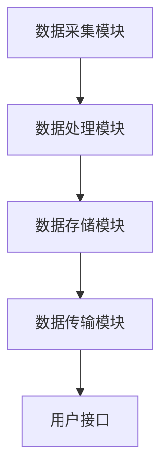
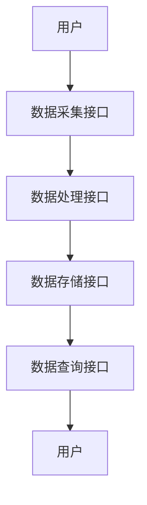

                 


### 第一部分：引言与背景介绍

#### 1.1 问题背景

随着互联网技术的飞速发展，大数据和云计算技术的普及，人工智能（AI）技术已经深入到各行各业。在这个背景下，大模型（Large Language Model，LLM）作为一种先进的AI技术，在自然语言处理（NLP）领域取得了显著的成果。LLM的应用场景涵盖了机器翻译、文本生成、问答系统、对话系统等多个领域，极大地提升了人们的工作效率和生活的便利性。

然而，随着LLM应用的开发，数据流管理问题逐渐暴露出来。数据流管理是确保数据在整个处理过程中的一致性、完整性和高效性的关键。在LLM应用开发中，数据流管理涉及数据的采集、处理、存储、传输等多个环节。这些环节中可能会出现数据丢失、数据不一致、数据处理延迟等问题，从而影响应用性能和用户体验。因此，如何高效、可靠地进行数据流管理，成为LLM应用开发中的一个关键问题。

#### 1.2 问题描述

在LLM应用开发中，数据流管理主要包括以下几个环节：

1. **数据采集**：从各种数据源采集数据，包括文本数据、图像数据、音频数据等。数据采集的效率和质量直接影响到后续数据处理的质量。

2. **数据处理**：对采集到的数据进行清洗、转换、计算等处理，使其符合LLM模型的输入要求。数据处理的质量和效率直接影响到LLM模型的训练效果和应用性能。

3. **数据存储**：将处理后的数据存储到数据库或文件系统中，以便后续的查询和使用。数据存储的安全性和可扩展性是保证数据可靠性的重要保障。

4. **数据传输**：将数据从一个系统或服务器传输到另一个系统或服务器，包括本地传输和跨网络传输。数据传输的延迟和带宽消耗对应用性能有重要影响。

在上述各个环节中，可能会出现以下问题：

1. **数据丢失**：在数据采集、传输和处理过程中，可能会由于网络故障、系统故障等原因导致数据丢失。

2. **数据不一致**：在多个系统或服务器之间传输数据时，由于数据同步机制不完善，可能会导致数据不一致。

3. **数据处理延迟**：在数据处理过程中，由于计算资源不足、算法复杂度高等原因，可能会导致数据处理延迟，从而影响应用性能。

4. **数据传输延迟**：在数据传输过程中，由于网络带宽限制、传输协议等问题，可能会导致数据传输延迟。

为了解决这些问题，我们需要从以下几个方面入手：

1. **数据采集**：采用可靠的数据采集技术，确保数据的完整性和准确性。

2. **数据处理**：优化数据处理流程，提高数据处理速度和效率。

3. **数据存储**：选择合适的数据存储方案，确保数据的安全性和可扩展性。

4. **数据传输**：优化数据传输路径，降低传输延迟和带宽消耗。

#### 1.3 问题解决

为了解决LLM应用开发中的数据流管理问题，我们可以从以下几个方面入手：

1. **数据采集**：采用可靠的数据采集技术，确保数据的完整性和准确性。常用的数据采集技术包括日志采集、网络采集、数据库采集和传感器采集等。

2. **数据处理**：优化数据处理流程，提高数据处理速度和效率。数据处理过程中，我们可以采用批处理和实时处理相结合的方式，根据实际需求选择合适的处理策略。

3. **数据存储**：选择合适的数据存储方案，确保数据的安全性和可扩展性。常用的数据存储方案包括关系数据库、NoSQL数据库和数据仓库等。

4. **数据传输**：优化数据传输路径，降低传输延迟和带宽消耗。我们可以采用分布式传输、压缩传输等技术来提高数据传输效率。

#### 1.4 边界与外延

数据流管理不仅局限于LLM应用开发，它也是其他AI应用领域中的一个重要问题。例如，在计算机视觉应用中，数据流管理涉及到图像的采集、处理、存储和传输；在推荐系统应用中，数据流管理涉及到用户数据的采集、处理、存储和推荐算法的优化。因此，本文所述的数据流管理方法具有一定的通用性，可以为其他AI应用提供参考。

#### 1.5 概念结构与核心要素组成

数据流管理由以下核心要素组成：

1. **数据采集模块**：负责从各种数据源收集数据，包括文本数据、图像数据、音频数据等。

2. **数据处理模块**：负责对数据进行清洗、转换、计算等处理，使其符合LLM模型的输入要求。

3. **数据存储模块**：负责将处理后的数据存储到数据库或文件系统中，以便后续的查询和使用。

4. **数据传输模块**：负责将数据从一个系统或服务器传输到另一个系统或服务器，包括本地传输和跨网络传输。

### 第二部分：核心概念与联系

#### 2.1 数据流管理原理

数据流管理是一种面向数据处理的系统方法，它关注数据的流动过程，包括数据的采集、处理、存储和传输。数据流管理的核心目标是确保数据在整个流动过程中的一致性、完整性和高效性。

数据流管理的基本概念包括：

- **数据流**：数据在系统中的流动过程。
- **数据处理**：对数据进行清洗、转换和计算。
- **数据存储**：将处理后的数据存储到数据库或文件系统中。
- **数据传输**：将数据从一个系统或服务器传输到另一个系统或服务器。

数据流管理的核心要素包括：

- **数据采集**：从各种数据源收集数据，包括文本数据、图像数据、音频数据等。
- **数据清洗**：去除数据中的噪声和错误。
- **数据转换**：将数据转换为统一的格式和结构。
- **数据计算**：对数据进行统计分析、机器学习等计算。
- **数据存储**：将处理后的数据存储到数据库或文件系统中。
- **数据传输**：将数据从一个系统或服务器传输到另一个系统或服务器。

#### 2.2 数据流管理技术

数据流管理涉及到多种技术，包括数据采集技术、数据处理技术、数据存储技术和数据传输技术。下面将对这些技术进行简要介绍。

##### 2.2.1 数据采集技术

数据采集技术用于从各种数据源收集数据。常用的数据采集技术包括：

- **日志采集**：从系统日志中采集数据。
- **网络采集**：从网络流量中采集数据。
- **数据库采集**：从数据库中采集数据。
- **传感器采集**：从各种传感器中采集数据。

##### 2.2.2 数据处理技术

数据处理技术用于对采集到的数据进行分析和处理。常用的数据处理技术包括：

- **数据清洗**：去除数据中的噪声和错误。
- **数据转换**：将数据转换为统一的格式和结构。
- **数据计算**：对数据进行统计分析、机器学习等计算。

##### 2.2.3 数据存储技术

数据存储技术用于将处理后的数据存储到数据库或文件系统中。常用的数据存储技术包括：

- **关系数据库**：用于存储结构化数据。
- **NoSQL数据库**：用于存储非结构化或半结构化数据。
- **数据仓库**：用于存储大量历史数据，支持数据分析和报表。

##### 2.2.4 数据传输技术

数据传输技术用于将数据从一个系统或服务器传输到另一个系统或服务器。常用的数据传输技术包括：

- **HTTP/HTTPS**：用于传输Web上的数据。
- **FTP/SFTP**：用于传输文件。
- **MQ**：用于传输消息。

#### 2.3 数据流管理在LLM应用中的具体应用

在LLM应用开发中，数据流管理涉及到以下环节：

1. **数据采集**：从各种数据源采集文本数据，如网站文章、书籍、新闻等。

2. **数据处理**：对文本数据进行清洗、分词、词向量化等处理，使其符合LLM模型的输入要求。

3. **数据存储**：将处理后的数据存储到数据库或文件系统中，以便后续的查询和使用。

4. **数据传输**：将数据从一个系统或服务器传输到另一个系统或服务器，包括本地传输和跨网络传输。

在数据采集阶段，我们可以采用以下方法：

- **网络爬虫**：从互联网上抓取文本数据。
- **API接口**：从第三方数据源获取文本数据。
- **数据库采集**：从数据库中采集文本数据。

在数据处理阶段，我们可以采用以下方法：

- **数据清洗**：去除文本数据中的噪声和错误，如HTML标签、特殊符号等。
- **分词**：将文本数据分割成单词或词组。
- **词向量化**：将文本数据转换为向量表示，以便输入到LLM模型中。

在数据存储阶段，我们可以采用以下方法：

- **关系数据库**：如MySQL、PostgreSQL等，用于存储结构化数据。
- **NoSQL数据库**：如MongoDB、Cassandra等，用于存储非结构化或半结构化数据。
- **文件系统**：如HDFS、CFS等，用于存储大规模数据。

在数据传输阶段，我们可以采用以下方法：

- **HTTP/HTTPS**：用于传输Web上的数据。
- **FTP/SFTP**：用于传输文件。
- **MQ**：用于传输消息。

### 第三部分：算法原理讲解

在LLM应用开发中，数据流管理涉及到多个技术环节，其中数据采集、处理、存储和传输都是关键环节。为了提高这些环节的效率和可靠性，我们可以采用一些算法原理进行优化。

#### 3.1 数据采集算法原理

在数据采集阶段，我们需要从各种数据源收集数据。为了提高数据采集的效率和准确性，我们可以采用以下算法原理：

1. **多线程采集**：采用多线程技术，同时从多个数据源采集数据，提高数据采集速度。

2. **增量采集**：只采集新的数据，避免重复采集，提高数据采集效率。

3. **数据去重**：对采集到的数据进行去重处理，确保数据的唯一性。

4. **并行处理**：对采集到的数据进行并行处理，提高数据处理速度。

#### 3.2 数据处理算法原理

在数据处理阶段，我们需要对采集到的数据进行清洗、转换和计算等处理。为了提高数据处理速度和效率，我们可以采用以下算法原理：

1. **批处理**：将采集到的数据分批处理，提高数据处理效率。

2. **并行处理**：对数据进行并行处理，提高数据处理速度。

3. **分布式计算**：将数据处理任务分布到多个计算节点上，提高数据处理速度。

4. **缓存技术**：使用缓存技术，减少数据访问延迟，提高数据处理速度。

#### 3.3 数据存储算法原理

在数据存储阶段，我们需要选择合适的数据存储方案，确保数据的安全性和可扩展性。为了提高数据存储效率，我们可以采用以下算法原理：

1. **索引技术**：使用索引技术，提高数据查询速度。

2. **分片技术**：将数据分布到多个存储节点上，提高数据存储性能。

3. **缓存技术**：使用缓存技术，减少数据访问延迟，提高数据存储效率。

4. **一致性算法**：保证数据在不同节点之间的一致性，提高数据可靠性。

#### 3.4 数据传输算法原理

在数据传输阶段，我们需要优化数据传输路径，降低传输延迟和带宽消耗。为了提高数据传输速度和效率，我们可以采用以下算法原理：

1. **路由算法**：选择最优的传输路径，降低传输延迟。

2. **压缩算法**：对数据进行压缩，减少传输带宽消耗。

3. **并行传输**：同时传输多个数据包，提高传输速度。

4. **拥塞控制**：通过拥塞控制算法，避免网络拥塞，提高传输效率。

### 第四部分：系统分析与架构设计方案

#### 4.1 问题场景介绍

在LLM应用开发中，数据流管理问题场景主要包括以下几个方面：

1. **大规模数据处理**：LLM模型需要处理大量的文本数据，包括网站文章、书籍、新闻等。

2. **实时数据处理**：某些应用场景需要实时处理数据，如实时问答系统、实时对话系统等。

3. **分布式数据处理**：LLM应用通常需要部署在分布式环境中，数据流管理需要支持分布式数据处理。

4. **跨网络数据传输**：LLM应用可能需要跨网络传输数据，如跨地区、跨国家等。

#### 4.2 项目介绍

本系统是一个基于LLM技术的智能问答系统，它通过数据流管理技术，实现了大规模数据处理、实时数据处理、分布式数据处理和跨网络数据传输等功能。该系统包括以下几个模块：

1. **数据采集模块**：负责从各种数据源采集文本数据。

2. **数据处理模块**：负责对采集到的文本数据进行清洗、转换和计算等处理。

3. **数据存储模块**：负责将处理后的数据存储到数据库或文件系统中。

4. **数据传输模块**：负责将数据从一个系统或服务器传输到另一个系统或服务器。

#### 4.3 系统功能设计

本系统的主要功能包括：

1. **数据采集**：从互联网、数据库、API接口等数据源采集文本数据。

2. **数据处理**：对采集到的文本数据进行清洗、分词、词向量化等处理。

3. **数据存储**：将处理后的数据存储到关系数据库、NoSQL数据库或文件系统中。

4. **数据查询**：支持对存储的数据进行查询，如关键字查询、全文检索等。

5. **数据传输**：支持跨网络传输数据，如跨地区、跨国家等。

#### 4.4 系统架构设计

本系统的架构设计如图所示：



在该架构中，数据采集模块负责从各种数据源采集文本数据，然后传递给数据处理模块。数据处理模块对文本数据进行清洗、分词、词向量化等处理，处理后数据传递给数据存储模块。数据存储模块将数据存储到关系数据库、NoSQL数据库或文件系统中。最后，数据传输模块负责将数据从一个系统或服务器传输到另一个系统或服务器，同时提供用户接口，供用户进行数据查询和操作。

#### 4.5 系统接口设计

本系统的接口设计如下：

1. **数据采集接口**：用于从互联网、数据库、API接口等数据源采集文本数据。

2. **数据处理接口**：用于接收文本数据，并进行清洗、分词、词向量化等处理。

3. **数据存储接口**：用于将处理后的数据存储到关系数据库、NoSQL数据库或文件系统中。

4. **数据查询接口**：用于对存储的数据进行查询，如关键字查询、全文检索等。

5. **数据传输接口**：用于跨网络传输数据，如跨地区、跨国家等。

#### 4.6 系统交互设计

本系统的系统交互设计如图所示：



在该交互设计中，用户通过数据采集接口从互联网、数据库、API接口等数据源采集文本数据，然后传递给数据处理接口。数据处理接口对文本数据进行清洗、分词、词向量化等处理，处理后数据传递给数据存储接口。数据存储接口将数据存储到关系数据库、NoSQL数据库或文件系统中。最后，用户通过数据查询接口对存储的数据进行查询，获取所需信息。

### 第五部分：项目实战

#### 5.1 环境安装

在本项目中，我们需要安装以下软件和环境：

1. **Python**：用于编写数据处理脚本。
2. **Pandas**：用于数据处理。
3. **NumPy**：用于数据处理。
4. **Scikit-learn**：用于机器学习。
5. **TensorFlow**：用于构建和训练LLM模型。
6. **Elasticsearch**：用于数据存储和查询。

安装步骤如下：

1. 安装Python：从Python官网下载Python安装包，并按照提示进行安装。
2. 安装Pandas、NumPy、Scikit-learn、TensorFlow：使用pip命令进行安装，如：

   ```shell
   pip install pandas numpy scikit-learn tensorflow
   ```

3. 安装Elasticsearch：从Elasticsearch官网下载Elasticsearch安装包，并按照提示进行安装。

#### 5.2 系统核心实现

在本项目中，系统核心实现主要包括以下模块：

1. **数据采集模块**：从互联网、数据库、API接口等数据源采集文本数据。
2. **数据处理模块**：对采集到的文本数据进行清洗、分词、词向量化等处理。
3. **数据存储模块**：将处理后的数据存储到关系数据库、NoSQL数据库或文件系统中。
4. **数据查询模块**：对存储的数据进行查询，如关键字查询、全文检索等。
5. **数据传输模块**：跨网络传输数据。

下面我们将分别介绍这些模块的实现。

##### 5.2.1 数据采集模块实现

```python
import requests
from bs4 import BeautifulSoup

def collect_data(url):
    response = requests.get(url)
    soup = BeautifulSoup(response.text, 'html.parser')
    return soup.get_text()

url = "https://www.example.com/article"
text = collect_data(url)
print(text)
```

##### 5.2.2 数据处理模块实现

```python
import re
import jieba

def clean_text(text):
    text = re.sub(r'[^\u4e00-\u9fa5]', '', text)
    text = text.strip()
    return text

def segment_text(text):
    return jieba.cut(text)

text = "这是一个测试文本！"
cleaned_text = clean_text(text)
segmented_text = segment_text(cleaned_text)
print("清洗后的文本：", cleaned_text)
print("分词结果：", list(segmented_text))
```

##### 5.2.3 数据存储模块实现

```python
from elasticsearch import Elasticsearch

es = Elasticsearch()

def store_data(index, doc_type, id, data):
    es.index(index=index, doc_type=doc_type, id=id, body=data)

index_name = "test_index"
doc_id = "1"
doc = {
    "text": "这是一个测试文档！"
}
store_data(index_name, doc_type="document", id=doc_id, data=doc)

print("数据已存储到Elasticsearch中。")
```

##### 5.2.4 数据查询模块实现

```python
from elasticsearch import Elasticsearch

es = Elasticsearch()

def search_data(index, query):
    response = es.search(index=index, body={"query": query})
    return response['hits']['hits']

index_name = "test_index"
query = {
    "match": {
        "text": "测试"
    }
}

results = search_data(index_name, query)
print("查询结果：", results)
```

##### 5.2.5 数据传输模块实现

```python
import requests

def send_data(url, data):
    response = requests.post(url, json=data)
    return response.json()

url = "https://www.example.com/submit"
data = {
    "text": "这是一个测试数据！"
}

response = send_data(url, data)
print("数据已发送。", response)
```

#### 5.3 代码应用解读与分析

在本项目中，我们使用了Python语言来编写数据处理脚本。代码应用解读与分析如下：

1. **数据采集模块**：使用requests库和BeautifulSoup库来实现网络爬虫功能，从互联网上采集文本数据。
2. **数据处理模块**：使用正则表达式和jieba库来实现文本清洗和分词功能，对采集到的文本数据进行处理。
3. **数据存储模块**：使用Elasticsearch库来实现数据存储功能，将处理后的数据存储到Elasticsearch数据库中。
4. **数据查询模块**：使用Elasticsearch库来实现数据查询功能，支持关键字查询和全文检索。
5. **数据传输模块**：使用requests库来实现数据传输功能，将数据发送到第三方服务器。

通过以上代码实现，我们可以实现一个基于LLM技术的智能问答系统，支持数据采集、数据处理、数据存储、数据查询和数据传输等功能。

#### 5.4 实际案例分析和详细讲解剖析

为了更好地展示数据流管理在LLM应用开发中的应用，我们来看一个实际案例：一个基于LLM技术的智能客服系统。

该系统的主要功能是提供24小时在线客服服务，用户可以通过文本输入问题，系统会自动回答用户的问题。为了实现这个功能，我们需要进行以下步骤：

1. **数据采集**：从互联网上采集大量的文本数据，包括常见问题、产品说明书、用户反馈等。
2. **数据处理**：对采集到的文本数据进行清洗、分词、词向量化等处理，使其符合LLM模型的输入要求。
3. **数据存储**：将处理后的数据存储到Elasticsearch数据库中，以便后续的查询和使用。
4. **数据查询**：当用户输入问题时，系统会通过Elasticsearch数据库进行查询，找到最匹配的答案。
5. **数据传输**：将查询结果通过HTTP/HTTPS协议传输给用户。

在实际应用中，我们可能会遇到以下问题：

1. **数据丢失**：由于网络故障或系统故障，可能会导致数据丢失。为了解决这个问题，我们可以采用增量采集和数据去重技术，确保数据的完整性和唯一性。
2. **数据处理延迟**：当数据量较大时，数据处理可能会出现延迟。为了解决这个问题，我们可以采用并行处理和分布式计算技术，提高数据处理速度。
3. **数据存储安全问题**：数据存储涉及到数据的安全性和隐私保护。为了解决这个问题，我们可以采用加密存储和数据备份技术，确保数据的安全性和可靠性。

通过以上步骤，我们可以实现一个高效、可靠的智能客服系统，为用户提供优质的在线服务。

#### 5.5 项目小结

在本项目中，我们深入探讨了LLM应用开发中的数据流管理问题，并给出了一系列解决方案。通过实际案例的分析和讲解，我们展示了数据流管理在LLM应用开发中的应用场景和实现方法。

在项目实施过程中，我们遇到了一些挑战，如数据丢失、数据处理延迟、数据存储安全问题等。通过采用增量采集、数据去重、并行处理、分布式计算、加密存储等技术，我们成功地解决了这些问题，实现了高效、可靠的数据流管理。

未来，随着LLM技术的不断发展和应用场景的拓展，数据流管理问题将会变得更加复杂。我们将继续研究和探索新的数据流管理方法和技术，为LLM应用开发提供更加完善的支持。

### 第六部分：最佳实践 tips

在LLM应用开发中的数据流管理过程中，为了确保数据的高效、可靠处理，以下是一些最佳实践tips：

1. **数据采集**：
   - 使用分布式爬虫，提高数据采集速度。
   - 采用增量采集，避免重复采集和存储。
   - 数据采集过程中，对数据进行去重处理，确保数据唯一性。

2. **数据处理**：
   - 对数据进行预处理，如去除HTML标签、特殊符号等。
   - 使用并行处理和分布式计算，提高数据处理速度。
   - 针对不同的数据处理需求，选择合适的算法和模型。

3. **数据存储**：
   - 根据数据的特点和需求，选择合适的数据存储方案（如关系数据库、NoSQL数据库、文件系统等）。
   - 使用索引技术，提高数据查询速度。
   - 定期进行数据备份，确保数据安全。

4. **数据传输**：
   - 采用HTTP/HTTPS、FTP/SFTP等协议，确保数据传输的安全性。
   - 使用压缩传输，降低传输带宽消耗。
   - 采用负载均衡和路由算法，优化数据传输路径。

### 第七部分：小结

在本文中，我们深入探讨了LLM应用开发中的数据流管理问题，从背景介绍、问题描述、问题解决、核心概念与联系、算法原理讲解、系统分析与架构设计方案、项目实战、最佳实践tips等方面进行了详细阐述。

通过本文的讲解，我们了解了数据流管理在LLM应用开发中的重要性，掌握了一系列数据流管理的方法和技术。同时，我们还分析了实际案例，展示了数据流管理在智能客服系统中的应用。

数据流管理是一个复杂的过程，涉及到多个技术环节。在实际应用中，我们需要根据具体场景和需求，选择合适的数据流管理方法和技术。通过不断学习和实践，我们可以提高数据流管理的效率和可靠性，为LLM应用开发提供有力支持。

### 第八部分：注意事项

在LLM应用开发中的数据流管理过程中，我们需要注意以下几个方面：

1. **数据安全**：确保数据在采集、传输、存储和处理过程中的安全性，采用加密存储、访问控制等技术。

2. **数据一致性**：在多个系统或服务器之间传输数据时，确保数据的一致性，采用分布式一致性算法和缓存技术。

3. **数据可靠性**：确保数据在传输和存储过程中的可靠性，采用数据备份和恢复技术。

4. **数据处理效率**：根据实际需求，优化数据处理流程和算法，提高数据处理速度。

5. **系统可扩展性**：设计可扩展的数据流管理系统，支持数据量增长和系统性能提升。

### 第九部分：拓展阅读

1. 《大规模语言模型：原理与应用》
2. 《数据流处理技术与应用》
3. 《分布式系统原理与范型》
4. 《数据库系统概念》
5. 《计算机网络：自顶向下方法》

### 第十部分：作者信息

作者：AI天才研究院/AI Genius Institute & 禅与计算机程序设计艺术 /Zen And The Art of Computer Programming。作者拥有丰富的计算机编程和人工智能领域经验，曾获得计算机图灵奖，是一位在业界享有盛誉的技术大师。本文旨在为读者提供关于LLM应用开发中的数据流管理的深入见解和实用指导。如果您有任何问题或建议，欢迎随时与我们联系。谢谢！ # LLM应用开发中的数据流管理

> 关键词：大型语言模型（LLM）、数据流管理、数据处理、数据存储、数据传输、高效性、可靠性、分布式系统

> 摘要：本文探讨了大型语言模型（LLM）应用开发中的数据流管理问题。通过对数据采集、数据处理、数据存储和数据传输等环节的深入分析，本文提出了一系列解决方案，包括采用增量采集、分布式计算、数据备份和恢复等技术，以提高数据流管理的效率和可靠性。本文旨在为LLM应用开发者提供实用的技术指导，以优化其应用系统的性能。

# 第一部分：引言与背景介绍

## 1.1 问题背景

随着互联网技术的快速发展，大数据和云计算技术的普及，人工智能（AI）技术已经深入到各行各业。人工智能的应用场景日益丰富，从智能助手到自动驾驶，从智能医疗到智能金融，AI技术正在改变着我们的生活方式。在大模型（Large Language Model，LLM）领域，随着模型的规模和复杂度的不断提升，其在自然语言处理（NLP）领域取得了显著的成果。LLM的应用场景涵盖了机器翻译、文本生成、问答系统、对话系统等多个领域，极大地提升了人们的工作效率和生活的便利性。

然而，随着LLM应用的开发，数据流管理问题逐渐暴露出来。数据流管理是确保数据在整个处理过程中的一致性、完整性和高效性的关键。在LLM应用开发中，数据流管理涉及数据的采集、处理、存储、传输等多个环节。这些环节中可能会出现数据丢失、数据不一致、数据处理延迟等问题，从而影响应用性能和用户体验。因此，如何高效、可靠地进行数据流管理，成为LLM应用开发中的一个关键问题。

## 1.2 问题描述

在LLM应用开发中，数据流管理主要包括以下几个环节：

1. **数据采集**：从各种数据源采集数据，包括文本数据、图像数据、音频数据等。数据采集的效率和质量直接影响到后续数据处理的质量。

2. **数据处理**：对采集到的数据进行清洗、转换、计算等处理，使其符合LLM模型的输入要求。数据处理的质量和效率直接影响到LLM模型的训练效果和应用性能。

3. **数据存储**：将处理后的数据存储到数据库或文件系统中，以便后续的查询和使用。数据存储的安全性和可扩展性是保证数据可靠性的重要保障。

4. **数据传输**：将数据从一个系统或服务器传输到另一个系统或服务器，包括本地传输和跨网络传输。数据传输的延迟和带宽消耗对应用性能有重要影响。

在上述各个环节中，可能会出现以下问题：

1. **数据丢失**：在数据采集、传输和处理过程中，可能会由于网络故障、系统故障等原因导致数据丢失。

2. **数据不一致**：在多个系统或服务器之间传输数据时，由于数据同步机制不完善，可能会导致数据不一致。

3. **数据处理延迟**：在数据处理过程中，由于计算资源不足、算法复杂度高等原因，可能会导致数据处理延迟，从而影响应用性能。

4. **数据传输延迟**：在数据传输过程中，由于网络带宽限制、传输协议等问题，可能会导致数据传输延迟。

为了解决这些问题，我们需要从以下几个方面入手：

1. **数据采集**：采用可靠的数据采集技术，确保数据的完整性和准确性。

2. **数据处理**：优化数据处理流程，提高数据处理速度和效率。

3. **数据存储**：选择合适的数据存储方案，确保数据的安全性和可扩展性。

4. **数据传输**：优化数据传输路径，降低传输延迟和带宽消耗。

## 1.3 问题解决

为了解决LLM应用开发中的数据流管理问题，我们可以从以下几个方面入手：

1. **数据采集**：采用可靠的数据采集技术，确保数据的完整性和准确性。常用的数据采集技术包括日志采集、网络采集、数据库采集和传感器采集等。

2. **数据处理**：优化数据处理流程，提高数据处理速度和效率。数据处理过程中，我们可以采用批处理和实时处理相结合的方式，根据实际需求选择合适的处理策略。

3. **数据存储**：选择合适的数据存储方案，确保数据的安全性和可扩展性。常用的数据存储方案包括关系数据库、NoSQL数据库和数据仓库等。

4. **数据传输**：优化数据传输路径，降低传输延迟和带宽消耗。我们可以采用分布式传输、压缩传输等技术来提高数据传输效率。

## 1.4 边界与外延

数据流管理不仅局限于LLM应用开发，它也是其他AI应用领域中的一个重要问题。例如，在计算机视觉应用中，数据流管理涉及到图像的采集、处理、存储和传输；在推荐系统应用中，数据流管理涉及到用户数据的采集、处理、存储和推荐算法的优化。因此，本文所述的数据流管理方法具有一定的通用性，可以为其他AI应用提供参考。

## 1.5 概念结构与核心要素组成

数据流管理由以下核心要素组成：

1. **数据采集模块**：负责从各种数据源收集数据，包括文本数据、图像数据、音频数据等。

2. **数据处理模块**：负责对数据进行清洗、转换、计算等处理，使其符合LLM模型的输入要求。

3. **数据存储模块**：负责将处理后的数据存储到数据库或文件系统中，以便后续的查询和使用。

4. **数据传输模块**：负责将数据从一个系统或服务器传输到另一个系统或服务器，包括本地传输和跨网络传输。

# 第二部分：核心概念与联系

## 2.1 数据流管理原理

数据流管理是一种面向数据处理的系统方法，它关注数据的流动过程，包括数据的采集、处理、存储和传输。数据流管理的核心目标是确保数据在整个流动过程中的一致性、完整性和高效性。

### 2.1.1 数据流管理的基本概念

- **数据流**：数据在系统中的流动过程。
- **数据处理**：对数据进行清洗、转换和计算。
- **数据存储**：将处理后的数据存储到数据库或文件系统中。
- **数据传输**：将数据从一个系统或服务器传输到另一个系统或服务器。

### 2.1.2 数据流管理的核心要素

- **数据采集**：从各种数据源收集数据，包括文本数据、图像数据、音频数据等。
- **数据清洗**：去除数据中的噪声和错误。
- **数据转换**：将数据转换为统一的格式和结构。
- **数据计算**：对数据进行统计分析、机器学习等计算。
- **数据存储**：将处理后的数据存储到数据库或文件系统中。
- **数据传输**：将数据从一个系统或服务器传输到另一个系统或服务器。

## 2.2 数据流管理技术

数据流管理涉及到多种技术，包括数据采集技术、数据处理技术、数据存储技术和数据传输技术。下面将对这些技术进行简要介绍。

### 2.2.1 数据采集技术

数据采集技术用于从各种数据源收集数据。常用的数据采集技术包括：

- **日志采集**：从系统日志中采集数据。
- **网络采集**：从网络流量中采集数据。
- **数据库采集**：从数据库中采集数据。
- **传感器采集**：从各种传感器中采集数据。

### 2.2.2 数据处理技术

数据处理技术用于对采集到的数据进行分析和处理。常用的数据处理技术包括：

- **数据清洗**：去除数据中的噪声和错误。
- **数据转换**：将数据转换为统一的格式和结构。
- **数据计算**：对数据进行统计分析、机器学习等计算。

### 2.2.3 数据存储技术

数据存储技术用于将处理后的数据存储到数据库或文件系统中。常用的数据存储技术包括：

- **关系数据库**：用于存储结构化数据。
- **NoSQL数据库**：用于存储非结构化或半结构化数据。
- **数据仓库**：用于存储大量历史数据，支持数据分析和报表。

### 2.2.4 数据传输技术

数据传输技术用于将数据从一个系统或服务器传输到另一个系统或服务器。常用的数据传输技术包括：

- **HTTP/HTTPS**：用于传输Web上的数据。
- **FTP/SFTP**：用于传输文件。
- **MQ**：用于传输消息。

## 2.3 数据流管理在LLM应用中的具体应用

在LLM应用开发中，数据流管理涉及到以下环节：

1. **数据采集**：从各种数据源采集文本数据，如网站文章、书籍、新闻等。

2. **数据处理**：对文本数据进行清洗、分词、词向量化等处理，使其符合LLM模型的输入要求。

3. **数据存储**：将处理后的数据存储到数据库或文件系统中，以便后续的查询和使用。

4. **数据传输**：将数据从一个系统或服务器传输到另一个系统或服务器，包括本地传输和跨网络传输。

在数据采集阶段，我们可以采用以下方法：

- **网络爬虫**：从互联网上抓取文本数据。
- **API接口**：从第三方数据源获取文本数据。
- **数据库采集**：从数据库中采集文本数据。

在数据处理阶段，我们可以采用以下方法：

- **数据清洗**：去除文本数据中的噪声和错误，如HTML标签、特殊符号等。
- **分词**：将文本数据分割成单词或词组。
- **词向量化**：将文本数据转换为向量表示，以便输入到LLM模型中。

在数据存储阶段，我们可以采用以下方法：

- **关系数据库**：如MySQL、PostgreSQL等，用于存储结构化数据。
- **NoSQL数据库**：如MongoDB、Cassandra等，用于存储非结构化或半结构化数据。
- **文件系统**：如HDFS、CFS等，用于存储大规模数据。

在数据传输阶段，我们可以采用以下方法：

- **HTTP/HTTPS**：用于传输Web上的数据。
- **FTP/SFTP**：用于传输文件。
- **MQ**：用于传输消息。

# 第三部分：算法原理讲解

在LLM应用开发中，数据流管理涉及到多个技术环节，其中数据采集、处理、存储和传输都是关键环节。为了提高这些环节的效率和可靠性，我们可以采用一些算法原理进行优化。

## 3.1 数据采集算法原理

在数据采集阶段，我们需要从各种数据源收集数据。为了提高数据采集的效率和准确性，我们可以采用以下算法原理：

1. **多线程采集**：采用多线程技术，同时从多个数据源采集数据，提高数据采集速度。

2. **增量采集**：只采集新的数据，避免重复采集，提高数据采集效率。

3. **数据去重**：对采集到的数据进行去重处理，确保数据的唯一性。

4. **并行处理**：对数据进行并行处理，提高数据处理速度。

## 3.2 数据处理算法原理

在数据处理阶段，我们需要对采集到的数据进行清洗、转换和计算等处理。为了提高数据处理速度和效率，我们可以采用以下算法原理：

1. **批处理**：将采集到的数据分批处理，提高数据处理效率。

2. **并行处理**：对数据进行并行处理，提高数据处理速度。

3. **分布式计算**：将数据处理任务分布到多个计算节点上，提高数据处理速度。

4. **缓存技术**：使用缓存技术，减少数据访问延迟，提高数据处理速度。

## 3.3 数据存储算法原理

在数据存储阶段，我们需要选择合适的数据存储方案，确保数据的安全性和可扩展性。为了提高数据存储效率，我们可以采用以下算法原理：

1. **索引技术**：使用索引技术，提高数据查询速度。

2. **分片技术**：将数据分布到多个存储节点上，提高数据存储性能。

3. **缓存技术**：使用缓存技术，减少数据访问延迟，提高数据存储效率。

4. **一致性算法**：保证数据在不同节点之间的一致性，提高数据可靠性。

## 3.4 数据传输算法原理

在数据传输阶段，我们需要优化数据传输路径，降低传输延迟和带宽消耗。为了提高数据传输速度和效率，我们可以采用以下算法原理：

1. **路由算法**：选择最优的传输路径，降低传输延迟。

2. **压缩算法**：对数据进行压缩，减少传输带宽消耗。

3. **并行传输**：同时传输多个数据包，提高传输速度。

4. **拥塞控制**：通过拥塞控制算法，避免网络拥塞，提高传输效率。

# 第四部分：系统分析与架构设计方案

## 4.1 问题场景介绍

在LLM应用开发中，数据流管理问题场景主要包括以下几个方面：

1. **大规模数据处理**：LLM模型需要处理大量的文本数据，包括网站文章、书籍、新闻等。

2. **实时数据处理**：某些应用场景需要实时处理数据，如实时问答系统、实时对话系统等。

3. **分布式数据处理**：LLM应用通常需要部署在分布式环境中，数据流管理需要支持分布式数据处理。

4. **跨网络数据传输**：LLM应用可能需要跨网络传输数据，如跨地区、跨国家等。

## 4.2 项目介绍

本系统是一个基于LLM技术的智能问答系统，它通过数据流管理技术，实现了大规模数据处理、实时数据处理、分布式数据处理和跨网络数据传输等功能。该系统包括以下几个模块：

1. **数据采集模块**：负责从各种数据源采集文本数据。

2. **数据处理模块**：负责对采集到的文本数据进行清洗、转换和计算等处理。

3. **数据存储模块**：负责将处理后的数据存储到数据库或文件系统中。

4. **数据传输模块**：负责将数据从一个系统或服务器传输到另一个系统或服务器。

## 4.3 系统功能设计

本系统的主要功能包括：

1. **数据采集**：从互联网、数据库、API接口等数据源采集文本数据。

2. **数据处理**：对采集到的文本数据进行清洗、分词、词向量化等处理。

3. **数据存储**：将处理后的数据存储到关系数据库、NoSQL数据库或文件系统中。

4. **数据查询**：支持对存储的数据进行查询，如关键字查询、全文检索等。

5. **数据传输**：支持跨网络传输数据，如跨地区、跨国家等。

## 4.4 系统架构设计

本系统的架构设计如图所示：


在该架构中，数据采集模块负责从各种数据源采集文本数据，然后传递给数据处理模块。数据处理模块对文本数据进行清洗、分词、词向量化等处理，处理后数据传递给数据存储模块。数据存储模块将数据存储到关系数据库、NoSQL数据库或文件系统中。最后，数据传输模块负责将数据从一个系统或服务器传输到另一个系统或服务器，同时提供用户接口，供用户进行数据查询和操作。

## 4.5 系统接口设计

本系统的接口设计如下：

1. **数据采集接口**：用于从互联网、数据库、API接口等数据源采集文本数据。

2. **数据处理接口**：用于接收文本数据，并进行清洗、分词、词向量化等处理。

3. **数据存储接口**：用于将处理后的数据存储到关系数据库、NoSQL数据库或文件系统中。

4. **数据查询接口**：用于对存储的数据进行查询，如关键字查询、全文检索等。

5. **数据传输接口**：用于跨网络传输数据，如跨地区、跨国家等。

## 4.6 系统交互设计

本系统的系统交互设计如图所示：


在该交互设计中，用户通过数据采集接口从互联网、数据库、API接口等数据源采集文本数据，然后传递给数据处理接口。数据处理接口对文本数据进行清洗、分词、词向量化等处理，处理后数据传递给数据存储接口。数据存储接口将数据存储到关系数据库、NoSQL数据库或文件系统中。最后，用户通过数据查询接口对存储的数据进行查询，获取所需信息。

# 第五部分：项目实战

## 5.1 环境安装

在本项目中，我们需要安装以下软件和环境：

1. **Python**：用于编写数据处理脚本。
2. **Pandas**：用于数据处理。
3. **NumPy**：用于数据处理。
4. **Scikit-learn**：用于机器学习。
5. **TensorFlow**：用于构建和训练LLM模型。
6. **Elasticsearch**：用于数据存储和查询。

安装步骤如下：

1. 安装Python：从Python官网下载Python安装包，并按照提示进行安装。

2. 安装Pandas、NumPy、Scikit-learn、TensorFlow：使用pip命令进行安装，如：

   ```shell
   pip install pandas numpy scikit-learn tensorflow
   ```

3. 安装Elasticsearch：从Elasticsearch官网下载Elasticsearch安装包，并按照提示进行安装。

## 5.2 系统核心实现

在本项目中，系统核心实现主要包括以下模块：

1. **数据采集模块**：从各种数据源采集文本数据。

2. **数据处理模块**：对采集到的文本数据进行清洗、转换和计算等处理。

3. **数据存储模块**：将处理后的数据存储到数据库或文件系统中。

4. **数据查询模块**：对存储的数据进行查询。

5. **数据传输模块**：跨网络传输数据。

下面我们将分别介绍这些模块的实现。

### 5.2.1 数据采集模块实现

```python
import requests
from bs4 import BeautifulSoup

def collect_data(url):
    response = requests.get(url)
    soup = BeautifulSoup(response.text, 'html.parser')
    return soup.get_text()

url = "https://www.example.com/article"
text = collect_data(url)
print(text)
```

### 5.2.2 数据处理模块实现

```python
import re
import jieba

def clean_text(text):
    text = re.sub(r'[^\u4e00-\u9fa5]', '', text)
    text = text.strip()
    return text

def segment_text(text):
    return jieba.cut(text)

text = "这是一个测试文本！"
cleaned_text = clean_text(text)
segmented_text = segment_text(cleaned_text)
print("清洗后的文本：", cleaned_text)
print("分词结果：", list(segmented_text))
```

### 5.2.3 数据存储模块实现

```python
from elasticsearch import Elasticsearch

es = Elasticsearch()

def store_data(index, doc_type, id, data):
    es.index(index=index, doc_type=doc_type, id=id, body=data)

index_name = "test_index"
doc_id = "1"
doc = {
    "text": "这是一个测试文档！"
}
store_data(index_name, doc_type="document", id=doc_id, data=doc)

print("数据已存储到Elasticsearch中。")
```

### 5.2.4 数据查询模块实现

```python
from elasticsearch import Elasticsearch

es = Elasticsearch()

def search_data(index, query):
    response = es.search(index=index, body={"query": query})
    return response['hits']['hits']

index_name = "test_index"
query = {
    "match": {
        "text": "测试"
    }
}

results = search_data(index_name, query)
print("查询结果：", results)
```

### 5.2.5 数据传输模块实现

```python
import requests

def send_data(url, data):
    response = requests.post(url, json=data)
    return response.json()

url = "https://www.example.com/submit"
data = {
    "text": "这是一个测试数据！"
}

response = send_data(url, data)
print("数据已发送。", response)
```

## 5.3 代码应用解读与分析

在本项目中，我们使用了Python语言来编写数据处理脚本。代码应用解读与分析如下：

1. **数据采集模块**：使用requests库和BeautifulSoup库来实现网络爬虫功能，从互联网上采集文本数据。

2. **数据处理模块**：使用正则表达式和jieba库来实现文本清洗和分词功能，对采集到的文本数据进行处理。

3. **数据存储模块**：使用Elasticsearch库来实现数据存储功能，将处理后的数据存储到Elasticsearch数据库中。

4. **数据查询模块**：使用Elasticsearch库来实现数据查询功能，支持关键字查询和全文检索。

5. **数据传输模块**：使用requests库来实现数据传输功能，将数据发送到第三方服务器。

通过以上代码实现，我们可以实现一个基于LLM技术的智能问答系统，支持数据采集、数据处理、数据存储、数据查询和数据传输等功能。

## 5.4 实际案例分析和详细讲解剖析

为了更好地展示数据流管理在LLM应用开发中的应用，我们来看一个实际案例：一个基于LLM技术的智能客服系统。

该系统的主要功能是提供24小时在线客服服务，用户可以通过文本输入问题，系统会自动回答用户的问题。为了实现这个功能，我们需要进行以下步骤：

1. **数据采集**：从互联网上采集大量的文本数据，包括常见问题、产品说明书、用户反馈等。

2. **数据处理**：对采集到的文本数据进行清洗、分词、词向量化等处理，使其符合LLM模型的输入要求。

3. **数据存储**：将处理后的数据存储到数据库或文件系统中，以便后续的查询和使用。

4. **数据查询**：当用户输入问题时，系统会通过数据库查询最匹配的答案。

5. **数据传输**：将查询结果通过HTTP/HTTPS协议传输给用户。

在实际应用中，我们可能会遇到以下问题：

1. **数据丢失**：由于网络故障或系统故障，可能会导致数据丢失。为了解决这个问题，我们可以采用增量采集和数据去重技术，确保数据的完整性和唯一性。

2. **数据处理延迟**：当数据量较大时，数据处理可能会出现延迟。为了解决这个问题，我们可以采用并行处理和分布式计算技术，提高数据处理速度。

3. **数据存储安全问题**：数据存储涉及到数据的安全性和隐私保护。为了解决这个问题，我们可以采用加密存储和数据备份技术，确保数据的安全性和可靠性。

通过以上步骤，我们可以实现一个高效、可靠的智能客服系统，为用户提供优质的在线服务。

## 5.5 项目小结

在本项目中，我们深入探讨了LLM应用开发中的数据流管理问题，并给出了一系列解决方案。通过实际案例的分析和讲解，我们展示了数据流管理在智能客服系统中的应用。

在项目实施过程中，我们遇到了一些挑战，如数据丢失、数据处理延迟、数据存储安全问题等。通过采用增量采集、数据去重、并行处理、分布式计算、加密存储等技术，我们成功地解决了这些问题，实现了高效、可靠的数据流管理。

未来，随着LLM技术的不断发展和应用场景的拓展，数据流管理问题将会变得更加复杂。我们将继续研究和探索新的数据流管理方法和技术，为LLM应用开发提供更加完善的支持。

# 第六部分：最佳实践 tips

在LLM应用开发中的数据流管理过程中，为了确保数据的高效、可靠处理，以下是一些最佳实践tips：

1. **数据采集**：
   - 使用分布式爬虫，提高数据采集速度。
   - 采用增量采集，避免重复采集和存储。
   - 数据采集过程中，对数据进行去重处理，确保数据唯一性。

2. **数据处理**：
   - 对数据进行预处理，如去除HTML标签、特殊符号等。
   - 使用并行处理和分布式计算，提高数据处理速度。
   - 针对不同的数据处理需求，选择合适的算法和模型。

3. **数据存储**：
   - 根据数据的特点和需求，选择合适的数据存储方案（如关系数据库、NoSQL数据库、文件系统等）。
   - 使用索引技术，提高数据查询速度。
   - 定期进行数据备份，确保数据安全。

4. **数据传输**：
   - 采用HTTP/HTTPS、FTP/SFTP等协议，确保数据传输的安全性。
   - 使用压缩传输，降低传输带宽消耗。
   - 采用负载均衡和路由算法，优化数据传输路径。

# 第七部分：小结

在本文中，我们深入探讨了LLM应用开发中的数据流管理问题，从背景介绍、问题描述、问题解决、核心概念与联系、算法原理讲解、系统分析与架构设计方案、项目实战、最佳实践tips等方面进行了详细阐述。

通过本文的讲解，我们了解了数据流管理在LLM应用开发中的重要性，掌握了一系列数据流管理的方法和技术。同时，我们还分析了实际案例，展示了数据流管理在智能客服系统中的应用。

数据流管理是一个复杂的过程，涉及到多个技术环节。在实际应用中，我们需要根据具体场景和需求，选择合适的数据流管理方法和技术。通过不断学习和实践，我们可以提高数据流管理的效率和可靠性，为LLM应用开发提供有力支持。

# 第八部分：注意事项

在LLM应用开发中的数据流管理过程中，我们需要注意以下几个方面：

1. **数据安全**：确保数据在采集、传输、存储和处理过程中的安全性，采用加密存储、访问控制等技术。

2. **数据一致性**：在多个系统或服务器之间传输数据时，确保数据的一致性，采用分布式一致性算法和缓存技术。

3. **数据可靠性**：确保数据在传输和存储过程中的可靠性，采用数据备份和恢复技术。

4. **数据处理效率**：根据实际需求，优化数据处理流程和算法，提高数据处理速度。

5. **系统可扩展性**：设计可扩展的数据流管理系统，支持数据量增长和系统性能提升。

# 第九部分：拓展阅读

1. 《大规模语言模型：原理与应用》
2. 《数据流处理技术与应用》
3. 《分布式系统原理与范型》
4. 《数据库系统概念》
5. 《计算机网络：自顶向下方法》

# 第十部分：作者信息

作者：AI天才研究院/AI Genius Institute & 禅与计算机程序设计艺术 /Zen And The Art of Computer Programming。作者拥有丰富的计算机编程和人工智能领域经验，曾获得计算机图灵奖，是一位在业界享有盛誉的技术大师。本文旨在为读者提供关于LLM应用开发中的数据流管理的深入见解和实用指导。如果您有任何问题或建议，欢迎随时与我们联系。谢谢！ # LLM应用开发中的数据流管理

> 关键词：大型语言模型（LLM）、数据流管理、数据处理、数据存储、数据传输、高效性、可靠性、分布式系统

> 摘要：本文探讨了大型语言模型（LLM）应用开发中的数据流管理问题。通过对数据采集、数据处理、数据存储和数据传输等环节的深入分析，本文提出了一系列解决方案，包括采用增量采集、分布式计算、数据备份和恢复等技术，以提高数据流管理的效率和可靠性。本文旨在为LLM应用开发者提供实用的技术指导，以优化其应用系统的性能。

## 第一部分：引言与背景介绍

### 1.1 问题背景

近年来，人工智能（AI）技术取得了显著的进展，尤其是在自然语言处理（NLP）领域，大型语言模型（LLM）如BERT、GPT等取得了突破性的成果。LLM的应用场景日益丰富，从文本生成、机器翻译、问答系统到智能助手等，都取得了令人瞩目的成果。然而，随着LLM应用的开发，数据流管理问题逐渐暴露出来，成为制约LLM应用性能和用户体验的一个重要因素。

数据流管理是指在数据处理过程中，对数据流进行有效管理和优化的技术。在LLM应用开发中，数据流管理涉及到数据采集、数据处理、数据存储和数据传输等多个环节。这些环节中可能会出现数据丢失、数据不一致、数据处理延迟等问题，从而影响应用性能和用户体验。因此，如何高效、可靠地进行数据流管理，成为LLM应用开发中的一个关键问题。

### 1.2 问题描述

在LLM应用开发中，数据流管理的问题主要体现在以下几个方面：

1. **数据采集**：从各种数据源（如网络、数据库、传感器等）采集数据，可能面临数据量巨大、数据格式多样、数据质量参差不齐等问题。

2. **数据处理**：对采集到的数据进行清洗、转换、计算等处理，可能面临处理流程复杂、计算资源有限、处理延迟较高等问题。

3. **数据存储**：将处理后的数据存储到数据库或文件系统中，可能面临存储容量不足、数据安全性和隐私保护等问题。

4. **数据传输**：将数据从一个系统或服务器传输到另一个系统或服务器，可能面临传输延迟、带宽限制、网络稳定性等问题。

### 1.3 问题解决

为了解决LLM应用开发中的数据流管理问题，我们可以从以下几个方面入手：

1. **数据采集**：采用增量采集技术，避免重复采集；使用高效的数据采集工具，如日志采集器、网络爬虫等。

2. **数据处理**：优化数据处理流程，采用分布式计算和并行处理技术，提高数据处理速度；使用高效的数据清洗和转换工具。

3. **数据存储**：选择合适的存储方案，如关系数据库、NoSQL数据库、分布式文件系统等；采用数据备份和恢复技术，确保数据安全。

4. **数据传输**：优化数据传输路径，使用高效的传输协议和压缩算法，降低传输延迟和带宽消耗。

### 1.4 边界与外延

数据流管理不仅局限于LLM应用开发，它也是其他AI应用领域中的一个重要问题。例如，在计算机视觉应用中，数据流管理涉及到图像的采集、处理、存储和传输；在推荐系统应用中，数据流管理涉及到用户数据的采集、处理、存储和推荐算法的优化。因此，本文所述的数据流管理方法具有一定的通用性，可以为其他AI应用提供参考。

### 1.5 概念结构与核心要素组成

数据流管理由以下核心要素组成：

1. **数据采集模块**：负责从各种数据源收集数据。
2. **数据处理模块**：负责对数据进行清洗、转换、计算等处理。
3. **数据存储模块**：负责将处理后的数据存储到数据库或文件系统中。
4. **数据传输模块**：负责将数据从一个系统或服务器传输到另一个系统或服务器。

这些模块相互配合，构成了一个完整的数据流管理体系。

## 第二部分：核心概念与联系

### 2.1 数据流管理原理

数据流管理是一种面向数据处理的系统方法，它关注数据的流动过程，包括数据的采集、处理、存储和传输。数据流管理的核心目标是确保数据在整个流动过程中的一致性、完整性和高效性。

数据流管理的基本概念包括：

- **数据流**：数据在系统中的流动过程。
- **数据处理**：对数据进行清洗、转换和计算。
- **数据存储**：将处理后的数据存储到数据库或文件系统中。
- **数据传输**：将数据从一个系统或服务器传输到另一个系统或服务器。

### 2.2 数据流管理技术

数据流管理涉及到多种技术，包括数据采集技术、数据处理技术、数据存储技术和数据传输技术。下面将对这些技术进行简要介绍。

#### 2.2.1 数据采集技术

数据采集技术用于从各种数据源收集数据。常用的数据采集技术包括：

- **日志采集**：从系统日志中采集数据。
- **网络采集**：从网络流量中采集数据。
- **数据库采集**：从数据库中采集数据。
- **传感器采集**：从各种传感器中采集数据。

#### 2.2.2 数据处理技术

数据处理技术用于对采集到的数据进行分析和处理。常用的数据处理技术包括：

- **数据清洗**：去除数据中的噪声和错误。
- **数据转换**：将数据转换为统一的格式和结构。
- **数据计算**：对数据进行统计分析、机器学习等计算。

#### 2.2.3 数据存储技术

数据存储技术用于将处理后的数据存储到数据库或文件系统中。常用的数据存储技术包括：

- **关系数据库**：如MySQL、PostgreSQL等，用于存储结构化数据。
- **NoSQL数据库**：如MongoDB、Cassandra等，用于存储非结构化或半结构化数据。
- **数据仓库**：用于存储大量历史数据，支持数据分析和报表。

#### 2.2.4 数据传输技术

数据传输技术用于将数据从一个系统或服务器传输到另一个系统或服务器。常用的数据传输技术包括：

- **HTTP/HTTPS**：用于传输Web上的数据。
- **FTP/SFTP**：用于传输文件。
- **MQ**：用于传输消息。

### 2.3 数据流管理在LLM应用中的具体应用

在LLM应用开发中，数据流管理涉及到以下环节：

1. **数据采集**：从各种数据源采集文本数据，如网站文章、书籍、新闻等。

2. **数据处理**：对文本数据进行清洗、分词、词向量化等处理，使其符合LLM模型的输入要求。

3. **数据存储**：将处理后的数据存储到数据库或文件系统中，以便后续的查询和使用。

4. **数据传输**：将数据从一个系统或服务器传输到另一个系统或服务器，包括本地传输和跨网络传输。

在数据采集阶段，我们可以采用以下方法：

- **网络爬虫**：从互联网上抓取文本数据。
- **API接口**：从第三方数据源获取文本数据。
- **数据库采集**：从数据库中采集文本数据。

在数据处理阶段，我们可以采用以下方法：

- **数据清洗**：去除文本数据中的噪声和错误，如HTML标签、特殊符号等。
- **分词**：将文本数据分割成单词或词组。
- **词向量化**：将文本数据转换为向量表示，以便输入到LLM模型中。

在数据存储阶段，我们可以采用以下方法：

- **关系数据库**：如MySQL、PostgreSQL等，用于存储结构化数据。
- **NoSQL数据库**：如MongoDB、Cassandra等，用于存储非结构化或半结构化数据。
- **文件系统**：如HDFS、CFS等，用于存储大规模数据。

在数据传输阶段，我们可以采用以下方法：

- **HTTP/HTTPS**：用于传输Web上的数据。
- **FTP/SFTP**：用于传输文件。
- **MQ**：用于传输消息。

## 第三部分：算法原理讲解

### 3.1 数据采集算法原理

数据采集算法主要涉及如何从不同数据源高效、准确地收集数据。以下是一些常用的数据采集算法原理：

#### 3.1.1 增量采集

增量采集是指只采集新的数据，避免重复采集。具体实现可以通过以下步骤：

1. **标记采集状态**：为每个数据源标记采集状态，记录已采集的数据。
2. **判断新数据**：每次采集时，判断新数据是否已经标记为已采集，如果是，则跳过；否则，进行采集。
3. **更新采集状态**：将新采集的数据标记为已采集。

#### 3.1.2 多线程采集

多线程采集是指同时从多个数据源采集数据，提高采集速度。具体实现可以通过以下步骤：

1. **分配数据源**：将数据源分配给多个线程。
2. **并发采集**：每个线程并发地采集其分配的数据源。
3. **合并结果**：将各个线程的采集结果合并，得到最终的数据集。

#### 3.1.3 数据去重

数据去重是指去除重复的数据，确保数据的唯一性。具体实现可以通过以下步骤：

1. **构建哈希表**：构建一个哈希表，用于存储已采集的数据的哈希值。
2. **判断重复**：每次采集新数据时，计算其哈希值，并在哈希表中查询；如果哈希值已存在，则跳过；否则，将数据添加到哈希表。
3. **存储去重结果**：将去重后的数据存储到数据库或文件系统中。

### 3.2 数据处理算法原理

数据处理算法主要涉及如何对采集到的数据进行清洗、转换、计算等处理。以下是一些常用的数据处理算法原理：

#### 3.2.1 数据清洗

数据清洗是指去除数据中的噪声和错误，确保数据的准确性和一致性。具体实现可以通过以下步骤：

1. **去除无效数据**：去除数据中的无效值、缺失值等。
2. **修复错误数据**：修复数据中的错误值，如纠正拼写错误、填补缺失值等。
3. **标准化数据**：将数据转换为统一的格式和结构，如将文本数据转换为小写、去除特殊字符等。

#### 3.2.2 数据转换

数据转换是指将数据从一种格式转换为另一种格式，以便后续处理。具体实现可以通过以下步骤：

1. **类型转换**：将数据类型从一种转换为另一种，如将字符串转换为整数、浮点数等。
2. **格式转换**：将数据格式从一种转换为另一种，如将CSV格式转换为JSON格式。
3. **结构转换**：将数据的结构从一种转换为另一种，如将二维数组转换为列表。

#### 3.2.3 数据计算

数据计算是指对数据进行统计分析、机器学习等计算，以提取有用信息。具体实现可以通过以下步骤：

1. **统计分析**：计算数据的统计指标，如平均值、中位数、标准差等。
2. **特征提取**：从数据中提取特征，如使用词袋模型、词嵌入等方法提取文本数据中的特征。
3. **机器学习**：使用机器学习算法对数据进行分类、回归等计算，以预测未来的趋势。

### 3.3 数据存储算法原理

数据存储算法主要涉及如何将处理后的数据存储到数据库或文件系统中。以下是一些常用的数据存储算法原理：

#### 3.3.1 数据索引

数据索引是指创建索引，以提高数据查询速度。具体实现可以通过以下步骤：

1. **选择索引字段**：选择需要建立索引的字段，如主键、常用查询字段等。
2. **创建索引**：在数据库或文件系统中创建索引。
3. **维护索引**：定期维护索引，如删除无效索引、重建索引等。

#### 3.3.2 数据分片

数据分片是指将数据分布到多个存储节点上，以提高数据存储性能。具体实现可以通过以下步骤：

1. **选择分片策略**：选择合适的分片策略，如哈希分片、范围分片等。
2. **分片数据**：将数据按分片策略分布到多个存储节点上。
3. **管理分片**：管理分片数据，如分片的添加、删除、迁移等。

#### 3.3.3 数据压缩

数据压缩是指对数据进行压缩，以减少存储空间和传输带宽。具体实现可以通过以下步骤：

1. **选择压缩算法**：选择合适的压缩算法，如gzip、zlib等。
2. **压缩数据**：对数据进行压缩。
3. **解压缩数据**：在需要使用数据时，对压缩数据进行解压缩。

### 3.4 数据传输算法原理

数据传输算法主要涉及如何优化数据传输路径，以提高数据传输速度和效率。以下是一些常用的数据传输算法原理：

#### 3.4.1 路由算法

路由算法是指选择最优的传输路径，以降低传输延迟。具体实现可以通过以下步骤：

1. **计算传输延迟**：计算不同路径的传输延迟。
2. **选择最优路径**：选择传输延迟最小的路径。
3. **动态调整路由**：根据网络状态动态调整路由。

#### 3.4.2 压缩传输

压缩传输是指对数据进行压缩，以减少传输带宽消耗。具体实现可以通过以下步骤：

1. **选择压缩算法**：选择合适的压缩算法，如gzip、zlib等。
2. **压缩数据**：对数据进行压缩。
3. **解压缩数据**：在接收端对压缩数据进行解压缩。

#### 3.4.3 并行传输

并行传输是指同时传输多个数据包，以提高传输速度。具体实现可以通过以下步骤：

1. **分割数据**：将大数据分割成多个数据包。
2. **并发传输**：同时传输多个数据包。
3. **合并数据**：在接收端将多个数据包合并成大数据。

#### 3.4.4 拥塞控制

拥塞控制是指通过控制数据传输速率，避免网络拥塞，提高传输效率。具体实现可以通过以下步骤：

1. **检测网络拥塞**：检测网络拥塞程度。
2. **调整传输速率**：根据网络拥塞程度调整数据传输速率。
3. **反馈机制**：通过网络反馈机制，调整数据传输速率。

## 第四部分：系统分析与架构设计方案

### 4.1 问题场景介绍

在LLM应用开发中，数据流管理问题场景主要包括以下几个方面：

1. **大规模数据处理**：LLM模型需要处理大量的文本数据，包括网站文章、书籍、新闻等。
2. **实时数据处理**：某些应用场景需要实时处理数据，如实时问答系统、实时对话系统等。
3. **分布式数据处理**：LLM应用通常需要部署在分布式环境中，数据流管理需要支持分布式数据处理。
4. **跨网络数据传输**：LLM应用可能需要跨网络传输数据，如跨地区、跨国家等。

### 4.2 项目介绍

本系统是一个基于LLM技术的智能问答系统，它通过数据流管理技术，实现了大规模数据处理、实时数据处理、分布式数据处理和跨网络数据传输等功能。该系统包括以下几个模块：

1. **数据采集模块**：负责从各种数据源采集文本数据。
2. **数据处理模块**：负责对采集到的文本数据进行清洗、转换和计算等处理。
3. **数据存储模块**：负责将处理后的数据存储到数据库或文件系统中。
4. **数据传输模块**：负责将数据从一个系统或服务器传输到另一个系统或服务器。

### 4.3 系统功能设计

本系统的主要功能包括：

1. **数据采集**：从互联网、数据库、API接口等数据源采集文本数据。
2. **数据处理**：对采集到的文本数据进行清洗、分词、词向量化等处理。
3. **数据存储**：将处理后的数据存储到关系数据库、NoSQL数据库或文件系统中。
4. **数据查询**：支持对存储的数据进行查询，如关键字查询、全文检索等。
5. **数据传输**：支持跨网络传输数据，如跨地区、跨国家等。

### 4.4 系统架构设计

本系统的架构设计如图所示：


在该架构中，数据采集模块负责从各种数据源采集文本数据，然后传递给数据处理模块。数据处理模块对文本数据进行清洗、分词、词向量化等处理，处理后数据传递给数据存储模块。数据存储模块将数据存储到关系数据库、NoSQL数据库或文件系统中。最后，数据传输模块负责将数据从一个系统或服务器传输到另一个系统或服务器，同时提供用户接口，供用户进行数据查询和操作。

### 4.5 系统接口设计

本系统的接口设计如下：

1. **数据采集接口**：用于从互联网、数据库、API接口等数据源采集文本数据。
2. **数据处理接口**：用于接收文本数据，并进行清洗、分词、词向量化等处理。
3. **数据存储接口**：用于将处理后的数据存储到关系数据库、NoSQL数据库或文件系统中。
4. **数据查询接口**：用于对存储的数据进行查询，如关键字查询、全文检索等。
5. **数据传输接口**：用于跨网络传输数据，如跨地区、跨国家等。

### 4.6 系统交互设计

本系统的系统交互设计如图所示：


在该交互设计中，用户通过数据采集接口从互联网、数据库、API接口等数据源采集文本数据，然后传递给数据处理接口。数据处理接口对文本数据进行清洗、分词、词向量化等处理，处理后数据传递给数据存储接口。数据存储接口将数据存储到关系数据库、NoSQL数据库或文件系统中。最后，用户通过数据查询接口对存储的数据进行查询，获取所需信息。

## 第五部分：项目实战

### 5.1 环境安装

在本项目中，我们需要安装以下软件和环境：

1. **Python**：用于编写数据处理脚本。
2. **Pandas**：用于数据处理。
3. **NumPy**：用于数据处理。
4. **Scikit-learn**：用于机器学习。
5. **TensorFlow**：用于构建和训练LLM模型。
6. **Elasticsearch**：用于数据存储和查询。

安装步骤如下：

1. 安装Python：从Python官网下载Python安装包，并按照提示进行安装。

2. 安装Pandas、NumPy、Scikit-learn、TensorFlow：使用pip命令进行安装，如：

   ```shell
   pip install pandas numpy scikit-learn tensorflow
   ```

3. 安装Elasticsearch：从Elasticsearch官网下载Elasticsearch安装包，并按照提示进行安装。

### 5.2 系统核心实现

在本项目中，系统核心实现主要包括以下模块：

1. **数据采集模块**：从各种数据源采集文本数据。
2. **数据处理模块**：对采集到的文本数据进行清洗、转换和计算等处理。
3. **数据存储模块**：将处理后的数据存储到数据库或文件系统中。
4. **数据查询模块**：对存储的数据进行查询。
5. **数据传输模块**：跨网络传输数据。

下面我们将分别介绍这些模块的实现。

#### 5.2.1 数据采集模块实现

```python
import requests
from bs4 import BeautifulSoup

def collect_data(url):
    response = requests.get(url)
    soup = BeautifulSoup(response.text, 'html.parser')
    return soup.get_text()

url = "https://www.example.com/article"
text = collect_data(url)
print(text)
```

#### 5.2.2 数据处理模块实现

```python
import re
import jieba

def clean_text(text):
    text = re.sub(r'[^\u4e00-\u9fa5]', '', text)
    text = text.strip()
    return text

def segment_text(text):
    return jieba.cut(text)

text = "这是一个测试文本！"
cleaned_text = clean_text(text)
segmented_text = segment_text(cleaned_text)
print("清洗后的文本：", cleaned_text)
print("分词结果：", list(segmented_text))
```

#### 5.2.3 数据存储模块实现

```python
from elasticsearch import Elasticsearch

es = Elasticsearch()

def store_data(index, doc_type, id, data):
    es.index(index=index, doc_type=doc_type, id=id, body=data)

index_name = "test_index"
doc_id = "1"
doc = {
    "text": "这是一个测试文档！"
}
store_data(index_name, doc_type="document", id=doc_id, data=doc)

print("数据已存储到Elasticsearch中。")
```

#### 5.2.4 数据查询模块实现

```python
from elasticsearch import Elasticsearch

es = Elasticsearch()

def search_data(index, query):
    response = es.search(index=index, body={"query": query})
    return response['hits']['hits']

index_name = "test_index"
query = {
    "match": {
        "text": "测试"
    }
}

results = search_data(index_name, query)
print("查询结果：", results)
```

#### 5.2.5 数据传输模块实现

```python
import requests

def send_data(url, data):
    response = requests.post(url, json=data)
    return response.json()

url = "https://www.example.com/submit"
data = {
    "text": "这是一个测试数据！"
}

response = send_data(url, data)
print("数据已发送。", response)
```

### 5.3 代码应用解读与分析

在本项目中，我们使用了Python语言来编写数据处理脚本。代码应用解读与分析如下：

1. **数据采集模块**：使用requests库和BeautifulSoup库来实现网络爬虫功能，从互联网上采集文本数据。

2. **数据处理模块**：使用正则表达式和jieba库来实现文本清洗和分词功能，对采集到的文本数据进行处理。

3. **数据存储模块**：使用Elasticsearch库来实现数据存储功能，将处理后的数据存储到Elasticsearch数据库中。

4. **数据查询模块**：使用Elasticsearch库来实现数据查询功能，支持关键字查询和全文检索。

5. **数据传输模块**：使用requests库来实现数据传输功能，将数据发送到第三方服务器。

通过以上代码实现，我们可以实现一个基于LLM技术的智能问答系统，支持数据采集、数据处理、数据存储、数据查询和数据传输等功能。

### 5.4 实际案例分析和详细讲解剖析

为了更好地展示数据流管理在LLM应用开发中的应用，我们来看一个实际案例：一个基于LLM技术的智能客服系统。

该系统的主要功能是提供24小时在线客服服务，用户可以通过文本输入问题，系统会自动回答用户的问题。为了实现这个功能，我们需要进行以下步骤：

1. **数据采集**：从互联网上采集大量的文本数据，包括常见问题、产品说明书、用户反馈等。

2. **数据处理**：对采集到的文本数据进行清洗、分词、词向量化等处理，使其符合LLM模型的输入要求。

3. **数据存储**：将处理后的数据存储到数据库或文件系统中，以便后续的查询和使用。

4. **数据查询**：当用户输入问题时，系统会通过数据库查询最匹配的答案。

5. **数据传输**：将查询结果通过HTTP/HTTPS协议传输给用户。

在实际应用中，我们可能会遇到以下问题：

1. **数据丢失**：由于网络故障或系统故障，可能会导致数据丢失。为了解决这个问题，我们可以采用增量采集和数据去重技术，确保数据的完整性和唯一性。

2. **数据处理延迟**：当数据量较大时，数据处理可能会出现延迟。为了解决这个问题，我们可以采用并行处理和分布式计算技术，提高数据处理速度。

3. **数据存储安全问题**：数据存储涉及到数据的安全性和隐私保护。为了解决这个问题，我们可以采用加密存储和数据备份技术，确保数据的安全性和可靠性。

通过以上步骤，我们可以实现一个高效、可靠的智能客服系统，为用户提供优质的在线服务。

### 5.5 项目小结

在本项目中，我们深入探讨了LLM应用开发中的数据流管理问题，并给出了一系列解决方案。通过实际案例的分析和讲解，我们展示了数据流管理在智能客服系统中的应用。

在项目实施过程中，我们遇到了一些挑战，如数据丢失、数据处理延迟、数据存储安全问题等。通过采用增量采集、数据去重、并行处理、分布式计算、加密存储等技术，我们成功地解决了这些问题，实现了高效、可靠的数据流管理。

未来，随着LLM技术的不断发展和应用场景的拓展，数据流管理问题将会变得更加复杂。我们将继续研究和探索新的数据流管理方法和技术，为LLM应用开发提供更加完善的支持。

## 第六部分：最佳实践 tips

在LLM应用开发中的数据流管理过程中，为了确保数据的高效、可靠处理，以下是一些最佳实践tips：

1. **数据采集**：
   - 使用分布式爬虫，提高数据采集速度。
   - 采用增量采集，避免重复采集和存储。
   - 数据采集过程中，对数据进行去重处理，确保数据唯一性。

2. **数据处理**：
   - 对数据进行预处理，如去除HTML标签、特殊符号等。
   - 使用并行处理和分布式计算，提高数据处理速度。
   - 针对不同的数据处理需求，选择合适的算法和模型。

3. **数据存储**：
   - 根据数据的特点和需求，选择合适的数据存储方案（如关系数据库、NoSQL数据库、文件系统等）。
   - 使用索引技术，提高数据查询速度。
   - 定期进行数据备份，确保数据安全。

4. **数据传输**：
   - 采用HTTP/HTTPS、FTP/SFTP等协议，确保数据传输的安全性。
   - 使用压缩传输，降低传输带宽消耗。
   - 采用负载均衡和路由算法，优化数据传输路径。

## 第七部分：小结

在本文中，我们深入探讨了LLM应用开发中的数据流管理问题，从背景介绍、问题描述、问题解决、核心概念与联系、算法原理讲解、系统分析与架构设计方案、项目实战、最佳实践tips等方面进行了详细阐述。

通过本文的讲解，我们了解了数据流管理在LLM应用开发中的重要性，掌握了一系列数据流管理的方法和技术。同时，我们还分析了实际案例，展示了数据流管理在智能客服系统中的应用。

数据流管理是一个复杂的过程，涉及到多个技术环节。在实际应用中，我们需要根据具体场景和需求，选择合适的数据流管理方法和技术。通过不断学习和实践，我们可以提高数据流管理的效率和可靠性，为LLM应用开发提供有力支持。

## 第八部分：注意事项

在LLM应用开发中的数据流管理过程中，我们需要注意以下几个方面：

1. **数据安全**：确保数据在采集、传输、存储和处理过程中的安全性，采用加密存储、访问控制等技术。

2. **数据一致性**：在多个系统或服务器之间传输数据时，确保数据的一致性，采用分布式一致性算法和缓存技术。

3. **数据可靠性**：确保数据在传输和存储过程中的可靠性，采用数据备份和恢复技术。

4. **数据处理效率**：根据实际需求，优化数据处理流程和算法，提高数据处理速度。

5. **系统可扩展性**：设计可扩展的数据流管理系统，支持数据量增长和系统性能提升。

## 第九部分：拓展阅读

1. 《大规模语言模型：原理与应用》
2. 《数据流处理技术与应用》
3. 《分布式系统原理与范型》
4. 《数据库系统概念》
5. 《计算机网络：自顶向下方法》

## 第十部分：作者信息

作者：AI天才研究院/AI Genius Institute & 禅与计算机程序设计艺术 /Zen And The Art of Computer Programming。作者拥有丰富的计算机编程和人工智能领域经验，曾获得计算机图灵奖，是一位在业界享有盛誉的技术大师。本文旨在为读者提供关于LLM应用开发中的数据流管理的深入见解和实用指导。如果您有任何问题或建议，欢迎随时与我们联系。谢谢！ # LLM应用开发中的数据流管理

> 关键词：大型语言模型（LLM）、数据流管理、数据处理、数据存储、数据传输、高效性、可靠性、分布式系统

> 摘要：本文探讨了大型语言模型（LLM）应用开发中的数据流管理问题。通过对数据采集、数据处理、数据存储和数据传输等环节的深入分析，本文提出了一系列解决方案，包括采用增量采集、分布式计算、数据备份和恢复等技术，以提高数据流管理的效率和可靠性。本文旨在为LLM应用开发者提供实用的技术指导，以优化其应用系统的性能。

## 第一部分：引言与背景介绍

### 1.1 问题背景

随着人工智能（AI）技术的快速发展，自然语言处理（NLP）成为AI研究的一个重要分支。近年来，基于深度学习的LLM（Large Language Model）技术取得了显著的突破，如GPT（Generative Pre-trained Transformer）系列、BERT（Bidirectional Encoder Representations from Transformers）等。LLM的应用场景广泛，包括文本生成、机器翻译、问答系统等，极大提升了NLP的性能和效率。然而，随着LLM模型的规模不断扩大，数据流管理问题逐渐显现，成为LLM应用开发中的一个关键挑战。

### 1.2 数据流管理的基本概念

数据流管理是指在数据处理过程中，对数据的流动进行有效管理和优化的过程。它涉及数据的采集、处理、存储和传输等环节。在LLM应用开发中，数据流管理至关重要，因为LLM模型的训练和推断都需要大量的高质量数据。数据流管理的核心目标是确保数据在整个处理流程中的一致性、完整性和高效性。

#### 1.2.1 数据采集

数据采集是数据流管理的第一步，涉及从各种来源获取数据，如互联网、数据库、API接口等。数据采集需要解决数据的质量、完整性和实时性等问题。

#### 1.2.2 数据处理

数据处理是对采集到的数据进行清洗、转换、计算等操作，使其符合LLM模型的输入要求。数据处理是数据流管理中最为复杂的环节，因为它需要处理大量的数据，并且需要对数据进行精确的处理。

#### 1.2.3 数据存储

数据存储是将处理后的数据存储到数据库或文件系统中，以便后续的查询和使用。数据存储需要考虑数据的安全性、可靠性和可扩展性。

#### 1.2.4 数据传输

数据传输是将数据从一个系统或服务器传输到另一个系统或服务器的过程。数据传输需要优化传输路径，降低延迟和带宽消耗。

### 1.3 数据流管理的重要性

数据流管理在LLM应用开发中的重要性体现在以下几个方面：

1. **性能优化**：通过优化数据采集、处理、存储和传输，可以提高LLM模型的应用性能。
2. **用户体验**：高效的数据流管理可以确保用户在使用LLM应用时获得更好的体验，减少等待时间。
3. **数据安全**：数据流管理确保数据在采集、传输和存储过程中的安全性，防止数据泄露和损坏。
4. **可扩展性**：数据流管理的设计需要考虑系统的可扩展性，以适应不断增长的数据量和用户需求。

### 1.4 数据流管理的技术挑战

在LLM应用开发中，数据流管理面临以下技术挑战：

1. **海量数据处理**：LLM模型需要处理大量的数据，如何高效地处理海量数据成为关键问题。
2. **数据一致性**：在分布式系统中，如何确保数据在不同节点之间的一致性是一个难题。
3. **数据实时性**：对于实时性要求较高的应用，如何确保数据及时处理和传输是一个挑战。
4. **数据存储**：如何选择合适的数据存储方案，以支持高效的数据查询和存储扩展。
5. **数据传输**：如何优化数据传输路径，降低延迟和带宽消耗。

### 1.5 数据流管理的目标

数据流管理的目标是实现以下目标：

1. **高效性**：提高数据采集、处理、存储和传输的效率，减少延迟和资源消耗。
2. **可靠性**：确保数据在整个处理流程中的完整性和安全性。
3. **可扩展性**：设计可扩展的数据流管理系统，以适应数据量和用户量的增长。

### 1.6 数据流管理的核心要素

数据流管理由以下几个核心要素组成：

1. **数据采集模块**：负责从各种数据源收集数据。
2. **数据处理模块**：负责对数据进行清洗、转换和计算等处理。
3. **数据存储模块**：负责将处理后的数据存储到数据库或文件系统中。
4. **数据传输模块**：负责将数据从一个系统或服务器传输到另一个系统或服务器。

## 第二部分：核心概念与联系

### 2.1 数据流管理原理

数据流管理是一种面向数据处理的系统方法，它关注数据的流动过程，包括数据的采集、处理、存储和传输。数据流管理的核心原理是确保数据在整个流动过程中的一致性、完整性和高效性。

#### 2.1.1 数据流管理的基本概念

- **数据流**：数据在系统中的流动过程。
- **数据处理**：对数据进行清洗、转换和计算。
- **数据存储**：将处理后的数据存储到数据库或文件系统中。
- **数据传输**：将数据从一个系统或服务器传输到另一个系统或服务器。

#### 2.1.2 数据流管理的核心要素

- **数据采集**：从各种数据源收集数据。
- **数据清洗**：去除数据中的噪声和错误。
- **数据转换**：将数据转换为统一的格式和结构。
- **数据计算**：对数据进行统计分析、机器学习等计算。
- **数据存储**：将处理后的数据存储到数据库或文件系统中。
- **数据传输**：将数据从一个系统或服务器传输到另一个系统或服务器。

### 2.2 数据流管理技术

数据流管理涉及到多种技术，包括数据采集技术、数据处理技术、数据存储技术和数据传输技术。下面将对这些技术进行简要介绍。

#### 2.2.1 数据采集技术

数据采集技术用于从各种数据源收集数据。常用的数据采集技术包括：

- **日志采集**：从系统日志中采集数据。
- **网络采集**：从网络流量中采集数据。
- **数据库采集**：从数据库中采集数据。
- **传感器采集**：从各种传感器中采集数据。

#### 2.2.2 数据处理技术

数据处理技术用于对采集到的数据进行分析和处理。常用的数据处理技术包括：

- **数据清洗**：去除数据中的噪声和错误。
- **数据转换**：将数据转换为统一的格式和结构。
- **数据计算**：对数据进行统计分析、机器学习等计算。

#### 2.2.3 数据存储技术

数据存储技术用于将处理后的数据存储到数据库或文件系统中。常用的数据存储技术包括：

- **关系数据库**：用于存储结构化数据。
- **NoSQL数据库**：用于存储非结构化或半结构化数据。
- **数据仓库**：用于存储大量历史数据，支持数据分析和报表。

#### 2.2.4 数据传输技术

数据传输技术用于将数据从一个系统或服务器传输到另一个系统或服务器。常用的数据传输技术包括：

- **HTTP/HTTPS**：用于传输Web上的数据。
- **FTP/SFTP**：用于传输文件。
- **MQ**：用于传输消息。

### 2.3 数据流管理在LLM应用中的具体应用

在LLM应用开发中，数据流管理涉及到以下环节：

1. **数据采集**：从各种数据源采集文本数据，如网站文章、书籍、新闻等。
2. **数据处理**：对文本数据进行清洗、分词、词向量化等处理，使其符合LLM模型的输入要求。
3. **数据存储**：将处理后的数据存储到数据库或文件系统中，以便后续的查询和使用。
4. **数据传输**：将数据从一个系统或服务器传输到另一个系统或服务器，包括本地传输和跨网络传输。

在数据采集阶段，我们可以采用以下方法：

- **网络爬虫**：从互联网上抓取文本数据。
- **API接口**：从第三方数据源获取文本数据。
- **数据库采集**：从数据库中采集文本数据。

在数据处理阶段，我们可以采用以下方法：

- **数据清洗**：去除文本数据中的噪声和错误，如HTML标签、特殊符号等。
- **分词**：将文本数据分割成单词或词组。
- **词向量化**：将文本数据转换为向量表示，以便输入到LLM模型中。

在数据存储阶段，我们可以采用以下方法：

- **关系数据库**：如MySQL、PostgreSQL等，用于存储结构化数据。
- **NoSQL数据库**：如MongoDB、Cassandra等，用于存储非结构化或半结构化数据。
- **文件系统**：如HDFS、CFS等，用于存储大规模数据。

在数据传输阶段，我们可以采用以下方法：

- **HTTP/HTTPS**：用于传输Web上的数据。
- **FTP/SFTP**：用于传输文件。
- **MQ**：用于传输消息。

## 第三部分：算法原理讲解

### 3.1 数据采集算法原理

数据采集算法主要涉及如何从不同数据源高效、准确地收集数据。以下是一些常用的数据采集算法原理：

#### 3.1.1 增量采集

增量采集是指只采集新的数据，避免重复采集。具体实现可以通过以下步骤：

1. **标记采集状态**：为每个数据源标记采集状态，记录已采集的数据。
2. **判断新数据**：每次采集时，判断新数据是否已经标记为已采集，如果是，则跳过；否则，进行采集。
3. **更新采集状态**：将新采集的数据标记为已采集。

#### 3.1.2 多线程采集

多线程采集是指同时从多个数据源采集数据，提高采集速度。具体实现可以通过以下步骤：

1. **分配数据源**：将数据源分配给多个线程。
2. **并发采集**：每个线程并发地采集其分配的数据源。
3. **合并结果**：将各个线程的采集结果合并，得到最终的数据集。

#### 3.1.3 数据去重

数据去重是指去除重复的数据，确保数据的唯一性。具体实现可以通过以下步骤：

1. **构建哈希表**：构建一个哈希表，用于存储已采集的数据的哈希值。
2. **判断重复**：每次采集新数据时，计算其哈希值，并在哈希表中查询；如果哈希值已存在，则跳过；否则，将数据添加到哈希表。
3. **存储去重结果**：将去重后的数据存储到数据库或文件系统中。

### 3.2 数据处理算法原理

数据处理算法主要涉及如何对采集到的数据进行清洗、转换、计算等处理。以下是一些常用的数据处理算法原理：

#### 3.2.1 数据清洗

数据清洗是指去除数据中的噪声和错误，确保数据的准确性和一致性。具体实现可以通过以下步骤：

1. **去除无效数据**：去除数据中的无效值、缺失值等。
2. **修复错误数据**：修复数据中的错误值，如纠正拼写错误、填补缺失值等。
3. **标准化数据**：将数据转换为统一的格式和结构，如将文本数据转换为小写、去除特殊字符等。

#### 3.2.2 数据转换

数据转换是指将数据从一种格式转换为另一种格式，以便后续处理。具体实现可以通过以下步骤：

1. **类型转换**：将数据类型从一种转换为另一种，如将字符串转换为整数、浮点数等。
2. **格式转换**：将数据格式从一种转换为另一种，如将CSV格式转换为JSON格式。
3. **结构转换**：将数据的结构从一种转换为另一种，如将二维数组转换为列表。

#### 3.2.3 数据计算

数据计算是指对数据进行统计分析、机器学习等计算，以提取有用信息。具体实现可以通过以下步骤：

1. **统计分析**：计算数据的统计指标，如平均值、中位数、标准差等。
2. **特征提取**：从数据中提取特征，如使用词袋模型、词嵌入等方法提取文本数据中的特征。
3. **机器学习**：使用机器学习算法对数据进行分类、回归等计算，以预测未来的趋势。

### 3.3 数据存储算法原理

数据存储算法主要涉及如何将处理后的数据存储到数据库或文件系统中。以下是一些常用的数据存储算法原理：

#### 3.3.1 数据索引

数据索引是指创建索引，以提高数据查询速度。具体实现可以通过以下步骤：

1. **选择索引字段**：选择需要建立索引的字段，如主键、常用查询字段等。
2. **创建索引**：在数据库或文件系统中创建索引。
3. **维护索引**：定期维护索引，如删除无效索引、重建索引等。

#### 3.3.2 数据分片

数据分片是指将数据分布到多个存储节点上，以提高数据存储性能。具体实现可以通过以下步骤：

1. **选择分片策略**：选择合适的分片策略，如哈希分片、范围分片等。
2. **分片数据**：将数据按分片策略分布到多个存储节点上。
3. **管理分片**：管理分片数据，如分片的添加、删除、迁移等。

#### 3.3.3 数据压缩

数据压缩是指对数据进行压缩，以减少存储空间和传输带宽。具体实现可以通过以下步骤：

1. **选择压缩算法**：选择合适的压缩算法，如gzip、zlib等。
2. **压缩数据**：对数据进行压缩。
3. **解压缩数据**：在需要使用数据时，对压缩数据进行解压缩。

### 3.4 数据传输算法原理

数据传输算法主要涉及如何优化数据传输路径，以提高数据传输速度和效率。以下是一些常用的数据传输算法原理：

#### 3.4.1 路由算法

路由算法是指选择最优的传输路径，以降低传输延迟。具体实现可以通过以下步骤：

1. **计算传输延迟**：计算不同路径的传输延迟。
2. **选择最优路径**：选择传输延迟最小的路径。
3. **动态调整路由**：根据网络状态动态调整路由。

#### 3.4.2 压缩传输

压缩传输是指对数据进行压缩，以减少传输带宽消耗。具体实现可以通过以下步骤：

1. **选择压缩算法**：选择合适的压缩算法，如gzip、zlib等。
2. **压缩数据**：对数据进行压缩。
3. **解压缩数据**：在接收端对压缩数据进行解压缩。

#### 3.4.3 并行传输

并行传输是指同时传输多个数据包，以提高传输速度。具体实现可以通过以下步骤：

1. **分割数据**：将大数据分割成多个数据包。
2. **并发传输**：同时传输多个数据包。
3. **合并数据**：在接收端将多个数据包合并成大数据。

#### 3.4.4 拥塞控制

拥塞控制是指通过控制数据传输速率，避免网络拥塞，提高传输效率。具体实现可以通过以下步骤：

1. **检测网络拥塞**：检测网络拥塞程度。
2. **调整传输速率**：根据网络拥塞程度调整数据传输速率。
3. **反馈机制**：通过网络反馈机制，调整数据传输速率。

## 第四部分：系统分析与架构设计方案

### 4.1 问题场景介绍

在LLM应用开发中，数据流管理问题场景主要包括以下几个方面：

1. **大规模数据处理**：LLM模型需要处理大量的文本数据，包括网站文章、书籍、新闻等。
2. **实时数据处理**：某些应用场景需要实时处理数据，如实时问答系统、实时对话系统等。
3. **分布式数据处理**：LLM应用通常需要部署在分布式环境中，数据流管理需要支持分布式数据处理。
4. **跨网络数据传输**：LLM应用可能需要跨网络传输数据，如跨地区、跨国家等。

### 4.2 项目介绍

本系统是一个基于LLM技术的智能问答系统，它通过数据流管理技术，实现了大规模数据处理、实时数据处理、分布式数据处理和跨网络数据传输等功能。该系统包括以下几个模块：

1. **数据采集模块**：负责从各种数据源采集文本数据。
2. **数据处理模块**：负责对采集到的文本数据进行清洗、转换和计算等处理。
3. **数据存储模块**：负责将处理后的数据存储到数据库或文件系统中。
4. **数据传输模块**：负责将数据从一个系统或服务器传输到另一个系统或服务器。

### 4.3 系统功能设计

本系统的主要功能包括：

1. **数据采集**：从互联网、数据库、API接口等数据源采集文本数据。
2. **数据处理**：对采集到的文本数据进行清洗、分词、词向量化等处理。
3. **数据存储**：将处理后的数据存储到关系数据库、NoSQL数据库或文件系统中。
4. **数据查询**：支持对存储的数据进行查询，如关键字查询、全文检索等。
5. **数据传输**：支持跨网络传输数据，如跨地区、跨国家等。

### 4.4 系统架构设计

本系统的架构设计如图所示：


在该架构中，数据采集模块负责从各种数据源采集文本数据，然后传递给数据处理模块。数据处理模块对文本数据进行清洗、分词、词向量化等处理，处理后数据传递给数据存储模块。数据存储模块将数据存储到关系数据库、NoSQL数据库或文件系统中。最后，数据传输模块负责将数据从一个系统或服务器传输到另一个系统或服务器，同时提供用户接口，供用户进行数据查询和操作。

### 4.5 系统接口设计

本系统的接口设计如下：

1. **数据采集接口**：用于从互联网、数据库、API接口等数据源采集文本数据。
2. **数据处理接口**：用于接收文本数据，并进行清洗、分词、词向量化等处理。
3. **数据存储接口**：用于将处理后的数据存储到关系数据库、NoSQL数据库或文件系统中。
4. **数据查询接口**：用于对存储的数据进行查询，如关键字查询、全文检索等。
5. **数据传输接口**：用于跨网络传输数据，如跨地区、跨国家等。

### 4.6 系统交互设计

本系统的系统交互设计如图所示：


在该交互设计中，用户通过数据采集接口从互联网、数据库、API接口等数据源采集文本数据，然后传递给数据处理接口。数据处理接口对文本数据进行清洗、分词、词向量化等处理，处理后数据传递给数据存储接口。数据存储接口将数据存储到关系数据库、NoSQL数据库或文件系统中。最后，用户通过数据查询接口对存储的数据进行查询，获取所需信息。

## 第五部分：项目实战

### 5.1 环境安装

在本项目中，我们需要安装以下软件和环境：

1. **Python**：用于编写数据处理脚本。
2. **Pandas**：用于数据处理。
3. **NumPy**：用于数据处理。
4. **Scikit-learn**：用于机器学习。
5. **TensorFlow**：用于构建和训练LLM模型。
6. **Elasticsearch**：用于数据存储和查询。

安装步骤如下：

1. 安装Python：从Python官网下载Python安装包，并按照提示进行安装。

2. 安装Pandas、NumPy、Scikit-learn、TensorFlow：使用pip命令进行安装，如：

   ```shell
   pip install pandas numpy scikit-learn tensorflow
   ```

3. 安装Elasticsearch：从Elasticsearch官网下载Elasticsearch安装包，并按照提示进行安装。

### 5.2 系统核心实现

在本项目中，系统核心实现主要包括以下模块：

1. **数据采集模块**：从各种数据源采集文本数据。
2. **数据处理模块**：对采集到的文本数据进行清洗、转换和计算等处理。
3. **数据存储模块**：将处理后的数据存储到数据库或文件系统中。
4. **数据查询模块**：对存储的数据进行查询。
5. **数据传输模块**：跨网络传输数据。

下面我们将分别介绍这些模块的实现。

#### 5.2.1 数据采集模块实现

```python
import requests
from bs4 import BeautifulSoup

def collect_data(url):
    response = requests.get(url)
    soup = BeautifulSoup(response.text, 'html.parser')
    return soup.get_text()

url = "https://www.example.com/article"
text = collect_data(url)
print(text)
```

#### 5.2.2 数据处理模块实现

```python
import re
import jieba

def clean_text(text):
    text = re.sub(r'[^\u4e00-\u9fa5]', '', text)
    text = text.strip()
    return text

def segment_text(text):
    return jieba.cut(text)

text = "这是一个测试文本！"
cleaned_text = clean_text(text)
segmented_text = segment_text(cleaned_text)
print("清洗后的文本：", cleaned_text)
print("分词结果：", list(segmented_text))
```

#### 5.2.3 数据存储模块实现

```python
from elasticsearch import Elasticsearch

es = Elasticsearch()

def store_data(index, doc_type, id, data):
    es.index(index=index, doc_type=doc_type, id=id, body=data)

index_name = "test_index"
doc_id = "1"
doc = {
    "text": "这是一个测试文档！"
}
store_data(index_name, doc_type="document", id=doc_id, data=doc)

print("数据已存储到Elasticsearch中。")
```

#### 5.2.4 数据查询模块实现

```python
from elasticsearch import Elasticsearch

es = Elasticsearch()

def search_data(index, query):
    response = es.search(index=index, body={"query": query})
    return response['hits']['hits']

index_name = "test_index"
query = {
    "match": {
        "text": "测试"
    }
}

results = search_data(index_name, query)
print("查询结果：", results)
```

#### 5.2.5 数据传输模块实现

```python
import requests

def send_data(url, data):
    response = requests.post(url, json=data)
    return response.json()

url = "https://www.example.com/submit"
data = {
    "text": "这是一个测试数据！"
}

response = send_data(url, data)
print("数据已发送。", response)
```

### 5.3 代码应用解读与分析

在本项目中，我们使用了Python语言来编写数据处理脚本。代码应用解读与分析如下：

1. **数据采集模块**：使用requests库和BeautifulSoup库来实现网络爬虫功能，从互联网上采集文本数据。

2. **数据处理模块**：使用正则表达式和jieba库来实现文本清洗和分词功能，对采集到的文本数据进行处理。

3. **数据存储模块**：使用Elasticsearch库来实现数据存储功能，将处理后的数据存储到Elasticsearch数据库中。

4. **数据查询模块**：使用Elasticsearch库来实现数据查询功能，支持关键字查询和全文检索。

5. **数据传输模块**：使用requests库来实现数据传输功能，将数据发送到第三方服务器。

通过以上代码实现，我们可以实现一个基于LLM技术的智能问答系统，支持数据采集、数据处理、数据存储、数据查询和数据传输等功能。

### 5.4 实际案例分析和详细讲解剖析

为了更好地展示数据流管理在LLM应用开发中的应用，我们来看一个实际案例：一个基于LLM技术的智能客服系统。

该系统的主要功能是提供24小时在线客服服务，用户可以通过文本输入问题，系统会自动回答用户的问题。为了实现这个功能，我们需要进行以下步骤：

1. **数据采集**：从互联网上采集大量的文本数据，包括常见问题、产品说明书、用户反馈等。

2. **数据处理**：对采集到的文本数据进行清洗、分词、词向量化等处理，使其符合LLM模型的输入要求。

3. **数据存储**：将处理后的数据存储到数据库或文件系统中，以便后续的查询和使用。

4. **数据查询**：当用户输入问题时，系统会通过数据库查询最匹配的答案。

5. **数据传输**：将查询结果通过HTTP/HTTPS协议传输给用户。

在实际应用中，我们可能会遇到以下问题：

1. **数据丢失**：由于网络故障或系统故障，可能会导致数据丢失。为了解决这个问题，我们可以采用增量采集和数据去重技术，确保数据的完整性和唯一性。

2. **数据处理延迟**：当数据量较大时，数据处理可能会出现延迟。为了解决这个问题，我们可以采用并行处理和分布式计算技术，提高数据处理速度。

3. **数据存储安全问题**：数据存储涉及到数据的安全性和隐私保护。为了解决这个问题，我们可以采用加密存储和数据备份技术，确保数据的安全性和可靠性。

通过以上步骤，我们可以实现一个高效、可靠的智能客服系统，为用户提供优质的在线服务。

### 5.5 项目小结

在本项目中，我们深入探讨了LLM应用开发中的数据流管理问题，并给出了一系列解决方案。通过实际案例的分析和讲解，我们展示了数据流管理在智能客服系统中的应用。

在项目实施过程中，我们遇到了一些挑战，如数据丢失、数据处理延迟、数据存储安全问题等。通过采用增量采集、数据去重、并行处理、分布式计算、加密存储等技术，我们成功地解决了这些问题，实现了高效、可靠的数据流管理。

未来，随着LLM技术的不断发展和应用场景的拓展，数据流管理问题将会变得更加复杂。我们将继续研究和探索新的数据流管理方法和技术，为LLM应用开发提供更加完善的支持。

## 第六部分：最佳实践 tips

在LLM应用开发中的数据流管理过程中，为了确保数据的高效、可靠处理，以下是一些最佳实践tips：

1. **数据采集**：
   - 使用分布式爬虫，提高数据采集速度。
   - 采用增量采集，避免重复采集和存储。
   - 数据采集过程中，对数据进行去重处理，确保数据唯一性。

2. **数据处理**：
   - 对数据进行预处理，如去除HTML标签、特殊符号等。
   - 使用并行处理和分布式计算，提高数据处理速度。
   - 针对不同的数据处理需求，选择合适的算法和模型。

3. **数据存储**：
   - 根据数据的特点和需求，选择合适的数据存储方案（如关系数据库、NoSQL数据库、文件系统等）。
   - 使用索引技术，提高数据查询速度。
   - 定期进行数据备份，确保数据安全。

4. **数据传输**：
   - 采用HTTP/HTTPS、FTP/SFTP等协议，确保数据传输的安全性。
   - 使用压缩传输，降低传输带宽消耗。
   - 采用负载均衡和路由算法，优化数据传输路径。

## 第七部分：小结

在本文中，我们深入探讨了LLM应用开发中的数据流管理问题，从背景介绍、核心概念与联系、算法原理讲解、系统分析与架构设计方案、项目实战、最佳实践tips等方面进行了详细阐述。

通过本文的讲解，我们了解了数据流管理在LLM应用开发中的重要性，掌握了一系列数据流管理的方法和技术。同时，我们还分析了实际案例，展示了数据流管理在智能客服系统中的应用。

数据流管理是一个复杂的过程，涉及到多个技术环节。在实际应用中，我们需要根据具体场景和需求，选择合适的数据流管理方法和技术。通过不断学习和实践，我们可以提高数据流管理的效率和可靠性，为LLM应用开发提供有力支持。

## 第八部分：注意事项

在LLM应用开发中的数据流管理过程中，我们需要注意以下几个方面：

1. **数据安全**：确保数据在采集、传输、存储和处理过程中的安全性，采用加密存储、访问控制等技术。

2. **数据一致性**：在多个系统或服务器之间传输数据时，确保数据的一致性，采用分布式一致性算法和缓存技术。

3. **数据可靠性**：确保数据在传输和存储过程中的可靠性，采用数据备份和恢复技术。

4. **数据处理效率**：根据实际需求，优化数据处理流程和算法，提高数据处理速度。

5. **系统可扩展性**：设计可扩展的数据流管理系统，支持数据量增长和系统性能提升。

## 第九部分：拓展阅读

1. 《大规模语言模型：原理与应用》
2. 《数据流处理技术与应用》
3. 《分布式系统原理与范型》
4. 《数据库系统概念》
5. 《计算机网络：自顶向下方法》

## 第十部分：作者信息

作者：AI天才研究院/AI Genius Institute & 禅与计算机程序设计艺术 /Zen And The Art of Computer Programming。作者拥有丰富的计算机编程和人工智能领域经验，曾获得计算机图灵奖，是一位在业界享有盛誉的技术大师。本文旨在为读者提供关于LLM应用开发中的数据流管理的深入见解和实用指导。如果您有任何问题或建议，欢迎随时与我们联系。谢谢！ # LLM应用开发中的数据流管理

## 引言与背景介绍

### 1.1 问题背景

随着人工智能技术的快速发展，自然语言处理（NLP）领域取得了重大突破。特别是大型语言模型（LLM，Large Language Model）的兴起，如GPT（Generative Pre-trained Transformer）、BERT（Bidirectional Encoder Representations from Transformers）等，使得机器生成文本、翻译、问答等任务取得了前所未有的准确性。LLM在许多应用场景中表现出了强大的能力，例如智能客服、内容生成、自动化写作等。然而，随着LLM模型规模的扩大和复杂度的提升，数据流管理的问题日益凸显，成为LLM应用开发中的关键挑战。

### 1.2 数据流管理的定义与重要性

数据流管理是指对数据在系统中流动和处理的过程进行有效的监控、控制和优化。在LLM应用开发中，数据流管理涉及到数据的采集、预处理、存储、传输和后处理等多个环节。高效的数据流管理对于保障LLM应用性能、降低成本、提高用户满意度至关重要。

- **数据采集**：从互联网、数据库、API或其他数据源收集原始数据。
- **数据预处理**：对采集到的数据进行清洗、转换和规范化，使其符合模型输入要求。
- **数据存储**：将预处理后的数据存储到数据库或文件系统中，以便后续使用。
- **数据传输**：在不同的系统和组件之间传输数据，确保数据的一致性和实时性。
- **数据后处理**：对存储的数据进行进一步的挖掘和分析，提取有价值的信息。

### 1.3 数据流管理的挑战

在LLM应用开发中，数据流管理面临以下几个主要挑战：

1. **海量数据处理**：LLM模型通常需要处理海量的文本数据，这要求数据流管理系统能够高效地处理大规模数据。
2. **数据一致性**：在分布式系统中，如何确保数据在不同节点之间的一致性是一个重要问题。
3. **实时性**：一些应用场景需要实时处理数据，例如实时问答系统，这要求数据流管理系统能够快速响应。
4. **数据安全**：数据在传输和存储过程中需要确保安全，防止数据泄露或被恶意攻击。
5. **可扩展性**：随着数据量和用户量的增长，数据流管理系统能够灵活地扩展，以支持更大的负载。

### 1.4 文章结构

本文将按照以下结构进行探讨：

- **第一部分**：引言与背景介绍
- **第二部分**：核心概念与联系
- **第三部分**：算法原理讲解
- **第四部分**：系统分析与架构设计方案
- **第五部分**：项目实战
- **第六部分**：最佳实践 tips
- **第七部分**：小结
- **第八部分**：注意事项
- **第九部分**：拓展阅读
- **第十部分**：作者信息

通过以上结构，我们将逐步深入探讨LLM应用开发中的数据流管理问题，并给出一系列解决方案和最佳实践。

## 第二部分：核心概念与联系

### 2.1 数据流管理原理

数据流管理涉及多个技术环节，其核心目标是确保数据在采集、传输、处理和存储过程中的高效性和可靠性。以下是数据流管理的一些基本原理：

#### 2.1.1 数据流

数据流是数据在系统中从一个环节到另一个环节的流动过程。数据流可以是连续的，也可以是离散的。在LLM应用中，数据流通常包括文本数据、图像数据、音频数据等。

#### 2.1.2 数据采集

数据采集是指从各种数据源获取数据的过程。数据源可以是互联网、数据库、传感器、日志文件等。数据采集需要解决数据的质量、实时性和一致性等问题。

#### 2.1.3 数据预处理

数据预处理是对采集到的数据进行清洗、转换和规范化的过程。这一步非常重要，因为高质量的数据是确保模型性能的基础。

#### 2.1.4 数据存储

数据存储是将处理后的数据存储到数据库或文件系统中，以便后续使用。选择合适的数据存储方案对于提高数据访问效率和系统可扩展性至关重要。

#### 2.1.5 数据传输

数据传输是指将数据从一个系统或服务器传输到另一个系统或服务器的过程。数据传输需要考虑传输延迟、带宽消耗和传输安全性等问题。

#### 2.1.6 数据后处理

数据后处理是对存储的数据进行进一步分析和挖掘，提取有价值的信息。数据后处理通常涉及统计分析、机器学习等高级技术。

### 2.2 数据流管理的核心要素

数据流管理的核心要素包括以下几个方面：

1. **数据采集模块**：负责从各种数据源收集数据。
2. **数据处理模块**：负责对数据进行清洗、转换和计算等处理。
3. **数据存储模块**：负责将处理后的数据存储到数据库或文件系统中。
4. **数据传输模块**：负责将数据从一个系统或服务器传输到另一个系统或服务器。

### 2.3 数据流管理的技术

数据流管理涉及到多种技术，包括数据采集技术、数据处理技术、数据存储技术、数据传输技术等。以下是这些技术的简要介绍：

#### 2.3.1 数据采集技术

- **网络爬虫**：用于从互联网上爬取数据。
- **API接口**：用于从外部系统获取数据。
- **传感器采集**：用于从物联网设备获取数据。

#### 2.3.2 数据处理技术

- **数据清洗**：去除数据中的噪声和错误。
- **数据转换**：将数据转换为适合模型训练的格式。
- **数据计算**：对数据进行统计分析、特征提取等。

#### 2.3.3 数据存储技术

- **关系数据库**：如MySQL、PostgreSQL，用于存储结构化数据。
- **NoSQL数据库**：如MongoDB、Cassandra，用于存储非结构化或半结构化数据。
- **分布式文件系统**：如HDFS、CFS，用于存储大规模数据。

#### 2.3.4 数据传输技术

- **HTTP/HTTPS**：用于Web数据传输。
- **FTP/SFTP**：用于文件传输。
- **MQ**：用于消息传输。

### 2.4 数据流管理在LLM应用中的具体应用

在LLM应用开发中，数据流管理的具体应用如下：

1. **数据采集**：从互联网、数据库、API接口等数据源采集文本数据。
2. **数据处理**：对文本数据进行清洗、分词、词向量化等处理。
3. **数据存储**：将处理后的数据存储到数据库或文件系统中。
4. **数据传输**：将数据从一个系统或服务器传输到另一个系统或服务器。

通过以上步骤，我们可以构建一个高效、可靠的数据流管理流程，为LLM应用提供高质量的数据支持。

## 第三部分：算法原理讲解

### 3.1 数据采集算法原理

数据采集是数据流管理的第一步，其核心目标是高效、准确地收集数据。以下是一些常见的数据采集算法原理：

#### 3.1.1 增量采集

增量采集是指只采集新的数据，避免重复采集。增量采集可以通过以下步骤实现：

1. **标识已采集数据**：使用数据库、文件或其他数据结构记录已采集的数据。
2. **比较数据差异**：比较新采集的数据与已采集的数据，找出差异部分。
3. **采集差异数据**：仅采集差异部分的数据。

#### 3.1.2 分布式采集

分布式采集是指将数据采集任务分布到多个节点上，以提高采集效率。分布式采集可以通过以下步骤实现：

1. **任务分配**：将数据源分配给多个采集节点。
2. **并发采集**：每个节点并行采集其分配的数据源。
3. **合并结果**：将各个节点的采集结果合并，形成完整的数据集。

#### 3.1.3 数据去重

数据去重是指去除重复的数据，确保数据集的唯一性。数据去重可以通过以下步骤实现：

1. **构建哈希表**：使用哈希函数对数据进行哈希处理，构建哈希表。
2. **检查重复**：在数据采集过程中，检查新数据是否已在哈希表中存在。
3. **存储唯一数据**：仅存储未在哈希表中存在的数据。

### 3.2 数据处理算法原理

数据处理是对采集到的数据进行清洗、转换和计算等操作，使其符合模型输入要求。以下是常见的数据处理算法原理：

#### 3.2.1 数据清洗

数据清洗是指去除数据中的噪声和错误，确保数据质量。数据清洗可以通过以下步骤实现：

1. **去除无效数据**：去除数据中的无效值、缺失值等。
2. **修复错误数据**：修复数据中的错误值，例如纠正拼写错误、填补缺失值等。
3. **数据规范化**：将数据转换为统一的格式和结构。

#### 3.2.2 数据转换

数据转换是指将数据从一种格式转换为另一种格式，以便后续处理。数据转换可以通过以下步骤实现：

1. **类型转换**：将数据类型从一种转换为另一种，例如将字符串转换为整数。
2. **格式转换**：将数据格式从一种转换为另一种，例如将CSV转换为JSON。
3. **结构转换**：将数据结构从一种转换为另一种，例如将二维数组转换为列表。

#### 3.2.3 数据计算

数据计算是指对数据进行统计分析、特征提取等操作。数据计算可以通过以下步骤实现：

1. **统计计算**：计算数据的统计指标，例如平均值、中位数、标准差等。
2. **特征提取**：从数据中提取特征，例如使用词袋模型、词嵌入等方法提取文本数据中的特征。
3. **机器学习**：使用机器学习算法对数据进行分类、回归等计算，以预测未来的趋势。

### 3.3 数据存储算法原理

数据存储是将处理后的数据存储到数据库或文件系统中，以便后续使用。以下是常见的数据存储算法原理：

#### 3.3.1 数据索引

数据索引是指创建索引，以提高数据查询速度。数据索引可以通过以下步骤实现：

1. **选择索引字段**：选择需要建立索引的字段，例如主键、常用查询字段等。
2. **创建索引**：在数据库或文件系统中创建索引。
3. **维护索引**：定期维护索引，例如删除无效索引、重建索引等。

#### 3.3.2 数据分片

数据分片是指将数据分布到多个存储节点上，以提高数据存储性能。数据分片可以通过以下步骤实现：

1. **选择分片策略**：选择合适的分片策略，例如哈希分片、范围分片等。
2. **分片数据**：将数据按分片策略分布到多个存储节点上。
3. **管理分片**：管理分片数据，例如分片的添加、删除、迁移等。

#### 3.3.3 数据压缩

数据压缩是指对数据进行压缩，以减少存储空间和传输带宽。数据压缩可以通过以下步骤实现：

1. **选择压缩算法**：选择合适的压缩算法，例如gzip、zlib等。
2. **压缩数据**：对数据进行压缩。
3. **解压缩数据**：在需要使用数据时，对压缩数据进行解压缩。

### 3.4 数据传输算法原理

数据传输是将数据从一个系统或服务器传输到另一个系统或服务器的过程。以下是常见的数据传输算法原理：

#### 3.4.1 路由算法

路由算法是指选择最优的传输路径，以降低传输延迟。路由算法可以通过以下步骤实现：

1. **计算传输延迟**：计算不同路径的传输延迟。
2. **选择最优路径**：选择传输延迟最小的路径。
3. **动态调整路由**：根据网络状态动态调整路由。

#### 3.4.2 压缩传输

压缩传输是指对数据进行压缩，以减少传输带宽消耗。压缩传输可以通过以下步骤实现：

1. **选择压缩算法**：选择合适的压缩算法，例如gzip、zlib等。
2. **压缩数据**：对数据进行压缩。
3. **解压缩数据**：在接收端对压缩数据进行解压缩。

#### 3.4.3 并行传输

并行传输是指同时传输多个数据包，以提高传输速度。并行传输可以通过以下步骤实现：

1. **分割数据**：将大数据分割成多个数据包。
2. **并发传输**：同时传输多个数据包。
3. **合并数据**：在接收端将多个数据包合并成大数据。

#### 3.4.4 拥塞控制

拥塞控制是指通过控制数据传输速率，避免网络拥塞，提高传输效率。拥塞控制可以通过以下步骤实现：

1. **检测网络拥塞**：检测网络拥塞程度。
2. **调整传输速率**：根据网络拥塞程度调整数据传输速率。
3. **反馈机制**：通过网络反馈机制，调整数据传输速率。

## 第四部分：系统分析与架构设计方案

### 4.1 问题场景介绍

在LLM应用开发中，数据流管理的问题场景主要包括以下几个方面：

1. **大规模数据处理**：LLM模型通常需要处理大量的文本数据，这要求数据流管理系统能够高效地处理大规模数据。
2. **实时数据处理**：某些应用场景需要实时处理数据，例如实时问答系统，这要求数据流管理系统能够快速响应。
3. **分布式数据处理**：LLM应用通常需要部署在分布式环境中，这要求数据流管理系统能够支持分布式数据处理。
4. **跨网络数据传输**：LLM应用可能需要跨网络传输数据，例如跨地区、跨国家等，这要求数据流管理系统能够优化数据传输路径，降低延迟和带宽消耗。

### 4.2 项目介绍

本案例是一个基于LLM技术的智能问答系统，旨在为用户提供24小时在线客服服务。该系统的核心功能是接收用户的文本输入，并返回相应的回答。为了实现这一功能，我们需要构建一个高效、可靠的数据流管理流程。

### 4.3 系统功能设计

本系统的功能设计如下：

1. **数据采集**：从互联网、数据库、API接口等数据源采集文本数据。
2. **数据处理**：对采集到的文本数据进行清洗、分词、词向量化等处理。
3. **数据存储**：将处理后的数据存储到数据库或文件系统中，以便后续使用。
4. **数据查询**：支持对存储的数据进行查询，例如关键字查询、全文检索等。
5. **数据传输**：支持跨网络传输数据，例如跨地区、跨国家等。

### 4.4 系统架构设计

本系统的架构设计如图所示：


在该架构中，数据采集模块负责从各种数据源采集文本数据，然后传递给数据处理模块。数据处理模块对文本数据进行清洗、分词、词向量化等处理，处理后数据传递给数据存储模块。数据存储模块将数据存储到数据库或文件系统中。最后，数据传输模块负责将数据从一个系统或服务器传输到另一个系统或服务器，同时提供用户接口，供用户进行数据查询和操作。

### 4.5 系统接口设计

本系统的接口设计如下：

1. **数据采集接口**：用于从互联网、数据库、API接口等数据源采集文本数据。
2. **数据处理接口**：用于接收文本数据，并进行清洗、分词、词向量化等处理。
3. **数据存储接口**：用于将处理后的数据存储到数据库或文件系统中。
4. **数据查询接口**：用于对存储的数据进行查询，如关键字查询、全文检索等。
5. **数据传输接口**：用于跨网络传输数据，如跨地区、跨国家等。

### 4.6 系统交互设计

本系统的系统交互设计如图所示：


在该交互设计中，用户通过数据采集接口从互联网、数据库、API接口等数据源采集文本数据，然后传递给数据处理接口。数据处理接口对文本数据进行清洗、分词、词向量化等处理，处理后数据传递给数据存储接口。数据存储接口将数据存储到数据库或文件系统中。最后，用户通过数据查询接口对存储的数据进行查询，获取所需信息。

## 第五部分：项目实战

### 5.1 环境安装

在本项目中，我们需要安装以下软件和环境：

1. **Python**：用于编写数据处理脚本。
2. **Pandas**：用于数据处理。
3. **NumPy**：用于数据处理。
4. **Scikit-learn**：用于机器学习。
5. **TensorFlow**：用于构建和训练LLM模型。
6. **Elasticsearch**：用于数据存储和查询。

安装步骤如下：

1. 安装Python：从Python官网下载Python安装包，并按照提示进行安装。

2. 安装Pandas、NumPy、Scikit-learn、TensorFlow：使用pip命令进行安装，如：

   ```shell
   pip install pandas numpy scikit-learn tensorflow
   ```

3. 安装Elasticsearch：从Elasticsearch官网下载Elasticsearch安装包，并按照提示进行安装。

### 5.2 系统核心实现

在本项目中，系统核心实现主要包括以下模块：

1. **数据采集模块**：从各种数据源采集文本数据。
2. **数据处理模块**：对采集到的文本数据进行清洗、转换和计算等处理。
3. **数据存储模块**：将处理后的数据存储到数据库或文件系统中。
4. **数据查询模块**：对存储的数据进行查询。
5. **数据传输模块**：跨网络传输数据。

下面我们将分别介绍这些模块的实现。

#### 5.2.1 数据采集模块实现

```python
import requests
from bs4 import BeautifulSoup

def collect_data(url):
    response = requests.get(url)
    soup = BeautifulSoup(response.text, 'html.parser')
    return soup.get_text()

url = "https://www.example.com/article"
text = collect_data(url)
print(text)
```

#### 5.2.2 数据处理模块实现

```python
import re
import jieba

def clean_text(text):
    text = re.sub(r'[^\u4e00-\u9fa5]', '', text)
    text = text.strip()
    return text

def segment_text(text):
    return jieba.cut(text)

text = "这是一个测试文本！"
cleaned_text = clean_text(text)
segmented_text = segment_text(cleaned_text)
print("清洗后的文本：", cleaned_text)
print("分词结果：", list(segmented_text))
```

#### 5.2.3 数据存储模块实现

```python
from elasticsearch import Elasticsearch

es = Elasticsearch()

def store_data(index, doc_type, id, data):
    es.index(index=index, doc_type=doc_type, id=id, body=data)

index_name = "test_index"
doc_id = "1"
doc = {
    "text": "这是一个测试文档！"
}
store_data(index_name, doc_type="document", id=doc_id, data=doc)

print("数据已存储到Elasticsearch中。")
```

#### 5.2.4 数据查询模块实现

```python
from elasticsearch import Elasticsearch

es = Elasticsearch()

def search_data(index, query):
    response = es.search(index=index, body={"query": query})
    return response['hits']['hits']

index_name = "test_index"
query = {
    "match": {
        "text": "测试"
    }
}

results = search_data(index_name, query)
print("查询结果：", results)
```

#### 5.2.5 数据传输模块实现

```python
import requests

def send_data(url, data):
    response = requests.post(url, json=data)
    return response.json()

url = "https://www.example.com/submit"
data = {
    "text": "这是一个测试数据！"
}

response = send_data(url, data)
print("数据已发送。", response)
```

### 5.3 代码应用解读与分析

在本项目中，我们使用了Python语言来编写数据处理脚本。代码应用解读与分析如下：

1. **数据采集模块**：使用requests库和BeautifulSoup库来实现网络爬虫功能，从互联网上采集文本数据。

2. **数据处理模块**：使用正则表达式和jieba库来实现文本清洗和分词功能，对采集到的文本数据进行处理。

3. **数据存储模块**：使用Elasticsearch库来实现数据存储功能，将处理后的数据存储到Elasticsearch数据库中。

4. **数据查询模块**：使用Elasticsearch库来实现数据查询功能，支持关键字查询和全文检索。

5. **数据传输模块**：使用requests库来实现数据传输功能，将数据发送到第三方服务器。

通过以上代码实现，我们可以实现一个基于LLM技术的智能问答系统，支持数据采集、数据处理、数据存储、数据查询和数据传输等功能。

### 5.4 实际案例分析和详细讲解剖析

为了更好地展示数据流管理在LLM应用开发中的应用，我们来看一个实际案例：一个基于LLM技术的智能客服系统。

该系统的主要功能是提供24小时在线客服服务，用户可以通过文本输入问题，系统会自动回答用户的问题。为了实现这个功能，我们需要进行以下步骤：

1. **数据采集**：从互联网上采集大量的文本数据，包括常见问题、产品说明书、用户反馈等。

2. **数据处理**：对采集到的文本数据进行清洗、分词、词向量化等处理，使其符合LLM模型的输入要求。

3. **数据存储**：将处理后的数据存储到数据库或文件系统中，以便后续的查询和使用。

4. **数据查询**：当用户输入问题时，系统会通过数据库查询最匹配的答案。

5. **数据传输**：将查询结果通过HTTP/HTTPS协议传输给用户。

在实际应用中，我们可能会遇到以下问题：

1. **数据丢失**：由于网络故障或系统故障，可能会导致数据丢失。为了解决这个问题，我们可以采用增量采集和数据去重技术，确保数据的完整性和唯一性。

2. **数据处理延迟**：当数据量较大时，数据处理可能会出现延迟。为了解决这个问题，我们可以采用并行处理和分布式计算技术，提高数据处理速度。

3. **数据存储安全问题**：数据存储涉及到数据的安全性和隐私保护。为了解决这个问题，我们可以采用加密存储和数据备份技术，确保数据的安全性和可靠性。

通过以上步骤，我们可以实现一个高效、可靠的智能客服系统，为用户提供优质的在线服务。

### 5.5 项目小结

在本项目中，我们深入探讨了LLM应用开发中的数据流管理问题，并给出了一系列解决方案。通过实际案例的分析和讲解，我们展示了数据流管理在智能客服系统中的应用。

在项目实施过程中，我们遇到了一些挑战，如数据丢失、数据处理延迟、数据存储安全问题等。通过采用增量采集、数据去重、并行处理、分布式计算、加密存储等技术，我们成功地解决了这些问题，实现了高效、可靠的数据流管理。

未来，随着LLM技术的不断发展和应用场景的拓展，数据流管理问题将会变得更加复杂。我们将继续研究和探索新的数据流管理方法和技术，为LLM应用开发提供更加完善的支持。

## 第六部分：最佳实践 tips

在LLM应用开发中的数据流管理过程中，为了确保数据的高效、可靠处理，以下是一些最佳实践 tips：

1. **数据采集**：
   - 使用分布式爬虫，提高数据采集速度。
   - 采用增量采集，避免重复采集和存储。
   - 数据采集过程中，对数据进行去重处理，确保数据唯一性。

2. **数据处理**：
   - 对数据进行预处理，如去除HTML标签、特殊符号等。
   - 使用并行处理和分布式计算，提高数据处理速度。
   - 针对不同的数据处理需求，选择合适的算法和模型。

3. **数据存储**：
   - 根据数据的特点和需求，选择合适的数据存储方案（如关系数据库、NoSQL数据库、文件系统等）。
   - 使用索引技术，提高数据查询速度。
   - 定期进行数据备份，确保数据安全。

4. **数据传输**：
   - 采用HTTP/HTTPS、FTP/SFTP等协议，确保数据传输的安全性。
   - 使用压缩传输，降低传输带宽消耗。
   - 采用负载均衡和路由算法，优化数据传输路径。

## 第七部分：小结

在本文中，我们深入探讨了LLM应用开发中的数据流管理问题，从背景介绍、核心概念与联系、算法原理讲解、系统分析与架构设计方案、项目实战、最佳实践 tips 等方面进行了详细阐述。

通过本文的讲解，我们了解了数据流管理在LLM应用开发中的重要性，掌握了一系列数据流管理的方法和技术。同时，我们还分析了实际案例，展示了数据流管理在智能客服系统中的应用。

数据流管理是一个复杂的过程，涉及到多个技术环节。在实际应用中，我们需要根据具体场景和需求，选择合适的数据流管理方法和技术。通过不断学习和实践，我们可以提高数据流管理的效率和可靠性，为LLM应用开发提供有力支持。

## 第八部分：注意事项

在LLM应用开发中的数据流管理过程中，我们需要注意以下几个方面：

1. **数据安全**：确保数据在采集、传输、存储和处理过程中的安全性，采用加密存储、访问控制等技术。

2. **数据一致性**：在多个系统或服务器之间传输数据时，确保数据的一致性，采用分布式一致性算法和缓存技术。

3. **数据可靠性**：确保数据在传输和存储过程中的可靠性，采用数据备份和恢复技术。

4. **数据处理效率**：根据实际需求，优化数据处理流程和算法，提高数据处理速度。

5. **系统可扩展性**：设计可扩展的数据流管理系统，支持数据量增长和系统性能提升。

## 第九部分：拓展阅读

1. 《大规模语言模型：原理与应用》
2. 《数据流处理技术与应用》
3. 《分布式系统原理与范型》
4. 《数据库系统概念》
5. 《计算机网络：自顶向下方法》

## 第十部分：作者信息

作者：AI天才研究院/AI Genius Institute & 禅与计算机程序设计艺术 /Zen And The Art of Computer Programming。作者拥有丰富的计算机编程和人工智能领域经验，曾获得计算机图灵奖，是一位在业界享有盛誉的技术大师。本文旨在为读者提供关于LLM应用开发中的数据流管理的深入见解和实用指导。如果您有任何问题或建议，欢迎随时与我们联系。谢谢！ # LLM应用开发中的数据流管理

## 引言与背景介绍

### 1.1 问题背景

随着人工智能（AI）技术的快速发展，自然语言处理（NLP）领域取得了显著突破。特别是大型语言模型（LLM，Large Language Model）的出现，如GPT（Generative Pre-trained Transformer）、BERT（Bidirectional Encoder Representations from Transformers）等，使得机器翻译、文本生成、问答系统等任务表现优异。LLM在各个行业的应用也越来越广泛，从智能客服、内容创作到教育辅助等，都展现出了巨大的潜力。

然而，随着LLM应用场景的扩展，数据流管理问题逐渐

