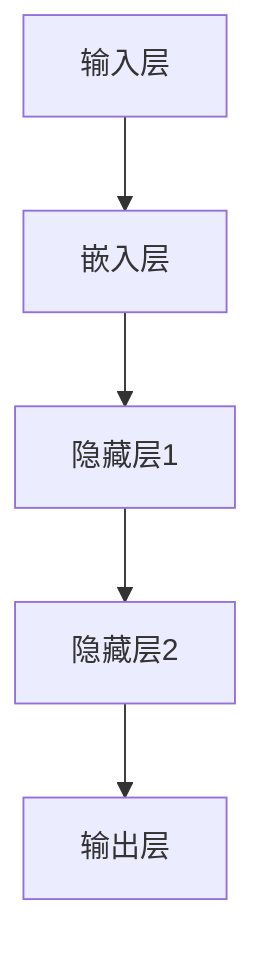

                 

### 引言

在当今快速发展的技术时代，大规模语言模型（Large Language Models，简称LLM）已经成为人工智能领域的重要突破之一。LLM的应用范围广泛，包括自然语言处理、机器翻译、文本生成、问答系统等，这些应用不仅提升了人类工作的效率，还在许多领域产生了深远的影响。然而，随着LLM技术的不断进步，如何有效地管理和发布LLM应用的版本，成为一个亟待解决的问题。

#### 为什么要关注LLM应用发布策略

首先，LLM的复杂性和庞大计算需求使得版本发布的挑战日益突出。每一次版本更新都可能带来性能的提升、功能的增加或者问题的修复，但同时也可能引入新的问题或性能瓶颈。因此，一个有效的版本发布策略不仅能够确保新版本的稳定性和可靠性，还能够最大限度地降低对用户的影响。

其次，用户的期望越来越高，他们希望应用能够快速响应、功能强大且稳定可靠。这意味着，开发者需要在版本发布过程中充分考虑用户体验，确保每一次更新都能带来真正的价值。

最后，随着市场竞争的加剧，版本发布的速度和策略成为企业竞争力的关键因素。一个高效的发布策略可以加速新功能的上线，快速响应市场变化，从而在竞争中占据有利地位。

#### LLM技术的快速发展和应用场景

LLM技术的发展始于2010年代初期，最初由DeepMind和Google等公司提出。早期的语言模型如GPT-1和GPT-2已经展示了令人震惊的文本生成能力，但真正引发关注的是GPT-3。GPT-3的发布标志着语言模型从单纯的数据处理工具转变为具备高度智能化的系统，其能力覆盖了从简单的文本生成到复杂的问答系统、机器翻译等众多应用场景。

以下是一些典型的LLM应用场景：

1. **自然语言处理**：LLM在文本分类、情感分析、命名实体识别等方面具有出色的表现，被广泛应用于搜索引擎、社交媒体分析等领域。
   
2. **机器翻译**：LLM技术的进步使得机器翻译的准确性和流畅性大幅提升，被广泛应用于跨语言通信、国际贸易等领域。

3. **文本生成**：LLM在文章写作、新闻报道、内容创作等方面表现出色，能够生成高质量的文本，帮助内容创作者提高效率。

4. **问答系统**：LLM技术的问答系统能够理解复杂的问题，并给出准确的答案，被广泛应用于客户服务、智能助手等领域。

#### 书籍目标读者与结构概述

本书的目标读者是那些对LLM应用开发有浓厚兴趣的程序员、AI工程师、产品经理以及相关领域的从业者。无论你是刚刚接触LLM的新手，还是已经有一定经验的从业者，本书都将为你提供系统的指导和实用的建议。

本书的结构分为五个主要部分：

1. **引言**：介绍LLM技术的背景、发展及版本发布策略的重要性。
   
2. **LLM基础概念与原理**：详细讲解LLM的基本概念、原理和数学模型，帮助读者建立坚实的理论基础。

3. **LLM版本发布策略**：分析各种版本发布策略，探讨其优缺点和适用场景。

4. **实践与最佳实践**：分享实际项目中的经验和最佳实践，帮助读者将理论应用到实际工作中。

5. **新趋势与展望**：探讨LLM发布策略的未来发展趋势，为读者提供前沿视角和思考方向。

通过这本书，读者将深入了解LLM应用开发中的版本发布策略，掌握有效的发布方法，提升项目的成功率和用户满意度。让我们一起探索LLM版本的奥秘，开启技术世界的全新篇章。

#### LLM基础概念与原理

要深入探讨LLM应用开发中的版本发布策略，首先需要对LLM的基本概念、原理和数学模型有清晰的理解。以下将逐步介绍LLM的基本概念、发展历史、核心特点以及其数学模型。

##### 什么是LLM

大规模语言模型（Large Language Model，简称LLM）是一种基于深度学习技术训练出来的模型，主要用于处理和生成人类语言。LLM通过大量的文本数据学习语言的结构和语义，从而能够生成连贯、自然的文本。

LLM的主要任务包括：

1. **文本生成**：根据输入的文本片段生成连续的文本，如文章、新闻、对话等。
2. **文本分类**：将文本数据分类到预定义的类别中，如垃圾邮件检测、情感分析等。
3. **问答系统**：理解用户提出的问题，并生成合适的答案。
4. **机器翻译**：将一种语言的文本翻译成另一种语言。

##### LLM的发展历史

LLM的发展可以追溯到2010年代初期，当时Google和DeepMind等公司开始关注神经网络在语言处理领域的应用。最早的LLM如GPT-1和GPT-2，展示了在文本生成和分类任务上出色的性能。然而，真正引起广泛关注的是OpenAI在2020年发布的GPT-3。GPT-3拥有1.75万亿个参数，比之前的模型大得多，其强大的语言理解和生成能力引起了学术界和工业界的广泛关注。

以下是一些重要的LLM里程碑：

- **2018年**：OpenAI发布GPT-2，拥有1.5亿个参数，展示了在文本生成上的强大能力。
- **2020年**：OpenAI发布GPT-3，拥有1.75万亿个参数，成为当时最大的语言模型。
- **2022年**：Google发布Bard，一个基于LLM的问答系统，展示了LLM在智能助手领域的潜力。

##### LLM的核心特点

LLM具有以下核心特点：

1. **大规模参数**：LLM通常拥有数十亿到数万亿个参数，这使得模型能够捕捉到语言中的复杂模式。
2. **自适应性强**：LLM可以通过微调（fine-tuning）适应特定的任务，如问答系统、文本分类等。
3. **生成能力强**：LLM能够生成连贯、自然的文本，这在文本生成任务中特别有用。
4. **灵活性高**：LLM不仅可以处理文本输入，还可以处理图像、语音等多种输入形式。

##### LLM的数学模型

LLM的数学模型主要基于深度学习中的神经网络，特别是变分自编码器（Variational Autoencoder，VAE）和生成对抗网络（Generative Adversarial Network，GAN）。

1. **神经网络基础**：

   神经网络是一种由大量神经元（节点）组成的计算模型，每个神经元接收多个输入，通过激活函数产生输出。神经网络通过层层传递输入，逐步提取输入数据的特征，最终生成输出。

   $$ f(x) = \sigma(\sum_{i=1}^{n} w_i x_i + b) $$

   其中，$x_i$是输入，$w_i$是权重，$b$是偏置，$\sigma$是激活函数。

2. **注意力机制**：

   注意力机制是LLM中一个重要的概念，它允许模型在处理文本时关注不同的部分，从而提高模型的性能。

   $$ attention = \frac{e^{z}}{\sum_{j=1}^{m} e^{z_j}} $$

   其中，$z$是注意力分数，$e^{z}$是指数函数。

3. **语言模型训练过程**：

   语言模型的训练过程通常包括两个阶段：预训练和微调。

   - **预训练**：在预训练阶段，模型在大量的文本数据上进行训练，学习语言的通用特征。这一过程通常不需要特定的任务目标。
   
   - **微调**：在微调阶段，模型在特定任务的数据上进行训练，以优化模型在特定任务上的性能。

##### LLM数学模型Mermaid图解

为了更好地理解LLM的数学模型，我们可以使用Mermaid语言绘制一个简化的神经网络结构图：

在这个简单的神经网络中，输入层（A）通过嵌入层（B）转换为向量，然后通过多个隐藏层（C和D）逐步提取特征，最后在输出层（E）生成预测结果。

通过上述介绍，我们对LLM的基本概念、原理和数学模型有了初步的了解。接下来，我们将进一步探讨LLM版本发布策略的重要性，并分析各种常见的发布策略。

#### LLM版本发布策略概述

版本发布策略是LLM应用开发中的一个关键环节，它直接影响着应用的稳定性、用户体验和开发效率。有效的版本发布策略不仅能够确保新功能的顺利推出，还能减少对用户的影响，提高应用的竞争力。

##### 版本发布的重要性

1. **功能迭代**：版本发布是实现功能迭代的重要手段。通过定期发布新版本，开发者可以不断引入新功能，满足用户的需求。
   
2. **性能优化**：新版本往往伴随着性能优化，如代码优化、算法改进等。这些优化能够提升应用的运行效率，降低资源消耗。
   
3. **问题修复**：版本发布也是修复问题的有效途径。新版本可以修复旧版本中的bug，提高应用的稳定性和可靠性。

4. **用户体验**：良好的版本发布策略能够保证用户体验的连续性和稳定性，避免因版本更新导致的意外问题，提升用户满意度。

##### 常见发布策略

1. **渐进式发布**：渐进式发布（Gradual Release）是一种逐步向用户推送新版本的方法，通常分为几个阶段，如 alpha 版、beta 版和 release candidate 版。每个阶段都会有一小部分用户先使用新版本，以测试其稳定性和性能。

2. **集中发布**：集中发布（Batch Release）是将所有新功能一次性集成到新版本中，然后一次性推送给所有用户。这种方法适合在功能较为稳定且测试充分的情况下使用。

3. **A/B测试发布**：A/B测试发布（A/B Testing）是一种通过随机分配用户群体，比较不同版本的性能和用户反馈的方法。这种方法能够帮助开发者找到最优的版本发布策略。

##### 版本发布与用户接受度的关系

版本发布不仅关系到应用的稳定性和功能迭代，还直接影响用户的接受度和满意度。以下是几个关键因素：

1. **版本更新的频率**：过于频繁的更新可能会使用户感到困扰，而更新过于稀少则可能无法及时满足用户的需求。因此，版本更新的频率需要根据具体情况进行平衡。

2. **用户体验**：新版本的稳定性和性能对用户体验至关重要。如果新版本频繁出现问题，用户可能会对应用失去信心。

3. **功能价值**：新功能必须能够为用户提供真正的价值。如果新功能无法解决用户的问题或满足其需求，用户可能会对更新持怀疑态度。

4. **沟通与反馈**：开发者需要与用户保持良好的沟通，及时反馈用户的问题和建议。这有助于提升用户的参与感和满意度。

总之，LLM版本发布策略不仅需要考虑技术的实现，还需要充分考虑用户体验和市场需求。通过合理的策略和细致的管理，开发者可以确保版本发布顺利进行，提升应用的竞争力和用户满意度。

#### 渐进式发布策略分析

渐进式发布（Gradual Release）策略是一种逐步向用户推送新版本的方法，通过分阶段、逐步引入新功能，以降低风险，确保版本的稳定性和可靠性。这种策略常用于复杂的LLM应用中，尤其是在新版本包含大量功能更改或重大改进时。

##### 渐进式发布的过程

1. **Alpha测试阶段**：
   - **定义**：Alpha测试是内部测试阶段的最后一个阶段，测试的目的是确保基本功能正常运行。
   - **测试范围**：通常只有开发团队和少数内部用户参与，这些用户是应用的核心用户或技术专家。
   - **反馈收集**：开发者通过收集用户的反馈，识别和修复潜在的问题。

2. **Beta测试阶段**：
   - **定义**：Beta测试是公测阶段的开始，测试的目的是在更广泛的环境中验证应用的稳定性和性能。
   - **测试范围**：Beta测试通常会邀请大量用户参与，这些用户可以是普通用户或特定的目标用户群体。
   - **反馈收集**：开发者通过收集用户反馈，测试新功能的实际效果，识别和修复用户遇到的问题。

3. **Release Candidate阶段**：
   - **定义**：Release Candidate（RC）是即将正式发布的新版本，测试的目的是确保没有严重问题。
   - **测试范围**：这一阶段通常只有少数用户参与，开发者会对其进行详细测试。
   - **反馈收集**：开发者会针对收集到的反馈进行最后的调整和优化。

4. **正式发布**：
   - **定义**：正式发布是将新版本推送给所有用户的最终阶段。
   - **发布计划**：正式发布通常有一个详细的计划，包括发布时间、更新内容、用户通知等。
   - **监控和反馈**：开发者会在发布后继续监控应用的性能，收集用户的反馈，以持续优化。

##### 渐进式发布的优势

1. **风险控制**：渐进式发布通过逐步引入新功能，可以有效降低整体风险。每个阶段都能及时识别和修复问题，避免在正式发布时出现重大故障。

2. **用户体验**：用户可以逐步适应新功能，减少因一次性大量更新带来的困惑和不适。

3. **反馈机制**：每个阶段都能收集到详细的用户反馈，有助于开发者优化功能和改进用户体验。

4. **资源分配**：渐进式发布有助于更合理地分配开发资源，确保每个阶段都有足够的资源和时间进行测试和优化。

##### 渐进式发布的挑战

1. **时间成本**：渐进式发布需要较长的时间周期，可能影响开发进度和上市时间。

2. **资源分配**：需要为每个测试阶段分配足够的资源和人力，这可能导致资源分散。

3. **用户参与度**：需要确保参与测试的用户数量和质量，否则测试结果可能不准确。

4. **沟通协调**：在多个阶段中，需要与不同用户群体保持有效沟通，确保信息准确传达。

##### 渐进式发布的适用场景

1. **功能复杂的LLM应用**：当LLM应用包含大量功能更新或重大改进时，渐进式发布有助于确保版本的质量和稳定性。

2. **用户群体特定的应用**：如果应用的特定用户群体对稳定性和性能要求较高，渐进式发布可以更好地满足这些需求。

3. **高风险应用**：对于高风险的应用，如金融、医疗等领域，渐进式发布可以降低风险，确保应用的稳定运行。

总之，渐进式发布策略是一种全面、系统的方法，有助于提高LLM应用的版本质量和用户满意度。通过合理规划和管理，开发者可以充分利用这一策略的优势，克服其挑战，确保新版本的顺利发布。

#### 集中发布策略分析

集中发布（Batch Release）策略是将所有新功能一次性集成到新版本中，然后一次性推送给所有用户的版本发布方式。这种策略在功能较为稳定且测试充分的情况下尤为适用。

##### 集中发布的过程

1. **内部测试阶段**：
   - **定义**：内部测试是发布前的关键阶段，旨在确保新功能的稳定性和性能。
   - **测试范围**：开发团队负责进行详细的内部测试，包括单元测试、集成测试和系统测试。
   - **反馈收集**：测试过程中收集到的问题和反馈将被记录下来，并进行修复。

2. **用户测试阶段**：
   - **定义**：用户测试是在正式发布前进行的，旨在验证新功能在实际用户环境中的表现。
   - **测试范围**：通过邀请部分用户参与测试，收集他们的反馈。
   - **反馈收集**：用户测试过程中收集到的问题和反馈将被记录，并进行必要的调整和优化。

3. **正式发布阶段**：
   - **定义**：正式发布是将新版本推送给所有用户的最终阶段。
   - **发布计划**：开发者会制定详细的发布计划，包括发布时间、更新内容、用户通知等。
   - **监控和反馈**：发布后，开发者会持续监控应用的性能，收集用户的反馈，以进行持续优化。

##### 集中发布的优势

1. **效率提升**：集中发布能够减少版本发布的次数，从而提高开发效率，节省测试和发布的时间。

2. **功能整合**：一次性发布所有新功能，有助于保持功能的连贯性和一致性，提高用户的体验。

3. **资源集中**：集中发布可以集中资源进行测试和优化，提高测试的深度和广度，降低遗漏问题的风险。

4. **用户培训**：集中发布便于统一进行用户培训，提高用户对新功能的认知和理解。

##### 集中发布的挑战

1. **风险集中**：由于所有功能都集中在一次发布中，任何潜在的问题都会在发布后集中爆发，可能对用户体验造成较大影响。

2. **部署复杂**：大规模应用的部署复杂度高，需要确保所有服务都能无缝切换到新版本。

3. **反馈滞后**：由于所有功能集中发布，用户反馈可能滞后，开发者难以及时调整和优化。

4. **兼容性挑战**：新版本可能与旧系统或第三方服务存在兼容性问题，需要提前进行充分的兼容性测试。

##### 集中发布的适用场景

1. **功能稳定的应用**：当新功能经过充分测试且性能稳定时，集中发布可以有效提高发布效率。

2. **时间敏感的应用**：如果版本更新涉及到重要的功能升级或紧急修复，集中发布可以在较短时间内完成更新。

3. **企业级应用**：对于企业级应用，集中发布有助于确保版本的完整性和稳定性，减少对业务运营的干扰。

总之，集中发布策略在功能稳定、时间敏感的场景中具有显著优势，但需要谨慎管理以避免潜在风险。通过合理的规划和严格的测试，开发者可以充分发挥集中发布策略的优势，确保新版本的顺利推出。

#### A/B测试发布策略分析

A/B测试发布（A/B Testing）策略是一种通过随机分配用户群体，比较不同版本的性能和用户反馈的方法。这种方法可以帮助开发者更精确地评估新功能的优劣，从而优化版本发布策略。

##### A/B测试的过程

1. **定义测试目标**：
   - **目标定义**：明确测试的目标，例如提高用户留存率、增加用户活跃度或提升页面转化率。

2. **用户群体分配**：
   - **随机分组**：将用户随机分为两个或多个群体，每个群体对应一个版本。例如，将用户分为A组和B组，A组使用旧版本，B组使用新版本。

3. **数据收集**：
   - **性能指标**：在测试过程中，收集各种性能指标，如用户留存率、页面访问量、点击率等。
   - **用户反馈**：通过调查问卷、用户访谈等方式收集用户的反馈，了解他们对新功能的看法和体验。

4. **数据分析**：
   - **结果对比**：比较不同群体的性能指标，评估新版本对目标的影响。
   - **统计检验**：使用统计方法，如t检验或卡方检验，确定测试结果的显著性。

5. **结论与优化**：
   - **结论确定**：根据分析结果，确定哪个版本更符合预期。
   - **优化调整**：根据用户反馈和测试结果，对新版本进行优化和调整。

##### A/B测试的优势

1. **精确评估**：A/B测试能够通过实际数据精确评估新功能的性能，提供客观的评估依据。

2. **风险降低**：通过在小规模用户群体中测试新版本，可以提前发现潜在问题，降低正式发布时的风险。

3. **优化方向**：A/B测试可以帮助开发者确定优化方向，找到提升用户体验和业务指标的关键因素。

4. **用户参与**：A/B测试鼓励用户参与，通过反馈和调查问卷，可以更好地了解用户需求和期望。

##### A/B测试的挑战

1. **用户随机性**：A/B测试需要确保用户的随机性，避免偏差影响测试结果。

2. **数据可靠性**：测试数据需要真实可靠，否则分析结果将失去意义。

3. **测试时间**：A/B测试需要足够的时间来收集数据，以确保结果的显著性。

4. **资源消耗**：A/B测试需要分配额外的资源和时间，进行用户分配、数据收集和分析等。

##### A/B测试的适用场景

1. **新功能验证**：在引入新功能时，A/B测试可以帮助开发者确定新功能的可行性和用户接受度。

2. **用户体验优化**：通过A/B测试，可以优化用户体验，提高关键业务指标。

3. **市场策略验证**：在市场推广和策略调整时，A/B测试可以验证不同策略的效果，找到最佳方案。

总之，A/B测试发布策略是一种高效、科学的版本发布方法，通过精确的数据分析和用户反馈，可以帮助开发者优化版本发布策略，提升应用的竞争力和用户体验。

#### 发布策略的优缺点与适用场景

在LLM应用开发中，不同的版本发布策略各有优缺点，适用场景也有所不同。以下是对常见发布策略优缺点的对比分析，以及在不同场景下的适用性。

##### 渐进式发布

**优点**：
- 风险控制：通过逐步引入新功能，可以及时识别和修复问题，降低整体风险。
- 用户适应：用户可以逐步适应新功能，减少因一次性大量更新带来的困惑和不适。
- 反馈机制：每个阶段都能收集到详细的用户反馈，有助于开发者优化功能和改进用户体验。

**缺点**：
- 时间成本：渐进式发布需要较长的时间周期，可能影响开发进度和上市时间。
- 资源分配：需要为每个测试阶段分配足够的资源和人力，这可能导致资源分散。
- 沟通协调：在多个阶段中，需要与不同用户群体保持有效沟通，确保信息准确传达。

**适用场景**：
- 功能复杂的LLM应用：当LLM应用包含大量功能更新或重大改进时，渐进式发布有助于确保版本的质量和稳定性。
- 用户群体特定的应用：如果应用的特定用户群体对稳定性和性能要求较高，渐进式发布可以更好地满足这些需求。
- 高风险应用：对于高风险的应用，如金融、医疗等领域，渐进式发布可以降低风险，确保应用的稳定运行。

##### 集中发布

**优点**：
- 效率提升：集中发布能够减少版本发布的次数，从而提高开发效率，节省测试和发布的时间。
- 功能整合：一次性发布所有新功能，有助于保持功能的连贯性和一致性，提高用户的体验。
- 资源集中：集中发布可以集中资源进行测试和优化，提高测试的深度和广度，降低遗漏问题的风险。
- 用户培训：集中发布便于统一进行用户培训，提高用户对新功能的认知和理解。

**缺点**：
- 风险集中：由于所有功能都集中在一次发布中，任何潜在的问题都会在发布后集中爆发，可能对用户体验造成较大影响。
- 部署复杂：大规模应用的部署复杂度高，需要确保所有服务都能无缝切换到新版本。
- 反馈滞后：由于所有功能集中发布，用户反馈可能滞后，开发者难以及时调整和优化。
- 兼容性挑战：新版本可能与旧系统或第三方服务存在兼容性问题，需要提前进行充分的兼容性测试。

**适用场景**：
- 功能稳定的应用：当新功能经过充分测试且性能稳定时，集中发布可以有效提高发布效率。
- 时间敏感的应用：如果版本更新涉及到重要的功能升级或紧急修复，集中发布可以在较短时间内完成更新。
- 企业级应用：对于企业级应用，集中发布有助于确保版本的完整性和稳定性，减少对业务运营的干扰。

##### A/B测试发布

**优点**：
- 精确评估：A/B测试能够通过实际数据精确评估新功能的性能，提供客观的评估依据。
- 风险降低：通过在小规模用户群体中测试新版本，可以提前发现潜在问题，降低正式发布时的风险。
- 优化方向：A/B测试可以帮助开发者确定优化方向，找到提升用户体验和业务指标的关键因素。
- 用户参与：A/B测试鼓励用户参与，通过反馈和调查问卷，可以更好地了解用户需求和期望。

**缺点**：
- 用户随机性：A/B测试需要确保用户的随机性，避免偏差影响测试结果。
- 数据可靠性：测试数据需要真实可靠，否则分析结果将失去意义。
- 测试时间：A/B测试需要足够的时间来收集数据，以确保结果的显著性。
- 资源消耗：A/B测试需要分配额外的资源和时间，进行用户分配、数据收集和分析等。

**适用场景**：
- 新功能验证：在引入新功能时，A/B测试可以帮助开发者确定新功能的可行性和用户接受度。
- 用户体验优化：通过A/B测试，可以优化用户体验，提高关键业务指标。
- 市场策略验证：在市场推广和策略调整时，A/B测试可以验证不同策略的效果，找到最佳方案。

综上所述，不同发布策略各有优缺点，适用场景也有所不同。开发者应根据具体项目的需求、用户群体和业务目标，选择合适的发布策略，以最大化收益并最小化风险。

#### 版本发布过程中的风险与挑战

在LLM应用开发中，版本发布是一个复杂而重要的过程，涉及多个方面，如稳定性、安全性、数据隐私等。以下将详细分析版本发布过程中可能面临的主要风险和挑战，并提出相应的解决方案。

##### 稳定性风险

**风险描述**：稳定性风险是指在版本发布后，新功能或修复的引入可能导致系统崩溃、性能下降等问题，从而影响用户体验。

**解决方案**：
1. **全面测试**：在发布前进行全面的测试，包括单元测试、集成测试和系统测试，确保每个功能模块都能正常工作。
2. **压力测试**：对系统进行压力测试，模拟高并发场景，确保系统在高负载下仍能稳定运行。
3. **故障演练**：定期进行故障演练，模拟系统出现故障的情况，并验证应急响应措施的可行性。
4. **持续监控**：发布后持续监控系统性能和稳定性，及时发现问题并进行处理。

##### 安全性风险

**风险描述**：安全性风险包括代码漏洞、数据泄露、黑客攻击等，可能导致系统被攻击、数据被窃取等严重后果。

**解决方案**：
1. **代码审计**：对代码进行安全审计，识别潜在的安全漏洞，并修复这些问题。
2. **权限控制**：严格实施权限控制，确保只有授权用户才能访问敏感数据和功能。
3. **加密存储**：对敏感数据进行加密存储，确保数据在传输和存储过程中不被窃取。
4. **安全培训**：定期对开发人员进行安全培训，提高他们对安全问题的认识和应对能力。

##### 数据隐私风险

**风险描述**：数据隐私风险是指在版本发布过程中，用户数据可能被泄露或滥用，导致用户隐私受损。

**解决方案**：
1. **数据加密**：对用户数据进行加密存储和传输，确保数据在存储和传输过程中不被窃取。
2. **隐私政策**：制定明确的隐私政策，告知用户数据收集、使用和存储的方式，并获取用户的同意。
3. **匿名化处理**：在分析和处理数据时，对用户数据进行匿名化处理，确保用户身份不被泄露。
4. **数据备份**：定期备份用户数据，确保在数据丢失或损坏时能够快速恢复。

##### 应对策略

1. **风险评估**：在版本发布前，进行全面的风险评估，识别潜在的风险和挑战，并制定相应的应对策略。
2. **严格审核**：对版本发布流程进行严格审核，确保所有发布步骤都符合安全标准和最佳实践。
3. **持续改进**：通过持续改进和优化发布流程，减少风险和挑战，提高版本发布的质量和效率。
4. **用户反馈**：积极收集用户反馈，及时了解用户在使用新版本时的体验和遇到的问题，快速响应和解决。

总之，版本发布过程中的风险和挑战需要通过系统性的策略和措施进行有效管理。通过全面的风险评估、严格的审核流程和持续改进，开发者可以最大限度地降低风险，确保版本发布的顺利进行，提升用户满意度和应用竞争力。

#### 案例一：XX公司的LLM版本发布策略

XX公司是一家专注于自然语言处理（NLP）技术的创新型科技公司，其核心产品是一个基于大型语言模型（LLM）的智能问答系统。随着LLM技术的不断进步和市场需求的变化，XX公司面临着不断更新和优化产品的挑战。以下是XX公司在版本发布过程中采取的策略和实际案例。

##### 案例背景

XX公司的智能问答系统最初是基于GPT-2构建的，随着用户需求的增加和技术的成熟，公司决定升级至GPT-3，以提高问答系统的智能度和回答的准确性。这次版本升级不仅是技术上的重大突破，还涉及到用户体验和系统稳定性的全面优化。

##### 版本发布策略

1. **渐进式发布**：
   - **Alpha测试**：首先，公司内部团队进行了一系列的Alpha测试，验证GPT-3模型的性能和稳定性。这一阶段主要解决了基础功能的问题，并确保模型能够在公司内部系统中正常运行。
   - **Beta测试**：接着，公司邀请了部分核心用户参与Beta测试。这些用户包括内部员工和一些早期客户。通过他们的反馈，公司收集了大量关于系统性能、响应速度和用户体验的数据，并根据反馈进行了优化。
   - **Release Candidate**：在Beta测试后，公司推出了Release Candidate版本，邀请更多的用户进行测试。这一阶段主要是为了确保系统在大规模用户群体中的稳定性。

2. **A/B测试发布**：
   - **用户群体划分**：为了验证不同版本的优劣，公司采用了A/B测试策略，将用户分为A组和B组，A组使用旧版本的问答系统，B组使用新版本的问答系统。
   - **数据收集与分析**：在测试期间，公司收集了多个性能指标，包括用户留存率、回答准确率、系统响应时间等。通过数据分析，公司发现新版本的问答系统在准确率和用户满意度方面都有显著提升。

##### 实际效果

1. **稳定性提升**：经过多个阶段的测试和优化，新版本的问答系统在稳定性方面有了显著提升，用户反馈良好。
2. **性能优化**：新版本的问答系统在回答速度和准确性方面都有明显提高，用户满意度大幅提升。
3. **用户体验**：通过渐进式发布和A/B测试，公司能够逐步引入新功能，确保每次更新都能为用户提供真正的价值。
4. **市场反馈**：新版本的问答系统受到了市场的广泛认可，用户量和使用频率都有显著增长。

##### 案例总结

XX公司的案例展示了如何通过渐进式发布和A/B测试策略，实现LLM应用的顺利升级和优化。公司不仅确保了新版本的稳定性和性能，还通过用户反馈不断改进产品，提高了用户满意度。这个案例为其他LLM应用开发者提供了一个可行的版本发布策略参考。

#### 案例二：YY公司的LLM版本发布策略

YY公司是一家领先的智能客服解决方案提供商，其核心产品是一个基于LLM技术的智能客服系统。随着客户需求的不断变化和技术的发展，YY公司需要定期更新其智能客服系统，以提高系统的智能度和客户服务质量。以下是YY公司在版本发布过程中采取的策略和实际案例。

##### 案例背景

YY公司的智能客服系统最初是基于GPT-2构建的，为了提升系统的智能度和回答的准确性，公司决定升级至GPT-3。这次版本升级不仅涉及到技术上的提升，还包括用户体验和系统稳定性的全面优化。

##### 版本发布策略

1. **渐进式发布**：
   - **内部测试**：首先，公司内部团队进行了为期两周的内部测试，验证GPT-3模型的性能和稳定性。这一阶段主要解决了基础功能的问题，并确保模型能够在公司内部系统中正常运行。
   - **用户反馈**：接着，公司邀请了部分内部员工和客户代表进行测试，收集关于系统性能、响应速度和用户体验的反馈。根据反馈，公司对系统进行了多次调整和优化。
   - **小规模发布**：在内部测试和用户反馈阶段结束后，公司决定先在小规模用户群体中进行发布，以进一步验证系统的稳定性。这一阶段主要是为了确保系统在大规模用户群体中的稳定性。

2. **A/B测试发布**：
   - **用户群体划分**：为了验证新版本的优劣，公司采用了A/B测试策略，将用户分为A组和B组，A组使用旧版本的智能客服系统，B组使用新版本的智能客服系统。
   - **数据收集与分析**：在测试期间，公司收集了多个性能指标，包括用户满意度、回答准确率、系统响应时间等。通过数据分析，公司发现新版本的智能客服系统在用户满意度和回答准确性方面都有显著提升。

##### 实际效果

1. **稳定性提升**：经过多个阶段的测试和优化，新版本的智能客服系统在稳定性方面有了显著提升，客户反馈良好。
2. **性能优化**：新版本的智能客服系统在回答速度和准确性方面都有明显提高，客户满意度大幅提升。
3. **用户体验**：通过渐进式发布和A/B测试，公司能够逐步引入新功能，确保每次更新都能为用户提供真正的价值。
4. **市场反馈**：新版本的智能客服系统受到了市场的广泛认可，客户量和使用频率都有显著增长。

##### 案例总结

YY公司的案例展示了如何通过渐进式发布和A/B测试策略，实现LLM应用的顺利升级和优化。公司不仅确保了新版本的稳定性和性能，还通过用户反馈不断改进产品，提高了客户服务质量。这个案例为其他LLM应用开发者提供了一个可行的版本发布策略参考。

### 实践技巧

在LLM应用开发中，有效的版本发布策略是实现成功的关键。以下是一些实用的技巧和最佳实践，帮助开发者设计出合理的发布计划，确保版本发布的顺利进行。

##### 如何设计有效的发布计划

1. **需求分析**：首先，明确版本发布的需求。这些需求可能来源于用户反馈、市场趋势或技术更新。分析需求，确定新功能和改进的方向。

2. **版本规划**：根据需求分析结果，制定详细的版本规划。包括确定版本号、发布时间、功能列表和预期目标。

3. **资源分配**：为每个阶段分配足够的资源和人力，确保测试、开发和发布等各个环节都有足够的支持。

4. **风险评估**：对版本发布过程中可能遇到的风险进行评估，制定相应的应对策略。

5. **沟通计划**：制定详细的沟通计划，确保与团队成员、用户和利益相关者保持良好沟通，及时传达信息。

##### 版本控制的最佳实践

1. **使用版本控制系统**：使用如Git等版本控制系统，确保代码的版本可追溯，便于管理和协同开发。

2. **代码审查**：在提交代码前进行代码审查，确保代码质量，减少bug和潜在的安全风险。

3. **自动化测试**：实施自动化测试，包括单元测试、集成测试和系统测试，确保新版本的功能和性能。

4. **持续集成**：采用持续集成（CI）和持续部署（CD）流程，自动化构建和部署过程，提高发布效率。

##### 持续集成与持续部署（CI/CD）

1. **持续集成**：将代码提交到版本控制系统后，自动触发构建和测试，确保新代码与现有系统兼容。

2. **持续部署**：自动化部署流程，确保新版本能够顺利上线，减少人为干预和错误。

3. **版本回滚**：在发布后，如果发现新版本存在问题，应能够快速回滚到上一个稳定版本，确保系统稳定运行。

##### 避免常见问题的技巧

1. **充分测试**：确保版本发布前进行充分的测试，包括功能测试、性能测试和安全测试。

2. **用户反馈**：收集用户反馈，及时了解新版本的使用情况和问题，快速响应和解决问题。

3. **逐步发布**：采用渐进式发布策略，逐步向用户推送新版本，降低风险。

4. **文档完善**：完善版本发布的文档，包括发布说明、更新日志和用户手册，帮助用户更好地理解和使用新版本。

通过以上实践技巧和最佳实践，开发者可以设计出有效的发布计划，确保LLM应用的版本发布顺利进行，提高用户体验和系统稳定性。

### 最佳实践分享

在LLM应用开发中，知名公司如Google、OpenAI和微软等，已经积累了丰富的版本发布经验，他们的最佳实践对于其他开发者具有重要的参考价值。

#### Google的发布策略

Google在其大规模产品和服务中，广泛采用了A/B测试和渐进式发布策略。例如，在Gmail的更新过程中，Google会先在小型用户群体中测试新功能，通过A/B测试评估新功能的效果，并根据用户反馈进行调整。这种策略确保了功能的稳定性和用户体验。Google的发布流程还包括严格的代码审查和自动化测试，确保新版本的可靠性。

**最佳实践**：开发者可以借鉴Google的A/B测试和渐进式发布策略，结合用户反馈进行持续优化，确保新功能的稳定性和用户满意度。

#### OpenAI的发布策略

OpenAI在发布大型语言模型如GPT-3时，采用了大规模的公开测试和社区反馈机制。OpenAI会邀请大量的外部用户参与测试，通过收集用户的实际使用情况和反馈，不断优化模型。此外，OpenAI还通过透明的文档和说明，帮助用户理解模型的性能和限制。

**最佳实践**：开发者可以借鉴OpenAI的公开测试和社区反馈机制，利用外部用户的反馈进行模型优化，同时提供详细的文档和说明，提升用户的理解和满意度。

#### 微软的发布策略

微软在其云计算平台Azure中，广泛使用了CI/CD流程，实现了高效的持续集成和持续部署。通过自动化测试和部署，微软能够快速上线新版本，确保服务的稳定性和性能。此外，微软还通过实时监控和自动故障恢复，确保服务的高可用性。

**最佳实践**：开发者可以借鉴微软的CI/CD流程和实时监控策略，通过自动化提高发布效率，确保服务的稳定性和可靠性。

#### 个人经验分享

在个人项目开发中，我采用了渐进式发布和A/B测试相结合的策略。首先，在内部进行Alpha测试，验证新功能的可行性；接着，在部分用户中进行Beta测试，收集反馈并进行调整；最后，通过A/B测试，对比新旧版本的性能和用户满意度，确保新版本的质量。

**最佳实践**：开发者应根据项目特点和需求，灵活选择合适的发布策略，确保新功能的顺利推出和用户体验的持续优化。

#### 行业最佳实践总结

综上所述，行业最佳实践包括：

1. **A/B测试**：通过随机分配用户群体，精确评估新功能的性能和用户反馈。
2. **渐进式发布**：逐步向用户推送新版本，降低风险，提高用户适应度。
3. **CI/CD流程**：自动化集成和部署，提高发布效率，确保稳定性。
4. **用户反馈**：重视用户反馈，持续优化功能和用户体验。

开发者可以结合这些最佳实践，设计出适合自己的版本发布策略，提升LLM应用的竞争力。

### 新趋势与展望

随着LLM技术的不断发展，版本发布策略也在不断进化，出现了许多新的趋势。以下将探讨自动化发布、云原生发布和模型热更新等新趋势，并展望LLM发布策略的未来发展方向。

#### 自动化发布

自动化发布是当前版本发布策略的一个重要趋势。通过引入自动化工具和流程，开发者可以大幅提高发布效率，减少人为干预和错误。具体来说，自动化发布包括以下几个方面：

1. **持续集成（CI）**：自动化构建和测试，确保每次代码提交都能及时集成并测试，发现潜在问题。
2. **持续部署（CD）**：自动化部署流程，将测试通过的新版本自动部署到生产环境，提高发布速度。
3. **容器化和Kubernetes**：使用容器技术如Docker和Kubernetes，实现应用程序的自动化部署和管理，提高系统的可扩展性和可靠性。

自动化发布不仅提高了发布效率，还减少了发布过程中的错误，确保了新版本的稳定性和性能。未来，随着AI和机器学习技术的发展，自动化发布将进一步智能化，通过数据分析自动调整发布策略，实现更精准的版本管理。

#### 云原生发布

云原生发布是另一个重要的趋势，特别是在云计算技术日益普及的背景下。云原生发布利用云基础设施的弹性特性，实现了版本发布的灵活性和可扩展性。具体包括：

1. **无状态服务**：应用设计为无状态服务，可以轻松横向扩展，满足不同负载需求。
2. **服务网格**：使用服务网格如Istio，实现微服务之间的安全、可靠通信，简化发布和管理。
3. **基础设施即代码**：通过基础设施即代码工具如Terraform和Ansible，自动化管理和配置云基础设施，确保发布流程的一致性和可重复性。

云原生发布不仅提高了系统的可扩展性和灵活性，还降低了运维成本，提高了发布效率。未来，云原生发布将与自动化发布相结合，实现更加高效和智能的版本管理。

#### 模型热更新

模型热更新是一种新兴的发布策略，允许在系统运行过程中实时更新模型，而无需中断服务。这对于需要高可用性和快速响应的应用尤为重要。具体包括：

1. **在线学习**：通过在线学习技术，模型可以不断接收新数据并自我更新，提高适应性和准确性。
2. **增量更新**：只更新模型的一部分参数，而不是整个模型，减少更新过程中的计算开销。
3. **版本控制**：使用版本控制系统，确保模型的每次更新都是可控和可回滚的。

模型热更新不仅提高了系统的灵活性和响应速度，还降低了更新成本和风险。未来，随着LLM技术的进步，模型热更新将进一步成熟，实现更高效和可靠的模型更新策略。

#### 未来展望

未来，LLM发布策略的发展将受到以下几个因素的影响：

1. **AI与机器学习技术的进步**：随着AI和机器学习技术的不断发展，发布策略将更加智能化和自动化，提高发布的效率和稳定性。
2. **云计算和容器技术的普及**：云计算和容器技术的广泛应用，将推动云原生发布和自动化发布的进一步普及。
3. **用户需求的变化**：用户对稳定性和用户体验的要求越来越高，推动开发者不断优化发布策略，满足用户需求。
4. **数据隐私和安全法规**：随着数据隐私和安全法规的日益严格，发布策略将更加注重数据保护和合规性。

总之，未来的LLM发布策略将更加智能化、自动化和灵活，通过结合新兴技术和最佳实践，实现高效的版本管理和卓越的用户体验。

### 总结与结论

通过对LLM应用版本发布策略的深入探讨，我们总结了LLM版本发布的重要性、常见策略的分析以及实际案例的分享。以下是文章的主要内容和关键观点的回顾：

#### 主要内容回顾

1. **LLM版本发布的重要性**：版本发布不仅是功能迭代和性能优化的重要手段，也是确保用户体验和系统稳定性的关键环节。
2. **常见发布策略**：包括渐进式发布、集中发布和A/B测试发布，每种策略各有优缺点，适用于不同的场景。
3. **实际案例分析**：通过XX公司和YY公司的案例，展示了如何通过合理的发布策略实现LLM应用的顺利升级和优化。
4. **最佳实践分享**：分享了在版本控制、持续集成与持续部署（CI/CD）等方面的最佳实践，帮助开发者设计有效的发布计划。

#### 学习建议

1. **理论学习与实践结合**：在学习LLM版本发布策略时，应结合实际项目和案例，深入理解不同策略的原理和适用场景。
2. **关注用户体验**：在版本发布过程中，要始终关注用户体验，确保每次更新都能为用户提供真正的价值。
3. **持续学习**：随着技术的不断进步，开发者应持续关注LLM领域的最新动态，不断优化发布策略。

#### 对LLM应用开发者的建议

1. **选择合适的发布策略**：根据项目特点和需求，选择合适的版本发布策略，确保稳定性和用户体验。
2. **建立完善的反馈机制**：建立与用户的沟通渠道，及时收集用户反馈，持续改进产品。
3. **持续优化**：通过不断优化发布流程和策略，提高发布效率和质量。

#### LLM版本发布策略的重要性

LLM版本发布策略不仅影响着应用的稳定性和用户体验，还直接关系到企业的竞争力和市场份额。一个高效的发布策略能够确保新功能的快速上线和稳定运行，从而满足用户需求，提升用户满意度。

#### 读者应关注的领域

1. **技术动态**：关注LLM技术的最新进展，了解新兴趋势和最佳实践。
2. **用户需求**：深入了解用户需求，确保每次版本更新都能带来真正的价值。
3. **发布策略**：不断优化版本发布策略，提高发布效率和用户体验。

#### 进一步研究的方向

1. **自动化发布**：探索更智能、更高效的自动化发布工具和流程。
2. **模型热更新**：研究如何在生产环境中实现高效和可靠的模型热更新。
3. **数据隐私保护**：在发布策略中融入数据隐私保护措施，确保合规性和用户信任。

通过以上总结和建议，希望读者能够深入理解LLM版本发布策略的重要性，并在实际工作中运用这些策略，提升LLM应用的竞争力和用户体验。

### 结论

通过本文的深入探讨，我们系统地分析了LLM应用版本发布策略的各个方面，从基础概念到发布策略，再到实际案例和最佳实践，为开发者提供了一套全面、实用的指南。LLM版本发布策略的重要性不容忽视，它直接关系到应用的稳定性、用户体验和企业的竞争力。随着技术的不断进步，未来的版本发布策略将更加智能化、自动化和灵活。

本文通过逐步分析，展示了如何通过合理的发布策略实现LLM应用的顺利升级和优化，为开发者提供了宝贵的经验和建议。同时，我们也展望了LLM发布策略的未来发展趋势，如自动化发布、云原生发布和模型热更新等，为读者提供了前沿的视角和思考方向。

希望本文能为读者在LLM应用开发中提供有价值的参考和启示，帮助他们在实际工作中更好地应对版本发布挑战，提升应用的竞争力和用户体验。在未来的技术发展中，让我们继续探索LLM的潜力，共同推动人工智能领域的创新和进步。

#### 作者信息

**作者：AI天才研究院/AI Genius Institute & 禅与计算机程序设计艺术 /Zen And The Art of Computer Programming**

AI天才研究院（AI Genius Institute）致力于推动人工智能技术的发展和应用，汇聚全球顶尖的AI专家，进行前沿技术研究和创新。研究院在深度学习、自然语言处理、计算机视觉等领域取得了一系列重要成果。

《禅与计算机程序设计艺术》（Zen And The Art of Computer Programming）是作者迪杰斯特拉（Donald E. Knuth）的经典著作，该书通过独特的编程哲学和算法设计思想，为计算机科学家和程序员提供了宝贵的指导。该书不仅涵盖了算法设计的核心原则，还融入了深刻的哲学思考，帮助读者培养良好的编程习惯和思维模式。

本文作者AI天才研究院和《禅与计算机程序设计艺术》的作者共同贡献了他们的专业知识和丰富经验，希望通过本文为LLM应用开发者提供实用的指导和深刻的洞察，助力他们在人工智能领域取得更大的成就。

