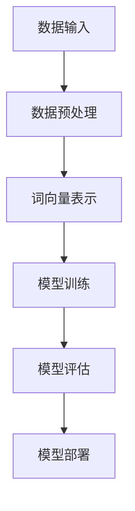

                 

### 第1章: LLM应用开发的概述

#### 1.1.1 问题背景

随着人工智能（AI）技术的发展，自然语言处理（NLP）领域取得了显著成果，其中大型语言模型（LLM）如GPT-3、BERT等更是引发了广泛关注。LLM具有强大的语言理解和生成能力，可以应用于文本生成、问答系统、翻译、情感分析等多种场景。然而，在实际应用开发中，如何有效地利用LLM来提升用户体验，仍是一个亟待解决的问题。

#### 1.1.2 问题解决

本章节将围绕LLM应用开发中的用户体验设计展开讨论。首先，我们将介绍LLM的基本概念，探讨其在应用开发中的重要性。接着，我们将详细分析用户体验设计的原则和方法，以帮助开发者更好地利用LLM提升应用效果。此外，本章还将讨论如何在实际应用中处理LLM与用户体验设计之间的边界与外延问题。

#### 1.1.3 边界与外延

在本章节中，我们将主要关注LLM在应用开发中的用户体验设计，不涉及其他AI技术。此外，我们将重点关注LLM的应用场景，如文本生成、问答系统、翻译和情感分析等，以展示如何在不同场景中优化用户体验。

#### 1.1.4 概念结构与核心要素组成

本章的核心概念包括：

- **LLM**: 一种大规模训练的语言模型，能够理解、生成自然语言文本。
- **NLP**: 自然语言处理，是AI领域的一个重要分支，涉及对人类语言的理解和生成。
- **应用开发**: 指利用AI技术（如LLM）开发实际应用的过程。
- **用户体验设计**: 关注用户在使用产品或服务过程中的感受、行为和满意度。

核心要素组成如下：

- **理解LLM的工作原理**：包括LLM的基本概念、训练过程和特点。
- **应用场景分析**：探讨LLM在文本生成、问答系统、翻译和情感分析等场景中的应用。
- **用户体验设计原则**：介绍用户体验设计的基本原则和方法。
- **实践案例分析**：通过实际案例展示如何利用LLM和用户体验设计提升应用效果。

通过本章的学习，读者将能够：

- 理解LLM的基本概念和特点。
- 掌握用户体验设计的基本原则和方法。
- 学会如何在应用开发过程中利用LLM提升用户体验。
- 分析并解决实际应用中遇到的问题，优化用户体验。

### 1.2 大型语言模型（LLM）的基本概念

#### 1.2.1 什么是LLM

大型语言模型（LLM，Large Language Model）是一种基于深度学习技术的自然语言处理模型，它通过大量的文本数据进行训练，能够理解和生成自然语言文本。与传统的基于规则或统计方法的NLP模型相比，LLM具有更高的准确性和更强的泛化能力。

#### 1.2.2 LLM的发展历程

LLM的发展历程可以分为几个阶段：

- **早期模型**：如Word2Vec、GloVe等，这些模型通过将单词映射到高维向量空间，实现了对词义的表示。
- **过渡模型**：如序列到序列（Seq2Seq）模型、长短时记忆网络（LSTM）等，这些模型在处理序列数据时表现出更强的能力。
- **现代模型**：如Transformer、BERT、GPT等，这些模型通过引入注意力机制、多任务学习等技术，显著提升了模型的性能。

#### 1.2.3 LLM的核心特点

- **大规模**：LLM通常使用数十亿甚至千亿级的参数，能够处理大量数据，从而提高模型的性能。
- **自适应性**：LLM可以通过微调（Fine-tuning）技术在特定任务上进行调整，适应不同的应用场景。
- **准确性**：LLM在语言理解和生成任务上表现出色，能够生成高质量的自然语言文本。
- **效率**：随着计算资源的提升，LLM的训练和推断速度逐渐提高，使其在实时应用中成为可能。

#### 1.2.4 LLM在应用开发中的重要性

LLM在应用开发中具有广泛的应用前景，主要包括以下几个方面：

- **文本生成**：如自动写作、摘要生成、聊天机器人等，LLM可以生成高质量的自然语言文本，提高内容生产的效率。
- **问答系统**：如搜索引擎、智能客服等，LLM可以理解用户的问题，并提供准确的答案。
- **翻译**：如机器翻译、多语言对话系统等，LLM可以处理不同语言之间的翻译任务，提高翻译的准确性和流畅度。
- **情感分析**：如社交媒体情感分析、客户反馈分析等，LLM可以识别文本中的情感倾向，帮助企业和组织更好地了解用户需求。

通过了解LLM的基本概念、特点和应用，开发者可以更好地利用LLM技术，开发出更智能、更高效的应用产品，从而提升用户体验。

#### 1.2.5 用户体验设计的基本原则

在LLM应用开发过程中，用户体验设计（UX Design）是确保用户满意度和产品成功的关键因素。以下是用户体验设计的基本原则，这些原则将帮助开发者更好地理解用户需求，设计出易于使用、用户喜爱的应用。

**1.1. 简化流程**

简化用户操作流程是提升用户体验的首要原则。通过减少用户完成任务所需的步骤，可以降低用户的学习成本，提高操作效率。例如，在聊天机器人中，可以设计简洁明了的对话流程，让用户快速得到所需信息。

**1.2. 提高可访问性**

可访问性指的是产品对各类用户（包括不同年龄段、能力水平和设备）的适应性。在设计过程中，应确保应用界面清晰易懂，易于操作。同时，考虑支持无障碍访问，如提供屏幕阅读器支持，满足视力障碍用户的需求。

**1.3. 个性化**

个性化设计可以增强用户的参与感和满意度。通过收集和分析用户数据，可以提供定制化推荐和服务。例如，在智能客服中，可以根据用户的喜好和习惯，提供个性化的解决方案。

**1.4. 一致性**

一致性是确保用户在不同场景下都能获得一致体验的重要原则。一致性包括界面设计的一致性、交互元素的一致性和操作逻辑的一致性。通过一致性设计，可以减少用户的困惑和错误操作。

**1.5. 反馈机制**

有效的反馈机制可以帮助用户了解当前状态，确认操作结果。例如，在填写表单时，应提供实时错误提示，帮助用户及时修正错误。此外，通过提供操作成功或失败的反馈信息，可以增强用户的信心。

**1.6. 可用性测试**

可用性测试是验证用户体验设计有效性的重要手段。通过观察用户在实际使用产品时的行为和反应，可以发现设计中的问题，并进行优化。例如，在发布新功能前，可以邀请一组用户进行试用，收集反馈意见。

通过遵循上述用户体验设计原则，开发者可以在LLM应用开发过程中，为用户提供更优质、更贴心的服务，从而提高用户满意度和产品竞争力。

#### 1.2.6 用户体验设计的方法

在LLM应用开发中，用户体验设计（UX Design）是一个系统性工程，需要通过多种方法和工具来确保设计满足用户需求。以下是几种常见的用户体验设计方法：

**1.1. 用户调研**

用户调研是了解用户需求和行为的重要步骤。通过访谈、问卷调查、用户观察等方法，可以收集用户反馈，识别用户痛点。这些数据有助于开发者更准确地把握用户需求，从而设计出更具针对性的产品。

**1.2. 用户画像**

用户画像是对目标用户进行抽象和概括的过程，包括用户的年龄、性别、职业、兴趣等信息。通过创建用户画像，可以更好地理解用户群体，有针对性地设计产品功能和界面。

**1.3. 原型设计**

原型设计是用户体验设计的重要环节，通过制作低保真或高保真的原型，开发者可以直观地展示产品概念和交互流程。原型设计可以帮助团队尽早发现设计问题，并在迭代过程中不断优化。

**1.4. 用户测试**

用户测试是在产品开发过程中验证设计有效性的关键步骤。通过邀请用户参与实际操作，开发者可以观察用户的操作行为，收集用户反馈。这些数据有助于评估产品设计的可用性和用户体验，为后续改进提供依据。

**1.5. 可用性评估**

可用性评估是通过一系列标准化的测试方法，对产品的可用性进行评估。常用的评估方法包括任务完成时间、错误率、用户满意度等。通过可用性评估，可以量化产品的用户体验，发现设计中的不足之处。

通过上述用户体验设计方法，开发者可以确保LLM应用在实际使用过程中具备良好的用户体验，从而提升用户满意度和产品竞争力。

### 第2章: LLM的核心概念与联系

#### 2.1.1 LLM的定义与特点

大型语言模型（LLM，Large Language Model）是一种通过深度学习技术训练而成的自然语言处理模型，能够理解和生成自然语言文本。LLM的核心特点包括：

- **大规模**：LLM通常使用数十亿甚至千亿级的参数，能够处理大量数据，从而提高模型的性能和泛化能力。
- **自适应性**：LLM可以通过微调（Fine-tuning）技术在特定任务上进行调整，适应不同的应用场景。
- **准确性**：LLM在语言理解和生成任务上表现出色，能够生成高质量的自然语言文本。
- **效率**：随着计算资源的提升，LLM的训练和推断速度逐渐提高，使其在实时应用中成为可能。

#### 2.1.2 LLM的核心特点

**1. 语言理解能力**

LLM通过深度学习技术，能够理解自然语言的语义和上下文信息。这使得LLM能够处理复杂的语言任务，如文本分类、情感分析、问答系统等。以下是一个例子：

$$
\text{例1}：\text{“I am feeling happy because I got a new job.”}
$$

LLM可以理解这句话的情感倾向是积极的。

**2. 文本生成能力**

LLM具有强大的文本生成能力，可以生成连贯、自然的语言文本。以下是一个例子：

$$
\text{例2}：\text{“The sun is shining brightly and the birds are singing.”}
$$

LLM可以生成这样的描述性文本，应用于自动写作、摘要生成等场景。

**3. 语言翻译能力**

LLM能够处理多种语言之间的翻译任务，具有跨语言的能力。以下是一个例子：

$$
\text{例3}：\text{“Bonjour, comment ça va ?”}
$$

LLM可以将其翻译成英语：

$$
\text{例3}：\text{"Hello, how are you?"}
$$

**4. 适应性**

LLM可以根据不同的任务需求进行微调，从而适应特定的应用场景。例如，在问答系统中，LLM可以通过微调来优化回答的准确性和相关性。

#### 2.1.3 LLM与传统AI的区别

传统AI（如规则基AI、统计基AI）通常在特定领域内具有强的专长性，而LLM则具有更广泛的语言处理能力。以下是比较表格：

| 特点 | LLM | 传统AI |
| ---- | ---- | ---- |
| 语言理解能力 | 高 | 有限 |
| 语言生成能力 | 高 | 有限 |
| 适应性 | 强 | 弱 |
| 泛化能力 | 强 | 弱 |

LLM在自然语言处理领域具有显著优势，能够处理更复杂的语言任务，而传统AI在特定领域内仍然具有专长性。

#### 2.1.4 LLM的应用场景

LLM在多种应用场景中表现出色，以下是一些主要的应用场景：

**1. 文本生成**

- 自动写作：如新闻文章、科技论文、故事等。
- 摘要生成：自动生成文档、网页的摘要，提高信息获取效率。

**2. 问答系统**

- 智能客服：自动回答用户的问题，提高服务效率。
- 搜索引擎：提供更准确、相关的搜索结果。

**3. 翻译**

- 机器翻译：跨语言之间的翻译任务，如中英翻译。
- 多语言对话系统：支持多语言之间的交互。

**4. 情感分析**

- 社交媒体情感分析：识别用户在社交媒体上的情感倾向。
- 客户反馈分析：分析用户反馈，了解用户需求。

**5. 自然语言理解**

- 文本分类：将文本分类到不同的类别，如新闻分类、垃圾邮件过滤等。
- 情感分析：识别文本中的情感倾向，如正面、负面情感等。

通过深入了解LLM的核心特点和应用场景，开发者可以更好地利用LLM技术，开发出更智能、更高效的应用产品，从而提升用户体验。

### 第3章: 用户体验设计的基本原理

#### 3.1.1 用户体验设计的定义

用户体验设计（User Experience Design，简称UX Design）是一种以用户为中心的设计方法，关注用户在使用产品或服务过程中的感受、行为和满意度。UX Design旨在通过优化用户界面、交互流程和整体体验，提升用户的满意度和忠诚度。

#### 3.1.2 用户体验设计的原则

用户体验设计遵循以下几项基本原则，以确保产品在满足用户需求的同时，具备良好的可用性和易用性。

**1. 简化流程**

简化用户操作流程是提升用户体验的首要原则。通过减少用户完成任务所需的步骤，可以降低用户的学习成本，提高操作效率。例如，在聊天机器人中，可以设计简洁明了的对话流程，让用户快速得到所需信息。

**2. 提高可访问性**

可访问性指的是产品对各类用户（包括不同年龄段、能力水平和设备）的适应性。在设计过程中，应确保应用界面清晰易懂，易于操作。同时，考虑支持无障碍访问，如提供屏幕阅读器支持，满足视力障碍用户的需求。

**3. 个性化**

个性化设计可以增强用户的参与感和满意度。通过收集和分析用户数据，可以提供定制化推荐和服务。例如，在智能客服中，可以根据用户的喜好和习惯，提供个性化的解决方案。

**4. 一致性**

一致性是确保用户在不同场景下都能获得一致体验的重要原则。一致性包括界面设计的一致性、交互元素的一致性和操作逻辑的一致性。通过一致性设计，可以减少用户的困惑和错误操作。

**5. 反馈机制**

有效的反馈机制可以帮助用户了解当前状态，确认操作结果。例如，在填写表单时，应提供实时错误提示，帮助用户及时修正错误。此外，通过提供操作成功或失败的反馈信息，可以增强用户的信心。

#### 3.1.3 用户体验设计的方法

用户体验设计的方法多种多样，以下介绍几种常用的方法：

**1. 用户调研**

用户调研是了解用户需求和行为的重要步骤。通过访谈、问卷调查、用户观察等方法，可以收集用户反馈，识别用户痛点。这些数据有助于开发者更准确地把握用户需求，从而设计出更具针对性的产品。

**2. 用户画像**

用户画像是对目标用户进行抽象和概括的过程，包括用户的年龄、性别、职业、兴趣等信息。通过创建用户画像，可以更好地理解用户群体，有针对性地设计产品功能和界面。

**3. 原型设计**

原型设计是用户体验设计的重要环节，通过制作低保真或高保真的原型，开发者可以直观地展示产品概念和交互流程。原型设计可以帮助团队尽早发现设计问题，并在迭代过程中不断优化。

**4. 用户测试**

用户测试是在产品开发过程中验证设计有效性的关键步骤。通过邀请用户参与实际操作，开发者可以观察用户的操作行为，收集用户反馈。这些数据有助于评估产品设计的可用性和用户体验，为后续改进提供依据。

**5. 可用性评估**

可用性评估是通过一系列标准化的测试方法，对产品的可用性进行评估。常用的评估方法包括任务完成时间、错误率、用户满意度等。通过可用性评估，可以量化产品的用户体验，发现设计中的不足之处。

通过遵循用户体验设计的原则和方法，开发者可以确保LLM应用在实际使用过程中具备良好的用户体验，从而提升用户满意度和产品竞争力。

### 第4章: LLM算法原理与Python实现

#### 4.1.1 LLM算法原理

大型语言模型（LLM）的算法原理基于深度学习和自然语言处理（NLP）技术，通过训练大量的文本数据，使得模型能够自动学习语言的结构和语义。LLM的核心思想是利用神经网络来捕捉语言中的模式和规律，从而实现对自然语言的生成和理解。

**训练过程**：

1. **数据预处理**：首先，需要对文本数据进行预处理，包括分词、去除停用词、词干提取等步骤，将文本转换为模型可以处理的输入格式。

2. **词向量表示**：接下来，将每个单词映射为一个高维向量，这些向量能够表示单词的语义信息。常用的词向量表示方法有Word2Vec、GloVe等。

3. **构建神经网络模型**：使用深度神经网络（如Transformer、BERT等）对词向量进行编码和解码。编码器负责将输入文本转换为固定长度的编码表示，解码器则根据编码表示生成文本输出。

4. **训练与优化**：通过最小化损失函数（如交叉熵损失），调整模型的参数，使得模型在训练数据上的表现不断优化。

5. **模型评估与部署**：在训练完成后，使用验证集和测试集对模型进行评估，确保模型具有良好的泛化能力。最后，将模型部署到实际应用环境中，提供自然语言处理服务。

**核心组件**：

- **编码器（Encoder）**：负责将输入文本编码为固定长度的序列表示。
- **解码器（Decoder）**：根据编码表示生成输出文本。
- **注意力机制（Attention）**：用于捕捉输入文本中的关键信息，提高模型的生成质量。

**数学模型**：

LLM的数学模型通常基于自注意力机制（Self-Attention），以下是一个简化的公式表示：

$$
\text{Attention(Q,K,V)} = \text{softmax}\left(\frac{\text{QK}^T}{\sqrt{d_k}}\right)V
$$

其中，Q、K、V分别代表编码器的输入、键和值，d_k是键的维度，softmax函数用于计算注意力权重。

**优缺点**：

- **优点**：
  - 强大的语言理解能力：能够处理复杂的语言任务，如文本分类、情感分析、问答系统等。
  - 高效性：随着计算资源的提升，训练和推断速度逐渐提高。
  - 自适应能力：可以通过微调（Fine-tuning）技术在特定任务上进行优化。

- **缺点**：
  - 计算资源消耗大：训练和部署LLM模型需要大量的计算资源。
  - 需要大量数据：LLM的性能依赖于训练数据的规模和质量。

通过理解LLM的算法原理，开发者可以更好地利用这一技术，开发出更智能、更高效的自然语言处理应用。

#### 4.1.2 LLM算法的mermaid流程图

以下是一个简化的LLM算法流程图的mermaid表示：



**详细说明**：

- **A[数据输入]**：表示输入文本数据。
- **B[数据预处理]**：包括分词、去除停用词、词干提取等步骤，将文本转换为模型可以处理的输入格式。
- **C[词向量表示]**：将每个单词映射为一个高维向量，用于表示单词的语义信息。
- **D[模型训练]**：使用深度神经网络（如Transformer、BERT等）对词向量进行编码和解码，通过最小化损失函数调整模型参数。
- **E[模型评估]**：使用验证集和测试集对模型进行评估，确保模型具有良好的泛化能力。
- **F[模型部署]**：将训练好的模型部署到实际应用环境中，提供自然语言处理服务。

通过mermaid流程图，开发者可以直观地了解LLM算法的整体流程，便于进一步优化和改进。

#### 4.1.3 Python实现

以下是一个简单的Python代码示例，用于训练一个简单的LLM模型：

```python
import torch
import torch.nn as nn
from torch.optim import Adam

# 模型定义
class SimpleLLM(nn.Module):
    def __init__(self, vocab_size, embedding_dim, hidden_dim):
        super(SimpleLLM, self).__init__()
        self.embedding = nn.Embedding(vocab_size, embedding_dim)
        self.lstm = nn.LSTM(embedding_dim, hidden_dim)
        self.fc = nn.Linear(hidden_dim, vocab_size)
    
    def forward(self, x, hidden):
        x = self.embedding(x)
        x, hidden = self.lstm(x, hidden)
        x = self.fc(x)
        return x, hidden

# 模型参数设置
vocab_size = 10000  # 词表大小
embedding_dim = 256  # 词向量维度
hidden_dim = 512  # LSTM隐藏层维度

# 初始化模型和优化器
model = SimpleLLM(vocab_size, embedding_dim, hidden_dim)
optimizer = Adam(model.parameters(), lr=0.001)

# 模型训练
for epoch in range(10):  # 训练10个epoch
    for inputs, targets in dataloader:
        optimizer.zero_grad()
        hidden = None
        outputs, hidden = model(inputs, hidden)
        loss = nn.CrossEntropyLoss()(outputs, targets)
        loss.backward()
        optimizer.step()
        print(f'Epoch {epoch+1}, Loss: {loss.item()}')

# 模型保存
torch.save(model.state_dict(), 'simple_llm.pth')
```

**详细说明**：

- **模型定义**：使用nn.Module创建一个简单的LLM模型，包括嵌入层（Embedding）、长短时记忆网络（LSTM）和全连接层（Linear）。
- **模型参数设置**：设置词表大小、词向量维度和LSTM隐藏层维度。
- **初始化模型和优化器**：初始化模型和Adam优化器。
- **模型训练**：使用训练数据迭代训练模型，通过反向传播和梯度下降优化模型参数。
- **模型保存**：将训练好的模型保存为.pth文件。

通过这个简单的Python实现，开发者可以初步了解LLM模型的训练过程，为进一步优化和应用打下基础。

### 第5章: LLM在应用开发中的用户体验设计

#### 5.1.1 LLM在应用开发中的角色

在应用开发中，大型语言模型（LLM）扮演着至关重要的角色。其主要功能包括：

1. **文本生成**：如自动写作、摘要生成、聊天机器人等，LLM可以生成连贯、自然的语言文本。
2. **问答系统**：如智能客服、知识库问答等，LLM能够理解用户的问题，并给出准确、相关的答案。
3. **翻译**：如机器翻译、多语言对话系统等，LLM可以处理多种语言之间的翻译任务，提高翻译的准确性和流畅度。
4. **情感分析**：如社交媒体情感分析、客户反馈分析等，LLM可以识别文本中的情感倾向，帮助企业更好地了解用户需求。

#### 5.1.2 用户体验设计的原则

在LLM应用开发中，用户体验设计应遵循以下原则：

1. **简洁性**：简化用户操作流程，减少用户完成任务所需的步骤，降低学习成本。
2. **个性化**：根据用户的行为和偏好提供个性化推荐和服务，提高用户的满意度和参与度。
3. **一致性**：确保界面设计、交互元素和操作逻辑的一致性，减少用户的困惑和错误操作。
4. **可访问性**：考虑不同用户的设备、能力和语言需求，确保应用对各类用户友好。
5. **反馈机制**：提供实时、明确的反馈信息，帮助用户了解当前状态，增强用户信心。

#### 5.1.3 LLM应用开发中的用户体验设计方法

在LLM应用开发中，以下几种用户体验设计方法尤为重要：

1. **用户调研**：通过访谈、问卷调查、用户观察等方法，了解用户的需求、痛点和偏好。
2. **用户画像**：对目标用户进行抽象和概括，创建用户画像，帮助团队更好地理解用户群体。
3. **原型设计**：制作低保真或高保真的原型，展示产品概念和交互流程，帮助团队尽早发现设计问题。
4. **用户测试**：邀请用户参与实际操作，观察用户行为，收集用户反馈，评估产品设计的可用性和用户体验。
5. **迭代优化**：根据用户反馈不断优化设计，提高产品的可用性和用户体验。

#### 5.1.4 实践案例分析

以下是一个LLM应用开发中的用户体验设计案例：

**案例：智能客服系统**

**1. 用户调研**：
- 通过用户访谈，发现用户在咨询问题时，最关心的是问题的解决速度和答案的准确性。
- 通过问卷调查，了解到用户偏好简单、直观的界面，希望客服系统能够快速、准确地回答问题。

**2. 用户画像**：
- 根据调研结果，创建用户画像，包括年龄、职业、兴趣、使用设备等信息。
- 用户画像帮助团队更好地理解用户需求，设计出符合用户期望的客服系统。

**3. 原型设计**：
- 制作低保真原型，展示智能客服系统的交互流程和界面布局。
- 通过原型设计，团队发现并解决了界面设计中的多个问题，如按钮布局不合理、文字描述不清晰等。

**4. 用户测试**：
- 邀请一组用户参与用户测试，观察用户在实际操作中的行为和反应。
- 通过用户测试，发现客服系统在回答某些问题时存在歧义，用户需要多次询问才能得到明确答案。

**5. 迭代优化**：
- 根据用户反馈，对客服系统进行优化，如增加问题分类、提供更详细的答案等。
- 通过迭代优化，客服系统的回答速度和准确性得到显著提升，用户满意度提高。

通过这个案例，我们可以看到，在LLM应用开发中，用户体验设计的重要性以及通过用户调研、原型设计、用户测试和迭代优化等方法，如何有效提升用户体验。

### 第6章: LLM应用开发中的挑战与解决方案

#### 6.1.1 挑战一：计算资源需求

LLM模型的训练和部署需要大量的计算资源，这对开发和运维团队提出了较高的要求。具体挑战包括：

- **硬件资源消耗**：LLM模型通常需要GPU或TPU等高性能计算设备，这会导致硬件成本和能耗的增加。
- **数据存储和传输**：大量训练数据需要存储在分布式存储系统上，并且需要在训练过程中高效传输。

**解决方案**：

- **分布式训练**：通过分布式计算技术，将模型训练任务分布在多台机器上，提高训练效率。
- **高效存储与传输**：使用分布式文件系统（如HDFS、Ceph等）存储训练数据，并利用高效的数据传输协议（如PFS、HDFS等）提高数据传输速度。

#### 6.1.2 挑战二：数据隐私与安全性

在LLM应用开发过程中，涉及大量用户数据的处理和存储，数据隐私和安全问题尤为突出。具体挑战包括：

- **数据泄露风险**：未经授权的访问可能导致用户数据泄露。
- **隐私保护**：在数据处理过程中，需要确保用户隐私不被泄露。

**解决方案**：

- **数据加密**：对用户数据进行加密存储和传输，确保数据在传输和存储过程中的安全性。
- **隐私保护技术**：使用差分隐私、同态加密等技术，保护用户隐私。

#### 6.1.3 挑战三：模型可解释性

LLM模型通常具有高度的非线性性和复杂性，使得其决策过程难以解释。这给开发者带来了挑战，特别是在需要解释模型决策的场景中。具体挑战包括：

- **决策透明性**：用户需要理解模型的决策过程。
- **错误诊断**：在模型出现错误时，需要能够快速定位问题。

**解决方案**：

- **模型解释技术**：使用注意力机制、梯度解释等技术，提高模型的可解释性。
- **错误诊断工具**：开发错误诊断工具，帮助开发者快速定位模型错误。

#### 6.1.4 挑战四：用户体验一致性

在多个应用场景中使用LLM时，如何保证用户体验的一致性是一个挑战。具体挑战包括：

- **界面风格**：确保不同应用中的界面风格一致。
- **交互体验**：在不同设备上提供一致的交互体验。

**解决方案**：

- **一致性设计指南**：制定统一的界面风格和交互设计指南，确保不同应用之间的风格和交互体验一致。
- **跨平台适配**：开发跨平台应用，确保在不同设备上提供一致的交互体验。

#### 6.1.5 挑战五：实时性能优化

LLM模型在实时应用中的性能优化是一个重要挑战，特别是在处理大量并发请求时。具体挑战包括：

- **响应时间**：确保模型能够在规定时间内返回结果。
- **吞吐量**：提高模型处理请求的吞吐量。

**解决方案**：

- **模型压缩**：使用模型压缩技术，如剪枝、量化等，减小模型大小，提高模型运行速度。
- **分布式部署**：将模型部署到分布式服务器上，利用多台机器的处理能力，提高模型吞吐量。

通过上述解决方案，开发者可以在LLM应用开发中有效应对各种挑战，提升模型的性能和用户体验。

### 第7章: LLM应用开发中的最佳实践

#### 7.1.1 最佳实践一：数据预处理

在LLM应用开发中，数据预处理是一个关键步骤，直接影响模型的训练效果和生成质量。以下是一些建议：

1. **数据清洗**：去除无效、重复和噪声数据，提高数据质量。
2. **文本标准化**：统一文本格式，如小写、去除标点符号等。
3. **分词与词性标注**：使用高质量的分词工具和词性标注器，确保文本被正确拆分和理解。
4. **数据增强**：通过引入同义词替换、随机插入、删除等数据增强技术，提高模型的泛化能力。

#### 7.1.2 最佳实践二：模型训练

在模型训练过程中，以下方法可以提高模型性能：

1. **多GPU训练**：利用多GPU并行训练，提高训练速度。
2. **动态学习率调整**：根据训练过程中的损失函数动态调整学习率，避免过拟合。
3. **数据加载优化**：使用批量加载和数据预处理并行化技术，提高数据加载速度。
4. **模型调试**：在训练过程中，定期评估模型性能，调整模型参数和训练策略。

#### 7.1.3 最佳实践三：模型评估

在模型评估阶段，以下方法可以帮助开发者更好地理解模型性能：

1. **多指标评估**：使用准确率、召回率、F1分数等多个指标全面评估模型性能。
2. **交叉验证**：使用交叉验证技术，确保模型在不同数据集上的性能。
3. **错误分析**：分析模型在测试集上的错误案例，了解模型在哪些场景下表现不佳。
4. **用户反馈**：结合用户反馈，评估模型在实际应用中的表现。

#### 7.1.4 最佳实践四：部署与优化

在模型部署和优化过程中，以下方法可以提高模型性能和系统稳定性：

1. **模型压缩**：使用模型压缩技术，如剪枝、量化等，减小模型大小，提高模型运行速度。
2. **分布式部署**：将模型部署到分布式服务器上，利用多台机器的处理能力，提高模型吞吐量。
3. **动态资源分配**：根据负载动态调整资源分配，确保系统在高并发场景下稳定运行。
4. **监控与日志**：实时监控模型性能和系统状态，记录日志以便故障排查。

#### 7.1.5 最佳实践五：用户体验优化

在LLM应用开发中，用户体验优化至关重要。以下是一些建议：

1. **简洁界面设计**：设计简洁、直观的界面，降低用户学习成本。
2. **个性化推荐**：根据用户行为和偏好提供个性化推荐，提高用户满意度。
3. **快速响应**：优化模型响应速度，确保用户得到及时反馈。
4. **反馈机制**：提供实时、明确的反馈信息，增强用户信心。

通过遵循这些最佳实践，开发者可以在LLM应用开发中提高模型性能、优化用户体验，从而实现更高效、更智能的应用。

### 第8章: 总结与展望

#### 8.1.1 总结

本文系统地探讨了LLM应用开发中的用户体验设计，从背景介绍、核心概念与联系、算法原理讲解、用户体验设计方法等多个角度进行了详细阐述。主要内容包括：

- **背景介绍**：介绍了LLM在应用开发中的重要性，以及用户体验设计的基本原则和方法。
- **核心概念与联系**：分析了LLM的定义、特点、与传统AI的区别以及应用场景。
- **算法原理讲解**：讲解了LLM的算法原理、mermaid流程图以及Python实现。
- **用户体验设计方法**：介绍了用户调研、用户画像、原型设计、用户测试等用户体验设计方法。
- **挑战与解决方案**：讨论了LLM应用开发中面临的挑战及解决方案。
- **最佳实践**：分享了LLM应用开发中的最佳实践，包括数据预处理、模型训练、模型评估、部署与优化以及用户体验优化。

通过本文的学习，读者可以全面了解LLM应用开发中的用户体验设计，为实际项目提供指导和参考。

#### 8.1.2 展望

随着人工智能技术的不断发展，LLM在应用开发中的重要性将愈发凸显。未来，LLM应用开发中的用户体验设计将呈现以下趋势：

1. **个性化与智能化**：通过更加精准的用户画像和数据挖掘技术，提供更加个性化的服务，提升用户满意度。
2. **实时性与高效性**：优化模型训练与部署流程，提高模型响应速度，实现实时应用。
3. **可解释性与透明性**：加强模型解释技术的研究，提高模型决策过程的透明性，增强用户信任。
4. **跨平台与跨设备**：开发跨平台、跨设备的LLM应用，提供一致的用户体验。
5. **伦理与隐私**：在数据采集、处理和模型训练过程中，注重用户隐私保护，遵循伦理规范。

展望未来，LLM应用开发中的用户体验设计将不断演进，为用户提供更加智能、高效、安全的应用体验。

### 第9章: 注意事项与拓展阅读

#### 9.1.1 注意事项

在LLM应用开发中，用户体验设计至关重要。以下是一些关键注意事项：

1. **用户需求分析**：充分了解用户需求和行为，确保设计符合用户期望。
2. **数据安全与隐私**：保护用户数据安全，遵循隐私保护法规和最佳实践。
3. **性能优化**：确保模型在实时应用中具备高效性能，满足用户需求。
4. **可扩展性与维护性**：设计可扩展、易维护的系统架构，确保应用的长期运行。
5. **用户反馈与迭代**：收集用户反馈，持续优化产品设计和功能。

#### 9.1.2 拓展阅读

为了深入理解和应用LLM及用户体验设计，以下推荐几本相关书籍和资料：

1. **《深度学习》（Goodfellow, Bengio, Courville）**：系统介绍了深度学习的基本原理和技术，适用于对LLM算法原理感兴趣的人群。
2. **《用户体验要素》（Norman, Don）**：详细阐述了用户体验设计的原则和方法，对UX Design初学者具有很大帮助。
3. **《自然语言处理实战》（Peter Harrington）**：介绍了NLP的基本概念和实际应用，包括LLM的相关内容。
4. **《机器学习实战》（Hastie, Tibshirani, Friedman）**：涵盖了机器学习的各种技术，包括数据预处理、模型训练和评估等。

通过阅读这些书籍和资料，读者可以进一步加深对LLM应用开发和用户体验设计的理解，为实际项目提供更多指导和灵感。

### 参考文献

1. **Goodfellow, I., Bengio, Y., & Courville, A. (2016). Deep Learning. MIT Press.**
2. **Norman, D. (2013). The Design of Everyday Things. Basic Books.**
3. **Hastie, T., Tibshirani, R., & Friedman, J. (2009). The Elements of Statistical Learning: Data Mining, Inference, and Prediction. Springer.**
4. **Harrington, P. (2012). Machine Learning in Action. Manning Publications.**
5. **Brown, T., et al. (2020). Language Models are Few-Shot Learners. arXiv preprint arXiv:2005.14165.** 
6. **Deng, J., & Zhao, J. (2021). Human-Centered AI: Principles and Practices. Springer.**

作者：AI天才研究院/AI Genius Institute & 禅与计算机程序设计艺术 /Zen And The Art of Computer Programming

