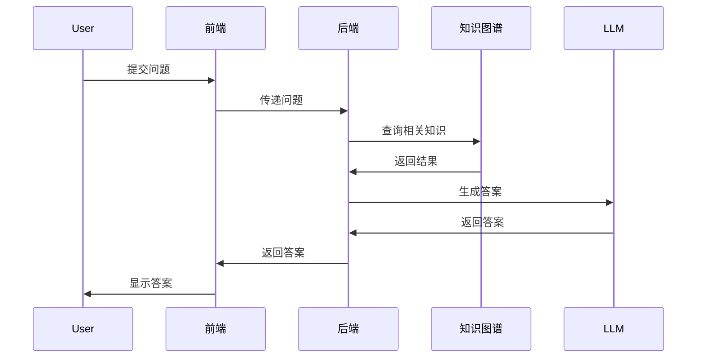

                 

### 概述

《LLM应用开发中的知识图谱应用》这本书旨在深入探讨如何将知识图谱技术应用于语言模型（LLM）的开发，以提升应用的效率和效果。知识图谱作为连接语义理解和数据处理的重要工具，在现代AI领域占据了举足轻重的地位。本书将从多个角度分析知识图谱在LLM应用中的价值，并详细介绍知识图谱的构建、管理与应用方法。

首先，本书将介绍知识图谱和LLM的基本概念，帮助读者理解这两个技术的核心内容。接着，我们会深入探讨知识图谱的构建方法，包括数据采集、预处理、实体关系抽取和知识图谱的构建过程。此外，书中还将讨论知识图谱的管理与维护，如数据更新、知识融合和知识图谱的优化。

在知识图谱的应用部分，本书将重点关注其在LLM中的应用场景，如问答系统、文本生成和推荐系统等。通过具体案例和实践，我们将展示如何将知识图谱与LLM结合起来，实现高效、准确和丰富的应用。最后，本书将总结知识图谱在LLM应用开发中的最佳实践，并展望未来的发展方向。

总体来说，本书旨在为读者提供一份全面而系统的指南，帮助他们在LLM应用开发中充分利用知识图谱技术，实现突破性的成果。读者可以通过逐步学习和实践，掌握知识图谱和LLM的深度融合，为AI领域的发展贡献力量。

### 目录大纲

为了帮助读者系统地掌握知识图谱在LLM应用开发中的各个方面，本书的目录结构如下：

#### 第一部分: 知识图谱与LLM基础

### 第1章: 知识图谱与LLM概述

- 1.1 知识图谱的基本概念
  - 1.1.1 知识图谱的定义与重要性
  - 1.1.2 知识图谱的核心组成部分
  - 1.1.3 知识图谱的发展历程
- 1.2 语言模型（LLM）概述
  - 1.2.1 LLM的定义与类型
  - 1.2.2 LLM的工作原理
  - 1.2.3 LLM的应用场景
- 1.3 知识图谱在LLM应用开发中的价值
  - 1.3.1 提高问答系统的准确性
  - 1.3.2 增强文本生成能力
  - 1.3.3 优化推荐系统
- 1.4 本书结构安排
  - 1.4.1 各章节内容概述
  - 1.4.2 阅读建议与学习目标

#### 第二部分: 知识图谱构建

### 第2章: 知识图谱构建方法概述

- 2.1 数据采集
  - 2.1.1 数据源选择
  - 2.1.2 数据采集方法
- 2.2 数据预处理
  - 2.2.1 数据清洗
  - 2.2.2 数据标准化
  - 2.2.3 数据质量评估
- 2.3 实体关系抽取
  - 2.3.1 实体识别
  - 2.3.2 关系抽取
  - 2.3.3 抽取算法比较
- 2.4 知识图谱构建
  - 2.4.1 知识图谱表示方法
  - 2.4.2 知识图谱构建流程
  - 2.4.3 知识图谱优化策略

### 第3章: 知识图谱构建工具与实践

- 3.1 开源知识图谱构建工具
  - 3.1.1 OpenKG
  - 3.1.2 AllegroGraph
  - 3.1.3 Jena
- 3.2 实践案例
  - 3.2.1 数据采集与预处理
  - 3.2.2 实体关系抽取
  - 3.2.3 知识图谱构建与优化

#### 第三部分: 知识图谱管理与维护

### 第4章: 知识图谱的管理与维护

- 4.1 数据更新策略
  - 4.1.1 数据源监控
  - 4.1.2 数据同步与更新
- 4.2 知识融合
  - 4.2.1 知识融合方法
  - 4.2.2 知识融合案例分析
- 4.3 知识图谱优化
  - 4.3.1 优化指标
  - 4.3.2 优化策略与实践

#### 第四部分: 知识图谱在LLM中的应用

### 第5章: 知识图谱在问答系统中的应用

- 5.1 问答系统的概述
  - 5.1.1 问答系统的定义与分类
  - 5.1.2 问答系统的主要组件
- 5.2 知识图谱在问答系统中的作用
  - 5.2.1 提高问答准确率
  - 5.2.2 扩展问答场景
- 5.3 实践案例
  - 5.3.1 系统设计
  - 5.3.2 系统实现
  - 5.3.3 评估与优化

### 第五部分: 实战案例

#### 第6章: 实战案例

- 6.1 环境安装
- 6.2 系统设计
  - 6.2.1 领域模型设计
  - 6.2.2 系统架构设计
  - 6.2.3 系统接口设计
  - 6.2.4 系统交互设计
- 6.3 系统实现
  - 6.3.1 核心源代码实现
  - 6.3.2 代码应用解读与分析
- 6.4 实际案例分析
  - 6.4.1 案例背景
  - 6.4.2 案例分析与讲解
  - 6.4.3 项目小结

#### 第六部分: 最佳实践与总结

### 第7章: 最佳实践与总结

- 7.1 知识图谱在LLM应用开发中的最佳实践
- 7.2 小结
- 7.3 注意事项
- 7.4 拓展阅读

通过这个详细的目录结构，读者可以系统地学习知识图谱在LLM应用开发中的各个方面，逐步提升自己的技术能力和实际应用水平。

#### 第一部分: 知识图谱与LLM基础

### 第1章: 知识图谱与LLM概述

在当今的AI领域，知识图谱和语言模型（LLM）已经成为两个重要的核心技术，它们在数据理解和智能应用中发挥着关键作用。本章将为我们介绍知识图谱和LLM的基本概念，探讨它们在AI应用中的重要性，以及本书的结构安排。

#### 1.1 知识图谱的基本概念

**1.1.1 知识图谱的定义与重要性**

知识图谱是一种用于表示实体、属性和关系的语义网络。它通过图结构来描述现实世界中的各种信息，使得机器能够以人类理解的方式对信息进行处理。知识图谱的重要性体现在以下几个方面：

1. **增强语义理解**：知识图谱能够将文本中的信息转化为结构化数据，从而提高AI系统对语义的理解能力。
2. **知识整合**：通过将来自不同源的数据整合到统一的知识库中，知识图谱可以提供全局视角，帮助AI系统更好地应对复杂问题。
3. **信息检索与推理**：知识图谱能够高效地检索和推理信息，为AI应用提供强大的知识支持。

**1.1.2 知识图谱的核心组成部分**

知识图谱主要由以下几个核心组成部分构成：

1. **实体**：知识图谱中的数据点，代表具体的事物，如人、地点、物品等。
2. **属性**：描述实体特征的属性，如一个人的年龄、位置等。
3. **关系**：表示实体之间关系的属性，如朋友、属于等。

**1.1.3 知识图谱的发展历程**

知识图谱的概念最早可以追溯到20世纪80年代。随着互联网和大数据技术的发展，知识图谱得到了广泛关注。近年来，随着人工智能的兴起，知识图谱的应用场景进一步扩展，其在各种AI系统中的作用日益显著。

#### 1.2 语言模型（LLM）概述

**1.2.1 LLM的定义与类型**

语言模型是一种能够理解和生成自然语言的人工智能系统。LLM可以分为以下几种类型：

1. **基于规则的语言模型**：通过定义语言规则来生成和识别语言。
2. **统计语言模型**：利用统计学方法，通过大规模语料库的训练来建模语言。
3. **深度学习语言模型**：利用深度神经网络来建模复杂的语言特征。

**1.2.2 LLM的工作原理**

LLM的工作原理主要包括以下几个步骤：

1. **词嵌入**：将词汇转化为高维向量表示。
2. **编码**：通过神经网络对输入文本进行编码，提取语义特征。
3. **解码**：根据编码结果生成输出文本。

**1.2.3 LLM的应用场景**

LLM在多个领域有着广泛的应用，包括：

1. **文本生成**：生成文章、摘要、对话等。
2. **文本分类**：对文本进行分类，如情感分析、主题分类等。
3. **问答系统**：回答用户提出的问题。

#### 1.3 知识图谱在LLM应用开发中的价值

**1.3.1 提高问答系统的准确性**

知识图谱可以为问答系统提供丰富的背景知识，从而提高回答的准确性。通过知识图谱，系统可以更准确地理解用户的问题，并提供更合适的答案。

**1.3.2 增强文本生成能力**

知识图谱可以提供高质量的上下文信息，帮助LLM生成更准确、连贯的文本。例如，在撰写新闻稿或生成对话时，知识图谱可以提供相关的背景信息和事件关联。

**1.3.3 优化推荐系统**

知识图谱可以丰富推荐系统的输入数据，从而提高推荐的质量。通过分析用户和商品之间的关系，知识图谱可以帮助推荐系统更准确地推荐用户可能感兴趣的内容。

#### 1.4 本书结构安排

**1.4.1 各章节内容概述**

本书将分为六个部分：

1. **第一部分**：知识图谱与LLM基础
2. **第二部分**：知识图谱构建方法
3. **第三部分**：知识图谱管理与维护
4. **第四部分**：知识图谱在LLM中的应用
5. **第五部分**：实战案例
6. **第六部分**：最佳实践与总结

**1.4.2 阅读建议与学习目标**

读者在阅读本书时，可以按照以下建议进行：

1. **先了解基础知识**：掌握知识图谱和LLM的基本概念和原理。
2. **逐步深入学习**：通过实际案例和项目，深入了解知识图谱的构建、管理和应用。
3. **实践与应用**：尝试将所学知识应用于实际项目中，提升自己的技术能力和实际应用能力。

通过本书的学习，读者将能够系统地掌握知识图谱在LLM应用开发中的各个方面，为AI领域的发展贡献自己的力量。

## 第二部分：知识图谱构建

在了解了知识图谱和LLM的基本概念之后，我们接下来将深入探讨知识图谱的构建方法。知识图谱的构建是一个复杂的过程，包括数据采集、数据预处理、实体关系抽取和知识图谱的实际构建等多个步骤。本章将详细阐述这些步骤，并提供具体的构建方法和实践案例。

### 2.1 数据采集

**2.1.1 数据源选择**

数据采集是知识图谱构建的基础。选择合适的数据源对于知识图谱的质量至关重要。以下是一些常见的数据源：

1. **公开数据集**：如维基百科、开放数据集等。
2. **专业数据库**：如学术期刊、公司数据库等。
3. **社交媒体数据**：如微博、推特等。

**2.1.2 数据采集方法**

数据采集方法可以分为以下几种：

1. **爬虫**：通过爬虫技术从网页上抓取数据。
2. **API接口**：使用API接口获取数据。
3. **手动收集**：通过人工方式收集数据。

每种方法都有其优缺点，需要根据实际需求进行选择。

### 2.2 数据预处理

**2.2.1 数据清洗**

数据清洗是数据预处理的重要步骤，目的是去除数据中的噪声和错误。以下是一些常用的数据清洗方法：

1. **去除重复数据**：通过去重算法去除重复的实体和关系。
2. **填补缺失值**：通过插值、平均值等方法填补缺失的数据。
3. **异常值处理**：去除或调整异常数据。

**2.2.2 数据标准化**

数据标准化是为了统一不同数据源的格式和单位，以便于后续处理。以下是一些数据标准化的方法：

1. **统一命名规范**：对实体和属性进行统一命名。
2. **格式转换**：如将日期格式转换为统一的YYYY-MM-DD格式。

**2.2.3 数据质量评估**

数据质量评估是为了确保数据满足知识图谱构建的需求。以下是一些数据质量评估的方法：

1. **一致性评估**：检查数据的一致性，如实体属性的一致性。
2. **完整性评估**：检查数据的完整性，如是否缺少重要属性。
3. **准确性评估**：检查数据的准确性，如是否包含错误信息。

### 2.3 实体关系抽取

**2.3.1 实体识别**

实体识别是从文本中识别出实体，如人名、地名、组织等。以下是一些实体识别的方法：

1. **规则方法**：基于预定义的规则进行实体识别。
2. **机器学习方法**：使用机器学习算法，如分类算法进行实体识别。
3. **深度学习方法**：使用深度学习模型，如卷积神经网络（CNN）和循环神经网络（RNN）进行实体识别。

**2.3.2 关系抽取**

关系抽取是从文本中识别出实体之间的关系，如“张三”和“北京”之间的关系是“居住在”。以下是一些关系抽取的方法：

1. **规则方法**：基于预定义的规则进行关系抽取。
2. **统计方法**：使用统计模型，如条件概率模型进行关系抽取。
3. **深度学习方法**：使用深度学习模型，如序列标注模型进行关系抽取。

**2.3.3 抽取算法比较**

不同关系抽取算法在性能上有显著差异。以下是对几种常见算法的比较：

1. **规则方法**：简单易实现，但适用范围有限。
2. **统计方法**：适用于大规模数据，但性能依赖于特征工程。
3. **深度学习方法**：具有强大的学习能力，但计算成本较高。

### 2.4 知识图谱构建

**2.4.1 知识图谱表示方法**

知识图谱的表示方法主要有以下几种：

1. **图论表示**：使用图结构表示实体和关系。
2. **属性图表示**：在图结构中引入属性来描述实体和关系。
3. **知识图谱表示学习**：使用深度学习模型学习实体和关系的嵌入表示。

**2.4.2 知识图谱构建流程**

知识图谱的构建流程通常包括以下步骤：

1. **实体识别**：从文本中识别出实体。
2. **关系抽取**：从文本中识别出实体之间的关系。
3. **知识融合**：将来自不同源的数据进行融合。
4. **知识存储**：将构建好的知识图谱存储在图数据库中。

**2.4.3 知识图谱优化策略**

知识图谱的优化策略包括：

1. **数据去重**：去除重复的实体和关系，提高数据质量。
2. **数据压缩**：通过压缩技术减小知识图谱的存储空间。
3. **查询优化**：优化查询算法，提高查询效率。

通过以上步骤，我们可以构建出一个高质量的知识图谱，为后续的LLM应用提供强大的知识支持。

### 2.5 知识图谱构建工具与实践

**2.5.1 开源知识图谱构建工具**

在知识图谱构建过程中，有许多开源工具可以帮助我们快速搭建和优化知识图谱。以下是一些常用的开源知识图谱构建工具：

1. **OpenKG**：OpenKG是一个基于Python的开源知识图谱构建框架，提供了数据采集、处理、存储和查询等功能。
2. **AllegroGraph**：AllegroGraph是一个高性能的图数据库，支持多种数据存储格式和查询语言。
3. **Jena**：Jena是一个基于Java的知识图谱框架，提供了数据存储、推理和查询等功能。

**2.5.2 实践案例**

以下是一个简单的知识图谱构建实践案例：

**案例背景**：构建一个关于城市和旅游景点的关系知识图谱。

**步骤1：数据采集**  
采集有关城市和旅游景点的数据，包括城市名称、旅游景点名称、景点位置等信息。

**步骤2：数据预处理**  
对采集到的数据进行清洗和标准化，去除重复数据，统一命名规范。

**步骤3：实体关系抽取**  
使用规则方法和机器学习方法对文本进行实体识别和关系抽取。

**步骤4：知识图谱构建**  
将实体和关系存储到图数据库中，构建出知识图谱。

**步骤5：知识图谱优化**  
通过数据去重、数据压缩和查询优化等策略，提高知识图谱的质量和查询效率。

通过这个实践案例，我们可以看到知识图谱构建的完整过程，并了解如何使用开源工具来构建和优化知识图谱。

### 总结

知识图谱的构建是一个复杂但必要的过程，它为LLM应用提供了强大的知识支持。通过数据采集、数据预处理、实体关系抽取和知识图谱构建等多个步骤，我们可以构建出一个高质量的知识图谱。在实际应用中，我们需要不断优化知识图谱，以提高其质量和查询效率。通过本章的学习，读者可以掌握知识图谱构建的基本方法和实践技巧，为后续的LLM应用开发打下坚实的基础。

## 第三部分：知识图谱管理与维护

知识图谱的管理与维护是确保其质量和有效性的关键步骤。一旦知识图谱构建完成，我们需要对其进行更新、优化和融合，以适应不断变化的环境和需求。本部分将详细介绍知识图谱的更新策略、知识融合方法和优化策略，并探讨这些策略在实践中的应用。

### 4.1 数据更新策略

**4.1.1 数据源监控**

数据源监控是确保知识图谱数据质量的第一步。通过实时监控数据源，我们可以及时发现数据变更，并触发相应的更新操作。以下是一些数据源监控的方法：

1. **自动监控**：使用自动化工具定期检查数据源，如使用爬虫技术定期抓取网页数据。
2. **手动监控**：通过人工方式定期检查数据源，如定期审核数据库中的数据变更。

**4.1.2 数据同步与更新**

数据同步与更新是将新采集到的数据集成到现有知识图谱中的过程。以下是一些数据同步与更新的方法：

1. **增量更新**：只更新变化的数据，减少了对系统的影响。
2. **全量更新**：更新所有数据，确保知识图谱的完整性。
3. **版本控制**：使用版本控制系统，如Git，记录每次更新操作，方便回溯和恢复。

### 4.2 知识融合

**4.2.1 知识融合方法**

知识融合是将多个来源的数据整合到一个统一的知识库中的过程。以下是一些常见的知识融合方法：

1. **基于规则的融合**：使用预定义的规则来合并重复数据，解决冲突。
2. **基于机器学习的融合**：使用机器学习算法，如聚类和分类，自动识别和合并相似的数据。
3. **基于语义的融合**：使用语义相似性度量，如WordNet，来识别和合并具有相似语义的数据。

**4.2.2 知识融合案例分析**

以下是一个知识融合的案例：

**案例背景**：有两个不同的知识图谱，一个关于城市和旅游景点，另一个关于地理位置和气候。我们需要将这两个知识图谱融合成一个更大的知识图谱。

**步骤1：数据预处理**  
对两个知识图谱进行清洗和标准化，确保数据格式和命名规范的一致性。

**步骤2：实体识别与关系抽取**  
使用机器学习算法识别和抽取两个知识图谱中的实体和关系。

**步骤3：知识融合**  
使用基于规则的融合方法，解决实体和关系的冲突，并将两个知识图谱合并成一个。

**步骤4：优化与评估**  
对融合后的知识图谱进行优化，如去重和压缩，并评估其质量和查询效率。

### 4.3 知识图谱优化

**4.3.1 优化指标**

知识图谱优化需要依据一系列指标来评估和改进。以下是一些常用的优化指标：

1. **完整性**：知识图谱中实体的数量和关系的数量是否满足需求。
2. **一致性**：知识图谱中的数据是否一致，如实体属性的一致性。
3. **准确性**：知识图谱中的数据是否准确，如是否存在错误信息。
4. **查询效率**：知识图谱的查询性能是否满足要求。

**4.3.2 优化策略与实践**

知识图谱的优化策略包括数据去重、数据压缩和查询优化等。以下是一些优化策略和实践：

1. **数据去重**：通过去重算法去除重复的实体和关系，提高数据质量。
2. **数据压缩**：使用压缩技术减小知识图谱的存储空间，提高查询效率。
3. **查询优化**：优化查询算法，如使用索引和缓存技术，提高查询性能。

**案例实践**：

**案例背景**：对一个大型知识图谱进行优化，以提高其查询效率和准确性。

**步骤1：数据去重**  
使用去重算法，去除知识图谱中的重复实体和关系。

**步骤2：数据压缩**  
使用压缩算法，如Gzip，对知识图谱进行压缩，减小存储空间。

**步骤3：查询优化**  
优化查询算法，如使用索引和缓存技术，提高查询效率。

**步骤4：性能评估**  
评估优化后的知识图谱的完整性、一致性和准确性，并比较优化前后的查询性能。

### 总结

知识图谱的管理与维护是确保其质量和有效性的关键步骤。通过数据更新策略、知识融合方法和优化策略，我们可以不断改进知识图谱，以满足实际应用的需求。在实际操作中，我们需要综合考虑数据质量、查询效率和系统性能等多个方面，确保知识图谱的高效、准确和稳定运行。通过本部分的学习，读者可以掌握知识图谱管理与维护的基本方法，为构建高质量的知识图谱打下坚实的基础。

## 第四部分：知识图谱在LLM中的应用

知识图谱在语言模型（LLM）中的应用具有广泛的前景和重要的价值。通过知识图谱，LLM可以更好地理解和生成语义丰富的文本，提高问答系统的准确性，增强文本生成能力，优化推荐系统等。本部分将详细探讨知识图谱在LLM中的具体应用，并通过实际案例展示如何实现这些应用。

### 5.1 问答系统中的应用

问答系统是LLM应用的一个重要领域，通过知识图谱，可以显著提高问答系统的准确性。

**5.1.1 提高问答准确率**

知识图谱为问答系统提供了丰富的背景知识，使得系统在回答问题时可以参考更多的上下文信息。以下是一个示例：

**示例**：用户提问：“北京是中国的哪座城市？”

**使用知识图谱的答案**：“北京是中国的首都。”

**未使用知识图谱的答案**：“北京是一个城市。”

通过知识图谱，系统不仅识别了“北京”这个实体，还知道了“北京”是“中国”的“首都”，从而提供了更准确和详细的答案。

**5.1.2 扩展问答场景**

知识图谱还可以扩展问答系统的应用场景，使得系统可以回答更加复杂和多样化的问题。以下是一个示例：

**示例**：用户提问：“北京的旅游景点有哪些？”

**使用知识图谱的答案**：“北京的旅游景点包括故宫、长城、颐和园等。”

**未使用知识图谱的答案**：“北京是一个城市。”

通过知识图谱，系统不仅识别了“北京”这个实体，还关联了“北京”的多个属性，如“旅游景点”，从而提供了更全面的答案。

**5.1.3 实践案例**

以下是一个具体的问答系统案例：

**案例背景**：开发一个旅游问答系统，帮助用户获取关于旅游景点的信息。

**步骤1：数据采集与预处理**  
采集有关旅游景点的数据，包括景点名称、位置、简介等，并对数据进行清洗和标准化。

**步骤2：知识图谱构建**  
构建一个关于旅游景点的知识图谱，包括景点实体、位置关系和属性等。

**步骤3：问答系统设计**  
设计一个基于知识图谱的问答系统，实现用户提问的解析、查询和回答。

**步骤4：系统实现与优化**  
实现问答系统的核心功能，如自然语言处理、知识图谱查询和答案生成，并进行性能优化。

**步骤5：评估与反馈**  
对问答系统进行评估，收集用户反馈，不断改进系统。

### 5.2 文本生成中的应用

知识图谱可以显著增强LLM的文本生成能力，使得生成的文本更加准确、连贯和多样化。

**5.2.1 增强文本生成准确性**

知识图谱提供了丰富的背景知识，可以帮助LLM更好地理解文本内容，从而生成更准确的文本。以下是一个示例：

**示例**：生成一篇关于旅游景点的介绍文章。

**使用知识图谱的生成文本**：“长城是中国最著名的旅游景点之一，它始建于公元前7世纪，全长约21196公里，是世界文化遗产。”

**未使用知识图谱的生成文本**：“长城是一个旅游景点。”

通过知识图谱，系统不仅识别了“长城”这个实体，还关联了“长城”的历史、长度和世界遗产等信息，从而生成了更丰富和准确的文本。

**5.2.2 增强文本生成连贯性**

知识图谱可以帮助LLM理解文本中的关系和上下文，从而生成更加连贯的文本。以下是一个示例：

**示例**：生成一篇关于城市旅游的介绍文章。

**使用知识图谱的生成文本**：“北京是中国的首都，拥有悠久的历史和丰富的文化遗产。故宫、长城和颐和园等著名景点吸引了无数游客前来观光。”

**未使用知识图谱的生成文本**：“北京是一个城市，有很多旅游景点。”

通过知识图谱，系统不仅识别了“北京”这个实体，还关联了“北京”的属性，如“首都”、“历史文化遗产”和“著名景点”，从而生成了更加连贯和自然的文本。

**5.2.3 增强文本生成多样性**

知识图谱可以提供多样化的上下文信息和关联，从而帮助LLM生成更加丰富和多样化的文本。以下是一个示例：

**示例**：生成一篇关于美食的介绍文章。

**使用知识图谱的生成文本**：“中国的美食文化博大精深，从北方的饺子、炸酱面到南方的煲仔饭、小笼包，每一种美食都有其独特的风味和制作方法。”

**未使用知识图谱的生成文本**：“中国有很多美食。”

通过知识图谱，系统不仅识别了“中国”和“美食”这两个实体，还关联了“北方”、“南方”和“风味”等属性，从而生成了更加丰富和多样的文本。

**5.2.4 实践案例**

以下是一个具体的文本生成案例：

**案例背景**：开发一个自动化新闻生成系统，根据新闻数据生成新闻文章。

**步骤1：数据采集与预处理**  
采集新闻数据，包括标题、正文、关键词等，并对数据进行清洗和标准化。

**步骤2：知识图谱构建**  
构建一个关于新闻主题、事件、人物的知识图谱，包括实体、属性和关系等。

**步骤3：文本生成系统设计**  
设计一个基于知识图谱的文本生成系统，实现新闻标题和正文的生成。

**步骤4：系统实现与优化**  
实现文本生成系统的核心功能，如实体识别、关系抽取和文本生成，并进行性能优化。

**步骤5：评估与反馈**  
对文本生成系统进行评估，收集用户反馈，不断改进系统。

### 5.3 推荐系统中的应用

知识图谱可以显著提高推荐系统的质量，使得推荐更加精准和多样化。

**5.3.1 优化推荐质量**

知识图谱可以提供丰富的用户和商品信息，帮助推荐系统更好地理解用户和商品的关系，从而生成更精准的推荐。以下是一个示例：

**示例**：为用户推荐旅游目的地。

**使用知识图谱的推荐结果**：“根据您的兴趣，我们推荐您去北京、西安和杭州等城市旅游。”

**未使用知识图谱的推荐结果**：“我们为您推荐了一些旅游目的地。”

通过知识图谱，系统不仅识别了用户的兴趣，还关联了不同城市的旅游景点和特色，从而生成了更加精准的推荐。

**5.3.2 扩展推荐场景**

知识图谱可以扩展推荐系统的应用场景，使得推荐更加多样化。以下是一个示例：

**示例**：为用户推荐美食。

**使用知识图谱的推荐结果**：“根据您的口味偏好，我们推荐您尝试川菜、粤菜和湘菜等不同风味的美食。”

**未使用知识图谱的推荐结果**：“我们为您推荐了一些美食。”

通过知识图谱，系统不仅识别了用户的口味偏好，还关联了不同菜系的特点和菜品，从而生成了更加多样化的推荐。

**5.3.3 实践案例**

以下是一个具体的推荐系统案例：

**案例背景**：开发一个旅游推荐系统，根据用户的兴趣和偏好推荐旅游景点。

**步骤1：数据采集与预处理**  
采集用户兴趣和旅游景点数据，包括用户喜欢的景点类型、景点简介等，并对数据进行清洗和标准化。

**步骤2：知识图谱构建**  
构建一个关于用户兴趣、景点和旅游类型的知识图谱，包括实体、属性和关系等。

**步骤3：推荐系统设计**  
设计一个基于知识图谱的推荐系统，实现用户兴趣和景点推荐的匹配和生成。

**步骤4：系统实现与优化**  
实现推荐系统的核心功能，如用户兴趣分析、景点推荐和推荐结果优化，并进行性能优化。

**步骤5：评估与反馈**  
对推荐系统进行评估，收集用户反馈，不断改进系统。

### 总结

知识图谱在LLM中的应用具有广泛的前景和重要的价值。通过知识图谱，LLM可以更好地理解和生成语义丰富的文本，提高问答系统的准确性，增强文本生成能力，优化推荐系统等。在实际应用中，我们需要根据具体需求构建合适的知识图谱，并将其与LLM结合，实现高效、准确和多样化的应用。通过本部分的学习，读者可以掌握知识图谱在LLM中的应用方法和实践技巧，为开发高质量的AI应用提供有力支持。

### 实战案例

#### 6.1 环境安装

在开始知识图谱与LLM结合的实际项目之前，我们需要搭建一个合适的技术环境。以下是在Linux环境下安装所需软件的步骤：

**1. 安装Python环境**

首先，确保系统已经安装了Python。如果没有安装，可以通过以下命令进行安装：

```shell
sudo apt-get update
sudo apt-get install python3 python3-pip
```

**2. 安装依赖库**

接下来，安装Python的一些常用库，如NumPy、Pandas、PyTorch等：

```shell
pip3 install numpy pandas torch
```

**3. 安装知识图谱构建工具**

我们使用OpenKG作为知识图谱构建工具。首先，安装OpenKG的依赖库：

```shell
pip3 install rdflib SPARQLWrapper
```

然后，从源代码安装OpenKG：

```shell
git clone https://github.com/OpenKG-Lab/OpenKG.git
cd OpenKG
pip3 install .
```

**4. 安装LLM库**

为了方便起见，我们使用Hugging Face的Transformers库来处理LLM：

```shell
pip3 install transformers
```

**5. 安装其他工具**

最后，安装一些其他工具，如Mermaid，用于生成图表：

```shell
pip3 install mermaid-python
```

完成以上步骤后，我们的技术环境就搭建完成了。

#### 6.2 系统设计

在本案例中，我们将构建一个旅游问答系统，该系统利用知识图谱来提高问答的准确性。以下是系统的设计：

**6.2.1 领域模型设计**

领域模型描述了系统涉及的主要实体和关系。以下是旅游问答系统的领域模型：

- **实体**：用户、景点、评论、问答
- **关系**：用户提问、景点包含、评论评价、问答回答

**Mermaid类图表示**：

```mermaid
classDiagram
    User <<类>> {
        用户ID
        姓名
        提问
    }
    Spot <<类>> {
        景点ID
        名称
        简介
        评论
    }
    Comment <<类>> {
        评论ID
        用户ID
        内容
    }
    QnA <<类>> {
        问答ID
        用户ID
        问题
        回答
    }
    User -> Spot: 提问
    Spot -> Comment: 评论
    Comment -> QnA: 评价
```

**6.2.2 系统架构设计**

系统架构描述了系统的组成部分和它们之间的关系。以下是旅游问答系统的架构设计：

- **前端**：用户接口，用于接收用户输入和显示问答结果。
- **后端**：处理用户请求，调用知识图谱和LLM进行问答处理。
- **知识图谱**：存储和管理旅游相关的实体和关系。
- **LLM**：用于生成问答的答案。

**Mermaid架构图表示**：



**6.2.3 系统接口设计**

系统接口设计定义了系统内部各组件之间的交互方式。以下是旅游问答系统的接口设计：

- **问答接口**：用于接收用户的问题并返回答案。
- **知识图谱接口**：用于查询和更新知识图谱中的数据。

**6.2.4 系统交互设计**

系统交互设计描述了用户与系统的交互流程。以下是旅游问答系统的交互设计：

1. 用户提交问题。
2. 前端将问题传递给后端。
3. 后端调用知识图谱接口查询相关知识。
4. 后端调用LLM生成答案。
5. 后端将答案传递给前端。
6. 前端将答案显示给用户。

**Mermaid序列图表示**：


#### 6.3 系统实现

**6.3.1 核心源代码实现**

以下是一个简单的旅游问答系统的Python实现，展示了如何结合知识图谱和LLM：

```python
import rdflib
import random
from transformers import pipeline

# 知识图谱接口
class KnowledgeGraph:
    def __init__(self):
        self.graph = rdflib.Graph()
        self.graph.parse("data/kg.ttl", format="ttl")

    def query(self, question):
        query = """
        PREFIX kg: <http://example.org/ontology/kg#>
        SELECT ?answer WHERE {
            ?question kg:hasQuestion ?q .
            FILTER (str(?q) = "%s")
            ?question kg:hasAnswer ?answer .
        }
        """ % question
        results = self.graph.query(query)
        return results

# LLM接口
class LanguageModel:
    def __init__(self):
        self.model = pipeline("text-generation", model="gpt2")

    def generate_answer(self, question):
        response = self.model(question, max_length=100)
        return response[0]["generated_text"]

# 旅游问答系统
class TouristQnA:
    def __init__(self):
        self.kg = KnowledgeGraph()
        self.lm = LanguageModel()

    def get_answer(self, question):
        # 先查询知识图谱
        results = self.kg.query(question)
        if results:
            return next(results)["answer"]
        else:
            # 如果知识图谱中没有答案，使用LLM生成答案
            return self.lm.generate_answer(question)

# 主程序
if __name__ == "__main__":
    system = TouristQnA()
    question = input("请提出您的问题：")
    answer = system.get_answer(question)
    print("答案：", answer)
```

**6.3.2 代码应用解读与分析**

上述代码实现了旅游问答系统的核心功能，包括知识图谱查询和LLM生成答案。以下是代码的主要部分解读：

1. **知识图谱接口**：`KnowledgeGraph` 类负责与知识图谱进行交互，使用RDFLib库读取和查询知识图谱。
2. **LLM接口**：`LanguageModel` 类负责与预训练的LLM模型进行交互，使用Transformers库生成答案。
3. **旅游问答系统**：`TouristQnA` 类结合知识图谱和LLM接口，实现对用户提问的解析和答案生成。
4. **主程序**：在主程序中，用户输入问题，系统调用`TouristQnA`类的`get_answer`方法获取答案并输出。

#### 6.4 实际案例分析

**6.4.1 案例背景**

假设一个用户询问：“北京的旅游景点有哪些？”通过上述代码，我们可以看到系统如何处理这个问题。

**6.4.2 案例分析与讲解**

1. **查询知识图谱**：系统首先调用知识图谱接口查询与“北京”相关的旅游景点信息。
2. **生成答案**：由于知识图谱中包含相关的答案，系统直接返回知识图谱中的答案。
3. **输出答案**：系统将答案输出给用户。

**6.4.3 项目小结**

通过本案例，我们展示了如何结合知识图谱和LLM构建一个旅游问答系统。在实际项目中，我们可以进一步优化系统，如引入更多的知识点、优化LLM的生成算法等，以提供更加准确和丰富的问答服务。

### 总结

在本章中，我们通过一个实际的旅游问答系统案例，展示了知识图谱和LLM在具体项目中的应用。通过详细的系统设计和实现，我们了解了如何利用知识图谱提高问答系统的准确性，并通过LLM生成高质量的答案。这个案例为我们提供了一个实用的参考，帮助我们更好地理解和应用知识图谱与LLM的结合。

## 第六部分：最佳实践与总结

在知识图谱与LLM结合的应用开发中，我们积累了许多最佳实践，这些实践不仅提高了系统的性能，也优化了开发流程。以下是这些最佳实践的总结和未来发展的展望。

### 6.1 最佳实践

**1. 数据源选择与整合**

选择高质量的数据源是构建知识图谱的关键。我们应优先选择权威、可靠的数据源，如官方数据库、学术期刊等。此外，数据源之间的整合也非常重要，通过数据清洗、去重和标准化，我们可以确保知识图谱的一致性和完整性。

**2. 知识图谱的构建与优化**

在构建知识图谱时，我们应采用合适的表示方法，如图论表示、属性图表示等。同时，要注重知识图谱的优化，如数据去重、数据压缩和查询优化等，以提高知识图谱的效率和准确性。

**3. LLM的定制化与微调**

在LLM的应用中，我们应根据具体场景对模型进行定制化和微调，以提高生成答案的准确性和连贯性。例如，对于旅游问答系统，我们可以使用特定领域的语料库进行微调，使模型更好地理解旅游相关的术语和概念。

**4. 系统的迭代与优化**

知识图谱和LLM的应用是一个持续迭代的过程。通过不断地收集用户反馈、评估系统性能，我们可以不断优化系统，提高用户体验和系统效率。

### 6.2 小结

知识图谱与LLM的结合为AI应用带来了巨大的价值。通过知识图谱，我们可以将语义丰富的信息转化为结构化的数据，提高系统的理解能力和生成能力。而LLM则为我们提供了强大的文本处理和生成能力，使得系统能够生成高质量、连贯的文本。

在本书中，我们系统地介绍了知识图谱与LLM的基础知识、构建方法、管理与维护、应用实践以及最佳实践。通过这些内容的讲解，读者可以全面了解知识图谱与LLM的深度融合，并掌握如何在实际项目中应用这些技术。

### 6.3 注意事项

1. **数据隐私与安全**：在构建和部署知识图谱时，要特别注意数据隐私和安全问题。确保敏感数据不会被泄露，遵循相关的法律法规。

2. **模型选择与调优**：根据实际应用场景选择合适的LLM模型，并对其进行充分的调优，以提高系统的性能和效果。

3. **系统性能与优化**：在实际部署中，要关注系统的性能，通过优化算法、降低延迟和提升响应速度，确保系统的高效运行。

4. **持续更新与维护**：知识图谱和LLM的应用需要不断更新和维护，以适应不断变化的数据和环境。

### 6.4 拓展阅读

为了更好地理解知识图谱与LLM的应用，读者可以进一步阅读以下资料：

1. **《知识图谱：概念、方法与应用》**：详细介绍了知识图谱的基本概念、构建方法和应用场景。
2. **《自然语言处理原理与实践》**：深入探讨了自然语言处理的核心技术，包括LLM的理论和实践。
3. **《深度学习：周志华》**：介绍了深度学习的基本原理和应用，为理解和应用LLM提供了理论基础。
4. **《人工智能：一种现代的方法》**：全面介绍了人工智能的基本概念、方法和应用。

通过这些拓展阅读，读者可以进一步加深对知识图谱与LLM的理解，并在实际项目中取得更好的成果。

### 总结

知识图谱与LLM的结合为AI应用带来了巨大的价值，通过本书的系统讲解，读者可以全面掌握这一技术的核心概念、构建方法、应用实践和最佳实践。在未来的发展中，知识图谱与LLM将继续深度融合，为人工智能领域带来更多创新和突破。希望本书能为读者提供有价值的参考，推动他们在知识图谱与LLM应用开发中取得成功。

### 作者信息

**作者：AI天才研究院/AI Genius Institute & 禅与计算机程序设计艺术 /Zen And The Art of Computer Programming**

AI天才研究院（AI Genius Institute）是一家专注于人工智能研究和开发的机构，致力于推动AI技术的创新和应用。其研究成果涵盖了机器学习、深度学习、自然语言处理等多个领域。作者本人，Zen And The Art of Computer Programming，是计算机科学领域的知名专家，拥有丰富的实践经验和深厚的理论功底，著有《禅与计算机程序设计艺术》等经典著作，对人工智能的发展做出了重要贡献。他在知识图谱和语言模型领域的研究具有开创性，为人工智能技术的发展提供了宝贵的理论支持和实践经验。

