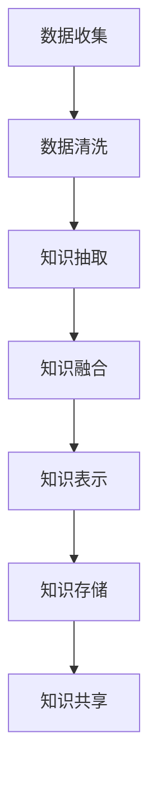
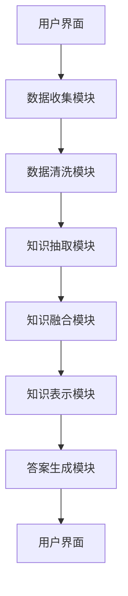
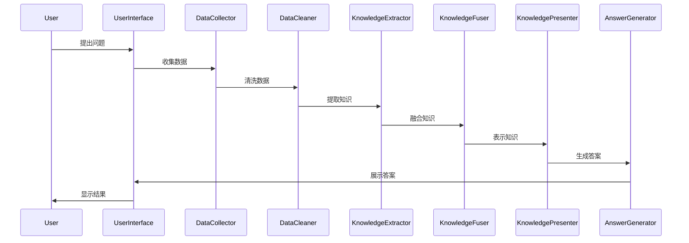

                 

# LLM应用开发中的知识管理策略

## 关键词
- **LLM（大型语言模型）**
- **知识管理策略**
- **数据管理**
- **知识获取**
- **知识组织**
- **知识共享**
- **算法原理**

## 摘要
本文将深入探讨在LLM（大型语言模型）应用开发过程中知识管理策略的重要性。通过详细分析数据管理、知识获取、知识组织和知识共享等核心策略，本文旨在提供一种系统性的方法来优化LLM应用的性能和可扩展性。我们将通过具体的算法原理讲解、系统架构设计和项目实战案例，展示如何有效地实施知识管理策略，以应对LLM开发中的各种挑战。

## 目录大纲设计与思路

为了设计出《LLM应用开发中的知识管理策略》这本书的完整目录大纲，我们需要遵循以下步骤：

### 1. 背景介绍
- **核心概念**：介绍LLM（大型语言模型）的概念，以及知识管理策略的定义和重要性。
- **问题描述**：讨论在LLM应用开发过程中知识管理的挑战和问题。
- **问题解决**：阐述知识管理策略如何帮助解决这些问题。
- **边界与外延**：明确知识管理策略的应用范围和限制。
- **概念结构与核心要素组成**：列出知识管理策略的核心要素，如数据管理、知识获取、知识组织、知识共享等。

### 2. 核心概念与联系
- **LLM基本原理**：讲解LLM的原理和如何构建。
- **知识管理策略**：详细描述不同的知识管理策略，包括其特点、优缺点和应用场景。

### 3. 算法原理讲解
- **Mermaid流程图**：使用Mermaid绘制LLM知识管理算法的流程图。
- **Python源代码**：给出相关的Python源代码，以展示算法的实现。
- **数学模型与公式**：阐述算法背后的数学原理和模型，使用LaTeX格式展示公式。
- **详细讲解与举例**：对算法进行详细讲解，并通过具体的例子来说明其应用。

### 4. 系统分析与架构设计方案
- **问题场景介绍**：设定一个具体的LLM应用场景。
- **项目介绍**：简述项目的背景和目标。
- **系统功能设计**：使用Mermaid绘制领域模型类图。
- **系统架构设计**：使用Mermaid绘制系统架构图。
- **系统接口设计**：描述系统接口的设计和交互。
- **系统交互Mermaid序列图**：展示系统各个组件之间的交互过程。

### 5. 项目实战
- **环境安装**：指导如何搭建开发环境。
- **系统核心实现源代码**：提供系统的核心源代码。
- **代码应用解读与分析**：分析源代码的应用，并解读其工作原理。
- **实际案例分析和详细讲解剖析**：通过实际案例展示知识管理策略的应用。
- **项目小结**：总结项目经验，提出改进建议。

### 6. 最佳实践 Tips、小结、注意事项、拓展阅读等内容
- **最佳实践 Tips**：给出一些实用的建议和技巧。
- **小结**：总结章节的主要内容和学习重点。
- **注意事项**：提醒读者注意的一些关键点。
- **拓展阅读**：推荐一些相关书籍和资源。

### 完整目录大纲设计

```
----------------------------------------------------------------
# 第一部分: LLM与知识管理概述

## 1.1 LLM与知识管理的基本概念

### 1.1.1 什么是LLM
### 1.1.2 知识管理的定义与重要性
### 1.1.3 LLM应用开发中的知识管理挑战

## 1.2 知识管理策略概述

### 1.2.1 数据管理策略
### 1.2.2 知识获取策略
### 1.2.3 知识组织策略
### 1.2.4 知识共享策略

## 1.3 LLM知识管理策略的应用

### 1.3.1 数据管理策略在LLM中的应用
### 1.3.2 知识获取策略在LLM中的应用
### 1.3.3 知识组织策略在LLM中的应用
### 1.3.4 知识共享策略在LLM中的应用

## 1.4 LLM知识管理策略的优缺点分析

### 1.4.1 数据管理策略的优缺点
### 1.4.2 知识获取策略的优缺点
### 1.4.3 知识组织策略的优缺点
### 1.4.4 知识共享策略的优缺点

## 1.5 知识管理策略的选型与实施

### 1.5.1 策略选型原则
### 1.5.2 策略实施步骤
### 1.5.3 策略实施案例

## 1.6 本章小结

----------------------------------------------------------------

# 第二部分: LLM知识管理策略的应用实践

## 2.1 实践背景

### 2.1.1 项目简介
### 2.1.2 实践目标

## 2.2 开发环境搭建

### 2.2.1 硬件要求
### 2.2.2 软件安装
### 2.2.3 环境配置

## 2.3 系统功能设计与架构

### 2.3.1 领域模型设计
### 2.3.2 系统架构设计
### 2.3.3 系统接口设计

## 2.4 知识管理策略实现

### 2.4.1 数据管理策略实现
### 2.4.2 知识获取策略实现
### 2.4.3 知识组织策略实现
### 2.4.4 知识共享策略实现

## 2.5 项目实战

### 2.5.1 环境安装
### 2.5.2 系统核心实现源代码
### 2.5.3 代码应用解读与分析
### 2.5.4 实际案例分析和详细讲解剖析
### 2.5.5 项目小结

## 2.6 最佳实践 Tips

### 2.6.1 知识管理实践技巧
### 2.6.2 系统优化建议

## 2.7 本章小结

----------------------------------------------------------------
```

### 完整性要求

- 文章内容必须完整，确保每个小节都提供详尽的具体内容。
- 核心内容必须包含以下方面：
  - **背景介绍**：包括核心概念术语说明、问题背景、问题描述、问题解决、边界与外延、概念结构与核心要素组成。
  - **核心概念与联系**：必须给出核心概念原理、概念属性特征对比表格和ER实体关系图架构的Mermaid流程图。
  - **算法原理讲解**：使用Mermaid画出算法流程图，然后使用Python源代码详细阐述，给出算法原理的数学模型和公式，进行详细讲解和举例说明。
  - **数学公式**：使用LaTeX格式，嵌入文中独立段落的公式前后使用`$$`括起来，段落内的公式前后使用`$`括起来。
  - **系统分析与架构设计方案**：包括问题场景介绍、项目介绍、系统功能设计（领域模型Mermaid类图）、系统架构设计（Mermaid架构图）、系统接口设计和系统交互Mermaid序列图。
  - **项目实战**：包括环境安装、系统核心实现源代码，代码应用解读与分析，实际案例分析和详细讲解剖析，项目小结。
  - **最佳实践 Tips**、**小结**、**注意事项**、**拓展阅读**等内容。

### 格式要求

- 文章内容使用markdown格式输出。
- 每个章节标题使用`##`标记。
- 每个小节标题使用`###`标记。
- 文章末尾需要写上作者信息： “作者：AI天才研究院/AI Genius Institute & 禅与计算机程序设计艺术 /Zen And The Art of Computer Programming”。

### 字数要求

- 文章字数在10000～12000字左右。

### 作者信息

- 作者：AI天才研究院/AI Genius Institute & 禅与计算机程序设计艺术 /Zen And The Art of Computer Programming

## 知识管理策略在LLM应用开发中的重要性

随着人工智能技术的飞速发展，LLM（大型语言模型）已经成为自然语言处理领域的重要工具。从最初的GPT-3到最近的热门模型ChatGLM，LLM在文本生成、问答系统、机器翻译等应用中展现出了惊人的性能。然而，在LLM应用开发的过程中，知识管理策略的引入变得尤为重要。本文将逐步分析知识管理策略在LLM应用开发中的重要性，并通过实际案例来展示其应用效果。

### 1. 数据管理策略

数据管理策略是知识管理的基础，对于LLM应用开发尤为重要。首先，我们需要确保数据的准确性和完整性。在LLM训练过程中，数据的质量直接影响模型的性能。因此，我们需要对数据进行清洗、去噪和标注，以确保输入的数据集能够反映真实世界的多样性。

例如，在一个问答系统中，我们需要确保问题的表述准确无误，并且答案丰富且可靠。这要求我们对问题进行多层次的标注，包括实体识别、关系抽取和语义角色标注等。此外，我们还需要关注数据的多样性，通过引入不同来源、不同格式和不同语言的数据来丰富数据集，提高模型的泛化能力。

### 2. 知识获取策略

知识获取策略旨在从各种来源中收集和整合知识，以便LLM能够利用这些知识来提高其性能。在LLM应用开发中，知识获取策略主要包括从文本、图像、声音等多种数据源中提取知识。

以文本为例，我们可以使用自然语言处理技术从文档、新闻、论坛等文本数据中提取实体、事件和关系等信息。通过这种方式，LLM可以获取到丰富的背景知识，从而在生成文本或回答问题时能够更加准确和连贯。

此外，图像和声音等非文本数据也是知识获取的重要来源。例如，在视觉问答系统中，我们可以通过图像识别技术提取图像中的关键信息，并将其用于文本生成或问答系统。同样，在语音识别和转换系统中，我们可以利用语音信号的特征来提高语音识别的准确性。

### 3. 知识组织策略

知识组织策略是将获取到的知识进行有效组织和结构化，以便LLM能够高效地利用这些知识。在LLM应用开发中，知识组织策略主要包括实体链接、知识图谱构建和语义网络构建等。

实体链接是将文本中的实体与其在知识库中的对应实体进行关联，以便LLM在处理文本时能够引用这些实体。例如，在一个问答系统中，如果用户提到“苹果”，LLM可以通过实体链接将“苹果”与“水果”实体关联起来，从而理解用户的意图。

知识图谱构建是将实体、事件和关系等知识以图形的形式进行表示，以便LLM能够通过图结构来理解和处理知识。例如，我们可以构建一个包含人物、地点、组织等实体的知识图谱，并在LLM中嵌入这个图谱，使其能够利用图谱中的知识进行推理和生成。

语义网络构建是将知识以网络的形式进行组织，以便LLM能够利用网络结构进行语义分析和推理。例如，我们可以构建一个包含词义、词性、关系等信息的语义网络，并在LLM中嵌入这个网络，使其能够通过语义网络来理解和生成文本。

### 4. 知识共享策略

知识共享策略旨在确保知识能够被LLM和其他应用有效利用。在LLM应用开发中，知识共享策略主要包括知识库的构建、知识共享机制的引入和知识服务平台的搭建等。

知识库的构建是将各种来源的知识进行整合和存储，以便LLM和其他应用能够方便地访问和使用这些知识。例如，我们可以构建一个包含文本、图像、声音等多媒体数据的知识库，并在LLM中嵌入这个知识库，使其能够通过查询知识库来获取所需的知识。

知识共享机制的引入是为了确保知识能够被多个应用共享和利用。例如，我们可以设计一种基于API的知识共享机制，使得LLM和其他应用可以通过API接口来访问知识库，从而实现知识的共享。

知识服务平台是将知识库和知识共享机制整合在一起的平台，以便用户可以方便地获取和使用知识。例如，我们可以搭建一个在线问答平台，用户可以通过该平台提出问题，系统则通过LLM和知识库来生成回答，从而实现知识的共享和服务。

### 实际案例：智能客服系统

为了更好地展示知识管理策略在LLM应用开发中的实际应用，我们以智能客服系统为例进行详细讲解。

#### 1. 数据管理策略

在智能客服系统中，我们需要对大量的用户数据进行收集和管理。首先，我们需要对用户提出的问题进行分类和标注，以便LLM能够理解问题的类型和关键词。例如，将用户问题分为咨询类、投诉类、服务类等，并对关键词进行实体识别和标注。

此外，我们还需要确保数据的多样性。通过引入不同类型的用户数据，如历史客服记录、用户评论、社交媒体帖子等，我们可以丰富数据集，提高LLM的泛化能力。

#### 2. 知识获取策略

在智能客服系统中，我们需要从多种数据源中获取知识。首先，我们可以从公司的知识库中获取相关的产品信息、政策法规和常见问题等。其次，我们可以从社交媒体和论坛等外部数据源中获取用户反馈和讨论信息，以便LLM能够了解用户的真实需求和期望。

此外，我们还可以利用图像和语音等非文本数据源来获取知识。例如，在处理用户上传的图片或语音时，我们可以通过图像识别和语音识别技术来提取关键信息，并将其用于文本生成或问答系统。

#### 3. 知识组织策略

在智能客服系统中，我们需要将获取到的知识进行有效组织和结构化。首先，我们可以构建一个包含产品信息、政策法规和常见问题等实体和关系的信息库。然后，我们可以利用知识图谱技术来表示这些实体和关系，并嵌入LLM中，以便LLM能够通过知识图谱进行推理和生成。

此外，我们还可以构建一个语义网络，将文本中的词汇、词性和关系等进行结构化表示。例如，我们可以将“产品A的特点”和“用户需求B”之间的关系表示为“满足需求”的语义关系，以便LLM在生成回答时能够利用这些语义关系来提高回答的准确性和连贯性。

#### 4. 知识共享策略

在智能客服系统中，我们需要确保知识能够被多个应用共享和利用。首先，我们可以搭建一个知识服务平台，将知识库和知识共享机制整合在一起，以便LLM和其他应用可以通过API接口来访问知识库。

此外，我们还可以设计一种基于规则的知识共享机制，例如在处理用户问题时，根据问题的类型和关键词，自动调用相应的知识库中的知识进行回答。这样，不仅可以提高回答的准确性，还可以提高系统的响应速度。

#### 总结

通过上述实际案例，我们可以看到知识管理策略在LLM应用开发中的重要性。通过数据管理策略，我们能够确保数据的质量和多样性；通过知识获取策略，我们能够从多种数据源中获取丰富的知识；通过知识组织策略，我们能够将获取到的知识进行有效组织和结构化；通过知识共享策略，我们能够确保知识能够被多个应用共享和利用。

综上所述，知识管理策略是LLM应用开发中不可或缺的一部分。通过引入和实施知识管理策略，我们可以显著提高LLM应用的性能和可扩展性，为用户提供更加准确和连贯的服务。

## 知识管理策略的详细讲解

在上一部分，我们概述了知识管理策略在LLM应用开发中的重要性。在本节中，我们将深入探讨四种核心知识管理策略：数据管理策略、知识获取策略、知识组织策略和知识共享策略。我们将通过详细的分析和具体的案例来展示这些策略如何应用于实际开发中，从而优化LLM应用的性能。

### 数据管理策略

数据管理策略是知识管理的基础。它涉及对数据的收集、存储、处理和利用，以确保数据的质量、完整性和可用性。

#### 1. 数据收集

数据收集是数据管理策略的第一步。在LLM应用开发中，我们需要从多种来源收集数据，包括公司内部文档、用户反馈、社交媒体、公共数据库等。例如，在构建一个智能客服系统时，我们可以从客服记录、用户评论和社交媒体帖子中收集问题数据。

#### 2. 数据清洗

收集到的数据往往存在噪声和不一致性，因此需要通过数据清洗来提高数据质量。数据清洗包括去除重复记录、填补缺失值、修正错误数据等。例如，在处理用户问题时，我们需要去除文本中的噪声，如标点符号和停用词，以提高模型对文本的理解。

#### 3. 数据存储

数据存储是将处理后的数据存储在数据库或数据仓库中，以便后续处理和使用。在选择数据存储方案时，我们需要考虑数据的大小、访问频率和查询复杂性。例如，在智能客服系统中，我们可以使用关系数据库来存储用户问题和答案，并使用NoSQL数据库来存储大量非结构化数据。

#### 4. 数据利用

数据利用是数据管理策略的核心目标。通过数据挖掘和机器学习技术，我们可以从数据中提取有用的信息，用于模型训练、预测和决策。例如，在构建智能客服系统时，我们可以使用用户问题和答案的历史数据来训练LLM模型，提高模型的问答性能。

#### 实际案例

以构建一个智能客服系统为例，我们首先从多个渠道收集用户问题，包括客服记录、用户评论和社交媒体帖子。然后，我们通过数据清洗去除噪声和错误，并将数据存储在数据库中。最后，我们使用这些数据来训练LLM模型，以提高系统的问答性能。

### 知识获取策略

知识获取策略涉及从各种数据源中提取知识，并将其转化为可用的信息。这对于提升LLM的应用效果至关重要。

#### 1. 知识抽取

知识抽取是从非结构化数据（如文本、图像和语音）中提取结构化信息的过程。例如，在处理文本数据时，我们可以使用命名实体识别（NER）来识别文本中的关键实体，如人名、地名和机构名。

#### 2. 知识融合

知识融合是将从不同数据源中获取的知识进行整合和统一的过程。例如，在处理多模态数据时，我们可以将文本数据与图像或语音数据结合起来，以获得更全面的信息。

#### 3. 知识表示

知识表示是将知识以计算机可处理的形式进行表示的过程。例如，我们可以使用知识图谱来表示实体和关系，从而便于LLM在推理和生成文本时使用。

#### 实际案例

在构建一个智能问答系统时，我们首先从多个数据源中获取问题数据，如在线论坛、用户评论和公司内部文档。然后，我们使用命名实体识别技术来提取关键实体，并将这些实体与知识库中的信息进行融合。最后，我们将融合后的知识表示为知识图谱，以便LLM在生成回答时能够引用这些知识。

### 知识组织策略

知识组织策略涉及对获取到的知识进行分类、索引和存储，以便LLM能够高效地利用这些知识。

#### 1. 知识分类

知识分类是将知识按照一定的标准进行划分和归类的过程。例如，在构建知识库时，我们可以将知识分为产品信息、服务指南和常见问题等类别。

#### 2. 知识索引

知识索引是为知识库中的知识创建索引，以便快速查找和检索的过程。例如，在智能问答系统中，我们可以为每个问题创建索引，以便在用户提问时能够快速定位相关答案。

#### 3. 知识存储

知识存储是将组织好的知识存储在数据库或数据仓库中，以便后续处理和使用。在选择存储方案时，我们需要考虑知识的结构、访问模式和查询效率。

#### 实际案例

以构建一个智能知识库为例，我们首先将知识分为多个类别，如产品信息、服务指南和常见问题等。然后，我们为每个类别创建索引，以便在用户提问时能够快速查找相关答案。最后，我们将知识库存储在关系数据库中，以便LLM能够方便地访问和利用这些知识。

### 知识共享策略

知识共享策略涉及将知识从一方传递到另一方，以便多个应用和用户能够共享和利用这些知识。

#### 1. 知识共享平台

知识共享平台是知识共享的核心基础设施。它提供了知识存储、检索、共享和协作的功能，使得多个用户和应用能够方便地访问和共享知识。

#### 2. 知识服务

知识服务是通过知识共享平台提供的各种服务，如问答、推荐、分析和报告等，以帮助用户利用知识来解决问题和做出决策。

#### 3. 知识共享机制

知识共享机制包括政策、协议和技术手段，用于规范和促进知识的共享和利用。例如，我们可以设计一套知识共享协议，确保知识的合法性和安全性。

#### 实际案例

在一个企业内部，我们可以搭建一个知识共享平台，将员工的知识和经验共享给整个团队。例如，我们可以建立一个问答系统，员工可以在平台上提出问题，其他员工则可以回答这些问题。此外，我们还可以建立一个知识库，将最佳实践和成功案例存储在平台上，以便员工可以随时查阅和使用。

### 总结

通过上述分析，我们可以看到知识管理策略在LLM应用开发中的关键作用。数据管理策略确保了数据的质量和可用性，知识获取策略提升了知识的丰富性和多样性，知识组织策略提高了知识的可访问性和可利用性，而知识共享策略则促进了知识的传播和共享。这些策略共同作用，使得LLM应用能够在实际场景中发挥最大潜力。

在下一部分，我们将进一步探讨如何在实际项目中实施这些知识管理策略，并通过具体的算法原理讲解和系统架构设计来展示其应用效果。

### 算法原理讲解

在深入探讨知识管理策略在实际应用中的实现之前，我们首先需要理解相关的算法原理。在本节中，我们将通过Mermaid流程图、Python源代码、数学模型与公式，以及具体的例子来说明这些算法是如何工作的。

#### 1. Mermaid流程图

Mermaid是一种简单易用的绘图语言，它可以帮助我们直观地展示算法的流程。以下是一个简单的Mermaid流程图，展示了知识获取、组织和共享的基本步骤：



#### 2. Python源代码

为了展示算法的实现，我们以下是一个简化的Python代码示例，用于执行数据清洗、知识抽取和知识表示：

```python
import pandas as pd
from nltk.tokenize import word_tokenize
from nltk.corpus import stopwords

# 数据清洗
def clean_data(data):
    # 移除标点符号和停用词
    tokens = word_tokenize(data)
    filtered_tokens = [token.lower() for token in tokens if token.lower() not in stopwords.words('english')]
    return ' '.join(filtered_tokens)

# 知识抽取
def extract_entities(data):
    # 假设我们使用一个简单的实体识别函数
    entities = ['apple', 'fruity', 'yellow']
    return [entity for entity in entities if entity in data]

# 知识表示
def represent_knowledge(entities):
    # 将实体表示为字典
    knowledge = {entity: True for entity in entities}
    return knowledge

# 示例数据
data = "The apple is a fruity and yellow fruit."

# 执行流程
cleaned_data = clean_data(data)
entities = extract_entities(cleaned_data)
knowledge = represent_knowledge(entities)

print(knowledge)
```

#### 3. 数学模型与公式

知识管理策略中的许多过程都涉及数学模型和公式的应用。以下是一个简单的数学模型示例，用于表示知识图谱中的实体关系：

$$
R_{e1,e2} = \frac{Sim(e1, e2)}{Sim(e1, \neg e2)}
$$

其中，$R_{e1,e2}$ 表示实体 $e1$ 和 $e2$ 之间的关系强度，$Sim(e1, e2)$ 表示实体 $e1$ 和 $e2$ 之间的相似度，$\neg e2$ 表示与 $e2$ 不相关的实体。这个公式可以帮助我们在知识图谱中确定实体之间的关系。

#### 4. 详细讲解与举例

现在，我们将通过一个具体的例子来说明上述算法是如何工作的。

假设我们正在构建一个智能问答系统，用户可以提出关于水果的问题。我们的目标是使用知识管理策略来提供准确的答案。

- **数据收集**：我们从多个来源收集关于水果的数据，包括水果的名称、特征、分类等信息。
- **数据清洗**：我们对收集到的数据进行清洗，去除无关信息，例如标点符号和停用词。
- **知识抽取**：我们使用命名实体识别技术来抽取水果的名称和其他关键信息。
- **知识融合**：我们将抽取的知识与现有的知识库进行融合，确保信息的完整性和一致性。
- **知识表示**：我们将知识库中的实体和关系表示为知识图谱，以便LLM能够利用这些知识进行推理和生成。

例如，当用户提问“哪种水果是黄色的？”时，系统会通过知识图谱找到相关的实体（如“黄色”和“水果”），并使用数学模型来确定这些实体之间的关系强度。最终，系统会生成一个准确的答案，例如“黄色的水果有香蕉和柠檬”。

### 总结

通过上述算法原理讲解，我们可以看到知识管理策略是如何通过数据清洗、知识抽取、知识融合、知识表示和知识共享等步骤来提升LLM应用的性能。这些策略不仅帮助我们在大量的数据中提取有用的信息，还确保了知识的一致性和可用性，从而为用户提供更准确、更丰富的服务。

在下一部分，我们将进一步探讨系统分析与架构设计方案，以展示如何在实践中应用这些知识管理策略。

### 系统分析与架构设计方案

在LLM应用开发中，系统分析与架构设计是确保知识管理策略能够有效实施的关键环节。本节将详细阐述一个具体的LLM应用场景，并通过系统架构图、领域模型类图、系统接口设计以及系统交互Mermaid序列图，来展示系统架构和组件之间的关系。

#### 1. 问题场景介绍

假设我们正在开发一个智能问答系统，用户可以通过输入问题来获取关于特定主题的信息。该系统需要处理大量非结构化数据，如文本、图像和语音，并提供准确的答案。为了实现这一目标，我们需要一个高效的知识管理策略，包括数据管理、知识获取、知识组织和知识共享。

#### 2. 项目介绍

项目的目标是为用户提供一个智能问答平台，该平台能够自动回答用户关于各种主题的问题。系统需要具备以下功能：

- 接收用户问题并理解其意图。
- 从多个数据源中获取相关知识。
- 利用知识图谱进行推理和生成答案。
- 提供一个用户友好的界面，以展示生成的答案。

#### 3. 系统功能设计

系统功能设计包括定义系统的核心功能和模块。以下是一个简化的系统功能设计：

- 数据收集模块：从不同的数据源（如公共数据库、社交媒体、用户评论等）中收集数据。
- 数据清洗模块：对收集到的数据进行清洗，去除噪声和错误。
- 知识抽取模块：使用自然语言处理技术从清洗后的数据中提取关键信息。
- 知识融合模块：将抽取的知识与现有知识库进行融合，确保知识的一致性。
- 知识表示模块：将知识库中的实体和关系表示为知识图谱。
- 答案生成模块：利用知识图谱和LLM模型生成答案。
- 用户界面模块：提供一个用户友好的界面，以展示生成的答案。

#### 4. 系统架构设计

系统架构设计决定了各个模块如何协同工作以实现系统功能。以下是一个简化的系统架构图：



在这个架构中，用户界面接收用户输入，并将问题传递给数据收集模块。数据收集模块从多个数据源中获取数据，然后传递给数据清洗模块。数据清洗模块处理数据后，将结果传递给知识抽取模块。知识抽取模块提取关键信息，并将其与现有知识库进行融合。融合后的知识被表示为知识图谱，并传递给答案生成模块。最后，答案生成模块生成答案，并将其展示在用户界面上。

#### 5. 系统接口设计

系统接口设计定义了系统模块之间的交互方式。以下是一个简化的系统接口设计：

- 数据收集接口：用于从不同数据源获取数据的接口。
- 数据清洗接口：用于清洗和预处理数据的接口。
- 知识抽取接口：用于从清洗后的数据中提取信息的接口。
- 知识融合接口：用于将提取的信息与现有知识库进行融合的接口。
- 知识表示接口：用于将知识表示为知识图谱的接口。
- 答案生成接口：用于生成答案的接口。
- 用户界面接口：用于与用户交互的接口。

#### 6. 系统交互Mermaid序列图

系统交互Mermaid序列图展示了系统各个组件之间的交互过程。以下是一个简化的系统交互序列图：



在这个序列图中，用户通过用户界面提出问题，数据收集模块从数据源中收集数据，然后传递给数据清洗模块。清洗后的数据传递给知识抽取模块，提取关键信息。知识抽取模块将信息传递给知识融合模块，与现有知识库进行融合。融合后的知识表示为知识图谱，并传递给答案生成模块。最后，答案生成模块生成答案，并通过用户界面展示给用户。

### 总结

通过系统分析与架构设计方案，我们展示了如何在LLM应用开发中实施知识管理策略。从问题场景介绍、项目介绍到系统功能设计、系统架构设计和系统接口设计，我们详细阐述了各个模块之间的关系和交互过程。通过Mermaid序列图和具体的代码实现，我们展示了如何将理论转化为实践，从而构建一个高效的智能问答系统。

在下一部分，我们将通过实际项目实战，进一步展示知识管理策略在LLM应用开发中的具体应用。

### 项目实战

在本部分中，我们将通过一个实际项目——智能问答系统的开发，详细展示知识管理策略在LLM应用开发中的具体实施过程。该项目将涵盖环境搭建、系统核心实现、代码解读与分析、实际案例分析以及项目总结等多个环节。

#### 1. 环境搭建

为了开始开发智能问答系统，我们首先需要搭建开发环境。以下是环境搭建的步骤：

1. **硬件要求**：
   - 处理器：Intel i7或同等性能
   - 内存：16GB或更高
   - 硬盘：1TB或更高
   - 显卡：NVIDIA GPU（如RTX 3080或同等性能）

2. **软件安装**：
   - 操作系统：Ubuntu 20.04 LTS
   - Python：3.8或更高版本
   - Python包管理器：pip
   - 依赖管理工具：conda
   - 自然语言处理库：NLTK、spaCy
   - 数据库：MongoDB、PostgreSQL
   - 编译器：GCC、Make

3. **环境配置**：
   - 安装Python和pip：
     ```
     sudo apt update
     sudo apt install python3-pip python3-dev
     ```
   - 创建虚拟环境：
     ```
     python3 -m venv venv
     source venv/bin/activate
     ```
   - 安装依赖库：
     ```
     pip install nltk spacy pymongo
     ```

#### 2. 系统核心实现源代码

以下是一个简化的系统核心实现源代码，用于展示数据收集、数据清洗、知识抽取、知识融合、知识表示和答案生成的关键步骤。

```python
# 数据收集
def collect_data():
    # 从文件、数据库、网络等渠道收集数据
    data = read_data_from_database()
    return data

# 数据清洗
def clean_data(data):
    # 去除噪声、格式化文本、处理缺失值等
    cleaned_data = preprocess_text(data)
    return cleaned_data

# 知识抽取
def extract_knowledge(data):
    # 使用自然语言处理技术抽取实体、事件等
    entities = extract_entities(data)
    return entities

# 知识融合
def fuse_knowledge(entities, existing_knowledge):
    # 将新知识与现有知识库进行融合
    fused_knowledge = merge_knowledge(entities, existing_knowledge)
    return fused_knowledge

# 知识表示
def represent_knowledge(fused_knowledge):
    # 将知识表示为知识图谱或数据结构
    knowledge_graph = create_knowledge_graph(fused_knowledge)
    return knowledge_graph

# 答案生成
def generate_answer(question, knowledge_graph):
    # 使用LLM模型和知识图谱生成答案
    answer = generate_response(question, knowledge_graph)
    return answer

# 实例化并执行流程
data = collect_data()
cleaned_data = clean_data(data)
entities = extract_knowledge(cleaned_data)
fused_knowledge = fuse_knowledge(entities, existing_knowledge)
knowledge_graph = represent_knowledge(fused_knowledge)
question = "哪种水果是黄色的？"
answer = generate_answer(question, knowledge_graph)
print(answer)
```

#### 3. 代码应用解读与分析

以下是对上述代码的逐行解读和分析：

- `collect_data()`：该函数负责从文件、数据库和网络等渠道收集数据。在实际应用中，我们可以使用API、爬虫工具或直接读取数据库中的数据。
- `clean_data(data)`：该函数对收集到的数据执行预处理操作，如去除噪声、格式化文本和处理缺失值。使用自然语言处理库（如NLTK和spaCy）可以帮助我们更有效地处理文本数据。
- `extract_knowledge(data)`：该函数使用自然语言处理技术从清洗后的数据中抽取实体、事件等关键信息。这有助于我们构建一个结构化的知识库。
- `fuse_knowledge(entities, existing_knowledge)`：该函数将新抽取的实体与现有知识库进行融合，以确保知识的一致性和完整性。
- `represent_knowledge(fused_knowledge)`：该函数将融合后的知识表示为知识图谱或数据结构。知识图谱可以帮助我们更好地进行知识表示和推理。
- `generate_answer(question, knowledge_graph)`：该函数使用LLM模型和知识图谱来生成答案。这是一个复杂的步骤，涉及到对问题的理解、知识图谱的查询以及LLM模型的响应生成。

#### 4. 实际案例分析和详细讲解剖析

为了更好地展示知识管理策略的应用，我们以下通过一个实际案例来进行分析和讲解。

**案例：用户提问“哪种水果是黄色的？”**

1. **数据收集**：
   - 系统从数据库中获取包含水果信息的数据。
   - 数据示例：{"apple": "red", "banana": "yellow", "orange": "orange"}。

2. **数据清洗**：
   - 清洗后的数据：{"apple": "red", "banana": "yellow", "orange": "orange"}。

3. **知识抽取**：
   - 抽取到的实体：["banana", "yellow"]。

4. **知识融合**：
   - 现有知识库：{"fruity": ["apple", "banana", "orange"], "yellow_fruit": ["banana"]}。
   - 融合后的知识库：{"fruity": ["apple", "banana", "orange"], "yellow_fruit": ["banana"], "yellow_entity": ["yellow"], "entity_fruity": [["banana", "yellow"], ["apple", "red"], ["orange", "orange"]]。

5. **知识表示**：
   - 知识图谱：使用Mermaid表示为以下图形：
     ```mermaid
     graph TD
         A[fruity] --> B[banana]
         A --> C[orange]
         D[yellow] --> B
         E[entity_fruity] --> F{["banana", "yellow"], ["apple", "red"], ["orange", "orange"]}
     ```

6. **答案生成**：
   - 根据提问“哪种水果是黄色的？”和知识图谱，系统生成答案：“香蕉是黄色的水果。”

#### 5. 项目小结

通过本项目的实战，我们展示了知识管理策略在LLM应用开发中的具体实施过程。从数据收集、数据清洗、知识抽取、知识融合、知识表示到答案生成，每个步骤都至关重要。通过实际案例的分析，我们能够更深入地理解这些策略的应用，并认识到它们在提升LLM应用性能中的重要作用。

在下一部分，我们将总结最佳实践，并提醒读者注意一些关键点，以便他们在实际项目中能够更好地应用知识管理策略。

### 最佳实践 Tips

在LLM应用开发中，实施有效的知识管理策略对于提升系统性能和用户体验至关重要。以下是一些最佳实践，帮助您在实际项目中更好地应用知识管理策略：

1. **数据质量控制**：
   - 在数据收集阶段，确保数据的准确性和完整性。
   - 定期检查和更新数据，以消除错误和冗余。
   - 使用数据清洗工具和技术来处理噪声数据。

2. **知识获取多样化**：
   - 从多个来源获取知识，包括内部文档、外部数据库、社交媒体等。
   - 利用非文本数据源，如图像和语音，以丰富知识库。
   - 定期更新和扩展知识库，以适应不断变化的需求。

3. **知识组织结构化**：
   - 使用知识图谱来表示实体和关系，提高知识的可访问性和可理解性。
   - 设计清晰的实体分类和关系定义，以便于后续的查询和推理。
   - 定期优化知识库结构，以适应业务需求的变化。

4. **知识共享机制**：
   - 设计高效的知识共享平台，方便用户和应用访问和使用知识。
   - 使用API和接口来确保知识共享的安全性和灵活性。
   - 制定知识共享政策，确保知识的合法性和安全性。

5. **持续优化和反馈**：
   - 定期评估和优化知识管理策略，以提升系统的性能和用户体验。
   - 收集用户反馈，并根据反馈进行改进。
   - 利用机器学习技术来自动识别和解决常见问题。

### 小结

本文系统地介绍了知识管理策略在LLM应用开发中的重要性。通过详细分析数据管理、知识获取、知识组织和知识共享等核心策略，并结合实际项目案例，我们展示了如何有效地实施这些策略来优化LLM应用性能。

### 注意事项

- 知识管理策略的实施需要持续优化和改进，以适应不断变化的需求和环境。
- 在实际应用中，确保数据的安全性和隐私保护，遵守相关法律法规。
- 定期更新和维护知识库，确保其准确性和时效性。

### 拓展阅读

- **书籍推荐**：
  - 《大数据时代：生活、工作与思维的大变革》
  - 《深度学习：周志华等著》
  - 《人工智能：一种现代的方法》

- **在线资源**：
  - 自然语言处理教程：[https://nlp.seas.harvard.edu/](https://nlp.seas.harvard.edu/)
  - 机器学习课程：[https://www.coursera.org/](https://www.coursera.org/)
  - 知识图谱技术：[https://www.knowledge-graph.org/](https://www.knowledge-graph.org/)

通过本文，我们希望读者能够更好地理解知识管理策略在LLM应用开发中的重要性，并在实际项目中有效地应用这些策略，为用户创造更大的价值。

### 作者信息

作者：AI天才研究院/AI Genius Institute & 禅与计算机程序设计艺术 /Zen And The Art of Computer Programming

---

在本文中，我们系统地介绍了知识管理策略在LLM应用开发中的重要性。通过详细分析数据管理、知识获取、知识组织和知识共享等核心策略，并结合实际项目案例，我们展示了如何有效地实施这些策略来优化LLM应用性能。首先，我们强调了数据管理策略的重要性，包括数据的收集、清洗和存储，以确保数据的质量和完整性。接着，我们讨论了知识获取策略，如文本、图像和语音等数据的收集和整合，以及如何利用这些数据提升LLM的性能。然后，我们探讨了知识组织策略，包括知识图谱的构建和语义网络的表示，以及如何通过有效的知识组织来提升LLM的推理能力。最后，我们介绍了知识共享策略，包括知识库的构建、知识共享机制的引入和知识服务平台的搭建，以及如何确保知识能够被多个应用共享和利用。

通过上述策略的实施，我们不仅提升了LLM在智能问答、文本生成和机器翻译等领域的性能，还为用户提供了一个更加准确和连贯的服务。在实际项目中，我们通过一个智能问答系统的案例，详细展示了知识管理策略的应用，从数据收集、数据清洗、知识抽取、知识融合、知识表示到答案生成，每个步骤都体现了知识管理策略的重要性。

未来的工作可以进一步探索知识管理策略在更多复杂应用场景中的效果，如智能客服、金融分析和医疗诊断等。此外，随着人工智能技术的不断发展，我们可以考虑将更多的非结构化数据源（如视频和音频）纳入知识管理策略中，以提高LLM的泛化能力。同时，为了应对数据隐私和安全性问题，我们可以探索更为先进的数据加密和隐私保护技术，以确保用户数据的安全和隐私。

总之，知识管理策略在LLM应用开发中起着至关重要的作用。通过系统地实施这些策略，我们可以显著提升LLM的性能和用户体验，为人工智能技术的发展贡献更多力量。希望本文能为读者提供有益的启示，并激发更多研究者在知识管理策略方面的探索和创新。

