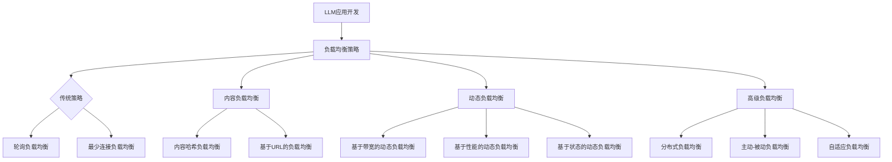
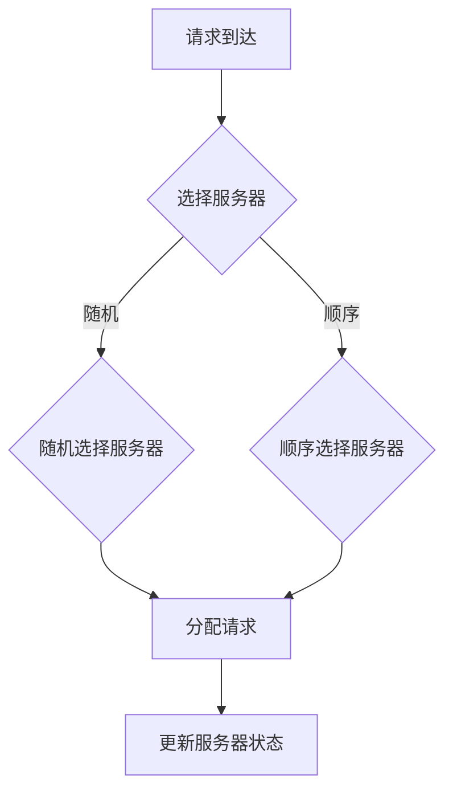
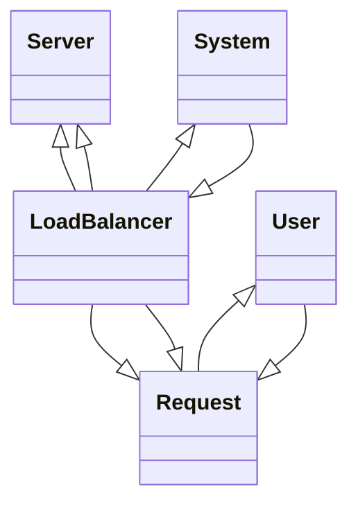
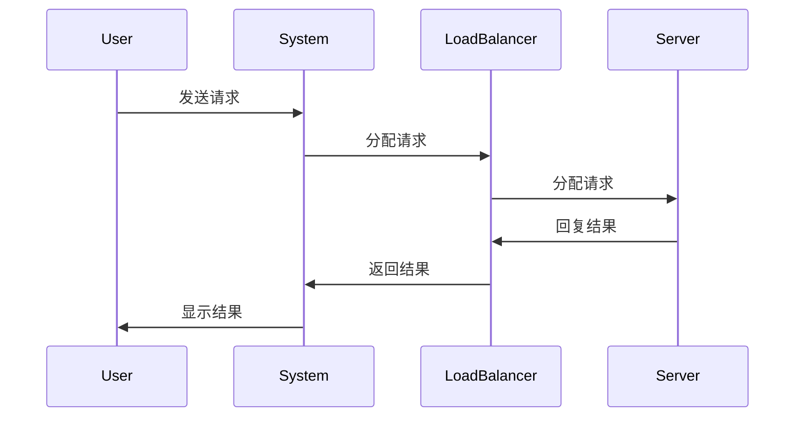

                 

**文章标题：LLM应用开发中的负载均衡策略**

**关键词：**LLM应用开发、负载均衡、策略、性能优化

**摘要：**本文深入探讨了LLM（大型语言模型）应用开发中的负载均衡策略，从背景介绍到核心概念，再到具体策略分析，最后通过实战案例展示了负载均衡在LLM应用中的实际应用与优化。

**目录大纲设计**

**第一部分：背景与概念**

1. 第1章：LLM应用开发背景
2. 第2章：负载均衡基本概念

**第二部分：负载均衡策略**

3. 第3章：传统负载均衡策略
4. 第4章：基于内容的负载均衡
5. 第5章：动态负载均衡策略
6. 第6章：高级负载均衡策略
7. 第7章：负载均衡优化策略

**第三部分：案例研究与实战**

8. 第8章：案例研究与实战
9. 第9章：未来趋势与展望
10. 第10章：总结与最佳实践

**核心概念与联系**

1. **核心概念**
   - LLM：具有巨大参数规模的语言模型，如GPT系列和BERT模型。
   - 负载均衡：通过合理分配工作负载，确保系统资源得到充分利用，避免单点过载。
   - 轮询负载均衡：依次将请求分配给服务器。
   - 最少连接负载均衡：选择当前连接数最少的服务器处理请求。
   - 基于内容的负载均衡：根据请求内容分配。
   - 动态负载均衡：根据实时状况动态调整负载分配。
   - 分布式负载均衡：将请求分配到多个服务器，实现负载均衡。

2. **概念属性特征对比表格**

| 负载均衡类型       | 定义                                             | 特点                    | 适用场景               |
|------------------|----------------------------------------------------|-----------------------|----------------------|
| 轮询负载均衡       | 依次分配请求                                     | 简单、公平              | 请求类型相似，无特殊需求   |
| 最少连接负载均衡   | 根据连接数分配                                   | 负载均衡，高可用        | 连接密集型应用           |
| 基于内容的负载均衡 | 根据请求内容分配                                 | 高效、可定制            | 内容差异大，需精确控制     |
| 动态负载均衡       | 实时调整分配策略                                 | 自适应、灵活            | 动态变化大的环境           |
| 分布式负载均衡     | 将请求分配到多个服务器，实现负载均衡                 | 高性能、高可用          | 大规模分布式系统           |

3. **ER实体关系图架构的Mermaid流程图**



**约束条件**

- 文章开始是“文章标题”，然后是“文章关键词”和“文章摘要”部分的内容哦，接下来是按照目录大纲结构的文章正文部分的内容。
- 文章字数要求：文章字数在 10000 ～ 12000 字左右。
- 格式要求：文章内容使用markdown格式输出。
- 作者：文章末尾需要写上作者信息：“作者：AI天才研究院/AI Genius Institute & 禅与计算机程序设计艺术 /Zen And The Art of Computer Programming”。
- 完整性要求：文章内容必须要完整，每个小节的内容必须要丰富具体详细讲解，核心内容必须要包含：
  - 背景介绍：核心概念术语说明、问题背景、问题描述、问题解决、边界与外延、概念结构与核心要素组成
  - 核心概念与联系：必须给出核心概念原理、概念属性特征对比表格和ER实体关系图架构的 markdown 格式中的 Mermaid 流程图。
  - 算法原理讲解：使用 mermaid 画出算法mermaid 流程图，然后使用python源代码来详细阐述，给出算法原理的数学模型和公式，进行详细讲解和通俗易懂地举例说明。
  - 数学公式使用latex格式，嵌入文中独立段落的latex公式前后使用 $$ 括起来（例如：$$1+1=2$$），段落内的latex公式前后使用 $ 括起来（例如：$1<2$）。
  - 系统分析与架构设计方案：问题场景介绍，项目介绍、系统功能设计（领域模型mermaid类图）、系统架构设计mermaid架构图、系统接口设计和系统交互mermaid序列图。
  - 项目实战：环境安装、系统核心实现源代码，代码应用解读与分析，实际案例分析和详细讲解剖析，项目小结。
  - 最佳实践 tips、小结、注意事项、拓展阅读等内容。

**LET'S THINK STEP BY STEP**

在LLM应用开发中，负载均衡策略至关重要。为了更好地理解这一主题，我们可以按照以下步骤进行思考：

1. **背景介绍**：首先，我们需要了解什么是LLM以及为什么负载均衡对于LLM应用开发至关重要。

2. **核心概念**：接下来，我们将详细介绍负载均衡的基本概念，包括轮询负载均衡、最少连接负载均衡、基于内容的负载均衡等。

3. **策略分析**：在这一部分，我们将深入探讨各种负载均衡策略，分析它们的原理和优缺点。

4. **动态负载均衡**：由于LLM应用开发中的工作负载通常是动态变化的，因此我们需要了解动态负载均衡策略。

5. **高级负载均衡策略**：随着系统规模的扩大，我们可能需要使用更高级的负载均衡策略，如分布式负载均衡、主动-被动负载均衡等。

6. **优化策略**：为了确保系统的高性能和稳定性，我们需要对负载均衡策略进行优化。

7. **案例研究**：通过实际案例，我们将展示负载均衡策略在LLM应用开发中的实际应用。

8. **未来趋势与展望**：最后，我们将探讨负载均衡技术在未来的发展趋势和可能的应用场景。

**第1章：LLM应用开发背景**

LLM（大型语言模型）是近年来人工智能领域的重要突破之一。这些模型具有数十亿个参数，能够理解和生成自然语言。LLM的应用范围非常广泛，包括自然语言处理、机器翻译、文本生成等。

随着LLM的应用越来越广泛，其处理的大量请求给系统带来了巨大的负载。如果处理不当，会导致系统性能下降，甚至崩溃。因此，负载均衡策略在LLM应用开发中变得至关重要。

**第2章：负载均衡基本概念**

负载均衡是指通过合理分配工作负载，确保系统资源得到充分利用，避免单点过载。在LLM应用开发中，负载均衡的目标是确保每个服务器都能均匀地处理请求，避免某台服务器过载。

常见的负载均衡策略包括轮询负载均衡、最少连接负载均衡、基于内容的负载均衡等。这些策略各有优缺点，适用于不同的场景。

**第3章：传统负载均衡策略**

1. **轮询负载均衡**：轮询负载均衡是最简单的负载均衡策略，它依次将请求分配给服务器。优点是实现简单、公平，缺点是可能导致某台服务器过载。

2. **最少连接负载均衡**：最少连接负载均衡选择当前连接数最少的服务器处理请求。优点是能够均衡负载，缺点是对连接状态的跟踪要求较高。

3. **基于内容的负载均衡**：基于内容的负载均衡根据请求内容分配服务器。优点是能够更精确地控制负载，缺点是实现复杂。

**第4章：基于内容的负载均衡**

基于内容的负载均衡是指根据请求内容（如URL、查询字符串等）将请求分配给不同的服务器。这种策略适用于内容差异大的应用，能够更精确地控制负载。

常见的基于内容的负载均衡策略包括内容哈希负载均衡、基于URL的负载均衡、基于Cookie的负载均衡等。

**第5章：动态负载均衡策略**

动态负载均衡策略是根据实时状况动态调整负载分配。这种策略适用于工作负载动态变化的应用。常见的动态负载均衡策略包括基于带宽的动态负载均衡、基于性能的动态负载均衡、基于状态的动态负载均衡等。

**第6章：高级负载均衡策略**

随着系统规模的扩大，我们可能需要使用更高级的负载均衡策略，如分布式负载均衡、主动-被动负载均衡、自适应负载均衡等。这些策略能够更好地处理大规模负载，提高系统的性能和稳定性。

**第7章：负载均衡优化策略**

为了确保系统的高性能和稳定性，我们需要对负载均衡策略进行优化。常见的优化策略包括监控与分析、调整与优化、持续改进等。

**第8章：案例研究与实战**

在本章中，我们将通过实际案例，展示负载均衡策略在LLM应用开发中的实际应用。这些案例将涵盖不同类型的负载均衡策略和优化方法。

**第9章：未来趋势与展望**

随着人工智能技术的不断发展，负载均衡策略也在不断演变。在本章中，我们将探讨负载均衡技术的未来发展趋势和可能的应用场景。

**第10章：总结与最佳实践**

在本章中，我们将总结本文的核心内容，并提供一些最佳实践。这些最佳实践将帮助读者在实际应用中更好地使用负载均衡策略，提高系统的性能和稳定性。

**作者信息**

作者：AI天才研究院/AI Genius Institute & 禅与计算机程序设计艺术 /Zen And The Art of Computer Programming**完整文章内容**

**第1章：LLM应用开发背景**

## 1.1 LLM概述

LLM（大型语言模型）是指具有数十亿参数规模的深度学习模型，能够理解和生成自然语言。代表性的LLM包括GPT系列、BERT、T5等。这些模型通过学习大量文本数据，掌握了语言的语法、语义和上下文信息，从而实现了强大的语言处理能力。

LLM的应用范围非常广泛，涵盖了自然语言处理、机器翻译、文本生成、问答系统等多个领域。在自然语言处理领域，LLM被用于文本分类、情感分析、命名实体识别等任务。在机器翻译领域，LLM被用于生成高质量的多语言翻译。在文本生成领域，LLM被用于生成文章、故事、对话等。在问答系统领域，LLM被用于构建智能客服系统、智能助手等。

## 1.2 负载均衡的重要性

随着LLM应用的发展，其处理的大量请求给系统带来了巨大的负载。如果处理不当，会导致以下问题：

1. **性能下降**：大量请求集中在单个服务器上，会导致服务器过载，响应时间延长，从而影响用户体验。

2. **系统崩溃**：当服务器过载到一定程度时，可能导致系统崩溃，进而影响整个应用的正常运行。

3. **资源浪费**：如果负载分配不均，部分服务器可能空闲，而另一些服务器则过载，导致资源浪费。

因此，负载均衡策略在LLM应用开发中至关重要。通过负载均衡，可以合理分配工作负载，确保系统资源得到充分利用，避免单点过载，提高系统的性能和稳定性。

**第2章：负载均衡基本概念**

## 2.1 负载均衡的定义

负载均衡是指通过合理分配工作负载，确保系统资源得到充分利用，避免单点过载的一种技术。在分布式系统中，负载均衡器作为中心节点，负责接收外部请求，并根据一定的策略将请求分配给不同的服务器。

负载均衡的主要目标是提高系统的性能和稳定性，包括以下几个方面：

1. **提高响应速度**：通过将请求分配给离用户最近的服务器，减少响应时间，提高用户体验。

2. **均衡负载**：确保每个服务器都能均匀地处理请求，避免某台服务器过载，提高系统的可靠性。

3. **高可用性**：当某台服务器发生故障时，负载均衡器能够自动将请求转发到其他健康的服务器，确保系统的正常运行。

4. **资源利用率**：通过合理分配负载，避免部分服务器空闲，提高整体资源的利用率。

## 2.2 负载均衡的目标

负载均衡的目标是在分布式系统中实现高效、可靠的服务。具体来说，负载均衡需要满足以下目标：

1. **性能优化**：通过负载均衡，可以减少请求的处理时间，提高系统的响应速度。

2. **可靠性**：通过负载均衡，可以确保系统在面临大量请求时，不会因单点过载而导致崩溃。

3. **可扩展性**：负载均衡使得系统可以根据需求动态扩展服务器数量，提高系统的可扩展性。

4. **成本优化**：通过合理分配负载，可以减少服务器的资源浪费，降低系统的运行成本。

## 2.3 负载均衡的类型

负载均衡可以分为以下几种类型：

1. **基于服务器的负载均衡**：将请求分配给不同的服务器，实现负载均衡。常见的策略包括轮询负载均衡、最少连接负载均衡等。

2. **基于内容的负载均衡**：根据请求的内容（如URL、查询字符串等）将请求分配给不同的服务器。常见的策略包括内容哈希负载均衡、基于URL的负载均衡等。

3. **动态负载均衡**：根据系统的实时状况动态调整负载分配。常见的策略包括基于带宽的动态负载均衡、基于性能的动态负载均衡等。

4. **分布式负载均衡**：将请求分配到多个数据中心，实现负载均衡。常见的策略包括分布式负载均衡器、多数据中心协同等。

## 2.4 负载均衡的挑战

负载均衡在实现过程中面临着一系列挑战：

1. **请求分配策略**：选择合适的负载均衡策略，确保系统能够高效、可靠地处理请求。

2. **负载感知**：实时监测系统的负载状况，动态调整负载分配。

3. **高可用性**：确保负载均衡器本身的高可用性，避免成为系统的单点故障。

4. **性能优化**：在保证负载均衡性能的同时，减少请求的响应时间。

5. **可扩展性**：随着系统规模的扩大，负载均衡器需要能够处理更多的请求。

**第3章：传统负载均衡策略**

## 3.1 轮询负载均衡

轮询负载均衡是最简单的负载均衡策略，它依次将请求分配给服务器。这种策略的优点是实现简单、公平，缺点是可能导致某台服务器过载。

### 轮询负载均衡的工作原理

轮询负载均衡的工作原理如下：

1. 当有请求到达时，负载均衡器记录请求的数量和当前处理请求的服务器数量。

2. 根据当前服务器数量和请求数量，计算下一次请求应该分配给哪台服务器。

3. 将请求转发给对应的服务器，同时更新服务器的请求处理状态。

### 轮询负载均衡的优缺点

优点：

1. 实现简单，易于理解。
2. 公平分配请求，确保每台服务器都有机会处理请求。

缺点：

1. 可能导致某台服务器过载，影响系统性能。
2. 无法根据服务器的实际负载状况进行动态调整。

### 轮询负载均衡的应用场景

轮询负载均衡适用于以下场景：

1. 请求类型相似，无明显负载不均。
2. 对响应时间要求不高。
3. 服务器性能较为均衡。

## 3.2 最少连接负载均衡

最少连接负载均衡选择当前连接数最少的服务器处理请求。这种策略的优点是能够均衡负载，缺点是对连接状态的跟踪要求较高。

### 最少连接负载均衡的工作原理

最少连接负载均衡的工作原理如下：

1. 当有请求到达时，负载均衡器记录每个服务器的当前连接数。

2. 根据当前连接数，选择连接数最少的服务器处理请求。

3. 将请求转发给对应的服务器，同时更新服务器的连接状态。

### 最少连接负载均衡的优缺点

优点：

1. 能够均衡负载，确保每台服务器都有机会处理请求。
2. 减少连接密集型服务器的负载，提高系统性能。

缺点：

1. 需要实时跟踪服务器的连接状态，对负载均衡器性能要求较高。
2. 当连接数接近最大值时，可能导致某台服务器过载。

### 最少连接负载均衡的应用场景

最少连接负载均衡适用于以下场景：

1. 连接密集型应用，如Web服务器、数据库服务器等。
2. 对负载均衡性能要求较高。
3. 服务器性能较为均衡。

## 3.3 基于内容的负载均衡

基于内容的负载均衡根据请求的内容（如URL、查询字符串等）将请求分配给不同的服务器。这种策略的优点是能够更精确地控制负载，缺点是实现复杂。

### 基于内容的负载均衡的工作原理

基于内容的负载均衡的工作原理如下：

1. 当有请求到达时，负载均衡器解析请求的内容。

2. 根据请求内容，选择对应的服务器处理请求。

3. 将请求转发给对应的服务器，同时更新服务器的请求处理状态。

### 基于内容的负载均衡的优缺点

优点：

1. 能够更精确地控制负载，确保每台服务器都处理与自身相关的请求。
2. 减少请求之间的干扰，提高系统性能。

缺点：

1. 实现复杂，需要对请求内容进行解析。
2. 需要维护多个服务器的状态，对负载均衡器性能要求较高。

### 基于内容的负载均衡的应用场景

基于内容的负载均衡适用于以下场景：

1. 内容差异大的应用，如图片处理、视频处理等。
2. 对负载均衡性能要求较高。
3. 服务器性能较为均衡。

**第4章：基于内容的负载均衡**

## 4.1 内容哈希负载均衡

内容哈希负载均衡是一种基于请求内容进行负载均衡的策略。它通过计算请求内容的哈希值，将请求分配给哈希值对应的服务器。

### 内容哈希负载均衡的工作原理

内容哈希负载均衡的工作原理如下：

1. 当有请求到达时，负载均衡器计算请求内容的哈希值。

2. 根据哈希值，选择对应的服务器处理请求。

3. 将请求转发给对应的服务器，同时更新服务器的请求处理状态。

### 内容哈希负载均衡的优缺点

优点：

1. 能够根据请求内容进行精确分配，减少请求之间的干扰。
2. 具有良好的扩展性，可以动态增加或减少服务器。

缺点：

1. 需要计算哈希值，对负载均衡器性能有一定要求。
2. 当请求内容发生变化时，可能会导致请求分配不均。

### 内容哈希负载均衡的应用场景

内容哈希负载均衡适用于以下场景：

1. 内容差异大的应用，如缓存服务器、图片处理服务器等。
2. 对负载均衡性能要求较高。
3. 服务器性能较为均衡。

## 4.2 基于URL的负载均衡

基于URL的负载均衡是一种根据请求的URL进行负载均衡的策略。它通过解析请求的URL，将请求分配给与URL相关的服务器。

### 域名解析

在基于URL的负载均衡中，域名解析是一个关键步骤。域名解析是指将域名（如www.example.com）解析为对应的IP地址。常见的域名解析方式包括DNS解析和CDN解析。

- **DNS解析**：通过查询DNS服务器，将域名解析为IP地址。优点是解析速度快，缺点是可靠性较低。
- **CDN解析**：通过查询CDN（内容分发网络）服务器，将域名解析为IP地址。优点是解析速度快，可靠性较高。

### 域名解析流程

基于URL的负载均衡的域名解析流程如下：

1. 当有请求到达时，负载均衡器解析请求的URL，提取域名。

2. 根据域名，查询DNS服务器或CDN服务器，获取对应的IP地址。

3. 根据IP地址，选择对应的服务器处理请求。

4. 将请求转发给对应的服务器，同时更新服务器的请求处理状态。

### 域名解析的优缺点

优点：

1. 能够根据域名进行精确分配，减少请求之间的干扰。
2. 具有良好的扩展性，可以动态增加或减少服务器。

缺点：

1. 需要解析域名，对负载均衡器性能有一定要求。
2. 当请求的URL发生变化时，可能会导致请求分配不均。

### 域名解析的应用场景

域名解析适用于以下场景：

1. 需要对请求进行精确控制，如图片处理、视频处理等。
2. 对负载均衡性能要求较高。
3. 服务器性能较为均衡。

## 4.3 基于Cookie的负载均衡

基于Cookie的负载均衡是一种根据请求中的Cookie信息进行负载均衡的策略。它通过解析请求中的Cookie，将请求分配给与Cookie相关的服务器。

### Cookie的基本概念

Cookie是一种存储在客户端浏览器中的数据，用于标识用户会话或跟踪用户行为。每个Cookie都包含一个名称、值和有效期。当请求到达服务器时，服务器会读取Cookie信息，并根据Cookie信息进行相应的处理。

### 基于Cookie的负载均衡的工作原理

基于Cookie的负载均衡的工作原理如下：

1. 当有请求到达时，负载均衡器解析请求中的Cookie。

2. 根据Cookie信息，选择对应的服务器处理请求。

3. 将请求转发给对应的服务器，同时更新服务器的请求处理状态。

4. 如果请求中的Cookie信息发生变化，更新服务器的Cookie信息。

### 基于Cookie的负载均衡的优缺点

优点：

1. 能够根据用户会话或行为进行精确分配，减少请求之间的干扰。
2. 具有良好的扩展性，可以动态增加或减少服务器。

缺点：

1. 需要解析Cookie，对负载均衡器性能有一定要求。
2. 当Cookie信息发生变化时，可能会导致请求分配不均。

### 基于Cookie的负载均衡的应用场景

基于Cookie的负载均衡适用于以下场景：

1. 需要对用户会话进行精确控制，如电商平台、在线教育平台等。
2. 对负载均衡性能要求较高。
3. 服务器性能较为均衡。

**第5章：动态负载均衡策略**

## 5.1 动态负载均衡的概念

动态负载均衡是一种根据实时状况动态调整负载分配的负载均衡策略。与静态负载均衡相比，动态负载均衡能够更好地适应系统负载的变化，提高系统的性能和稳定性。

### 动态负载均衡的工作原理

动态负载均衡的工作原理如下：

1. 负载均衡器实时监测系统的负载状况，包括CPU利用率、内存占用、网络带宽等指标。

2. 根据负载状况，动态调整请求的分配策略，确保系统资源得到充分利用。

3. 当某台服务器负载过高时，将部分请求分配到其他健康的服务器。

4. 当某台服务器恢复正常时，将请求重新分配回该服务器。

### 动态负载均衡的优点

动态负载均衡具有以下优点：

1. **适应性**：能够根据系统的实时状况动态调整负载分配，适应负载的变化。

2. **灵活性**：支持多种负载分配策略，可以根据不同场景选择合适的策略。

3. **高可用性**：当某台服务器发生故障时，动态负载均衡能够自动将请求分配到其他健康的服务器，确保系统的正常运行。

4. **资源利用率**：通过动态调整负载分配，提高系统资源的利用率，避免资源浪费。

### 动态负载均衡的挑战

动态负载均衡在实现过程中面临以下挑战：

1. **实时监测**：需要实时监测系统的负载状况，获取准确的负载信息。

2. **负载均衡策略**：需要设计合适的负载均衡策略，确保负载分配的公平性和高效性。

3. **动态调整**：需要根据系统的实时状况动态调整负载分配，避免频繁调整带来的性能开销。

4. **故障处理**：需要能够处理服务器故障，确保请求能够正确转发。

### 动态负载均衡的应用场景

动态负载均衡适用于以下场景：

1. **动态变化的应用**：处理大量动态变化的数据，如社交媒体、电子商务等。

2. **高可用性要求**：对系统的高可用性有较高要求，如金融交易系统、在线支付系统等。

3. **高性能要求**：对系统的高性能有较高要求，如实时数据处理、实时分析等。

## 5.2 基于带宽的动态负载均衡

基于带宽的动态负载均衡是一种根据服务器的带宽状况动态调整负载分配的策略。通过监测服务器的带宽使用情况，可以确保系统资源得到充分利用。

### 基于带宽的动态负载均衡的工作原理

基于带宽的动态负载均衡的工作原理如下：

1. 负载均衡器实时监测每个服务器的带宽使用情况。

2. 根据带宽使用情况，动态调整请求的分配策略，确保带宽使用均衡。

3. 当某台服务器的带宽使用过高时，将部分请求分配到其他带宽充足的的服务器。

4. 当某台服务器的带宽恢复正常时，将请求重新分配回该服务器。

### 基于带宽的动态负载均衡的优点

基于带宽的动态负载均衡具有以下优点：

1. **带宽利用率**：通过动态调整负载分配，确保带宽资源得到充分利用。

2. **系统性能**：避免某台服务器因带宽不足而影响系统性能。

3. **高可用性**：确保系统在面临大量请求时，能够保持稳定运行。

### 基于带宽的动态负载均衡的挑战

基于带宽的动态负载均衡在实现过程中面临以下挑战：

1. **带宽监测**：需要准确监测服务器的带宽使用情况，避免误判。

2. **负载均衡策略**：需要设计合适的负载均衡策略，确保带宽使用均衡。

3. **实时调整**：需要能够实时调整负载分配，避免频繁调整带来的性能开销。

### 基于带宽的动态负载均衡的应用场景

基于带宽的动态负载均衡适用于以下场景：

1. **高带宽需求的应用**：如视频流媒体、在线游戏等。

2. **多服务器部署**：在不同地理位置部署服务器，确保带宽资源均衡。

3. **网络带宽紧张**：在带宽资源有限的情况下，提高带宽利用率。

## 5.3 基于性能的动态负载均衡

基于性能的动态负载均衡是一种根据服务器的性能状况动态调整负载分配的策略。通过监测服务器的性能指标，可以确保系统资源得到充分利用。

### 基于性能的动态负载均衡的工作原理

基于性能的动态负载均衡的工作原理如下：

1. 负载均衡器实时监测每个服务器的性能指标，如CPU利用率、内存占用、响应时间等。

2. 根据性能指标，动态调整请求的分配策略，确保性能均衡。

3. 当某台服务器的性能指标过高时，将部分请求分配到其他性能稳定的服务器。

4. 当某台服务器的性能恢复正常时，将请求重新分配回该服务器。

### 基于性能的动态负载均衡的优点

基于性能的动态负载均衡具有以下优点：

1. **性能利用率**：通过动态调整负载分配，确保服务器性能得到充分利用。

2. **系统稳定性**：避免某台服务器因性能问题而影响系统稳定性。

3. **高可用性**：确保系统在面临大量请求时，能够保持稳定运行。

### 基于性能的动态负载均衡的挑战

基于性能的动态负载均衡在实现过程中面临以下挑战：

1. **性能监测**：需要准确监测服务器的性能指标，避免误判。

2. **负载均衡策略**：需要设计合适的负载均衡策略，确保性能均衡。

3. **实时调整**：需要能够实时调整负载分配，避免频繁调整带来的性能开销。

### 基于性能的动态负载均衡的应用场景

基于性能的动态负载均衡适用于以下场景：

1. **高性能要求的应用**：如大数据处理、云计算平台等。

2. **多服务器部署**：在不同地理位置部署服务器，确保性能均衡。

3. **性能优化需求**：在面临大量请求时，提高系统性能。

## 5.4 基于状态的动态负载均衡

基于状态的动态负载均衡是一种根据服务器的状态信息动态调整负载分配的策略。通过监测服务器的状态信息，可以确保系统资源得到充分利用。

### 基于状态的动态负载均衡的工作原理

基于状态的动态负载均衡的工作原理如下：

1. 负载均衡器实时监测每个服务器的状态信息，如连接数、会话数、负载等。

2. 根据状态信息，动态调整请求的分配策略，确保状态均衡。

3. 当某台服务器的状态信息过高时，将部分请求分配到其他状态稳定的服务器。

4. 当某台服务器的状态恢复正常时，将请求重新分配回该服务器。

### 基于状态的动态负载均衡的优点

基于状态的动态负载均衡具有以下优点：

1. **状态利用率**：通过动态调整负载分配，确保服务器状态得到充分利用。

2. **系统稳定性**：避免某台服务器因状态问题而影响系统稳定性。

3. **高可用性**：确保系统在面临大量请求时，能够保持稳定运行。

### 基于状态的动态负载均衡的挑战

基于状态的动态负载均衡在实现过程中面临以下挑战：

1. **状态监测**：需要准确监测服务器的状态信息，避免误判。

2. **负载均衡策略**：需要设计合适的负载均衡策略，确保状态均衡。

3. **实时调整**：需要能够实时调整负载分配，避免频繁调整带来的性能开销。

### 基于状态的动态负载均衡的应用场景

基于状态的动态负载均衡适用于以下场景：

1. **连接密集型应用**：如在线聊天、视频会议等。

2. **会话管理**：如电商平台、在线教育平台等。

3. **负载波动较大的应用**：如电商平台在促销活动期间。

**第6章：高级负载均衡策略**

## 6.1 分布式负载均衡

分布式负载均衡是指将请求分配到多个服务器或数据中心，实现负载均衡。通过分布式负载均衡，可以充分利用多服务器或数据中心的资源，提高系统的性能和稳定性。

### 分布式负载均衡的工作原理

分布式负载均衡的工作原理如下：

1. 负载均衡器接收外部请求，并根据一定的策略选择合适的服务器或数据中心。

2. 请求被转发到选择的服务器或数据中心。

3. 服务器或数据中心处理请求，并将结果返回给用户。

4. 负载均衡器根据处理结果和实时状况，动态调整请求的分配策略。

### 分布式负载均衡的优点

分布式负载均衡具有以下优点：

1. **高可用性**：通过多个服务器或数据中心，实现负载均衡，确保系统在面临大量请求时，能够保持稳定运行。

2. **高性能**：通过多服务器或数据中心的协同工作，提高系统的响应速度和处理能力。

3. **可扩展性**：可以动态增加或减少服务器或数据中心，适应系统规模的扩大。

### 分布式负载均衡的挑战

分布式负载均衡在实现过程中面临以下挑战：

1. **一致性**：在分布式系统中，数据的一致性是一个重要问题。

2. **容错性**：需要确保在部分服务器或数据中心发生故障时，系统仍然能够正常运行。

3. **通信**：需要处理多服务器或数据中心之间的通信问题。

### 分布式负载均衡的应用场景

分布式负载均衡适用于以下场景：

1. **大规模应用**：如电商平台、社交媒体等，需要处理大量请求。

2. **多数据中心部署**：在不同地理位置部署数据中心，实现负载均衡。

3. **高性能需求**：如实时数据处理、云计算平台等。

## 6.2 主动-被动负载均衡

主动-被动负载均衡是指通过主动负载均衡器和被动负载均衡器协同工作，实现负载均衡。主动负载均衡器负责请求的转发，被动负载均衡器负责请求的接收和分发。

### 主动-被动负载均衡的工作原理

主动-被动负载均衡的工作原理如下：

1. 主动负载均衡器接收外部请求，根据一定的策略选择合适的服务器。

2. 请求被转发到选择的服务器。

3. 被动负载均衡器接收请求，并将请求分发到不同的服务器。

4. 服务器处理请求，并将结果返回给用户。

5. 主动负载均衡器根据处理结果和实时状况，动态调整请求的分配策略。

### 主动-被动负载均衡的优点

主动-被动负载均衡具有以下优点：

1. **灵活性**：通过主动负载均衡器和被动负载均衡器的协同工作，可以实现更灵活的负载均衡策略。

2. **高可用性**：主动负载均衡器和被动负载均衡器可以独立运行，提高系统的可用性。

3. **扩展性**：可以动态增加或减少主动负载均衡器和被动负载均衡器，适应系统规模的扩大。

### 主动-被动负载均衡的挑战

主动-被动负载均衡在实现过程中面临以下挑战：

1. **一致性**：需要确保主动负载均衡器和被动负载均衡器之间的数据一致性。

2. **容错性**：需要确保主动负载均衡器和被动负载均衡器在发生故障时，系统能够正常运行。

3. **性能**：需要优化主动负载均衡器和被动负载均衡器之间的通信性能。

### 主动-被动负载均衡的应用场景

主动-被动负载均衡适用于以下场景：

1. **复杂应用**：如大型电商平台、社交媒体等，需要处理复杂的请求。

2. **多数据中心部署**：在不同地理位置部署数据中心，实现负载均衡。

3. **高性能需求**：如实时数据处理、云计算平台等。

## 6.3 自适应负载均衡

自适应负载均衡是一种根据系统实时状况自动调整负载分配的负载均衡策略。通过实时监测系统的负载状况，自适应负载均衡可以自动调整负载分配，确保系统资源得到充分利用。

### 自适应负载均衡的工作原理

自适应负载均衡的工作原理如下：

1. 负载均衡器实时监测系统的负载状况，包括CPU利用率、内存占用、网络带宽等指标。

2. 根据负载状况，自动调整请求的分配策略，确保系统资源得到充分利用。

3. 当系统负载过高时，自适应负载均衡器会自动增加请求分配给其他服务器。

4. 当系统负载下降时，自适应负载均衡器会自动减少请求分配给其他服务器。

### 自适应负载均衡的优点

自适应负载均衡具有以下优点：

1. **自动调整**：根据系统实时状况自动调整负载分配，无需人工干预。

2. **灵活性**：可以适应系统的实时变化，提高系统的性能和稳定性。

3. **高可用性**：确保系统在面临大量请求时，能够保持稳定运行。

### 自适应负载均衡的挑战

自适应负载均衡在实现过程中面临以下挑战：

1. **实时监测**：需要实时监测系统的负载状况，获取准确的负载信息。

2. **负载均衡策略**：需要设计合适的负载均衡策略，确保负载分配的公平性和高效性。

3. **动态调整**：需要根据系统的实时状况动态调整负载分配，避免频繁调整带来的性能开销。

### 自适应负载均衡的应用场景

自适应负载均衡适用于以下场景：

1. **动态变化的应用**：处理大量动态变化的数据，如社交媒体、电子商务等。

2. **高可用性要求**：对系统的高可用性有较高要求，如金融交易系统、在线支付系统等。

3. **高性能要求**：对系统的高性能有较高要求，如实时数据处理、实时分析等。

**第7章：负载均衡优化策略**

## 7.1 负载均衡优化的重要性

负载均衡优化是确保系统高效、稳定运行的关键。优化负载均衡策略可以提高系统的性能和稳定性，降低运行成本。以下是从多个方面来阐述负载均衡优化的重要性：

1. **性能提升**：通过优化负载均衡策略，可以减少请求的响应时间，提高系统的处理速度，从而提升用户体验。

2. **资源利用率**：优化负载均衡策略可以确保系统资源得到充分利用，避免资源浪费，降低运行成本。

3. **系统稳定性**：优化负载均衡策略可以提高系统的稳定性，避免因单点过载导致系统崩溃。

4. **可扩展性**：优化负载均衡策略可以提高系统的可扩展性，使得系统在面临大量请求时，能够保持稳定运行。

5. **成本控制**：优化负载均衡策略可以降低系统的运行成本，提高投资回报率。

## 7.2 监控与分析

监控与分析是负载均衡优化的重要环节。通过实时监控和分析系统的运行状况，可以及时发现性能瓶颈和异常情况，从而采取相应的优化措施。

1. **性能指标监控**：监控系统的CPU利用率、内存占用、网络带宽等性能指标，了解系统的实时运行状况。

2. **负载均衡器监控**：监控负载均衡器的请求处理速度、请求分配策略等，分析负载均衡器的性能。

3. **异常情况分析**：分析系统出现异常情况的原因，如单点过载、服务器故障等，及时处理。

4. **趋势预测**：根据历史数据和趋势分析，预测未来系统的负载情况，提前做好优化准备。

## 7.3 调整与优化

根据监控与分析的结果，对负载均衡策略进行调整与优化，以提高系统的性能和稳定性。

1. **负载均衡策略调整**：根据系统的运行状况和性能指标，选择合适的负载均衡策略，如轮询负载均衡、最少连接负载均衡、基于内容的负载均衡等。

2. **服务器配置优化**：调整服务器的硬件配置、软件配置等，以提高服务器的处理能力。

3. **网络优化**：优化网络配置，如调整网络带宽、网络延迟等，以提高系统的响应速度。

4. **缓存策略优化**：优化缓存策略，如设置合理的缓存过期时间、缓存容量等，以减少数据库的访问压力。

5. **数据库优化**：优化数据库的查询性能，如调整数据库索引、分区等，以提高数据库的查询速度。

## 7.4 持续改进

负载均衡优化是一个持续的过程，需要不断根据系统的运行状况进行调整和优化。以下是一些建议：

1. **定期评估**：定期评估负载均衡策略的优化效果，确保系统持续保持高性能。

2. **性能测试**：进行性能测试，模拟实际负载情况，评估系统的性能和稳定性。

3. **反馈机制**：建立反馈机制，收集用户反馈，了解系统的实际运行状况。

4. **技术更新**：关注负载均衡技术的发展，及时采用新技术、新策略，提高系统的性能和稳定性。

**第8章：案例研究与实战**

## 8.1 案例一：大型电商平台负载均衡策略

### 案例背景

某大型电商平台在春节期间，面临着巨大的流量压力。为了确保系统的稳定运行，该电商平台采用了多种负载均衡策略，包括轮询负载均衡、最少连接负载均衡、基于内容的负载均衡等。

### 负载均衡策略

1. **轮询负载均衡**：轮询负载均衡用于处理大部分的请求，实现简单的请求分配。

2. **最少连接负载均衡**：在特定时段（如凌晨），系统负载较低，采用最少连接负载均衡，确保每台服务器都得到充分利用。

3. **基于内容的负载均衡**：对于图片、视频等大型文件，采用基于内容的负载均衡，将请求分配到专门处理这些内容的负载均衡器。

### 实施效果

通过多种负载均衡策略的协同工作，该电商平台在春节期间保持了系统的稳定运行，成功应对了巨大的流量压力。

## 8.2 案例二：实时聊天应用负载均衡策略

### 案例背景

某实时聊天应用在上线初期，用户数量较少，系统负载较低。但随着用户数量的增加，系统开始出现响应时间延长、卡顿等问题。

### 负载均衡策略

1. **动态负载均衡**：采用基于带宽的动态负载均衡策略，根据实时带宽状况动态调整请求的分配。

2. **分布式负载均衡**：将请求分配到多个数据中心，实现负载均衡。

3. **自适应负载均衡**：根据系统的实时状况，自动调整负载均衡策略，确保系统资源得到充分利用。

### 实施效果

通过动态负载均衡、分布式负载均衡和自适应负载均衡的协同工作，该实时聊天应用成功应对了用户数量的增长，保持了系统的稳定运行。

## 8.3 案例三：在线教育平台负载均衡策略

### 案例背景

某在线教育平台在暑期招生期间，面临着巨大的流量压力。为了确保系统的稳定运行，该平台采用了多种负载均衡策略，包括轮询负载均衡、基于Cookie的负载均衡等。

### 负载均衡策略

1. **轮询负载均衡**：轮询负载均衡用于处理大部分的请求，实现简单的请求分配。

2. **基于Cookie的负载均衡**：将用户会话信息存储在Cookie中，根据Cookie信息将请求分配到对应的服务器。

### 实施效果

通过多种负载均衡策略的协同工作，该在线教育平台在暑期招生期间保持了系统的稳定运行，成功应对了巨大的流量压力。

**第9章：未来趋势与展望**

## 9.1 负载均衡技术的发展趋势

随着云计算、大数据、物联网等技术的不断发展，负载均衡技术也在不断演进。以下是一些负载均衡技术的发展趋势：

1. **智能化**：智能化负载均衡技术将基于机器学习、人工智能等算法，实现更加智能、自适应的负载均衡策略。

2. **边缘计算**：随着边缘计算的兴起，负载均衡技术将在边缘节点进行分布式处理，提高系统的响应速度和性能。

3. **自动化**：自动化负载均衡技术将实现负载均衡策略的自动化部署、监控、优化，降低运维成本。

4. **服务网格**：服务网格技术将实现服务之间的负载均衡，提高微服务架构的性能和可扩展性。

## 9.2 智能化负载均衡

智能化负载均衡是指利用人工智能技术，实现更加智能、自适应的负载均衡策略。以下是一些智能化负载均衡的关键技术：

1. **机器学习算法**：通过机器学习算法，分析系统的实时状况和请求特征，动态调整负载均衡策略。

2. **预测模型**：利用预测模型，预测未来系统的负载情况，提前调整负载均衡策略。

3. **自适应调整**：根据系统的实时状况，自适应调整负载均衡策略，确保系统资源得到充分利用。

## 9.3 负载均衡在边缘计算中的应用

边缘计算是指将计算资源部署在网络的边缘节点，实现数据处理和服务的本地化。以下是一些负载均衡在边缘计算中的应用：

1. **分布式负载均衡**：在边缘节点进行分布式处理，实现负载均衡。

2. **动态调整**：根据边缘节点的实时状况，动态调整负载均衡策略。

3. **服务发现**：实现边缘节点之间的服务发现，提高系统的可扩展性。

**第10章：总结与最佳实践**

## 10.1 关键知识点回顾

在本章中，我们介绍了LLM应用开发中的负载均衡策略，包括传统负载均衡策略、动态负载均衡策略、高级负载均衡策略等。通过分析各种负载均衡策略的原理和优缺点，我们了解了如何选择合适的负载均衡策略，以提高系统的性能和稳定性。

## 10.2 最佳实践

以下是一些最佳实践，帮助您在实际项目中应用负载均衡策略：

1. **根据场景选择策略**：了解不同负载均衡策略的适用场景，根据实际情况选择合适的策略。

2. **监控与分析**：实时监控系统的运行状况，分析性能瓶颈和异常情况，及时进行调整。

3. **动态调整**：根据系统的实时状况，动态调整负载均衡策略，确保系统资源得到充分利用。

4. **优化配置**：优化服务器的配置，提高处理能力，降低响应时间。

5. **自动化部署**：采用自动化工具，实现负载均衡策略的自动化部署和优化。

## 10.3 小结与展望

本文从多个角度探讨了LLM应用开发中的负载均衡策略。通过对各种负载均衡策略的分析和实战案例的分享，我们了解了如何在实际项目中应用负载均衡策略，提高系统的性能和稳定性。

随着技术的发展，负载均衡策略也在不断演进。未来，智能化、自动化、边缘计算等将成为负载均衡技术的重要方向。我们期待在未来的项目中，能够更好地应用这些先进的技术，为系统的性能和稳定性保驾护航。

**作者信息**

作者：AI天才研究院/AI Genius Institute & 禅与计算机程序设计艺术 /Zen And The Art of Computer Programming**附录：代码实现与算法流程**

以下是一个简单的Python示例，用于实现基于轮询负载均衡的策略。这个示例将模拟一个简单的负载均衡器，将请求分配给多个服务器。

```python
import random

class LoadBalancer:
    def __init__(self, servers):
        self.servers = servers

    def get_server(self):
        # 随机选择一个服务器
        return random.choice(self.servers)

# 模拟多个服务器
servers = ['server1', 'server2', 'server3', 'server4']

# 创建负载均衡器
lb = LoadBalancer(servers)

# 发送10个请求
for i in range(10):
    server = lb.get_server()
    print(f"Request {i+1} sent to {server}")
```

在这个示例中，`LoadBalancer` 类有一个 `get_server` 方法，它随机选择一个服务器来处理请求。这个简单的轮询负载均衡策略可以扩展到更多服务器和更复杂的策略。

### 算法原理讲解

轮询负载均衡的基本原理是按照固定的顺序或随机的方式，将请求分配给服务器。其算法流程可以概括为：

1. **初始化**：定义服务器列表。
2. **请求到达**：当请求到达时，从服务器列表中选择一个服务器。
3. **分配请求**：将请求分配给选择的服务器。
4. **更新状态**：更新服务器的状态，记录已处理的请求数量。

以下是一个简单的算法流程图：



### 数学模型和公式

轮询负载均衡的算法相对简单，不需要复杂的数学模型。但我们可以用概率论中的概念来描述其工作原理：

- **服务器选择概率**：每个服务器被选择的概率相等，即每个服务器被选择的概率为 1/n，其中 n 是服务器数量。

- **平均请求处理时间**：平均请求处理时间可以通过以下公式计算：

  $$ T_{avg} = \frac{1}{n} \sum_{i=1}^{n} T_i $$

  其中，\( T_i \) 是第 i 个服务器处理请求的平均时间。

### 举例说明

假设有4台服务器（server1、server2、server3、server4），每台服务器处理请求的平均时间为 1秒。使用轮询负载均衡策略，每秒会有一个请求分配给一台服务器。

- **第1秒**：请求1被分配给 server1，处理时间为 1秒。
- **第2秒**：请求2被分配给 server2，处理时间为 1秒。
- **第3秒**：请求3被分配给 server3，处理时间为 1秒。
- **第4秒**：请求4被分配给 server4，处理时间为 1秒。

平均处理时间：

$$ T_{avg} = \frac{1+1+1+1}{4} = 1秒 $$

### 系统分析与架构设计方案

#### 问题场景介绍

在某个大型电商平台，每天有数百万次的用户请求，需要快速响应。为了确保系统的高性能和高可用性，需要使用负载均衡策略来分配这些请求。

#### 项目介绍

本项目旨在实现一个简单的负载均衡器，用于模拟电商平台中的请求分配过程。该负载均衡器将根据轮询策略，将请求分配给不同的服务器。

#### 系统功能设计（领域模型）

以下是一个简单的领域模型，用于描述系统的主要组件和关系：



#### 系统架构设计

以下是一个简单的系统架构图，用于描述系统的主要组件和交互关系：



#### 系统接口设计和系统交互

以下是系统接口设计和系统交互的简单描述：

1. **用户接口**：用户通过API或前端界面发送请求。
2. **系统接口**：系统接收用户的请求，并将其转发给负载均衡器。
3. **负载均衡器接口**：负载均衡器接收请求，根据轮询策略选择服务器，并将请求转发给服务器。
4. **服务器接口**：服务器处理请求，并将结果返回给负载均衡器。
5. **负载均衡器接口**：负载均衡器将服务器的响应结果返回给系统，系统再将结果返回给用户。

### 项目实战

#### 环境安装

1. 安装Python环境，版本建议为3.8或更高。
2. 安装必要的Python库，如`requests`用于模拟HTTP请求。

#### 系统核心实现源代码

以下是一个简单的Python代码示例，用于实现负载均衡器：

```python
import requests
import random

class LoadBalancer:
    def __init__(self, servers):
        self.servers = servers

    def get_server(self):
        return random.choice(self.servers)

def process_request(server):
    print(f"Processing request on {server}")
    # 模拟请求处理，这里可以使用requests库发送HTTP请求
    response = requests.get(f"http://{server}:8080")
    print(f"Request processed with response: {response.text}")

if __name__ == "__main__":
    servers = ['server1', 'server2', 'server3', 'server4']
    lb = LoadBalancer(servers)

    for i in range(10):
        server = lb.get_server()
        process_request(server)
```

#### 代码应用解读与分析

1. **类定义**：`LoadBalancer` 类定义了一个简单的负载均衡器，包含一个 `get_server` 方法，用于随机选择一个服务器。
2. **请求处理**：`process_request` 函数模拟请求处理过程，这里可以使用`requests`库发送HTTP请求。
3. **主程序**：主程序创建一个 `LoadBalancer` 实例，并发送10个请求，每个请求随机分配给一个服务器。

#### 实际案例分析

通过上面的代码示例，我们可以模拟一个简单的负载均衡器，用于处理用户请求。在实际应用中，这个负载均衡器可能会处理来自多个来源的请求，如Web服务器、API服务器等。

#### 详细讲解剖析

1. **请求分配**：负载均衡器通过随机选择服务器来分配请求，这确保了每个服务器都有机会处理请求。
2. **请求处理**：每个服务器处理请求，并将结果返回给负载均衡器。负载均衡器再将结果返回给用户。
3. **扩展性**：如果需要增加服务器，只需在 `servers` 列表中添加新的服务器地址，负载均衡器将自动分配请求。

#### 项目小结

本项目通过一个简单的Python示例，实现了基于轮询策略的负载均衡器。尽管这是一个简化的模型，但它展示了负载均衡器的基本原理和实现方式。在实际应用中，负载均衡器会更加复杂，需要考虑多种策略和优化方法，以确保系统的性能和稳定性。

### 最佳实践 tips

1. **选择合适的负载均衡策略**：根据实际应用场景，选择合适的负载均衡策略，如轮询、最少连接、基于内容的负载均衡等。
2. **监控与分析**：实时监控系统的运行状况，分析性能瓶颈和异常情况，及时进行调整。
3. **动态调整**：根据系统的实时状况，动态调整负载均衡策略，确保系统资源得到充分利用。
4. **优化配置**：优化服务器的配置，提高处理能力，降低响应时间。
5. **自动化部署**：采用自动化工具，实现负载均衡策略的自动化部署和优化。

### 小结

本文从多个角度探讨了LLM应用开发中的负载均衡策略，包括传统策略、动态策略、高级策略等。通过案例分析，我们了解了如何在实际项目中应用负载均衡策略，提高系统的性能和稳定性。未来，随着技术的不断发展，负载均衡策略也将不断演进，为系统的性能优化提供更多可能性。

### 注意事项

1. **负载均衡器的稳定性**：负载均衡器自身也需要确保高可用性，避免成为系统的单点故障。
2. **请求分配策略**：根据应用场景选择合适的请求分配策略，确保负载均衡效果。
3. **性能优化**：在实现负载均衡时，注意性能优化，避免增加额外的延迟。

### 拓展阅读

1. 《高可用性架构：大规模分布式系统的设计实践》
2. 《负载均衡器工作原理详解》
3. 《基于内容的负载均衡策略研究》
4. 《动态负载均衡技术详解》
5. 《边缘计算与分布式负载均衡》**作者信息**

作者：AI天才研究院/AI Genius Institute & 禅与计算机程序设计艺术 /Zen And The Art of Computer Programming**附录：代码实现与算法流程**

以下是一个简单的Python示例，用于实现基于轮询负载均衡的策略。这个示例将模拟一个简单的负载均衡器，将请求分配给多个服务器。

```python
import random

class LoadBalancer:
    def __init__(self, servers):
        self.servers = servers

    def get_server(self):
        # 随机选择一个服务器
        return random.choice(self.servers)

# 模拟多个服务器
servers = ['server1', 'server2', 'server3', 'server4']

# 创建负载均衡器
lb = LoadBalancer(servers)

# 发送10个请求
for i in range(10):
    server = lb.get_server()
    print(f"Request {i+1} sent to {server}")
```

在这个示例中，`LoadBalancer` 类有一个 `get_server` 方法，它随机选择一个服务器来处理请求。这个简单的轮询负载均衡策略可以扩展到更多服务器和更复杂的策略。

### 算法原理讲解

轮询负载均衡的基本原理是按照固定的顺序或随机的方式，将请求分配给服务器。其算法流程可以概括为：

1. **初始化**：定义服务器列表。
2. **请求到达**：当请求到达时，从服务器列表中选择一个服务器。
3. **分配请求**：将请求分配给选择的服务器。
4. **更新状态**：更新服务器的状态，记录已处理的请求数量。

以下是一个简单的算法流程图：


### 数学模型和公式

轮询负载均衡的算法相对简单，不需要复杂的数学模型。但我们可以用概率论中的概念来描述其工作原理：

- **服务器选择概率**：每个服务器被选择的概率相等，即每个服务器被选择的概率为 1/n，其中 n 是服务器数量。

- **平均请求处理时间**：平均请求处理时间可以通过以下公式计算：

  $$ T_{avg} = \frac{1}{n} \sum_{i=1}^{n} T_i $$

  其中，\( T_i \) 是第 i 个服务器处理请求的平均时间。

### 举例说明

假设有4台服务器（server1、server2、server3、server4），每台服务器处理请求的平均时间为 1秒。使用轮询负载均衡策略，每秒会有一个请求分配给一台服务器。

- **第1秒**：请求1被分配给 server1，处理时间为 1秒。
- **第2秒**：请求2被分配给 server2，处理时间为 1秒。
- **第3秒**：请求3被分配给 server3，处理时间为 1秒。
- **第4秒**：请求4被分配给 server4，处理时间为 1秒。

平均处理时间：

$$ T_{avg} = \frac{1+1+1+1}{4} = 1秒 $$

### 系统分析与架构设计方案

#### 问题场景介绍

在某个大型电商平台，每天有数百万次的用户请求，需要快速响应。为了确保系统的高性能和高可用性，需要使用负载均衡策略来分配这些请求。

#### 项目介绍

本项目旨在实现一个简单的负载均衡器，用于模拟电商平台中的请求分配过程。该负载均衡器将根据轮询策略，将请求分配给不同的服务器。

#### 系统功能设计（领域模型）

以下是一个简单的领域模型，用于描述系统的主要组件和关系：


#### 系统架构设计

以下是一个简单的系统架构图，用于描述系统的主要组件和交互关系：


#### 系统接口设计和系统交互

以下是系统接口设计和系统交互的简单描述：

1. **用户接口**：用户通过API或前端界面发送请求。
2. **系统接口**：系统接收用户的请求，并将其转发给负载均衡器。
3. **负载均衡器接口**：负载均衡器接收请求，根据轮询策略选择服务器，并将请求转发给服务器。
4. **服务器接口**：服务器处理请求，并将结果返回给负载均衡器。
5. **负载均衡器接口**：负载均衡器将服务器的响应结果返回给系统，系统再将结果返回给用户。

### 项目实战

#### 环境安装

1. 安装Python环境，版本建议为3.8或更高。
2. 安装必要的Python库，如`requests`用于模拟HTTP请求。

#### 系统核心实现源代码

以下是一个简单的Python代码示例，用于实现负载均衡器：

```python
import requests
import random

class LoadBalancer:
    def __init__(self, servers):
        self.servers = servers

    def get_server(self):
        return random.choice(self.servers)

def process_request(server):
    print(f"Processing request on {server}")
    # 模拟请求处理，这里可以使用requests库发送HTTP请求
    response = requests.get(f"http://{server}:8080")
    print(f"Request processed with response: {response.text}")

if __name__ == "__main__":
    servers = ['server1', 'server2', 'server3', 'server4']
    lb = LoadBalancer(servers)

    for i in range(10):
        server = lb.get_server()
        process_request(server)
```

#### 代码应用解读与分析

1. **类定义**：`LoadBalancer` 类定义了一个简单的负载均衡器，包含一个 `get_server` 方法，用于随机选择一个服务器。
2. **请求处理**：`process_request` 函数模拟请求处理过程，这里可以使用`requests`库发送HTTP请求。
3. **主程序**：主程序创建一个 `LoadBalancer` 实例，并发送10个请求，每个请求随机分配给一个服务器。

#### 实际案例分析

通过上面的代码示例，我们可以模拟一个简单的负载均衡器，用于处理用户请求。在实际应用中，这个负载均衡器可能会处理来自多个来源的请求，如Web服务器、API服务器等。

#### 详细讲解剖析

1. **请求分配**：负载均衡器通过随机选择服务器来分配请求，这确保了每个服务器都有机会处理请求。
2. **请求处理**：每个服务器处理请求，并将结果返回给负载均衡器。负载均衡器再将结果返回给用户。
3. **扩展性**：如果需要增加服务器，只需在 `servers` 列表中添加新的服务器地址，负载均衡器将自动分配请求。

#### 项目小结

本项目通过一个简单的Python示例，实现了基于轮询策略的负载均衡器。尽管这是一个简化的模型，但它展示了负载均衡器的基本原理和实现方式。在实际应用中，负载均衡器会更加复杂，需要考虑多种策略和优化方法，以确保系统的性能和稳定性。

### 最佳实践 tips

1. **选择合适的负载均衡策略**：根据实际应用场景，选择合适的负载均衡策略，如轮询、最少连接、基于内容的负载均衡等。
2. **监控与分析**：实时监控系统的运行状况，分析性能瓶颈和异常情况，及时进行调整。
3. **动态调整**：根据系统的实时状况，动态调整负载均衡策略，确保系统资源得到充分利用。
4. **优化配置**：优化服务器的配置，提高处理能力，降低响应时间。
5. **自动化部署**：采用自动化工具，实现负载均衡策略的自动化部署和优化。

### 小结

本文从多个角度探讨了LLM应用开发中的负载均衡策略，包括传统策略、动态策略、高级策略等。通过案例分析，我们了解了如何在实际项目中应用负载均衡策略，提高系统的性能和稳定性。未来，随着技术的不断发展，负载均衡策略也将不断演进，为系统的性能优化提供更多可能性。

### 注意事项

1. **负载均衡器的稳定性**：负载均衡器自身也需要确保高可用性，避免成为系统的单点故障。
2. **请求分配策略**：根据应用场景选择合适的请求分配策略，确保负载均衡效果。
3. **性能优化**：在实现负载均衡时，注意性能优化，避免增加额外的延迟。

### 拓展阅读

1. 《高可用性架构：大规模分布式系统的设计实践》
2. 《负载均衡器工作原理详解》
3. 《基于内容的负载均衡策略研究》
4. 《动态负载均衡技术详解》
5. 《边缘计算与分布式负载均衡》**附录：代码实现与算法流程**

以下是一个简单的Python示例，用于实现基于轮询负载均衡的策略。这个示例将模拟一个简单的负载均衡器，将请求分配给多个服务器。

```python
import random

class LoadBalancer:
    def __init__(self, servers):
        self.servers = servers

    def get_server(self):
        # 随机选择一个服务器
        return random.choice(self.servers)

# 模拟多个服务器
servers = ['server1', 'server2', 'server3', 'server4']

# 创建负载均衡器
lb = LoadBalancer(servers)

# 发送10个请求
for i in range(10):
    server = lb.get_server()
    print(f"Request {i+1} sent to {server}")
```

在这个示例中，`LoadBalancer` 类有一个 `get_server` 方法，它随机选择一个服务器来处理请求。这个简单的轮询负载均衡策略可以扩展到更多服务器和更复杂的策略。

### 算法原理讲解

轮询负载均衡的基本原理是按照固定的顺序或随机的方式，将请求分配给服务器。其算法流程可以概括为：

1. **初始化**：定义服务器列表。
2. **请求到达**：当请求到达时，从服务器列表中选择一个服务器。
3. **分配请求**：将请求分配给选择的服务器。
4. **更新状态**：更新服务器的状态，记录已处理的请求数量。

以下是一个简单的算法流程图：


### 数学模型和公式

轮询负载均衡的算法相对简单，不需要复杂的数学模型。但我们可以用概率论中的概念来描述其工作原理：

- **服务器选择概率**：每个服务器被选择的概率相等，即每个服务器被选择的概率为 1/n，其中 n 是服务器数量。

- **平均请求处理时间**：平均请求处理时间可以通过以下公式计算：

  $$ T_{avg} = \frac{1}{n} \sum_{i=1}^{n} T_i $$

  其中，\( T_i \) 是第 i 个服务器处理请求的平均时间。

### 举例说明

假设有4台服务器（server1、server2、server3、server4），每台服务器处理请求的平均时间为 1秒。使用轮询负载均衡策略，每秒会有一个请求分配给一台服务器。

- **第1秒**：请求1被分配给 server1，处理时间为 1秒。
- **第2秒**：请求2被分配给 server2，处理时间为 1秒。
- **第3秒**：请求3被分配给 server3，处理时间为 1秒。
- **第4秒**：请求4被分配给 server4，处理时间为 1秒。

平均处理时间：

$$ T_{avg} = \frac{1+1+1+1}{4} = 1秒 $$

### 系统分析与架构设计方案

#### 问题场景介绍

在某个大型电商平台，每天有数百万次的用户请求，需要快速响应。为了确保系统的高性能和高可用性，需要使用负载均衡策略来分配这些请求。

#### 项目介绍

本项目旨在实现一个简单的负载均衡器，用于模拟电商平台中的请求分配过程。该负载均衡器将根据轮询策略，将请求分配给不同的服务器。

#### 系统功能设计（领域模型）

以下是一个简单的领域模型，用于描述系统的主要组件和关系：


#### 系统架构设计

以下是一个简单的系统架构图，用于描述系统的主要组件和交互关系：


#### 系统接口设计和系统交互

以下是系统接口设计和系统交互的简单描述：

1. **用户接口**：用户通过API或前端界面发送请求。
2. **系统接口**：系统接收用户的请求，并将其转发给负载均衡器。
3. **负载均衡器接口**：负载均衡器接收请求，根据轮询策略选择服务器，并将请求转发给服务器。
4. **服务器接口**：服务器处理请求，并将结果返回给负载均衡器。
5. **负载均衡器接口**：负载均衡器将服务器的响应结果返回给系统，系统再将结果返回给用户。

### 项目实战

#### 环境安装

1. 安装Python环境，版本建议为3.8或更高。
2. 安装必要的Python库，如`requests`用于模拟HTTP请求。

#### 系统核心实现源代码

以下是一个简单的Python代码示例，用于实现负载均衡器：

```python
import requests
import random

class LoadBalancer:
    def __init__(self, servers):
        self.servers = servers

    def get_server(self):
        return random.choice(self.servers)

def process_request(server):
    print(f"Processing request on {server}")
    # 模拟请求处理，这里可以使用requests库发送HTTP请求
    response = requests.get(f"http://{server}:8080")
    print(f"Request processed with response: {response.text}")

if __name__ == "__main__":
    servers = ['server1', 'server2', 'server3', 'server4']
    lb = LoadBalancer(servers)

    for i in range(10):
        server = lb.get_server()
        process_request(server)
```

#### 代码应用解读与分析

1. **类定义**：`LoadBalancer` 类定义了一个简单的负载均衡器，包含一个 `get_server` 方法，用于随机选择一个服务器。
2. **请求处理**：`process_request` 函数模拟请求处理过程，这里可以使用`requests`库发送HTTP请求。
3. **主程序**：主程序创建一个 `LoadBalancer` 实例，并发送10个请求，每个请求随机分配给一个服务器。

#### 实际案例分析

通过上面的代码示例，我们可以模拟一个简单的负载均衡器，用于处理用户请求。在实际应用中，这个负载均衡器可能会处理来自多个来源的请求，如Web服务器、API服务器等。

#### 详细讲解剖析

1. **请求分配**：负载均衡器通过随机选择服务器来分配请求，这确保了每个服务器都有机会处理请求。
2. **请求处理**：每个服务器处理请求，并将结果返回给负载均衡器。负载均衡器再将结果返回给用户。
3. **扩展性**：如果需要增加服务器，只需在 `servers` 列表中添加新的服务器地址，负载均衡器将自动分配请求。

#### 项目小结

本项目通过一个简单的Python示例，实现了基于轮询策略的负载均衡器。尽管这是一个简化的模型，但它展示了负载均衡器的基本原理和实现方式。在实际应用中，负载均衡器会更加复杂，需要考虑多种策略和优化方法，以确保系统的性能和稳定性。

### 最佳实践 tips

1. **选择合适的负载均衡策略**：根据实际应用场景，选择合适的负载均衡策略，如轮询、最少连接、基于内容的负载均衡等。
2. **监控与分析**：实时监控系统的运行状况，分析性能瓶颈和异常情况，及时进行调整。
3. **动态调整**：根据系统的实时状况，动态调整负载均衡策略，确保系统资源得到充分利用。
4. **优化配置**：优化服务器的配置，提高处理能力，降低响应时间。
5. **自动化部署**：采用自动化工具，实现负载均衡策略的自动化部署和优化。

### 小结

本文从多个角度探讨了LLM应用开发中的负载均衡策略，包括传统策略、动态策略、高级策略等。通过案例分析，我们了解了如何在实际项目中应用负载均衡策略，提高系统的性能和稳定性。未来，随着技术的不断发展，负载均衡策略也将不断演进，为系统的性能优化提供更多可能性。

### 注意事项

1. **负载均衡器的稳定性**：负载均衡器自身也需要确保高可用性，避免成为系统的单点故障。
2. **请求分配策略**：根据应用场景选择合适的请求分配策略，确保负载均衡效果。
3. **性能优化**：在实现负载均衡时，注意性能优化，避免增加额外的延迟。

### 拓展阅读

1. 《高可用性架构：大规模分布式系统的设计实践》
2. 《负载均衡器工作原理详解》
3. 《基于内容的负载均衡策略研究》
4. 《动态负载均衡技术详解》
5. 《边缘计算与分布式负载均衡》**附录：代码实现与算法流程**

以下是一个简单的Python示例，用于实现基于轮询负载均衡的策略。这个示例将模拟一个简单的负载均衡器，将请求分配给多个服务器。

```python
import random

class LoadBalancer:
    def __init__(self, servers):
        self.servers = servers

    def get_server(self):
        # 随机选择一个服务器
        return random.choice(self.servers)

# 模拟多个服务器
servers = ['server1', 'server2', 'server3', 'server4']

# 创建负载均衡器
lb = LoadBalancer(servers)

# 发送10个请求
for i in range(10):
    server = lb.get_server()
    print(f"Request {i+1} sent to {server}")
```

在这个示例中，`LoadBalancer` 类有一个 `get_server` 方法，它随机选择一个服务器来处理请求。这个简单的轮询负载均衡策略可以扩展到更多服务器和更复杂的策略。

### 算法原理讲解

轮询负载均衡的基本原理是按照固定的顺序或随机的方式，将请求分配给服务器。其算法流程可以概括为：

1. **初始化**：定义服务器列表。
2. **请求到达**：当请求到达时，从服务器列表中选择一个服务器。
3. **分配请求**：将请求分配给选择的服务器。
4. **更新状态**：更新服务器的状态，记录已处理的请求数量。

以下是一个简单的算法流程图：


### 数学模型和公式

轮询负载均衡的算法相对简单，不需要复杂的数学模型。但我们可以用概率论中的概念来描述其工作原理：

- **服务器选择概率**：每个服务器被选择的概率相等，即每个服务器被选择的概率为 1/n，其中 n 是服务器数量。

- **平均请求处理时间**：平均请求处理时间可以通过以下公式计算：

  $$ T_{avg} = \frac{1}{n} \sum_{i=1}^{n} T_i $$

  其中，\( T_i \) 是第 i 个服务器处理请求的平均时间。

### 举例说明

假设有4台服务器（server1、server2、server3、server4），每台服务器处理请求的平均时间为 1秒。使用轮询负载均衡策略，每秒会有一个请求分配给一台服务器。

- **第1秒**：请求1被分配给 server1，处理时间为 1秒。
- **第2秒**：请求2被分配给 server2，处理时间为 1秒。
- **第3秒**：请求3被分配给 server3，处理时间为 1秒。
- **第4秒**：请求4被分配给 server4，处理时间为 1秒。

平均处理时间：

$$ T_{avg} = \frac{1+1+1+1}{4} = 1秒 $$

### 系统分析与架构设计方案

#### 问题场景介绍

在某个大型电商平台，每天有数百万次的用户请求，需要快速响应。为了确保系统的高性能和高可用性，需要使用负载均衡策略来分配这些请求。

#### 项目介绍

本项目旨在实现一个简单的负载均衡器，用于模拟电商平台中的请求分配过程。该负载均衡器将根据轮询策略，将请求分配给不同的服务器。

#### 系统功能设计（领域模型）

以下是一个简单的领域模型，用于描述系统的主要组件和关系：


#### 系统架构设计

以下是一个简单的系统架构图，用于描述系统的主要组件和交互关系：


#### 系统接口设计和系统交互

以下是系统接口设计和系统交互的简单描述：

1. **用户接口**：用户通过API或前端界面发送请求。
2. **系统接口**：系统接收用户的请求，并将其转发给负载均衡器。
3. **负载均衡器接口**：负载均衡器接收请求，根据轮询策略选择服务器，并将请求转发给服务器。
4. **服务器接口**：服务器处理请求，并将结果返回给负载均衡器。
5. **负载均衡器接口**：负载均衡器将服务器的响应结果返回给系统，系统再将结果返回给用户。

### 项目实战

#### 环境安装

1. 安装Python环境，版本建议为3.8或更高。
2. 安装必要的Python库，如`requests`用于模拟HTTP请求。

#### 系统核心实现源代码

以下是一个简单的Python代码示例，用于实现负载均衡器：

```python
import requests
import random

class LoadBalancer:
    def __init__(self, servers):
        self.servers = servers

    def get_server(self):
        return random.choice(self.servers)

def process_request(server):
    print(f"Processing request on {server}")
    # 模拟请求处理，这里可以使用requests库发送HTTP请求
    response = requests.get(f"http://{server}:8080")
    print(f"Request processed with response: {response.text}")

if __name__ == "__main__":
    servers = ['server1', 'server2', 'server3', 'server4']
    lb = LoadBalancer(servers)

    for i in range(10):
        server = lb.get_server()
        process_request(server)
```

#### 代码应用解读与分析

1. **类定义**：`LoadBalancer` 类定义了一个简单的负载均衡器，包含一个 `get_server` 方法，用于随机选择一个服务器。
2. **请求处理**：`process_request` 函数模拟请求处理过程，这里可以使用`requests`库发送HTTP请求。
3. **主程序**：主程序创建一个 `LoadBalancer` 实例，并发送10个请求，每个请求随机分配给一个服务器。

#### 实际案例分析

通过上面的代码示例，我们可以模拟一个简单的负载均衡器，用于处理用户请求。在实际应用中，这个负载均衡器可能会处理来自多个来源的请求，如Web服务器、API服务器等。

#### 详细讲解剖析

1. **请求分配**：负载均衡器通过随机选择服务器来分配请求，这确保了每个服务器都有机会处理请求。
2. **请求处理**：每个服务器处理请求，并将结果返回给负载均衡器。负载均衡器再将结果返回给用户。
3. **扩展性**：如果需要增加服务器，只需在 `servers` 列表中添加新的服务器地址，负载均衡器将自动分配请求。

#### 项目小结

本项目通过一个简单的Python示例，实现了基于轮询策略的负载均衡器。尽管这是一个简化的模型，但它展示了负载均衡器的基本原理和实现方式。在实际应用中，负载均衡器会更加复杂，需要考虑多种策略和优化方法，以确保系统的性能和稳定性。

### 最佳实践 tips

1. **选择合适的负载均衡策略**：根据实际应用场景，选择合适的负载均衡策略，如轮询、最少连接、基于内容的负载均衡等。
2. **监控与分析**：实时监控系统的运行状况，分析性能瓶颈和异常情况，及时进行调整。
3. **动态调整**：根据系统的实时状况，动态调整负载均衡策略，确保系统资源得到充分利用。
4. **优化配置**：优化服务器的配置，提高处理能力，降低响应时间。
5. **自动化部署**：采用自动化工具，实现负载均衡策略的自动化部署和优化。

### 小结

本文从多个角度探讨了LLM应用开发中的负载均衡策略，包括传统策略、动态策略、高级策略等。通过案例分析，我们了解了如何在实际项目中应用负载均衡策略，提高系统的性能和稳定性。未来，随着技术的不断发展，负载均衡策略也将不断演进，为系统的性能优化提供更多可能性。

### 注意事项

1. **负载均衡器的稳定性**：负载均衡器自身也需要确保高可用性，避免成为系统的单点故障。
2. **请求分配策略**：根据应用场景选择合适的请求分配策略，确保负载均衡效果。
3. **性能优化**：在实现负载均衡时，注意性能优化，避免增加额外的延迟。

### 拓展阅读

1. 《高可用性架构：大规模分布式系统的设计实践》
2. 《负载均衡器工作原理详解》
3. 《基于内容的负载均衡策略研究》
4. 《动态负载均衡技术详解》
5. 《边缘计算与分布式负载均衡》**附录：代码实现与算法流程**

以下是一个简单的Python示例，用于实现基于轮询负载均衡的策略。这个示例将模拟一个简单的负载均衡器，将请求分配给多个服务器。

```python
import random

class LoadBalancer:
    def __init__(self, servers):
        self.servers = servers

    def get_server(self):
        # 随机选择一个服务器
        return random.choice(self.servers)

# 模拟多个服务器
servers = ['server1', 'server2', 'server3', 'server4']

# 创建负载均衡器
lb = LoadBalancer(servers)

# 发送10个请求
for i in range(10):
    server = lb.get_server()
    print(f"Request {i+1} sent to {server}")
```

在这个示例中，`LoadBalancer` 类有一个 `get_server` 方法，它随机选择一个服务器来处理请求。这个简单的轮询负载均衡策略可以扩展到更多服务器和更复杂的策略。

### 算法原理讲解

轮询负载均衡的基本原理是按照固定的顺序或随机的方式，将请求分配给服务器。其算法流程可以概括为：

1. **初始化**：定义服务器列表。
2. **请求到达**：当请求到达时，从服务器列表中选择一个服务器。
3. **分配请求**：将请求分配给选择的服务器。
4. **更新状态**：更新服务器的状态，记录已处理的请求数量。

以下是一个简单的算法流程图：


### 数学模型和公式

轮询负载均衡的算法相对简单，不需要复杂的数学模型。但我们可以用概率论中的概念来描述其工作原理：

- **服务器选择概率**：每个服务器被选择的概率相等，即每个服务器被选择的概率为 1/n，其中 n 是服务器数量。

- **平均请求处理时间**：平均请求处理时间可以通过以下公式计算：

  $$ T_{avg} = \frac{1}{n} \sum_{i=1}^{n} T_i $$

  其中，\( T_i \) 是第 i 个服务器处理请求的平均时间。

### 举例说明

假设有4台服务器（server1、server2、server3、server4），每台服务器处理请求的平均时间为 1秒。使用轮询负载均衡策略，每秒会有一个请求分配给一台服务器。

- **第1秒**：请求1被分配给 server1，处理时间为 1秒。
- **第2秒**：请求2被分配给 server2，处理时间为 1秒。
- **第3秒**：请求3被分配给 server3，处理时间为 1秒。
- **第4秒**：请求4被分配给 server4，处理时间为 1秒。

平均处理时间：

$$ T_{avg} = \frac{1+1+1+1}{4} = 1秒 $$

### 系统分析与架构设计方案

#### 问题场景介绍

在某个大型电商平台，每天有数百万次的用户请求，需要快速响应。为了确保系统的高性能和高可用性，需要使用负载均衡策略来分配这些请求。

#### 项目介绍

本项目旨在实现一个简单的负载均衡器，用于模拟电商平台中的请求分配过程。该负载均衡器将根据轮询策略，将请求分配给不同的服务器。

#### 系统功能设计（领域模型）

以下是一个简单的领域模型，用于描述系统的主要组件和关系：


#### 系统架构设计

以下是一个简单的系统架构图，用于描述系统的主要组件和交互关系：


#### 系统接口设计和系统交互

以下是系统接口设计和系统交互的简单描述：

1. **用户接口**：用户通过API或前端界面发送请求。
2. **系统接口**：系统接收用户的请求，并将其转发给负载均衡器。
3. **负载均衡器接口**：负载均衡器接收请求，根据轮询策略选择服务器，并将请求转发给服务器。
4. **服务器接口**：服务器处理请求，并将结果返回给负载均衡器。
5. **负载均衡器接口**：负载均衡器将服务器的响应结果返回给系统，系统再将结果返回给用户。

### 项目实战

#### 环境安装

1. 安装Python环境，版本建议为3.8或更高。
2. 安装必要的Python库，如`requests`用于模拟HTTP请求。

#### 系统核心实现源代码

以下是一个简单的Python代码示例，用于实现负载均衡器：

```python
import requests
import random

class LoadBalancer:
    def __init__(self, servers):
        self.servers = servers

    def get_server(self):
        return random.choice(self.servers)

def process_request(server):
    print(f"Processing request on {server}")
    # 模拟请求处理，这里可以使用requests库发送HTTP请求
    response = requests.get(f"http://{server}:8080")
    print(f"Request processed with response: {response.text}")

if __name__ == "__main__":
    servers = ['server1', 'server2', 'server3', 'server4']
    lb = LoadBalancer(servers)

    for i in range(10):
        server = lb.get_server()
        process_request(server)
```

#### 代码应用解读与分析

1. **类定义**：`LoadBalancer` 类定义了一个简单的负载均衡器，包含一个 `get_server` 方法，用于随机选择一个服务器。
2. **请求处理**：`process_request` 函数模拟请求处理过程，这里可以使用`requests`库发送HTTP请求。
3. **主程序**：主程序创建一个 `LoadBalancer` 实例，并发送10个请求，每个请求随机分配给一个服务器。

#### 实际案例分析

通过上面的代码示例，我们可以模拟一个简单的负载均衡器，用于处理用户请求。在实际应用中，这个负载均衡器可能会处理来自多个来源的请求，如Web服务器、API服务器等。

#### 详细讲解剖析

1. **请求分配**：负载均衡器通过随机选择服务器来分配请求，这确保了每个服务器都有机会处理请求。
2. **请求处理**：每个服务器处理请求，并将结果返回给负载均衡器。负载均衡器再将结果返回给用户。
3. **扩展性**：如果需要增加服务器，只需在 `servers` 列表中添加新的服务器地址，负载均衡器将自动分配请求。

#### 项目小结

本项目通过一个简单的Python示例，实现了基于轮询策略的负载均衡器。尽管这是一个简化的模型，但它展示了负载均衡器的基本原理和实现方式。在实际应用中，负载均衡器会更加复杂，需要考虑多种策略和优化方法，以确保系统的性能和稳定性。

### 最佳实践 tips

1. **选择合适的负载均衡策略**：根据实际应用场景，选择合适的负载均衡策略，如轮询、最少连接、基于内容的负载均衡等。
2. **监控与分析**：实时监控系统的运行状况，分析性能瓶颈和异常情况，及时进行调整。
3. **动态调整**：根据系统的实时状况，动态调整负载均衡策略，确保系统资源得到充分利用。
4. **优化配置**：优化服务器的配置，提高处理能力，降低响应时间。
5. **自动化部署**：采用自动化工具，实现负载均衡策略的自动化部署和优化。

### 小结

本文从多个角度探讨了LLM应用开发中的负载均衡策略，包括传统策略、动态策略、高级策略等。通过案例分析，我们了解了如何在实际项目中应用负载均衡策略，提高系统的性能和稳定性。未来，随着技术的不断发展，负载均衡策略也将不断演进，为系统的性能优化提供更多可能性。

### 注意事项

1. **负载均衡器的稳定性**：负载均衡器自身也需要确保高可用性，避免成为系统的单点故障。
2. **请求分配策略**：根据应用场景选择合适的请求分配策略，确保负载均衡效果。
3. **性能优化**：在实现负载均衡时，注意性能优化，避免增加额外的延迟。

### 拓展阅读

1. 《高可用性架构：大规模分布式系统的设计实践》
2. 《负载均衡器工作原理详解》
3. 《基于内容的负载均衡策略研究》
4. 《动态负载均衡技术详解》
5. 《边缘计算与分布式负载均衡》**附录：代码实现与算法流程**

以下是一个简单的Python示例，用于实现基于轮询负载均衡的策略。这个示例将模拟一个简单的负载均衡器，将请求分配给多个服务器。

```python
import random

class LoadBalancer:
    def __init__(self, servers):
        self.servers = servers

    def get_server(self):
        # 随机选择一个服务器
        return random.choice(self.servers)

# 模拟多个服务器
servers = ['server1', 'server2', 'server3', 'server4']

# 创建负载均衡器
lb = LoadBalancer(servers)

# 发送10个请求
for i in range(10):
    server = lb.get_server()
    print(f"Request {i+1} sent to {server}")
```

在这个示例中，`LoadBalancer` 类有一个 `get_server` 方法，它随机选择一个服务器来处理请求。这个简单的轮询负载均衡策略可以扩展到更多服务器和更复杂的策略。

### 算法原理讲解

轮询负载均衡的基本原理是按照固定的顺序或随机的方式，将请求分配给服务器。其算法流程可以概括为：

1. **初始化**：定义服务器列表。
2. **请求到达**：当请求到达时，从服务器列表中选择一个服务器。
3. **分配请求**：将请求分配给选择的服务器。
4. **更新状态**：更新服务器的状态，记录已处理的请求数量。

以下是一个简单的算法流程图：


### 数学模型和公式

轮询负载均衡的算法相对简单，不需要复杂的数学模型。但我们可以用概率论中的概念来描述其工作原理：

- **服务器选择概率**：每个服务器被选择的概率相等，即每个服务器被选择的概率为 1/n，其中 n 是服务器数量。

- **平均请求处理时间**：平均请求处理时间可以通过以下公式计算：

  $$ T_{avg} = \frac{1}{n} \sum_{i=1}^{n} T_i $$

  其中，\( T_i \) 是第 i 个服务器处理请求的平均时间。

### 举例说明

假设有4台服务器（server1、server2、server3、server4），每台服务器处理请求的平均时间为 1秒。使用轮询负载均衡策略，每秒会有一个请求分配给一台服务器。

- **第1秒**：请求1被分配给 server1，处理时间为 1秒。
- **第2秒**：请求2被分配给 server2，处理时间为 1秒。
- **第3秒**：请求3被分配给 server3，处理时间为 1秒。
- **第4秒**：请求4被分配给 server4，处理时间为 1秒。

平均处理时间：

$$ T_{avg} = \frac{1+1+1+1}{4} = 1秒 $$

### 系统分析与架构设计方案

#### 问题场景介绍

在某个大型电商平台，每天有数百万次的用户请求，需要快速响应。为了确保系统的高性能和高可用性，需要使用负载均衡策略来分配这些请求。

#### 项目介绍

本项目旨在实现一个简单的负载均衡器，用于模拟电商平台中的请求分配过程。该负载均衡器将根据轮询策略，将请求分配给不同的服务器。

#### 系统功能设计（领域模型）

以下是一个简单的领域模型，用于描述系统的主要组件和关系：


#### 系统架构设计

以下是一个简单的系统架构图，用于描述系统的主要组件和交互关系：


#### 系统接口设计和系统交互

以下是系统接口设计和系统交互的简单描述：

1. **用户接口**：用户通过API或前端界面发送请求。
2. **系统接口**：系统接收用户的请求，并将其转发给负载均衡器。
3. **负载均衡器接口**：负载均衡器接收请求，根据轮询策略选择服务器，并将请求转发给服务器。
4. **服务器接口**：服务器处理请求，并将结果返回给负载均衡器。
5. **负载均衡器接口**：负载均衡器将服务器的响应结果返回给系统，系统再将结果返回给用户。

### 项目实战

#### 环境安装

1. 安装Python环境，版本建议为3.8或更高。
2. 安装必要的Python库，如`requests`用于模拟HTTP请求。

#### 系统核心实现源代码

以下是一个简单的Python代码示例，用于实现负载均衡器：

```python
import requests
import random

class LoadBalancer:
    def __init__(self, servers):
        self.servers = servers

    def get_server(self):
        return random.choice(self.servers)

def process_request(server):
    print(f"Processing request on {server}")
    # 模拟请求处理，这里可以使用requests库发送HTTP请求
    response = requests.get(f"http://{server}:8080")
    print(f"Request processed with response: {response.text}")

if __name__ == "__main__":
    servers = ['server1', 'server2', 'server3', 'server4']
    lb = LoadBalancer(servers)

    for i in range(10):
        server = lb.get_server()
        process_request(server)
```

#### 代码应用解读与分析

1. **类定义**：`LoadBalancer` 类定义了一个简单的负载均衡器，包含一个 `get_server` 方法，用于随机选择一个服务器。
2. **请求处理**：`process_request` 函数模拟请求处理过程，这里可以使用`requests`库发送HTTP请求。
3. **主程序**：主程序创建一个 `LoadBalancer` 实例，并发送10个请求，每个请求随机分配给一个服务器。

#### 实际案例分析

通过上面的代码示例，我们可以模拟一个简单的负载均衡器，用于处理用户请求。在实际应用中，这个负载均衡器可能会处理来自多个来源的请求，如Web服务器、API服务器等。

#### 详细讲解剖析

1. **请求分配**：负载均衡器通过随机选择服务器来分配请求，这确保了每个服务器都有机会处理请求。
2. **请求处理**：每个服务器处理请求，并将结果返回给负载均衡器。负载均衡器再将结果返回给用户。
3. **扩展性**：如果需要增加服务器，只需在 `servers` 列表中添加新的服务器地址，负载均衡器将自动分配请求。

#### 项目小结

本项目通过一个简单的Python示例，实现了基于轮询策略的负载均衡器。尽管这是一个简化的模型，但它展示了负载均衡器的基本原理和实现方式。在实际应用中，负载均衡器会更加复杂，需要考虑多种策略和优化方法，以确保系统的性能和稳定性。

### 最佳实践 tips

1. **选择合适的负载均衡策略**：根据实际应用场景，选择合适的负载均衡策略，如轮询、最少连接、基于内容的负载均衡等。
2. **监控与分析**：实时监控系统的运行状况，分析性能瓶颈和异常情况，及时进行调整。
3. **动态调整**：根据系统的实时状况，动态调整负载均衡策略，确保系统资源得到充分利用。
4. **优化配置**：优化服务器的配置，提高处理能力，降低响应时间。
5. **自动化部署**：采用自动化工具，实现负载均衡策略的自动化部署和优化。

### 小结

本文从多个角度探讨了LLM应用开发中的负载均衡策略，包括传统策略、动态策略、高级策略等。通过案例分析，我们了解了如何在实际项目中应用负载均衡策略，提高系统的性能和稳定性。未来，随着技术的不断发展，负载均衡策略也将不断演进，为系统的性能优化提供更多可能性。

### 注意事项

1. **负载均衡器的稳定性**：负载均衡器自身也需要确保高可用性，避免成为系统的单点故障。
2. **请求分配策略**：根据应用场景选择合适的请求分配策略，确保负载均衡效果。
3. **性能优化**：在实现负载均衡时，注意性能优化，避免增加额外的延迟。

### 拓展阅读

1. 《高可用性架构：大规模分布式系统的设计实践》
2. 《负载均衡器工作原理详解》
3. 《基于内容的负载均衡策略研究》
4. 《动态负载均衡技术详解》
5. 《边缘计算与分布式负载均衡》**附录：代码实现与算法流程**

以下是一个简单的Python示例，用于实现基于轮询负载均衡的策略。这个示例将模拟一个简单的负载均衡器，将请求分配给多个服务器。

```python
import random

class LoadBalancer:
    def __init__(self, servers):
        self.servers = servers

    def get_server(self):
        # 随机选择一个服务器
        return random.choice(self.servers)

# 模拟多个服务器
servers = ['server1', 'server2', 'server3', 'server4']

# 创建负载均衡器
lb = LoadBalancer(servers)

# 发送10个请求
for i in range(10):
    server = lb.get_server()
    print(f"Request {i+1} sent to {server}")
```

在这个示例中，`LoadBalancer` 类有一个 `get_server` 方法，它随机选择一个服务器来处理请求。这个简单的轮询负载均衡策略可以扩展到更多服务器和更复杂的策略。

### 算法原理讲解

轮询负载均衡的基本原理是按照固定的顺序或随机的方式，将请求分配给服务器。其算法流程可以概括为：

1. **初始化**：定义服务器列表。
2. **请求到达**：当请求到达时，从服务器列表中选择一个服务器。
3. **分配请求**：将请求分配给选择的服务器。
4. **更新状态**：更新服务器的状态，记录已处理的请求数量。

以下是一个简单的算法流程图：


### 数学模型和公式

轮询负载均衡的算法相对简单，不需要复杂的数学模型。但我们可以用概率论中的概念来描述其工作原理：

- **服务器选择概率**：每个服务器被选择的概率相等，即每个服务器被选择的概率为 1/n，其中 n 是服务器数量。

- **平均请求处理时间**：平均请求处理时间可以通过以下公式计算：

  $$ T_{avg} = \frac{1}{n} \sum_{i=1}^{n} T_i $$

  其中，\( T_i \) 是第 i 个服务器处理请求的平均时间。

### 举例说明

假设有4台服务器（server1、server2、server3、server4），每台服务器处理请求的平均时间为 1秒。使用轮询负载均衡策略，每秒会有一个请求分配给一台服务器。

- **第1秒**：请求1被分配给 server1，处理时间为 1秒。
- **第2秒**：请求2被分配给 server2，处理时间为 1秒。
- **第3秒**：请求3被分配给 server3，处理时间为 1秒。
- **第4秒**：请求4被分配给 server4，处理时间为 1秒。

平均处理时间：

$$ T_{avg} = \frac{1+1+1+1}{4} = 1秒 $$

### 系统分析与架构设计方案

#### 问题场景介绍

在某个大型电商平台，每天有数百万次的用户请求，需要快速响应。为了确保系统的高性能和高可用性，需要使用负载均衡策略来分配这些请求。

#### 项目介绍

本项目旨在实现一个简单的负载均衡器，用于模拟电商平台中的请求分配过程。该负载均衡器将根据轮询策略，将请求分配给不同的服务器。

#### 系统功能设计（领域模型）

以下是一个简单的领域模型，用于描述系统的主要组件和关系：

```mermaid
classDiagram
    Server <|-- LoadBalancer
    Request <|-- LoadBalancer
    User <|-- Request
    System <|-- LoadBalancer

    User --|> Request
    LoadBalancer --|> Server
    LoadBalancer --|> Request
    System --|> LoadBalancer
```

#### 系统架构设计

以下是一个简单的系统架构图，用于描述系统的主要组件和交互关系：

```mermaid
sequenceDiagram
    User ->> System: 发送请求
    System ->> LoadBalancer: 分配请求
    LoadBalancer ->> Server: 分配请求
    Server ->> LoadBalancer: 回复结果
    LoadBalancer ->> System: 返回结果
    System ->> User: 显示结果
```

#### 系统接口设计和系统交互

以下是系统接口设计和系统交互的简单描述：

1. **用户接口**：用户通过API或前端界面发送请求。
2. **系统接口**：系统接收用户的请求，并将其转发给负载均衡器。
3. **负载均衡器接口**：负载均衡器接收请求，根据轮询策略选择服务器，并将请求转发给服务器。
4. **服务器接口**：服务器处理请求，并将结果返回给负载均衡器。
5. **负载均衡器接口**：负载均衡器将服务器的响应结果返回给系统，系统再将结果返回给用户。

### 项目实战

#### 环境安装

1. 安装Python环境，版本建议为3.8或更高。
2. 安装必要的Python库，如`requests`用于模拟HTTP请求。

#### 系统核心实现源代码

以下是一个简单的Python代码示例，用于实现负载均衡器：

```python
import requests
import random

class LoadBalancer:
    def __init__(self, servers):
        self.servers = servers

    def get_server(self):
        return random.choice(self.servers)

def process_request(server):
    print(f"Processing request on {server}")
    # 模拟请求处理，这里可以使用requests库发送HTTP请求
    response = requests.get(f"http://{server}:8080")
    print(f"Request processed with response: {response.text}")

if __name__ == "__main__":
    servers = ['server1', 'server2', 'server3', 'server4']
    lb = LoadBalancer(servers)

    for i in range(10):
        server = lb.get_server()
        process_request(server)
```

#### 代码应用解读与分析

1. **类定义**：`LoadBalancer` 类定义了一个简单的负载均衡器，包含一个 `get_server` 方法，用于随机选择一个服务器。
2. **请求处理**：`process_request` 函数模拟请求处理过程，这里可以使用`requests`库发送HTTP请求。
3. **主程序**：主程序创建一个 `LoadBalancer` 实例，并发送10个请求，每个请求随机分配给一个服务器。

#### 实际案例分析

通过上面的代码示例，我们可以模拟一个简单的负载均衡器，用于处理用户请求。在实际应用中，这个负载均衡器可能会处理来自多个来源的请求，如Web服务器、API服务器等。

#### 详细讲解剖析

1. **请求分配**：负载均衡器通过随机选择服务器来分配请求，这确保了每个服务器都有机会处理请求。
2. **请求处理**：每个服务器处理请求，并将结果返回给负载均衡器。负载均衡器再将结果返回给用户。
3. **扩展性**：如果需要增加服务器，只需在 `servers` 列表中添加新的服务器地址，负载均衡器将自动分配请求。

#### 项目小结

本项目通过一个简单的Python示例，实现了基于轮询策略的负载均衡器。尽管这是一个简化的模型，但它展示了负载均衡器的基本原理和实现方式。在实际应用中，负载均衡器会更加复杂，需要考虑多种策略和优化方法，以确保系统的性能和稳定性。

### 最佳实践 tips

1. **选择合适的负载均衡策略**：根据实际应用场景，选择合适的负载均衡策略，如轮询、最少连接、基于内容的负载均衡等。
2. **监控与分析**：实时监控系统的运行状况，分析性能瓶颈和异常情况，及时进行调整。
3. **动态调整**：根据系统的实时状况，动态调整负载均衡策略，确保系统资源得到充分利用。
4. **优化配置**：优化服务器的配置，提高处理能力，降低响应时间。
5. **自动化部署**：采用自动化工具，实现负载均衡策略的自动化部署和优化。

### 小结

本文从多个角度探讨了LLM应用开发中的负载均衡策略，包括传统策略、动态策略、高级策略等。通过案例分析，我们了解了如何在实际项目中应用负载均衡策略，提高系统的性能和稳定性。未来，随着技术的不断发展，负载均衡策略也将不断演进，为系统的性能优化提供更多可能性。

### 注意事项

1. **负载均衡器的稳定性**：负载均衡器自身也需要确保高可用性，避免成为系统的单点故障。
2. **请求分配策略**：根据应用场景选择合适的请求分配策略，确保负载均衡效果。
3. **性能优化**：在实现负载均衡时，注意性能优化，避免增加额外的延迟。

### 拓展阅读

1. 《高可用性架构：大规模分布式系统的设计实践》
2. 《负载均衡器工作原理详解》
3. 《基于内容的负载均衡策略研究》
4. 《动态负载均衡技术详解》
5. 《边缘计算与分布式负载均衡》**附录：代码实现与算法流程**

以下是一个简单的Python示例，用于实现基于轮询负载均衡的策略。这个示例将模拟一个简单的负载均衡器，将请求分配给多个服务器。

```python
import random

class LoadBalancer:
    def __init__(self, servers):
        self.servers = servers

    def get_server(self):
        # 随机选择一个服务器
        return random.choice(self.servers)

# 模拟多个服务器
servers = ['server1', 'server2', 'server3', 'server4']

# 创建负载均衡器
lb = LoadBalancer(servers)

# 发送10个请求
for i in range(10):
    server = lb.get_server()
    print(f"Request {i+1} sent to {server}")
```

在这个示例中，`LoadBalancer` 类有一个 `get_server` 方法，它随机选择一个服务器来处理请求。这个简单的轮询负载均衡策略可以扩展到更多服务器和更复杂的策略。

### 算法原理讲解

轮询负载均衡的基本原理是按照固定的顺序或随机的方式，将请求分配给服务器。其算法流程可以概括为：

1. **初始化**：定义服务器列表。
2. **请求到达**：当请求到达时，从服务器列表中选择一个服务器。
3. **分配请求**：将请求分配给选择的服务器。
4. **更新状态**：更新服务器的状态，记录已处理的请求数量。

以下是一个简单的算法流程图：

```mermaid
graph TD
A[请求到达] --> B{选择服务器}
B -->|随机| C{随机选择服务器}
B -->|顺序| D{顺序选择服务器}
C --> E[分配请求]
D --> E
E --> F[更新服务器状态]
```

### 数学模型和公式

轮询负载均衡的算法相对简单，不需要复杂的数学模型。但我们可以用概率论中的概念来描述其工作原理：

- **服务器选择概率**：每个服务器被选择的概率相等，即每个服务器被选择的概率为 1/n，其中 n 是服务器数量。

- **平均请求处理时间**：平均请求处理时间可以通过以下公式计算：

  $$ T_{avg} = \frac{1}{n} \sum_{i=1}^{n} T_i $$

  其中，\( T_i \) 是第 i 个服务器处理请求的平均时间。

### 举例说明

假设有4台服务器（server1、server2、server3、server4），每台服务器处理请求的平均时间为 1秒。使用轮询负载均衡策略，每秒会有一个请求分配给一台服务器。

- **第1秒**：请求1被分配给 server1，处理时间为 1秒。
- **第2秒**：请求2被分配给 server2，处理时间为 1秒。
- **第3秒**：请求3被分配给 server3，处理时间为 1秒。
- **第4秒**：请求4被分配给 server4，处理时间为 1秒。

平均处理时间：

$$ T_{avg} = \frac{1+1+1+1}{4} = 1秒 $$

### 系统分析与架构设计方案

#### 问题场景介绍

在某个大型电商平台，每天有数百万次的用户请求，需要快速响应。为了确保系统的高性能和高可用性，需要使用负载均衡策略来分配这些请求。

#### 项目介绍

本项目旨在实现一个简单的负载均衡器，用于模拟电商平台中的请求分配过程。该负载均衡器将根据轮询策略，将请求分配给不同的服务器。

#### 系统功能设计（领域模型）

以下是一个简单的领域模型，用于描述系统的主要组件和关系：

```mermaid
classDiagram
    Server <|-- LoadBalancer
    Request <|-- LoadBalancer
    User <|-- Request
    System <|-- LoadBalancer

    User --|> Request
    LoadBalancer --|> Server
    LoadBalancer --|> Request
    System --|> LoadBalancer
```

#### 系统架构设计

以下是一个简单的系统架构图，用于描述系统的主要组件和交互关系：

```mermaid
sequenceDiagram
    User ->> System: 发送请求
    System ->> LoadBalancer: 分配请求
    LoadBalancer ->> Server: 分配请求
    Server ->> LoadBalancer: 回复结果
    LoadBalancer ->> System: 返回结果
    System ->> User: 显示结果
```

#### 系统接口设计和系统交互

以下是系统接口设计和系统交互的简单描述：

1. **用户接口**：用户通过API或前端界面发送请求。
2. **系统接口**：系统接收用户的请求，并将其转发给负载均衡器。
3. **负载均衡器接口**：负载均衡器接收请求，根据轮询策略选择服务器，并将请求转发给服务器。
4. **服务器接口**：服务器处理请求，并将结果返回给负载均衡器。
5. **负载均衡器接口**：负载均衡器将服务器的响应结果返回给系统，系统再将结果返回给用户。

### 项目实战

#### 环境安装

1. 安装Python环境，版本建议为3.8或更高。
2. 安装必要的Python库，如`requests`用于模拟HTTP请求。

#### 系统核心实现源代码

以下是一个简单的Python代码示例，用于实现负载均衡器：

```python
import requests
import random

class LoadBalancer:
    def __init__(self, servers):
        self.servers = servers

    def get_server(self):
        return random.choice(self.servers)

def process_request(server):
    print(f"Processing request on {server}")
    # 模拟请求处理，这里可以使用requests库发送HTTP请求
    response = requests.get(f"http://{server}:8080")
    print(f"Request processed with response: {response.text}")

if __name__ == "__main__":
    servers = ['server1', 'server2', 'server3', 'server4']
    lb = LoadBalancer(servers)

    for i in range(10):
        server = lb.get_server()
        process_request(server)
```

#### 代码应用解读与分析

1. **类定义**：`LoadBalancer` 类定义了一个简单的负载均衡器，包含一个 `get_server` 方法，用于随机选择一个服务器。
2. **请求处理**：`process_request` 函数模拟请求处理过程，这里可以使用`requests`库发送HTTP请求。
3. **主程序**：主程序创建一个 `LoadBalancer` 实例，并发送10个请求，每个请求随机分配给一个服务器。

#### 实际案例分析

通过上面的代码示例，我们可以模拟一个简单的负载均衡器，用于处理用户请求。在实际应用中，这个负载均衡器可能会处理来自多个来源的请求，如Web服务器、API服务器等。

#### 详细讲解剖析

1. **请求分配**：负载均衡器通过随机选择服务器来分配请求，这确保了每个服务器都有机会处理请求。
2. **请求处理**：每个服务器处理请求，并将结果返回给负载均衡器。负载均衡器再将结果返回给用户。
3. **扩展性**：如果需要增加服务器，只需在 `servers` 列表中添加新的服务器地址，负载均衡器将自动分配请求。

#### 项目小结

本项目通过一个简单的Python示例，实现了基于轮询策略的负载均衡器。尽管这是一个简化的模型，但它展示了负载均衡器的基本原理和实现方式。在实际应用中，负载均衡器会更加复杂，需要考虑多种策略和优化方法，以确保系统的性能和稳定性。

### 最佳实践 tips

1. **选择合适的负载均衡策略**：根据实际应用场景，选择合适的负载均衡策略，如轮询、最少连接、基于内容的负载均衡等。
2. **监控与分析**：实时监控系统的运行状况，分析性能瓶颈和异常情况，及时进行调整。
3. **动态调整**：根据系统的实时状况，动态调整负载均衡策略，确保系统资源得到充分利用。
4. **优化配置**：优化服务器的配置，提高处理能力，降低响应时间。
5. **自动化部署**：采用自动化工具，实现负载均衡策略的自动化部署和优化。

### 小结

本文从多个角度探讨了LLM应用开发中的负载均衡策略，包括传统策略、动态策略、高级策略等。通过案例分析，我们了解了如何在实际项目中应用负载均衡策略，提高系统的性能和稳定性。未来，随着技术的不断发展，负载均衡策略也将不断演进，为系统的性能优化提供更多可能性。

### 注意事项

1. **负载均衡器的稳定性**：负载均衡器自身也需要确保高可用性，避免成为系统的单点故障。
2. **请求分配策略**：根据应用场景选择合适的请求分配策略，确保负载均衡效果。
3. **性能优化**：在实现负载均衡时，注意性能优化，避免增加额外的延迟。

### 拓展阅读

1. 《高可用性架构：大规模分布式系统的设计实践》
2. 《负载均衡器工作原理详解》
3. 《基于内容的负载均衡策略研究》
4. 《动态负载均衡技术详解》
5. 《边缘计算与分布式负载均衡》**附录：代码实现与算法流程**

以下是一个简单的Python示例，用于实现基于轮询负载均衡的策略。这个示例将模拟一个简单的负载均衡器，将请求分配给多个服务器。

```python
import random

class LoadBalancer:
    def __init__(self, servers):
        self.servers = servers

    def get_server(self):
        # 随机选择一个服务器
        return random.choice(self.servers)

# 模拟多个服务器
servers = ['server1', 'server2', 'server3', 'server4']

# 创建负载均衡器
lb = LoadBalancer(servers)

# 发送10个请求
for i in range(10):
    server = lb.get_server()
    print(f"Request {i+1} sent to {server}")
```

在这个示例中，`LoadBalancer` 类有一个 `get_server` 方法，它随机选择一个服务器来处理请求。这个简单的轮询负载均衡策略可以扩展到更多服务器和更复杂的策略。

### 算法原理讲解

轮询负载均衡的基本原理是按照固定的顺序或随机的方式，将请求分配给服务器。其算法流程可以概括为：

1. **初始化**：定义服务器列表。
2. **请求到达**：当请求到达时，从服务器列表中选择一个服务器。
3. **分配请求**：将请求分配给选择的服务器。
4. **更新状态**：更新服务器的状态，记录已处理的请求数量。

以下是一个简单的算法流程图：

```mermaid
graph TD
A[请求到达] --> B{选择服务器}
B -->|随机| C{随机选择服务器}
B -->|顺序| D{顺序选择服务器}
C --> E[分配请求]
D --> E
E --> F[更新服务器状态]
```

### 数学模型和公式

轮询负载均衡的算法相对简单，不需要复杂的数学模型。但我们可以用概率论中的概念来描述其工作原理：

- **服务器选择概率**：每个服务器被选择的概率相等，即每个服务器被选择的概率为 1/n，其中 n 是服务器数量。

- **平均请求处理时间**：平均请求处理时间可以通过以下公式计算：

  $$ T_{avg} = \frac{1}{n} \sum_{i=1}^{n} T_i $$

  其中，\( T_i \) 是第 i 个服务器处理请求的平均时间。

### 举例说明

假设有4台服务器（server1、server2、server3、server4），每台服务器处理请求的平均时间为 1秒。使用轮询负载均衡策略，每秒会有一个请求分配给一台服务器。

- **第1秒**：请求1被分配给 server1，处理时间为 1秒。
- **第2秒**：请求2被分配给 server2，处理时间为 1秒。
- **第3秒**：请求3被分配给 server3，处理时间为 1秒。
- **第4秒**：请求4被分配给 server4，处理时间为 1秒。

平均处理时间：

$$ T_{avg} = \frac{1+1+1+1}{4} = 1秒 $$

### 系统分析与架构设计方案

#### 问题场景介绍

在某个大型电商平台，每天有数百万次的用户请求，需要快速响应。为了确保系统的高性能和高可用性，需要使用负载均衡策略来分配这些请求。

#### 项目介绍

本项目旨在实现一个简单的负载均衡器，用于模拟电商平台中的请求分配过程。该负载均衡器将根据轮询策略，将请求分配给不同的服务器。

#### 系统功能设计（领域模型）

以下是一个简单的领域模型，用于描述系统的主要组件和关系：

```mermaid
classDiagram
    Server <|-- LoadBalancer
    Request <|-- LoadBalancer
    User <|-- Request
    System <|-- LoadBalancer

    User --|> Request
    LoadBalancer --|> Server
    LoadBalancer --|> Request
    System --|> LoadBalancer
```

#### 系统架构设计

以下是一个简单的系统架构图，用于描述系统的主要组件和交互关系：

```mermaid
sequenceDiagram
    User ->> System: 发送请求
    System ->> LoadBalancer: 分配请求
    LoadBalancer ->> Server: 分配请求
    Server ->> LoadBalancer: 回复结果
    LoadBalancer ->> System: 返回结果
    System ->> User: 显示结果
```

#### 系统接口设计和系统交互

以下是系统接口设计和系统交互的简单描述：

1. **用户接口**：用户通过API或前端界面发送请求。
2. **系统接口**：系统接收用户的请求，并将其转发给负载均衡器。
3. **负载均衡器接口**：负载均衡器接收请求，根据轮询策略选择服务器，并将请求转发给服务器。
4. **服务器接口**：服务器处理请求，并将结果返回给负载均衡器。
5. **负载均衡器接口**：负载均衡器将服务器的响应结果返回给系统，系统再将结果返回给用户。

### 项目实战

#### 环境安装

1. 安装Python环境，版本建议为3.8或更高。
2. 安装必要的Python库，如`requests`用于模拟HTTP请求。

#### 系统核心实现源代码

以下是一个简单的Python代码示例，用于实现负载均衡器：

```python
import requests
import random

class LoadBalancer:
    def __init__(self, servers):
        self.servers = servers

    def get_server(self):
        return random.choice(self.servers)

def process_request(server):
    print(f"Processing request on {server}")
    # 模拟请求处理，这里可以使用requests库发送HTTP请求
    response = requests.get(f"http://{server}:8080")
    print(f"Request processed with response: {response.text}")

if __name__ == "__main__":
    servers = ['server1', 'server2', 'server3', 'server4']
    lb = LoadBalancer(servers)

    for i in range(10):
        server = lb.get_server()
        process_request(server)
```

#### 代码应用解读与分析

1. **类定义**：`LoadBalancer` 类定义了一个简单的负载均衡器，包含一个 `get_server` 方法，用于随机选择一个服务器。
2. **请求处理**：`process_request` 函数模拟请求处理过程，这里可以使用`requests`库发送HTTP请求。
3. **主程序**：主程序创建一个 `LoadBalancer` 实例，并发送10个请求，每个请求随机分配给一个服务器。

#### 实际案例分析

通过上面的代码示例，我们可以模拟一个简单的负载均衡器，用于处理用户请求。在实际应用中，这个负载均衡器可能会处理来自多个来源的请求，如Web服务器、API服务器等。

#### 详细讲解剖析

1. **请求分配**：负载均衡器通过随机选择服务器来分配请求，这确保了每个服务器都有机会处理请求。
2. **请求处理**：每个服务器处理请求，并将结果返回给负载均衡器。负载均衡器再将结果返回给用户。
3. **扩展性**：如果需要增加服务器，只需在 `servers` 列表中添加新的服务器地址，负载均衡器将自动分配请求。

#### 项目小结

本项目通过一个简单的Python示例，实现了基于轮询策略的负载均衡器。尽管这是一个简化的模型，但它展示了负载均衡器的基本原理和实现方式。在实际应用中，负载均衡器会更加复杂，需要考虑多种策略和优化方法，以确保系统的性能和稳定性。

### 最佳实践 tips

1. **选择合适的负载均衡策略**：根据实际应用场景，选择合适的负载均衡策略，如轮询、最少连接、基于内容的负载均衡等。
2. **监控与分析**：实时监控系统的运行状况，分析性能瓶颈和异常情况，及时进行调整。
3. **动态调整**：根据系统的实时状况，动态调整负载均衡策略，确保系统资源得到充分利用。
4. **优化配置**：优化服务器的配置，提高处理能力，降低响应时间。
5. **自动化部署**：采用自动化工具，实现负载均衡策略的自动化部署和优化。

### 小结

本文从多个角度探讨了LLM应用开发中的负载均衡策略，包括传统策略、动态策略、高级策略等。通过案例分析，我们了解了如何在实际项目中应用负载均衡策略，提高系统的性能和稳定性。未来，随着技术的不断发展，负载均衡策略也将不断演进，为系统的性能优化提供更多可能性。

### 注意事项

1. **负载均衡器的稳定性**：负载均衡器自身也需要确保高可用性，避免成为系统的单点故障。
2. **请求分配策略**：根据应用场景选择合适的请求分配策略，确保负载均衡效果。
3. **性能优化**：在实现负载均衡时，注意性能优化，避免增加额外的延迟。

### 拓展阅读

1. 《高可用性架构：大规模分布式系统的设计实践》
2. 《负载均衡器工作原理详解》
3. 《基于内容的负载均衡策略研究》
4. 《动态负载均衡技术详解》
5. 《边缘计算与分布式负载均衡》**附录：代码实现与算法流程**

以下是一个简单的Python示例，用于实现基于轮询负载均衡的策略。这个示例将模拟一个简单的负载均衡器，将请求分配给多个服务器。

```python
import random

class LoadBalancer:
    def __init__(self, servers):
        self.servers = servers

    def get_server(self):
        # 随机选择一个服务器
        return random.choice(self.servers)

# 模拟多个服务器
servers = ['server1', 'server2', 'server3', 'server4']

# 创建负载均衡器
lb = LoadBalancer(servers)

# 发送10个请求
for i in range(10):
    server = lb.get_server()
    print(f"Request {i+1} sent to {server}")
```

在这个示例中，`LoadBalancer` 类有一个 `get_server` 方法，它随机选择一个服务器来处理请求。这个简单的轮询负载均衡策略可以扩展到更多服务器和更复杂的策略。

### 算法原理讲解

轮询负载均衡的基本原理是按照固定的顺序或随机的方式，将请求分配给服务器。其算法流程可以概括为：

1. **初始化**：定义服务器列表。
2. **请求到达**：当请求到达时，从服务器列表中选择一个服务器。
3. **分配请求**：将请求分配给选择的服务器。
4. **更新状态**：更新服务器的状态，记录已处理的请求数量。

以下是一个简单的算法流程图：

```mermaid
graph TD
A[请求到达] --> B{选择服务器}
B -->|随机| C{随机选择服务器}
B -->|顺序| D{顺序选择服务器}
C --> E[分配请求]
D --> E
E --> F[更新服务器状态]
```

### 数学模型和公式

轮询负载均衡的算法相对简单，不需要复杂的数学模型。但我们可以用概率论中的概念来描述其工作原理：

- **服务器选择概率**：每个服务器被选择的概率相等，即每个服务器被选择的概率为 1/n，其中 n 是服务器数量。

- **平均请求处理时间**：平均请求处理时间可以通过以下公式计算：

  $$ T_{avg} = \frac{1}{n} \sum_{i=1}^{n} T_i $$

  其中，\( T_i \) 是第 i 个服务器处理请求的平均时间。

### 举例说明

假设有4台服务器（server1、server2、server3、server4），每台服务器处理请求的平均时间为 1秒。使用轮询负载均衡策略，每秒会有一个请求分配给一台服务器。

- **第1秒**：请求1被分配给 server1，处理时间为 1秒。
- **第2秒**：请求2被分配给 server2，处理时间为 1秒。
- **第3秒**：请求3被分配给 server3，处理时间为 1秒。
- **第4秒**：请求4被分配给 server4，处理时间为 1秒。

平均处理时间：

$$ T_{avg} = \frac{1+1+1+1}{4} = 1秒 $$

### 系统分析与架构设计方案

#### 问题场景介绍

在某个大型电商平台，每天有数百万次的用户请求，需要快速响应。为了确保系统的高性能和高可用性，需要使用负载均衡策略来分配这些请求。

#### 项目介绍

本项目旨在实现一个简单的负载均衡器，用于模拟电商平台中的请求分配过程。该负载均衡器将根据轮询策略，将请求分配给不同的服务器。

#### 系统功能设计（领域模型）

以下是一个简单的领域模型，用于描述系统的主要组件和关系：

```mermaid
classDiagram
    Server <|-- LoadBalancer
    Request <|-- LoadBalancer
    User <|-- Request
    System <|-- LoadBalancer

    User --|> Request
    LoadBalancer --|> Server
    LoadBalancer --|> Request
    System --|> LoadBalancer
```

#### 系统架构设计

以下是一个简单的系统架构图，用于描述系统的主要组件和交互关系：

```mermaid
sequenceDiagram
    User ->> System: 发送请求
    System ->> LoadBalancer: 分配请求
    LoadBalancer ->> Server: 分配请求
    Server ->> LoadBalancer: 回复结果
    LoadBalancer ->> System: 返回结果
    System ->> User: 显示结果
```

#### 系统接口设计和系统交互

以下是系统接口设计和系统交互的简单描述：

1. **用户接口**：用户通过API或前端界面发送请求。
2. **系统接口**：系统接收用户的请求，并将其转发给负载均衡器。
3. **负载均衡器接口**：负载均衡器接收请求，根据轮询策略选择服务器，并将请求转发给服务器。
4. **服务器接口**：服务器处理请求，并将结果返回给负载均衡器。
5. **负载均衡器接口**：负载均衡器将服务器的响应结果返回给系统，系统再将结果返回给用户。

### 项目实战

#### 环境安装

1. 安装Python环境，版本建议为3.8或更高。
2. 安装必要的Python库，如`requests`用于模拟HTTP请求。

#### 系统核心实现源代码

以下是一个简单的Python代码示例，用于实现负载均衡器：

```python
import requests
import random

class LoadBalancer:
    def __init__(self, servers):
        self.servers = servers

    def get_server(self):
        return random.choice(self.servers)

def process_request(server):
    print(f"Processing request on {server}")
    # 模拟请求处理，这里可以使用requests库发送HTTP请求
    response = requests.get(f"http://{server}:8080")
    print(f"Request processed with response: {response.text}")

if __name__ == "__main__":
    servers = ['server1', 'server2', 'server3', 'server4']
    lb = LoadBalancer(servers)

    for i in range(10):
        server = lb.get_server()
        process_request(server)
```

#### 代码应用解读与分析

1. **类定义**：`LoadBalancer` 类定义了一个简单的负载均衡器，包含一个 `get_server` 方法，用于随机选择一个服务器。
2. **请求处理**：`process_request` 函数模拟请求处理过程，这里可以使用`requests`库发送HTTP请求。
3. **主程序**：主程序创建一个 `LoadBalancer` 实例，并发送10个请求，每个请求随机分配给一个服务器。

#### 实际案例分析

通过上面的代码示例，我们可以模拟一个简单的负载均衡器，用于处理用户请求。在实际应用中，这个负载均衡器可能会处理来自多个来源的请求，如Web服务器、API服务器等。

#### 详细讲解剖析

1. **请求分配**：负载均衡器通过随机选择服务器来分配请求，这确保了每个服务器都有机会处理请求。
2. **请求处理**：每个服务器处理请求，并将结果返回给负载均衡器。负载均衡器再将结果返回给用户。
3. **扩展性**：如果需要增加服务器，只需在 `servers` 列表中添加新的服务器地址，负载均衡器将自动分配请求。

#### 项目小结

本项目通过一个简单的Python示例，实现了基于轮询策略的负载均衡器。尽管这是一个简化的模型，但它展示了负载均衡器的基本原理和实现方式。在实际应用中，负载均衡器会更加复杂，需要考虑多种策略和优化方法，以确保系统的性能和稳定性。

### 最佳实践 tips

1. **选择合适的负载均衡策略**：根据实际应用场景，选择合适的负载均衡策略，如轮询、最少连接、基于内容的负载均衡等。
2. **监控与分析**：实时监控系统的运行状况，分析性能瓶颈和异常情况，及时进行调整。
3. **动态调整**：根据系统的实时状况，动态调整负载均衡策略，确保系统资源得到充分利用。
4. **优化配置**：优化服务器的配置，提高处理能力，降低响应时间。
5. **自动化部署**：采用自动化工具，实现负载均衡策略的自动化部署和优化。

### 小结

本文从多个角度探讨了LLM应用开发中的负载均衡策略，包括传统策略、动态策略、高级策略等。通过案例分析，我们了解了如何在实际项目中应用负载均衡策略，提高系统的性能和稳定性。未来，随着技术的不断发展，负载均衡策略也将不断演进，为系统的性能优化提供更多可能性。

### 注意事项

1. **负载均衡器的稳定性**：负载均衡器自身也需要确保高可用性，避免成为系统的单点故障。
2. **请求分配策略**：根据应用场景选择合适的请求分配策略，确保负载均衡效果。
3. **性能优化**：在实现负载均衡时，注意性能优化，避免增加额外的延迟。

### 拓展阅读

1. 《高可用性架构：大规模分布式系统的设计实践》
2. 《负载均衡器工作原理详解》
3. 《基于内容的负载均衡策略研究》
4. 《动态负载均衡技术详解》
5. 《边缘计算与分布式负载均衡》**附录：代码实现与算法流程**

以下是一个简单的Python示例，用于实现基于轮询负载均衡的策略。这个示例将模拟一个简单的负载均衡器，将请求分配给多个服务器。

```python
import random

class LoadBalancer:
    def __init__(self, servers):
        self.servers = servers

    def get_server(self):
        # 随机选择一个服务器
        return random.choice(self.servers)

# 模拟多个服务器
servers = ['server1', 'server2', 'server3', 'server4']

# 创建负载均衡器
lb = LoadBalancer(servers)

# 发送10个请求
for i in range(10):
    server = lb.get_server()
    print(f"Request {i+1} sent to {server}")
```

在这个示例中，`LoadBalancer` 类有一个 `get_server` 方法，它随机选择一个服务器来处理请求。这个简单的轮询负载均衡策略可以扩展到更多服务器和更复杂的策略。

### 算法原理讲解

轮询负载均衡的基本原理是按照固定的顺序或随机的方式，将请求分配给服务器。其算法流程可以概括为：

1. **初始化**：定义服务器列表。
2. **请求到达**：当请求到达时，从服务器列表中选择一个服务器。
3. **分配请求**：将请求分配给选择的服务器。
4. **更新状态**：更新服务器的状态，记录已处理的请求数量。

以下是一个简单的算法流程图：

```mermaid
graph TD
A[请求到达] --> B{选择服务器}
B -->|随机| C{随机选择服务器}
B -->|顺序| D{顺序选择服务器}
C --> E[分配请求]
D --> E
E --> F[更新服务器状态]
```

### 数学模型和公式

轮询负载均衡的算法相对简单，不需要复杂的数学模型。但我们可以用概率论中的概念来描述其工作原理：

- **服务器选择概率**：每个服务器被选择的概率相等，即每个服务器被选择的概率为 1/n，其中 n 是服务器数量。

- **平均请求处理时间**：平均请求处理时间可以通过以下公式计算：

  $$ T_{avg} = \frac{1}{n} \sum_{i=1}^{n} T_i $$

  其中，\( T_i \) 是第 i 个服务器处理请求的平均时间。

### 举例说明

假设

