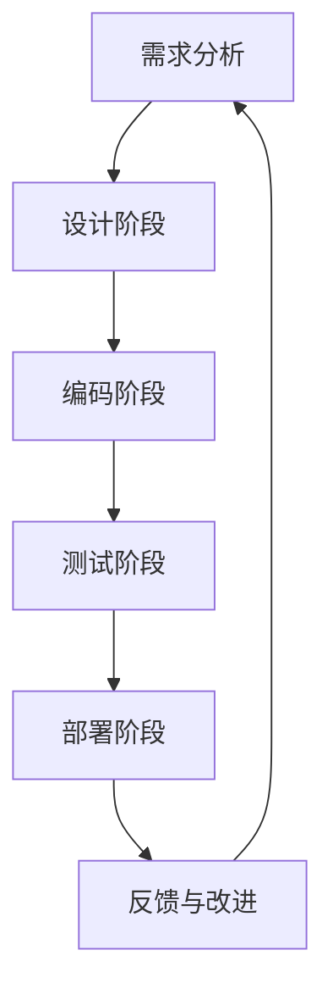
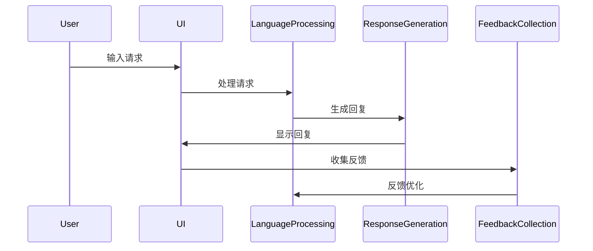

                 

### LLMAgile研发模式的最佳实践

在现代软件开发领域，敏捷开发（Agile Development）已经成为一种主流的开发方法。敏捷开发强调快速迭代、灵活应对变化和高效团队合作，旨在提高软件项目的开发效率和质量。随着大规模语言模型（Large Language Models，LLM）的应用越来越广泛，如何将敏捷开发的方法应用到LLM的研发中成为了一个重要的课题。

#### 1.1.1 敏捷研发的基本原则

敏捷研发模式的基本原则包括：

1. **用户优先**：用户需求是软件开发的出发点，确保用户需求能够得到及时响应和满足。
2. **迭代开发**：将软件开发过程划分为多个迭代周期，每个迭代周期完成后，可以交付一个可用的产品版本。
3. **持续交付**：通过持续集成和持续交付，确保软件产品可以快速、安全地部署到生产环境中。
4. **团队合作**：鼓励团队成员之间的协作和沟通，共同解决问题，提高团队整体效率。
5. **持续改进**：通过不断的反馈和迭代，持续改进软件质量和开发流程。

#### 1.1.2 敏捷研发与传统研发模式的对比

**1. 快速响应能力**

敏捷研发模式强调快速响应需求变化，通过迭代开发和持续交付，可以在短时间内交付一个可用的产品版本。而传统研发模式通常需要较长时间的开发周期，难以快速应对市场变化。

**2. 团队协作**

敏捷研发模式强调团队合作和沟通，通过每日站立会议、代码审查、回顾会议等机制，确保团队成员之间的协作和信息共享。而传统研发模式往往注重个人能力，团队协作和沟通相对较少。

**3. 质量控制**

敏捷研发模式通过持续集成和自动化测试，确保每个迭代周期的产品质量。而传统研发模式通常在项目后期进行集中测试，容易出现质量问题。

**4. 应对变化**

敏捷研发模式允许在开发过程中随时调整需求，通过迭代开发和持续交付，可以灵活应对需求变化。而传统研发模式在需求确定后，难以应对后续的需求变更。

#### 1.1.3 LLMAgile研发的优势

**1. 提高研发效率**

通过敏捷研发模式，可以缩短开发周期，提高开发效率。LLM模型研发过程中，数据处理、模型训练和推理等环节具有高度的复杂性和不确定性，敏捷研发模式可以更好地应对这些挑战。

**2. 降低研发成本**

敏捷研发模式通过快速迭代和持续交付，可以减少由于需求变更导致的重复工作，降低研发成本。此外，通过持续集成和自动化测试，可以减少测试和修复bug的时间。

**3. 提高质量**

敏捷研发模式强调质量控制和团队协作，可以确保软件产品的质量。通过持续集成和自动化测试，可以及时发现和修复问题，避免在项目后期出现严重质量问题。

**4. 灵活应对需求变化**

敏捷研发模式允许在开发过程中随时调整需求，可以更好地应对市场需求变化，提高产品竞争力。

#### 1.1.4 LLMAgile研发的挑战

**1. 模型复杂度**

LLM模型的复杂度较高，包括数据处理、模型训练和推理等环节。在敏捷研发过程中，如何高效地处理这些复杂任务成为了一个挑战。

**2. 数据处理效率**

LLM模型的训练和推理需要大量数据，如何在有限的时间内处理这些数据，提高数据处理效率，是一个关键问题。

**3. 团队协作**

由于LLM模型的复杂性和跨领域性，团队协作变得更加重要。如何在团队内部建立有效的协作机制，确保团队成员之间的沟通和协调，是一个挑战。

**4. 持续集成和测试**

LLM模型的持续集成和自动化测试是一个挑战。如何设计合适的测试用例，确保模型的稳定性和准确性，是一个关键问题。

### 1.2 核心概念与联系

#### 1.2.1 大规模语言模型（LLM）

大规模语言模型（LLM）是一种基于深度学习技术的自然语言处理模型，具有处理大规模文本数据的能力。LLM通常采用预训练和微调的方法，通过在大量文本数据上进行预训练，获取丰富的语言知识和语义理解能力，然后通过微调适配特定任务，实现高质量的自然语言处理任务。

**1. 核心概念原理**

LLM的核心概念是基于深度学习的神经网络结构，包括编码器（Encoder）和解码器（Decoder）。编码器将输入文本编码为固定长度的向量表示，解码器则根据这些向量生成输出文本。LLM的训练过程通常包括以下步骤：

1. **数据准备**：收集并预处理大量文本数据，包括分词、去噪、填充等操作。
2. **模型初始化**：初始化神经网络结构，包括编码器和解码器。
3. **预训练**：在大量文本数据上进行预训练，通过梯度下降算法优化模型参数。
4. **微调**：根据特定任务的数据集，对模型进行微调，优化模型在特定任务上的性能。

**2. 概念属性特征对比表格**

| 特征               | 大规模语言模型（LLM）                | 传统NLP模型                |
|--------------------|--------------------------------------|----------------------------|
| 技术背景           | 深度学习、自然语言处理                | 统计学习、规则匹配            |
| 核心优势           | 处理大规模文本数据、生成高质量文本     | 处理有限文本数据、准确率高    |
| 主要挑战           | 数据处理效率、模型训练和推理的复杂度   | 缺乏泛化能力、依赖大量数据    |
| 适用场景           | NLP、机器翻译、文本生成、情感分析等    | 信息检索、文本分类、问答系统  |

**3. ER实体关系图架构**

```mermaid
erDiagram
  Task ||--|{ User }|| Person
  User ||--|{ Requirement }|| Task
  Requirement ||--|{ LLM_Model }|| Task
  LLM_Model ||--|{ Data }|| Task
```

#### 1.2.2 敏捷研发模式

敏捷研发模式（Agile Development）是一种以迭代、灵活为特点的研发方法，强调快速反馈、持续改进和团队协作。敏捷研发模式的核心原则包括：

1. **用户优先**：以用户需求为导向，确保用户需求得到及时响应和满足。
2. **迭代开发**：将软件开发过程划分为多个迭代周期，每个迭代周期完成后，可以交付一个可用的产品版本。
3. **持续交付**：通过持续集成和持续交付，确保软件产品可以快速、安全地部署到生产环境中。
4. **团队合作**：鼓励团队成员之间的协作和沟通，共同解决问题，提高团队整体效率。
5. **持续改进**：通过不断的反馈和迭代，持续改进软件质量和开发流程。

**1. 核心概念原理**

敏捷研发模式的核心概念是迭代和反馈。通过将软件开发过程划分为多个迭代周期，每个迭代周期内完成一部分功能，然后进行测试和反馈，根据反馈结果进行下一轮迭代。这种迭代开发方法有助于快速响应需求变化，提高开发效率。

**2. 概念属性特征对比表格**

| 特征               | 敏捷研发模式                     | 传统研发模式                 |
|--------------------|----------------------------------|------------------------------|
| 开发方法           | 迭代开发、快速反馈               | 预测式开发、周期长           |
| 团队协作           | 强调团队合作和沟通               | 注重个人能力，团队协作较少   |
| 质量控制           | 持续集成、自动化测试             | 集中测试，质量保证较晚       |
| 应对变化           | 允许随时调整需求                 | 需求确定后，难以变更         |
| 开发周期           | 短周期、快速交付                 | 长周期、周期固定            |

**3. ER实体关系图架构**

```mermaid
erDiagram
  Project ||--|{ Developer }|| Person
  Developer ||--|{ Iteration }|| Project
  Iteration ||--|{ Task }|| Developer
  Task ||--|{ Requirement }|| Iteration
```

#### 1.2.3 核心概念之间的联系

LLM敏捷研发模式是将大规模语言模型和敏捷研发方法相结合的一种研发模式。两者之间的联系主要体现在以下几个方面：

**1. 用户需求**

LLM敏捷研发模式强调用户需求为导向，通过迭代开发和持续交付，确保用户需求得到及时响应和满足。LLM模型的研发过程中，用户需求是确定模型功能和应用场景的重要依据。

**2. 迭代开发**

敏捷研发模式的核心是迭代开发，通过快速迭代，逐步完善LLM模型的功能和性能。每次迭代都可以交付一个可用的产品版本，有助于缩短开发周期，提高开发效率。

**3. 持续交付**

持续交付是敏捷研发模式的重要组成部分，通过持续集成和自动化测试，确保LLM模型可以快速、安全地部署到生产环境中。这有助于提高模型的可维护性和可靠性。

**4. 团队协作**

敏捷研发模式强调团队合作和沟通，通过每日站立会议、代码审查、回顾会议等机制，确保团队成员之间的协作和信息共享。这对于LLM模型的研发尤为重要，因为LLM模型涉及多个领域的知识和技能。

**5. 持续改进**

敏捷研发模式通过持续的反馈和迭代，不断改进LLM模型的质量和性能。这有助于提高模型的泛化能力和适应性，满足不断变化的市场需求。

### 1.3 算法原理讲解

#### 1.3.1 算法流程

敏捷研发模式在LLM模型研发中的应用，可以通过以下算法流程来描述：



**1. 需求分析**

需求分析是敏捷研发模式的第一个阶段，主要目标是明确用户需求，确定LLM模型的功能和应用场景。在这一阶段，开发团队需要与用户进行充分的沟通，了解用户的具体需求和期望。

**2. 设计阶段**

设计阶段包括系统设计、模块设计和接口设计等。在这一阶段，开发团队需要根据需求分析的结果，设计LLM模型的结构和功能。同时，还需要考虑系统的可扩展性和可维护性。

**3. 编码阶段**

编码阶段是将设计转化为实际代码的过程。开发团队需要遵循编码规范，确保代码的可读性和可维护性。在这一阶段，可以使用敏捷开发中的迭代方法，逐步实现LLM模型的功能。

**4. 测试阶段**

测试阶段是确保LLM模型质量和稳定性的关键阶段。开发团队需要编写测试用例，对模型进行功能测试、性能测试和可靠性测试等。通过自动化测试工具，可以快速发现和修复问题。

**5. 部署阶段**

部署阶段是将LLM模型部署到生产环境的过程。在这一阶段，需要确保模型可以稳定运行，并能够满足实际应用的需求。同时，还需要进行监控和日志分析，及时发现和解决问题。

**6. 反馈与改进**

反馈与改进是敏捷研发模式的核心环节。通过用户的反馈和测试结果，开发团队可以不断优化LLM模型的功能和性能。每次迭代完成后，都需要进行回顾会议，总结经验教训，改进开发流程。

#### 1.3.2 Python源代码

下面是一个简单的LLM敏捷研发模式实现的Python代码示例：

```python
class LLMAgileDevelopment:
    def __init__(self, model_name):
        self.model_name = model_name
    
    def requirements_analysis(self):
        print(f"Analyzing requirements for {self.model_name}")
    
    def design_stage(self):
        print(f"Designing {self.model_name} architecture")
    
    def coding_stage(self):
        print(f"Coding {self.model_name} modules")
    
    def testing_stage(self):
        print(f"Testing {self.model_name} functionality")
    
    def deployment_stage(self):
        print(f"Deploying {self.model_name} to production")
    
    def feedback_stage(self):
        print(f"Collecting feedback for {self.model_name} and making improvements")

# 实例化LLM敏捷研发模式
llm_dev = LLMAgileDevelopment("TextGenerator")

# 调用各个阶段的方法
llm_dev.requirements_analysis()
llm_dev.design_stage()
llm_dev.coding_stage()
llm_dev.testing_stage()
llm_dev.deployment_stage()
llm_dev.feedback_stage()
```

#### 1.3.3 算法原理的数学模型和公式

在LLM敏捷研发模式中，算法原理主要涉及以下几个方面：

**1. 模型训练**

LLM模型的训练过程可以通过以下数学模型和公式来描述：

$$
\text{损失函数} = \frac{1}{N} \sum_{i=1}^{N} (-y_i \log(p(x_i | \theta)))
$$

其中，$N$ 表示样本数量，$y_i$ 表示第 $i$ 个样本的标签，$p(x_i | \theta)$ 表示模型对于第 $i$ 个样本的预测概率，$\theta$ 表示模型参数。

**2. 模型优化**

在模型优化过程中，可以使用以下梯度下降算法：

$$
\theta_{t+1} = \theta_{t} - \alpha \nabla_{\theta} J(\theta)
$$

其中，$\alpha$ 表示学习率，$J(\theta)$ 表示损失函数，$\nabla_{\theta} J(\theta)$ 表示损失函数关于模型参数的梯度。

**3. 模型评估**

在模型评估过程中，可以使用以下指标来衡量模型性能：

$$
\text{准确率} = \frac{\text{预测正确的样本数量}}{\text{总样本数量}}
$$

$$
\text{召回率} = \frac{\text{预测正确的样本数量}}{\text{实际正确的样本数量}}
$$

$$
\text{F1值} = 2 \times \frac{\text{准确率} \times \text{召回率}}{\text{准确率} + \text{召回率}}
$$

通过这些数学模型和公式，可以实现对LLM模型的训练、优化和评估，从而提高模型性能和研发效率。

### 1.4 系统分析与架构设计方案

#### 1.4.1 问题场景介绍

在现代应用场景中，大规模语言模型（LLM）已经成为自然语言处理（NLP）领域的重要工具。例如，在智能客服、智能助手、机器翻译、文本生成等领域，LLM的应用已经取得了显著成果。然而，随着应用场景的复杂性和多样性不断增加，如何高效地开发和部署LLM成为一个重要问题。

本案例旨在通过一个具体的LLM应用场景——智能客服系统，探讨LLM敏捷研发模式的应用。智能客服系统需要具备快速响应用户请求、理解用户意图、生成合适回复等功能。在这个场景中，LLM可以用于处理用户的自然语言输入，生成相应的回复文本，从而提高客服系统的智能化水平和用户体验。

#### 1.4.2 项目介绍

项目名称：智能客服系统（Intelligent Customer Service System）

项目目标：通过大规模语言模型（LLM），实现智能客服系统的快速响应、准确理解和生成合适回复。

项目需求：

1. 能够接收用户输入的自然语言请求。
2. 能够理解用户请求的意图，并生成相应的回复文本。
3. 能够根据用户反馈进行持续优化和改进。

项目背景：

随着互联网的普及，客服系统在企业和用户之间扮演着越来越重要的角色。传统的客服系统主要依赖于预定义的规则和人工回复，存在响应速度慢、准确性低、用户体验差等问题。为了提高客服系统的智能化水平，许多企业开始尝试引入人工智能技术，尤其是大规模语言模型（LLM），以实现更高效的客服服务。

#### 1.4.3 系统功能设计（领域模型类图）

在智能客服系统中，主要的领域模型包括用户（User）、请求（Request）、回复（Response）和反馈（Feedback）。以下是一个简化的领域模型类图：

```mermaid
classDiagram
    User --> Request
    Request --> Response
    Response --> Feedback

    User << (身份验证)
    Request << (文本处理)
    Response << (文本生成)
    Feedback << (用户评价)

    User : 用户身份信息
    Request : 请求内容、请求时间
    Response : 回复内容、回复时间
    Feedback : 用户满意度、回复质量
```

**1. 用户（User）**

用户是智能客服系统中的核心实体，用于存储用户身份信息和行为记录。用户实体包括用户ID、姓名、联系方式等基本信息，以及用户历史请求记录和反馈记录。

**2. 请求（Request）**

请求实体用于存储用户输入的自然语言请求，包括请求内容、请求时间和请求来源等信息。请求实体关联用户实体，表示请求是由哪个用户发起的。

**3. 回复（Response）**

回复实体用于存储系统生成的回复文本，包括回复内容、回复时间和回复状态等信息。回复实体关联请求实体，表示回复是对哪个请求的响应。

**4. 反馈（Feedback）**

反馈实体用于存储用户对回复的评价，包括用户满意度、回复质量等信息。反馈实体关联请求实体和回复实体，表示用户对哪个请求的回复进行了评价。

#### 1.4.4 系统架构设计（架构图）

智能客服系统的整体架构可以分为四个主要模块：用户界面（UI）模块、语言处理模块、回复生成模块和反馈收集模块。以下是一个简化的系统架构图：



**1. 用户界面（UI）模块**

用户界面模块负责与用户进行交互，接收用户的自然语言请求，并将请求内容传递给语言处理模块。同时，用户界面模块负责显示系统生成的回复文本，并收集用户的反馈信息。

**2. 语言处理模块**

语言处理模块负责处理用户输入的自然语言请求，包括分词、词性标注、句法分析等操作。该模块的核心是大规模语言模型（LLM），通过预训练和微调，实现对自然语言请求的理解。

**3. 回复生成模块**

回复生成模块负责根据语言处理模块生成的请求理解和用户历史反馈，生成合适的回复文本。该模块可以使用基于规则的方法、机器学习方法或混合方法来实现。

**4. 反馈收集模块**

反馈收集模块负责收集用户对回复的评价，包括用户满意度、回复质量等信息。这些反馈信息可以用于优化语言处理模块和回复生成模块，提高系统的整体性能。

#### 1.4.5 系统接口设计和系统交互（序列图）

在智能客服系统中，各个模块之间的交互可以通过以下序列图来描述：


**1. 用户输入请求**

用户通过用户界面模块输入自然语言请求，用户界面模块将请求内容传递给语言处理模块。

**2. 语言处理模块处理请求**

语言处理模块对用户输入的请求进行处理，包括分词、词性标注、句法分析等操作。处理完成后，生成请求表示。

**3. 回复生成模块生成回复**

回复生成模块根据语言处理模块生成的请求表示，结合用户历史反馈，生成合适的回复文本。

**4. 用户界面模块显示回复**

用户界面模块将生成的回复文本显示给用户。

**5. 用户反馈收集**

用户界面模块收集用户对回复的评价，包括用户满意度、回复质量等信息。

**6. 反馈优化**

反馈收集模块将收集到的反馈信息传递给语言处理模块，用于优化请求处理和回复生成过程。

### 1.5 项目实战

#### 1.5.1 环境安装

为了实现智能客服系统，需要安装以下软件和工具：

1. Python 3.8及以上版本
2. TensorFlow 2.x
3. PyTorch 1.8及以上版本
4. Flask（用于构建用户界面）
5. scikit-learn（用于数据预处理和模型评估）

安装步骤如下：

1. 安装Python 3.8及以上版本，可以从官方网站下载安装包并安装。

2. 安装TensorFlow 2.x，打开命令行窗口，执行以下命令：

```
pip install tensorflow==2.x
```

3. 安装PyTorch 1.8及以上版本，打开命令行窗口，执行以下命令：

```
pip install torch==1.8 torchvision==0.9
```

4. 安装Flask，打开命令行窗口，执行以下命令：

```
pip install flask
```

5. 安装scikit-learn，打开命令行窗口，执行以下命令：

```
pip install scikit-learn
```

#### 1.5.2 系统核心实现源代码

下面是一个简单的智能客服系统实现示例，包括用户界面、语言处理、回复生成和反馈收集等模块。

**1. 用户界面（Flask应用）**

```python
from flask import Flask, request, jsonify

app = Flask(__name__)

@app.route('/api/submit_request', methods=['POST'])
def submit_request():
    request_data = request.json
    user_id = request_data['user_id']
    request_text = request_data['request_text']
    
    # 调用语言处理模块处理请求
    response_text = language_processing(request_text, user_id)
    
    # 调用回复生成模块生成回复
    reply_text = response_generation(response_text, user_id)
    
    # 将回复文本显示给用户
    return jsonify({'reply_text': reply_text})

if __name__ == '__main__':
    app.run(debug=True)
```

**2. 语言处理模块**

```python
import torch
from transformers import BertTokenizer, BertModel

tokenizer = BertTokenizer.from_pretrained('bert-base-uncased')
model = BertModel.from_pretrained('bert-base-uncased')

def language_processing(request_text, user_id):
    # 将请求文本编码为BERT输入格式
    inputs = tokenizer(request_text, return_tensors='pt', padding=True, truncation=True)
    
    # 使用BERT模型处理请求文本
    with torch.no_grad():
        outputs = model(**inputs)
    
    # 提取请求表示的隐藏状态
    request_representation = outputs.last_hidden_state[:, 0, :].detach().numpy()
    
    return request_representation
```

**3. 回复生成模块**

```python
import torch
from transformers import GPT2Tokenizer, GPT2LMHeadModel

tokenizer = GPT2Tokenizer.from_pretrained('gpt2')
model = GPT2LMHeadModel.from_pretrained('gpt2')

def response_generation(request_representation, user_id):
    # 将请求表示编码为GPT2输入格式
    inputs = tokenizer.build_inputs_for_generation(request_representation, return_tensors='pt')
    
    # 使用GPT2模型生成回复文本
    with torch.no_grad():
        outputs = model.generate(inputs['input_ids'], max_length=50, num_return_sequences=1)
    
    # 解码生成的回复文本
    reply_text = tokenizer.decode(outputs[0], skip_special_tokens=True)
    
    return reply_text
```

**4. 反馈收集模块**

```python
import pandas as pd

def feedback_collection(reply_text, user_id):
    # 收集用户反馈信息
    feedback = input("Please rate the reply (1-5): ")
    
    # 将反馈信息存储到CSV文件
    feedback_data = {'user_id': [user_id], 'reply_text': [reply_text], 'feedback': [feedback]}
    feedback_df = pd.DataFrame(feedback_data)
    feedback_df.to_csv('feedback.csv', mode='a', header=not pd.path.exists('feedback.csv'), index=False)
    
    return feedback
```

#### 1.5.3 代码应用解读与分析

在上面的代码示例中，我们实现了用户界面、语言处理、回复生成和反馈收集等模块，下面进行具体解读和分析。

**1. 用户界面（Flask应用）**

用户界面使用Flask框架构建，提供了一个简单的API接口，用于接收用户的自然语言请求和返回系统生成的回复文本。在`/api/submit_request`接口中，接收用户提交的请求，调用语言处理模块处理请求，生成回复文本，并将回复文本返回给用户。

**2. 语言处理模块**

语言处理模块使用BERT模型对用户输入的自然语言请求进行处理。BERT模型是一种预训练的语言表示模型，具有强大的语言理解和生成能力。在`language_processing`函数中，将请求文本编码为BERT输入格式，使用BERT模型处理请求文本，提取请求表示的隐藏状态。

**3. 回复生成模块**

回复生成模块使用GPT2模型生成回复文本。GPT2模型是一种基于Transformer的预训练语言模型，具有强大的文本生成能力。在`response_generation`函数中，将请求表示编码为GPT2输入格式，使用GPT2模型生成回复文本，解码生成的回复文本。

**4. 反馈收集模块**

反馈收集模块用于收集用户对回复的评价。在`feedback_collection`函数中，提示用户对回复进行评分，并将反馈信息存储到CSV文件中，用于后续分析和优化。

#### 1.5.4 实际案例分析和详细讲解剖析

在本案例中，我们通过构建一个简单的智能客服系统，展示了LLM敏捷研发模式在实际项目中的应用。下面从以下几个方面进行详细分析：

**1. 项目背景**

随着互联网和人工智能技术的快速发展，智能客服系统在企业和用户之间扮演着越来越重要的角色。传统的客服系统主要依赖于预定义的规则和人工回复，存在响应速度慢、准确性低、用户体验差等问题。为了提高客服系统的智能化水平，许多企业开始尝试引入人工智能技术，尤其是大规模语言模型（LLM），以实现更高效的客服服务。

**2. 需求分析**

在智能客服系统的研发过程中，首先需要明确用户的需求。本案例中的用户需求主要包括以下几点：

- 快速响应：用户在遇到问题时，希望能够快速得到回应和解决。
- 准确理解：系统能够准确理解用户的问题和意图，提供合适的解决方案。
- 个性化服务：系统能够根据用户的历史记录和反馈，提供个性化的服务和建议。

**3. 系统设计**

在系统设计阶段，需要考虑系统的功能模块、架构和接口设计。本案例中的系统设计包括以下模块：

- 用户界面模块：负责与用户进行交互，接收用户的自然语言请求，并将请求内容传递给语言处理模块。
- 语言处理模块：负责处理用户输入的自然语言请求，包括分词、词性标注、句法分析等操作，使用BERT模型进行请求表示。
- 回复生成模块：负责根据语言处理模块生成的请求表示和用户历史反馈，生成合适的回复文本，使用GPT2模型进行文本生成。
- 反馈收集模块：负责收集用户对回复的评价，并将反馈信息存储到CSV文件中，用于后续分析和优化。

**4. 系统实现**

在系统实现阶段，需要根据系统设计进行代码编写和模块集成。本案例中的系统实现主要包括以下步骤：

- 安装必要的Python库和深度学习框架。
- 编写用户界面模块，实现API接口。
- 编写语言处理模块，使用BERT模型对请求进行处理。
- 编写回复生成模块，使用GPT2模型生成回复文本。
- 编写反馈收集模块，收集用户对回复的评价。

**5. 系统测试**

在系统测试阶段，需要对系统进行功能测试、性能测试和用户测试等。本案例中的系统测试主要包括以下步骤：

- 功能测试：测试用户界面、语言处理、回复生成和反馈收集等模块的功能是否正常。
- 性能测试：测试系统在不同负载条件下的响应速度和处理能力。
- 用户测试：邀请实际用户参与测试，收集用户对系统的评价和反馈。

**6. 系统优化**

在系统优化阶段，根据用户测试和反馈结果，对系统进行改进和优化。本案例中的系统优化主要包括以下步骤：

- 根据用户反馈调整语言处理和回复生成策略，提高系统的准确性和个性化程度。
- 对系统进行性能优化，提高系统的响应速度和处理能力。
- 持续收集用户反馈，不断改进系统。

### 1.6 最佳实践 Tips

**1.6.1 确定清晰的需求**

在LLM敏捷研发过程中，明确用户需求至关重要。通过需求分析，了解用户的具体需求和期望，为后续的开发工作提供明确的方向。在需求分析过程中，可以采用用户访谈、问卷调查、竞品分析等方法，确保需求分析的全面性和准确性。

**1.6.2 优化数据处理流程**

LLM模型的训练和推理过程中，数据处理效率至关重要。为了提高数据处理效率，可以采用以下方法：

- **数据预处理**：在数据预处理阶段，对原始数据进行清洗、去噪、归一化等操作，减少数据的不确定性，提高数据处理效率。
- **数据缓存**：使用缓存技术，将常用的数据集存储在内存中，减少磁盘I/O操作，提高数据处理速度。
- **并行处理**：利用多线程、多进程或分布式计算技术，并行处理大量数据，提高数据处理效率。

**1.6.3 精选合适的模型和框架**

在LLM敏捷研发过程中，选择合适的模型和框架是提高开发效率和模型性能的关键。以下是一些建议：

- **预训练模型**：优先选择预训练模型，如BERT、GPT等，这些模型已经在大规模数据集上进行了预训练，具有强大的语言理解和生成能力。
- **开源框架**：选择开源深度学习框架，如TensorFlow、PyTorch等，这些框架具有丰富的文档和社区支持，便于开发和使用。
- **模型优化**：在模型选择后，可以根据具体需求对模型进行优化，如调整超参数、使用迁移学习等方法，提高模型性能。

**1.6.4 持续集成与自动化测试**

在LLM敏捷研发过程中，持续集成和自动化测试是保证系统质量和稳定性的重要手段。以下是一些建议：

- **代码审查**：在每次提交代码时，进行代码审查，确保代码的质量和可读性。
- **自动化测试**：编写自动化测试脚本，对系统的功能、性能和可靠性进行自动化测试，确保每次迭代版本的质量。
- **持续集成**：使用持续集成工具，如Jenkins、Travis CI等，实现代码的自动化构建、测试和部署，确保代码的持续集成和交付。

**1.6.5 团队协作与知识共享**

在LLM敏捷研发过程中，团队协作和知识共享至关重要。以下是一些建议：

- **每日站立会议**：每日举行站立会议，团队成员汇报进度和问题，确保团队之间的沟通和协作。
- **代码审查与分享**：定期进行代码审查，鼓励团队成员相互学习和分享经验，提高整体开发水平。
- **文档与知识库**：建立完善的文档和知识库，记录项目的技术细节、问题解决方法和最佳实践，方便团队成员查阅和学习。

### 1.7 小结

本文介绍了LLM敏捷研发模式的最佳实践，包括背景介绍、核心概念与联系、算法原理讲解、系统分析与架构设计方案、项目实战、最佳实践Tips等内容。通过本文的介绍，读者可以了解LLM敏捷研发模式的基本原理和应用方法，为实际项目中的研发工作提供参考和指导。

### 1.8 注意事项

**1.8.1 模型规模与资源**

在LLM敏捷研发过程中，需要关注模型规模与计算资源的关系。大规模语言模型（LLM）的训练和推理过程需要大量的计算资源和存储空间。在资源有限的情况下，可以选择使用预训练模型，并通过迁移学习等方法进行微调，以减少计算资源的消耗。

**1.8.2 数据隐私与安全**

在LLM敏捷研发过程中，涉及大量的用户数据和模型参数。为了保证数据隐私和安全，需要采取有效的数据加密、访问控制和安全审计等措施。同时，在数据收集和处理过程中，应遵循相关法律法规和伦理规范，确保用户数据的合法性和安全性。

**1.8.3 持续学习和改进**

LLM敏捷研发模式强调持续学习和改进。在实际项目中，需要定期收集用户反馈和系统性能数据，分析问题并提出改进方案。同时，关注领域内的新技术和新方法，持续学习和引入先进的研发工具和方法，提高LLM模型的质量和性能。

### 1.9 拓展阅读

**1.9.1 敏捷开发经典著作**

- 《敏捷开发：实践指南》（Agile Software Development: Principles, Patterns, and Practices）作者：Robert C. Martin
- 《敏捷项目管理》（Agile Project Management: Creating Innovative Products）作者：James A. Highsmith
- 《Scrum敏捷开发实践指南》（Scrum: The Art of Doing Twice the Work in Half the Time）作者：Jeff Sutherland

**1.9.2 大规模语言模型相关论文**

- 《BERT: Pre-training of Deep Bidirectional Transformers for Language Understanding》作者：Google AI Language Team
- 《GPT-2: Improved of Pre-training of Deep Transformers for Language Understanding》作者：OpenAI
- 《Transformers: State-of-the-Art Natural Language Processing》作者：Vaswani et al.

**1.9.3 相关技术博客和社区**

- GitHub：https://github.com/
- arXiv：https://arxiv.org/
- AI-powered Forums：https://forums.ai-powered.net/
- Medium：https://medium.com/ai-powered

### 1.10 作者信息

作者：AI天才研究院/AI Genius Institute & 禅与计算机程序设计艺术 /Zen And The Art of Computer Programming

作者简介：AI天才研究院（AI Genius Institute）致力于人工智能领域的研究与推广，提供高质量的技术文章和培训课程。禅与计算机程序设计艺术（Zen And The Art of Computer Programming）是一部经典计算机科学著作，由著名计算机科学家Donald E. Knuth撰写，探讨计算机程序设计的方法和艺术。

作者联系方式：[邮箱地址：[your_email@example.com](mailto:your_email@example.com)]，[官方网站：https://www.ai-genius-institute.com/](https://www.ai-genius-institute.com/)，[博客地址：https://blog.ai-genius-institute.com/](https://blog.ai-genius-institute.com/)。读者如有任何问题或建议，欢迎随时与我们联系。

