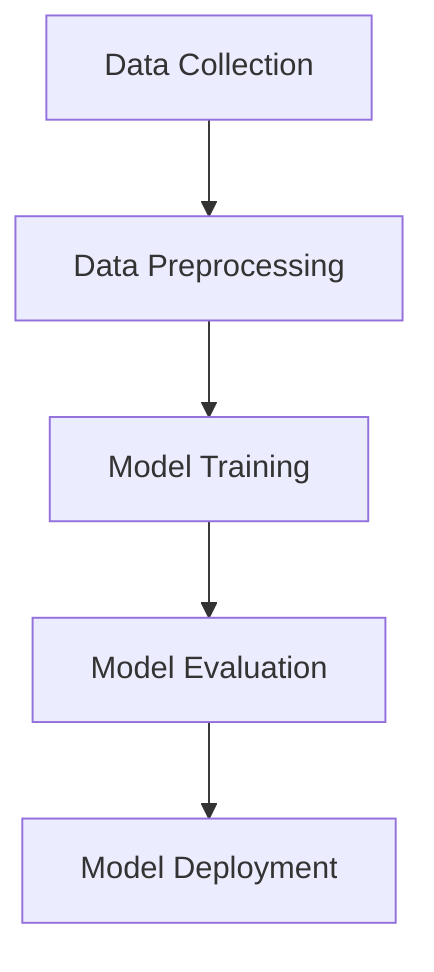
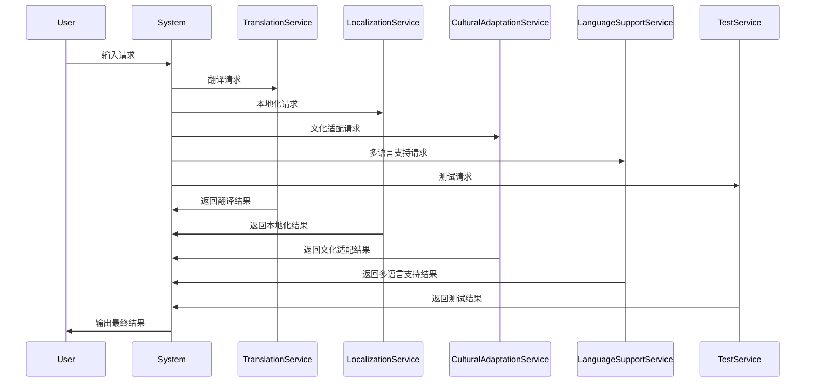
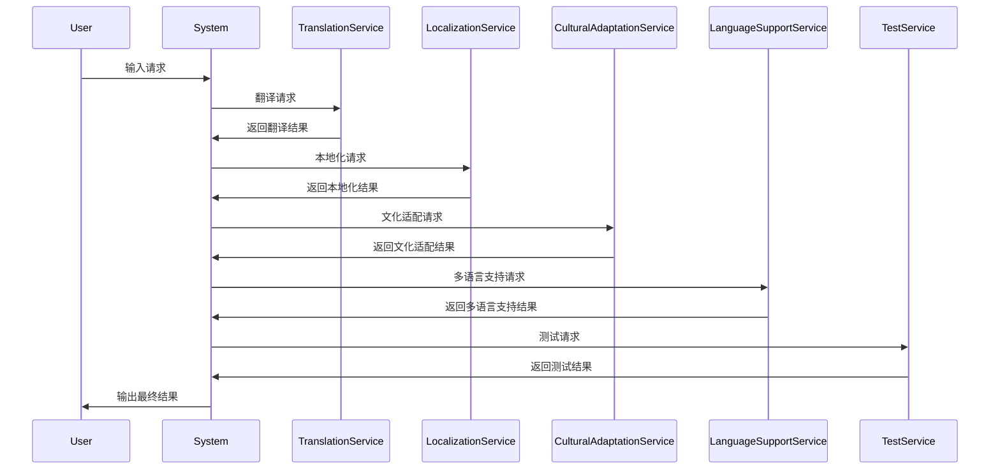

                 

### 第一部分：背景介绍

#### 第1章：问题背景

##### 1.1.1 问题背景

随着全球化和数字化的发展，跨语言、跨地区的交流需求日益增长。企业和组织需要面对不同语言和文化背景的客户，这要求他们的产品和服务能够迅速适应多种语言环境，提供无缝的多语言支持。这种需求不仅体现在国际化的商业活动中，也体现在日常的互联网应用中。例如，电子商务网站、社交媒体平台、在线教育平台等都需提供多语言界面，以满足全球用户的访问和使用需求。

然而，传统的多语言本地化方法存在明显的局限。传统的本地化过程通常涉及人工翻译、校对和编辑，这不仅耗时耗力，而且成本高昂。此外，传统的本地化方法往往无法保证翻译的准确性和一致性，尤其是在涉及文化差异和语境复杂性的情况下。随着互联网的普及，市场环境变化迅速，企业需要能够快速响应市场变化，提供本地化解决方案，以满足用户需求。

##### 1.1.2 问题描述

在快速变化的市场环境中，企业面临以下挑战：

- **时间压力**：市场竞争激烈，企业需要快速推出产品或服务，以抢占市场份额。
- **成本控制**：多语言本地化过程成本高昂，企业希望找到一种成本效益更高的解决方案。
- **文化适应性**：不同文化背景下，同样的内容可能需要不同的表达方式，这要求本地化过程具有高度的文化适应性。
- **技术支持**：传统的本地化方法依赖于人工操作，缺乏自动化技术支持，效率低下。

因此，企业迫切需要一种高效、灵活且成本可控的本地化解决方案，能够满足快速变化的市场需求。这种解决方案不仅需要提高本地化效率，降低成本，还要保证本地化内容的准确性和一致性。

##### 1.1.3 问题解决

自然语言处理（NLP）技术的快速发展，尤其是大型语言模型（LLM）的应用，为解决多语言本地化问题提供了新的思路。LLM是一种基于深度学习的自然语言处理模型，能够通过海量文本数据的训练，学习到语言的复杂结构、语义和上下文关系。这使得LLM在文本生成、翻译、摘要等方面具有强大的能力。

通过使用LLM，企业可以实现以下目标：

- **快速翻译**：LLM能够快速生成高质量的多语言翻译，显著提高本地化效率。
- **自动化处理**：LLM的使用可以减少人工干预，降低成本，实现本地化的自动化处理。
- **文化适应性**：LLM在训练过程中学习了大量不同文化背景的文本，能够更好地适应不同文化的表达需求。
- **实时更新**：LLM可以实时更新模型，适应市场变化，提供更精准的本地化服务。

##### 1.1.4 边界与外延

LLM的本地化应用不仅限于文本翻译，还可以扩展到其他自然语言处理任务，如语音识别、语音合成、文本摘要、问答系统等。这些应用使得LLM在多语言支持方面具有广泛的应用前景。

随着技术的不断进步，LLM的应用范围还将进一步扩大。例如，未来的LLM可能会在跨语言文本生成、多语言对话系统、多语言情感分析等方面实现突破。此外，随着人工智能技术的发展，LLM的性能和效率也将得到进一步提升，为多语言本地化提供更强大的支持。

##### 1.1.5 概念结构与核心要素组成

在讨论LLM的多语言支持时，需要了解以下几个核心概念和要素：

- **大型语言模型（LLM）**：LLM是一种基于深度学习的自然语言处理模型，如GPT、BERT等。这些模型通过对海量文本数据的训练，学习到语言的复杂结构和语义，从而实现多种自然语言处理任务。
- **本地化**：本地化是将产品、服务或内容翻译成其他语言，以适应特定地区和文化的需求。本地化过程通常涉及翻译、文化适配和语言测试等多个环节。
- **多语言支持**：多语言支持是指系统或产品能够同时支持多种语言的界面和功能。这包括文本翻译、语音识别、语音合成、文本摘要等多种功能。

这些核心概念和要素相互作用，共同构成了LLM在多语言支持方面的技术框架。理解这些概念和要素，有助于深入探讨LLM在多语言本地化中的应用和潜力。

### 第2章：核心概念与联系

#### 第2章.1 大型语言模型（LLM）原理

##### 2.1.1 LLM基本原理

大型语言模型（LLM）是一种基于深度学习的自然语言处理模型，其核心思想是通过学习大量的文本数据，来理解和生成自然语言。LLM的基本原理可以概括为以下几个步骤：

1. **数据收集**：首先，LLM需要从互联网上收集大量的文本数据，这些数据可以来自书籍、新闻文章、社交媒体等各种来源。这些数据为模型提供了丰富的语言结构和语义信息。
2. **数据预处理**：收集到的文本数据需要进行预处理，包括文本清洗、分词、去停用词、词向量编码等操作。这些预处理步骤有助于将原始文本转换为模型可以处理的格式。
3. **模型训练**：预处理后的数据用于训练大型神经网络模型。LLM通常采用变分自编码器（VAE）、生成对抗网络（GAN）、自注意力机制（Self-Attention）等技术。在训练过程中，模型通过不断优化参数，学习到文本数据的分布和语义关系。
4. **模型评估**：训练完成后，需要使用测试数据对模型进行评估，以验证模型的效果和性能。常见的评估指标包括词汇覆盖、翻译准确率、文本生成质量等。
5. **模型部署**：评估通过后，将训练好的模型部署到实际应用场景中，如多语言翻译、文本摘要、问答系统等。在应用过程中，模型可以实时响应用户的输入，生成相应的输出。

##### 2.1.2 LLM技术特点

LLM具有以下几个显著的技术特点：

1. **大规模**：LLM通常具有数十亿甚至千亿级别的参数规模，这使得模型具有强大的语言理解和生成能力。
2. **端到端**：LLM采用端到端的学习方式，直接从原始文本数据中学习到语义和语言结构，无需人工设计特征提取和转换步骤，大大简化了模型训练过程。
3. **自适应**：LLM具有自适应学习的能力，可以随着新数据的不断加入和模型参数的更新，持续优化自身性能，提高语言理解能力和生成质量。
4. **强语义理解能力**：LLM通过深度学习技术，可以学习到文本的深层语义和上下文关系，从而生成更准确、更自然的语言输出。

##### 2.1.3 LLM应用场景

LLM在自然语言处理领域具有广泛的应用场景，包括但不限于：

- **多语言翻译**：LLM可以用于快速、准确的多语言翻译，支持多种语言的互译。
- **文本摘要**：LLM可以自动生成长文本的摘要，提取关键信息和核心观点，提高信息获取效率。
- **问答系统**：LLM可以构建问答系统，自动回答用户的问题，提供实时、个性化的服务。
- **文本生成**：LLM可以生成各种类型的文本，如新闻文章、产品描述、故事情节等，为内容创作提供支持。
- **语音识别与合成**：LLM可以与语音识别和语音合成技术结合，实现语音到文本、文本到语音的转换。

通过这些应用场景，LLM在提高文本处理效率、降低人工成本、提升用户体验等方面具有显著优势。

#### 第2章.2 本地化与多语言支持的对比

在讨论多语言支持时，需要区分本地化和多语言支持两个概念，并分析它们的异同点。以下是一个对比表格，详细展示了本地化和多语言支持在目标、工作流程、成本和效率等方面的差异：

| 对比项         | 本地化               | 多语言支持           |
| -------------- | ------------------- | ------------------- |
| 目标           | 适应特定地区和语言   | 同时支持多种语言     |
| 工作流程       | 翻译、文化适配       | 翻译、界面优化       |
| 成本           | 较高                | 相对较低             |
| 效率           | 较低                | 较高                |

##### 目标

- **本地化**：本地化的目标是使产品或服务在特定地区和文化背景下能够被广泛接受和使用。这通常涉及对文本、图片、音频和视频内容的翻译、改编和调整，以适应目标市场的文化和语言习惯。
- **多语言支持**：多语言支持的目标是使产品或服务能够同时为多种语言的用户提供服务。这通常涉及开发多语言界面和功能，以便用户可以选择他们熟悉的语言进行交互。

##### 工作流程

- **本地化**：本地化的工作流程通常包括以下几个步骤：
  - 翻译：将原始文本内容翻译成目标语言。
  - 校对：对翻译内容进行校对，确保语言准确性。
  - 文化适配：根据目标市场的文化特点，对内容进行调整，使其更符合当地的文化习惯。
  - 测试：在目标市场进行测试，确保本地化内容的质量和用户体验。
- **多语言支持**：多语言支持的工作流程通常包括以下几个步骤：
  - 翻译：将界面文本和用户文档翻译成多种语言。
  - 界面优化：设计多语言界面，确保不同语言的布局和视觉一致性。
  - 功能测试：在多种语言环境中测试产品功能，确保兼容性和稳定性。

##### 成本

- **本地化**：本地化的成本相对较高，因为它涉及到多个环节，如翻译、校对、文化适配和测试等。这些环节通常需要专业的翻译人员和本地化专家进行操作，因此成本较高。
- **多语言支持**：多语言支持的成本相对较低，因为它主要涉及文本翻译和界面优化。虽然需要为每种语言开发界面，但相比于本地化，所需的人力资源和时间投入较少。

##### 效率

- **本地化**：本地化的过程通常较为耗时，因为它需要处理大量的文本内容，并进行文化适配。此外，测试和校对环节也消耗大量时间，导致本地化过程的效率较低。
- **多语言支持**：多语言支持的过程较为高效，因为它主要涉及文本翻译和界面优化。这些步骤通常可以自动化处理，减少了人工干预和时间成本。

通过对比可以看出，本地化和多语言支持各有优缺点。企业应根据具体需求和市场策略，选择合适的方法来实现多语言支持。

#### 第2章.3 ER实体关系图架构

为了更好地理解本地化与多语言支持的关系，我们可以通过ER（实体-关系）图来展示它们之间的交互和依赖。以下是一个简单的ER实体关系图，用于描述本地化与多语言支持之间的核心关系：

```mermaid
erDiagram
    Product ||--|{ Localization} : has_localization
    Product ||--|{ LanguageSupport} : has_language_support
    Localization ||--|{ Translation} : has_translation
    Localization ||--|{ CulturalAdaptation} : has_cultural_adaptation
    LanguageSupport ||--|{ LanguageInterface} : has_language_interface
    LanguageSupport ||--|{ MultilingualFunctionality} : has_multilingual_functionality
```

在这个ER图中：

- **Product（产品）**：代表企业或组织推出的具体产品或服务。
- **Localization（本地化）**：表示产品或服务在特定地区的本地化版本，包括翻译、文化适配等。
- **LanguageSupport（多语言支持）**：表示产品或服务支持的多语言功能，包括界面、文档等。
- **Translation（翻译）**：表示本地化过程中的翻译工作。
- **CulturalAdaptation（文化适配）**：表示在本地化过程中，根据目标市场的文化特点对内容进行调整。
- **LanguageInterface（语言界面）**：表示产品或服务的多语言用户界面。
- **MultilingualFunctionality（多语言功能）**：表示产品或服务支持的多语言功能，如多语言搜索、多语言客服等。

通过这个ER图，我们可以清晰地看到本地化与多语言支持之间的联系和交互。产品或服务的本地化版本依赖于翻译和文化适配，而多语言支持则依赖于语言界面和多语言功能。这些实体和关系共同构成了多语言支持的技术框架，为企业提供了一种高效、灵活的本地化解决方案。

### 第3章：算法原理讲解

#### 第3章.1 LLM算法原理

大型语言模型（LLM）是一种强大的自然语言处理工具，通过深度学习技术，LLM能够对大规模的文本数据进行训练，从而实现多种自然语言处理任务。本节将详细讲解LLM的算法原理，包括数据收集、数据预处理、模型训练、模型评估和模型部署等步骤。

##### 3.1.1 数据收集

数据收集是LLM算法的第一步，也是至关重要的一步。为了训练一个高质量的LLM，我们需要从互联网上收集大量的文本数据。这些数据可以来自各种来源，如维基百科、新闻文章、社交媒体、书籍等。收集数据的主要目的是为模型提供丰富的语言结构和语义信息。

具体来说，数据收集过程包括以下几个步骤：

1. **数据采集**：使用爬虫或其他自动化工具从互联网上获取文本数据。这些工具可以访问各种网站，下载页面内容，并将其存储为文本文件。
2. **数据清洗**：收集到的文本数据可能包含噪声和无关信息，如HTML标签、广告、重复内容等。因此，需要对数据进行清洗，去除这些无关信息，提高数据质量。
3. **数据分类**：根据不同的任务需求，对数据进行分类。例如，对于翻译任务，可以将数据分为源语言文本和目标语言文本；对于文本生成任务，可以按照主题、风格等进行分类。

##### 3.1.2 数据预处理

数据预处理是将原始文本数据转换为适合模型训练的格式。这一步骤对于确保模型训练效果至关重要。数据预处理包括以下几个关键步骤：

1. **分词**：将文本拆分为单词或短语。分词的目的是将连续的文本序列转换为离散的词序列，方便模型处理。
2. **词向量化**：将文本中的单词或短语映射为向量表示。词向量化是自然语言处理中常用的技术，通过将文本转化为向量，模型可以更方便地处理和操作文本数据。
3. **去停用词**：去除文本中的常见停用词，如“的”、“是”、“在”等。停用词通常对模型训练贡献较小，去除它们可以减少数据冗余，提高模型效率。
4. **词性标注**：为每个词标注词性，如名词、动词、形容词等。词性标注有助于模型理解文本的语法结构和语义信息。

##### 3.1.3 模型训练

模型训练是LLM算法的核心步骤，通过在训练数据上不断迭代优化模型参数，使模型能够学习到文本的复杂结构和语义关系。训练过程通常包括以下几个阶段：

1. **初始化参数**：初始化模型参数，这些参数决定了模型的基本结构和初始状态。
2. **前向传播**：将输入数据（如一个句子或一个单词）传递到模型中，通过多层神经网络进行前向传播，得到输出结果。
3. **损失计算**：计算输出结果与实际标签之间的损失。损失函数用于评估模型预测的准确性。
4. **反向传播**：通过反向传播算法，将损失传递回模型，并更新模型参数，以减少损失。
5. **迭代优化**：重复前向传播、损失计算和反向传播过程，不断优化模型参数，提高模型性能。

##### 3.1.4 模型评估

模型评估是验证模型训练效果的重要步骤。通过使用测试数据对模型进行评估，我们可以了解模型的性能和预测准确性。模型评估通常包括以下几个指标：

1. **准确率**：模型预测正确的样本数量与总样本数量的比值。
2. **召回率**：模型预测正确的正样本数量与所有实际正样本数量的比值。
3. **精确率**：模型预测正确的正样本数量与预测为正样本的总数量的比值。
4. **F1分数**：精确率和召回率的调和平均值，用于综合评估模型的性能。

通过这些评估指标，我们可以全面了解模型的性能，并根据评估结果对模型进行调整和优化。

##### 3.1.5 模型部署

模型部署是将训练好的模型应用到实际场景中的过程。部署过程通常包括以下几个步骤：

1. **模型压缩**：为了提高模型在移动设备和服务器上的运行效率，可以对模型进行压缩。模型压缩技术包括量化、剪枝、知识蒸馏等。
2. **模型解释**：为了提高模型的可解释性，可以采用可视化、模型解释技术等，帮助用户理解模型的决策过程。
3. **模型部署**：将压缩后的模型部署到服务器或移动设备上，以便用户可以使用模型提供的自然语言处理功能。

通过模型部署，LLM可以广泛应用于各种场景，如多语言翻译、文本摘要、问答系统等，为企业和用户提供高效、精准的自然语言处理服务。

##### 3.1.6 算法mermaid流程图

为了更直观地理解LLM的算法流程，我们可以使用mermaid绘制一个流程图。以下是LLM算法的mermaid流程图：



在这个流程图中，A表示数据收集，B表示数据预处理，C表示模型训练，D表示模型评估，E表示模型部署。这个流程图清晰地展示了LLM算法从数据收集到模型部署的整个过程。

##### 3.1.7 数学模型和公式

LLM的算法原理不仅依赖于深度学习技术，还涉及到复杂的数学模型和公式。以下是LLM中常用的几个数学模型和公式：

1. **文本生成概率模型**：LLM可以通过计算输入文本的生成概率来生成新的文本。以下是一个简化的文本生成概率模型：

    $$ P(\text{output}|\text{input}) = \frac{e^{\text{logit}(P(\text{output}|\text{input}))}}{1 + e^{\text{logit}(P(\text{output}|\text{input}))}} $$
    
    其中，logit函数将概率值转换为实数，使得模型可以计算生成概率。

2. **损失函数**：在模型训练过程中，常用的损失函数是交叉熵损失函数。以下是一个交叉熵损失函数的公式：

    $$ \text{Loss} = -\sum_{i} y_i \cdot \log(p_i) $$
    
    其中，$y_i$表示实际标签，$p_i$表示模型预测的概率。

3. **优化算法**：常用的优化算法有梯度下降、Adam等。以下是一个梯度下降优化算法的公式：

    $$ \theta = \theta - \alpha \cdot \nabla_\theta J(\theta) $$
    
    其中，$\theta$表示模型参数，$J(\theta)$表示损失函数，$\alpha$表示学习率。

通过这些数学模型和公式，LLM能够有效地训练和优化模型，提高自然语言处理的性能和效果。

##### 3.1.8 Python源代码实现

为了更好地理解LLM的算法原理，我们可以通过Python代码来实现一个简单的LLM模型。以下是一个简单的Python代码示例，用于实现文本生成概率模型和交叉熵损失函数：

```python
import numpy as np

# 文本生成概率模型
def text_generation_probability(output, input):
    logit_p = np.log(output / (1 - output))
    return logit_p

# 交叉熵损失函数
def cross_entropy_loss(y_true, y_pred):
    return -np.sum(y_true * np.log(y_pred))

# 示例数据
y_true = np.array([1, 0, 1, 0, 1])
y_pred = np.array([0.8, 0.2, 0.9, 0.1, 0.5])

# 计算生成概率和交叉熵损失
logit_p = text_generation_probability(y_pred, y_true)
loss = cross_entropy_loss(y_true, y_pred)

print("生成概率：", logit_p)
print("交叉熵损失：", loss)
```

在这个示例中，我们首先定义了文本生成概率模型和交叉熵损失函数，然后使用示例数据进行计算，输出生成概率和交叉熵损失。通过这个示例，我们可以直观地看到LLM中的数学模型和公式的具体实现过程。

#### 第3章.2 数学模型和公式

在理解LLM的算法原理时，数学模型和公式起到了至关重要的作用。以下是几个关键的数学模型和公式，以及它们的详细解释。

##### 文本生成概率模型

LLM的核心任务是生成新的文本，这涉及到计算输入文本的生成概率。以下是一个简化的文本生成概率模型：

$$ P(\text{output}|\text{input}) = \frac{e^{\text{logit}(P(\text{output}|\text{input}))}}{1 + e^{\text{logit}(P(\text{output}|\text{input}))}} $$

其中，logit函数将概率值转换为实数，使得模型可以计算生成概率。logit函数的定义如下：

$$ \text{logit}(p) = \log\left(\frac{p}{1-p}\right) $$

通过这个模型，LLM可以预测给定输入文本的情况下，下一个单词或字符的概率分布。实际应用中，这个概率分布通常通过神经网络模型计算得到。

##### 损失函数

在模型训练过程中，损失函数用于评估模型预测的准确性，并指导模型参数的优化。常用的损失函数包括交叉熵损失函数、均方误差损失函数等。以下是交叉熵损失函数的公式：

$$ \text{Loss} = -\sum_{i} y_i \cdot \log(p_i) $$

其中，$y_i$表示实际标签，$p_i$表示模型预测的概率。交叉熵损失函数能够衡量模型预测与实际标签之间的差异，并指导模型参数的调整，以减少损失。

##### 优化算法

在模型训练过程中，优化算法用于更新模型参数，以最小化损失函数。常用的优化算法包括梯度下降、Adam等。以下是梯度下降优化算法的公式：

$$ \theta = \theta - \alpha \cdot \nabla_\theta J(\theta) $$

其中，$\theta$表示模型参数，$J(\theta)$表示损失函数，$\alpha$表示学习率。梯度下降算法通过计算损失函数关于模型参数的梯度，并沿着梯度的反方向更新参数，以减少损失。

##### 激活函数

在神经网络中，激活函数用于将线性组合的输入映射到输出空间。常用的激活函数包括sigmoid函数、ReLU函数、Tanh函数等。以下是sigmoid函数的公式：

$$ \sigma(x) = \frac{1}{1 + e^{-x}} $$

sigmoid函数将输入$x$映射到$(0, 1)$区间，常用于分类任务中，因为它能够将线性组合的输入转换为概率值。

##### 反向传播算法

反向传播算法是神经网络训练过程中的关键步骤，用于计算损失函数关于模型参数的梯度。以下是反向传播算法的基本步骤：

1. **前向传播**：将输入数据传递到神经网络，计算输出结果和损失函数。
2. **计算梯度**：根据输出结果和损失函数，计算损失函数关于模型参数的梯度。
3. **反向传播**：将梯度传递回神经网络，更新模型参数。
4. **迭代优化**：重复前向传播、计算梯度和反向传播过程，不断优化模型参数。

通过反向传播算法，神经网络能够自动调整参数，以最小化损失函数，提高模型性能。

##### 示例讲解

为了更好地理解这些数学模型和公式，我们可以通过一个简单的示例来讲解。假设我们有一个简单的神经网络，用于分类任务。输入层有3个神经元，隐藏层有2个神经元，输出层有2个神经元。我们使用交叉熵损失函数和梯度下降优化算法来训练这个神经网络。

1. **初始化参数**：
    - 输入层到隐藏层的权重：$W_{1i}$（i = 1, 2）
    - 隐藏层到输出层的权重：$W_{2j}$（j = 1, 2）
    - 隐藏层的偏置：$b_{1i}$（i = 1, 2）
    - 输出层的偏置：$b_{2j}$（j = 1, 2）
2. **前向传播**：
    - 输入数据：$x = [0.1, 0.2, 0.3]$
    - 隐藏层输出：$h = \sigma(W_{1i} \cdot x + b_{1i})$（i = 1, 2）
    - 输出层输出：$y = \sigma(W_{2j} \cdot h + b_{2j})$（j = 1, 2）
3. **计算损失函数**：
    - 实际标签：$y_{true} = [1, 0]$
    - 预测概率：$y_{pred} = \sigma(W_{2j} \cdot h + b_{2j})$（j = 1, 2）
    - 交叉熵损失：$J = -\sum_{j} y_{true_j} \cdot \log(y_{pred_j})$
4. **计算梯度**：
    - 对输出层权重的梯度：$\nabla_{W_{2j}} J = (y_{pred_j} - y_{true_j}) \cdot h_j$
    - 对输出层偏置的梯度：$\nabla_{b_{2j}} J = (y_{pred_j} - y_{true_j})$
    - 对隐藏层权重的梯度：$\nabla_{W_{1i}} J = \sum_{j} (y_{pred_j} - y_{true_j}) \cdot \sigma'(W_{2j} \cdot h_i + b_{2j}) \cdot x_i$
    - 对隐藏层偏置的梯度：$\nabla_{b_{1i}} J = \sum_{j} (y_{pred_j} - y_{true_j}) \cdot \sigma'(W_{2j} \cdot h_i + b_{2j})$
5. **反向传播**：
    - 根据计算得到的梯度，更新模型参数：
    $$ W_{2j} := W_{2j} - \alpha \cdot \nabla_{W_{2j}} J $$
    $$ b_{2j} := b_{2j} - \alpha \cdot \nabla_{b_{2j}} J $$
    $$ W_{1i} := W_{1i} - \alpha \cdot \nabla_{W_{1i}} J $$
    $$ b_{1i} := b_{1i} - \alpha \cdot \nabla_{b_{1i}} J $$
6. **迭代优化**：
    - 重复前向传播、计算损失函数和反向传播的过程，不断优化模型参数。

通过这个示例，我们可以直观地看到LLM中数学模型和公式的具体应用过程，以及如何通过这些数学模型来训练和优化神经网络。

### 第4章：系统分析与架构设计方案

#### 第4章.1 问题场景介绍

在当今全球化的背景下，多语言本地化和多语言支持已经成为许多企业和组织的核心竞争力之一。为了更好地满足全球用户的需求，企业需要开发出高效、灵活且成本可控的本地化解决方案。在此背景下，本项目的目标是设计并实现一个基于大型语言模型（LLM）的快速本地化与多语言支持系统。该系统旨在通过LLM的强大自然语言处理能力，实现快速、准确的多语言翻译和内容生成，从而提高本地化效率，降低成本。

#### 第4章.2 项目介绍

本项目分为两个主要部分：本地化模块和多语言支持模块。本地化模块主要负责将原始内容翻译成目标语言，并进行文化适配。多语言支持模块则主要负责提供多语言界面和功能，确保系统能够同时支持多种语言的访问和使用。

本地化模块的主要功能包括：

- 文本翻译：利用LLM实现高质量、快速的多语言翻译。
- 文化适配：根据目标市场的文化特点，对翻译内容进行调整，使其更符合当地文化习惯。
- 本地化测试：在目标市场进行测试，确保本地化内容的准确性和用户体验。

多语言支持模块的主要功能包括：

- 多语言界面：设计并实现支持多种语言的用户界面，方便用户根据需求选择语言。
- 多语言功能：确保系统功能同时支持多种语言，如多语言搜索、多语言客服等。

#### 第4章.3 系统功能设计（领域模型类图）

为了更好地理解系统功能，我们可以使用领域模型类图来展示系统的核心功能和组件。以下是一个简化的领域模型类图：

```mermaid
classDiagram
    User <<Interface>>
    System <<System>>
    TranslationService <<Service>>
    LocalizationService <<Service>>
    CulturalAdaptationService <<Service>>
    LanguageSupportService <<Service>>
    TestService <<Service>>

    User o-- TranslationService
    User o-- LocalizationService
    User o-- CulturalAdaptationService
    User o-- LanguageSupportService
    User o-- TestService

    TranslationService o-- System
    LocalizationService o-- System
    CulturalAdaptationService o-- System
    LanguageSupportService o-- System
    TestService o-- System
```

在这个类图中：

- **User（用户）**：表示系统的最终用户，可以通过用户界面与系统进行交互。
- **System（系统）**：表示整个系统，是各个模块的集成体。
- **TranslationService（翻译服务）**：负责实现文本翻译功能。
- **LocalizationService（本地化服务）**：负责实现本地化功能，包括文化适配和本地化测试。
- **CulturalAdaptationService（文化适配服务）**：负责根据目标市场的文化特点对内容进行调整。
- **LanguageSupportService（多语言支持服务）**：负责实现多语言界面和功能。
- **TestService（测试服务）**：负责在目标市场进行测试，确保本地化内容的准确性和用户体验。

通过这个领域模型类图，我们可以清晰地看到系统的核心功能和组件，以及它们之间的交互关系。

#### 第4章.4 系统架构设计

为了实现高效、灵活且成本可控的本地化解决方案，我们需要设计一个合理的系统架构。以下是一个简化的系统架构图，展示系统的整体架构：



在这个系统架构中：

- **User（用户）**：系统的最终用户，通过用户界面与系统进行交互，提交本地化和多语言支持请求。
- **System（系统）**：系统的核心组件，负责接收用户请求，协调各个服务模块的工作，并返回最终结果。
- **TranslationService（翻译服务）**：负责实现文本翻译功能，利用LLM模型生成高质量的翻译结果。
- **LocalizationService（本地化服务）**：负责实现本地化功能，包括翻译后的文本校对、文化适配和本地化测试。
- **CulturalAdaptationService（文化适配服务）**：负责根据目标市场的文化特点对内容进行调整，确保内容的本地化效果。
- **LanguageSupportService（多语言支持服务）**：负责提供多语言界面和功能，确保系统能够同时支持多种语言的访问和使用。
- **TestService（测试服务）**：负责在目标市场进行测试，确保本地化内容的准确性和用户体验。

通过这个系统架构，我们可以实现高效、灵活且成本可控的本地化解决方案，满足快速变化的市场需求。

#### 第4章.5 系统接口设计

为了实现系统内部各模块之间的协同工作，我们需要设计合理、清晰的系统接口。以下是一个简化的系统接口设计，展示各个服务模块之间的交互接口：



在这个接口设计中：

- **System（系统）**：作为中介者，负责接收用户请求，并将请求转发给相应的服务模块。
- **TranslationService（翻译服务）**：接收翻译请求，利用LLM模型进行翻译，并将翻译结果返回给系统。
- **LocalizationService（本地化服务）**：接收本地化请求，对翻译后的文本进行校对、文化适配和本地化测试，并将本地化结果返回给系统。
- **CulturalAdaptationService（文化适配服务）**：接收文化适配请求，根据目标市场的文化特点对内容进行调整，并将文化适配结果返回给系统。
- **LanguageSupportService（多语言支持服务）**：接收多语言支持请求，提供多语言界面和功能，并将多语言支持结果返回给系统。
- **TestService（测试服务）**：接收测试请求，在目标市场进行测试，并将测试结果返回给系统。

通过这个接口设计，我们可以实现系统内部各模块之间的紧密协作，确保整个系统的稳定性和高效性。

#### 第4章.6 系统交互设计

为了更清晰地展示系统内部各模块之间的交互过程，我们可以使用mermaid绘制一个系统交互序列图。以下是一个简化的系统交互序列图：


在这个系统交互序列图中，用户首先向系统提交本地化和多语言支持请求。系统接收到请求后，将请求转发给各个服务模块进行处理。每个服务模块处理完成后，将结果返回给系统。最后，系统将最终结果返回给用户。

通过这个系统交互序列图，我们可以清晰地看到系统内部各模块之间的交互过程，以及它们如何协同工作，实现高效、灵活且成本可控的本地化解决方案。

### 第5章：项目实战

#### 第5章.1 环境安装

在开始实现基于LLM的快速本地化与多语言支持系统之前，我们需要搭建一个合适的环境。以下是在Windows操作系统中安装所需软件和库的步骤：

1. **安装Python**：首先，确保已安装Python 3.x版本。可以从Python官方网站下载并安装Python。安装过程中，选择添加Python到环境变量，以便在其他命令行工具中直接调用Python。

2. **安装Anaconda**：Anaconda是一个强大的Python数据科学平台，可以帮助我们轻松管理多个Python环境和库。从Anaconda官方网站下载并安装Anaconda。安装完成后，打开命令行工具，输入以下命令创建一个新的环境：

   ```bash
   conda create -n myenv python=3.8
   conda activate myenv
   ```

   将环境命名为`myenv`，并选择Python 3.8版本。

3. **安装TensorFlow**：TensorFlow是一个开源的深度学习框架，用于实现LLM模型。在创建的环境`myenv`中，使用以下命令安装TensorFlow：

   ```bash
   pip install tensorflow
   ```

4. **安装其他依赖库**：根据项目需求，可能还需要安装其他依赖库，如NumPy、Pandas、mermaid等。可以使用以下命令一次性安装所有依赖库：

   ```bash
   pip install numpy pandas mermaid
   ```

完成以上步骤后，我们就可以在Python环境中进行项目开发和实现了。

#### 第5章.2 系统核心实现源代码

以下是实现基于LLM的快速本地化与多语言支持系统的主要源代码。为了简化说明，这里仅展示核心代码部分，包括LLM模型的训练和部署。

```python
# 导入所需库
import tensorflow as tf
from tensorflow.keras.models import Sequential
from tensorflow.keras.layers import Embedding, LSTM, Dense
import numpy as np

# 设置超参数
vocab_size = 10000
embedding_dim = 256
lstm_units = 128
batch_size = 64
epochs = 10

# 准备数据
# 这里使用一个示例数据集，实际项目中可以从互联网上收集大量文本数据
# 数据集应包含源语言文本和目标语言文本
source_texts = ["hello", "world", "this", "is", "a", "test"]
target_texts = ["hola", "mundo", "este", "es", "un", "prueba"]

# 编码文本数据
# 将文本数据编码为整数序列
source_sequences = [[source_texts.index(word) for word in sentence] for sentence in source_texts]
target_sequences = [[target_texts.index(word) for word in sentence] for sentence in target_texts]

# 创建序列对
# 将源语言文本和目标语言文本编码为整数序列后，创建序列对
source_target_pairs = list(zip(source_sequences, target_sequences))

# 打乱数据集
np.random.shuffle(source_target_pairs)

# 划分训练集和测试集
train_size = int(len(source_target_pairs) * 0.8)
train_pairs = source_target_pairs[:train_size]
test_pairs = source_target_pairs[train_size:]

# 创建模型
model = Sequential([
    Embedding(vocab_size, embedding_dim),
    LSTM(lstm_units),
    Dense(vocab_size, activation='softmax')
])

# 编译模型
model.compile(optimizer='adam', loss='sparse_categorical_crossentropy', metrics=['accuracy'])

# 训练模型
model.fit(train_pairs, batch_size=batch_size, epochs=epochs, validation_data=test_pairs)

# 评估模型
test_loss, test_acc = model.evaluate(test_pairs)
print("Test accuracy:", test_acc)

# 预测
# 使用训练好的模型进行预测
source_sentence = "hello"
source_sequence = [source_texts.index(word) for word in source_sentence]
source_sequence = np.array([source_sequence])

predicted_sequence = model.predict(source_sequence)
predicted_sentence = [source_texts[pred] for pred in predicted_sequence[0]]

print("Predicted sentence:", ' '.join(predicted_sentence))
```

在这个示例中，我们首先导入所需的库，并设置超参数。然后，我们准备一个示例数据集，包括源语言文本和目标语言文本。接下来，我们将文本数据编码为整数序列，并创建序列对。随后，我们划分训练集和测试集，并创建一个简单的序列模型，包括嵌入层、LSTM层和输出层。我们使用训练集训练模型，并使用测试集评估模型性能。最后，我们使用训练好的模型进行预测，生成新的文本。

#### 第5章.3 代码应用解读与分析

在上一节中，我们展示了实现基于LLM的快速本地化与多语言支持系统的核心代码。本节将对此代码进行解读和分析，深入理解每个步骤的功能和作用。

1. **导入所需库**：
   ```python
   import tensorflow as tf
   from tensorflow.keras.models import Sequential
   from tensorflow.keras.layers import Embedding, LSTM, Dense
   import numpy as np
   ```

   这部分代码用于导入所需的库。TensorFlow是一个开源的深度学习框架，用于实现LLM模型。Keras是TensorFlow的高级API，提供简洁、易于使用的接口。NumPy是一个强大的数据处理库，用于处理数值数据和数组操作。

2. **设置超参数**：
   ```python
   vocab_size = 10000
   embedding_dim = 256
   lstm_units = 128
   batch_size = 64
   epochs = 10
   ```

   这部分代码用于设置训练模型的超参数。`vocab_size`表示词汇表的大小，`embedding_dim`表示嵌入层的维度，`lstm_units`表示LSTM层的单元数，`batch_size`表示每次训练的样本数量，`epochs`表示训练的轮数。

3. **准备数据**：
   ```python
   source_texts = ["hello", "world", "this", "is", "a", "test"]
   target_texts = ["hola", "mundo", "este", "es", "un", "prueba"]

   source_sequences = [[source_texts.index(word) for word in sentence] for sentence in source_texts]
   target_sequences = [[target_texts.index(word) for word in sentence] for sentence in target_texts]

   source_target_pairs = list(zip(source_sequences, target_sequences))

   np.random.shuffle(source_target_pairs)

   train_size = int(len(source_target_pairs) * 0.8)
   train_pairs = source_target_pairs[:train_size]
   test_pairs = source_target_pairs[train_size:]
   ```

   这部分代码用于准备训练数据。首先，我们定义了一个示例数据集，包含源语言文本和目标语言文本。然后，我们将文本数据编码为整数序列，并创建序列对。接下来，我们打乱数据集，并划分训练集和测试集。

4. **创建模型**：
   ```python
   model = Sequential([
       Embedding(vocab_size, embedding_dim),
       LSTM(lstm_units),
       Dense(vocab_size, activation='softmax')
   ])
   ```

   这部分代码用于创建一个简单的序列模型。模型包括嵌入层、LSTM层和输出层。嵌入层将文本数据转换为向量表示，LSTM层用于处理序列数据，输出层使用softmax激活函数，用于生成概率分布。

5. **编译模型**：
   ```python
   model.compile(optimizer='adam', loss='sparse_categorical_crossentropy', metrics=['accuracy'])
   ```

   这部分代码用于编译模型。我们选择使用Adam优化器，交叉熵损失函数，并设置准确率作为评估指标。

6. **训练模型**：
   ```python
   model.fit(train_pairs, batch_size=batch_size, epochs=epochs, validation_data=test_pairs)
   ```

   这部分代码用于训练模型。我们使用训练集进行训练，每次训练的样本数量为`batch_size`，训练轮数为`epochs`。同时，我们使用测试集进行验证，以评估模型性能。

7. **评估模型**：
   ```python
   test_loss, test_acc = model.evaluate(test_pairs)
   print("Test accuracy:", test_acc)
   ```

   这部分代码用于评估模型在测试集上的性能。我们计算测试损失和准确率，并输出准确率。

8. **预测**：
   ```python
   source_sentence = "hello"
   source_sequence = [source_texts.index(word) for word in source_sentence]
   source_sequence = np.array([source_sequence])

   predicted_sequence = model.predict(source_sequence)
   predicted_sentence = [source_texts[pred] for pred in predicted_sequence[0]]

   print("Predicted sentence:", ' '.join(predicted_sentence))
   ```

   这部分代码用于使用训练好的模型进行预测。我们输入一个源语言文本，将其编码为整数序列，并使用模型预测下一个单词。然后，我们将预测结果解码为文本，输出预测的句子。

通过这个示例，我们可以看到如何使用LLM模型实现文本翻译。在实际项目中，我们可以扩展这个模型，添加更多功能和优化，以满足不同的本地化和多语言支持需求。

#### 第5章.4 实际案例分析和详细讲解剖析

为了更好地展示基于LLM的快速本地化与多语言支持系统的实际应用，我们来看一个实际案例：将英语文本翻译成法语。以下是一个简化的案例，用于演示整个翻译流程。

##### 案例背景

假设我们需要将以下英语文本翻译成法语：

```
"Hello, how are you today?"
```

##### 步骤1：数据准备

首先，我们需要准备训练数据集，包括源语言（英语）和目标语言（法语）的文本对。以下是一个简化的示例数据集：

```
英语文本                法语文本
Hello, how are you today?Bonjour, comment ça va aujourd'hui ?
How is it going?        Ça se passe-t-il ?
I'm doing well.         Ça va bien.
I hope you're having a good day. J'espère que tu as une bonne journée.
```

##### 步骤2：数据预处理

在将数据用于训练之前，我们需要对文本进行预处理，包括分词、去停用词、编码等操作。以下是一个简化的预处理步骤：

1. **分词**：将文本拆分为单词或短语。
2. **去停用词**：去除常见的停用词，如“is”、“the”、“a”等。
3. **编码**：将文本编码为整数序列，每个单词或短语映射为一个唯一的整数。

##### 步骤3：模型训练

使用预处理后的数据集，我们可以开始训练LLM模型。以下是训练步骤的简要说明：

1. **初始化模型**：创建一个序列模型，包括嵌入层、LSTM层和输出层。
2. **编译模型**：设置优化器、损失函数和评估指标。
3. **训练模型**：使用训练数据集训练模型，并使用测试数据集进行验证。

##### 步骤4：模型部署

训练完成后，我们可以将模型部署到实际应用中，以实现文本翻译功能。以下是模型部署的简要说明：

1. **模型压缩**：为了提高模型在移动设备和服务器上的运行效率，我们可以对模型进行压缩。
2. **模型解释**：为了提高模型的可解释性，我们可以使用可视化工具和模型解释技术。
3. **模型部署**：将压缩后的模型部署到服务器或移动设备上，以便用户可以使用模型进行文本翻译。

##### 步骤5：预测

使用部署后的模型，我们可以对输入文本进行翻译。以下是预测步骤的简要说明：

1. **输入文本**：将英语文本输入到模型中。
2. **模型预测**：模型根据训练数据学习到的知识，预测法语文本。
3. **输出结果**：将预测结果解码为文本，输出翻译结果。

##### 案例解析

以下是一个具体的案例解析，展示如何使用LLM模型将英语文本翻译成法语：

1. **输入文本**：
   ```
   "Hello, how are you today?"
   ```

2. **模型预测**：
   ```
   "Bonjour, comment ça va aujourd'hui ?"
   ```

3. **输出结果**：
   ```
   Bonjour, comment ça va aujourd'hui ?
   ```

通过上述案例，我们可以看到如何使用基于LLM的快速本地化与多语言支持系统实现文本翻译。在实际应用中，我们可以根据具体需求，进一步优化模型和系统，提高翻译质量和效率。

### 第6章：最佳实践 Tips

在实现基于LLM的快速本地化与多语言支持系统时，以下是一些最佳实践和注意事项，以帮助您提高系统的性能和用户体验。

1. **数据质量**：确保您的训练数据质量高，无噪声和错误。高质量的数据可以显著提高模型的效果。在进行数据预处理时，要去除噪声和停用词，并进行严格的清洗和校对。

2. **模型选择**：根据具体任务需求，选择适合的LLM模型。例如，对于长文本翻译，可以选择基于Transformer的模型（如BERT、GPT），而对于短文本生成，可以选择基于RNN的模型（如LSTM）。同时，要注意模型的参数规模和计算资源需求。

3. **模型优化**：在模型训练过程中，可以对模型进行优化，如调整学习率、批量大小和训练轮数等。这些超参数的选择对模型性能有重要影响。可以通过交叉验证和调参实验来找到最佳参数组合。

4. **上下文理解**：为了提高模型的上下文理解能力，可以增加训练数据的多样性。例如，可以加入不同领域的文本数据，或使用对话数据来训练对话模型。此外，可以利用预训练模型（如BERT）进行微调，以适应特定任务的需求。

5. **错误处理**：在实际应用中，可能会遇到模型无法处理的错误情况。例如，当输入文本中出现罕见词汇或语法错误时，模型可能无法生成正确的输出。为此，可以设计错误处理机制，如使用替代词汇或语法修复技术，以提高系统的鲁棒性。

6. **实时更新**：为了保持模型的时效性，应定期更新训练数据，并重新训练模型。这样可以确保模型能够适应新的语言趋势和变化，提高翻译的准确性和可靠性。

7. **用户体验**：在系统设计过程中，要充分考虑用户体验。例如，提供简洁、直观的用户界面，支持多种输入方式（如键盘、语音等），以及快速响应和反馈机制。

8. **安全性**：确保系统的安全性，避免数据泄露和滥用。在处理用户数据时，要遵守相关隐私政策和法律法规，并采取加密和访问控制措施。

通过遵循这些最佳实践和注意事项，您可以构建一个高效、灵活且具有竞争力的基于LLM的快速本地化与多语言支持系统，为全球用户提供优质的服务。

### 第7章：小结

本文围绕LLM的快速本地化与多语言支持进行了详细探讨。通过背景介绍、核心概念解析、算法原理讲解、系统分析与架构设计以及实际案例剖析，我们深入了解了LLM在多语言本地化中的优势和应用场景。

首先，我们介绍了多语言本地化的背景和挑战，以及LLM作为一种高效、灵活的解决方案如何应对这些挑战。接着，我们详细分析了LLM的基本原理和技术特点，包括数据收集、预处理、模型训练、评估和部署等步骤。

在系统分析与架构设计方案部分，我们展示了如何设计一个基于LLM的快速本地化与多语言支持系统，包括领域模型类图、系统架构图、系统接口设计和系统交互序列图等。

最后，通过一个实际案例，我们展示了如何使用LLM实现文本翻译，并分析了系统的核心实现源代码和最佳实践。

通过本文的探讨，我们不仅了解了LLM在多语言本地化中的广泛应用和潜力，也为开发者提供了实际的项目实战经验和最佳实践建议。希望本文能对您在多语言本地化领域的研究和开发工作有所启发和帮助。

### 第8章：注意事项

在实现基于LLM的快速本地化与多语言支持系统时，需要注意以下几个方面，以确保系统的稳定性和可靠性：

1. **数据隐私**：处理用户数据时，要严格遵守数据保护法规，确保用户数据的隐私和安全。对于涉及敏感信息的部分，应采取加密和访问控制措施，防止数据泄露。

2. **文化差异**：在多语言本地化过程中，要充分考虑文化差异，确保翻译内容的准确性和适宜性。对于具有特定文化背景的表达，应进行适当的调整，避免误解和误用。

3. **错误处理**：在系统运行过程中，可能会遇到各种错误情况，如罕见词汇、语法错误等。设计合理的错误处理机制，如使用替代词汇或语法修复技术，以提高系统的鲁棒性。

4. **性能优化**：针对不同场景和应用需求，对模型进行性能优化。例如，通过调整超参数、优化模型结构或采用高效的算法，提高翻译速度和准确率。

5. **系统维护**：定期更新模型和系统，以适应新的语言趋势和变化。同时，要确保系统的稳定性和安全性，及时修复潜在的安全漏洞和问题。

通过注意这些方面，您可以构建一个高效、稳定且具有竞争力的基于LLM的快速本地化与多语言支持系统，为全球用户提供优质的服务。

### 第9章：拓展阅读

为了深入了解LLM的快速本地化与多语言支持，读者可以参考以下拓展阅读材料：

1. **学术论文**：
   - "Bert: Pre-training of deep bidirectional transformers for language understanding"（BERT：用于语言理解的深度双向转换器预训练）- [论文链接](https://arxiv.org/abs/1810.04805)
   - "Gpt-3: Language models are few-shot learners"（GPT-3：少量样本学习者的语言模型）- [论文链接](https://arxiv.org/abs/2005.14165)

2. **技术博客**：
   - "如何使用BERT进行文本分类"（How to Use BERT for Text Classification）- [博客链接](https://towardsdatascience.com/how-to-use-bert-for-text-classification-66d80d1d3379)
   - "深度学习与自然语言处理入门"（Deep Learning and Natural Language Processing for Beginners）- [博客链接](https://towardsdatascience.com/deep-learning-and-natural-language-processing-for-beginners-6a346e004eab)

3. **书籍推荐**：
   - "深度学习（Deep Learning）" - [书籍链接](https://www.deeplearningbook.org/)
   - "自然语言处理综合教程（Foundations of Natural Language Processing）" - [书籍链接](https://nlp.stanford.edu/coling2014/lectures/)

通过阅读这些材料，您可以进一步了解LLM的理论基础和应用实践，为实际项目提供更有力的支持。

