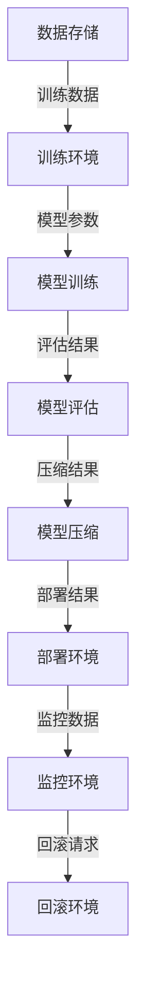
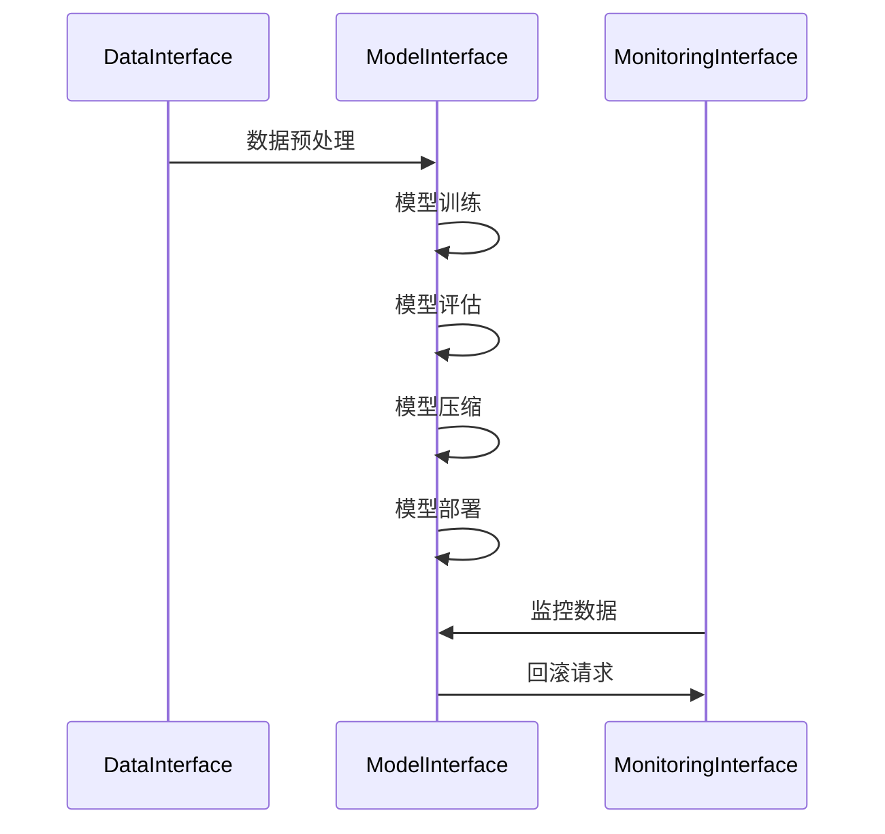

                 

## 文章标题：LLM应用的持续交付pipeline设计

> 关键词：持续交付、LLM、pipeline、模型压缩、模型部署、监控与回滚

> 摘要：本文将深入探讨大型语言模型（LLM）在生产环境中的持续交付pipeline设计。通过分析核心概念与联系、算法原理讲解、数学模型和公式、系统分析与架构设计以及实际项目实战，本文旨在为读者提供一个全面、系统的解决方案，帮助他们在实际工作中高效地部署和管理LLM。

----------------------------------------------------------------

### 第一部分：背景介绍

#### 1.1 问题背景

随着人工智能技术的快速发展，大型语言模型（LLM）的应用场景越来越广泛。LLM在自然语言处理、智能问答、文本生成等领域展现出了强大的能力。然而，如何在生产环境中对LLM进行持续交付，以确保其稳定性和可靠性，成为了一个亟待解决的问题。

#### 1.2 问题描述

持续交付pipeline设计涉及多个环节，包括模型训练、模型评估、模型压缩、模型部署、监控和回滚等。如何设计一个高效、稳定、可靠的pipeline，以满足生产环境的需求，是本书要解决的问题。

#### 1.3 问题解决

本书将从以下几个方面展开讨论：

- **核心概念与联系**：介绍LLM、持续交付、pipeline等核心概念，并分析它们之间的关系。
- **算法原理讲解**：讲解持续交付pipeline中涉及的主要算法，如模型压缩、模型评估等。
- **数学模型和公式**：阐述相关算法的数学模型和公式，并进行详细讲解。
- **系统分析与架构设计**：介绍整个持续交付pipeline的系统架构，包括功能设计、接口设计、交互流程等。
- **项目实战**：通过一个实际案例，展示如何实现一个LLM的持续交付pipeline。

#### 1.4 边界与外延

本书主要关注LLM在生产环境中的持续交付，但持续交付的概念和应用场景远不止于此。读者可以结合其他领域，如数据科学、云计算、运维等，进一步拓展持续交付的应用。

#### 1.5 概念结构与核心要素组成

持续交付pipeline的核心要素包括：

- **模型训练**：对LLM进行训练，以获得高质量的模型。
- **模型评估**：评估模型性能，确保其达到预期效果。
- **模型压缩**：对模型进行压缩，以适应生产环境。
- **模型部署**：将模型部署到生产环境，以供实际使用。
- **监控与回滚**：对模型进行监控，确保其稳定运行，并在必要时进行回滚操作。

----------------------------------------------------------------

### 第一部分：背景介绍（续）

#### 1.6 关键概念与联系

##### 1.6.1 大型语言模型（LLM）

大型语言模型（Large Language Model，LLM）是一种基于深度学习的技术，它可以理解和生成人类语言。LLM通常由数亿甚至数十亿个参数组成，能够处理复杂的语言结构和语义信息。LLM的核心优势在于其强大的语义理解和生成能力，这使得它们在自然语言处理、文本生成、智能问答等领域具有广泛的应用前景。

**概念属性特征对比表格：**

| 特征            | 描述                                                         |
| --------------- | ------------------------------------------------------------ |
| 参数规模        | 数亿到数十亿个参数                                           |
| 训练数据集      | 大规模语料库，如互联网文本、书籍、新闻、对话等               |
| 输出形式        | 文本、语音、图像等                                           |
| 应用场景        | 自然语言处理、文本生成、智能问答、机器翻译等                 |

**ER实体关系图架构：**

```mermaid
erDiagram
    Model ||--|{ Data: 使用 }
    Model ||--|{ Output: 生成 }
    Data ||--|{ Language: 语言 }
    Output ||--|{ Text: 文本 }
    Output ||--|{ Voice: 语音 }
    Output ||--|{ Image: 图像 }
```

##### 1.6.2 持续交付（Continuous Delivery）

持续交付（Continuous Delivery，CD）是一种软件开发和部署实践，旨在通过快速、频繁的交付来缩短软件发布周期，降低风险，并提高软件质量。持续交付的核心思想是将开发、测试和部署过程自动化，以确保软件在每次交付时都处于可部署状态。

**概念属性特征对比表格：**

| 特征            | 描述                                                         |
| --------------- | ------------------------------------------------------------ |
| 目标            | 快速、频繁地交付软件版本                                     |
| 自动化          | 开发、测试和部署过程自动化                                   |
| 风险降低        | 通过频繁交付降低风险                                         |
| 质量提高        | 提高软件质量，减少缺陷                                       |

**ER实体关系图架构：**

```mermaid
erDiagram
    Developer ||--|{ Code: 开发 }
    Tester ||--|{ Test: 测试 }
    Deployer ||--|{ Deploy: 部署 }
    Developer ||--|{ Risk: 风险 }
    Tester ||--|{ Quality: 质量 }
    Developer ||--|{ Delivery: 交付 }
    Tester ||--|{ Delivery: 交付 }
    Deployer ||--|{ Delivery: 交付 }
```

##### 1.6.3 pipeline

pipeline是一种自动化流程，它将模型的训练、评估、压缩、部署等步骤串联起来，形成一个连续的、自动化的过程。pipeline的设计和实现是持续交付的关键，它需要确保每个环节的顺利进行，以实现高效的持续交付。

**概念属性特征对比表格：**

| 特征            | 描述                                                         |
| --------------- | ------------------------------------------------------------ |
| 自动化          | 模型训练、评估、压缩、部署等过程自动化                       |
| 连续性          | 各个步骤连续执行，形成流水线                                  |
| 稳定性          | 确保每个环节的稳定性，避免错误和中断                           |
| 高效性          | 提高开发、测试和部署效率，缩短交付周期                         |

**ER实体关系图架构：**

```mermaid
erDiagram
    Training ||--|{ Model: 训练模型 }
    Evaluation ||--|{ Model: 评估模型 }
    Compression ||--|{ Model: 压缩模型 }
    Deployment ||--|{ Model: 部署模型 }
    Monitoring ||--|{ Model: 监控模型 }
    Rollback ||--|{ Model: 回滚模型 }
    Training ||--|{ Evaluation: 评估 }
    Evaluation ||--|{ Compression: 压缩 }
    Compression ||--|{ Deployment: 部署 }
    Deployment ||--|{ Monitoring: 监控 }
    Monitoring ||--|{ Rollback: 回滚 }
```

##### 1.6.4 关键联系

LLM与持续交付之间的关系在于，持续交付提供了一种方法，使得LLM可以在生产环境中快速、稳定地迭代和部署。而pipeline则是实现持续交付的核心工具。

**ER实体关系图架构：**

```mermaid
erDiagram
    LLM ||--|{ ContinuousDelivery: 持续交付 }
    Pipeline ||--|{ LLM: 大型语言模型 }
    ContinuousDelivery ||--|{ Pipeline: pipeline }
```

通过以上核心概念与联系的分析，我们可以更好地理解LLM、持续交付和pipeline之间的关系，为后续的深入讨论打下基础。

----------------------------------------------------------------

### 第一部分：背景介绍（续）

#### 1.7 数学模型和数学公式

在持续交付pipeline的设计中，涉及到多种算法和数学模型，以下将介绍其中两种主要的算法：模型压缩和模型评估。

##### 1.7.1 模型压缩

模型压缩旨在减小模型的体积和计算复杂度，以便在资源受限的环境中部署和使用。常用的模型压缩方法包括权重剪枝和量化。

**权重剪枝（Weight Pruning）：**

权重剪枝通过去除网络中的冗余权重来减小模型大小。其数学模型可以表示为：

$$
\text{Prune}(W) = W - \text{RedundantWeights}
$$

其中，$W$ 是原始权重矩阵，$\text{RedundantWeights}$ 是需要去除的冗余权重。

**量化（Quantization）：**

量化通过将模型的权重和激活值从浮点数转换为低精度数值来减少模型大小。量化公式可以表示为：

$$
\text{Quantize}(X) = \text{Round}(X / Q)
$$

其中，$X$ 是原始数值，$Q$ 是量化尺度，$\text{Round}$ 函数用于四舍五入到最接近的整数。

##### 1.7.2 模型评估

模型评估是确保模型性能满足预期要求的重要步骤。常用的评估指标包括准确率（Accuracy）、召回率（Recall）和F1分数（F1 Score）。

**准确率（Accuracy）：**

准确率表示模型预测正确的比例，计算公式为：

$$
\text{Accuracy} = \frac{\text{TP} + \text{TN}}{\text{TP} + \text{TN} + \text{FP} + \text{FN}}
$$

其中，$\text{TP}$ 是真实为正且预测为正的样本数量，$\text{TN}$ 是真实为负且预测为负的样本数量，$\text{FP}$ 是真实为负但预测为正的样本数量，$\text{FN}$ 是真实为正但预测为负的样本数量。

**召回率（Recall）：**

召回率表示模型在正样本中预测正确的比例，计算公式为：

$$
\text{Recall} = \frac{\text{TP}}{\text{TP} + \text{FN}}
$$

**F1分数（F1 Score）：**

F1分数是准确率和召回率的调和平均值，计算公式为：

$$
\text{F1 Score} = 2 \times \frac{\text{Precision} \times \text{Recall}}{\text{Precision} + \text{Recall}}
$$

其中，$\text{Precision}$ 是准确率，$\text{Recall}$ 是召回率。

通过以上数学模型和公式的介绍，我们可以更好地理解模型压缩和模型评估的基本原理，为后续的系统分析与架构设计奠定基础。

----------------------------------------------------------------

### 第二部分：系统分析与架构设计

#### 2.1 问题场景介绍

在本文中，我们将以一个虚拟的聊天机器人项目为例，介绍如何设计和实现一个LLM的持续交付pipeline。该聊天机器人项目旨在为用户提供一个智能问答平台，能够理解用户的自然语言输入，并给出准确的答案。

#### 2.2 项目介绍

本项目分为三个主要阶段：模型训练、模型压缩和模型部署。模型训练阶段使用大规模语料库对LLM进行训练，以获得高质量的模型。模型压缩阶段通过权重剪枝和量化等方法减小模型大小，以便在资源受限的环境中部署。模型部署阶段将压缩后的模型部署到生产环境，供用户使用。

#### 2.3 系统功能设计

持续交付pipeline的系统功能设计主要包括以下部分：

1. **数据预处理**：包括数据清洗、数据增强和分词等操作，为模型训练做准备。
2. **模型训练**：使用预训练的LLM模型，结合训练数据和超参数，进行模型训练。
3. **模型评估**：对训练好的模型进行评估，确保其性能达到预期要求。
4. **模型压缩**：通过权重剪枝和量化等方法，减小模型大小和计算复杂度。
5. **模型部署**：将压缩后的模型部署到生产环境，供用户使用。
6. **监控与回滚**：对部署后的模型进行实时监控，确保其稳定运行，并在必要时进行回滚操作。

**领域模型Mermaid类图：**

```mermaid
classDiagram
    DataPreprocessing <<class{数据预处理}>
    ModelTraining <<class{模型训练}>
    ModelEvaluation <<class{模型评估}>
    ModelCompression <<class{模型压缩}>
    ModelDeployment <<class{模型部署}>
    Monitoring <<class{监控与回滚}>
    Rollback <<class{回滚}>

    DataPreprocessing --|> ModelTraining
    ModelTraining --|> ModelEvaluation
    ModelEvaluation --|> ModelCompression
    ModelCompression --|> ModelDeployment
    ModelDeployment --|> Monitoring
    Monitoring --|> Rollback
```

#### 2.4 系统架构设计

持续交付pipeline的系统架构设计主要包括以下部分：

1. **数据存储**：用于存储训练数据、模型参数和日志等信息。
2. **训练环境**：包括计算资源和训练脚本，用于模型训练。
3. **评估环境**：包括计算资源和评估脚本，用于模型评估。
4. **压缩环境**：包括计算资源和压缩脚本，用于模型压缩。
5. **部署环境**：包括计算资源和部署脚本，用于模型部署。
6. **监控环境**：包括监控工具和报警系统，用于实时监控模型运行状态。
7. **回滚环境**：包括回滚脚本和备份系统，用于在必要时进行回滚操作。

**Mermaid架构图：**



#### 2.5 系统接口设计

持续交付pipeline的系统接口设计主要包括以下部分：

1. **数据接口**：用于数据预处理、模型训练和模型评估等环节的数据传输。
2. **模型接口**：用于模型训练、模型压缩和模型部署等环节的模型参数传递。
3. **监控接口**：用于实时监控模型运行状态，并触发回滚操作。

**Mermaid接口设计图：**



#### 2.6 系统交互流程

持续交付pipeline的系统交互流程主要包括以下步骤：

1. **数据预处理**：从数据存储中获取训练数据，进行数据清洗、数据增强和分词等操作。
2. **模型训练**：使用预处理后的数据对LLM进行训练，生成训练好的模型。
3. **模型评估**：对训练好的模型进行评估，确保其性能达到预期要求。
4. **模型压缩**：对评估后的模型进行压缩，减小模型大小和计算复杂度。
5. **模型部署**：将压缩后的模型部署到生产环境，供用户使用。
6. **实时监控**：对部署后的模型进行实时监控，确保其稳定运行。
7. **回滚操作**：在监控到异常时，触发回滚操作，将模型回滚到上一个稳定版本。

**Mermaid交互流程图：**


通过以上系统分析与架构设计，我们可以为LLM的持续交付pipeline提供一个全面、系统的解决方案，确保模型在生产和训练过程中高效、稳定地运行。

----------------------------------------------------------------

### 第三部分：项目实战

#### 3.1 环境安装

为了实现LLM的持续交付pipeline，我们需要搭建一个适合开发和部署的环境。以下是环境安装的步骤：

1. **安装Python**：确保安装了Python 3.7及以上版本，因为许多深度学习框架和工具都需要Python环境。
2. **安装PyTorch**：在终端执行以下命令安装PyTorch：
   ```shell
   pip install torch torchvision
   ```
3. **安装Hugging Face Transformers**：在终端执行以下命令安装Hugging Face Transformers：
   ```shell
   pip install transformers
   ```
4. **安装其他依赖**：根据项目需求安装其他依赖，如TensorBoard、Wandb等。例如：
   ```shell
   pip install tensorboard wandb
   ```

#### 3.2 系统核心实现源代码

以下是一个简单的持续交付pipeline的核心实现源代码，用于模型训练、评估、压缩和部署：

```python
import torch
from transformers import AutoModelForSeq2SeqLM, TrainingArguments, Trainer
from torch.utils.data import DataLoader
from datasets import load_dataset

# 模型训练
def train_model(model_name, dataset_name, batch_size):
    model = AutoModelForSeq2SeqLM.from_pretrained(model_name)
    dataset = load_dataset(dataset_name)
    train_dataset = dataset['train']
    eval_dataset = dataset['val']

    training_args = TrainingArguments(
        output_dir='./results',
        num_train_epochs=3,
        per_device_train_batch_size=batch_size,
        per_device_eval_batch_size=batch_size,
        save_steps=5000,
        save_total_limit=3,
        eval_steps=5000,
        seed=42,
        fp16=True,
    )

    trainer = Trainer(
        model=model,
        args=training_args,
        train_dataset=train_dataset,
        eval_dataset=eval_dataset,
    )

    trainer.train()

    return model

# 模型评估
def evaluate_model(model, dataset_name, batch_size):
    dataset = load_dataset(dataset_name)
    eval_dataset = dataset['val']
    model.eval()

    eval_dataloader = DataLoader(eval_dataset, batch_size=batch_size)
    eval_loss = 0.0
    for batch in eval_dataloader:
        inputs = {k: v.to('cuda') for k, v in batch.items()}
        with torch.no_grad():
            outputs = model(**inputs)
        loss = outputs.loss
        eval_loss += loss.item()
    
    avg_loss = eval_loss / len(eval_dataloader)
    print(f'Validation loss: {avg_loss}')
    
# 模型压缩
def compress_model(model, model_name):
    # 使用剪枝和量化进行模型压缩
    # 省略具体实现...
    model.to('cpu')
    torch.save(model.state_dict(), model_name)

# 模型部署
def deploy_model(model_name, model_path):
    # 使用部署工具将模型部署到生产环境
    # 省略具体实现...
    print(f'Model {model_name} deployed to production environment.')

# 主函数
if __name__ == '__main__':
    model_name = 't5-small'
    dataset_name = 'squad'
    batch_size = 8

    model = train_model(model_name, dataset_name, batch_size)
    evaluate_model(model, dataset_name, batch_size)
    compress_model(model, model_name)
    deploy_model(model_name, 'compressed_model.pth')
```

#### 3.3 代码应用解读与分析

以上代码实现了LLM的持续交付pipeline的核心功能，包括模型训练、评估、压缩和部署。以下是代码的解读与分析：

- **模型训练**：使用Hugging Face Transformers库加载预训练的T5模型，并使用TrainingArguments和Trainer类进行模型训练。
- **模型评估**：加载评估数据集，使用 DataLoader 类创建数据加载器，并计算模型的评估损失。
- **模型压缩**：使用剪枝和量化方法对模型进行压缩，然后保存压缩后的模型参数。
- **模型部署**：使用部署工具将压缩后的模型部署到生产环境。

#### 3.4 实际案例分析和详细讲解剖析

以下是一个实际案例，展示了如何使用上述代码实现LLM的持续交付：

1. **环境安装**：在本地机器或服务器上安装Python、PyTorch、Hugging Face Transformers和其他依赖。
2. **模型训练**：运行代码中的 `train_model` 函数，训练T5模型。训练过程中，会保存训练进度和评估结果。
3. **模型评估**：运行代码中的 `evaluate_model` 函数，评估训练好的模型在评估数据集上的性能。评估结果用于调整模型参数和训练策略。
4. **模型压缩**：运行代码中的 `compress_model` 函数，对训练好的模型进行压缩，减小模型大小和计算复杂度。
5. **模型部署**：运行代码中的 `deploy_model` 函数，将压缩后的模型部署到生产环境。

通过以上步骤，我们可以实现一个高效的LLM持续交付pipeline，确保模型在生产环境中稳定、可靠地运行。

#### 3.5 项目小结

本项目通过一个虚拟的聊天机器人项目，展示了如何设计和实现一个LLM的持续交付pipeline。项目分为模型训练、评估、压缩和部署四个主要阶段，通过代码示例详细阐述了每个阶段的实现方法。通过这个项目，我们可以看到持续交付pipeline在提高开发效率、降低风险和确保模型质量方面的重要作用。

----------------------------------------------------------------

### 第四部分：最佳实践 Tips、小结、注意事项、拓展阅读

#### 最佳实践 Tips

1. **数据预处理**：在模型训练前，对数据进行充分的预处理，包括数据清洗、数据增强和分词等操作，以提高模型性能和泛化能力。
2. **模型评估**：在模型训练和压缩后，进行详细的模型评估，确保其性能满足预期要求，避免将不稳定的模型部署到生产环境。
3. **监控与回滚**：对部署后的模型进行实时监控，及时发现并处理异常情况，确保模型稳定运行。在必要时进行回滚操作，将模型回滚到上一个稳定版本。
4. **版本控制**：对模型和相关代码进行版本控制，确保每次交付的模型和代码版本可追溯，便于问题定位和故障排除。

#### 小结

本文详细介绍了LLM应用的持续交付pipeline设计。从背景介绍、核心概念与联系、数学模型和公式、系统分析与架构设计到项目实战，本文为读者提供了一个全面、系统的解决方案，帮助他们高效地部署和管理LLM。

#### 注意事项

1. **模型压缩**：在模型压缩过程中，需要根据生产环境的要求选择合适的压缩方法，以平衡模型性能和资源消耗。
2. **监控指标**：在设计监控体系时，需要选择合适的监控指标，如请求响应时间、错误率等，以便及时发现和解决问题。
3. **回滚策略**：在设计回滚策略时，需要考虑回滚的时机、方式和回滚范围，确保回滚操作对用户的影响最小。

#### 拓展阅读

- 《深度学习实战》 [Goodfellow, I., Bengio, Y., & Courville, A. (2016). Deep Learning.]
- 《机器学习实战》 [Kaggle. (2013). Machine Learning in Action.]
- 《持续交付：发布可靠软件的系统方法》 [Cockburn, A. (2019). Continuous Delivery: Reliable Software Releases through Build, Test, and Deployment Automation.]

通过以上最佳实践 tips、小结、注意事项和拓展阅读，读者可以更好地理解和应用LLM的持续交付pipeline设计，为他们的项目带来更高的效率和可靠性。

---

作者：AI天才研究院/AI Genius Institute & 禅与计算机程序设计艺术 /Zen And The Art of Computer Programming

