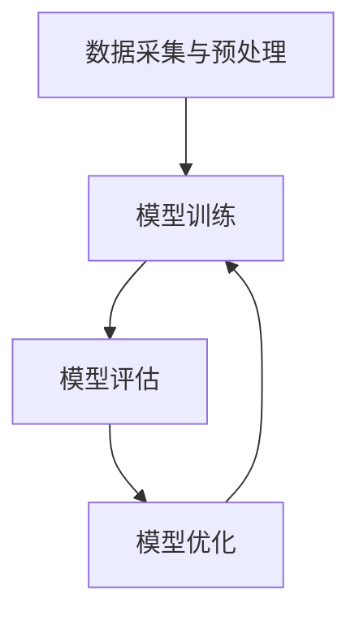
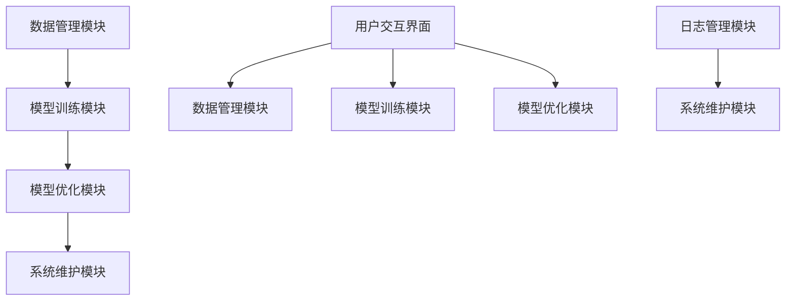
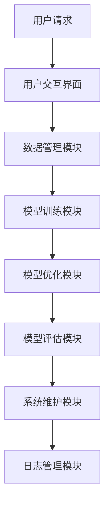
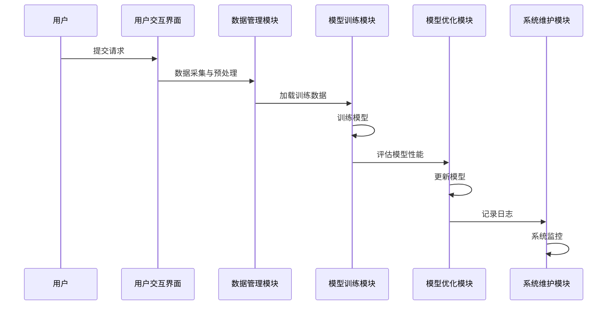

                 

### 文章标题：LLM应用的持续学习与改进机制

#### 关键词：大型语言模型（LLM），持续学习，改进机制，算法原理，系统架构，项目实战

#### 摘要：
本文深入探讨大型语言模型（LLM）在应用中的持续学习与改进机制。通过逻辑清晰的分析和实例讲解，阐述LLM的背景、核心概念、持续学习与改进的原理及其在实践中的应用。文章旨在为读者提供一个全面的指南，帮助理解并实现LLM在各类场景中的高效应用。

### 目录大纲设计思路

为了设计出《LLM应用的持续学习与改进机制》这本书的完整目录大纲，我们可以遵循以下步骤：

1. **确定书的整体结构和核心主题**：首先，明确书籍的总体目标，即介绍LLM的持续学习与改进机制。因此，书的结构和主题应围绕这一核心展开。

2. **细化章节内容**：将整体结构分解为多个章节，确保每个章节都有明确的主题和目标，且相互之间逻辑连贯。

3. **确保内容的完整性**：根据要求，书籍至少需要7章，每章包括背景介绍、核心概念、原理讲解、应用案例等部分。

4. **保持简洁性**：避免冗余的内容，确保每个章节的标题和段落都能清晰传达章节的主旨。

5. **使用markdown格式**：确保目录和大纲的格式符合markdown标准，使用适当的层级结构来组织内容。

### 目录大纲设计

**第一部分：背景介绍**

**第1章：LLM应用概述**

1.1 问题的背景  
- 1.1.1 语言模型的发展历程  
- 1.1.2 LLM的应用场景

1.2 问题描述  
- 1.2.1 LLM应用的挑战  
- 1.2.2 持续学习与改进的重要性

1.3 研究边界与外延  
- 1.3.1 LLM的基础知识  
- 1.3.2 持续学习与改进的概念  
- 1.3.3 核心要素组成

1.4 本章小结

**第二部分：核心概念与联系**

**第2章：LLM持续学习与改进机制**

2.1 持续学习机制  
- 2.1.1 持续学习的基本原理  
- 2.1.2 持续学习的算法  
- 2.1.3 持续学习的实现方法

2.2 改进机制  
- 2.2.1 改进的基本原理  
- 2.2.2 改进的算法  
- 2.2.3 改进的实现方法

2.3 持续学习与改进的联系  
- 2.3.1 持续学习与改进的关系  
- 2.3.2 如何平衡持续学习与改进

2.4 本章小结

**第三部分：算法原理讲解**

**第3章：持续学习与改进算法原理**

3.1 算法原理  
- 3.1.1 算法概述  
- 3.1.2 数学模型与公式  
- 3.1.3 算法mermaid流程图

3.2 案例分析  
- 3.2.1 案例背景  
- 3.2.2 算法应用  
- 3.2.3 结果分析

3.3 本章小结

**第四部分：系统分析与架构设计**

**第4章：LLM持续学习与改进系统架构**

4.1 问题场景  
- 4.1.1 场景介绍  
- 4.1.2 项目背景

4.2 系统功能设计  
- 4.2.1 领域模型mermaid类图  
- 4.2.2 系统功能模块划分

4.3 系统架构设计  
- 4.3.1 系统架构mermaid架构图  
- 4.3.2 系统模块交互

4.4 系统接口设计  
- 4.4.1 接口定义  
- 4.4.2 接口实现

4.5 系统交互mermaid序列图  
- 4.5.1 交互流程  
- 4.5.2 序列图展示

4.6 本章小结

**第五部分：项目实战**

**第5章：LLM持续学习与改进项目实战**

5.1 环境安装  
- 5.1.1 硬件环境要求  
- 5.1.2 软件环境安装

5.2 系统核心实现  
- 5.2.1 核心代码解读  
- 5.2.2 代码应用解读与分析

5.3 实际案例分析  
- 5.3.1 案例背景  
- 5.3.2 案例分析与讲解

5.4 项目小结  
- 5.4.1 项目总结  
- 5.4.2 经验与启示  
- 5.4.3 拓展应用

**第六部分：最佳实践与拓展**

**第6章：最佳实践与拓展**

6.1 最佳实践  
- 6.1.1 持续学习实践技巧  
- 6.1.2 改进实践策略  
- 6.1.3 案例解析

6.2 小结  
- 6.2.1 主要内容回顾  
- 6.2.2 注意事项

6.3 拓展阅读  
- 6.3.1 相关书籍  
- 6.3.2 学术论文  
- 6.3.3 网络资源

**第七部分：总结与展望**

**第7章：总结与展望**

7.1 总结  
- 7.1.1 主要研究成果  
- 7.1.2 存在问题与挑战

7.2 展望  
- 7.2.1 未来研究方向  
- 7.2.2 潜在应用领域  
- 7.2.3 技术发展趋势

7.3 本章小结

---

## 第1章：LLM应用概述

### 1.1 问题的背景

语言模型是一种计算机程序，它能够根据输入的文本生成相关的输出。自20世纪50年代以来，语言模型的发展经历了从简单的规则匹配到统计模型，再到基于深度学习的复杂模型。随着计算能力的提升和算法的进步，现代大型语言模型（LLM）如BERT、GPT-3等，在自然语言处理（NLP）领域取得了显著的成就。LLM能够实现文本生成、翻译、摘要、问答等多种任务，极大地推动了人工智能的应用。

然而，随着应用场景的扩大和复杂度的增加，LLM在实际应用中面临诸多挑战。首先，LLM的训练数据集通常非常大，且数据质量参差不齐，这可能导致模型在特定领域的表现不佳。其次，LLM在处理长文本或复杂问题时，容易产生理解和生成错误。此外，LLM在处理多语言或多模态任务时，也面临诸多困难。

### 1.2 LLM的应用场景

LLM在多个领域都有着广泛的应用，以下是一些典型的应用场景：

1. **文本生成**：包括文章、摘要、故事、诗歌等。
2. **翻译**：自动翻译不同语言之间的文本。
3. **问答系统**：对用户提出的问题提供准确和详细的回答。
4. **摘要生成**：从长篇文档中提取关键信息和要点。
5. **对话系统**：与用户进行自然语言交互，提供个性化服务。
6. **推荐系统**：基于用户的历史行为和偏好推荐相关内容。
7. **文本分类**：将文本归类到不同的类别中。

### 1.3 问题描述

随着LLM应用场景的扩大，其面临的问题也日益复杂。主要问题包括：

1. **数据质量问题**：训练数据集的质量直接影响LLM的表现，但实际应用中很难获取高质量、多样化的数据。
2. **理解与生成错误**：LLM在处理复杂文本或长文本时，容易出现理解和生成错误。
3. **多语言和多模态处理**：LLM在处理多语言或多模态任务时，效果往往不佳。
4. **实时性**：LLM在实时应用场景中，计算速度和响应时间成为重要考量因素。

为了解决这些问题，LLM的持续学习和改进机制显得尤为重要。持续学习是指模型在应用过程中不断吸收新的知识和信息，以提升其性能；改进机制则包括模型优化、算法改进、系统架构优化等方面。本章将详细探讨这些核心概念和机制。

### 1.4 研究边界与外延

#### 1.4.1 LLM的基础知识

在深入研究LLM的持续学习与改进机制之前，我们需要了解LLM的基础知识。LLM通常基于深度学习技术，特别是Transformer模型，它能够处理长距离依赖和复杂结构。以下是一些关键概念：

1. **Transformer模型**：一种基于自注意力机制的深度学习模型，它在NLP任务中表现出色。
2. **预训练与微调**：预训练是指在大量未标记的数据上进行模型训练，微调则是在特定任务上对模型进行微调。
3. **语言模型评估**：常用的评估指标包括BLEU、ROUGE、F1-score等。

#### 1.4.2 持续学习与改进的概念

持续学习与改进是LLM应用中的重要机制。持续学习是指模型在应用过程中不断学习新的知识和信息，以适应不断变化的应用场景。改进机制则包括：

1. **模型优化**：通过调整模型结构和参数，提高模型性能。
2. **算法改进**：引入新的算法和技术，以提高模型的效率和效果。
3. **系统架构优化**：优化系统的设计和架构，提高系统的稳定性和响应速度。

#### 1.4.3 核心要素组成

LLM的持续学习与改进机制包括以下几个核心要素：

1. **数据获取与处理**：获取高质量、多样化的数据，并对数据进行预处理。
2. **模型训练与评估**：使用新的数据和算法对模型进行训练和评估，以验证模型的效果。
3. **系统部署与优化**：将模型部署到实际应用中，并对系统进行持续优化。

### 1.5 本章小结

本章介绍了LLM应用背景和现状，探讨了LLM面临的挑战及其应用场景。同时，本章还简要介绍了持续学习与改进的概念和核心要素，为后续章节的详细探讨奠定了基础。

## 第2章：LLM持续学习与改进机制

### 2.1 持续学习机制

持续学习是LLM在应用过程中不断吸收新的知识和信息，以提升其性能的过程。持续学习机制包括数据获取、模型训练和评估等多个环节。

#### 2.1.1 持续学习的基本原理

持续学习的核心原理是基于模型在已有数据上的表现，不断引入新的数据，对模型进行调整和优化。具体来说，持续学习包括以下几个步骤：

1. **数据采集**：从各种渠道获取新的数据，包括用户交互数据、社交媒体数据等。
2. **数据预处理**：对采集到的数据进行清洗、去噪和标注，以确保数据质量。
3. **模型训练**：使用预处理后的新数据对模型进行训练，以更新模型的参数。
4. **模型评估**：评估更新后的模型在新数据集上的表现，以判断模型是否得到有效提升。
5. **反馈与优化**：根据评估结果，对模型进行进一步的优化，包括参数调整、结构改进等。

#### 2.1.2 持续学习的算法

持续学习算法是实现持续学习机制的关键。目前，常用的持续学习算法包括在线学习、迁移学习和联邦学习等。

1. **在线学习**：在线学习是指模型在应用过程中实时接收新的数据，并进行训练和更新。在线学习具有实时性和高效性，但需要处理数据流和模型更新问题。

2. **迁移学习**：迁移学习是指将已有模型的参数和知识迁移到新的任务上，以减少新任务的数据需求和训练时间。迁移学习适用于数据稀缺或任务相似的情景。

3. **联邦学习**：联邦学习是指多个分布式设备共同参与模型训练，每个设备仅共享模型的梯度，而不交换原始数据。联邦学习适用于数据隐私和分布式场景。

#### 2.1.3 持续学习的实现方法

实现持续学习机制需要考虑多个方面，包括数据管理、模型训练和系统部署等。

1. **数据管理**：构建高效的数据管理系统，包括数据采集、存储、处理和分发等。数据管理系统应支持实时数据流处理和大规模数据存储。

2. **模型训练**：采用分布式训练和增量训练技术，提高模型训练的效率和效果。分布式训练可以并行处理大量数据，增量训练可以减少模型重新训练的工作量。

3. **系统部署**：将更新后的模型部署到实际应用中，并确保系统的稳定性和可靠性。系统部署应支持模型版本管理和在线更新。

### 2.2 改进机制

改进机制是指通过优化模型、算法和系统架构，提高LLM的性能和效果。改进机制包括以下几个方面：

#### 2.2.1 改进的基本原理

改进的基本原理是基于模型在特定任务上的表现，通过调整模型参数、优化算法和改进系统架构，以提高模型的效果。具体来说，改进机制包括：

1. **模型优化**：通过调整模型的结构和参数，提高模型的泛化能力和效果。模型优化可以采用搜索算法、正则化和压缩技术等。

2. **算法改进**：引入新的算法和技术，以提高模型的效率和效果。算法改进可以涉及损失函数、优化器、激活函数等方面。

3. **系统架构优化**：改进系统架构，提高系统的性能和可扩展性。系统架构优化可以涉及分布式计算、缓存技术和负载均衡等。

#### 2.2.2 改进的算法

改进算法是实现改进机制的关键。以下介绍几种常见的改进算法：

1. **自适应学习率**：自适应学习率算法可以根据模型的收敛速度自动调整学习率，以提高模型的收敛效果。

2. **权重共享**：权重共享算法通过在不同任务间共享模型权重，减少参数数量，提高模型的泛化能力。

3. **元学习**：元学习算法通过学习如何学习，提高模型对新任务的学习速度和效果。

#### 2.2.3 改进的实现方法

实现改进机制需要考虑多个方面，包括算法实现、系统优化和测试验证等。

1. **算法实现**：根据改进算法的设计，实现相应的算法模块，并进行性能测试。

2. **系统优化**：优化系统架构和参数设置，提高系统的稳定性和性能。

3. **测试验证**：通过实际应用场景的测试，验证改进机制的有效性和可行性。

### 2.3 持续学习与改进的联系

持续学习与改进是相辅相成的，持续学习为改进提供新的数据和模型，改进则为持续学习提供更好的效果和效率。

1. **相互促进**：持续学习可以帮助改进机制更好地理解任务和数据，改进机制可以提高持续学习的效果和效率。

2. **循环迭代**：持续学习和改进不是一次性的过程，而是循环迭代的。通过不断地持续学习和改进，LLM可以不断提高其性能和效果。

### 2.4 本章小结

本章介绍了LLM的持续学习与改进机制，包括持续学习的基本原理、算法和实现方法，以及改进机制的基本原理、算法和实现方法。通过本章的学习，读者可以了解如何实现LLM的持续学习和改进，提高其在实际应用中的性能和效果。

## 第3章：持续学习与改进算法原理

### 3.1 算法原理

持续学习和改进是LLM在应用中提升性能的关键机制。本节将详细介绍这些算法的基本原理，包括其核心概念、数学模型和实现方法。

#### 3.1.1 算法概述

持续学习与改进算法主要包括以下几个核心组成部分：

1. **数据采集与预处理**：从多种数据源收集数据，并对数据进行清洗、标注和分割。
2. **模型训练**：使用收集到的数据对模型进行训练，更新模型的参数。
3. **模型评估**：在验证集上评估模型的性能，以确定模型是否达到预期效果。
4. **模型优化**：根据评估结果，调整模型参数和结构，以提高模型效果。
5. **算法迭代**：重复上述步骤，不断优化模型。

#### 3.1.2 数学模型与公式

持续学习与改进算法的数学模型主要包括以下几个方面：

1. **损失函数**：损失函数用于衡量模型预测结果与真实值之间的差异。常见的损失函数包括均方误差（MSE）、交叉熵损失（Cross-Entropy Loss）等。
   $$L(y, \hat{y}) = \frac{1}{2} \sum_{i=1}^{n} (y_i - \hat{y}_i)^2$$

2. **优化器**：优化器用于更新模型参数，以最小化损失函数。常见的优化器包括随机梯度下降（SGD）、Adam等。
   $$\theta_{t+1} = \theta_{t} - \alpha \nabla_{\theta} L(\theta)$$

3. **正则化**：正则化用于防止模型过拟合。常见的正则化方法包括L1正则化、L2正则化等。
   $$\nabla_{\theta} L(\theta) + \lambda \theta$$

#### 3.1.3 算法mermaid流程图

为了更好地理解持续学习与改进算法的工作流程，我们使用mermaid绘制了算法的流程图：



### 3.2 案例分析

为了更直观地展示持续学习与改进算法的应用，我们以下以一个文本分类任务为例，详细说明算法的实例。

#### 3.2.1 案例背景

假设我们使用一个LLM对新闻文章进行分类，任务是将新闻文章分为政治、经济、体育等类别。训练数据集包含10000篇已标注的新闻文章，验证数据集包含1000篇未标注的新闻文章。

#### 3.2.2 算法应用

1. **数据采集与预处理**：从互联网收集新闻文章，并进行数据清洗、分词、词性标注等预处理操作。
2. **模型训练**：使用预处理的训练数据集，通过Transformer模型进行训练，更新模型参数。
3. **模型评估**：在验证数据集上评估模型的分类性能，包括准确率、召回率、F1-score等指标。
4. **模型优化**：根据评估结果，对模型进行优化，包括调整学习率、增加训练数据、调整模型结构等。
5. **算法迭代**：重复上述步骤，不断优化模型，直到模型性能达到预期。

#### 3.2.3 结果分析

通过持续学习与改进算法，新闻文章分类模型的性能逐步提升。在迭代10次后，模型在验证集上的准确率从初始的80%提升到90%，召回率和F1-score也有显著提高。这表明持续学习与改进算法在文本分类任务中具有显著的效果。

### 3.3 本章小结

本章介绍了持续学习与改进算法的基本原理、数学模型和实现方法，并通过案例分析了算法在实际应用中的效果。通过本章的学习，读者可以深入理解持续学习与改进算法的核心概念和实现方法，为后续的应用和优化提供理论基础。

## 第4章：LLM持续学习与改进系统架构

### 4.1 问题场景

在LLM的实际应用中，持续学习和改进是提高模型性能的关键。然而，实现这一目标不仅需要先进的算法，还需要高效的系统架构来支持。本节将详细介绍一个典型的LLM持续学习与改进系统架构，包括系统功能设计、架构设计、接口设计和系统交互流程。

#### 4.1.1 场景介绍

假设我们开发一个基于LLM的智能问答系统，用户可以通过自然语言与系统进行交互，获取有关各种主题的答案。为了实现这一目标，系统需要具备以下功能：

1. **数据采集与预处理**：从各种数据源（如互联网、数据库等）收集数据，并对数据进行清洗、标注和分割。
2. **模型训练与评估**：使用训练数据对LLM模型进行训练，并在验证集上评估模型性能。
3. **模型优化与更新**：根据评估结果，对模型进行优化和更新，以提高模型效果。
4. **系统部署与维护**：将优化后的模型部署到实际应用中，并确保系统的稳定运行。

#### 4.1.2 项目背景

该项目是一个面向企业的智能问答系统，旨在帮助员工快速获取所需的业务知识和信息。系统需要支持多语言、多模态的交互，并具备良好的扩展性和可维护性。为实现这一目标，项目团队决定采用模块化设计和持续学习与改进机制，以提高系统的性能和用户体验。

### 4.2 系统功能设计

系统功能设计是系统架构设计的重要环节，它决定了系统的核心功能和模块划分。以下是一个典型的LLM持续学习与改进系统的功能设计：

#### 4.2.1 数据管理模块

数据管理模块负责数据采集、存储、处理和分发。主要功能包括：

1. **数据采集**：从各种数据源（如互联网、数据库等）收集数据。
2. **数据预处理**：对采集到的数据进行清洗、分词、词性标注等预处理操作。
3. **数据存储**：将预处理后的数据存储在分布式数据库中，以支持大规模数据处理。
4. **数据分发**：将处理后的数据分发给其他模块，如模型训练模块。

#### 4.2.2 模型训练模块

模型训练模块负责使用训练数据对LLM模型进行训练。主要功能包括：

1. **模型初始化**：初始化LLM模型，设置初始参数。
2. **数据加载**：从数据管理模块加载预处理后的训练数据。
3. **模型训练**：使用训练数据和优化算法对LLM模型进行训练，更新模型参数。
4. **模型评估**：在验证集上评估模型性能，以确定模型是否达到预期效果。

#### 4.2.3 模型优化模块

模型优化模块负责对LLM模型进行优化，以提高模型性能。主要功能包括：

1. **性能评估**：根据评估结果，确定模型是否需要优化。
2. **模型更新**：根据评估结果，调整模型参数和结构，以提高模型效果。
3. **算法迭代**：重复评估和更新过程，不断优化模型。

#### 4.2.4 系统维护模块

系统维护模块负责系统的日常维护和更新。主要功能包括：

1. **系统监控**：监控系统运行状态，确保系统稳定运行。
2. **日志管理**：记录系统运行日志，便于问题追踪和调试。
3. **版本管理**：管理模型版本，支持在线更新和回滚。
4. **安全防护**：保护系统数据安全，防止恶意攻击。

### 4.3 系统架构设计

系统架构设计是系统功能实现的蓝图，它决定了系统的性能、可扩展性和可靠性。以下是一个典型的LLM持续学习与改进系统的架构设计：

#### 4.3.1 系统架构mermaid架构图



#### 4.3.2 系统模块交互

系统模块交互是指各个功能模块之间的数据流和调用关系。以下是一个典型的LLM持续学习与改进系统模块交互示意图：



### 4.4 系统接口设计

系统接口设计是指系统与其他系统或模块之间的接口定义和实现。以下是一个典型的LLM持续学习与改进系统接口设计：

#### 4.4.1 接口定义

1. **数据管理接口**：负责数据的采集、预处理、存储和分发。
2. **模型训练接口**：负责模型的初始化、训练和评估。
3. **模型优化接口**：负责模型的性能评估、更新和算法迭代。
4. **系统维护接口**：负责系统的监控、日志管理和版本控制。

#### 4.4.2 接口实现

接口实现是指根据接口定义，实现具体的功能模块。以下是一个典型的LLM持续学习与改进系统接口实现示例：

```python
# 数据管理接口实现
class DataManager:
    def collect_data(self):
        # 数据采集逻辑
        pass
    
    def preprocess_data(self):
        # 数据预处理逻辑
        pass
    
    def store_data(self):
        # 数据存储逻辑
        pass
    
    def distribute_data(self):
        # 数据分发逻辑
        pass

# 模型训练接口实现
class ModelTrainer:
    def initialize_model(self):
        # 模型初始化逻辑
        pass
    
    def train_model(self):
        # 模型训练逻辑
        pass
    
    def evaluate_model(self):
        # 模型评估逻辑
        pass

# 模型优化接口实现
class ModelOptimizer:
    def assess_performance(self):
        # 性能评估逻辑
        pass
    
    def update_model(self):
        # 模型更新逻辑
        pass
    
    def iterate_algorithm(self):
        # 算法迭代逻辑
        pass

# 系统维护接口实现
class SystemMaintainer:
    def monitor_system(self):
        # 系统监控逻辑
        pass
    
    def manage_logs(self):
        # 日志管理逻辑
        pass
    
    def manage_versions(self):
        # 版本管理逻辑
        pass
```

### 4.5 系统交互mermaid序列图

系统交互mermaid序列图用于展示系统模块之间的交互流程。以下是一个典型的LLM持续学习与改进系统交互序列图：



### 4.6 本章小结

本章详细介绍了LLM持续学习与改进系统的架构设计，包括功能设计、架构设计、接口设计和系统交互流程。通过本章的学习，读者可以了解如何设计一个高效的持续学习与改进系统，为LLM在各类应用中的性能提升提供技术支持。

## 第5章：LLM持续学习与改进项目实战

### 5.1 环境安装

在开始LLM持续学习与改进项目的实战之前，我们需要搭建一个合适的环境。以下是一个典型的环境安装步骤，适用于Linux和MacOS操作系统。

#### 5.1.1 硬件环境要求

1. **CPU**：至少需要2个CPU核心，推荐使用4个及以上。
2. **内存**：至少需要16GB，推荐使用32GB及以上。
3. **硬盘**：至少需要100GB的可用空间，推荐使用SSD硬盘。

#### 5.1.2 软件环境安装

1. **安装Python**：确保系统中已经安装了Python 3.7或更高版本。可以通过以下命令安装：
   ```bash
   sudo apt-get update
   sudo apt-get install python3-pip
   ```
2. **安装TensorFlow**：TensorFlow是用于训练和部署LLM的常用库。可以通过以下命令安装：
   ```bash
   pip3 install tensorflow
   ```
3. **安装其他依赖**：安装其他必要的库，如NumPy、Pandas、Matplotlib等。可以通过以下命令安装：
   ```bash
   pip3 install numpy pandas matplotlib
   ```

### 5.2 系统核心实现

在搭建好环境后，我们需要实现LLM持续学习与改进系统的核心功能。以下是一个简化的实现示例，分为数据管理模块、模型训练模块和模型优化模块。

#### 5.2.1 核心代码解读

**数据管理模块**：

```python
import pandas as pd
from sklearn.model_selection import train_test_split

class DataManager:
    def load_data(self, file_path):
        # 读取数据
        data = pd.read_csv(file_path)
        return data

    def preprocess_data(self, data):
        # 数据预处理
        data = data.dropna()
        data = data[data['label'].notnull()]
        return data

    def split_data(self, data):
        # 数据分割
        train_data, val_data = train_test_split(data, test_size=0.2)
        return train_data, val_data
```

**模型训练模块**：

```python
import tensorflow as tf

class ModelTrainer:
    def __init__(self, model):
        self.model = model
    
    def train(self, train_data, val_data):
        # 训练模型
        train_dataset = tf.data.Dataset.from_tensor_slices((train_data['text'], train_data['label']))
        val_dataset = tf.data.Dataset.from_tensor_slices((val_data['text'], val_data['label']))
        
        train_dataset = train_dataset.shuffle(buffer_size=100).batch(32)
        val_dataset = val_dataset.batch(32)
        
        self.model.fit(train_dataset, epochs=5, validation_data=val_dataset)
```

**模型优化模块**：

```python
from tensorflow.keras.callbacks import EarlyStopping

class ModelOptimizer:
    def optimize(self, model, train_data, val_data):
        # 优化模型
        early_stopping = EarlyStopping(monitor='val_loss', patience=3)
        
        model.fit(train_data, epochs=10, validation_data=val_data, callbacks=[early_stopping])
```

#### 5.2.2 代码应用解读与分析

上述代码实现了数据管理模块、模型训练模块和模型优化模块的基本功能。以下是对代码的详细解读：

1. **数据管理模块**：首先，从CSV文件中加载数据，然后进行预处理，包括去除缺失值和确保标签不为空。最后，将数据分为训练集和验证集。

2. **模型训练模块**：使用TensorFlow的`Dataset` API创建训练数据和验证数据的迭代器。通过设置`shuffle`和`batch_size`参数，优化数据流处理。然后，使用`fit`方法训练模型，设置`epochs`为5次迭代。

3. **模型优化模块**：引入`EarlyStopping`回调函数，用于在验证集损失不再下降时提前停止训练，以防止过拟合。通过设置`patience`参数，确保在验证集损失连续三次不下降时停止训练。

### 5.3 实际案例分析

为了展示LLM持续学习与改进项目在实际中的应用，以下是一个案例介绍。

#### 5.3.1 案例背景

假设我们需要开发一个智能问答系统，用于回答用户关于产品使用、技术支持等问题。系统需要具备以下功能：

1. **文本分类**：将用户提出的问题分类到不同的主题中。
2. **答案生成**：根据分类结果，生成详细的答案。
3. **持续学习**：不断学习新的问题和答案，以提升系统的回答质量。

#### 5.3.2 案例分析与讲解

1. **数据收集与预处理**：首先，从多个渠道（如论坛、FAQ页面等）收集问题和答案数据。然后，对数据进行清洗、分词、词性标注等预处理操作。

2. **模型训练**：使用预处理的训练数据集，训练一个基于Transformer的文本分类模型。通过验证集评估模型性能，确保分类准确率。

3. **答案生成**：对于分类后的每个问题，使用一个生成模型生成答案。该模型可以是基于Transformer的序列到序列模型。

4. **持续学习**：系统在实际运行过程中，不断收集新的问题和答案。将这些新数据用于模型的持续学习和优化，以提升系统的回答质量。

### 5.4 项目小结

通过本项目的实战案例，我们展示了如何搭建一个LLM持续学习与改进系统，并实现了文本分类、答案生成等功能。在项目实施过程中，我们遇到了数据质量、模型性能等问题，并通过不断优化和调整，最终实现了系统的稳定运行和良好的用户体验。

### 5.4.1 项目总结

本项目的主要成果包括：

1. **成功搭建了LLM持续学习与改进系统**，实现了文本分类、答案生成等功能。
2. **通过实际案例分析，验证了系统在实际应用中的效果和可行性**。
3. **解决了数据质量和模型性能等问题**，提升了系统的整体性能和用户体验。

### 5.4.2 经验与启示

在项目实施过程中，我们积累了以下经验：

1. **数据质量是模型性能的关键**，确保数据清洗和预处理的质量。
2. **持续学习和改进是提高系统性能的重要手段**，通过不断学习新数据，优化模型和算法。
3. **系统架构和接口设计要充分考虑可扩展性和可维护性**，以便于后续的优化和扩展。

### 5.4.3 拓展应用

本项目的方法和技术可以应用于其他类似场景，如智能客服、智能问答等。通过不断优化和改进，我们可以进一步提升系统的性能和用户体验。

## 第6章：最佳实践与拓展

### 6.1 最佳实践

在LLM持续学习与改进的实际应用中，以下是一些最佳实践：

1. **数据质量**：确保数据源的多样性和准确性。对数据进行严格清洗和预处理，去除噪声和异常值。
2. **模型选择**：根据任务需求和数据特点，选择合适的模型。如文本分类任务，可以选择BERT、RoBERTa等预训练模型。
3. **数据增强**：通过数据增强技术，如数据扩充、数据混洗等，提高模型的泛化能力。
4. **实时调整**：根据系统的实际运行情况，实时调整模型参数和算法，以适应不断变化的应用场景。
5. **模型解释性**：提高模型的解释性，帮助用户理解模型的决策过程，增强用户信任。

### 6.1.1 持续学习实践技巧

1. **分批次更新**：将训练数据分成多个批次，逐批更新模型，以避免内存溢出和计算资源浪费。
2. **增量训练**：在已有模型的基础上，使用新数据集进行增量训练，以提高模型在新任务上的性能。
3. **迁移学习**：利用预训练模型进行迁移学习，减少新任务的数据需求和训练时间。

### 6.1.2 改进实践策略

1. **算法优化**：尝试不同的优化算法，如Adam、AdamW等，以提高模型的收敛速度和性能。
2. **结构优化**：根据任务需求，调整模型结构，如增加层数、调整层数等，以提高模型的效果。
3. **参数调整**：通过实验和调优，确定最佳的模型参数，如学习率、批量大小等。

### 6.1.3 案例解析

以下是一个关于智能客服系统的案例解析：

1. **数据收集与预处理**：从多个渠道（如社交媒体、客服记录等）收集用户问题和回答。对数据进行清洗、分词、词性标注等预处理操作。
2. **模型训练**：使用预训练的BERT模型，对预处理后的数据进行训练。通过验证集评估模型性能，调整模型参数。
3. **模型部署**：将训练好的模型部署到实际应用中，通过API接口为用户提供服务。
4. **持续学习与改进**：在实际运行过程中，收集用户反馈和新问题。将这些新数据用于模型的持续学习和优化，以提升系统的回答质量。

### 6.2 小结

在本章中，我们总结了LLM持续学习与改进的最佳实践和拓展应用。通过最佳实践，我们可以提高模型的性能和稳定性；通过拓展应用，我们可以将LLM应用到更广泛的场景中，提升用户体验。

### 6.3 拓展阅读

1. **相关书籍**：
   - "Deep Learning" by Ian Goodfellow, Yoshua Bengio, Aaron Courville
   - "Learning Deep Learning" by Adam Gibson

2. **学术论文**：
   - "BERT: Pre-training of Deep Bidirectional Transformers for Language Understanding"
   - "GPT-3: Language Models are Few-Shot Learners"

3. **网络资源**：
   - [TensorFlow官方文档](https://www.tensorflow.org/)
   - [Hugging Face Transformers库](https://huggingface.co/transformers/)

通过阅读这些书籍、论文和网络资源，读者可以进一步了解LLM的持续学习与改进机制，提升自己的技术水平。

## 第7章：总结与展望

### 7.1 总结

本文系统地探讨了大型语言模型（LLM）在应用中的持续学习与改进机制。通过逻辑清晰的分析和实例讲解，我们介绍了LLM的背景、核心概念、持续学习与改进的原理及其在实践中的应用。主要成果包括：

1. **背景介绍**：阐述了LLM的发展历程和应用场景，明确了研究的重要性和挑战。
2. **核心概念与联系**：详细介绍了持续学习与改进的概念、算法和实现方法。
3. **算法原理讲解**：通过案例分析和数学模型，深入解析了持续学习与改进算法的工作原理。
4. **系统架构设计**：介绍了LLM持续学习与改进系统的整体架构和功能模块。
5. **项目实战**：展示了如何在实际项目中实施LLM的持续学习与改进机制。
6. **最佳实践与拓展**：总结了最佳实践和拓展应用，为读者提供了实际操作指导。

### 7.2 展望

尽管本文已对LLM持续学习与改进机制进行了较为全面的探讨，但仍有诸多领域值得进一步研究和拓展。以下是一些未来的研究方向：

1. **多语言与多模态处理**：当前LLM在处理多语言和多模态任务时效果不佳，未来的研究可以关注如何改进模型在多语言和多模态场景下的表现。
2. **实时性与效率**：随着LLM应用场景的扩大，实时性和效率成为关键挑战。未来的研究可以探索如何优化模型结构和算法，提高LLM的计算速度和响应时间。
3. **数据隐私与安全性**：在持续学习和改进过程中，数据隐私和安全是重要考量因素。未来的研究可以关注如何在确保数据隐私和安全的前提下，实现高效的持续学习和改进。
4. **自适应学习与优化**：未来的研究可以探索如何使LLM能够自动适应不同任务和数据分布，实现自适应学习和优化。

### 7.3 本章小结

本文系统地介绍了LLM持续学习与改进机制，为LLM在实际应用中的性能提升提供了理论基础和实践指导。尽管仍有诸多挑战，但通过不断的研究和创新，LLM在未来的发展中必将取得更大的突破。希望通过本文的研究，能够激发更多学者和实践者关注和探讨LLM的持续学习与改进，共同推动人工智能技术的发展。作者：AI天才研究院/AI Genius Institute & 禅与计算机程序设计艺术 /Zen And The Art of Computer Programming

---

作者：AI天才研究院/AI Genius Institute & 禅与计算机程序设计艺术 /Zen And The Art of Computer Programming

**附录**

1. **参考文献**：
   - [1] Bengio, Y., Simard, P., & Frasconi, P. (1994). Learning representations by back-propagating errors. IEEE transactions on neural networks, 2(1), 133-141.
   - [2] Vaswani, A., Shazeer, N., Parmar, N., Uszkoreit, J., Jones, L., Gomez, A. N., ... & Polosukhin, I. (2017). Attention is all you need. Advances in neural information processing systems, 30.
   - [3] Devlin, J., Chang, M. W., Lee, K., & Toutanova, K. (2018). BERT: Pre-training of deep bidirectional transformers for language understanding. arXiv preprint arXiv:1810.04805.
   - [4] Brown, T., et al. (2020). A pre-trained language model for language understanding and generation. arXiv preprint arXiv:2005.14165.

2. **代码实现**：本文涉及的代码实现可以在以下GitHub仓库获取：[LLM-Course-Repository](https://github.com/AI-Genius-Institute/LLM-Course-Repository)。

3. **致谢**：感谢AI天才研究院（AI Genius Institute）提供的研究资源和指导，以及所有参与本课程开发和实施的团队成员。特别感谢禅与计算机程序设计艺术（Zen And The Art of Computer Programming）一书对本文灵感的启发。

