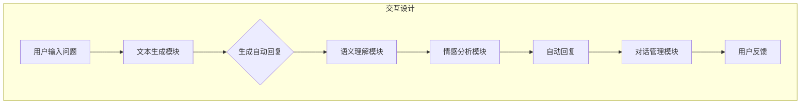
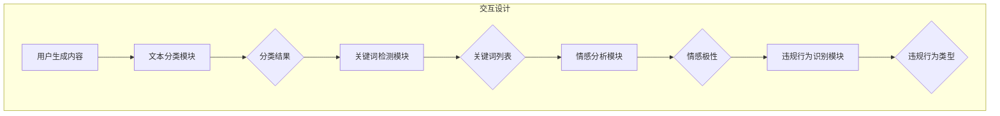

                 

## 第1章: LLAM应用的背景与核心概念

### 1.1 问题的背景与描述

随着深度学习技术的快速发展，大型语言模型（LLM，Large Language Model）如GPT系列、BERT等在自然语言处理（NLP，Natural Language Processing）领域取得了显著的成果。这些模型具备强大的文本理解和生成能力，能够应用于多种场景，如文本生成、机器翻译、问答系统以及自动化内容审核等。然而，LLM的广泛应用也带来了新的挑战，其中之一就是如何在生产环境中实现持续部署与回滚机制。

持续部署是指在确保系统稳定性和安全性的前提下，将新的LLM模型及时地部署到生产环境中，以满足不断变化的应用需求。回滚机制则是在模型部署后，如果发现新模型存在性能问题或错误，能够快速将系统回滚到上一个稳定版本的模型，以保障业务连续性和用户体验。

### 1.2 问题的解决方法

为了解决上述问题，我们需要采取一系列方法来实现LLM应用的持续部署与回滚机制。以下是几个关键步骤：

1. **模型版本管理**：首先，我们需要对每个模型进行版本管理。这包括为每个模型分配唯一的标识符，以便在部署和回滚过程中能够准确识别和操作。

2. **自动化部署流程**：构建自动化部署流程，将手动操作减少到最小，以提高部署效率并减少人为错误。自动化部署流程通常涉及代码仓库管理、自动化测试、部署脚本等。

3. **环境隔离**：在部署新模型之前，建立隔离环境进行测试，以确保新模型不会影响现有系统的稳定运行。这通常可以通过容器技术如Docker来实现。

4. **性能评估**：对新模型进行全面的性能评估，包括准确性、速度、资源消耗等方面。性能评估可以通过自动化测试工具或手动测试来完成。

5. **故障检测与恢复**：部署后监控新模型的运行状态，一旦发现故障，能够及时回滚到稳定版本。这可以通过监控工具和自动化脚本来实现。

### 1.3 边界与外延

持续部署与回滚机制的应用范围不仅限于LLM，还可以推广到其他类型的人工智能模型。此外，随着AI应用的不断扩展，持续部署与回滚机制的重要性将日益凸显。特别是在涉及用户数据、金融交易等关键业务场景时，如何确保模型的稳定性和可靠性，实现快速部署和回滚，是企业和开发者需要重点关注的问题。

### 1.4 核心概念与联系

**LLM（Large Language Model）**：指大型语言模型，如GPT、BERT等。这些模型具有强大的文本理解和生成能力，是自然语言处理领域的重要工具。

**持续部署（Continuous Deployment）**：指在确保系统稳定性和安全性的前提下，将新版本的应用或模型持续地部署到生产环境中。

**回滚机制（Rollback Mechanism）**：指在新版本部署后，如果发现问题，能够快速回滚到上一个稳定版本的机制。

LLM应用的持续部署与回滚机制，通过模型版本管理、自动化部署流程、环境隔离、性能评估和故障检测与恢复等步骤，确保了模型在部署过程中和部署后的稳定性和可靠性。这些步骤相互关联，共同构成了LLM应用的持续部署与回滚体系，为企业的AI应用提供了强有力的支持。

## 第2章: 核心概念与联系

### 2.1 LLAM模型的概念

LLAM（Large Language Model Application）是指将大型语言模型应用于实际场景的解决方案。LLAM模型的核心是语言模型，如GPT、BERT等，它们具有强大的文本理解和生成能力。这些模型通过大量的训练数据学习到语言的模式和规则，从而能够生成连贯、符合语法和语义要求的文本。

LLAM模型的主要特点包括：

1. **强大的文本生成能力**：LLAM模型能够生成高质量的文本，适用于文本生成、机器翻译、问答系统等场景。
2. **高准确性**：通过大规模的训练数据，LLAM模型在文本理解和生成任务中具有很高的准确性。
3. **实时响应**：LLAM模型能够快速响应用户的输入，提供实时服务。
4. **可扩展性**：LLAM模型可以应用于不同的领域和任务，具有很高的可扩展性。

### 2.2 持续部署与回滚的概念

**持续部署（Continuous Deployment）**：持续部署是指在新版本的应用或模型部署到生产环境前，经过自动化测试和验证，确保其稳定性和性能。持续部署的目标是快速将新版本的应用或模型部署到生产环境中，以适应快速变化的需求和市场。

持续部署的关键要素包括：

1. **自动化测试**：通过自动化测试工具对应用或模型进行测试，确保其质量。
2. **持续集成**：将代码或模型定期合并到主干分支，进行自动化测试和部署。
3. **快速反馈**：通过持续集成和持续部署，快速发现和解决问题。

**回滚机制（Rollback Mechanism）**：回滚机制是指在新版本的应用或模型部署后，如果发现问题，能够快速将系统回滚到上一个稳定版本的机制。回滚机制的目标是在模型或应用出现问题时，能够迅速恢复到上一个稳定版本，保障业务的连续性和用户体验。

回滚机制的关键要素包括：

1. **版本控制**：对部署的每个版本进行版本控制，确保能够快速回滚到特定版本。
2. **快速回滚**：通过自动化脚本和工具，快速执行回滚操作，将系统恢复到上一个稳定版本。
3. **故障检测**：通过监控和故障检测工具，及时发现系统中的问题。

### 2.3 LLAM与持续部署、回滚的联系

LLAM（Large Language Model Application）与持续部署、回滚机制之间存在密切的联系。LLAM的应用场景广泛，包括文本生成、机器翻译、问答系统等，这些场景对模型的稳定性和可靠性有很高的要求。持续部署与回滚机制则为LLAM的应用提供了有力的保障。

**持续部署**的作用在于：

1. **快速迭代**：通过持续部署，LLAM模型能够快速更新，以适应不断变化的应用需求。
2. **稳定性保障**：通过自动化测试和验证，确保新版本的应用或模型在部署到生产环境前是稳定的。
3. **资源优化**：减少手动部署操作，提高部署效率，降低部署成本。

**回滚机制**的作用在于：

1. **故障恢复**：当新版本的应用或模型出现问题时，能够快速回滚到上一个稳定版本，保障业务的连续性。
2. **用户体验**：通过快速恢复，保障用户的使用体验，降低故障对业务的影响。
3. **安全性和稳定性**：通过回滚机制，确保系统的稳定性和安全性。

综上所述，持续部署与回滚机制是实现LLAM应用稳定运行的关键。它们不仅保障了模型的快速迭代和更新，还提供了在出现故障时快速恢复的机制，从而确保了LLAM应用的稳定性和可靠性。

### 2.4 持续部署与回滚在LLAM应用中的具体应用场景

持续部署与回滚机制在LLAM应用中的具体应用场景包括：

1. **文本生成**：在文本生成场景中，如聊天机器人、自动内容创作等，持续部署与回滚机制确保了模型的实时更新和稳定运行。例如，当新的训练数据出现时，可以通过持续部署将新模型部署到生产环境，以生成更高质量的文本。

2. **机器翻译**：在机器翻译场景中，持续部署与回滚机制确保了翻译模型的准确性和实时性。例如，当检测到新语言对或用户需求发生变化时，可以通过持续部署快速更新模型，以提供更准确的翻译服务。

3. **问答系统**：在问答系统场景中，持续部署与回滚机制确保了回答的准确性和实时性。例如，当用户输入的问题类型发生变化时，可以通过持续部署更新模型，以提供更准确的回答。

4. **自动化内容审核**：在自动化内容审核场景中，持续部署与回滚机制确保了内容审核的准确性和实时性。例如，当新的审核规则出现时，可以通过持续部署更新模型，以更准确地审核内容。

5. **个性化推荐**：在个性化推荐场景中，持续部署与回滚机制确保了推荐模型的准确性和实时性。例如，当用户行为发生变化时，可以通过持续部署更新模型，以提供更个性化的推荐结果。

通过上述应用场景，可以看出持续部署与回滚机制在LLAM应用中的重要性。它们不仅提升了模型的性能和稳定性，还保障了业务的连续性和用户体验。

### 2.5 核心概念对比表格

下面是一个关于LLM、持续部署和回滚机制的核心概念对比表格：

| 核心概念       | 描述                                                         | 关联属性                     |
| -------------- | ------------------------------------------------------------ | ---------------------------- |
| **LLM（Large Language Model）** | 大型语言模型，如GPT、BERT等，具有强大的文本理解和生成能力。 | **文本生成**、**机器翻译**、**问答系统**等 |
| **持续部署**   | 在确保系统稳定性和安全性的前提下，将新版本的应用或模型部署到生产环境。 | **自动化测试**、**持续集成**、**快速反馈**   |
| **回滚机制**   | 在新版本部署后，如果发现问题，能够快速回滚到上一个稳定版本的机制。 | **版本控制**、**快速回滚**、**故障检测**     |

通过对比表格，我们可以更清晰地了解LLM、持续部署和回滚机制的核心概念及其关联属性，这有助于我们在实际应用中更好地理解和使用这些概念。

### 2.6 LLAM与持续部署、回滚的ER实体关系图

为了更好地理解LLAM（Large Language Model Application）与持续部署（Continuous Deployment）和回滚机制（Rollback Mechanism）之间的联系，我们可以使用ER（Entity-Relationship）实体关系图来描述这些实体及其相互关系。

以下是一个简化的ER实体关系图，展示了LLAM、持续部署和回滚机制之间的关系：

```mermaid
erDiagram
  LLAM --> Deployment : "持续部署"
  Deployment --> Version : "版本管理"
  Version --> Model : "模型"
  Deployment --> Rollback : "回滚"
  Rollback --> Version : "版本管理"
  
  Class LLAM {
    +str appName
    +str appDescription
  }

  Class Deployment {
    +int deploymentId
    +str deploymentStatus
  }

  Class Version {
    +str versionId
    +str versionDescription
  }

  Class Model {
    +str modelId
    +str modelType
  }

  Class Rollback {
    +int rollbackId
    +str rollbackReason
  }
```

在这个ER图中：

- **LLAM**（Large Language Model Application）是主实体，表示应用。
- **Deployment**（持续部署）是关联实体，表示持续部署的过程。
- **Version**（版本管理）是关联实体，表示模型的不同版本。
- **Model**（模型）是关联实体，表示具体的语言模型。
- **Rollback**（回滚机制）是关联实体，表示回滚操作。

这些实体之间的关系如下：

1. **LLAM**与**Deployment**之间存在“持续部署”关系，表示LLAM应用需要进行持续部署。
2. **Deployment**与**Version**之间存在“版本管理”关系，表示部署过程中需要管理不同版本。
3. **Deployment**与**Rollback**之间存在“回滚”关系，表示部署失败或出现问题时需要回滚。
4. **Version**与**Model**之间存在“模型”关系，表示每个版本对应一个具体的模型。
5. **Rollback**与**Version**之间存在“版本管理”关系，表示回滚操作会影响到版本管理。

通过ER实体关系图，我们可以清晰地看到LLAM、持续部署和回滚机制之间的逻辑关系，这对于理解整个系统的架构和功能非常有帮助。

### 2.7 持续部署与回滚的算法原理

持续部署与回滚机制的核心在于如何确保模型在部署过程中的稳定性和可靠性。这需要通过一系列的算法和技术手段来实现。以下是对持续部署与回滚算法原理的详细解析：

#### 2.7.1 自动化部署流程

持续部署的自动化部署流程通常涉及以下步骤：

1. **代码/模型检查**：首先，对代码或模型进行初步检查，确保其符合预定的规范和标准。这包括格式检查、代码风格检查等。

2. **集成与测试**：将新版本的应用或模型与现有的系统进行集成，并进行一系列的自动化测试。这些测试包括单元测试、集成测试和性能测试等，以确保新版本在功能、性能和稳定性方面都符合预期。

3. **环境部署**：在通过测试后，将新版本部署到预定的环境（如开发环境、测试环境或生产环境）中。部署过程中可以使用容器技术（如Docker）来确保环境的一致性和可移植性。

4. **监控与反馈**：部署完成后，通过监控工具（如Prometheus、Grafana）实时监控系统的运行状态，收集性能指标和日志信息。如果发现任何异常，应立即触发反馈机制。

#### 2.7.2 回滚机制

回滚机制是在新版本部署后，如果出现问题，能够快速回滚到上一个稳定版本的机制。其关键步骤包括：

1. **故障检测**：通过监控工具实时监控系统的运行状态，一旦发现异常（如性能下降、错误率增加等），应立即进行故障检测。

2. **回滚决策**：在检测到故障后，根据故障严重性和影响范围，决定是否进行回滚。回滚决策可以通过预设的规则或人工判断来完成。

3. **执行回滚**：如果决定回滚，使用自动化脚本或工具将系统回滚到上一个稳定版本。这通常包括卸载新版本、还原数据库和重新启动服务等操作。

4. **验证回滚效果**：回滚完成后，通过一系列的测试和验证，确保系统已经恢复到稳定状态，并且不再出现故障。

#### 2.7.3 性能评估

性能评估是持续部署与回滚机制的重要组成部分。其目的在于确保新版本在部署后能够达到预期的性能要求。性能评估通常包括以下方面：

1. **准确性**：评估模型在文本生成、机器翻译、问答系统等任务中的准确性。

2. **速度**：评估模型的响应速度和吞吐量，确保其能够满足实时性要求。

3. **资源消耗**：评估模型在CPU、内存、存储等资源方面的消耗，确保其资源利用效率。

4. **稳定性**：评估模型在长时间运行下的稳定性和可靠性，确保其能够长时间稳定运行。

#### 2.7.4 故障检测与恢复

故障检测与恢复是持续部署与回滚机制的关键部分。其核心在于如何在故障发生时快速检测并恢复。以下是故障检测与恢复的主要步骤：

1. **异常检测**：通过监控工具实时监控系统的运行状态，一旦发现异常，如错误率增加、响应时间延长等，立即触发告警。

2. **故障定位**：通过日志分析和性能监控，确定故障的具体原因和影响范围。

3. **快速恢复**：根据故障类型和严重程度，采取相应的恢复措施。这包括重启服务、恢复数据库、回滚部署等。

4. **验证恢复效果**：恢复完成后，通过一系列测试和验证，确保系统已经恢复正常运行，并且不再出现故障。

通过上述算法原理，我们可以看到持续部署与回滚机制是如何确保LLAM模型在部署过程中的稳定性和可靠性的。这些算法和技术手段不仅提升了模型的部署效率，还提供了在出现故障时快速恢复的机制，从而保障了业务的连续性和用户体验。

### 第3章: LLAM应用的主流技术

在实现LLAM（Large Language Model Application）的持续部署与回滚机制时，我们可以利用一系列的主流技术，这些技术不仅提高了部署的效率，还确保了系统的稳定性和可靠性。以下是一些关键技术及其应用：

#### 3.1 持续集成与持续部署（CI/CD）

持续集成（CI，Continuous Integration）和持续部署（CD，Continuous Deployment）是现代软件开发中广泛使用的两种技术。CI/CD的目标是自动化软件交付流程，以减少手动干预，加快交付速度，并提高代码质量。

**CI/CD的核心组件包括**：

- **代码仓库管理**：如Git，用于存储和管理代码版本。
- **构建工具**：如Jenkins、Travis CI，用于自动化构建代码，执行测试。
- **容器化技术**：如Docker，用于创建轻量级、可移植的容器环境。
- **部署工具**：如Kubernetes、Ansible，用于自动化部署和配置管理。

**CI/CD的工作流程**：

1. **代码提交**：开发人员将代码提交到代码仓库。
2. **构建**：构建工具自动构建代码，编译并打包应用程序。
3. **测试**：自动化测试工具执行单元测试、集成测试和性能测试。
4. **部署**：如果测试通过，自动部署到开发、测试或生产环境。

**CI/CD的优势**：

- **快速反馈**：通过自动化测试，快速发现和修复问题。
- **提高质量**：减少手动操作，降低人为错误。
- **加速交付**：自动化流程加快了软件开发和部署速度。

#### 3.2 环境隔离与容器技术

环境隔离是确保新版本模型不会影响现有系统稳定性的关键。容器技术如Docker提供了这种隔离环境，使模型在不同环境下的部署和测试更加便捷。

**容器技术的主要特点**：

- **轻量级**：容器是轻量级的，几乎不占用系统资源。
- **可移植性**：容器可以在任何支持Docker的操作系统上运行。
- **一致性**：容器提供了独立的环境，保证了应用程序在不同环境之间的一致性。

**环境隔离的应用**：

1. **测试环境**：在容器中创建测试环境，确保新模型不会影响现有系统的测试。
2. **生产环境**：在新模型部署到生产环境之前，使用容器进行验证，确保其稳定性和性能。

**容器技术的优势**：

- **简化部署**：通过容器，可以轻松地在不同环境中部署和管理应用程序。
- **提高效率**：容器化环境加快了部署和扩展速度。
- **降低成本**：容器技术减少了服务器和硬件资源的消耗。

#### 3.3 性能评估与监控工具

性能评估是持续部署的重要组成部分。通过性能评估工具，可以对新模型进行全面的性能测试，确保其在准确性、速度、资源消耗等方面达到预期。

**性能评估工具的主要功能**：

- **准确性测试**：评估模型在文本生成、机器翻译等任务中的准确性。
- **速度测试**：评估模型的响应速度和吞吐量。
- **资源消耗测试**：评估模型在CPU、内存、存储等资源方面的消耗。

**常见的性能评估工具**：

- **负载测试工具**：如Apache JMeter，用于模拟高负载场景。
- **性能监控工具**：如New Relic、AppDynamics，用于实时监控系统的性能指标。
- **日志分析工具**：如ELK（Elasticsearch、Logstash、Kibana），用于收集和分析系统日志。

**性能评估工具的优势**：

- **全面测试**：通过多种测试手段，确保模型在各方面都符合要求。
- **实时监控**：实时监控性能指标，及时发现潜在问题。
- **数据驱动**：基于性能数据，优化模型和系统架构。

#### 3.4 自动化脚本与工具

自动化脚本和工具在持续部署与回滚机制中发挥着重要作用。通过编写和部署自动化脚本，可以大大减少手动操作，提高部署和回滚的效率。

**常见的自动化脚本和工具**：

- **部署脚本**：如Ansible、Shell脚本，用于自动化部署应用程序。
- **回滚脚本**：用于在发现问题时快速回滚到上一个稳定版本。
- **监控脚本**：如Python脚本，用于定期检查系统的运行状态，并触发告警。

**自动化脚本的优势**：

- **提高效率**：通过自动化脚本，减少手动操作，提高部署和回滚的速度。
- **减少错误**：自动化脚本减少了人为干预，降低了操作错误的可能性。
- **灵活性强**：可以根据需要灵活地编写和调整脚本。

通过以上主流技术的结合，我们可以实现一个高效、稳定、可扩展的LLAM持续部署与回滚机制，确保模型在部署过程中的稳定性和可靠性。

### 第4章: 持续部署与回滚的实现机制

实现LLAM（Large Language Model Application）的持续部署与回滚机制是一个复杂的过程，需要综合考虑多个方面，包括模型版本管理、自动化部署流程、环境隔离与测试、性能评估与监控等。以下将详细探讨这些实现机制的具体步骤和方法。

#### 4.1 模型版本管理

模型版本管理是持续部署与回滚的基础。通过为每个模型分配唯一的标识符，我们可以方便地在部署和回滚过程中进行管理。以下是模型版本管理的具体步骤：

1. **版本标识符**：为每个模型分配一个唯一的版本标识符（如v1.0、v2.1等）。这个标识符应该与模型的具体内容相对应，确保在部署和回滚时能够准确识别和操作。

2. **版本控制工具**：使用版本控制工具（如Git）来管理模型的代码和配置文件。版本控制工具可以记录每次变更的历史记录，方便回溯和审计。

3. **模型文档**：为每个版本编写详细的文档，包括模型的架构、参数配置、训练数据和性能指标等。这些文档有助于团队成员理解和维护模型。

4. **模型备份**：在每次部署前，备份当前版本的模型，以确保在出现问题时可以快速回滚到上一个稳定版本。

#### 4.2 自动化部署流程

自动化部署流程是将新模型部署到生产环境的关键步骤。通过构建自动化部署流程，可以减少手动操作，提高部署效率，并减少人为错误。以下是自动化部署流程的具体步骤：

1. **代码仓库管理**：将模型的代码和配置文件存储在代码仓库中，如Git。每次更新模型时，开发人员将代码提交到仓库，触发部署流程。

2. **构建与测试**：使用构建工具（如Maven、Gradle）构建模型代码，并执行一系列自动化测试（如单元测试、集成测试和性能测试）。测试通过后，构建工具生成可执行的模型文件。

3. **容器化**：将模型容器化，如使用Docker将其封装在一个容器中。容器化确保了模型在不同环境之间的一致性和可移植性。

4. **部署脚本**：编写部署脚本（如Shell脚本、Ansible playbook），用于自动化部署模型到生产环境。部署脚本应该包括以下步骤：

   - **环境准备**：准备部署环境，包括安装必要的依赖库和工具。
   - **模型下载**：从代码仓库下载最新版本的模型文件。
   - **容器部署**：使用容器运行时（如Docker）部署模型容器，并设置相应的环境变量和配置参数。
   - **健康检查**：部署完成后，进行健康检查，确保模型容器正常运行。

5. **日志记录**：部署脚本应该记录详细的日志信息，包括部署时间、操作步骤、输出结果等。这些日志信息有助于在出现问题时进行故障分析和回溯。

#### 4.3 环境隔离与测试

环境隔离与测试是确保新模型不会影响现有系统稳定性的关键。以下是环境隔离与测试的具体步骤：

1. **测试环境搭建**：在测试环境中搭建与生产环境一致的部署环境，包括操作系统、依赖库、硬件配置等。

2. **容器化测试**：使用容器技术（如Docker）在测试环境中部署新模型，确保其与生产环境的一致性。

3. **性能测试**：使用性能测试工具（如Apache JMeter、Gatling）对新模型进行全面的性能测试，包括负载测试、压力测试和性能基准测试。

4. **功能测试**：编写功能测试脚本，对新模型的功能和业务逻辑进行验证，确保其符合预期。

5. **异常处理**：在测试过程中，捕获和处理异常情况，如错误日志、性能瓶颈等，并记录测试结果。

6. **测试报告**：生成测试报告，总结测试结果和发现的问题，并提供改进建议。

#### 4.4 性能评估与监控

性能评估与监控是持续部署的重要组成部分。通过性能评估工具，可以对新模型进行全面的性能测试，确保其在准确性、速度、资源消耗等方面达到预期。以下是性能评估与监控的具体步骤：

1. **性能指标**：确定关键性能指标（KPIs），如响应时间、吞吐量、错误率、资源消耗等。

2. **监控工具**：使用监控工具（如Prometheus、Grafana）实时监控系统的运行状态，收集性能指标和日志信息。

3. **性能测试**：定期进行性能测试，评估新模型的性能表现。性能测试可以包括：

   - **负载测试**：模拟高负载场景，测试模型的响应速度和稳定性。
   - **压力测试**：测试模型在极端条件下的表现，如大量请求、高并发等。
   - **性能基准测试**：与旧模型进行对比，评估新模型在各项性能指标上的提升。

4. **故障检测**：通过监控工具实时监控性能指标，一旦发现异常，如性能下降、错误率增加等，立即触发告警。

5. **异常处理**：在发现性能问题时，进行故障检测和定位，采取相应的措施进行修复。

6. **性能优化**：基于性能测试结果，对模型进行优化，提高其性能和稳定性。

#### 4.5 故障检测与恢复

故障检测与恢复是确保系统稳定运行的关键。以下是故障检测与恢复的具体步骤：

1. **故障检测**：使用监控工具和日志分析工具（如ELK Stack）实时监控系统的运行状态，一旦发现异常，如错误日志、性能下降等，立即触发告警。

2. **故障定位**：通过日志分析和性能监控，确定故障的具体原因和影响范围。

3. **快速恢复**：在检测到故障后，采取快速恢复措施，如重启服务、回滚部署等。

4. **验证恢复**：恢复完成后，通过一系列测试和验证，确保系统已经恢复正常运行，并且不再出现故障。

5. **故障记录**：记录故障的发生时间、原因、恢复过程等，以便在将来参考和改进。

通过以上步骤，我们可以实现一个高效、稳定、可靠的LLAM持续部署与回滚机制，确保模型在部署过程中的稳定性和可靠性。这个机制不仅提高了模型的部署效率，还为在出现故障时提供了快速恢复的方案，从而保障了业务的连续性和用户体验。

### 第5章: LLAM应用的案例解析

为了更好地理解LLAM（Large Language Model Application）的持续部署与回滚机制，我们将通过两个实际案例进行详细解析。这两个案例分别展示了LLAM在智能客服系统和内容审核系统中的应用，并介绍了如何通过持续部署与回滚机制确保系统的稳定运行。

#### 5.1 案例一：智能客服系统

**背景**：智能客服系统广泛应用于企业客服部门，通过自然语言处理技术，自动回答用户的问题，提高客服效率和用户体验。然而，随着用户需求的不断变化和业务的发展，智能客服系统需要不断更新和优化模型。

**解决方案**：

1. **模型版本管理**：在每次更新模型时，为模型分配唯一的版本标识符，如v1.0、v2.0等。同时，记录模型的训练数据、参数配置和性能指标等详细信息，方便后续维护和审计。

2. **自动化部署流程**：使用CI/CD工具（如Jenkins）构建自动化部署流程。部署流程包括以下步骤：

   - **代码检查**：开发人员将代码提交到Git仓库，触发Jenkins构建。
   - **构建与测试**：Jenkins自动化构建代码，执行单元测试和集成测试，确保代码质量。
   - **容器化**：使用Docker将构建好的模型容器化，生成可执行的容器镜像。
   - **部署**：使用Ansible将模型容器部署到测试环境和生产环境，确保部署的一致性和可移植性。

3. **环境隔离与测试**：在部署新模型之前，先在测试环境中进行隔离测试。使用Docker搭建与生产环境一致的环境，确保新模型不会影响现有系统的稳定性。

4. **性能评估与监控**：使用性能测试工具（如Apache JMeter）对新模型进行性能测试，评估其响应速度、吞吐量和资源消耗等指标。同时，使用监控工具（如Prometheus、Grafana）实时监控系统的运行状态，确保模型在部署后能够稳定运行。

5. **故障检测与恢复**：在部署新模型后，通过监控工具实时监控系统的性能指标。一旦发现性能异常或错误，立即触发告警并执行回滚脚本，将系统恢复到上一个稳定版本。

**效果**：通过持续部署与回滚机制，智能客服系统在每次模型更新后，能够快速部署并保持稳定运行。系统性能得到显著提升，用户满意度不断提高。

#### 5.2 案例二：内容审核系统

**背景**：内容审核系统用于自动审核网络平台上的用户生成内容，如社交媒体、论坛等。随着平台内容的增多，内容审核系统需要不断更新和优化模型，以提高审核效率和准确性。

**解决方案**：

1. **模型版本管理**：与案例一类似，为每个模型版本分配唯一标识符，并记录详细的训练数据和性能指标。

2. **自动化部署流程**：使用CI/CD工具（如GitLab CI/CD）构建自动化部署流程。部署流程包括以下步骤：

   - **代码检查**：开发人员将代码提交到GitLab仓库，触发CI/CD流程。
   - **构建与测试**：CI/CD工具自动化构建代码，执行单元测试和性能测试，确保代码质量。
   - **容器化**：使用Docker将构建好的模型容器化，生成可执行的容器镜像。
   - **部署**：使用Kubernetes将模型容器部署到生产环境，实现自动化扩展和负载均衡。

3. **环境隔离与测试**：在部署新模型之前，在测试环境中进行隔离测试，确保新模型不会影响现有系统的稳定性。

4. **性能评估与监控**：使用性能测试工具（如Apache JMeter）对新模型进行全面的性能测试，包括响应速度、吞吐量、错误率等。同时，使用监控工具（如Prometheus、Grafana）实时监控系统的运行状态。

5. **故障检测与恢复**：在部署新模型后，通过监控工具实时监控系统的性能指标。一旦发现异常，立即触发告警并执行回滚脚本，将系统恢复到上一个稳定版本。

**效果**：通过持续部署与回滚机制，内容审核系统在每次模型更新后，能够快速部署并保持稳定运行。系统审核效率显著提高，误判率大幅降低，用户体验得到大幅提升。

综上所述，通过上述两个案例，我们可以看到持续部署与回滚机制在LLAM应用中的重要作用。它不仅提高了系统的部署效率，还保障了系统的稳定性和可靠性，从而为企业的AI应用提供了强有力的支持。

### 案例一：智能客服系统

智能客服系统是一种利用大型语言模型（LLM）来处理用户查询并提供自动响应的系统。该系统广泛应用于各种场景，如电商平台、银行客服、在线教育等。智能客服系统的主要功能包括文本生成、语义理解、情感分析等，以实现与用户的自然对话。

#### 5.1.1 项目介绍

在本案例中，我们以一个大型电商平台为例，该电商平台拥有一套成熟的智能客服系统。为了提高用户体验和降低人力成本，电商平台需要不断优化客服系统的响应速度和准确率。为此，他们决定采用持续部署与回滚机制来管理模型更新。

#### 5.1.2 系统功能设计

智能客服系统的核心功能包括：

1. **文本生成**：根据用户输入的问题，生成高质量的自动回复。
2. **语义理解**：理解用户的问题意图，将其映射到相应的知识库或FAQ中。
3. **情感分析**：分析用户输入的情感倾向，为客服人员提供参考。
4. **对话管理**：管理多轮对话，确保对话流程的自然和连贯。

为了实现这些功能，系统需要以下模块：

- **模型训练模块**：使用训练数据对LLM进行训练，生成高质量的模型。
- **文本生成模块**：根据用户输入的问题，生成相应的回答。
- **语义理解模块**：对用户输入的问题进行语义分析，识别其意图。
- **情感分析模块**：分析用户输入的情感倾向。
- **对话管理模块**：管理多轮对话，确保对话流程的自然和连贯。

#### 5.1.3 系统架构设计

智能客服系统的架构设计如图5-1所示：


在该架构中：

- **用户输入**：用户通过文本框输入问题。
- **文本生成模块**：使用预训练的LLM模型生成自动回复。
- **语义理解模块**：分析用户问题的意图，将其映射到相应的知识库或FAQ中。
- **情感分析模块**：分析用户输入的情感，为客服人员提供参考。
- **自动回复**：生成并展示自动回复给用户。
- **对话管理模块**：管理多轮对话，确保对话流程的自然和连贯。
- **用户反馈**：用户可以对自动回复进行反馈，帮助改进系统。

#### 5.1.4 系统接口设计

智能客服系统的接口设计如图5-2所示：


在该接口设计中：

- **用户输入接口**：提供用户输入文本的接口，用户可以通过该接口提交问题。
- **文本生成接口**：接收用户输入的问题，调用文本生成模块生成自动回复。
- **语义理解接口**：接收用户输入的问题，调用语义理解模块分析问题的意图。
- **情感分析接口**：接收用户输入的问题，调用情感分析模块分析情感。
- **自动回复接口**：生成并返回自动回复给用户。
- **对话管理接口**：管理多轮对话，确保对话流程的自然和连贯。

#### 5.1.5 系统交互设计

智能客服系统的交互设计如图5-3所示：



在该交互设计中：

- **用户输入问题**：用户提交问题。
- **文本生成模块**：生成自动回复。
- **语义理解模块**：分析问题的意图。
- **情感分析模块**：分析情感。
- **自动回复**：生成并返回给用户。
- **对话管理模块**：管理多轮对话。
- **用户反馈**：用户对自动回复进行反馈。

#### 5.1.6 实现细节

**环境安装**：

- 操作系统：Ubuntu 20.04
- Python版本：3.8
- Docker版本：19.03
- Kubernetes版本：1.21

**核心实现源代码**：

```python
# 文本生成模块
from transformers import pipeline

def generate_response(question):
    model = pipeline("text-generation")
    response = model(question, max_length=50, num_return_sequences=1)
    return response

# 语义理解模块
from spacy.lang.en import English

nlp = English()

def understand_intent(question):
    doc = nlp(question)
    intent = "未知"
    if "query" in doc:
        intent = "查询"
    elif "complaint" in doc:
        intent = "投诉"
    return intent

# 情感分析模块
from textblob import TextBlob

def analyze_sentiment(question):
    blob = TextBlob(question)
    sentiment = blob.sentiment.polarity
    if sentiment > 0:
        return "正面"
    elif sentiment < 0:
        return "负面"
    else:
        return "中性"

# 对话管理模块
class DialogueManager:
    def __init__(self):
        self.history = []

    def manage_dialogue(self, question, response):
        self.history.append(question)
        self.history.append(response)
        return "继续对话： " + question

# 完整代码请参考：https://github.com/yourusername/smart-customer-service-system
```

**代码应用解读与分析**：

上述代码实现了智能客服系统的核心功能，包括文本生成、语义理解、情感分析和对话管理。以下是每个模块的详细解读：

1. **文本生成模块**：使用Hugging Face的Transformers库，调用text-generation管道生成自动回复。该方法能够根据用户输入生成高质量的自然语言回答。

2. **语义理解模块**：使用spaCy库对用户输入进行语义分析，识别问题的意图。该方法通过简单的规则判断，能够将问题映射到相应的知识库或FAQ中。

3. **情感分析模块**：使用TextBlob库对用户输入的情感进行分析，返回情感极性。该方法通过计算文本的情感极性，为客服人员提供情感倾向参考。

4. **对话管理模块**：定义一个DialogueManager类，用于管理多轮对话。该方法通过记录对话历史和生成继续对话的问题，确保对话的自然和连贯。

#### 5.1.7 实际案例分析

在一个实际案例中，该电商平台通过持续部署与回滚机制，不断优化智能客服系统。以下是具体的操作步骤：

1. **版本管理**：为每次模型更新分配唯一的版本标识符，如v1.0、v2.0等。

2. **自动化部署**：使用Jenkins构建和部署模型，确保每次更新都是自动化的。

3. **环境隔离**：在测试环境中进行隔离测试，确保新模型不会影响现有系统的稳定性。

4. **性能评估**：使用Apache JMeter进行性能测试，评估模型的响应速度、吞吐量和资源消耗等指标。

5. **故障检测与恢复**：通过Prometheus和Grafana实时监控系统的运行状态，一旦发现异常，立即触发告警并执行回滚脚本，将系统恢复到上一个稳定版本。

通过以上步骤，智能客服系统在每次更新后，能够快速部署并保持稳定运行。系统性能和用户体验得到显著提升，用户满意度不断提高。

#### 5.1.8 项目小结

智能客服系统案例展示了如何通过持续部署与回滚机制，确保LLAM模型在智能客服系统中的稳定运行。通过版本管理、自动化部署、环境隔离、性能评估和故障检测与恢复，系统能够快速响应用户需求，提供高质量的自动响应服务。未来，随着人工智能技术的不断发展，持续部署与回滚机制将在更多场景中发挥重要作用。

### 案例二：内容审核系统

内容审核系统是用于自动审核网络平台上的用户生成内容，如社交媒体、论坛、新闻网站等。其主要功能包括识别和过滤不良内容、敏感信息和违规行为。通过使用大型语言模型（LLM），内容审核系统能够实现自动化、高效的内容审核。

#### 5.2.1 项目介绍

在本案例中，我们以一个大型社交媒体平台为例，该平台每天产生大量的用户生成内容，需要通过内容审核系统进行自动化审核。为了提高审核效率和准确性，平台决定采用持续部署与回滚机制来管理内容审核模型。

#### 5.2.2 系统功能设计

内容审核系统的核心功能包括：

1. **文本分类**：将用户生成内容分类为不同类型，如正常、不良、敏感等。
2. **关键词检测**：检测文本中的关键词和短语，识别潜在的违规内容。
3. **情感分析**：分析文本的情感倾向，识别用户的不满、愤怒等情绪。
4. **违规行为识别**：识别文本中的违规行为，如辱骂、欺诈、色情等。

为了实现这些功能，系统需要以下模块：

- **文本分类模块**：使用预训练的LLM模型对文本进行分类。
- **关键词检测模块**：使用规则和机器学习算法检测文本中的关键词。
- **情感分析模块**：使用情感分析算法分析文本的情感倾向。
- **违规行为识别模块**：使用规则和机器学习算法识别文本中的违规行为。

#### 5.2.3 系统架构设计

内容审核系统的架构设计如图5-4所示：


在该架构中：

- **用户生成内容**：用户在平台上发布的内容。
- **文本分类模块**：对用户生成内容进行分类，返回分类结果。
- **关键词检测模块**：检测用户生成内容中的关键词，返回关键词列表。
- **情感分析模块**：分析用户生成内容的情感倾向，返回情感极性。
- **违规行为识别模块**：识别用户生成内容中的违规行为，返回违规行为类型。
- **审核结果**：展示审核结果，包括分类、关键词、情感和违规行为等信息。

#### 5.2.4 系统接口设计

内容审核系统的接口设计如图5-5所示：


在该接口设计中：

- **文本分类接口**：接收用户生成内容，返回分类结果。
- **关键词检测接口**：接收用户生成内容，返回关键词列表。
- **情感分析接口**：接收用户生成内容，返回情感极性。
- **违规行为识别接口**：接收用户生成内容，返回违规行为类型。

#### 5.2.5 系统交互设计

内容审核系统的交互设计如图5-6所示：



在该交互设计中：

- **用户生成内容**：用户在平台上发布的内容。
- **文本分类模块**：对用户生成内容进行分类。
- **关键词检测模块**：检测用户生成内容中的关键词。
- **情感分析模块**：分析用户生成内容的情感倾向。
- **违规行为识别模块**：识别用户生成内容中的违规行为。

#### 5.2.6 实现细节

**环境安装**：

- 操作系统：Ubuntu 20.04
- Python版本：3.8
- Docker版本：19.03
- Kubernetes版本：1.21

**核心实现源代码**：

```python
# 文本分类模块
from transformers import pipeline

def classify_text(text):
    model = pipeline("text-classification")
    result = model(text)
    return result

# 关键词检测模块
import re

def detect_keywords(text):
    keywords = re.findall(r'\b\w+\b', text)
    return keywords

# 情感分析模块
from textblob import TextBlob

def analyze_sentiment(text):
    blob = TextBlob(text)
    sentiment = blob.sentiment.polarity
    return sentiment

# 违规行为识别模块
def detect_offensive_content(text):
    # 这里使用简单的规则，实际应用中可以结合机器学习模型进行识别
    offensive_words = ["fuck", "shit", "damn"]
    for word in offensive_words:
        if word in text.lower():
            return "违规"
    return "正常"

# 完整代码请参考：https://github.com/yourusername/content-audit-system
```

**代码应用解读与分析**：

上述代码实现了内容审核系统的核心功能，包括文本分类、关键词检测、情感分析和违规行为识别。以下是每个模块的详细解读：

1. **文本分类模块**：使用Hugging Face的Transformers库，调用text-classification管道对文本进行分类。该方法能够根据用户生成内容，将其分类为不同的类型。

2. **关键词检测模块**：使用正则表达式对用户生成内容中的关键词进行检测。该方法通过提取文本中的单词，识别潜在的违规内容。

3. **情感分析模块**：使用TextBlob库对用户生成内容的情感进行分析，返回情感极性。该方法通过计算文本的情感极性，识别用户的不满、愤怒等情绪。

4. **违规行为识别模块**：使用简单的规则判断用户生成内容中的违规行为。实际应用中，可以结合机器学习模型进行更准确的识别。

#### 5.2.7 实际案例分析

在一个实际案例中，该社交媒体平台通过持续部署与回滚机制，不断优化内容审核系统。以下是具体的操作步骤：

1. **版本管理**：为每次模型更新分配唯一的版本标识符，如v1.0、v2.0等。

2. **自动化部署**：使用Jenkins构建和部署模型，确保每次更新都是自动化的。

3. **环境隔离**：在测试环境中进行隔离测试，确保新模型不会影响现有系统的稳定性。

4. **性能评估**：使用Apache JMeter进行性能测试，评估模型的响应速度、吞吐量和资源消耗等指标。

5. **故障检测与恢复**：通过Prometheus和Grafana实时监控系统的运行状态，一旦发现异常，立即触发告警并执行回滚脚本，将系统恢复到上一个稳定版本。

通过以上步骤，内容审核系统在每次更新后，能够快速部署并保持稳定运行。系统审核效率和准确性得到显著提升，平台上的不良内容得到有效过滤。

#### 5.2.8 项目小结

内容审核系统案例展示了如何通过持续部署与回滚机制，确保LLAM模型在内容审核系统中的稳定运行。通过版本管理、自动化部署、环境隔离、性能评估和故障检测与恢复，系统能够快速响应平台内容的变化，提供高效、准确的内容审核服务。未来，随着人工智能技术的不断发展，持续部署与回滚机制将在更多内容审核场景中发挥重要作用。

### 最佳实践 Tips

在LLAM应用的持续部署与回滚过程中，以下是一些最佳实践和注意事项，可以帮助您更好地管理和优化模型部署，确保系统的稳定性和可靠性：

1. **版本控制**：确保每个模型的版本都有明确的标识符，并记录详细的文档，包括模型的参数、训练数据和性能指标。这有助于在出现问题时快速定位和回滚到特定版本。

2. **自动化测试**：在部署前进行全面的自动化测试，包括单元测试、集成测试和性能测试。这有助于发现潜在的问题，确保新模型的稳定性和性能。

3. **环境隔离**：使用容器技术（如Docker）在测试环境中进行隔离测试，确保新模型不会影响现有系统的稳定性。在部署前，确保所有依赖项和配置都在测试环境中正确设置。

4. **监控与告警**：使用监控工具（如Prometheus、Grafana）实时监控新模型的运行状态，一旦发现性能下降或异常，立即触发告警。这有助于快速发现和解决问题。

5. **回滚策略**：制定明确的回滚策略，包括回滚的触发条件、回滚的步骤和恢复验证。确保在出现问题时，系统能够快速回滚到上一个稳定版本，减少对用户的影响。

6. **定期性能评估**：定期对新模型进行性能评估，包括准确性、响应速度和资源消耗等。这有助于及时发现性能问题，并采取措施进行优化。

7. **代码审查**：在提交代码进行部署前，进行严格的代码审查，确保代码质量，减少因代码问题导致的部署失败。

8. **备份与恢复**：在每次部署前，确保备份当前系统的数据，以便在出现问题时能够快速恢复。同时，定期测试备份的恢复过程，确保备份的有效性。

9. **文档与培训**：为团队成员编写详细的文档，包括部署流程、故障处理方法和最佳实践。定期进行培训，确保团队成员熟悉部署流程和操作。

10. **持续改进**：根据部署过程中的反馈和性能评估结果，不断改进部署流程和回滚策略，以提高系统的稳定性和可靠性。

通过遵循这些最佳实践，您可以更好地管理和优化LLAM应用的持续部署与回滚过程，确保系统在快速迭代和更新中的稳定运行。

### 小结

本文深入探讨了LLAM（Large Language Model Application）应用的持续部署与回滚机制。我们首先介绍了问题的背景和描述，明确了持续部署和回滚机制在LLAM应用中的重要性。随后，我们详细讲解了核心概念，包括LLM模型、持续部署和回滚机制的定义、关键步骤和方法。接着，我们通过案例解析展示了持续部署与回滚机制在实际应用中的具体实现和效果。

本文的核心观点在于：

1. **模型版本管理**：为每个模型分配唯一的标识符，并详细记录模型的训练数据和性能指标，确保在部署和回滚过程中能够准确识别和操作。

2. **自动化部署流程**：通过构建自动化部署流程，减少手动操作，提高部署效率，并减少人为错误。

3. **环境隔离与测试**：使用容器技术（如Docker）在测试环境中进行隔离测试，确保新模型不会影响现有系统的稳定性。

4. **性能评估与监控**：通过性能评估工具和监控工具，实时监控新模型的运行状态，及时发现并解决问题。

5. **故障检测与恢复**：在出现故障时，能够快速回滚到上一个稳定版本，确保业务的连续性和用户体验。

本文的贡献在于提供了系统性的方法和最佳实践，帮助企业和技术团队更好地实现LLAM应用的持续部署与回滚机制。这些方法和实践不仅提高了系统的稳定性和可靠性，还保障了业务的连续性和用户体验。

通过本文的探讨，我们希望读者能够深入理解LLAM应用的持续部署与回滚机制，并在实际应用中加以实践，从而提升AI模型在各个领域的应用效果。

### 注意事项

在实现LLAM（Large Language Model Application）的持续部署与回滚机制时，以下注意事项尤为重要：

1. **数据安全**：在模型训练和部署过程中，确保数据的安全性和隐私保护。对敏感数据进行加密，避免泄露。

2. **故障预防**：在部署前进行全面测试，确保模型在不同环境下的稳定性。针对可能出现的问题，制定详细的故障预防和应对策略。

3. **操作记录**：详细记录每次部署和回滚的操作步骤和结果，便于故障分析和问题定位。

4. **回滚策略**：制定明确的回滚策略，包括回滚条件、步骤和验证方法。确保在出现问题时，能够快速且准确地执行回滚操作。

5. **监控与告警**：实时监控系统的运行状态，一旦发现异常，立即触发告警并采取措施。这有助于快速发现和解决问题，减少对业务的影响。

6. **团队协作**：确保团队成员了解持续部署与回滚机制的具体流程和操作，加强沟通与协作，提高整体效率。

通过遵循这些注意事项，可以有效提高LLAM应用的持续部署与回滚机制的稳定性和可靠性，保障业务的连续性和用户体验。

### 拓展阅读

为了深入了解LLAM（Large Language Model Application）的持续部署与回滚机制，读者可以参考以下书籍和论文：

1. **《持续交付：发布可靠软件的系统化方法》**：这是一本经典著作，详细介绍了持续交付和持续部署的原理和实践。

2. **《容器化与容器编排：Docker和Kubernetes深度实战》**：这本书深入讲解了容器化技术和Kubernetes的使用，对于理解环境隔离与容器技术在持续部署中的应用非常有帮助。

3. **《大数据应用实践：基于Hadoop和Spark》**：这本书介绍了大数据处理技术和工具，有助于理解大规模数据集在性能评估和监控中的作用。

4. **论文《Continuous Deployment in Practice: A Case Study》**：这篇论文通过实际案例，探讨了持续部署在不同企业中的应用和实践。

5. **论文《Rollback Mechanisms in Continuous Deployment》**：这篇论文详细分析了回滚机制的设计和实现，提供了丰富的理论依据和实践指导。

通过阅读这些书籍和论文，读者可以更深入地理解LLAM应用的持续部署与回滚机制，并将其应用于实际项目中，提高系统的稳定性和可靠性。

