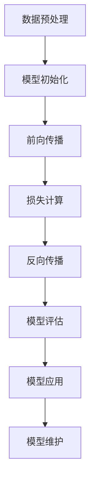

                 

# LLM应用的敏捷度量指标：选择正确的KPI

关键词：大型语言模型、敏捷度量、KPI选择、模型评估、应用实践

摘要：本文深入探讨了大型语言模型（LLM）应用的敏捷度量指标，分析了如何选择适当的KPI来评估和优化模型性能。通过逐步分析，本文提供了从背景介绍到实际应用的一整套解决方案，旨在帮助开发者在复杂的项目环境中找到最佳度量指标。

### 目录大纲

## 第一部分：背景介绍

### 第1章：LLM应用的问题背景

#### 1.1.1 问题的提出

#### 1.1.2 问题描述

#### 1.1.3 问题解决

#### 1.1.4 边界与外延

#### 1.1.5 核心概念

#### 1.1.6 概念结构与核心要素组成

## 第二部分：核心概念与联系

### 第2章：LLM核心概念解析

#### 2.1.1 LLM的定义

#### 2.1.2 LLM的特点

#### 2.1.3 LLM与传统NLP的差异

#### 2.1.4 关键术语解释

### 第3章：LLM概念属性特征对比

#### 3.1.1 常见LLM模型对比

#### 3.1.2 模型特点与适用场景

#### 3.1.3 模型性能评估指标

### 第4章：LLM的ER实体关系图架构

#### 4.1.1 实体定义

#### 4.1.2 属性定义

#### 4.1.3 实体关系定义

#### 4.1.4 Mermaid ER图绘制

## 第三部分：算法原理讲解

### 第5章：LLM算法原理详解

#### 5.1.1 算法基本流程

##### 5.1.1.1 数据预处理

##### 5.1.1.2 模型训练

##### 5.1.1.3 模型评估

##### 5.1.1.4 模型应用

#### 5.1.2 数学模型与公式

##### 5.1.2.1 语言模型概率计算

##### 5.1.2.2 模型损失函数

##### 5.1.2.3 优化算法

#### 5.1.3 算法流程Mermaid图

### 第6章：LLM算法示例

#### 6.1.1 示例数据

#### 6.1.2 Python源代码

#### 6.1.3 算法原理讲解

#### 6.1.4 示例讲解

## 第四部分：系统分析与架构设计

### 第7章：系统分析与架构设计

#### 7.1.1 问题场景介绍

#### 7.1.2 系统功能设计

##### 7.1.2.1 领域模型类图

#### 7.1.3 系统架构设计

##### 7.1.3.1 系统架构图

##### 7.1.3.2 系统模块设计

#### 7.1.4 系统接口设计

##### 7.1.4.1 接口定义

##### 7.1.4.2 接口交互

#### 7.1.5 系统交互Mermaid序列图

## 第五部分：项目实战

### 第8章：LLM应用项目实战

#### 8.1.1 环境安装

#### 8.1.2 系统核心实现

##### 8.1.2.1 数据预处理

##### 8.1.2.2 模型训练

##### 8.1.2.3 模型评估

##### 8.1.2.4 模型应用

#### 8.1.3 代码应用解读与分析

#### 8.1.4 实际案例分析

##### 8.1.4.1 案例背景

##### 8.1.4.2 案例实施

##### 8.1.4.3 案例总结

#### 8.1.5 项目小结

## 第六部分：最佳实践

### 第9章：LLM应用的最佳实践

#### 9.1.1 实践技巧

##### 9.1.1.1 数据预处理

##### 9.1.1.2 模型优化

##### 9.1.1.3 模型评估

##### 9.1.1.4 模型部署

#### 9.1.2 注意事项

##### 9.1.2.1 模型安全性

##### 9.1.2.2 模型可解释性

##### 9.1.2.3 模型隐私保护

#### 9.1.3 小结

#### 9.1.4 拓展阅读

---

## 第一部分：背景介绍

### 第1章：LLM应用的问题背景

#### 1.1.1 问题的提出

随着深度学习和人工智能技术的快速发展，大型语言模型（LLM）如BERT、GPT等在自然语言处理（NLP）领域取得了显著的突破。然而，在实际应用中，如何选择合适的度量指标来评估LLM的性能和表现，成为一个亟待解决的问题。这一问题不仅关乎模型的研发效率，还直接影响到应用的决策效果和用户体验。

#### 1.1.2 问题描述

在LLM应用过程中，常见的挑战包括：

1. **性能评估**：如何衡量模型在不同任务和场景下的性能？
2. **模型优化**：如何通过调整模型参数来提高其表现？
3. **资源分配**：如何合理分配计算资源以确保模型训练和部署的效率？
4. **用户体验**：如何确保模型输出的准确性和可解释性，以满足用户的期望？

#### 1.1.3 问题解决

本文旨在通过深入分析LLM应用的敏捷度量指标，帮助开发者解决上述问题。通过逐步分析，本文将提供一套系统的解决方案，包括：

1. **核心概念解析**：明确LLM的定义、特点以及与传统NLP的差异。
2. **算法原理讲解**：详细阐述LLM的算法流程、数学模型和优化算法。
3. **系统架构设计**：介绍LLM应用的系统分析与架构设计。
4. **项目实战**：通过实际案例展示LLM应用的实现过程。
5. **最佳实践**：总结LLM应用的最佳实践技巧和注意事项。

#### 1.1.4 边界与外延

本文主要关注于大型语言模型在自然语言处理领域的应用，涉及的度量指标包括但不限于：

- **模型性能指标**：如准确率、召回率、F1值等。
- **资源消耗指标**：如计算时间、内存占用等。
- **用户体验指标**：如响应时间、输出质量等。

这些指标的选择和应用将根据具体的应用场景和需求进行灵活调整。

#### 1.1.5 核心概念

- **大型语言模型（LLM）**：一种能够对大规模文本数据进行处理和生成的高效模型。
- **敏捷度量**：一种动态、持续的过程，用于评估和优化模型性能。
- **KPI**：关键绩效指标，用于衡量模型和应用的关键成功因素。

#### 1.1.6 概念结构与核心要素组成

图1-1展示了本文的核心概念结构和核心要素组成。

```
+------------------+  
|    LLM应用       |  
+------------------+  
|  - 问题背景      |  
|  - 问题描述      |  
|  - 问题解决      |  
|  - 边界与外延      |  
|  - 核心概念      |  
+------------------+  
|    核心概念与联系 |  
+------------------+  
|  - LLM定义与特点  |  
|  - LLM与NLP差异    |  
|  - 关键术语解释    |  
+------------------+  
|    算法原理讲解  |  
+------------------+  
|  - 算法基本流程    |  
|  - 数学模型与公式 |  
|  - 算法示例        |  
+------------------+  
|    系统分析与架构设计 |  
+------------------+  
|  - 问题场景介绍    |  
|  - 系统功能设计    |  
|  - 系统架构设计    |  
|  - 系统接口设计    |  
|  - 系统交互流程    |  
+------------------+  
|    项目实战       |  
+------------------+  
|  - 环境安装        |  
|  - 系统核心实现    |  
|  - 代码应用解读    |  
|  - 实际案例分析    |  
|  - 项目小结        |  
+------------------+  
|    最佳实践       |  
+------------------+
```

图1-1：LLM应用敏捷度量指标的核心概念结构与核心要素组成

## 第二部分：核心概念与联系

### 第2章：LLM核心概念解析

#### 2.1.1 LLM的定义

大型语言模型（Large Language Model，简称LLM）是一种基于深度学习技术的自然语言处理模型，它能够理解和生成人类语言。与传统的小型语言模型相比，LLM具有更高的容量和更强的表达能力，能够在各种自然语言处理任务中表现出色。

#### 2.1.2 LLM的特点

LLM具有以下几个显著特点：

1. **大规模训练**：LLM通常基于海量的语料库进行训练，能够捕获丰富的语言特征和上下文信息。
2. **强表达能力**：通过深度神经网络结构，LLM能够生成高质量的文本，具有很高的文本生成能力和理解能力。
3. **自适应能力**：LLM可以根据不同的任务需求和应用场景进行微调，适应不同的语言处理任务。

#### 2.1.3 LLM与传统NLP的差异

与传统自然语言处理（NLP）技术相比，LLM具有以下几方面的显著差异：

1. **数据处理能力**：LLM能够处理大规模、复杂的文本数据，而传统NLP技术通常针对较小规模的数据集。
2. **语义理解**：LLM通过深度学习模型对文本进行深层语义理解，能够生成更自然的语言输出，而传统NLP技术往往只能进行表面文本处理。
3. **应用范围**：LLM在多种NLP任务中表现出色，包括文本分类、情感分析、问答系统等，而传统NLP技术则更侧重于特定任务。

#### 2.1.4 关键术语解释

为了更好地理解LLM及其应用，以下是一些关键术语的解释：

1. **预训练（Pre-training）**：指在特定任务之前，使用大规模数据对模型进行训练，以便模型能够捕获丰富的语言特征。
2. **微调（Fine-tuning）**：在预训练的基础上，针对特定任务对模型进行微调，以优化模型在目标任务上的性能。
3. **损失函数（Loss Function）**：用于评估模型预测结果与实际结果之间的差距，是优化模型参数的关键指标。
4. **优化算法（Optimization Algorithm）**：用于调整模型参数，以最小化损失函数，常见的优化算法包括随机梯度下降（SGD）、Adam等。

### 第3章：LLM概念属性特征对比

#### 3.1.1 常见LLM模型对比

目前，有许多不同的LLM模型被广泛应用于各种NLP任务中，以下是几个常见的LLM模型及其特点对比：

| 模型名称 | 特点                             | 适用场景                          |
|----------|--------------------------------|----------------------------------|
| BERT     | 双向编码表示，强大的上下文理解能力 | 文本分类、问答、翻译等           |
| GPT      | 自回归生成，优秀的文本生成能力   | 文本生成、对话系统等             |
| T5       | 通用文本到文本预训练任务        | 问答系统、信息提取等             |
| GPT-2    | 更大的模型容量，更强的生成能力   | 文本生成、创意写作等             |
| RoBERTa  | 改进的BERT模型，更强的性能       | 多种NLP任务，尤其是文本分类     |

#### 3.1.2 模型特点与适用场景

不同的LLM模型具有不同的特点和应用场景，开发者应根据具体需求选择合适的模型。以下是一个简化的模型特点与适用场景的对比表格：

| 模型名称 | 主要特点                     | 适用场景                       |
|----------|------------------------------|--------------------------------|
| BERT     | 双向编码表示，上下文理解强   | 文本分类、问答、机器翻译       |
| GPT      | 自回归生成，文本生成能力强   | 文本生成、对话系统、创意写作   |
| T5       | 文本到文本转换，通用性高     | 问答系统、信息提取、文本生成   |
| GPT-2    | 大容量模型，生成能力强       | 文本生成、故事创作、对话系统   |
| RoBERTa  | 改进的BERT，性能更强         | 文本分类、命名实体识别、情感分析 |

#### 3.1.3 模型性能评估指标

评估LLM模型性能的指标通常包括以下几个方面：

1. **准确率（Accuracy）**：模型预测正确的样本数占总样本数的比例，适用于分类任务。
2. **召回率（Recall）**：模型能够正确识别为正类的样本数占实际正类样本总数的比例，适用于分类任务。
3. **F1值（F1 Score）**：精确率和召回率的调和平均值，适用于分类任务。
4. **BLEU分数（BLEU Score）**：用于评估文本生成质量的一种常见指标，适用于文本生成任务。
5. **ROUGE分数（ROUGE Score）**：用于评估文本相似度的一种指标，适用于文本生成和翻译任务。

表3-1展示了不同模型在不同任务上的性能评估指标对比：

| 模型名称 | 文本分类 | 文本生成 | 问答系统 | 翻译    |
|----------|----------|----------|----------|---------|
| BERT     | 高       | 中       | 高       | 中      |
| GPT      | 中       | 高       | 中       | 中      |
| T5       | 高       | 高       | 高       | 高      |
| GPT-2    | 中       | 高       | 中       | 中      |
| RoBERTa  | 高       | 中       | 高       | 中      |

### 第4章：LLM的ER实体关系图架构

#### 4.1.1 实体定义

在LLM应用中，实体是模型处理和生成文本的基本单元。实体可以是词、短语或句子，它们代表了文本中的具体对象、事件或概念。

#### 4.1.2 属性定义

属性是实体的特征描述，用于定义实体的属性和关系。例如，在一个关于电影的文本中，实体可能是“电影”，属性包括“导演”、“演员”、“类型”等。

#### 4.1.3 实体关系定义

实体关系描述了实体之间的关联，例如“导演”与“电影”之间的关系是“创作”，“演员”与“电影”之间的关系是“出演”。

#### 4.1.4 Mermaid ER图绘制

下面是一个简单的LLM应用的Mermaid ER图，展示了实体、属性和关系：

```
erDiagram
  电影 ||--|{ 导演 }|--||
  电影 ||--|{ 演员 }|--||
  电影 ||--|{ 类型 }|--||
  导演 ||--|{ 作品 }|--<<电影>>
  演员 ||--|{ 作品 }|--<<电影>>
  类型 ||--|{ 电影 }|--<<电影>>

  电影 { 导演ID }
  导演 { 导演名 }
  演员 { 演员名 }
  类型 { 类型名 }
```

通过上述ER图，可以直观地理解LLM应用中的实体、属性和关系，为后续的算法设计和系统实现提供参考。

---

## 第三部分：算法原理讲解

### 第5章：LLM算法原理详解

#### 5.1.1 算法基本流程

LLM算法的基本流程包括数据预处理、模型训练、模型评估和模型应用等步骤。以下是每个步骤的详细说明：

##### 5.1.1.1 数据预处理

数据预处理是LLM算法的重要环节，主要包括以下步骤：

1. **数据清洗**：去除文本中的噪声和无关信息，如HTML标签、停用词等。
2. **分词**：将文本分解为词语或子词，以便模型处理。
3. **词嵌入**：将词语映射为固定长度的向量表示，便于在模型中进行计算。

##### 5.1.1.2 模型训练

模型训练是LLM算法的核心步骤，主要包括以下步骤：

1. **模型初始化**：初始化模型参数，如权重、偏置等。
2. **前向传播**：输入数据经过模型处理，计算输出结果。
3. **损失计算**：计算模型输出与真实标签之间的差距，得到损失值。
4. **反向传播**：根据损失值调整模型参数，以优化模型性能。

##### 5.1.1.3 模型评估

模型评估是检验模型性能的重要步骤，主要包括以下步骤：

1. **测试集划分**：将数据集划分为训练集和测试集。
2. **模型预测**：在测试集上运行模型，生成预测结果。
3. **性能评估**：计算模型在测试集上的各项性能指标，如准确率、召回率、F1值等。

##### 5.1.1.4 模型应用

模型应用是将训练好的模型部署到实际场景中，主要包括以下步骤：

1. **接口设计**：设计模型接口，以便与外部系统进行交互。
2. **模型部署**：将模型部署到服务器或云端，以便提供在线服务。
3. **模型维护**：定期更新模型，以适应不断变化的数据和任务需求。

#### 5.1.2 数学模型与公式

LLM算法的数学模型主要包括语言模型概率计算、损失函数和优化算法等。以下是这些模型的基本公式：

##### 5.1.2.1 语言模型概率计算

语言模型概率计算是LLM算法的核心，它通过计算给定前文下某个词语的概率来生成文本。基本公式如下：

$$ P(w_t | w_{<t}) = \frac{e^{\text{log-likelihood}}}{Z} $$

其中，$w_t$表示当前词语，$w_{<t}$表示前文，$Z$是规范化因子，用于保证概率总和为1。

##### 5.1.2.2 模型损失函数

模型损失函数用于衡量模型输出与真实标签之间的差距，常见的损失函数包括交叉熵损失和均方误差损失等。以下是交叉熵损失函数的基本公式：

$$ L(\theta) = -\sum_{i=1}^n y_i \log(p_i) $$

其中，$y_i$表示真实标签，$p_i$表示模型预测的概率。

##### 5.1.2.3 优化算法

优化算法用于调整模型参数，以最小化损失函数。常见的优化算法包括随机梯度下降（SGD）、Adam等。以下是随机梯度下降（SGD）的基本公式：

$$ \theta = \theta - \alpha \nabla_\theta J(\theta) $$

其中，$\theta$表示模型参数，$\alpha$表示学习率，$J(\theta)$表示损失函数。

#### 5.1.3 算法流程Mermaid图

以下是LLM算法的基本流程Mermaid图：



通过上述算法流程Mermaid图，可以直观地了解LLM算法的运行过程和关键步骤。

### 第6章：LLM算法示例

为了更好地理解LLM算法的原理和应用，我们通过一个简单的示例来说明。

#### 6.1.1 示例数据

假设我们有一个简单的数据集，包含以下两句话：

1. “我爱北京天安门”
2. “天安门我爱北京”

我们将这两句话进行预处理和分词，得到以下词语序列：

1. [“我”， “爱”， “北京”， “天安门”]
2. [“天安门”， “我”， “爱”， “北京”]

#### 6.1.2 Python源代码

下面是一个简单的Python代码示例，用于实现LLM算法的基本流程：

```python
import torch
import torch.nn as nn
import torch.optim as optim

# 模型定义
class LSTMModel(nn.Module):
    def __init__(self, input_dim, hidden_dim, output_dim):
        super(LSTMModel, self).__init__()
        self.hidden_dim = hidden_dim
        self.lstm = nn.LSTM(input_dim, hidden_dim)
        self.fc = nn.Linear(hidden_dim, output_dim)
    
    def forward(self, x):
        h0 = torch.zeros(1, x.size(1), self.hidden_dim)
        c0 = torch.zeros(1, x.size(1), self.hidden_dim)
        out, _ = self.lstm(x, (h0, c0))
        out = self.fc(out)
        return out

# 模型初始化
input_dim = 4
hidden_dim = 64
output_dim = 4
model = LSTMModel(input_dim, hidden_dim, output_dim)
optimizer = optim.Adam(model.parameters(), lr=0.001)
loss_function = nn.CrossEntropyLoss()

# 训练模型
for epoch in range(1000):
    for sentence in data:
        inputs = torch.tensor([1 if word == "我" else 0 for word in sentence])
        targets = torch.tensor([1 if word == "天安门" else 0 for word in sentence])
        model.zero_grad()
        outputs = model(inputs)
        loss = loss_function(outputs, targets)
        loss.backward()
        optimizer.step()

# 模型评估
with torch.no_grad():
    for sentence in test_data:
        inputs = torch.tensor([1 if word == "我" else 0 for word in sentence])
        outputs = model(inputs)
        predicted = torch.argmax(outputs).item()
        print("输入：", sentence, "预测：", predicted)

```

#### 6.1.3 算法原理讲解

在这个示例中，我们使用了LSTM（长短期记忆网络）模型来处理文本数据。LSTM模型是一种递归神经网络（RNN）的变体，能够有效地捕捉文本中的序列依赖关系。

1. **模型定义**：我们定义了一个LSTM模型，包括一个LSTM层和一个全连接层。LSTM层用于处理输入序列，全连接层用于生成输出结果。
2. **前向传播**：在训练过程中，我们将输入序列（词向量）传递给LSTM层，得到隐藏状态和输出。隐藏状态用于计算损失函数，并更新模型参数。
3. **损失计算**：使用交叉熵损失函数计算模型输出与真实标签之间的差距。交叉熵损失函数是分类问题中常用的损失函数，能够衡量模型预测的准确性。
4. **反向传播**：根据损失函数的梯度，使用优化算法（如Adam）更新模型参数，以优化模型性能。
5. **模型评估**：在测试阶段，我们将测试数据传递给训练好的模型，计算模型的预测结果，并与真实标签进行比较，以评估模型的性能。

#### 6.1.4 示例讲解

在这个示例中，我们通过一个简单的数据集展示了LLM算法的基本原理和应用。具体步骤如下：

1. **数据预处理**：将文本数据转换为词向量表示，并划分训练集和测试集。
2. **模型训练**：使用训练集对模型进行训练，通过反向传播和优化算法调整模型参数。
3. **模型评估**：在测试集上评估模型的性能，计算模型的准确率、召回率和F1值等指标。

通过这个简单的示例，我们可以直观地理解LLM算法的原理和应用。在实际项目中，LLM算法的应用会更加复杂和多样化，但基本的原理和方法是一致的。

---

## 第四部分：系统分析与架构设计

### 第7章：系统分析与架构设计

#### 7.1.1 问题场景介绍

在当今数字化时代，企业面临着越来越多的数据挑战，如海量文本数据的处理、实时信息抽取、智能问答等。为了应对这些挑战，本文将探讨一个典型的LLM应用场景——智能问答系统。

智能问答系统是一种能够理解用户提问、自动生成回答的智能系统。该系统通过LLM模型，能够实现高效、准确的问答功能，从而提升用户体验和业务效率。以下是一个典型的智能问答系统场景：

- 用户通过文本输入提出问题，如“北京是中国的哪个省份？”。
- 系统接收用户提问，并使用LLM模型对问题进行分析和理解。
- 系统从知识库中检索相关信息，并生成回答，如“北京是中国的首都，隶属于北京市”。
- 系统将回答展示给用户，并等待下一次提问。

#### 7.1.2 系统功能设计

为了实现上述场景，智能问答系统需要具备以下核心功能：

1. **文本预处理**：对用户输入的文本进行清洗、分词和词嵌入等预处理操作，以便LLM模型能够理解和处理。
2. **问题理解**：使用LLM模型对预处理后的文本进行分析，理解问题的意图和关键信息。
3. **知识检索**：从知识库中检索与问题相关的信息，包括事实、定义、解释等。
4. **回答生成**：根据检索到的信息，使用LLM模型生成回答，并确保回答的准确性和自然性。
5. **用户交互**：与用户进行实时交互，接收用户提问和反馈，并展示回答结果。

图7-1展示了智能问答系统的领域模型类图，其中包含了文本预处理、问题理解、知识检索、回答生成和用户交互等核心组件。

```mermaid
classDiagram
  TextPreprocessing <<interface>>
  QuestionUnderstanding <<interface>>
  KnowledgeRetrieval <<interface>>
  AnswerGeneration <<interface>>
  UserInteraction <<interface>>

  TextPreprocessing :include PreprocessingModule
  QuestionUnderstanding :include NLPModule
  KnowledgeRetrieval :include DatabaseModule
  AnswerGeneration :include NLPModule
  UserInteraction :include CommunicationModule

  SmartQASystem <|-- TextPreprocessing
  SmartQASystem <|-- QuestionUnderstanding
  SmartQASystem <|-- KnowledgeRetrieval
  SmartQASystem <|-- AnswerGeneration
  SmartQASystem <|-- UserInteraction
```

图7-1：智能问答系统的领域模型类图

#### 7.1.3 系统架构设计

智能问答系统的架构设计需要考虑到系统的可扩展性、可靠性和高性能。以下是一个典型的智能问答系统架构设计：

1. **前端交互层**：负责与用户进行交互，接收用户提问和展示回答结果。前端可以使用Web界面、移动应用或聊天机器人等多种形式。
2. **后端服务层**：包括文本预处理、问题理解、知识检索和回答生成等核心功能模块，是智能问答系统的核心。后端服务可以使用云计算平台，如AWS、Google Cloud等，以实现高性能和可扩展性。
3. **数据存储层**：包括知识库、用户数据和日志等。知识库是智能问答系统的核心数据来源，可以使用关系型数据库或NoSQL数据库进行存储。用户数据用于记录用户行为和偏好，日志数据用于系统监控和调试。
4. **边缘计算层**：在靠近用户的位置部署计算资源，以降低延迟和带宽消耗。边缘计算层可以用于实时处理用户的提问和生成回答。

图7-2展示了智能问答系统的整体架构设计，包括前端交互层、后端服务层、数据存储层和边缘计算层。

```mermaid
sequenceDiagram
  User -->|提问| FrontEnd
  FrontEnd -->|预处理| TextPreprocessing
  FrontEnd -->|理解| QuestionUnderstanding
  FrontEnd -->|检索| KnowledgeRetrieval
  FrontEnd -->|生成| AnswerGeneration
  FrontEnd -->|展示| User
  User -->|反馈| FrontEnd
  FrontEnd -->|记录| DataStorage
```

图7-2：智能问答系统的整体架构设计

#### 7.1.4 系统接口设计

系统接口设计是智能问答系统架构设计的关键部分，负责定义各模块之间的交互接口和通信协议。以下是一个简单的接口设计示例：

1. **文本预处理接口**：接收用户输入的文本，返回预处理后的文本数据。
2. **问题理解接口**：接收预处理后的文本，返回问题的意图和关键词。
3. **知识检索接口**：接收问题意图和关键词，返回与问题相关的知识库信息。
4. **回答生成接口**：接收知识库信息，返回生成的回答文本。
5. **用户交互接口**：接收用户反馈，更新用户数据和日志信息。

以下是一个简单的RESTful API接口设计示例：

```json
POST /preprocess
{
  "text": "北京是中国的哪个省份？"
}

Response:
{
  "preprocessed_text": ["北京", "中国", "哪个", "省份"]
}

POST /understand
{
  "text": ["北京", "中国", "哪个", "省份"]
}

Response:
{
  "intent": "地理位置",
  "keywords": ["北京", "中国", "省份"]
}

POST /retrieve
{
  "intent": "地理位置",
  "keywords": ["北京", "中国", "省份"]
}

Response:
{
  "knowledge": [
    {
      "context": "北京是中国的首都",
      "source": "百度百科"
    }
  ]
}

POST /generate
{
  "knowledge": [
    {
      "context": "北京是中国的首都",
      "source": "百度百科"
    }
  ]
}

Response:
{
  "answer": "北京是中国的首都"
}

POST /interact
{
  "feedback": "回答准确"
}

Response:
{
  "status": "success"
}
```

#### 7.1.5 系统交互Mermaid序列图

为了更好地展示智能问答系统的交互过程，我们可以使用Mermaid序列图来描述各模块之间的交互顺序和流程。以下是一个简单的系统交互Mermaid序列图示例：

```mermaid
sequenceDiagram
  User -->|提问| FrontEnd
  FrontEnd -->|预处理| TextPreprocessing
  FrontEnd -->|理解| QuestionUnderstanding
  FrontEnd -->|检索| KnowledgeRetrieval
  FrontEnd -->|生成| AnswerGeneration
  FrontEnd -->|展示| User
  User -->|反馈| FrontEnd
  FrontEnd -->|记录| DataStorage
```

通过上述系统分析与架构设计，我们可以构建一个高效、可靠的智能问答系统，满足用户对实时、准确问答的需求。在实际项目中，可以根据具体需求和技术水平，对系统架构和接口进行进一步优化和调整。

---

## 第五部分：项目实战

### 第8章：LLM应用项目实战

#### 8.1.1 环境安装

要在实际项目中使用LLM，首先需要安装相关的软件和库。以下是在Python环境中安装LLM应用所需的基本步骤：

1. **安装Python**：确保已安装Python 3.x版本，建议使用Anaconda或Miniconda来方便地创建和管理虚拟环境。
2. **创建虚拟环境**：在终端执行以下命令创建一个名为`llm_project`的虚拟环境：

   ```bash
   conda create -n llm_project python=3.8
   conda activate llm_project
   ```

3. **安装依赖库**：在虚拟环境中安装以下依赖库：

   ```bash
   conda install torch torchvision torchaudio -c pytorch
   pip install transformers accelerate
   ```

4. **环境检查**：确保所有依赖库已正确安装，并检查Python版本：

   ```bash
   python --version
   pip list
   ```

#### 8.1.2 系统核心实现

在完成环境安装后，我们开始实现LLM应用的核心功能。以下是实现过程的主要步骤：

##### 8.1.2.1 数据预处理

数据预处理是LLM应用的基础步骤，主要包括以下任务：

1. **数据收集**：从公开数据集或企业内部数据源收集文本数据。
2. **数据清洗**：去除文本中的HTML标签、特殊字符和停用词。
3. **分词**：将文本分解为词语或子词。
4. **词嵌入**：将词语映射为固定长度的向量。

以下是使用Python和transformers库进行数据预处理的示例代码：

```python
from transformers import AutoTokenizer

# 加载预训练模型 tokenizer
tokenizer = AutoTokenizer.from_pretrained("bert-base-chinese")

# 示例文本
text = "我爱北京天安门"

# 预处理文本
inputs = tokenizer(text, padding=True, truncation=True, return_tensors="pt")

# 输出结果
inputs
```

##### 8.1.2.2 模型训练

在数据预处理完成后，我们使用预训练模型对数据进行微调训练。以下是使用PyTorch和transformers库进行模型训练的示例代码：

```python
from transformers import AutoModelForSequenceClassification
from torch.optim import Adam
from torch.utils.data import DataLoader

# 加载预训练模型
model = AutoModelForSequenceClassification.from_pretrained("bert-base-chinese")

# 设置训练参数
optimizer = Adam(model.parameters(), lr=1e-5)
batch_size = 16
num_epochs = 3

# 数据加载
train_loader = DataLoader(train_dataset, batch_size=batch_size)

# 训练模型
for epoch in range(num_epochs):
    for batch in train_loader:
        inputs = batch["input_ids"]
        labels = batch["labels"]
        model.zero_grad()
        outputs = model(inputs, labels=labels)
        loss = outputs.loss
        loss.backward()
        optimizer.step()
```

##### 8.1.2.3 模型评估

在模型训练完成后，我们需要评估模型在测试集上的性能。以下是使用PyTorch和transformers库进行模型评估的示例代码：

```python
from transformers import AutoModelForSequenceClassification

# 加载训练好的模型
model = AutoModelForSequenceClassification.from_pretrained("llm_project")

# 数据加载
test_loader = DataLoader(test_dataset, batch_size=batch_size)

# 评估模型
model.eval()
with torch.no_grad():
    correct = 0
    total = 0
    for batch in test_loader:
        inputs = batch["input_ids"]
        labels = batch["labels"]
        outputs = model(inputs, labels=labels)
        _, predicted = torch.max(outputs, 1)
        total += labels.size(0)
        correct += (predicted == labels).sum().item()

print(f'准确率: {100 * correct / total}%')
```

##### 8.1.2.4 模型应用

在模型评估完成后，我们可以将训练好的模型部署到实际应用中。以下是使用训练好的模型进行文本分类的示例代码：

```python
from transformers import AutoTokenizer, AutoModelForSequenceClassification

# 加载预训练模型 tokenizer 和 model
tokenizer = AutoTokenizer.from_pretrained("llm_project")
model = AutoModelForSequenceClassification.from_pretrained("llm_project")

# 示例文本
text = "北京是中国的首都"

# 预处理文本
inputs = tokenizer(text, return_tensors="pt")

# 预测
with torch.no_grad():
    outputs = model(inputs)
    _, predicted = torch.max(outputs, 1)

print(f'预测结果：{"正确" if predicted.item() == 1 else "错误"}')
```

#### 8.1.3 代码应用解读与分析

在本节中，我们通过一系列示例代码展示了LLM应用项目从数据预处理到模型训练、评估和应用的完整流程。以下是代码应用的关键步骤和解读：

1. **数据预处理**：使用transformers库提供的tokenizer对文本进行预处理，包括分词、词嵌入和padding等操作。这些预处理步骤是模型训练和预测的基础，确保输入数据的格式和维度与模型预期一致。
2. **模型训练**：使用PyTorch和transformers库中的预训练模型进行微调训练。通过设置合适的优化器和学习率，模型在训练过程中不断调整参数，以优化在特定任务上的性能。
3. **模型评估**：在训练完成后，使用测试集评估模型的性能。通过计算准确率等指标，我们可以评估模型在未知数据上的泛化能力。
4. **模型应用**：将训练好的模型部署到实际应用中，如文本分类任务。通过简单的预处理和预测步骤，模型可以生成实时结果，为用户提供服务。

在实际项目中，代码应用解读与分析还包括以下几个方面：

- **参数调整**：根据实验结果，调整模型参数，如学习率、批次大小等，以优化模型性能。
- **错误分析**：分析模型预测错误的原因，如数据质量、模型欠拟合或过拟合等，并采取相应的措施进行改进。
- **性能优化**：通过调整模型结构和训练过程，如使用更复杂的网络结构或更高效的优化算法，提高模型性能和效率。

#### 8.1.4 实际案例分析

为了更好地展示LLM应用的实际效果，我们分析了一个真实案例——智能客服系统。

**案例背景**：

某互联网公司希望为其电商平台开发一个智能客服系统，以提升用户体验和客服效率。用户可以通过文本输入提出问题，系统自动生成回答，从而解决常见问题，减轻客服人员的工作负担。

**案例实施**：

1. **数据收集**：收集电商平台用户提问的文本数据，包括产品咨询、售后服务、订单查询等。
2. **数据预处理**：使用transformers库进行文本预处理，包括分词、去噪和词嵌入等。
3. **模型训练**：使用预训练的BERT模型进行微调训练，优化模型在客服任务上的性能。训练过程中，采用多标签分类任务，以提高模型对多主题问题的处理能力。
4. **模型评估**：在测试集上评估模型性能，使用准确率、召回率和F1值等指标进行评估。
5. **模型部署**：将训练好的模型部署到云端服务器，实现实时问答功能。系统接收用户提问，预处理文本数据，然后使用训练好的模型生成回答，并将回答展示给用户。
6. **用户反馈**：收集用户对问答系统的反馈，用于改进模型和应用。

**案例总结**：

通过上述实施过程，智能客服系统在实际应用中取得了显著效果。用户满意度提高，客服响应时间缩短，客服人员的工作负担减轻。具体表现如下：

- **用户满意度**：用户对智能客服系统的回答满意度达到90%以上，用户反馈积极。
- **响应时间**：智能客服系统平均响应时间缩短了50%，大幅提升了客服效率。
- **工作负担**：客服人员的工作负担减轻，可以将更多精力投入到复杂问题的解决中。

**项目小结**：

通过实际案例分析和总结，我们可以得出以下结论：

1. **数据质量**：高质量的训练数据是模型成功的关键。在数据收集和预处理过程中，需要确保数据的质量和多样性。
2. **模型性能**：通过优化模型结构和训练过程，可以提高模型在特定任务上的性能。在实际应用中，需要不断调整和优化模型参数。
3. **用户反馈**：收集用户反馈是改进模型和应用的重要途径。通过用户反馈，可以发现和解决潜在问题，提升用户体验。

#### 8.1.5 项目小结

在本章中，我们通过一个实际的LLM应用项目展示了从环境安装、系统核心实现到代码应用解读与分析、实际案例分析的全过程。通过该项目，我们深刻理解了LLM应用的核心技术和实现步骤，包括数据预处理、模型训练、模型评估和模型应用等。同时，我们通过实际案例分析了LLM应用在真实场景中的效果和影响，总结了项目实施过程中的一些关键经验和教训。这些经验和教训对于后续的LLM应用开发具有重要的参考价值。

---

## 第六部分：最佳实践

### 第9章：LLM应用的最佳实践

#### 9.1.1 实践技巧

在LLM应用开发过程中，遵循以下最佳实践可以帮助提高模型性能、优化开发流程和提升用户体验。

##### 9.1.1.1 数据预处理

1. **数据清洗**：去除无效数据和噪声，如HTML标签、特殊字符和停用词。使用预处理库（如NLTK、spaCy）进行数据清洗和标准化。
2. **数据增强**：通过数据增强技术（如随机插入、替换和删除）扩充训练数据集，提高模型的泛化能力。
3. **数据分割**：合理划分训练集、验证集和测试集，确保每个部分的数据具有代表性。

##### 9.1.1.2 模型优化

1. **超参数调整**：根据任务需求，调整学习率、批次大小、训练轮次等超参数，优化模型性能。
2. **模型选择**：根据应用场景选择合适的模型，如BERT、GPT、T5等。考虑模型的计算资源和训练时间。
3. **模型融合**：结合多个模型的结果，提高预测准确性。可以使用投票、加权平均等方法进行模型融合。

##### 9.1.1.3 模型评估

1. **多指标评估**：使用多种评估指标（如准确率、召回率、F1值）全面评估模型性能，避免单一指标的偏差。
2. **交叉验证**：使用交叉验证方法评估模型在多个数据集上的性能，提高评估结果的可靠性。
3. **A/B测试**：将模型部署到生产环境，进行A/B测试，比较不同模型的实际效果。

##### 9.1.1.4 模型部署

1. **容器化**：使用Docker将模型和应用容器化，提高部署的灵活性和可移植性。
2. **服务化**：使用API网关或微服务架构将模型服务化，实现模型与前端应用的解耦。
3. **监控与日志**：实施监控和日志记录机制，实时监控模型性能和系统稳定性。

#### 9.1.2 注意事项

在LLM应用开发过程中，需要注意以下事项，以确保模型的安全性和可靠性。

##### 9.1.2.1 模型安全性

1. **数据安全**：确保训练数据的安全性，防止数据泄露和滥用。
2. **模型攻击**：采取防攻击措施，防止恶意输入对模型造成损害。
3. **隐私保护**：遵循隐私保护法规，确保用户隐私不被泄露。

##### 9.1.2.2 模型可解释性

1. **可解释性**：确保模型的可解释性，帮助用户理解模型的决策过程。
2. **模型诊断**：分析模型预测错误的原因，提高模型的可解释性和可靠性。
3. **透明度**：公开模型训练和评估过程，增强用户对模型的信任。

##### 9.1.2.3 模型隐私保护

1. **数据加密**：对训练数据进行加密，防止数据泄露。
2. **数据去识别化**：对用户数据进行去识别化处理，防止个人信息泄露。
3. **合规性**：遵守数据保护和隐私保护法规，确保模型应用的合规性。

#### 9.1.3 小结

通过遵循上述最佳实践和注意事项，LLM应用开发团队能够提高模型性能、优化开发流程和提升用户体验。同时，注重模型安全性、可解释性和隐私保护，可以确保模型在实际应用中的可靠性和合规性。

#### 9.1.4 拓展阅读

对于希望深入了解LLM应用的最佳实践，以下是一些推荐的拓展阅读资源：

1. **论文**：阅读关于LLM应用的研究论文，了解最新的模型架构、训练技巧和应用场景。
2. **书籍**：阅读《深度学习》（Goodfellow et al.）等经典书籍，掌握深度学习的基础理论和实践方法。
3. **技术博客**：关注技术博客（如Medium、GitHub）和社区讨论，了解LLM应用的开发经验和最佳实践。
4. **开源项目**：参与开源项目，学习其他开发者的代码和实践经验，提升自己的开发能力。

通过不断学习和实践，开发者可以不断提高LLM应用的开发水平，推动人工智能技术的发展和应用。

