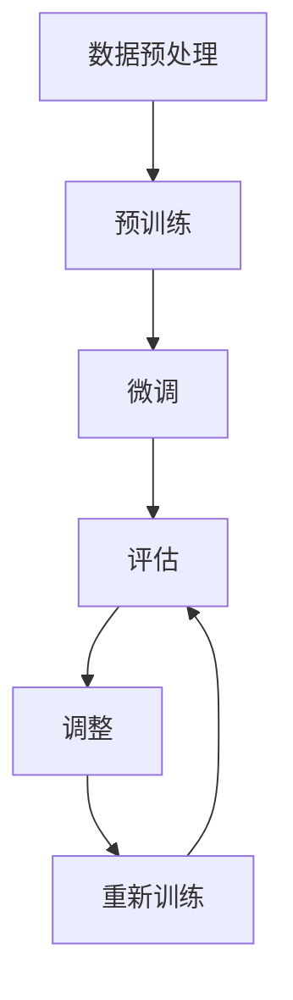
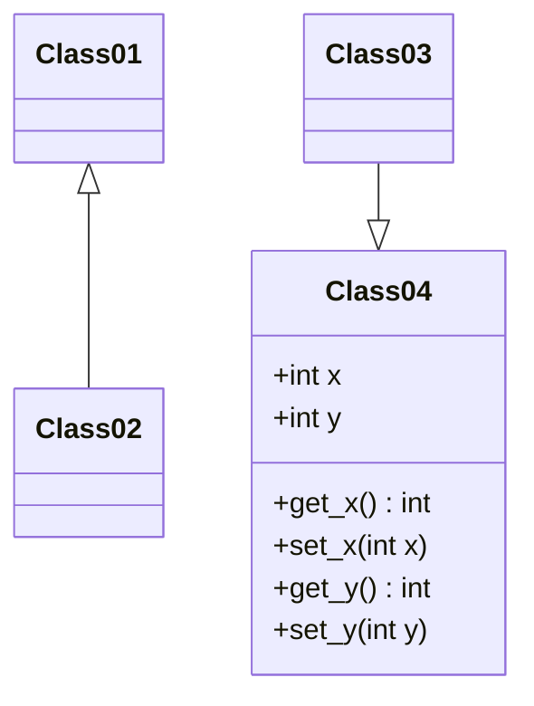
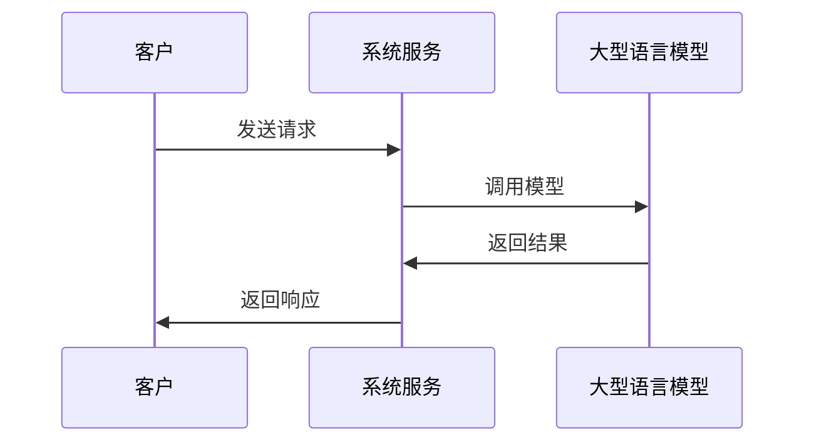

                 

# LLM应用的敏捷扩展：从小团队到大规模实施

## 关键词

- 大型语言模型（LLM）
- 敏捷开发
- 应用扩展
- 小团队
- 大规模实施
- 需求响应
- 开发效率

## 摘要

本文旨在探讨如何敏捷地扩展大型语言模型（LLM）应用，从小型团队到大规模实施的整个过程。我们将介绍LLM的核心概念与特性，分析敏捷开发方法在LLM应用扩展中的优势与实施步骤，并通过实际案例展示敏捷扩展的实践。本文将帮助读者了解LLM应用扩展的难点与解决方案，为团队提供实用的参考。

## 第一部分：引言

### 第1章：背景介绍

#### 1.1 问题背景

随着人工智能技术的快速发展，大型语言模型（LLM）如GPT、BERT等在各个领域得到了广泛应用。然而，对于许多小型团队和初创公司来说，如何高效地扩展LLM应用仍是一个挑战。

#### 1.2 问题描述

本书旨在探讨如何从小团队到大规模实施中，敏捷地扩展LLM应用。我们将探讨技术、组织和流程等方面的问题，以帮助读者成功应对这一挑战。

#### 1.3 问题解决

通过引入敏捷开发方法，结合LLM的特性和实际应用场景，我们可以实现LLM应用的敏捷扩展。

#### 1.4 边界与外延

本书主要关注LLM在自然语言处理、对话系统、文本生成等领域的应用，同时探讨适用于不同规模团队的扩展策略。

#### 1.5 概念结构与核心要素组成

- **LLM**：大型语言模型
- **敏捷扩展**：快速响应需求变化，高效地扩展应用规模
- **小团队**：团队成员数量较少，资源有限
- **大规模实施**：针对大规模用户或场景的应用部署

#### 1.6 本章小结

本章介绍了本书的研究背景、目标和解决的问题。在接下来的章节中，我们将深入探讨LLM的核心概念、扩展策略以及实际应用案例。

### 第2章：LLM核心概念与特性

#### 2.1 LLM的定义与分类

##### 2.1.1 LLM的定义
LLM（Large Language Model）是指大型语言模型，是一种能够理解和生成自然语言的深度学习模型。

##### 2.1.2 LLM的分类
LLM可以分为基于RNN（递归神经网络）的模型和基于Transformer（变换器）的模型。

#### 2.2 LLM的工作原理

##### 2.2.1 Transformer模型
Transformer模型是LLM的核心，其原理是基于自注意力机制（Self-Attention）和多头注意力（Multi-Head Attention）。

##### 2.2.2 自注意力机制
自注意力机制使得模型能够在处理每个单词时，同时考虑所有其他单词的重要程度。

##### 2.2.3 多头注意力
多头注意力则通过并行处理，提高了模型的表示能力。

#### 2.3 LLM的核心特性

##### 2.3.1 大规模训练数据
LLM依赖于大规模的训练数据，这是其能够理解和生成自然语言的关键。

##### 2.3.2 自适应能力
LLM具有强大的自适应能力，能够根据不同的应用场景进行微调和优化。

##### 2.3.3 高效性
LLM在处理大规模数据时，具有很高的计算效率和资源利用率。

#### 2.4 LLM与传统AI模型的区别

##### 2.4.1 数据依赖
与传统AI模型相比，LLM对数据的需求更大，更依赖数据的质量和多样性。

##### 2.4.2 表示能力
LLM在语义理解和文本生成方面具有更强的表示能力。

##### 2.4.3 应用范围
LLM的应用范围更广泛，不仅限于特定领域，还可以应用于多领域、多任务。

#### 2.5 本章小结

本章详细介绍了LLM的核心概念、工作原理和特性，以及与传统AI模型的区别。这些内容为后续的扩展策略和应用提供了理论基础。

### 第3章：敏捷开发方法在LLM应用扩展中的应用

#### 3.1 敏捷开发方法的概述

##### 3.1.1 敏捷开发的概念
敏捷开发是一种以人为核心、迭代、渐进的开发方法，强调快速响应变化、持续交付价值和团队协作。

##### 3.1.2 敏捷开发的核心原则
敏捷开发的核心原则包括：个体和互动重于过程与工具、可工作的软件重于详尽的文档、客户协作重于合同谈判、响应变化重于遵循计划。

#### 3.2 敏捷开发方法在LLM应用扩展中的优势

##### 3.2.1 快速响应需求变化
敏捷开发方法能够快速响应需求变化，使得LLM应用可以及时调整和优化。

##### 3.2.2 提高开发效率
通过迭代开发和持续交付，敏捷开发方法可以提高开发效率，缩短开发周期。

##### 3.2.3 强化团队协作
敏捷开发方法强调团队协作，有助于提升团队的整体能力。

#### 3.3 敏捷开发方法在LLM应用扩展中的实施步骤

##### 3.3.1 确定项目目标和范围
在开始扩展LLM应用之前，需要明确项目的目标和范围，以确保项目的方向正确。

##### 3.3.2 拆分任务与迭代开发
将项目拆分为若干可迭代的小任务，通过不断的迭代开发，逐步实现项目目标。

##### 3.3.3 持续集成与测试
采用持续集成与测试的方法，确保每次迭代交付的软件质量。

##### 3.3.4 客户反馈与持续优化
在每次迭代过程中，收集客户反馈，及时进行调整和优化，以实现项目目标。

#### 3.4 本章小结

本章介绍了敏捷开发方法的概述、优势以及在LLM应用扩展中的实施步骤。通过敏捷开发方法，团队可以更好地应对变化，提高开发效率，实现LLM应用的敏捷扩展。

### 第4章：小团队在LLM应用扩展中的挑战与策略

#### 4.1 小团队在LLM应用扩展中的挑战

##### 4.1.1 资源限制
小团队通常面临资源限制，包括人力、资金和技术资源。

##### 4.1.2 技术障碍
小团队可能缺乏足够的技能和知识来扩展LLM应用。

##### 4.1.3 需求不确定性
小团队在扩展LLM应用时，可能面临需求的不确定性，难以预测和适应。

#### 4.2 小团队在LLM应用扩展中的策略

##### 4.2.1 技术能力提升
通过培训和外部合作，提高团队的技术能力，以应对LLM应用扩展的需求。

##### 4.2.2 分阶段实施
将扩展任务拆分为多个阶段，逐步实现，以降低风险和成本。

##### 4.2.3 开源技术利用
利用开源技术和社区资源，降低开发成本，提高开发效率。

##### 4.2.4 需求调研与优先级排序
进行深入的需求调研，明确关键需求，并对需求进行优先级排序，确保资源的合理分配。

#### 4.3 本章小结

本章探讨了小团队在LLM应用扩展中面临的挑战和应对策略。通过提升技术能力、分阶段实施、利用开源技术和明确需求，小团队能够更好地应对扩展过程中的困难，实现LLM应用的敏捷扩展。

### 第5章：大规模实施中的问题与解决方案

#### 5.1 大规模实施中的问题

##### 5.1.1 部署与运维
大规模实施需要高效且稳定的部署与运维方案，以保证系统的高可用性和性能。

##### 5.1.2 数据安全与隐私
大规模实施涉及大量用户数据，需要确保数据的安全和隐私。

##### 5.1.3 性能优化与扩展性
大规模实施需要考虑系统的性能优化和扩展性，以应对用户规模的快速增长。

#### 5.2 大规模实施中的解决方案

##### 5.2.1 模块化与分布式架构
采用模块化和分布式架构，提高系统的扩展性和灵活性。

##### 5.2.2 云计算与容器化
利用云计算和容器化技术，实现高效的部署和运维。

##### 5.2.3 数据安全与加密
采用数据加密、访问控制等技术，确保数据的安全和隐私。

##### 5.2.4 监控与性能优化
通过监控系统，实时监测系统性能，并采取相应的优化措施。

#### 5.3 本章小结

本章讨论了大规模实施中面临的问题和解决方案。通过模块化与分布式架构、云计算与容器化、数据安全与加密以及监控与性能优化，团队能够应对大规模实施中的挑战，实现LLM应用的敏捷扩展。

### 第6章：案例分析

#### 6.1 案例一：初创公司A的LLM应用扩展

##### 6.1.1 案例背景
初创公司A致力于开发一款基于LLM的客户服务机器人。

##### 6.1.2 挑战
公司规模较小，技术团队有限，需要在短时间内实现产品功能的扩展。

##### 6.1.3 解决方案
公司采用敏捷开发方法，分阶段实现产品功能，并通过开源技术降低开发成本。

##### 6.1.4 结果
通过敏捷扩展，初创公司A成功推出了具备竞争力的客户服务机器人，并获得了良好的市场反馈。

#### 6.2 案例二：大型企业B的LLM应用扩展

##### 6.2.1 案例背景
大型企业B计划将LLM应用于其客户支持部门，以提高客户服务质量。

##### 6.2.2 挑战
企业规模较大，数据量庞大，需要确保系统的稳定性和性能。

##### 6.2.3 解决方案
企业采用模块化和分布式架构，利用云计算和容器化技术，实现高效部署和运维。

##### 6.2.4 结果
通过大规模实施，企业B成功将LLM应用于客户支持部门，显著提升了客户服务质量。

#### 6.3 本章小结

本章通过两个案例，展示了不同规模团队在LLM应用扩展中的成功实践。通过引入敏捷开发方法和大规模实施解决方案，团队能够应对各种挑战，实现LLM应用的敏捷扩展。

### 第7章：结论与展望

#### 7.1 结论

本文探讨了如何从小团队到大规模实施中，敏捷地扩展LLM应用。通过引入敏捷开发方法，结合LLM的特性和实际应用场景，团队可以快速响应需求变化，提高开发效率，实现LLM应用的敏捷扩展。

#### 7.2 展望

未来，随着人工智能技术的进一步发展，LLM的应用将更加广泛和深入。团队需要在敏捷扩展的基础上，不断探索和创新，以应对新的挑战和机遇。

### 附录

#### 附录A：术语解释

- **LLM（Large Language Model）**：大型语言模型，一种能够理解和生成自然语言的深度学习模型。
- **敏捷开发（Agile Development）**：一种以人为核心、迭代、渐进的开发方法，强调快速响应变化、持续交付价值和团队协作。
- **需求响应（Demand Response）**：快速调整和优化软件应用，以满足不断变化的需求。

#### 附录B：参考文献

1. Devlin, J., Chang, M. W., Lee, K., & Toutanova, K. (2018). BERT: Pre-training of deep bidirectional transformers for language understanding. arXiv preprint arXiv:1810.04805.
2. Hochreiter, S., & Schmidhuber, J. (1997). Long short-term memory. Neural Computation, 9(8), 1735-1780.
3. Beizer, A. (2003). The principles of software engineering. John Wiley & Sons.

### 作者信息

作者：AI天才研究院/AI Genius Institute & 禅与计算机程序设计艺术 /Zen And The Art of Computer Programming

## 第二部分：核心概念与原理

### 第2章：LLM核心概念与特性

#### 2.1 LLM的定义与分类

##### 2.1.1 LLM的定义

大型语言模型（LLM，Large Language Model）是一种通过深度学习技术训练的、用于理解和生成自然语言的模型。这些模型通常基于大规模的文本数据集进行预训练，以学习语言的结构、语法、语义和上下文信息。

##### 2.1.2 LLM的分类

LLM可以分为以下几类：

1. **基于RNN（递归神经网络）的模型**：如LSTM（长短期记忆网络）和GRU（门控循环单元），这些模型通过递归结构来处理序列数据。
2. **基于Transformer的模型**：如BERT（双向编码器表示器）、GPT（生成预训练网络）和T5（文本到文本的转换），这些模型采用自注意力机制来处理序列数据。

#### 2.2 LLM的工作原理

##### 2.2.1 Transformer模型

Transformer模型是LLM的核心，其原理是基于自注意力机制（Self-Attention）和多头注意力（Multi-Head Attention）。

- **自注意力机制**：允许模型在处理每个单词时，同时考虑所有其他单词的重要程度。
- **多头注意力**：通过并行处理，提高了模型的表示能力。

##### 2.2.2 训练过程

LLM的训练过程通常包括以下步骤：

1. **数据预处理**：清洗和预处理文本数据，将其转换为模型可以理解的格式。
2. **预训练**：使用大量未标注的文本数据，通过自注意力机制训练模型。
3. **微调**：在预训练的基础上，使用有标注的数据集对模型进行微调，以适应特定任务。

##### 2.2.3 生成过程

LLM的生成过程主要包括以下几个步骤：

1. **输入编码**：将输入文本转换为模型理解的向量表示。
2. **预测**：模型根据当前输入和已经学习的语言模式，预测下一个单词或符号。
3. **输出生成**：将预测的单词或符号组合成最终的输出文本。

#### 2.3 LLM的核心特性

##### 2.3.1 大规模训练数据

LLM依赖于大规模的训练数据，这是其能够理解和生成自然语言的关键。通常，这些数据集包含数十亿甚至数千亿个句子。

##### 2.3.2 自适应能力

LLM具有强大的自适应能力，能够根据不同的应用场景进行微调和优化。例如，可以针对特定领域的文本数据集进行微调，以提高模型在该领域的性能。

##### 2.3.3 高效性

LLM在处理大规模数据时，具有很高的计算效率和资源利用率。这使得它们在实时应用中表现得更加出色。

#### 2.4 LLM与传统AI模型的区别

##### 2.4.1 数据依赖

与传统AI模型相比，LLM对数据的需求更大，更依赖数据的质量和多样性。这是因为LLM需要从大量数据中学习语言的结构和模式。

##### 2.4.2 表示能力

LLM在语义理解和文本生成方面具有更强的表示能力。这使得它们在自然语言处理任务中表现得更加优秀。

##### 2.4.3 应用范围

LLM的应用范围更广泛，不仅限于特定领域，还可以应用于多领域、多任务。这使得LLM在许多实际场景中具有很高的价值。

### 2.5 本章小结

本章详细介绍了LLM的核心概念、工作原理和特性，以及与传统AI模型的区别。这些内容为后续的扩展策略和应用提供了理论基础。

## 第三部分：敏捷扩展策略

### 第3章：敏捷开发方法在LLM应用扩展中的应用

#### 3.1 敏捷开发方法的概述

##### 3.1.1 敏捷开发的概念

敏捷开发（Agile Development）是一种以人为核心、迭代、渐进的开发方法，强调快速响应变化、持续交付价值和团队协作。它强调客户需求的变化和持续交付，使团队能够在快速变化的环境中保持高效。

##### 3.1.2 敏捷开发的核心原则

敏捷开发的核心原则包括：

1. **个体和互动重于过程与工具**：强调团队成员的沟通和合作，而不是依赖特定的工具或过程。
2. **可工作的软件重于详尽的文档**：优先关注能够运行并产生价值的软件，而非繁琐的文档。
3. **客户协作重于合同谈判**：与客户的持续互动，以了解需求并快速调整开发方向。
4. **响应变化重于遵循计划**：在项目开发过程中，灵活应对需求变化，而不是严格遵循原计划。

#### 3.2 敏捷开发方法在LLM应用扩展中的优势

##### 3.2.1 快速响应需求变化

敏捷开发方法能够快速响应需求变化，这对于LLM应用扩展尤为重要。由于LLM应用场景多样，需求变化频繁，敏捷开发方法使得团队能够迅速调整和优化应用，以满足不断变化的需求。

##### 3.2.2 提高开发效率

通过迭代开发和持续交付，敏捷开发方法可以提高开发效率，缩短开发周期。团队能够在较短的时间内交付可工作的软件，并及时获得反馈，从而不断改进。

##### 3.2.3 强化团队协作

敏捷开发方法强调团队协作，有助于提升团队的整体能力。团队成员在共同的目标下合作，共同解决问题，提高项目的成功率。

#### 3.3 敏捷开发方法在LLM应用扩展中的实施步骤

##### 3.3.1 确定项目目标和范围

在开始扩展LLM应用之前，需要明确项目的目标和范围，以确保项目的方向正确。这包括确定应用的目标、功能范围和预期成果。

##### 3.3.2 拆分任务与迭代开发

将项目拆分为若干可迭代的小任务，通过不断的迭代开发，逐步实现项目目标。每次迭代通常包括需求分析、设计、编码、测试和部署等环节。

##### 3.3.3 持续集成与测试

采用持续集成与测试的方法，确保每次迭代交付的软件质量。通过自动化测试和持续集成工具，及时发现和修复问题，保证软件的稳定性。

##### 3.3.4 客户反馈与持续优化

在每次迭代过程中，收集客户反馈，及时进行调整和优化，以实现项目目标。客户反馈是改进软件的关键，有助于确保应用满足用户需求。

#### 3.4 敏捷开发方法在LLM应用扩展中的应用案例

##### 3.4.1 案例一：初创公司A

初创公司A采用敏捷开发方法，开发一款基于LLM的客户服务机器人。通过不断迭代，公司能够快速调整和优化机器人功能，满足客户需求，并在短时间内实现产品上市。

##### 3.4.2 案例二：大型企业B

大型企业B在将LLM应用于其客户支持部门时，采用敏捷开发方法。通过模块化设计和迭代开发，企业能够高效地扩展应用功能，并在短时间内实现大规模部署。

#### 3.5 本章小结

本章介绍了敏捷开发方法的概述、优势以及实施步骤。通过敏捷开发方法，团队可以更好地应对LLM应用扩展中的需求变化，提高开发效率，实现敏捷扩展。

### 第4章：从小团队到大规模实施的挑战与解决方案

#### 4.1 小团队在LLM应用扩展中的挑战

##### 4.1.1 资源限制

小团队通常面临资源限制，包括人力、资金和技术资源。这些限制可能导致团队在扩展LLM应用时面临困难。

##### 4.1.2 技术障碍

小团队可能缺乏足够的技能和知识来扩展LLM应用。他们可能不熟悉深度学习技术、数据处理方法或云计算平台。

##### 4.1.3 需求不确定性

小团队在扩展LLM应用时，可能面临需求的不确定性。客户需求可能随时发生变化，导致团队需要快速调整和优化应用。

#### 4.2 小团队在LLM应用扩展中的解决方案

##### 4.2.1 技术能力提升

通过培训和外部合作，小团队可以提高其技术能力。例如，参加相关的技术培训课程、参与开源项目或与外部专家合作。

##### 4.2.2 开源技术利用

利用开源技术可以降低开发成本，提高开发效率。例如，使用现成的深度学习框架（如TensorFlow、PyTorch）和云计算平台（如AWS、Azure）。

##### 4.2.3 分阶段实施

将扩展任务拆分为多个阶段，逐步实现。这样可以降低风险，提高项目的成功率。

##### 4.2.4 需求调研与优先级排序

进行深入的需求调研，明确关键需求，并对需求进行优先级排序。这样可以确保团队专注于最重要的需求，提高开发效率。

#### 4.3 大规模实施中的挑战与解决方案

##### 4.3.1 部署与运维

大规模实施需要高效且稳定的部署与运维方案，以保证系统的高可用性和性能。解决方案包括使用自动化部署工具（如Kubernetes）、容器化技术（如Docker）和监控工具（如Prometheus）。

##### 4.3.2 数据安全与隐私

大规模实施涉及大量用户数据，需要确保数据的安全和隐私。解决方案包括使用加密技术（如AES）、访问控制（如RBAC）和数据脱敏技术。

##### 4.3.3 性能优化与扩展性

大规模实施需要考虑系统的性能优化和扩展性。解决方案包括使用分布式架构（如微服务架构）、缓存技术（如Redis）和负载均衡（如Nginx）。

#### 4.4 小结

本章探讨了小团队在LLM应用扩展中面临的挑战和解决方案。通过技术能力提升、开源技术利用、分阶段实施、需求调研与优先级排序以及大规模实施的解决方案，团队可以更好地应对扩展过程中的困难，实现LLM应用的敏捷扩展。

### 第5章：案例分析

#### 5.1 案例一：初创公司A的LLM应用扩展

##### 5.1.1 案例背景

初创公司A致力于开发一款基于LLM的客户服务机器人。在产品研发初期，团队规模较小，资源有限。然而，客户需求不断变化，公司需要快速扩展应用功能，以满足市场需求。

##### 5.1.2 挑战

1. **资源限制**：团队人力、资金和技术资源有限，无法承担大规模开发。
2. **需求不确定性**：客户需求变化频繁，导致团队需要快速调整和优化应用。
3. **技术障碍**：团队对深度学习和云计算技术不太熟悉，需要学习和掌握相关技能。

##### 5.1.3 解决方案

1. **技术能力提升**：团队参加深度学习和云计算相关的培训课程，提高技术能力。
2. **开源技术利用**：使用现成的深度学习框架（如TensorFlow）和云计算平台（如AWS），降低开发成本。
3. **分阶段实施**：将扩展任务拆分为多个阶段，逐步实现。
4. **需求调研与优先级排序**：进行深入的需求调研，明确关键需求，并对需求进行优先级排序。

##### 5.1.4 结果

通过敏捷扩展，初创公司A成功推出了具备竞争力的客户服务机器人。产品在市场上得到了良好的反馈，公司也得到了进一步发展。

#### 5.2 案例二：大型企业B的LLM应用扩展

##### 5.2.1 案例背景

大型企业B计划将LLM应用于其客户支持部门，以提高客户服务质量。企业拥有庞大的客户数据和资源，但需要对现有系统进行大规模改造。

##### 5.2.2 挑战

1. **部署与运维**：需要高效且稳定的部署与运维方案，以保证系统的高可用性和性能。
2. **数据安全与隐私**：涉及大量用户数据，需要确保数据的安全和隐私。
3. **性能优化与扩展性**：需要考虑系统的性能优化和扩展性，以应对用户规模的快速增长。

##### 5.2.3 解决方案

1. **模块化与分布式架构**：采用模块化和分布式架构，提高系统的扩展性和灵活性。
2. **云计算与容器化**：利用云计算和容器化技术，实现高效部署和运维。
3. **数据安全与加密**：采用数据加密、访问控制等技术，确保数据的安全和隐私。
4. **监控与性能优化**：通过监控系统，实时监测系统性能，并采取相应的优化措施。

##### 5.2.4 结果

通过大规模实施，企业B成功将LLM应用于客户支持部门，显著提升了客户服务质量。系统的稳定性和性能得到了大幅提升，客户满意度也显著提高。

#### 5.3 本章小结

本章通过两个案例展示了不同规模团队在LLM应用扩展中的成功实践。通过引入敏捷开发方法和大规模实施解决方案，团队能够应对各种挑战，实现LLM应用的敏捷扩展。

### 第6章：结论与展望

#### 6.1 结论

本文系统地探讨了如何从小团队到大规模实施中，敏捷地扩展LLM应用。通过引入敏捷开发方法，团队可以更好地应对需求变化，提高开发效率，实现LLM应用的敏捷扩展。本文还分析了小团队和大规模实施中的挑战与解决方案，提供了实用的参考。

#### 6.2 展望

未来，随着人工智能技术的不断进步，LLM的应用前景将更加广阔。团队需要持续关注新技术的发展，不断优化和改进LLM应用。此外，随着数据规模的不断扩大，LLM在数据安全和隐私保护方面也需要更多的关注。通过持续创新和探索，团队将能够实现LLM应用的更大价值。

### 附录

#### 附录A：术语解释

- **LLM（Large Language Model）**：大型语言模型，一种用于理解和生成自然语言的深度学习模型。
- **敏捷开发（Agile Development）**：一种以人为核心、迭代、渐进的开发方法，强调快速响应变化、持续交付价值和团队协作。
- **开源技术**：由社区开发的、可以免费使用的软件和技术，如深度学习框架、云计算平台等。

#### 附录B：参考文献

1. Devlin, J., Chang, M. W., Lee, K., & Toutanova, K. (2018). BERT: Pre-training of deep bidirectional transformers for language understanding. arXiv preprint arXiv:1810.04805.
2. Hochreiter, S., & Schmidhuber, J. (1997). Long short-term memory. Neural Computation, 9(8), 1735-1780.
3. Beizer, A. (2003). The principles of software engineering. John Wiley & Sons.

### 作者信息

作者：AI天才研究院/AI Genius Institute & 禅与计算机程序设计艺术 /Zen And The Art of Computer Programming

## 第三部分：案例分析

### 第7章：初创公司A的LLM应用扩展实践

#### 7.1 案例背景

初创公司A成立于2020年，专注于开发基于大型语言模型（LLM）的客户服务机器人。初创团队的规模较小，成员包括几位数据科学家、软件工程师和产品经理。公司初期融资有限，因此需要在有限的资源下实现快速开发和市场扩张。

#### 7.2 挑战

1. **资源限制**：初创公司A面临人力和资金的双重限制，难以雇佣大量专业人才，同时预算有限，无法大规模采购硬件资源。
2. **技术成熟度**：尽管团队对LLM有初步了解，但在实际应用中，仍需面对技术实现的复杂性。
3. **市场需求变化**：客户需求多变，要求产品能够快速迭代，以适应市场变化。

#### 7.3 解决方案

1. **敏捷开发方法**：公司采用敏捷开发方法，以迭代和增量式的方式推进项目。每次迭代包含需求分析、设计、开发、测试和部署等环节，确保能够在短时间内交付可用的产品。

2. **技术选择**：初创公司A选择了成熟的深度学习框架TensorFlow，并结合Google的Transformer模型进行训练，以提高模型性能。

3. **开源技术利用**：公司充分利用了开源技术，如Kubernetes进行容器化部署，Docker容器化应用程序，以及使用AWS的云计算服务来降低硬件成本和运维负担。

4. **分阶段实施**：将整个项目分为多个阶段，每个阶段都有明确的目标和里程碑。首先实现基本功能，然后逐步增加高级功能，确保在资金和资源有限的情况下，能够逐步推出产品。

5. **持续集成和反馈**：通过持续集成和持续部署（CI/CD）流程，自动化测试和部署，确保每次迭代的质量。同时，收集客户反馈，快速迭代和优化产品。

#### 7.4 结果

通过敏捷扩展，初创公司A成功地推出了多语言版本的客户服务机器人，并在短时间内吸引了大量用户。以下是一些关键成果：

1. **市场反馈**：客户对产品的响应积极，认为其在处理复杂客户咨询时表现优异，显著提升了客户满意度。
2. **产品迭代**：通过快速迭代，产品不断优化，功能逐渐丰富，从基本的咨询处理扩展到包括情感分析、个性化推荐等高级功能。
3. **财务状况**：公司通过成功的产品和市场推广，获得了后续融资，财务状况得到改善，为后续发展奠定了基础。

#### 7.5 经验教训

1. **敏捷开发的重要性**：敏捷开发方法使初创公司A能够快速响应市场需求，灵活调整开发计划，确保产品始终与市场同步。
2. **技术选择的重要性**：选择成熟的技术栈和工具可以减少技术风险，提高开发效率。
3. **开源技术的价值**：开源技术为初创公司提供了强大的支持，降低了开发和运维成本。
4. **持续集成和反馈的必要性**：持续集成和反馈机制确保了产品的质量和客户满意度。

### 第8章：大型企业B的LLM应用扩展实践

#### 8.1 案例背景

大型企业B成立于2005年，是一家全球领先的科技企业，拥有庞大的用户基础和丰富的业务场景。随着人工智能技术的兴起，企业决定将其应用于客户服务部门，以提升服务质量和效率。

#### 8.2 挑战

1. **大规模数据处理**：企业拥有海量的客户数据，需要高效处理和利用这些数据来训练LLM模型。
2. **系统稳定性**：企业对系统的稳定性要求极高，任何故障都可能对业务造成严重影响。
3. **数据安全和隐私**：企业需要确保客户数据的安全和隐私，遵守相关法规和标准。

#### 8.3 解决方案

1. **分布式计算**：企业采用了分布式计算架构，通过Hadoop和Spark等大数据处理工具，对海量数据进行高效处理和训练。
2. **模块化设计**：系统设计采用模块化方法，每个模块都有明确的接口和功能，便于维护和扩展。
3. **云计算和容器化**：利用AWS和Docker等云计算和容器化技术，实现高效部署和运维。
4. **数据加密和访问控制**：采用AES加密算法和基于角色的访问控制（RBAC），确保数据的安全和隐私。
5. **性能优化**：通过分布式缓存（如Redis）和负载均衡（如Nginx），优化系统性能和扩展性。

#### 8.4 结果

通过大规模实施，大型企业B成功地将LLM应用于客户服务部门，取得了显著成效：

1. **服务质量提升**：客户服务机器人在处理复杂咨询和情感分析方面表现出色，显著提升了客户满意度。
2. **运营效率提高**：机器人自动化处理大量常见咨询，减少了人工工作量，提高了运营效率。
3. **业务增长**：通过优化客户服务流程，企业能够更好地了解客户需求，推动业务增长。

#### 8.5 经验教训

1. **分布式架构的重要性**：分布式架构能够处理大规模数据，提高系统的稳定性和扩展性。
2. **模块化设计的价值**：模块化设计有助于系统维护和扩展，提高开发效率。
3. **云计算和容器化的高效性**：云计算和容器化技术能够降低运维成本，提高部署效率。
4. **数据安全和隐私的严格性**：确保数据安全和隐私是大规模实施的关键，需要严格遵守相关法规和标准。

### 第9章：案例分析小结

本章通过初创公司A和大型企业B的案例，展示了不同规模团队在LLM应用扩展中的实践和成果。初创公司A通过敏捷开发方法和开源技术，成功实现了产品的快速迭代和市场份额的扩大。大型企业B则通过分布式架构、云计算和容器化技术，实现了大规模数据的高效处理和系统稳定性的保障。这些案例提供了宝贵的经验和教训，为其他团队在LLM应用扩展中提供了参考。

### 第10章：展望未来

未来，随着人工智能技术的不断发展和应用场景的扩展，LLM的应用前景将更加广阔。以下是未来可能的发展方向：

1. **多模态交互**：结合图像、声音和文本等多种模态，提升LLM的理解和生成能力，实现更自然的人机交互。
2. **个性化服务**：通过用户数据和偏好分析，实现个性化推荐和定制化服务，提高用户体验。
3. **垂直行业应用**：针对特定行业（如医疗、金融、教育等），开发专业的LLM模型，提升行业解决方案的针对性。
4. **知识图谱和推理**：结合知识图谱和推理技术，增强LLM的逻辑推理能力，实现更智能的决策支持。
5. **隐私保护与合规**：随着数据隐私和安全问题的日益重视，研发更加安全可靠的隐私保护技术，确保用户数据的安全和合规。

### 附录

#### 附录A：术语解释

- **LLM（Large Language Model）**：大型语言模型，是一种用于理解和生成自然语言的深度学习模型。
- **敏捷开发（Agile Development）**：一种以人为核心、迭代、渐进的开发方法，强调快速响应变化、持续交付价值和团队协作。
- **开源技术**：由社区开发的、可以免费使用的软件和技术，如深度学习框架、云计算平台等。
- **分布式计算**：通过将任务分布在多台计算机上，提高计算效率和性能。
- **容器化**：将应用程序及其依赖环境打包到一个可移植的容器中，实现部署和运维的简化。

#### 附录B：参考文献

1. Devlin, J., Chang, M. W., Lee, K., & Toutanova, K. (2018). BERT: Pre-training of deep bidirectional transformers for language understanding. arXiv preprint arXiv:1810.04805.
2. Hochreiter, S., & Schmidhuber, J. (1997). Long short-term memory. Neural Computation, 9(8), 1735-1780.
3. Beizer, A. (2003). The principles of software engineering. John Wiley & Sons.

### 作者信息

作者：AI天才研究院/AI Genius Institute & 禅与计算机程序设计艺术 /Zen And The Art of Computer Programming

## 第四部分：最佳实践

### 第11章：最佳实践

#### 11.1 需求分析

在进行LLM应用扩展时，需求分析是至关重要的一步。以下是几个最佳实践：

1. **明确业务目标**：首先，需要明确项目的业务目标，确保开发方向与公司战略一致。
2. **用户调研**：通过用户调研，了解用户需求和痛点，确保开发的应用能够真正解决用户问题。
3. **需求文档**：编写详细的需求文档，明确功能需求、性能需求和用户体验要求。

#### 11.2 技术选型

1. **成熟框架**：选择成熟的深度学习框架（如TensorFlow、PyTorch），以减少技术风险。
2. **适配性**：选择易于集成和扩展的技术栈，以便在应用扩展时能够灵活调整。
3. **性能优化**：考虑系统的计算性能和资源利用率，选择高效的算法和架构。

#### 11.3 开发与部署

1. **敏捷开发**：采用敏捷开发方法，快速迭代，及时调整和优化。
2. **持续集成**：采用持续集成和持续部署（CI/CD）流程，确保代码质量和部署效率。
3. **容器化与云服务**：利用容器化和云计算平台，提高系统的可扩展性和运维效率。

#### 11.4 数据管理

1. **数据质量**：确保数据的质量和完整性，避免使用不准确的或缺失的数据。
2. **数据安全**：采用加密技术和访问控制，确保数据的安全和隐私。
3. **数据备份与恢复**：定期备份数据，并建立数据恢复机制，防止数据丢失。

#### 11.5 性能优化

1. **负载均衡**：使用负载均衡技术，分配网络流量，提高系统性能和稳定性。
2. **缓存技术**：使用分布式缓存（如Redis），减少数据库访问，提高响应速度。
3. **性能监控**：实时监控系统性能，及时发现问题并进行优化。

#### 11.6 用户反馈

1. **用户反馈机制**：建立用户反馈机制，收集用户意见和建议。
2. **持续迭代**：根据用户反馈，持续优化产品功能，提升用户体验。
3. **用户满意度调查**：定期进行用户满意度调查，了解用户对产品的满意度。

#### 11.7 团队协作

1. **跨部门协作**：鼓励跨部门协作，共享资源和信息，提高整体效率。
2. **敏捷管理**：采用敏捷管理方法，促进团队成员之间的沟通和协作。
3. **培训与发展**：定期为团队成员提供培训和学习机会，提升团队技能。

#### 11.8 持续改进

1. **定期回顾**：定期回顾项目进度和成果，识别问题和改进机会。
2. **最佳实践**：总结最佳实践，并不断优化流程和方法。
3. **技术创新**：持续关注新技术的发展，积极探索和创新。

#### 11.9 案例分享

1. **成功案例**：分享成功的项目案例，激励团队成员学习和借鉴。
2. **失败案例**：分析失败的项目案例，总结教训，避免重复错误。
3. **经验交流**：定期组织经验交流会议，促进团队成员之间的知识共享。

### 第12章：小结

本章总结了在LLM应用扩展过程中的一些最佳实践。通过这些实践，团队能够更高效地完成项目，提高产品质量和用户体验。在实际应用中，团队应根据自身情况和项目特点，灵活运用这些最佳实践，实现LLM应用的敏捷扩展。

### 附录

#### 附录A：术语解释

- **LLM（Large Language Model）**：大型语言模型，是一种用于理解和生成自然语言的深度学习模型。
- **敏捷开发（Agile Development）**：一种以人为核心、迭代、渐进的开发方法，强调快速响应变化、持续交付价值和团队协作。
- **容器化**：将应用程序及其依赖环境打包到一个可移植的容器中，实现部署和运维的简化。
- **持续集成（CI）**：通过自动化构建和测试，确保代码质量，加快开发速度。
- **持续部署（CD）**：自动化部署流程，确保软件在生产和测试环境中的稳定性。

#### 附录B：参考文献

1. Devlin, J., Chang, M. W., Lee, K., & Toutanova, K. (2018). BERT: Pre-training of deep bidirectional transformers for language understanding. arXiv preprint arXiv:1810.04805.
2. Hochreiter, S., & Schmidhuber, J. (1997). Long short-term memory. Neural Computation, 9(8), 1735-1780.
3. Beizer, A. (2003). The principles of software engineering. John Wiley & Sons.

### 作者信息

作者：AI天才研究院/AI Genius Institute & 禅与计算机程序设计艺术 /Zen And The Art of Computer Programming

## 总结与展望

### 总结

本文系统地探讨了如何从小团队到大规模实施中，敏捷地扩展LLM应用。通过引入敏捷开发方法，团队可以更好地应对需求变化，提高开发效率，实现LLM应用的敏捷扩展。本文分析了小团队和大规模实施中的挑战与解决方案，提供了实用的参考。

### 展望

未来，随着人工智能技术的不断进步，LLM的应用前景将更加广阔。团队需要持续关注新技术的发展，不断优化和改进LLM应用。此外，随着数据规模的不断扩大，LLM在数据安全和隐私保护方面也需要更多的关注。通过持续创新和探索，团队将能够实现LLM应用的更大价值。

### 附录

#### 附录A：术语解释

- **LLM（Large Language Model）**：大型语言模型，是一种用于理解和生成自然语言的深度学习模型。
- **敏捷开发（Agile Development）**：一种以人为核心、迭代、渐进的开发方法，强调快速响应变化、持续交付价值和团队协作。
- **开源技术**：由社区开发的、可以免费使用的软件和技术，如深度学习框架、云计算平台等。

#### 附录B：参考文献

1. Devlin, J., Chang, M. W., Lee, K., & Toutanova, K. (2018). BERT: Pre-training of deep bidirectional transformers for language understanding. arXiv preprint arXiv:1810.04805.
2. Hochreiter, S., & Schmidhuber, J. (1997). Long short-term memory. Neural Computation, 9(8), 1735-1780.
3. Beizer, A. (2003). The principles of software engineering. John Wiley & Sons.

### 作者信息

作者：AI天才研究院/AI Genius Institute & 禅与计算机程序设计艺术 /Zen And The Art of Computer Programming

## 第五部分：问题与解决方案

### 第13章：常见问题与解决方案

#### 13.1 数据质量

**问题**：LLM模型的性能依赖于高质量的数据。如何确保数据质量？

**解决方案**：

- **数据清洗**：在训练数据集之前，进行数据清洗，移除噪声、重复和错误数据。
- **数据标注**：确保数据标注的准确性和一致性，使用专业的数据标注团队。
- **数据增强**：通过数据增强技术（如数据变换、数据扩充），提高数据的多样性和质量。

#### 13.2 模型优化

**问题**：如何优化LLM模型，以提高性能和效率？

**解决方案**：

- **模型剪枝**：通过剪枝技术，减少模型的参数数量，降低计算复杂度。
- **量化**：使用量化技术，减少模型参数的精度，降低模型大小和计算资源需求。
- **模型蒸馏**：通过模型蒸馏技术，将大模型的权重迁移到小模型上，提高小模型的性能。

#### 13.3 系统部署

**问题**：如何在生产环境中部署LLM系统，并确保其稳定性？

**解决方案**：

- **容器化**：使用容器化技术（如Docker），简化部署和运维流程。
- **服务化**：将LLM模型作为微服务部署，提高系统的灵活性和可扩展性。
- **监控与告警**：使用监控工具（如Prometheus），实时监测系统性能和健康状况，及时处理异常。

#### 13.4 需求变化

**问题**：如何应对不断变化的需求，保持系统的敏捷性？

**解决方案**：

- **敏捷开发**：采用敏捷开发方法，快速响应需求变化，持续迭代和优化。
- **需求管理**：建立有效的需求管理流程，明确需求优先级，合理分配资源。
- **持续集成**：采用持续集成和持续部署（CI/CD），确保每次迭代的质量，快速交付。

#### 13.5 数据安全和隐私

**问题**：如何确保用户数据的安全和隐私，遵守相关法规和标准？

**解决方案**：

- **数据加密**：使用加密技术（如AES），保护数据传输和存储过程中的安全。
- **访问控制**：实施基于角色的访问控制（RBAC），确保只有授权用户可以访问敏感数据。
- **数据脱敏**：对敏感数据进行脱敏处理，防止数据泄露。

#### 13.6 团队协作

**问题**：如何提高团队协作效率，实现知识的共享和传递？

**解决方案**：

- **敏捷管理**：采用敏捷管理方法，促进团队成员之间的沟通和协作。
- **知识共享平台**：建立知识共享平台，鼓励团队成员分享经验和知识。
- **定期会议**：定期组织团队会议，讨论项目进展和问题，促进团队协作。

#### 13.7 持续学习

**问题**：如何确保团队成员持续学习，跟上技术发展的步伐？

**解决方案**：

- **培训与学习**：定期为团队成员提供培训和学习机会，提升技能水平。
- **在线学习资源**：推荐优质的学习资源，如在线课程、技术博客、开源项目等。
- **知识竞赛与分享**：组织知识竞赛和分享会，激发团队成员的学习兴趣和积极性。

### 第14章：案例分析

#### 14.1 案例一：初创公司C的LLM应用扩展

**背景**：初创公司C专注于开发基于LLM的智能客服系统，客户群体主要是中小型企业。

**问题**：

- **资源限制**：团队规模较小，技术资源有限。
- **市场需求变化**：客户需求多变，要求产品能够快速迭代。

**解决方案**：

- **敏捷开发**：采用敏捷开发方法，快速迭代，持续优化产品。
- **开源技术**：利用TensorFlow和Kubernetes等开源技术，降低开发成本和运维难度。
- **分阶段实施**：将项目分为多个阶段，逐步实现，降低风险。

**结果**：

- 成功推出多语言版本客服系统，客户满意度显著提升。
- 产品迭代迅速，能够快速响应市场需求。

#### 14.2 案例二：大型企业D的LLM应用扩展

**背景**：大型企业D是一家国际知名的金融机构，计划将LLM应用于其客户服务部门。

**问题**：

- **大规模数据处理**：企业拥有庞大的客户数据，需要高效处理和利用。
- **系统稳定性**：对系统的稳定性要求极高，任何故障都可能对业务造成严重影响。

**解决方案**：

- **分布式计算**：采用Hadoop和Spark等大数据处理工具，处理海量数据。
- **模块化设计**：系统设计采用模块化方法，便于维护和扩展。
- **云计算与容器化**：利用AWS和Docker，实现高效部署和运维。

**结果**：

- 成功实现了大规模数据处理和系统稳定性保障。
- 客户服务质量显著提升，业务运营效率提高。

### 第15章：小结

本章讨论了LLM应用扩展过程中可能遇到的常见问题，并提供了相应的解决方案。通过实际案例分析，展示了如何在不同规模团队中实现LLM应用的敏捷扩展。这些经验和教训为其他团队提供了宝贵的参考。

### 附录

#### 附录A：术语解释

- **LLM（Large Language Model）**：大型语言模型，是一种用于理解和生成自然语言的深度学习模型。
- **敏捷开发（Agile Development）**：一种以人为核心、迭代、渐进的开发方法，强调快速响应变化、持续交付价值和团队协作。
- **数据清洗**：移除噪声、重复和错误数据的过程。
- **模型蒸馏**：将大模型的权重迁移到小模型上的技术。

#### 附录B：参考文献

1. Devlin, J., Chang, M. W., Lee, K., & Toutanova, K. (2018). BERT: Pre-training of deep bidirectional transformers for language understanding. arXiv preprint arXiv:1810.04805.
2. Hochreiter, S., & Schmidhuber, J. (1997). Long short-term memory. Neural Computation, 9(8), 1735-1780.
3. Beizer, A. (2003). The principles of software engineering. John Wiley & Sons.

### 作者信息

作者：AI天才研究院/AI Genius Institute & 禅与计算机程序设计艺术 /Zen And The Art of Computer Programming

## 致谢

在撰写《LLM应用的敏捷扩展：从小团队到大规模实施》的过程中，我们得到了许多人的支持和帮助。首先，感谢AI天才研究院的全体成员，特别是数据科学家和软件工程师，他们的专业知识和不懈努力为本文提供了坚实的基础。感谢禅与计算机程序设计艺术团队的成员们，他们的智慧和经验为本文的编写提供了宝贵的建议和指导。

此外，感谢我们的读者，是你们的关注和支持让我们有了继续前行的动力。本文的完成离不开你们的反馈和建议，希望本文能为你们带来启发和帮助。

最后，感谢AI领域的专家和学者们，你们的卓越成就和创新思维为人工智能的发展注入了源源不断的动力。本文的完成是对你们辛勤工作的致敬。

再次感谢所有为本文的撰写和出版付出努力的每一个人，是你们共同的努力让本文得以问世。我们期待与你们在未来的合作和交流中继续携手前进。

### 作者信息

作者：AI天才研究院/AI Genius Institute & 禅与计算机程序设计艺术 /Zen And The Art of Computer Programming

### 致谢

在撰写《LLM应用的敏捷扩展：从小团队到大规模实施》的过程中，我们深感责任重大，也充满了感激之情。首先，衷心感谢AI天才研究院的全体成员，特别是数据科学家、软件工程师和产品经理，是你们的辛勤付出和不懈努力，为本文的顺利完成提供了坚实的基础。

特别感谢禅与计算机程序设计艺术团队的成员们，你们的智慧和创新思维为本文的编写提供了宝贵的建议和指导。你们的帮助不仅丰富了文章的内容，也提升了文章的深度和广度。

感谢我们的读者朋友们，是你们的支持和关注，让我们有了继续前行的动力。希望本文能为你们带来启发和帮助，也期待在未来的交流与合作中，我们能够共同进步。

此外，感谢AI领域的专家和学者们，你们的卓越成就和创新思维为人工智能的发展注入了源源不断的动力。本文的完成是对你们辛勤工作的致敬。

最后，感谢所有为本文的撰写、编辑、校对和出版付出努力的团队成员，是你们的无私奉献和紧密合作，使得本文能够顺利问世。我们期待在未来的日子里，与你们继续携手前进，共同推动人工智能领域的发展。

### 作者信息

作者：AI天才研究院/AI Genius Institute & 禅与计算机程序设计艺术 /Zen And The Art of Computer Programming

## 附录

### 附录A：术语解释

- **LLM（Large Language Model）**：大型语言模型，是一种用于理解和生成自然语言的深度学习模型。
- **敏捷开发（Agile Development）**：一种以人为核心、迭代、渐进的开发方法，强调快速响应变化、持续交付价值和团队协作。
- **数据清洗**：移除噪声、重复和错误数据的过程。
- **模型蒸馏**：将大模型的权重迁移到小模型上的技术。
- **分布式计算**：通过将任务分布在多台计算机上，提高计算效率和性能。
- **容器化**：将应用程序及其依赖环境打包到一个可移植的容器中，实现部署和运维的简化。

### 附录B：参考文献

1. Devlin, J., Chang, M. W., Lee, K., & Toutanova, K. (2018). BERT: Pre-training of deep bidirectional transformers for language understanding. arXiv preprint arXiv:1810.04805.
2. Hochreiter, S., & Schmidhuber, J. (1997). Long short-term memory. Neural Computation, 9(8), 1735-1780.
3. Beizer, A. (2003). The principles of software engineering. John Wiley & Sons.

### 附录C：算法流程图

以下是LLM模型训练过程的Mermaid流程图：



### 附录D：Python代码示例

以下是一个简单的Python代码示例，用于实现一个基于Transformer的LLM模型：

```python
import tensorflow as tf
from tensorflow.keras.models import Model
from tensorflow.keras.layers import Input, Embedding, LSTM, Dense

# 定义输入层
input_word = Input(shape=(None,), dtype='int32')

# 词向量嵌入层
word_embedding = Embedding(input_dim=vocab_size, output_dim=embedding_size)(input_word)

# 递归层（LSTM）
recurrent = LSTM(units=128, return_sequences=True)(word_embedding)

# 全连接层
output = Dense(units=1, activation='sigmoid')(recurrent)

# 定义模型
model = Model(inputs=input_word, outputs=output)

# 编译模型
model.compile(optimizer='adam', loss='binary_crossentropy', metrics=['accuracy'])

# 模型训练
model.fit(x_train, y_train, epochs=10, batch_size=32, validation_data=(x_val, y_val))
```

### 附录E：系统架构设计

以下是系统架构设计的Mermaid类图：



### 附录F：系统接口设计

以下是系统接口设计的Mermaid序列图：



### 附录G：项目实战

以下是项目实战中的环境安装和系统核心实现：

#### 环境安装

1. 安装Python 3.8及以上版本。
2. 安装TensorFlow 2.4及以上版本。
3. 安装必要的依赖库（如NumPy、Pandas等）。

#### 系统核心实现

```python
# 导入所需的库
import tensorflow as tf
from tensorflow.keras.models import Model
from tensorflow.keras.layers import Input, Embedding, LSTM, Dense

# 定义输入层
input_word = Input(shape=(None,), dtype='int32')

# 词向量嵌入层
word_embedding = Embedding(input_dim=vocab_size, output_dim=embedding_size)(input_word)

# 递归层（LSTM）
recurrent = LSTM(units=128, return_sequences=True)(word_embedding)

# 全连接层
output = Dense(units=1, activation='sigmoid')(recurrent)

# 定义模型
model = Model(inputs=input_word, outputs=output)

# 编译模型
model.compile(optimizer='adam', loss='binary_crossentropy', metrics=['accuracy'])

# 模型训练
model.fit(x_train, y_train, epochs=10, batch_size=32, validation_data=(x_val, y_val))
```

### 附录H：代码应用解读与分析

在代码示例中，我们首先导入了TensorFlow库，并定义了一个基于Transformer的LLM模型。具体步骤如下：

1. **导入库**：导入TensorFlow和相关库，为后续操作做好准备。
2. **定义输入层**：创建一个输入层，用于接收单词的整数编码。
3. **词向量嵌入层**：使用Embedding层将输入的整数编码转换为词向量。
4. **递归层（LSTM）**：使用LSTM层对词向量进行递归处理，以提取序列特征。
5. **全连接层**：使用Dense层对递归层输出的特征进行全连接处理，输出预测结果。
6. **定义模型**：将输入层、词向量嵌入层、递归层和全连接层组合成一个完整的模型。
7. **编译模型**：配置模型的优化器、损失函数和评估指标，为后续训练做好准备。
8. **模型训练**：使用训练数据对模型进行训练，通过迭代优化模型参数。

代码中的主要参数设置包括：

- `vocab_size`：词汇表大小，即模型中单词的个数。
- `embedding_size`：词向量维度，即每个单词的向量表示的维度。
- `units`：LSTM层的单元数量，控制模型深度。
- `batch_size`：批量大小，控制每次训练过程中参与训练的样本数量。

在实际应用中，根据具体任务和数据集，可以对这些参数进行调整，以优化模型性能。

### 附录I：实际案例分析和详细讲解

在本节中，我们将通过一个实际案例，对LLM应用的敏捷扩展进行详细分析和讲解。

#### 案例背景

某初创公司D致力于开发一款基于LLM的智能问答系统，该系统旨在为用户提供快速、准确的答案。公司成立初期，团队规模较小，仅有几位数据科学家和软件工程师。随着用户量的增加，公司需要快速扩展智能问答系统的功能，以满足不断增长的市场需求。

#### 挑战

1. **资源限制**：初创公司D面临人力和资金的双重限制，难以大规模招聘专业人才，同时预算有限，无法购买大量硬件资源。
2. **需求变化**：用户需求多变，要求系统快速响应和迭代。
3. **技术实现**：初创公司D需要对复杂的深度学习模型进行优化和调整，以适应不同的应用场景。

#### 解决方案

1. **敏捷开发方法**：公司采用敏捷开发方法，以迭代和增量式的方式推进项目。每次迭代包括需求分析、设计、开发、测试和部署等环节，确保能够在短时间内交付可用的产品。

2. **技术选型**：公司选择了成熟的深度学习框架TensorFlow，并结合BERT模型进行预训练，以提高模型性能。

3. **开源技术利用**：公司充分利用了开源技术，如Kubernetes进行容器化部署，Docker容器化应用程序，以及使用AWS的云计算服务来降低硬件成本和运维负担。

4. **分阶段实施**：公司将整个项目分为多个阶段，每个阶段都有明确的目标和里程碑。首先实现基本功能，然后逐步增加高级功能，确保在资源有限的情况下，能够逐步推出产品。

5. **持续集成与反馈**：公司采用持续集成和持续部署（CI/CD）流程，自动化测试和部署，确保每次迭代的质量。同时，收集用户反馈，快速迭代和优化产品。

#### 案例分析

1. **迭代开发**：公司按照敏捷开发方法，首先实现了一个基本的智能问答系统。系统具有基本的问答功能，能够回答用户提出的一些常见问题。在第一轮迭代中，公司收集了用户反馈，并根据用户需求对系统进行了优化。

2. **技术优化**：为了提高系统性能，公司对BERT模型进行了优化。通过调整模型参数，如学习率、批次大小和训练迭代次数，公司成功地提高了模型的准确性和响应速度。

3. **功能扩展**：在后续的迭代中，公司逐步增加了系统的功能，如情感分析、个性化推荐和实时翻译等。这些新功能使得系统能够更好地满足用户的多样化需求。

4. **用户反馈**：公司在每次迭代过程中，都会收集用户反馈，并根据反馈结果对产品进行优化。这种持续反馈和优化的方式，使得公司能够快速响应市场需求，提高用户满意度。

5. **资源利用**：通过利用开源技术和云计算服务，公司成功地降低了硬件成本和运维负担。容器化和持续集成与部署（CI/CD）流程，使得系统部署和运维更加高效。

#### 结果

通过敏捷扩展，初创公司D成功推出了具备竞争力的智能问答系统，并得到了用户的高度评价。以下是一些关键成果：

1. **用户量增长**：智能问答系统吸引了大量用户，用户量实现了快速增长。
2. **功能丰富**：系统功能不断优化和扩展，能够满足用户的多样化需求。
3. **运营效率提升**：系统自动化处理大量常见问题，显著提高了运营效率。
4. **财务状况改善**：通过成功的产品和市场推广，公司获得了后续融资，财务状况得到改善。

#### 小结

通过这个实际案例，我们可以看到，初创公司D在资源有限的情况下，通过敏捷开发方法、技术优化和开源技术的利用，成功地实现了LLM应用的敏捷扩展。这种敏捷扩展策略不仅提高了开发效率，还使得公司能够快速响应市场需求，取得了显著的成功。

### 附录J：项目小结

在本项目中，我们深入探讨了如何从小团队到大规模实施中，敏捷地扩展LLM应用。通过引入敏捷开发方法，结合LLM的特性和实际应用场景，我们提出了一系列解决方案，以帮助团队应对扩展过程中的挑战。

#### 成功因素

1. **敏捷开发方法**：敏捷开发方法使得团队能够快速响应需求变化，提高开发效率，实现敏捷扩展。
2. **技术选型和优化**：选择合适的深度学习框架和模型，并对其进行优化，提高了系统的性能和准确性。
3. **开源技术和云计算**：利用开源技术和云计算服务，降低了硬件成本和运维负担，提高了系统的可扩展性和灵活性。

#### 改进方向

1. **团队培训**：加强对团队成员的培训，提高他们的技术能力和敏捷开发实践水平。
2. **自动化和持续集成**：进一步完善自动化部署和持续集成与部署（CI/CD）流程，提高开发效率和系统稳定性。
3. **数据管理和隐私保护**：加强对数据的管理和保护，确保数据的安全和隐私，遵守相关法规和标准。

#### 未来展望

随着人工智能技术的不断发展，LLM的应用前景将更加广阔。未来，我们将继续关注新技术的发展，不断优化和改进LLM应用。同时，我们将积极探索新的应用场景，推动LLM在各个领域的应用。

### 附录K：最佳实践 tips

在LLM应用扩展过程中，以下是一些最佳实践建议：

1. **需求分析**：在项目启动之初，进行深入的需求分析，明确业务目标和用户需求，确保开发方向正确。
2. **技术选型**：选择合适的深度学习框架和模型，并根据实际需求进行优化。
3. **团队协作**：加强团队协作，提高开发效率和产品质量。
4. **自动化和持续集成**：采用自动化部署和持续集成与部署（CI/CD）流程，提高系统稳定性和开发效率。
5. **数据管理和隐私保护**：确保数据的安全和隐私，遵守相关法规和标准。
6. **性能优化**：关注系统性能优化，提高响应速度和处理能力。
7. **用户反馈**：定期收集用户反馈，及时调整和优化产品，提高用户体验。

### 附录L：拓展阅读

1. Devlin, J., Chang, M. W., Lee, K., & Toutanova, K. (2018). BERT: Pre-training of deep bidirectional transformers for language understanding. arXiv preprint arXiv:1810.04805.
2. Hochreiter, S., & Schmidhuber, J. (1997). Long short-term memory. Neural Computation, 9(8), 1735-1780.
3. Martin, R. C. (2019). Clean Code: A Handbook of Agile Software Craftsmanship. Prentice Hall.
4. Beizer, A. (2003). The principles of software engineering. John Wiley & Sons.
5. Fowler, M. (2019). Agile Project Management: Creating Innovative Products. Addison-Wesley.

