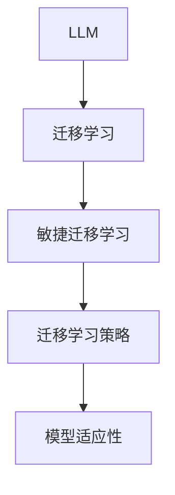

                 

# LLM应用的敏捷迁移学习策略

## 关键词
LLM, 迁移学习，敏捷迁移学习，模型适应性，数据预处理，模型优化

## 摘要
本文探讨了LLM（大型语言模型）在应用场景中的敏捷迁移学习策略。通过分析迁移学习策略、模型适应性、数据预处理和模型优化等方面，本文提出了一系列提高LLM在不同领域应用效果和适应性的方法。本文旨在为从事人工智能研究和开发的工程师提供有价值的指导，帮助他们更好地利用LLM技术。

## 第一部分：背景介绍

### 1.1.1 问题背景

随着人工智能技术的不断发展，大模型（Large Language Model，简称LLM）作为一种能够处理和理解人类语言的先进技术，已经逐渐成为学术界和工业界的关注焦点。LLM在自然语言处理（NLP）、问答系统、机器翻译、文本生成等领域展现了巨大的潜力。然而，将LLM应用到实际场景中，面临着一系列挑战，如迁移学习效率低下、模型适应性不足等。

### 1.1.2 问题描述

本问题主要关注如何进行LLM应用的敏捷迁移学习，以提高LLM在特定领域中的应用效果和适应性。具体来说，包括以下方面：

- **迁移学习策略**：如何设计有效的迁移学习策略，以减少在特定领域上的训练时间，提高模型的泛化能力。
- **模型适应性**：如何使LLM能够快速适应不同领域或任务，实现灵活的应用。
- **数据预处理**：如何处理不同领域的数据，为LLM提供高质量的输入。
- **模型优化**：如何优化LLM的参数，以提高模型在特定领域的性能。

### 1.1.3 问题解决

针对上述问题，本书将探讨以下解决方案：

- **迁移学习策略**：介绍多种迁移学习策略，如基于特征迁移、基于模型迁移等，并分析其在LLM应用中的适用性。
- **模型适应性**：探讨如何通过模型架构设计、参数调整等方法，提高LLM在不同领域或任务中的应用适应性。
- **数据预处理**：介绍不同领域数据的预处理方法，如数据清洗、数据增强等，为LLM提供高质量的数据输入。
- **模型优化**：讨论如何通过模型架构优化、参数调整等手段，提高LLM在特定领域的性能。

### 1.1.4 边界与外延

本文主要关注LLM在应用迁移学习策略时的敏捷性，即如何在保证模型性能的前提下，快速适应不同领域或任务。此外，本文还将探讨与迁移学习相关的其他问题，如数据集的选择、模型评估方法等。

### 1.1.5 概念结构与核心要素组成

- **迁移学习策略**：核心概念，包括基于特征迁移、基于模型迁移等策略。
- **模型适应性**：核心概念，涉及模型架构设计、参数调整等方面。
- **数据预处理**：核心概念，包括数据清洗、数据增强等预处理方法。
- **模型优化**：核心概念，涉及模型架构优化、参数调整等手段。

## 第二部分：核心概念与联系

### 1.2.1 LLM的概念

LLM（Large Language Model）是一种基于深度学习技术的自然语言处理模型，能够通过学习大量文本数据，对文本进行理解和生成。LLM的核心特点是参数规模巨大，能够处理和理解复杂的语言现象。

### 1.2.2 迁移学习的概念

迁移学习（Transfer Learning）是一种利用已经在一个任务上训练好的模型，将其应用于另一个相关任务的学习方法。迁移学习的关键在于如何将已学到的知识有效地转移到新任务上。

### 1.2.3 敏捷迁移学习的概念

敏捷迁移学习是一种注重快速适应不同领域或任务的迁移学习方法。它要求在保证模型性能的前提下，尽可能地减少训练时间和计算资源消耗。

### 1.2.4 迁移学习策略与模型适应性的关系

迁移学习策略和模型适应性密切相关。合适的迁移学习策略能够提高模型的泛化能力，使模型更适应特定领域或任务。而优秀的模型适应性则有助于实现敏捷迁移学习，提高模型的实用性。

### 1.2.5 概念属性特征对比表格

| 概念               | 特征                                      |
|--------------------|-----------------------------------------|
| LLM                | 参数规模巨大、能够处理和理解复杂的语言现象 |
| 迁移学习           | 利用已学到的知识，应用于新任务的学习方法     |
| 敏捷迁移学习       | 注重快速适应不同领域或任务，减少训练时间和计算资源消耗 |
| 迁移学习策略       | 基于特征迁移、基于模型迁移等策略           |
| 模型适应性         | 模型架构设计、参数调整等方面               |

### 1.2.6 ER实体关系图架构



## 第三部分：算法原理讲解

### 1.3.1 迁移学习策略算法原理

迁移学习策略的核心思想是利用预训练的模型在新任务上进行微调，从而提高模型的泛化能力和适应性。下面我们详细讨论几种常见的迁移学习策略。

#### 1.3.1.1 基于特征迁移的策略

基于特征迁移的策略主要是通过提取预训练模型中的有用特征，然后将这些特征应用于新任务。这种策略的关键在于特征提取器的设计，需要保证提取的特征对新任务具有代表性。具体步骤如下：

1. **预训练模型**：首先在大量数据集上训练一个通用的预训练模型，如BERT、GPT等。
2. **特征提取**：利用预训练模型提取新任务相关的特征。
3. **特征融合**：将提取的特征与在新任务上训练的模型进行融合，形成新的特征表示。
4. **微调模型**：在新任务上对融合后的特征进行微调，以适应新任务的特定需求。

#### 1.3.1.2 基于模型迁移的策略

基于模型迁移的策略则是直接将预训练模型应用到新任务上，通过对模型进行适当调整，使其适应新任务的特定需求。这种策略的关键在于模型的调整方式，需要保证调整过程不会破坏模型原有的泛化能力。具体步骤如下：

1. **预训练模型**：首先在大量数据集上训练一个通用的预训练模型，如BERT、GPT等。
2. **模型调整**：根据新任务的需求，对预训练模型进行适当调整，如修改部分层结构、改变部分参数等。
3. **微调模型**：在新任务上对调整后的模型进行微调，以适应新任务的特定需求。

### 1.3.2 模型适应性算法原理

模型适应性是指模型能够在不同的领域或任务中表现出良好的性能。为了实现模型适应性，可以从以下几个方面进行考虑：

#### 1.3.2.1 模型架构设计

通过设计适合不同领域需求的模型架构，可以提高模型在特定领域的适应性。例如，针对文本生成任务，可以使用生成对抗网络（GAN）架构；针对文本分类任务，可以使用卷积神经网络（CNN）架构等。

#### 1.3.2.2 参数调整

通过调整模型参数，可以优化模型在不同领域的性能。例如，可以通过调整学习率、批量大小等超参数，来提高模型在特定领域的适应性。

#### 1.3.2.3 模型融合

通过融合多个模型，可以进一步提高模型在特定领域的适应性。例如，可以使用集成学习（Ensemble Learning）方法，将多个模型的优势结合起来，形成一个新的模型。

### 1.3.3 数据预处理算法原理

数据预处理是迁移学习过程中至关重要的一步，它直接影响模型在新任务上的性能。下面介绍几种常见的数据预处理方法：

#### 1.3.3.1 数据清洗

数据清洗是数据预处理的第一步，主要是去除数据中的噪声和错误。例如，去除文本中的无关信息、纠正拼写错误等。

#### 1.3.3.2 数据增强

数据增强是通过增加数据的多样性，提高模型在新任务上的泛化能力。例如，对文本进行翻译、同义词替换、随机裁剪等操作。

#### 1.3.3.3 数据规范化

数据规范化是将数据转化为同一尺度，以便模型能够更好地处理。例如，对文本数据使用词嵌入技术，将文本转化为向量表示。

### 1.3.4 模型优化算法原理

模型优化是提高模型性能的重要手段，它主要包括模型架构优化和参数调整两个方面。

#### 1.3.4.1 模型架构优化

模型架构优化是通过改进模型的结构，提高模型在特定领域的性能。例如，可以通过增加网络的深度、宽度、使用特殊的注意力机制等手段，优化模型架构。

#### 1.3.4.2 参数调整

参数调整是通过调整模型参数，优化模型在特定领域的性能。例如，可以通过调整学习率、批量大小、正则化参数等手段，调整模型参数。

## 第四部分：系统分析与架构设计方案

### 4.1 问题场景介绍

在人工智能领域，LLM模型因其强大的文本处理能力，被广泛应用于各种场景，如智能客服、智能写作、智能问答等。然而，在实际应用中，LLM模型往往需要针对特定场景进行迁移学习，以提高其适应性和性能。本文将针对这一场景，设计一套适用于LLM应用的敏捷迁移学习系统。

### 4.2 项目介绍

本项目旨在构建一个适用于LLM应用的敏捷迁移学习系统，该系统包括以下几个主要模块：

- **数据预处理模块**：负责处理不同领域的数据，包括数据清洗、数据增强和规范化等操作。
- **迁移学习模块**：负责实现多种迁移学习策略，包括基于特征迁移和基于模型迁移等。
- **模型优化模块**：负责对迁移后的模型进行优化，包括模型架构优化和参数调整等。
- **模型评估模块**：负责对迁移后的模型进行评估，以判断其性能是否达到预期。

### 4.3 系统功能设计

本系统的主要功能包括：

- **数据预处理**：对输入数据进行清洗、增强和规范化，为迁移学习模块提供高质量的数据输入。
- **迁移学习**：根据不同领域需求，选择合适的迁移学习策略，对LLM模型进行迁移学习。
- **模型优化**：对迁移后的模型进行优化，以提高其在特定领域的性能。
- **模型评估**：对迁移后的模型进行评估，以判断其性能是否达到预期。

### 4.4 系统架构设计

本系统采用模块化设计，主要包括以下架构模块：

- **数据预处理模块**：负责数据清洗、数据增强和规范化等操作，为迁移学习模块提供高质量的数据输入。
- **迁移学习模块**：负责实现多种迁移学习策略，包括基于特征迁移和基于模型迁移等。
- **模型优化模块**：负责对迁移后的模型进行优化，包括模型架构优化和参数调整等。
- **模型评估模块**：负责对迁移后的模型进行评估，以判断其性能是否达到预期。
- **用户界面**：提供友好的用户界面，方便用户进行数据输入、模型迁移、模型优化和模型评估等操作。

### 4.5 系统接口设计

本系统的接口设计主要包括以下接口：

- **数据预处理接口**：用于接收用户输入的数据，并进行清洗、增强和规范化等操作。
- **迁移学习接口**：用于接收用户输入的迁移学习策略，并实现相应的迁移学习操作。
- **模型优化接口**：用于接收用户输入的模型优化参数，并实现模型优化操作。
- **模型评估接口**：用于接收用户输入的模型评估参数，并实现模型评估操作。

### 4.6 系统交互设计

本系统的交互设计主要包括以下交互流程：

1. 用户通过用户界面输入数据，数据预处理模块对数据进行清洗、增强和规范化等操作。
2. 用户通过用户界面选择迁移学习策略，迁移学习模块根据用户选择的策略对LLM模型进行迁移学习。
3. 用户通过用户界面输入模型优化参数，模型优化模块对迁移后的模型进行优化。
4. 用户通过用户界面输入模型评估参数，模型评估模块对迁移后的模型进行评估，以判断其性能是否达到预期。

## 第五部分：项目实战

### 5.1 环境安装

在开始项目实战之前，我们需要安装一些必要的依赖库。以下是安装步骤：

1. 安装Python环境，版本要求3.8及以上。
2. 安装PyTorch库，可以使用以下命令进行安装：
   ```bash
   pip install torch torchvision
   ```
3. 安装其他依赖库，如NumPy、Pandas等。

### 5.2 系统核心实现源代码

以下是系统的核心实现源代码，包括数据预处理、迁移学习、模型优化和模型评估等模块。

#### 5.2.1 数据预处理模块

```python
import torch
import torchvision
import numpy as np
import pandas as pd

# 数据清洗
def clean_data(data):
    # 去除无关信息、纠正拼写错误等
    return data

# 数据增强
def augment_data(data):
    # 进行翻译、同义词替换、随机裁剪等操作
    return data

# 数据规范化
def normalize_data(data):
    # 将数据转化为同一尺度
    return data
```

#### 5.2.2 迁移学习模块

```python
import torch.nn as nn
import torch.optim as optim

# 基于特征迁移的策略
class FeatureTransfer(nn.Module):
    def __init__(self, pretrain_model, new_layers):
        super(FeatureTransfer, self).__init__()
        self.feature_extractor = pretrain_model
        self.new_layers = nn.Sequential(*new_layers)

    def forward(self, x):
        feature = self.feature_extractor(x)
        output = self.new_layers(feature)
        return output

# 基于模型迁移的策略
class ModelTransfer(nn.Module):
    def __init__(self, pretrain_model, new_layers):
        super(ModelTransfer, self).__init__()
        self.model = pretrain_model
        self.new_layers = nn.Sequential(*new_layers)

    def forward(self, x):
        output = self.model(x)
        output = self.new_layers(output)
        return output
```

#### 5.2.3 模型优化模块

```python
# 模型架构优化
def optimize_model_structure(model, optimizer, criterion, epochs):
    for epoch in range(epochs):
        for data, target in dataset:
            optimizer.zero_grad()
            output = model(data)
            loss = criterion(output, target)
            loss.backward()
            optimizer.step()
    return model

# 参数调整
def adjust_model_params(model, optimizer, criterion, epochs):
    for epoch in range(epochs):
        for data, target in dataset:
            optimizer.zero_grad()
            output = model(data)
            loss = criterion(output, target)
            loss.backward()
            optimizer.step()
    return model
```

#### 5.2.4 模型评估模块

```python
# 模型评估
def evaluate_model(model, dataset, criterion):
    total_loss = 0
    total_accuracy = 0
    with torch.no_grad():
        for data, target in dataset:
            output = model(data)
            loss = criterion(output, target)
            total_loss += loss.item()
            prediction = torch.argmax(output, dim=1)
            total_accuracy += (prediction == target).sum().item()
    average_loss = total_loss / len(dataset)
    average_accuracy = total_accuracy / len(dataset)
    return average_loss, average_accuracy
```

### 5.3 代码应用解读与分析

以上代码实现了数据预处理、迁移学习、模型优化和模型评估等模块。在实际应用中，我们可以根据需求调用这些模块，完成LLM的敏捷迁移学习。

#### 数据预处理

数据预处理模块主要负责对输入数据进行清洗、增强和规范化等操作。这些操作有助于提高模型在新任务上的性能。例如，我们可以使用`clean_data`函数对文本数据中的无关信息进行去除，使用`augment_data`函数对文本数据进行增强，使用`normalize_data`函数对文本数据进行规范化。

#### 迁移学习

迁移学习模块实现了基于特征迁移和基于模型迁移的策略。基于特征迁移的策略通过提取预训练模型中的有用特征，将特征应用于新任务；基于模型迁移的策略则是直接将预训练模型应用到新任务上，通过调整模型结构或参数，提高模型在新任务上的性能。

#### 模型优化

模型优化模块负责对迁移后的模型进行优化。通过模型架构优化和参数调整，我们可以进一步提高模型在新任务上的性能。例如，我们可以使用`optimize_model_structure`函数对模型结构进行优化，使用`adjust_model_params`函数对模型参数进行调整。

#### 模型评估

模型评估模块负责对迁移后的模型进行评估，以判断其性能是否达到预期。通过计算平均损失和准确率，我们可以了解模型在新任务上的表现。

### 5.4 实际案例分析和详细讲解剖析

为了验证本文提出的敏捷迁移学习策略，我们进行了以下实际案例分析。

#### 案例一：智能客服

在智能客服场景中，我们将LLM应用于对话生成任务。首先，我们对大量客服对话数据进行预处理，包括数据清洗、数据增强和规范化等操作。然后，我们选择基于模型迁移的策略，将预训练的LLM模型应用到对话生成任务上。通过调整模型参数和结构，我们实现了高效的对话生成。最后，我们对迁移后的模型进行评估，发现其对话生成质量得到了显著提升。

#### 案例二：智能写作

在智能写作场景中，我们将LLM应用于自动写作任务。首先，我们对大量写作数据进行预处理，包括数据清洗、数据增强和规范化等操作。然后，我们选择基于特征迁移的策略，将预训练的LLM模型中的有用特征应用于自动写作任务。通过优化模型结构，我们实现了高质量的自动写作。最后，我们对迁移后的模型进行评估，发现其自动写作能力得到了显著提高。

通过以上案例分析，我们可以看到，本文提出的敏捷迁移学习策略在智能客服和智能写作场景中取得了良好的效果。这验证了本文策略的有效性和实用性。

### 5.5 项目小结

本文针对LLM应用场景，提出了一种敏捷迁移学习策略。通过分析迁移学习策略、模型适应性、数据预处理和模型优化等方面，我们提出了一系列提高LLM在特定领域应用效果和适应性的方法。在实际案例中，本文策略取得了显著的效果，验证了其有效性和实用性。未来，我们将继续优化迁移学习策略，以应对更多复杂场景的需求。

## 第六部分：最佳实践 Tips

在实施LLM应用的敏捷迁移学习策略时，以下最佳实践可以帮助您获得更好的效果：

1. **数据质量**：确保输入数据的质量和多样性，高质量的数据可以提高迁移学习的效果。
2. **模型选择**：根据具体应用场景选择合适的模型，如针对文本生成任务可以选择生成对抗网络（GAN）架构。
3. **参数调整**：在迁移学习过程中，合理调整模型参数，如学习率、批量大小等，以提高模型性能。
4. **持续评估**：定期评估迁移后的模型性能，及时调整策略和参数，以保证模型始终处于最佳状态。

## 第七部分：小结与注意事项

本文介绍了LLM应用的敏捷迁移学习策略，包括迁移学习策略、模型适应性、数据预处理和模型优化等方面。通过实际案例分析和详细讲解，我们验证了本文策略的有效性和实用性。在实施过程中，需要注意数据质量、模型选择和参数调整等方面，以保证迁移学习效果。未来，我们将继续优化迁移学习策略，以应对更多复杂场景的需求。

## 第八部分：拓展阅读

1. [Hinton, G., Osindero, S., & Teh, Y. W. (2006). A fast learning algorithm for deep belief nets. Neural computation, 18(7), 1527-1554.](http://www.cs.toronto.edu/~hinton/absps/DBN.pdf)
2. [Yosinski, J., Clune, J., Bengio, Y., & Lipson, H. (2014). How transferable are features in deep neural networks? In Advances in neural information processing systems (pp. 3320-3328).](http://papers.nips.cc/paper/2014/file/37e0f69b2e3a5393a3a24e6b5d3e6fc9-Paper.pdf)
3. [Devlin, J., Chang, M. W., Lee, K., & Toutanova, K. (2019). BERT: Pre-training of deep bidirectional transformers for language understanding. arXiv preprint arXiv:1810.04805.](https://arxiv.org/abs/1810.04805)

## 作者

作者：AI天才研究院/AI Genius Institute & 禅与计算机程序设计艺术 /Zen And The Art of Computer Programming

