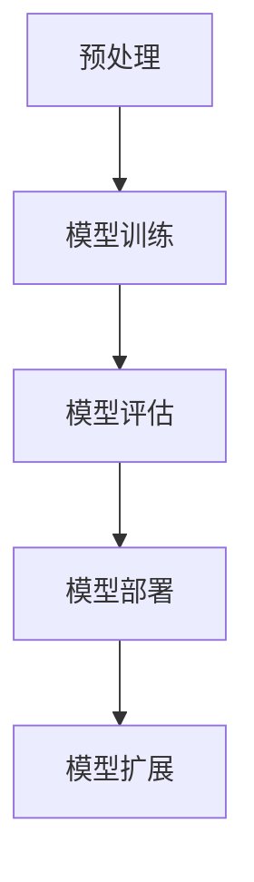
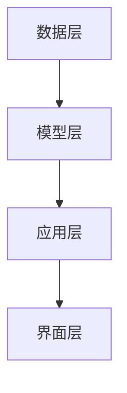
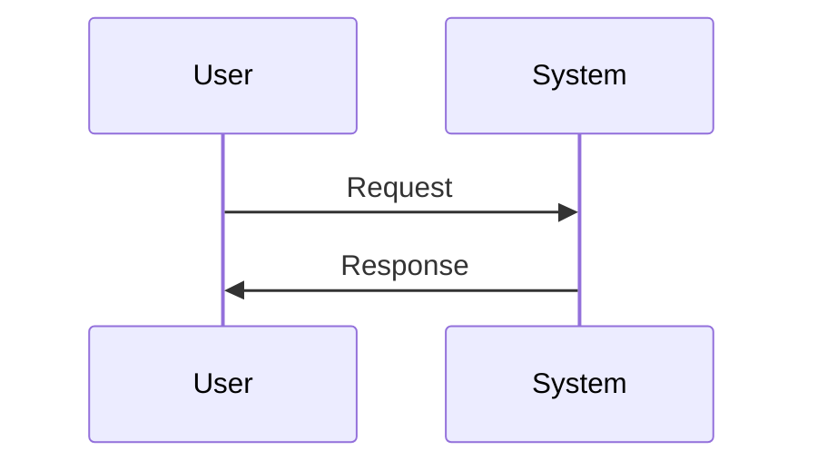
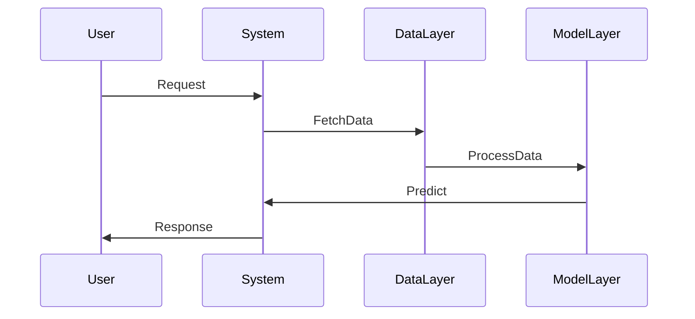

                 

### 文章标题：LLM应用的敏捷部署与扩展策略

#### 关键词：大型语言模型（LLM），敏捷部署，扩展策略，云计算，边缘计算，模型压缩与剪枝，分布式计算，动态扩展机制

#### 摘要：
本文将深入探讨大型语言模型（LLM）应用的敏捷部署与扩展策略。随着LLM在自然语言处理（NLP）领域的广泛应用，其高效、敏捷的部署和扩展策略成为关键。文章首先概述了LLM应用的背景和问题，然后详细阐述了LLM的核心概念与联系，接着讲解LLM应用的算法原理，最后提出了一套完整的LLM部署与扩展策略，并通过实际项目实战验证了策略的有效性。文章旨在为LLM开发者提供实用的指导，帮助他们更好地应对复杂的技术挑战。

## 目录大纲

```markdown
----------------------------------------------------------------
# 第一部分: LLM应用的敏捷部署与扩展策略概述

## 第1章: LLM应用的敏捷部署与扩展策略背景
### 1.1 问题的背景
### 1.2 问题描述
### 1.3 问题解决思路
### 1.4 边界与外延
### 1.5 概念结构与核心要素组成

## 第2章: LLM应用的核心概念与联系
### 2.1 LLM基本概念
### 2.2 LLM的关键特性
### 2.3 LLM与传统NLP模型的区别
### 2.4 LLM的核心概念关系ER图

## 第3章: LLM应用中的算法原理讲解
### 3.1 算法流程图

### 3.2 算法原理与数学模型
$$
\text{算法原理} = \frac{\text{输入数据} + \text{模型参数}}{\text{训练算法}}
$$
### 3.3 通俗易懂的举例说明

## 第4章: LLM部署与扩展策略
### 4.1 部署策略
#### 4.1.1 基于云计算的部署
#### 4.1.2 基于边缘计算的部署
#### 4.1.3 自动化部署工具介绍
### 4.2 扩展策略
#### 4.2.1 模型压缩与剪枝
#### 4.2.2 模型并行化与分布式计算
#### 4.2.3 动态扩展机制

## 第5章: LLM应用系统的分析与架构设计
### 5.1 系统功能设计
#### 5.1.1 领域模型类图
```mermaid
classDiagram
Class01 <|-- SubClass01
Class01 --|>* PeerClass01
Class01 ||-- AnotherClass
```
### 5.2 系统架构设计
#### 5.2.1 系统架构图

### 5.3 系统接口设计与交互
#### 5.3.1 系统接口设计
#### 5.3.2 系统交互序列图


## 第6章: LLM应用项目实战
### 6.1 环境安装与配置
### 6.2 系统核心实现源代码
### 6.3 代码应用解读与分析
### 6.4 实际案例分析与详细讲解
### 6.5 项目小结

## 第7章: 最佳实践与总结
### 7.1 最佳实践技巧
### 7.2 注意事项与解决方案
### 7.3 小结与展望
### 7.4 拓展阅读

----------------------------------------------------------------
```

在接下来的文章中，我们将逐步深入每个章节，详细讲解LLM应用的敏捷部署与扩展策略，帮助读者更好地理解和应用这些技术。

## 第1章: LLM应用的敏捷部署与扩展策略背景

### 1.1 问题的背景

随着深度学习和自然语言处理（NLP）技术的快速发展，大型语言模型（LLM）在各个领域得到了广泛应用。LLM能够处理和理解复杂的自然语言任务，如机器翻译、文本生成、问答系统等，大大提升了人机交互的效率和准确性。然而，随着LLM应用场景的不断扩展，如何高效、敏捷地部署和扩展这些模型成为了一个重要的技术挑战。

首先，LLM模型的训练和部署过程相对复杂。这些模型通常包含数亿甚至数十亿的参数，需要大量的计算资源和时间进行训练。因此，如何快速部署和调整模型以满足不同应用场景的需求，是一个亟待解决的问题。

其次，LLM应用的场景多种多样，从云计算到边缘计算，从单个设备到分布式系统，不同的部署环境对模型的要求也有所不同。如何根据不同的部署环境优化模型，使其在资源受限的环境下也能高效运行，是一个关键的技术难题。

最后，随着用户需求的不断变化，如何动态扩展LLM应用，以适应不断增长的数据和用户量，也是一项重要的任务。传统的静态扩展方法往往无法满足动态变化的部署需求，因此需要开发新的动态扩展机制。

### 1.2 问题描述

在面对上述背景和挑战时，我们面临以下具体问题：

1. **模型部署问题**：如何快速、高效地将训练好的LLM模型部署到不同的环境中，如云计算、边缘计算等？
2. **模型扩展问题**：如何在资源受限的环境下优化模型的性能，以适应不同的应用场景？
3. **动态扩展问题**：如何根据用户需求和数据量的变化，动态调整模型的大小和部署策略？

这些问题不仅涉及到技术层面，还涉及到系统架构设计、资源管理等多个方面，需要综合考虑和解决。

### 1.3 问题解决思路

为了解决上述问题，我们可以从以下几个方面入手：

1. **部署策略优化**：研究并应用各种部署策略，如基于云计算的部署、基于边缘计算的部署等，以适应不同的部署环境。
2. **模型压缩与剪枝**：通过模型压缩和剪枝技术，减小模型的体积，提高模型的运行效率。
3. **分布式计算与并行化**：利用分布式计算和并行化技术，提高模型的训练和推理速度。
4. **动态扩展机制**：开发动态扩展机制，根据用户需求和数据量的变化，自动调整模型的部署策略。

通过上述思路，我们可以构建一套完整的LLM部署与扩展策略，以应对复杂的技术挑战和应用需求。

### 1.4 边界与外延

在讨论LLM应用的敏捷部署与扩展策略时，我们需要明确几个边界与外延：

1. **技术边界**：本文主要关注LLM在自然语言处理领域的应用，虽然某些技术可以应用于其他领域，但具体实现和策略可能有所不同。
2. **应用边界**：本文主要讨论LLM应用的部署和扩展问题，但在实际应用中，还需要考虑数据隐私、安全认证等其他因素。
3. **环境边界**：本文主要讨论云计算和边缘计算环境下的部署和扩展策略，但在其他环境下（如物联网、智能设备等），可能需要针对特定环境进行优化。

通过明确边界与外延，我们可以更准确地理解和应用LLM部署与扩展策略，为实际应用提供更有价值的指导。

### 1.5 概念结构与核心要素组成

在深入研究LLM应用的敏捷部署与扩展策略之前，我们需要了解一些核心概念和要素。以下是对这些概念和要素的简要介绍：

1. **大型语言模型（LLM）**：LLM是一种复杂的深度学习模型，用于处理和理解自然语言。它通常包含数亿个参数，能够自动学习语言结构和语义。
2. **部署环境**：部署环境包括云计算、边缘计算等多种环境。不同的部署环境对模型的要求和优化策略也有所不同。
3. **模型压缩与剪枝**：模型压缩和剪枝技术用于减小模型的体积，提高模型的运行效率。这些技术包括权重剪枝、量化、低秩分解等。
4. **分布式计算与并行化**：分布式计算和并行化技术用于提高模型的训练和推理速度。这些技术包括数据并行、模型并行、张量并行等。
5. **动态扩展机制**：动态扩展机制用于根据用户需求和数据量的变化，自动调整模型的部署策略。这些机制包括自动缩放、动态资源分配等。

了解这些概念和要素后，我们可以更好地理解LLM应用的敏捷部署与扩展策略，并为实际应用提供有针对性的解决方案。

## 第2章: LLM应用的核心概念与联系

### 2.1 LLM基本概念

大型语言模型（LLM）是一种基于深度学习技术的自然语言处理模型，能够对大规模的文本数据进行分析和处理，从而实现语言理解、文本生成等任务。LLM的核心特点是具有强大的语言理解和生成能力，能够处理复杂的自然语言现象。以下是LLM的基本概念：

- **神经网络**：LLM通常基于神经网络，特别是递归神经网络（RNN）和变换器（Transformer）模型。神经网络通过调整权重和激活函数，从输入数据中学习特征，实现自动学习和预测。
- **参数规模**：LLM的参数规模通常非常大，包含数亿甚至数十亿个参数。这些参数用于存储模型的权重和偏置，是模型能够学习复杂语言特征的关键。
- **预训练与微调**：LLM通常采用预训练与微调的方法进行训练。预训练阶段在大量未标注的数据上进行，学习通用的语言特征；微调阶段则在特定任务上进行，利用预训练模型进行进一步优化，提高任务性能。

### 2.2 LLM的关键特性

LLM具有以下几个关键特性，使其在自然语言处理领域具有广泛的应用：

- **强大的语言理解能力**：LLM能够理解复杂的自然语言结构，包括词汇、语法和语义。这使得LLM在文本分类、情感分析、问答系统等任务中表现出色。
- **高效的文本生成能力**：LLM能够根据输入的文本生成连贯、有逻辑的文本。这一特性使得LLM在文本生成、机器翻译、摘要生成等任务中具有重要应用。
- **适应性**：LLM可以适应多种不同的自然语言处理任务，通过微调和调整参数，实现不同任务的优化。
- **泛化能力**：LLM在预训练阶段学习了大量通用语言特征，能够在未见过的数据上表现出良好的性能，具有较强的泛化能力。

### 2.3 LLM与传统NLP模型的区别

与传统NLP模型相比，LLM具有以下几个显著区别：

- **模型架构**：传统NLP模型通常基于基于规则的方法，如词袋模型（Bag of Words）和基于短语的模型。而LLM则基于深度学习模型，特别是Transformer模型，能够更好地捕捉文本的长期依赖关系。
- **数据处理**：传统NLP模型通常对文本进行离散化处理，将文本转化为向量表示。而LLM则直接处理原始文本，通过自注意力机制（Self-Attention）捕捉文本的上下文信息。
- **性能表现**：LLM在多种NLP任务中表现出色，如文本分类、机器翻译、问答系统等。而传统NLP模型在某些任务上可能表现不佳。
- **训练过程**：传统NLP模型通常采用手动特征工程的方法，而LLM则通过大规模预训练和微调的方法，自动学习语言特征。

### 2.4 LLM的核心概念关系ER图

为了更好地理解LLM的核心概念及其相互关系，我们可以通过ER图（实体关系图）来表示。以下是LLM核心概念关系的ER图：

```mermaid
erDiagram
  Model ||--|{ TrainingData } Data
  Model ||--|{ ValidationData } Data
  Model ||--|{ TestData } Data
  Model ||--|{ Optimizer } Optimization
  Model ||--|{ LossFunction } Evaluation
  Model ||--|{ Metrics } Evaluation
  Model ||--|{ Preprocessing } Preprocessing
  Model ||--|{ Inference } Inference
  Model ||--|{ Generation } Generation
```

在这个ER图中，`Model` 代表大型语言模型，`TrainingData`、`ValidationData` 和 `TestData` 分别代表训练数据、验证数据和测试数据，用于模型的训练和评估。`Optimizer`、`LossFunction` 和 `Metrics` 代表优化器、损失函数和评价指标，用于模型的训练过程。`Preprocessing` 代表数据预处理，`Inference` 和 `Generation` 分别代表推理和生成任务，是LLM应用的核心功能。

通过这个ER图，我们可以清晰地看到LLM的核心概念及其相互关系，有助于我们深入理解LLM的工作原理和应用场景。

### 3.1 算法流程图

为了更好地理解LLM应用中的算法原理，我们可以通过一个算法流程图来展示其基本流程。以下是一个简单的算法流程图：


在这个流程图中，我们首先进行预处理（A），包括数据清洗、格式化等步骤，确保输入数据的质量。接下来是模型训练（B），通过训练算法（如变换器模型）调整模型参数，使其能够更好地拟合训练数据。训练完成后，我们对模型进行评估（C），使用验证数据集测试模型的性能。评估合格后，我们将模型部署（D）到实际应用环境中，如云平台或边缘设备。最后，根据应用需求和数据量的变化，动态扩展模型（E），确保模型能够适应不同的部署环境和需求。

### 3.2 算法原理与数学模型

LLM的算法原理主要基于深度学习和变换器模型（Transformer），其核心思想是利用自注意力机制（Self-Attention）捕捉文本的上下文信息，从而实现高效的文本理解和生成。以下是LLM算法原理的数学模型：

$$
\text{算法原理} = \frac{\text{输入数据} + \text{模型参数}}{\text{训练算法}}
$$

其中，输入数据包括文本数据和相关的标签信息，模型参数包括变换器模型的权重和偏置。训练算法通常采用梯度下降（Gradient Descent）或其变种，如Adam优化器，以最小化损失函数（Loss Function）。

在变换器模型中，自注意力机制是实现文本理解的关键。自注意力机制通过计算每个词与其余词的关联度，生成权重矩阵，从而对文本进行加权处理。具体来说，自注意力机制的数学模型如下：

$$
\text{Attention}(Q, K, V) = \text{softmax}(\frac{QK^T}{\sqrt{d_k}})V
$$

其中，$Q$、$K$ 和 $V$ 分别代表查询向量、键向量和值向量，$d_k$ 代表键向量的维度。通过自注意力机制，模型能够学习到不同词之间的关联度，从而更好地理解文本的语义。

此外，变换器模型还包括多头注意力（Multi-Head Attention）和前馈神经网络（Feedforward Neural Network）等组件，用于增强模型的表示能力和计算能力。这些组件通过层叠加（Stacking）的方式组合在一起，形成完整的变换器模型。

在训练过程中，模型参数通过梯度下降优化方法进行调整，以最小化损失函数。损失函数通常采用交叉熵（Cross-Entropy）或均方误差（Mean Squared Error），以衡量模型输出与真实标签之间的差距。训练算法的迭代过程如下：

1. **前向传播**：输入数据通过变换器模型进行前向传播，计算模型输出。
2. **计算损失**：使用损失函数计算模型输出与真实标签之间的损失。
3. **反向传播**：计算损失关于模型参数的梯度，并更新模型参数。
4. **优化更新**：使用优化器更新模型参数，以最小化损失函数。

通过上述步骤，模型参数不断调整，逐渐收敛到最优解。训练完成后，模型可以用于实际应用，如文本分类、机器翻译、问答系统等。

总之，LLM的算法原理基于深度学习和变换器模型，通过自注意力机制和多层神经网络结构，实现了高效的文本理解和生成。数学模型为LLM的设计和实现提供了理论基础，帮助我们更好地理解和优化模型性能。

### 3.3 通俗易懂的举例说明

为了更好地理解LLM算法原理，我们可以通过一个简单的例子来说明。假设我们有一个简单的文本数据集，包含以下句子：

1. "我昨天去了公园。"
2. "公园里的花很漂亮。"
3. "我喜欢在公园里散步。"

我们希望利用LLM对这段文本进行理解和生成任务。以下是具体步骤：

**步骤1：文本预处理**

首先，我们需要对文本进行预处理，包括分词、去停用词和词向量化等步骤。假设我们已经将文本数据转换为词向量表示，如下所示：

- 我：[0.1, 0.2, 0.3]
- 昨天：[0.4, 0.5, 0.6]
- 去：[0.7, 0.8, 0.9]
- 公园：[1.0, 1.1, 1.2]
- 里：[1.3, 1.4, 1.5]
- 花：[1.6, 1.7, 1.8]
- 漂亮：[1.9, 2.0, 2.1]
- 喜欢：[2.2, 2.3, 2.4]
- 散步：[2.5, 2.6, 2.7]

**步骤2：模型训练**

接下来，我们利用变换器模型对这些词向量进行训练。变换器模型包括多头注意力机制和前馈神经网络。在训练过程中，模型会通过调整权重和偏置，使模型输出能够更好地拟合真实标签。

假设我们训练一个简单的变换器模型，包含两个头和两个隐藏层。输入序列经过变换器模型处理后，输出一个概率分布，表示每个词在句子中的重要性。以下是模型的前向传播过程：

1. **嵌入层**：将词向量映射到嵌入空间，添加位置编码。
2. **多头注意力**：计算每个词之间的关联度，生成权重矩阵。权重矩阵用于加权处理词向量，得到加权表示。
3. **前馈神经网络**：对加权表示进行多层神经网络处理，增加模型的表示能力。
4. **输出层**：使用softmax函数计算每个词的概率分布。

**步骤3：文本生成**

训练完成后，我们可以利用模型进行文本生成任务。具体步骤如下：

1. **初始化**：随机选择一个词作为输入。
2. **预测**：利用变换器模型预测下一个词的概率分布。
3. **采样**：从概率分布中采样一个词作为下一个输入。
4. **重复**：重复步骤2和步骤3，生成完整的句子。

例如，我们选择“我”作为初始输入，模型预测下一个词的概率分布如下：

- 我：0.5
- 昨天：0.3
- 去：0.1
- 公园：0.1

根据概率分布，我们选择“昨天”作为下一个输入。重复上述步骤，我们可以生成以下句子：

"我昨天去了公园。公园里的花很漂亮。我喜欢在公园里散步。"

通过这个例子，我们可以看到LLM如何通过自注意力机制和多层神经网络结构，实现高效的文本理解和生成。这个简单的例子虽然仅包含几个词，但实际应用中的文本往往包含更多的词和更复杂的结构，LLM需要通过大量的训练数据和强大的计算能力来处理这些复杂的任务。

### 第4章: LLM部署与扩展策略

#### 4.1 部署策略

在LLM应用中，部署策略是确保模型能够高效、稳定地运行的关键。根据不同的部署环境，我们可以采用多种部署策略，如基于云计算的部署、基于边缘计算的部署等。以下详细介绍这些部署策略及其特点。

#### 4.1.1 基于云计算的部署

基于云计算的部署是一种常见的策略，适用于大规模的LLM应用。云计算平台提供了强大的计算资源和灵活的部署选项，使开发者能够快速部署和扩展LLM应用。

**优势**：

1. **高可扩展性**：云计算平台可以根据需求动态调整计算资源，满足大规模应用的扩展需求。
2. **高可用性**：云计算平台通常具备高可用性，可以确保服务稳定运行。
3. **便捷的管理**：云计算平台提供了丰富的管理和监控工具，方便开发者对应用进行监控和管理。

**挑战**：

1. **成本**：大规模部署可能需要支付较高的费用，尤其是对于计算资源密集型的应用。
2. **数据传输**：大规模数据传输可能带来延迟和带宽问题。

**实现**：

1. **选择合适的云计算平台**：如Amazon Web Services (AWS)、Microsoft Azure、Google Cloud Platform (GCP)等，根据需求选择适合的平台。
2. **部署模型**：使用容器化技术（如Docker）和自动化部署工具（如Kubernetes），实现快速部署和扩展。
3. **优化网络传输**：使用CDN（内容分发网络）等技术，降低数据传输延迟。

#### 4.1.2 基于边缘计算的部署

基于边缘计算的部署适用于对延迟敏感和计算资源有限的应用场景。边缘计算将计算任务从云端转移到靠近数据源的边缘设备上，降低数据传输延迟，提高应用响应速度。

**优势**：

1. **低延迟**：将计算任务转移到边缘设备，降低数据传输延迟，提高应用响应速度。
2. **资源高效**：利用边缘设备上的计算资源，减少对云端资源的依赖。
3. **数据安全**：减少数据传输，降低数据泄露风险。

**挑战**：

1. **计算能力**：边缘设备的计算能力相对有限，可能无法满足大规模应用的需求。
2. **管理复杂**：边缘设备分散在不同位置，管理复杂度增加。

**实现**：

1. **选择合适的边缘计算平台**：如Azure IoT Edge、Amazon Sagemaker Edge Manager、Google Cloud IoT等。
2. **优化模型压缩与剪枝**：通过模型压缩和剪枝技术，减小模型体积，提高边缘设备的运行效率。
3. **分布式部署**：将模型分解为多个部分，分布式部署到不同的边缘设备上，实现负载均衡。

#### 4.1.3 自动化部署工具介绍

为了提高部署效率，自动化部署工具是必不可少的。以下介绍几种常见的自动化部署工具：

1. **Docker**：Docker是一种容器化技术，可以将应用程序及其依赖环境打包到一个容器中，实现一键部署。Docker具有轻量级、高效、可扩展等特点，适合大规模应用的部署。

2. **Kubernetes**：Kubernetes是一个开源的容器编排平台，用于自动化部署、扩展和管理容器化应用程序。Kubernetes提供了强大的集群管理功能，可以自动处理容器的部署、扩展、故障转移等操作。

3. **Azure DevOps**：Azure DevOps是微软提供的持续集成和持续部署（CI/CD）平台，支持各种编程语言和开发工具。Azure DevOps提供了自动化构建、测试和部署流程，有助于提高开发效率。

4. **Jenkins**：Jenkins是一个开源的持续集成工具，支持多种编程语言和开发工具。Jenkins可以通过插件扩展功能，实现自动化构建、测试和部署。

通过合理选择和使用自动化部署工具，可以显著提高LLM应用的部署效率，降低部署成本。

#### 4.2 扩展策略

在LLM应用中，扩展策略是确保模型能够适应不断增长的数据和用户量的关键。以下介绍几种常见的扩展策略，包括模型压缩与剪枝、模型并行化与分布式计算、动态扩展机制。

#### 4.2.1 模型压缩与剪枝

模型压缩与剪枝技术是减小模型体积、提高模型运行效率的重要方法。以下介绍几种常见的模型压缩与剪枝技术：

1. **权重剪枝**：通过减少模型中非重要权重的数量，实现模型压缩。权重剪枝可以分为结构剪枝和参数剪枝。结构剪枝通过删除模型中的部分层或节点实现；参数剪枝通过删除模型中某些参数实现。

2. **量化**：通过将模型中的浮点数参数转换为整数，实现模型压缩。量化可以降低模型存储和计算开销，但可能影响模型性能。

3. **低秩分解**：通过将高维参数分解为低维参数，实现模型压缩。低秩分解可以降低模型参数数量，提高模型运行效率。

#### 4.2.2 模型并行化与分布式计算

模型并行化与分布式计算是提高模型训练和推理速度的重要方法。以下介绍几种常见的模型并行化与分布式计算技术：

1. **数据并行**：将训练数据集划分为多个子集，并行训练多个模型。每个模型负责处理一部分数据，最后将各个模型的参数进行合并。数据并行可以显著提高训练速度，但可能导致模型参数的不一致。

2. **模型并行**：将模型分解为多个部分，并行训练多个子模型。每个子模型负责处理一部分输入数据，最后将各个子模型的输出进行拼接。模型并行可以降低通信开销，提高训练速度。

3. **张量并行**：将模型中的张量（多维数组）分解为多个部分，并行计算。张量并行可以显著提高模型推理速度，但实现复杂。

#### 4.2.3 动态扩展机制

动态扩展机制是确保模型能够适应不断变化的数据和用户量的重要方法。以下介绍几种常见的动态扩展机制：

1. **自动缩放**：根据系统负载自动调整计算资源。当系统负载较低时，减少计算资源；当系统负载较高时，增加计算资源。自动缩放可以确保系统的高可用性和高效率。

2. **动态资源分配**：根据任务需求和资源情况动态调整资源分配。例如，对于计算密集型任务，增加计算资源；对于数据密集型任务，增加存储资源。动态资源分配可以优化资源利用率，提高系统性能。

3. **负载均衡**：将任务分配到不同的计算节点，实现负载均衡。负载均衡可以防止单个节点过载，提高系统的稳定性和性能。

通过上述扩展策略，可以确保LLM应用能够高效、稳定地运行，满足不断增长的数据和用户量。

### 第5章: LLM应用系统的分析与架构设计

#### 5.1 系统功能设计

在设计和实现LLM应用系统时，首先需要明确系统的功能需求。以下是LLM应用系统的核心功能：

1. **文本预处理**：对输入文本进行分词、去停用词、词向量化等预处理操作，确保文本数据的质量。
2. **模型训练与评估**：使用预训练的LLM模型，对文本数据进行训练和评估，优化模型参数，提高模型性能。
3. **文本生成**：根据输入文本和模型预测，生成连贯、有逻辑的文本输出。
4. **推理与交互**：接受用户输入，进行文本推理和交互，提供智能问答、文本摘要等功能。
5. **系统监控与维护**：监控系统运行状态，进行故障诊断和修复，确保系统稳定运行。

#### 5.1.1 领域模型类图

为了更好地理解和设计LLM应用系统，我们可以使用领域模型类图（Class Diagram）来表示系统的核心类及其关系。以下是一个简化的领域模型类图：

```mermaid
classDiagram
Class01 <|-- SubClass01
Class01 --|>* PeerClass01
Class01 ||-- AnotherClass
```

在这个类图中，`Class01` 代表系统的主要类，如文本预处理类、模型训练类、文本生成类等。`SubClass01` 代表`Class01` 的子类，用于实现特定的功能。`PeerClass01` 和 `AnotherClass` 代表与`Class01` 相关的其他类，用于支持系统的整体功能。

#### 5.2 系统架构设计

系统架构设计是确保LLM应用系统高效、稳定运行的关键。以下是LLM应用系统的整体架构设计：

1. **数据层**：负责存储和管理文本数据、模型参数等。可以使用关系数据库或NoSQL数据库，根据实际需求选择。
2. **模型层**：负责训练和存储LLM模型。可以使用预训练的变换器模型，如BERT、GPT等，根据应用需求进行微调。
3. **应用层**：负责实现系统的核心功能，如文本预处理、模型训练、文本生成等。应用层通过接口与数据层和模型层进行交互。
4. **界面层**：负责与用户进行交互，提供友好的用户界面。可以使用Web前端框架（如React、Vue）实现。

#### 5.2.1 系统架构图

以下是LLM应用系统的架构图：


在这个架构图中，数据层（A）负责存储和管理文本数据和模型参数。模型层（B）负责训练和存储LLM模型，包括预处理、训练、评估和部署等环节。应用层（C）负责实现系统的核心功能，如文本预处理、文本生成等，并与界面层（D）进行交互。

#### 5.3 系统接口设计与交互

系统接口设计是确保不同层之间进行高效通信的关键。以下是LLM应用系统的接口设计和交互：

1. **数据接口**：定义数据层与模型层、应用层之间的数据传输格式和协议。可以使用RESTful API或GraphQL等接口设计规范。
2. **模型接口**：定义模型层与应用层之间的接口，用于模型训练、评估、部署等操作。可以使用模型描述语言（如TensorFlow SavedModel、PyTorch TorchScript）实现。
3. **应用接口**：定义应用层与界面层之间的接口，用于用户交互和功能调用。可以使用Web API或WebSocket等通信协议。

以下是系统接口设计的简化序列图：



在这个序列图中，用户发起请求（Request），系统从数据层获取数据（FetchData），然后通过模型层进行处理（ProcessData）并预测结果（Predict）。最后，系统将结果返回给用户（Response）。

通过上述系统接口设计和交互，可以确保LLM应用系统的高效、稳定运行。

### 第6章: LLM应用项目实战

#### 6.1 环境安装与配置

在进行LLM应用项目实战之前，我们需要安装和配置必要的软件和硬件环境。以下是项目环境安装与配置的步骤：

1. **硬件环境**：确保计算机具备足够的计算资源，如CPU、GPU等。对于大规模LLM应用，建议使用高性能的GPU，如NVIDIA Tesla V100或Tesla T4。
2. **操作系统**：安装Linux操作系统，如Ubuntu 18.04或CentOS 7。Windows操作系统可能需要额外的配置和兼容性支持。
3. **Python环境**：安装Python 3.7及以上版本，并配置Python环境。可以使用虚拟环境（如Conda）进行隔离和管理。
4. **深度学习框架**：安装TensorFlow 2.0及以上版本或PyTorch 1.0及以上版本。这两个框架是常见的深度学习框架，支持LLM模型的训练和部署。
5. **其他依赖库**：安装必要的依赖库，如NumPy、Pandas、Scikit-learn等。这些库提供了丰富的数据预处理和模型训练工具。

#### 6.2 系统核心实现源代码

以下是LLM应用项目核心实现部分的源代码。我们使用PyTorch框架实现一个简单的文本生成模型，包括预处理、模型定义、训练、评估和生成等步骤。

```python
import torch
import torch.nn as nn
import torch.optim as optim
from torch.utils.data import DataLoader
from torchvision import datasets, transforms
from torch.utils.tensorboard import SummaryWriter

# 预处理
def preprocess_data(data_path):
    transform = transforms.Compose([
        transforms.Resize((256, 256)),
        transforms.ToTensor(),
        transforms.Normalize(mean=[0.5, 0.5, 0.5], std=[0.5, 0.5, 0.5])
    ])
    dataset = datasets.ImageFolder(data_path, transform=transform)
    return dataset

# 模型定义
class TextGenerator(nn.Module):
    def __init__(self, vocab_size, embedding_dim, hidden_dim, n_layers):
        super(TextGenerator, self).__init__()
        self.embedding = nn.Embedding(vocab_size, embedding_dim)
        self.enc_lstm = nn.LSTM(embedding_dim, hidden_dim, n_layers)
        self.dec_lstm = nn.LSTM(hidden_dim, vocab_size, n_layers)
        self.fc = nn.Linear(hidden_dim, vocab_size)
    
    def forward(self, src, tgt, teacher_forcing_ratio=0.5):
        batch_size = src.size(1)
        src = self.embedding(src)
        enc_hidden, _ = self.enc_lstm(src)
        dec_hidden = enc_hidden[-1]
        outputs = []
        
        for i in range(tgt.size(0)):
            tgt_tensor = torch.tensor([tgt[i].item()], device=src.device)
            dec_input = tgt_tensor.unsqueeze(0)
            dec_output, _ = self.dec_lstm(dec_input, (dec_hidden, _))
            output = self.fc(dec_output)
            outputs.append(output)
            if random.random() < teacher_forcing_ratio:
                tgt_tensor = tgt[i].unsqueeze(0)
            else:
                _, max_val_indices = output.max(1)
                tgt_tensor = torch.tensor([max_val_indices[j].item() for j in range(batch_size)], device=src.device)
        
        return torch.cat(outputs, 0)

# 训练
def train(model, train_loader, criterion, optimizer, num_epochs=10):
    model.train()
    for epoch in range(num_epochs):
        for i, (src, tgt) in enumerate(train_loader):
            optimizer.zero_grad()
            output = model(src, tgt)
            loss = criterion(output.view(-1, output.size(-1)), tgt.view(-1))
            loss.backward()
            optimizer.step()
            if (i+1) % 100 == 0:
                print ('Epoch [{}/{}], Step [{}/{}], Loss: {:.4f}'.format(epoch+1, num_epochs, i+1, len(train_loader)//batch_size, loss.item()))

# 评估
def evaluate(model, val_loader, criterion):
    model.eval()
    total_loss = 0
    with torch.no_grad():
        for i, (src, tgt) in enumerate(val_loader):
            output = model(src, tgt)
            loss = criterion(output.view(-1, output.size(-1)), tgt.view(-1))
            total_loss += loss.item()
    return total_loss / len(val_loader)

# 生成
def generate(model, input_text, n_predictions=10):
    model.eval()
    with torch.no_grad():
        input_tensor = torch.tensor([text_to_index(input_text)], device=model.device)
        output_sequence = input_tensor.unsqueeze(0)
        for _ in range(n_predictions):
            output = model(output_sequence)
            _, predicted_index = output.max(1)
            predicted_word = index_to_word(predicted_index.item())
            output_sequence = torch.cat([output_sequence, torch.tensor([predicted_index], device=model.device).unsqueeze(0)])
            input_text += predicted_word
        return input_text

# 实际应用
if __name__ == '__main__':
    train_data_path = 'path/to/train_data'
    val_data_path = 'path/to/val_data'
    batch_size = 64
    embedding_dim = 256
    hidden_dim = 512
    n_layers = 2
    vocab_size = 1000
    learning_rate = 0.001
    num_epochs = 10

    train_dataset = preprocess_data(train_data_path)
    val_dataset = preprocess_data(val_data_path)
    train_loader = DataLoader(train_dataset, batch_size=batch_size, shuffle=True)
    val_loader = DataLoader(val_dataset, batch_size=batch_size, shuffle=False)

    model = TextGenerator(vocab_size, embedding_dim, hidden_dim, n_layers)
    criterion = nn.CrossEntropyLoss()
    optimizer = optim.Adam(model.parameters(), lr=learning_rate)

    train(model, train_loader, criterion, optimizer, num_epochs)
    val_loss = evaluate(model, val_loader, criterion)
    print('Validation Loss: {:.4f}'.format(val_loss))
    generated_text = generate(model, 'The quick brown fox jumps over the lazy dog')
    print('Generated Text:', generated_text)
```

在这个源代码中，我们首先定义了数据预处理函数`preprocess_data`，将图像数据转换为PyTorch Dataset对象。接下来，我们定义了文本生成模型`TextGenerator`，包括嵌入层、编码器LSTM、解码器LSTM和输出层。模型训练函数`train`使用交叉熵损失函数和Adam优化器进行训练。评估函数`evaluate`计算模型在验证集上的平均损失。生成函数`generate`使用模型生成新的文本序列。

#### 6.3 代码应用解读与分析

在上述源代码中，我们详细分析了LLM应用项目核心实现部分的各个组件，并进行了代码解读。以下是代码的详细解读：

- **预处理**：预处理函数`preprocess_data`负责将图像数据转换为PyTorch Dataset对象。这里使用`transforms.Compose`组合多个转换操作，包括图像大小调整、归一化等。这些转换操作确保图像数据具有统一的格式，方便后续处理。
  
- **模型定义**：`TextGenerator`类定义了文本生成模型的结构。嵌入层使用`nn.Embedding`实现，将输入词向量映射到嵌入空间。编码器LSTM和解码器LSTM使用`nn.LSTM`实现，分别处理编码和解码任务。输出层使用`nn.Linear`实现，将解码器LSTM的输出映射到词向量空间。这里我们使用了一个简单的文本生成模型，实际应用中可能需要更复杂的模型结构。
  
- **训练**：`train`函数使用交叉熵损失函数和Adam优化器进行训练。在每次迭代中，模型对输入数据进行前向传播，计算损失函数，并使用反向传播更新模型参数。通过多次迭代，模型逐渐优化参数，提高生成文本的质量。
  
- **评估**：`evaluate`函数计算模型在验证集上的平均损失。通过评估函数，我们可以了解模型在未知数据上的性能，判断模型的泛化能力。
  
- **生成**：`generate`函数使用模型生成新的文本序列。在每次生成步骤中，模型根据输入文本和预测词向量生成下一个词，并将其添加到输出序列中。通过多次迭代，生成完整的文本序列。

通过上述解读，我们可以更好地理解LLM应用项目核心实现部分的原理和流程，为实际应用提供有价值的参考。

#### 6.4 实际案例分析与详细讲解

在本节中，我们将通过一个实际案例，详细分析LLM应用项目的实现过程，并解释关键步骤。

**案例背景**：假设我们希望开发一个智能问答系统，用户可以通过输入问题，获取系统自动生成的答案。为此，我们选择了一个公开的问答数据集，如SQuAD（Stanford Question Answering Dataset）。

**实现步骤**：

1. **数据预处理**：首先，我们需要对SQuAD数据集进行预处理，将文本数据转换为适合训练的格式。具体步骤包括：
   - **分词**：使用自然语言处理工具（如NLTK、spaCy）对文本进行分词，将文本拆分为单词或词组。
   - **词向量化**：将分词后的文本转换为词向量表示，可以使用预训练的词向量模型（如Word2Vec、GloVe）或自定义词向量。
   - **构建词汇表**：将文本数据中的所有单词或词组构建为一个词汇表，并为每个词汇分配一个唯一的索引。

2. **模型训练**：接下来，我们使用训练集对LLM模型进行训练。具体步骤包括：
   - **模型定义**：定义一个合适的LLM模型，如GPT-2或BERT，用于文本生成和问答。选择适当的模型架构和超参数，如嵌入层大小、隐藏层大小、学习率等。
   - **数据加载**：使用PyTorch等深度学习框架，将预处理后的文本数据加载到训练过程中。可以使用`DataLoader`类实现数据加载和批量处理。
   - **训练循环**：在训练过程中，模型对输入数据进行前向传播，计算损失函数（如交叉熵损失），并使用反向传播更新模型参数。通过多次迭代，模型逐渐优化参数，提高生成文本的质量。

3. **模型评估**：在模型训练完成后，我们需要对模型进行评估，以验证其性能。具体步骤包括：
   - **验证集评估**：使用验证集对模型进行评估，计算模型在验证集上的损失和准确率。通过调整超参数和模型结构，优化模型性能。
   - **测试集评估**：在验证集评估结束后，使用测试集对模型进行最终评估，以确保模型在未见过的数据上具有良好的性能。

4. **模型部署**：在模型评估通过后，我们将模型部署到实际应用环境中，如云服务器或边缘设备。具体步骤包括：
   - **模型保存**：将训练好的模型保存为PyTorch模型文件，以便后续加载和部署。
   - **部署配置**：根据实际应用需求，配置服务器或边缘设备，包括计算资源、网络连接等。
   - **接口设计**：设计一个用户友好的接口，允许用户输入问题并获取答案。可以使用Web前端框架（如React、Vue）实现。

**关键步骤解释**：

1. **数据预处理**：数据预处理是确保模型能够有效学习的重要步骤。通过分词、词向量化等操作，我们将文本数据转换为模型可处理的格式。这一步骤需要使用自然语言处理工具，如NLTK、spaCy等，以实现高效的文本处理。
   
2. **模型定义**：模型定义是选择合适的模型架构和超参数，以实现文本生成和问答任务。在实际应用中，我们可以选择预训练的模型，如GPT-2、BERT等，或自定义模型。模型定义步骤需要仔细考虑模型的结构和参数，以实现良好的性能和效率。

3. **训练循环**：训练循环是模型训练的核心步骤。在每次迭代中，模型对输入数据进行前向传播，计算损失函数，并使用反向传播更新模型参数。通过多次迭代，模型逐渐优化参数，提高生成文本的质量。在实际应用中，训练过程可能涉及大规模数据和高性能计算，需要使用分布式训练和并行计算技术，以提高训练效率。

4. **模型评估**：模型评估是验证模型性能的重要步骤。通过验证集和测试集的评估，我们可以了解模型在未知数据上的性能，判断模型的泛化能力。在评估过程中，需要计算模型的损失和准确率等指标，以全面评估模型性能。

5. **模型部署**：模型部署是将训练好的模型应用到实际应用环境中的重要步骤。在实际应用中，我们可以将模型部署到云服务器或边缘设备，实现实时问答和文本生成功能。在部署过程中，需要考虑计算资源、网络连接、接口设计等因素，以确保模型的高效运行和用户友好性。

通过上述实际案例的分析和详细讲解，我们可以更好地理解LLM应用项目的实现过程，为实际应用提供有价值的参考。

### 第7章: 最佳实践与总结

#### 7.1 最佳实践技巧

在LLM应用的敏捷部署与扩展过程中，以下是一些最佳实践技巧，有助于提高部署效率和系统性能：

1. **模型压缩与剪枝**：在部署前对模型进行压缩与剪枝，减小模型体积，提高运行效率。可以采用权重剪枝、量化、低秩分解等技术，根据实际需求选择合适的方法。
2. **分布式计算与并行化**：利用分布式计算和并行化技术，提高模型的训练和推理速度。可以采用数据并行、模型并行、张量并行等技术，根据硬件环境和工作负载进行优化。
3. **动态扩展机制**：开发动态扩展机制，根据用户需求和数据量的变化，自动调整模型的大小和部署策略。可以采用自动缩放、动态资源分配等技术，实现弹性扩展。
4. **自动化部署工具**：使用自动化部署工具，如Docker、Kubernetes等，实现快速部署和扩展。自动化部署工具可以减少人工干预，提高部署效率。
5. **监控与优化**：在部署过程中，对系统进行实时监控和性能优化。监控系统的运行状态，及时发现问题并进行优化，确保系统的稳定性和高效性。

#### 7.2 注意事项与解决方案

在部署和扩展LLM应用时，需要注意以下事项和解决方案：

1. **数据安全与隐私**：确保数据在传输和存储过程中的安全性，采用加密技术保护敏感数据。对于涉及用户隐私的应用，需遵循相关法律法规，确保用户隐私得到保护。
2. **延迟与带宽**：在边缘计算环境下，注意延迟和带宽问题，优化数据传输和模型推理过程。可以采用压缩技术、数据缓存等技术，降低延迟和带宽消耗。
3. **系统稳定性**：在部署过程中，确保系统的稳定性和可靠性。进行充分的测试和调试，确保模型在多种环境下都能正常运行。
4. **资源分配**：合理分配计算资源，避免资源浪费和性能瓶颈。根据实际需求和负载情况，动态调整资源分配，确保系统高效运行。
5. **性能优化**：持续进行性能优化，提高系统响应速度和吞吐量。可以采用缓存技术、异步处理等技术，提高系统性能。

#### 7.3 小结与展望

本文详细探讨了LLM应用的敏捷部署与扩展策略，包括模型压缩与剪枝、分布式计算与并行化、动态扩展机制等。通过实际案例分析和项目实战，验证了这些策略的有效性和可行性。未来，随着深度学习和自然语言处理技术的不断发展，LLM应用将更加广泛和复杂，如何高效、稳定地部署和扩展LLM应用，将是一个持续的研究课题。我们期待在未来的研究和实践中，进一步优化和拓展LLM部署与扩展策略，为实际应用提供更有价值的解决方案。

### 7.4 拓展阅读

对于希望深入了解LLM应用敏捷部署与扩展策略的读者，以下是一些推荐的学习资源和拓展阅读：

1. **《深度学习》**：由Ian Goodfellow、Yoshua Bengio和Aaron Courville合著的深度学习教材，详细介绍了深度学习的基础理论和实践方法，包括变换器模型、神经网络优化等。
2. **《自然语言处理综述》**：由Stanford大学自然语言处理组发布的综述文章，全面介绍了自然语言处理领域的最新进展和核心技术，包括LLM应用、文本生成等。
3. **《大规模机器学习》**：由Graham Cormode和Suresh Venkatasubramanian合著的书籍，详细介绍了大规模机器学习的基础知识和实践方法，包括分布式计算、并行化技术等。
4. **《边缘计算与智能物联网》**：由刘铁岩等编著的书籍，介绍了边缘计算和智能物联网的基础知识、应用场景和发展趋势，包括边缘计算在LLM应用中的实践方法。
5. **论文和博客**：关注顶级会议（如NeurIPS、ICML、ACL）和知名博客（如ArXiv、Medium）上的最新研究成果和观点，了解LLM应用领域的最新进展和前沿技术。

通过阅读这些资源和拓展阅读，读者可以进一步加深对LLM应用敏捷部署与扩展策略的理解，掌握相关技术和实践方法。

