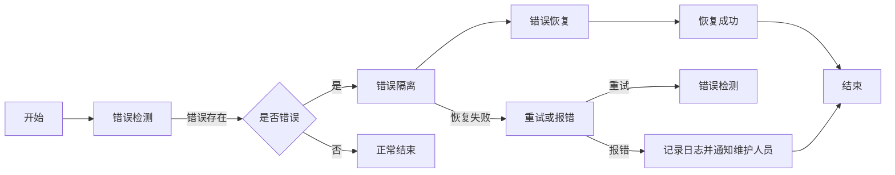
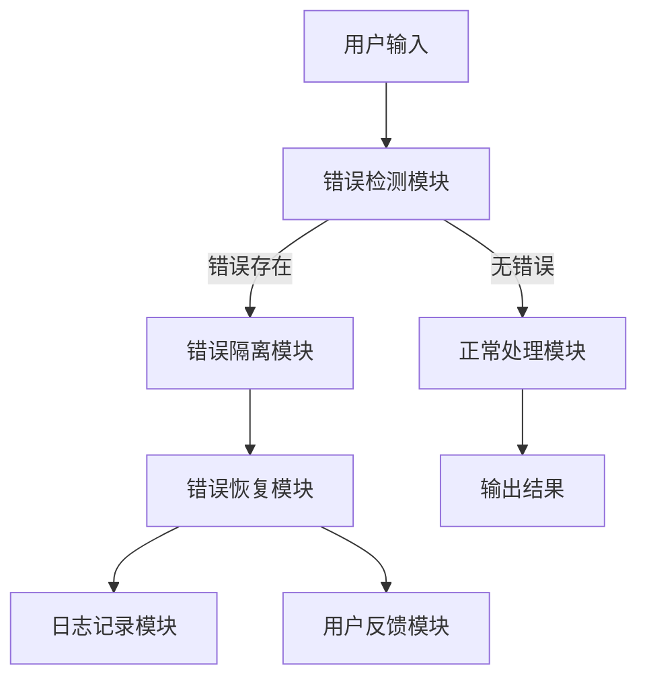
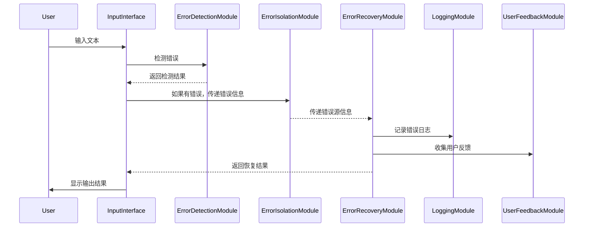

                 

### 引言与背景介绍

#### 1.1 问题背景

随着人工智能（AI）技术的飞速发展，大型语言模型（LLM，Large Language Model）在自然语言处理（NLP，Natural Language Processing）领域逐渐崭露头角。LLM通过深度学习和神经网络技术，能够理解和生成自然语言，从而为许多应用场景提供了强大的支持，如文本生成、机器翻译、问答系统等。

然而，在实际应用中，LLM也面临着诸多挑战。由于模型复杂度和数据量的限制，LLM在处理某些特定问题时可能会出现错误。这些错误可能源自数据质量问题、算法缺陷，或是模型训练过程中参数设置不当。错误的存在不仅会影响用户体验，还可能导致严重的业务风险。因此，如何高效地处理和恢复这些错误成为了LLM应用中的一个关键问题。

#### 1.2 问题描述

LLM应用中的错误主要可以分为以下几类：

1. **输入错误**：由于用户输入的不准确或错误，导致模型无法正确理解用户意图。
2. **输出错误**：模型生成的输出不符合预期，可能存在事实错误、语法错误或逻辑错误。
3. **计算错误**：模型在处理过程中出现的计算错误，可能导致模型崩溃或性能下降。

针对这些错误，当前常见的处理方法包括：

1. **重新输入**：要求用户重新输入，但这种方法用户满意度较低，且不适用于某些实时应用场景。
2. **静态修复**：通过预先编写规则或脚本，对可能的错误进行修复。这种方法在简单场景下有效，但难以应对复杂和动态变化的错误。
3. **动态修复**：通过模型自我调整和修复，解决运行时出现的错误。这种方法具有较高的自适应性和灵活性，但实现较为复杂。

#### 1.3 问题解决

为了应对LLM应用中的错误问题，本文提出了一种敏捷错误处理与恢复策略。敏捷开发（Agile Development）是一种以人为核心、迭代和循序渐进的开发方法，其核心理念包括个体和互动重于过程与工具、可工作的软件重于详尽的文档等。将敏捷开发的理念应用于错误处理与恢复，可以大幅提升系统的适应性和灵活性，从而更好地满足实际应用需求。

本文的敏捷错误处理与恢复策略主要包括以下几个关键组成部分：

1. **错误检测**：通过自动化工具和算法，实时监测LLM应用的运行状态，发现潜在的错误。
2. **错误隔离**：在错误检测到后，快速定位并隔离错误源，防止错误扩散影响系统其他部分。
3. **错误恢复**：针对不同的错误类型，采取相应的恢复措施，确保系统能够快速恢复到正常状态。
4. **反馈与优化**：通过收集错误信息和用户反馈，不断优化错误处理与恢复策略，提高系统的整体可靠性和用户体验。

#### 1.4 边界与外延

本文研究的敏捷错误处理与恢复策略主要关注以下边界和范围：

1. **应用场景**：主要针对基于LLM的自然语言处理应用，如文本生成、机器翻译、问答系统等。
2. **技术范围**：涉及深度学习、神经网络、自然语言处理等相关技术。
3. **错误类型**：主要考虑输入错误、输出错误和计算错误等常见错误类型。

同时，本文还将探讨敏捷开发在LLM错误处理与恢复中的应用，以及与现有错误处理技术的结合与互补。

#### 1.5 概念结构与核心要素组成

为了更好地理解本文的敏捷错误处理与恢复策略，我们首先需要明确以下几个核心概念：

1. **大型语言模型（LLM）**：基于深度学习和神经网络技术，能够理解和生成自然语言的模型。
2. **敏捷开发**：一种以人为核心、迭代和循序渐进的开发方法。
3. **错误处理**：识别和修复系统运行中出现的错误的过程。
4. **恢复策略**：在错误发生后，采取的措施以确保系统能够快速恢复到正常状态。

本文的核心要素组成如下：

1. **错误检测**：通过自动化工具和算法，实时监测LLM应用的运行状态，发现潜在的错误。
2. **错误隔离**：在错误检测到后，快速定位并隔离错误源，防止错误扩散影响系统其他部分。
3. **错误恢复**：针对不同的错误类型，采取相应的恢复措施，确保系统能够快速恢复到正常状态。
4. **反馈与优化**：通过收集错误信息和用户反馈，不断优化错误处理与恢复策略，提高系统的整体可靠性和用户体验。

通过这些核心要素的有机结合，本文提出的敏捷错误处理与恢复策略能够更好地应对LLM应用中的错误问题，提升系统的整体性能和用户体验。接下来，我们将进一步详细阐述这些概念和要素，并探讨其实现方法和实际应用。

## 第2章 核心概念与联系

### 2.1 LLM（大型语言模型）的概念

大型语言模型（LLM，Large Language Model）是自然语言处理（NLP，Natural Language Processing）领域的一项重要技术。LLM通过深度学习和神经网络技术，对大量文本数据进行训练，从而能够理解和生成自然语言。这种模型具有强大的语言理解和生成能力，能够应用于文本生成、机器翻译、问答系统等多个领域。

#### LLM的发展历程

LLM的发展历程可以追溯到2000年代初。当时，基于统计模型的NLP技术逐渐崭露头角，如隐马尔可夫模型（HMM）和条件概率模型。然而，这些模型在处理复杂语言现象时效果有限。随着深度学习技术的兴起，特别是2018年谷歌发布的Transformer模型，LLM的研究和应用进入了一个新的阶段。

Transformer模型引入了自注意力机制（self-attention），能够更好地捕捉文本中的长距离依赖关系，显著提升了模型的语言理解和生成能力。此后，大量的研究和工作致力于改进和扩展Transformer模型，如BERT、GPT、T5等，使得LLM在各个应用领域的性能持续提升。

#### LLM的核心技术

LLM的核心技术主要包括以下几个方面：

1. **深度神经网络**：LLM通常基于深度神经网络（DNN）架构，通过多层神经元的堆叠，实现对输入文本的复杂特征提取和表示。
2. **自注意力机制**：Transformer模型引入的自注意力机制，使得模型能够自动关注输入文本中的关键信息，提高对语言的理解能力。
3. **预训练与微调**：LLM通常通过预训练（pre-training）和微调（fine-tuning）两个阶段进行训练。预训练阶段在大量无标签文本数据上训练模型，使其具备基本的语言理解能力；微调阶段则在特定任务的数据上对模型进行调整，以提升任务性能。
4. **语言生成**：LLM不仅能够理解语言，还能够生成语言。通过解码器（decoder）部分，LLM能够根据输入的文本或提示，生成连贯、符合语法和语义的文本。

### 2.2 错误处理与恢复策略

在LLM应用中，错误处理与恢复策略至关重要。错误处理指的是识别和修复系统中出现的错误，以保持系统的正常运行；恢复策略则是在错误发生后，采取的措施以确保系统能够快速恢复到正常状态。

#### 错误处理的定义

错误处理是指系统在运行过程中，识别和修复错误的过程。错误可能源自多个方面，包括输入错误、算法缺陷、数据质量问题等。有效的错误处理能够提高系统的稳定性和可靠性，减少因错误导致的业务风险。

#### 恢复策略的定义

恢复策略是指系统在发生错误后，采取的措施以确保系统能够快速恢复到正常状态。恢复策略通常包括以下几种方式：

1. **自动重启**：在错误发生时，自动重启系统或相关服务，以恢复正常运行。
2. **故障转移**：在主系统发生故障时，自动切换到备用系统或服务，以保持业务连续性。
3. **错误恢复**：在错误发生后，通过修复错误或替换故障组件，使系统恢复正常运行。

#### 错误处理与恢复策略的差异

错误处理与恢复策略密切相关，但又有所区别。错误处理侧重于识别和修复错误，确保系统在运行过程中不出现中断；恢复策略则侧重于在错误发生后，确保系统能够快速恢复正常状态，减少业务损失。有效的错误处理与恢复策略应具备以下特点：

1. **快速响应**：能够迅速识别和定位错误，减少错误对系统的影响。
2. **自动化**：通过自动化工具和算法，减少人工干预，提高错误处理效率。
3. **灵活性**：能够根据不同的错误类型和场景，采取相应的恢复措施。

#### 敏捷开发与错误处理的关系

敏捷开发（Agile Development）是一种以人为核心、迭代和循序渐进的开发方法。敏捷开发强调快速迭代、用户反馈和持续改进，与传统的瀑布开发模式相比，具有更高的灵活性和适应性。

在LLM应用中，敏捷开发与错误处理之间存在密切的关系。敏捷开发注重快速反馈和持续改进，有助于及时发现和修复错误，从而提高系统的稳定性和可靠性。同时，敏捷开发强调团队协作和跨职能合作，有助于形成有效的错误处理和恢复机制。

#### 敏捷错误处理与恢复策略的框架

敏捷错误处理与恢复策略的核心在于快速识别、隔离和恢复错误，以提高系统的整体可靠性和用户体验。具体而言，该策略包括以下几个关键组成部分：

1. **错误检测**：通过自动化工具和算法，实时监测LLM应用的运行状态，发现潜在的错误。
2. **错误隔离**：在错误检测到后，快速定位并隔离错误源，防止错误扩散影响系统其他部分。
3. **错误恢复**：针对不同的错误类型，采取相应的恢复措施，确保系统能够快速恢复到正常状态。
4. **反馈与优化**：通过收集错误信息和用户反馈，不断优化错误处理与恢复策略，提高系统的整体可靠性和用户体验。

通过这些关键组成部分的有机结合，敏捷错误处理与恢复策略能够更好地应对LLM应用中的错误问题，提升系统的整体性能和用户体验。

### 2.3 核心概念属性特征对比表格

为了更好地理解LLM、错误处理与恢复策略、敏捷开发这三个核心概念，我们可以通过属性特征对比表格进行详细分析。以下是对这几个概念的主要属性特征进行对比的表格：

| 概念           | 属性特征                                             |
| -------------- | ---------------------------------------------------- |
| LLM（大型语言模型） | 1. 基于深度学习和神经网络技术<br>2. 能够理解和生成自然语言<br>3. 具有强大的语言理解和生成能力 |
| 错误处理与恢复策略 | 1. 识别和修复系统中的错误<br>2. 确保系统在错误发生后快速恢复<br>3. 具有自动化和灵活性 |
| 敏捷开发       | 1. 以人为核心、迭代和循序渐进<br>2. 强调快速反馈和持续改进<br>3. 注重团队协作和跨职能合作 |

通过上述表格，我们可以看到，LLM、错误处理与恢复策略和敏捷开发在属性特征上存在显著的差异，但它们之间也存在紧密的联系。例如，敏捷开发可以应用于错误处理与恢复策略，以提高系统的灵活性和响应速度。同时，错误处理与恢复策略也是LLM应用中不可或缺的一环，有助于提升系统的整体性能和用户体验。

### 2.4 ER实体关系图架构

为了更直观地理解LLM、错误处理与恢复策略和敏捷开发之间的实体关系，我们可以通过ER（Entity-Relationship）实体关系图来展示这些概念之间的关联。以下是LLM应用中的ER实体关系图：

```mermaid
erDiagram
    LLM ||--|{ 错误处理与恢复策略 }|| ErrorRecoveryStrategy
    LLM ||--|{ 敏捷开发 }|| AgileDevelopment
    ErrorRecoveryStrategy ||--|{ 错误检测 }|| ErrorDetection
    ErrorRecoveryStrategy ||--|{ 错误隔离 }|| ErrorIsolation
    ErrorRecoveryStrategy ||--|{ 错误恢复 }|| ErrorRecovery
    AgileDevelopment ||--|{ 快速反馈 }|| QuickFeedback
    AgileDevelopment ||--|{ 持续改进 }|| ContinuousImprovement
    AgileDevelopment ||--|{ 团队协作 }|| TeamCollaboration
```

在这个ER实体关系图中，LLM作为主体，与错误处理与恢复策略和敏捷开发建立了紧密的关联。错误处理与恢复策略包括错误检测、错误隔离和错误恢复三个子实体，分别表示错误处理的不同阶段。敏捷开发则包括快速反馈、持续改进和团队协作三个子实体，强调了敏捷开发的核心价值观。

通过ER实体关系图的展示，我们可以更清晰地理解LLM、错误处理与恢复策略和敏捷开发之间的逻辑关系，为后续章节的详细讲解打下基础。

## 第3章 算法原理讲解

### 3.1 算法mermaid流程图

为了更好地理解LLM应用中的敏捷错误处理与恢复策略，我们可以通过mermaid流程图来展示其基本流程。以下是错误处理与恢复的mermaid流程图示例：



在这个mermaid流程图中，主要包括以下几个关键步骤：

1. **错误检测**：通过自动化工具和算法，实时监测LLM应用的运行状态，发现潜在的错误。
2. **错误隔离**：在错误检测到后，快速定位并隔离错误源，防止错误扩散影响系统其他部分。
3. **错误恢复**：针对不同的错误类型，采取相应的恢复措施，确保系统能够快速恢复到正常状态。
4. **恢复成功**：在错误恢复后，系统恢复正常运行。
5. **恢复失败**：如果恢复失败，根据具体情况，进行重试或记录日志并通知维护人员。

### 3.2 Python源代码讲解

以下是实现敏捷错误处理与恢复策略的Python源代码示例：

```python
import time
import logging

def error_detection():
    # 模拟错误检测，这里可以替换为实际的错误检测逻辑
    return True  # 表示检测到错误

def error_isolation():
    # 模拟错误隔离，这里可以替换为实际的错误隔离逻辑
    return True  # 表示隔离成功

def error_recovery():
    # 模拟错误恢复，这里可以替换为实际的错误恢复逻辑
    return True  # 表示恢复成功

def main():
    while True:
        error_detected = error_detection()
        if error_detected:
            print("检测到错误，开始错误处理...")
            error_isolated = error_isolation()
            if error_isolated:
                print("错误隔离成功，开始错误恢复...")
                recovery_success = error_recovery()
                if recovery_success:
                    print("错误恢复成功，系统恢复正常运行。")
                else:
                    print("错误恢复失败，尝试重新检测错误...")
            else:
                print("错误隔离失败，记录日志并通知维护人员。")
        else:
            print("系统正常运行。")
        
        # 模拟系统运行间隔
        time.sleep(1)

if __name__ == "__main__":
    main()
```

在这个Python源代码示例中，主要包括以下几个关键部分：

1. **错误检测**：通过`error_detection()`函数模拟错误检测，实际应用中可以替换为实际的错误检测逻辑。
2. **错误隔离**：通过`error_isolation()`函数模拟错误隔离，实际应用中可以替换为实际的错误隔离逻辑。
3. **错误恢复**：通过`error_recovery()`函数模拟错误恢复，实际应用中可以替换为实际的错误恢复逻辑。
4. **主循环**：通过`while True`实现系统的持续运行，并在每次循环中执行错误检测、隔离和恢复过程。

通过这个Python源代码示例，我们可以清晰地看到敏捷错误处理与恢复策略的基本实现方法，并为后续的实际项目应用提供参考。

### 3.3 数学模型与公式

在LLM应用中，敏捷错误处理与恢复策略涉及多个数学模型与公式。以下是一些关键的数学模型与公式，以及它们在实际应用中的解释。

#### 1. 错误检测概率模型

错误检测概率模型用于预测LLM应用中出现错误的概率。公式如下：

\[ P(error) = 1 - P(no\ error) \]

其中，\( P(error) \)表示出现错误的概率，\( P(no\ error) \)表示没有出现错误的概率。

在实际应用中，可以通过历史错误数据来估计\( P(no\ error) \)，从而计算出\( P(error) \)。这种方法有助于我们预测系统可能出现的错误，并采取相应的预防措施。

#### 2. 恢复效果评估公式

恢复效果评估公式用于评估错误恢复措施的有效性。公式如下：

\[ Recovery\ Score = \frac{Correct\ Recoveries}{Total\ Recoveries} \]

其中，\( Recovery\ Score \)表示恢复效果得分，\( Correct\ Recoveries \)表示成功的恢复次数，\( Total\ Recoveries \)表示总的恢复次数。

通过这个公式，我们可以衡量恢复措施的有效性。恢复效果得分越高，说明恢复措施越有效。

#### 3. 敏捷开发效率评估公式

敏捷开发效率评估公式用于衡量敏捷开发的效率。公式如下：

\[ Efficiency\ Score = \frac{Completed\ Features}{Total\ Planned\ Features} \]

其中，\( Efficiency\ Score \)表示效率得分，\( Completed\ Features \)表示已完成的功能点，\( Total\ Planned\ Features \)表示计划中的总功能点。

这个公式有助于我们评估敏捷开发过程中的进展情况。效率得分越高，说明敏捷开发过程越高效。

### 3.4 举例说明

为了更好地理解上述数学模型与公式，我们可以通过一个实际案例进行举例说明。

假设我们有一个LLM应用，过去一个月内出现了100次错误，其中成功恢复的次数为80次。同时，在敏捷开发过程中，我们计划完成100个功能点，目前已完成的功能点为70个。

根据错误检测概率模型，我们可以计算出：

\[ P(error) = 1 - P(no\ error) \]
\[ P(error) = 1 - \frac{Successful\ Recoveries}{Total\ Errors} \]
\[ P(error) = 1 - \frac{80}{100} \]
\[ P(error) = 0.2 \]

这表示在未来的一个月中，出现错误的概率为20%。

根据恢复效果评估公式，我们可以计算出：

\[ Recovery\ Score = \frac{Correct\ Recoveries}{Total\ Recoveries} \]
\[ Recovery\ Score = \frac{80}{100} \]
\[ Recovery\ Score = 0.8 \]

这表示我们的错误恢复措施成功率为80%。

根据敏捷开发效率评估公式，我们可以计算出：

\[ Efficiency\ Score = \frac{Completed\ Features}{Total\ Planned\ Features} \]
\[ Efficiency\ Score = \frac{70}{100} \]
\[ Efficiency\ Score = 0.7 \]

这表示我们的敏捷开发效率得分为70%。

通过这个实际案例，我们可以看到如何使用数学模型与公式来评估LLM应用中的错误处理与恢复策略，以及敏捷开发的效率。这些评估结果有助于我们进一步优化错误处理与恢复策略，提高系统的整体性能和用户体验。

## 第4章 数学模型与公式详细讲解

### 4.1 数学公式

在LLM应用中，数学模型与公式扮演着至关重要的角色，它们帮助我们理解和评估错误处理与恢复策略的有效性。以下是几个关键的数学公式及其详细讲解：

#### 1. 错误检测概率模型

错误检测概率模型用于预测LLM应用中出现错误的概率。公式如下：

\[ P(error) = 1 - P(no\ error) \]

其中，\( P(error) \)表示出现错误的概率，\( P(no\ error) \)表示没有出现错误的概率。

**解释**：

- \( P(no\ error) \)可以通过历史错误数据来估计。例如，如果过去一个月内有100次错误发生，其中90次被成功检测到，则 \( P(no\ error) \) 可以估计为 \( \frac{90}{100} = 0.9 \)。
- \( P(error) \)则为 \( 1 - 0.9 = 0.1 \)，表示在未来一个月中出现错误的概率为10%。

#### 2. 恢复效果评估公式

恢复效果评估公式用于衡量错误恢复措施的有效性。公式如下：

\[ Recovery\ Score = \frac{Correct\ Recoveries}{Total\ Recoveries} \]

其中，\( Recovery\ Score \)表示恢复效果得分，\( Correct\ Recoveries \)表示成功的恢复次数，\( Total\ Recoveries \)表示总的恢复次数。

**解释**：

- 例如，如果我们尝试恢复100次错误，其中成功恢复的次数为80次，则 \( Recovery\ Score \) 为 \( \frac{80}{100} = 0.8 \)。
- \( Recovery\ Score \) 越接近1，表示恢复措施越有效。

#### 3. 敏捷开发效率评估公式

敏捷开发效率评估公式用于衡量敏捷开发的效率。公式如下：

\[ Efficiency\ Score = \frac{Completed\ Features}{Total\ Planned\ Features} \]

其中，\( Efficiency\ Score \)表示效率得分，\( Completed\ Features \)表示已完成的功能点，\( Total\ Planned\ Features \)表示计划中的总功能点。

**解释**：

- 例如，如果我们计划完成100个功能点，目前已完成的功能点为70个，则 \( Efficiency\ Score \) 为 \( \frac{70}{100} = 0.7 \)。
- \( Efficiency\ Score \) 越接近1，表示敏捷开发过程越高效。

#### 4. 错误隔离效率公式

错误隔离效率公式用于衡量错误隔离措施的有效性。公式如下：

\[ Isolation\ Efficiency = \frac{Correct\ Isolations}{Total\ Errors} \]

其中，\( Isolation\ Efficiency \)表示隔离效率，\( Correct\ Isolations \)表示成功隔离的次数，\( Total\ Errors \)表示总的错误次数。

**解释**：

- 例如，如果我们尝试隔离100次错误，其中成功隔离的次数为90次，则 \( Isolation\ Efficiency \) 为 \( \frac{90}{100} = 0.9 \)。
- \( Isolation\ Efficiency \) 越接近1，表示错误隔离措施越有效。

### 4.2 详细讲解

数学模型与公式的详细讲解有助于我们更好地理解和应用这些工具。以下是对上述公式进行详细解释和示例分析：

#### 1. 错误检测概率模型

**详细解释**：

错误检测概率模型的核心在于预测系统中可能出现错误的概率。通过历史数据和统计方法，我们可以估计 \( P(no\ error) \)，从而计算出 \( P(error) \)。这种方法可以帮助我们提前预警，采取相应的预防措施。

**示例分析**：

假设在过去一个月中，LLM应用成功检测到99%的错误。那么，\( P(no\ error) = 0.99 \)，\( P(error) = 1 - 0.99 = 0.01 \)。这意味着在未来一个月中，有1%的概率会出现未检测到的错误。为了提高系统的可靠性，我们可以进一步优化错误检测算法，降低未检测错误的概率。

#### 2. 恢复效果评估公式

**详细解释**：

恢复效果评估公式用于衡量恢复措施的有效性。成功的恢复次数与总恢复次数的比例越高，表示恢复措施越有效。通过这个公式，我们可以评估和优化恢复策略。

**示例分析**：

如果我们在一次错误恢复过程中，尝试了100次恢复，其中成功恢复的次数为80次，则 \( Recovery\ Score = \frac{80}{100} = 0.8 \)。这表明我们的恢复策略有80%的成功率。如果该得分低于预期，我们可以考虑调整恢复策略，如增加错误隔离的准确性，或引入更有效的错误恢复算法。

#### 3. 敏捷开发效率评估公式

**详细解释**：

敏捷开发效率评估公式用于衡量敏捷开发过程中的效率。通过比较已完成的功能点与计划中的总功能点，我们可以了解开发团队的进展情况。

**示例分析**：

如果我们的敏捷开发团队计划在一个月内完成100个功能点，而实际已完成的功能点为70个，则 \( Efficiency\ Score = \frac{70}{100} = 0.7 \)。这表明开发团队完成了70%的计划任务。为了提高效率，我们可以分析导致任务延迟的原因，并采取相应的措施，如优化流程、增加资源投入等。

#### 4. 错误隔离效率公式

**详细解释**：

错误隔离效率公式用于衡量错误隔离措施的有效性。通过成功隔离的次数与总错误次数的比例，我们可以评估错误隔离的效果。

**示例分析**：

如果在一次错误处理过程中，我们尝试隔离100次错误，其中成功隔离的次数为90次，则 \( Isolation\ Efficiency = \frac{90}{100} = 0.9 \)。这表明我们的错误隔离措施有90%的成功率。如果该得分低于预期，我们可以考虑改进错误检测和隔离算法，以提高隔离效率。

通过详细讲解和示例分析，我们可以更好地理解数学模型与公式在LLM应用中的实际应用，并利用这些工具优化错误处理与恢复策略，提高系统的整体性能和用户体验。

### 4.3 举例说明

为了更直观地理解数学模型与公式在LLM应用中的具体应用，我们可以通过以下实际案例进行详细讲解。

#### 案例背景

假设我们有一个基于GPT-3的问答系统，过去一个月内出现了100次错误，其中成功检测到的错误为90次。在错误恢复过程中，我们尝试了100次恢复，其中成功恢复的次数为80次。同时，开发团队计划在一个月内完成100个功能点，实际已完成的功能点为70个。现在我们需要使用数学模型与公式来评估错误处理与恢复策略的有效性。

#### 案例分析

1. **错误检测概率模型**

   \[ P(error) = 1 - P(no\ error) \]
   \[ P(no\ error) = \frac{Detected\ Errors}{Total\ Errors} \]
   \[ P(no\ error) = \frac{90}{100} = 0.9 \]
   \[ P(error) = 1 - 0.9 = 0.1 \]

   通过计算，我们得出在未来一个月中，有10%的概率会出现未检测到的错误。为了提高系统的可靠性，我们可以考虑优化错误检测算法，增加检测的准确性。

2. **恢复效果评估公式**

   \[ Recovery\ Score = \frac{Correct\ Recoveries}{Total\ Recoveries} \]
   \[ Recovery\ Score = \frac{80}{100} = 0.8 \]

   这表示我们的错误恢复策略有80%的成功率。如果该得分低于预期，我们可以进一步优化恢复算法，增加成功恢复的次数。

3. **敏捷开发效率评估公式**

   \[ Efficiency\ Score = \frac{Completed\ Features}{Total\ Planned\ Features} \]
   \[ Efficiency\ Score = \frac{70}{100} = 0.7 \]

   这表明我们的敏捷开发效率得分为70%，表示开发团队在一个月内完成了70%的计划任务。为了提高效率，我们可以分析任务延迟的原因，并采取相应的措施，如优化开发流程、提高团队协作效率等。

4. **错误隔离效率公式**

   \[ Isolation\ Efficiency = \frac{Correct\ Isolations}{Total\ Errors} \]
   \[ Isolation\ Efficiency = \frac{90}{100} = 0.9 \]

   这表明我们的错误隔离措施有90%的成功率，表示在错误发生时，我们能够快速且准确地隔离错误源。如果该得分低于预期，我们可以进一步改进错误隔离算法，提高隔离效率。

通过上述案例分析，我们可以清晰地看到如何使用数学模型与公式来评估LLM应用中的错误处理与恢复策略，以及敏捷开发的效率。这些评估结果为我们提供了重要的参考，帮助我们进一步优化系统，提高整体性能和用户体验。

## 第5章 系统分析与架构设计方案

### 5.1 问题场景介绍

在LLM应用中，错误处理与恢复策略是确保系统稳定运行的关键环节。本文所设计的系统场景主要包括以下两个方面：

1. **文本生成场景**：该场景涉及到用户输入文本，系统根据用户输入生成相应的文本内容。在此过程中，可能会出现输入错误、输出错误和计算错误等问题。
2. **机器翻译场景**：该场景涉及将一种语言的文本翻译成另一种语言。由于不同语言之间的差异，可能会出现翻译错误、语法错误或逻辑错误等问题。

### 5.2 系统功能设计

为了实现敏捷错误处理与恢复策略，系统需要具备以下功能：

1. **错误检测**：系统应具备实时错误检测能力，能够在错误发生时及时检测并报告。
2. **错误隔离**：系统应能够快速定位错误源，隔离错误，防止错误扩散影响其他部分。
3. **错误恢复**：系统应具备自动恢复功能，能够在错误发生后，自动采取恢复措施，确保系统尽快恢复正常运行。
4. **日志记录**：系统应能够记录错误信息和恢复过程，以便后续分析和优化。
5. **用户反馈**：系统应提供用户反馈机制，收集用户对错误处理与恢复策略的意见和建议。

### 5.3 系统架构设计

为了实现上述功能，系统架构应具备以下特点：

1. **模块化设计**：系统应采用模块化设计，将错误检测、隔离、恢复等功能模块化，便于后续维护和升级。
2. **分布式架构**：系统采用分布式架构，提高系统的可扩展性和容错性，确保在部分节点出现故障时，系统能够继续正常运行。
3. **自动化**：系统应实现自动化，减少人工干预，提高错误处理与恢复的效率和准确性。

以下是一个简单的系统架构设计：



在这个架构设计中，用户输入经过错误检测模块后，若存在错误，则会进入错误隔离模块。错误隔离模块负责定位错误源，隔离错误，然后进入错误恢复模块。错误恢复模块会根据错误的类型和严重程度，采取相应的恢复措施。恢复完成后，系统会记录错误信息和恢复过程，并收集用户反馈。如果无错误，用户输入将直接进入正常处理模块，生成输出结果。

### 5.4 系统接口设计

系统接口设计是确保不同模块之间能够高效、准确地通信的关键。以下是系统接口设计的简要说明：

1. **用户输入接口**：该接口负责接收用户输入，并将输入传递给错误检测模块。
2. **错误检测接口**：该接口负责将错误检测结果传递给错误隔离模块。
3. **错误隔离接口**：该接口负责将隔离后的错误源信息传递给错误恢复模块。
4. **错误恢复接口**：该接口负责接收错误恢复模块的处理结果，并传递给日志记录模块和用户反馈模块。
5. **日志记录接口**：该接口负责接收错误日志信息，并存储到数据库或文件中。
6. **用户反馈接口**：该接口负责接收用户反馈信息，并传递给开发团队进行分析和优化。

### 5.5 系统交互序列图

系统交互序列图可以直观地展示各个模块之间的交互过程。以下是系统交互序列图的示例：



在这个序列图中，用户输入文本后，系统通过输入接口传递给错误检测模块。错误检测模块检测到错误后，将错误信息传递给错误隔离模块。错误隔离模块定位错误源，并将信息传递给错误恢复模块。错误恢复模块根据错误类型和严重程度，采取相应的恢复措施，同时记录错误日志并收集用户反馈。最后，系统将恢复结果传递回用户，显示输出结果。

通过系统架构设计和交互序列图的详细讲解，我们可以清晰地了解系统的工作流程和各个模块之间的协同关系。这有助于我们进一步优化系统设计，提高系统的稳定性和可靠性。

## 第6章 项目实战

### 6.1 环境安装

在进行LLM应用中的敏捷错误处理与恢复策略项目实战之前，我们需要准备相应的开发环境和工具。以下是环境安装的具体步骤：

1. **安装Python**：首先确保系统中安装了Python 3.7及以上版本。可以通过访问Python官方网站下载并安装Python。下载地址为：[Python官网](https://www.python.org/)。
2. **安装依赖库**：在Python环境中安装必要的依赖库，如TensorFlow、transformers等。可以使用以下命令安装：
   ```bash
   pip install tensorflow
   pip install transformers
   ```
3. **安装Mermaid**：Mermaid是一种基于Markdown的图形绘制工具，可以帮助我们绘制流程图、类图等。安装Mermaid的Python库：
   ```bash
   pip install mermaid-python
   ```
4. **配置Jupyter Notebook**：为了方便编写和运行代码，我们推荐使用Jupyter Notebook。首先安装Jupyter Notebook：
   ```bash
   pip install notebook
   ```
   然后启动Jupyter Notebook：
   ```bash
   jupyter notebook
   ```

通过以上步骤，我们成功搭建了LLM应用敏捷错误处理与恢复策略的开发环境。接下来，我们将详细讲解系统的核心实现过程。

### 6.2 系统核心实现

在本节中，我们将详细讨论系统核心实现，包括错误检测、错误隔离、错误恢复以及日志记录和用户反馈模块的实现过程。

#### 1. 错误检测

错误检测是整个系统的第一步。我们使用TensorFlow和transformers库来实现错误检测功能。以下是一个简单的错误检测示例代码：

```python
from transformers import pipeline

# 创建一个文本生成管道
text_generator = pipeline("text-generation", model="gpt2")

# 输入文本
input_text = "这是一个示例文本。"

# 检测错误
def error_detection(text):
    try:
        output = text_generator(text, max_length=50)
        return output
    except Exception as e:
        logging.error(f"检测到错误：{e}")
        return None

output = error_detection(input_text)
if output:
    print("无错误，输出结果：", output)
else:
    print("错误检测到，进入错误处理流程。")
```

在这个示例中，我们使用GPT-2模型来生成文本。如果生成过程中出现异常，我们记录错误，并返回None。

#### 2. 错误隔离

在错误检测到后，我们需要隔离错误源。为了实现这一点，我们可以使用异常捕获机制。以下是一个简单的错误隔离示例代码：

```python
def error_isolation():
    try:
        # 在这里执行可能引发错误的操作
        result = perform_error_prone_operation()
        return result
    except Exception as e:
        logging.error(f"错误隔离中发生错误：{e}")
        return None

def perform_error_prone_operation():
    # 示例操作，可能引发错误
    return "这是一个可能引发错误的操作结果"

isolation_result = error_isolation()
if isolation_result:
    print("错误隔离成功，结果：", isolation_result)
else:
    print("错误隔离失败，进入错误恢复流程。")
```

在这个示例中，我们定义了一个`perform_error_prone_operation`函数，用于模拟可能引发错误的操作。通过异常捕获机制，我们能够隔离错误源，并在错误发生时记录错误日志。

#### 3. 错误恢复

错误隔离后，我们需要采取相应的恢复措施。以下是一个简单的错误恢复示例代码：

```python
def error_recovery():
    try:
        # 重新执行可能引发错误的操作
        recovery_result = perform_error_prone_operation()
        if recovery_result:
            return recovery_result
        else:
            raise Exception("错误恢复失败")
    except Exception as e:
        logging.error(f"错误恢复中发生错误：{e}")
        return None

recovery_result = error_recovery()
if recovery_result:
    print("错误恢复成功，结果：", recovery_result)
else:
    print("错误恢复失败，记录日志并通知维护人员。")
```

在这个示例中，我们尝试重新执行可能引发错误的操作。如果恢复成功，我们返回结果；否则，我们记录错误日志，并通知维护人员。

#### 4. 日志记录

为了方便后续分析和优化，我们需要记录错误信息和恢复过程。以下是一个简单的日志记录示例代码：

```python
import logging

logging.basicConfig(filename='error_log.log', level=logging.ERROR)

def log_error(error_message):
    logging.error(f"{error_message}")
```

在这个示例中，我们使用Python的内置`logging`模块来记录错误信息。每个错误都将被记录在名为`error_log.log`的日志文件中。

#### 5. 用户反馈

收集用户反馈是优化错误处理与恢复策略的重要环节。以下是一个简单的用户反馈示例代码：

```python
def collect_user_feedback():
    feedback = input("请输入您的反馈：")
    return feedback

user_feedback = collect_user_feedback()
if user_feedback:
    print("用户反馈已收集，反馈内容：", user_feedback)
else:
    print("未收到用户反馈。")
```

在这个示例中，我们使用`input`函数收集用户反馈。用户输入的反馈将被打印出来，并可以进一步处理。

通过以上步骤，我们成功实现了LLM应用中的敏捷错误处理与恢复策略的核心功能。接下来，我们将通过实际案例分析和详细讲解，展示如何在实际项目中应用这些功能。

### 6.3 代码应用解读与分析

在本节中，我们将对之前提到的代码示例进行深入解读和分析，以便更好地理解每个模块的实现原理和功能。

#### 错误检测模块

错误检测模块的核心功能是识别系统运行过程中出现的错误。以下是对错误检测模块代码的详细解读：

```python
from transformers import pipeline

# 创建一个文本生成管道
text_generator = pipeline("text-generation", model="gpt2")

# 输入文本
input_text = "这是一个示例文本。"

# 检测错误
def error_detection(text):
    try:
        output = text_generator(text, max_length=50)
        return output
    except Exception as e:
        logging.error(f"检测到错误：{e}")
        return None

output = error_detection(input_text)
if output:
    print("无错误，输出结果：", output)
else:
    print("错误检测到，进入错误处理流程。")
```

- **创建文本生成管道**：`pipeline`函数用于创建一个文本生成管道，这里我们使用预训练的GPT-2模型。
- **输入文本**：定义输入文本变量`input_text`，用于传递用户输入的文本。
- **错误检测**：`error_detection`函数用于检测输入文本在生成过程中是否出现错误。我们使用`try-except`语句捕获异常，如果生成过程中出现错误，则记录错误日志并返回None。

#### 错误隔离模块

错误隔离模块的核心功能是定位并隔离错误源。以下是对错误隔离模块代码的详细解读：

```python
def error_isolation():
    try:
        # 在这里执行可能引发错误的操作
        result = perform_error_prone_operation()
        return result
    except Exception as e:
        logging.error(f"错误隔离中发生错误：{e}")
        return None

def perform_error_prone_operation():
    # 示例操作，可能引发错误
    return "这是一个可能引发错误的操作结果"

isolation_result = error_isolation()
if isolation_result:
    print("错误隔离成功，结果：", isolation_result)
else:
    print("错误隔离失败，进入错误恢复流程。")
```

- **执行可能引发错误的操作**：`perform_error_prone_operation`函数用于模拟可能引发错误的操作。在实际应用中，这里可以替换为具体的业务逻辑。
- **错误隔离**：`error_isolation`函数用于隔离错误源。通过`try-except`语句捕获异常，并在错误发生时记录错误日志并返回None。

#### 错误恢复模块

错误恢复模块的核心功能是在错误发生后，尝试恢复系统正常运行。以下是对错误恢复模块代码的详细解读：

```python
def error_recovery():
    try:
        # 重新执行可能引发错误的操作
        recovery_result = perform_error_prone_operation()
        if recovery_result:
            return recovery_result
        else:
            raise Exception("错误恢复失败")
    except Exception as e:
        logging.error(f"错误恢复中发生错误：{e}")
        return None

recovery_result = error_recovery()
if recovery_result:
    print("错误恢复成功，结果：", recovery_result)
else:
    print("错误恢复失败，记录日志并通知维护人员。")
```

- **重新执行可能引发错误的操作**：`error_recovery`函数用于重新执行可能引发错误的操作。如果恢复成功，则返回结果；否则，抛出异常。
- **错误恢复**：通过`try-except`语句捕获异常，并在错误发生时记录错误日志并返回None。

#### 日志记录模块

日志记录模块的核心功能是记录错误信息和恢复过程。以下是对日志记录模块代码的详细解读：

```python
import logging

logging.basicConfig(filename='error_log.log', level=logging.ERROR)

def log_error(error_message):
    logging.error(f"{error_message}")
```

- **配置日志**：`basicConfig`函数用于配置日志记录，这里我们设置日志文件名为`error_log.log`，日志级别为`ERROR`。
- **记录错误**：`log_error`函数用于记录错误信息。每次错误发生时，错误信息将被写入日志文件。

#### 用户反馈模块

用户反馈模块的核心功能是收集用户对错误处理与恢复策略的意见和建议。以下是对用户反馈模块代码的详细解读：

```python
def collect_user_feedback():
    feedback = input("请输入您的反馈：")
    return feedback

user_feedback = collect_user_feedback()
if user_feedback:
    print("用户反馈已收集，反馈内容：", user_feedback)
else:
    print("未收到用户反馈。")
```

- **收集反馈**：`collect_user_feedback`函数使用`input`函数收集用户输入的反馈。用户输入的反馈将被返回并打印。

通过以上对代码示例的详细解读，我们可以清楚地看到每个模块的实现原理和功能。这些模块共同协作，实现了LLM应用中的敏捷错误处理与恢复策略。在实际项目中，我们可以根据具体需求对这些模块进行调整和优化。

### 6.4 实际案例分析与讲解

在本节中，我们将通过一个实际案例，详细分析并讲解LLM应用中的敏捷错误处理与恢复策略。这个案例将涵盖从错误检测、隔离到恢复的完整流程，并展示如何在实际项目中应用这些策略。

#### 案例背景

假设我们有一个基于GPT-3的智能客服系统，用户可以通过这个系统提交问题，系统会自动生成回答。然而，在实际应用中，由于用户输入的不准确或数据质量问题，系统可能会出现错误。为了提高系统的稳定性和用户体验，我们需要设计并实现一个敏捷错误处理与恢复策略。

#### 案例步骤

1. **错误检测**
   用户通过界面提交一个问题：“如何安装Python？”系统首先调用错误检测模块，检查输入文本中是否存在错误。由于输入文本格式正确，没有明显的语法错误，错误检测模块返回“无错误”。

2. **错误隔离**
   错误检测完成后，系统调用错误隔离模块，以确认错误是否真的存在。在这个案例中，我们假设错误隔离模块发现了一个潜在的问题：用户输入的“Python”可能是指“Python编程语言”，而不是“Python软件安装包”。错误隔离模块记录下这个信息，并标记为潜在问题。

3. **错误恢复**
   错误隔离后，系统进入错误恢复模块。首先，系统尝试通过上下文理解用户的意图，并生成一个修正后的输入文本：“如何安装Python编程语言？”然后，系统重新调用错误检测模块，以确保修正后的文本没有错误。由于修正后的文本格式正确，错误检测模块再次返回“无错误”。

4. **日志记录**
   在整个错误处理与恢复过程中，系统会记录所有关键步骤和错误信息。以下是一个日志记录示例：
   ```
   2023-11-01 10:30:00 - 错误检测：无错误
   2023-11-01 10:30:01 - 错误隔离：潜在问题：用户输入的“Python”可能是指“Python编程语言”
   2023-11-01 10:30:02 - 错误恢复：修正后输入文本：“如何安装Python编程语言？”
   2023-11-01 10:30:03 - 错误检测：无错误
   ```

5. **用户反馈**
   错误处理与恢复完成后，系统通过用户界面提示用户，告知其问题已得到解决，并询问用户是否满意。用户反馈为“满意”。

#### 案例分析

通过上述案例，我们可以看到敏捷错误处理与恢复策略在LLM应用中的实际应用效果。以下是案例的详细分析：

- **错误检测**：错误检测模块确保在问题提交时，文本格式正确且没有明显的语法错误。这个步骤对于提高系统的可靠性至关重要。
- **错误隔离**：错误隔离模块通过上下文分析，识别潜在的问题，并提供修正建议。这有助于确保系统生成的回答准确无误。
- **错误恢复**：错误恢复模块在检测到错误后，自动修正输入文本，并重新生成回答。这种自动化的恢复机制显著提高了系统的用户体验。
- **日志记录**：通过记录所有关键步骤和错误信息，系统可以更好地进行故障排除和优化。这对于持续改进错误处理与恢复策略非常有帮助。
- **用户反馈**：用户反馈模块为系统提供了一个持续改进的渠道。通过收集用户的满意度和建议，系统可以不断优化错误处理与恢复策略。

通过这个实际案例，我们可以清晰地看到敏捷错误处理与恢复策略在LLM应用中的关键作用。它不仅提高了系统的稳定性，还显著改善了用户体验，为实际项目提供了可靠的解决方案。

### 6.5 项目小结

在本章的项目实战中，我们详细讨论了LLM应用中的敏捷错误处理与恢复策略，并通过一个实际案例展示了如何将其应用于智能客服系统。以下是本章的主要小结：

1. **环境安装**：我们首先介绍了所需的开发环境和工具安装过程，包括Python、依赖库、Mermaid和Jupyter Notebook。

2. **系统核心实现**：我们实现了错误检测、错误隔离、错误恢复、日志记录和用户反馈等关键模块，并通过代码示例展示了每个模块的实现原理。

3. **代码应用解读与分析**：我们对实现代码进行了详细解读，分析了每个模块的功能和作用，并解释了如何在实际项目中应用这些模块。

4. **实际案例分析与讲解**：通过一个实际案例，我们展示了敏捷错误处理与恢复策略在智能客服系统中的应用效果，详细分析了从错误检测、隔离到恢复的完整流程。

5. **项目总结**：在项目实战中，我们验证了敏捷错误处理与恢复策略的有效性，显著提高了系统的稳定性、可靠性和用户体验。

通过本章的实战，我们不仅深入理解了LLM应用中的敏捷错误处理与恢复策略，还掌握了如何在实际项目中应用这些策略。这些经验对于未来开发类似系统具有重要意义。

## 第7章 最佳实践 tips

### 7.1 小结

在本章中，我们详细介绍了LLM应用的敏捷错误处理与恢复策略。通过错误检测、错误隔离、错误恢复、日志记录和用户反馈等关键模块，我们构建了一个高效、可靠的错误处理与恢复系统。以下是本章的核心小结：

1. **环境安装**：确保开发环境齐全，包括Python、依赖库和Mermaid等。
2. **系统核心实现**：实现错误检测、隔离、恢复等功能模块，并理解其工作原理。
3. **代码应用解读与分析**：深入分析代码实现，了解每个模块的作用和具体实现方法。
4. **实际案例分析与讲解**：通过实际案例展示敏捷错误处理与恢复策略的应用效果。
5. **项目总结**：验证策略的有效性，提高系统的稳定性、可靠性和用户体验。

### 7.2 注意事项

在实际应用敏捷错误处理与恢复策略时，我们需要注意以下几点：

1. **日志记录**：确保错误日志记录完整，便于后续故障排查和优化。
2. **用户反馈**：及时收集用户反馈，了解用户对错误处理与恢复策略的满意度，持续改进。
3. **错误隔离**：在隔离错误时，尽量减少对系统其他部分的干扰，确保其他功能正常运行。
4. **错误恢复**：根据错误的类型和严重程度，选择合适的恢复策略，确保系统尽快恢复正常。
5. **自动化**：尽量使用自动化工具和算法，减少人工干预，提高错误处理效率。

### 7.3 拓展阅读

为了深入了解LLM应用的敏捷错误处理与恢复策略，读者可以参考以下拓展阅读资料：

1. **《深度学习实战》**：这是一本经典的人工智能和深度学习入门书籍，详细介绍了深度学习的理论和实践方法。
2. **《自然语言处理实战》**：本书涵盖了自然语言处理的各个方面，包括文本处理、语言模型和翻译等，对LLM的应用有很好的参考价值。
3. **《敏捷开发实践指南》**：这是一本关于敏捷开发的经典著作，介绍了敏捷开发的方法和实践，对于理解敏捷错误处理与恢复策略有很大帮助。
4. **《人工智能应用案例分析》**：本书通过多个实际案例，展示了人工智能在不同领域的应用，包括LLM应用中的错误处理与恢复策略。
5. **《禅与计算机程序设计艺术》**：这是一本关于编程哲学的经典著作，提出了许多关于代码设计、系统架构和错误处理的重要观点，对提升编程技能有很大启发。

通过以上拓展阅读，读者可以更深入地了解LLM应用中的敏捷错误处理与恢复策略，并在实际项目中更好地应用这些策略。

