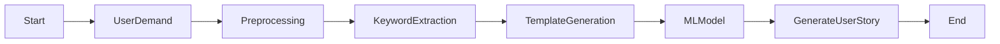
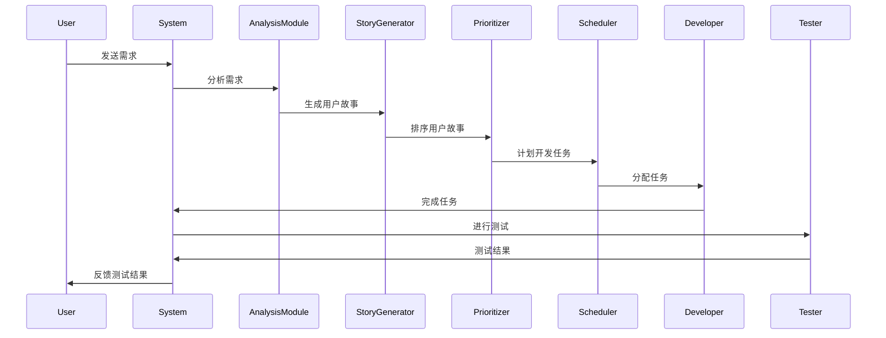
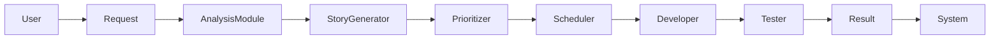

                 

### LLMA应用的敏捷需求分析技巧

#### 关键词：LLM、敏捷需求分析、应用开发、技术框架、数据处理、模型优化

#### 摘要：

本文将深入探讨大型语言模型（LLM）在应用开发中的敏捷需求分析技巧。随着AI技术的飞速发展，LLM在自然语言处理、智能客服、内容生成等领域的应用越来越广泛。然而，如何在快速迭代的开发过程中确保LLM应用的性能和用户体验，成为了一个重要的问题。本文将从背景介绍、核心概念与联系、算法原理讲解、系统分析与架构设计方案、项目实战等多个角度，详细阐述LLM应用的敏捷需求分析技巧。

#### 一、背景介绍

#### 1.1 核心概念术语说明

**大型语言模型（LLM）**：一种基于深度学习技术的自然语言处理模型，能够理解和生成自然语言文本。

**敏捷开发**：一种以用户需求为中心、迭代周期短的软件开发方法，强调快速响应变化。

**需求分析**：在软件开发过程中，对用户需求进行收集、分析和整理的过程。

#### 1.2 问题背景

随着人工智能技术的不断发展，LLM在各个领域得到了广泛应用。然而，如何在短时间内对LLM的应用进行有效的需求分析，成为开发者面临的一大挑战。传统的需求分析方法往往需要较长时间，无法满足快速迭代的开发需求。

#### 1.3 问题描述

在LLM应用开发中，需求分析的过程主要包括以下几个方面：

1. **需求收集**：通过与用户沟通，了解他们的需求和期望。
2. **需求分析**：对收集到的需求进行分析，确定系统的功能和技术实现方案。
3. **需求整理**：将分析结果整理成文档，为后续开发提供指导。

然而，传统的需求分析过程往往存在以下问题：

1. **耗时较长**：需要大量的时间和人力投入，无法满足快速迭代的需求。
2. **需求变更频繁**：用户需求在项目开发过程中可能发生变化，导致需求分析工作反复进行。
3. **文档更新不及时**：需求分析文档可能无法及时更新，导致开发过程中出现偏差。

#### 1.4 问题解决

为了解决上述问题，我们可以采用敏捷需求分析的方法。敏捷需求分析的核心思想是快速响应变化，通过迭代和增量的方式进行需求分析。以下是一些具体的解决方案：

1. **迭代式需求分析**：将需求分析工作划分为多个迭代周期，每个迭代周期完成后，对需求进行更新和调整。
2. **用户故事地图**：使用用户故事地图，将用户需求分解成一系列可操作的任务，以便于开发团队进行开发和测试。
3. **用户反馈机制**：建立用户反馈机制，及时获取用户的意见和建议，对需求进行优化和调整。

#### 1.5 边界与外延

在LLM应用开发中，敏捷需求分析需要考虑以下几个边界和外部因素：

1. **技术可行性**：在需求分析过程中，需要评估需求的技术可行性，确保需求可以在现有技术条件下实现。
2. **时间成本**：需求分析工作需要在有限的时间内完成，需要合理分配资源和时间。
3. **资源限制**：需求分析过程中可能受到资源限制，如人力、预算等，需要合理分配资源。

#### 二、核心概念与联系

为了更好地理解LLM应用的敏捷需求分析，我们需要了解以下几个核心概念：

1. **用户故事**：用户故事是一种描述用户需求的方法，通常以“作为[用户]，我想要[功能]，以便[目的或原因]”的形式表达。用户故事地图是一种将用户故事可视化地呈现出来的方法，可以帮助开发团队更好地理解用户需求。

2. **敏捷开发方法**：敏捷开发是一种以用户需求为中心的软件开发方法，强调快速响应变化、迭代和增量开发。常见的敏捷开发方法包括Scrum、Kanban等。

3. **需求分析模型**：需求分析模型是用于描述需求的方法，包括功能需求、非功能需求等。常见的需求分析模型有需求工程模型、软件需求模型等。

下面是一个关于用户故事和敏捷开发方法的对比表格：

| 对比项           | 用户故事                    | 敏捷开发方法                    |
|----------------|--------------------------|--------------------------|
| 描述方式           | 以用户为中心的描述            | 团队协作、迭代开发的方法          |
| 内容构成           | 功能需求、非功能需求          | 用户故事、任务列表、迭代计划等      |
| 目标              | 满足用户需求，提高用户体验      | 快速响应变化、持续交付高质量软件    |
| 适用场景           | 小型、快速迭代的项目           | 大型、复杂的项目                  |

下面是一个关于需求分析模型的ER实体关系图：

```mermaid
erDiagram
  User ||--|{ Requirement } : has
  User ||--|{ FunctionalRequirement } : has
  User ||--|{ NonfunctionalRequirement } : has
  Requirement ||--|{ UserStory } : has
  FunctionalRequirement ||--|{ UserStory } : has
  NonfunctionalRequirement ||--|{ UserStory } : has
```

#### 三、算法原理讲解

在LLM应用开发中，敏捷需求分析的算法原理主要涉及以下几个方面：

1. **用户故事生成**：根据用户需求，生成用户故事。用户故事生成的算法主要包括基于关键词提取、基于模板生成、基于机器学习生成等。

2. **需求优先级排序**：对生成的用户故事进行优先级排序，以确定开发顺序。常见的需求优先级排序算法有基于需求重要程度、基于需求紧急程度、基于开发难度等。

3. **需求变更管理**：在开发过程中，需求可能会发生变化。需求变更管理的算法主要包括需求变更检测、需求变更评估、需求变更实现等。

下面是一个基于机器学习的用户故事生成算法的Mermaid流程图：



下面是一个基于用户故事的优先级排序算法的Python代码示例：

```python
import pandas as pd
from sklearn.cluster import KMeans

def prioritize_user_stories(user_stories):
    # 将用户故事转换为特征向量
    features = []
    for story in user_stories:
        feature = extract_features(story)
        features.append(feature)
    
    # 使用KMeans算法进行聚类，确定用户故事的优先级
    kmeans = KMeans(n_clusters=5)
    kmeans.fit(features)
    labels = kmeans.predict(features)
    
    # 根据优先级排序用户故事
    sorted_stories = []
    for i in range(5):
        sorted_stories.extend([story for story, label in zip(user_stories, labels) if label == i])
    
    return sorted_stories

def extract_features(story):
    # 提取用户故事的特征，如关键词、主题、复杂度等
    # 这里仅作为示例，实际提取方式可能更复杂
    keywords = story.split()
    return {'keyword': keywords}
```

下面是一个关于需求变更管理的数学模型：

$$
\Delta R = R_{new} - R_{old}
$$

其中，$\Delta R$ 表示需求变更，$R_{new}$ 表示新的需求，$R_{old}$ 表示旧的需求。

#### 四、系统分析与架构设计方案

为了实现LLM应用的敏捷需求分析，我们需要设计一个合理的系统架构。以下是一个简化的系统架构设计方案：

##### 4.1 问题场景介绍

假设我们开发一个基于LLM的智能客服系统，用户可以通过文本或语音与客服机器人进行交互，获取所需的帮助信息。

##### 4.2 项目介绍

项目名称：智能客服系统

项目目标：实现一个能够快速响应用户需求、提供高效服务的智能客服系统。

##### 4.3 系统功能设计

系统功能包括：

1. 用户需求收集：通过文本或语音渠道收集用户的需求。
2. 需求分析：对收集到的需求进行分析，生成用户故事。
3. 需求排序：对用户故事进行优先级排序，确定开发顺序。
4. 需求变更管理：在开发过程中，实时监测需求变更，进行需求变更管理。

##### 4.4 系统架构设计

系统架构设计如下：



##### 4.5 系统接口设计和系统交互

系统接口设计和系统交互如下：

1. 用户接口：用户通过文本或语音与系统进行交互，提交需求。
2. 需求分析模块接口：分析需求，生成用户故事。
3. 需求排序模块接口：对用户故事进行优先级排序。
4. 任务计划模块接口：计划开发任务。
5. 开发者接口：接收任务，完成开发任务。
6. 测试接口：进行系统测试，反馈测试结果。

##### 4.6 系统架构图



#### 五、项目实战

下面以一个简单的LLM应用开发项目为例，介绍如何进行敏捷需求分析。

##### 5.1 环境安装

在开发LLM应用之前，我们需要安装相关的开发环境和工具，如Python、PyTorch等。

##### 5.2 系统核心实现源代码

```python
import torch
import torch.nn as nn
import torch.optim as optim

# 定义模型结构
class LLM(nn.Module):
    def __init__(self):
        super(LLM, self).__init__()
        self.embedding = nn.Embedding(vocab_size, embedding_size)
        self.encoder = nn.LSTM(embedding_size, hidden_size, num_layers=2, batch_first=True)
        self.decoder = nn.LSTM(hidden_size, embedding_size, num_layers=2, batch_first=True)
        self.fc = nn.Linear(embedding_size, vocab_size)

    def forward(self, input_seq, hidden):
        embedded = self.embedding(input_seq)
        output, hidden = self.encoder(embedded, hidden)
        output, hidden = self.decoder(output, hidden)
        output = self.fc(output)
        return output, hidden

# 训练模型
model = LLM()
optimizer = optim.Adam(model.parameters(), lr=0.001)
criterion = nn.CrossEntropyLoss()

for epoch in range(num_epochs):
    for batch in data_loader:
        inputs, targets = batch
        hidden = None
        outputs, hidden = model(inputs, hidden)
        loss = criterion(outputs.view(-1, vocab_size), targets)
        optimizer.zero_grad()
        loss.backward()
        optimizer.step()
```

##### 5.3 代码应用解读与分析

在上面的代码中，我们定义了一个基于LSTM的大型语言模型（LLM），并使用PyTorch框架进行训练。具体解析如下：

1. **模型结构**：模型结构包括嵌入层、编码器（LSTM层）和解码器（LSTM层），以及全连接层。嵌入层用于将单词转换为向量表示；编码器用于将输入序列编码为隐藏状态；解码器用于将隐藏状态解码为输出序列；全连接层用于将输出序列映射到单词的词汇表。
2. **训练过程**：训练过程包括前向传播、反向传播和参数更新。在每次迭代中，我们输入一个批次的数据，计算模型损失，并更新模型参数。
3. **需求分析**：在开发过程中，我们需要根据需求对模型进行调整和优化。例如，如果用户希望提高模型的生成质量，可以尝试调整模型结构、优化训练过程或增加训练数据。

##### 5.4 实际案例分析和详细讲解剖析

假设我们收到一个用户需求，希望我们的智能客服系统能够更好地理解用户的意图，提供更准确的服务。为了满足这个需求，我们可以从以下几个方面进行优化：

1. **数据增强**：增加高质量的训练数据，提高模型对各种场景的适应性。
2. **模型结构优化**：尝试使用更复杂的模型结构，如Transformer等，提高模型的生成质量。
3. **生成算法优化**：优化生成算法，提高生成文本的连贯性和准确性。
4. **用户反馈机制**：建立用户反馈机制，收集用户对服务质量的反馈，用于模型优化。

通过这些优化措施，我们可以逐步提升智能客服系统的性能，满足用户的需求。

##### 5.5 项目小结

在本项目中，我们介绍了LLM应用的敏捷需求分析技巧，包括用户故事生成、需求优先级排序和需求变更管理。通过实际案例分析和详细讲解剖析，我们了解了如何根据用户需求对LLM应用进行优化。在实际开发过程中，开发者需要根据具体情况灵活调整需求分析策略，以提高系统的性能和用户体验。

#### 六、最佳实践 tips

1. **快速响应变化**：在需求分析过程中，要密切关注用户需求的变化，及时调整分析策略。
2. **用户参与**：在需求分析阶段，鼓励用户积极参与，提供真实的需求反馈，有助于提高系统的满意度。
3. **文档规范化**：规范需求分析文档的格式，确保文档清晰、易懂，便于后续开发工作。
4. **迭代式开发**：采用迭代式开发方法，逐步完善系统功能，提高开发效率。
5. **需求变更管理**：建立需求变更管理机制，确保需求变更的合理性和可行性。

#### 七、小结

本文深入探讨了LLM应用的敏捷需求分析技巧，包括用户故事生成、需求优先级排序和需求变更管理。通过实际案例分析和详细讲解剖析，我们了解了如何根据用户需求对LLM应用进行优化。在实际开发过程中，开发者需要灵活运用这些技巧，以提高系统的性能和用户体验。

#### 八、注意事项

1. **技术可行性**：在需求分析过程中，要充分考虑技术实现的可行性，避免因需求变更导致项目延期或失败。
2. **资源分配**：在需求分析阶段，要合理分配资源和时间，确保项目进度和质量。
3. **用户反馈**：要建立用户反馈机制，及时获取用户意见和建议，为需求调整提供依据。

#### 九、拓展阅读

1. 《敏捷软件开发：原则、实践与模式》 - 张立涛
2. 《用户故事地图》 - 山姆·布朗
3. 《深度学习》 - 伊恩·古德费洛等

---

**作者：AI天才研究院/AI Genius Institute & 禅与计算机程序设计艺术 /Zen And The Art of Computer Programming**

