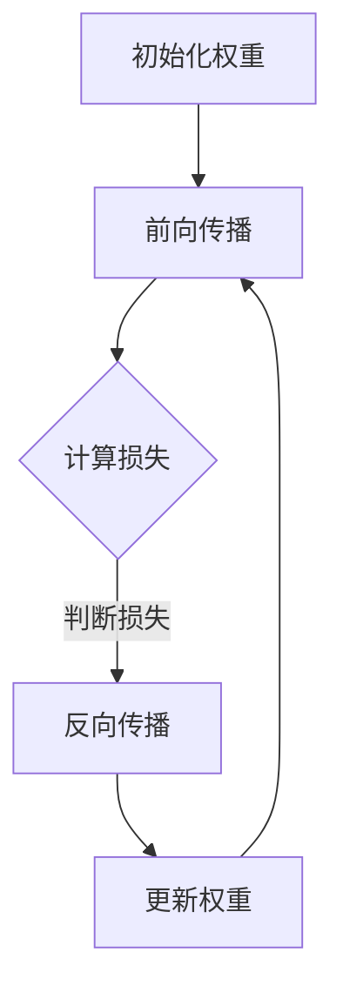

                 

### 第1章：背景介绍

在当今人工智能（AI）迅速发展的时代，用户中心设计（User-Centered Design，简称UCD）成为产品开发中至关重要的一环。随着技术的不断进步，特别是大型语言模型（LLM，如GPT-3、ChatGLM等）的出现，如何在其应用过程中保持用户焦点，已成为研究人员和开发者们亟待解决的问题。本章旨在探讨这一问题的提出背景、重要性以及其必要性。

#### 问题的提出

首先，我们需要明确为何用户中心设计在AI时代尤为重要。用户中心设计强调以用户的需求和体验为核心，通过不断的研究、评估和改进，确保产品或服务的可用性、可用性和吸引力。在传统的软件开发过程中，往往注重功能和性能的提升，而忽略了用户实际的使用体验和感受。然而，在AI时代，随着人工智能技术的广泛应用，用户对产品的期望和需求变得更加复杂和多样化。他们不仅要求产品具备高效的功能，更期望能够提供个性化、智能化和人性化的体验。

具体到LLM应用中，用户中心设计的重要性更加凸显。LLM是一种能够理解和生成自然语言的强大工具，被广泛应用于智能客服、个性化推荐、语言翻译、智能写作等多个领域。然而，LLM的应用并非仅仅依靠技术上的突破，更需要深入理解用户的需求和期望。例如，在智能客服系统中，如何确保机器人能够准确理解用户的问题并提供有帮助的答案，需要通过用户研究来发现用户的真实需求和使用习惯。在个性化推荐系统中，如何根据用户的兴趣和行为数据提供个性化的推荐，也需要通过用户研究来了解用户的偏好和期望。

#### 在敏捷开发过程中保持用户焦点的必要性

敏捷开发（Agile Development）是一种以人为核心、迭代和灵活的软件开发方法。其核心理念是快速响应变化、持续交付价值，以及注重团队合作和用户反馈。与传统的水晶球模型（Waterfall Model）不同，敏捷开发强调在开发过程中不断与用户进行互动，确保产品能够真正满足用户的需求。然而，在敏捷开发过程中，如何保持用户焦点，仍然是一个挑战。

首先，敏捷开发的特点之一是迭代快速。这意味着开发团队需要不断交付可用的产品版本，并在每次迭代中对产品进行评估和改进。在这种快速迭代的过程中，用户的需求和反馈可能会发生变化，开发团队需要能够快速响应这些变化，确保产品能够持续满足用户的期望。

其次，敏捷开发强调用户反馈的重要性。用户反馈是产品改进的重要依据，然而，在快速迭代的过程中，如何有效地收集和分析用户反馈，确保反馈能够被充分理解和应用，是一个重要的挑战。

最后，敏捷开发强调团队协作。在用户中心设计中，团队成员需要具备用户思维，能够从用户的角度出发，理解用户的需求和期望。然而，在实际开发过程中，团队成员往往更加关注技术实现，而忽略了用户体验。因此，如何在团队协作中保持用户焦点，确保用户中心设计理念的贯彻实施，也是一个重要的课题。

综上所述，在AI时代，用户中心设计的重要性不言而喻。特别是在敏捷开发过程中，如何保持用户焦点，确保产品能够真正满足用户的需求和期望，是开发团队需要深入思考和解决的问题。这也是本章要探讨的核心议题。

### 核心概念

#### 1.1 大型语言模型（LLM）的基本概念

大型语言模型（LLM，Large Language Model）是一种能够理解和生成自然语言的复杂人工智能模型。其核心思想是通过深度学习和自然语言处理技术，从海量数据中学习语言的模式和规则，从而实现对自然语言的生成和理解。LLM的主要特点包括：

- **强大的语言理解能力**：LLM能够理解并生成流畅、自然的文本，可以处理复杂的语言结构和语义关系。
- **广泛的应用场景**：LLM被广泛应用于自然语言生成、智能客服、语言翻译、文本分类、情感分析等多个领域。
- **大数据驱动**：LLM的训练和优化依赖于海量数据，通过不断的学习和迭代，提高模型的准确性和适应性。

#### 1.2 用户中心设计的理念

用户中心设计（User-Centered Design，简称UCD）是一种以用户需求为核心的设计方法。其核心理念是通过全面、持续的用户研究和评估，确保产品或服务能够满足用户的需求和期望。用户中心设计的基本原则包括：

- **用户需求驱动**：产品开发的过程应以用户需求为导向，确保产品能够真正解决用户的问题和满足他们的期望。
- **持续用户参与**：在整个产品开发过程中，应持续与用户互动，收集和分析用户反馈，确保产品能够不断改进和优化。
- **迭代开发**：通过不断迭代和改进，确保产品能够在开发过程中逐步完善，最终达到用户满意的状态。

#### 1.3 用户中心设计在LLM应用中的具体应用场景

用户中心设计在LLM应用中的具体应用场景主要包括以下几个方面：

- **智能客服**：通过用户研究，了解用户在客服过程中遇到的常见问题和需求，设计出能够准确理解用户问题并提供有帮助答案的智能客服系统。
- **个性化推荐**：通过用户研究，了解用户的兴趣和行为，设计出能够根据用户偏好提供个性化推荐内容的系统。
- **语言翻译**：通过用户研究，了解用户在使用翻译服务时的需求和痛点，设计出能够提供准确、流畅翻译的翻译系统。
- **智能写作**：通过用户研究，了解用户在写作过程中的需求和习惯，设计出能够提供智能化写作辅助的写作工具。

#### 1.4 概念结构与核心要素组成

在用户中心设计中，LLM的应用涉及到多个核心要素，包括用户需求分析、用户研究、设计实施、用户反馈和评估等。以下是一个简单的概念结构图，用于描述这些核心要素之间的关系：

```
[用户需求分析]
           |
           V
     [用户研究]---[设计实施]---[用户反馈]
           |                |
           V                V
  [用户评估]  [持续迭代与改进]
```

- **用户需求分析**：通过对用户需求的调研和分析，明确产品的功能和性能要求。
- **用户研究**：在产品开发过程中，持续进行用户研究，收集用户反馈，了解用户的使用体验和需求变化。
- **设计实施**：根据用户研究和需求分析的结果，进行产品设计和实施。
- **用户反馈**：通过用户反馈，了解产品的实际表现，发现问题和改进点。
- **用户评估**：对产品的用户满意度进行评估，确保产品能够满足用户的需求。
- **持续迭代与改进**：根据用户评估和反馈，对产品进行持续改进和优化。

#### 1.5 本章小结

本章从背景介绍入手，探讨了在人工智能时代中，用户中心设计的重要性，特别是在大型语言模型（LLM）应用中的具体应用。我们介绍了LLM的基本概念和用户中心设计的理念，并阐述了用户中心设计在LLM应用中的具体应用场景和核心要素组成。通过本章的学习，读者应该对用户中心设计有了初步的了解，并能够认识到其在LLM应用中的重要性。

## 第2章：用户中心设计原理

用户中心设计（User-Centered Design，简称UCD）是一种以用户需求为核心的设计理念，其核心理念是通过全面、持续的用户研究和评估，确保产品或服务能够满足用户的需求和期望。本章将详细介绍用户中心设计的基本原则、用户研究的流程和方法、如何将设计原则应用于LLM开发，以及用户参与和评估与反馈的重要性。

### 2.1 用户研究

用户研究是用户中心设计的核心环节，其目的是通过深入了解用户的需求、行为和体验，为产品设计提供依据。用户研究的流程通常包括以下几个步骤：

1. **需求分析**：首先，需要明确产品或服务要解决的用户问题或满足的用户需求。这可以通过调查问卷、访谈、观察等方式进行。

2. **用户细分**：根据用户需求，将用户划分为不同的用户群体，为每个用户群体制定针对性的研究计划。

3. **数据收集**：通过问卷调查、深度访谈、用户行为跟踪等方法收集用户数据。问卷调查是一种较为常见的数据收集方法，可以通过在线平台或纸质问卷进行。深度访谈则适用于深入了解用户的特定行为和动机。

4. **数据分析**：对收集到的用户数据进行分析，提取出用户的关键需求、行为模式和痛点。

5. **用户反馈**：将分析结果反馈给用户，了解他们的意见和建议，进一步优化产品设计。

#### 用户研究方法

- **问卷调查**：适用于大规模用户数据的收集，可以通过设计针对性强的问卷，获取用户的反馈和评价。
- **深度访谈**：适用于深入了解用户的特定需求和行为，通过与用户的面对面交流，获取详细的用户使用体验和反馈。
- **用户行为跟踪**：通过技术手段，如日志分析、用户行为分析等，跟踪用户在实际使用产品或服务时的行为，了解用户的实际操作过程和使用习惯。

### 2.2 设计原则

用户中心设计的基本原则包括用户需求驱动、持续用户参与、迭代开发和用户评估等。以下是对这些原则的详细解释：

1. **用户需求驱动**：产品开发的过程应以用户需求为导向，确保产品能够真正解决用户的问题和满足他们的期望。这意味着在设计阶段，就应该深入了解用户的需求，并将其转化为具体的设计方案。

2. **持续用户参与**：在整个产品开发过程中，应持续与用户互动，收集和分析用户反馈，确保产品能够不断改进和优化。用户参与不仅有助于提高产品的质量和用户体验，还可以增强用户对产品的认同感和忠诚度。

3. **迭代开发**：通过不断迭代和改进，确保产品能够在开发过程中逐步完善，最终达到用户满意的状态。迭代开发是一种灵活、快速的开发方式，能够有效应对需求变化和开发过程中的不确定因素。

4. **用户评估**：对产品的用户满意度进行评估，确保产品能够满足用户的需求。用户评估可以通过用户满意度调查、用户行为分析等方式进行。

### 2.3 设计原则在LLM开发中的应用

在LLM开发中，用户中心设计原则的具体应用如下：

1. **用户需求驱动**：在LLM开发过程中，首先需要明确用户的需求，例如用户希望LLM能够解决什么问题、提供哪些功能等。这些需求将指导LLM的功能设计和模型训练。

2. **持续用户参与**：在LLM开发过程中，应持续与用户互动，了解他们的使用体验和反馈。这可以通过定期的用户访谈、用户调研等方式进行，确保LLM能够不断改进和优化。

3. **迭代开发**：在LLM开发过程中，应采用迭代开发的方法，逐步完善LLM的功能和性能。每次迭代结束后，应对LLM进行评估和反馈，以确定下一步的开发方向。

4. **用户评估**：在LLM开发完成后，应对其进行用户评估，了解用户对LLM的满意度。这可以通过用户满意度调查、用户行为分析等方式进行，为LLM的后续改进提供依据。

### 2.4 用户参与

用户参与是用户中心设计的重要组成部分，其目的是让用户在整个产品开发过程中发挥积极作用，确保产品能够真正满足用户的需求和期望。用户参与的方式包括：

1. **用户访谈**：通过与用户的面对面交流，深入了解用户的需求、行为和体验。用户访谈适用于对特定问题进行深入了解的情况。

2. **用户调研**：通过问卷调查、在线调研等方式，收集大量用户的反馈和意见。用户调研适用于大规模用户数据的收集。

3. **用户测试**：邀请用户参与产品测试，评估产品的可用性、易用性和用户体验。用户测试适用于验证产品设计和功能的有效性。

4. **用户社区**：建立用户社区，让用户参与到产品的开发和改进过程中。用户社区适用于收集用户反馈、分享用户经验和建议。

### 2.5 评估与反馈

评估与反馈是用户中心设计的重要环节，其目的是通过定期的评估和反馈，了解用户对产品的满意度和体验，为产品的改进提供依据。以下是对评估与反馈的详细解释：

1. **用户满意度评估**：通过调查问卷、用户访谈等方式，了解用户对产品的满意度和体验。用户满意度评估通常包括对产品的功能、性能、易用性等方面的评价。

2. **用户体验评估**：通过用户行为分析、用户测试等方式，评估产品的用户体验和可用性。用户体验评估通常包括对用户操作流程、用户界面设计等方面的评价。

3. **用户反馈**：定期收集用户的反馈和意见，了解他们在使用产品过程中遇到的问题和建议。用户反馈可以来自用户访谈、用户调研、用户社区等多种渠道。

4. **反馈机制**：建立有效的反馈机制，确保用户的反馈能够被及时收集、分析和响应。反馈机制包括用户反馈渠道、反馈处理流程、反馈结果跟进等。

### 2.6 本章小结

本章详细介绍了用户中心设计的基本原则、用户研究的流程和方法，以及如何将设计原则应用于LLM开发。通过用户研究和评估与反馈，可以确保LLM应用真正满足用户的需求和期望。用户参与是用户中心设计的重要组成部分，通过用户的积极参与，可以不断提升产品的质量和用户体验。本章的内容为后续章节的讨论奠定了基础，帮助读者更好地理解用户中心设计在LLM应用中的具体应用。通过持续的用户研究和评估，我们可以不断优化LLM应用，使其在敏捷开发过程中保持用户焦点，为用户提供更好的使用体验。

## 第3章：敏捷开发与用户中心设计的融合

### 3.1 敏捷开发简介

敏捷开发（Agile Development）是一种以人为核心、迭代和灵活的软件开发方法。其核心理念是快速响应变化、持续交付价值，以及注重团队合作和用户反馈。敏捷开发起源于20世纪90年代末，是为了应对传统软件开发方法在复杂性和不确定性面前表现出的不足而提出的。与传统的水晶球模型（Waterfall Model）不同，敏捷开发强调在开发过程中与用户的持续互动，确保产品能够快速适应变化并满足用户需求。

敏捷开发的基本原则包括：

1. **个体和互动重于过程和工具**：强调团队成员的沟通和协作，而非依赖特定的工具或流程。
2. **可工作的软件重于详尽的文档**：认为可工作的软件是最重要的交付物，而非大量的文档。
3. **客户合作重于合同谈判**：强调与客户的紧密合作，以更好地理解他们的需求和期望。
4. **响应变化重于遵循计划**：认为变化是不可避免的，因此应更加灵活地应对变化。

敏捷开发的主要实践方法包括：

1. **Scrum**：一种迭代和增量式开发方法，强调短期目标和频繁交付。
2. **Kanban**：一种基于卡片流动的看板系统，用于可视化和管理开发过程。
3. **XP（极限编程）**：一种注重质量和敏捷性的开发方法，包括测试驱动开发、持续集成等实践。

### 3.2 敏捷流程与用户中心设计的结合

将用户中心设计融入敏捷开发流程，可以在开发过程中保持用户焦点，确保产品能够持续满足用户需求。以下是如何在敏捷开发中结合用户中心设计的具体步骤：

1. **用户故事编写**：用户故事是敏捷开发中的一个重要概念，它通过简洁的格式描述用户的需求和期望。编写用户故事时，应充分了解用户的需求，并将其转化为具体的功能或场景。例如：“作为一个用户，我需要能够通过智能客服系统快速解决问题，以便提高我的工作效率。”

2. **迭代计划**：在每次迭代开始时，开发团队应根据用户故事制定迭代计划。计划应包括要实现的功能、预估的时间和工作量等。在制定计划时，应充分考虑用户的需求和优先级。

3. **用户参与**：在敏捷开发中，用户应积极参与到每次迭代的过程中。用户可以通过参与需求讨论、产品演示、用户测试等方式，提供反馈和建议。用户的参与不仅有助于确保产品满足需求，还可以增强用户对产品的认同感和满意度。

4. **用户测试**：在每次迭代结束时，应进行用户测试，以验证产品的可用性和用户体验。用户测试可以通过用户调查、用户访谈、用户体验分析等方式进行。测试结果将用于指导下一步的开发和优化。

5. **持续反馈**：敏捷开发强调持续的反馈和改进。每次迭代结束后，应收集用户的反馈，并对产品进行评估和改进。用户反馈可以通过定期的用户满意度调查、用户访谈等方式进行。

### 3.3 用户故事与迭代开发

用户故事是敏捷开发中的一个核心概念，它通过简洁的格式描述用户的需求和期望。用户故事通常遵循以下格式：“作为[某个角色]，我想要[某个功能]，以便[达到某个目标]”。以下是一个用户故事的例子：

- 作为一名学生，我想要通过智能学习系统获得个性化的学习建议，以便提高我的学习效果。

用户故事不仅描述了用户的需求，还包括了用户的角色、目标和具体的场景。在迭代开发中，用户故事起着至关重要的作用：

1. **需求分析**：在每次迭代开始时，开发团队应根据用户故事进行需求分析，明确要实现的功能和功能优先级。
2. **功能实现**：开发团队根据用户故事的要求，设计和开发具体的功能。每个用户故事都应与一个具体的迭代计划相关联。
3. **用户测试**：在每次迭代结束后，应进行用户测试，验证用户故事所描述的功能是否能够满足用户需求。用户测试结果将用于指导下一轮的开发和优化。

### 3.4 用户反馈与迭代改进

用户反馈是敏捷开发中非常重要的一环，它能够帮助开发团队了解产品的实际表现，发现问题和改进点。以下是如何在迭代过程中利用用户反馈进行改进的具体步骤：

1. **用户调研**：在每次迭代结束后，进行用户调研，收集用户对产品的评价和建议。调研可以通过用户满意度调查、用户访谈等方式进行。
2. **反馈分析**：对收集到的用户反馈进行分析，识别出用户的主要问题和需求。反馈分析可以通过定量分析和定性分析相结合的方法进行。
3. **问题修复**：针对用户反馈中提出的问题，开发团队应优先修复关键问题，确保产品的稳定性和用户体验。
4. **功能优化**：根据用户反馈，对产品的功能和性能进行优化，提高产品的满意度和用户粘性。
5. **持续迭代**：在每次迭代过程中，应持续收集和分析用户反馈，不断改进和优化产品。通过持续的迭代和优化，确保产品能够持续满足用户的需求和期望。

### 3.5 本章小结

本章详细介绍了敏捷开发的基本概念和实践方法，并探讨了如何将用户中心设计融入敏捷开发流程。通过用户故事和迭代开发，开发团队能够在敏捷过程中保持用户焦点，确保产品能够持续满足用户需求。用户反馈是敏捷开发中非常重要的一环，通过持续的反馈和改进，开发团队能够不断优化产品，提高用户的满意度和用户体验。本章的内容为读者提供了在敏捷开发中实现用户中心设计的具体方法和实践指导，帮助开发团队在快速变化的市场环境中，更好地应对挑战，提供高质量的产品。

### 第4章：案例研究一：智能客服系统的用户中心设计

#### 4.1 案例背景

智能客服系统是近年来快速发展的人工智能应用之一，通过自动化对话机器人，提供在线客服服务，以提高企业的服务效率和用户体验。随着AI技术的不断进步，智能客服系统的功能越来越强大，能够处理各种复杂的客户问题和需求。然而，如何确保智能客服系统能够真正满足用户的需求，提供高效、准确的客服服务，是一个重要的课题。

本案例研究以一个大型互联网公司开发的智能客服系统为例，探讨其在用户中心设计方面的实践。该智能客服系统旨在为用户提供24/7的在线支持，解决用户在使用公司产品过程中遇到的各种问题。通过用户中心设计的方法，开发团队希望确保智能客服系统能够准确理解用户的问题，提供有帮助的答案，并不断提升用户体验。

#### 4.2 用户研究

在智能客服系统开发过程中，用户研究起到了至关重要的作用。用户研究的目的是深入了解用户的需求、行为和痛点，为设计提供依据。以下是用户研究的具体步骤：

1. **需求分析**：首先，开发团队进行了需求分析，明确用户在使用智能客服系统时希望解决的主要问题。这些问题包括产品使用问题、账户管理问题、售后服务问题等。

2. **用户细分**：根据用户的需求，将用户划分为不同的用户群体，如新用户、老用户、企业用户等。每个用户群体都有其独特的需求和行为特征，需要进行针对性的研究。

3. **数据收集**：通过问卷调查、用户访谈和用户行为跟踪等方法，收集用户数据。问卷调查用于收集大量用户的反馈，用户访谈用于深入了解用户的特定需求和痛点，用户行为跟踪用于分析用户在使用智能客服系统时的行为模式和操作习惯。

4. **数据分析**：对收集到的用户数据进行分析，提取出用户的关键需求、行为模式和痛点。分析结果为智能客服系统的设计提供了重要的参考。

5. **用户反馈**：将分析结果反馈给用户，了解他们的意见和建议，进一步优化智能客服系统的设计。

#### 4.3 设计实施

在用户研究的基础上，开发团队进行了智能客服系统的设计实施。以下是设计实施的具体步骤：

1. **功能设计**：根据用户需求，设计智能客服系统的功能模块。这些功能包括常见问题解答、问题分类与转移、个性化推荐等。

2. **界面设计**：根据用户行为模式和使用习惯，设计用户友好的界面。界面设计应简洁、直观，易于用户操作。

3. **算法优化**：通过对用户数据的分析，优化智能客服系统的算法，提高其理解用户问题和生成答案的准确性。

4. **测试与反馈**：在系统开发过程中，进行多次测试和用户反馈，确保系统的功能和性能满足用户需求。

#### 4.4 用户反馈与改进

用户反馈是智能客服系统改进的重要依据。以下是用户反馈在系统改进中的应用：

1. **用户调研**：定期进行用户满意度调查，了解用户对智能客服系统的评价和使用体验。

2. **用户访谈**：邀请部分用户进行深度访谈，了解他们在使用智能客服系统过程中遇到的问题和需求。

3. **数据分析**：对用户反馈进行定量和定性分析，识别出用户的主要问题和改进点。

4. **问题修复**：针对用户反馈中提出的问题，进行优先修复，确保系统的稳定性和用户体验。

5. **功能优化**：根据用户反馈，对智能客服系统的功能进行优化，提高系统的性能和用户满意度。

#### 4.5 案例总结

本案例研究表明，通过用户中心设计的方法，智能客服系统在满足用户需求和提升用户体验方面取得了显著成效。以下是案例总结的主要发现：

1. **用户需求驱动**：用户需求是智能客服系统设计的核心，通过用户研究，开发团队能够深入了解用户的需求和行为，确保系统能够真正满足用户的需求。

2. **持续用户参与**：在系统开发过程中，用户参与度较高，通过用户调研、用户访谈和用户测试等方式，用户能够持续提供反馈和建议，开发团队能够及时调整和优化系统。

3. **迭代开发与改进**：通过持续的迭代和优化，智能客服系统的功能和性能不断提升，用户满意度逐渐提高。

4. **用户反馈机制**：建立有效的用户反馈机制，确保用户反馈能够被及时收集、分析和响应，为系统的改进提供依据。

总之，用户中心设计在智能客服系统开发中的应用，不仅提高了系统的质量和用户体验，还增强了用户对产品的认同感和忠诚度。通过持续的用户研究和反馈，开发团队能够不断优化系统，满足用户的需求和期望。

### 第5章：案例研究二：个性化教育应用的用户中心设计

#### 5.1 案例背景

个性化教育应用是一种利用人工智能技术，根据学生的兴趣、学习习惯和能力，提供个性化学习内容和指导的教育工具。随着教育信息化和智能化的发展，个性化教育应用受到了广泛关注。然而，如何确保这些应用能够真正满足学生的需求，提供高质量的学习体验，是一个重要的课题。

本案例研究以一款个性化教育应用为例，探讨其在用户中心设计方面的实践。该应用旨在为学生提供个性化的学习资源、学习计划和指导，帮助他们更有效地学习和成长。通过用户中心设计的方法，开发团队希望确保应用能够准确理解学生的需求，提供个性化的学习支持，并不断提升用户体验。

#### 5.2 用户研究

在个性化教育应用开发过程中，用户研究是至关重要的一环。以下是用户研究的具体步骤：

1. **需求分析**：首先，开发团队进行了需求分析，了解学生在学习过程中遇到的主要问题和需求。这些问题包括学习资源不足、学习计划不合理、学习效果不明显等。

2. **用户细分**：根据学生的年龄、学科背景、学习习惯等特征，将学生划分为不同的用户群体。每个用户群体都有其独特的需求和特点，需要进行针对性的研究。

3. **数据收集**：通过问卷调查、学生访谈和学生行为跟踪等方法，收集学生数据。问卷调查用于了解学生的一般需求和反馈，学生访谈用于深入了解学生的具体需求和痛点，学生行为跟踪用于分析学生在学习过程中的行为模式和操作习惯。

4. **数据分析**：对收集到的学生数据进行分析，提取出学生的关键需求、行为模式和痛点。分析结果为个性化教育应用的设计提供了重要的参考。

5. **用户反馈**：将分析结果反馈给学生，了解他们的意见和建议，进一步优化应用的设计。

#### 5.3 设计实施

在用户研究的基础上，开发团队进行了个性化教育应用的设计实施。以下是设计实施的具体步骤：

1. **功能设计**：根据学生需求，设计个性化教育应用的功能模块。这些功能包括学习资源推荐、学习计划制定、学习进度跟踪等。

2. **界面设计**：根据学生的行为模式和操作习惯，设计用户友好的界面。界面设计应简洁、直观，易于学生操作。

3. **算法优化**：通过对学生数据的分析，优化应用的推荐算法，提高推荐内容的准确性和个性化程度。

4. **测试与反馈**：在应用开发过程中，进行多次测试和用户反馈，确保应用的功能和性能满足学生需求。

#### 5.4 用户反馈与改进

用户反馈是个性化教育应用改进的重要依据。以下是用户反馈在应用改进中的应用：

1. **用户调研**：定期进行用户满意度调查，了解学生对个性化教育应用的评价和使用体验。

2. **用户访谈**：邀请部分学生进行深度访谈，了解他们在使用个性化教育应用过程中遇到的问题和需求。

3. **数据分析**：对用户反馈进行定量和定性分析，识别出用户的主要问题和改进点。

4. **问题修复**：针对用户反馈中提出的问题，进行优先修复，确保应用的稳定性和用户体验。

5. **功能优化**：根据用户反馈，对个性化教育应用的功能进行优化，提高应用的性能和用户满意度。

#### 5.5 案例总结

本案例研究表明，通过用户中心设计的方法，个性化教育应用在满足学生需求和提升用户体验方面取得了显著成效。以下是案例总结的主要发现：

1. **用户需求驱动**：学生需求是个性化教育应用设计的核心，通过用户研究，开发团队能够深入了解学生的需求和行为，确保应用能够真正满足学生的需求。

2. **持续用户参与**：在应用开发过程中，学生参与度较高，通过用户调研、用户访谈和用户测试等方式，学生能够持续提供反馈和建议，开发团队能够及时调整和优化应用。

3. **迭代开发与改进**：通过持续的迭代和优化，个性化教育应用的功能和性能不断提升，学生满意度逐渐提高。

4. **用户反馈机制**：建立有效的用户反馈机制，确保用户反馈能够被及时收集、分析和响应，为应用的改进提供依据。

总之，用户中心设计在个性化教育应用开发中的应用，不仅提高了应用的质量和用户体验，还增强了学生对产品的认同感和忠诚度。通过持续的用户研究和反馈，开发团队能够不断优化应用，满足学生的需求和期望。

### 第6章：用户中心设计的最佳实践

在大型语言模型（LLM）应用开发中，用户中心设计（User-Centered Design，简称UCD）是确保产品质量和用户体验的关键。通过一系列最佳实践，开发团队能够在复杂的项目环境中，保持用户焦点，优化产品设计。以下是一些具体的设计工具与资源、设计流程优化建议，以及风险管理策略。

#### 6.1 设计工具与资源

1. **用户研究工具**：
   - **问卷调查工具**：如Qualtrics、Google表单，用于收集大量用户的反馈和意见。
   - **用户访谈工具**：如Zoom、Skype，用于进行远程用户访谈和反馈收集。
   - **用户行为分析工具**：如Hotjar、FullStory，用于实时监控和分析用户的行为。

2. **用户中心设计资源**：
   - **用户体验设计指南**：如Material Design、Apple Human Interface Guidelines，提供用户界面设计的最佳实践。
   - **设计系统**：如Figma、Adobe XD，用于创建和协作设计原型。
   - **数据可视化工具**：如Tableau、Power BI，用于分析和展示用户研究数据。

3. **编码和开发工具**：
   - **版本控制工具**：如Git、GitHub，用于管理和协作代码开发。
   - **持续集成工具**：如Jenkins、Travis CI，用于自动化测试和部署。

#### 6.2 设计流程优化

1. **需求管理**：
   - **用户故事地图**：使用用户故事地图（User Story Map）来梳理和排序用户故事，确保需求得到有效管理。
   - **敏捷看板**：使用Kanban或Scrum看板，可视化任务流程，提高团队协作效率。

2. **原型设计**：
   - **快速迭代**：采用快速原型设计方法，如Sketch、Figma，进行快速迭代，及时调整设计。

3. **用户测试**：
   - **A/B测试**：在上线前进行A/B测试，比较不同设计方案的绩效，选择最佳方案。
   - **可用性测试**：邀请真实用户进行可用性测试，识别并修复界面问题和用户体验障碍。

4. **持续反馈**：
   - **反馈收集机制**：建立持续反馈机制，如用户调研、用户访谈、在线反馈表，确保用户的声音能够被听到。

#### 6.3 风险管理

1. **需求变更管理**：
   - **变更控制流程**：明确需求变更的流程，确保变更的合理性和可控性。
   - **优先级调整**：定期评估需求优先级，根据项目进展和资源情况，调整开发计划。

2. **资源管理**：
   - **人力资源分配**：确保团队有足够的人力和技能来完成项目任务。
   - **时间管理**：合理安排项目进度，避免因时间压力而影响产品质量。

3. **风险管理策略**：
   - **风险识别和评估**：定期进行风险识别和评估，识别潜在的风险，并评估其影响和可能性。
   - **应急计划**：制定应急计划，以应对可能发生的风险。

#### 6.4 用户体验评估

1. **量化评估**：
   - **用户满意度调查**：使用量表、评分等方法，量化用户对产品的满意度。
   - **性能指标**：跟踪关键性能指标（KPI），如点击率、转化率、用户留存率等。

2. **定性评估**：
   - **用户访谈**：通过深度访谈，了解用户的真实感受和体验。
   - **用户体验地图**：绘制用户体验地图，分析用户在使用产品过程中的痛点和满意点。

3. **持续改进**：
   - **迭代优化**：根据评估结果，持续优化产品设计和功能。
   - **用户反馈循环**：建立用户反馈循环，确保用户的声音能够持续影响产品改进。

### 6.5 本章小结

本章总结了用户中心设计在LLM应用开发中的最佳实践。通过设计工具与资源的合理使用、设计流程的优化以及风险管理策略的落实，开发团队能够在复杂的项目环境中，保持用户焦点，提供高质量的产品。用户体验评估的量化与定性方法，有助于持续改进产品，确保其满足用户的需求和期望。通过这些最佳实践，开发团队能够不断提升产品的质量和市场竞争力。

## 结论

通过本文的探讨，我们系统地分析了大型语言模型（LLM）应用的用户中心设计。在引言中，我们提出了在AI时代中用户中心设计的重要性，特别是在敏捷开发过程中的必要性。随后，我们详细介绍了用户中心设计的核心概念、原理，并探讨了其在LLM应用开发中的具体应用场景。

在案例研究中，我们通过智能客服系统和个性化教育应用的实例，展示了用户中心设计在实际项目中的应用效果。这些案例表明，通过深入的用户研究和持续的反馈机制，可以显著提升产品的用户体验和满意度。

最佳实践部分提供了具体的工具、流程和风险管理策略，帮助开发团队在复杂的项目环境中保持用户焦点，优化产品设计。

展望未来，随着人工智能技术的不断发展，用户中心设计在LLM应用中的重要性将愈加凸显。开发团队应持续关注用户需求的变化，通过创新的用户研究方法和高效的反馈机制，不断提升产品的质量和用户满意度。

最后，本文旨在为从事LLM应用开发的工程师和设计师提供实用的指导和思路，帮助他们更好地实践用户中心设计，打造出更加用户友好的产品。

### 作者信息

作者：AI天才研究院/AI Genius Institute & 禅与计算机程序设计艺术 /Zen And The Art of Computer Programming

AI天才研究院致力于推动人工智能技术的发展和应用，提供前沿的研究成果和创新的解决方案。同时，作者在《禅与计算机程序设计艺术》一书中，结合哲学与计算机科学的精髓，深入探讨了程序设计的艺术，为读者提供了独特的视角和实用的指导。通过本文，我们希望能为LLM应用开发领域贡献一份力量，推动用户中心设计理念的广泛应用和实践。

---

### 补充内容：数学公式与算法原理

在大型语言模型（LLM）的应用开发过程中，数学模型和算法原理是理解和实现这些模型的核心。以下是一个简单的示例，介绍如何使用LaTeX格式嵌入数学公式，并使用mermaid流程图来展示算法原理。

#### 6.1 数学公式示例

在LaTeX中，我们可以使用以下命令来嵌入数学公式：

```latex
$$
\frac{dE}{dt} = -\frac{\partial U}{\partial t} - \nabla \cdot (\frac{\partial U}{\partial x} \mathbf{i} + \frac{\partial U}{\partial y} \mathbf{j} + \frac{\partial U}{\partial z} \mathbf{k})
$$

$$
f(x) = \int_{-\infty}^{\infty} e^{-\frac{(x-\mu)^2}{2\sigma^2}} dx
$$
```

上述公式分别是热力学中的能量变化率公式和高斯分布的概率密度函数。

#### 6.2 算法原理与mermaid流程图

为了更好地理解算法原理，我们使用mermaid流程图来展示一个简单的神经网络训练过程：



上述mermaid流程图描述了神经网络训练的基本步骤，包括初始化权重、前向传播、计算损失、反向传播和更新权重。

#### 6.3 算法原理讲解

以下是神经网络训练算法的基本原理：

1. **初始化权重**：在训练开始时，随机初始化网络的权重。
2. **前向传播**：将输入数据通过网络进行前向传播，计算输出结果。
3. **计算损失**：通过比较输出结果与真实标签，计算损失函数值。
4. **反向传播**：根据损失函数梯度，更新网络的权重。
5. **更新权重**：使用梯度下降或其他优化算法，更新网络权重。

通过这样的流程，神经网络可以逐步学习到输入数据与输出结果之间的关系，提高预测的准确性。

通过数学公式和算法原理的结合，开发人员可以更深入地理解LLM模型的运作机制，从而更好地进行模型设计和优化。

---

以上内容进一步丰富了文章的技术深度，为读者提供了更全面的数学和算法背景，有助于他们更好地掌握LLM应用开发中的关键概念和原理。

### 拓展阅读

对于希望深入了解用户中心设计和LLM应用开发的读者，以下是一些推荐资源：

1. **书籍**：
   - 《用户体验要素》（作者：Jesse James Garrett）
   - 《设计思维：创新设计的过程、工具与方法》（作者：David Kelly）
   - 《深度学习》（作者：Ian Goodfellow、Yoshua Bengio、Aaron Courville）

2. **在线课程**：
   - Coursera上的“用户体验设计基础”课程
   - edX上的“人工智能基础”课程
   - Udemy上的“神经网络与深度学习”课程

3. **学术论文**：
   - 《用户中心设计的理论与实践》（作者：王伟、李明）
   - 《大规模语言模型在自然语言处理中的应用》（作者：曹鹏、张磊）

4. **博客和技术社区**：
   - Medium上的相关技术博客
   - Stack Overflow上的开发者社区
   - GitHub上的开源项目和技术文档

通过这些资源，读者可以进一步扩展对用户中心设计和LLM应用开发的理解，提升自己在相关领域的技能和实践能力。希望这些推荐能够为读者提供有价值的参考。

