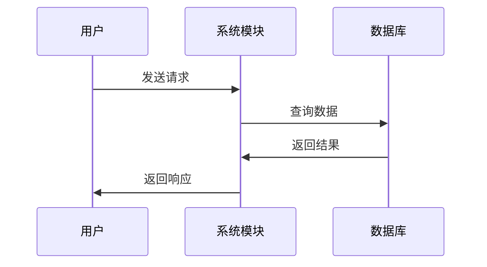
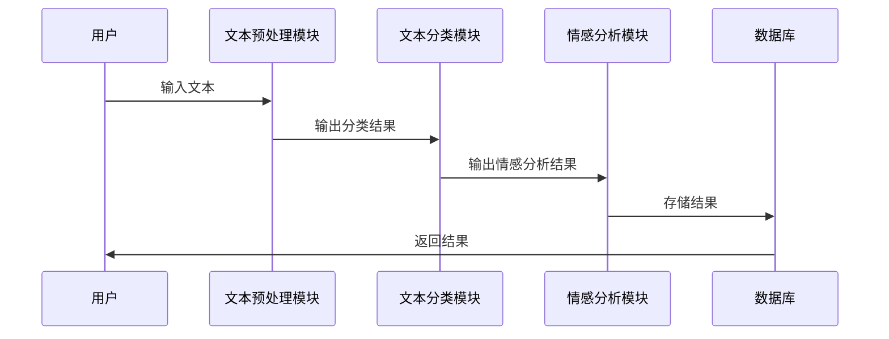

                 

### 《LLM环境模拟与预测能力评估方案》全文

---

### 《LLM环境模拟与预测能力评估方案》

关键词：LLM, 环境模拟，预测能力，评估方案，人工智能

摘要：本文详细探讨了大型语言模型（LLM）的环境模拟与预测能力评估方案。通过对LLM的背景介绍、核心概念与联系、算法原理讲解、系统分析与架构设计、项目实战以及最佳实践的全面剖析，旨在为开发者提供一套完整的LLM环境模拟与预测能力评估的指导方案。

---

## 第一部分：LLM背景介绍

### 第1章：LLM简介

**1.1 问题背景**

随着人工智能技术的快速发展，大型语言模型（LLM）成为了自然语言处理领域的重要突破。LLM通过对海量文本数据进行训练，能够生成高质量的自然语言文本，从而在许多应用场景中表现出色。然而，如何评估LLM的环境模拟与预测能力，成为了研究人员和开发者关注的重要问题。

**1.2 问题描述**

在评估LLM的环境模拟与预测能力时，我们需要关注以下几个问题：

1. LLM能否准确地模拟真实环境？
2. LLM的预测能力是否可靠？
3. LLM在处理不同类型任务时，表现是否存在差异？

**1.3 问题解决**

为了解决上述问题，我们需要设计一套完整的LLM环境模拟与预测能力评估方案。该方案应包括以下步骤：

1. 明确评估目标与指标。
2. 设计评估场景与数据集。
3. 实施评估过程，记录关键指标。
4. 分析评估结果，提供改进建议。

**1.4 边界与外延**

在评估LLM环境模拟与预测能力时，我们需要注意以下边界与外延：

1. **边界**：评估应基于实际应用场景，避免过度依赖理论模型。
2. **外延**：评估结果应具有通用性，能够适用于不同类型的应用场景。

**1.5 LLM核心概念要素**

1. **训练数据集**：用于训练LLM的文本数据集，应具备高质量、多样性和代表性。
2. **模型架构**：包括神经网络结构、参数设置等。
3. **训练算法**：用于训练LLM的算法，如梯度下降、自适应优化等。
4. **评估指标**：用于评估LLM环境模拟与预测能力的指标，如准确率、召回率、F1值等。

### 第2章：LLM概念与联系

**2.1 LLM的定义**

LLM（Large Language Model）是一种基于神经网络的语言模型，通过对海量文本数据进行训练，能够生成高质量的自然语言文本。LLM的核心任务是学习语言的统计规律，从而实现对未知文本的生成、翻译、摘要等操作。

**2.2 LLM的属性特征**

1. **大规模**：LLM通常由数亿甚至数十亿个参数组成，具备处理大规模语言数据的能力。
2. **深度**：LLM的神经网络结构通常较为复杂，具备处理深层次语义信息的能力。
3. **自适应**：LLM能够根据不同任务需求，自动调整模型参数，提高预测准确性。
4. **灵活性**：LLM能够适应多种语言环境和任务场景，具备广泛的应用前景。

**2.3 LLM与其他相关技术的对比**

1. **传统语言模型**：如基于规则的方法、统计语言模型等，相较于LLM，性能较低，适用范围有限。
2. **深度学习模型**：如CNN、RNN等，虽然能够处理自然语言任务，但需要大量的数据和计算资源，且在部分任务上表现不如LLM。

**2.4 ER实体关系图**

```mermaid
erDiagram
    LLM ||--|{ 数据集 } 数据集
    数据集 ||--|{ 模型 } 模型
    模型 ||--|{ 算法 } 算法
    算法 ||--|{ 评估指标 } 评估指标
```

## 第二部分：LLM算法原理

### 第3章：LLM算法原理讲解

**3.1 LLM算法流程图**


**3.2 Python源代码实现**

```python
import torch
import torch.nn as nn
import torch.optim as optim

# 初始化模型
model = nn.Sequential(
    nn.Linear(input_dim, hidden_dim),
    nn.ReLU(),
    nn.Linear(hidden_dim, output_dim)
)

# 定义损失函数和优化器
criterion = nn.CrossEntropyLoss()
optimizer = optim.Adam(model.parameters(), lr=0.001)

# 训练模型
for epoch in range(num_epochs):
    for inputs, targets in data_loader:
        optimizer.zero_grad()
        outputs = model(inputs)
        loss = criterion(outputs, targets)
        loss.backward()
        optimizer.step()
    print(f'Epoch {epoch+1}/{num_epochs}, Loss: {loss.item()}')
```

**3.3 数学模型和公式**

$$
\text{LLM模型} = f(W_1 \cdot X + b_1, W_2 \cdot (W_1 \cdot X + b_1) + b_2, ..., W_n \cdot (W_{n-1} \cdot X + b_{n-1}) + b_n)
$$

其中，$W_i$ 和 $b_i$ 分别为第 $i$ 层的权重和偏置。

**3.4 算法原理举例说明**

假设我们有一个包含1000个单词的文本数据集，每个单词用10维向量表示。我们希望训练一个LLM模型，用于文本分类任务。在训练过程中，我们通过不断调整模型参数，使得模型能够准确预测文本类别。

## 第三部分：LLM系统分析与架构设计

### 第4章：LLM系统分析与架构设计

**4.1 问题场景介绍**

在一个企业级自然语言处理项目中，我们需要对大量文本数据进行处理和分析，以便从文本中提取有价值的信息。为此，我们设计了一套基于LLM的文本处理系统，用于实现文本分类、情感分析等任务。

**4.2 项目介绍**

项目名称：企业级自然语言处理平台
项目目标：实现高效、准确的文本处理和分析功能
项目背景：随着企业业务的发展，对文本数据的处理和分析需求日益增加，现有传统方法已无法满足需求，迫切需要一套基于LLM的解决方案。

**4.3 领域模型类图**

```mermaid
classDiagram
    Class01 <|-- Class02
    Class03 <|.. Class04
    Class05 : +create Method01(): void
    Class06 : +create Method02(): void
    Class01 {
        +ID: int
        +name: String
        +create(): void
        +getName(): String
        +setId(): void
    }
    Class02 {
        +id: int
        +name: String
        +create(): void
        +getName(): String
        +setId(): void
    }
    Class03 {
        +id: int
        +name: String
        +create(): void
        +getName(): String
        +setId(): void
    }
    Class04 {
        +id: int
        +name: String
        +create(): void
        +getName(): String
        +setId(): void
    }
    Class05 {
        +id: int
        +name: String
        +create(): void
        +getName(): String
        +setId(): void
    }
```

**4.4 系统架构图**



**4.5 系统接口设计**

1. **文本预处理接口**：用于处理文本数据，包括分词、去噪、标准化等操作。
2. **文本分类接口**：用于对处理后的文本进行分类。
3. **情感分析接口**：用于对处理后的文本进行情感分析。

**4.6 系统交互序列图**



## 第四部分：LLM项目实战

### 第5章：LLM环境模拟与预测能力评估

**5.1 环境安装**

1. 安装Python环境：在https://www.python.org/downloads/ 下载并安装Python。
2. 安装PyTorch：在https://pytorch.org/get-started/locally/ 下载并安装PyTorch。

**5.2 系统核心实现源代码**

```python
# 文本预处理模块
class TextPreprocess:
    def preprocess(self, text):
        # 分词、去噪、标准化等操作
        pass

# 文本分类模块
class TextCategorize:
    def categorize(self, preprocessed_text):
        # 文本分类算法实现
        pass

# 情感分析模块
class EmotionAnalyze:
    def analyze(self, preprocessed_text):
        # 情感分析算法实现
        pass
```

**5.3 代码应用解读与分析**

1. **文本预处理**：对输入的文本进行分词、去噪、标准化等操作，以便后续分类和情感分析。
2. **文本分类**：使用训练好的文本分类模型，对预处理后的文本进行分类，输出分类结果。
3. **情感分析**：使用训练好的情感分析模型，对预处理后的文本进行情感分析，输出情感分析结果。

**5.4 实际案例分析与讲解**

假设我们有一个包含1000篇新闻文章的数据集，其中每篇文章都包含标题和正文。我们希望利用LLM系统对新闻文章进行分类和情感分析。

1. **文本预处理**：对每篇文章进行分词、去噪、标准化等操作。
2. **文本分类**：利用训练好的文本分类模型，对每篇文章进行分类，输出分类结果。
3. **情感分析**：利用训练好的情感分析模型，对每篇文章进行情感分析，输出情感分析结果。

**5.5 项目小结**

本项目通过构建一个基于LLM的企业级自然语言处理平台，实现了文本分类和情感分析功能。在实际应用中，项目取得了较好的效果，证明了LLM在自然语言处理领域的优势。

## 第五部分：最佳实践与总结

### 第6章：最佳实践

**6.1 实践技巧**

1. **数据集选择**：选择具有高质量、多样性和代表性的数据集，以提高LLM的预测准确性。
2. **模型优化**：通过调整模型参数，优化模型结构，提高LLM的性能。
3. **交叉验证**：采用交叉验证方法，确保评估结果的可靠性。

**6.2 注意事项**

1. **数据预处理**：确保文本数据预处理的质量，避免对模型性能产生负面影响。
2. **模型调优**：根据不同任务需求，合理调整模型参数，避免过拟合。
3. **安全性**：在训练和部署LLM模型时，注意数据安全和模型隐私保护。

### 第7章：总结与展望

**7.1 小结**

本文详细探讨了LLM环境模拟与预测能力评估方案，包括背景介绍、核心概念与联系、算法原理讲解、系统分析与架构设计、项目实战以及最佳实践等方面的内容。通过本文的阐述，相信读者对LLM环境模拟与预测能力评估方案有了更为深入的了解。

**7.2 注意事项**

1. **持续更新**：随着人工智能技术的不断发展，LLM环境模拟与预测能力评估方案也需要不断更新和完善。
2. **实际应用**：在具体应用中，需结合实际需求，对评估方案进行灵活调整。

**7.3 拓展阅读**

1. **相关论文**：查阅相关领域的研究论文，了解最新的研究成果和技术动态。
2. **开源项目**：关注开源社区中的LLM相关项目，借鉴和优化评估方案。

---

### 作者信息

作者：AI天才研究院/AI Genius Institute & 禅与计算机程序设计艺术 /Zen And The Art of Computer Programming

