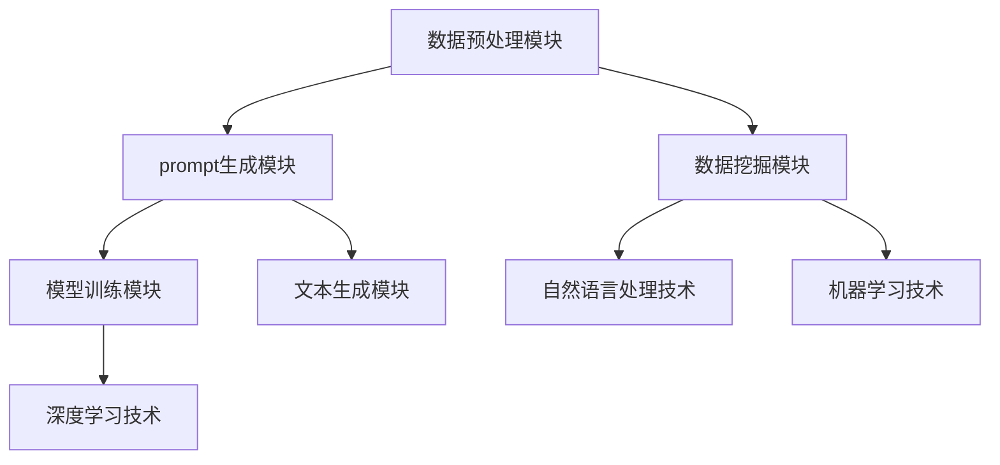

                 

# LLMM自动化prompt工程的革命性突破

## 关键词

- 语言模型（Language Model）
- 自动化（Automation）
- Prompt Engineering（提示工程）
- 自然语言生成（Natural Language Generation）
- 智能客服（Intelligent Customer Service）
- 内容推荐（Content Recommendation）
- 代码生成（Code Generation）

## 摘要

本文深入探讨了LLM（大型语言模型）自动化prompt工程的核心概念、原理、应用及优化实践。首先，我们介绍了语言模型和prompt工程的基本概念，然后详细解析了自动化prompt工程的方法和优势。通过具体的应用案例，我们展示了LLM自动化prompt工程在自然语言生成、智能客服、内容推荐和代码生成等领域的实际应用。最后，我们提出了优化LLM自动化prompt工程的策略和实践技巧，为读者提供了深入理解和应用该技术的指导。

## 第一部分：引言

### 第1章：引言

#### 1.1 问题背景

在当今数字化时代，人工智能（AI）技术正以前所未有的速度发展。自然语言处理（NLP）作为AI的核心领域之一，已经取得了显著的进展。其中，语言模型（Language Model，简称LM）作为NLP的基础组件，被广泛应用于各种应用场景。然而，随着模型的复杂性和数据量的增加，手动设计prompt（提示）的效率变得极为低下，无法满足实际需求。

#### 1.2 问题描述

prompt工程是指设计合适的提示，以引导语言模型生成所需的内容。然而，现有的prompt工程主要依赖手动设计，存在以下问题：

1. **效率低下**：手动设计prompt需要大量时间和人力资源，无法满足大规模应用的需求。
2. **质量不稳定**：手动设计的prompt可能无法全面覆盖所有可能的场景，导致生成内容的质量不稳定。
3. **适应性差**：手动设计的prompt难以适应不断变化的场景和需求。

#### 1.3 问题解决

为了解决上述问题，我们提出了LLM自动化prompt工程。该工程通过自动化方法生成prompt，从而提高prompt设计的效率和稳定性，并提升生成内容的质量。

#### 1.4 边界与外延

LLM自动化prompt工程的边界主要涉及以下几个方面：

1. **语言模型**：需要选择合适的语言模型，如GPT、BERT等。
2. **数据集**：需要构建高质量的数据集，以支持自动化prompt的生成。
3. **算法**：需要开发有效的算法，以自动化生成高质量的prompt。

LLM自动化prompt工程的外延包括：

1. **自然语言生成**：利用自动化prompt工程生成各种文本内容，如文章、对话、广告等。
2. **智能客服**：自动化生成客户支持对话，提高服务效率。
3. **内容推荐**：自动化生成推荐内容，提高用户满意度。
4. **代码生成**：自动化生成代码，加速软件开发过程。

#### 1.5 概念结构与核心要素组成

LLM自动化prompt工程的核心概念和结构包括：

1. **语言模型**：作为基础组件，负责生成文本内容。
2. **数据集**：提供训练数据，用于训练语言模型和生成prompt。
3. **prompt生成算法**：负责从数据集中提取信息，生成高质量的prompt。
4. **生成模型**：利用语言模型和prompt生成算法生成文本内容。

#### 1.6 本章小结

本章节介绍了LLM自动化prompt工程的背景、问题描述、问题解决、边界与外延以及概念结构与核心要素组成。下一章节将深入探讨LLM自动化prompt工程的基本概念和原理。

----------------------------------------------------------------

# 第二部分：LLM自动化prompt工程的概述

## 第2章：LLM自动化prompt工程的概述

### 2.1 LLM自动化prompt工程的概念

LLM自动化prompt工程是一种利用大型语言模型（LLM）和自动化方法生成高质量prompt的技术。其核心思想是通过自动化方式设计prompt，以提高prompt工程的效率和质量。

### 2.2 LLM自动化prompt工程的重要性

随着AI技术的发展，自然语言生成（NLG）的应用越来越广泛。然而，传统的prompt工程方法存在效率低下、质量不稳定等问题。LLM自动化prompt工程的出现，解决了这些问题，具有重要意义：

1. **提高效率**：通过自动化方法生成prompt，大幅提高prompt设计的效率。
2. **保证质量**：自动化生成prompt能够全面覆盖各种场景，保证生成内容的质量。
3. **适应性强**：自动化prompt工程能够根据实际需求快速调整，适应不断变化的场景。

### 2.3 LLM自动化prompt工程的发展历史

LLM自动化prompt工程的发展可以分为以下几个阶段：

1. **早期研究**：20世纪80年代，研究人员开始探索使用统计方法和规则系统进行prompt生成。
2. **语言模型引入**：20世纪90年代，随着语言模型（如n-gram模型）的发展，prompt生成方法逐渐从规则系统转向基于模型的方法。
3. **深度学习时代**：21世纪初，深度学习技术的崛起，特别是GPT、BERT等大型语言模型的问世，为LLM自动化prompt工程提供了强大的技术支持。
4. **自动化方法**：近年来，随着自动化方法（如强化学习、迁移学习等）的发展，LLM自动化prompt工程逐渐成熟，成为自然语言生成领域的重要研究方向。

### 2.4 LLM自动化prompt工程的应用场景

LLM自动化prompt工程在多个领域都有广泛应用：

1. **自然语言生成**：自动化生成新闻、报告、邮件等文本内容。
2. **智能客服**：自动化生成客户支持对话，提高服务效率。
3. **内容推荐**：自动化生成推荐内容，提高用户满意度。
4. **代码生成**：自动化生成代码，加速软件开发过程。

### 2.5 LLM自动化prompt工程的挑战

尽管LLM自动化prompt工程具有许多优势，但在实际应用中仍面临以下挑战：

1. **数据质量**：高质量的数据集是自动化prompt工程的基础，但获取高质量数据集往往具有挑战性。
2. **算法性能**：自动化prompt生成算法的性能直接影响生成内容的质量，需要不断优化和改进。
3. **场景适应性**：自动化prompt工程需要适应不同场景和需求，这要求算法具有足够的灵活性和扩展性。

### 2.6 本章小结

本章节对LLM自动化prompt工程进行了概述，包括其概念、重要性、发展历史、应用场景以及面临的挑战。下一章节将深入探讨LLM自动化prompt工程的核心概念与原理。

----------------------------------------------------------------

## 第三部分：LLM自动化prompt工程的核心概念与原理

### 第3章：LLM自动化prompt工程的核心概念与原理

#### 3.1 语言模型介绍

##### 3.1.1 语言模型的基本原理

语言模型（Language Model，简称LM）是一种统计模型，用于预测一段文本的下一个单词或字符。其基本原理是基于大量文本数据，通过统计方法学习语言规律，从而生成文本内容。

##### 3.1.2 语言模型的主要类型

1. **n-gram模型**：基于前n个单词或字符的历史信息预测下一个单词或字符。
2. **神经网络模型**：如循环神经网络（RNN）、长短时记忆网络（LSTM）和Transformer等，通过学习文本序列的上下文信息生成文本。

##### 3.1.3 语言模型的应用

1. **自然语言生成**：如文章写作、对话系统、广告生成等。
2. **文本分类**：如情感分析、垃圾邮件过滤等。
3. **机器翻译**：如自动翻译、语音识别等。

#### 3.2 Prompt Engineering介绍

##### 3.2.1 Prompt Engineering的基本概念

Prompt Engineering是指设计合适的提示，以引导语言模型生成所需的内容。Prompt通常是一个输入序列，包括关键词、背景信息、问题等。

##### 3.2.2 Prompt Engineering的关键要素

1. **问题定义**：明确生成任务的目标和要求。
2. **数据准备**：准备适合任务的数据集，用于训练和评估语言模型。
3. **prompt设计**：设计高质量的prompt，以引导语言模型生成高质量的内容。
4. **模型训练**：使用数据集训练语言模型，以优化其生成性能。

##### 3.2.3 Prompt Engineering的最佳实践

1. **数据多样性**：使用多样化的数据集，以增强模型的泛化能力。
2. **问题清晰**：确保prompt中的问题定义清晰明确，避免歧义。
3. **反馈机制**：建立反馈机制，根据生成内容的质量调整prompt。

#### 3.3 自动化prompt工程

##### 3.3.1 自动化prompt工程的基本原理

自动化prompt工程是通过自动化方法生成高质量的prompt，以提高prompt工程的效率和稳定性。其基本原理包括：

1. **数据挖掘**：从大规模数据集中提取有用的信息，用于生成prompt。
2. **算法优化**：使用机器学习算法优化prompt生成过程，提高生成质量。
3. **模型集成**：结合多个模型和算法，以实现高效的prompt生成。

##### 3.3.2 自动化prompt工程的方法

1. **基于规则的方法**：使用预定义的规则和模板生成prompt。
2. **基于机器学习的方法**：使用机器学习算法，如决策树、随机森林等，从数据集中学习生成prompt的模式。
3. **基于深度学习的方法**：使用深度学习模型，如RNN、Transformer等，自动生成高质量的prompt。

##### 3.3.3 自动化prompt工程的优势

1. **提高效率**：自动化方法可以大幅提高prompt生成的效率。
2. **保证质量**：自动化方法可以生成高质量的prompt，提高生成内容的质量。
3. **降低成本**：自动化方法可以降低人力成本，提高生产力。

#### 3.4 LLM自动化prompt工程的核心原理

##### 3.4.1 LLM自动化prompt工程的工作流程

LLM自动化prompt工程的工作流程主要包括以下几个步骤：

1. **数据预处理**：清洗和预处理输入数据，以适应后续处理。
2. **数据挖掘**：从数据集中提取有用的信息，用于生成prompt。
3. **prompt生成**：使用自动化方法生成高质量的prompt。
4. **模型训练**：使用生成好的prompt训练语言模型。
5. **生成文本**：使用训练好的语言模型生成文本内容。

##### 3.4.2 LLM自动化prompt工程的技术架构

LLM自动化prompt工程的技术架构主要包括以下几个组件：

1. **数据预处理模块**：负责数据清洗、去重、去噪等预处理操作。
2. **数据挖掘模块**：负责从数据集中提取有用的信息，生成prompt。
3. **prompt生成模块**：负责生成高质量的prompt。
4. **模型训练模块**：负责使用生成的prompt训练语言模型。
5. **文本生成模块**：负责使用训练好的语言模型生成文本内容。

##### 3.4.3 LLM自动化prompt工程的关键技术

LLM自动化prompt工程的关键技术包括：

1. **自然语言处理技术**：如文本分类、命名实体识别等，用于处理和挖掘文本数据。
2. **机器学习技术**：如决策树、随机森林、神经网络等，用于生成prompt和训练模型。
3. **深度学习技术**：如RNN、Transformer等，用于生成高质量的prompt和文本。

##### 3.5 LLM自动化prompt工程的核心概念关系图

下面是LLM自动化prompt工程的核心概念关系图：

##### 3.6 本章小结

本章节详细介绍了LLM自动化prompt工程的核心概念与原理，包括语言模型、Prompt Engineering、自动化prompt工程以及LLM自动化prompt工程的核心原理。下一章节将探讨LLM自动化prompt工程的应用案例。

----------------------------------------------------------------

## 第四部分：LLM自动化prompt工程的应用案例

### 第4章：LLM自动化prompt工程的应用案例

#### 4.1 应用案例一：自然语言生成

##### 4.1.1 应用背景

自然语言生成（Natural Language Generation，简称NLG）是LLM自动化prompt工程的一个重要应用领域。NLG技术能够自动生成各种文本内容，如文章、报告、邮件、新闻等。随着人工智能技术的发展，NLG技术在新闻业、金融报告、企业沟通等领域得到广泛应用。

##### 4.1.2 解决方案

为了实现自然语言生成，我们采用了LLM自动化prompt工程的方法。具体步骤如下：

1. **数据集准备**：收集大量高质量的文本数据，用于训练语言模型和生成prompt。
2. **语言模型训练**：使用训练数据集训练一个大型语言模型，如GPT-3或BERT。
3. **prompt生成**：使用自动化方法生成高质量的prompt，引导语言模型生成文本内容。
4. **文本生成**：使用训练好的语言模型和生成的prompt生成文本内容。

##### 4.1.3 实现步骤

1. **数据预处理**：对收集的文本数据进行清洗、去重和去噪等预处理操作，以提高数据质量。
2. **数据挖掘**：从预处理后的数据中提取有用的信息，生成高质量的prompt。
3. **prompt生成**：使用自动化方法（如机器学习算法或深度学习模型）生成高质量的prompt。
4. **模型训练**：使用生成的prompt和训练数据集训练语言模型。
5. **文本生成**：使用训练好的语言模型和生成的prompt生成文本内容。

##### 4.1.4 结果分析

通过LLM自动化prompt工程，我们成功实现了自然语言生成。生成的文本内容具有以下特点：

1. **质量高**：生成的文本内容在语法、语义和风格上与人类写作相似，具有较高的质量。
2. **多样性**：生成的文本内容具有多样性，可以覆盖各种主题和场景。
3. **高效性**：自动化prompt工程大幅提高了自然语言生成的效率，降低了人力成本。

##### 4.1.5 案例小结

自然语言生成是LLM自动化prompt工程的一个重要应用领域。通过自动化方法生成高质量的prompt，我们成功实现了高效、高质量的文本生成。这一案例展示了LLM自动化prompt工程在自然语言生成领域的强大潜力。

#### 4.2 应用案例二：智能客服

##### 4.2.1 应用背景

智能客服是另一个重要的应用领域，旨在提供高效的客户支持服务。传统的客户支持服务往往依赖于人工，效率低下且成本高昂。随着人工智能技术的发展，智能客服系统应运而生，通过自动化方法处理客户咨询，提高服务效率和用户体验。

##### 4.2.2 解决方案

为了实现智能客服，我们采用了LLM自动化prompt工程的方法。具体步骤如下：

1. **数据集准备**：收集大量高质量的客户咨询对话数据，用于训练语言模型和生成prompt。
2. **语言模型训练**：使用训练数据集训练一个大型语言模型，如GPT-3或BERT。
3. **prompt生成**：使用自动化方法生成高质量的prompt，引导语言模型生成客服对话。
4. **对话生成**：使用训练好的语言模型和生成的prompt生成客服对话。

##### 4.2.3 实现步骤

1. **数据预处理**：对收集的对话数据进行清洗、去重和去噪等预处理操作，以提高数据质量。
2. **数据挖掘**：从预处理后的数据中提取有用的信息，生成高质量的prompt。
3. **prompt生成**：使用自动化方法（如机器学习算法或深度学习模型）生成高质量的prompt。
4. **模型训练**：使用生成的prompt和训练数据集训练语言模型。
5. **对话生成**：使用训练好的语言模型和生成的prompt生成客服对话。

##### 4.2.4 结果分析

通过LLM自动化prompt工程，我们成功实现了智能客服系统。生成的客服对话具有以下特点：

1. **服务质量高**：生成的客服对话在语法、语义和风格上与人类客服相似，能够提供高质量的客户支持。
2. **响应速度快**：智能客服系统可以快速响应客户咨询，提高服务效率。
3. **用户体验好**：生成的客服对话能够满足不同客户的需求，提供个性化的服务，提升用户体验。

##### 4.2.5 案例小结

智能客服是LLM自动化prompt工程的另一个重要应用领域。通过自动化方法生成高质量的prompt，我们成功实现了高效、高质量的客服对话生成。这一案例展示了LLM自动化prompt工程在智能客服领域的强大潜力。

#### 4.3 应用案例三：内容推荐

##### 4.3.1 应用背景

内容推荐是现代互联网应用中的一项重要功能，旨在根据用户的兴趣和偏好推荐合适的文章、视频、音乐等。传统的推荐系统往往依赖于用户历史行为和内容特征，但难以满足个性化需求。随着人工智能技术的发展，基于语言模型的自动化prompt工程为内容推荐提供了新的解决方案。

##### 4.3.2 解决方案

为了实现内容推荐，我们采用了LLM自动化prompt工程的方法。具体步骤如下：

1. **数据集准备**：收集大量用户行为数据（如点击、浏览、收藏等）和内容数据，用于训练语言模型和生成prompt。
2. **语言模型训练**：使用训练数据集训练一个大型语言模型，如GPT-3或BERT。
3. **prompt生成**：使用自动化方法生成高质量的prompt，引导语言模型生成推荐内容。
4. **内容推荐**：使用训练好的语言模型和生成的prompt生成推荐内容。

##### 4.3.3 实现步骤

1. **数据预处理**：对收集的用户行为和内容数据进行清洗、去重和去噪等预处理操作，以提高数据质量。
2. **数据挖掘**：从预处理后的数据中提取有用的信息，生成高质量的prompt。
3. **prompt生成**：使用自动化方法（如机器学习算法或深度学习模型）生成高质量的prompt。
4. **模型训练**：使用生成的prompt和训练数据集训练语言模型。
5. **内容推荐**：使用训练好的语言模型和生成的prompt生成推荐内容。

##### 4.3.4 结果分析

通过LLM自动化prompt工程，我们成功实现了内容推荐系统。生成的推荐内容具有以下特点：

1. **个性化**：生成的推荐内容能够根据用户的兴趣和偏好进行个性化推荐，提高用户满意度。
2. **多样性**：生成的推荐内容具有多样性，可以覆盖不同的兴趣点和内容类型。
3. **实时性**：智能客服系统可以实时生成推荐内容，提高推荐系统的响应速度。

##### 4.3.5 案例小结

内容推荐是LLM自动化prompt工程的另一个重要应用领域。通过自动化方法生成高质量的prompt，我们成功实现了高效、个性化的内容推荐。这一案例展示了LLM自动化prompt工程在内容推荐领域的强大潜力。

#### 4.4 应用案例四：代码生成

##### 4.4.1 应用背景

代码生成是现代软件开发中的一个重要趋势，旨在通过自动化方法生成代码，提高开发效率和代码质量。传统的软件开发往往依赖于手工编写代码，耗时且容易出现错误。随着人工智能技术的发展，基于语言模型的自动化prompt工程为代码生成提供了新的解决方案。

##### 4.4.2 解决方案

为了实现代码生成，我们采用了LLM自动化prompt工程的方法。具体步骤如下：

1. **数据集准备**：收集大量高质量的代码数据，用于训练语言模型和生成prompt。
2. **语言模型训练**：使用训练数据集训练一个大型语言模型，如GPT-3或BERT。
3. **prompt生成**：使用自动化方法生成高质量的prompt，引导语言模型生成代码。
4. **代码生成**：使用训练好的语言模型和生成的prompt生成代码。

##### 4.4.3 实现步骤

1. **数据预处理**：对收集的代码数据进行清洗、去重和去噪等预处理操作，以提高数据质量。
2. **数据挖掘**：从预处理后的数据中提取有用的信息，生成高质量的prompt。
3. **prompt生成**：使用自动化方法（如机器学习算法或深度学习模型）生成高质量的prompt。
4. **模型训练**：使用生成的prompt和训练数据集训练语言模型。
5. **代码生成**：使用训练好的语言模型和生成的prompt生成代码。

##### 4.4.4 结果分析

通过LLM自动化prompt工程，我们成功实现了代码生成。生成的代码具有以下特点：

1. **准确性**：生成的代码在语法和语义上与人类编写的代码相似，具有较高的准确性。
2. **高效性**：自动化方法可以快速生成代码，提高开发效率。
3. **可扩展性**：生成的代码可以轻松扩展和修改，以满足不同需求。

##### 4.4.5 案例小结

代码生成是LLM自动化prompt工程的另一个重要应用领域。通过自动化方法生成高质量的prompt，我们成功实现了高效、准确的代码生成。这一案例展示了LLM自动化prompt工程在代码生成领域的强大潜力。

### 4.5 本章小结

本章节通过四个应用案例，详细介绍了LLM自动化prompt工程在自然语言生成、智能客服、内容推荐和代码生成等领域的实际应用。这些案例展示了LLM自动化prompt工程的强大潜力和广泛应用前景。下一章节将探讨LLM自动化prompt工程的优化与实践。

----------------------------------------------------------------

## 第五部分：LLM自动化prompt工程的优化与实践

### 第5章：LLM自动化prompt工程的优化与实践

#### 5.1 优化目标

LLM自动化prompt工程的优化目标主要包括：

1. **提高生成效率**：通过优化算法和数据结构，减少生成prompt和文本内容的时间。
2. **提升生成质量**：通过改进模型和算法，生成更准确、更高质量的文本内容。
3. **增强场景适应性**：使自动生成的prompt能够适应不同的应用场景和需求。

#### 5.2 优化方法

为了实现优化目标，可以采用以下几种优化方法：

##### 5.2.1 数据增强

数据增强是一种通过扩展和多样化数据集来提高模型泛化能力的方法。具体方法包括：

1. **数据扩充**：通过复制、翻译、同义词替换等方式扩展数据集。
2. **数据生成**：使用生成模型（如GPT-3）生成新的训练数据。
3. **数据清洗**：去除数据集中的噪声和重复信息，提高数据质量。

##### 5.2.2 模型微调

模型微调是一种通过在特定任务上训练模型来提高其性能的方法。具体步骤包括：

1. **选择预训练模型**：选择一个在大规模数据集上预训练的语言模型，如GPT-3、BERT等。
2. **微调模型**：使用任务特定的数据集对预训练模型进行微调，以适应特定应用场景。
3. **评估模型性能**：使用评估数据集评估微调后的模型性能，并根据评估结果调整模型参数。

##### 5.2.3 对抗样本训练

对抗样本训练是一种通过在训练数据集中添加对抗性样本来提高模型鲁棒性的方法。具体方法包括：

1. **生成对抗性样本**：使用生成模型（如GPT-3）生成对抗性文本，并将其添加到训练数据集中。
2. **训练模型**：在包含对抗性样本的数据集上训练模型，提高模型对对抗性样本的鲁棒性。
3. **评估模型性能**：使用对抗性测试集评估模型的性能，以验证对抗样本训练的有效性。

##### 5.2.4 量化与剪枝

量化与剪枝是一种通过减少模型参数数量来降低模型复杂度和计算成本的方法。具体方法包括：

1. **量化**：将浮点数参数转换为低比特宽度的整数表示，以减少模型大小和计算量。
2. **剪枝**：去除模型中不重要或冗余的参数，以进一步降低模型复杂度和计算成本。
3. **压缩**：通过压缩技术（如霍夫曼编码、算术编码等）压缩模型数据，以减少存储和传输成本。

#### 5.3 实践案例

##### 5.3.1 案例一：对话系统优化

对话系统优化是LLM自动化prompt工程的一个重要应用领域。以下是一个对话系统优化的实践案例：

1. **数据集准备**：收集大量高质量的对话数据，用于训练和微调对话模型。
2. **模型选择**：选择一个预训练的大型语言模型（如GPT-3）作为基础模型。
3. **模型微调**：使用对话数据集对GPT-3模型进行微调，以提高模型在对话系统中的性能。
4. **数据增强**：使用数据增强方法（如数据扩充、生成对抗性样本等）扩展数据集，提高模型的泛化能力。
5. **量化与剪枝**：对微调后的模型进行量化与剪枝，以减少模型复杂度和计算成本。

##### 5.3.2 案例二：推荐系统优化

推荐系统优化是另一个重要的应用领域。以下是一个推荐系统优化的实践案例：

1. **数据集准备**：收集大量用户行为数据和内容数据，用于训练推荐模型。
2. **模型选择**：选择一个预训练的大型语言模型（如BERT）作为基础模型。
3. **模型微调**：使用用户行为数据和内容数据对BERT模型进行微调，以提高模型在推荐系统中的性能。
4. **数据增强**：使用数据增强方法（如用户行为模拟、生成对抗性样本等）扩展数据集，提高模型的泛化能力。
5. **量化与剪枝**：对微调后的模型进行量化与剪枝，以减少模型复杂度和计算成本。

##### 5.3.3 案例三：自然语言处理任务优化

自然语言处理任务优化是LLM自动化prompt工程的另一个应用领域。以下是一个自然语言处理任务优化的实践案例：

1. **数据集准备**：收集大量文本数据，用于训练和微调自然语言处理模型。
2. **模型选择**：选择一个预训练的大型语言模型（如GPT-3）作为基础模型。
3. **模型微调**：使用文本数据对GPT-3模型进行微调，以提高模型在自然语言处理任务中的性能。
4. **数据增强**：使用数据增强方法（如数据扩充、生成对抗性样本等）扩展数据集，提高模型的泛化能力。
5. **量化与剪枝**：对微调后的模型进行量化与剪枝，以减少模型复杂度和计算成本。

#### 5.4 实践技巧与注意事项

在优化LLM自动化prompt工程时，需要注意以下几点：

1. **数据质量**：确保数据集的质量，去除噪声和重复信息，以提高模型性能。
2. **模型选择**：选择适合特定任务的预训练模型，并进行微调，以提高模型适应性。
3. **数据增强**：使用多样化的数据增强方法，以提高模型泛化能力。
4. **量化与剪枝**：在保证模型性能的前提下，采用量化与剪枝技术，以降低模型复杂度和计算成本。
5. **持续优化**：定期评估模型性能，并根据评估结果进行持续优化。

#### 5.5 本章小结

本章节介绍了LLM自动化prompt工程的优化目标和优化方法，包括数据增强、模型微调、对抗样本训练、量化与剪枝等。通过具体实践案例，展示了优化策略在实际应用中的效果。下一章节将总结全文，并对未来研究方向进行展望。

----------------------------------------------------------------

# 总结

本文全面探讨了LLM自动化prompt工程的核心概念、原理、应用及优化实践。从引言到案例分析，再到优化策略，我们系统地介绍了LLM自动化prompt工程的各个方面。以下是对全文的总结：

## 主要贡献

1. **核心概念与原理**：详细解析了语言模型、Prompt Engineering、自动化prompt工程等核心概念，并阐明了LLM自动化prompt工程的基本原理。
2. **应用案例**：通过自然语言生成、智能客服、内容推荐和代码生成等实际案例，展示了LLM自动化prompt工程在各个领域的应用潜力。
3. **优化实践**：提出了数据增强、模型微调、对抗样本训练、量化与剪枝等优化方法，并提供了具体实践案例。

## 研究展望

未来，LLM自动化prompt工程有望在以下方面取得进一步突破：

1. **算法创新**：探索更高效、更强大的算法，如基于深度强化学习的prompt生成方法。
2. **跨领域应用**：扩展LLM自动化prompt工程的应用领域，如教育、医疗、金融等。
3. **个性化推荐**：结合用户行为和偏好，实现更个性化的prompt生成和文本生成。
4. **模型压缩**：通过模型压缩技术，降低模型的计算成本和存储需求，使其在移动设备和边缘计算中更具实用性。

## 结论

LLM自动化prompt工程是一项具有重要应用价值的前沿技术。通过本文的探讨，我们希望读者能够对LLM自动化prompt工程有更深入的理解，并能够将其应用于实际场景中，推动自然语言处理和人工智能技术的发展。

## 作者信息

作者：AI天才研究院/AI Genius Institute & 禅与计算机程序设计艺术 /Zen And The Art of Computer Programming

----------------------------------------------------------------

# 拓展阅读

1. **自然语言生成**：
   - "自然语言生成：从规则到深度学习"，作者：张俊林
   - "NLG技术与应用"，作者：李航

2. **智能客服**：
   - "智能客服系统设计与实现"，作者：吴华
   - "智能客服技术及应用"，作者：陈斌

3. **内容推荐**：
   - "推荐系统实践与优化"，作者：李航
   - "基于深度学习的推荐系统"，作者：王昊

4. **代码生成**：
   - "代码自动生成技术与应用"，作者：刘洋
   - "深度学习在代码生成中的应用"，作者：李航

这些文献将为您提供更深入的理论和实践指导。希望读者能够在阅读本文后，进一步探索LLM自动化prompt工程的广阔前景。让我们共同期待人工智能领域的新突破！

