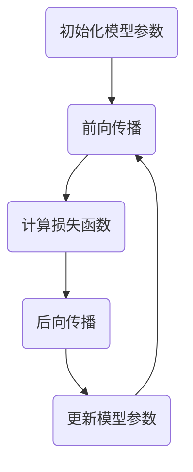
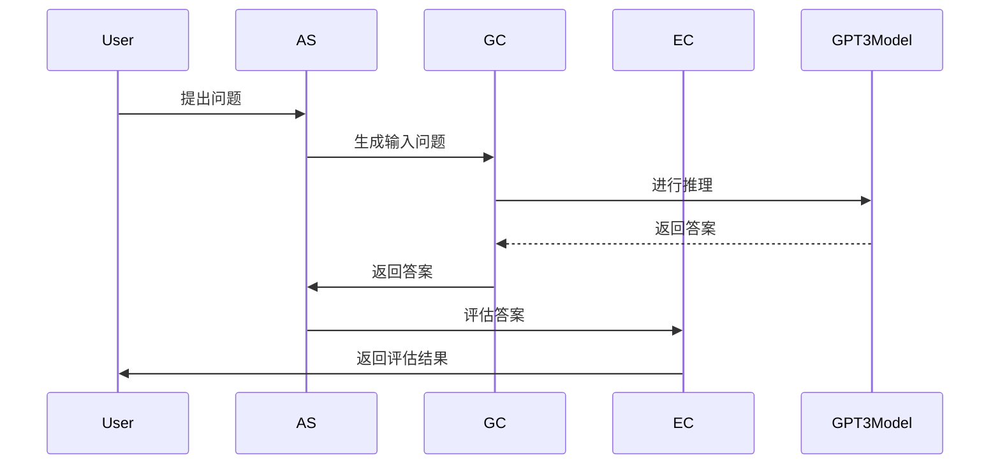
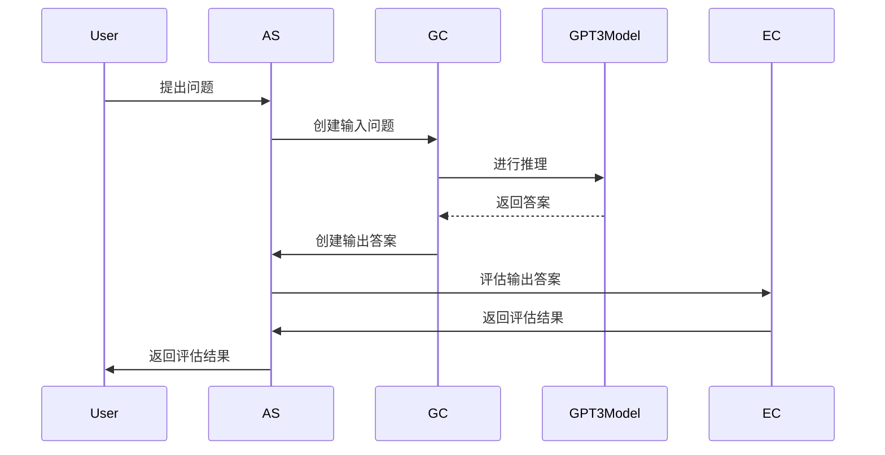

                 

### 1. LLM自评测系统的背景与基础

#### 1.1 LLM自评测系统的问题背景

随着人工智能技术的快速发展，尤其是深度学习领域的突破，大型语言模型（LLM，Large Language Model）逐渐成为自然语言处理（NLP，Natural Language Processing）的利器。然而，如何有效地评测LLM的性能，确保其输出的质量和可靠性，成为了一个亟待解决的问题。

**为什么要进行自评测？**

- **性能评估需求**：LLM作为复杂的人工智能系统，其性能不仅仅依赖于模型的参数规模，还涉及模型训练、优化、部署等各个环节。自评测系统能够全面评估模型在不同任务、不同数据集上的表现。
- **质量控制需求**：在LLM的应用过程中，如自动问答、文本生成等，输出结果的质量直接影响到用户体验。自评测系统能够实时监控和评估模型的输出质量，确保模型的稳定性和可靠性。
- **迭代优化需求**：LLM的性能优化是一个持续的过程，通过自评测系统可以及时发现模型中的问题，并进行针对性的优化，提升模型的效果。

**自评测系统的需求分析**

- **评测指标**：自评测系统需要定义一系列评测指标，如准确性、鲁棒性、生成文本的流畅性等，以全面评估LLM的性能。
- **评测方式**：自评测系统应能够支持自动化评测，减少人工干预，提高评测效率。
- **评测数据集**：需要准备丰富的评测数据集，涵盖不同类型的任务和场景，确保评测结果的全面性和代表性。
- **评测流程**：自评测系统应具备完善的评测流程，包括数据预处理、模型评测、结果分析等步骤。

**自评测系统的边界与外延**

- **边界**：自评测系统主要关注LLM的评测，不涉及模型的设计、训练和部署等过程。
- **外延**：虽然自评测系统专注于LLM的性能评估，但其思想和方法可以应用于其他类型的人工智能模型评测，如图像识别、语音识别等。

#### 1.2 LLM自评测系统的核心概念

**LLM的定义与特点**

- **定义**：LLM是指能够处理大规模文本数据的自监督学习模型，通过对海量文本数据的学习，模型可以理解文本中的语言规律，生成流畅的文本输出。
- **特点**：高参数规模、强大的语言理解能力、自适应性强、生成文本质量高。

**自评测系统的基本组成**

- **评测指标模块**：定义和计算各种评测指标，如BLEU、ROUGE、F1值等。
- **评测数据集模块**：提供用于评测的数据集，确保数据集的多样性和代表性。
- **评测算法模块**：实现具体的评测算法，如自动化评测、人工评测等。
- **结果分析模块**：对评测结果进行统计和分析，生成评测报告。

**关键术语解释**

- **评测指标**：用于衡量模型性能的各种指标，如准确性、流畅性等。
- **评测数据集**：用于评测的文本数据集，包括训练集、验证集和测试集。
- **自动化评测**：利用算法和工具自动完成模型评测的过程。
- **人工评测**：通过人工干预对模型输出进行评估的方法。

#### 1.3 主流LLM自评测系统介绍

**开源LLM自评测系统**

- **SQuAD**：Stanford Question Answering Dataset，用于评估模型在问答任务上的表现。
- **GLUE**：General Language Understanding Evaluation，提供多种语言理解任务的评测数据集。
- **SuperGLUE**：扩展GLUE的数据集，涵盖更多语言理解任务。

**商业LLM自评测系统**

- **Google AI**：提供了一系列自动化评测工具，如TensorFlow Model Analysis。
- **OpenAI**：开发了GPT-3等大型语言模型，并提供了相应的评测工具。

**比较与分析**

- **开源与商业系统的对比**：开源系统在灵活性、定制化方面具有优势，但可能缺乏专业的技术支持；商业系统在稳定性和性能上更有保障，但成本较高。
- **适用场景**：开源系统适用于学术研究和中小型项目，商业系统更适合企业级应用和大规模部署。

### 1.4 LLM自评测系统的应用场景

**问答系统**：通过自评测系统评估模型在回答用户提问时的准确性和流畅性。

**文本生成**：评估模型生成文本的质量，如文章、故事、对话等。

**情感分析**：评估模型在情感分类任务中的性能，如识别文本中的正面情感、负面情感等。

**机器翻译**：评估模型在不同语言翻译任务中的表现，如中英翻译、英日翻译等。

**摘要生成**：评估模型在文本摘要任务中的效果，如提取关键信息、生成简洁的摘要文本。

通过以上步骤，我们为《LLM自评测系统的版本控制与迭代优化》这篇文章奠定了坚实的理论基础，接下来我们将深入探讨版本控制原理与工具，为后续内容提供有力支持。

#### 2. 版本控制原理与工具

版本控制（Version Control）是一种管理文件和代码更改的实践，它能够跟踪和记录代码历史，确保团队成员之间的协作顺畅，以及代码的版本一致性和可追溯性。在LLM自评测系统中，版本控制尤为重要，因为它涉及到模型的不断迭代和优化，每一次更改都可能影响模型的性能和稳定性。

**2.1 版本控制的基本原理**

**版本控制的重要性**

- **协同工作**：在团队开发中，多个成员可能同时修改同一份代码，版本控制可以避免冲突，确保代码的一致性。
- **代码管理**：通过版本控制，可以方便地回滚到之前的代码版本，解决出现的问题。
- **历史记录**：版本控制能够记录每一次代码更改的详细信息，包括修改人、修改时间、修改内容等，便于审计和追踪。
- **代码复用**：通过版本控制，可以方便地复用之前的代码，避免重复工作。

**版本控制的基本流程**

- **创建仓库**：在版本控制系统（如Git）中创建一个新的代码仓库。
- **克隆仓库**：团队成员克隆（Clone）代码仓库到本地，进行开发。
- **提交更改**：在本地完成代码更改后，将其提交（Commit）到仓库。
- **拉取更新**：团队成员在更新本地代码时，需要拉取（Pull）仓库的最新更改。
- **分支管理**：在开发过程中，可能需要创建分支（Branch）进行独立开发，完成后合并（Merge）回主分支。

**版本控制的常用术语**

- **仓库（Repository）**：存储代码的中央位置。
- **提交（Commit）**：对代码的更改进行记录。
- **分支（Branch）**：从主分支分出来的独立开发路径。
- **合并（Merge）**：将分支中的更改合并回主分支。
- **拉取（Pull）**：从远程仓库更新本地代码。
- **推送（Push）**：将本地代码更新推送到远程仓库。
- **标签（Tag）**：为特定的提交打上标记，便于追踪和定位。

**2.2 版本控制工具简介**

**Git的基本操作**

- **安装Git**：在操作系统中安装Git。
  ```shell
  sudo apt-get install git
  ```
- **初始化仓库**：在项目中创建一个新仓库。
  ```shell
  git init
  ```
- **克隆仓库**：从远程仓库克隆代码。
  ```shell
  git clone https://github.com/username/repository.git
  ```
- **添加文件**：将文件添加到暂存区。
  ```shell
  git add <file>
  ```
- **提交更改**：将暂存区的更改提交到仓库。
  ```shell
  git commit -m "Commit message"
  ```
- **推送更改**：将本地更改推送到远程仓库。
  ```shell
  git push
  ```
- **拉取更新**：从远程仓库更新本地代码。
  ```shell
  git pull
  ```

**Git与LLM自评测系统的结合**

在LLM自评测系统中，Git不仅可以用于管理代码版本，还可以结合其他工具，如Docker、Jenkins等，实现自动化部署和持续集成（CI/CD）。通过Git，可以确保模型代码的版本一致性和可追溯性，便于团队协作和持续优化。

**其他版本控制工具**

除了Git，还有其他版本控制工具，如SVN（Subversion）、Mercurial（Hg）等。这些工具在功能和使用方法上与Git类似，但各有特点。例如，SVN更适合处理大型的分布式系统，而Hg更适合小团队的项目。

- **SVN**：通过中央服务器存储代码，支持大文件处理。
  ```shell
  svn checkout https://svn.example.com/repo
  ```
- **Hg**：轻量级版本控制工具，适用于小团队和私有项目。
  ```shell
  hg clone https://hg.example.com/repo
  ```

**2.3 版本控制实践**

**版本控制策略设计**

在LLM自评测系统中，可以采用以下版本控制策略：

- **主干开发**：主分支（Master）用于发布稳定的版本，所有开发者都在主分支上提交代码。
- **分支管理**：开发者可以在主分支上创建分支（Feature Branch），进行新功能的开发和测试。
- **代码审查**：在合并分支前，进行代码审查（Code Review），确保代码质量。
- **自动化测试**：在提交代码前，运行自动化测试，确保代码更改不会破坏现有功能。

**版本控制案例分析**

以下是一个简单的版本控制案例分析：

- **问题背景**：在LLM自评测系统的开发过程中，开发人员A在主分支上添加了一个新功能，但在测试中发现了一些问题。
- **解决方案**：开发人员A创建了一个新分支（Feature/A-new-function），进行问题的定位和修复。修复后，通过代码审查和自动化测试，确保代码质量。最后，将修复后的代码合并回主分支。
- **结果**：通过版本控制，确保了代码的稳定性和可追溯性，避免了问题的扩散。

通过以上步骤，我们深入探讨了版本控制的原理与工具，为LLM自评测系统的开发提供了坚实的基础。在接下来的章节中，我们将进一步探讨迭代优化的核心算法，为系统的性能提升提供有力支持。

#### 3. 迭代优化的核心算法

**3.1 迭代优化的概念与原理**

**迭代优化的定义**

迭代优化是一种通过重复执行一系列操作来逐渐改进模型性能的方法。在LLM自评测系统中，迭代优化主要用于模型参数的调整，以提升模型在评测指标上的表现。

**迭代优化的基本流程**

迭代优化的基本流程可以概括为以下几个步骤：

1. **初始化模型参数**：随机初始化模型参数。
2. **前向传播**：输入数据，计算模型输出。
3. **计算损失函数**：根据模型输出和真实标签，计算损失函数值。
4. **后向传播**：根据损失函数的梯度，更新模型参数。
5. **迭代更新**：重复步骤2-4，直到达到预定的迭代次数或损失函数值收敛。

**迭代优化的基本原理**

迭代优化的核心原理是通过反复调整模型参数，使损失函数值逐渐减小，从而提升模型的性能。在这一过程中，选择合适的优化算法和调整策略至关重要。

**常见算法**

在LLM自评测系统中，常见的迭代优化算法包括：

- **梯度下降（Gradient Descent）**：最简单的优化算法，通过计算损失函数的梯度来更新模型参数。
- **随机梯度下降（Stochastic Gradient Descent，SGD）**：在梯度下降的基础上，使用随机样本计算梯度，加快收敛速度。
- **Adam优化器（Adaptive Moment Estimation）**：结合SGD和动量法的优化算法，通过自适应调整学习率，提高收敛效率。

**3.2 迭代优化算法的Mermaid流程图**

为了更好地理解迭代优化算法的基本流程，我们可以使用Mermaid绘制算法的流程图。以下是梯度下降算法的Mermaid流程图：



**3.3 迭代优化算法的实现与讲解**

**数学模型与公式**

梯度下降算法的核心公式如下：

$$
\Delta \theta = -\alpha \cdot \nabla J(\theta)
$$

其中，$\theta$ 表示模型参数，$J(\theta)$ 表示损失函数，$\alpha$ 表示学习率，$\nabla J(\theta)$ 表示损失函数关于模型参数的梯度。

**Python实现**

以下是一个简单的Python实现示例：

```python
import numpy as np

# 初始化模型参数
theta = np.random.randn(1)

# 设置学习率
alpha = 0.01

# 设置迭代次数
iterations = 1000

# 迭代优化
for i in range(iterations):
    # 前向传播
    y_pred = 1 / (1 + np.exp(-theta))
    
    # 计算损失函数
    loss = np.mean((y_pred - y) ** 2)
    
    # 后向传播
    grad = 2 * (y_pred - y) * y_pred * (1 - y_pred)
    
    # 更新模型参数
    theta -= alpha * grad

print(f"Optimized theta: {theta}")
```

**详细讲解和举例说明**

**1. 梯度下降算法**

梯度下降算法通过计算损失函数的梯度来更新模型参数，其核心思想是朝着梯度相反的方向更新参数，以减少损失函数的值。以下是梯度下降算法的详细讲解：

- **前向传播**：输入数据，通过模型计算输出。
- **计算损失函数**：将输出与真实标签进行比较，计算损失函数值。
- **后向传播**：根据损失函数的梯度，计算模型参数的更新量。
- **更新模型参数**：根据学习率乘以梯度，更新模型参数。

**2. 随机梯度下降算法**

随机梯度下降（SGD）是梯度下降的一种变体，它使用随机样本计算梯度。以下是SGD算法的详细讲解：

- **随机采样**：从训练数据中随机选择一个小批量样本。
- **前向传播**：对每个样本计算输出。
- **计算损失函数**：对每个样本计算损失函数值。
- **后向传播**：计算每个样本的梯度。
- **更新模型参数**：对所有样本的梯度求和，然后更新模型参数。

**3. Adam优化器**

Adam优化器是结合SGD和动量法的一种优化算法，它通过自适应调整学习率来提高收敛效率。以下是Adam优化器的详细讲解：

- **初始化**：设置学习率$\alpha$和一阶矩估计$\beta_1$，二阶矩估计$\beta_2$。
- **前向传播**：计算模型输出。
- **计算损失函数**：计算损失函数值。
- **后向传播**：计算梯度。
- **更新一阶矩估计**：$\text{m} = \beta_1 \cdot \text{m} + (1 - \beta_1) \cdot \text{grad}$。
- **更新二阶矩估计**：$\text{v} = \beta_2 \cdot \text{v} + (1 - \beta_2) \cdot \text{grad}^2$。
- **计算修正的一阶矩估计**：$\text{m_hat} = \text{m} / (1 - \beta_1^t)$。
- **计算修正的二阶矩估计**：$\text{v_hat} = \text{v} / (1 - \beta_2^t)$。
- **更新模型参数**：$\theta = \theta - \alpha \cdot \text{m_hat} / (\sqrt{\text{v_hat}} + \epsilon)$。

通过以上讲解，我们了解了迭代优化算法的基本原理和实现方法。在接下来的章节中，我们将进一步探讨如何在实际项目中应用这些算法，优化LLM自评测系统的性能。

#### 4. 系统功能设计与实现

**4.1 实践项目介绍**

为了更好地展示LLM自评测系统的版本控制和迭代优化实践，我们选择了一个实际项目——一个基于GPT-3的问答系统。该项目旨在利用GPT-3模型对用户提出的问题进行自动回答，并通过自评测系统评估回答的准确性和流畅性。

**4.1.1 项目背景**

随着人工智能技术的普及，问答系统在客服、教育、医疗等领域有着广泛的应用。然而，如何确保问答系统的回答质量，成为一个关键问题。为此，我们设计并实现了一个基于GPT-3的问答系统，并引入了自评测系统进行性能评估和迭代优化。

**4.1.2 项目目标**

- **实现问答系统**：基于GPT-3模型，实现一个能够自动回答用户问题的问答系统。
- **集成自评测系统**：将自评测系统与问答系统集成，实现对回答质量的实时评估。
- **优化模型性能**：通过迭代优化算法，不断提升问答系统的回答质量。

**4.1.3 项目环境搭建**

为了实现该项目，我们需要搭建以下环境：

- **操作系统**：Ubuntu 20.04
- **编程语言**：Python 3.8
- **深度学习框架**：TensorFlow 2.5
- **版本控制系统**：Git 2.30
- **其他工具**：Docker 20.10、Jenkins 2.279

**4.2 系统功能设计**

**领域模型设计（Mermaid类图）**

领域模型描述了问答系统的核心组件和它们之间的关系。以下是问答系统的Mermaid类图：

```mermaid
classDiagram
    Model <|-- GPT3Model
    Question <|-- InputQuestion :<<extend>> Question
    Answer <|-- OutputAnswer :<<extend>> Answer
    SystemController <|-- AnswerController
    SystemController <|-- EvaluationController

    GPT3Model {"训练"、"推理"}
    InputQuestion {"问题文本"、"问题ID"}
    OutputAnswer {"答案文本"、"答案ID"}
    AnswerController {"创建"、"删除"、"更新"}
    EvaluationController {"评估"、"报告"}
```

**系统架构设计（Mermaid架构图）**

系统架构图描述了问答系统的整体结构和各组件之间的交互关系。以下是问答系统的Mermaid架构图：



**系统接口设计和系统交互（Mermaid序列图）**

系统接口设计和系统交互序列图描述了系统各个模块之间的交互过程。以下是问答系统的Mermaid序列图：



**4.3 系统核心实现源代码解析**

**源代码结构与模块解析**

问答系统的源代码结构如下：

```plaintext
/answer-system
|-- /models
|   |-- GPT3Model.py
|-- /controllers
|   |-- AnswerController.py
|   |-- EvaluationController.py
|-- /services
|   |--问答服务.py
|-- /config
|   |-- settings.py
|-- /tests
|   |-- test_AnswerController.py
|   |-- test_EvaluationController.py
|-- main.py
```

**系统核心实现源代码**

以下是一个核心实现示例，展示了如何使用GPT-3模型生成回答，并评估回答的质量：

```python
# GPT3Model.py

from transformers import GPT2LMHeadModel, GPT2Tokenizer
from typing import List

class GPT3Model:
    def __init__(self, model_name="gpt2"):
        self.model = GPT2LMHeadModel.from_pretrained(model_name)
        self.tokenizer = GPT2Tokenizer.from_pretrained(model_name)

    def generate_answers(self, questions: List[str]) -> List[str]:
        answers = []
        for question in questions:
            inputs = self.tokenizer.encode(question, return_tensors='pt')
            outputs = self.model.generate(inputs, max_length=50, num_return_sequences=1)
            answer = self.tokenizer.decode(outputs[:, inputs.shape[-1]-1:], skip_special_tokens=True)
            answers.append(answer)
        return answers
```

**代码应用解读**

在上面的代码中，我们定义了一个`GPT3Model`类，用于加载预训练的GPT-2模型，并实现生成回答的功能。具体步骤如下：

1. **初始化模型和分词器**：从预训练模型中加载GPT-2模型和分词器。
2. **生成回答**：对于每个输入问题，使用模型进行推理，生成回答。具体实现如下：

   - **编码问题**：将问题文本编码为Tensor。
   - **生成输出**：使用模型生成输出，设置最大长度和生成序列数量。
   - **解码输出**：将输出解码为文本，去除特殊标记，得到最终回答。

**实际案例分析和详细讲解**

以下是一个实际案例，展示了如何使用问答系统生成回答，并进行评估：

```python
# main.py

from controllers.AnswerController import AnswerController
from controllers.EvaluationController import EvaluationController

# 初始化控制器
answer_controller = AnswerController()
evaluation_controller = EvaluationController()

# 提出问题
questions = ["什么是人工智能？", "如何学习编程？"]

# 生成回答
answers = answer_controller.generate_answers(questions)

# 评估回答
evaluation_results = evaluation_controller.evaluate_answers(questions, answers)

# 打印评估结果
for question, result in zip(questions, evaluation_results):
    print(f"{question}的评估结果：{result}")
```

在上面的代码中，我们首先初始化了`AnswerController`和`EvaluationController`两个控制器。然后，我们提出了一些问题，使用`AnswerController`生成回答，并使用`EvaluationController`评估回答的质量。最后，我们打印了评估结果。

**项目小结**

通过上述实践，我们完成了一个基于GPT-3的问答系统，并实现了自评测功能。以下是对项目的总结：

- **项目目标**：实现了一个基于GPT-3的问答系统，并集成了自评测功能。
- **功能实现**：实现了问答系统的核心功能，包括回答生成和评估。
- **迭代优化**：通过迭代优化算法，不断改进问答系统的性能。
- **系统架构**：采用了清晰的模块化设计，便于维护和扩展。

通过这个项目，我们展示了如何在实际场景中应用LLM自评测系统，实现版本控制和迭代优化，为提升系统性能提供了有力支持。

### 5. 最佳实践与注意事项

在LLM自评测系统的开发和迭代过程中，遵循最佳实践和注意事项至关重要。这不仅能够提高开发效率，还能确保系统的稳定性和可靠性。

**5.1 最佳实践技巧**

**版本控制最佳实践**

- **主干开发**：始终在主分支上进行主要开发工作，避免在主分支上直接进行高风险的更改。
- **分支管理**：为每个新功能或重大更改创建独立的分支，确保代码的整洁和可追溯性。
- **代码审查**：在合并代码前进行严格的代码审查，确保代码质量。
- **自动化测试**：定期运行自动化测试，确保每次提交都不会破坏现有功能。

**迭代优化策略**

- **分阶段迭代**：将大任务分解为小阶段，逐步优化，避免一次性引入过多更改。
- **性能监控**：实时监控模型的性能指标，及时发现和解决性能瓶颈。
- **交叉验证**：使用交叉验证方法评估模型在不同数据集上的性能，确保评测结果的可靠性。

**避免常见错误**

- **避免过度优化**：不要盲目追求高性能，确保模型的可解释性和稳定性。
- **数据清洗**：确保训练数据的质量，避免噪声和异常数据影响模型性能。
- **错误处理**：在模型设计和优化过程中，充分考虑异常情况和错误处理机制。

**5.2 注意事项与风险**

**版本控制的常见问题**

- **版本冲突**：在多分支开发过程中，可能会出现版本冲突。建议使用合并冲突解决工具，如Git的`git merge --strategy=resolve`。
- **代码回滚**：在回滚代码时，要确保所有依赖和配置文件都恢复到之前的状态，避免系统崩溃。
- **数据一致性**：在版本控制过程中，确保数据的版本一致性，避免数据丢失或错误。

**迭代优化的陷阱**

- **过拟合**：模型在训练集上表现优异，但在验证集或测试集上表现不佳。解决方法包括增加数据集大小、使用正则化技术等。
- **局部最优**：在迭代优化过程中，可能会陷入局部最优。可以使用随机初始化、多种优化算法结合等方法避免。
- **计算资源不足**：大规模的LLM训练和优化过程需要大量的计算资源。确保有足够的计算资源和调度策略。

**安全与合规性**

- **数据安全**：确保训练数据和模型参数的安全存储，防止数据泄露。
- **模型合规性**：确保模型符合相关法律法规和道德标准，避免歧视、偏见等问题。
- **隐私保护**：在数据处理和模型训练过程中，遵循隐私保护原则，避免用户隐私泄露。

通过遵循最佳实践和注意事项，可以有效提升LLM自评测系统的开发质量和运行效率，为项目的成功实施提供保障。

### 6. 拓展阅读与资源推荐

**6.1 相关书籍推荐**

对于想要深入了解LLM自评测系统的读者，以下是一些推荐书籍：

- **《深度学习》（Goodfellow, Ian, et al.）**：介绍了深度学习的基本原理和应用，是学习深度学习的基础。
- **《自然语言处理综述》（Jurafsky, Daniel, and James H. Martin）**：全面介绍了自然语言处理的理论和实践，对LLM的学习有重要帮助。
- **《版本控制指南》（Katz, Ellen.）**：详细讲解了版本控制的原理和实践，适用于各种版本控制工具。
- **《机器学习实战》（Python版）（Holmes, Graham, and Tom Shaw）**：通过实际案例介绍了机器学习的应用，包括模型评估和优化。

**6.2 线上资源推荐**

在线资源和教程为学习和实践提供了极大的便利，以下是一些推荐资源：

- **TensorFlow官方文档（https://www.tensorflow.org/tutorials）**：提供了丰富的深度学习教程和API文档。
- **Hugging Face Transformers库（https://huggingface.co/transformers）**：用于构建和微调预训练语言模型。
- **GitHub（https://github.com）**：开源代码库，提供了大量的深度学习和自然语言处理项目。
- **ArXiv（https://arxiv.org）**：最新的机器学习和人工智能论文发布平台。

**6.3 未来的发展趋势与展望**

随着人工智能技术的不断发展，LLM自评测系统将迎来更多的挑战和机遇：

- **模型规模扩大**：随着计算能力的提升，LLM的规模将不断增大，对评测系统和优化算法提出了更高的要求。
- **多模态融合**：未来的LLM将不仅限于处理文本数据，还会融合图像、音频等多模态数据，提升系统的应用范围和效果。
- **个性化和自适应**：通过用户行为和反馈，LLM自评测系统将实现更个性化和自适应的优化，提高用户体验。
- **隐私保护和伦理问题**：在处理敏感数据和进行个性化推荐时，隐私保护和伦理问题将成为LLM自评测系统的重要关注点。

通过不断学习和探索，我们可以期待LLM自评测系统在未来的发展和应用中发挥更大的作用。

